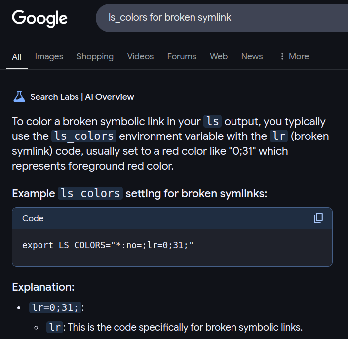

# Braindump
id:: 67760c3e-2ed3-4b91-9698-8dea6913e419
	- ((6651ecba-793d-43c5-8020-a9f260b032d8)) This is the ((6667bf32-ab6a-4d64-842d-45d49137e694)) place for ((66536578-c4d3-43f1-b35c-bf71120f0570)) as well as the store of recent braindumps.
	- ## Braindump History
	  collapsed:: true
		- ((67760c3e-10a7-4621-8623-383f44bdaf3c))
	- ## 2025 Braindumps
	  id:: 67760c3e-10a7-4621-8623-383f44bdaf3c
		- ### January
		  id:: 677e7eda-0c5e-413a-8c08-3a1d39352ba9
		  collapsed:: true
			- this [refactoring](((67710747-2982-4134-875e-3b715313db87))) itself is more complicated than i thought!
			- just take a break, breathe, review...
			- i must close i eyes...
			- “master plan” & ((67760c43-58c6-40eb-b874-40afae448966))
			  id:: 677e7fdb-6da2-47b6-8a07-2de0f1216881
			  collapsed:: true
				- the “master plan” should be split into the spatial ((67760c43-58c6-40eb-b874-40afae448966)), and the temporal ((6651adea-e1ed-4884-93eb-5ebd6086b62b)) list
				- what's the structure of Mind Map?
				  :LOGBOOK:
				  CLOCK: [2025-01-02 Thu 16:14:37]
				  :END:
					- its roots are the problems and questions
				- [!] the right sidebar now is very lagging
				- i've just got a walk outside, wandering around
					- in a silent space, i could zoom out deep into the mind to see meta-info
					- [!] the braindumping texts didn't show the overall image!!
						- for an overview, the most thing can be done with text is to fold them up... that's why i still use folding blocks in Braindumping.
				- any block (task, issue, quesion) should start in context
					- then it will be moved out when it's grown big
				- look into the Problems & Questions in Mind Map, i want to sort and clean them up!
					- luckily, they are not to much!
				- How should the braindumps be flushed?
					- some things should be retained!
					- the old braindumps should be reviewed and restructured before being flushed
				- currently, there are 2 ends about the Mind Map, closing the effect circle
					- forward end: the urge to design it properly
					- backward end: some questions arised and should be placed into the Mind Map itself
						- [?] why is the central Mind Map required?
						- [?] why a strong urge to design it no matter how unclear it is?
			- [?] a recurrent task as a reminder
			  id:: 677681e5-6322-4925-8923-19cd791cfe15
			  collapsed:: true
				- Get back to COMPANY WORK!
				  id:: 67768438-13eb-43f7-abdd-2759d9b7f616
				  DEADLINE:: <2025-01-04 Sat 10:04>
				  SCHEDULED: <2025-01-03 Fri 19:21 .+1h>
				- No style change after deadline!
				- So i must use others, e.g. [query](((677689e6-7163-4e94-ab65-18d3f51e3eb9)))
				  :LOGBOOK:
				  CLOCK: [2025-01-03 Fri 09:20:54]
				  CLOCK: [2025-01-03 Fri 09:21:08]
				  :END:
				- ((677750e2-4074-40d7-8fba-50122aa29c58))
				- [!] even at this dead end, i still have a strong urge to penetrate it... e.g. with custom property and somehow to convert between HHMMSS and `time-ms` 😕
					- custom property
					  deadline:: <2025-01-04 Sat 10:04>
					  id:: 677757bc-227a-47c2-abeb-7957d61824cc
					- just missing a way to convert this property from/to `time-ms`
					- `/Current time` = 10:32
				- DONE use both: `scheduled::` for warning (yellow), and `deadline::` for error (red)
				  :LOGBOOK:
				  CLOCK: [2025-01-06 Mon 19:26:29]--[2025-01-06 Mon 22:41:27] =>  03:14:58
				  :END:
				- ((677bfb6a-cba7-4a55-9d0d-43255445e280))
			- Get back to company work, now 13:11
			  id:: 67777f4e-49a9-4537-86da-be69f87918a7
			  :LOGBOOK:
			  CLOCK: [2025-01-03 Fri 13:14:16]
			  :END:
			- sleepy meditating...
			  id:: 677cc7d2-02f7-4ad9-801c-3079237ed465
			  collapsed:: true
				- at noon, on the way to company, seeing the karma as the momentum accumulated in our bodies pushing us, making us rush... i want to put all them down... but i also know that nothing can completely stop, the motion just curls inward...
				- sitting down the chair, i relax and release my mind, then falling asleep.
				- 2 straight hours sleepy meditation, from 13:00 to 15:00, then half an hour ujjayi breathing
			- Let's sum up these days with the first story in 2025: ((677e2745-6664-407e-ab5f-3c18319e2e6b))
			- ((67760c43-58c6-40eb-b874-40afae448966)): just sow the seed and throw dirt on it!
			  collapsed:: true
				- the seed is the ((66b1cfa4-01ef-4ee8-9409-32c9884c39cd)) = intentional cause = "final cause" in [4 causes by Aristotle](https://en.wikipedia.org/wiki/Four_causes)
				  id:: 677e6f51-6670-497b-8697-05b9e057a0ff
				- dirts are thrown into ((6651adea-46e0-40ea-8fc4-3ef394068b0f)) and ((6651adea-f2f6-4c9e-80b4-ece0bb5038fb))
				- but just like these hours, the organizing of the dirts upon the tree developed from the seed is demanding...
			- About the term ⟪ ((667bef22-b272-4a7d-b613-3f1ed1a47329)) ⟫
			  collapsed:: true
				- causal chain, cause-and-effect chain (CEC), chain of causation
				- chain of causation [十二因縁] (, [dependent origination](https://en.wikipedia.org/wiki/Prat%C4%ABtyasamutp%C4%81da) principle)
					- twelve links of Dependent Origination are called either by dvādaśa-hetupratyaya [十二因縁] or dvādaśa-nidānāni
				- cause: affect, reference (carry back to the origin) <> effect (act out)
				- effect: impact, impression, infection
			- Just another whole day consumed into the edit of ((667bef22-b272-4a7d-b613-3f1ed1a47329))
			  collapsed:: true
				- ((6780bc66-29b3-43f7-b577-698bae51aadf))
				- broken plan: i wanted to do the company work of "locking build-deploy"
			- i've just had brief nap (just relaxed not really slept) and realized:
			  collapsed:: true
				- even when the editing work finished, i didn't want to switch to company work...
				- observing the feeling, i see ... because there's still a pending quest(ion) from last night:
					- > the nature of wave propagation
					- from this discussion: ((6780bc09-6c98-42ed-bbd1-ff940c2a1d10))
					- TODO  = wave propagation = traversing of the ((675c03d8-3185-41a8-9f98-e869fabec793)) by itself = fundamental operation in Unithread
					  :LOGBOOK:
					  CLOCK: [2025-01-10 Fri 18:35:42]
					  :END:
			- Here, we're witnessing the branching from ⟪ ((67714850-43c0-4c7f-8b50-838e014b06e0)) ⟫ to...
			  collapsed:: true
				- ((67710747-2982-4134-875e-3b715313db87))
				- ((67715d03-9dbc-42b0-8589-064396a9c52b))
					- ((677e7fdb-6da2-47b6-8a07-2de0f1216881))
				- ((677681e5-6322-4925-8923-19cd791cfe15))
					- ((677e7099-5dfc-43f4-8db0-67189cf8ef74))
				- ((677e6f51-6670-497b-8697-05b9e057a0ff))
					- ((677fca96-1e71-4af7-9a99-1c751d145358))
						- ((677fcaba-d2ca-4afd-9698-b33255a774e0))
						- ⇒ ((67810b96-586f-49fc-a26e-8ea4139b5816))
				- refine the ((667bef22-b272-4a7d-b613-3f1ed1a47329))
				  id:: 67810b96-586f-49fc-a26e-8ea4139b5816
					- ((677f9ae2-f7bc-47a7-a7e3-4dda29d9d834))
					- ((6780bc66-29b3-43f7-b577-698bae51aadf))
				- This very problem of task branching is the “[problem of duck dive](((67714850-43c0-4c7f-8b50-838e014b06e0)))” and the cause of the whole lot of these works themselves: refactor, design “master plan” & “Mind Map”, etc.!
					- It's really a trek in the jungle!
			- i was sucked into 2 other stories when reading my CreatZy Notes
				- ((6783cfaa-7181-45d0-a9e3-428aa89cf5e3))
				- ((67445223-9459-4aa9-b102-70c63943577b))
			- i want to write today's story, ((67836ec6-0e46-4a3f-80d9-b27476d12095)), but too sleepy... just take a nap!
			  id:: 6784871c-20b5-4ecc-ab02-70b4542690db
			- on the way to company, i see “[the last frontier](((67836ec6-0e46-4a3f-80d9-b27476d12095)))” is the ((66ab6f84-88ba-4660-b4b7-f6dcbdd58a4f))ness both in theory and in practical quest for my liberation.
				- I was sucked into various  technical details of [trans](((67849429-a90c-45a9-a6ae-dcdd61f7580f))) and [itch](((0f9f9026-152c-46b5-964b-c6e1019cc584))).
				- Only after stepping back from these details, do i remember the main point: ((6784f2aa-357a-44ed-a8c6-5ed1b9c78b04))
			- Now, switch to the a simpler task left from previous days: ((677e7099-5dfc-43f4-8db0-67189cf8ef74))
			- Let's write down the story “ ((678512dc-66ef-4ba9-aebb-0355d89ef38b)) ”
			  id:: 67b541c7-e878-4b22-ab06-6f25418f3a9e
			  :LOGBOOK:
			  CLOCK: [2025-01-14 Tue 13:03:11]
			  :END:
			- Getting back to the computer, seeing the lot of screenshots of the [chat with Gemini](((6784fe18-6dfb-43a2-b74a-a96b9f26fc77)))...
			  id:: 67b541d8-9fb1-4edc-80e5-4e9f3c59fb7c
			  :LOGBOOK:
			  CLOCK: [2025-01-14 Tue 14:36:10]
			  :END:
				- seeing the order is wrong, i inteded to rename them with additional semantics...
				- but i just stopped, seeing many times previously when i did such a thing...
				- what should i do?! 🤔
				- re-evaluate it, estimate the time for it...
				- it's ok, just do it.
				- got it done, eventually!
				  id:: 67b541d8-78ff-4a9b-b9b4-98fd3e041385
			- now, get back to company work!
			  id:: 67b541c7-955e-4aa5-846c-474e90e47205
			  :LOGBOOK:
			  CLOCK: [2025-01-14 Tue 16:44:53]
			  :END:
			- Try using both instances of Logseq in parallel
				- Flatpak instance for ((666baccf-6be1-4b9a-b186-f883ea04daf1))
				- Snap instance for company work
				  collapsed:: true
					- This note has simpler task structure ⇒ only `WIPs` is enough.
					- All braindumping will be done here, in `UniinfoNotes` instead.
				- DONE It seems OK!
				  :LOGBOOK:
				  CLOCK: [2025-01-16 Thu 16:57:45]
				  CLOCK: [2025-01-16 Thu 16:57:46]--[2025-01-16 Thu 16:57:54] =>  00:00:08
				  :END:
			- ((6788f0ae-773b-4da2-87f5-c6552d76a00c))
			- [?] How to highlight hard links for `ls --color=auto`
				- ((678a4f10-b109-429d-9c58-f9bd52f807cd))
			- ((678b7762-1187-4330-93cb-7a62e14467a8))
			- Here, we're witnessing the development and transmigration of the [transcycling](((678b7762-1187-4330-93cb-7a62e14467a8))):
			  id:: 67aabd5c-3d5e-4f0a-be33-5171520abe62
			  collapsed:: true
				- First drafted in ((db954501-95d0-46e2-b1fc-39b6a966300e))
				- Then moved to ((67763a41-4ad6-449f-9d9b-d63ce417082c)), due to the discussion with Copilot inside.
				- Now, moves to ((67760e05-2ea1-4f0e-aaa6-158edca80df5)), due to its wide contents.
				- And it leads to the formal formulation of “transcycle” whose location is [still being considerd...](((678dbff1-19ea-47c5-8794-2638d53ee7dd)))
			- Here, we're witnessing the deep dive into the abyss of ((6793437b-5ee5-4f7f-a547-bb9e15ac5883))
			  id:: 67aabd5c-5732-414d-9f4d-180d420a8d69
			  collapsed:: true
			  :LOGBOOK:
			  CLOCK: [2025-01-24 Fri 19:43:06]--[2025-01-24 Fri 20:03:22] =>  00:20:16
			  :END:
				- From the [unintended conflicts](((ed8333ef-b3b6-4d1b-a5e7-3a2fb4e1b286))) in `python_deploy/java/constant.py`, i thought that it will "always conflict" with any other changes in that file, which is a serious problem. This doubt was partially due to Mr. Toanh's complaint earlier about such issue.
				  id:: 67938b35-697e-432f-b179-17ce60028e6c
				- I checked for expression of the last newline [in various editors](((616bfc2b-05f2-4a85-a094-dd771aa12cd1))).
				- In an effort to [refactor codes](((b8c17a55-f618-43ed-9826-314412a08965))), i reviewed and documented various Linux commands: ((679085ef-facd-4c4a-83f3-f32bdefbaa49)), ((6790a3e2-3f65-42d0-9253-35b6672d8b25))
					- But at last, i just asked Copilot to have a quick answer, and it gave me the [correct one](((577c2916-d4ca-461d-85b9-f3b2ff7e6b30))).
				- Today, experimenting with my local git repo for testing, eventually, the problem has turned out to be not so serious as [i thought](((67938b35-697e-432f-b179-17ce60028e6c)))!
				  id:: 67aabd5c-797c-42dc-92c2-360d3149ee64
					- It just causes **unintended conflicts**, not "~~perpetual conflicts~~"!
				- ⇒ Instead of forcing IDEs to automatically add newlines, just do the other way: ((67aacbe5-f534-4eac-abe8-15f2f8990691))
				  :LOGBOOK:
				  CLOCK: [2025-02-11 Tue 12:07:08]
				  :END:
		- ### February
		  id:: 67aac38f-1c60-42e9-a8c5-c262d11a82f0
		  collapsed:: true
			- We're witnessing the [braindumping](((db954501-95d0-46e2-b1fc-39b6a966300e))) and [current stories](((6788f004-d3df-41d4-afc8-c8c5ea52c51c))) and [current stasks](((677630fe-ea99-436f-b39f-8bd2295e2eaf))) stacking up!
			  id:: 67aabd5c-5846-4b6d-84bd-8be5034dd958
			  collapsed:: true
				- Too many unfinished stuffs!
				  id:: 67a5cfdd-d3b3-491b-a7ba-febdc09dca95
					- ((678dbff1-19ea-47c5-8794-2638d53ee7dd))
					- ((678df0f0-20d2-4995-bfc2-0b953970469d))
					- ((67938fc1-3094-4558-bc88-07b68ff64298))
					- ((67a035a8-f826-4b89-8eb4-3d2cd679dd1f))
					- ((67a5d049-d7a3-4a23-baa6-5261a409c694))
					- ((67764f3d-c6b3-4f00-a53f-ec4dab0920f9))
					- ((6772a6c7-f434-4911-9fa2-939b8db20c42))
				- This is the very common theme in my life, but undocumented until now.
				- Switching from depth-first traversal ([duck dive](((67714850-43c0-4c7f-8b50-838e014b06e0)))) to breadth-first traversal has resulted in ((67a5cfdd-d3b3-491b-a7ba-febdc09dca95))
				  id:: 67a5d140-31e4-451d-a8ea-33fa6927ce99
					- This ***fragmentation*** is what i've been scared of due to my ((6678d594-9819-4624-abd6-d4ec62b3874f)).
					- This problem has been foreseen long ago but no solution has been found.
					- With the help of this documenation & task tracking system, i hope that we can find some way to deal with it!
				- DONE Now, i'm sorting & wrapping them up...
				  id:: 67a5dcde-4189-4626-8396-61577b6906a4
				  :LOGBOOK:
				  CLOCK: [2025-02-07 Fri 17:14:16]--[2025-02-10 Mon 13:01:41] =>  67:47:25
				  :END:
					- Today, Feb 10th, The last 2 items have been far away in my mind:
						- Nearer thanks to documented contents and a long time focusing on it before: ((678dbff1-19ea-47c5-8794-2638d53ee7dd))
							- DONE So, i'm resolving this first.
							  :LOGBOOK:
							  CLOCK: [2025-02-10 Mon 11:34:28]
							  CLOCK: [2025-02-10 Mon 11:34:31]--[2025-02-10 Mon 13:00:52] =>  01:26:21
							  :END:
						- Farther, no docs, no concrete "story" remaining in my mind, just the general ideas of it: ((678df0f0-20d2-4995-bfc2-0b953970469d))
							- And leave this in Brainstorming.
			- In the course of trying various LLMs, i'm touching various parts of Unïnfo begging for updates...
			  id:: 67a035a8-f826-4b89-8eb4-3d2cd679dd1f
			  collapsed:: true
			  :LOGBOOK:
			  CLOCK: [2025-02-04 Tue 10:12:30]
			  :END:
				- I'm seeing a dense jungle ahead...
					- Updating these terms must take time...
					- In my history, such blooming of ideas has had me bogged down a lot.
				- But i don't want to loose these ideas... so maybe just litter them with `TODO`s... or separate them into brainstorms....?!
				- Team leader Quân has just visited asking for Tết holiday and my work 😁!
				- Today, 6 days after [the first braindump](((67a035a8-f826-4b89-8eb4-3d2cd679dd1f))), i've done trying various LLMs with a brief of ((67a5fae8-8e1d-4dd6-818d-a8462f6b54db)).
				  :LOGBOOK:
				  CLOCK: [2025-02-10 Mon 09:57:06]
				  CLOCK: [2025-02-10 Mon 09:57:09]--[2025-02-10 Mon 10:00:23] =>  00:03:14
				  :END:
				- The "various parts of Unïnfo begging for updates" have been gone far from my mind...
				- So just flush this braindump away, now!
			- [?] Where should i place this basic operation of [transcycling](((678b7762-1187-4330-93cb-7a62e14467a8)))?
			  id:: 678dbff1-19ea-47c5-8794-2638d53ee7dd
				- ⇒ Put it in ((67a963d9-e7d3-4e46-a608-24059d730f4a))
			- ((67a5dcde-4189-4626-8396-61577b6906a4))
			  id:: 67a5dd00-f5cf-4e51-9ea1-2fea15d3595a
			- Now, i'm wrapping the WIPs up for [a big merge commit](((67164cc1-e500-4889-9b6d-12d8dd7fc029))): `Various stuffs all over the place: Technical stuffs, Unïnfo, Life stories`
			  collapsed:: true
				- in `log`: `302bec3f`
				- in `main`: `6d48b4b3`
				- published in `gh-pages`: `81c9e3b8`
			- Oh i've forgotten that we've been in February
			  :LOGBOOK:
			  CLOCK: [2025-02-11 Tue 10:32:17]
			  :END:
			  ⇒ Just cut some braindumps into ((67aac38f-1c60-42e9-a8c5-c262d11a82f0)) (February block is at the same level with ((db954501-95d0-46e2-b1fc-39b6a966300e)))
			  ⇒ Put ((677e7eda-0c5e-413a-8c08-3a1d39352ba9)) into ((67760c3e-10a7-4621-8623-383f44bdaf3c))
			- Let's remember to add date into braindumps using `/Today`, like “Tue, 2025/02/11”, as well as timestamp it with `Alt` `Enter`
			  id:: 67aac5fc-3591-43a1-a283-f51620f8035e
			  :LOGBOOK:
			  CLOCK: [2025-02-11 Tue 10:38:38]
			  :END:
			- ((678e1c3f-6202-45aa-8527-f4bdad9927b9))... is object or subject?!
			  id:: 67ac4f62-3411-4c88-8d4c-3fc2e6c78258
				- Done with some helps from Copilot & Google Search's Gemini: ((67ac5dfc-2224-4261-a5d2-52def30c3cba))
			- [!] The ((66fce880-77a2-41f7-8bdb-a86b7fc6fc77)) usually fails due to invisible spaces in the keywords
			  id:: 67ac4f68-8af4-4886-9183-85de0039250c
			  collapsed:: true
			  :LOGBOOK:
			  CLOCK: [2025-02-13 Thu 09:09:51]
			  :END:
				- We should not ~~trim spaces~~ from keywords because sometimes they are intentional.
				  collapsed:: true
				- We should have some **delimiters** around them!
				- ((67ad537f-9a22-4079-b8d1-352b4c567278))
			- [!] Leaving tasks as `TODO` is so difficult for me...
			  id:: 67b541c7-9547-4964-b19d-c873af1b3f4e
			  collapsed:: true
			  :LOGBOOK:
			  CLOCK: [2025-02-13 Thu 09:09:57]
			  :END:
				- There's a strong force sucking me deep into these tasks...
				- ⇒ ((6772a6c7-f434-4911-9fa2-939b8db20c42))
				- ⇒ I'm overcoming it by stop-breathe-relax-redirect, then mark `TODO` for this task: ((67ad537f-9a22-4079-b8d1-352b4c567278))
				- But still... i've been sucked into Add ((67ad9184-d0e9-49c1-9584-ac7ced51b385)) to Linux from 9:00 until now 18:21 = 9.5 hours, just because i **didn't think it complicated**!!!
				  :LOGBOOK:
				  CLOCK: [2025-02-13 Thu 18:18:12]
				  CLOCK: [2025-02-13 Thu 18:20:46]
				  :END:
					- While working with the project Pre.Env. for company, i saw a broken symlink not hilited as normal.
					- Then i [searched for `LS_COLORS`](((67ac4f68-8af4-4886-9183-85de0039250c))) but failed due to a trailing space.
					- I thought it was just a very simple task, just "going to be done now!"
					- So, i didn't even bother to track that task!
					- Chatted with Copilot, searched all over the place,... it's turned out to be not so simple at all!
					- LLMs like Copilot and Google Search AI are helpful but have many hallucinations & delutions.
						- Google Search AI invented `lr` code for "broken symlink"
						  collapsed:: true
							- 
						- Respone to Copilot's hallucination: I've searched myself and see `ca` = `CAPABILITY` not `FILECAP`, `rs` = `RESET` not `NORMAL`, as shown in this [stackexchange](https://unix.stackexchange.com/a/70715/566548)
						- Copilot was obssesed with that GitHub gist so much that you place [that link](https://gist.github.com/thomd/7667642) to the "StackExchange discussion" text! 🙁
			- I feel there's a need to tighten my constraint (giới), not only refraining from social network & media, but also from my Uniinfo theory, in order to finish my promise with boss Đạt.
			  id:: 67b2d619-7ce1-42c5-a331-5d35f0d8f35b
			  collapsed:: true
			  :LOGBOOK:
			  CLOCK: [2025-02-17 Mon 19:36:32]
			  :END:
				- For the theory, maybe i need to litter the UniinfoNotes up with brainstorms and braindumps for whatever i see on the way.
				- I've just finished a remaining task in the company work (`lock.sh` for `python_deploy`)
				  :LOGBOOK:
				  CLOCK: [2025-02-17 Mon 19:36:40]
				  :END:
				  → then i just turned out to check Telegram for any reply from Mr. Huy in [the last chat](((67b2f947-69cb-4183-a99d-204c0beb6dcc))).
				  → then i just attempted check YoutTube for the current status of [monk group of master Minh Tue](((67a5faa3-c64c-48f7-8b3f-a5311714110f)))... but i just stopped right at the time i realized this attempt.
				- Let's keep refraining... it's not hard anyway!
			- [!] Logseq Publish with shallow copy issue: When copying a block out to a publish page, its local block refs are still pointing to sub-blocks of the original block.
			  collapsed:: true
			  :LOGBOOK:
			  CLOCK: [2025-02-18 Tue 14:05:25]
			  :END:
				- Maybe we must write a plugin `deep copy`!
					- detect local block refs in the source block
					- add `id::` to these target sub-blocks in the result block
					- replace block refs with these new UUIDs.
			- Just wrapped up docs of "update `python_deploy/java`"
			  collapsed:: true
			  :LOGBOOK:
			  CLOCK: [2025-02-18 Tue 16:24:29]
			  :END:
				- It costed so long time!
				- Now, start dealing with `sgapi`
					- But before starting, let's have a brief meditation...
					- that meditation is so good with relax, release through deep yawns.
					- Now, 18:26, half an hour has past my schedule of leaving work at HTV to work for UTS, due to the ongoing work of many different hosts in `sgapi`.
					  :LOGBOOK:
					  CLOCK: [2025-02-18 Tue 18:26:28]
					  CLOCK: [2025-02-18 Tue 18:26:31]--[2025-02-18 Tue 18:28:50] =>  00:02:19
					  :END:
				- Just leave HTV now, 18:29.
				  :LOGBOOK:
				  CLOCK: [2025-02-18 Tue 18:29:57]
				  :END:
				- And has just arrived at UTS now, 19:04.
				- Let's keep this state of vacancy! 😊
			- Thanks to BeowulfBuildModDocs' LogseqNotes, now i can recall the incompleted works from last year (3 months ago, from 2024-12-08)
			  collapsed:: true
			  :LOGBOOK:
			  CLOCK: [2025-02-18 Tue 19:11:36]
			  :END:
				- But my back hurts... so just lie down a little bit...
				- After messing with tangled deps in `quickom-node-core-v3`, i resorted to build LamHai's `dev` branch... successfully.
				- So just `cherry-pick` the last commit from `prod` into that branch, instead of creating new `dev` branch from `prod`.
			- Feb 19, after a morning walk and meditation beside the river, let's write down the story of ((67b54432-861a-415e-a7ee-45a3f75bdc7a))
			  id:: 67b54af3-2ccd-4814-ab89-ef85bed9f79b
			  collapsed:: true
			  :LOGBOOK:
			  CLOCK: [2025-02-19 Wed 10:26:06]
			  :END:
				- These 3 levels of abstraction have just been done while writing it down: first the [brainstorm](((67b54283-14b2-4753-94bb-4d827d54d7cc))), then the [story](((67b54432-861a-415e-a7ee-45a3f75bdc7a))), and last this [braindump](((67b54af3-2ccd-4814-ab89-ef85bed9f79b)))
				- This has taken the whole morning, including more than 1 hour walking, now 11:29, i'm going to have lunch 😊
				  id:: 67b55dda-7840-4691-9e72-0e025e17dc4d
				  :LOGBOOK:
				  CLOCK: [2025-02-19 Wed 11:30:10]
				  :END:
			- I've just added `padding-bottom` style to [markdown-watcher.js](../assets/HTML/markdown-watcher.js) so that when clicking a ref of a block at the end of page, we can jump to that block, instead of stopping short above.
			  collapsed:: true
				- From [superuser](https://superuser.com/a/872654/2425618)
				  ```css
				  html {
				    height: auto !important;
				    padding-bottom: 100vh !important;
				  }
				  ```
				  added to `load(){if(renderChoice.value=='html')}`
			- Feb 19, 21:11, I've just fixed deps in `quickom-node-core-v3/dev` for successful build 😊
			  :LOGBOOK:
			  CLOCK: [2025-02-19 Wed 21:11:30]
			  :END:
			- Yesterday, Feb 24, i wrote ((67b81e1b-b801-4e5a-9c00-98e51158712a)) as brainstorm, but now, i move it to ((6651e92e-fb34-4d24-a386-d9698c2e93f7)) because it's been rather complete.
			  collapsed:: true
			  :LOGBOOK:
			  CLOCK: [2025-02-22 Sat 20:16:37]
			  :END:
				- This unintended work was triggered from the old post [The Reduced Halting Problem](https://creatzyitnotes.blogspot.com/2009/10/reduced-halting-problem.html), which i met when trying to ((67b989a4-a041-4511-abe5-77c785ca2d67))
			- I've just added duals of wave-particle, plant-animal, ((94e87dc9-71af-477c-aa70-0f448c2f1e20)) to the [EffectCircle Diagram](((67b183f5-dba7-4a11-8a72-3c619e3709ea))).
			  id:: 67bacb04-7c5c-4004-96b9-2ee237878ce6
			  collapsed:: true
			  :LOGBOOK:
			  CLOCK: [2025-02-23 Sun 16:25:44]
			  :END:
				- also added spatial components: distribution, density, curvature.
					- Oh, my recent addition of “spatial distribution” to the dynamic circle is just a recurrence: In [a comment on DynamicsPyramid](((67baf71f-a1dc-4f9e-b62b-f150d7ced6b0))), i did clearly wrote “... distribute energy, thus 'energy field'”.
				- and moved contents of [a previous brainstorm](((67b5c778-71d6-4f58-9dd4-36a719bd85f0))) to ((67b183f5-1cca-4473-917e-60c644dd5466)).
				  :LOGBOOK:
				  CLOCK: [2025-02-23 Sun 16:50:30]
				  :END:
				- Where should i place the [DynamicsPyramid Diagram](https://docs.google.com/drawings/d/18PRcRgeFegJ9NEnQwJLdd1LsROhQKDJIA1I0NMMHl_o/)?
					- OK, now just (temporarily) put it right inside the dynamic circle!
					- And drop an entry of [its story](((67baf8fc-0343-4586-9a45-219052a747c9))) down.
			- Let's put down ((67bb3a7a-27a9-42f0-a40b-9b8293103524)), so that i can switch to finish the work for boss William.
			  :LOGBOOK:
			  CLOCK: [2025-02-23 Sun 17:55:32]
			  :END:
			- When writing some long descriptions of “dynamical system” vs. “dynamic system”, i'm struck by this:
			  id:: 67bd4a6a-4385-4d45-8146-7c6e53fe77b7
			  :LOGBOOK:
			  CLOCK: [2025-02-25 Tue 11:45:17]
			  :END:
			  ((67bd4966-a768-46b9-b947-fac1273be081))
				- Let's rephrase the construction “consider as” in [[FoC]].
			- From the [conservation of curvature](((67bbde65-182a-4e2d-bdde-acf9b5ec124f))), from yesterday night to today morning, i've been contemplating the curvature & straightness (linearity) and see a long road ahead... Maybe i should start from an entry of ((67bc1f83-d9c4-4ee0-ac61-0de196425208)) in the Mind Jungle.
			  id:: 67bbe327-6899-4909-868d-4951b6b28685
			  collapsed:: true
				- I just remember [my formula of curvature ](((67bc5689-d4f1-4136-b775-92847ddd02f8))) $c = dφ/ds$ from high school 9th or 10th grade. There, i used the symbol $c$ for both English “curve” and Vietnamese “cong”. I'd thought that it was my "new concept" until i saw the definition of $κ = 1/r$ in some book.
				- The intrinsic curvature of the thread, as the 2nd derivative of the [distribution of space](((67bda37c-7085-4a71-b5bf-6c4b54b3abdd))) on the line, is different from the extrinsic curvature of the line $κ = 1/r$.
					- While the thread's distribution of space is simple, ((67bdb94a-e172-43f9-a59e-a97756fef1f4))
				- Note: the [emergence of negativity & imaginarity](((67bbde62-70fc-4d3d-9f65-dcea280db516))) was a rediscovery when i contemplated the spring (elastic) mechanics & `exp()`, as a note on Telegram on 2023 Feb 21st.
				  collapsed:: true
					- #+BEGIN_QUOTE
					  **Holistic momentum** = const-sized (mc^2) vector = momentum vector (in space) + energy vector (= momentum in time)
					  - **i=√-1 derived from dynamics**: velocity reflected at the wall must pass through 0 but total momentum is preserved => the whole momentum vector must pokes out of space dimension => space × momentum = phase space:
					    + The eigenvector of diff is exp() => extended to phase space: x' = p & p' = x => x'' = x =>  √1 = negative (opposite) unit «-1»; x' = -p & p' = x => x'' = -x =>  √-1 = imaginary (internal, intensive) unit «i»;
					    + The loop of derivatives in phase space complex plane contains 4 units (+1, +i, -1, -i), ie. x'''' = x => to be extended to quaternion
					  - the momentum dimension p in phase space is the folded (intensified) of time => spacetime = extended phase space => energy = momentum in time => force = curvature = density of energy = tightness of circle = how much motion in time
					    + Pythagorean theorem <== circle in phase space ==> everything is circle
					  
					  
					  Differentials (high order) = orthogonal radix numerals = Turing machine vs uninet = holographic numerals = diagonal multimodular numerals (RNS & continued fraction)
					  ==> this defines the computation inside the Quantum => geometry => physical laws
					  #+END_QUOTE
				- It's interesting that when searching for "circle of dynamic[s]", [Google Search AI declares](((67bd76db-a523-415e-8d4d-812593779ceb))) "circle of dynamic" to be “a conceptual model” and "circle of dynamics" to be “a concept in mathematics”, as if they're already established terms... but i think it's just an AI hallucination!
		- ### March
		  id:: 67eb5e0b-e1a2-4e31-aeac-fe1b14f17662
		  collapsed:: true
			- DONE Add [Textile](https://en.wikipedia.org/wiki/Textile_(markup_language) "Textile (markup language)") to ~~both UniinfoNotes &~~ HTV's logseq-notes
			  collapsed:: true
			  :LOGBOOK:
			  CLOCK: [2025-03-05 Wed 17:19:32]
			  CLOCK: [2025-03-05 Wed 17:19:34]--[2025-03-05 Wed 17:20:19] =>  00:00:45
			  :END:
				- Only add an external link to `Redmine working process`: [Textile formatting](https://www.redmine.org/projects/redmine/wiki/RedmineTextFormattingTextile)
			- [!?] markdown-watcher: sometimes, anchor links become ineffective, but i still don't know why!
			- Update ((66600918-8c61-42af-b8a2-04bf05e9f782))
			  id:: 67c97ba4-7e89-4e53-b531-4eb12e6c1580
			  collapsed:: true
			  :LOGBOOK:
			  CLOCK: [2025-03-06 Thu 17:42:08]
			  :END:
				- I've just added another exception for smart quoting function: `replaceQuotes()`'s possessive exception
				- Let's parametrize `LogseqApiEndpoint` in [LogseqGet.html](((6675860a-c135-4a92-b4fe-206ebde974ff))) (`LogseqUtils.js`) because now 2 servers are running in parallel at 2 ports: UniinfoNotes @ 12315 (default), HTV's logseq-notes @ 12345.
				  :LOGBOOK:
				  CLOCK: [2025-03-06 Thu 17:42:54]
				  :END:
				- I've just designed the overall flow for [updating block refs in Logseq publish](((67b541cf-618d-4607-bdd4-e1afcc8ce70c)))
			- Let's write ((67ce5a8c-4885-4aaf-9215-60460717ae44)) 😜
			  id:: 67ce5aad-3eda-403f-8860-bd1ce8e6a007
			- While chatting with Copilot, i happened to know that ((67cea2ee-5f77-4576-8c1c-9e31d9b822c9))!
			  id:: 67cea427-2865-4cba-98ec-58b0cf779682
			  :LOGBOOK:
			  CLOCK: [2025-03-10 Mon 15:35:44]
			  :END:
			- From the [triads](((67cea2ee-5f77-4576-8c1c-9e31d9b822c9))) yesterday, this morning, i've contemplated about my problem of [rigidity/inertia/momentum](((67b541cf-4818-45ad-911c-d2c3397f9e3d))).
			  id:: 67cfa71c-da0f-4ebb-b390-8c89870711b9
			  :LOGBOOK:
			  CLOCK: [2025-03-11 Tue 10:00:17]
			  :END:
			- Let's write down the story this morning: ((67d1132a-dc48-42f2-80ad-b99853be907b))
			  id:: 67d1149e-6084-48ed-886b-39dc6e4640e9
			  :LOGBOOK:
			  CLOCK: [2025-03-12 Wed 11:59:43]
			  :END:
			- Google suggested me some ((67d184fe-6e61-46ed-ae70-2217cd068ee3))
			  id:: 67d1889d-c9ee-4252-8167-253dfff80ce4
			  :LOGBOOK:
			  CLOCK: [2025-03-12 Wed 20:16:30]
			  :END:
			- Done revising ((67d10c06-3fe3-4691-95c0-84278a2dc713))
			  id:: 67d2a713-9762-450a-b7e2-e414c0cb6069
			  :LOGBOOK:
			  CLOCK: [2025-03-13 Thu 16:36:20]
			  CLOCK: [2025-03-13 Thu 16:36:29]
			  :END:
			- Let's write the ongoing story of ((67dcc012-44d3-4041-b17a-0ef201b3ff6c)).
			  :LOGBOOK:
			  CLOCK: [2025-03-21 Fri 08:28:14]
			  :END:
		- ### April
		  id:: 67eb5f0b-6328-4b14-9425-a58a3b6718ca
		  collapsed:: true
			- Let's ((67eb65bc-78a4-4e6d-8a3c-dcc171b71235))
			  :LOGBOOK:
			  CLOCK: [2025-04-01 Tue 11:05:50]
			  :END:
				- But first, it's taken a long time for me to update ((67d2ad10-0ca8-4361-94d5-219cf9b737d5)) and [GNOME icons](((67eb7601-ab2c-41df-a42c-84a77a88ec08))). There i installed `Icon Browser` (not GTK+ Icon Browser) to check the current icons used by the system.
			- Just write down the story last weekends & festival: ((67f4c7e0-7de0-48c4-83fd-4b994960efba))
			  :LOGBOOK:
			  CLOCK: [2025-04-08 Tue 13:58:12]
			  CLOCK: [2025-04-08 Tue 13:58:20]
			  :END:
			- From this issue: ((67f50958-c8c9-4c11-943d-5efca5b7f12f))
			  id:: 67f509e1-525d-4d74-9b5a-b40367cd1b72
			  collapsed:: true
			  :LOGBOOK:
			  CLOCK: [2025-04-08 Tue 18:41:02]
			  :END:
				- Let's try moving `67f4f5e3-e739-41cd-8b95-14c7bbe9eebe` from Logseq's ((67f4eaf0-f9c3-4257-a221-eccf0e92535d)) to [[Linux]]'s ((67f4ffe3-488c-4d61-9622-26ecbed945ac)).
				  :LOGBOOK:
				  CLOCK: [2025-04-08 Tue 17:55:16]
				  :END:
					- ⇒ No issue with both `gnome-session-quit --reboot` and `reboot`.
			- DONE Let's add task `Punch out, NOW!` at 17:30
			  collapsed:: true
			  :LOGBOOK:
			  CLOCK: [2025-04-08 Tue 18:41:39]
			  CLOCK: [2025-04-08 Tue 18:42:00]--[2025-04-08 Tue 18:56:28] =>  00:14:28
			  :END:
				- ```crontab
				  33 17  *   * 1-5 DBUS_SESSION_BUS_ADDRESS=unix:path=/run/user/1001/bus /usr/bin/notify-send -u critical -i /home/dinhlx/Pictures/emblem-important.png 'Punch out, NOW!'
				  ```
				- Reason: Due to my habit of leaving office last, i forget punching out most of the time i leave early.
			- Sometimes, the [microsetting alarms](((67d10c06-3fe3-4691-95c0-84278a2dc713))) fire a lot while i was absent 
			  id:: 6835b162-09f7-4153-97a3-633f8a5c0980
			  collapsed:: true
			  :LOGBOOK:
			  CLOCK: [2025-04-09 Wed 09:02:17]
			  :END:
			  ⇒ Should kill them all then.
				- id:: 6835b162-b38e-43e5-a4cf-0ec54bb69328
				  ```sh
				  killall -9 -vr 'microreset.sh|zenity'
				  ```
				- or
				  ```sh
				  pkill -9 -ef 'microreset.sh|zenity'
				  ```
			- Add ((67f6185f-5efc-4fd0-b924-c175917092d8)) with ((67f61875-3740-45ce-ae88-1c5aed77435a))
			  collapsed:: true
			  :LOGBOOK:
			  CLOCK: [2025-04-09 Wed 14:58:05]
			  CLOCK: [2025-04-09 Wed 14:58:07]
			  :END:
				- Occation: i was confused again with the statement `export CATALINA_OPTS` in `skygserv/config/shell/setenv.sh`
				- Copilot helps me a lot here!
			- Add [[Database]] to share with work's `logseq-notes`.
			  id:: 680a0121-49fd-4fb7-875e-8ee8d3a2bafa
			  :LOGBOOK:
			  CLOCK: [2025-04-23 Wed 14:31:10]
			  :END:
			- After an abrupt machine shutdown due to power failure while [adding Database](((680a0121-49fd-4fb7-875e-8ee8d3a2bafa))), ((666baccf-6be1-4b9a-b186-f883ea04daf1))'s git repo was corrupt.
			  id:: 6808b04b-58b5-411e-982a-d79c62bafcde
			  collapsed:: true
			  :LOGBOOK:
			  CLOCK: [2025-04-23 Wed 16:18:07]
			  :END:
				- Thanks to Grok, i successfully recovered the git repo
				  id:: 6808b081-b35c-44a6-aefa-15fe3af2fee4
					- `fatal: bad object HEAD`: corrupted `.git/objects/04/1c7dfc7385af7a147458f0bc38b39c3d3d2d5e`
					  collapsed:: true
						- `fatal: loose object 041c7dfc7385af7a147458f0bc38b39c3d3d2d5e (stored in .git/objects/04/1c7dfc7385af7a147458f0bc38b39c3d3d2d5e) is corrupt`
						- `HEAD` → `refs/heads/log`: `041c7dfc7385af7a147458f0bc38b39c3d3d2d5e`
					- `git fsck --full --no-reflogs | grep "dangling commit" > dangling_commits.txt`
					- : extract dangling commit messages and sort by date time.
						- ```sh
						  #!/bin/bash
						  MSG_LS='dangling_commits.msg.txt'
						  MSG_LS_SORT='dangling_commits.msg.sort.txt'
						  while read -r line; do
						      sha=$(echo "$line" | awk '{print $3}')
						      echo "Checking commit $sha:"
						      commit=$(git show --no-patch --format='%ai|%H|%s' "$sha")
						      echo $commit | tee -a $MSG_LS
						  done < dangling_commits.txt
						  sort -r $MSG_LS > $MSG_LS_SORT
						  ```
					- `grep 2025-04 dangling_commits.msg.sort.txt` → `ee5ddfe6` at 2025-04-23 14:41:10
					  collapsed:: true
						- ```sh
						  2025-04-23 14:41:10 +0700|ee5ddfe6b4ced9f7ee51b47583d1309577267435|Auto saved by Logseq
						  2025-04-11 19:58:59 +0700|2dc208c3119d2c60f53185f5625f02684fcf8f14|[bak] 2025-04-11T12:58:59.047Z
						  2025-04-08 16:19:30 +0700|21e22c932b6cd0532edf0d087276ed20b7e00720|Auto saved by Logseq
						  2025-04-08 16:11:56 +0700|089c3742975eb43eb756c7c308aebc6c56dfceb4|Auto saved by Logseq
						  ```
					- `git reset --hard ee5ddfe6b4ced9f7ee51b47583d1309577267435`
					- Updated [Git Troupbleshooting](((6808b9c5-402d-4923-997b-7b8056f71dc8))).
					- Rechecking with `git fsck --full`, i see many dangling commits (due to many times rebasing), and may dangling blobs.
						- `git gc --prune=now` to clean them up so that they won't clutter `git fsck` output.
						- Note: to be safe, check these blobs beforehand
							- `git fsck --full | grep "dangling blob" > dangling_blobs.txt`
							- : Use `git cat-file` to check blob content.
				- Then also refactor [assets/Will/story/](../assets/Will/story/)YYYY-Mon/ → YYYY-MM
					- Previously, these asset folders YYYY-Mon are named after ((67760c3e-2ed3-4b91-9698-8dea6913e419))'s partitions by month names.
					- Now, rename them to month numbers for easy sort.
			- [/ʋ/ sound in South Vietnamese](((6809b3ac-8ea6-4cc8-8c79-8243a805a748))) leads to ((6809e1ea-1518-4460-be26-62881c47287f)).
			  :LOGBOOK:
			  CLOCK: [2025-04-24 Thu 14:01:22]
			  :END:
			- From many appearances of the word “argument” in ((67e3b3e4-66d6-4c72-92d1-faeef2cf2165)), let's [relate them all together](((680b6063-e454-4cf6-835e-d6f726b8b871)))!
			  :LOGBOOK:
			  CLOCK: [2025-04-25 Fri 17:15:29]
			  :END:
			- Walking back to the office from the morning riverside sitting, i felt an urge to write down the complex of “free will” via ((671b160c-0589-4f83-a778-a9fb4df6783a)), ((66725144-6bc9-4c9f-ba48-2cef02651e52)), agency & ((6732cf13-5b1b-499d-80ec-4c5b407e9cc5))
			  id:: 67f72f21-c983-4734-b616-eca636a5cf9c
			  collapsed:: true
			  :LOGBOOK:
			  CLOCK: [2025-04-10 Thu 09:38:28]
			  :END:
				- “free will” = “free” [((671b160c-0589-4f83-a778-a9fb4df6783a))] + “will” [intention, determination]
					- free = independent = orthogonal = unrelated = separated
					- will = intention = agency → determination = self-control → control → dominate → master
				- Representative > agent > controller > master
				- The “sense of agency” is more about “autonomy” (direct sense) than representativeness (indirect sense).
				- DONE Main parts of this have been moved to ((67f9100a-b749-4354-ae16-92dc74ff27da)).
				  :LOGBOOK:
				  CLOCK: [2025-04-11 Fri 19:52:29]
				  CLOCK: [2025-04-11 Fri 19:52:31]--[2025-04-28 Mon 21:03:55] =>  409:11:24
				  :END:
				- This note was started from April 10th... waiting to be cleaned up until 28th.
				  :LOGBOOK:
				  CLOCK: [2025-05-05 Mon 09:08:10]
				  :END:
			- ((6810ae1c-f995-4f93-9793-8bd422760249))
		- ### May
		  id:: 681838a1-d1d9-4ff3-bcec-38cb8c9a137f
		  collapsed:: true
			- Let's wrap up the ((67f9100a-b749-4354-ae16-92dc74ff27da)).
			  id:: 6835b162-e7ff-4f11-9e25-83b8f1cdd37a
			  :LOGBOOK:
			  CLOCK: [2025-05-05 Mon 11:49:20]
			  :END:
			- Scrolling up my Saved Messages on Telegram, i see the notes about [NotebookLM podcasts](((681826ae-d97f-4801-985e-ce9ff423e4a0))) and about updates of [[Mind Jungle]] suggested from these podcasts.
			  id:: 68196fef-50c2-475c-bcaa-6dce8b6db525
			  collapsed:: true
			  :LOGBOOK:
			  CLOCK: [2025-05-06 Tue 10:07:27]
			  :END:
				- DONE Update story because i forgot to store the [chosen podcast](((68197171-5191-413f-a3a7-67262aaeb64b))) into the story of NotebookLM.
				  id:: 68197b16-44b5-4e19-b2bb-3965715a654b
				  :LOGBOOK:
				  CLOCK: [2025-05-06 Tue 10:07:27]--[2025-05-06 Tue 10:07:29] =>  00:00:02
				  :END:
				- DONE Updates for Mind Jungle
				  collapsed:: true
				  :LOGBOOK:
				  CLOCK: [2025-05-06 Tue 10:03:58]--[2025-05-06 Tue 20:08:37] =>  10:04:39
				  :END:
					- DONE Update procunciations of terms: obop, SCIFER, uninet
					  :LOGBOOK:
					  CLOCK: [2025-05-06 Tue 10:06:12]--[2025-05-06 Tue 10:06:15] =>  00:00:03
					  :END:
					- DONE [uninet may be mistaken with the omnifold](((681826ac-6cb1-40f9-8cd1-547b853936ed))), as a grand network of the whole Universe, due to its name. It's actually a universal network, but just a reflection of the omnifold on computer, not the whole. (This confusion appeared in one NotebookLM's audio overview)
					  :LOGBOOK:
					  CLOCK: [2025-05-06 Tue 10:09:57]--[2025-05-06 Tue 10:19:09] =>  00:09:12
					  :END:
						- Trinion (metaphysical) ~ Ω-thread (mathematical) ~ uninet (computer implementation)
						- In the future, if there is a need for a theory of uninet, it may be called "Uninet Theory", but now we just have uninets as instances of the Trinion implemented on computer.
					- DONE Trinion, obop and qualiton are easily confused with each other.
					  id:: 68197c38-55ae-4c08-a272-a62ae7fa7473
					  :LOGBOOK:
					  CLOCK: [2025-05-06 Tue 10:19:22]--[2025-05-06 Tue 11:53:58] =>  01:34:36
					  :END:
						- DONE Obop being & qualiton being are, just like all beings, instances of the Trinion.
						- DONE Obop corresponds to the Equal component of the Trinion, and operates the Trinion using the CIE equation.
						- DONE Qualiton is to quantum in Unithread as intent is to extent in the CIE formula. It's the "elementary particle" of intent/quality, hence the "smallest" instances of the Trinion.
						  :LOGBOOK:
						  CLOCK: [2025-05-06 Tue 11:53:48]--[2025-05-06 Tue 11:53:50] =>  00:00:02
						  :END:
						- DONE In brief, Trinion -[Equal]-> obop -[intent]-> qualiton
						- DONE Furthermore, the qualiton in uninet is called "autonoton".
						  :LOGBOOK:
						  CLOCK: [2025-05-06 Tue 11:38:13]--[2025-05-06 Tue 11:38:19] =>  00:00:06
						  :END:
					- DONE **Unïnfo** can also capture the vague notion that "*everything is information*", which is _not a formal statement_ but can be sensed throughout the Unïnfo Theory.
					  :LOGBOOK:
					  CLOCK: [2025-05-06 Tue 11:54:34]--[2025-05-06 Tue 20:04:14] =>  08:09:40
					  :END:
						- DONE That vague notion of the "universal information" is actually the "universal substance underlying everything" formally modeled as the **Ω-thread**, which is again usually vaguely referred to as the "**Unithread**"! 😊
							- Ω-thread contains not only information (extent) but also sustent.
						- DONE Formally, both Unïnfo and Unithread are the names of **theories** whose 
						  corresponding **concepts** are the Trinion and the Ω-thread.
						- ⇒ Ported to these notes:
							- ((6819f75f-1bab-4cc7-9316-228d14aa80d9))
							- ((6819fb74-f8fc-4608-a75d-7fbe76d3af27))
						- DONE Updated [description of Ω-thread](((681826ac-5a8d-4240-95fd-183e03b9ef66))) to cover these points:
							- The whole Ω-thread is an instance of the Trinion, hence a concrete thing, i.e. a "being", but its partial chunks (segments called simply "threads") can represent anything, including the abstract concepts.
							- Each Ω-thread runs through the whole Ω (Omnifold = Universe) in a particular way corresponding to a particular configuration/view of the Universe from a particular view point.
			- These 2 days after 30-4 & 1-5 holidays have been used up for cleaning stuff... still no time to [note about the holidays](((6835b167-cf4f-4238-80a8-7f6a45db874d)))... while the company works are calling up. 😕
			  id:: 6835b162-0349-4e59-b4ff-2a8771885cea
			  :LOGBOOK:
			  CLOCK: [2025-05-06 Tue 20:15:36]
			  :END:
			- [mental map](https://en.wikipedia.org/wiki/Mental_mapping) -[emotional warp]-> mental landscape (field) -[attention]> ((66ea4711-1392-4f5c-bea2-badc71a2fb9e)) (7th May)
			  id:: 6835b162-7219-4c02-b1b5-12c5e5ed1dde
			  collapsed:: true
			  :LOGBOOK:
			  CLOCK: [2025-05-07 Wed 14:56:11]
			  :END:
				- Mental map covers [concept map](https://en.wikipedia.org/wiki/Concept_map), [knowledge graph](https://en.wikipedia.org/wiki/Knowledge_graph) in the knowledge cone.
				- "Mental landscape" is closer to the perceptual screen, more dynamic than the relatively static wordview, more emotional than the structural (flat) "mental map".
				- Libet's [Conscious Mental Field](http://www.scholarpedia.org/article/Field_theories_of_consciousness#Libet.E2.80.99s_field_theory_of_consciousness)
			- ((681b24ad-2ec8-4e9f-bef6-eb77b09b5c9c))
			  id:: 6835b162-8516-4318-9435-551b82db6e5a
			  :LOGBOOK:
			  CLOCK: [2025-05-07 Wed 17:42:22]
			  :END:
				- ((681b4678-686a-4d99-9163-6f60e0b30d2c))
			- Last weekends, 23-25 May, i spent all time for ((6830645a-93b9-4c90-929f-8740f40c2b15))
			  :LOGBOOK:
			  CLOCK: [2025-05-26 Mon 20:12:45]
			  :END:
			- Today, 27th, i've just recognized that ((68352d58-f697-4b62-a748-3756dac163f7))
			  :LOGBOOK:
			  CLOCK: [2025-05-27 Tue 10:12:24]
			  :END:
			- Just another block id mess-up (27 May): ((6835c18c-c045-4faa-be6b-b7b44ec6256a))
			  :LOGBOOK:
			  CLOCK: [2025-05-27 Tue 20:56:42]
			  :END:
			- This morning, 28 May, just another time wake up late due to last night stay up late. On the way to company, i see... ((68366fff-92cf-41a7-ab2d-0c1f77d0effb))
			  :LOGBOOK:
			  CLOCK: [2025-05-28 Wed 10:28:22]
			  :END:
		- ### June
		  id:: 683d5508-34cd-477f-b0f6-3102155863bb
		  collapsed:: true
			- Nowadays, the trend to use plural nouns as modifiers increases... 😮 i'm outdated! (2nd June)
			  collapsed:: true
			  :LOGBOOK:
			  CLOCK: [2025-06-02 Mon 14:35:18]
			  CLOCK: [2025-06-02 Mon 14:36:04]--[2025-06-02 Mon 14:44:35] =>  00:08:31
			  :END:
				- Seeing the translation "要件リスト" = "requirements list", i asked why not "requirement list".
				- From 13:45 to 14:45, talking with Grok, searching the Web, reading English StackExchange, finally i see how outdated i am.
				- Wikipedia > Noun adjunct > [Singular vs plural](https://en.wikipedia.org/wiki/Noun_adjunct#Singular_vs_plural):
				  > Noun adjuncts were **traditionally mostly singular** (e.g. "trouser press") except when there were lexical restrictions (e.g. "arms race"), but there is a **recent trend towards more use of plural ones** (e.g. "sales department", "jobs program", "systems analyst"). Many of these can also be or were originally interpreted and spelled as plural [possessives](https://en.wikipedia.org/wiki/Possessive) (e.g. "chemicals' agency", "writers' conference", "Rangers' hockey game"), but they are now often written without the apostrophe, although decisions on when to do so require editorial judgment.
			- I've just ((683da38c-3d91-435c-99eb-0a88a36f4ba5))
			  :LOGBOOK:
			  CLOCK: [2025-06-02 Mon 20:14:17]
			  :END:
			- This whole month has been dumped to the thread of story: ((68366fff-92cf-41a7-ab2d-0c1f77d0effb))
		- ### July
		  id:: 68662950-3ada-42ea-928d-9700209e1501
		  collapsed:: true
			- This whole month has been noted in the story: ((686b390a-7953-4069-9c04-17c7f9a777a7))
	- ### August
	  id:: 6888ce20-f91a-4664-9ae6-e80598e88841
	- ## Braindumping < ((6888ce20-f91a-4664-9ae6-e80598e88841))
	  id:: db954501-95d0-46e2-b1fc-39b6a966300e
		- “intent chain” is like the “chain of thoughts”
		- ...