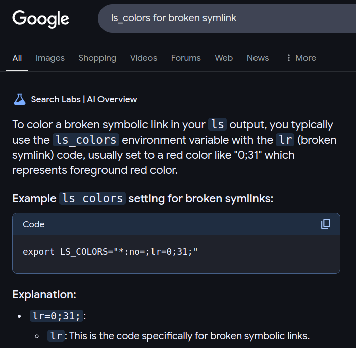

# Braindump
id:: 67760c3e-2ed3-4b91-9698-8dea6913e419
	- ((6651ecba-793d-43c5-8020-a9f260b032d8)) This is the ((6667bf32-ab6a-4d64-842d-45d49137e694)) place for ((66536578-c4d3-43f1-b35c-bf71120f0570)) as well as the store of recent braindumps.
	- ## Braindump History
	  collapsed:: true
		- ((67760c3e-10a7-4621-8623-383f44bdaf3c))
	- ## 2025 Braindumps
	  id:: 67760c3e-10a7-4621-8623-383f44bdaf3c
		- ### January
		  id:: 677e7eda-0c5e-413a-8c08-3a1d39352ba9
		  collapsed:: true
			- this [refactoring](((67710747-2982-4134-875e-3b715313db87))) itself is more complicated than i thought!
			- just take a break, breathe, review...
			- i must close i eyes...
			- “master plan” & ((67760c43-58c6-40eb-b874-40afae448966))
			  id:: 677e7fdb-6da2-47b6-8a07-2de0f1216881
			  collapsed:: true
				- the “master plan” should be split into the spatial ((67760c43-58c6-40eb-b874-40afae448966)), and the temporal ((6651adea-e1ed-4884-93eb-5ebd6086b62b)) list
				- what's the structure of Mind Map?
				  :LOGBOOK:
				  CLOCK: [2025-01-02 Thu 16:14:37]
				  :END:
					- its roots are the problems and questions
				- [!] the right sidebar now is very lagging
				- i've just got a walk outside, wandering around
					- in a silent space, i could zoom out deep into the mind to see meta-info
					- [!] the braindumping texts didn't show the overall image!!
						- for an overview, the most thing can be done with text is to fold them up... that's why i still use folding blocks in Braindumping.
				- any block (task, issue, quesion) should start in context
					- then it will be moved out when it's grown big
				- look into the Problems & Questions in Mind Map, i want to sort and clean them up!
					- luckily, they are not to much!
				- How should the braindumps be flushed?
					- some things should be retained!
					- the old braindumps should be reviewed and restructured before being flushed
				- currently, there are 2 ends about the Mind Map, closing the effect circle
					- forward end: the urge to design it properly
					- backward end: some questions arised and should be placed into the Mind Map itself
						- [?] why is the central Mind Map required?
						- [?] why a strong urge to design it no matter how unclear it is?
			- [?] a recurrent task as a reminder
			  id:: 677681e5-6322-4925-8923-19cd791cfe15
			  collapsed:: true
				- Get back to COMPANY WORK!
				  id:: 67768438-13eb-43f7-abdd-2759d9b7f616
				  DEADLINE:: <2025-01-04 Sat 10:04>
				  SCHEDULED: <2025-01-03 Fri 19:21 .+1h>
				- No style change after deadline!
				- So i must use others, e.g. [query](((677689e6-7163-4e94-ab65-18d3f51e3eb9)))
				  :LOGBOOK:
				  CLOCK: [2025-01-03 Fri 09:20:54]
				  CLOCK: [2025-01-03 Fri 09:21:08]
				  :END:
				- ((677750e2-4074-40d7-8fba-50122aa29c58))
				- [!] even at this dead end, i still have a strong urge to penetrate it... e.g. with custom property and somehow to convert between HHMMSS and `time-ms` 😕
					- custom property
					  deadline:: <2025-01-04 Sat 10:04>
					  id:: 677757bc-227a-47c2-abeb-7957d61824cc
					- just missing a way to convert this property from/to `time-ms`
					- `/Current time` = 10:32
				- DONE use both: `scheduled::` for warning (yellow), and `deadline::` for error (red)
				  :LOGBOOK:
				  CLOCK: [2025-01-06 Mon 19:26:29]--[2025-01-06 Mon 22:41:27] =>  03:14:58
				  :END:
				- ((677bfb6a-cba7-4a55-9d0d-43255445e280))
			- Get back to company work, now 13:11
			  id:: 67777f4e-49a9-4537-86da-be69f87918a7
			  :LOGBOOK:
			  CLOCK: [2025-01-03 Fri 13:14:16]
			  :END:
			- sleepy meditating...
			  id:: 677cc7d2-02f7-4ad9-801c-3079237ed465
			  collapsed:: true
				- at noon, on the way to company, seeing the karma as the momentum accumulated in our bodies pushing us, making us rush... i want to put all them down... but i also know that nothing can completely stop, the motion just curls inward...
				- sitting down the chair, i relax and release my mind, then falling asleep.
				- 2 straight hours sleepy meditation, from 13:00 to 15:00, then half an hour ujjayi breathing
			- Let's sum up these days with the first story in 2025: ((677e2745-6664-407e-ab5f-3c18319e2e6b))
			- ((67760c43-58c6-40eb-b874-40afae448966)): just sow the seed and throw dirt on it!
			  collapsed:: true
				- the seed is the ((66b1cfa4-01ef-4ee8-9409-32c9884c39cd)) = intentional cause = "final cause" in [4 causes by Aristotle](https://en.wikipedia.org/wiki/Four_causes)
				  id:: 677e6f51-6670-497b-8697-05b9e057a0ff
				- dirts are thrown into ((6651adea-46e0-40ea-8fc4-3ef394068b0f)) and ((6651adea-f2f6-4c9e-80b4-ece0bb5038fb))
				- but just like these hours, the organizing of the dirts upon the tree developed from the seed is demanding...
			- About the term ⟪ ((667bef22-b272-4a7d-b613-3f1ed1a47329)) ⟫
			  collapsed:: true
				- causal chain, cause-and-effect chain (CEC), chain of causation
				- chain of causation [十二因縁] (, [dependent origination](https://en.wikipedia.org/wiki/Prat%C4%ABtyasamutp%C4%81da) principle)
					- twelve links of Dependent Origination are called either by dvādaśa-hetupratyaya [十二因縁] or dvādaśa-nidānāni
				- cause: affect, reference (carry back to the origin) <> effect (act out)
				- effect: impact, impression, infection
			- Just another whole day consumed into the edit of ((667bef22-b272-4a7d-b613-3f1ed1a47329))
			  collapsed:: true
				- ((6780bc66-29b3-43f7-b577-698bae51aadf))
				- broken plan: i wanted to do the company work of "locking build-deploy"
			- i've just had brief nap (just relaxed not really slept) and realized:
			  collapsed:: true
				- even when the editing work finished, i didn't want to switch to company work...
				- observing the feeling, i see ... because there's still a pending quest(ion) from last night:
					- > the nature of wave propagation
					- from this discussion: ((6780bc09-6c98-42ed-bbd1-ff940c2a1d10))
					- TODO  = wave propagation = traversing of the ((675c03d8-3185-41a8-9f98-e869fabec793)) by itself = fundamental operation in Unithread
					  :LOGBOOK:
					  CLOCK: [2025-01-10 Fri 18:35:42]
					  :END:
			- Here, we're witnessing the branching from ⟪ ((67714850-43c0-4c7f-8b50-838e014b06e0)) ⟫ to...
			  collapsed:: true
				- ((67710747-2982-4134-875e-3b715313db87))
				- ((67715d03-9dbc-42b0-8589-064396a9c52b))
					- ((677e7fdb-6da2-47b6-8a07-2de0f1216881))
				- ((677681e5-6322-4925-8923-19cd791cfe15))
					- ((677e7099-5dfc-43f4-8db0-67189cf8ef74))
				- ((677e6f51-6670-497b-8697-05b9e057a0ff))
					- ((677fca96-1e71-4af7-9a99-1c751d145358))
						- ((677fcaba-d2ca-4afd-9698-b33255a774e0))
						- ⇒ ((67810b96-586f-49fc-a26e-8ea4139b5816))
				- refine the ((667bef22-b272-4a7d-b613-3f1ed1a47329))
				  id:: 67810b96-586f-49fc-a26e-8ea4139b5816
					- ((677f9ae2-f7bc-47a7-a7e3-4dda29d9d834))
					- ((6780bc66-29b3-43f7-b577-698bae51aadf))
				- This very problem of task branching is the “[problem of duck dive](((67714850-43c0-4c7f-8b50-838e014b06e0)))” and the cause of the whole lot of these works themselves: refactor, design “master plan” & “Mind Map”, etc.!
					- It's really a trek in the jungle!
			- i was sucked into 2 other stories when reading my CreatZy Notes
				- ((6783cfaa-7181-45d0-a9e3-428aa89cf5e3))
				- ((67445223-9459-4aa9-b102-70c63943577b))
			- i want to write today's story, ((67836ec6-0e46-4a3f-80d9-b27476d12095)), but too sleepy... just take a nap!
			  id:: 6784871c-20b5-4ecc-ab02-70b4542690db
			- on the way to company, i see “[the last frontier](((67836ec6-0e46-4a3f-80d9-b27476d12095)))” is the ((66ab6f84-88ba-4660-b4b7-f6dcbdd58a4f))ness both in theory and in practical quest for my liberation.
				- I was sucked into various  technical details of [trans](((67849429-a90c-45a9-a6ae-dcdd61f7580f))) and [itch](((0f9f9026-152c-46b5-964b-c6e1019cc584))).
				- Only after stepping back from these details, do i remember the main point: ((6784f2aa-357a-44ed-a8c6-5ed1b9c78b04))
			- Now, switch to the a simpler task left from previous days: ((677e7099-5dfc-43f4-8db0-67189cf8ef74))
			- ((678512dc-66ef-4ba9-aebb-0355d89ef38b))
			- now, get back to company work!
			  :LOGBOOK:
			  CLOCK: [2025-01-14 Tue 16:44:53]
			  :END:
			- Try using both instances of Logseq in parallel
				- Flatpak instance for ((666baccf-6be1-4b9a-b186-f883ea04daf1))
				- Snap instance for company work
				  collapsed:: true
					- This note has simpler task structure ⇒ only `WIPs` is enough.
					- All braindumping will be done here, in `UniinfoNotes` instead.
				- DONE It seems OK!
				  :LOGBOOK:
				  CLOCK: [2025-01-16 Thu 16:57:45]
				  CLOCK: [2025-01-16 Thu 16:57:46]--[2025-01-16 Thu 16:57:54] =>  00:00:08
				  :END:
			- ((6788f0ae-773b-4da2-87f5-c6552d76a00c))
			- [?] How to highlight hard links for `ls --color=auto`
				- ((678a4f10-b109-429d-9c58-f9bd52f807cd))
			- ((678b7762-1187-4330-93cb-7a62e14467a8))
			- Here, we're witnessing the development and transmigration of the [transcycling](((678b7762-1187-4330-93cb-7a62e14467a8))):
			  id:: 67aabd5c-3d5e-4f0a-be33-5171520abe62
			  collapsed:: true
				- First drafted in ((db954501-95d0-46e2-b1fc-39b6a966300e))
				- Then moved to ((67763a41-4ad6-449f-9d9b-d63ce417082c)), due to the discussion with Copilot inside.
				- Now, moves to ((67760e05-2ea1-4f0e-aaa6-158edca80df5)), due to its wide contents.
				- And it leads to the formal formulation of “transcycle” whose location is [still being considerd...](((678dbff1-19ea-47c5-8794-2638d53ee7dd)))
			- Here, we're witnessing the deep dive into the abyss of ((6793437b-5ee5-4f7f-a547-bb9e15ac5883))
			  id:: 67aabd5c-5732-414d-9f4d-180d420a8d69
			  collapsed:: true
			  :LOGBOOK:
			  CLOCK: [2025-01-24 Fri 19:43:06]--[2025-01-24 Fri 20:03:22] =>  00:20:16
			  :END:
				- From the [unintended conflicts](((ed8333ef-b3b6-4d1b-a5e7-3a2fb4e1b286))) in `python_deploy/java/constant.py`, i thought that it will "always conflict" with any other changes in that file, which is a serious problem. This doubt was partially due to Mr. Toanh's complaint earlier about such issue.
				  id:: 67938b35-697e-432f-b179-17ce60028e6c
				- I checked for expression of the last newline [in various editors](((616bfc2b-05f2-4a85-a094-dd771aa12cd1))).
				- In an effort to [refactor codes](((b8c17a55-f618-43ed-9826-314412a08965))), i reviewed and documented various Linux commands: ((679085ef-facd-4c4a-83f3-f32bdefbaa49)), ((6790a3e2-3f65-42d0-9253-35b6672d8b25))
					- But at last, i just asked Copilot to have a quick answer, and it gave me the [correct one](((577c2916-d4ca-461d-85b9-f3b2ff7e6b30))).
				- Today, experimenting with my local git repo for testing, eventually, the problem has turned out to be not so serious as [i thought](((67938b35-697e-432f-b179-17ce60028e6c)))!
				  id:: 67aabd5c-797c-42dc-92c2-360d3149ee64
					- It just causes **unintended conflicts**, not "~~perpetual conflicts~~"!
				- ⇒ Instead of forcing IDEs to automatically add newlines, just do the other way: ((67aacbe5-f534-4eac-abe8-15f2f8990691))
				  :LOGBOOK:
				  CLOCK: [2025-02-11 Tue 12:07:08]
				  :END:
	- ### February
	  id:: 67aac38f-1c60-42e9-a8c5-c262d11a82f0
		- We're witnessing the [braindumping](((db954501-95d0-46e2-b1fc-39b6a966300e))) and [current stories](((6788f004-d3df-41d4-afc8-c8c5ea52c51c))) and [current stasks](((677630fe-ea99-436f-b39f-8bd2295e2eaf))) stacking up!
		  id:: 67aabd5c-5846-4b6d-84bd-8be5034dd958
		  collapsed:: true
			- Too many unfinished stuffs!
			  id:: 67a5cfdd-d3b3-491b-a7ba-febdc09dca95
				- ((678dbff1-19ea-47c5-8794-2638d53ee7dd))
				- ((678df0f0-20d2-4995-bfc2-0b953970469d))
				- ((67938fc1-3094-4558-bc88-07b68ff64298))
				- ((67a035a8-f826-4b89-8eb4-3d2cd679dd1f))
				- ((67a5d049-d7a3-4a23-baa6-5261a409c694))
				- ((67764f3d-c6b3-4f00-a53f-ec4dab0920f9))
				- ((6772a6c7-f434-4911-9fa2-939b8db20c42))
			- This is the very common theme in my life, but undocumented until now.
			- Switching from depth-first traversal ([duck dive](((67714850-43c0-4c7f-8b50-838e014b06e0)))) to breadth-first traversal has resulted in ((67a5cfdd-d3b3-491b-a7ba-febdc09dca95))
			  id:: 67a5d140-31e4-451d-a8ea-33fa6927ce99
				- This ***fragmentation*** is what i've been scared of due to my ((6678d594-9819-4624-abd6-d4ec62b3874f)).
				- This problem has been foreseen long ago but no solution has been found.
				- With the help of this documenation & task tracking system, i hope that we can find some way to deal with it!
			- DONE Now, i'm sorting & wrapping them up...
			  id:: 67a5dcde-4189-4626-8396-61577b6906a4
			  :LOGBOOK:
			  CLOCK: [2025-02-07 Fri 17:14:16]--[2025-02-10 Mon 13:01:41] =>  67:47:25
			  :END:
				- Today, Feb 10th, The last 2 items have been far away in my mind:
					- Nearer thanks to documented contents and a long time focusing on it before: ((678dbff1-19ea-47c5-8794-2638d53ee7dd))
						- DONE So, i'm resolving this first.
						  :LOGBOOK:
						  CLOCK: [2025-02-10 Mon 11:34:28]
						  CLOCK: [2025-02-10 Mon 11:34:31]--[2025-02-10 Mon 13:00:52] =>  01:26:21
						  :END:
					- Farther, no docs, no concrete "story" remaining in my mind, just the general ideas of it: ((678df0f0-20d2-4995-bfc2-0b953970469d))
						- And leave this in Brainstorming.
		- In the course of trying various LLMs, i'm touching various parts of Unïnfo begging for updates...
		  id:: 67a035a8-f826-4b89-8eb4-3d2cd679dd1f
		  collapsed:: true
		  :LOGBOOK:
		  CLOCK: [2025-02-04 Tue 10:12:30]
		  :END:
			- I'm seeing a dense jungle ahead...
				- Updating these terms must take time...
				- In my history, such blooming of ideas has had me bogged down a lot.
			- But i don't want to loose these ideas... so maybe just litter them with `TODO`s... or separate them into brainstorms....?!
			- Team leader Quân has just visited asking for Tết holiday and my work 😁!
			- Today, 6 days after [the first braindump](((67a035a8-f826-4b89-8eb4-3d2cd679dd1f))), i've done trying various LLMs with a brief of ((67a5fae8-8e1d-4dd6-818d-a8462f6b54db)).
			  :LOGBOOK:
			  CLOCK: [2025-02-10 Mon 09:57:06]
			  CLOCK: [2025-02-10 Mon 09:57:09]--[2025-02-10 Mon 10:00:23] =>  00:03:14
			  :END:
			- The "various parts of Unïnfo begging for updates" have been gone far from my mind...
			- So just flush this braindump away, now!
		- [?] Where should i place this basic operation of [transcycling](((678b7762-1187-4330-93cb-7a62e14467a8)))?
		  id:: 678dbff1-19ea-47c5-8794-2638d53ee7dd
			- ⇒ Put it in ((67a963d9-e7d3-4e46-a608-24059d730f4a))
		- ((67a5dcde-4189-4626-8396-61577b6906a4))
		  id:: 67a5dd00-f5cf-4e51-9ea1-2fea15d3595a
		- Now, i'm wrapping the WIPs up for [a big merge commit](((67164cc1-e500-4889-9b6d-12d8dd7fc029))): `Various stuffs all over the place: Technical stuffs, Unïnfo, Life stories`
		  collapsed:: true
			- in `log`: `302bec3f`
			- in `main`: `6d48b4b3`
			- published in `gh-pages`: `81c9e3b8`
		- Oh i've forgotten that we've been in February
		  :LOGBOOK:
		  CLOCK: [2025-02-11 Tue 10:32:17]
		  :END:
		  ⇒ Just cut some braindumps into ((67aac38f-1c60-42e9-a8c5-c262d11a82f0)) (February block is at the same level with ((db954501-95d0-46e2-b1fc-39b6a966300e)))
		  ⇒ Put ((677e7eda-0c5e-413a-8c08-3a1d39352ba9)) into ((67760c3e-10a7-4621-8623-383f44bdaf3c))
		- Let's remember to add date into braindumps using `/Today`, like “Tue, 2025/02/11”, as well as timestamp it with `Alt` `Enter`
		  id:: 67aac5fc-3591-43a1-a283-f51620f8035e
		  :LOGBOOK:
		  CLOCK: [2025-02-11 Tue 10:38:38]
		  :END:
		- ((678e1c3f-6202-45aa-8527-f4bdad9927b9))... is object or subject?!
		  id:: 67ac4f62-3411-4c88-8d4c-3fc2e6c78258
			- Done with some helps from Copilot & Google Search's Gemini: ((67ac5dfc-2224-4261-a5d2-52def30c3cba))
		- [!] The ((66fce880-77a2-41f7-8bdb-a86b7fc6fc77)) usually fails due to invisible spaces in the keywords
		  id:: 67ac4f68-8af4-4886-9183-85de0039250c
		  collapsed:: true
		  :LOGBOOK:
		  CLOCK: [2025-02-13 Thu 09:09:51]
		  :END:
			- We should not ~~trim spaces~~ from keywords because sometimes they are intentional.
			  collapsed:: true
			- We should have some **delimiters** around them!
			- ((67ad537f-9a22-4079-b8d1-352b4c567278))
		- [!] Leaving tasks as `TODO` is so difficult for me...
		  id:: 67b541c7-9547-4964-b19d-c873af1b3f4e
		  collapsed:: true
		  :LOGBOOK:
		  CLOCK: [2025-02-13 Thu 09:09:57]
		  :END:
			- There's a strong force sucking me deep into these tasks...
			- ⇒ ((6772a6c7-f434-4911-9fa2-939b8db20c42))
			- ⇒ I'm overcoming it by stop-breathe-relax-redirect, then mark `TODO` for this task: ((67ad537f-9a22-4079-b8d1-352b4c567278))
			- But still... i've been sucked into ((67adb58e-6bf4-43ba-b574-58b112cc3874)) from 9:00 until now 18:21 = 9.5 hours, just because i **didn't think it complicated**!!!
			  :LOGBOOK:
			  CLOCK: [2025-02-13 Thu 18:18:12]
			  CLOCK: [2025-02-13 Thu 18:20:46]
			  :END:
				- While working with the project Pre.Env. for company, i saw a broken symlink not hilited as normal.
				- Then i [searched for `LS_COLORS`](((67ac4f68-8af4-4886-9183-85de0039250c))) but failed due to a trailing space.
				- I thought it was just a very simple task, just "going to be done now!"
				- So, i didn't even bother to track that task!
				- Chatted with Copilot, searched all over the place,... it's turned out to be not so simple at all!
				- LLMs like Copilot and Google Search AI are helpful but have many hallucinations & delutions.
					- Google Search AI invented `lr` code for "broken symlink"
					  collapsed:: true
						- 
					- Respone to Copilot's hallucination: I've searched myself and see `ca` = `CAPABILITY` not `FILECAP`, `rs` = `RESET` not `NORMAL`, as shown in this [stackexchange](https://unix.stackexchange.com/a/70715/566548)
					- Copilot was obssesed with that GitHub gist so much that you place [that link](https://gist.github.com/thomd/7667642) to the "StackExchange discussion" text! 🙁
		- I feel there's a need to tighten my constraint (giới), not only refraining from social network & media, but also from my Uniinfo theory, in order to finish my promise with boss Đạt.
		  id:: 67b2d619-7ce1-42c5-a331-5d35f0d8f35b
		  collapsed:: true
		  :LOGBOOK:
		  CLOCK: [2025-02-17 Mon 19:36:32]
		  :END:
			- For the theory, maybe i need to litter the UniinfoNotes up with brainstorms and braindumps for whatever i see on the way.
			- I've just finished a remaining task in the company work (`lock.sh` for `python_deploy`)
			  :LOGBOOK:
			  CLOCK: [2025-02-17 Mon 19:36:40]
			  :END:
			  → then i just turned out to check Telegram for any reply from Mr. Huy in [the last chat](((67b2f947-69cb-4183-a99d-204c0beb6dcc))).
			  → then i just attempted check YoutTube for the current status of [monk group of master Minh Tue](((67a5faa3-c64c-48f7-8b3f-a5311714110f)))... but i just stopped right at the time i realized this attempt.
			- Let's keep refraining... it's not hard anyway!
		- [!] Logseq Publish with shallow copy issue: When copying a block out to a publish page, its local block refs are still pointing to sub-blocks of the original block.
		  collapsed:: true
		  :LOGBOOK:
		  CLOCK: [2025-02-18 Tue 14:05:25]
		  :END:
			- Maybe we must write a plugin `deep copy`!
				- detect local block refs in the source block
				- add `id::` to these target sub-blocks in the result block
				- replace block refs with these new UUIDs.
		- Just wrapped up docs of "update `python_deploy/java`"
		  collapsed:: true
		  :LOGBOOK:
		  CLOCK: [2025-02-18 Tue 16:24:29]
		  :END:
			- It costed so long time!
			- Now, start dealing with `sgapi`
				- But before starting, let's have a brief meditation...
				- that meditation is so good with relax, release through deep yawns.
				- Now, 18:26, half an hour has past my schedule of leaving work at HTV to work for UTS, due to the ongoing work of many different hosts in `sgapi`.
				  :LOGBOOK:
				  CLOCK: [2025-02-18 Tue 18:26:28]
				  CLOCK: [2025-02-18 Tue 18:26:31]--[2025-02-18 Tue 18:28:50] =>  00:02:19
				  :END:
			- Just leave HTV now, 18:29.
			  :LOGBOOK:
			  CLOCK: [2025-02-18 Tue 18:29:57]
			  :END:
			- And has just arrived at UTS now, 19:04.
			- Let's keep this state of vacancy! 😊
		- Thanks to BeowulfBuildModDocs' LogseqNotes, now i can recall the incompleted works from last year (3 months ago, from 2024-12-08)
		  collapsed:: true
		  :LOGBOOK:
		  CLOCK: [2025-02-18 Tue 19:11:36]
		  :END:
			- But my back hurts... so just lie down a little bit...
			- After messing with tangled deps in `quickom-node-core-v3`, i resorted to build LamHai's `dev` branch... successfully.
			- So just `cherry-pick` the last commit from `prod` into that branch, instead of creating new `dev` branch from `prod`.
		- Feb 19, after a morning walk and meditation beside the river, let's write down the story of ((67b54432-861a-415e-a7ee-45a3f75bdc7a))
		  id:: 67b54af3-2ccd-4814-ab89-ef85bed9f79b
		  collapsed:: true
		  :LOGBOOK:
		  CLOCK: [2025-02-19 Wed 10:26:06]
		  :END:
			- These 3 levels of abstraction have just been done while writing it down: first the [brainstorm](((67b54283-14b2-4753-94bb-4d827d54d7cc))), then the [story](((67b54432-861a-415e-a7ee-45a3f75bdc7a))), and last this [braindump](((67b54af3-2ccd-4814-ab89-ef85bed9f79b)))
			- This has taken the whole morning, including more than 1 hour walking, now 11:29, i'm going to have lunch 😊
			  id:: 67b55dda-7840-4691-9e72-0e025e17dc4d
			  :LOGBOOK:
			  CLOCK: [2025-02-19 Wed 11:30:10]
			  :END:
		- I've just added `padding-bottom` style to [markdown-watcher.js](../assets/HTML/markdown-watcher.js) so that when clicking a ref of a block at the end of page, we can jump to that block, instead of stopping short above.
		  collapsed:: true
			- From [superuser](https://superuser.com/a/872654/2425618)
			  ```css
			  html {
			    height: auto !important;
			    padding-bottom: 100vh !important;
			  }
			  ```
			  added to `load(){if(renderChoice.value=='html')}`
		- Feb 19, 21:11, I've just fixed deps in `quickom-node-core-v3/dev` for successful build 😊
		  :LOGBOOK:
		  CLOCK: [2025-02-19 Wed 21:11:30]
		  :END:
		- Yesterday, Feb 24, i wrote ((67b81e1b-b801-4e5a-9c00-98e51158712a)) as brainstorm, but now, i move it to ((6651e92e-fb34-4d24-a386-d9698c2e93f7)) because it's been rather complete.
		  collapsed:: true
		  :LOGBOOK:
		  CLOCK: [2025-02-22 Sat 20:16:37]
		  :END:
			- This unintended work was triggered from the old post [The Reduced Halting Problem](https://creatzyitnotes.blogspot.com/2009/10/reduced-halting-problem.html), which i met when trying to ((67b989a4-a041-4511-abe5-77c785ca2d67))
		- I've just added duals of wave-particle, plant-animal, ((94e87dc9-71af-477c-aa70-0f448c2f1e20)) to the [EffectCircle Diagram](((67b183f5-dba7-4a11-8a72-3c619e3709ea))).
		  id:: 67bacb04-7c5c-4004-96b9-2ee237878ce6
		  collapsed:: true
		  :LOGBOOK:
		  CLOCK: [2025-02-23 Sun 16:25:44]
		  :END:
			- also added spatial components: distribution, density, curvature.
				- Oh, my recent addition of “spatial distribution” to the dynamic circle is just a recurrence: In [a comment on DynamicsPyramid](((67baf71f-a1dc-4f9e-b62b-f150d7ced6b0))), i did clearly wrote “... distribute energy, thus 'energy field'”.
			- and moved contents of [a previous brainstorm](((67b5c778-71d6-4f58-9dd4-36a719bd85f0))) to ((67b183f5-1cca-4473-917e-60c644dd5466)).
			  :LOGBOOK:
			  CLOCK: [2025-02-23 Sun 16:50:30]
			  :END:
			- Where should i place the [DynamicsPyramid Diagram](https://docs.google.com/drawings/d/18PRcRgeFegJ9NEnQwJLdd1LsROhQKDJIA1I0NMMHl_o/)?
				- OK, now just (temporarily) put it right inside the dynamic circle!
				- And drop an entry of [its story](((67baf8fc-0343-4586-9a45-219052a747c9))) down.
		- Let's put down ((67bb3a7a-27a9-42f0-a40b-9b8293103524)), so that i can switch to finish the work for boss William.
		  :LOGBOOK:
		  CLOCK: [2025-02-23 Sun 17:55:32]
		  :END:
		- When writing some long descriptions of “dynamical system” vs. “dynamic system”, i'm struck by this:
		  :LOGBOOK:
		  CLOCK: [2025-02-25 Tue 11:45:17]
		  :END:
		  ((67bd4966-a768-46b9-b947-fac1273be081))
			- Let's rephrase the construction “consider as” in [[FoC]].
		- From the [conservation of curvature](((67bbde65-182a-4e2d-bdde-acf9b5ec124f))), from yesterday night to today morning, i've been contemplating the curvature & straightness (linearity) and see a long road ahead... Maybe i should start from an entry of ((67bc1f83-d9c4-4ee0-ac61-0de196425208)) in the Mind Jungle.
		  collapsed:: true
			- I just remember [my formula of curvature ](((67bc5689-d4f1-4136-b775-92847ddd02f8))) $c = dφ/ds$ from high school 9th or 10th grade. There, i used the symbol $c$ for both English “curve” and Vietnamese “cong”. I'd thought that it was my "new concept" until i saw the definition of $κ = 1/r$ in some book.
			- The intrinsic curvature of the thread, as the 2nd derivative of the [distribution of space](((67bda37c-7085-4a71-b5bf-6c4b54b3abdd))) on the line, is different from the extrinsic curvature of the line $κ = 1/r$.
				- While the thread's distribution of space is simple, ((67bdb94a-e172-43f9-a59e-a97756fef1f4))
			- Note: the [emergence of negativity & imaginarity](((67bbde62-70fc-4d3d-9f65-dcea280db516))) was a rediscovery when i contemplated the spring (elastic) mechanics & `exp()`, as a note on Telegram on 2023 Feb 21st.
			  collapsed:: true
				- #+BEGIN_QUOTE
				  **Holistic momentum** = const-sized (mc^2) vector = momentum vector (in space) + energy vector (= momentum in time)
				  - **i=√-1 derived from dynamics**: velocity reflected at the wall must pass through 0 but total momentum is preserved => the whole momentum vector must pokes out of space dimension => space × momentum = phase space:
				    + The eigenvector of diff is exp() => extended to phase space: x' = p & p' = x => x'' = x =>  √1 = negative (opposite) unit «-1»; x' = -p & p' = x => x'' = -x =>  √-1 = imaginary (internal, intensive) unit «i»;
				    + The loop of derivatives in phase space complex plane contains 4 units (+1, +i, -1, -i), ie. x'''' = x => to be extended to quaternion
				  - the momentum dimension p in phase space is the folded (intensified) of time => spacetime = extended phase space => energy = momentum in time => force = curvature = density of energy = tightness of circle = how much motion in time
				    + Pythagorean theorem <== circle in phase space ==> everything is circle
				  
				  
				  Differentials (high order) = orthogonal radix numerals = Turing machine vs uninet = holographic numerals = diagonal multimodular numerals (RNS & continued fraction)
				  ==> this defines the computation inside the Quantum => geometry => physical laws
				  #+END_QUOTE
			- It's interesting that when searching for "circle of dynamic[s]", [Google Search AI declares](((67bd76db-a523-415e-8d4d-812593779ceb))) "circle of dynamic" to be “a conceptual model” and "circle of dynamics" to be “a concept in mathematics”, as if they're already established terms... but i think it's just an AI hallucination!
		- DONE Add [Textile](https://en.wikipedia.org/wiki/Textile_(markup_language) "Textile (markup language)") to ~~both UniinfoNotes &~~ HTV's logseq-notes
		  collapsed:: true
		  :LOGBOOK:
		  CLOCK: [2025-03-05 Wed 17:19:32]
		  CLOCK: [2025-03-05 Wed 17:19:34]--[2025-03-05 Wed 17:20:19] =>  00:00:45
		  :END:
			- Only add an external link to `Redmine working process`: [Textile formatting](https://www.redmine.org/projects/redmine/wiki/RedmineTextFormattingTextile)
		- [!?] markdown-watcher: sometimes, anchor links become ineffective, but i still don't know why!
		- Update ((66600918-8c61-42af-b8a2-04bf05e9f782))
		  collapsed:: true
		  :LOGBOOK:
		  CLOCK: [2025-03-06 Thu 17:42:08]
		  :END:
			- I've just added another exception for smart quoting function: `replaceQuotes()`'s possessive exception
			- Let's parametrize `LogseqApiEndpoint` in [LogseqGet.html](((6675860a-c135-4a92-b4fe-206ebde974ff))) (`LogseqUtils.js`) because now 2 servers are running in parallel at 2 ports: UniinfoNotes @ 12315 (default), HTV's logseq-notes @ 12345.
			  :LOGBOOK:
			  CLOCK: [2025-03-06 Thu 17:42:54]
			  :END:
			- I've just designed the overall flow for [updating block refs in Logseq publish](((67b541cf-618d-4607-bdd4-e1afcc8ce70c)))
		- Let's write ((67ce5a8c-4885-4aaf-9215-60460717ae44)) 😜
	- ## Braindumping < ((67aac38f-1c60-42e9-a8c5-c262d11a82f0))
	  id:: db954501-95d0-46e2-b1fc-39b6a966300e
		- “wanting” = “lacking”
			- Etymology:
		- ...