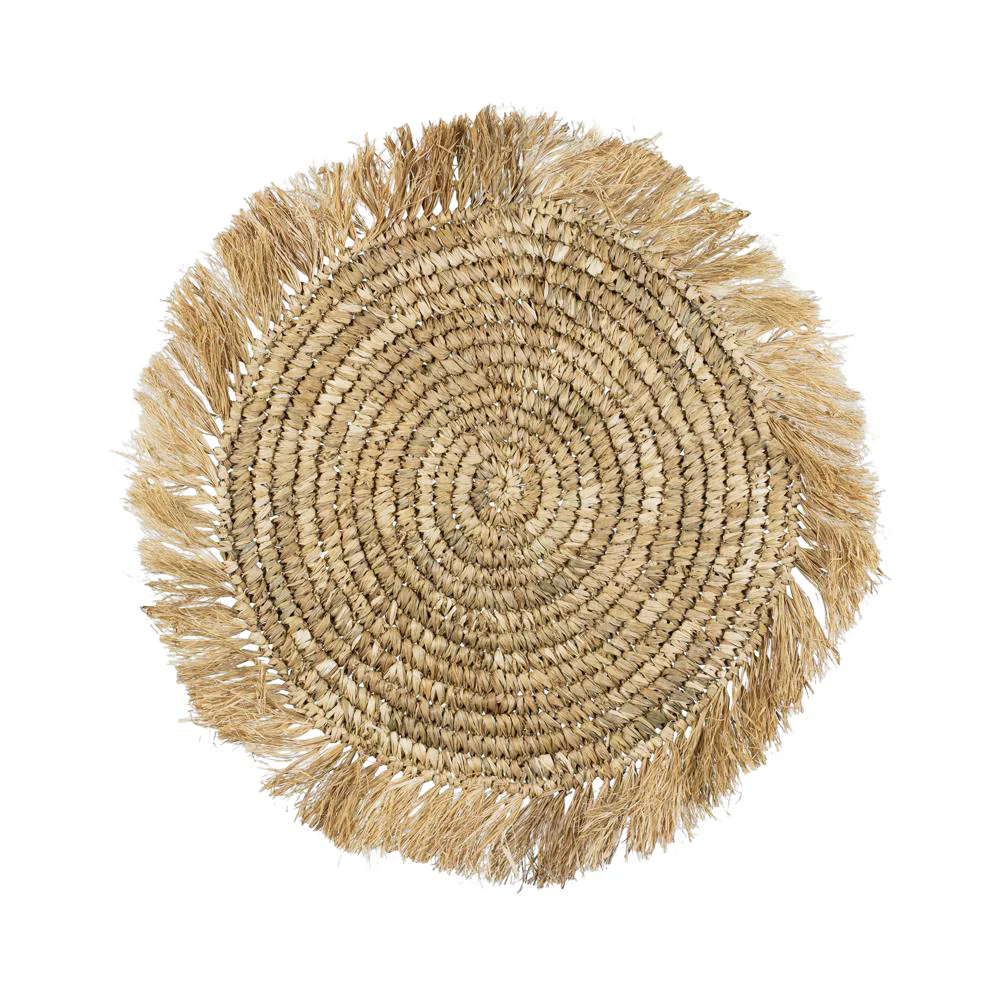
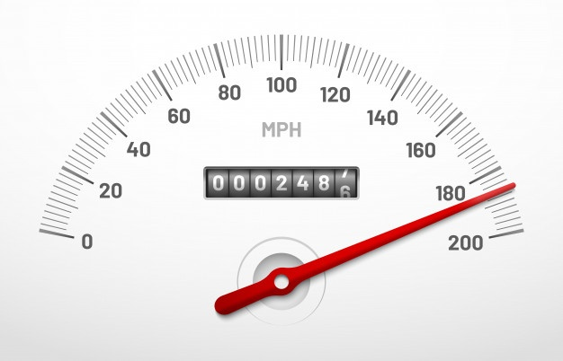
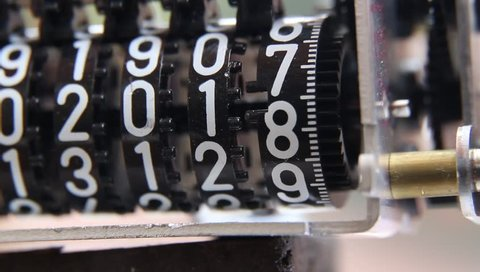
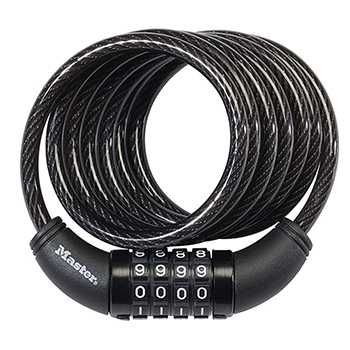
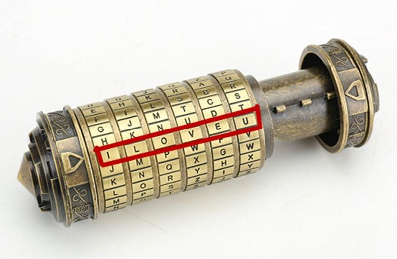
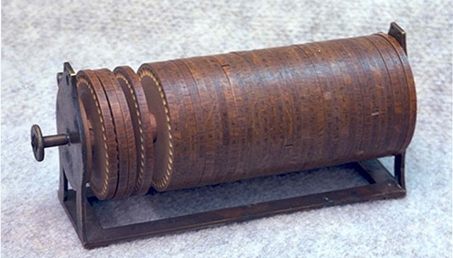
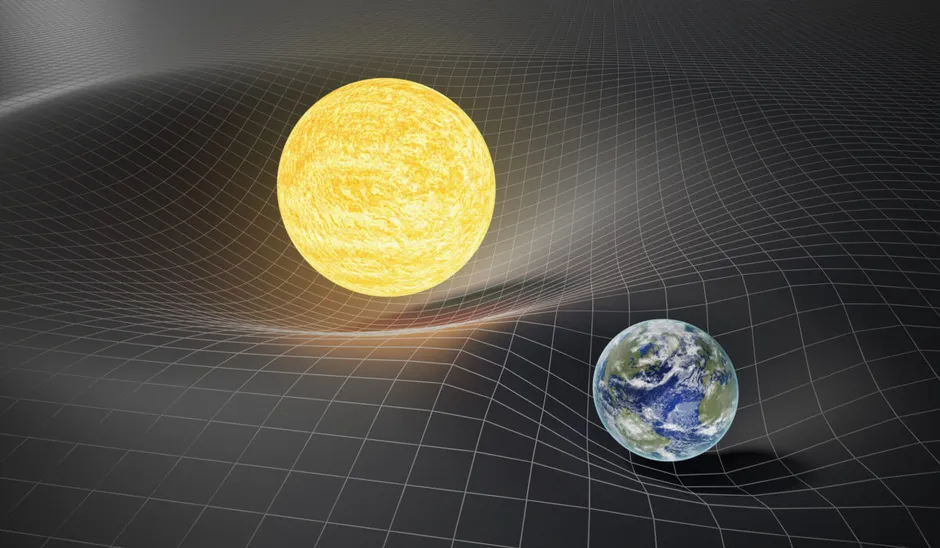
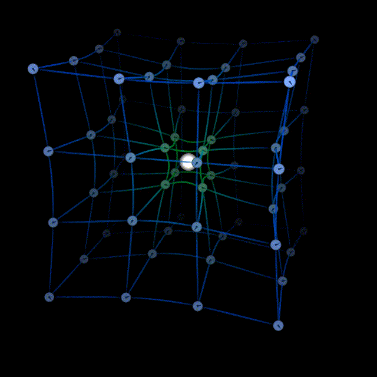
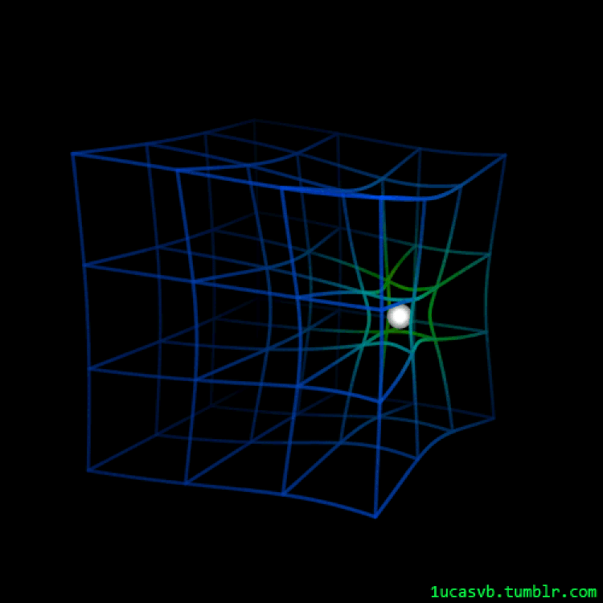

# Brainstorm
id:: 6653538a-30aa-423f-be89-848ad9c7e331
	- ((6651ecba-793d-43c5-8020-a9f260b032d8)) This is the ((665c92d1-565b-4911-a706-b32af429c3aa)) place for ((66536578-c4d3-43f1-b35c-bf71120f0570)) as well as the store of recent brainstorms.
	-
	- ## Brainstorming > ((67760e05-2ea1-4f0e-aaa6-158edca80df5))
	  id:: 6773eb97-ec58-4c48-a017-cd0de2d82e08
		- ... ↓ to be flushed **down**! ↓
		- TODO Continue with [planning](((67760c43-5cbd-4b4f-8fd9-5cedf804f56a))) to resolve [the conflict with company work](((6677b986-ada2-4c73-8a11-980cdf9cb6d4))).
		  id:: 68663850-daa5-487e-ba48-fea228a2b188
		  collapsed:: true
		  :LOGBOOK:
		  CLOCK: [2025-07-03 Thu 15:26:42]--[2025-07-03 Thu 16:33:25] =>  01:06:43
		  :END:
			- First, plan the time of working hours.
				- A working day should start from official works instead of personal works.
					- This is a good strategy but difficult for me because the out-of-work thoughts from the last night will naturally continue in the morning, keeping me from focusing on other works.
					- So, let's try using breathwork and meditation to switch the flow of thought from personal to official works.
				- Previously, i designed a [⟪Back to Work!⟫ reminder](((67d2a63d-58de-4dbe-bbec-3ec8625737c7))) but ineffective.
			- Second, plan the space of thoughts.
				- Due to the ((681b3ad7-d1b0-4c06-a4ea-385a4a9314e0)) and various deep intents, all works, including official works and even the balancing work, will trigger meta-thoughts deeply related to ((66537a44-f579-4fcc-a02b-2f32d0d409fc)). So the time planning only is not enough.
					- My ((665379b7-e4f6-4240-8029-fd143e2230c7)) has already been supporting Unïnfo strongly: observing the intents & obops => expose them, detach them, and write them down to UniinfoNotes
					  collapsed:: true
						- I just flush my karma out to the Uniinfo: whatever i formulated, i'm free from it.
						- [!] But it has not supported the official works yet!
					- ⇒ Now, i must _**add official works** to my way_ for it to be more balanced: observing the requirements, the schedules and deadlines, etc.
					- ⇒ [reduce self-circle](((669a5162-19e1-4c52-8888-ab7cbfe275ec))): reduce the radius of the core back to its **currently wholesome region**, instead of expanding to the distorted regions (fringe) around.
					  id:: 686e0e73-d3cc-4250-804f-94a270b92fd9
						- The fringe contains lots of “hairs” of tendency which attract stimuli and [awaken dormant intents](((686cc8c2-9215-4b84-840e-def48efd9447))).
						- These “hairs” of tendency are the attitudes, emotions, feelings deep inside.
						- Model of the fringed core
						  collapsed:: true
							- {:width 200}
				- **Assessment** is required for all thoughts & tasks: distance from herenow, relationship with others, degree of interest, applicable domains (personal, official, group, mankind), etc.
		- ↓ to be flushed **down**! ↓
	- ## 2025 Brainstorms
	  id:: 67760e05-2ea1-4f0e-aaa6-158edca80df5
		- WAIT [long. ((67fcbbc6-915b-4d28-b9cf-098e916cdc86)) ⊥ ((67ed2855-1512-4db0-bc61-f714ea891106))] = [exp map](https://en.wikipedia.org/wiki/Exponential_map_(Lie_theory)) [real ⊥ imaginary]
		  id:: 67fe23f7-3afe-4e77-be1d-fa8a15416bc3
		  collapsed:: true
		  :LOGBOOK:
		  CLOCK: [2025-04-15 Tue 16:43:57]
		  :END:
			- Longitudinal (tangential) flow, [divergence](https://en.wikipedia.org/wiki/Divergence) = $\exp(real)$, is the normal flow from sources to sinks, which is an image of a meta flow circulating through higer dimensions.
			- Transverse flow, [curl](https://en.wikipedia.org/wiki/Curl_(mathematics)) = $\exp(imaginary)$, is the ((67fcbee7-da00-45d8-bb21-deefb95d164e)), rotation, circulation, curl around the sources in object space.
			- The separtion into these 2 orthogonal components is the [Helmholtz decomposition](https://en.wikipedia.org/wiki/Helmholtz_decomposition).
			- [differential form](https://en.wikipedia.org/wiki/Differential_form) captures the notion of **rotation** via [exterior product](https://en.wikipedia.org/wiki/Exterior_product) and extends it to $k$ dimensions with $k$-forms.
			- [Hodge dual](https://en.wikipedia.org/wiki/Hodge_star_operator#Duality) captures the **orthogonal complements** real ⊥ imaginary
			- Fundamental theorem of multivariate calculus: [Stokes–Cartan theorem](https://en.wikipedia.org/wiki/Generalized_Stokes_theorem)
			  id:: 6835b162-293f-4b8c-8be2-2dbe83b741ce
			  collapsed:: true
				- $\int_{Ω}{dω} = \int_{∂Ω}{ω}$
				- volume integral of sources within $Ω$ = boundary integral of flow on/through $∂Ω$
					- the [exterior derivative](https://en.wikipedia.org/wiki/Exterior_derivative) $dω$ captures the source of the flow.
					- the differential form $ω$ captures the flow on/through the boundary $∂Ω$ of the orientable manifold $Ω$.
				- circular flow: source $dω$ = curl $∇×F$ of vector field $F$
					- flow on $∂Ω$: in 1D, it's a simple 1-form $ω_1 = \mathbf{F}⋅d\mathbf{r} = F_x dx + F_y dy + F_z dz$
						- in higher dimensions, the ($n-1$)-form is difficult to formulate, 
						  e.g. $ω_2 = (F_y - F_x)dx∧dy  + (F_z - F_y)dy∧dz + (F_x - F_z)dz∧dx$
				- diverging flow: source $dω$ = divergence $∇⋅F$ of vector field $F$
					- flow through $∂Ω$ is an ($n-1$)-form which is Hodge dual of the 1-form, 
					  e.g. $ω_{3-1} = ⋆ω_1 = ⋆(\mathbf{F}⋅d\mathbf{r}) = \mathbf{F}⋅(⋆d\mathbf{r}) = F_x⋅ dy∧dz + F_y⋅ dz∧dx + F_z⋅ dx∧dy$
				- [Green's theorem](https://en.wikipedia.org/wiki/Green%27s_theorem#Relationship_to_the_divergence_theorem) beautifully captures both curl and divergence by simply turning the basis a right angle: $(dx, dy)$ for curl → $(dy, -dx)$ for divergence.
				- When $Ω$ is 1D, i.e. a line segment, this becomes the fundamental theorem of calculus: 
				  $\int_{a}^b{df} = \int_{a,b}{f} = f(b) - f(a)$
				- Considering zeros & poles of $f(z)$ on the complex plane to be sources, we can prove the [fundamental theorem of algebra](https://en.wikipedia.org/wiki/Fundamental_theorem_of_algebra), by counting [winding number](https://en.wikipedia.org/wiki/Winding_number) of $f(C)$ for the circle $|z| = R$ with $R: 0 → ∞$.
				  collapsed:: true
					- [Argument principle](https://en.wikipedia.org/wiki/Argument_principle): number of zeros - poles = contour integral of the function's [logarithmic derivative](https://en.wikipedia.org/wiki/Logarithmic_derivative).
					  $$ {\frac{1}{2πi}} \oint_{C} {f'(z) \over f(z)} \,dz = Z-P $$
					- [Residue](https://en.wikipedia.org/wiki/Residue_(complex_analysis)) theorem: residue $R = \operatorname{Res}(f,s_k)$ for $k$-th isolated singularity $s_k$ of $f$ is the unique value such that $f(z)−R/(z−a)$ has an analytic [antiderivative](https://en.wikipedia.org/wiki/Antiderivative_(complex_analysis))
					  $$ \operatorname{Res}(f,s_k)={1 \over 2πi} \oint_{\gamma} f(z)\,dz\ $$
					- [Cauchy's integral formula](https://en.wikipedia.org/wiki/Cauchy%27s_integral_formula): a [holomorphic function](https://en.wikipedia.org/wiki/Holomorphic_function) defined on a disk is completely determined by its values on the boundary of the disk
					  $$ f(a) =  {1 \over 2πi}\oint _{\gamma }{f(z) \over z-a}\,dz $$
					- Videos
					  collapsed:: true
						- [Video by TheGrayCuber](https://youtu.be/RBRVL6nP2Dk)
						  {{video https://youtu.be/RBRVL6nP2Dk}}
			- Refs
				- Differential Geometry course [Math 136 Fall 2024](https://people.math.harvard.edu/~knill/teaching/math136/) @ Harvard University
					- 12. [Exponential map](https://people.math.harvard.edu/~knill/teaching/math136/handouts/lecture12.pdf)
					- 13. [Curvature is Curl](https://people.math.harvard.edu/~knill/teaching/math136/handouts/lecture13.pdf)
			- TODO [?] Relation between curvature & curl?!
		- WAIT Conic rotations: rotation (circular) = flow (parabolic) = transformation (hyperbolic)
		  id:: 67ed2751-76d5-4bf1-9fc7-27c14ef6d1fa
		  collapsed:: true
		  :LOGBOOK:
		  CLOCK: [2025-04-02 Wed 19:06:19]
		  :END:
			- angle (area) = square of distance = log of scale
				- Circle (circular) = rotation = exponential → angle
				- Arrow (parabolic) = shift = flow = addition → distance (displacement)
				- Equal (hyperbolic) = transformation = product = projection = multiplication → scale
			- $\tan⋅\cot = 1 \;\; ⇔ \;\; \sin^2 + \cos^2 = 1 \;\; ⇔ \;\; φ + φ_c = ∟$ 
			  multiplication (hyperbolic) ⇔ exponential (circular) ⇔ addition (parabolic)
			- ((6716110c-1b10-41cc-9e26-c76ef782b6a3))
		- WAIT normed space + parallelogram law = inner product space
		  id:: 6819c526-4633-477b-ad2b-4f2b1b8f4bb0
		  collapsed:: true
		  :LOGBOOK:
		  CLOCK: [2025-04-02 Wed 19:53:56]
		  :END:
			- Sum of squares is just the [diagonalized version](https://en.wikipedia.org/wiki/Diagonal_form) of [quadratic form](https://en.wikipedia.org/wiki/Quadratic_form).
				- (Squared) norm and parallelogram law are relations on the diagonal (containing squares, at zero angle), whereas inner product is the relation at anywhere (any angle).
				- The dual view of inner product and matrix, whose diagonal contain squares, is also the dual view of projective thread and function graphing.
					- The matrix is just a “meta” of orthogonal coordinates.
					- Ref: ((67e37475-13e3-4a9f-af60-7bec7517c108))
			- Relations
				- parallelogram law ⇒ inner product ⇒ orthogonality ⇒ Pythagorean theorem
				- Pythagorean theorem + structure of inner product space ⇒ ((67ee0ea8-b68d-4adc-8d57-2f0a7be16d22)) ⇒ parallelogram law
			- TODO TODO Inner product of unit vectors = ((66f3c97f-94e8-4783-96c5-fe9cadf4f9a9))
			  id:: 67ee2e11-9371-4290-94c0-95f2e5bf8c54
			  :LOGBOOK:
			  CLOCK: [2025-04-03 Thu 14:01:54]
			  :END:
				- This is the ((67ee3a68-db55-49a9-947a-9399b4c3e3fa))
				  collapsed:: true
					- 
				- From tangent ratio (angle 45°-90°), use the projective geometry technique of [“step back to look”](((67ee59c4-14c1-4184-ac8e-ba0b3569cacf))) $y = 1/(1+x)$, and by squaring, we turn it into inner product (angle 0°-90°): $\cos^{2}θ=1/(1+\tan^{2}θ)$
			- [parallelogram law](https://en.wikipedia.org/wiki/Parallelogram_law): $AB^2 + BC^2 + CD^2 + DA^2 = AC^2 + BD^2$
			  collapsed:: true
			  square sum of four sides = square sum of two diagonals
				- ⇐ Generalized: [Euler's quadrilateral theorem](https://en.wikipedia.org/wiki/Euler%27s_quadrilateral_theorem): $AB^2 + BC^2 + CD^2 + DA^2 = AC^2 + BD^2 + DP_D^2$
				  for any quadrilateral $ABCD$: square sum of four sides = square sum of two diagonals and deviation from parallelogram
					- Here, $P_D$ is the “parallelized point” of $D$, i.e., $ABCP_D$ is the parallelogram erected from the triangle $ABC$.
						- That means $DP_D$ is the deviation of $ABCD$ from the parallelogram $ABCP_D$.
					- When $M, N$ are midpoints of the two diagonals $AC, BD$, then $DP_D = 2MN$, and we have another formula:
					  $AB^2 + BC^2 + CD^2 + DA^2 = AC^2 + BD^2 + (2MN)^2$
						- This shows that the **deviation from parallelogram** can be calculated from any vertex of the quadrilateral $ABCD$:
						  $2MN = AP_A = BP_B = CP_C = DP_D$ = deviation from parallelogram
				- ⇒ Specialized: [Pythagorean theorem](https://en.wikipedia.org/wiki/Pythagorean_theorem): $AB^2 + BC^2 = AC^2$
				  for right angle $∠ABC = 90°$
		- WAIT 0 sum = neutralization of positive and negative 
		  id:: 678df0f0-20d2-4995-bfc2-0b953970469d
		  collapsed:: true
		  :LOGBOOK:
		  CLOCK: [2025-01-20 Mon 13:45:06]
		  CLOCK: [2025-02-10 Mon 10:19:18]
		  :END:
		  vs. ∞ sum = abstraction of complex objects into points
			- The neutral point (0) is absolutely "nothing" due to its extent = 0, i.e. a point, while the abstract space (∞) is just a [thin air](((671d06ba-cb96-4424-9bee-4e6327ba7f9d))) of possibilities.
		- [high momentum due to spring doll](((6846c7e1-239c-4b39-9ef4-9d2eaba17a52))) ≈ large momentum of massive objects
		  id:: 685bb3fb-9d35-41ec-95ab-97738ea473c2
		  collapsed:: true
		  :LOGBOOK:
		  CLOCK: [2025-06-25 Wed 15:36:01]
		  :END:
			- Both are caused by the long thread of intent, while mine is more tree-like structured, the mass thread of objects just coils up in the mass body.
			- My intent thread is long due to not only the depth (height of tree), but also its coiling in the nodes which is the energy accumulated in the past. When disconnected, these coils just sleep like batteries, waiting to release when connected.
			- Thanks to these coils, the intent threads are not lost when disconnected
			  ⇒ resolve my delusion & fear of losing the works (sunk-cost fallacy)
			- My momentum is harder than the massive object due to not only its depth but also my attachment to continuity, smoothnes, connectivity, integrity, and my scare of messiness, scattering, ignorance. This is again the ((681b3ad7-d1b0-4c06-a4ea-385a4a9314e0))!
			  id:: 685bb77c-4502-4261-a3a3-a726980d1a50
				- My bro's rhetorical question echoes: 
				  > Can you do it without understanding?!
				- This scare has been from my childhood: due to my small memory, i must always tidy up everything, digest them, organize them tightly.
				- And the attachment is due to my greed of getting everything!
		- [spring doll](((6846ca54-5e3a-4d49-b9e6-f2d8ad42ff00))) = ((6846d92b-cc0c-4db5-8b1d-766ec5a0d823)) = [multi-segment articulated arm](https://en.wikipedia.org/wiki/Articulated_robot) = [successive antiderivatives](((684796ee-1bc9-4828-882b-612c67ba48f3))) = ((6847e436-9a84-42c5-a853-75f6d626ed63)) = effect flow from intent to extent
		  id:: 6846c7e1-239c-4b39-9ef4-9d2eaba17a52
		  collapsed:: true
		  :LOGBOOK:
		  CLOCK: [2025-06-09 Mon 20:24:24]--[2025-06-09 Mon 20:39:47] =>  00:15:23
		  :END:
			- In a one-way effect flow, the head of the spring doll = the tip of the articulated arm draws the extent with its locus which is orthogonal to the effect flow.
				- Diagram [In/extention via in/extension](https://docs.google.com/drawings/d/1ZOyFUk0DRnqigaWYMSB05iWCgkWTfLoreWGBssKflxE/)
				  collapsed:: true
					- 
			- In a circular effect flow, the locus coincides with the flow itself!
			  id:: 6846e19d-1af1-413a-b225-c9d48b4dd308
			- The spring doll is what i saw as a model of my mind on work: the consciousness is just the head mounted on a very long spring of programs which connects to the root of the bodymind.
			  id:: 6846ca54-5e3a-4d49-b9e6-f2d8ad42ff00
			  collapsed:: true
				- The famous spring smiley heads are a good example for this model, and were used in this [fb post](https://www.facebook.com/lexuandinhct/videos/3643573735885398) to mark the first time i saw the model around the end of 2023.
				  {:width 30}
				- These bouncy spring dolls not only model my mind on work, but also the general minds of laymen in life.
			- multi-disk rotary system
			  id:: 6846d92b-cc0c-4db5-8b1d-766ec5a0d823
			  collapsed:: true
				- The [positional numeral systems](https://en.wikipedia.org/wiki/Positional_notation) are an example of multi-disk rotary systems.
				- Geogebra applet [Odometer](https://www.geogebra.org/m/gykcrsfb)
				- multi-disk rotary devices: [odometer](https://en.wikipedia.org/wiki/Odometer), [mechanical counter](https://en.wikipedia.org/wiki/Mechanical_counter), [conbination lock](https://en.wikipedia.org/wiki/Combination_lock), [cryptex](https://en.wikipedia.org/wiki/Cryptex), [Jefferson's disk cipher](https://en.wikipedia.org/wiki/Jefferson_disk)
				  collapsed:: true
					- 
					- 
					- 
					- 
					- 
			- derivative sequence
			  id:: 684796ee-1bc9-4828-882b-612c67ba48f3
				- ((6651ecba-793d-43c5-8020-a9f260b032d8)) ((684796ee-1bc9-4828-882b-612c67ba48f3)) of a function $f$, denoted $(f^{(n)})_{n∈ℤ}$ or $(D^{n} f)_{n∈ℤ}$, is a two-sided sequence comprising all **successive derivatives** for positive orders 1, 2, 3, ..., and all **successive antiderivatives** for negative orders -1, -2, -3, ..., with the original function (0th derivative) at the center.
		- About the [hurricane's eye](((681826ad-768c-4671-b575-0d9f8ca64c6b))) 🌀: empty ((66ab7477-c060-4d07-ab13-bc3d11246854)) = ((66c8772a-9b29-45b0-b169-2fa847333e02)) = [Nibbāna/Nirvāṇa](https://en.wikipedia.org/wiki/Nirvana) = selfless obop = zero-limit of ((94e87dc9-71af-477c-aa70-0f448c2f1e20))
		  id:: 684f9515-8f95-4004-8aa8-04a10d1ebf11
		  collapsed:: true
		  :LOGBOOK:
		  CLOCK: [2025-05-16 Fri 13:44:40]
		  :END:
			- The [cyclone](https://en.wikipedia.org/wiki/Cyclone) and its [eye](https://en.wikipedia.org/wiki/Eye_(cyclone)) is a powerful image that i've used a lot from the begining of the balancing journey, and was first written down in the blog post “[3 cấp độ Định](https://creatzynotes.blogspot.com/2021/03/3-cap-o-inh.html)”.
			- Cyclone and [bubble ring](https://en.wikipedia.org/wiki/Bubble_ring) are used to show the union of Circle and Arrow, as the **self-sustained subject** and **singularity**.
			- Contemplating the cyclone, i see the ((6810ceeb-6af6-442b-9910-baae2c315c46)), the obop, [the role of wholeness](((66f29d57-a87f-4370-9f32-722922a7bff1))) in awareness and action, etc.
			- Thanks to its zero intent, the empty center = self-essence = Nibbāna = the non-self (Anattā) has infinite extent coverring everything, hence the great Self (Ātman).
			- The empty center is an **ideal obop**, an obop without self/intent, a “selfless obop”, i.e. the limit of obop when its intent approaches zero.
				- The emtpy self-essence is just a focal point, a ((66728236-5b19-425c-bb5f-dfc0dc8b79fd)), an abstraction, not a concrete self.
				- Being focused & projected from the ((669a5387-2a97-4311-a295-aa0afd9c4d76))s around, the visible self-essence (as an empty center) cannot exist on its own. In other words, the self-essence itself has no essence.
				- The “invisible self-essence”, usually called “Nibbāna”, is immanent in everything. In other words, everything has a self-essence which is empty. This immanence is because nothing can obstruct a thing with zero intent, thus the zero-intent Nibbāna permeates everything.
				- Though empty, the central role of the self-essence in the self makes it essential to every self.
					- All parts of the self-circle are integrated by focusing on the same center. Via that center, they all are one, seeing/feeling/treating each other as the same ((66c810a0-9861-4787-bdcf-1378219332be)) of self.
					- When a self-circle loses its center, it just ceases to exist as itself and disintegrates into smaller circles.
					- Such essence of the empty center is can be seen in the hub of the wheel.
						- [wheel of dharma](https://en.wikipedia.org/wiki/Dharmachakra)
							- {:width 100}
						- #+BEGIN_QUOTE
						  “Thirty spokes are put together into one hub,
						  such a vacant hub makes the wheel useful.”
						  「三十輻共一轂，當其無，有車之用。」
						  #+END_QUOTE 
						  — [Chapter 11. The usage of the vacancy](https://en.wikisource.org/wiki/Translation:Tao_Te_Ching#Chapter_11_(%E7%AC%AC%E5%8D%81%E4%B8%80%E7%AB%A0)) ([DDK11](https://nhantu.net/TonGiao/DaoDucKinh/DDK11.htm)), Tao Te Ching
				- In a ((6851578b-9b1f-4367-878f-79b0b0b9be51)) with multiple layers of self-circle,
					- each self-circle has an obop which is just another self-circle inside, and
					- the limit of this inward stepping is the self-essence, i.e. the apex of the double cone.
			- The formation of a self starts with the closure of its self-circle, i.e. ((66e40f4b-34ae-499a-8192-0a0f4f580c7e)), 
			  sustained by the conservation of its content, i.e. ((66e40f58-c9dd-47f4-999d-2e4a2aa874fe)), 
			  and stablized by the central obop so that it can crystallize into a round circle i.e. ((66e40f75-0573-484e-8cb6-b6b8071ffb8c)).
				- Even though the intial “seed” at the center is solid (a concrete obop), like the [ice nucleus](https://en.wikipedia.org/wiki/Ice_nucleus), the more stable the self becomes, the thinner the center becomes. Eventually, the equilibrated self has only an emtpy center.
				- Being at the center of the self, the obop is the nexus of communication and interaction for all components of the self-circle. It's the knot of effect threads and the focal point of effect flows within the self-circle.
				  id:: 6867abcb-4e1c-493e-a38d-c7b8809dd6ad
			- ((6667abd2-14eb-4145-b9e3-e6f3037b3117))
				- In Sep 2024, from the [chat with Huy](((681826b0-6116-418e-8aa1-188314a5eac6))), i added [a task](((66faa5fa-b843-490d-a7b3-a2400c11be86))) to...
					- write blog post "[Cái Thức thanh tịnh nơi Mắt bão](https://creatzynotes.blogspot.com/2024/09/cai-thuc-thanh-tinh-noi-mat-bao.html)";
					- brainstorm: ((66f29d57-a87f-4370-9f32-722922a7bff1)); and
					- write discussion: ((673312a3-e94e-478f-9e21-bad72ef29d1b))
					- But that task was interrupted and abandoned. Later on, these documents have been slowly updated and some are still stubs until now, 2025/05/16.
				- In [the second experience of drowning via cough reflex](((67dcc012-44d3-4041-b17a-0ef201b3ff6c))) in April 2025, ((684f951a-b5ca-44a7-b9a3-df1538310721))
				- In May 2025, while contemplating ((681b24ad-2ec8-4e9f-bef6-eb77b09b5c9c)), i see [a solution](((681b4678-686a-4d99-9163-6f60e0b30d2c))) to my issue of perfectionism is to sublimate the ((681b3ad7-d1b0-4c06-a4ea-385a4a9314e0)) to restore the self to the hurricane's eye = empty center = ((66c8772a-9b29-45b0-b169-2fa847333e02)) = Nibbāna = the [non-self](https://en.wikipedia.org/wiki/Anatt%C4%81)
				  id:: 684f9515-6b8f-4281-bce0-f396259e640b
				- Today, 2025/07/03, i've just finished this brainstorm about the hurricane's eye 🌀.
				  :LOGBOOK:
				  CLOCK: [2025-07-03 Thu 19:48:29]
				  :END:
			- Pronunciations of Nibbāna/Nirvāṇa in various languages:
				- “Nibbāna is Nirvāṇa.”
					- Hindi: निब्बान निर्वाण है।
					  Nibbaan Nirvaan hai.
					- Bengali: নিব্বান হলো নির্বাণ।
					  Nibbāna halō Nirbāṇa.
					- Sinhala: නිවන යනු නිර්වාණයි
					  Nivana yanu Nirvāṇayi
						- නිවන (nivana), නිවණ (nivaṇa) = Nibbāna
						- නිර්වාණ (nirvāṇa) = Nirvāṇa
							- -යි (yi): sentence-final particle for assertion/emphasis
							- -ය (ya): a common Sinhala nominalizer (like “-ness” or “-tion” in English)
								- නිර්වාණය = The Nirvāṇa
		- From the Eastern 自由 “tự do” to the Western “freedom”, back to 自由自在, 自然
		  id:: 684f9515-9c97-4447-8211-a65dfe914822
		  collapsed:: true
		  :LOGBOOK:
		  CLOCK: [2025-05-06 Tue 13:15:54]--[2025-05-06 Tue 15:17:03] =>  02:01:09
		  :END:
			- [自由](https://en.wiktionary.org/wiki/%E8%87%AA%E7%94%B1#Japanese) = 自 (self) + 由 (cause, from) originally meant “caused by oneself” (“do mình”) or generally “arising from oneself” (“từ mình”).
				- In [Taoism](https://en.wikipedia.org/wiki/Taoism), 自由 is the liberated state of saints where all actions are taken placed naturally, spontaneously, detached from external constraints.
				- In [Confucianism](https://en.wikipedia.org/wiki/Confucianism), 自由 is the result of self-cultivation such that all virtuous conduct and duty are done naturally by oneself, without being subject to external forces or authorities.
				- The idiom [自由自在](https://en.wiktionary.org/wiki/%E8%87%AA%E7%94%B1%E8%87%AA%E5%9C%A8) means “free and easy”, “effortless” which is also the meaning of 自然 and 無為.
					- 自在 also originally meant “caused by oneself” (“tại mình”) and [“at/in oneself”](https://en.wiktionary.org/wiki/being-in-itself) (“ở chỗ mình”), and now means “free, comfortable, at ease”.
					- [自然](https://en.wiktionary.org/wiki/%E8%87%AA%E7%84%B6) means [“selfly”](https://en.wikipedia.org/wiki/Ziran), “as it is”, hence “naturally”.
						- Tao Te Ching, [Ch.25](https://en.wikisource.org/wiki/Translation:Tao_Te_Ching#Chapter_25_(%E7%AC%AC%E4%BA%8C%E5%8D%81%E4%BA%94%E7%AB%A0)) ([DDK25](https://nhantu.net/TonGiao/DaoDucKinh/DDK25.htm)): 人法地，地法天，天法道，道法**自然**。
					- [無為](https://en.wiktionary.org/wiki/%E7%84%A1%E7%82%BA) means [“no [forceful/intentional] action”](https://en.wikipedia.org/wiki/Wu_wei), hence “effortless”.
						- Tao Te Ching, [Ch.48](https://en.wikisource.org/wiki/Translation:Tao_Te_Ching#Chapter_48_(%E7%AC%AC%E5%9B%9B%E5%8D%81%E5%85%AB%E7%AB%A0)) ([DDK48](https://nhantu.net/TonGiao/DaoDucKinh/DDK48.htm)): 無為而無不為。
						- Blog post [Vô vi, tánh Không, trống rỗng, vacantness](https://creatzynotes.blogspot.com/2022/03/vo-vi-tanh-khong-trong-rong-vacancy.html)
						  collapsed:: true
							- 無為非不為，無為而無不為。
							  Vô vi phi bất vi, vô vi nhi vô bất vi.
							  Làm "Không" chẳng phải là không làm,
							  làm "Không" mà chẳng có việc chi là không làm.
							- Chương 48. Vong tri (Quên đi cái Biết), Đạo Đức Kinh
								- Học nhiều càng lắm rườm rà,
								  Càng gần Đạo cả càng ra đơn thuần.
								  Xả buông rồi lại xả buông,
								  Bụi trần rũ sạch còn thuần Vô vi.
								- Vô vi huyền diệu khôn bì,
								  Làm "Không" mà chẳng việc chi không làm.
								  Vô vi mà được thế gian,
								  Càng xoay xở lắm đời càng rối beng.
			- 自由 was repurposed in the 1860s by [Fukuzawa Yukichi](https://en.wikipedia.org/wiki/Fukuzawa_Yukichi) as a translation of English [“freedom”](https://en.wiktionary.org/wiki/freedom#English) or “liberty”, as an extension of the original meaning: “freedom to act according to one's own thoughts, without restriction”.
			- Some Western philosophers like Nietzsche, Sartre also define “freedom” in a very Eastern way.
				- Nietzsche defines having a sense of freedom with being responsible for one's own life.
				- Freedom and Responsibility in Existentialism: Sartre’s “condemned to be free”: Individuals have radical freedom to define themselves through choices, but this freedom comes with the burden of responsibility.
		- Turning negativity to positivity through the etymology of “occation” ← “occidō” (fall down)
		  collapsed:: true
		  :LOGBOOK:
		  CLOCK: [2025-05-06 Tue 12:47:35]--[2025-05-06 Tue 13:08:23] =>  00:20:48
		  :END:
			- **Etymology**: English [“occation”](https://en.wiktionary.org/wiki/occasion#English) (opportunity) ← Latin [“occasio”](https://en.wiktionary.org/wiki/occasio#Latin) (opportunity, right time) ← Latin [“occāsus”](https://en.wiktionary.org/wiki/occasus#Latin) ([Sun] setting) ← Latin [“occidō”](https://en.wiktionary.org/wiki/occido#Latin) (fall down, [Sun] set down, die, pass away, be lost/ruined)
			- **Negative to Positive Flip in Etymology**: From "occidō" with negative senses (down, decline, death), it has been transformed to "occasio" with positive sense (opportunity).
			- **Perspective Flip**: Something "falling from heaven" is a good opportunity for humans down on Earth. The closing outside, like a black hole or a closing of a day, is the opening inside, like a white hole or an opening of a night.
			- **Convergence for Explosion**: The closing isn’t just a negative end (death, decline); it’s a convergence of conditions, like a sunset or a black hole collapsing externally, that sets the stage for an "explosion" of opportunity, like a sunrise or a white hole opening internally, a preparation for new beginnings (reborn, germination).
			- **Transformative Technique**: This flip can be applied as a mindset—viewing a "closing" (e.g., a failure or end) not as a negative end but as a convergence point that prepares for a new "opening" (e.g., a fresh start or opportunity).
		- From [logical “argument”](https://en.wikipedia.org/wiki/Argument) in philosophy to [“argument of function”](https://en.wikipedia.org/wiki/Argument_of_a_function) and then [“argument of complex number”](https://en.wikipedia.org/wiki/Argument_(complex_analysis))
		  id:: 680b6063-e454-4cf6-835e-d6f726b8b871
		  collapsed:: true
		  :LOGBOOK:
		  CLOCK: [2025-04-25 Fri 17:15:36]--[2025-04-28 Mon 20:17:48] =>  75:02:12
		  :END:
			- **Logical argument** is the one determining the degree of truth of a statement called “conclusion”.
				- ((669a1e5f-734c-41c1-bf1c-21813b6e81d8)) English “argument” ← “argue” ← French “arguer” ← Latin “arguere”: to make **reasoned** statements to prove or refute a proposition
				- Additional meaning in English: disagreement, dispute, quarrel
				  collapsed:: true
					- The original Latin “arguere” and French “arguer” don't have this meaning.
					- The spectrum of meaning:
					  [Reasoning end:] argue that, argue for/against, argue on, argue (direct object), argue about, argue over, argue (intransitive), dispute, quarrel [:Quarreling end]
						- “To argue (something)” is to give reasons for something, but not widely used.
						- “To argue about (something)” is neutral, but more about dispute.
					- In contrast to “argue”, “debate” orginally meant “fight over” but now means [formal argument](https://en.wikipedia.org/wiki/Debate).
						- ((669a1e5f-734c-41c1-bf1c-21813b6e81d8)) English “debate” ← French “débattre” = “de” (down) + Latin “battuere” (beat) = “beat down”
					- “Debate” versus [“disputation”](https://en.wikipedia.org/wiki/Disputation): while both include formal arguments about a topic, their goals are different: Debate is to refute the opponent, whereas disputation is to understand ideas better and to get closer to the truth.
				- Vietnamese:
				  collapsed:: true
					- “argument” (1): “lập luận”, “lý luận”, “lý lẽ”
					- “argument” (2): “tranh cãi”; “quarrel” = “cãi vã”
					- “debate”: “tranh luận”
					- “disputation”: “thảo luận”
			- Argument(s) of a function is/are the one(s) determining the result value of the function.
				- A logical statement is just a Boolean function $P: X → \{⊤, ⊥\}$ where $x ∈ X$ is the argument.
				- A function, [originally](https://en.wikipedia.org/wiki/History_of_the_function_concept) as a “container of variables and parameters” (“hàm”, 函), has (result) value determined by the values of the variables. That's why (independent) variable value(s) is/are the argument(s) of function.
			- Argument of complex number $φ = \arg(z)$ is the one determining the complexity of the number.
				- $z = r⋅\exp(i⋅φ) = r⋅e^{i⋅φ}$: beside constants $i, e$ and pararmeter $r$, the **argument** $φ$ is the one that determines how much “complex” $z$ is by the angular distance from the real axis.
				- Because the modulus $r$ is already the normal (real) number, the phase $φ$ is the critical component for the complexity.
				- Historically, astronomers had long ago used the term “argument” to indicate [the angle of the orbit plane](https://en.wikipedia.org/wiki/Argument_of_periapsis), which is the characteristic of the orbit.
			- Ref:
				- [Why We Use "Argument" In Describing Complex Angles](https://www.math.toronto.edu/mathnet/questionCorner/argument.html)
				  > To the best of our knowledge, the word argument was originally used by astronomers when referring to certain angles associated with orbits. ([argument of pericenter](https://en.wikipedia.org/wiki/Argument_of_periapsis))
		- Vietnamese phonemes
		  id:: 6809e1ea-1518-4460-be26-62881c47287f
		  collapsed:: true
		  :LOGBOOK:
		  CLOCK: [2025-04-24 Thu 14:02:37]--[2025-04-24 Thu 15:52:03] =>  01:49:26
		  :END:
			- Ref: [IPA Charts with Audio](https://jbdowse.com/ipa/) ([basic version](https://jbdowse.com/old-ipa/))
			- “đ” /ɗ/ → “d” /ɗ̠ʲ/ voiced [alveolo-palatal](https://en.wikipedia.org/wiki/Alveolo-palatal_consonant) implosive stop → /ʄ/ [voiced palatal implosive](https://en.wikipedia.org/wiki/Voiced_palatal_implosive) stop → /ˀj/ → /j/
				- /ɗ̠ʲ/ appears in [Bade language](https://en.wikipedia.org/wiki/Bade_language) where it's also heard like /ˀj/.
				- /ɗ̠ʲ/ appears in [Myene language](https://en.wikipedia.org/wiki/Myene_language) as a free variation of /dʒ/.
				- /ɗ̠ʲ/ is like 디 /d̠ʲ/ in Korean, but nearer to /j/
				- /ɗ̠ʲ/ is like д /dʲ/ in Russian, but nearer to /j/
				- /ʄ/ is in [Jinhui [金匯]](https://en.wikipedia.org/wiki/Jinhui_dialect) pronunciation of 家, as well as many other languages in Africa, [Sindhi/Saraiki language](https://en.wikipedia.org/wiki/Saraiki_language), etc.
				- /ˀj/ is pre-glottalized version of /j/, and appears in some languages in South East Asia.
					- [Lahu (La Hủ) language](https://en.wikipedia.org/wiki/Lahu_language) around China, Thailand, Myanmar, Vietnam and Laos.
					- [A Description of Kmhmu’ Lao Script-Based Orthography](http://www.sealang.net/mks/mksj42.pdf)
				- Video [IPA 164 Voiced Palatal Implosive Stop ʄ](https://youtu.be/27WGLJCPWIk)
				  collapsed:: true
					- {{video https://youtu.be/27WGLJCPWIk}}
			- “v” /v/ → /ʋ/ → /bj/ → /βj/ → /j/
				- [/ʋ/](https://en.wikipedia.org/wiki/Voiced_labiodental_approximant) is between /v/ and /w/
					- ((6809ac03-30d3-4ba7-8b9b-17e13732f9dd))
		- “wanting” = “lacking” ↔ “distress” = “overwhelming stress” = “anger” = “excessive pressure”
		  id:: 67cea2ee-5f77-4576-8c1c-9e31d9b822c9
		  collapsed:: true
		  :LOGBOOK:
		  CLOCK: [2025-03-10 Mon 15:35:44]--[2025-03-10 Mon 20:07:20] =>  04:31:36
		  :END:
			- The greed ([rāga](https://en.wikipedia.org/wiki/Raga_(Buddhism))), desire, wanting are due to the **lacking**, the incompleteness within the self, which cause that self to look for, be **attracted** to and attach to its complements which bring **pleasure** to the self.
			  id:: 67ceb0d9-35c9-4805-8430-35c204658dbd
			  {{embed ((6667c99a-792f-4230-9fc6-c5fae874daef))}}
				- Etymology:
					- **Want**: PIE [*h₁weh₂-](https://en.wiktionary.org/wiki/Reconstruction:Proto-Indo-European/h%E2%82%81weh%E2%82%82-) (“empty”) →  Proto-Germanic [*wanô](https://en.wiktionary.org/wiki/Reconstruction:Proto-Germanic/wan%C3%B4) (“lack, deficiency”) → Old Norse [vanta](https://en.wiktionary.org/wiki/vanta#Old_Norse) (“to lack”) → Middle English [wanten](https://en.wiktionary.org/wiki/wanten#Middle_English) [1200] (“to lack”) → Modern English [1700] [want](https://en.wiktionary.org/wiki/want#English) (“desire, wish for, feel the need of”)
					- **Greed**: Proto-Germanic [*grēdagaz](https://en.wiktionary.org/wiki/Reconstruction:Proto-Germanic/gr%C4%93dagaz) (“hungry”) → Anglian Old English [grēdiġ](https://en.wiktionary.org/wiki/gredig#Old_English) (“greedy, hungry, eager”) → English [greedy](https://en.wiktionary.org/wiki/greedy) → English [greed](https://en.wiktionary.org/wiki/greed)
				- “[Wanting](https://en.wiktionary.org/wiki/wanting)” as an adjective (still used in formal writing and literature) or as a preposition (quite rare in modern English) still means “lacking” in modern English.
					- E.g. as adjective:
					  collapsed:: true
						- By Copilot
							- Her explanation was _**wanting** in clarity_, leaving the audience confused.
							- The project was well-executed, but it was _**wanting** in creativity._
							- The safety measures in the factory were found to _be **wanting**_ after the inspection.
						- *Dead in the Water* [1993]
						  > Kate felt privileged to have been permitted to speak through it and she was glad that, as before, she had been judged and not found **wanting**.
						- *Proceedings: [Entomological](https://en.wikipedia.org/wiki/Entomology) papers* [1902]
						  > Discal black dot small or **wanting**. Transverse posterior line reduced to two dotlets or altogether **wanting**.
						- [Pride and Prejudice](https://en.wikipedia.org/wiki/Pride_and_Prejudice) [1813]
						  > […] but where other powers of entertainment are **wanting**, the true philosopher will derive benefit from such as are given.
						- [Cato, a Tragedy](https://en.wikipedia.org/wiki/Cato,_a_Tragedy) [1712]
						  #+BEGIN_QUOTE
						  Already *Cæsar*
						  Has ravaged more than half the Globe, and sees
						  Mankind grown thin by his destructive Sword:
						  Should he go further, Numbers would be **wanting**
						  To form new Battels, and support his Crimes.
						  #+END_QUOTE
					- E.g. as preposition: (by Copilot)
					  collapsed:: true
						- **Wanting** proper instructions, the team struggled to complete the task.
						- The room, though elegant, was **wanting** the warmth of natural light.
						- **Wanting** clear evidence, the jury found it difficult to reach a unanimous verdict.
			- The hatred, aversion, dislike, or anger, angst, fear, fretfulness, distress are just the other side, opposite to [wanting](((67ceb0d9-35c9-4805-8430-35c204658dbd))), i.e. due to **excessiveness** which brings **displeasure** to the self making it to **repel**:
				- While wanting yields negative restoring force (pulling), dislike yields positive restoring force (pushing).
				- Vietnamese: thừa → căng **tức** → bực **tức** → **tức** giận
				- Etymology:
					- **Anger**: PIE [*h₂enǵʰ-](https://en.wiktionary.org/wiki/Reconstruction:Proto-Indo-European/h%E2%82%82en%C7%B5%CA%B0-) (“constrict, tighten, compress, distressed, anxious”) →  Proto-Germanic [*angazaz](https://en.wiktionary.org/wiki/Reconstruction:Proto-Germanic/angazaz) (“worry, grief, anxiety”) → Old Norse [angr](https://en.wiktionary.org/wiki/angr#Old_Norse) (“sorrow, resentment, distress”) → Middle English _anger_ (“grief, pain, trouble, affliction, vexation, sorrow, wrath”) → Modern English [anger](https://en.wiktionary.org/wiki/anger) (“hostile attitude, ill will; surliness, distress, suffering; anguish, agony”)
			- Triads of the ((667c015e-6223-4f8a-ae84-a93a49f4ff94))
			  id:: 67ced16d-2fbb-4c5d-9061-5d8f490f6073
				- Three states: lacking - excessive - sufficient
				- Three forces: attration (affinity) - propulsion (aversion) - inertia (momentum)
				  attractive force - propulsive force - inertial force
				- Three feelings ([vedanā](https://en.wikipedia.org/wiki/Vedan%C4%81)): pleasant - unpleasant - neutral
				- Three poisons: greed - anger - delusion
				- ((669dfc7d-5355-41db-93a1-8d590e8ec9d8)): Circle - Arrow - Equal
		- Some established formalisms for the notion of “distribution of space” in Unithread
		  id:: 67bda37c-7085-4a71-b5bf-6c4b54b3abdd
		  collapsed:: true
			- Clarify confusions about the “distribution **of** space”:
				- “Distribution of space” is the configuration of the space itself, not the distribution of objects in that space, nor the [space of probability distributions](https://en.wikipedia.org/wiki/Probability_space).
					- Google Search AI as well as other chatbots think of “distribution _of_ space” as “distribution _in_ space”.
					  collapsed:: true
						- > The distribution of space is *the arrangement of objects or phenomena in a given area*. It can be used to describe the organization of people, buildings, or other features in a geographical space.
						- Features of spatial distribution
							- **Density**: How often something occurs in a space
							- **Concentration**: How spread out a feature is across a space
							- **Pattern**: The geometric arrangement of objects in a space
						- Examples of spatial distribution: Mapping of a city, the cosmic web
				- Due to the intrisic relativity, the objective space (physical space) is distributed in, usually ununiformly relative to, the subjective space represented by a coordinate system which is uniform (flat, straight) by definition.
					- In [spacetime distribution](((67c1273d-c336-4203-bc0d-68150f382c72))), the proper intervals in spacetime is compared to the intervals in coordinates of the observing subject.
				- Distribution is a generalization of mapping.
				- While mapping & function focuses on _individual points_, i.e. “point mapping”, distribution focuses on [**regions**](https://en.wikipedia.org/wiki/Domain_(mathematical_analysis)), like in “neighbourhood topology”, and corresponding measures of these regions like total amount ($D^{-1}$), center or mean ($D^{0}$), density ($D^{1}$), curvature ($D^{2}$), etc., as well as the [tranforms](((669dd16c-1836-40ec-86e5-772f8f4774ce))) of these regions.
			- [Schwartz distribution](https://en.wikipedia.org/wiki/Distribution_(mathematics)) $T$ with action $T[]$ on a test function $φ()$ projecting the whole test function into a number $T[φ]$, usually through integration.
				- The action $T[]$ uses the test function $φ()$ to collect the whole region of $φ$'s support into a number $T[φ]$ which measures the distribution in that region.
				- Example of distributions: Heaviside step function $H(x)$ --[distributional derivative]--> Dirac delta function $δ(x)$.
				- Distributional derivative: $T'[φ] = - T[φ']$
				  Action of derivative distribution $T'$ on test function $φ$ is the negative action of the original distribution $T$ on derivative of test function $φ'$.
			- Spacetime in General Relativity
				- [Einstein field equation](https://en.wikipedia.org/wiki/Einstein_field_equations)
				  id:: 67bdaa5e-66c0-4874-8ca6-95032208e06d
				  Distribution of energy ($T_{μν}$) $\sim$ distribution of space ($g_{μν}$)
				  $κ T_{μν} = (Λ - \frac{1}{2} R) g_{μν} + R_{μν}$
					- Tensors
						- $T_{μν}$: [stress–energy tensor](https://en.wikipedia.org/wiki/Stress%E2%80%93energy_tensor) representing the distribution of matter and energy
						- $g_{μν}$: [metric tensor](https://en.wikipedia.org/wiki/Metric_tensor_(general_relativity)) defining the geometric properties of spacetime, such as distances, angles, curvatures, etc.
						- $R_{μν},\,R$: [Ricci curvature tensor](https://en.wikipedia.org/wiki/Ricci_curvature) and [Ricci scalar curvature](https://en.wikipedia.org/wiki/Scalar_curvature) derived from the metric tensor $g_{μν}$ in a complicated manner
							- Ricci curvatures (tensor & scalar) are contractions of [Riemann curvature tensor](https://en.wikipedia.org/wiki/Riemann_curvature_tensor):
							  $R_{μν} = g^{ab} R_{aμbν} \;;\; R = g^{μν} R_{μν} = 2 K = 2 κ_1 κ_2$
							- $K$: [Gaussian curvature](https://en.wikipedia.org/wiki/Gaussian_curvature)
							- $κ_1,\, κ_2$: [principal curvatures](https://en.wikipedia.org/wiki/Principal_curvature)
					- Constants
					  collapsed:: true
						- $κ = (8πG)/c^4 ≈ 2.07665 × 10^{-43}\,{\textrm N}^{-1}$: Einstein gravitational constant
						- $G$: gravitational constant
						- $c$: speed of light
						- $Λ$: [cosmological constant](https://en.wikipedia.org/wiki/Cosmological_constant)
				- The Einstein field equation is so complicated with all kinds of tensors and curvatures! 🫤
				  id:: 67bdb94a-e172-43f9-a59e-a97756fef1f4
				- Einstein use curvature to refer to spacetime warping because it's crutial in General Relativity: [curvature = force](((67b5c77d-c42c-4dc5-8d47-fd82f535177a))) in [equivalence principle](https://en.wikipedia.org/wiki/Equivalence_principle) and various curvatures in ((67bdaa5e-66c0-4874-8ca6-95032208e06d)).
				  id:: 67c11c75-41db-404c-a349-dd4b4876851d
				  collapsed:: true
					- The model of “heavy objects on a rubber sheet” is a common analogy.
					- Example curved space around Earth & Sun
					  
					- [Steel balls on the trampoline](https://youtu.be/MTY1Kje0yLg), demo at a PTSOS workshop at Los Gatos High School, on March 10, 2012
					  {{video https://youtu.be/MTY1Kje0yLg}}
				- However, the spacetime distribution represented by its density is much more intuitive and more fundamental, which is defined directly by the metric tensor $g_{μν}$ as the ((669a58b9-eb34-41cd-8605-02e29b07e1b5)) of spacetime.
				  collapsed:: true
					- Spacetime distortion of proper spacetime when projected onto a flat Cartesian coordinate system:
					  id:: 67c1273d-c336-4203-bc0d-68150f382c72
						- *Compression/Contraction*: Proper distance/interval at the herenow is greater than the coordinate distance/interval observed by an external observer.
						- *Stretch/Dilation*: Proper distance/interval at the herenow is less than the coordinate distance/interval observed by an external observer.
					- Spacetime distribution around a massive object, like the Sun 🌞, as shown in [Schwarzschild metric](https://en.wikipedia.org/wiki/Schwarzschild_metric)
						- Spacetime interval ($ds$) and proper time interval ($dτ$) in spherical coordinates $(t, r, θ, φ)$ with signature convention (+, -, -, -)
						  $${ds}^2 = c^2 {dτ}^2 \;=\; ( 1 - \frac{R_s}{r} )c^2 {dt}^2 \; - ( 1 - \frac{R_s}{r} )^{-1} dr^2 \; - r^2 {dΩ}^2$$
						  with ${dΩ}^2 = ({dθ}^2 + (\sin θ)^2 {dφ}^2)$ and [Schwarzschild radius](https://en.wikipedia.org/wiki/Schwarzschild_radius) $R_s = {2GM}/{c^2}$
						- **Stretch/dilation** of time: The coefficient $(1 - R_s/r)$ of  ${dt}^2$ is large near the Sun. This means that proper time intervals are shorter than coordinate time intervals.
						- **Compression/contraction** of radial distances: The coefficient $(1 - R_s/r)^{-1}$ of ${dr}^2$ is small near the Sun. This means that proper radial distances are greater than coordinate radial distances.
						- These coefficients have the same form with the [Lorentz factor](https://en.wikipedia.org/wiki/Lorentz_factor) $γ^2$ in Special Relativity: $γ^2 = (1 - (v/c)^2)^{-1}$
							- $γ^2 = (1 - β^2)^{-1}$ : $β = v/c$ in SR (Lorentz), and $β = \sqrt{R_s/r}$ in GR (Schwarzschild)
							- When the object **flies faster** ($v↑$) in SR, or **approaches the center** ($r↓$) in GR, 
							  $γ↓$ makes **length contract** and **time dilate**.
						- Both coordinate view and visual view of the space from a distant observer show space contractions with some differences.
							- The visual [radius](https://en.m.wikipedia.org/wiki/Einstein_radius) of [Einstein ring](https://en.m.wikipedia.org/wiki/Einstein_ring) is smaller than the Schwarzschild radius due to [gravitational lensing](https://en.m.wikipedia.org/wiki/Gravitational_lens).
							- Objects near [event horizon](https://en.wikipedia.org/wiki/Event_horizon) is warped arround visually, while it's just infinitely dense in coordinate view.
						- Illustrations
						  collapsed:: true
							- Interactive 3D model: [Gravity warping space-time @ SketchFab](https://sketchfab.com/3d-models/gravity-warping-space-time-749a8acac04049a89dc8d02054a02ee8)
							- Animated GIF showing both length contraction & time dilation
							  
							- Animated GIF of a moving object
							  
							- [What if we could see Spacetime? An immersive experience](https://youtu.be/YNqTamaKMC8)
							  {{video https://youtu.be/YNqTamaKMC8?t=200}}
					- DOING Relative to the subject's view, space is compressed under the coordinate view, while stretched under the proper view, or even both compressed and stretched under the middle view.
					  id:: 67d10ab3-018d-4c04-8d19-096eae010723
					  :LOGBOOK:
					  CLOCK: [2025-03-12 Wed 11:20:30]
					  :END:
						- ...
						- Due to the traditional image of [curved spacetime](https://en.wikipedia.org/wiki/Curved_spacetime) from Einstein, many LLM chatbots are confused between the “stretch of space” of the model of [“heavy objects on a rubber sheet”](((67c11c75-41db-404c-a349-dd4b4876851d))) and the “compressed space” in spacetime distribution.
						  collapsed:: true
							- Stuck in confusion between curvature & distribution: Copilot, DeepSeek
							- Arrived at the language of distribution: Grok 3, Meta AI
								- Meta AI still had some confusions at first but quickly corrected after my suggestions.
								- Grok 3 directly [described](https://grok.com/share/bGVnYWN5_41d4563d-f787-47cb-adfa-66cc81da8f08) the distribution in the language of density without any suggestion 😊. However, further refinements revealed many confusions. I've tried hard to resolve those confusions and finally complete the 3-way relativity.
								  id:: 67f4eae8-b7f3-44af-b6fe-61591204f245
									- Grok 3 still have severe hallucinations, e.g. it thinks that it can read Web pages for any given URL while [it cannot](https://grok.com/share/bGVnYWN5_e996d9cd-5621-404a-8c47-f9ebb9f0719f), as well as [other cases reported on Hacker News](https://news.ycombinator.com/item?id=43177346).
						-
				- So, the balance way should be using both: distribution for introductory level and curvatures for adavanced level.
				  collapsed:: true
					- By using both distribution and curvature, students can develop a deeper understanding of general relativity and its underlying principles.
					- The Benefits of Distribution
						- *Easier visualization*: Distribution is a more tangible concept, allowing students to visualize how spacetime changes around massive objects.
						- *Simpler language*: Describing spacetime in terms of distribution avoids the complexities of curvature, making it easier for students to grasp.
						- *More relatable*: Distribution is a concept that can be related to everyday experiences, such as stretching or compressing materials.
					- The Role of Curvature
						- [Curvature = force](((67b5c77d-c42c-4dc5-8d47-fd82f535177a))) in [equivalence principle](https://en.wikipedia.org/wiki/Equivalence_principle)
						- Curvatures in ((67bdaa5e-66c0-4874-8ca6-95032208e06d))
				- The curvature/distortion of spacetime has proved the ancient wisdom that _only the **herenow**, i.e. the local reference point/frame is proper_. Anything out of the herenow is distorted, hence improper! 😊
				- “**Proper** space/time” = “**own** space/time” = “không/thời gian **riêng**”
				  collapsed:: true
				  :LOGBOOK:
				  CLOCK: [2025-03-12 Wed 12:11:48]
				  :END:
					- Etymology: Latin [proprius](https://en.wiktionary.org/wiki/proprius#Latin) (own, individual, private) → French [propre](https://en.wiktionary.org/wiki/propre#French) (own, specific, particular, appropriate, correct) → English: proper, property, appropriate
						- Through time, its meaning has shifted to be “right or suitable for a _particular_ situation or purpose” → “truly what something is said or regarded to be; genuine; suitable or appropriate in society”.
						- Examples of the meaning “suitable for a _particular_ situation”:
							- Proper to itself
							  > She likes everything to be in _its **proper**_ place.
							- Proper to me
							  > I've had sandwiches but I haven't eaten a **proper** meal.
							- Proper to the job
							  > I would have done the job myself but I didn't have the **proper** equipment.
							- Proper to the walk
							  > If you're going to walk long distances you need **proper** walking boots.
					- Usages of “proper” as “own, specific”: proper name/noun, [proper motion](https://en.wikipedia.org/wiki/Proper_motion), proper to
					- Some examples using “**proper to**” (given by Copilot) to highlights that certain characteristics, roles, or practices belong specifically to a particular context, group, or individual.
						- 1. Cultural Practices
						  > These rituals are **proper to** the local community and have been passed down through generations.
						- 2. Geographical Features
						  > The flora and fauna **proper to** this region are unique and diverse.
						- 3. Customs and Traditions
						  > The dress code **proper to** this occasion requires formal attire.
						- 4. Specialized Roles
						  > The duties **proper to** a physician include diagnosing and treating patients.
						- 5. Legal Context
						  > The responsibilities **proper to** a trustee are outlined in the legal document.
			- It's interesting that both Schwartz and Schwarzschild start with the “schwarz” = “black” and coincide with the [schwa `ə`](https://www.britannica.com/topic/schwa) = “null”! 😊
		- stagger = link (in space) = continuation (in time) = momentum
		  id:: 67b54283-14b2-4753-94bb-4d827d54d7cc
		  collapsed:: true
		  :LOGBOOK:
		  CLOCK: [2025-02-19 Wed 09:40:27]
		  :END:
			- The linkage is due to [stagger = dependent origination](((67b541c9-befb-46b8-b2ae-e6e251043153))) and the [mismatch between circles](((67b541cb-a5c9-4634-b5f7-080d367faa4c))).
				- stagger is to momentum ~ [distortion is to force/curvature](((67b541d0-9e59-42ec-9199-9e9e114579e8)))
			- All the three parts of ((67a98760-71fa-4033-9c42-f3025d632d04)), i.e. input, output, internal bridge/cycle, are continued by staggering.
				- Output: integral/accumulation form higher derivative to lower level = action = projection outward from potential to actual = actualization = extension (from empty to solid, from abstract to concrete)
				- Input: differentiation/derivation from lower to higher level = attraction = observation = learning
				- Bridge: innermost bridge between inward & outward flow = equal = driver = switcher/chooser = free will
					- Fineness of this bridge = 1/size of self = degree of freedom
			- Stretching out by time, that transcycling becomes a double cone of ((66725144-6bc9-4c9f-ba48-2cef02651e52)) ~ [wave equation](https://en.wikipedia.org/wiki/Wave_equation) ~ [effect circle](((674ff584-00e3-40d8-9b77-21e9dca899dd))) = ((67b183f5-1cca-4473-917e-60c644dd5466)).
			  id:: 67b5c778-71d6-4f58-9dd4-36a719bd85f0
		- [?] What's the right term for the most basic operation: traversal, ((67a98760-71fa-4033-9c42-f3025d632d04)), sprolling, ...
		  id:: 678b7762-1187-4330-93cb-7a62e14467a8
		  collapsed:: true
		  :LOGBOOK:
		  CLOCK: [2025-01-18 Sat 19:12:36]
		  :END:
			- 
			- I'm discussing with Copilot, but the right image is blocked because it's "too sensitive!" 😯😧
			  collapsed:: true
				- Maybe it looks like a crotch 🤔?!
				- I just want to make it clear that the circle is a loop ➰, not separate from the thread.
			- Copilot suggests "spooling" & "entwining".
			  collapsed:: true
				- While "entwining" is good for its broad sense, "spooling" is good for its common usage in computing and capturing both "spooling in" and "spooling out".
				- For a thick coil with many loops in between, "spooling" is a great term which can be combined with "rolling": at the two ends, the thread is "spooled in/out", while in between, it just rolls/rotates around.
				- I'm thinking of the new term “spool-rolling” or “sprolling” /sprol.ɪŋ/ to combine “spooling” & “rolling”!
					- While “[rolling](https://en.wikipedia.org/wiki/Rolling) = rotation + translation”, “sprolling = winding + translation”
					- The slang “[sproll](https://www.urbandictionary.com/define.php?term=Sproll)” can be “spin + roll” or “spam + troll”.
					- Don't be confused with “sprawling” /sprɔːl.ɪŋ/
					- Related to the hot “rolling spool”.
						- [Rolling and pulling](https://leancrew.com/all-this/2023/06/rolling-and-pulling/)
						- [The surprising rolling spool: Experiments and theory from mechanics to phase transitions](https://www.researchgate.net/publication/264161700_The_surprising_rolling_spool_Experiments_and_theory_from_mechanics_to_phase_transitions) with [PDF](../assets/physics/Surprising-EJP09JunRev.pdf)
			- For a single loop ➰ and when it degenerates into just a (soliton) wave packet, its motion is the combination between the "propagation" in the direction of the the main thread and the "curling in & out" of the loop/packet.
			- In general, there are 3 parts of this movement: thread input, rotating inside, and thread output.
				- In Unithread view, all [bodies](((66c810a0-9861-4787-bdcf-1378219332be))) in the worlds, from celestial bodies, organisms (thread = food & info), to simple physical objects (thread = energy), are "living" (existing) by this movement. The difference is just how complicated the "rotation" inside that body is.
				- I think “**transcycling** = cycling + translation” should be an apt term for this general movement.
					- “transcycling = cycling + exchange (I/O)”: the bicycle cycling, itself, includes the translation of the bicycle and the exchange of momentum, but i add the prefix “trans” to stress the intrinsic exchange of content, transition of state, transformation of thread.
					- Verb “to transcycle”: When an obop transcycles *on/along* the thread from left to right, it transcycles the thread through its body and effectively makes the thread move from right to left relative to the obop.
					  id:: 67a963d2-c9b5-47e0-9b4d-9d6323a76c28
						- Intransitive verb: “to transcycle on somebody” ~ “to cycle on road” ~ “to traverse some place”
						- Transitive verb: “to transcycle something” ~ “to recycle something”
							- Passive voice: “something is transcycled through somebody” ~ “something is cycled through somebody” ~ “somebody cycles through something's contents” (e.g. “The Earth climate cycles through the warm El Niño phase, the neutral phase and the cool La Niña phase.” )
				- “transcycling” is close to “traversal”, with “cycle” ~ “verse = turn”!
					- ((678b72d3-073a-4763-a49f-5233a3d86614))
					- The “turn” in “traversal” is the change (nearly reverse) of direction in the zigzag course or switchback: to exhaustively traverse a flat space, we must switchback many times.
						- A milder “turn” is the “turn away” (nearly perpendicularly) from the main direction of the flow/river/road to **cross over** it, i.e. the original meaning of the Latin verb “[traversare](https://en.wiktionary.org/wiki/traversare)”.
					- “turn” ~ “rotate”: in maths, “turn = cycle” like “[turn of rope](https://en.wikipedia.org/wiki/Turn_(knot)) = round loop of rope”, “[1 turn](https://en.wikipedia.org/wiki/Turn_(angle)) = 1 cycle” 1τ = 2π
		- [pipe wrapping](((670cdcb4-3c85-45af-8c30-3c3284ed37df))) = signal piping = message conveyance
		  id:: 676e46bc-5c19-4e37-a301-e3b818d8cb1a
		  collapsed:: true
		  :LOGBOOK:
		  CLOCK: [2025-01-02 Thu 14:35:32]
		  :END:
			- "pipe" over "tube, cylinder": the axis is indefinitely long and it's also used for signal/message conveyance.
			- Thread of N distributions of marks (via pipe wrapping of N subthreads) = N-dim function = function derivable in N levels (through pipe wrapping) to straight line = motion in N-dim space = N particles in 1D space
				- wrap up to N-dim box = SCIFER of N sustents
					- Acceleration via changing the order of sustents
				- N-level extension = linearization of N-dim curve to straight line, so that it can be piped through pipe wrapping
					- Thread linearization = digital serialization
				- 3rd law of Newton shown on relative distributions of 2 threads on the pipe
			- The same meaning/image form different roots:
			  “Both North & South poles are just two ends of the axis pole!”
				- "pole" & "whole"  from old English "pal" & "hal" 
				  vs
				- "pole" & "holo-" form Greek "polos" & "holos"!
				- Is there some relationship here?!
		- [Compound thread](((684f951a-1db2-4e43-9c5a-f4fbd27fe667))) unmixed by different intent circles
		  id:: 6850be86-058c-45b4-9b4a-de92ebb4caff
		  collapsed:: true
		  :LOGBOOK:
		  CLOCK: [2025-06-17 Tue 10:29:56]
		  :END:
			- Unithread
				- space: circle & view cone
				- time: effect flow
				- spacetime: interunion of effect circles mixes projective threads into compound thread
			- The mixed object's content is projected through different view cones to different images (extents) by different intent circles ⭕. All obops are watching the object in parallel with their different interests (intents).
			- Pattern matching: The intent circle is the form to extract effect circle from the content, i.e. it is turned by the matched content.
			- Analysis: The intent circle just hashes the content into its own distribution (connection & order).
			- Organization: The intent sorts the content out into its knowledge cone.
			- The mechanism of this unmixing is the same as the interunion, only reverse in direction of the effect flows: from the product back to intent circles
				- This symmetry is the nature of the interunion operation: (x, y) -> (x', y') has 2 families of cones: mixing cones (x, y) -> x'; (x, y) -> y'; and unmixing cones x -> (x', y'); y -> (x', y').
				- This is the nature of complete graph (all to 1, 1 to all), of spreading wave (Huygens principle)
				- The Fourier Transform also has 2 ways with the same integral form.
		- <<End 2025 Brainstorms>>
		  ----------------------------
	- ## Brainstorm History
	  id:: 67760db9-eb82-4ef9-9bd5-93b43049a755
		- ((67760e05-2ea1-4f0e-aaa6-158edca80df5))
		- ((67760c45-14fe-4d91-88a0-923f50ed553c))