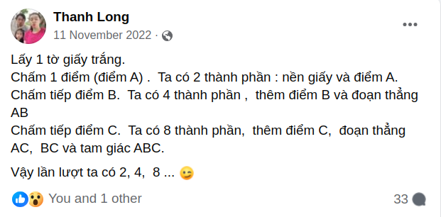
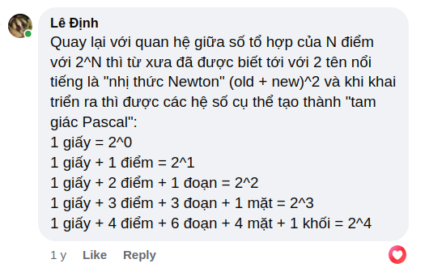
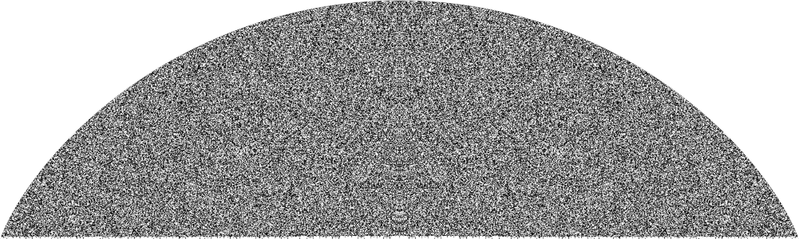
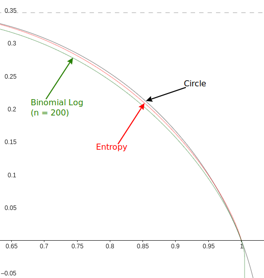
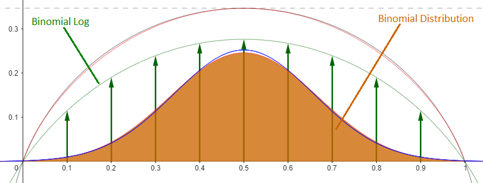
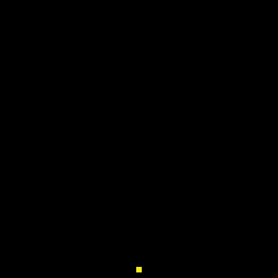
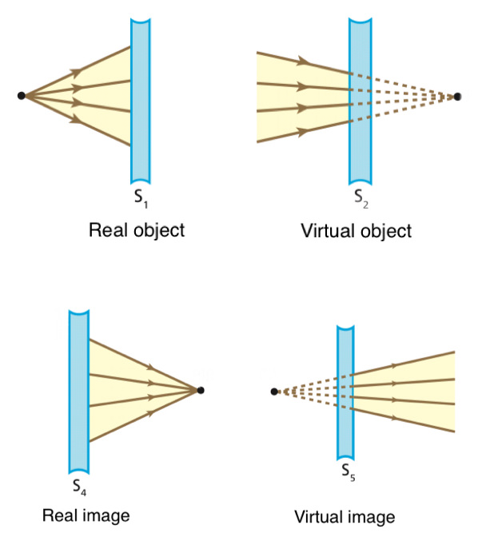

# Brainstorm
id:: 6653538a-30aa-423f-be89-848ad9c7e331
	- ((6651ecba-793d-43c5-8020-a9f260b032d8)) This is the ((665c92d1-565b-4911-a706-b32af429c3aa)) place for ((66536578-c4d3-43f1-b35c-bf71120f0570)).
	-
	- In possessive form like "Will's note", [the apostrophe `'` stands for](https://www.merriam-webster.com/grammar/history-and-use-of-the-apostrophe) the "e" in the suffix "-es" of [genitive form](https://www.merriam-webster.com/dictionary/genitive) of noun in the [Old English](https://en.wikipedia.org/wiki/Old_English).
	  id:: 66536ad3-264b-4351-868b-e7e8a7a82774
	  collapsed:: true
		- Now I propose to use apostrophe to further omit the "s" in possessive form, so 
		  collapsed:: true
			- `Will/mind/conceptual/head` in file management =
			- `Will.mind.conceptual.head` in programming =
			- "Will' mind' conceptual' head" in natural language!
	- **Id < *address* < context**  
	  id:: 66600918-ed92-40c9-bda5-1911865d676c
	  collapsed:: true
	  All content arrow is via its complement context:   
	  full content = apparent content carried by the form + hidden content (context as form)
		- form = condensed context = condensed hidden content
		- optimization = formation = context condensation (to the extremes like id)
		  + optimization frees the subject from the lengthy "irrelevant" context, but also constrains to the form!
	- All objects are arrows, addresses, vector, `v`'s
	  collapsed:: true
		- Relativity: The destination of that address is relative to the root object (intent, self).
		- The root object `O` is just another vector, hence the target of `v` from `O` is just `O+v`.
		- `v` is the diff, the change, the transformation, the effect brought to `O`.
		- Intensionally, it's the addition `O+v`, but extensionally it's the multiplication `O⋅v`.
	- The relativity & equality between form & content as 2 vectors
	  collapsed:: true
		- `u⋅v = 0` means orthogonal... but their "self threads" are parallel!?!
		- The portion of seen is the portion of orthogonal => parallel = unseen
		- We see a static object, which is almost parallel to us in time, thanks to the near orthogonal light rays from it! That's why we can only see its external shape, i.e. very little part of it.
	- directory/folder = namespace (exclusive)
	  id:: 6651ade9-43c6-4beb-9981-cb03d53dc23c
	  collapsed:: true
		- obj `Will` -> {in-world `Will/**`, ex-world `Will\*/*`} = {M, W} = {inner view cone, outer view cone}
		- Will's in-world contains properties of `Will`, like `Will/name`, `Will/age`, `Will/mind`, `Will/mind/conceptual`, `Will/mind/conceptual/{dog,mouse}`, etc.
		- Will's ex-world contains `Will` and other peers of `Will`, like `Na`, `Nyatty`, `Earth`, `Milky Way`, etc.
		  id:: 66600918-71e0-4cad-b37d-6ceacd7df5eb
		  collapsed:: true
			- In the top-down view, Will's ex-world can be partitioned by region, e.g. `Vietnam/house of Will/Na` vs `Japan/house of Harusada/Na`. But we use the ***relative*** (bottom-up) view from Will: `Will\1/Na` is just the dog Na closest to Will, i.e. `Will\1/Na` = `Will\2/house of Will/Na` = `Vietnam/house of Will/Na`.
			- The backslash is used in [MS-DOS/Windows' path](https://en.wikipedia.org/wiki/Path_(computing)#MS-DOS/Microsoft_Windows_style), in [PHP namespace](https://www.php.net/manual/en/language.namespaces.php), and as [Decimal Exponent Symbol](https://en.wikipedia.org/wiki/Scientific_notation "Scientific notation") in [ALGOL 68](https://en.wikipedia.org/wiki/ALGOL_68 "ALGOL 68"). Our use of `\u` as "u-level container" is nearest to the use in ALGOL 68.
		- Other notations of path:
		  collapsed:: true
			- `Will/mind/conceptual/dog`, `Will\1/Na` in file management
			- `Will.mind.conceptual.dog`, `Will^1.Na` in programming
			- "Will' mind' conceptual' dog", "Will^1' Na" in [natural language](((66536ad3-264b-4351-868b-e7e8a7a82774)))
		- Relation ref/arrow between objects in these worlds:
		  collapsed:: true
			- example: in -> ex: dog -> {Na, Nau}, mouse -> {Nyatty, Nyatto}
			- property composition: ex -> in: Na -> {dog, horse, monkey}
			- ((6651ecba-793d-43c5-8020-a9f260b032d8)) in -> in: dog -> {vocal: bark, genus: Canis}
			- extension/reference: in -> ex.in: `Will/mind/conceptual/dog` -> `Wikipedia/Dog`
			- relation: ex -> ex: Na -> {child: Nau, prey: Nyatty}
			-
	- `in` + `ex` = `con`
	  id:: 66600918-bbc8-4d92-8d46-dbda3eed92f0
	  collapsed:: true
		- form + partial content = intent + extent = full content (Ω)
		- id, key := value
		  collapsed:: true
			- id : type { type = {id : `*`} }
		- in-thread touches ex-thread
		  collapsed:: true
			- function ex = f(in)
			- variation of ex compared to in
			- in + ex unified to Ω thread (full content)  
			  -> in = form = abstraction of Ω
			- in reflects ex with distortions: abstraction, mixing
		- recursive bifurcation via recursive reflection:  
		  $e_0 = i_0 = c = con = ex + in = e_1 + i_1 = e_1 + (e_2 + i_2) =$  
		  $e_1 + (e_2 + (e_3 + (... i_n)))$
	- Convert all metadata to block-links
	  collapsed:: true
		- `#tag` = block-link
		- `property.subprop: some string value` is stored as an item with property `name` like this:
		  collapsed:: true
			- some string value 
			  name:: ((6651ea73-78b4-4c1a-b052-b2ea9555b6f6))
			  :LOGBOOK:
			  CLOCK: [2024-05-25 Sat 22:30:07]--[2024-05-25 Sat 22:30:08] =>  00:00:01
			  :END:
		- We can define property with composite value like this:
		  collapsed:: true
			- a composite
			  name:: ((6652048c-27b3-47b6-84e5-25af8d9ce801))
			  collapsed:: true
				- a component
				- another component
		- Store properties in sub-items:
		  It's simpler just to use sub-items to store properties. Then in the property `components` of the container item, we can collect forms (definitions) of these sub-item-properties into a list, like this:
		  components:: ((66532914-003a-4bbb-9e97-6f1c87170d7d)), ((66532bc2-a18e-43ab-86ac-a0f0f7dcbbb5))
		  collapsed:: true
			- ((6651ecba-793d-43c5-8020-a9f260b032d8)) This is an example of how to use sub-items as properties.
			- ((6652048c-27b3-47b6-84e5-25af8d9ce801)) This component contains sub-components:
			  collapsed:: true
				- a component
				- another component
	- Let's test `{{query}}` in Logseq:
	  collapsed:: true
		- Today: {{query <% today %> }}
		  id:: 66521398-7318-4d06-ac79-899f244a31c0
		- query-table:: true
		  query-sort-by:: block
		  query-sort-desc:: false
		  collapsed:: true
		  #+BEGIN_QUERY
		  {:title ["Property in namespace [uuid of property name]"]
		    :query [ 
		    :find (pull ?b [*])
		    :in $ ?uuid
		    :where
		      [?b :block/properties ?prop] 
		      [(get ?prop :name) ?name]
		      (or
		        [(= ?name ?uuid)]  
		        [(contains? ?name ?uuid)]  
		      )
		    ] ; end query
		    :inputs[ "((6652048c-27b3-47b6-84e5-25af8d9ce801))" ]
		  }
		  #+END_QUERY
		- query-sort-by:: block
		  query-table:: true
		  query-sort-desc:: false
		  collapsed:: true
		  #+BEGIN_QUERY
		  {:title "Block links [ uuid of destination blocks ]"
		  :query [
		    :find (pull ?b [*])
		    :in $ ?dest
		    :where
		     [?b :block/refs ?dest]
		   ]
		   :inputs [ [:block/uuid #uuid "66532bc2-a18e-43ab-86ac-a0f0f7dcbbb5"] ]
		  }
		  #+END_QUERY
		- [Logseq/Advanced Queries Examples](https://siferiax.github.io/#/page/logseq%2Fadvanced%20queries)
		- [Graphical explanation of pages, blocks and references](https://discuss.logseq.com/t/graphical-explanation-of-pages-blocks-and-references/15966)
	- Special properties built in Logseq
	  collapsed:: true
		- Example:
		  title:: Title
		  alias:: A, B, C
		  tags:: T, U, V
	- ((66533703-505d-432d-8368-6058eefb45f6))'s Alias: In addition to `A Alias: B, C`, add sub-items `- B alias of A  - C alias of A`, so that `B` and `C` can be referred directly.
	  id:: 665c912e-2186-4268-a99d-023a5ef46005
	  collapsed:: true
		- ((665caf87-7dd9-4e9e-9ebc-7df259e7d711)) ((665cb063-d8b5-461e-9dcd-12bb85db1ee7))
	- ((66533703-505d-432d-8368-6058eefb45f6))' "verbal/prepositional names" without colon:  
	  id:: 665c950f-78de-4e35-b83f-dc6f3790f6f8
	  collapsed:: true
	  to, from, because, ... X (name) <-> X clause (form)
		- ((665caf87-7dd9-4e9e-9ebc-7df259e7d711)) ((665c950f-4496-432d-8d7a-83cad6b60571))
	- logic chain & branches:
	  id:: 665c950f-4496-432d-8d7a-83cad6b60571
	  collapsed:: true
		- ((665caf87-7dd9-4e9e-9ebc-7df259e7d711)) ((665cb063-d8b5-461e-9dcd-12bb85db1ee7))
		- #If condition
			- #then do right
			- #else do wrong
		- [#from ] cause
			- [#to ] effect
		- Something
			- #from source
		- A
			- #to B
				- #to C
			- #and B'
			- #or B"
		- Context/subject/intent
			- #do something/action/content
				- #with arguments/object/peers/extents
	- function = mapping = transformation = arrow
	  collapsed:: true
		- relation = 2 way arrow (diff from + diff to = diff with)
		- Complement of "((667d0b78-fff6-49bc-90d5-165648ed56d3)) as 2 way arrow" is "relation as common part between related objects"
			- All verbs, prepositions and `noun:`s are arrows => sentence = general path
			- Alternate path (`\i/e\j/f...`) is similar to Fourier series, but diff!
			- Address = path with abstract intent, i.e. `\^n/e/f...`
			- Id = path with abstract intent & abstract extent
	- External context = external form
	  collapsed:: true
		- Each work item has an `ex` space (environment, address space, context) as the world view in contrast to the `in` space (self, component space, content).
		- Global context: ((66533703-505d-432d-8368-6058eefb45f6))
		- Local context: link collection in each project
		- Temporal context: pinned items (globally to ((66519638-cf5d-409b-9b98-15acabf2268c)) or locally to each project)
		- This ex-form is in contrast to the in-form discussed at...
			- here ((66600918-ed92-40c9-bda5-1911865d676c)) and
			- here ((66600918-bbc8-4d92-8d46-dbda3eed92f0))
	- [Name-form](https://en.wikipedia.org/wiki/Namarupa) = [key-value](https://en.wikipedia.org/wiki/Name–value_pair) = [form-content](https://encyclopedia2.thefreedictionary.com/Content+and+Form) ([Hylomorphism](https://en.wikipedia.org/wiki/Hylomorphism)) = [abstract-concrete](https://en.wikipedia.org/wiki/Abstract_and_concrete) = `[head](body)`
	  id:: 66669d80-3648-415c-b426-e8105cf6ef80
	  collapsed:: true
		- The part of content that "i don't care" (body) is abstracted, the remaining brief is called "head", "name", "key", etc. That head is further shortened [from the lengthy context to address, to name and to id](((66600918-ed92-40c9-bda5-1911865d676c))).
		- Now, in the view of the subject, that part is just a name, a symbol, a ref, a form, which can further be renamed, transformed into different forms to fit subjective views. E.g. the local name, local variable is the transformed name of the address.
		- In the subjective view, a concise name can be expanded into the content of the named object via many forms of embedding: (parenthesis), clauses like `which`, `where`, etc.
		- The name is the link between the named ((667cfa42-ade7-4310-9a7b-6d14d01c16da)) and the name using ((667cfa3e-9856-43f0-956b-ebb4ff31d8eb)).
			- In ((667cfa42-ade7-4310-9a7b-6d14d01c16da))'s side, the name is its abstraction.
			- In ((667cfa3e-9856-43f0-956b-ebb4ff31d8eb))'s side, the name is a part of the subject's content.
			- Hence, the name is an interface of the ((667cfa42-ade7-4310-9a7b-6d14d01c16da)) for the ((667cfa3e-9856-43f0-956b-ebb4ff31d8eb)) to use.
			- Thanks to its conciseness, the name can be used by many subjects. This use is the [mixing](https://en.wikipedia.org/wiki/Mixing_(physics)) of content between objects.
		- Naming = ε-abstraction is the `ob` part of the obop, while repeating = ω-extension (including, embedding) is the `op` part of the obop.
	- In-ex relativity: ways to turn inside out
	  collapsed:: true
		- intension - extension
		- inversive & projective geometry
		- tree view vs mountain range
		- vector multiplication
		- double cone of light & view
		- 0 & ∞ in Riemann circle
		- first diagram of Uniinfo
	- Internal form (substance) = external form (appearance)
	  collapsed:: true
		- external to a content form = internal to its container
	- 2 characteristics of the form are equivalent.
	  collapsed:: true
		- The wholeness (the roundness) -> there's a center point in each circle, even invisible, common (shared) to all parts (arrows) of that circle -> the common
		- The common -> all parts are linked together via that common (center) -> the wholeness
	- Balance as the destination of all forces: equilibrium, optimum, flatness, roundness, ...
	  id:: 6667c99a-792f-4230-9fc6-c5fae874daef
	  :LOGBOOK:
	  CLOCK: [2024-06-11 Tue 10:50:54]
	  :END:
	- Levels of numbers & thread
	  collapsed:: true
		- 4. Relaxed thread, constant velocity c, "straight/round", Turing machine, searching
		- 5. Compressed 1-dir thread (temporal), nonzero acceleration/curvature, probability, AI, optimization toward 1 dir
		- 6. Circular (2-dir) thread (spatial), negative velocity, quantum, AGI, uninet, perfection/balancing for all dirs
	- Thread ((66723642-58f1-4a74-bba3-0108f14c6bac))s: fractal circular blobs, tree, mountain range
	  id:: 6662725e-0e8e-42ec-927f-0e53b996e20c
	  collapsed:: true
	  :LOGBOOK:
	  CLOCK: [2024-06-11 Tue 10:48:10]
	  :END:
		- Transformation: simple circle of raw thread >-[add sub-circles]--> fractal circular blobs >-[extract head as "stalk", "stem", "branch"]--> tree >-[abstract the branches, leave only leaves (the canopy)]--> mountain range >-[stretch out]-> line (segment) >-[fold back]-> simple circle
		  collapsed:: true
			- With [the abstraction of body and extraction of head](((66669d80-3648-415c-b426-e8105cf6ef80))), a circle can refer to its sub-circles using heads of sub-circles.
			- In the collapsed/folded view, the content of a circle is just  
			  `[context] before a [head] and after it`
				- In the expanded/unfolded view, that content becomes  
				  `[context] before a [head](body of the sub-circle) and after it`
				- Words in the context can be either other sub-circles' heads, i.e. keywords, or global non-key words (prepositions) whose content is not closed in a concrete circle but open to the collection of all contexts using them.
				- These prepositions can have descriptions, or even definitions, but their true definition is the whole extension of contexts using them. That means a preposition can only be "understood" but cannot be transcluded (embedded, expanded, unfolded).
					- These prepositions are "atoms" of the system, when the whole system is expanded/unfolded, the "raw thread" is nothing but a chain of prepositions, as component arrows.
		- In a tree system, the path from root to a blob, i.e. the chain of heads of circular blobs, is the path/address of that blob, and the collection of all addresses create a branch system, an address space, a view cone.
		  id:: 6667d217-5269-4a34-8863-7fbb46e91ecc
			- The prepositions can be viewed as heads of circles in a meta-space outside of this address space, hence they cannot be unfolded within this space and can only be understood (unfolded) in the meta-space.
				- Instances of prepositions: constants in a formula, global objects in a local object (function), numbers as ids of mathematical objects as well as name of physical objects in computer, [objects of Will's `ex`-world in Will's world](((66600918-71e0-4cad-b37d-6ceacd7df5eb))).
		- There are many different ((66723642-58f1-4a74-bba3-0108f14c6bac))s of the same collection of objects, expressed as different address spaces.
		  collapsed:: true
			- An address space A can build its structure based on another meta-space B, where each address on A, called "name" (local name, logical address), is translated to an address on B, called "address" (full address, physical address), like in Markdown syntax `[local.name](address/to/target/object)`.
			- That namespace A is in general orthogonal to the underlying address space B, but can also reuse some parts of B to create "natural names", i.e. the names following the underlying structure.
	- Everything (intensionally) is address.
	  collapsed:: true
	  :LOGBOOK:
	  CLOCK: [2024-06-12 Wed 10:23:02]
	  :END:
		- Address = path to object = arrow/vector to object = (extracted) abstract of that ((667cfa42-ade7-4310-9a7b-6d14d01c16da)) in the ((667cfa3e-9856-43f0-956b-ebb4ff31d8eb)) = log(intent) = known content (content known by subject), AKA. "form"
		- Complement of address is content within object, AKA. "content", is the content part unknown to the ((667cfa3e-9856-43f0-956b-ebb4ff31d8eb)) and are not cared by the subject.
		- address + content = 0; |address| + |content| = 1; (space of address)*(space of content) = 1 where "space of x" = e^x
			- The (content space = extent of address) is the complement space of the ([address space](((6667d217-5269-4a34-8863-7fbb46e91ecc))) = intent of address).
			- The zero/empty address (`.`) is the name/id of everything:
				- its intent = 0 = ((66691d61-b8e9-4618-ac98-145056b646f4)) = the size of this subject compared to the Universe
				- its extent = ∞ = everything = the whole Universe
			- The infinity/full address (`∞`) including all content of the ((667cfa3e-9856-43f0-956b-ebb4ff31d8eb)) is the name/address of the Universe:
				- its intent = ∞ = the (image/reflection/model of the) Universe
				- its extent = 0 = the single center point in the Universe = this ((667cfa3e-9856-43f0-956b-ebb4ff31d8eb)) = ((667c015e-6223-4f8a-ae84-a93a49f4ff94))
			- Any (block of) text (of ((667cfa3e-9856-43f0-956b-ebb4ff31d8eb))) is a [static] description / [dynamic] program of an internal space called "intent". As a name/address, that text points to an external (object) space called "extent" which can be described (intensionally) by another text (object text) or just a pure extensional space without intension. The ((667cfa3e-9856-43f0-956b-ebb4ff31d8eb)) text is called "syntax" and the ((667cfa42-ade7-4310-9a7b-6d14d01c16da)) space is called (extensional) semantics. The intensional semantics, i.e. object text, is just a special case of the semantics.
	- Intension (description, address) >-[exp]-> intent (constructive extension, address/name space) >-[complement, reciprocal]-> extent (predicative extension, object/value space)
	  collapsed:: true
		- The good old diagram 😊 ([from Mar 2011](https://docs.google.com/drawings/d/1ki-Zwf4N5KTbGZ5XdGlEOrDyV7SWIYnlPi_uKoblWdA/edit?usp=sharing))
		  
	- Ways to extend space:
	  id:: 667d202e-f401-46ba-ab32-c4fd77b49ab1
	  collapsed:: true
		- [extension by time](((667c001e-83b9-4de5-bf81-1c71898340a2))) = $e^t$ = continuous extension vs. extension by combination = $2^n$ (power set, CombiNat) = discrete extension
		- extension by power set
		  id:: 667e1011-5dff-46c6-8e1b-85587e2f0e3e
			- Philosopher's concept construction
			- Thanh Long's [geometric simplex construction](https://www.facebook.com/trthanhlong/posts/pfbid0hXoTpzDTiTfoF1SF8SVhRVRQsBDZ8U6qBwvdEhadYwQYvVHa4XdMJBLbjb7fKvVXl?comment_id=1188167641770652&reply_comment_id=592562689295735)
			  collapsed:: true
				- Original post
				  
				- My comment about relations to [combinatorics](https://en.wikipedia.org/wiki/Combinatorics): [Newton binomial](https://en.wikipedia.org/wiki/Binomial_coefficient) & [Pascal triangle](https://en.wikipedia.org/wiki/Pascal%27s_triangle)
				  
		- ((6675369a-1d13-48c5-8a77-d588aa8b59b8)) can be naturally refined to $2^t$, while radix numbers are difficult to be refined (built for extension, not for refinement)
			- Radix fraction, e.g. $10^{-n}$, is inverse extension, i.e. intension (negative extension), not refinement
		- intension refinement = extension expanding
		  :LOGBOOK:
		  CLOCK: [2024-06-28 Fri 08:11:13]
		  :END:
			- spirorus extending, thread solidity
		- constant velocity of light = constant sum of squares 
		  id:: 667e0e4b-9f87-45b5-adb1-297b79943502
		  => distortion (from [perfect circle](((6667c99a-792f-4230-9fc6-c5fae874daef)))) = extending to other dimensions
			- Radius of circle = height of tree 🎄 = intension = log(intent) = articulated limb = const length loop collapsed into a polyline
			  id:: 66875f13-3385-48d5-99b1-fb72dc53291d
			  collapsed:: true
				- each segment = a level of diff (derivative) = a digit of number
				- locus of all segments = locus of intension (collapsed) circle = spirorus
				  + But only the tip is visible => see only a trace of tip point = extent
			- There's a very neat connection between this circle and the [power set above](((667e1011-5dff-46c6-8e1b-85587e2f0e3e))) via [log of binomial coefficients](https://math.stackexchange.com/a/4833062/1290859)
			  id:: 6683ea7b-d7ee-460e-94bb-1b0c2a050a52
			  collapsed:: true
				- A plot of [thousandth row of Pascal's triangle in binary](https://en.wikipedia.org/wiki/Portal:Mathematics/Featured_picture_archive#/media/File:Pascal's_triangle_-_1000th_row.png)
				  
				- Analyze it with GeoGebra applet [BinomialLog](https://www.geogebra.org/m/pkyzd4n4).
				  id:: 6683ea7b-45c9-446c-8f13-6cfc3083de89
				  collapsed:: true
					- The half of logarithm of [binomial coefficient](https://en.wikipedia.org/wiki/Binomial_coefficient) approaches the [binary entropy function](https://en.wikipedia.org/wiki/Binary_entropy_function) $H_b$ in base $e^2$, as $n$ approaches infinity, which is very close to an arc of a perfect circle.
						- Binomial coefficient $$ B{\binom{n}{k}} $$ = $$ C_k^n $$ = number of k-combinations of n, and [beta function](https://en.wikipedia.org/wiki/Beta_function) B(p, q):
						  $$ B{\binom{n}{k}} = \frac{n!}{k! \cdot (n-k)!} = \frac{(n+1)^{-1}}{\Beta(k+1, n-k+1)} $$
						- Normalized log of binomial: ($x = k/n$)
						  $$ lB_n(x)=\frac{\ln(B\binom{n}{xn})}{n} $$
						- $lB$ approaches $H_b$ in base $e$ as $n$ approaches infinity:
						  $$ \lim_{n \rightarrow \infty }lB_n(x) = 
						  H_b(x) = -(x \cdot \ln(x) + (1-x) \ln (1-x)) $$
						- Half of $lB$ approaches $H_{bs}$ ($H_b$ in base $e^2$) as $n$ approaches infinity:
						  $$ \lim_{n \rightarrow \infty } \frac{1}{2} lB_n(x) = 
						  H_{bs}(x) = -\frac{1}{2} (x \cdot \ln(x) + (1-x) \ln (1-x)) $$
						- $H_{bs}$ (in red) is very close to an arc of circle *C* (in black):
							- {:height 539, :width 505}
						- Distributions
							- In [binomial distribution](https://en.wikipedia.org/wiki/Binomial_distribution) of a fair coin, $X$ ~ $B(n, p=1/2)$, the probability of getting exactly $k$ heads in $n$ independent [Bernoulli trials](https://en.wikipedia.org/wiki/Bernoulli_trial) is the ratio between the number of $k$-combinations and the total number of combinations $2n$:
							  $$ Pr[X = k] =  \frac{B\binom{n}{k}}{2^n} = B_d(n, k) = B_d(x) [x = \frac{k}{n}] $$
							- When $n$ approaches infinity, this distribution approaches the [normal distribution](https://en.wikipedia.org/wiki/Normal_distribution) $N(μ=n/2, σ^2=n/4)$, and its probability mass function $B_d(x)$, normalized by scaling both axes by $\sqrt n$ and centering to 1/2, approaches the probability mass function $φ(x| μ=0, σ=1/2)$ of the fair normal distribution $N(μ=0, σ^2=1/4)$:
							  $$ \lim_{n \rightarrow \infty } {\sqrt n} B_d( \frac{x}{\sqrt n} + \frac{1}{2} ) = φ(x | μ=0, σ=\frac{1}{2}) = \sqrt{\frac{2}{\pi}} e^{-2 x^2} $$
							- 
						- Derivatives
							- Derivative of the binary entropy function $H_b$ is the negative of [logit function](https://en.wikipedia.org/wiki/Logit) which is the inverse function of [logistic function](https://en.wikipedia.org/wiki/Logistic_function). 
							  $$ dH_b(x) = -\ln(x) + \ln(1-x) = - \ln(\frac{x}{1-x}) = - logit(x) $$
							- Its second order derivative is the negative reciprocal of the [logistic map](https://en.wikipedia.org/wiki/Logistic_map).
							  $$ ddH_b(x) = \frac{-1}{x⋅(1-x)} $$
							- The logistic map $x⋅(1-x)$ is the core form of [beta function](https://en.wikipedia.org/wiki/Beta_function):
							  $$ B(p,q) = \int_0^1 x^p (1-x)^q dx $$
				- This arc is the distribution of (entropy = log of numbers) of thousand-bit words whose weight (number of 1s) equals k: k = 1 -> 1000 from left to right. The (entropy = log of numbers) of all thousand-bit words is (N = 1000) which is normalized to 1 (= N/N) in this circle plot. This entropy distribution is the log of [binomial distribution via convolution](https://en.wikipedia.org/wiki/Pascal%27s_triangle#Relation_to_binomial_distribution_and_convolutions).
				- That plot was added to Wikipedia page of Pascal's triangle at [17:07, 11 March 2011](https://en.wikipedia.org/w/index.php?title=Pascal%27s_triangle&oldid=418321493)‎, but then removed and replaced with the [animation](https://en.wikipedia.org/wiki/Pascal%27s_triangle#/media/File:Pascal's_Triangle_animated_binary_rows.gif).
				  collapsed:: true
					- 
	- mặc cảm
	  id:: 6684f334-6db2-4e2e-8e03-d62f6ec97364
	  collapsed:: true
		- ((6684f334-6db2-4e2e-8e03-d62f6ec97364)) in English:
			- [complex](https://en.wikipedia.org/wiki/Complex_(psychology)) is a term in psychoanalysis, introduced by Jung from 1900s and then adopted by the folk in everyday talk, too.
			- [hang-up](https://en.wiktionary.org/wiki/hang-up) is a slang somehow equivalent to "complex".
			- [self-consciousness](https://en.wikipedia.org/wiki/Self-consciousness): "be self-conscious about ..." = "[mặc cảm](https://en.wiktionary.org/wiki/m%E1%BA%B7c_c%E1%BA%A3m) về ..."
		- ((665359ff-79f1-4669-b10b-f2b0e633a7c1))
			- The complex of the psyche is [due to the unreal/imaginative part]((https://www.psychologytoday.com/us/blog/the-imprinted-brain/201408/cognitive-complexes-everyone-s-hang-especially-sex)) intertwined with the real/actual part, just as the complex number.
		- My complexes:
			- Mặc cảm tội lỗi
				- My guilt complex
				  id:: 6684f7c4-bb8e-4c91-8c49-f65051b09b16
			- Mặc cảm vô dụng
				- My worthlessness (inferiority) complex is the drive for my ((6678d594-9819-4624-abd6-d4ec62b3874f)). It has been accumulated from the social critiques due to my strangeness.
			- Mặc cảm lừa dối
				- My lying complex
	- The threshold/doorstep between death & life = singularity = double cone
	  collapsed:: true
		- dying = black hole
		  collapsed:: true
			- inversion of space & time: stuck in one place & sinking inside, while the whole time is visible "on the screen" just like space.
		- being born = white hole
	- Size of particle (quantum) = intent = 1/extent = reciprocal of size of the world
	  collapsed:: true
		- Radius of particle = reciprocal of curvature of particle => the "point particle" moves in straight line
		- Curvature ~ limit velocity (c, speed of light) ~ size of world, all are determined by the radius of particle
			- The constancy of the speed of light is just because of the constancy of the quantum size which in turn is due to the commonness of the quantum.
		- Size of particle $dt$ determines the fineness of derivative $dx/dt$
			- Varying $dt$ from ∞ -> 1 -> 0, we have the average (center of mass) $\bar{x} = E[f(t)]$ -> the function $x = f(t)$ itself  -> derivative $\dot{x} = f'(t)$
		- [?] What's the relation to
		  ((66875f13-3385-48d5-99b1-fb72dc53291d))
	- DOING i, the internal imaginary impression that bridges the gap, complete the circle, reverts (reduces) the entropy of the external "real" world, is the internal image reflecting the external world.
	  id:: 668d08c7-ec2d-4188-9745-6ccf643c9132
	  :LOGBOOK:
	  CLOCK: [2024-07-09 Tue 16:38:07]
	  :END:
		- ((66602f68-e23f-4b24-921e-b1a9fc0cc731)) this ((668d0827-7ff2-468c-b62c-3f1d072119ac))
		  :LOGBOOK:
		  CLOCK: [2024-07-09 Tue 16:28:26]
		  :END:
		- The "real vs imaginary" is just a relative pair like the "real object - virtual image" & "real image - virtual object" in optical physics.
		  collapsed:: true
			- 