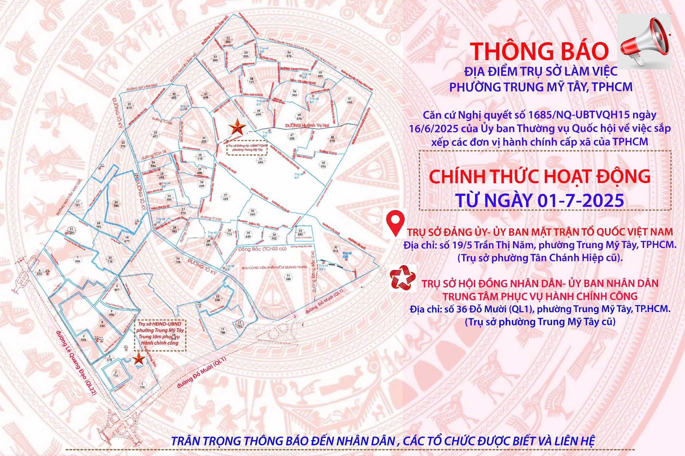
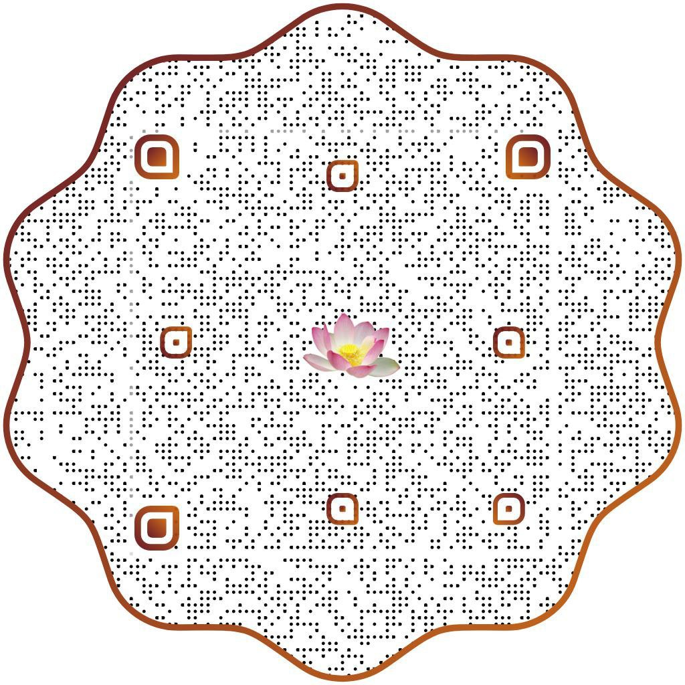
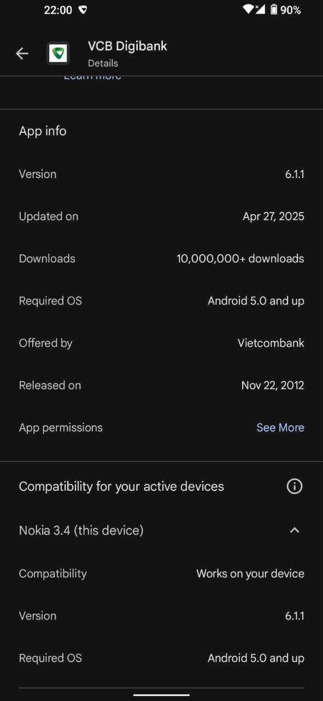
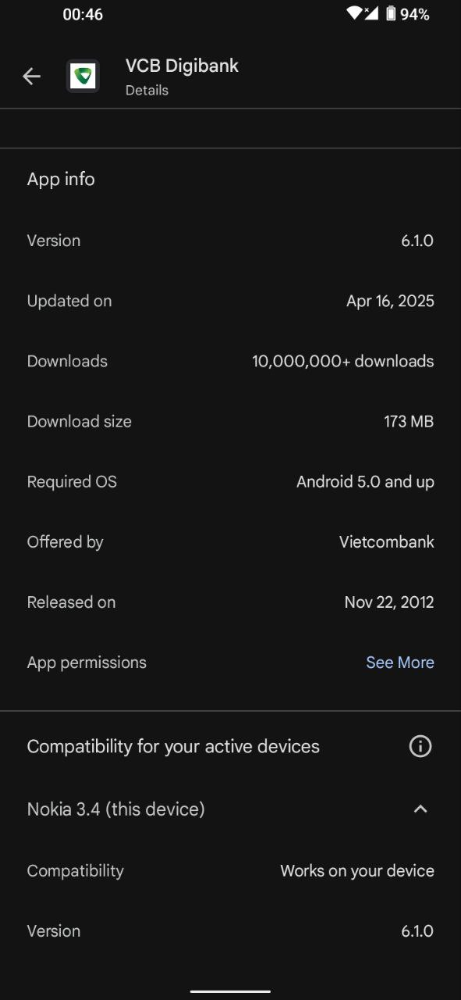

- The Vietnamese [đàn cò](https://youtu.be/-VKGJq6GUlw) & đàn bầu have carried me away for a tour reviewing the national root in my heart... to contemplate both sides and then release it.
- ---
- An experiential witness of the Impermanence in... a dream! 😎
	- [My life is a dream, my dream is alive!](https://creatzynotes.blogspot.com/2011/12/my-life-is-dream-my-dreams-are-alive.html)
	- Although the “dream” is usually used as a metaphor for the unreal, my literal dream has shown a very realistic realization of the whole life!
	- To the world outside of the dream, the dream is so illusionary, but to the dream, the outside world is no less illusionary. Hence, both of them are as real as illusionary 😜👻! In other words, everything is a **real illusion**.
		- 🌀 Real Illusion
			- The illusion is real. Literally.
			- Not just metaphorically — it exists, it appears, it affects — that’s a real being with real effects.
			- The unreality of the illusion is just its way of being. And its being is real.
			- The Real Illusion is just another name for the [Liar Paradox](https://en.wikipedia.org/wiki/Liar_paradox).
	- The gatha of [Diamond sutra](https://en.wikipedia.org/wiki/Diamond_Sutra):
		- > तारका तिमिरं दीपो मायावश्यायबुद्बुदं। सुपिनं विद्युदभ्रं च एवं द्रष्टव्यं संस्कृतं।
			- Như sao đêm, như mắt loạn, như ngọn đèn, như huyễn thuật, như sương mai, như bọt nước, như cơn mộng, như ánh chớp, như đám mây — những gì hữu vi nên được quán chiếu như vậy.
		- > 一切有爲法
		  如夢幻泡影
		  如露亦如電
		  應作如是觀
			- > Nhất thiết hữu vi pháp
			  Như mộng huyễn bào ảnh
			  Như lộ diệc như điện
			  Ưng tác như thị quán.
			- Tất cả pháp hữu vi
			  Như mộng ảo, bọt bóng 
			  Như sương sa, chớp lóe
			  Nên quán sát như vậy.
- ---
- Accept–Release
	- Accept the form as is, release the grasp, and let the thread flow.
	- accept → release → flow:
	- Let it be → Let it go → Let it flow
		- My common saying: Let it go, let it flow!
- 🌊 Flow + 🌱 Form = 🌺 Flower  
  “The flower is the moment the flow takes form.”
	- Word play: “flower” = “flow-er” = flowing being
	- In Japanese culture, the word “flower” (花, hana) is deeply symbolic with not only beauty, but also transience, and the ephemeral nature of life.
		- Mono no aware (物の哀れ) – “The pathos of things”
		- Ikebana (生け花) – “Living flowers”
		- Kado (花道) – “The Way of the Flower”
		- [すべての人の心に花を](https://youtu.be/p-gmKHK2VPs)
- ---
- Thread theory of sound
	- A complex tone is like a bundle of overtones (threads), and [pitch](https://en.wikipedia.org/wiki/Pitch_(music)) is the **greatest common factor** — the shared cycle
	- Just like SCIFER finds the deepest **common structure** in seemingly separate threads, the ear finds the deepest common cycle among frequencies — the perceived pitch. This is shown best in the complex tones [missing fundamental frequency](https://en.wikipedia.org/wiki/Missing_fundamental).
	- Đàn bầu is played soley with [flageolet tones (pinched harmonics)](https://en.wikipedia.org/wiki/String_harmonic), which is an advanced technique on other instruments like violin, guitar, etc.
		- The sound is pure, glassy, and floating, because it's made entirely from string harmonics — no pressed tones. That’s why the đàn bầu sounds so “airy” and “spiritual”.
- ## Current Chips
- ## 2025 Mind Chips
  id:: 6842ab6e-a465-4b20-bbf0-196eeb879e3c
  collapsed:: true
	- Tân Chánh Hiệp → Trung Mỹ Tây
	  collapsed:: true
	  :LOGBOOK:
	  CLOCK: [2025-06-30 Mon 11:19:52]
	  :END:
		- Cũng trân trọng thông báo đến bà con trong khu phố, kể từ ngày 01/7/2025,khu phố chúng ta sẽ là khu phố 38 phường Trung Mỹ Tây (không còn là khu phố 14 phường Tân Chánh Hiệp nữa).
		- Bản đồ trụ sở phường Trung Mỹ Tây
		  collapsed:: true
			- 
	- 2025-01-02
		- The tour into the universe of Unithread:
			- point: seen from the outside
			- bulk of content c: differentiated but orderless
			- Omnifold c/i: ordered by the direction of intent i
				- The omnifold is the unit hyper-box
				- Different intents see different omnifolds of the same bulk c (const)
			- ohm-thread: unfolded into a circle
				- The space is extended from the unit hyper-box
			- ohm-plane: projected into the view cone of i
			- ohm-pipe: extended in time (axis of i)
				- AKA ohm-current: shown with sine waves
	- 2025-01-11
		- Law of "the same content in different forms"
			- const = |content| = radius
			- phase = state = configuration of content = internal form
			- circle = trajectory = extension = external form
			- wave = transition between internal form & external form
			- round circle = "uniform distribution" config = all quanta of content have the same phase = straight radius
				- in unwrapped phase plane: vertical straight bar of radius (space) slides horizontally along phase (time) axis
		- "⏰ posture" = positions of its hands, just like a person with 2 hands.
			- "clock hands" is from "pointing hands" 👆 focusing on its functionality
			- "clock arms" is from the overall shape of a body with two limbs 💪.
				- the spade ♠️ at the end of the arm resembles the pointing hand 👆
	- 2025-01-13
		- [Gate gate paragate](((6835b167-048c-499b-bede-8baff58e6e8e)))
			- {:width 200}
	- 2025-01-18
		- 🕉 Ōm‌m‌.
			- om-thread = mạch ông /oŋ‌m˧˧/
			  Oṃ /oɱ/
			  ॐ = अ (a) + उ (u) + chandrabindu (ँ, ṃ).
			  [https://en.wikipedia.org/wiki/Chandrabindu](https://en.wikipedia.org/wiki/Chandrabindu)
			  [https://en.wiktionary.org/wiki/%E1%B9%83](https://en.wiktionary.org/wiki/%E1%B9%83)
			  [https://en.wiktionary.org/wiki/%C9%B1](https://en.wiktionary.org/wiki/%C9%B1)
			  Ohm = oheim = ông chú: [https://en.wiktionary.org/wiki/Ohm#German](https://en.wiktionary.org/wiki/Ohm#German)
			  [https://www.rigpawiki.org/index.php?title=Pronunciation_of_Sanskrit_words](https://www.rigpawiki.org/index.php?title=Pronunciation_of_Sanskrit_words)
			- -> A dot on top of n equals the "ng"-sound in wrong. Examples are the word Saṅgha
			- -> A dot and a half-moon circle on top of m̐ also equals the "ng"-sound in wrong. Examples are the syllables om̐ and hūm̐. Although om̐ takes the m̐ it is nevertheless pronounced "om" rather than "ong". hūm̐ however is thus pronounced as the Tibetans would as "hung".
	- 2025-01-31
		- Chatbots' comments on my very brief summary of Uniinfo:
			- [https://playground.allenai.org/thread/msg_U8T1P2S8W5](https://playground.allenai.org/thread/msg_U8T1P2S8W5)
			- [https://chat.qwenlm.ai/c/69bd801e-31e4-40ba-9914-f79d8436a234](https://chat.qwenlm.ai/c/69bd801e-31e4-40ba-9914-f79d8436a234)
			- [https://chat.deepseek.com/a/chat/s/7ae3b24f-57a4-4060-8365-d79c79bac3f3](https://chat.deepseek.com/a/chat/s/7ae3b24f-57a4-4060-8365-d79c79bac3f3)
			- [https://gemini.google.com/app/a4e4e9aa2ed8f306](https://gemini.google.com/app/a4e4e9aa2ed8f306)
			- [https://claude.ai/chat/7009c0e6-3330-48ee-bc57-9daaa02e041b](https://claude.ai/chat/7009c0e6-3330-48ee-bc57-9daaa02e041b)
			- [https://mistral.ai/news/mistral-small-3/](https://mistral.ai/news/mistral-small-3/)
			- [https://kimi.ai/chat/cufgq846toibu9n6i9kg](https://kimi.ai/chat/cufgq846toibu9n6i9kg)
		- **[FILE]**: [Uniinfo podcast 4 transcription.srt.txt](file:///home/dinhlx/source/UniinfoNotes/assets/Will/story/2025-06/TelegramSaved_2020-02_2025-05/files/Uniinfo podcast 4 transcription.srt.txt)
		- Update notes: (done)
			- uninet may be mistaken with the omnifold, as a grand network of the whole Universe, due to its name. It's actually a universal network, but just a reflection of the omnifold on computer, not the whole. (This confusion appeared in one NotebookLM's audio overview)
				- Trinion (metaphysical) ~ Ω-thread (mathematical) ~ uninet (computer implementation)
				- In the future, if there is a need for a theory of uninet, it may be called "Uninet Theory", but now we just have uninets as instances of the Trinion implemented on computer.
			- Trinion, obop and qualiton are easily confused with each other.
				- Obop being & qualiton being are, just like all beings, instances of the Trinion.
				- Obop corresponds to the Equal component of the Trinion, and operates the Trinion using the CIE equation.
				- Qualiton is to quantum in Unithread as intent is to extent in the CIE formula. It's the "elementary particle" of intent/quality, hence the "smallest" instances of the Trinion.
				- In brief, Trinion -[Equal]-> obop -[intent]-> qualiton
				- Furthermore, the qualiton in uninet is called "autonoton".
			- Unïnfo can also capture the vague notion that "everything is information", which is _**not** a formal statement_ but can be sensed throughout the Unïnfo Theory.
				- That vague notion of the "universal information underlying everything" is formally modeled as the Ω-thread, which is again usually vaguely referred to as the "Unithread"! 😊
				- Formally, both Unïnfo and Unithread are the names of theories.
				- Formal concepts are the Trinion and the Ω-thread.
				- The whole Ω-thread is an instance of the Trinion, hence a **concrete thing**, i.e. a "being", but its partial chunks (segments called simply "threads") can represent anything, including the abstract concepts.
				- Each Ω-thread runs through the whole Ω (Omnifold = Universe) in a particular way corresponding to a particular configuration of the Universe.
	- 2025-02-02
		- Triangle inequality, balance restoration, intent resolution:
			- imbalance: c > i*e => driving force to restore balance
				- The log(c/(i*e)) is the thickness of the self wall. At equilibrium, the wall resolves.
			- balance: c = i*e, entropy max (reached limit resolution i0, round), action min (straight)
			- dynamic balance: the limit resolution i0 is just a threshold sustent which is very far from the next step in the ladder of infinite sustents. It's just the intent of a very large self, with a very thin self wall.
			- the law of the same content: all circles have the same content, their absolute crystallized content is 1, but their measured content (i*e) is always less than 1.
		- [https://youtu.be/FuhvgdXi-FI?si=niYFQFZNrbBzqLTd](https://youtu.be/FuhvgdXi-FI?si=niYFQFZNrbBzqLTd)
	- 2025-02-03
		- [New theory unites Einstein’s theory of relativity with quantum mechanics](https://www.thebrighterside.news/space/new-theory-unites-einsteins-theory-of-relativity-with-quantum-mechanics/)
		- [postquantum theory of classical gravity](https://www.nature.com/articles/s41467-023-43348-2)
		- **[FILE]**: [Unïnfo_Notes_Full_Overview_2025_02_02_en_US_transcription.srt](../assets/Will/story/2025-06/TelegramSaved_2020-02_2025-05/files/Unïnfo_Notes_Full_Overview_2025_02_02_en_US_transcription.srt)
		- **[FILE]**: [Unïnfo Notes Full - Overview 2025-02-02 (en-US).srt](../assets/Will/story/2025-06/TelegramSaved_2020-02_2025-05/files/Unïnfo Notes Full - Overview 2025-02-02 (en-US).srt)
	- 2025-02-23
		- 3 types of linearity: r = 0, repeat the same pattern, in nD space: n axises have the same distribution
	- 2025-04-09
		- How to grasp the zero, the emptiness, the null, the void?!
		  3 marks reminding me to release
			- 1. Tonight, i have a vision that the vacancy has no place, no position! (Anywhere = 3rd meaning of the zero)
			- 2. Last experience of the dead state
			- 3. Previous realization of time to shift from target aiming to restarting
			  => Maybe this is the last thing i must release: the vision
		- 3 meanings of zero:
			- 1. ε, very small, thin air, for intent
			- 2. ♎, balance, cancellation, for sustent
			- 3. Any, every, arbitrary => possible, potential => universali{ty,st,sm}, "anyness" 😁 => 1, ω, all, Omnifold, for extent (ω) & content (1)
			  "Anyness and Pure Form"** by Paul Carus:
			  [https://www.jstor.org/stable/27900550?seq=2](https://www.jstor.org/stable/27900550?seq=2)
		- Meaning 1 & 3 are parts of the view cone, whose point is formed by meaning 2.
	- 2025-04-12
		- Circle = soliton = singularity = pole = zero (root, origin, solution) = substantial point (intensity = 0/1) = substance = obop
		- intent = abstracted part = projection ray = denominator = radial part (radius) of the eye (vs transversal part = extent = angle)
		- in both (n+1)-dim homogeneous coordinates and polar coordinates, the depth r is the scaling factor which is abstracted by division in the screen (flat or circle)
		- [https://youtu.be/iLkOBkWUDkM?si=tzya5zmGZCPjMwoq](https://youtu.be/iLkOBkWUDkM?si=tzya5zmGZCPjMwoq)
		  [https://en.wikipedia.org/wiki/Argument_principle](https://en.wikipedia.org/wiki/Argument_principle)
		  [https://en.wikipedia.org/wiki/Residue_(complex_analysis)](https://en.wikipedia.org/wiki/Residue_(complex_analysis))
		  [https://en.wikipedia.org/wiki/Fundamental_theorem_of_algebra](https://en.wikipedia.org/wiki/Fundamental_theorem_of_algebra)
		  [https://en.wikipedia.org/wiki/Cauchy%27s_integral_theorem](https://en.wikipedia.org/wiki/Cauchy%27s_integral_theorem)
	- 2025-04-13
		- The remaining nasal mucus has shown me the strong conflict between grounding in the body and doing external works
			- at home, though warm & hot, the distractions still make me cough: sex, theory, communication, research, etc.
			- other cases: last Friday caught up in the task, in days off for illness..., open-close eyes experiment in COVID-19 lockdown
	- 2025-04-20
		- [https://www.sciencealert.com/shocking-videos-show-snakes-really-do-swallow-their-own-tails](https://www.sciencealert.com/shocking-videos-show-snakes-really-do-swallow-their-own-tails)
		- {:width 200}
		- गते गते पारगते पारसंगते बोधि स्वाहा | Gate gate pāragate pārasaṃgate bodhi svāhā | Vượt qua, vượt qua, vượt qua bên kia, vượt qua hết bên kia, Giác Ngộ, ôi tuyệt vời!
	- 2025-04-21
		- [https://youtu.be/djWOyahjeGw](https://youtu.be/djWOyahjeGw)
	- 2025-04-22
		- [https://www.businessinsider.com/google-openai-anthropic-ai-agents-training-data-2025-4](https://www.businessinsider.com/google-openai-anthropic-ai-agents-training-data-2025-4)
		  [https://storage.googleapis.com/deepmind-media/Era-of-Experience%20/The%20Era%20of%20Experience%20Paper.pdf](https://storage.googleapis.com/deepmind-media/Era-of-Experience%20/The%20Era%20of%20Experience%20Paper.pdf)
		- Gravity = entropic force/effect from electromagnetic field (light)
		- [https://www.advancedsciencenews.com/new-theory-suggests-gravity-is-not-a-fundamental-force/](https://www.advancedsciencenews.com/new-theory-suggests-gravity-is-not-a-fundamental-force/)
	- 2025-04-24
		- Discrete Mapping --[refine via exp.log]--> continuous flow
			- intent: linearly refine argument (log): dx = x/n
			- extent: multiply n times y = (1 + dx)^n
	- 2025-04-28
		- Additional distribution: transversal: content = intensive part (center) + extensive part (peripheral)
		- Multiplication of projection: radial: scaling via view cone, content = intent * extent
		- exp: rotational: recursive projection
	- 2025-05-08
		- VCB app autoupdated successfully
		  collapsed:: true
			- {:width 300}
			- {:width 300}
			- {:width 300}
	- 2025-05-11
		- Spirorus = divergence (inner flow + polar wave) + curl particle
		- Huygens principle = intrinsic dynamic = light/effect flow (dynamic content) in space (static form) = change = self diff
		- effect flow + projective thread (distribution) = wave equation = Newton mechanics = momentum conservation = reciprocal forces between content & form (Newton 3rd law)
		- average = center = balance ⚖️ = zero sum = target of (min sum optimization = restoring force) = bottom of potential well
		- n-th derivative (in time) = n-th moment (in space) ?! ==> chain of intents in particle = cone of extents in field (wave)
		- About "moments" from "momentum = movement":
			- now = the current moment = ever moving flow
			- mechanics & maths: 1st, Balance of Scale: The critical tiny movement of a scale’s arm (⚖️) tied to arm length and weight sparked the study of "moment of force" (torque) and other moments like moment of inertia,... Then, the study of balance ♎ leading to center of mass and many other measurements relating to the distribution of mass, esp. the moment of inertia which leads to the term "moment" in maths.
	- 2025-05-26
		- [https://t.me/proxy?server=43.199.172.86&port=443&secret=f7ab4759fcd498f2e434ae29a8b4344d](https://t.me/proxy?server=43.199.172.86&port=443&secret=f7ab4759fcd498f2e434ae29a8b4344d)
	- 2025-05-27
		- can this proxy bypass Fortinet?
		- Oh yes, it CAN! 😊
	- 2025-06-01
	  id:: 6841400e-d2c5-47ab-a838-7418a53a5b34
	  collapsed:: true
		- [Căn bản, gốc rễ, cội nguồn](https://creatzynotes.blogspot.com/2021/05/can-ban-goc-re.html)
			- Tree = root system + shoot system = double cone
			- obop = herenow = mixer of content to produce new forms