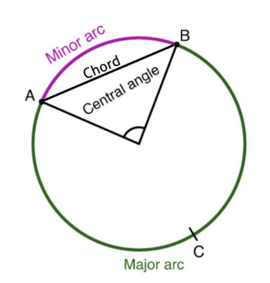
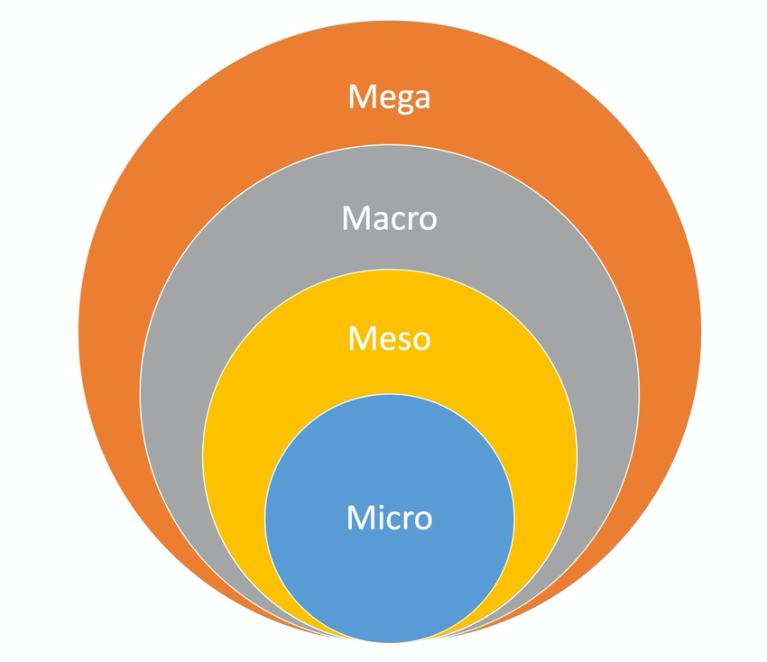

- ---
-
- 3 ways: chord, minor arc, major arc
  collapsed:: true
	- Circles: effect circle, knowledge circle
	- 
	- The final result is the straight chord $AZ$, the formula “$A = Z$”, the abstract, the means, the cable transport directly from the base to the mountaintop, the external form.
	- The [proof](https://en.wikipedia.org/wiki/Mathematical_proof) is the minor arc $⌒AZ$, the program, the machinery of the means, the paved road, the road on map, the internal form.
	- The whole process of discovery is the major arc $⌒ABC...Z$, the wave, the content, the every path through the forest.
- ---
- 4M Framework
  collapsed:: true
	- 
		- [Understanding Academic Integrity from a Teaching and Learning Perspective: Engaging with the 4M Framework](https://www.researchgate.net/publication/343917710_Understanding_Academic_Integrity_from_a_Teaching_and_Learning_Perspective_Engaging_with_the_4M_Framework)
	- Micro ($\epsilon$): The realm of units, individuals, atoms
		- Scientific: The realm of individual atoms, molecules, or cells.
		- Social: Focused on the individual person, their specific behaviors, and one-on-one interactions.
	- Meso ($\omicron$): The "middle" realm of groups
		- Scientific: The bridge where individual fluctuations (like thermal noise) begin to affect the average properties of a material.
		- Social: The level of departments, local communities, or small social networks.
	- Macro ($\eta$): The realm of organisms & organizations, where [entropy](https://en.wikipedia.org/wiki/Entropy_(information_theory)#Definition) becomes a deterministic law
		- Scientific: The scale where objects are visible to the human naked eye and obey classical mechanics.
		- Social: The level of entire institutions, national policies, or whole organizations.
	- Mega ($\Omega$): The realm of the total, globe, universe
		- Scientific: The scale of entire systems, regional distributions, or the cosmos.
		- Social: The largest possible lens, representing international communities, global ideologies, or planetary systems.
	- Notes
		- While "meso" = "middle" is best for the human size, it's been used for the lower scale like [mesoscopic physics](https://en.wikipedia.org/wiki/Mesoscopic_physics). So i use "macro" to denote human scale, following the tradition.
		- The "macro" and the "mega" are usually used interchangeably, either as the human size like [macroscopic/megascopic scale](https://en.wikipedia.org/wiki/Macroscopic_scale), or as the cosmic size like [macroscope](https://en.wikipedia.org/wiki/Macroscope_(science_concept)).
- ---
- BP-free models: Basically, the global target (loss function) and global effect (backprop) are replaced by the local ones.
	- [Equilibrium Propagation (EP)](https://pmc.ncbi.nlm.nih.gov/articles/PMC5415673/) is like a neutral FABRIK: each weight is updated according to its 2 ends (neurons' state/value) only.
	- EP is a special kind of Contrastive Hebbian Learning and Contrastive Divergence, which are in the general class of local learning rules.
	- [Predictive Coding](https://youtu.be/l-OLgbdZ3kk) uses 2 types of neuron for each node, just like the obop model: prediction = op, error = ob.
- ---
- Obop model in various fields
	- Unithread: ob viewcone = input circle; op = output arrow
		- FoC: ob = division = content -> form; op = multiplication = form -> content
			- In function: form = parameter; content = variable value
			- Network: form = connection weight; content = node values (state)
			- Uninet: no static distinction between form & content. Their roles are relative to position.
				- In the sequence of sustents, lower intent = higher content
		- Quantum: only when the whole input circle receives full data, is the op activated to [take action](((6847e7fa-0d57-425c-b035-1a62db7725e6))).
		- Qualiton: The whole input circle is qualified by matching with its internal image.
	- Water scoop: ob viewcone = scoop; op = pounding
	- $f(t) = \exp(t)$: ob viewcone = $f(t) dt$; op = `+=`
	- Neuron: ob viewcone = tree of dendrites; op = activation (action potential passed through axon)
	-