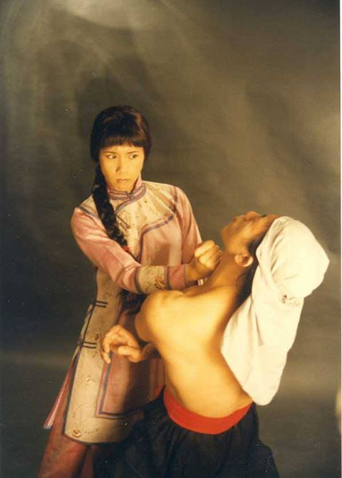
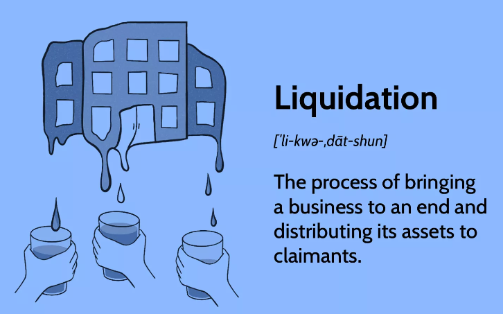

# Stories
id:: 66b1bbf3-ac04-4d4c-a343-d75130323a7f
	- [comment on fb](https://www.facebook.com/lexuandinhct/posts/pfbid0RDW7MQ2pzM9LwkP9BhobJCvSiqSY5CVUfURow2xrpYwRHyN4BR4R6ir1zvj4voJ8l?comment_id=4698845016799415&reply_comment_id=856971509813387) about "the fate of a little prostitute" 
	  id:: 668d0827-7ff2-468c-b62c-3f1d072119ac
	  collapsed:: true
	  :LOGBOOK:
	  CLOCK: [2024-07-09 Tue 16:28:26]
	  :END:
		- and chat-share with Huy about the my mental process throughout this event instead of the result theories (formulae) extracted from it as usual.
			- Chat content:
				- Story:
				  collapsed:: true
					- Trưa nay trên những bước chân đi bộ cầu thang lên cty, tui đã ngộ ra nhiều thứ.... Nhưng lần này tui sẽ không xổ ra những mớ lý thuyết đó nữa... vì biết ông cũng bội thực với nó rồi... mà lần này tui muốn share với ông một mặt trái... mặt mà ngay cả vợ tui cũng ít được thấy.... đó là tui vừa khóc hết nước mắt với nó....
					- "Nó" là cái phận "thân lừa ưa nặng" của tui, phải bị đập cho chết lên chết xuống mới đã, càng chết lên chết xuống càng học hỏi được nhiều, càng thấy ra nhiều.... cái mà thằng em đồng môn với tui hay gọi là "nghiệp khổ dâm" :D
					- Đứa con trong bụng tui là kết tinh của cả thảy những khó khăn đau khổ đó, nó nhận "tinh trùng" từ tất cả những ông bố đầy bạo lực đó. Một phần tui vừa "hận tất cả đàn ông trên đời" vì họ tàn nhẫn, vô tâm, vô tình, nhưng một mặt tui cũng đội ơn tất cả họ vì họ cho tui thấy tất cả, học được tất cả. Cái vị hoà trộn giữa ghét và thương, giữa hận thù và mang ơn.... thiệt là khó tả
					- Thiệt không thể nào diễn tả được cái sự mâu thuẫn, nhìn kẻ đối diện mình vừa thấy lạnh lùng, vô tâm, tàn nhẫn, vừa thấy chính kẻ đó đang làm vị cứu tinh cho mình, cưu mang mình, che chở mình, yêu thương mình...
					- Tui xả qua dòng nước mắt xong, bước vào phòng "lab" (phòng IT ở đây gọi là "lab" cho sang thôi chứ đéo có nghiên cứu gì đâu) của cty... chẳng nhớ gì hết, nhưng vẫn được leader nhắc nhở rằng tới giờ họp rồi (may quá, mình vẫn vào kịp giờ)... hiện diện tấm thân trong phòng họp cho có mặt, có cái bản mặt da thôi, chứ tâm mình còn ở trên mây.... nghe leader quán xuyến mọi chuyện báo cáo tường tận từng vấn đề của project... mình thầm nghĩ "ôi, những ông chồng luôn giỏi giang... mình quả thực chỉ là một con đĩ nhỏ, chỉ biết sống dựa vào người khác".... đang nghe leader tuôn ra như nước chảy qua cầu, chỉ biết "rì rào" chứ chẳng hiểu gì cả.... ai ngờ đùng cái tới issue của mình (person in charge = Định) thì mình liền tỉnh giấc, tự dưng thấy rõ mồn một, trả lời vanh vách.... Ôi thiệt là vi diệu.
				- ((668f4faf-db30-497a-a271-b2bbf5264413))
				  collapsed:: true
					- Và về nghiệp lý thuyết thì tui thấy thế này:
					- collapsed:: true
					  1. Đối với bản thân tui thì lý thuyết sinh ra từ thực tế cuộc sống (mọi lý thuyết suông tui đều để vào mục tham khảo và ít khi nói tới), rồi chính lý thuyết đó làm bản đồ chỉ đường cho tui đi, thực hành, rồi qua thực hành tui liên tục cập nhật, nâng cấp, mở rộng, chỉnh sửa lý thuyết.
						- => 1.1. Lý thuyết của tui là một thực thể rất động, không phải là một công thức đã được đúc kết một cách bền vững.
						- => 1.2. Con đường trong lý thuyết của tui phần lớn là định hướng trước mắt chứ chưa đi tới, tức thuần lý thuyết chưa có thực hành => đây là cái tui gọi là "nghiệp lý thuyết"
					- collapsed:: true
					  2. Đối với người ngoài, tui có thói quen chia sẻ theo cái view của mình mà ít để ý đến view của Đại chúng, nên tạo cảm giác (hiểu lầm) rằng tui đã chứng đắc bằng thực hành tất cả những lý thuyết tui nói (vì bản thân tui cũng khẳng định rằng mình rút ra từ thực tế cuộc sống mình chứ không phải qua sách vở). Cộng thêm thái độ hay đả phá, tui càng củng cố ấn tượng là tui đã đi hết con đường Lý thuyết mà tui nói.
						- 2.1. Nhưng khi thực hành của tui chưa bắt kịp lý thuyết, thường là cái đích mình hướng tới nhưng chưa đi tới, thì nó khiến cho người nghe cảm thấy khó chịu bên trong mà khó nói ra được. Chính sự mâu thuẫn này là bức tường không cho người nghe thông cảm và chấp nhận lý thuyết của tui... ở mức cảm xúc (có bức xúc). Nhưng ở mức lý luận, lý trí thì thường khó phản bác được lý thuyết của tui, nên người nghe cảm thấy "khó hiểu".
						- 2.2. Từ cái gốc là sự không thông ở mức cảm xúc + đầu óc cho rằng "khó hiểu" + cái nghiệp lập dị của tui từ nhỏ khiến mình nghĩ "do mình không biết giải thích" 
						  ==> mà dẫn đến sự cố gắng dùng lời lẽ lý luận để giải thích. Nhưng càng giàu thích càng kéo nó xa hơn nữa, khó hiểu hơn nữa!
					- Đó là cái vòng xoáy của nghiệp lý thuyết của tui từ đó giờ, tới giờ đúc kết ra được tới như vậy, chia sẻ ông coi chơi, và nếu có góp ý gì thì nhờ ông thẳng thắn nêu ra giùm nhé.
		- Story:
			- Mấy hôm nay từ duyên thầy [Thích Minh Tuệ](https://vi.wikipedia.org/wiki/Th%C3%ADch_Minh_Tu%E1%BB%87) và nhiều thứ khác, mình trăn trở nhiều về con đường giải thoát của mình (và của vợ).
			- 2 ngày hôm nay mình đều phải nghỉ làm buổi sáng vì thức khuya.
			- Trưa nay, tuy canh ngủ cho đủ 5 tiếng (min) nhưng khi đồng hồ kêu dậy mình vẫn thấy toàn thân rã rời.
			- Hít thở vượt qua chướng ngại đó, mình vác xác tới cty.
			- Gửi xe, đi bộ lên cầu thang toà nhà... mình nhìn sâu từ trong "cửa tử" ra ngoài, ngộ ra: ((668d08c7-ec2d-4188-9745-6ccf643c9132))
			- Lên bấm vân tay check in vào phòng "lab" nhưng thấy mọi người còn đang tắt điện ngủ trưa nên mình ra ngoài lan-can đứng.
			- Rất nhiều thứ diễn ra trong tâm, đối thoại với Huy, với em Hằng, v.v. đủ kiểu....
			- Nhắc lại cái luồng mấy hôm nay mình cũng đang "lật mặt" trái ra cho các bạn, từ Tú Trung mấy tháng trước, tới em Hằng ở tuần trước và cho Huy mấy hôm nay.
			- Bỗng mình thấy lại hình tượng con đĩ nhỏ làm bà mẹ đơn thân ôm cái bụng bầu đi lang thang chẳng nơi nào nhận....
			- Thế là lần thứ 2 mình trào nước mắt quay lại khóc cho bản thân và những số phận của những cá nhân nhỏ bé (từ khi dậm chưn trên di-văng ở nhà hồi lớp 9 tuyên bố không khóc [tự ái cho bản thân] nữa.)
				- Lần thứ 1 là đợt em nhập viện mổ ruột thừa, mình ở nhà xem thầy Minh Tuệ xong thì lan qua xem bộ phim tâm lý tình cảm ["Tiếng Sét Trong Mưa"](https://vi.wikipedia.org/wiki/Ti%E1%BA%BFng_s%C3%A9t_trong_m%C6%B0a)... và đã khóc ngất cho tất cả những mảnh đời đó, đi tâm hành lại, nhập lại tất cả các vai đó, từ Cậu 3 bạo lực đập đầu con ở tới con ở - mợ 3 Thị Bình, rồi thằng ở đợ Lũ, con ở Hiểm, bà hội đồng, v.v.
	- DONE Last weekend, my wife caught a cold after some days relaxing, then hospitalized due to [lung abscess](https://en.wikipedia.org/wiki/Lung_abscess).
	  id:: 66ab33e0-7646-4340-bdbc-28d581d1655d
	  collapsed:: true
	  :LOGBOOK:
	  CLOCK: [2024-08-01 Thu 15:06:06]--[2024-08-17 Sat 21:14:35] =>  390:08:29
	  :END:
		- Last week, i reminded her about nearly 1 year she has been lost in the unconscious flow, and put some pressure on her to relax and review.
		  id:: 66ab357a-540a-4330-a5fe-b1a08d06eecc
		- Finally she relaxed, went to deep sleeps, and unconsciously let the cold slip in.
		  collapsed:: true
			- On Saturday night - Sunday early morning, she caught a deep cold while sleeping which brought her from the deep sleep directly back to the waking state.
			- Because she was to conscious, she didn't think that it was a severe cold.
			- Throughout Sunday, she had temperature up and down. Then at that night, she reported me that she has used breathwork to cure all pains... except the one pain deep inside her lung is still incurable. So i told her to go to hospital next day.
		- This Monday, July 29th, after image diagnosing, the doctor told us a bad news of ((66ab3ac5-3b81-4a63-bf9b-81118dc1b1c0)). That evening, the [CT scan result](http://qrpacs.bvndgiadinh.org.vn/m.QR/viewer.html) showed us the situation is complicated:
		  collapsed:: true
			- a large part of [liquefactive necrosis](https://en.wikipedia.org/wiki/Liquefactive_necrosis) at the top right part of her lung
			  id:: 66ab3ac5-3b81-4a63-bf9b-81118dc1b1c0
			- a mild [pleural effusion](https://en.wikipedia.org/wiki/Pleural_effusion)
			- 2 spots of [lung nodule](https://en.wikipedia.org/wiki/Lung_nodule)s
			  collapsed:: true
				- => observing for lung tumors
		- This week, she's hospitalized to treat that lug abscess and monitoring the possible tumors.
		- Today, August 3rd, with the actual scenes in the hospital, i reminded her about "meditation as training dying everyday".
		  id:: 66ae037f-5757-4a9e-868e-b787cce5d9fe
		  :LOGBOOK:
		  CLOCK: [2024-08-03 Sat 17:16:41]--[2024-08-03 Sat 17:21:09] =>  00:04:28
		  :END:
		- Today, August 6th, she was subject to a bronchoscopy but she couldn't bear it be cause of the hurt from the nasal anesthetic. The doctors advised her to have it under general anesthesia (unconsciousness) tomorrow.
		- Today, August 7th, the bronchoscopy has been done successfully to take some liquid sample to the Nam Khoa lab in Q7 to test for tuberculosis.
		  id:: 66c092d8-24cf-4c65-a845-ac76eb09a663
		  collapsed:: true
			- At first, she was still very scared and didn't want to be subject to the procedure.
			- After sitting & talking with me and the doctor, she accepted it.
			- When go to the bronchoscopy room, she was scared again by the news that the local anesthetic is still required... but in fact only throat anesthetic is required and nasal anesthetic is not.
			- She actively relaxed her respiratory tracts before unconsciousness, and has very mild hurt after the procedure.
			- The hospital let her go home with no more medicine while waiting for the test result.
		- August 8th, we went eating [Mikado sushi](https://maps.app.goo.gl/7Hf3c4bwP6C7BVhY9) to celebrate her success yesterday.
		- DONE August 16th, re-scanned with CT -> the images show improvement; the sample testing result shows no tuberculosis infection.
		  :LOGBOOK:
		  CLOCK: [2024-08-17 Sat 21:16:33]--[2024-08-17 Sat 21:21:36] =>  00:05:03
		  :END:
		  => Doctors prescribed her some lung antibiotics and supplements, and told her to revisit after a month, just like my previous lung imflammation.
	- Cha Định phá lệ kể về 3 đời Giới - Định - Tuệ
	  collapsed:: true
	  :LOGBOOK:
	  CLOCK: [2024-08-12 Mon 08:30:32]
	  CLOCK: [2024-08-12 Mon 08:30:58]--[2024-08-12 Mon 08:33:24] =>  00:02:26
	  :END:
		- Thằng Tuệ đó hả? Tao là Định bố của Tuệ đây! Ông Giới cha tao sai tao phá lệ khai khẩu một bữa để khai thị cho chúng bay mở mắt này: 
		  Cả dòng họ nhà tao đéo sợ ma quỷ, đếch sợ rắn rết hổ báo, nên chuyên ở rừng rú và nghĩa địa... Nhưng chỉ sợ mỗi con... người. Cả 3 đời nhà tao tu luyện chỉ để đối phó với lũ người tinh ranh đó.
		- Ông Giới ba tao thì tốn cả đời để xây hàng trăm cái hàng rào ngăn không cho bọn người thích quậy phá kia giày xéo lên mảnh đất tâm nhà tao.
		- Định tao thì cả đời ngồi im nhắm mắt để không đụng chạm đến tụi nhiều chuyện đó. Tụi nó gọi tao là thằng vô dụng nhất trên đời, nhưng khi tao đang nhập cảnh giới thiền định sâu xa thì kệ mẹ chúng nó, tao tịnh khẩu đéo thèm nói đéo thèm nghe. Hôm nay tao phá lệ 1 bữa, nhưng vì không nói lâu rồi nên không rõ cách ăn nói sao cho hợp lẽ, tụi bay thông cảm nhé (vụ này thì con tao rành hơn tao).
		- Tuệ con tao thì còn nhỏ nên hiếu động, thích chạy ra ngoài chơi với bọn người kia, nên phải vắt óc suy nghĩ xem làm sao để vừa được đi chơi mà vẫn không bị tụi nó làm phiền. Nó nghĩ
			- để đối phó với bọn người tham lam thì nó phải không có tài sản không có gì cho bọn ác lấy;
			- để đối phó với bọn người luôn thích hơn người thì nó chọn làm "con" tất cả mọi người cũng giống như nó đang làm con trong nhà tao vậy, cứ đội hết bọn nó lên đầu mà thờ cho lành;
			- để đối phó với bọn người hay rình mò ban đêm thì nó phải ngủ ngồi một cách tỉnh táo để luôn luôn đề phòng cao độ;
			- v.v. nhiều nhiều lắm........... Ấy vậy mà thằng con tội nghiệp của tao vẫn cứ bị ăn đấm dài dài chứ có phải thế là yên thân đâu 👹 nhưng nó ham chơi quá thì cũng đành chịu thôi chứ sao.
		- Đấy, tao tự lật mặt hết cả 3 đời nhà tao ra cho tụi bay coi đó, đã chưa?! 
		  Chắc tụi bay sẽ hỏi "sao không để 2 đứa kia nói?" Thì chỉ có mình tao có thể lật mặt lộn lèo inside out được thôi, vì trong Định tao thấy rất cả. Còn ba tao thì bị chính hàng rào luật lệ của ổng cấm không cho nói ra sự thật, còn con tao thì nó phải giao du nên phải lựa lời mà nói cho vừa lòng cái bọn người lúc nhúc kia nên cũng không thể nào nói ra sự thật. Chỉ có mình tao có thể ra nói một chút, chút xíu xiu sự thật thôi rồi trốn lẹ vào trong các cõi định sâu xa để tụi bay chẳng biết đâu mà mò, thế mới tạm yên thân.  Nhập định đây... bái bai xi du à nghen!
	- Group chat about 3 poisons
	  id:: 66bab859-c848-4c3a-9a55-1280385665c2
	  collapsed:: true
	  :LOGBOOK:
	  CLOCK: [2024-08-13 Tue 09:43:00]
	  :END:
		- Trung: Đọc đc cái này sâu sắc quá Định heo
		  [Năm dậu nói chuyện gà: GÀ TRONG “BÁNH XE LUÂN HỒI” CỦA PHẬT GIÁO](https://hophanblog.wordpress.com/2017/02/08/nam-dau-noi-chuyen-ga-ga-trong-banh-xe-luan-hoi-cua-phat-giao/)
		- Định: Cái vòng tròn tham-sân-si đó nói theo sướng khổ là thế này:
			- Đầy đủ sinh Si
			  Con heo (si) cứ ăn no rồi nhắm mắt mặc kệ cuộc đời là sướng nhứt... Còn phước thì còn phải hưởng, còn phải sướng cho nó đẫy... Cứ hưởng sướng cho tới khi nào hết phước... "đói đầu gối cũng phải bò" thì buộc phải mở mắt ra...
			- Thiếu sinh Tham
			  Lúc mở mắt ra thì mới biết rằng ko những mình hết phước mà còn nợ nữa, thành ra ra thiếu thốn, nhưng vẫn còn nhớ cái sự sung sướng cũ nên tham, phải chạy đi tìm kiếm để nhét vô cái bụng đói, để được sướng lại như xưa. Nhưng màn Vô minh do Si để lại khiến mình không thấy biết rõ là mình thiếu cái gì, chỉ biết có một cảm giác thiếu thốn bên trong thôi thúc mình phải đi tìm cái lấp vào khoảng trống đó thôi. Vì thiếu cái này (như tình cảm) mà cho rằng mình thiếu cái kia (như tiền bạc) nên tìm hoài nhét vào hoài vẫn không thể đủ được, sinh ra hiện tượng "lòng tham không đáy", càng nhét vào càng thiếu thốn, càng thiếu thốn càng tìm kiếm để nhét vào....
			- Thừa sinh Sân
			  Nhồi nhét riết thì nó dư thừa, căng tức... tức quá thì phải nổ ra thành bực bội, sân hận. Tham với Sân tuy ở 2 thái cực (thiếu <> thừa) tưởng là đối lập nhưng thực ra chỉ là 2 mặt của cùng một con bài, vì thiếu Dương chính là thừa Âm, càng nhồi nhét cái này vào thì càng thiếu cái kia (cái mình ko thấy) và càng thừa cái này. Kẻ nhồi nhét tiền tài, kẻ nhồi nhét danh vọng, người lại nhồi nhét kiến thức, nhồi nhét tình cảm, nhồi nhét trải nghiệm, v.v. bất kể cái gì bỏ vào cái bụng này mà chưa kịp tiêu hoá thì đều thành thừa, phải nén lại thành ra căng tức. VD kẻ lắm kiến thức mà nói chẳng ai nghe thì tức.... "toàn là đồ  ngu ngốc, chết hết đi!" và thường bùng nổ ra thành sự giận dỗi, chửi mắng những kẻ "ngu ngốc" kia.
			- Sân hận như trái bom, nổ ra nhanh rồi hạ nhiệt cũng nhanh. Những trái bom được thiết kế để quét sạch mọi thứ xung quanh (và cũng nổ banh cả bản thân nó mà nó thường ko biết)... thế là sau mỗi lần nổ ra thì mọi thứ sạch sẽ, ko còn ai dám hó hé cãi lại mình (tức là mình đúng rồi, chân lý rồi), mình lại cũng được nhẹ nhàng nữa (xả căng tức ra rồi), thế là cái Tôi được củng cố, kê gối cao đầu mà ngủ thôi, mặc kệ cuộc đời... si là sướng nhất. Cứ thế mà tiếp tục si, tham, sân.
			- Cái vòng tròn này được lập trình rất chặt chẽ trong gene, trong từng tế bào của mình, là sợi dây mà Thượng Đế (hay nhà Phật gọi là Ma Vương) đã xỏ vào mũi của những kẻ kém phước để bắt họ phải cày như con trâu, là sợi dây buộc quanh cổ những kẻ nhiều phước để dắt đi như con chó.
			- Những kẻ nhận ra thân phận trâu chó nô lệ thì đầu tiên luôn tìm cách lấy răng mình mà cắn đứt cái vòng tròn trói buộc đó đi hòng giải thoát. Nhưng hưởng tự do được một tí thì đã bị chủ bắt lại và siết chặt cái vòng tròn đó hơn nữa... Càng cố gắng giải thoát càng bị trói chặt hơn, đó là nghich lý tham-ái và ảo tưởng tự do.
	- Incidence when Mr. Hiệp left the group
	  id:: 66bab97d-65ec-46b8-845a-a55784e8cc15
	  collapsed:: true
	  :LOGBOOK:
	  CLOCK: [2024-08-13 Tue 10:19:01]--[2024-08-13 Tue 13:19:22] =>  03:00:21
	  :END:
		- 12/2023, background:
		  id:: 66bac879-86ea-418f-99a7-21538f6218e3
		  After a private talk between Hiệp & Định, where Hiệp shared something about he had experience with Vịnh Xuân Quyền (VXQ) training but without any achievement, ((66bac9a8-2ece-4c17-b846-90f41b8837bc))
		- 27/12/2023, Định continued the thread of VXQ in the group.
		  id:: 66bac9a8-2ece-4c17-b846-90f41b8837bc
		  collapsed:: true
			- Ai đã từng xem phim Diệp Vấn này, giơ tay nào 😉 Ông Hiệp chắc là phải xem rồi chứ! Định là 2 nè, Trung và Sang có xem chưa?
			  https://youtu.be/OEhTuft8BVE
			- Hồi đó xem thì chỉ biết Diệp Vấn là 1 nhân vật trong phim, giờ mới biết ông là sư phụ đời thứ 7 của Vịnh Xuân quyền. Diệp Vấn là sư phụ bên Hồng Kông, ngang với Nguyễn Tế Công là sư phụ (đời 7) sư phụ VXQ bên VN.
			- Và thú vị là ngoài những sư phụ lịch sử thì các đời đầu được cho là xuất phát từ các tổ sư truyền thuyết... là nữ: Đời 1 là Nghiêm Vịnh Xuân, vợ của Lương Bác Trù (đời 2), và "đời 0" tức tiền thân của Vịnh Xuân quyền là Ngũ Mai Sư thái là một sư cô (ni sư) trong Thiếu Lâm Ngũ tổ của Nam quyền !🙂
			- 
			- Xin mời người có trải nghiệm VXQ cho ý kiến !🙂 [@Hiep Bobo Do](https://www.facebook.com/798673023/)
			- Gia thoại về Ngũ Mai Sư thái cũng lạ, vì thường chỉ nghe nói tới các sư thầy (nam) trong chùa Thiếu Lâm. Hiện tại thì thấy có các chùa ni (nữ) trong dòng Drukpa (mật tông ở Tây Tạng, Bhutan, Nepal) là có tập kungfu. Và truy ra thì.... nó đi từ chùa Nam Thiếu Lâm xuống Việt Nam rồi mới qua lại Nepal: [https://content.time.com/time/world/article/0,8599,2003009,00.html](https://content.time.com/time/world/article/0,8599,2003009,00.html?fbclid=IwZXh0bgNhZW0CMTAAAR2WU7dL-ZWMhSpwxPBhljidP20I2S1j0h3oMn-8rPZcCAeLtXGbiWYT7c0_aem_FkY5mG2D6ngIX-_6bVZHFQ)
			  collapsed:: true
				- “Kung fu came to the nunnery in 2008, after His Holiness the 12th Gyalwang Drukpa, head of the Drukpa school, saw nuns in combat training while he was on a visit to his followers based in northern Vietnam. "I was inspired because these Vietnamese nuns exhibited tremendous self-confidence and strength, not only in their movements but also in their attitude toward people outside their own enclosed community," he says. Kung fu has long been established in the country, having moved south from traditional martial-arts centers in China, including the famous Shaolin Temple, which was founded by a separate Buddhist sect, Chan (or Zen, as most Westerners know it).”
			-
		- Trung: chưa coi cả 2 phần
		  vì ko ưa cha diễn viên chính
		  😃
		  nói chứ lâu rồi tui ko có xem phim đánh đấm
		  Trừ phim Thành Long có hài trong đó thì tui coi
		- Định: Nhân cái duyên về mấy câu khẩu quyết Vịnh Xuân quyền của ông Hiệp mà tui khám phá ra cái vòng tròn thú vị này:
		  collapsed:: true
			- Phật giáo từ Nepal lan ra cả châu Á theo 2 nhánh nam truyền & bắc truyền;
			- Nhánh bắc truyền qua TQ, theo chân Bồ-đề-đạt-ma (Bodhidharma) tới chùa Thiếu Lâm, sanh ra võ Thiếu Lâm;
			- Rồi từ chùa Nam Thiếu Lâm chia ra 5 nhánh được tượng trưng bởi 5 vị tổ sư (ngũ tổ Thiếu Lâm), trong đó có 1 vị ni sư là Ngũ Mai Sư thái, lan ra khắp TQ và tới VN;
			- Từ năm 1992, các ni sư trong dòng Drukpa được dạy võ Thiếu Lâm cùng với các võ thuật Việt Nam khác ở chùa Tây Thiên;
			- Đến năm 2008, vị Gyalwang Drukpa thứ 12 (đương nhiệm lãnh tụ tông Drukpa Kagyu) đã đem 10 ni sư Drukpa Việt Nam cùng một võ sư sang Nepal để truyền dạy võ thuật cho các ni sư ở đó; Từ đó các ni sư Drukpa Kagyu được mệnh danh là "Kung Fu Nuns": 
			  [https://en.wikipedia.org/wiki/Kung_Fu_Nuns](https://en.wikipedia.org/wiki/Kung_Fu_Nuns?fbclid=IwZXh0bgNhZW0CMTAAAR11SjVNFOy6F3WlG2xWhnQ7RM8aKNrqw_S2rZkc_yTXxdUGL4bkp4SilVs_aem_uVWE0yCiTdnB3UBdAF_WqA)
			  
			  [](https://en.wikipedia.org/wiki/Kung_Fu_Nuns?fbclid=IwZXh0bgNhZW0CMTAAAR0gfecsrrSCXTMSwIl45ThcFUsDAQDrGbk6B65ptdkBe8H9hHsHDhHIVeI_aem_M-pw7bu5XyAyPkCr4BW0xQ)
		- Hiệp: ở sài gòn có 1 ông tên là Sơn, ông chơi dù và thuyền buồm. vấn đề là đi với hội dù thì ông nói chuyên thuyền và đi với hội thuyền thì ổng nói chuyện dù
		  1 chiến thuật tài tình
		  giờ trong nhóm cũng đại loại vậy tùm lum chủ đề
		- Định: Trời, nhóm tán dóc mà, ai thích chủ đề gì thì nói chủ đề đó thôi. Vụ VXQ ông không thích à? Tại đang hỏi ông xem phim Diệp Vấn chưa, cho nhận xét đi, mà không thấy ông trả lời.
		- Hiệp: tuo gion ba Trung là ko thik chung tu don lam
		  nhìn mặt đơ đơ
		- Định: À, vậy là có mình tui xem à hen. Vậy thôi, coi như tự sướng vậy 😁
		  À mà mặt tui có đơ không ông?!
		- Hiệp: xem đủ 2 3 tap, giai trí thế thôi
		- Định: Vậy là có xem rồi, tui cũng chỉ xem lõm bõm vài cảnh thôi à. Nên muốn hỏi người có tập xvq về các đòn thế trong phim đó mà.
		  Nếu ông có hứng nói chuyện về vxq thì OK để tui hỏi tiếp, còn không thì thôi, nhưng cũng cho biết 1 tiếng nhé.
		- Hiệp: uh thi ng ta đã làm phim thì nó cũng phải chính xác
		  để cho đám VX sướng chẳng hạn
		  mà toi chả hứng noi chuyen VX
		  **bới vì tôi chưa tập được lên tới nóc**
		  hay nghệ tinh 🤪
		- Định: OK vậy thôi.
		- Hiệp: nói về võ vẽ, có 1 môn võ bùa dưới miền Tây phía Miên . truoc khi đánh vẽ bùa niệm chú búa xua
		  đánh ko biết đau cứ nhào vô tới tói
		  1 dạng đưa vào trạng thái thức thần
		  võ hại não
		- Định: Hong tin.
		  id:: 66bad04f-577a-493b-917f-a41a53ed5563
		  Dùng chất thức thần hạng nặng còn đéo thấy gì, bùa chú thì đc gì 😜
		  Tui nặng vía lắm, nên vô mấy chỗ đang chơi cầu cơ là nó đứng lại hết à, đang bay cũng rớt xuống đất hết à 😁
		- Hiệp: uh thì tìm hiểu thử
		  cũng khá khá giai thoại
		  mà thật ra thì tôi cũng biết có nguoi tập , sợ quá bỏ
		- Hiệp: 
		  > ((66bad04f-577a-493b-917f-a41a53ed5563))  
		  
		  đó là ông, ông lại duy ra nguoi khác. cái này ba Trung đoạn trên nói maci rồi
		  **nói chung nc trên này tôi cũng bắt đầu thấy chán bỏ mẹ**
		- Trung:
		  
		- Sang:
		- Nhìn tấm ảnh chị gửi, mà liên tưởng ngay đến clip này
		  [Những kiểu người giàu nhưng không có tiền!](https://www.facebook.com/watch/?v=1390411028220363)
		- Sang: Hồi đó nhìn anh Định em ko chê ảnh nghèo, mà lúc đó ko biết giải thích ntn, clip trên giải thích rõ ý em muốn nói tới
		  Ngược lại, ai nói em giàu có thì sai quá sai. Trong người em chả có xu dính túi, đến nổi nhẫn cưới má tặng là của hồi môn còn đem đi bán lấy tiền xài 🫠
		- Trung: ủa tấm hình đó có gì mà kêu nghèo giàu gì
		  chị thấy tướng con nhỏ đó ôm con mèo thấy mắc cười thôi
		  Nhìn mặt nó và con mèo đều rất ngầu haha
		  kiểu như bà thích thì bà bỏ nhà đi
		  con nhỏ đó là nhà có tiền đó
		  bữa em cũng bỏ nhà đi với con mèo đó
		  y chang con nhỏ đó còn gì
		  nhà cũng có đk, thích đi trải nghiệm nhà nghèo nó ra sao
		- Sang: E nhớ mà, khác gì em đâu. Em nghèo rớt mồng tơ, chỉ là lúc đó ko có của cải gì thôi, nhưng tự tin vào khả năng tạo ra của cải
		  id:: 66bad482-606d-4ec2-a7f7-4baed68fcd02
		- Trung:
		  > ((66bad482-606d-4ec2-a7f7-4baed68fcd02))
		  
		  Rớt mồng tơi là gì biết ko
		  Em mà rớt mồng tơi thì chắc dân VN chết hết vì đói
		- Định: **Chủ đề giàu/nghèo này nhạy cảm nên anh ít khi đụng tới**. Nay Sang chủ động chia sẻ thì anh cũng mởi ra một ít như thế này:
		  collapsed:: true
			- 1. Theo nghĩa hẹp và phổ thông nhứt thì giàu/nghèo là có nhiều/ít tài sản vật chất. Vì tài sản vật chất đều có thể quy ra tiền (tiếng Anh gọi là "hoá lỏng", "liquidate", dịch thuật ngữ kinh tế là "thanh lý", "thanh toán") nên đây cũng là thước đo chính xác nhứt, vì nó ra con số cụ thể rõ ràng.
			- 
			- id:: 66bad570-4aa6-4a45-87d3-52fd1fff85a4
			  2. Theo nghĩa rộng hơn một chút, 
			  như trong clip Sang gửi thì nói về ***khả năng*** tạo ra của cải vật chất. Vì cái khả năng, tiềm năng là cái ẩn giấu không hiển lộ rõ ràng nên khó đo lường, và tuỳ vào "con mắt" của người nhìn. Kiểu như Kiều nhận ra được Từ Hải là đấng anh hùng từ trong lúc hắn còn là hạt bụi "Anh hùng đoán giữa trần ai mới già!" Thế nên mỗi người thấy 1 kiểu, không thể nói chính xác và thống nhứt được, và cũng không ít người nhìn lầm, đầu tư vào "nó" để rồi rốt cuộc vỡ mộng "nó" chẳng làm được gì cả. Bản thân anh có trải nghiệm này ít nhiều, nhận được không ít sự thất vọng từ gia đình tới bạn bè. 😃
			- 3. Theo nghĩa rộng hơn nữa, thường nghe dân ít tiền nói (kiểu để tự nâng mình lên ấy) là "giàu không chỉ có tiền của (vật chất) mà còn có giàu tình cảm, giàu tinh thần, v.v." Đó là khái niệm mở rộng sự sở hữu vật chất sang sở hữu phi vật chất: tôi có tài năng, tôi có tình thương, tôi có trí thông minh, tôi có khiếu hài hước, v.v. và v.v. Từ nhỏ anh nghe cái quan niệm này nhiều, vì sống trong gia đình ít của cải vật chất, nhưng khi tới cuối cấp 3, bước vào ĐH là anh cũng đã thấy không phục với quan điểm đó... Anh thấy rõ là cả những tài năng, thông minh, lanh lẹ, hay tình thương, sự bao dung, sự quyết tâm, hay nhẫn nhịn, bình tĩnh, v.v. đều có 2 phần:
				- Phần thừa kế, tục gọi là "bẩm sinh", thì y hệt như con nhà giàu sinh ra đã được hưởng gia sản của cha mẹ để lại thôi; và
				- Phần bản thân đời này tích luỹ được, tục gọi là "luyện tập".
				  Lúc đó, anh coi những người tài giỏi từ nhỏ, kiểu "thần đồng" cũng ngang bằng với những "cậu ấm cô chiêu" thôi, và chỉ phục những người từ dở mà luyện tập thành giỏi, cũng như bên vật chất là từ nghèo mà phấn đấu giàu lên. Nhưng đó là quan điểm của 1 đứa chưa ước ra đời.... Sau này trải nghiệm đời thì anh lại có quan điểm khác...
			- 4. Theo nghĩa "xuất thế" (thoát ra khỏi thế gian) hay "thoát tục" (thoát ra khỏi thế giới trần tục) thì... anh (Định) cho rằng thước đo của giàu/nghèo là ở chỗ người đó thấy đủ/thiếu thế nào: người càng thấy thiếu là càng nghèo và người càng thấy "đủ rồi" là càng giàu. Cái này thì là quan niệm ngược đời nên chỉ nghe mấy tên đi đường "giải thoát" nói tới, còn vụ lấy tương ứng sang khái niệm giàu/nghèo của thế tục thì anh cũng chỉ mới nghe mình anh (Định) nói 😃
			- Nhưng mở rộng ra tới số 4, lấy cái khái niệm thế tục "giàu/nghèo" để gán cho cái tính chất  "giải thoát" của những kẻ đi đường ngược đời, thì nó đã đi ngược lại với khái niệm gốc, phổ thông ban đầu rồi. Nên nói dóc cho vui vậy thôi, cho thấy là cùng 1 thước đo, thì qua đầu óc lươn lẹo của con người, có thể biến hoá nó thành.... cả thứ ngược lại với thước đo ban đầu luôn 😆 Đó là anh kéo sự mở rộng của Sang ra cho em thấy là khi kéo dài 1 ra, mở rộng ra 2, 3, ... thì tới tận cùng... không phải là vô cực (∞) mà là -1, tức giáp 1 vòng tròn 😵‍💫
			- Ngay cái số 4 đó, cũng chỉ mới là bước đầu nhập môn trên con đường giải thoát, để giảm 2 cái thô là Tham (do thiếu thốn) và Sân (do căng tức, do dư) để hướng về cái ở giữa là "vừa đủ". Nhưng khi đi sâu vào con đường đó thì mới biết cái thứ 3 "đủ" đó lại là chỗ trú ẩn của Si là thứ thâm sâu nhứt, là gốc của cả Tham & Sân, là biểu hiện của Vô Minh.
		- Trung: Cái nào cũng là excuse hể
		  collapsed:: true
		  Excuse cho cái tôi thôi
		  Vì còn so sánh nên phải có cái cớ để xoa dịu chính cái tôi
			- Cái số 3, tui thấy nó gần đây rõ lắm
				- VD hồi xưa còn cà nhỏng thì mình hay lấy cớ là ôi mình ko đẹp thì mình học giỏi mình ko có thua gì đứa kia hết, mình ko làm được cái này thì mình có cái khác thế vô 
				  kiểu như mấy sách self help hay nói á hãy phát triển ưu điểm của mình
				- nó vẫn luẩn quẩn quanh cái là so sánh, ghen tị, tham, sân
				  nên mới nghĩ ra đủ thứ để xoa dịu, cân bằng lại
				  thay vì biết là mình đủ rồi, mình vốn dĩ là OK
			- nên dạo gần đây mình ko còn dùng cái lí lẽ kiểu cũ để xoa dịu bản thân nữa
			- nên thực ra hồi mình còn u mê thì mình còn ráng cật lực
				- đọc sách cho cố, học cho cố, cố lấy được càng nhiều càng tốt
				- nó cũng là một dạng ám ảnh sợ hãi và tự ti thôi
				- vì núi cao thì có núi cao hơn
			- mãi mãi là 1 vòng luẩn quẩn chả bao giờ có điểm dừng
			- nhưng cũng hên là giờ nó cũng gần bão hòa nên cũng ko còn quan tâm lắm
			- hoặc là đọc quá nhiều rồi, thấy sách nào cũng hao hao nhau
		- Hiệp:
		  > ((66bad482-606d-4ec2-a7f7-4baed68fcd02))
		  
		  ảo tưởng vãi đạn, đọc cái đống của 2 ông và Trung Định cũng chưa chắc hiểu
		- Sang:
		  > ((66bad570-4aa6-4a45-87d3-52fd1fff85a4))
		  
		  A trải nghiệm gì, kể nghe đi anh…
		  Anh nói lý thuyết quá, cho ví dụ thực tiễn nha anh
		- Định: Ờ thì trong nhà nghèo (tiền) thì người ta coi trọng những thứ tài năng có khả năng sinh ra tiền, 
		  id:: 66bad8fb-cc10-4db8-99cb-c5365ab88731
		  như anh học giỏi nè, đi du học nè, còn theo nghề hót nhứt của thời đại nữa nè.... Mọi người cứ mong "1 làm quan cả họ được nhờ"... đến khi anh về... đi xe đạp, đi dạy... thì cũng làm nhiều người thất vọng lắm, và đau nhứt là ba anh... nhưng mình không thể làm khác được khi đó là con đường duy nhứt mình có thể đi (mình không có lựa chọn nào khác). Sau này tu tập giải thoát lắm anh mới đủ khả năng vô cty làm đó em.
		- Trung: ko biết Định sao chứ chị thì cũng có mà
		  VD như bạn bè nhìn vô mình thường là nói ủa mày phải làm giám đốc, manager này kia, kiếm được nhiều tiền lắm
		  xong rồi giới thiệu làm cái này cái kia, thì đó là cách họ đánh giá mình thôi
		  Cái khả năng đó ko phải là ko có, nhưng quan trọng là cái lòng mình có hướng về chuyện đó không
		- Trung: sẽ có nhiều người có khả năng kiếm tiền nhiều, nhưng họ ko thích kiếm thôi, đến 1 giai đoạn họ bỏ hết về quê nuôi gà
		  id:: 66bad98f-9a29-4c11-a2f7-f9d0deefe47d
		- Sang
		  > ((66bad8fb-cc10-4db8-99cb-c5365ab88731))
		  
		  Vì sao lúc đó, anh ko vô cty làm? A giải thoát gì ? Lúc đó thiệt là ko hiểu
		- Sang:
		  id:: 66bad99a-e949-4d8b-a294-f7e728a3df63
		  > ((66bad98f-9a29-4c11-a2f7-f9d0deefe47d))
		  
		  Em nè chị.
		- Trung: thôi để tui nói thử coi cho thằng Sang nó dễ hiểu
		  collapsed:: true
			- tức là bản chất tâm người ta ko hướng cho vật chất
			  mà bắt người ta đi kiếm tiền nó giống bắt con cá leo cây thôi
			- nhưng khi mà tên Định đã bắt đầu giải thoát nó sẽ ko còn giống con cá nữa
			  id:: 66bada01-f3ab-4d26-a664-5553e763fe72
			  nó biết nó ko bị cầm tù trong thân thể con cá, mà nó có thể tự thích nghi được
			- trước giai đoạn giải thoát đó nó cưỡng lại, vì nó vẫn là trong thân con cá
			  hiểu chưa
			  nó vượt thoát được cái thân đó, tâm nó tự do hơn, nên nó mới có thể đi vô công ty làm
			  chứ trước kia khi tâm nó vẫn trói buộc trong thân con cá thì nó sẽ bị ức chế chéet
		- Định: ghê thặc, dạo này có giảng sư Trung Đạo giải thích hay ghê 👏
		- Sang:
		  > ((66bada01-f3ab-4d26-a664-5553e763fe72))
		  
		  Này thì em hiểu chứ, em đang muốn hỏi cụ thể là lúc đó anh Định cần giải thoát cái gì? Vì sao đi làm giảng viên?
		- Định: anh làm giảng viên vì nó phù hợp với cái sơ thích, sở trường của anh
		  anh hệ thống lý thuyết thành bài bản được tốt nên phù hợp với nghề đó
		- Sang:
		  > ((66bad8fb-cc10-4db8-99cb-c5365ab88731))
		  
		  Vì sao anh đi dạy, đi xe đạp ? Đó đó, em thắc mắc theo đúng nghĩa đen
		- Trung: haha, chơi với Định bao lâu giờ mới hỏi cái câu xe đạp hả
		  id:: 66badadd-c5ae-41eb-acb3-9d8779c75f5f
		  sao cha Sang vẫn chưa đúc được nó là con cá nó phải xuống nước bơi
		  tức là nó sinh ra là kiếp con nhà nghèo, làm osin rồi cho nó ăn ngon nó ko ăn được, mặc đồ đẹp nó ko khoái
		- Sang:
		  > ((66badadd-c5ae-41eb-acb3-9d8779c75f5f))
		  
		  Thì em hỏi lại xem coi đúng như những gì e nghĩ ko? Chứ thôi là em chê anh Định nghèo mới đi xe đạp rồi
		- Định: ngoài ra thì nó còn là sự tự do, khi đi dạy thì mình được tự do thời gian, tự chủ trong việc soạn bài giảng (chỉ bị ràng buộc 1 ít về chương trình dạy nói chung thôi), và đi xe đạp, xài đt cùi bắp cũng nằm trong cái tự do đó
			- Thì cái phần "giải thoát" là ở chỗ này nè, mình chui vô cái lồng (ngày 8 tiếng, ra vô đúng giờ, làm đúng schedule, ra đủ sản phẩm, v.v.) mà mình vẫn thấy được tự do, đó là giải thoát 😃
		- Trung: nó nghèo thiệt mà pa
		  trời ơi thằng Sang nó ko tin ông nghèo kìa
		  nếu nói về tiền là nó nghèo lắm á pa
		- Sang: Giờ nhà em cũng toàn đi xe đạp thôi. Nhưng mà em đạp vì sức khoẻ vì cái khác, chứ chiếc xe đạp em tới mấy chục triệu lận. Nên e thắc mắc a Định đạp xe vì sao
		- Hiệp:
		  > ((66bad99a-e949-4d8b-a294-f7e728a3df63))
		  
		  sorry Sang nhưng bạn lại vẫn chưa hiểu rồi
		- Sang:
		  > Trung: qua bên Châu Âu nó ko cho đi xe máy luôn, toàn bắt xe đạp
		  
		  Châu âu thì khác, chi phí vận hành cao quá nên ngta dần dần chuyển qua ph tiện công cộng, rồi xe đạp.
		- Trung: ko nha pa
		- Hiệp: lại chế tạo nũa
		- Trung: bên châu Âu nó chú trọng môi trường đó pa
		  nói gì thì nói, nó phá quá mà
		- (Trung, Hiệp, Sang nói xen kẽ nhau về bảo vệ môi trường vì đã tàn phá)
		- Sang: Ý là lãnh đạo họ muốn dân đi pt công cộng, nâng giá chi phí sử dụng oto riêng. Thế là giàu lắm mới dám đi oto riêng
		  id:: 66baddbe-7dbd-47a0-84f8-5b7ab3ecea6e
		- Hiệp:
		  > ((66baddbe-7dbd-47a0-84f8-5b7ab3ecea6e))
		  
		  lại phán, oto ở đây rẻ òm
		  1 cái dù tôi đang bay giá bán bên này 4000€
		  cái xe 2nd hand 2000€ chay ngon
		- Sang: Em có nói oto mắc đâu, em nói là chi phí sử dụng cao, mắc. Như chỗ giữ xe trung tâm tp, phí sử dụng đường bộ, thuế xe…
		- Định: Mà ngay cả cái "bảo vệ môi trường" của mấy anh nước giàu đó cũng chỉ là bảo vệ cái môi trờng nhà (nước) mình thôi.... và xử lý rác bằng cách.... tống qua cho bọn nước nghèo hết
		  TQ và ĐNA là cái bãi rác của họ
		  sau này TQ mạnh lên nó cấm nhập rác... cái cả lũ kia bị dội hàng đó
		  Cái thực tế là ... recycle rất kém hiệu quả 😛
		- Trung: bữa tui xem cái phim tài liệu về xử lý rác
		  TQ từ chối rồi thì tụi nó tống sang thổ nhĩ kỳ
		  nói chung người tiêu dùng bị lừa
		  nhưng dù sao thì nó cũng có làm hoạt động môi trường, cải tạo cái nó phá
		- Hiệp: yes, thuc chất la ko hieu quả
		  :LOGBOOK:
		  CLOCK: [2024-08-13 Tue 11:19:25]
		  :END:
		- Trung: đúng thế, ko thể reccyle được
		  nó xạo thôi, cuối cùng đều cho vào lò đốt biomass hết
		- Định: nâng cao ý thức là chính thôi
		- Định: Nhưng sẵn hôm nay khui ra luôn về chuyện lượm rác của anh Hiệp nè: 
		  Ngày trước nhìn cái dáng anh Hiệp chê lượm rác là biết ảnh nghĩ "lượm làm màu thôi, chứ có giải quyết được quái gì đâu!" cũng giống như vụ recycling vậy đó. Nhưng lúc đó em vẫn vắt túi rác lên balo để lượm là vì em thấy một hành động đó mang ý nghĩa thâm sâu về mặt ý thức, chứ không chỉ để giải quyết cái của nợ trước mắt. Ngay vụ recycling cũng vậy, tuy thực tế là khả năng tái chế của con người chưa tới đâu, nhưng nó phản ánh thực tế của tự nhiên, mọi thứ đều được quay vòng trong thiên nhiên. Mẹ Thiên Nhiên đã làm việc quay vòng đó hằng triệu năm nay rồi, mình bây giờ thực hành tái chế chỉ là để nhắc nhở sự thật đó, đưa nó vào ý thức của con người để nhắc nhở thôi.
		- Trung: Ko phải. Ổng nói 
		  "10 thằng xả 1 thằng lụm đc gì đâu
		  Tại sao phải đi lụm rác thằng khác ị ra"
		- Hiệp: ê tui có lượm rác nhe
		  id:: 66bae03f-4dc1-4e5a-a8bc-c54f8e48b037
		  tuy phải có vụ lợi 1 chút
		  như Vietdivers kêu đi luom rác Côn đảo
		- Định:
		  > ((66bae03f-4dc1-4e5a-a8bc-c54f8e48b037))
		  
		  Dạ, anh có lượm rác. Em chỉ nói cái "dáng" anh lượm thôi 😃
		- Hiệp: toát lên ý chí ngút ngàn đúng ko
		- Sang: Chà, anh Hiệp lại gu em, lượm chi rồi 100 thằng xả 😏
		- Sang: Em biết anh nghèo tiền mà, chứ e có bao giờ cho ai mượn tiền đâu, anh mượn tiền em cho liền đó, chứ ko nghèo thì sao phải mượn
		- Định: Anh thì chắc chắn ko đi mấy chiếc xe đạp mấy chục triệu rồi 😛
		  id:: 66bae0f1-31a8-4406-ba36-633e7377f363
		  đi tiếc đứt ruột chết mất 😃
		- Sang: Nhìn cái tướng của anh thì toát lên cái nghèo rồi còn gì
		- Định: Đó, thì đợt trước có lần anh với chị Trung ỷ lớn ăn hiếp hội đồng em đó, lúc đó anh có nhắc tới anh Hiệp đó, nhớ ko Sang 😉
		- Sang: Đợt nào ta, em nhớ có đi chung Bình ba với anh Hiệp, hài chết.
		- Định: Lúc đó anh Hiệp chưa vô nhóm, sau này nhắc tới ổng vài lần nên anh mới add ổng vô luôn đó, khỏi phải "nói xấu sau lưng" 😃
		  à cái đợt mà em nói về quan điểm "cũng tại cái nghèo" hay gì đó
		  lúc đó anh nói với chị Trung là "Sang nó còn nhiều phước, phải để cho nó phát triển theo hướng của nó"
		- Hiệp: chả sợ. mình chả có gì xấu để nói
		  id:: 66bae163-ffff-4f69-ac92-5a66a62a0de9
		  nhớ lúc đi Bà đen toi voi thang Huy về truoc, lúc đi xuống gạp 2 thàng ku kia uông nuoc vut ngay cái chai nhua, lúc đó máu điên nôi lên chửi, may mà 2 thang đó ko bu lại đânh
		- Định: Tự tin vãi! Nhưng khác tui, tui thì nghĩ "ai nói xấu mình thì cũng như đái thêm một miếng vào cái bãi cứt thôi mà, cùi rồi còn chi mà sợ lở!" 🤣
		- Hiệp:
		  > ((66bae0f1-31a8-4406-ba36-633e7377f363))
		  
		  douma hồi về vn tôi có đạp chiéc xe chắc mấy trăm triệu quá
		  xong sợ quá, lỡ thàng nào đakp mình té giut xe
		- Định: Ghê, thặc, giờ khui ra mới biết đại gia là đây 😃
		- Hiệp: xời, đừng coi thuong Hiep
		  đạp ké coi xe trăm triệu đã đít ko ấy mà
		  mà ko đã mấy, vẫn đau ku như thường
		- Trung: Ê tui mới đọc báo, Đạp xe bị vô sinh đấy nha
		- Định: Tui đạp miết mà còn chưa vô sinh đc nữa đây, khổ ghê! Người muốn thì ko có, người ko muốn thì lại có 🙁
		  Tui nghĩ là nguy cơ đó tăng ở dân đua xe thôi: Cái yên nhỏ của xe đua với tư thế nằm trên xe thì nó tạo áp lực lớn lên cơ quan sinh dục thôi.
		- Sang: Hả, là vợ có bầu rồi hả anh?
		- Định: ờ, bị dính mấy lần, nhưng ko giữ
		  sau này sợ luôn ko dám làm tình nhiều nữa... nhưng cũng tranh thủ cuối tuần làm 1 lần để duy trì sợi dây vợ chồng
		- Sang: Ko tính có con hay là chưa phải lúc vậy anh
		- Định: về ý chủ quan thì chưa bao giờ anh có ý muốn có con. Còn về khả năng chấp nhận để thuận theo tự nhiên thì giờ vẫn chưa đủ khả năng tính tới chuyện có con (nội tình nhà anh còn phức tạp lắm)
			- Nói chung, tại anh tham lắm, như chị Trung hôm trước có nói đó, anh thấy đứa nít đầu đường xó chợ nào cũng muốn nhận làm con rồi, nên nghĩ "người ta đẻ đủ rồi, mình đẻ thêm chi nữa cho nó chật đất!" 😃
			- Và đằng sau đó là 1 cái mặc cảm lớn của anh, "mặc cảm tội lỗi". Phần "đẻ mà không nuôi cho đàng hoàng, để cho con khổ" là một phần trong nhiều phần khác trong cái "mặc cảm tội lỗi" của anh.
		- Sang: Em thuận theo tự nhiên, có 1 đứa con thì chưa đủ duy trì dân số. 
		  id:: 66bae397-7cc5-4e79-8190-464d69127678
		  Tính thêm 1 đứa nữa đó anh, mà thấy nhiều tiền quá, 3 tỉ cho 1 đứa trẻ đến 18 tuổi. Trung bình 10tr/ tháng
		- Hiệp: cảm điijng quá, tính cho cả dân số nữa, ông lo cho ông đi
		- Sang: Chứ như mấy nước phát triển, riết ko ai đẻ. Dân số càng ít đi
		- Hiệp: nhìn vào bản chất nó là gì
		  bản chất noi sợ đó là gì
		  dân số tổng nó có giảm ko? hay vẫn tăng
		- Sang: Ở Nhật, nhà nước chuẩn bị đánh thuế cho những ai còn độc thân. Em mắc cười ghê
		- Hiệp: ngoại cảnh đó tác động đến ông, ông viện cớ này cớ nọ
		  nhưng cốt lõi nó là cái khác bên trong
		- Sang: Hả, anh nói em hả ?
		- Định: Ờ, anh Hiệp mượn em để nói chung về cái "cốt lõi" là cái Dục bên trong đó. Thể hiện ra ngoài là tình dục, là sắc dục, là tài dục (ham tiền của), v.v.
		- Trung: Cha Định mắn ha, Từ hôm ông nói với tui mà còn thêm mấy vụ nữa hả, Pa ham quá
		  Phải chơi tự nhiên chứ ko chơi phao
		  Kêu bà kia đặt vòng đi, Ko thì ông đi thắt đi, Đơn giản vậy mà
		- Định: Tui tính đi thắt từ đầu rồi, nhưng vợ ko chịu
		- Trung: Why
		  Vợ chồng nhà này lằng nhằng quá
		  Xong rồi đi kill baby
		- Định: ừ, đời nó mâu thuẫn vậy mà
		  sự thật nó phải đập thẳng vô mặt mình như vậy mới tỉnh đc: con chuột con gián thì ko giết, con người trong bụng thì giết 🙁
		- Hiệp:
		  > ((66bae397-7cc5-4e79-8190-464d69127678))
		  
		  yes và tất cả. ông thấy ông mau thuẫn cả chuyen giai ngheo o day ko
		  đoạn trên vua noi chuyen nghèo vô giau
		  giờ lại 3ti
		- Định: nhóm này tui coi là người thân hết mới nói những điều khó nói đó. Từ mấy đứa nhỏ trong bụng tới 2 mẹ con con chó cưng nằm ngủ chung với tui suốt... cũng chính tay tui làm mất.
		- Sang: Anh Hiệp nghiêm túc quá rồi, em nói vậy thôi, đẻ vẫn đẻ, giàu ngheo liên quan gì
		  id:: 66baece1-73f6-453d-9dbb-172c4fca5937
		- Hiệp: yes, chùng nào mình thành thật voi minh
		  id:: 66baed01-ddbe-4386-b2ac-6fbdf9b80302
		  đẻ thì vẫn đẻ
		  thì may ra
		  còn địt mẹ dân số roi tiền nuôi
		  như đau bụg  đổ tại cứt
		- Định:
		  id:: 66baed2a-7ab5-44ce-933f-7147c89d4937
		  > ((66baed01-ddbe-4386-b2ac-6fbdf9b80302))
		  
		  ái chà, nghe mùi giống như tư tưởng "thành thật với chính mình" đã lây sang ông Hiệp rùi kìa 😛
		  > ((66baece1-73f6-453d-9dbb-172c4fca5937))
		  
		  À, Sang nói giảm, phải dịch "nghiêm túc" ở đây = "serious" theo từ của Trung mới chính xác 🙂
		  Anh Hiệp giỏi logic lắm em, nên hay bị serious trong các vấn đề không hợp logic, nghe trên dưới nói bất nhất là ảnh bực mình 😉
		- Hiệp: ko sao Sang 3 đời gioi logic chiến luoc mà
		  tôi cần gì serious toi sẽ chat voi mô nguoi sau
		  giờ thì bye bye nhé
		- 31/12/2023: Hiep Bobo Do left the group.
		  collapsed:: true
			- Trung: Trời má, Gì vậy, Ông Hiệp hôm nay đèn đỏ khó ở à
			- Định: Tại tui tại tui, tui chọc quá mà
			  > ((66baed2a-7ab5-44ce-933f-7147c89d4937))
			  
			  Sang nó đã nói giảm, tui còn nhấn sâu thêm nè 🙁
			- Trung: Có thấy chọc gì đâu, Bình thường mà
			  Hôm qua thì ổng bực thật
			  Nhưng hôm nay là ổng đang chém thằng Sang mà
			- Định: bà lại chấp hôm qua với hôm nay
			  nhấn 1 phát thì từ ngàn đời trước nó còn trồi lên chứ nói gì hôm qua
			- Trung: Ko hôm qua ổng tức ông đó
			  Tui đang nói là tức nc vỡ bờ, Hiểu ko
			  Ông thọc ổng hoài, Nên ổng điên lên rồi
			  Thằng Sang chỉ là cái cớ
			- Định: thì che đậy hoài, cũng phải có duyên để nó trổ cái cảm xúc thật trong mình ra chứ
			  tui đau lắm chứ phải chơi đâu, tui cũng biết cái này từ đầu luôn rồi, nhưng đợt này tui đã commit là chấp nhận đau khổ rồi, nên chỉ để cho nó diễn ra rồi từ từ hoá giải thôi
			- Trung: Mệt ông quá
			  Nhưng hôm nay sao ổng địa thằng Sang vậy ta
			  Chắc thấy nó than nghèo mà lại xài sang
			  Khổ nó tên Sang thì phải xài sang chớ
			  Nói chung xét từ chuyện ghét ai là ghét chính mình
			  Thì là ổng đang ghét chính chuyện ko đẻ đc
			  Haha
			- Định: Tui đoán là ổng cảm thấy sắp bể rồi nên cho xổ mấy cái đó giờ "găm" với Sang ra cho nó nhẹ trước khi out group. Còn có gì ổng găm với tui hay với bà thì còn dài còn lâu, từ từ sau này còn nhiều cơ hội để xả.
			- Trung: Tui ko có làm gì ổng nha, Có ông là hay thọt ổng thôi
			- Định: Tui chỉ nói chung thôi. Gọi là gợi ý "nếu có" (có gì) đó thôi. Nếu bà sure là "tui không bao giờ đụng chạm ổng" thì cứ bỏ qua lời tui thôi.
			  Ngay như Sang cũng đâu có nghĩ là làm gì đụng chạm anh Hiệp đâu, anh nghĩ vậy đúng không, mà khi bể ra thì thành vậy đó. Ai tự tin mình không làm tổn thương người khác thì cứ thoải mái, còn Định thì có mặc cảm tội lỗi nên chấp nhận mọi tội lỗi, là do tui hết.
			  Mấy người "đồng minh" với nhau thường cứ tưởng rằng "cùng 1 phe thì không hề có chuyện gì với nhau". Nhưng tới khi "đối phương" lui ra đi thì mới biết...  Hết đối phương này thì tự cái Tôi sẽ phải tìm cho được đối phương khác để thế vào, vì các đối phương bên ngoài chỉ là avatar cho cái đối phương bên trong mình thôi mà:
				- Định thì phải tìm mấy đứa bắt đầu thấy đau khổ nhưng còn chưa "thoát ra" được để kể chuyện vượt qua của mình, để nhắc nhở cái đứa đau khổ đó (đứa bên ngoài là hình ảnh của đứa bên trong)
				- Trung thì không bị Định chọc cũng sẽ bị người khác chọc cho nổi điên lên.
				  V.v.
			- Định: Như hôm trước trong cơn tức giận, Trung có bảo Định là tiểu nhân, thù dai, thì hôm tui khẳng định lại với bạn luôn là cái "thù" đó không chỉ là ghim từ 1 bạn Trung ở mấy năm đời này mà còn là từ nhiều "bạn Trung đời trước", tức tất cả những người tương tự không nhứt thiết phải có tên "Trung". Nó mà xổ ra hết thì việc chọc ngoáy, chỉ trích, chẳng nhằm nhò gì, mà phải giết hàng trăm "con Trung" đó còn chưa hả dạ nữa. Những sự thật kinh tởm đó nói ra thì chẳng ai tin, vì thấy tui bên ngoài hiền quá mà. Nên mới phải diễn ra, diễn 1 phần triệu 1 phần tỉ thôi mà nó vậy đó.
			  collapsed:: true
				- Cái đích giải thoát mà tui thấy không phải là một thiên đàng toàn yêu thương không có hận thù, cũng không phải là một cõi không không chẳng yêu chẳng ghét như gỗ đá vô tri, mà là sự chấp nhận tất cả sự thật đầy mâu thuẫn của cuộc đời: có thương có ghét, có sướng có khổ, có vui có buồn, v.v.
			- Possibilities
				- Apparent: Hiệp tức thái độ "ra vẻ" của Sang và của Định
				- From Định: ((66bac879-86ea-418f-99a7-21538f6218e3))
				  Có lẽ Định đã đem chuyện cá nhân (VXQ) ra chat trên group và còn chọc thêm nhiều chuyện khác nữa, khiến Hiệp bực.
				- Others: Có lẽ cũng liên quan tới chuyện con cái & bỏ thai, như Trung có gợi ý.
	- Chat về Tính Không & Duyên Khởi
	  id:: 66bac893-b5ac-4aa3-ac7a-e846caa8bd10
	  collapsed:: true
	  :LOGBOOK:
	  CLOCK: [2024-08-13 Tue 13:37:22]
	  :END:
		- Sang: ["Sắc tức thị không - không tức thị sắc" - PHÁP THOẠI THẦY THÍCH PHÁP HÒA](https://www.facebook.com/share/v/tcxtYmXvxtU8Qe9A)
		  Ông thầy giảng mà ổng sân si quá 😅
		- Trung: Thầy giảng quá xá hay
		  Bữa h tui chỉ biết duyên khởi
		  Hoá ra cái này có liên quan thuyết duyên khởi
		- Định: Đó là thầy giảng tính Không bằng nguyên lý Duyên khởi đó.
		  Duyên khởi là cơ bản của nhánh nguyên thủy, tính Không là nền tảng của giáo lý đại thừa, tuy 2 mà 1 thôi.
			- Nguyên Thủy thì Phật chỉ thẳng thực tế chấp trước của mỗi người tùy theo cơ duyên cụ thể của người đó, nên khiến người ta giác ngộ ngay. Nhưng khi đem câu chuyện đó kể lại thành kinh (kinh nguyên thủy chỉ toàn những câu chuyện đối thoại giữa Phật và những người hay nhóm người cụ thể) thì lại khiến người sau khó hiểu, hiểu lầm đủ kiểu do không biết được context của câu chuyện lúc đó ra sao.
			  => Cái kinh nguyên thủy này trở nên hạn hẹp, chỉ dành cho những bậc có căn cơ mới hiểu được, không phù hợp cho đại chúng, nên Đại Chúng Bộ (1 bộ phái sau thời Phật chết) mới chê nó là "tiểu thừa", và hùa nhau phát triển lên giáo lý đại thừa dành cho đại chúng bình dân.
			- Vì để gần gũi với đại chúng nên Đại thừa phải dùng những cái gần gũi với đại chúng:
				- 1. Những vị phật và bồ tát được "chế ra" (dùng từ này có vẻ xúc phạm Đại thừa ghê gớm) để đáp ứng mọi nhu cầu của đại chúng: ai sợ khổ sợ tai nạn thì đã có mẹ Quan Âm cứu khổ cứu nạn; chết sợ quá thì đã có ngài Địa Tạng dưới âm phủ để cứu độ; bệnh tật thì đã có ngài Dược Sư Lưu Ly; ai thích Niết Bàn quá mà bận với đời quá không tu được nhiều thì đã có ngài A-đi-dà đưa về cõi Tây Phương Cực Lạc để nghỉ ngơi sau khi chết, v.v. và v.v. Nói chung người đời có bao nhiêu sự mong cầu thì Đại thừa có bấy nhiêu vị phật bồ tát để đáp ứng, là một hình thức "các vị thần gia hộ cho người bình dân", là cách mà Phật giáo cạnh tranh với các tín ngưỡng dân gian và thay thế các vị thần trong dân gian (như Quán Thế Âm bồ tát là sự thay thế cho Mẹ Địa Mẫu trong đạo Mẫu từ cổ xưa).
				- 2. Người đời chỉ thích cái gì nhanh gọn lẹ, ngon bổ rẻ, nên Đại thừa cũng phải tạo trend kiểu tiktok cho đại chúng. VD nói về lý Duyên khởi hay Duyên hợp hay "vạn vật đều do nhân duyên sinh ra" thì vừa khó hiểu, vừa dài dòng, lại vừa quá tầm thường chẳng có gì là "Phật pháp nhiệm mầu" cả. Cái người đời cần không phải là hiểu mà là chỗ dựa tâm linh và kết quả giải thoát. Nên các tổ sư Đại thừa mới quán xem người đời chấp cái gì thì chế ra cái phương tiện để phá cái chấp đó trước:
					- Tuyệt đại đa số người đời đều chấp "có", từ có tài sản tới có thân này (là tôi, là bất khả xâm phạm), có tâm này (là tôi, là hiển nhiên đúng). Người ta không nô lệ cho thứ gì khác ngoài những thứ mình cho là "có". Vậy thì phải lấy cái "không" làm gốc của mọi phương tiện phá chấp, đưa đến giải thoát, nên hình thành triết lý "tính Không". À, cái người đang đứng rõ ràng trước mặt đó mà ông sư bảo là "không có" thì quả thực cái thấy của sư là siêu phàm rồi, phải theo thầy cầu giải thoát thôi 😊, thế là 1 ông thầy thu nạp được 1 vạn Phật tử.
					- Tuyệt đại đa số người đời đều chấp vào 2 thái cực đúng/sai, tốt/xấu, v.v. nhưng Trong một vạn Phật tử học được chữ đầu tiên "Không" thì chỉ may lắm được 10% là theo thầy để học câu tiếp theo (lớp 2): Có cũng là không, không cũng là có! 1 ngàn Phật tử  lớp 2 đó học tới đây thì há hốc mồm, hóa ra bấy nay mình cho rằng giải thoát là phải thấy mọi thứ là không, phải buông bỏ hết, là chưa đúng, đúng ra phải là "có cũng là không, không cũng là có"... thiệt là thâm sâu huyền diệu (tuy đéo hiểu gì đâu, nhưng) cứ theo thầy để học, ráng một tháng dành ra 3 ngày ăn chay niệm Phật đồ... thế nào cũng được giải thoát mà! (Thầy và kinh điển Đại thừa hứa như vậy)
					- Trong một ngàn Phật tử lớp 2 thì chỉ khoảng 1 trăm người thực hành cái mình học được... trong đó khoảng mười người là bị phản tác dụng, càng thực hành càng khổ, thì mới lên hỏi lại thầy:
						- Sao con nghe thầy giảng kinh bát nhã là kinh đỉnh cao trí tuệ (bát nhã = pra-nha = trí tuệ) mà con thực hành y theo kinh lại không được giải thoát gì hết?!
						- Thầy mới hỏi "con thực hành thế nào?"
						- Thì con kẹt tiền quá nên con cầu Phật gia hộ, cái lúc ra quán ăn con liền thấy bàn bên cạnh có cái điện thoại để không, cái con quán 'người có điện thoại cũng là không có, điện thoại có chủ cũng là vô chủ, mình lấy đi bán giải quyết vấn đề là việc xấu mà cũng là việc tốt', xong cái con cầm nó đi một cách nhẹ nhàng không thấy khó khăn gì cả. Nhưng sau đó con lại bị mấy người xấu tính chỉ điểm cho thằng chủ nó kiếm con nó đòi lại điện thoại còn đánh cho con bầm dập nữa 🙁
						- Thầy nghe kể chuyện như trò hề, nhưng thầy không cười chê vì đây mà một trong rất ít người thực hành, nên thầy kiên nhẫn hỏi tiếp: "Vậy giờ con quán xem, con bị đánh có đau không?"
						- Trời ơi thầy bị mù hả, con máu me bầm dập vầy mà thầy còn hỏi kiểu đó, con là người chứ phải gỗ đá đâu mà không đau?
						- Thầy chỉ hỏi thôi mà, con cứ trả lời thật lòng, đau thì nói "có đau", đừng tức giận.
						- Dạ con đau lắm!
						- Vậy con có quán thấy rằng "đau lắm cũng là không đau" được không?
						- Thua! Dạ cái này con bó tay rồi thầy ơi!
						- Vậy con thử hình dung về người chủ điện thoại xem anh ta đánh con thì anh ta có đau không?
						- Không! Nó đánh con đã tay muốn chết, con đâu có đánh trả lại đâu mà nó đau!?!
						- Vậy thì cùng một vết thương này nhưng vừa có đau, là con thấy đau, mà cũng vừa không đau, là người đánh không thấy đau. Con rõ chưa?
						- À! Thì ra nó là như vậy! Vậy đó giờ con hiểu sai rồi!! 
						- Sai nhưng không hoàn toàn sai: Người chủ điện thoại đó đánh con vì anh ta cũng bị đau, vì đau đớn khi mất điện thoại nên mới đánh con, anh ta càng đau xót về cái điện thoại của mình thì càng đánh con mạnh, nghĩa là anh ta chỉ chuyển cái đau từ chỗ này sang chỗ khác thôi. Tức là trong cùng một việc đánh con, anh ta vừa đau mà cũng vừa không biết đau, đau vì mất điện thoại và không biết đau cho con là người bị đánh.
						- Ồ sao nó lắt léo quá vậy thầy?!
						- Thì đỉnh cao trí tuệ là kết tinh của cả trời đất mà con nghĩ sao lại không rắc rối phức tạp?!
						- Tại con thấy kinh Bát nhã ghi có mấy câu đơn giản thôi mà.
						- Thì đó là để cho con dễ nhớ thôi, vậy mà có được mấy người nhớ đâu, trong mấy người nhớ có mấy người thực hành đâu. Có thực hành thì mới biết mình hiểu đúng hiểu sai chỗ nào chứ.
						- Dạ vậy để con xác nhận cái con hiểu với thầy trước rồi sẽ thực hành, thực hành rồi sẽ quay lại hỏi thầy thêm.
						- .... [Hai thầy trò tâm sự còn dài lắm]
	- Tự sự về giác ngộ đầu tiên về "con đường giải thoát từng bước một"
	  collapsed:: true
	  :LOGBOOK:
	  CLOCK: [2024-08-14 Wed 15:16:56]
	  CLOCK: [2024-08-14 Wed 15:17:00]--[2024-08-14 Wed 15:29:11] =>  00:12:11
	  :END:
		- À, trong lúc ôn lại tuổi nhỏ cho tới lần đầu giác ngộ (ngộ cái ngưỡng cửa đầu tiên), tui bỗng thấy có một vướng mắc ngày xưa của tui có vẻ có liên quan tới ông [@Hiep Bobo Do](https://www.facebook.com/798673023/), nên share ra cho ông xem thử, tham khảo coi có liên quan gì thật hay không nhé.
		- từ nhỏ mình lớn lên trong gia đình có truyền thống phật giáo nên hồi nhỏ cũng thường nghe thầy Thanh Từ giảng, giảng nhiều lắm nhưng cái gì hợp thì mình nhớ, và tui nhớ mỗi chữ Xả, nhờ đó mà tui vượt qua được đau khổ, không còn muốn tự tử nữa.... (cái này là background thôi, chưa tới chỗ liên quan đâu, ông cứ xem cả quá trình coi có gợi ý nào thích hợp với ông ko nhé).
		- sau này khi nghiên cứu kinh điển thì mới biết "xả" là 1 trong "tứ vô lượng tâm: Từ - Bi - Hỉ - Xả" và là cái cuối, cảnh giới cuối trong thiền định. Vì là phương tiện mình xài từ nhỏ tới giờ nên nếu nói ra thì nhiều lắm, nhưng về mặt lịch sử thì đó là chìa khoá đầu tiên mình nhận được trên con đường giải thoát, hướng một đứa trẻ muốn tự tử sang hướng tích cực đối diện với đời hơn.
		- Nhưng ngoài những tinh hoa trong bài giảng của thầy ra (như chỉ 1 chữ Xả đó) thì mình chẳng thấy ưa bất kỳ thứ gì khác của đạo phật cả (lúc đó mình chỉ biết có Đại Thừa):
			- tất cả những thứ màu mè đủ kiểu phật bồ tát mình thấy còn tào lao hơn cả tuồng hát bội. Lúc đó mình còn chưa biết đó là những vị phật tưởng (ko có ở thế giới này), mà chỉ nghĩ mấy ông này mình nhìn không thấy phục, chỉ có cảm tình mỗi cái ông ngồi thiền kia, tức ông Thích Ca
			- rồi tất cả các hình thức ăn chay, tụng kinh, niệm phật đối với mình đều tào lao (tâm con nít nó có sao nói vậy nhé, ko phải là cái bây giờ mình thấy nhé). Ăn chay mà làm hình con con cá, con tôm, rồi cũng phải cho mùi vị vô cho giống, cá thì làm còn tanh hơn cả cá thật, v.v. mình vốn ghét giả tạo nên thấy những thứ này hết sức tào lao, ko những ko phục mà còn muốn "phá tan những thứ giả tạo này đi" (hồi nhỏ mình nổi loạn lắm nhe). Còn tụng kinh niệm phật thì mình thấy như mấy cái máy, chả có ý nghĩa gì.... làm người không làm lại đi làm cái máy làm gì, rồi lại thêm nhiều phản ví dụ kiểu "nam mô bụng bồ dao găm" nữa nên mình càng dị ứng với mấy cái hình thức tu tập này (đó là cảm nhận chân thực hồi nhỏ, giờ mình ko còn cực đoan như vậy nữa, nhưng kể lại hồi nhỏ là mình thấy vậy thật đó).
		- Mình chỉ thích cái không khí thanh tịnh của chùa, nên chỉ thích buổi tối và những hôm vắng vẻ, và ghét những ngày rằm, ngày cúng đồ. Ngay cả quét chùa cũng vậy, mình thích quét một mình, quét hoài quét hoài không thấy chán hay mệt, mà hễ nhiều người vô thì bắt đầu nhào nháo lên, quét chùa mà chỉ muốn cho xong để lấy công đức, tâm đéo thanh tịnh gì cả, mình ghét! Nói chung tâm lý của một đứa tự kỷ thì ghét tất cả cái thế giới ồn ào hỗn loạn này.
		- Hồi nhỏ mình ghét cả mấy đứa con gái lẫn con trai, con gái thì nhiều chuyện, nói nhức hết cả đầu, con trai thì quậy quạng. Sau này mà tui ngồi nghe bà [@Ngo Thi Tu Trung](https://www.facebook.com/724117297/) nói được là cả một quá trình luyện tập công phu của tui đó chứ ko phải đùa đâu. Tui nhớ mãi tới năm 1 ĐH, khi về quê thăm bạn cũ mà nghe mấy bạn nữ nói chuyện tui còn thấy mệt đầu. Sau này mỗi khi nghe Trung nói thì tui đều phải lấy "hợp đồng" ra để trấn giữ tâm mình và coi như một cơ hội luyện tập... chia sẻ cho bạn biết bên trong như vậy chứ ko phải khơi khơi mà có đâu.
		- Vì mệt mỏi với đời xô bồ ồn ào nên mình mới thích không khí thanh tịnh của chùa, và hồi nhỏ cho tới hết cấp 2 PT thì hè nào mẹ cũng đưa mình ra tịnh xá Ngọc Bích ở Vũng Tàu để nghỉ mát, tắm biển. Trong một đêm 2 mẹ con ngồi hóng mát, dòm ra tượng Quán Thế Âm giữa sân chùa, mình nói mẹ chuyện mình "muốn làm phật"... (chuyện này kể rồi, nhưng vì trong luồng nên điểm lại 1 chút) Mẹ không nói gì, biết con mình từ nhỏ đã có nhiều chí lớn nên chuyện nó "muốn làm phật" cũng là thường tình thôi. Tự mình sau này tới cấp 3 PT tìm hiểu ra mới biết là mình đã bị vướng vào nghịch lý Tham Ái:  Phật là không còn ham muốn nữa, mà cái muốn thành phật là một cái tham lớn nên càng muốn lại càng không thể thành phật. 🙁 Thế nên mình mới chuyển hướng tập trung vào Khoa học, là phần thanh tịnh nhứt ở đời, vì nghĩ mình ko đủ duyên với đạo rồi.
		- Thế là lên ĐH rồi qua Nhựt, cắm mặt trong học, và nghiên cứu khoa học gì đó, chả còn nhớ gì tới đạo nữa.... bỗng một hôm đang nghiên cứu về các tôn giáo trên thế giới, từ họ đạo khổng lồ chung một gốc tổ phụ Abraham (Do thái, Hồi, Thiên Chúa), tới họ đạo bên Ấn Độ... tới trang wiki Phật giáo... thấy nổi lên nào là Tứ Diệu Đế, Bát Chánh Đạo nghe lạ quá, sao mình biết đạo phật từ bé tới giờ mà lại chẳng biết mấy cái này nhỉ? Đọc vào thì tới đâu thấm tới đó, thấy quả đúng là cái tinh hoa của Phật mà mình cảm thấy sơ sơ qua băng thầy Thanh Từ giảng ngày xưa... Lúc đó mình mới ngộ ra rằng thì ra cái gốc nó quá xa và khác biệt với cái mớ cành lá sum suê ngoài kia (những thứ hình thức "tào lao" mà mình đã ghét).
		- chạm được tới gốc (một cách vô tình), mình mới vỡ oà, cảm thấy tâm phục khẩu phục, thấy thật là tuyệt vời, và qua đó mình mới quay lại nhìn về cái tán lá sum suê của đạo phật phát triển để thông cảm cho nó, rằng những thứ "tào lao" kia là sự phát triển để vươn cành lá tới gần với đại chúng, phải có những thứ "giả tạo" kia để phù hợp với căn cơ của đại chúng.
		  ==> cái đầu tiên mình tháo gỡ được là sự bài xích, tâm bực bội với những kiểu "tu mà còn tệ hơn cả đời", nhờ biết rằng đó là phần rất rất đời chứ ko phải là gốc của đạo, nhưng đạo phải đi từ đời ra nên phải có những phần gần đời như vậy, tại mình quá khác biệt với đời nên mới thấy khó chịu thôi.
		- Trong lúc đọc ngấu nghiên mớ triết lý gốc đó.... tới cái cuối cùng "Chánh Định" với con đường, định từng bước, nương tựa vào cái cây cột này (gần mình nhứt) để định, định rồi buông cây cột đó ra chuyển sang nương tựa cây cột khác, cứ thế mà tiến... thì mình vỡ hoà tới tận cùng, hoá giải nghịch lý Tham Ái vốn đã chặn mình lại khỏi tâm cầu đạo từ hồi cuối PT... ôi một con đường tuyệt vời.
		  ==> Đây là cái giác ngộ đầu tiên của mình: Tu từng bước, ko có nhảy cóc, nghịch lý chỉ vì mình muốn nhảy cóc "bụp" một cái thành vô ngã, thành vô tham, vô sân, thành phật. Đường Phật chỉ ra hết sức hợp lý, là dùng chính cái tham (muốn thành phật) để làm con đò đầu tiên qua con sông, qua con sông này rồi thì buông cái con đò đó ra, leo lên con đò khác, cứ thế mà tiến. Nó dùng chính những phương tiện của đời, những thứ gần gũi nhứt như lòng tham, niềm tin (với ai có niềm tin), tâm mong cầu thoát khổ, v.v. để làm phương tiện đưa hành giả tiến tới, nhưng chỉ khác đời ở chỗ là có nắm có buông, qua sông rồi thì buông con đò xuống, chỉ khác có vậy thôi.
		- Chánh định khác với tà định chỉ ở mỗi chữ "xả", tức không chấp vào cảnh giới định, định được cái này rồi thì buông nó ra để đi tiếp qua mức khác. Người đời làm việc thành công đều nhờ có định lực lớn, nhưng thường hay tà định vì chấp vào cái cảnh giới tuyệt vời đó không buông ra, rồi tôn nó lên thành đủ thứ tuyệt đối, siêu nhiên.
		- Cụ thế trong 4 thiền sắc giới thì có 5 "cây cột" để dựa vào mà định, nhưng dựa/bám phải luôn đi liền với buông/xả:
			- 1. Sơ thiền: buông xả dục, buông suy nghĩ để dựa vào Tầm (tìm) và Tứ (giữ). Tầm tứ là cách định cơ bản của bất kỳ người thường nào, là phải tìm ra cái phù hợp với mình để nắm giữ nó cho vững. Nhờ Tầm - Tứ và ly dục ly ác pháp mà Hỉ - Lạc khởi lên.
			- 2. Nhị thiền: buông Tầm - Tứ để dựa vào Hỉ - Lạc. Nhờ buông tầm - tứ và dựa vào hỉ - lạc mà xả/định/nhất-tâm khởi lên. Cái cây cột thứ 5 này được dịch thành 3 từ: xả, định, nhất tâm vì một từ không diễn tả được hết, nhưng khi rút lại thì thường gọi 1 chữ "xả".
			- 3. Tam thiền: buông Hỉ (cái thoải mái ở thân) để dựa vào Lạc (cái thanh tịnh ở tâm) và Xả (nhất tâm). Đây cảnh giới "ly hỉ trú xả".
			- 4. Tứ thiền: buông luôn Lạc, chỉ còn Xả, buông xả tất cả những cảm thọ sướng, khổ, dễ chịu, khó chịu ra, chỉ an trú vào Xả (nhất tâm). Đây là cảnh giới "xả niệm thanh tịnh".
		- Để diễn tả cái khác cơ bản của đạo với đời, thì tui hay dùng hình tượng "cái đích là chân trời". Người đời thích một cái đích tĩnh, là một cái cột, một ngọn núi. Còn ai cảm nhận được "cái đích là chân trời" thì có thể vững bước trên đường đạo.
		- Từ chữ "xả" hồi nhỏ nghe qua băng thầy Thanh Từ, tức "xả" trong "từ - bi - hỉ - xả", tới chữ "xả" của lần giác ngộ đầu tiên trong "xả niệm thanh tịnh", qua những thăng trầm, vướng mắc rồi gáo gỡ, từ bỏ rồi tìm lại được chân lý... không biết có gì tương ứng với các bạn nói chung và ông Hiệp nói riêng không?! 😊
	- Bit-wise negation vs multiple-bit negation vs all-bit negation
	  id:: 66bd7ee4-6dbb-4563-9fb9-0809ca29407a
	  collapsed:: true
	  :LOGBOOK:
	  CLOCK: [2024-08-15 Thu 11:08:02]--[2024-08-15 Thu 11:25:18] =>  00:17:16
	  :END:
		- > Huy: Cụ thể hơn ngữ cảnh của Định đi: vì sao trường hợp bất lực khi muốn giúp người thân thoát khổ của Định thì dùng “phóng đại phá chấp”, còn trường hợp bất lực “thấy trong mình xấu xa hôi thối” thì lại không dùng cách nói “phóng đại được”?
		  
		  Cái sự phủ định là cái dễ gây rối nhất vì "phủ định của phủ định" không nhứt thiết là "khẳng định". Chỉ phủ định 1 bit thì mới lật qua lật lại quay về chỗ cũ, còn phủ định nhiều bit thì lật qua lật lại nó ra cái hoàn toàn khác cái cũ.
		  Cụ thể là cặp phủ định mà ông đưa ra bên trên là phủ định không tương xứng (không cùng 1 bit). Và những cặp phủ định tương xứng là như sau:
		- cặp phủ định 2 mặt
		  collapsed:: true
			- Mặt âm: Từ bên trong nhìn ra thì thấy "cả ao đều trong cả, chỉ có bụng ta còn đục" để nỗ lực tiêu hoá bùn, biến bùn thành sen.
			- Mặt dương: Từ bên ngoài nhìn vào thì thấy "cả ao đầy bùn mà sen vẫn thơm ngát", đó là nhờ mặt trong sen đã thấy "cả ao đều trong" mà chấp nhận không chối bỏ cái "ao bùn dơ bẩn".
		- cặp phủ định phá chấp vướng mắc
		  collapsed:: true
			- Đối trị "mình hơn người": khi lao ra ngoài giúp người mà không có kết quả hoặc bị phản tác dụng, thì phá chấp rằng "vấn đề mình thấy bên ngoài đó thực ra chỉ là phản ánh vấn đề của chính mình thôi" để quay về giải quyết vấn đề của chính mình.
			- Đối trị "mình thua người": khi bị đánh giá tiêu cực, không đáp ứng được nhu cầu XH, mình cần phá chấp rằng "đó chỉ là đánh giá từ phía ngoài, bên trong mình biết mọi sự dù tệ cỡ nào cũng đều có lý do của nó, có sự tự nhiên của nó" để tìm cách đặt cái đánh giá tiêu cực đó vào đúng chỗ của nó, tức chỉ là một sự nhắc nhở, có thể là nhắc "còn phần tiêu cực ẩn giấu, cần phải tìm ra" hoặc "mình đi chưa tới, chưa đến lúc show ra ngoài", v.v.
		- Phần của Khuất Nguyên thì tui nghĩ ổng đã ôm cứng một quan điểm "mình hơn người", tức chỉ có phá chấp "mình thua người" mà không có phá chấp phần ngược lại, nên bị rơi vào cực đoan.
		- Còn phần muốn tự tử của tui thì cũng là cực đoan ngược lại, khi tui chấp vào "mình thua người", "mình vô dụng" mà không phá chấp nó (dù đó là một sự phá chấp tốt cho tâm "mình hơn người, cần phải giúp người") thì tui sẽ không còn muốn sống nữa, chết quách đi cho rồi.
		- Đó phân tích ra thì nó lắt léo vậy đó. Nhưng nói thiệt là tui thấy những từ ngữ này cũng chỉ là sự cố gắng vụng về thôi chứ khó mả diễn tả được cái cảm giác bên trong. Tui cảm giác phần quy củ của ông vẫn chưa cảm nhận được sự tương đối "khi bên đây thì cần đẩy sang bên kia" và "khi bên kia thì cần đẩy ngược lại" vì đã quen vào việc dễ dàng hơn, đó là "Chỉ cần giữ 1 quy tắc, một cách đi".
		- Sự đối trị, phá chấp này nó nguy hiểm hơn cái "chỉ giữ 1 nguyên tắc cố định" ở chỗ chỉ cần lệch pha 1 chút là phản tác dụng, tức đang ở bên này mà áp dụng cái phá chấp của bên kia là đi tuốt luốt luôn 😛
		- Vì sự lắt léo này mà tui thấy nhiều người ôm lời khuyên cho đối tượng khác vào mình dù hoàn cảnh của mình ngược lại nên bị phản tác dụng. Và cả những tổ chức như các cty kinh doanh đa cấp dùng chính những giáo điều đạo đức để dạy tín đồ của họ làm điều phi đạo đức.
		- Muốn chỉ giữ 1 nguyên tắc cố định thì phải tìm ra "điểm giữa". Khi một người trẻ nhận được "trung điểm" của tiền nhân đúc kết thì có thể dễ dàng thực hành, nhưng lại dễ rơi vào si và bảo thủ, cố chấp, chấp vào chính cái "trung điểm" đó. Vì mọi trung điểm đều thay đổi theo thời gian và không gian (hoàn cảnh, môi trường) nên người ôm trung điểm sẽ không linh hoạt bằng người biết đối trị, và lâu dần thì trung điểm đó không còn "ở giữa" nữa thì khổ sẽ tích tụ để buộc người đó phải học cách phá chấp, đối trị.
		- Huy: Thật ra thì lúc nói chuyện với Định tui luôn có 2 luồng suy nghĩ, kiểu như split nhưng aware lẫn nhau
		  id:: 66bd802b-fdd3-4875-86b0-1257f0fd6057
		  Luồng 1 tạm gọi là luồng quy củ, cố gắng soi logic và so sánh với mấy cái khuôn của XH để áp đặt và phê phán.
		  Luồng 2 tạm gọi là luồng rừng rú, cởi mở và đón nhận sự khác biệt, không form dạng và lề lối.
		- Huy: 
		  > Định: Theo tui biết thì những kính pháp đó là thuận theo định kiến XH về phụ nữ và để đối trị với những người nữ tu thời đó xuất thân Hoàng tộc: là mẹ và vợ của Đức Phật
		  
		  Cái này là ví dụ rõ ràng nhất kể cả kinh kệ chứ không chỉ công án, đều phụ thuộc rất lớn vào ngữ cảnh cụ thể, việc nghe và dùng máy móc vào ngữ cảnh khác là useless.
		  Tui chỉ không hiểu là những vị chép kinh hoặc công án xưa vì sao không aware cái hạn chế đó mà viết cho có ngữ cảnh cụ thể và rào trước đón sau câu chuyện để đời sau bớt lạc lối.
		- > ((66bd802b-fdd3-4875-86b0-1257f0fd6057))
		  
		  Vì biết đang nói chuyện với bạn quy củ nên tui mới dùng boolean logic "phủ định từng bit" để nói cho tương đối dễ hình dung hơn một chút. Quay lại các bit thì cái tui thấy là như vầy:
			- Khả năng logic chặt chẽ của con người chỉ giới hạn trong khoảng 3 bit = không gian vật lý 3 chiều = 8 khả năng = 8 ngã rẽ (8 hướng) ≈ 7 ± 2 thứ có thể nhớ trong working memory (Miller’s Law). Trong khi...
			- Khả năng cảm nhận, hay logic mờ của con người thì không có giới hạn. Và...
			- Máy Turing làm việc logic chặt chẽ trên tape có độ dài không giới hạn = không gian thông tin vô số chiều
		- Phép phủ định là phép toán mạnh nhứt và cũng nguy hiểm nhứt, vì nó làm việc trên order... "vũ trụ" (U): -a = U - a, tức muốn biết phần bù của mệnh đề "a" thì phải biết cả vũ trụ của các "a" ==> sự phức tạp (theo nội hàm), và rộng lớn (theo ngoại diên) của U là thứ khiến cho chúng ta phủ định không chính xác.
		  Vì U của thế giới thông tin là vô hạn (vô số bit) nên không thể có phủ định chính xác tuyệt đối được, mà chỉ có gần đúng thôi. Vì chúng ta không có khả năng tư duy chặt chẽ hơn 3 bit nên chúng ta thường abstract xuống 1 bit và phép phủ định mà chúng ta hình dung trong đầu là phép phủ định 1 bit (1 tính chất cụ thể). 
		  Từ 2 bit trở lên thì "phủ định của phủ định" đã là hoàn toàn khác: 
		  ```
		  00 --[lật bit #0]--> 01 --[lật bit #1]--> 11
		  ```
		  => 2 lần phủ định của "00" không quay về chính nó mà trở thành đối lập với nó, tức "11"
		  Cái phép phủ định ta thường mặc định trong đầu là abstract tất cả các bit của U về 1 bit, tức "phủ định toàn bộ nội dung". VD U 2 bit trên thì là "phủ định cả 2 bit một lúc":
		  ```
		  00 --[lật mọi bit]--> 11 --[lật mọi bit]--> 00
		  ```
		  Vì abstract mọi bit thành 1 bit nên mới có tính chất "phủ định của phủ định = khẳng định". Nhưng trong thực tế thì xác định chính xác số bit của U là rất khó, và hầu hết đều vô hạn (U = N = số tự nhiên thôi đã vô hạn rồi, chưa nói tới Q, R, C). Thế nên phép "chứng minh phản chứng" là phép  mạnh nhứt mà cũng tào lao nhứt vì hầu như chẳng bao giờ chúng ta có thể phủ định một cách chính xác hoàn toàn cả ==> Constructive math quẳng phép chứng minh phản chứng vào sọt rác, vì trong không gian vô số chiều của thực tế thì "phủ định của phủ định = cái mới chứ ko phải quay về cái cũ", hay "mâu thuẫn là động lực của phát triển".
		- Phần thông tin trong vật lý thể hiện qua entropy, là thứ khó hiểu, khó nhằn, khó chịu nhứt đối với những nhà vật lý cổ điển. Chỉ có hệ cân bằng (lý tưởng) mới có reversible process, tức "phủ định của phủ định = quay lại ban đầu", chứ mọi thệ thực tế đều chỉ có irreversible process, tức "phủ định của phủ định = cái mới khác cái cũ", tức "entropy luôn tăng".
		- Khi ông lấy bất kỳ một đối thượng thực tế nào (non-abstract) đem lật đi rồi lật lại thì đã ra một thứ khác nhưng vì những bit khác của nó bị ẩn giấu quá sâu trong các "hệ cân bằng (tĩnh)"  nên chúng ta thường thấy nó "quay về như cũ" và bị ấn tượng sâu về hiện tượng này đến độ hầu như không thể chấp nhận "phủ định của phủ định = cái mới". Chính cái mới đó tạo cho ta cảm giác về "thời gian", tức "không bao giờ có thể uống nước 2 lần cùng một dòng sông", tức "mũi tên change" = "mũi tên thời gian" = "mũi tên vũ trụ"
		- Phép toán mạnh tương đương với phủ định là phép "bằng" (so sánh, gán). Mọi thứ ta thấy "bằng nhau" đều chỉ bằng ở một phương diện (abstract) nào đó và khi tao gán a := b thì ta chỉ gán được một số hữu hạn bit chứ không thể nào clone tuyệt đối một đối tượng thực tế vốn có vô số bit. 
		  > Huy: cũng là bất lực ...
		  
		  Như bên trên ông gom cả các loại bất lực lại với nhau và coi như chúng "bằng nhau" thì mới sinh ra mâu thuẫn. Sự khác nhau, thậm chí đối lập nhau nằm ở những bit (thuộc tính) khác, không phải ở bit "bất lực".
		- Nhưng ngặt nỗi, cái phần "vô số bit còn lại" là phần context là background, là thứ by def. đã nằm ngoài khả năng diễn tả của ngôn ngữ, không thể hiểu bằng chữ mà chỉ có thể cảm nhận trực tiếp. Ông đòi hỏi kinh điển phải có context thì cũng đã cố gắng hết sức để có context, là những câu chuyện dài dài xung quanh như "một thời nọ ở làng XXX, đức Thế Tôn  gặp ông YYY.... giảng rằng ZZZ". Nhưng sau hơn 2000 năm thì cái làng XXX đó đã biến mất, ông YYY thì lại càng không thể rõ là như thế nào, chỉ còn lại lời giảng ZZZ thôi. Nên bản chất 1 lời thốt ra, 1 chữ viết xuống đã là abstraction rồi, đã là "lừa dối" rồi, vì nó đã abstract đi vô số bit còn lại. Tất cả những context trong văn bản cũng chỉ là cố gắng lưu lại một chút, chút xíu xiu context thôi, và qua thời gian thì luật Vô thường đã strip off tất cả những context đó.
		- Đó là kinh, phần kinh nguyên thuỷ toàn là những câu chuyện cụ thể, nhưng qua thời gian nó mất tính cụ thể. Còn phần công án thì lại càng ngược lại nữa. Công án không phải để hiểu, ko phải để biện giải, mà là để phá chấp. Công án đưa ra những vấn đề, những câu hỏi *không có context* để dụ những đầu óc bám chấp nhào vào suy luận, suy diễn, suy đoán, suy suy suy cho tới khi nào suy gan, suy thận, suy não thì đã "bước tới đầu sào trăm thước", lúc ấy, sư phụ chỉ cần tống thêm 1 đạp nữa là đệ tử té lộn cổ rơi xuống, đại tử đại ngộ.
		- Ngay cái việc sư phụ "tống thêm một đạp" hay "gõ cái cóc" mà đệ tử "đốn ngộ" thì cũng là một công án của thiền tông, vì cả quá trình suy suy suy, cả quá trình leo lên tới "đầu sào trăm thước" của hành giả đó như thế nào thì người ngoài không biết, chỉ biết cái đạp cuối cùng. Rồi có kẻ bắt chước gõ mà gõ tầm bậy tầm bạ, ko đúng lúc đúng điểm huyệt thì có gõ mòn tay, đập mòn gậy cũng không ra được miếng ngộ nào, cùng lắm là ngộ... nhận 😃
		- Cái "cóc" cuối cùng đó là "nhát búa giá ngàn đô" này nè:
		  collapsed:: true
			- *Sau nhiều ngày trên biển, chiếc tàu chở hàng đột nhiên gặp sự cố.*
			- *Động cơ của một con tàu bị hỏng mà không biết lý do. Ban đầu, thuyền trưởng và các thợ máy vật lộn để sửa chữa động cơ của con tàu nhưng kết quả con tàu vẫn không chịu nhúc nhích.Họ tìm hết chuyên gia này đến chuyên gia khác nhưng không ai biết cách sửa.*
			- *Rồi một ngày nọ, thuyền trưởng tìm đến 1 ông lão chuyên sửa chữa tàu thuyền từ khi còn bé. Ông ta mang theo một túi đồ nghề và khi đến, ông lập tức bắt tay vào làm việc. Ông xem xét kỹ chiếc thuyền từ đầu đến cuối.*
			- *A Thuyền trưởng và chủ tàu đứng đó, quan sát người đàn ông, hy vọng ông ta biết phải làm gì. Sau khi kiểm tra mọi thứ, ông ta lấy túi đồ nghề và rút ra một cái búa nhỏ.* _**Ông cẩn thận gõ nhẹ vào một cái gì đó. Ngay lập tức, động cơ hoạt động trở lại.**_ *Ông cất búa đi.*
			  **Động cơ đã được sửa xong!**
			- *Một tuần sau, người chủ tàu nhận được hóa đơn thanh toán giá **1000 đô-la!***
			- **“Cái gì?”**, chủ tàu thốt lên, **“Ông ta hầu như chẳng phải làm gì cả! 1 ngàn đô cho mấy nhát búa đó à? Làm ơn bảo ông lão đó gửi chi tiết hóa đơn được không?"**
			- *Và, họ nhận lại hóa đơn ghi:*
				- **Tiền công gõ búa: 2$**
				- **Tìm ra nơi cần gõ: 9.998$**
	- IN-PROGRESS From yesterday, 12 August, I've got back to basics to train the "conscious breath throughout the day" with [ujjayi](((66952126-bf33-40e1-a208-369df7aa9488))).
	  id:: 66bb1083-3349-4769-86da-035ec7ef3e89
	  collapsed:: true
	  :LOGBOOK:
	  CLOCK: [2024-08-13 Tue 14:51:33]
	  CLOCK: [2024-08-13 Tue 14:51:49]
	  :END:
		- fb [comment](https://www.facebook.com/lexuandinhct/posts/pfbid02TMUTwnYQ36FTPd1oAkmzr8z4oKvJwGe965BRh4JXbzZcExYUKJmn8FGPGf8bHvgXl?comment_id=8188161734567562) on the post about Tứ Niệm Xứ
		- group chat:
		  collapsed:: true
			- Back to basics tập "thở xuyên thời gian" vẫn là bài tập cực khó
			- Hơn 10 năm trước mình tập "ý thức hơi thở suốt ngày" với hơi thở của thiền quán (thở tự nhiên) đã thấy rất khó và hầu như chẳng thấy kết quả gì, chỉ coi như một bài tập tính kiên nhẫn thôi.... Mãi mấy năm sau, khi có duyên test lại mới biết là nó có tác dụng tăng định lực của mình.
			- Dạo này với yêu cầu của công việc, mình chuyển sang tập hơi thở hành động (ujjayi) để tăng sức định trong công việc. Nhưng cái khó nhứt là làm việc đầu óc, là phải suy nghĩ. Cảnh giới thiền định của mình đó giờ là không suy nghĩ.... giờ vừa phải suy nghĩ trong công việc vừa phải định thì vẫn thấy khó như không tưởng. Tuy nhiên, mình có vision rằng hơi thở ujjayi có thể giúp mình định được trong công việc đầu óc. Thế là tập lại bài "thở có ý thức suốt ngày", vẫn thấy gần như bất khả thi khi cần phải suy nghĩ (làm việc tay chân thì mình đã tập được mấy năm trước rồi)
			- Qua mỗi món mới thì đều phải đi bằng niềm tin và sự quyết tâm nhẫn nại, ít nhất vài năm mới có kết quả có thể thấy được. Nên nhân dịp này cũng chia sẻ cho ông Hiệp có thêm động lực, đừng vội nản khi "tập hoài chẳng thấy được gì cả"
			- lục hình lại mới thấy mình tập "thở xuyên thời gian" từ hồi 2013, tức cũng 11 năm trước rồi. Cái chuyến xe đi xuống Nam Du đó tui cứ tập ý thức hơi thở mà khiến bạn tui ganh tị luôn... bạn nào đó có nhớ không nhỉ. Thấm thoắt đã 11 năm rồi, nhanh thiệt 😊
			  [Nam Du 10/2013](https://www.facebook.com/media/set/?set=a.746897175327572)
			- rồi từ định trên hơi thở, mình mới tập thiền quán Tứ Niệm Xứ, có oánh dấu bằng bài này đầu năm 2015 nè. Cũng trong năm đó mình xin nghỉ dạy để đưa mẹ lên An Lạc Trang làm vườn và chuyên tu nè 😊
			  ["Lại nữa, khi đi tới hoặc đi lui, hành giả cũng ý thức rõ ràng về việc ấy; khi nhìn trước hay nhìn sau..."](https://www.facebook.com/share/p/jCwQ6nVAdK4NnT4z/)
		- DONE Although still very hard to keep it while doing mental works, the first night applying it for physical activities yielded a good result.
		  :LOGBOOK:
		  CLOCK: [2024-08-13 Tue 15:25:44]--[2024-08-13 Tue 15:25:47] =>  00:00:03
		  :END:
		- DONE Still a lot of ups and downs (downs more than ups), but keep trying...
		  :LOGBOOK:
		  CLOCK: [2024-08-20 Tue 08:48:31]--[2024-08-20 Tue 08:48:57] =>  00:00:26
		  :END:
	- WAIT Today, August 17th, thanks to Ms. Thu, i've known about the [Aimesoft company](https://www.aimesoft.com/multimodalai.html) with ((66c2ff0a-9ad0-4058-b5aa-a7fff563a3aa)).
	  id:: 66c2a1ae-d109-4a3d-b5a4-18fd040b4f3e
	  collapsed:: true
	  :LOGBOOK:
	  CLOCK: [2024-08-17 Sat 21:24:08]
	  CLOCK: [2024-08-17 Sat 21:24:15]--[2024-08-20 Tue 08:53:17] =>  59:29:02
	  :END:
		- This is the company founded by [Dr. Đức](http://www.milresh.com/duc/vn/), a Monbusho friend from Tokyo University.
			- My friends working there: Thu & Lê are working part-time, Việt is opening a new branch in HCM city.
			- Đức is also interested in Personal Artificial Intelligence with his contribution of [Personal AI @ Alt Inc.](https://alt.ai/pai_en/)
			- Before Aimesoft, Đức worked as data scientist at DeNA, at the same department with Tùng.
			  collapsed:: true
				- My current company Hybrid Technologies is a subsidiary of Air Trip whose a previous body was DeNA Travel which was rebranded from Air Link... and in our source code we still have the packages `jp.airlink.*` 😊
		- I'm eager to know if they've done ((66c2ff75-e8fc-452f-be33-6e9b593ba124)) or just combining different unimodal models.
			- Đức has shown a paper from Aimesoft experimenting with a light-weight multimodal learning: [Multimodal Fusion with BERT and Attention Mechanism for Fake News Detection](https://arxiv.org/abs/2104.11476).
			- However the product most related to multimodal AI is AI clone (for virtual assistant, virtual lover) is still using simple set of rules instead of multimodal learning.