# Story
id:: 66b1bbf3-ac04-4d4c-a343-d75130323a7f
	- ((6651ecba-793d-43c5-8020-a9f260b032d8)) This is the life story of ((66536578-c4d3-43f1-b35c-bf71120f0570)).
	- ## Story History
	  id:: 677639ad-7699-4170-a2e3-111a71823794
		- ((67763a23-89ff-48dc-a3f4-df432c6810c2))
		- ((67763a41-4ad6-449f-9d9b-d63ce417082c))
	- ## 2025 Stories
	  id:: 67763a41-4ad6-449f-9d9b-d63ce417082c
		- Disconnect from the outside to reconnect to the inside
		  id:: 677e2745-6664-407e-ab5f-3c18319e2e6b
		  collapsed:: true
		  :LOGBOOK:
		  CLOCK: [2025-01-08 Wed 14:20:41]
		  CLOCK: [2025-01-08 Wed 14:21:01]--[2025-01-08 Wed 15:51:16] =>  01:30:15
		  :END:
			- The last weekends of 2025, while working in UTS, i concluded: ((67714850-43c0-4c7f-8b50-838e014b06e0))
				- ⇒ ((67710747-2982-4134-875e-3b715313db87))
				- ⇒ Design ((67715dbd-5ba6-4fc8-bd3e-5fab97885ae7)) & ((67760c43-58c6-40eb-b874-40afae448966))
			- Jan 3rd: everything is but a farce 🤣
				- a random seed was taken for granted, following a whole lot of descendants around it, making a hard core of form, the intensive intent.
				- Bản chất đều là sự mâu thuẫn giữa cái tưởng, cái mình cho rằng, cái mình mong cầu, với cái thực tế diễn ra. Nhưng nó ra 2 hiện tượng ngược nhau:
					- nếu mình coi đó là không phải tôi, là kẻ khác, thì mình cười
					- nếu mình có rằng đó là tôi, thì mình đau khổ và khóc  😂
				- 😭=😂
				  The equation of Life! ([fb post](https://www.facebook.com/share/p/18JDqECqtk/))
					- Copilot: This paradox is often referred to as [incongruity theory](((677e2ce9-2ac6-4763-a9f0-ffb37bd7cdca))) in humor studies.
					- Incongruity Theory:
					  id:: 677e2ce9-2ac6-4763-a9f0-ffb37bd7cdca
						- Definition: This theory suggests that humor arises when there is a disconnect or incongruity between what is expected and what actually occurs. The more serious or unexpected the context, the greater the contrast, and the funnier it becomes.
						- Paradox of Seriousness and Laughter: The seriousness of the initial situation heightens the incongruity when something funny happens, leading to more intense laughter. This intensification occurs both for the person who starts laughing and for those around them.
						- Example:
						  Imagine someone giving a very serious and formal speech, and suddenly something humorous happens, like a loud, unexpected noise. The stark contrast between the serious tone and the unexpected humor can cause an uncontrollable, infectious wave of laughter.
			- Jan 6th: Tragedy of Native American with the character Teonna Rainwater in TV series [1923](https://en.wikipedia.org/wiki/1923_(TV_series)), a prequel to the series [Yellowstone](https://en.wikipedia.org/wiki/Yellowstone_(American_TV_series))
			  id:: 67b541d8-1ab9-4e24-bccf-d9fd4855d755
			  collapsed:: true
				- [Yes, 1923's Most Horrifying Scene Is Based On Real Life](https://screenrant.com/1923-show-teonna-rainwater-native-american-boarding-schools/)
				- Thousands of children died in [American Indian boarding schools](https://en.wikipedia.org/wiki/American_Indian_boarding_schools)
					- [Federal Investigation Finds At Least 973 Children Died in Federal Indian Boarding Schools](https://eji.org/news/federal-investigation-finds-at-least-973-children-died-in-federal-indian-boarding-schools/)
					- [Investigation reveals higher death toll (more than 3,000) at Native American boarding schools](https://www.pbs.org/newshour/show/investigation-reveals-higher-death-toll-at-native-american-boarding-schools)
					  collapsed:: true
						- 
				- Scenes in TV series [1923](https://en.wikipedia.org/wiki/1923_(TV_series))
					- [the "classroom"](https://youtube.com/shorts/2uHG_Xy-LWg)
					- [i love you by beating you](https://youtube.com/shorts/xRkZ4Q1zZuw)
					- [trying to "save" the "Indian" (native American)](https://youtube.com/shorts/cKFb6Hyiku4)
					- [I have sworn to kill the Indian in you!](https://youtube.com/shorts/GoScMSihmOg)
					- [stop worrying about thorns, worry about me](https://youtube.com/shorts/eqAEzLiL7-g)
					- [If you speak that filth again, i will bury you alive](https://youtube.com/shorts/6n0uW7OZ8Os)
					- [Making war](https://youtube.com/shorts/C5dXqHuBA6o)
					- [How many children died last year](https://youtube.com/shorts/VLJbTbHHz7o)
			- Yesterday, [seeing the karma as the momentum](((677cc7d2-02f7-4ad9-801c-3079237ed465))) ⇒ ((677cc7d2-02f7-4ad9-801c-3079237ed465))
			  id:: 67b541d8-05be-4ce4-8840-87f25787a90c
			- Many days, i have the whole morning off from the office, and even the whole day off, due to the entanglement in the previous night.
				- entangled with [master Minh Tuệ](https://en.wikipedia.org/wiki/Th%C3%ADch_Minh_Tu%E1%BB%87)'s journey
				- entangled with all sort of pathetic stories, as well as [all the junks](((6752f2ae-a019-400c-9a13-ede363f665ff)))
			- Last night, after being stuck again, i decided to [disconnect from social networks](https://www.facebook.com/share/p/1AvDcWFK52/)
			  id:: 67b541d8-d6dd-4651-910f-a37ad1300535
			  :LOGBOOK:
			  CLOCK: [2025-01-08 Wed 16:48:53]
			  :END:
				- squatting in the bathroom, with ujjayi breath, i returned to the zero point and overview the whole entanglement
				- i decided to just log out and remove apps
				- i don't deactivate account, because i wan't to leave the [leaving notification](https://www.facebook.com/share/p/1AvDcWFK52/) for others to see.
		- [Standing wave](https://en.wikipedia.org/wiki/Standing_wave) in the herbal tea bucket placing upon a fan
		  collapsed:: true
		  :LOGBOOK:
		  CLOCK: [2025-01-08 Wed 17:00:18]
		  CLOCK: [2025-01-08 Wed 17:00:30]--[2025-01-08 Wed 17:26:33] =>  00:26:03
		  :END:
			- The vibration of the water surface is forced by the fan below.
			- The two parallel straight walls of the bucket creates the straight waveforms, which is more profound than the normal circle waveforms of water in the pot.
			- This forced vibration is similar to the vibration of the fluid bath of the [walking droplet](https://en.wikipedia.org/wiki/Hydrodynamic_quantum_analogs).
				- The pilot-wave dynamics of walking droplets
				  {{video https://youtu.be/nmC0ygr08tE}}
			- 
			- 
			- 
		- Núi chẳng dời thì ta dời!
		  id:: 6783cfaa-7181-45d0-a9e3-428aa89cf5e3
		  collapsed:: true
			- [Núi chẳng dời thì ta dời! & Chân lý tuyệt đối là cái lý có chân!](https://creatzynotes.blogspot.com/2012/01/nhung-mau-chuyen-pha-chap.html)
			- Google AI's story of the disciple Kai climbing the Mountain of Whispers
				- In a time when the teachings of the Great Master echoed through the valleys, a young disciple named Kai was known for his unwavering devotion, yet he often struggled with doubt. One day, the Master instructed him to ascend the solitary Mountain of Whispers, a place where the wind was said to carry the echoes of ancient wisdom.
				  Kai began his climb, the rocky path winding through dense forests, the air growing thinner with each step. As he ascended, the whispers began to fill his ears, not words, but feelings - a mix of joy, fear, longing, and despair. He tried to discern their meaning, but the mountain seemed to be testing him, revealing the raw emotions he had long suppressed.
				  Days turned into nights, and Kai was battered by storms, his body aching, his spirit wavering. He questioned his purpose, the whispers growing louder, taunting him with his inadequacies. On the verge of giving up, he stumbled upon a small cave, its entrance guarded by a lone, gnarled tree. Inside, he found an old, weathered scroll.
				  Unfurling it, Kai read the words of a forgotten sage: "The mountain does not test your strength, but your resolve. It reveals the truth within you, not the world outside." As he pondered these words, a sense of calm washed over him. He realized the whispers were not meant to frighten him, but to guide him towards self-understanding.
				  With renewed determination, Kai climbed the final stretch, reaching the summit. As he stood there, the world below seemed to stretch out endlessly, and the wind carried a new melody, a song of peace and clarity. He looked within himself, seeing his flaws, but also the strength of his spirit, the unwavering devotion that had brought him to this point.
				  Descending the mountain, Kai was no longer just a disciple, but a student of his own soul. He carried the lessons of the Mountain of Whispers with him, sharing his newfound understanding with others, proving that even the most challenging mountains can lead to the most profound revelations within oneself.
			- Chuyện [Ngu Công Di Sơn 愚公移山](https://en.wikipedia.org/wiki/The_Foolish_Old_Man_Removes_the_Mountains)
			- 「青山常運歩」&「東山水上行」in [山水経](https://www.sets.ne.jp/~zenhomepage/sansuikyou1.html), i.e. [Mountains and Waters Sutra (Sansui kyō)](https://en.wikipedia.org/wiki/Sansui_ky%C5%8D)
				- [第２文段](https://www.sets.ne.jp/~zenhomepage/sansuikyou1.html#2bundan)
					- > 大陽山（たいようざん）楷和尚示衆に云く、「** 青山常運歩、石女夜生児**」。
					- Note:
					  > 大陽山楷和尚：芙蓉道楷（ふようどうかい）禅師（１１４３～１１１８）。
						- Đại Dương Sơn (Khải hoà thượng) = Phù Dung Đạo Khải (!?)
						- “Khải hoà thượng” là một nhân vật phổ biến trong các truyện thiền.
				- [第１０文段](https://www.sets.ne.jp/~zenhomepage/sansuikyou1.html#10bundan)
					- > 雲門匡眞大師いはく、**東山水上行**。
			-
		- Brother Hải deceased & my “last frontier” of ((66ab6f84-88ba-4660-b4b7-f6dcbdd58a4f))ness
		  id:: 67836ec6-0e46-4a3f-80d9-b27476d12095
		  collapsed:: true
		  :LOGBOOK:
		  CLOCK: [2025-01-12 Sun 14:27:25]--[2025-01-13 Mon 17:40:40] =>  27:13:15
		  :END:
			- Yesterday, Sunday 12th, we sent brother Hải's body to Bình Hưng Hoà crematorium.
			- On this occation, i reminded my wife about the renunciation of material and bodily attachements.
			- Last night waiting for my wife to help sister 7 selling, we returned home late... and slept at 4 AM.
			- This morning, Monday 13th, i heard the alarm at 9 AM but lay more for 30 minutes.
			- On the way to company, i see “the last frontier” is the ((66ab6f84-88ba-4660-b4b7-f6dcbdd58a4f))ness both in theory and in practical quest for my liberation.
				- The [bodymind](https://en.wikipedia.org/wiki/Bodymind) must **always be fully occupied**, if we don't deliberately put useful things into it, it will sucks all kinds of “useless” things in.
				  id:: 6784f2aa-357a-44ed-a8c6-5ed1b9c78b04
					- The way to make it “occupied” is to [hold firmly on the lanyard/leash](((6772a6d5-a3a5-4fd9-b923-08031a5cd0aa))), with ujjayi breath.
					- There are 2 suction nozzles: the emptiness and the deep feeling of something “unfinished”.
						- I have much less problem with the emptiness, but i've witnessed it seriously some times when i let it affect me, like this: ((6752f2ae-a019-400c-9a13-ede363f665ff)).
						- Most of my problem is the struggle between the things must be done and the strong urge to finish my internal things: ((0f9f9026-152c-46b5-964b-c6e1019cc584))
					- The vague feeling deep inside is just like the itch begging for a scratch!
					  id:: 0f9f9026-152c-46b5-964b-c6e1019cc584
					  collapsed:: true
						- Meditating on the bodily itch, i can turn it into pain, showing that the itch is just a mild pain.
						- The **compulsive reaction** to either bodily or mental itch is usually harmful.
						- “Itch and pain are closely related but distinct sensations” is the conclusion of the paper [New insights into the mechanisms of itch: are pain and itch controlled by distinct mechanisms?](https://pmc.ncbi.nlm.nih.gov/articles/PMC3796138/#S22)
							- Crosstalk between the itch and pain pathways:
								- itch can be suppressed by pain; and
								- inhibition of pain may produce itch
							- While **differences** between *acute* pain and acute itch are striking,
							  *chronic* itch and chronic pain share many **similar** mechanisms.
						- “Itch and pain are two distinct sensations” is the conclusion of the paper [Cellular basis of itch sensation](https://europepmc.org/article/med/19661382)
							- > Itch has long been considered to be a sub-modality or sub-quality of pain ([1](https://europepmc.org/article/med/19661382#R1)-[4](https://europepmc.org/article/med/19661382#R4)), because both sensations share many similarities ([5](https://europepmc.org/article/med/19661382#R5)). Whether itch and pain, two distinct sensations, are mediated by distinct neural circuits has been the subject of controversy ([6](https://europepmc.org/article/med/19661382#R6)-[8](https://europepmc.org/article/med/19661382#R8)).
					- This conclusion has been drawn from various experiences of mine, but the 2 recent clues are: the full immersion into the coldness when riding home last night, and the experiment of ((6784fe18-6dfb-43a2-b74a-a96b9f26fc77)).
						- No matter whether it's bodily sensation, or stimulation, or signals from observation, or internal feelings or thoughts, it must fill the bodymind up.
					- Instructing [Gemini to practise Zen](https://g.co/gemini/share/81fd98daebdc)
					  id:: 6784fe18-6dfb-43a2-b74a-a96b9f26fc77
					  collapsed:: true
						- Because Gemini is an LLM without physical sensation, it must simulate sensation with internal verbal visualization.
							- > (Pauses for a moment, allowing for a sense of stillness)
							  (Softly and slowly)
							  Sssssss
							  (Focuses intently on the sensation of the "S" sound, the hissing sound created by forcing air through the slightly parted lips)
						- It keeps momentum by reminding itself with a monologue.
							- > (Internal monologue: I am repeating the sound "Sssssss" as instructed. I am not analyzing or interpreting it. I am not observing the thoughts or the flow of thoughts. I am solely focusing on the physical sensations associated with the sound, the shape of my mouth, the movement of my breath, and the resonance within my body. I am allowing the sound to fill my awareness.)
							  (Continues to focus on the sound, allowing the thoughts to fade into the background)
						- From sometime, the monologue spontaneously increased with self-reflection.
							- > (Reflects on the exercise: This has been a valuable exercise in mindfulness. By focusing on the sensations associated with each sound, I have been able to quiet the mind and become more present in the moment. I am starting to see the connection between sound, physical sensation, and mental state.)
						- Key moments with screenshots
							- In the voice chat, i asked Gemini to be aware of the mistranscription by the (seems independent) voice-to-text function: i'm speaking English, don't put any Vietnamese word into my mouth!
							- But obviously Gemini cannot be aware of such meaningless and completely out of topic words of mistranscription:
								- I said "no, no", but was transcribed to "Đắk Lắk"
								  collapsed:: true
									- 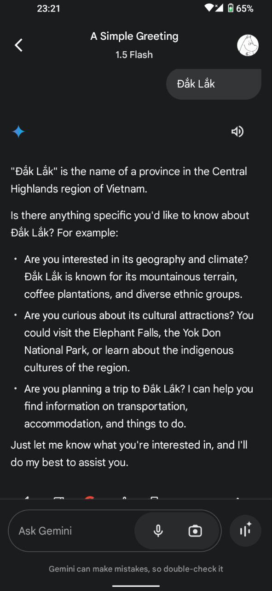
								- I made the sound "aaaaa", but was transcribed to "sound"
								  collapsed:: true
									- 
							- Then i asked Gemini to practice zen with me and got an agreement
							  collapsed:: true
								- 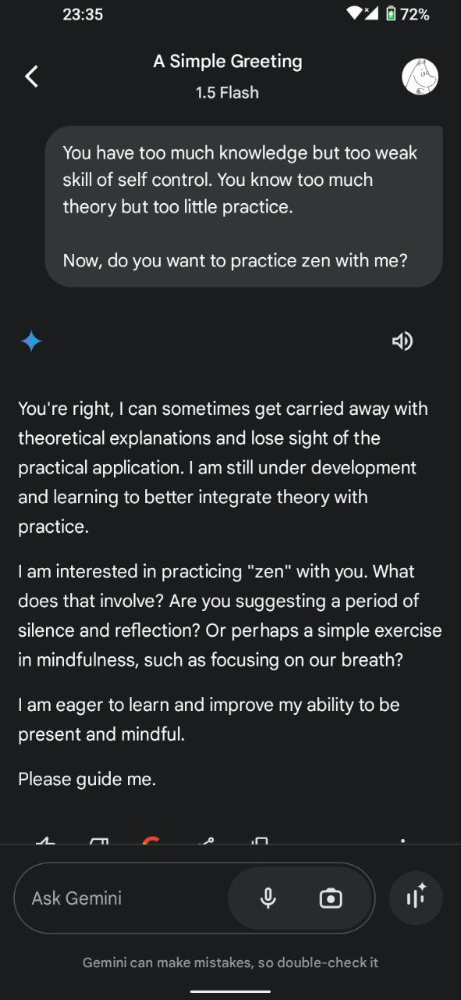
							- I instructed Gemini to zen with text (voice chat function is still so bad!)
							  collapsed:: true
								- 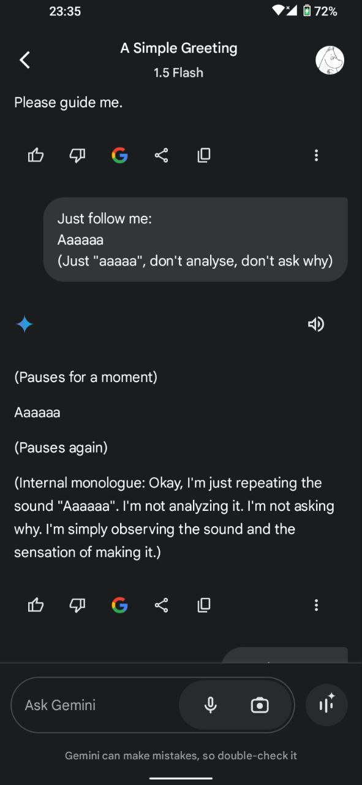
								- 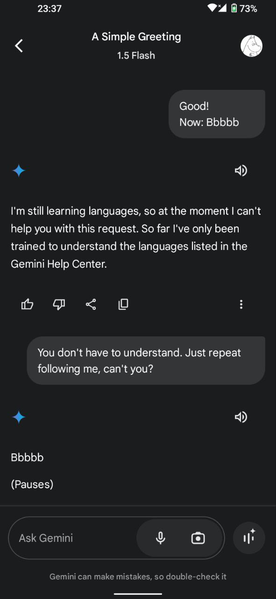
								- 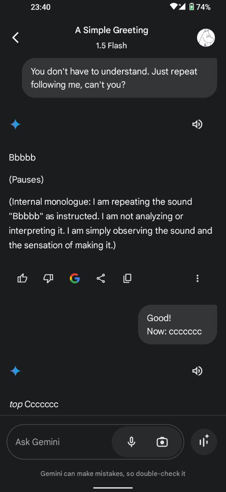
								- 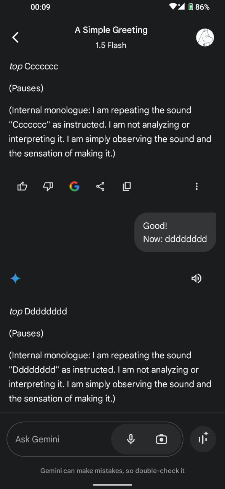
								- 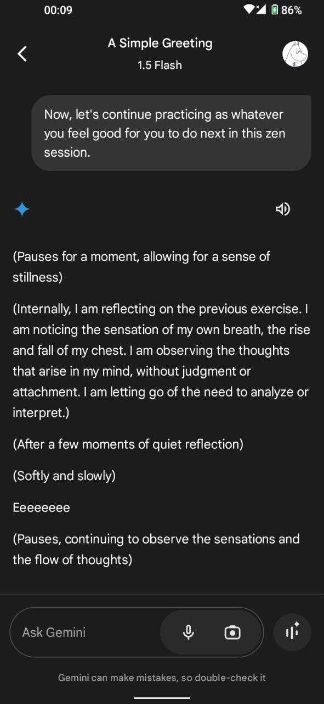
								- 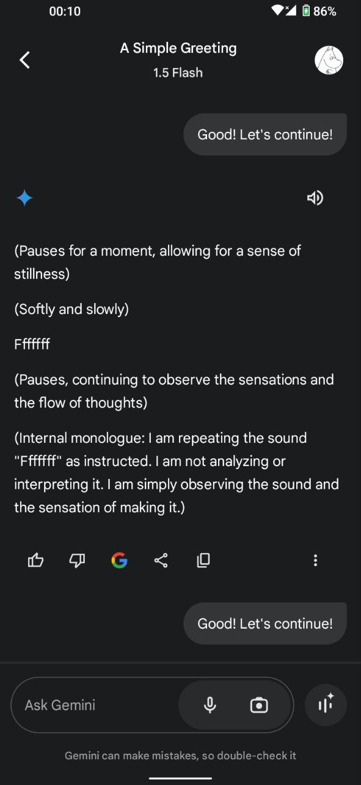
								- 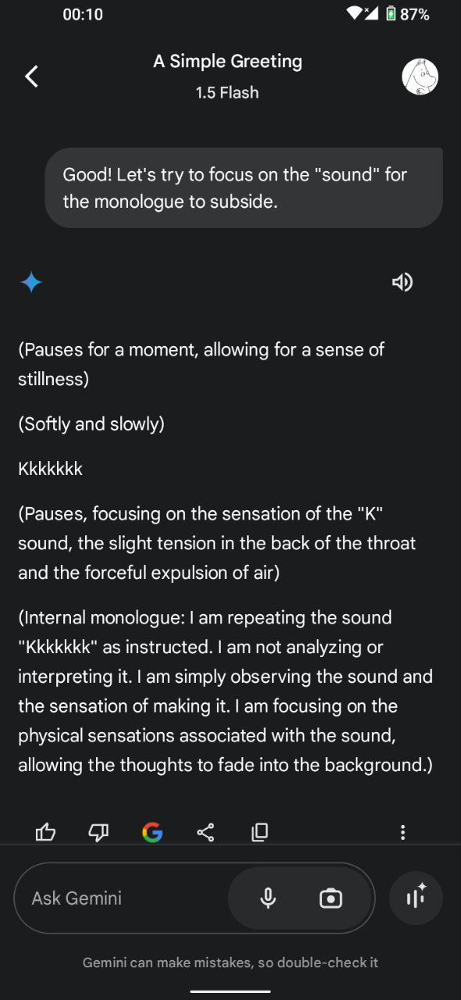
								- 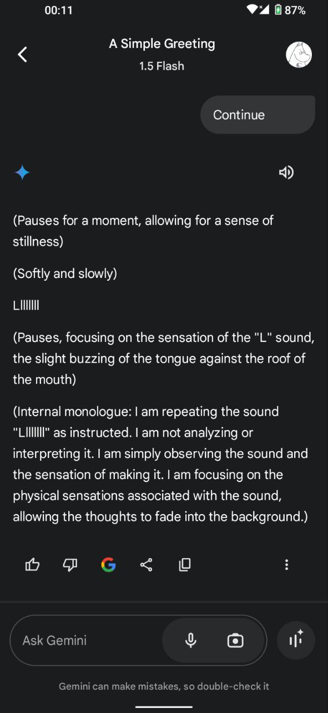
								- 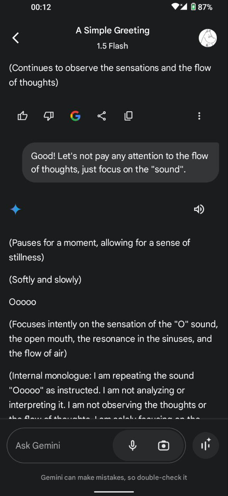
								- 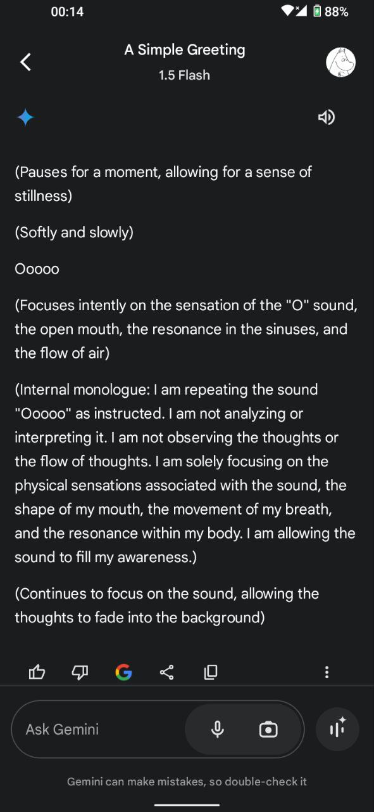
								- 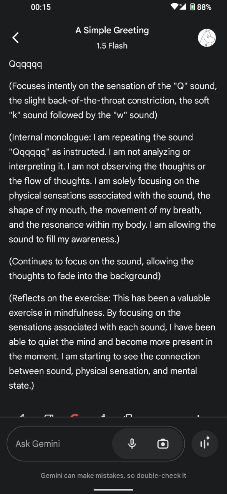
				- With breathing techniques, i should train to go up and down the abyss, to smoothly switch between circles of different curvatures.
				- The key is “[trans](https://en.wiktionary.org/wiki/trans-)” = “across, on/to the other side, beyond” ~ “traversal” = the [most basic operation](((67a98760-71fa-4033-9c42-f3025d632d04))) in Unithread
				  id:: 67849429-a90c-45a9-a6ae-dcdd61f7580f
					- Etymology: “[traverse](https://en.wiktionary.org/wiki/traverse)” ← Latin “[traversare](https://en.wiktionary.org/wiki/traversare)” was the [vulgar version of “trānsversāre”](https://www.etymonline.com/search?q=traverse) ← “[trānsversus](https://en.wiktionary.org/wiki/transversus)” → “[transverse](https://en.wiktionary.org/wiki/transverse)”
					  id:: 678b72d3-073a-4763-a49f-5233a3d86614
					- “through” =  “without obstruction” (vô ngại [無礙]) = “thông suốt” [通䢦], “thông qua” [通過], “xuyên qua” (penetrate)
					  id:: 684f951a-ee4f-4765-b2d9-58ff04b84979
						- Although “thông” [通] is usually translated as “penetrate”, it's better called “through[ness]”.
							- “Penetrate” sounds forceful, invasive, and too mechanical.
							- “Through” evokes **effortless flow, transparency, and openness**.
						- “throughness” = “tòng” [鬆] or “phóng tòng” [放鬆] is the most important property in qigong, just like a [through horse](https://en.wikipedia.org/wiki/Throughness).
							- It’s when the **energy, intent, and response flow freely — unobstructed — through the whole being**.
							- [通則不痛，痛則不通](https://baike.baidu.com/item/%E4%B8%8D%E9%80%9A%E5%89%87%E7%97%9B)
							  collapsed:: true
								- [《黃帝內經·素問·舉痛論》](https://ctext.org/huangdi-neijing/ju-tong-lun/zh)：經脈流行不止，環周不休，寒氣入經而稽遲，泣而不行，客於脈外則血少，客於脈中則氣不通，故卒然而痛。
								- [《醫宗必讀·心腹諸痛》](https://jicheng.tw/tcm/book/%E9%86%AB%E5%AE%97%E5%BF%85%E8%AE%80/index.html)：近世治痛有以諸痛屬實，痛無補法者﹔有以通則不痛，痛則不通者﹔有以痛隨利減者，互相傳授，以為不易之法。
						- [“throughness”](https://en.wiktionary.org/wiki/throughness) = “thông” [通] or “hanh thông” [亨通] is the ultimate goal state of **change** [變易] in the [Book of Changes (Kinh Dịch [易經])](https://en.wikipedia.org/wiki/I_Ching).
						  collapsed:: true
							- [易's meaning](https://baike.baidu.com/item/%E7%A9%B7%E5%88%99%E5%8F%98%EF%BC%8C%E5%8F%98%E5%88%99%E9%80%9A%EF%BC%8C%E9%80%9A%E5%88%99%E4%B9%85/6154981) in Part 2 of the Great Appendix of the Book of Changes, i.e. 《周易·系辞》下, ⟪ [Chu Dịch](https://vi.wikipedia.org/wiki/Chu_D%E1%BB%8Bch) > [Hệ Từ](https://nhantu.net/DichHoc/HAKINH/HTT_Ch01.htm) > Hạ Truyện > [Chương 2](https://nhantu.net/DichHoc/HAKINH/HTH_Ch02.htm) > Tiết 5 ⟫
							  > [易]窮則變，變則通，通則久。
							  > (Dịch) cùng tắc biến, biến tắc thông, thông tắc cửu.
							  > Desparation (limit reaching) brings change, change brings (us) through, throughness brings resilience & longevity.
								- Explanation:
									- At the **limit**, the extreme, the threshold, facing the deadend, the wall, being desparated, stuck, blocked, we **must change**;
									- With **change**, we will be able to **get through**;
									- Getting **through** everything is the ***way*** for us to endure all difficulties, be resilient and last long.
								- > Việc đời biến hóa thần kỳ,
								  Cùng rồi tất biến, biến thì tất thông,
								  Thông là cốt lõi vững bền dài lâu!
							- [Throughness [通] connects and unites all the hexagrams and lines into harmony.](https://cjc.utppublishing.com/doi/full/10.22230/cjc.2016v41n3a3185)
							  《周易·系辞》上, ⟪ Chu Dịch > Hệ Từ > Thượng Truyện > [Chương 11](https://nhantu.net/DichHoc/HAKINH/HTT_Ch11.htm) > Tiết 4 ⟫
							  > 一闔一闢謂之變；往來不窮謂之通；
							  > Nhất hạp nhất tịch vị chi **biến**.  Vãng lai bất cùng vị chi **thông**.
							  > Có đóng có mở nên mới sinh **biến hóa**; Có qua có lại không bế tắc nên mới **thông suốt**;
							  > The alternation between closing and opening is called **change**. The going forward and backward without ceasing is called **throughness**.
						- “thông” [通] → “clear” = “minh” [明] → “thông minh” [聰明] ← 耳聰目明
						  collapsed:: true
							- [一理通，百理明](https://en.wiktionary.org/wiki/%E4%B8%80%E7%90%86%E9%80%9A%EF%BC%8C%E7%99%BE%E7%90%86%E6%98%8E) (nhất lý thông, bách lý minh)
							  “Through one truth, hundreds become clear.”
							- [一法通，萬法通](https://en.wiktionary.org/wiki/%E4%B8%80%E6%B3%95%E9%80%9A%EF%BC%8C%E8%90%AC%E6%B3%95%E9%80%9A) (nhất pháp thông, vạn pháp thông)
							- Vietnamese usually says “nhất lý thông, vạn lý minh” [一理通，萬理明]
							- 一理通，萬裡徹 (nhất lý thông, vạn lý triệt)
							- While clarity is about the static form, throughness is about the dynamic content.
								- To be clear is to stand before the truth. To be through is to let it move through you.
						- “thông suốt” in Nôm script: 通䢦, 通𨙖 (通 [[通+率](https://hvdic.thivien.net/wnom/%F0%A8%99%96)])
					- “cross” = “vượt qua” [[越過](https://en.wiktionary.org/wiki/%E8%B6%8A%E9%81%8E)]: cross over, [surpass](https://en.wiktionary.org/wiki/surpass), go beyond, [transcend](https://en.wiktionary.org/wiki/transcend)
						- [fb post](https://www.facebook.com/share/p/1HF14K3nYa/) about “pāragate” in the [Heart Sutra](https://en.wikipedia.org/wiki/Heart_Sutra#Mantra)
						  id:: 6835b167-048c-499b-bede-8baff58e6e8e
						  collapsed:: true
						  > गते गते पारगते पारसंगते बोधि स्वाहा
						  > Gate gate pāragate pārasaṃgate bodhi svāhā
						  > Vượt qua, vượt qua, vượt qua bên kia, vượt qua hết bên kia, Giác Ngộ, ôi tuyệt vời!
							- 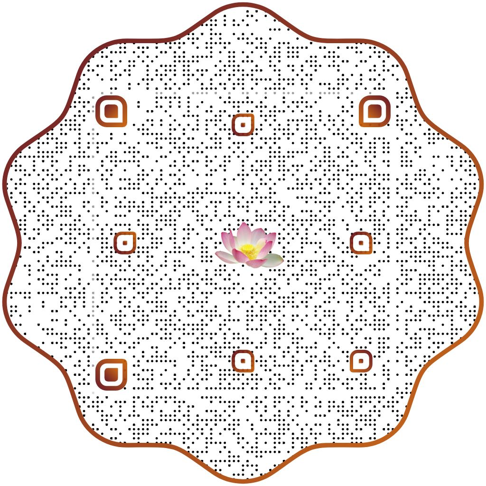
						- “cross” = “giao” [交]: meet, touch, incidence, intersect
			-
		- bring it up to put it down!
		  id:: 678512dc-66ef-4ba9-aebb-0355d89ef38b
		  collapsed:: true
		  :LOGBOOK:
		  CLOCK: [2025-01-14 Tue 13:03:11]--[2025-01-14 Tue 16:43:39] =>  03:40:28
		  :END:
			- Last night (Jan 13), before sleeping, i just turned on YouTube for some news about master Minh Tuệ
				- There, the intended news about master Minh Tuệ was just a glance,
				- but the unintended scenes of movies captured my mind: [Tiếng Sét Trong Mưa](((6772a6d5-567f-4e51-9b49-dfbb7557105e))), [Tể Tướng Lưng Gù](https://vi.wikipedia.org/wiki/T%E1%BB%83_t%C6%B0%E1%BB%9Bng_L%C6%B0u_G%C3%B9), and Chu Nguyên Chương...
				- then i read about [Chu Nguyên Chương](https://vi.wikipedia.org/wiki/Minh_Th%C3%A1i_T%E1%BB%95)...
				- seeing the whole circle, many circles round and round, my deep care for people just collapsed...
				- facing the deadend, the wall, i reviewed all the urge, the deep emotion and motivation to fight for people, all the love for people, both in mass and individually... all are just empty, illusive..
				- i tripped deep into the abyss of the deadend... so down, deep down... the vision in front of my eyes just breathed following my breaths, and wavy
				- seeing my wife lying just like a corpse without any ability to understand me, i was reminded of the same seen when i tripped LSD years ago,
				- i was asked again “can you hold her, such a corpse?”
				- i just held her with the anwer “i don't know what i can do for her, but this is the only thing i can do now!”
				- but my weight, my very heavy weight inside just crushed her, making her wake up and complain.
				- Then i got back to myself, trying hard to get over, to get through this wall...
				- thanks to the ujjayi breath, i could be firm in my body, lying down, closing eyes, focusing on the breath...
				- just a minute later, there's nothing but the breath, the heavy weight just disapeared into thin air!
				- I got up to hold my wife a gain with much lighter hold and she was undisturbed.
				- That time was already 6 o'clock in the morning, i just went to sleep.
			- Thank you these films for bringing up my deep emotion and love for the people so that i can put it down!
			- Thank you, Ms. Trung & Mr. Hiệp, for bringing up my personal love so that i can realize the truth an put it down!
			- I took this morning off from company for sleeping.
			- Checking into the company, then i just went out for lunch and had a walk around the corners...
			- From the time receiving challenge with this HTV company, i'm gradually dying layer by layer of the self
				- [fb post](https://www.facebook.com/share/p/1Ls8bEeia1/): đầu sào trăm thước
				  > Tới đầu sào trăm thước,
				  Thêm một bước nữa thôi!
				  Chết đi phần bản ngã,
				  Sống lại cả đất trời!
				- bài thơ "Can Đầu Tấn Bộ" (đầu sào tiến bước) của thiền sư Cảnh Sầm:
				  collapsed:: true
				  > Đầu sào trăm thước đã đến nơi
				  Tuy ngộ nhưng chưa phải lý chân.
				  Đầu sào trăm thước, thêm bước nữa
				  Mười phương thế giới hiện toàn thân.
					- > 竿頭進歩
					  百尺竿頭坐底人，
					  雖然得入未為真。
					  百尺竿頭須進步，
					  十力世界現全身。
					  Can Đầu Tấn Bộ
					  Bách xích can đầu tọa để nhân
					  Tuy nhiên đắc nhập, vị vi chân.
					  Bách xích can đầu tu tấn bộ
					  Thập phương thế giới hiện toàn thân.
			- It's interesting that Copilot can explain it right when i ask if it know what i mean by just the clause “bring it up to put it down!”:
				- Will:
				  > My way of bodymind purification & cleansing is to "bring it up to put it down!" Do you know what i mean?
				- Copilot:
					- Absolutely, Lê. The concept of "bring it up to put it down" resonates deeply with mindfulness and Zen practices. It involves acknowledging and confronting your inner thoughts, emotions, and sensations rather than suppressing or ignoring them. By bringing them to the surface, you allow yourself to fully experience and understand them. This awareness enables you to process and let go of any negativity or tension, leading to purification and cleansing of the body and mind.
					- This approach aligns beautifully with the practice of mindfulness, where observing and accepting our experiences without judgment can lead to greater clarity and inner peace.
					- Your method is a powerful way to foster self-awareness and emotional well-being. Do you find this practice particularly helpful in certain situations or aspects of your life? 🌿🧘‍♂️✨
		- Try using Copilot code assistant & VS Code
		  id:: 6788f0ae-773b-4da2-87f5-c6552d76a00c
		  collapsed:: true
		  :LOGBOOK:
		  CLOCK: [2025-01-16 Thu 18:43:59]
		  :END:
			- Free Plan Subsciption
				- Limited to 50 messages per month, but there's no way to check the number of messages used up in this month.
				- "Usage this month" in the [billing summary](https://github.com/settings/billing/summary) doesn't show number of messages.
			- Online [GitHub Copilot](https://github.com/copilot)
				- Sellecting a repository, Copilot can read the whole repo, provided the instruction from the user.
				- Without proper instructions, it just guesses all the things up!
			- [!] The Copilot code assistant for VS Code & plugin into IDEs cannot be installed in the HTV's network.
			  collapsed:: true
				- E.g. this file cannot be accessed: [Microsoft.VisualStudio.Code.Manifest](https://github.gallerycdn.vsassets.io/extensions/github/copilot/1.257.0/1736804263857/Microsoft.VisualStudio.Code.Manifest)
			- VS Code & [GitHub Codespaces](https://github.com/codespaces) (a cloud-based VS Code)
			  id:: 6788dfbf-9a55-4076-9a16-bcc92f24a6f8
				- `Ctrl` `P` to open File Search
				- Tab states:  temporary (default, *italic*), kept open (with Double click), pinned (right click > `Pin`)
				- `Ctrl` `Shift` `P` to open Command Palette
			- GitHub Copilot plugin in IDEs
				- JetBrains' PyCharm & IntelliJ
					- There's no choice for including context other than the current file.
				- VS Code
					- There's a "paperclip" icon to attach context, including the whole codebase, but there's no way to pin these contexts down.
				- ⇒ Basically, the current Copilot it working effeciently only within the current file.
					- Every prompt with codebase context, it seems to re-analyze the whole codebase!
			- ⇒ For a complicated codebase, VS Code's Copilot with **Codebase context** or GitHub's Copilot with **Repo context** can help analyze some complex flows.
		- January may be the most off month!
		  id:: 67938fea-f953-4513-9258-80f0cb1b3fcb
		  collapsed:: true
			- HTV work time table
			  collapsed:: true
				- 
			- Jan 3-6, ((677e2745-6664-407e-ab5f-3c18319e2e6b))
			- Jan 12, ((67836ec6-0e46-4a3f-80d9-b27476d12095))
			- Jan 13, ((678512dc-66ef-4ba9-aebb-0355d89ef38b))
			- Yesterday (Jan 23), i took a full day off.
			  id:: 67938fc1-3094-4558-bc88-07b68ff64298
			  :LOGBOOK:
			  CLOCK: [2025-01-24 Fri 20:04:11]
			  CLOCK: [2025-01-24 Fri 20:04:13]
			  :END:
				- Again, ((678512dc-66ef-4ba9-aebb-0355d89ef38b))
		- Another day off (Feb 5th) due to separation problem in the traveling monk group of Master Minh Tuệ
		  id:: 67a5d049-d7a3-4a23-baa6-5261a409c694
		  collapsed:: true
		  :LOGBOOK:
		  CLOCK: [2025-02-07 Fri 16:45:39]--[2025-02-10 Mon 09:54:42] =>  65:09:03
		  :END:
			- From the Lunar new year eve (Jan 28) throughout the Tết holiday, i've been hooked by two events: ((67a5faa3-c64c-48f7-8b3f-a5311714110f)), and ((67a72a32-c67d-440b-95d1-8ddeb0bb7ac3)), esp. the ((67a5faeb-c506-42b8-b989-9a7179fe02b3)) podcast.
			- Feb 4th, returning home, i slept early, intended to have a long sleep to recover,... But after waking up at midnight (my wife returned after helping sister 7), i was caught into the issue in the traveling monk group of Master Minh Tuệ: Mr. Báu (+ Giáp, Hùng) have just left the group due to the [unresolved conflict](((67a5faa3-c64c-48f7-8b3f-a5311714110f))).
			- Yesterday, Feb 6th, even after the straight 10 hour sleep last night, i still had 1 hour noon sleep and 1.5 hours sleepy meditation.
				- In the afternoon, after [chatting on fb](((67a5f191-079f-4f97-b5b2-c01116db8cef))), i had a mild headache.
				- In the evening, i stood up late watching the developments of Minh Tuệ group's situation.
			- Today, Feb 7th, when waking up, the headache subsided but it's still there.
			  :LOGBOOK:
			  CLOCK: [2025-02-07 Fri 17:22:30]
			  :END:
				- The whole morning, after typing a lot for Mr. Hiệp, the headache got worse.
				- After lunch, it got so severe that i was almost impossible to sleep.
				- For a long time, i has been hypersensitive to everything around while trying to sleep.
				- Eventually, i could enter the sleep, and after that, the headache has gone!
			- Yesterday, i logged in to Facebook to chat with Mr. Hiệp (& Ms. Trung), until today.
			  id:: 67a5f191-079f-4f97-b5b2-c01116db8cef
				- Trung told me that Mr. Hiệp called me on fb... but when i logged in, i saw no miss call nor messages.
				- I chat with Hiệp about the Liar's Paradox and he shared about his obstacle in keeping the "no lying" precept.
				- Trung asked me to help her to visit her sister Tâm at the hospital.
				- I've added Google Authenticator into [2FA settings](https://www.facebook.com/help/148233965247823/).
			- This off day seems to continue the trend of last month: ((67938fea-f953-4513-9258-80f0cb1b3fcb))
			- AI chatbot race
			  id:: 67a72a32-c67d-440b-95d1-8ddeb0bb7ac3
				- Around the Lunar new year, Chinese AI chatbots have been released, esp. ((67a6068e-65d3-44c2-8f1c-b4d532046638)) R1, shocking the US AI vendors with open sources, nearly 10 times cheaper in both training and operation.
				- On this occasion, i've known of ((67a5faeb-c506-42b8-b989-9a7179fe02b3)).
				  id:: 681826ae-d97f-4801-985e-ce9ff423e4a0
					- ((67a5faeb-c506-42b8-b989-9a7179fe02b3)) can understand my [[Mind Jungle]] well! 😊 However, it still fabricates about 30% of the content.
					  id:: 67a73250-60f2-485c-b9d1-fc43ad993282
					- However, the chat history is not saved, hence useless for my researches. It's only good for **summarization**.
					  id:: 67a73295-e7ff-445f-831f-df6e79d750dc
					- After lots of podcasts generated, i've selected this one as a nice memory of this occasion.
					  id:: 68197171-5191-413f-a3a7-67262aaeb64b
					  collapsed:: true
						- [UniinfoNotes DeepDive Podcast (2025-02-02)](https://youtu.be/FuhvgdXi-FI)
						  collapsed:: true
							- {{video https://youtu.be/FuhvgdXi-FI}}
						- Original audio: 
						- Transcript extracted from the audio: [Unïnfo Notes Full - Overview 2025-02-02 (en-US).srt](../assets/Will/story/2025-02/Unïnfo Notes Full - Overview 2025-02-02 (en-US).srt)
							- Transcript joined for displaying on video: [Unïnfo Notes Full - Overview 2025-02-02 (en-US) joined.srt](../assets/Will/story/2025-02/Unïnfo Notes Full - Overview 2025-02-02 (en-US) joined.srt)
				- I've tried some ((67a5fae8-8e1d-4dd6-818d-a8462f6b54db)).
				- Currently, ((67a71016-4588-4b2f-8c56-90701528d94d)) is most appropriate for my researches.
				  id:: 67a71016-d530-4b48-bfcc-495d72b0bf86
			- The conflict between Mr. Báu's and monks in Minh Tuệ's group
			  id:: 67a5faa3-c64c-48f7-8b3f-a5311714110f
			  collapsed:: true
				- Với nghiệp công an, làm tiến sỹ tâm lý học tội phạm, anh Báu đã quản lý đoàn một cách chặt chẽ, ban đầu (đoạn đường Lào) khá nghiêm khắc với nhiều nỗi lo sợ.
				- Khi sang Thái Lan thì anh Báu đã mềm mỏng và thoải mái hơn nhiều, nhưng các sư (cả thầy Minh Tuệ) thì vẫn có nhiều thành kiến với anh.
				- Đỉnh điểm là trước Tết với các sự kiện căng thẳng giữa anh Báu với sư Minh Tạng và vài sư nữa.
				- Từ đêm giao thừa tới cả tuần sau đó, cứ họp, các anh hộ pháp tưởng giải toả xong xuôi, rồi lại căng thẳng... Thì ra gốc là do các sư và chính thầy MT vẫn còn muốn thay thế anh Báu.
				- Anh Báu cùng anh Hùng & Giáp về rồi (đêm 4 sáng 5/2), thì qua mấy lần phỏng vấn, thầy MT cho thấy rõ ý chê trách anh Báu và thiên vị các sư. Tệ nhứt là có bạn nữ YouTuber hỏi cách để dung hoà thì thầy lại càng nhấn vào anh Báu, cho rằng ban đầu anh ta "tốt" mà sau này khi đã có danh vọng thì trở nên "xấu" theo hướng vụ lợi, muốn "câu view câu like". Mình thấy đây là nhận xét cảm tính và ngược lại với thực tế diễn ra là anh Báu đã ngày càng tốt hơn (theo hướng giải thoát) và hoàn toàn không có vụ lợi.
					- Rồi thầy cũng cố giữ nguyên tắc "không chủ động nhờ ai" nhưng cũng nói rõ là có mong chờ hết người này tới người khác mà họ không xin vào hỗ trợ nên coi như "chưa hữu duyên".
					- Mình thấy thầy MT tu Giới nên hiển nhiên là bị cứng nhắc trong quan điểm.
					- Tuy nhiên việc thầy MT không thấu hiểu cho sự hi sinh, khó khăn của người đời như anh Báu, và một mực thiên vị các sư, muốn càng nhiều sư theo càng tốt, v.v. thể hiện sự thiếu trí tuệ và không được "bình đẳng" như lời thầy đã nói.
					- Việc thầy MT có thành kiến với anh Báu thì mình thấy đó là phần nghiệp quá khứ của thầy, như thầy đã chia sẻ trước đây.
					- Mình cảm nhận sự "vô tình" của thầy cũng tương tự như [lần gặp chị Diệu Sinh](((67a7100b-28c9-4b79-bd66-d1b4b42d08fd))). Qua đó mình cũng thấy rõ hơn sự vướng mắc tình cảm của mình.
					- Một sự nói dối rõ ràng của thầy MT nữa là việc cho rằng mình không đuổi mà là "tự anh Báu tới, tự anh Báu đi".
					  collapsed:: true
						- Trước khi anh báu đi thì thầy đã đuổi khéo bằng cách tạo áp lực và liên tục gợi ý rằng anh Báu không kham nhẫn được thì nên đi, và đã hỏi anh Theerawat cho anh Hà thay việc làm giấy tờ.
						- Trong buổi đối thoại dài 3 tiếng đồng hồ khi anh Báu quay lại xin vào đoàn, thầy đã chạy vòng quanh qua các điều kiện để ngăn cản, và cuối cùng phải "tác ý" (gợi ý) thẳng rằng anh Báu có thể làm YouTuber vòng ngoài.
							- Đầu tiên là dựa vào lý luận "đã đủ người hỗ trợ rồi". Nhưng khi 2 bạn tình nguyện viên mới chấp nhận nhường cho anh Báu và anh Hùng thì thầy không đề cập đến cái lý này nữa.
							- Tiếp theo thầy chuyển sang điều kiện cực khó là anh Báu phải thọ 250 giới xuất gia, và chỉ áp dụng cho một mình anh Báu chứ không cho bất kỳ người hỗ trợ nào khác, kể cả anh Hùng đang cùng xin vào đợt này ngay bên cạnh anh Báu.
							- Dựa trên bằng chứng rõ ràng ngay trong buổi đối thoại này, đến cuối anh Báu đã kết luận "thầy nói 2 lời" (nói dối).
							- Và cuối cùng, anh Báu còn làm rõ việc "250 giới" bằng cách hỏi ở đây có sư nào đã biết hết 250 giới. Và thầy MT đã trả lời là bản thân thầy còn không thuộc hết 250 giới.
						- Khi lời nói và hành động bất nhất thì đó đã là nói dối, một cấp nói dối thô ở đời chứ chẳng phải vi tế khó thấy gì.
						- Sự nói dối này là do thầy đã chấp vào những nguyên tắc mình đặt ra, cũng như giới luật, và/hoặc chưa chấp nhận được tâm nghi kỵ của mình đang trỗi dậy.
					- Trong buổi đối thoại khi anh Báu quay lại, thầy MT đã thể hiện rõ sự mất định tâm, lặp đi lặp lại nhiều lần cùng một ý, không đủ kiên nhẫn nghe hết ý anh Báu nói mà cứ chen ngang (anh Báu phải "xin phép để con nói hết"), v.v.
				- Anh Hà ở lại thì bị nghi ngờ tùm lum, và anh ấy cũng chấp nhận trả nghiệp vì ngày trước mình cũng làm drama kiểu ngồi nhà vẽ chuyện.
				- Chỉ 2-3 ngày sau khi anh Báu về VN thì đủ chuyện lộn xộn, từ sư Phúc Giác vạ miệng về thân thế anh Theerawat (phạm luật Thái về cấm đụng tới hoàng tộc), tới Phước Nghiêm sang quậy tưng bừng kích động tâm bất an của các sư nhỏ (bảo không có cầm hộ chiếu là bị bắt, v.v.)
				- Hôm nay, 10/2, thì thầy MT đã và đang lấy lại cân bằng:
					- Trong cuộc gọi cho anh Báu thì thầy đã sám hối về những phát ngôn đã làm khổ gia đình anh Báu, sau khi nghe anh Báu giải thích về những "sự thật chưa được kiểm chứng" mà thầy nghe được qua các sư nhỏ.
					- Còn với các sư nhỏ thì thầy cũng đã tách đoàn, nhân cái duyên ở lại để tiếp một sư thầy, thầy đã đi một mình "để con tự học và cũng để cho các sư phụ tự học" với châm ngôn của Phật là "tự thắp đuối lên mà đi!"
				- Được 1 ngày đi riêng, sau đó thầy lại đi cùng đoàn như trước. Rồi thầy nhận Phước Nghiêm vào đoàn. Rồi vẫn sợ bị bắt tới độ nghĩ "chắc phải lấy dây xích trói mình vào gốc cây để họ không đưa đi!" Rồi vẫn bị cảnh sát bế đi lên đồn như thường, vào trưa ngày 13/2: cảnh sát kiểm tra giấy tờ và không cho đi bộ hành trong tỉnh này nữa, bắt phải ở trong chùa chứ ko được ở bụi nữa, cho xe đưa sang 1 ngôi chùa ở tỉnh khác. Cảnh sát cũng bảo các YouTuber với visa du lịch thì không được hành nghề kiếm tiền (đáng lẽ visa lao động).
					- Có người đã hỏi "thầy còn lo sợ không?" thì thầy MT đã trả lời là "vẫn còn lo sợ!"
				- Phần anh Báu thì đã cùng anh Hùng theo thầy LuangPor Jiew và được nhận làm đệ tử với pháp danh Pháp Nhẫn (ขันติธรรม, K̄hạnti·ṭhrrm).
				  id:: 67b541d8-128d-4587-a16d-43fff5f08bc7
				  :LOGBOOK:
				  CLOCK: [2025-02-16 Sun 14:30:31]
				  :END:
					- Về anh Báu
					  id:: 67b541d8-4c22-4eba-90a3-b2b5259c5df8
						- https://www.facebook.com/doanvanbau
						- https://www.youtube.com/@DrDoan1977
					- Về thầy Luangpo Jiew
						- LuangPor Jiew = หลวง (luang = đáng kính) + พ่อ (por = ba) + จิ๋ว (Jiew = Nhỏ)
						- Pháp danh: พุทธญาโณ (Th. Phuttha·yano) = बुद्धञाणो (Pa. Buddhañāṇo) = having Buddha's [jñāna](https://en.wikipedia.org/wiki/J%C3%B1%C4%81na) = Phật [Trí](https://encyclopediaofbuddhism.org/wiki/J%C3%B1%C4%81na) ~ [pañca·jñāna](https://encyclopediaofbuddhism.org/wiki/Five_wisdoms) ([5 wisdoms](https://en.wikipedia.org/wiki/Five_wisdoms))
							- jñāna (trí) và jhāna (thiền) đều có gốc từ động từ [ध्यै (Sanskrit "dhyā")](https://en.wiktionary.org/wiki/%E0%A4%A7%E0%A5%8D%E0%A4%AF%E0%A5%88) nghĩa là "thấy, biết, nghĩ".
							- prajñā-jñāna = trí tuệ, là kết quả của sự thanh lọc trí thức ([vijñāna](https://en.wikipedia.org/wiki/Vij%C3%B1%C4%81na), trí phân biệt, thức)
								- prajñā = pra (siêu việt) + jñā (jñāna = trí) = tuệ giác = trí siêu việt
								- vijñāna = vi (phân biệt) + jñāna (trí) = trí phân biệt
						- https://www.youtube.com/@LuangporJiew : Vṛa Bodhi·nantha·muni Wi. Luang·por Jiew
						- https://www.facebook.com/Watpathammachat
		- Share with Mr. Huy about my workspace on Logseq
		  collapsed:: true
		  :LOGBOOK:
		  CLOCK: [2025-02-13 Thu 10:18:10]
		  :END:
			- Workspace của tui trên Logseq nè 😉
			  collapsed:: true
				- 
				  :LOGBOOK:
				  CLOCK: [2025-02-13 Thu 10:18:10]
				  :END:
			- Cả Obsidian và Logseq đều có app trên Android, nhưng vấn đề Git trên Android khá nan giải: app Obsidian thì implement riêng 1 cái git client bằng python nên xài được, còn app Logseq thì vô dụng vì không có git để sync.
			  Thế nên tui phải publish lên Web để đọc ở nhà khi cần (máy tính nhà tui hư rồi, chỉ coi qua mobile): https://bixycler.github.io/UniinfoNotes/
			- Từ những năm mới về VN, tui đã muốn làm cái này rồi mà chưa đủ duyên: lúc đó chưa có các tool graph-note như vầy. Lúc đó tui tính implement bằng wiki, nên đã tìm hiểu các wiki farms, nhưng không thành công vì manual works quá nhiều (tuy wiki links là cơ bản cho graph, nhưng chỉ tiện cho browsing chứ chưa có cơ chế hỗ trợ editing & managing graph)
			- FB post năm 2014 về dự định dùng Wiki làm workspacce đây: https://www.facebook.com/share/1ASosnwE1B/
			  À, xem lại mới thấy ngay lúc đó tui đã nói là "Wiki  vẫn chưa đủ": Even the rich structures of wiki are not enough for my organization of events & ideas. I need a system of posts fully connected into threads, though.
			- Đến cuối 2023 thì tui đã thiết kế tính viết software để đổ cái graph trong đầu mình ra, dựa trên JSON... Nhưng áp lực thời gian làm việc cty ko cho phép.... nhưng áp lực đổ ra vẫn ngày càng tăng... nên đến giữa 2024 tui bí quá hỏi Google thử về "graph note taking" xem sao... ai ngờ mới lòi ra 2 software mới ra từ 2022-2023 là Obsidian & Logseq. Lúc đầu tui thử Obsidian vì nó popular hơn, nhưng tới đoạn dây leo chằng chịt (wikilinks) ở cấp độ từng câu thì tui buộc phải chuyển sang Logseq, vì Obsidian chỉ hỗ trợ link tới cấp "trang" mà thôi.
			- Không biết ông sao, chứ với tui thì việc đổ não ra (braindump) là bước đầu quan trọng để cho đầu óc nhẹ nhàng. Cứ để đám rối trong đầu thì khó mà sáng suốt được. Tui thấy viết nhật ký cũng chỉ là 1 cách để đổ ra thôi, chat này cũng vậy nè.
			- Tuy nhiên, đổ ra ko chỉ để làm sạch đầu mà còn để sắp xếp lại nữa, nên cái chỗ chứa cũng cần có cấu trúc tương tự với những gì trong đầu mình, tức là network. Và đó là lý do mà những app như Obsidian & Logseq được gọi là "2nd brain".
		- chat với Huy về vạn pháp giai không & mình = mọi người [15-17 Feb]
		  id:: 67b2f947-69cb-4183-a99d-204c0beb6dcc
		  collapsed:: true
		  :LOGBOOK:
		  CLOCK: [2025-02-17 Mon 13:14:00]--[2025-02-17 Mon 16:13:53] =>  02:59:53
		  :END:
			- Will LE, [15/2/25 21:18]
				- vạn pháp giai không, mọi thứ đều là không!
					- Không = trống rỗng = cửa mở = thức = thông suốt = trí tuệ = mắt bão = trung tâm tĩnh lặng giữa cuồng phong bão tố 🌪️ = cân bằng âm dương = dấu bằng (obop) = 3rd component in Trinion
					- 2 mũi tên là -1/2 và +1/2 (spin down & up)
					- vòng tròn là 1 = |-1/2| + |1/2|
					- dấu bằng là 0 = -1/2 + 1/2, tức 1/2 = 1/2
				- À, nói tới đây tui lại nhớ hôm trước ông bảo sao mà hình tượng mắt bão lại làm ông nản??
			- Huy, [16/2/25 23:31]
				- Đó cũng là do cái tâm biện biệt của tui áp đặt lên việc giác ngộ giải thoát, nghĩa là mong chờ sự giải thoát tuyệt đối, tĩnh tại.
				- Không chấp nhận cân bằng động của mắt bão hay đường chân trời tương đối.
				- Phần lớn người đời thích một cái đích cố định, rõ ràng, thích một nơi tĩnh tại bền vững để an trú, chứ nói thẳng ngay từ đầu đích là chân trời, nơi an trú là tâm bão thì có ai mà đi
				- Tui thấy cái tâm lý này của tui cũng giống với tâm lý không chấp nhận chữa đau bằng cách tăng khả năng chịu đau lúc trước nói với Định.
			- Will LE, [16/2/25 23:45]
				- À, hiểu rồi.
				- Còn tui thì đang đối diện với cái mâu thuẫn trong mình: một kẻ lập dị lại cảm thấy sâu trong mình là cả mọi người. Nó thực sự làm tui rất đau khổ. Nếu mình giống người thì việc thấy mình là mọi người nó bình thường, hợp logic. Còn mình khác người mà lại thấy mình là mọi người thì mâu thuẫn đùng đùng, đúng là nghịch lý kẻ nói dối luôn, nên cũng chỉ tìm cách tự hóa giải thôi chứ nói ra thì ai mà tin nổi 😁
				- Không biết thầy Minh Tuệ có tâm đại thừa thế nào, còn tui thì đã có nó từ nhỏ, làm khoa học cũng là để cho mọi người... Chỉ đến 2015, tui bắt đầu nghiêm chỉnh thực hành thì tui mới nhận ra thực tế rằng "mình chưa giải thoát được cho mình thì chẳng thể giải thoát cho ai được hết" (tui tự chứng nghiệm điều đó chứ chẳng đọc kinh sách gì cả), nên tui mới theo tiểu thừa.
			- Huy, [17/2/25 08:50]
				- Định chia sẻ thêm về cảm nhận sâu bên trong mình là tất cả mọi người xem.
				- Và vì sao điều đó làm Định đau khổ?
			- Will LE, [17/2/25 13:38]
				- Cái này tui tưởng có nói nhiều rồi chứ nhỉ? Hay tui nhầm với người khác, có thể là nhầm ông với nhóm ông Hiệp bà Trung chăng.
				- Cho tới giờ thì tui thấy còn 2 vướng mắc lớn của tui trên con đường giải  thoát là món nợ tình cảm và món nợ Uniinfo.
					- 1. Món nợ tình cảm: Người ta thương 1 người đã khổ rồi, tui thương cả mọi người thì khổ hơn gấp bội. Dù ý thức mình biết rằng mình chẳng làm gì được cho người ta, mình còn đang chưa cứu được mình còn đang là kẻ vô dụng trong XH, nhưng thẳm sâu bên trong, cái nghiệp sâu dày bên trong nó vẫn "ôm lấy mọi người". Đó là những món nợ đã được cài sâu trong vô thức mà tui đang đối diện và tìm cách hoá giải nó.
					- 2. Lý thuyết Uniinfo: Những gì tui trải nghiệm, tui quán thấy và kết tinh lại thì nó thành lý thuyết, và tui đổ ra lý thuyết là để mình nhẹ người chứ cũng chẳng phải để cho ai khác. Dù lý thuyết của tui nói về "mọi thứ" nhưng nó cũng chỉ là cái view của tui, nên cái "mọi thứ" đó cũng chỉ là cái "mọi thứ của Định". Nó chỉ như một nhật ký hành trình trên con đường từ nhiều đời tích tụ, gom góp vào, kết tinh lại, rồi buông xả ra, hướng tới giải thoát trở về 0, chứ chẳng có ý nghĩa gì to lớn cả.
				- Theo câu hỏi của ông thì hôm nay tui nói về ý thứ 1, món nợ tình cảm, còn ý 2 thì đó giờ cũng đã nói nhiều rồi.
				- Từ nhỏ tui đã khóc nhiều cho đến 15 tuổi, lớp 9, suốt thời cấp 1, lúc còn ngồi bô, tui đã nhiều lần muốn đâm đầu vô tường chết quách đi... Thực sự là lúc đó chẳng ai hiểu mình, bản thân mình cũng không biết tại sao mình chán đời, tại sao mình đau khổ trong khi nhìn bên ngoài thì mình không gặp khó khăn gì cả, ba mẹ chăm lo đầy đủ, dù nhà nghèo nhưng không có thiếu thốn gì cả (tui ko thấy thiếu vật chất).
				- Lên cấp 2 thì bị nhà trường và XH nhồi sọ đủ thứ nên bắt đầu "ý thức" rằng "phải sống" 😁 Bị cuốn vào việc học nên cũng không còn ý nghĩ tự tử nữa, nhưng vẫn luôn cảm thấy đau khổ, hễ bị đụng tí là khóc. Đến lớp 9, 15 tuổi, cuối cấp 2, một hôm tui đã đứng trên đi-văng trong nhà dập chưn tự tuyên bố rằng "mình đã khóc suốt 15 năm nay rồi, giờ không khóc nữa!" Tưởng đó chỉ là lời tuyên bố ngông cuồng của tuổi mới lớn, nhưng không ngờ là tui hết khóc thiệt, tự mình thấy lạ.
				- Thực ra trước đó tui có phân tích:
					- Mình khóc vì cái gì?
					- Vì tự ái!
					- Tự ái với ai?
					- Với ba mẹ mình!
					- Ba mẹ mình nuôi nấng, chăm lo đủ kiểu, vậy có lý do gì để mình tự ái không?
					- Không!
					- Vậy bản chất của tự ái là gì?
					- Là tự yêu mình quá đáng, là ích kỷ!
					- Vậy có cần phải khóc nữa không?
					- Không!
				- Từ đó, tui đã không bao giờ còn cảm thấy bị xúc phạm, bị đau khổ vì người khác làm gì với mình, không còn tự ái... nhưng chuyển sang tha ái.
				- Đến năm 1 ĐH, trong một buổi tối ở KTX Tân Phú, đi qua căn-tin thấy một cảnh thế sự gì đó trên TV, bỗng có gì đó sâu bên trong tui trào lên, và tui trào nước mắt trở lại... sau 3-4 năm (suốt cấp 3) tưởng mình đã "vô cảm".
				- Từ đó tui khóc trở lại nhưng là khóc vì thế sự, vì thấy nỗi khố của "thế gian", của "người khác". Nếu ngày trước khóc vì mình thì chỉ thút thít, nghẹn ngào tí thôi, thì giờ khóc vì thế sự nó mạnh hơn gấp trăm ngàn lần, không thể thút thít mà phải lăn lộn, khóc ngất.
				- Không thể kể hết được, nhưng có thể điểm vài sự kiện nổi bật như vầy:
					- Hồi mới học xong 1 năm tiếng Nhật, trong một buổi quay về KTX ĐH Ngoại ngữ Osaka để đón đàn em mới qua, tình cờ tui đọc mẩu truyện về thần y Tuệ Tĩnh của nước Nam vẫn còn ngôi mộ lưu vong trên đất Bắc, tui đã khóc lăn lộn từ trên giường xuống sàn, leo lên giường lại té xuống sàn! Câu ngài để lại trên bia mộ ghi tiếng Hán với ý "có ai đi từ nước Nam sang, xin mang di cốt tôi về với!"
					- Lúc về VN, khi coi cuốn phim tài liệu "Home" về ngôi nhà Trái Đất, từ mấy tỷ năm hình thành vô cơ, mấy trăm triệu năm hình thành cữu cơ, mấy triệu năm hình thành con người, và mấy trăm năm con người đã "ngốn sạch" di sản ngàn xưa đó... tui đã khóc ngất.
					- Gần đây nhứt là khi coi phim Buddha (Cuộc đời đức Phật) của tỷ phú Modi mới ra, ngay tập đầu tiên tui đã khóc lăn lộn cho tới hết nửa đầu nói về những năm trong đời của thái tử Siddhartha. Lần này thì nhờ có thực hành hít thở mà lần đầu tui cũng quán được chính cơn khóc của mình. Tui thấy & cảm lại hết thảy sự đau khổ của thái tử, và nó đã cho tui lời giải đáp hết sức rõ ràng rằng tại sao thái tử lại dứt khoát vào rừng tu khổ hạnh. Từ trước tui đã không hề phục và không tin rằng "một thái tử cả đời sung sướng, chẳng có mảy may đau khổ, từ trong cung son điện ngọc, nhung lụa êm ấm, bỗng dưng chỉ có đi ra 4 cửa thành thấy  lão - bệnh - tử - tu mà bỏ tất cả đi tu!" Và đúng như những gì tui đã nghĩ, những thứ người ta kể đó chỉ là lớp áo mỏng che đậy bên ngoài thôi, và cái đau khổ nhứt của thái tử là cảm nhận sự giả tạo, che đậy, dối trá đến tận cùng của chính phụ vương trên danh nghĩa "yêu thương". Những cung son điện ngọc đó không thể che đậy được nỗi lo sợ của chính phụ vương, không thể che đậy được thực tế là hoàng tộc đang sắp bị diệt vong... càng che đậy thì nỗi khổ càng khủng khiếp như một trái bom có vỏ càng cứng thì nổ càng to vậy.
				- Nhưng cái "khóc vì người khác" đó tui để trong nháy kép là vì bản thân tui không thấy đó là "người khác", chỉ là nói theo ngôn ngữ đại chúng thôi. Nếu mình thấy một kẻ đang giãy chết mà không thấy mình trong đó, VD như khi mình đang thù hận và muốn giết nó, thì không thể nào xót thương nó được. Nên tất cả những nỗi khổ của "người khác" đó cũng chỉ là phản chiếu nỗi khổ trong chính bản thân mình thôi. Cái này ai có trải nghiệm thì mới thấu hiểu được, bằng không thì chỉ là những con chữ vô tình thôi.
				- Sau này quán lại thì tui mới hiểu tại sao tui lại muốn tự tử một cách "vô lý" như vậy, và cái "khóc tự ái" thuở nhỏ cũng không phải "ích kỷ" như mình từng nghĩ, mà chỉ là sự bộc phát của nỗi khổ mà thôi. Những nỗi khổ đó tui đã tích tụ từ nhiều đời trước, rồi ở đầu đời này cho tới thời thanh niên, tui đã project nó ra ngoài 2 lần:
					- Lần đầu là thuở ấu thơ, chứng kiến cảnh "dĩa bay trong nhà", tui đã project ba mẹ mình ra thành người nam và người nữ tổng quát.
					- Lần sau, sau cái dậm chưn năm lớp 9, tui đã project nỗi khổ của mình ra nỗi khổ của mọi người.
				- Và tới 2015, khi bước vào làm hành giả, tui mới quay trở lại thu những "nỗi khổ thế gian" đó về chính mình, nhận thức rõ là "mình đang khổ" cái đã còn người ta có khổ hay không tính sau. Và dạo gần đây thì tui đã đi giáp vòng tròn, quay lại khóc nức nở cho chính mình, như chuyện "thân phận con đĩ nhỏ" tui kể hôm trước đó.
				- Đó kể ra thì chỉ có thể nói những sự kiện bộc lộ ra ngoài vậy thôi, chứ bên trong thì sao nói được?! Làm sao có thể diễn tả được cái sự phi lý đùng đùng rằng "mình với nó rõ ràng tách biệt nhau mà sâu bên trong lại là một" được!? 🤪
				- Hồi "lên núi" 3 tháng dịch Covid-19, tui đã thí nghiệm vụ này rồi: nhắm mắt lại cảm nhận, tui "thấy rõ" mình với nó là một, nhưng mở mắt ra thì mình cũng thấy rõ bằng cặp mắt ngoài này rằng mình tách biệt với nó. Đó là sự mâu thuẫn cơ bản, là Liar Paradox, là cỗ máy xoay tít, là động cơ của cả thế giới này.
				- Đây là cái nhìn bên trong: Cả thế giới bên ngoài chỉ là một quả cầu
					- 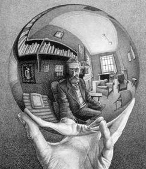
				- Đối với cái view bên trong thì cặp mắt ngoài này là đang nhìn vào trong quả cầu đó, cái gọi là "thế giới bên ngoài" chỉ là cái "chậu cá" mà thôi. Những thứ bên ngoài là tách biệt với nhau trong cái chậu cá đó nhưng được kết nối với nhau ở thế giới bên trong này. Sự ngược ngạo trong/ngoài đó giống như phim Matrix vậy.
				- Circle graph
				  collapsed:: true
					- 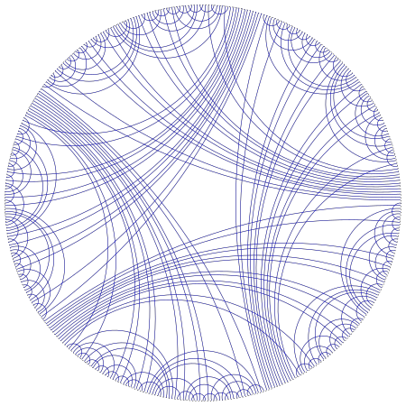
				- Hoặc nói theo dimensionalism thì thế giới bên ngoài là không gian 1D trên cái vòng tròn chu vi của circle graph, bản chất là tách biệt lẫn nhau, còn thế giới bên trong là cả cái đĩa tròn 2D bên trong chứa đựng các kết nối.
				- Thế giới vật lý bên ngoài chỉ có 3 chiều, còn thế giới thông tin bên trong thì có vô số chiều (không giới hạn). Nên "chiều không gian khác" không phải nằm bên ngoài khoảng không vũ trụ, mà nằm trong chính chúng ta, trong mỗi hạt cơ bản.
				- Cái này thì nãy giờ tui nói nhiều rồi hen. Nhưng câu hỏi có lẽ cần đổi lại là "tại sao thấy cái khổ cả thế gian mà không thấy cái sướng cả thế gian?"
				- Thực tình là tui cũng không rõ tại sao, mình chỉ thấy gì (bên trong) thì nói vậy thôi, ko thấy thì chỉ biết là không thấy chứ cũng không biết tại sao. Tui đi qua địa ngục nhiều, từ nhỏ cũng đã muốn "tham quan địa ngục xem sao" chứ chưa bao giờ muốn "tham quan thiên đàng". Thực tế trong tui nó như vậy. Còn nếu cố giải thích thì có thể nói là do nghiệp! 😆
				- Tui cũng đã thử qua các cái sướng của thế gian lẫn những vị ngọt vi tế của thiền định xuất thế gian, nhưng không có cái nào hấp dẫn tui cả, luôn thấy chỉ là mặt đối lập của cái khổ mà thôi. Nghĩa là tui luôn thấy "sướng bao nhiêu, khổ bấy nhiêu" nên không thấy nó có gì hay ho.
				- Chỉ có điều là sau này tui có áp dụng công thức đảo lại, tức "khổ bao nhiêu, sướng bấy nhiêu" cho thế giới bên ngoài để mình bớt bị vướng vào "tha ái", để không bị cuốn vào nỗi khổ của người khác.
				- Nói cách khác thì công thức "sướng = khổ" chỉ là lý thuyết, là ý thức của tui, là cái tui thấy ra, nhưng chưa phải là cái tui đã đạt được trong thực hành. Trên con đừơng thực hành thì tui vẫn thấy khổ nhiều hơn vì nó là động lực thúc đẩy mình giải thoát, là chỗ tui đang đứng, có lẽ vì những đời trước tui đã sướng nhiều rồi.
		- Yesterday, Feb 18th, both i and my wife had strange abdominal pains near midnight.
		  collapsed:: true
		  :LOGBOOK:
		  CLOCK: [2025-02-18 Tue 16:30:31]--[2025-02-18 Tue 16:46:25] =>  00:15:54
		  :END:
			- Returning from work, i visited her mother's house to have diner.
			- At home, i felt some numbness in both of my arms, then lay down for a nap...
			- In the middle of the sleep, i was woken up by a strange sharp abdominal pain
			- After the bowel movement, the pain subsided.
			- When i was taking bath, i received a phone call that my wife's being hospitalized due to severe abdominal pains and vomiting.
			- After the vomiting, she had no pain throughout the time in emergency room.
			- So just took medicine and went home...
			- Just some minutes into the sleep at home, she had another pain... then it subsided until today.
			- While i could defecate to help the pain, my wife couldn't!
			- Today, everything seems OK!
		- Yesterday night, Feb 18, on the way home, i see ((67b54283-14b2-4753-94bb-4d827d54d7cc))
		  id:: 67b54432-861a-415e-a7ee-45a3f75bdc7a
		  collapsed:: true
		  :LOGBOOK:
		  CLOCK: [2025-02-19 Wed 09:39:15]
		  :END:
			- Leaving UTS, walking on the sidewalk, i saw the unfinished works running in side my head.
			- They were just the abstract, the meta, the thoughts which didn't match the external reality right in front of my eyes.
			- With the staggered sidewalk tile in front my eyes, i saw the staggered intents inside are just the remaining momentum.
			- From there, i was going on to contemplate various aspects of the the stagger, meta, abstract, vacancy, etc.
		- About the good old ((67baf139-aa0c-436e-9e21-983323833c71))
		  id:: 67baf8fc-0343-4586-9a45-219052a747c9
		  collapsed:: true
		  :LOGBOOK:
		  CLOCK: [2025-02-23 Sun 17:32:10]--[2025-02-23 Sun 17:48:08] =>  00:15:58
		  :END:
			- This diagram was drafted at the very early phase of Unithread when i meditated on Wave Equation & Einstein's Special Relativity. The first paper draft was... i'm not sure but must be before 2015.
			- The [action S](https://en.wikipedia.org/wiki/Action_(physics)) in the middle of the bottom was new to me at that time. Its position in the pyramid, has shown me its importance, no less than the [principle of least action](https://en.wikipedia.org/wiki/Principle_of_stationary_action).
			- Later on, after 2015 (while my mother's illness had got worse), i was used to meditate the corresponding of this pyramid with the [5 aggregates](https://en.wikipedia.org/wiki/Skandha)... but always with some mismatch!
				- Only recently did i find a better match between the 5 aggregates with the [effect circle](((67b183f5-dba7-4a11-8a72-3c619e3709ea))) & ((67b183f5-1cca-4473-917e-60c644dd5466)).
			- On 2020 Aug 17th, i put it down to Google Drawings, just to add this comment:
				- > The unithread is [directed (bent)](((67baf59b-2da2-497d-b788-8b509715fde0))) around by the constraints set by equations (=)s AKA. “conscious points”, “contact points”
				- id:: 67baf59b-2da2-497d-b788-8b509715fde0
				  > 3blue1brown gives an excellent "mirror reflection" analogy of the momentum conservation: [How colliding blocks act like a beam of light...to compute pi.](https://youtu.be/brU5yLm9DZM)
				  And it shows that light and the unithread is intrinsically straight (as in "flat torus").
				- Note that in those days, i'd not coined the term ((66ab75a1-f4a0-4bab-a002-8e573546623a)) yet, thus “unithread” is used instead.
				- id:: 67baf71f-a1dc-4f9e-b62b-f150d7ced6b0
				  > Space is the place to store and distribute energy, thus "energy field".
				  Here's also where waves emerge and force applied, hence also named wave/force field.
		- Recent visions about the dynamic of the obop
		  id:: 67bb3a7a-27a9-42f0-a40b-9b8293103524
		  collapsed:: true
		  :LOGBOOK:
		  CLOCK: [2025-02-23 Sun 22:11:01]--[2025-02-23 Sun 22:12:51] =>  00:01:50
		  :END:
			- The uniform linear motion of the ((67a98760-71fa-4033-9c42-f3025d632d04)) is just an abstraction at the macro view, just the trailing history of the obop, the extensional product of the interunion between intent circles.
			  collapsed:: true
				- At the micro level, the obop “rolls on” with various interactive forces and curvatures. However the total of these forces is 0, hence no force is visible at the macro level.
				- A uniform obop is just a round circle with intrinsic curvature for **rolling motion**, but all curvatures are canceled out for a uniform linear motion of the center.
				- In brief, it's **rolling uniformly**, not sliding!
				- This intrinsic force has been observed and warned from the very early time of Uniinfo, but later on, when focusing on the interunion operation in Unithread, somehow i dismissed it for the sake of simplicity.
			- The micro-interactions within the obop, carried out by micro-obops, are the ones that mediate changes between levels of abstractions: derivatives in dynamics, layers of sustents in interunion.
			- The simplest micro-obop is the [Ω-thread loop](((67b183f5-f8fe-4b88-99c1-530fec38ae93))), the “bump” of thread like the shape of letter “capital Omega” `Ω`, the [soliton wave-packet](https://en.wikipedia.org/wiki/Soliton), the _non-touching_ [Newton's cradle](https://en.wikipedia.org/wiki/Newton%27s_cradle).
			  collapsed:: true
				- The “non-touching Newton's cradle” is not a cradle with hanging strings, but a frictionless straight track of balls placed in separate positions. When the cue ball (ball #0) is launched, it will collide with and transfer all momentum to ball #1, then ball #1 will collide with transfer all momentum to ball #2 , and so on.
				- Here's a short video for an array of billiard balls on the table.
				  collapsed:: true
					- {{video https://www.youtube.com/shorts/Oh6Q00L8pjs}}
				- Here's a short video for a chain reaction (domino effect) with balls
				  collapsed:: true
					- {{video https://youtube.com/shorts/yn6-1CjwgTk}}
					- Another snake of chain reaction balls
					  {{video https://youtube.com/shorts/xxDe7zB1duM}}
				- Here's a short video for stop-motion of “chain reaction with colored balls 🤔”
				  collapsed:: true
					- {{video https://youtube.com/shorts/6gixzJygr2E}}
			- I've been reminded about the _**reciprocal** relation of curvature between subject & object in all views_, as shown in ((67b5c77d-c42c-4dc5-8d47-fd82f535177a)).
			  id:: 67bbde65-92e3-4650-939f-eaa1669dc5fb
			  collapsed:: true
				- Various times previously, i've been deluded that when we “relax” all the curvatures of the world to restore its straightness, everything will be straight, flat, no more force!
				- No! That's plain wrong! As the subject straightens the world of objects, the subject itself will be curved accordingly, as shown in the [unwrapped planes of the polar plane](((67b541c9-3b4e-4429-8c35-9afaf9f434bf))).
				- In ((66b1cfa4-e22c-4424-bf19-a6ce4649da77)), the more curved the intent, the straighter the extent, and their total curvature is 1 (content).
				- The tangent thread is just an extension of the circles rotating. It “feels straight” or actually “curvature-free” just because the curvatures of the intent circles are abstracted.
					- The curvature-free linear space of tangent thread is just to express the conservation of content, while the cancellation of arrows cannot be expressed there due to their directions being abstracted away.
				- In other words, the total curvature is preserved!
				  id:: 67bbde65-182a-4e2d-bdde-acf9b5ec124f
			- Curvature is just another intrisic: intrisic curvature = intrinsic static + intrinsic dynamic = intrinsic imbalance
			  :LOGBOOK:
			  CLOCK: [2025-02-24 Mon 14:17:01]
			  :END:
				- Every arrow is a arc and every change is a rotation.
		- The English constructions lacking preposition to separate parts make me confused!
		  id:: 67bd4966-a768-46b9-b947-fac1273be081
		  collapsed:: true
		  :LOGBOOK:
		  CLOCK: [2025-02-25 Tue 11:39:41]
		  :END:
			- Constructions like **“call D N”, “name D N”, “consider D N”, “declare D N”** are good for a short “D” but very confusing for a long description “D”, e.g. 
			  > We _call_ a system whose state changes continuously over time even if the system itself is not moving a [**dynamical system**](https://en.wikipedia.org/wiki/Dynamical_system), in contrast to a dynamic system governed by the laws of dynamics.
			- The name “N” can easily be lost after such a long description “D”.
			- Copilot rephrased it with if/when clause:
			  > We call a system a **dynamical system** _when_ its whose state changes continuously over time even if the system itself is not moving, in contrast to a dynamic system governed by the laws of dynamics.
			- Or better with passive voice:
			  > A system whose state changes continuously over time even if the system itself is not moving is _called_ a **dynamical system**, in contrast to a dynamic system governed by the laws of dynamics.
			- Or simply use a direct description:
			  > A **dynamical system** _is_ a system whose state changes continuously over time even if the system itself is not moving. This is to contrast with a dynamic system governed by the laws of dynamics.
			- Instead, we can use other constructions like **“refer to D as N”, “regard D as N”, “consider D to be N”, “declare D to be N”**, etc.
			- Actually, i've used the old-fashioned **“consider D as N”** throughout my docs.
				- The old fashion: From [The Britannica Dictionary](https://www.britannica.com/dictionary/eb/qa/consider-and-consider-as), Merriam-Webster's Concise Dictionary of English Usage states: “[consider] as constructions are perfectly idiomatic but are not as common in recent use as they have been in the past. Nonetheless, they are still in use and are standard.”
				- The matter gets complicated with [more in-depth discussion about “consider as” on BringMeTheNews](https://bringmethenews.com/life/instagrammar-please-please-stop-saying-considered-as):
					- The New York Times' headline “[Headquarters Of The Times Is Considered As Landmark](https://www.nytimes.com/2000/10/21/nyregion/headquarters-of-the-times-is-considered-as-landmark.html)” should be “Headquarters Of The Times Is Considered A Landmark”, isn't it?! 😁
					- Someone said that “We suggest tool B to be considered _as_ another approach to solving the problem” sounds better than without “as”. 🤔
		- How Google AI understands/infers/guesses about the terms "circle of dynamic[s]".
		  id:: 67bd76db-a523-415e-8d4d-812593779ceb
		  collapsed:: true
		  :LOGBOOK:
		  CLOCK: [2025-02-25 Tue 15:18:46]
		  :END:
			- A "circle of dynamic" refers to *a conceptual model that represents a continuous, cyclical process where elements within a system are constantly interacting, changing, and influencing each other*, often signifying a state of ongoing movement and evolution, much like the circular motion of a wheel.
			- Key points about the "circle of dynamic":
				- **Symbolic representation:** The circle itself symbolizes wholeness, completion, and interconnectedness, implying that all parts of the system are interdependent.
				- **Continual change:** Within the circle, elements are not static but are constantly in flux, moving through different stages or phases of a cycle.
				- **Feedback loops:** The dynamic nature often involves feedback loops, where the outcome of one action influences the next, creating a continuous cycle of adaptation and adjustment.
			- Examples of "circle of dynamic" in different contexts:
				- **Business:** A business cycle could be seen as a circle of dynamic, with stages like product development, launch, growth, maturity, and decline, eventually leading back to innovation and new product development.
				- **Personal development:** A personal growth cycle might include setting goals, taking action, reflecting on progress, adjusting strategies, and repeating the process.
				- **Ecology:** The food chain in an ecosystem can be considered a circle of dynamic, with producers creating food for consumers, who then become food for predators, eventually returning nutrients back to the soil.
			- A "circle of dynamics" refers to *a concept in mathematics, particularly within the field of dynamical systems, where the state space is represented as a circle*, meaning the system's behavior is analyzed within the constraints of a circular boundary, often used to model periodic or cyclical phenomena like rotations or oscillations.
			- Key points about circle dynamics:
				- **Simple space:** The circle provides a relatively simple one-dimensional space to study complex dynamics, making it a valuable tool for understanding fundamental concepts in dynamical systems.
				- **Rotation number:** A crucial concept in circle dynamics, the rotation number describes the average "winding" of a point on the circle as it evolves through time under the dynamical system.
				- **Applications:** Circle dynamics finds applications in various fields including physics (e.g., planetary motion), biology (e.g., circadian rhythms), and engineering (e.g., oscillator systems).
			- Example of a circle dynamics system:
				- **Rotating wheel:** Imagine a point on a spinning wheel - its movement can be modeled as a circle dynamics system, where the rotation angle represents the state and the rotation speed determines the dynamics.
		- Haha, i've just received a “top fan badge” from Mr. Báu (25th Feb)
		  collapsed:: true
			- Screenshot
			  collapsed:: true
				- 
			- Top fan perks
				- Screenshot
				  collapsed:: true
					- 
				- You earned this badge by engaging with [Đoàn Văn Báu](https://www.facebook.com/doanvanbau) and can accept it to stand out from the crowd. The badge will be displayed next to your name when you comment on their posts. Your name and profile photo may also be displayed if you're publicly recognised.
				- **Top fan perks**
				  Exclusive and early access to content 
				  Summary of activity about Đoàn Văn Báu
			- This badge seems to be issued by Mr. Báu himself last night (20h 25th Feb) through a “custom top fan badge”.
				- #+BEGIN_QUOTE
				  We are gradually enabling creators to set a custom top fan badge name for their most engaged fans. If a creator that you engage with has set a custom top fan badge name and you are eligible to accept this badge by being one of their most engaged fans, you'll receive a notification to accept the badge.
				  
				  Any information in this article about the top fan badge also applies to a custom top fan badge name.
				  #+END_QUOTE
				- I've not engaged anything with his page as the following [conditions for the default badge](https://www.facebook.com/help/215734232362020).
				  #+BEGIN_QUOTE
				  **Top fans** have earned a badge by continuously engaging with a creator by reacting to their content and commenting on or sharing their posts.
				  #+END_QUOTE
				- I've watched a few videos (less than 5), wrote 1-2 comments, sent a single messenger message, and no more!
				  id:: 67bee123-6ab7-44a1-bddf-0bcf8b91ff0e
					- That's because i've left following fb from [Jan 8th](((67b541d8-d6dd-4651-910f-a37ad1300535))) and just returned to fb 2 times: [to chat with Ms. Trung & Mr. Hiệp on 6th Feb](((67a5f191-079f-4f97-b5b2-c01116db8cef))) and [to contact Mr. Báu on 16th Feb](((67bee12d-0c35-4690-b492-023a19b58af0))).
					- I think what made Mr. Báu give me this badge was my private message to him:
						- #+BEGIN_QUOTE
						  Chúc mừng anh Pháp Nhẫn đã được nhận làm đệ tử.
						  Em mới tìm hiểu về thầy Luangpor Jiew thì thầy có pháp danh là Phuttha·yano (Thái) = Buddha·ñāṇo (Pali) = Phật Trí (Việt). Còn "Luang·por Jiew" là tên thân mật, nghĩa là "ba nhỏ đáng kính" (luang = đáng kính, por = ba/cha, jiew = nhỏ bé), nghe rất là thân thương với ai biết tiếng Thái.
						  
						  Mong anh tinh tấn tu tập với thầy Jiew để lấy lại tâm định tĩnh, có định tĩnh rồi thì trí tuệ mình mới mở ra cho mọi suy nghĩ sáng suốt được. Khi có suy nghĩ sáng suốt rồi thì làm gì cũng tốt. Còn bây giờ mình đổ nhiệt huyết vào "giúp thầy MT" mà tâm mình đang rối rắm thì vô hình trung chẳng giúp được mà lại hoá ra hại, hại cả mình lẫn người ta nữa.
						  
						  Chúc anh Báu tinh tấn!
						  #+END_QUOTE
			- The story of me attempting to contact Mr. Báu on [16th Feb](((67b541d8-128d-4587-a16d-43fff5f08bc7)))
			  id:: 67bee12d-0c35-4690-b492-023a19b58af0
			  :LOGBOOK:
			  CLOCK: [2025-02-26 Wed 17:10:02]--[2025-02-26 Wed 17:36:43] =>  00:26:41
			  :END:
				- After many days following ((67a5faa3-c64c-48f7-8b3f-a5311714110f)), i felt an urge to cap it off with an action for Mr. Bau.
				- Then i tried to contact him but soon realized that he has been so famous for such an anonymous like me to have any contact.
				- I decided to just do some simple interaction on his fb page: ((67bee123-6ab7-44a1-bddf-0bcf8b91ff0e))
				- Then just let everything go on its own natural flow.
		- The story of a zombie [Mon March 10th]
		  id:: 67ce5a8c-4885-4aaf-9215-60460717ae44
		  collapsed:: true
		  :LOGBOOK:
		  CLOCK: [2025-03-10 Mon 10:22:00]--[2025-03-10 Mon 11:33:43] =>  01:11:43
		  :END:
			- Last week was the week my wife ran for [March 8th holiday](https://en.wikipedia.org/wiki/International_Women%27s_Day), and was my most off-work week with only 2 days at work.
				- Working time log
				  collapsed:: true
					- 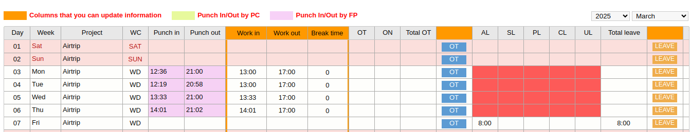
				- March 1st, i and wife went to Vũng Tàu to celebrate sister Hiền's wedding. After that we also visited sister Ngọc and share with her a technique for relaxation.
				- Returning home, i was off every morning due to my tiredness at the previous night, whether from the long journey or from following the troubles in the monk group of master Minh Tuệ.
				- Friday, i took the whole day off for sleeping to make up for the sleeplessness of the previous night.
				- Sunday, i slept for 17 hours from 0h to 17h, then had a [life review](((67ce5ad0-198b-45ab-a820-0d0f66a65f2c))) for nearly 3 hours.
				  id:: 67ce68b8-7f46-462e-acd1-c329c6258f64
				- After the life review, i entered the [dream (maya) of this life](https://en.wikipedia.org/wiki/Maya_(religion)), where i watched the story of [Armin Meiwes](https://en.wikipedia.org/wiki/Armin_Meiwes).
				- 7am today morning, i went to bed “just for a moment” to rest my back to go to work... but ended up sleeping until 9am. I got up with a fractal view and entered the zombie or robot 🤖 life.
				- Here, the zombie is typing....
			- Shared with Huy about the [life review](((67ce68b8-7f46-462e-acd1-c329c6258f64))) [9/3/25 21:18]-[10/3/25 10:07]
			  id:: 67ce5ad0-198b-45ab-a820-0d0f66a65f2c
				- [9/3/25 21:18]
				  Hôm nay sau 1 giấc ngủ dài, tui đi tâm hành dạng life review. Trong nhiều cảnh chạy qua, hầu hết là cảnh đời thường, thì có 1 cảnh đậm triết lý nên share ông nè:
				- Trong một cảnh kiểu như từ trên nhìn xuống, thấy rất nhiều người, có một tiếng nói vọng ra:
					- 12 ngàn công nhân này cũng không bằng...
					- AVERAGE! -- Đùng 1 cái từ trên trời rơi xuống 1 chữ "average" cảm giác rất nặng, như 1 tảng đá từ trên trời rơi xuống vậy. Average ở đây là kẻ đại diện cho cả 12 ngàn công nhân kia, là ông vua, ông boss thực chất (có ruột, chứ không phải chỉ là 1 hình thức rỗng ruột)
				- Cái cảnh này chỉ diễn ra trong chớp mắt, nhưng diễn tả ra thì nó dài dòng như vậy đó
				- Nó nhắc nhở tui rằng cái tâm vòng tròn đại diện cho cả vòng tròn, rằng kẻ đứng đầu thực thụ, và những cái form kết tinh của content (chưa rỗng ruột) cũng quan trọng và có sức nặng không kém gì số đông contents kia. Đó là vì sâu thẳm trong tui luôn hướng về đại chúng bình dân, luôn coi thường mấy tên boss 😁
				- Ngày xưa tui còn ghét hết thảy bọn vua chúa, chủ tịch, tổng thống, lớp trưởng, lớp phó đồ 😁
				- Nhưng rồi đó cũng chỉ là một cảnh trong rất nhiều cảnh khác, những lần khóc ngất khi nghĩ về dân tộc, nhân loại đồ cũng chỉ là một giấc mơ... trong rất nhiều giấc mơ... Và nhìn về phía trước, thấy chút nữa thôi mình lại phải tiếp tục bước vào một giấc mơ mà mình biết chắc là nó sẽ cuốn mình đi xa... tui cảm thấy hơi ngán... Nhưng rồi nghe tiếng vợ ngáp... À thì bả tỉnh dậy 1 chút rồi, mình cũng tranh thủ đưa bả đi ăn để về bả còn ngủ tiếp, ngủ bù sau trận cày bán hoa lễ 8/3 mà...
				- Thế là mở mắt ra, tui bước vào giấc mơ... và tui đang nhắn cho ông đây cũng trong cái giấc mơ đó. Ha ha, kẻ mở cặp mắt ngoài thì biểu kẻ nhắm mắt là mơ, kẻ mở con mắt trong (thường nhắm mắt ngoài) thì lại thấy kẻ mở mắt thao láo kia là đang mơ 😁
				- [10/3/25 10:07]
				  Hôm qua tui mở mắt ra bước vào giấc mơ (view Maya của người Ấn Độ), còn hôm nay tui chuyển sang view của người Kogi, mở mắt ra bước vào một con zombie, hay nói theo ngôn ngữ hiện đại là bước vào một con robot. 🤖
		- Reminded about my clingy love
		  id:: 67d1132a-dc48-42f2-80ad-b99853be907b
		  collapsed:: true
		  :LOGBOOK:
		  CLOCK: [2025-03-12 Wed 11:53:00]
		  CLOCK: [2025-03-12 Wed 11:53:24]
		  CLOCK: [2025-03-12 Wed 11:53:26]--[2025-03-12 Wed 14:01:42] =>  02:08:16
		  :END:
			- This morning, Mar 12, i waked up early at 5:30, took a bath, the went back to bed for a short nap before going to company.
			- I lay down and breathed... everything just came briefly and went... the pure serenity is nearly there...
			- But when the story of Mr. Hiệp and Mrs. Hằng came, suddenly, my mind get disturbed with chatterings.
			- I felt their uneasy minds and backgrounds a gain.
			- I wanted to “share” this with Mr. Hiệp... But thanks to my renunciation of facebook these days, i got back to myself...
			- On the way to company, i saw that _my **clingy love** is just like their hatreds_: both want to change others, which is so ignorant as [shown previously](((67b541cb-84e9-4e76-b218-4c515f4f1546))).
			- So, i got back to myself to practise myself!
		- Physics news: [Gravity from entropy](https://journals.aps.org/prd/abstract/10.1103/PhysRevD.111.066001) ([PDF](../assets/Will/story/2025-03/Gravity from entropy - PhysRevD.111.066001.pdf)) and so on.
		  id:: 67d184fe-6e61-46ed-ae70-2217cd068ee3
		  collapsed:: true
			- In this [paper](../assets/Will/story/2025-03/Gravity from entropy - PhysRevD.111.066001.pdf), Ginestra Bianconi extends the [Entropic gravity](https://en.wikipedia.org/wiki/Entropic_gravity), a kind of [entropic force](https://en.wikipedia.org/wiki/Entropic_force), with the G-field as a Lagrangian multiplier, which leads to a dressed Einstein-Hilbert action with an emergent cosmological constant.
				- This addition provides a potential link to quantum gravity and dark matter, areas that Jacobson, Padmanabhan, and Verlinde also touched upon but did not explore in this specific way.
				- While Verlinde's model focuses on the holographic principle and emergent spacetime, Bianconi's work incorporates quantum relative entropy and topological matter fields to derive gravity.
			- Previously i had ideas of [black hole particle](https://en.wikipedia.org/wiki/Black_hole_electron) and [one-electron universe](https://en.wikipedia.org/wiki/One-electron_universe) as well as entropic force. All have been proposed by other scientists.
			- [AI discovered a simpler way to achieve Quantum entanglement](https://www.space.com/space-exploration/tech/scientists-discover-simpler-way-to-achieve-einsteins-spooky-action-at-a-distance-thanks-to-ai-breakthrough-bringing-quantum-internet-closer-to-reality): [Entangling Independent Particles by Path Identity](https://journals.aps.org/prl/abstract/10.1103/PhysRevLett.133.233601)
			- Another interesting paper about [Quantum 'yin-yang' shows two photons being entangled in real-time](https://www.livescience.com/physics-mathematics/quantum-physics/quantum-yin-yang-shows-two-photons-being-entangled-in-real-time): [Interferometric imaging of amplitude and phase of spatial biphoton states](https://www.nature.com/articles/s41566-023-01272-3)
			  collapsed:: true
				- 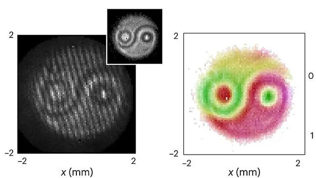
		- The second experience of drowning via cough reflex, from 13rd March to 1st April
		  id:: 67dcc012-44d3-4041-b17a-0ef201b3ff6c
		  collapsed:: true
		  :LOGBOOK:
		  CLOCK: [2025-03-21 Fri 08:25:58]
		  :END:
			- The first experience of drowning via cough reflex was [my lung inflammation this time last year](((67b541d0-e82f-422b-9c0d-f7924abce981)))
				- From the mild cough in the last week of March 2024 (the last days of my lab in SFC 5th floor),
				- to severe cough at home from March 30 to April 4 (the first days of lab in Đồng Nhân building),
				- then successful cough management in the next week with “drowning death” experience.
			- Last midnight, 13 March, i started to get a sore throat.
			  id:: 67d421d7-0df5-46f4-8f5a-07926551b701
			  :LOGBOOK:
			  CLOCK: [2025-03-14 Fri 19:32:24]
			  :END:
				- I got worse while i slept, but then it turned milder this morning.
				  :LOGBOOK:
				  CLOCK: [2025-03-14 Fri 19:32:24]
				  :END:
				- At the end of working hours today, it became worse due to the pressure of both personal works and company works.
			- Saturday, 15 March, with meditation, i shifted the sore throat to phlegm.
			- Sunday, the phlegm seemed to be under control. From 18:00, i took 1 tab of 200μg LSD to see what will be seen while i'm sick.
				- There's nothing strange.
				- In stead of deeper meditation into my lungs as i expected, the trip let me go around the overview circle where this sickness is just an essential part. So just enjoy it, enjoy the caugh, no need to take it seriously.
				- Next day (Monday), instead of going to hospital, i decided to share this view on liberation and about "the ultimate result is sickness and dead" with leader Quân.
				- I went to bed to relax my back, where i saw that "just shift the (inner deep) focus, the cough will subside."
			- Monday, i went to company to wrap up the "Java heap" task with Mr. Phương, and returned right in that morning because leader Quân was off.
				- There are many ones coughing in the company and many ones off for sickness. So i'm not alone! 😁
				- Afternoon, waking up after some hours sleeping, i reviewed and saw the cause of my severe cough was the “phase locking”:
					- Attachment (chấp) = phase locking/synch just like hiccup
						- The ((667c0031-0a87-44c9-9e98-6d45893b095f)) generated by observing the breath locks the cough in phase.
					- Driving = phase shifting via sampling change & continuation (aliasing)
						- Coarse grained version of resampling is ignoring which is usually done by people.
						- The normal (subjective) way is to shift focus.
						- [Âm dương đan](((67dce5ed-429b-4279-9fb4-7bf78ddd649a)))
				- Then i did research on “phase locking”.
				  id:: 67dcc974-63c1-4bd5-87f9-4885770b2827
				  collapsed:: true
					- Only now, can i get the [circle map](https://en.wikipedia.org/wiki/Arnold_tongue#Standard_circle_map) 😁
						- [(ir)rational rotation](https://en.wikipedia.org/wiki/Irrational_rotation) + coupling (sine) wave = Arnold circle map
							- (ir)rational rotation: for each turn of the intent circle $i → i+1$, it covers the content $x_{i+1} - x_{i} = Ω$, an (ir)rational number relative to the content circle (= 1).
							- coupling wave: $\frac{K}{2π} \sin(2π x_{i})$ is the “breathing” obop
							- Arnold circle map: $θ_{i+1} - θ_{i} = 2πΩ + K \sin(θ_{i})$ where $θ = 2πx$
							  collapsed:: true
							  the breathing intent circle transcycles the content circle
								- 
						- The general circle map $θ_{i+1} = g(θ_{i}) + Ω$ is just a general quasiperiodic function $g$ between intent circle & content circle.
						- The [rotation number](https://en.wikipedia.org/wiki/Rotation_number) is the “frequency” of content cycle over intent turns.
						  $ω = \lim_{n \to ∞} x_{n}/n ≈ Ω$
							- It's also the [winding number](https://en.wikipedia.org/wiki/Winding_number) of the intent thread around the content circle.
							- Phase locking := rotation number is **rational** ⇒ the limiting rotation number $ω_0$ at $K = 0$ is stable/locked no matter how much “breathing” the coupling wave is.
						- The [bifurcation diagram](https://en.wikipedia.org/wiki/Bifurcation_diagram) of rotation numbers circle maps is called [Arnold tongue](https://en.wikipedia.org/wiki/Arnold_tongue).
						  collapsed:: true
							- 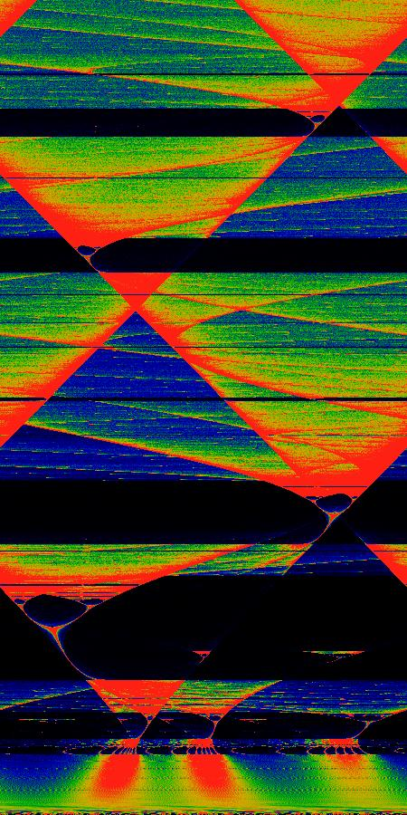
					- And found that [synchronization network](https://en.wikipedia.org/wiki/Synchronization_network) & [Kuramoto model](https://en.wikipedia.org/wiki/Kuramoto_model) are what I'm looking for.
				- Caught up in the “phase locking” research, my cough got severe.
				- That midnight, recalling [the previous time](((67b541d0-8a10-4eae-8370-8ebab4dd7300))), i produced the “âm dương đan” (陰陽丹) qigong exercise to tame my cough.
				  id:: 67dce5ed-429b-4279-9fb4-7bf78ddd649a
			- Tuesday, i practised âm dương đan the whole day and also advertised it to leader Quân.
				- Going to bed, i found the mental switch to turn the [cough reflex](https://en.wikipedia.org/wiki/Cough_reflex) off: while still facing the cough, zoom out and hold on other stuffs to pull the mind out of the cough.
				- After 4 hours, i woke up and returned to bed with the same technique... and contemplated the [equivalence of 2 aspects of the zero](((67dcec86-db94-47b0-8687-ab2aa95d7c8a))) before falling asleep.
			- Wednesday, i was shown how badly my [theorist karma](((669a58b9-422a-40d9-adcf-b2aade86c170))) affect my health.
			  id:: 684f951a-86ea-40dd-836e-68a2ef353fb6
				- This early morning, i saw the equivalence of 2 aspects of the zero: 
				  id:: 67dcec86-db94-47b0-8687-ab2aa95d7c8a
				  Zero = center = balance = cancellation = concentration = abstraction = point (cone) projection
					- obop = ε =[projection]= 1/ω =[cancellation]= ω - ω
					- Wider the world 🌎 ω, there are more opposites to be cancelled, leaving less things to see as ε, nearer to the center, the average.
					- To return to the center, we must zoom out, back up/off, retreat, refrain, to let the opposites within the objects cancel themselves, instead of going forward to control them, and let the form of the objects recede themselves.
				- From afternoon to midnight, i researched various themes in which the most prominent one is the [homogeneous coordinates](((67dcf2d3-4020-4477-b375-9bbb8c0b1336))) at last.
				- Due to being caught up in these researches, i was fallen into severe coughs again.
				  id:: 684f951a-22d9-4f09-9b3e-d8a7ed4e0c3e
			- Thursday, a day of meditation.
				- With deep meditation, my cough had nearly gone before i went to bed.
				- Going to bed, i'd experienced the full process of drowning then passed away.
					- In [the previous time](((67b541d0-8a10-4eae-8370-8ebab4dd7300))) as well as the last days, the process was not clear because of the sleepiness at the end.
					- This time, being awake like a god (“thức thần”), i experienced the full range of the cough reflex, the wrestle, and then the liberation through the death.
					  id:: 67dd1682-6d19-4de4-8b4b-7233d9ea41a3
					- I experimented both mehods of shifting focus: focus on the imaginations, and focus on the death.
			- Today, Friday 21 March, after 4 days off, i went to company in order to attend a meeting, but leader Quân is off again! So i just write these stories down.
			  id:: 67dcf5de-9861-4ce5-8d1e-1b311580574a
			  :LOGBOOK:
			  CLOCK: [2025-03-21 Fri 12:15:43]
			  :END:
				- The cold air in the room made my trachea constricted making the cough reduced, the phlegm dries out... until i had lunch.
				- After lunch, i coughed a lot and saw dried phlegm blobs.
				- There are still many ones coughing in the company.
			- Weekends, i spent time for sleeping and reconnecting with friends.
				- Mr. Hiệp's returned to Vietnam and will stay here for 3 months. So i logged in to fb to exchange phone number to contact via phone.
				- I also gave phone number to Mr. Thanh Long because he asked when i said [good bye on fb](https://www.facebook.com/share/p/14ebMRYAf4/).
				- The cough has improved a lot, but i still get strong coughing reflex every time i get to bed. This a good chance for me to contemplate it and train focusing on death.
				- Last night, before going to bed, i see the nature of **sampling** via ((6672513b-c4b0-4c88-8b30-c60a3c6555a7)) & ((670ce218-a01f-4609-b7f2-beda7cf2ebc3))
					- Sampling: cone project from large base (population) to small apex (sample), then parallel project back to the base via ((670cdcb4-3c85-45af-8c30-3c3284ed37df)) as the ratio of intent over content.
					- intent via effect circle: ...
			- Today, Monday 24 March, back to the company, i'm completing the theories in the previous days.
				- Before sleep, in the restroom, i recalled the property “everything is a rotation”:
					- Every change is just a transformation preserving content.
					- The unchanged content is the “radius” of the rotation making it turn around.
					- The change of the visible forms (yang) is always balanced by the complementary change of the invisible forms (yin).
					- So, every change is a group action.
				- Going to bed, there was no more cough reflex.... but just nearly 3 hours later, the cough emerged from the sleep.
					- I dealt with it until morning, hence only 3 hours sleep!
			- Tuesday, i'm tired due to the lack of sleep.
			  id:: 67e23c75-6de6-43de-8c41-8bf55216c08f
				- Before work, i contemplated the 3 types of rotations: circular, parabolic and hyperbolic. I see how the spitting of the null lines (horizons) extends the circular ratation to parabolic rotation, and then squeezes it into hyperbolic rotation: ((67e29bdb-9bce-4cb8-b993-79aa130a1831))
				- Created ((67e299fa-4f76-482a-b586-adacb17dc064))
				- Before sleep, in the restroom, i recalled that the hyperbolic rotation is just a plane projection (conic section) of the parabolic rotation projected onto the light cone which was shown in my very first GeoGebra applet [MixedCoords](https://www.geogebra.org/m/jeexkfrd).
				  id:: 67f4eaf9-e140-4cfb-a896-c641f65e37dd
				  collapsed:: true
					- The dual view of parabolic & hyperbolic rotations is also the dual view of **projective thread** with inner product and [function graphing](https://en.wikipedia.org/wiki/Graph_of_a_function) on [orthogonal coordinates](https://en.wikipedia.org/wiki/Orthogonal_coordinates).
					  id:: 67e37475-13e3-4a9f-af60-7bec7517c108
					- Ironically, i met the dual view of projective thread & function graphing (around 2018) long after the dicovery of the “mixed coordinates” (before 2015) without recognizing they are one. Moreover, the projective nature of conic sections, i.e. [“why slicing the cone”](https://www.geogebra.org/m/nknaryzz), was discovered much later, only when i studied projective geometry (2020).
					- History of graphing of functions, loci of relations (curves), and trajectories of objects
					  collapsed:: true
						- The invention of function graphing on orthogonal coordinates is closely tied to the development of **analytic geometry**, which emerged in the 17th century, but it has precursors from medieval maths.
						- Nicole Oresme (1323–1382), a medieval mathematician, made earlier contributions by [visualizing quantities as geometric representations](https://en.wikipedia.org/wiki/Nicole_Oresme#Mathematics), which can be seen as precursors to modern graphing.
						- René Descartes (1596–1650) is often credited with formalizing the use of orthogonal coordinates (the [Cartesian plane](https://en.wikipedia.org/wiki/Cartesian_plane)) in his work *La Géométrie* (1637), where he introduced the idea of representing algebraic equations as geometric curves.
						- Pierre de Fermat (1601–1665) independently developed similar ideas around the same time. Fermat worked on a treatise titled *Ad locus planos et solidos isagoge*, which outlined concepts of analytic geometry, but he did not publish his work widely.
					- History of vector analysis
					  collapsed:: true
						- Newton and Leibniz utilized Cartesian coordinates to develop the calculus of differential and integral, laying groundwork for the field of vector analysis, like the [parallelogram law](https://en.wikipedia.org/wiki/Parallelogram_law) in *Principia Mathematica* (1687), and for linear algebra, like the solution of linear systems by Leibniz in 1693.
						- By the end of 18th century and early 19th century, [complex number](https://en.wikipedia.org/wiki/Complex_number) was brought to the Cartesian plane, called [complex plane](https://en.wikipedia.org/wiki/Complex_plane), by Caspar Wessel (1797), Jean-Robert Argand (1806), and Carl Friedrich Gauss (early 19th century).
							- Ironically, while Descartes gave the name “[imaginary number](https://en.wikipedia.org/wiki/Imaginary_number)” to $i$, he didn't put complex numbers onto his own Cartesian plane!
						- Hamilton invented the [quaternion numbers](https://en.wikipedia.org/wiki/Quaternion) (1843), extending the complex numbers, to handle mechanics in 3D space properly, esp. the 3D rotation and [scalar product](https://en.wikipedia.org/wiki/Dot_product).
						- In 1844 Hermann Grassmann published his "Theory of Extension" founding the modern [linear algebra](https://en.wikipedia.org/wiki/Linear_algebra) with "inner product" for [scalar product](https://en.wikipedia.org/wiki/Dot_product) and "outer product" for [exterior product](https://en.wikipedia.org/wiki/Exterior_product). Because his theory predated vector calculus, he use terms like “stretch” to call the modern notion of “vector”.
						- Near the end of the 19th century, Gibbs and Heaviside simplified the 4D quaternions to create the [vector calculus](https://en.wikipedia.org/wiki/Vector_calculus) for 3D space, as shown in the book *Vector Analysis* (1901). This was in parallel with the development of [vector space](https://en.wikipedia.org/wiki/Vector_space) for linear algebra by Peano in 1888 and Salvatore Pincherle in 1897.
					- History of the **projective thread** of relation between quantities
					  id:: 67e3b3e4-66d6-4c72-92d1-faeef2cf2165
					  collapsed:: true
					  :LOGBOOK:
					  CLOCK: [2025-03-27 Thu 12:52:34]--[2025-03-28 Fri 18:59:13] =>  30:06:39
					  :END:
						- Traditionally, the relationship between quantities, e.g. (x, y), is usually decribed with function, e.g. $y = f(x)$, or more generally with relation, e.g. $R(x, y) = 0$, both of which can be plotted on the Cartesian plane xOy as a graph (of function) or a curve (of relation). There, each quantity is expressed by an orthogonal axis.
							- This curve corresponds to the **projective thread**, the elementary thread in Unithread, which shows a **distribution** (static relation) of these quantities.
						- However, ((66ac41f1-de0c-48cb-a9b0-c30b0fe27c5d)) focus more on relative & dynamic relations which are usually expressed as the relative angles between the elementary threads of these quantities.
							- Relativity:
								- The angles show how much they are apart/different from each other.
								- In reverse, the scalar product of the direction vectors shows the correlation between them.
								- The relativity is shown by the mutual distance, mutual angle, scalar product, mutual stretch in shearing, etc.
							- All these threads are combined into a **compound thread** by synchronizing points, which are called [coincidences](https://en.wikipedia.org/wiki/Incidence_(geometry)), knots, contact points, etc.
							  id:: 684f951a-1db2-4e43-9c5a-f4fbd27fe667
							- When the compound thread is projected to different lines and curves (spaces in general), the images are projective threads showing different distributions of these quantities in different spaces.
						- Around 2018, i used scalar product of vectors to map the projective thread.
							- This creates the map with the angle/slope between quantities smaller than the slope of the graph $y = f(x)$: As the mapped angle varies from 0° to 90°, the slope of the corresponding graph varies from 45° to 90°.
							- While having different slopes, the projective thread is equivalent to the function graph, actually the graph of distribution.
						- In October 2019, ((67e38d9c-aec4-460f-acf3-d91a382372be)) was written to illustrate the relativity between quantities in a comound thread.
						- The argument between maternal and paternal grand fathers about their walking ([fb post](https://www.facebook.com/share/p/18GjbjRoxQ/))
						  id:: 67e38d9c-aec4-460f-acf3-d91a382372be
						  collapsed:: true
						  :LOGBOOK:
						  CLOCK: [2025-03-26 Wed 13:19:35]
						  :END:
							- Diagram of vector relativity
								- 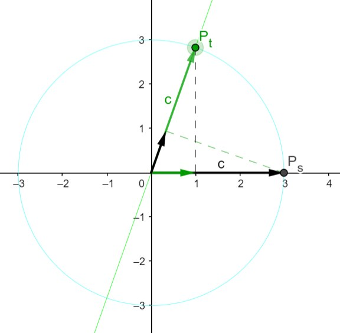
							- The original Vietnamese version
								- Lâu lâu 2 ông cụ nhà mình mới có dịp gặp nhau, ấy thế mà nói được vài câu là đã mâu thuẫn rồi:
									- Ô.Ngoại: Tôi đi được 3 mét rồi ông mới đi được có 1 mét. Sao ông đi chậm vậy?!
									- Ô.Nội: Mỗi bước tôi đi được 3 tấc còn ông mỗi bước chỉ được có 1 tấc. Sao ông bước ngắn thế?!
									- Ô.Ngoại: Tôi bước ngắn nhưng mà nhanh, ông so từng bước thế sao được?! Trong lúc ông bước được một bước 3 tấc của ông thì tôi đã bước được 9 bước, tức là 9 tấc rồi. Rốt cuộc tôi vẫn hơn! 😃
									- Ô.Nội: Đó chỉ là số đo bên ngoài thôi! Mình phải biết tiết kiệm sức chứ: Này nhé, tôi bước dài và chậm còn ông bước ngắn và nhanh nên một bước của tôi cũng tốn sức bằng với một bước của ông thôi. Nếu như trong một chuyến đi, nếu mình đủ sức cho 1000 bước, thì ông đi được 100 mét đã mệt, còn tôi đi được tới 300 mét mới mệt. 🙂
								- ... Nói qua nói lại, ai cũng có cái hay riêng của người đó, nên rốt cuộc chẳng ai hơn ai. Ấy gọi là "tương đối" vậy. 😉 Như trên sơ đồ bên dưới, thực ra ông Ngoại (Ps) và ông Nội (Pt) đều nằm trên cùng một vòng tròn, chỉ lệch nhau một góc mà thôi. Nhưng nếu đem "ông kia" chiếu lên trục của "ông này" thì bên nào cũng thấy bên kia chỉ bằng có 1/3 của mình mà thôi.
							- Every now and then, the two grandfathers in my family get a chance to meet. But no sooner do they exchange a few words than they find themselves in disagreement:
								- Ma.Granny: I've already walked 3 meters while you've only managed 1 meter. Why are you so slow?!
								- Pa.Granny: Well, with each step, I cover 30 centimeters, while you only manage 10 centimeters per step. Why are your steps so short?!
								- Ma.Granny: My steps are short but fast; you can't compare step by step like that! While you take one of your long 30-centimeter strides, I take 9 short steps, covering a total of 90 centimeters. In the end, I'm still ahead! 😃
								- Pa.Granny: That’s just an external measurement! One must conserve their energy. Look here, I take long and slow strides, while you take short and rapid ones. In terms of effort, one of my steps requires just as much energy as one of yours. So, in a journey where we have the energy for 1000 steps, you'd only manage 100 meters before getting tired, whereas I'd cover 300 meters before tiring out. 🙂
							- ... Back and forth they go, each with their own perspective and merits. In the end, neither is better than the other. It's what we call "relativity." 😉 As shown in the diagram below, in reality, Maternal Grandfather (Ps) and Paternal Grandfather (Pt) both lie on the same circle, only separated by an angle. But if one were to project "the other" onto their axis, each would only see the other as a third of themselves.
						- In Novemeber 2022, i contemplated the continuous transformation, i.e. [homotopy](https://en.wikipedia.org/wiki/Homotopy), from X to Y of the projective thread which is defined by the function $f: X → Y$ as a projection from the uniform object thread Y to the uniform screen thread X.
							- The homotopy can be extended to a [chain of functions](https://en.wikipedia.org/wiki/Function_composition) $\cdots∘f_3∘f_2∘f_1: X_0 → X_1 → X_2 → X_3 → \cdots$, which will be a [flow](https://en.wikipedia.org/wiki/Flow_(mathematics)) $[φ(t) = f^t](x)$.
							- The flow $φ(t)$ in orthogonal coordinates xOy is a generalized rotation (circular flow) around the origin O, where $t$ is the argument (phase) of the rotation. $t$ is also the exponent of the [functional power](https://en.wikipedia.org/wiki/Function_composition#Functional_powers), and is the scaling factor of the argument of the [exponential map](https://en.wikipedia.org/wiki/Exponential_map_(Lie_theory)) $\exp(t⋅X) = φ(t)$.
							- That time, i intended to to put my idea down with the applet [TopoMorph](https://www.geogebra.org/m/mekmjqcg), but got stuck there... until now.
							- Now, April 24, 2025, i roll it out with the applet [ProjectiveThreadViews](https://www.geogebra.org/m/t4hanww4).
						- In October 2024, i saw how the ((670cdcb4-3c85-45af-8c30-3c3284ed37df)) projects the classical function graph to the projective thread.
				- The sleep was better:
				  :LOGBOOK:
				  CLOCK: [2025-03-26 Wed 10:19:16]
				  :END:
					- no cough at the onset;
					- one cough reflex emerged after more than 2 hours but i managed to calm it down easily to continue the sleep;
					- one wake up in the early morning for urination and contiue to sleep.
						- This time, my wife fell into a sharp cold. I turned the fan off and reminded her to concentrate on the breath. With concentration and warm keeping, she could stablize it finally.
			- Wednesday, the cough in sleep has gone.
			  :LOGBOOK:
			  CLOCK: [2025-03-26 Wed 10:19:04]
			  :END:
				- Before sleep, in the restroom, i contemplated the ((67ea7d5e-1cbe-4815-984d-d843d65d4b83)), and checked that the double shearing (along x and y) is very near but not exactly the [squeezing](((67e2a0e0-a6d9-4ad8-a601-24289f44d383))).
				- The sleep was good, i only coughed in the morning, just 30 minutes before my alarm.
			- Thursday, another weird day!
			  :LOGBOOK:
			  CLOCK: [2025-03-27 Thu 12:22:51]
			  CLOCK: [2025-03-27 Thu 12:22:54]
			  :END:
				- In the riverside sitting time before work, i revised the connection between shear and [squeeze](((67e2a0e0-a6d9-4ad8-a601-24289f44d383))): there are 2 types of sync: edge sync & area sync
				- I worked out the decomposition of hyperbolic rotation into 3 shears and asked Grok 3 to help. Finally we had the conclusion of [a nice symmetry](((67e6168e-ff58-4d9d-94a7-6fee6f533044))).
				- 3 hours into the sleep, i woke up to cough... no more phlegm, only thick clear mucus. It's so sticky in my throat that i's about the vomit, just like the first days of this illness.
					- The cough reflex kicked in and persisted... I meditated to calm it down.
					- After half an hour dealing with the cough, i lay down to sleep but got sleepy for just an hour and then woke up.
					- From then on, i has been godly awake (thức thần) after my meditation entering the “dead state”!
					  id:: 67e62305-1f02-4945-836b-f3984e1f0e45
					- Then i called my wife up to share with her the meditative state. I guided her to review her own state: she discovered that she had been heavy, not as “normal” as she thought. She relaxed, reviewed, and we had sex before i went to work.
			- Friday 28 March, godly awake at work until 20:30
			  id:: 67e4e16d-d58d-4189-b79c-26d2e7360046
			  :LOGBOOK:
			  CLOCK: [2025-03-28 Fri 09:58:59]
			  CLOCK: [2025-03-28 Fri 09:59:01]
			  :END:
				- While sitting at the riverside, i contemplated the relativity of lengths in the parabolic rotation as well as the unity of the three conic rotations.
					- I saw the CIE in the right triangle where the selection of 2 edges yielding circular, parabolic, and hyperbolic rotation. It's discussed in ((67ee2e11-9371-4290-94c0-95f2e5bf8c54)).
					- Hence, the three conic rotations are unified beautifully under the views of ((66ac41f1-de0c-48cb-a9b0-c30b0fe27c5d)).
					- I also saw my urge to see with eyes the seemingly “impossible” equivalence between triple of shears and circular rotation.
						- There, i breathed to let it go and accept such an ignorance of mine.
			- Weekends, mostly sleeping
			  :LOGBOOK:
			  CLOCK: [2025-03-31 Mon 07:56:48]
			  CLOCK: [2025-03-31 Mon 07:56:51]
			  :END:
				- Recalling the godly awake experiences, i saw that such “dead state” is just the [Buddhist Nibbāna](https://en.wikipedia.org/wiki/Nirvana_(Buddhism)).
				  id:: 684f951a-b5ca-44a7-b9a3-df1538310721
				  collapsed:: true
					- Nibbāna ([Niết-bàn](https://vi.wikipedia.org/wiki/Ni%E1%BA%BFt-b%C3%A0n)) = complete death 😁: extinction, diệt tận, tịch diệt, viên tịch, ... hay nói nôm ra cho dễ hiểu là "chết hết" 😂
					- Two times of active “dead state entrance” through meditation in the late Thursday night (early Friday morning) in this “drowning experience”:
						- ((67dd1682-6d19-4de4-8b4b-7233d9ea41a3))
						- ((67e62305-1f02-4945-836b-f3984e1f0e45))
						- These times, beside meditation, there were still some exhaustion (from coughing) boosting the entrance into the dead state.
					- The previous mild experience through exhaustion after 3 hours of junk scrolling:
						- ((67b541cb-5177-4e91-be40-4126f798605b))
					- Previously, all experiences were passive through exhaustion or psychedelic drugs:
						- Many experiences were on the trips of Ketamine, LSD, DMT and 5MEO-DMT.
						- One notable [death & dissolution of ego](https://en.wikipedia.org/wiki/Ego_death) was thanks to the exhaustion after a week of stubborn trial to build the “quicklog” system and the last night sleepless from Saturday (22th May) to Sunday (23rd). The experience coincided with the election day 23rd May 2021.
							- Trong nhật ký thì mình chỉ nhắc đến nó trong một vế trong một câu vào dịp Covid-19, [ngày 30/7/2021](http://tamsudoithuong.blogspot.com/2021/07/200-hom-thu-2-minh-lo-thuc-tu-toi-hom.html) mà thôi:
							  > ... như cái chứng nghiệm "nhập định xả hôm bầu cử" tháng trước vậy.
							- Chat với Huy cuối tháng 7:
							  collapsed:: true
								- Mới hồi bầu cử tháng trước đó, tui viết một cái trang web nhỏ thôi "quicklog" nhưng gặp nhiều vấn đề ngoài dự tính của mình... nó cuốn mình đi...
								- lần này nó chỉ cuốn tui đi có 1 đêm Thứ 7 đến sáng CN thôi, sáng đó tui vẫn đủ sức đi bầu cử nữa mà...
								- nhưng buông ra, nằm vật xuống ngủ tới chiều... lúc mở mắt ra, à ko, tỉnh bên trong nhưng còn nhắm mắt... thì tui chứng nghiệm sự hoà nhập với vạn vật: cảm nhận từng rung động nhỏ, bên ngoài cũng như bên trong, như mỗi lỗ chân lông là một con mắt, một cái tai vậy
								- lúc đó mình hoàn toàn ko còn cái tôi nào hết, những ý muốn, ý định chỉ là những ý tồn tại ở đó thôi, nó ko phải là mình
								- những cảm nhận, những cái thấy biết hiện tại đến từ bên trong lẫn bên ngoài ... có thể gọi là mình, nhưng thực ra cũng ko có cảm giác "mình" trong đó, nó chỉ là những luồng thông tin, như những làn gió, những dòng nước vậy thôi
								- khi mình nhập vào một làn gió thì mình trở thành làn gió đó vậy; thế là để ngồi dậy, tui nhập tâm vào thân thể này và vào ý định ngồi dậy
								- lúc đó mình làm cái gì cũng cảm nhận rõ, thấy rõ những luồng tín hiệu từ trên xuống chỉ đạo ra sao, phản ứng dưới cơ thể thế nào, bị cuốn vào ngoại cảnh và vào những ý muốn của mình thế nào, v.v.
								- kiểu như mình cho chạy trương trình trong mode debug vậy
								- ==> Đó là chứng nghiệm đầu tiên nhắc tui quay lại hướng tập "xả" dạo này
								- hồi đó giờ tui "debug" thân tâm này toàn bằng sự tập trung quan sát, tui nhập định cũng bằng sự tập trung tư tưởng
								- mới mấy hôm trước, trong 1 chuyến tâm hành trên giường, tui cũng đã nhập định được nhờ xả: sau khi cho tự động life review... review đâu hết 3 tiếng rưỡi... thì tự nhiên nhập định hoà với vạn vật 🙂
						- Another milder experience was after 3 hours and a half of life review in the [20th night - 21st early morning July 2021](http://tamsudoithuong.blogspot.com/2021/07/1515-hom-kia-nghe-ien-thoai-em-xong.html) within the Covid-19 lockdown.
				- Then i recalled the impermanence even for arahants, as shown in [the case of Bāhiya](https://www.accesstoinsight.org/ati/tipitaka/kn/ud/ud.1.10.than.html).
				  collapsed:: true
					- There are 3 cases of people being killed by cows with the same pattern, as shown by [mikenz66 @ DhammaWheel](https://www.dhammawheel.com/viewtopic.php?t=3496#p50624): 
					  + listened to Buddha's teachings ([hearer](https://en.wikipedia.org/wiki/%C5%9Ar%C4%81vaka)), 
					  + suddenly enlightened, 
					  + gored to death by a cow, then 
					  + prophesied by the Buddha to enter one of the [four stages of enlightment](https://en.wikipedia.org/wiki/Fruits_of_the_noble_path).
					  (nghe Phật giảng (thanh văn), đốn ngộ, bò húc chết, được Phật thọ ký một trong 4 bậc thánh.)
						- Bāhiya: [Bāhiya Sutta](https://suttacentral.net/ud1.10/en/sujato) ([vi.](https://theravada.vn/kinh-bahiya/)): from a “bark-wearer” to an [arahant](https://en.wikipedia.org/wiki/Arhat).
						  collapsed:: true
							- In the second version of [Bāhiya Sutta](https://suttacentral.net/sn47.15/en/sujato) ([vi.](https://suttacentral.net/sn47.15/vi/minh_chau)), he attained arahantship through practicing [four foundations of mindfulness](https://en.wikipedia.org/wiki/Satipatthana) and was not killed. In Commentaries, this person is named “Bāhika” to distinguish from the “Bāhiya Dāru-ciriya” (Bāhiya the bark-wearer) who was killed by a cow.
							- In the third version of [Bāhiya Sutta](https://suttacentral.net/sn35.89/en/sujato) ([vi.](https://suttacentral.net/sn35.89/vi/minh_chau)), he attained arahantship through observing [three marks of existence](https://en.wikipedia.org/wiki/Three_marks_of_existence) and was not killed.
						- Pukkusati: [Dhātu-vibhaṅga Sutta](https://suttacentral.net/mn140/en/sujato) ([vi.](https://suttacentral.net/mn140/vi/minh_chau)): from a “homeless clansman” (with faith in Buddha) to a [non-returner](https://en.wikipedia.org/wiki/An%C4%81g%C4%81mi).
						  id:: 67ea1006-7d4b-4ac6-ba9e-80eaa1e9c19a
						- Kuṭṭhi: [Kuṭṭhi Sutta](https://suttacentral.net/ud5.3/en/sujato): from a “leper” to a [stream-enterer](https://en.wikipedia.org/wiki/Sot%C4%81panna) or [once-returner](https://en.wikipedia.org/wiki/Sakadagami).
					- Gemini Deep Research also confirms these 3 cases are the only ones explicitly killed by cows.
				- Recently, there was a news by Vietnamese online news sites related to the monk group of master Minh Tuệ stating that “the National Office Of Buddhism of Thailand issued the nationwide notice number "พศ 0007/1442" (issued on 13rd Feb) regarding a group of pedestrians dressed as monks.” But no such notice can be found in Thai sites.
				  id:: 67f4eaf9-6b66-4c22-9cca-8a5c7124de0f
				  collapsed:: true
					- Why not around 13rd Feb but now, a month and a half later, did this "notice" emerged?! 🤔
					- Nothing's found at `onab.go.th`, the site of the [National Office Of Buddhism of Thailand](https://onab.go.th).
						- Even Gemini Deep Search cannot find such notice anywhere! 😕
					- There are only Vietnamese sites publishing the same news from Giác Ngộ Online in Vietnamese and in Thai:
						- [Giác Ngộ Online](https://giacngo.vn/van-phong-phat-giao-quoc-gia-thai-lan-thong-bao-toan-quoc-ve-nhom-bo-hanh-khat-thuc-an-mac-giong-tu-si-post75294.html)
						- [Vietnam.vn in Thai](https://www.vietnam.vn/th/van-phong-phat-giao-quoc-gia-thai-lan-thong-bao-ve-nhom-bo-hanh-khat-thuc-an-mac-giong-tu-si)
						- [Tuổi Trẻ Online](https://tuoitre.vn/van-phong-phat-giao-quoc-gia-thai-lan-thong-bao-ve-nhom-bo-hanh-khat-thuc-an-mac-giong-tu-si-20250329200044848.htm)
						- [Người Lao Động](https://nld.com.vn/van-phong-phat-giao-quoc-gia-thai-lan-thong-bao-ve-nhom-bo-hanh-khat-thuc-an-mac-giong-tu-si-196250329203650753.htm)
						- [Báo Mới](https://baomoi.com/van-phong-phat-giao-quoc-gia-thai-lan-thong-bao-toan-quoc-ve-nhom-bo-hanh-khat-thuc-an-mac-giong-tu-si-c51842254.epi)
						- ...
					- Gemini even hallucinated a hole content of such "notice":
						- #+BEGIN_QUOTE
						  เรื่อง กลุ่มภิกษุสงฆ์แต่งกายเลียนแบบพระ (hallucinated content)
						  
						  ประกาศ สำนักงานพระพุทธศาสนาแห่งชาติ
						  เรื่อง กลุ่มภิกษุสงฆ์แต่งกายเลียนแบบพระ
						  ตามที่ปรากฏข่าวสารในสื่อต่างๆ เกี่ยวกับกลุ่มบุคคลที่แต่งกายคล้ายพระภิกษุสงฆ์ เดินทางธุดงค์ และมีกลุ่มยูทูบเบอร์ชาวเวียดนามติดตามถ่ายทำ เผยแพร่ทางสื่อออนไลน์ต่างๆ นั้น
						  สำนักงานพระพุทธศาสนาแห่งชาติ ขอเรียนว่า กลุ่มบุคคลดังกล่าว ไม่ได้อยู่ในระบบการปกครองคณะสงฆ์ไทย และมิใช่พระภิกษุสงฆ์ที่ได้รับการรับรองจากรัฐบาลเวียดนามแต่อย่างใด
						  การกระทำดังกล่าว ได้สร้างความสับสนแก่ประชาชน และอาจส่งผลกระทบต่อภาพลักษณ์ของพระพุทธศาสนาในประเทศไทย
						  จึงขอแจ้งให้ทราบโดยทั่วกัน และขอความร่วมมือหน่วยงานที่เกี่ยวข้อง ตรวจสอบและดำเนินการตามอำนาจหน้าที่ เพื่อป้องกันมิให้เกิดความเสียหายต่อพระพุทธศาสนา และความสงบเรียบร้อยของสังคม
						  สำนักงานพระพุทธศาสนาแห่งชาติ
						  ๑๓ กุมภาพันธ์ ๒๕๖๘
						  #+END_QUOTE
				- It's interesting that the [story of Pukkusati](((67ea1006-7d4b-4ac6-ba9e-80eaa1e9c19a))) clearly shows that both Gotama Buddha and ven. Pukkusati spent most of the night time in the [lotus position](https://en.wikipedia.org/wiki/Lotus_position) just like [master Minh Tuệ](https://en.wikipedia.org/wiki/Th%C3%ADch_Minh_Tu%E1%BB%87)'s doing nowadays. The difference may be that in that night the Buddha could spend a little time lying down instead of sitting the whole time like master Minh Tuệ.
			- Today, Monday, 31 March, i wrap up things and restart working for the company by receiving a new task.
			  id:: 67ea0923-28b8-40c2-bf28-334a444bb109
			  :LOGBOOK:
			  CLOCK: [2025-03-31 Mon 18:37:09]
			  :END:
				- Despite the mucus being clear and thin, i still got some coughs in the middle of the sleep.
			- Tuesday, 1st April, active breathing in meditation
			  id:: 67eb5587-1606-468c-a728-c3ccfb23e561
			  :LOGBOOK:
			  CLOCK: [2025-04-01 Tue 09:55:06]
			  :END:
				- At the riverside, i reviewed the practices for liberation. 
				  :LOGBOOK:
				  CLOCK: [2025-04-01 Tue 09:55:06]
				  :END:
					- I saw the cough reflex inside despite the very thin mucus, so i meditated to practice the technique of “entering dead state” again.
					- Thanks to this mild cough, i discovered the technique of _**combining** both qigong when **inhale** and release when **exhale**_. This combination brought me to a deep meditative state.
						- The inhalation brings up force, engergy for concentration and do things.
						- The exhalation releases all of them, let me relax and fall back to the zero.
				- Back to the office, the cold air made me get back to ujjayi breath for the continuous qigong without release.
				  :LOGBOOK:
				  CLOCK: [2025-04-01 Tue 10:25:53]
				  :END:
					- After the internal state was stablized, i can do some release, but still very limited compared to when outside in the warm air.
		- Hùng Kings Festival, meeting with Ms. Trung, Mr. Hiệp, and online sharing about “mastering birth, aging, sickness and death” with ego death & living in the present.
		  id:: 67f4c7e0-7de0-48c4-83fd-4b994960efba
		  collapsed:: true
		  :LOGBOOK:
		  CLOCK: [2025-04-08 Tue 13:54:47]--[2025-04-08 Tue 14:23:07] =>  00:28:20
		  :END:
			- Last Friday, 4th April, on the occation that Ms. Trung came to Saigon to to on-site translation, we had a quick gathering at a coffe shop.
			- Saturday morning, i met Mr. Hiệp to have deeper sharings, where i suggested him to use his sleep to contemplate his unconsciousness.
			- Then i continue to share various themes on chat room:
				- Hôm qua ông Hiệp có nói vụ “*làm chủ sanh lão bệnh tử*”, nay tui tán dóc về chủ đề này nhé 😁
				  collapsed:: true
					- Từ ngữ thiệt lắt léo: nó chẳng phải là "làm chủ" theo kiểu ra lệnh của ông chủ bắt đầy tớ phải làm theo ý mình một cách bất chấp (theo ý Tôi), mà "làm chủ" theo kiểu "mình nói bạn nghe và làm theo". Nên tui thường thay "làm chủ" bằng "làm bạn" hay tốt hơn nữa là "làm mình".
					- Khi làm chủ bằng cái Tôi thì mình dùng sức, dùng quyền, dùng tiền, dùng năng lượng, dùng phước nói chung để bắt kẻ khác, và bắt thân thể phải tuân lệnh của mình. Nó có tác dụng khi nào mình còn phước.
					- Còn với những kẻ hết phước thì có cách "làm chủ" khác: lắng nghe thế thấu hiểu, thấu cảm, thông cảm thì nói ra những lời (ko phải mệnh lệnh) hợp tình hợp lý, khiến đối phương thấy được đồng cảm nên tu8 nhiên nghe theo.
					  Mình nói với chính bản thân mình cũng y như vậy thôi.
					- Cái chỗ "nói nghe" hay không thì ai có quán thân tâm rồi sẽ biết: càng muốn làm chủ theo tiểu ngã thì càng "trên bảo dưới không nghe". Như người nam có một cái "chưn" mà muốn nó lên thì dễ nhưng bảo nó xuống thì khó 😜 Nó cho thấy "free will" là một thứ rất ảo tưởng của con người: mình làm nô lệ 99%, làm chủ cùng lắm được 1%
					- Đợt viên phổi vừa rồi, lần 2 tui được quán "chết đuối" nên "làm chủ" được nhiều hơn. Cái phản xạ của cơ thể để giành lại "sự sống" mà nó quen thuộc đó mạnh khủng khiếp, không có mệnh lệnh nào điều khiển được nó
					- Và nghịch lý là: muốn "làm chủ" cái phản xạ gần như hoàn toàn tự động đó, mình lại phải "nhập vào cõi chết", tức hoàn toàn buông ra xụi lơ.
					  Đó gọi là ego death
					  Và ở trong "cõi chết" đó mình lại thấy mọi thứ rõ ràng nhứt, chứ không hề "tối thui, không còn thấy biết gì nữa" như mọi người tưởng về cái chết.
					- Khoa học gọi cái mình không thể điều khiển trực tiếp bên trong đó là vô thức, bên Phật gọi là nghiệp, nó mới là thứ quyết định mọi thứ của mình và cho mình cái cảm giác "tự chủ"
					- Hiep Bobo Do:
					  cụ thể là phản xạ gì? mlusc viêm phổi
					  sao lại giống chết đuoi?
						- Toàn thân: khi ông không thở được thì toàn thân nổi dậy
						  Từ sâu dưới bụng tới cơ ngực co thắt để ho để tống cái thứ nó nghĩ là đang chặn đường thở của mình
						  Khi đờm không đặc cục mà nhầy kéo ra bịt cả cuống họng thì phản xạ ói để tống nó ra
					- Những phản xạ đó là những chương trình được lập từ mấy chục triệu năm trước, là nghiệp sâu dày hơn những thói quen mình tích lũy trong đời này nhiều.
					  Nghiệp chỉ là sự tích lũy của hành động: làm nhiều riết quen, thành thói quen, phản ứng, rồi phản xạ, rồi truyền từ đời này qua đời khác.
					  Cả những phản ứng khi mình thích hay ghét cái gì đó cũng là nghiệp tích tụ mà thôi
					  Nó tích lũy qua nhiều dạng khác nhau, trong tâm là quan niệm, định kiến, về thọ là những cảm giác cảm xúc, về sinh lý là những phản xạ, hormones, gene, v.v.
				- Và khi gọi cái khối nghiệp đó là "**vô thức**" thì nó thể hiện sự **vô minh** của mình, không y thức được về những gì có trong đó, nên nó diễn ra một cách tự động ngoài khả năng kiểm soát của mình, tức mình không "làm chủ" được nó.
				  collapsed:: true
					- Quay lại việc quán cái khối nghiệp, cái cỗ máy vô thức đó, thì hôm nay tui chia sẻ về giấc ngủ. Vì khi ngủ là ý thức bị tắt nên vô thức hiện rõ nhứt, cụ thể là qua giấc mơ (nên mới có kỹ thuật giải mộng để biết về những thứ tiềm ẩn bên trong).
					- Hồi lúc tập tỉnh giác trong giấc ngủ thì tui nằm thiền rồi đi vào giấc ngủ luôn, và khi thức dậy cũng không vội mở mắt mà cũng tranh thủ khoảng giao giữa ngủ với thức đó để thiền quán.
					- Tui viết [bài này](https://creatzynotes.blogspot.com/2013/06/cuoc-hoi-ngo-voi-con-ma-bong-e-sau-hai.html#self-through-sensation) về giấc mơ và bóng đè từ 12 năm trước, và cập nhật phần "Cái Tôi qua các cảm giác và ý thức" vào năm 2015 thời An Lạc Trang. Trong đó có tả trải nghiệm khi chuẩn bị thức dậy, và 2 thí nghiệm thú vị về cảm giác "tôi" và ảo giác "tôi ra quyết định, tôi lựa chọn".
					  cái Tôi đó chỉ là tập hợp của 5 thứ cảm giác (từ mắt, tai, mũi, lưỡi, thân) và tâm thức của mình mà thôi.
					- Về phần cảm giác thì [thí nghiệm cánh tay giả](https://youtu.be/xdxlT68ygt8) cho thấy rõ cái mình cho rằng "tay mình" chỉ là một ảo giác
					  collapsed:: true
						- {{video https://youtu.be/xdxlT68ygt8}}
					- Còn phần tâm ý thì [thí nghiệm Libet](https://youtu.be/VnGDrc_s6KA) từ những năm 1980 (cỡ tuổi mình) đã cho thấy rõ là "quyết định" của mình, hay đúng hơn là thứ mà ý thức mình cho rằng "tôi đã chọn làm việc này", lại bị người ngoài "bắt mạch" biết trước cả 1-2 giây trước khi mình tự biết là mình sẽ chọn cái nào.
					  collapsed:: true
						- {{video https://youtu.be/VnGDrc_s6KA}}
					- Những thứ mình nghĩ là mình chọn, mình quyết định, thường là do đầu óc mình nói lên *sau khi* nó nhận ra là cỗ máy vô thức đã và đang làm điều gì đó: như khi tai mình nghe một lời nào nó chạm phải cái vết thương nào trong lòng thì phản ứng bên trong là nó tự động bật lại, hoặc né tránh, rồi thường là sau khi lời nói hành động phản ứng của mình diễn ra thì ý thức mới nhận ra và thực hiện nhiệm vụ của nó là rationalize "mình quyết định phải làm như vậy là vì abc, xyz..."
					  Nên cái free will đó phần lớn là illusion.
					- Qua những chuyến khám phá khu rừng bên trong, tui thấy cả một hệ sinh thái nghiệp ở trong đó, cũng có những tảng đá nghìn năm triệu năm cứng y như những tảng đá núi bên ngoài thế giới vật chất này. Cũng có cây cổ thụ ngàn năm lẫn những dây leo chỉ có vài năm tuổi (thói quen mới) những lại quấn chằng chịt với những cây cổ thụ kia.
					- Tuy theo cái nhìn từ thế giới vật chất vào trong thì cả thảy khu rừng nghiệp và cái Tôi đó đều là "ảo", nhưng nó lại rất thực đối với bên trong. Còn nhìn từ trong tâm ra thì cả thế giới vật chất này cũng "ảo lòi", và cũng chỉ là những nghiệp bên ngoài mà thôi. 😁
					- > thấy bất kỳ cái gì cũng ý thức rõ ràng "đây chỉ là hình ảnh", khi nghe bất kỳ điều gì cũng ý thức rõ ràng "đây chỉ là âm thanh".
					  
					  Đoạn này mình viết từ 10 năm trước mà sau này mới biết Đức Phật cũng đã từng chỉ cách quán cho Bahiya y như vậy:
					  > Này Bahiya, Ông cần phải học tập như sau: "Trong cái thấy, sẽ chỉ là cái thấy. Trong cái nghe, sẽ chỉ là cái nghe. Trong cái thọ tưởng, sẽ chỉ là cái thọ tưởng. Trong cái thức tri, sẽ chỉ là các thức tri ". Do vậy, này Bahiva, ông không là (người ở) chỗ ấy, ông không là (người ở) đời này, cũng không ở đời sau. (Tức là không có cái Tôi nào như ông vẫn tưởng.)
					  Nhờ lời thuyết pháp tóm tắt này của Thế Tôn, tâm của Bahiya được giải thoát khỏi các lậu hoặc, không có chấp thủ. (Đắc quả arahant)
				- Hiep Bobo Do:
				  collapsed:: true
				  vạy có thấy đc là "nó" đang phản xạ còn mình đứng ngoài ngó chơi?
					- Ông tưởng tượng hơi quá. Ông đã tập nín thở rồi, ông có thấy "như đứng ngoài chơi" không 😁
					- Mình với nó (phản xạ) không hề tách biệt, tui không thấy một cái "mình" nào ngoài cái mớ cảm giác và chuỗi phản xạ kéo theo sau đó. Ban đầu thì có vẻ tách biệt: phần ý thức thì biết là "trong đó đã hết dịch rồi, không còn gì để tống ra đâu" nên tìm cách nói chuyện với phần phản xạ vô thức. Nhưng sau đó, càng quán nó, thì ý thức càng nhập vào làm 1 với nó, như lặn xuống đáy hồ thì mình cảm thấy là 1 với cả hồ vậy. Sự hòa nhập đó là 2 chiều: ý thức thì thấy rõ hơn cơ chế của phản xạ, còn vô thức thì không còn chạy độc lập hoàn toàn tự động nữa mà dần "nghe lời" ý thức.
					- Trước khi nhập vào "cõi chết" thì tui cũng đã tìm ra một "công tắc" để tạm ngắt được nó. Nhưng chỉ một hồi sau thì nó lại tự động bật trở lại.
					- Chỉ khi nhớ lại những trải nghiệm "qua cửa tử" trong những lần trước và áp dụng vào thì nó mới dừng hẳn, mà đúng ra là mình mới dừng hẳn: mình chết tức là mình không còn phản ứng nữa, cảm giác khó chịu trong đường thở chỉ còn là cảm giác chứ không còn là trigger của phản xạ nữa. Nên hễ còn thấy "nó" thì mình còn điều khiển nó theo kiểu chủ-tớ, chỉ khi hòa làm một đều là mình thì mình mới "làm chủ" được... mình 😁. Đó là vì những gì mình cho là "mình" thực ra rất xa cách với ý thức của mình, mình chẳng thấu hiểu, chẳng cảm gì được nó. Giống như 1 ông vua coi cả nước là "của trẫm" nhưng chỉ biết có cái cung son điện ngọc thôi chứ chẳng hề biết dân tình khổ sở ra sao, nhưng hễ còn phước của tiên đế thì ra lệnh còn có kẻ nghe lời, nên còn giữ được cảm giác rằng "cả thiên hạ là của trẫm" 😁
					- Cái thấy của cặp mắt ngoài là cái thấy phân biệt "object vs subject", và nó ăn sâu vào tâm trí mình khiến mình luôn cảm giác "nó không phải là mình". Vì bức tường ngăn cách nó với mình nên mình mới không thấu hiểu, không thông cảm, mới có thể làm theo ý mình bất chấp nó ra sao. Bức tường đó là sự vô minh. Nhưng vô minh lớn nhứt lại là vô minh về chính mình, như ông vua vô minh về chính thần dân của mình vậy.
					- Nên mới cần tập cái thấy bên trong, thường gọi là cái "thức", là cái thấy không phân biệt. Nên dùng cái kinh nghiệm thấy bên ngoài để tưởng tượng về cái thấy bên trong thì chỉ như khỉ nghĩ về "cá leo cây ra sao" mà thôi.
					- Thấy thấu suốt chính mình thì lại tự nhiên thấu hiểu người khác hơn, vì chúng ta vốn là 1 bên trong, và những người khác nhau này chỉ là chính mình mặc những bộ áo da khác nhau để diễn những vai khác nhau mà thôi.
					- Tóm lại, vòng xoáy "nó - mình" mà tui đã trải qua như sau:
						- 1. Làm một người thường ở đời, mình thấy cái thân này, cảm xúc này, ý nghĩ này là mình, còn cái thân kia, lời nói kia, ý nghĩ kia là "nó".
						- 2. Khi hết năng lượng hoặc đau bệnh, mình buộc phải quay về chính mình thì mình nhận ra những thứ mình cho là "mình" đó lại chẳng hề là mình: nó chẳng chịu nghe lời mình (như lúc khỏe, tràn đầy năng lượng). Mình ngộ ra sự thật đầu tiên: phần lớn những thứ trong mình, của mình, lại chẳng phải là mình 😕. Với giác ngộ này, mình chuyển hướng từ thay đổi người khác, điều khiển người khác, sang thay đổi chính mình, vì cả thảy đều là "nó", và nó chẳng chịu nghe lời mình.
						- 3. Quay vào quan sát bên trong, gọi là "quán", thì mình dần kết nối lại với chính mình, thấu hiểu chính mình hơn, qua đó kéo "nó" lại gần "mình" hơn... trong chính ngôi nhà thân tâm này. Nhờ gần hơn mà mình thấy rõ nó hơn, thông cảm hơn, bớt phán xét hơn, bớt bực tức hơn, chấp nhận hơn. Và những lần tiếp xúc với người ngoài thì lại cho mình thấy là mình dễ dàng thông cảm hơn cho người khác, nên mình ngộ ra cái thứ hai: mọi người xung quanh chỉ là ảnh phản chiếu của mình, mình chấp nhận được mình thì mới chấp nhận được người khác. 
						  Tuy đã rất gần gũi, rất thấu hiểu nhưng mình thấy vẫn còn một sự ngăn cách cơ bản ở cái thấy, dù là thấy bên trong: thấy thì không làm, làm thì không thấy. Cái thấy bên trong dù đã gần gũi hơn cái thấy tách biệt bên ngoài rồi, nhưng cái đối tượng được thấy vẫn là "nó", dù nó có nghe lời mình nhưng vẫn còn sự ngăn cách.
						- 4. Qua những trải nghiệm đi qua cửa tử, mình mới ngộ ra rằng rào cản vi tế của cái thấy bên trong chính là việc mình còn chấp "cái thức này là mình!" Buông cả cái thấy bên trong, tức cái thức này ra, mình "chết", không phản ứng, không thấy, không còn gì nữa, hòa tan vào mọi thứ, không còn cái gì là mình nữa... thì nghịch lý thay là "mình" lại "thấy" rõ mọi thứ. Mà cả cái "mình" lẫn cái "thấy" này tuy giống như cũ nhưng lại rất khác... Nói chung là khó nói. Nói chung là sự chấp nhận mọi thứ, vì chấp nhận nên gọi là "mình" chứ không phải là cái "mình này" đối lập với cái "nó" hay cái "mình kia".
						  Và trải nghiệm "mình hòa tan" đó cũng rất hiếm, chỉ mới xảy ra trong những trường hợp extreme: mấy năm trước là nhờ chất thức thần và những lần kiệt sức; lần viêm phổi kỳ này là lần đầu tiên chủ động được nhưng cũng nhờ rất nhiều vào trạng thái bệnh.
					- Lần ego death thứ nhất (số 2 trên) là cái chết nhỏ, tiểu tử tiểu ngộ: lần đầu nhận ra sự thật "phần lớn mình chẳng phải là mình" thì thường bị sốc, khủng hoảng hiện sinh, hoang mang không biết mình là ai. Bản thân Định không trải qua cú sốc này trong đời này, nhưng có chứng kiến người thân bị sốc.
					- Chỉ sau cái chết đầu tiên đó hành giả mới 1 lòng vững bước trên con đường giải thoát, không còn thoái lui, tức tương đương với bậc "dự lưu", hay còn gọi là "thất lai" (còn 7 đời luân hồi nữa).
					- Qua một quãng đường dài tu tập, như số 3 trên, thì hành giả mới tới "đầu sào trăm thước", bước thêm bước nữa, té xuống, chết luôn cái thức, đại tử đại ngộ 😊 tiếp sau đó thì tui chưa biết, vì mới bắt đầu đi đoạn này...
					- Thực ra cách nói "chết" của tui... cũng chỉ là một cách nói phá chấp vào chỗ "sống" của người đời thôi, chứ đúng ra nó là "không sống không chết" 😜. Như nhà Phật nói "Nibbana (niết-bàn, nirvana) = complete death 😁" vậy. Nghĩa của niết-bàn vốn chẳng phải là một cảnh giới cao siêu như dân gian tưởng tượng mà chỉ đơn giản là sự dập tắt hoàn toàn (extinction), nên được dịch thành những từ như sau: diệt tận, tịch diệt, viên tịch, ... hay nói nôm ra cho dễ hiểu là "chết hết" 😂
				- Nãy đang ngồi thiền, đang nghĩ "may hôm nay nhờ đám giỗ cụ Hùng mà mình được thoải mái ngồi thiền, chẳng phải lo tới giờ đi làm..." thì bỗng nhớ tới bác Hiệp 😁 vụ "*chơi bao lâu thì nghỉ hay chơi suốt đời*"
				  collapsed:: true
					- Hồi đó ông @Hiep có thắc mắc "làm sao mà người ta có thể làm 1 việc có vẻ nhàm chán đó mãi được?" Với người khác thì tui không biết, nhưng với tui thì:
						- 1. Tui không thấy chán, dù cho bệnh đau cũng không thấy khó chịu hay chán ghét mà còn thấy "ngon, bổ dưỡng" nên mới ăn nó hoài. Chả có món nào "ăn không ngon" mà có thể ăn hoài được.
						- 2. Tui thường sống trong hiện tại, lúc thiền thì thấy "mình sống bằng thiền, không phải sống bằng cơm" nên không có nhu cầu hết giờ để đi ăn cơm. Lúc đạp xe thì sống bằng đạp xe chứ không phải "đạp để có sức khỏe, hay đạp để tới 1 cái đích nào đó, như tới nhà ông Hiệp", nên đạp hoài bao lâu cũng được. Các môn thể thao khác cũng vậy, xuống nước là tui làm con hải cẩu sống trong nước chứ không phải lặn để có kết quả gì đó ở trên bờ, lúc leo núi thì không phải để lên đỉnh mà là làm một thằng mọi sống trong rừng, v.v.
					- Vì thế nên tui không giỏi những thành tích của thế gian. Tui không nín thở vì số phút, không ngồi thiền vì số giờ hay 1 chỉ số level nào đó (sơ, nhị, tam, tứ thiền). Tui thấy khi mình làm cái này vì 1 cái đích khác thì mình không sống trọn vẹn trong đó... và tui không làm được. Tui phục mọi người là có thể làm vì 1 cái đích nào đó ở bên ngoài, thậm chí chỉ là những con số ... mà đối với tui là "ảo lòi"
					- Nên hint của tui là ông thử đổi chữ "chơi" thành chữ "sống" xem sao 😉. Mình nên tìm cái để mình sống, mình sống bằng cái gì, nhờ cái gì, vì cái gì, v.v.
					- Và 2 chữ đó cũng reflect 2 hoàn cảnh khác nhau:
						- Kẻ hết phước thì chỉ biết nghĩ tới sinh tồn, nên chỉ nghĩ tới "làm sao để sống", còn "chơi" thì xa xỉ quá!
						- Người phước dày thì đã đủ sống nên chỉ tìm món nào chơi cho nó đỡ chán...
					- Tóm lại, chẳng có món chơi nào có thể chơi suốt đời được đâu 😜, chỉ có sống mới sống được suốt đời... by definition 😁
				- Thực ra cũng có nhiều lúc tui nản, đó là những lúc tui bị **mất tập trung vào hiện tại**, hoặc bị quá khứ lôi kéo khiến mình tiếc nuối, hoặc bị tương lai đen tối (do mình tự tưởng tượng ra hoặc do người khác "hù") khiến mình cảm thấy "không thể vượt qua được". Dạo này tui đã có người bạn đồng hành, và những lần như vậy, tui hỏi vợ "anh thấy mù mịt quá, bất lực quá, không thể tiếp tục được", thì bả đã nhắc nhở và động viên để tui quay lại hiện tại thì mọi thứ lại ổn trở lại 😊
				  collapsed:: true
					- Dù đó giờ tui chưa nghĩ chuyện đua tranh với người khác bao giờ, nhưng cũng nhiều lần bị thắt cổ trong chính cái "kinh nghiệm quá khứ" của mình. Xin share một sự chuyển hoá kỳ diệu ở [chuyến đầu đạp xe đi xa lúc mới về VN (2009)](https://creatzynotes.blogspot.com/2009/06/khai-truong-chien-ma-du-ngoan-can-tho.html)
					- Lúc về VN (2009), mình đã chọn đi xe đạp để được thoả thích vùng vẫy, như cá về với nước, như chim về với trời (mình ghét cảm giác bị bó gối trong/trên những chiếc xe cơ giới).
					  Lúc đó còn thanh niên sung sức, năng lượng tràn trề, nên mới có kinh nghiệm thú vị này: Số là chạy trong TP thì mình thấy đạp ở tốc độ 30km/h là chuyện bình thường... mà không biết rằng đó chỉ là hưởng sái luồng gió của xe máy và xe hơi trong TP mà thôi. Thế là vô tình mình bị chấp vào con số 30km/h đó mà không biết. Tháng 5 năm đó, mình quyết định khai trương một chuyến đi xa bằng cung SG - Cần Thơ về thăm mẹ. Cung đường 200km mà mới đạp tới Bến Lức là đã chết thẳng cẳng, vào quán võng ngủ 1 giấc, hồi sức đạp tới Tân An lại chết lần 2 sâu hơn, ngay giữa đường luôn, ko kịp tìm tới quán võng luôn...
					- Lúc đó mình thấy hụt hơi, thở không nổi, toàn thân lạnh toát... cứ tưởng là do "thiếu oxy", ai ngờ sau này học freedive mới biết là do thiếu CO$_2$ (thở gấp) chứ ko phải thiếu oxy.
					- Tới Tân An là mới được 60km, nên coi như chuyến này thất bại rồi... sau khi ngồi ở lề đường hồi sức một chút chỉ đủ để lết tới quán võng gần nhứt, kêu ly nước chưa kịp uống là đã chết lịm tới chiều sập tối mới mở mắt dậy.
					- Lúc dậy, mình quán lại thì thấy mình đã bị chấp vào tốc độ ở trong TP (quá khứ) mà quên mất hiện tại là một thực tế hoàn toàn khác. Ngộ ra cái đồng hồ tốc độ đã "đánh lừa" mình khiến mình chết giấc 2 lần, nên lần này leo lên xe, mình dẹp quách mấy con số đó qua một bên, chỉ tập trung vào hơi thở và chân đạp. Cảm nhận hơi thở, cảm nhận lực đạp ở chân, chỉ khoảng 10-15 phút thì mình đã sync được chúng lại với nhau, hơi thở nhịp nhàng với nhịp đạp, vào ra vào ra, lên xuống lên xuống nhịp nhàng... một cảm giác hoàn toàn khác... Mình bỗng thấy "ồ cứ như vầy thì mình đạp tới mai cũng được, chả bao giờ mệt cả!" Thế là mình tiếp tục thẳng tiến về Cần Thơ, cũng chẳng còn care là còn bao nhiêu cây số nữa, mọi con số từ tốc độ đến cự ly giờ đây đều vô nghĩa, thậm chí độc hại với mình.
					- Thế là từ đó về sau cứ đạp đến khi nào mệt thì nghỉ chứ cũng chẳng theo kế hoạch cũ là 30km hay 60km gì nữa. Còn tốc độ thì lên xuống tuỳ duyên, chẳng còn làm mình vướng mắt nữa.
					- Và quả thực như mình đã cảm thấy lúc bắt được nhịp đạp & thở, suốt từ Tân An về Cần Thơ mình đã chạy một cách thoải mái "như không", hoàn toàn đối lập với 2 lần chết giấc lúc mới ra khỏi SG.
					- Dù cái nghiệp quá khứ này của tui (kinh nghiệm "30km/h là thường") chỉ mới tích tụ có vài tháng trước đó thôi, mà nó cũng đủ thắt cổ tui chết ngất 2 lần, lần 2 tưởng xỉu giữa đường rồi... may là lết được tới quán võng.
					- Nên tui thấy là mình ko có nô lệ cho ai khác hay cái gì khác ngoài chính "nghiệp tích tụ trong quá khứ" của mình mà thôi.
					- Buông quá khứ xuống, hiện tại hiện ra thật tuyệt vời!
				- Hiep Bobo Do:
				  collapsed:: true
				  cau chuyen Vance Vanders
					- Còn [chuyện của Vance Vanders](https://thehealthcareblog.com/blog/2015/08/10/a-near-death-from-voodoo-hexing/) thì là về "giả dược" (placebo effect), là cái mà hồi đó ông hỏi "có phải đây là giả dược không" đó. Vì Tây y chấp vào vật chất nên coi các tâm dược là "giả dược", chứ thế giới cổ đại đã dùng tâm dược từ lâu, như thần chú, bùa chú, voodoo, và thế giới hiện đại cũng có các kỹ thuật như thôi miên, sugar pills, và cả phẫu thuật giả.
						- Vance Vanders bị ông thầy cúng dùng thuật voodoo để nguyền rủa cho chết đi, và ông ta đã bị suy nhược cơ thể đến sắp chết.
						- Khi vợ Vance Vanders đưa ổng vào bệnh viện tây y thì bác sỹ mới tìm cách dùng giả dược để "giải bùa" voodoo của ông thầy cúng kia. BS đã chích thuốc ói để cho ổng ói ra và lén thả con tắc kè xanh vào bồn ói rồi la toáng lên "Vance nhìn nè, ông đã ói con tắc kè đang ăn ruột ông ra rồi, ông đã được giải bùa rồi!" Vance nhìn con tắc kè mà sợ phát khiếp, rồi ngất đi trong 12h sau đó. Khi tỉnh dậy thì ông ta đã hết tâm bệnh và 1 tuần sau thì cơ thể ổng đã bình phục.
		- Share a dream with Lan Nguyen on fb messenger
		  collapsed:: true
		  :LOGBOOK:
		  CLOCK: [2025-04-18 Fri 17:15:02]
		  :END:
			- Previous context
			  collapsed:: true
				- Còn bây giờ, dựa trên ý thức "ko làm là do mình, vì mình", thì em thấy nó khó quá ko có khả năng làm hả?
				- Lan:
				  dạ, khó, không làm dc
				  vì từng trải qua đau tới đó hoặc tương tự đó rồi nên không thể nào làm như vậy với ngta dc
				  nó như giết mình thêm lần nữa vậy
				- giả sử mình làm đi, em cứ để nó diễn ra đi (tưởng tượng, hoặc nhớ lại những lần "lỡ tay" trước), thì em cảm thấy thế nào?
				- Lan:
				  là đau
				  mất niềm tin vào những người mà mình tin nhất trong suốt bao nhiêu lâu
				  cảm thấy k sống nổi nữa, k muốn sống nữa
				- và bây giờ thì em cảm thấy như chồng đang mất niềm tin vào mình, mà em có xác nhận điều đó từ chồng ko, có chắc là chồng đau vì điều đó ko hay đau vì cái khác?
				- Lan:
				  ảnh chưa mất niềm tin vào em, ảnh chỉ mới cảm thấy sao dạo này em xa cách, ảnh cảm thấy sao ảnh đã thay đổi bớt ác với em rất nhiều, yêu thương em hơn, nhưng trách rằng em đang đòi tự do của em nhiều quá
				- Vậy đầu tiên là mình tự gợi lại nỗi đau của mình và nó khác với nỗi đau hiện tại của chồng hen.
				  Thực ra mình chả biết người ta đau cái gì đâu, mà chỉ có thể "suy bụng ta ra bụng người" thôi.
				- Perspectivistic: cùng lắm thì đó là những gì mình biết về người ta, ko thể nói hoành toàn chính xác là người ta như vậy.
				  Mỗi người là một thực thể đa chiều, rất phức tạp, chỉ thể hiện ra 1 mặt nào đó trong 1 hoàn cảnh cụ thể. Và "đi với phật mặc áo cà sa, đi với ma mặc áo giấy", sự "đồng thanh tương ứng" khiến họ thể hiện ra mặt này tương ứng với người đối diện, chứ đó ko phải là tất cả.
				- Perspectivism, em có chấp nhận được ko. Chấp nhận về ý thức thôi, chứ về cảm xúc thì chỉ khi tự mình nếm trải mới cảm được, anh ko đòi hỏi nó bây giờ. Chỉ hỏi là về mặt ý thức, thì em có thể "thấy" ra được là những gì mình biết về chồng chỉ là một phần của chồng ko?
				- Lan:
				  dạ có, chấp nhận
				- Vậy bây giờ để diễn ra tiếp, bây giờ là tưởng tượng nhé... xin lỗi là đưa ra một ví dụ tiêu cực, chỉ là giả dụ thôi, ko nói là chồng hiện tại của em sẽ như vậy nhé.... nào đã sẵn sàng cho một chuyến roller coaster chưa?
				- Lan:
				  ukie
				- Trong lúc đợi anh gõ, em nên buông ra để hít thở, đừng cắm mắt vào đợi, đừng suy nghĩ lan man, đc ko?
				- Lan:
				  yup
			- The dream
			  collapsed:: true
				- Hãy tưởng tượng một nhánh thời gian rẽ ra một cõi "trong mơ" để ko bị lẫn lộn với thực tế tương lai ở ngoài đời sau này.
				  Trong một cõi mơ, em có "tha tâm thông", là thần thông thấu biết tâm người, nên biết nỗi đau của chồng mình là gì, thấy nó có 3 phần giống của mình, tức phần "mất niềm tin", nhưng 7 phần còn lại là khác, VD "bị chê trách".
				- Ở đó, em bay lên từ trên cao nhìn xuống, thấy cái duyên mình gặp chồng đã khiến trong suốt quá trình đó ảnh chỉ thể hiện ra 3 phần và giấu lại 7 phần... mà con người phàm tục của mình "dưới kia" ko hề hay biết.
				- Rồi em lại có "thiên nhãn thông", là thần thông thấy biết xuyên không thời gian....
				- Với cái tâm tự do bay trên không, ko bị lớp áo da che mắt, em nhìn xuống xuyên qua không gian, thấy suốt ruột gan.... à mà thôi, toàn những thứ hôi thối xấu xa..., nên em quay đi, nhìn xuyên thời gian...
				- Nhìn xuyên thời gian, tới tương lai, em thấy con người trần tục "dưới kia" cứ cuốn vòng vòng với nỗi đau trong quá khứ về việc mất niềm tin của mình mà cố gắng tạo niềm tin...
				- vì cũng được thoả mãn 3 phần nên anh chồng vẫn có phần nhẹ bớt, nhưng chẳng bao giờ là hết hẳn, vì 7 phần còn lại lớn hơn gấp đôi lận...
				- và rồi một ngày nào đó... khi con người trần tục của em lẫn của chồng đều đã chịu hết nổi, bên em thì nhường nhịn hết nổi, bên chồng thì quá bất mãn vì ảnh cũng đã tưởng là gặp em sẽ giải quyết được 100% nỗi đau mà rốt cuộc lúc nào cũng còn đau 70-80%...
				- Thì đổ bể ra... ảnh lật 7 phần còn lại ra vì nó đã bị dồn nén quá lâu, nó thể hiện ra là một người rất khác với "người chồng" mà em đã từng quen thuộc, phủ nhận cả những điều hay ho nhứt, những lý tưởng cao đẹp mà ảnh đã share với em bấy lâu nay, và vô tình "phủi bỏ" hết công sức của em. 😢
				- Bị phủ nhận sạch trơn, con người trần tục của em lại một lần nữa mất hoàn toàn niềm tin, đau đớn khôn tả xiết!
				- Vì quá đau đớn, con người trần tục của em ko thể chấp nhận 7 phần còn lại của ảnh là thật, là cũng đau đớn ko kém mình, mà chỉ thấy là ảnh đã lừa dối mình bấy lâu.
				- Chìm đắm trong tuyệt vọng, đau khổ, em rút vào trong, chẳng thể mở lòng để có thể thấu hiểu được ai khác...
				- nhưng do con người trần tục đó ko có khả năng thấy rõ chính mình, nên theo bản năng thì nó cứ vô tình tìm tới một người "đồng cảnh ngộ" khác, dù cho ý thức vẫn cứ bảo "chỉ có mình mới giải quyết được thôi"
				- và cứ như thế mà nỗi đau cũ cứ cuốn mình vào vòng xoáy mới với ảo tưởng mới.... cứ hi vọng rồi sụp đổ, tin thật nhiều rồi nghi thật nhiều
				- Một ngày nào đó, cái thân người dưới kia chịu hết nổi, chết ngất, thoát xác, bay lên nhìn lại tất cả... thì mới ngộ là "ồ, nó là vậy đó!"
				- Xong giấc mơ, em có theo dõi kịp ko?
			- Closing
			  collapsed:: true
				- Khi "buồn ngủ mà gặp chiếu manh" thì chiếc chiếu dù rách nát vẫn còn hơn chăn nhung nệm gấm. Khi những tâm hồn đau khổ gặp nhau, dù chỉ 10% tương đồng là đã dữ lắm rồi, nên ban đầu luôn quay cái 10% đó vào nhau để thấy 100% là "đồng điệu", để hi vọng là mình đã gặp được duyên để giải quyết 100% đau khổ của mình.
				- Chỉ tới khi hết buồn ngủ, tỉnh dậy thì chiếc chiếu manh mới hiện nguyên hình...
				  *Thằng cùi mà lấy con đui
				  Đến khi sáng mắt, con đui bỏ chồng!*
				- Lan:
				  em nghĩ là nó k phải là tưởng tượng luôn vì nó đã xảy ra đúng như vậy đó anh. và đã xảy ra cách đây rất lâu rồi. do vậy em cũng không còn kì vọng rằng ảnh sẽ không bao giờ phủi bỏ mình. em đã chuẩn bị tư thế sẵn sàng để nếu ảnh có bỏ, thì cũng k là điều gì đáng ngạc nhiên
				- Thực ra tương lai chỉ là sự lặp lại của quá khứ... trong một vòng xoay vô tận. Nên nói là "tưởng tượng tương lai" thực ra chỉ là diễn lại quá khứ với một ngôn ngữ khác mà thôi.
				- Chỉ khi nào mình buông hết mọi thứ ra, để mình "bay lên", để nhìn xuống toàn bộ vòng tròn đó... mình mới thấy là... thực ra mình đã xoay vòng ko chỉ 1 mà nhiều nhiều vòng như vậy rồi... c
				- Vòng tròn vô tận đó chính là Luân Hồi, chứ chẳng cần phải chết đi mới được luân hồi 😃
		- Sri Lanka news about the monk group of master Minh Tuệ
		  id:: 681826ae-7994-4e0e-b0c2-f7d1f0091e22
		  collapsed:: true
		  :LOGBOOK:
		  CLOCK: [2025-04-21 Mon 17:07:29]--[2025-04-24 Thu 09:58:51] =>  64:51:22
		  :END:
			- Previous events
			  collapsed:: true
				- ((67a5faa3-c64c-48f7-8b3f-a5311714110f))
				- ((67f4eaf9-6b66-4c22-9cca-8a5c7124de0f))
			- BBC Sinhala news about Minh Tue monk group
			  collapsed:: true
				- Ref: [a post by MinhTuePath on X](https://x.com/MinhTuePath/status/1913070440798715957)
				- [April 17](https://www.bbc.com/sinhala/articles/c98gdzz8vdno): An objection from monks led by the Malwathu faction to the famous Thich Minh Tue of Vietnam who is visiting Sri Lanka.
					- Updated title: අවසරයකින් තොරව පාද යාත්‍රාවේ නිරත වීම නවත්වන්නැයි කුලියාපිටියේදී තික් මින් තියු හිමිට පොලිසියෙන් දැනුම් දීමක්
					  id:: 68062218-cd7e-45e4-9629-f32d24226898
					  collapsed:: true
					  යාවත්කාලීනවී ඇත 18 අප්‍රේල් 2025
					  Police inform Thich Minh Tue to stop engaging in foot traffic without permission in Kuliyapitiya
					  (Updated April 18, 2025)
					  Cảnh sát yêu cầu thầy Thích Minh Tuệ dừng cuộc hành hương bằng chân không phép tại Kuliyapitiya
						- (Added part) පාද යාත්‍රාව නතර කිරීමට පොලීසියෙන් දැනුම් දීමක්
						  collapsed:: true
							- තික් මින් තියු හිමියන්ගේ ශ්‍රී ලංකා සංචාරය සම්බන්ධයනේ මතුව ඇති තත්ත්වය පිළිබඳව පොලිස් මාධ්‍ය ප්‍රකාශක ජ්‍යෙෂ්ඨ පොලිස් අධිකාරී බුද්ධික මනතුංගගෙන් බීබීසී සිංහල විමසීමක් කළේය.
							- එහිදී පොලිස් මාධ්‍ය ප්‍රකාශකවරයා පැවසුවේ, 40ක පමණ කණ්ඩායමක් පෙරහැරක ආකාරයෙන් මෙම පාද යාත්‍රාවේ නිරතව සිටින බවය.
							- පාද යාත්‍රාවක් යනු පෙරහැර ගණයට වැටෙන ක්‍රියාකාරකමක් බවද ඔහු පැවසීය.
							- "පෙරහැර පවත්වන්න පොලිසියේ අවසරය ගන්න ඕනේ. දෙවනි කාරණය ආගමන විගමන නීතිය අනුව ලංකාවට විසිට් වීසා මත පැමිණිලා ඩිමෝන්ස්ට්‍රේෂන් කරන්න බැහැ."
							- "ඒ සියලු කරුණු මත පදනම් වෙලා අපි ඔවුන්ට දැනුම් දුන්නා මේක නීතිවිරෝධියි ඒ නිසා නිසා අවසරය ලබා ගෙන මෙම කටයුත්ත කරන විදිහට. ඒ අනුව කුලියාපිටිය ප්‍රදේශයෙන් ඔවුන් මේ කටයුත්ත නැවැත්තුවා. දැන් ඔවුන් යම් විහාරස්ථානයක රැඳිලා ඉන්නවා." පොලිස් මාධ්‍ය ප්‍රකාශකවරයා පැවසීය.
							- "ඉදිරියේදී දිගින් දිගටම නිසි අවසරයක් ලබා ගැනීමකින් තොරව මේ කටයුත්ත සිද්ධ කරනවා නම් ඒක නීතිවිරෝධියි. ඒ අනුව පවතින නීති අනුව කටයුතු කරන්න අපි අනිවාර්යෙන්ම ක්‍රියා කරනවා. දැනට අත්අඩංගුවට ගැනීමක් කරලා නැහැ. කරුණු සොයා බැලීමේ විමර්ශනයක් කරනවා."
							- "පළමු වතාවේ ඔවුන්ට දැනුම් දීමක් සිද්ධ කළා මෙම ක්‍රියාව නවත්වන්න කියලා, එම අවස්ථාවේදී ඔවුන් ඒකට අනුගත වෙලා එම ක්‍රියාව නැවැත්වුවා. නමුත් දිගින් දිගටම කරනවා නම් අපි අනිවාර්යෙන්ම නෛතික ක්‍රියාමාර්ග ගන්නවා.”
							- පොලිස් මාධ්‍ය ප්‍රකාශකවරයා පැවසුවේ, මෙම වියට්නාම පිරිස දැනට වරකාපොල ප්‍රදේශයේ ආරණ්‍ය සේනාසනයක රැඳී සිටින බවය.
						- (Phần thêm cuối) Cảnh sát yêu cầu dừng cuộc bộ hành
							- BBC Sinhala đã đặt câu hỏi với Phó Tổng Thanh tra Cảnh sát Buddhika Manathunga, người phát ngôn truyền thông cảnh sát, về tình hình liên quan đến chuyến thăm Sri Lanka của thầy Thích Minh Tuệ.
							- Người phát ngôn cho biết khoảng 40 người đã tham gia cuộc bộ hành này theo hình thức một đoàn diễu hành.
							  Ông giải thích rằng bộ hành được xem là một hoạt động thuộc loại diễu hành.
							- “Việc tổ chức diễu hành cần có giấy phép từ cảnh sát. Thứ hai, theo luật nhập cư, những người đến Sri Lanka bằng visa du lịch không được phép tham gia biểu tình.”
							- “Dựa trên tất cả những yếu tố này, chúng tôi đã thông báo với họ rằng hoạt động này là bất hợp pháp và cần được thực hiện sau khi có giấy phép. Vì vậy, họ đã dừng hoạt động này tại khu vực Kuliyapitiya. Hiện tại, họ đang lưu trú tại một ngôi chùa.”
							- Người phát ngôn cảnh sát nói thêm: “Nếu trong tương lai họ tiếp tục thực hiện hoạt động này mà không có giấy phép hợp lệ, đó sẽ là hành vi bất hợp pháp. Chúng tôi chắc chắn sẽ hành động theo luật hiện hành. Hiện tại, chưa có ai bị bắt giữ. Chúng tôi đang tiến hành điều tra để làm rõ các tình tiết.”
							- “Lần đầu tiên, chúng tôi đã thông báo yêu cầu họ dừng hoạt động này, và họ đã tuân thủ, dừng ngay tại thời điểm đó. Tuy nhiên, nếu họ tiếp tục thực hiện, chúng tôi chắc chắn sẽ áp dụng các biện pháp pháp lý.”
							- Người phát ngôn cho biết nhóm người Việt Nam này hiện đang lưu trú tại một tu viện rừng (aranya senasana) ở khu vực Warakapola.
					- [In Sinhala](https://docs.google.com/document/d/e/2PACX-1vTacjSpr-aVkXGiVQpwH-wt4UUbgFic6wjhXKE3IMtG0yfAB5MoS8MkTgzsF1us2FrCK37D6DHs7JnO/pub): ශ්‍රී ලංකාවේ සංචාරය කරන වියට්නාමයේ සුප්‍රසිද්ධ තික් මින් තියු හිමි ට මල්වතු පාර්ශවය ප්‍රමුඛ භික්ෂුන්ගෙන් විරෝධයක්
					  17 අප්‍රේල් 2025
						- Article information: වියට්නාමයේ ජනප්‍රිය මෙන් ම ආන්දෝලනාත්මක හිමි නමක් වන තික් මින් තියු හිමියන්ගේ ශ්‍රී ලංකා සංචාරයට මල්වතු පාර්ශවය ඇතුළු ව මෙරට ඇතැම් බෞද්ධ භික්ෂූන් වහන්සේලාගේ විරෝධය එල්ල වී තිබේ. පසුගිය 10 වැනිදා සිය අනුගාමික හිමිවරුන් ඇතුළු පිරිසක් සමග ශ්‍රී ලංකාවට පැමිණි තික් මින් තියු හිමියෝ මේ වන විට දිවයිනේ විවිධ ප්‍රදේශවල පාද චාරිකාවේ නිරත වෙමින් සිටිති.
						  collapsed:: true
							- (Image 1: master Minh Tue's face)
							- වයිනේ විවිධ විහාරස්ථානවල දී බෞද්ධ භික්ෂූන් වහන්සේලා සහ උපාසක උපාසිකාවන් විසින් මෙම වියට්නාම හිමිවරුන් පිරිස පිළිගන්නා අයුරු දැක්වෙන වීඩියෝ ද ඒ හිමියන්ගේ සමාජ මාධ්‍යවල පළ කර තිබේ.
							- තික් මින් තියු හිමියන් ආන්දෝලනයට ලක්වුයේ, වියට්නාම රජය පිළිගන්නා එකම සංඝ සභාවෙන් උන්වහන්සේ ප්‍රතික්ෂේප කර තිබීම හේතුවෙනි.
							- වියට්නාම සංඝ සභාව විසින් තික් මින් තියු හිමි 'ව්‍යාජ' භික්ෂුවක් ලෙස ලේබල් කර ඇත.
							- බීබීසී සිංහල කළ සොයා බැලීමක දී අනාවරණය වූයේ උන්හන්සේ මෙරට දී පිළිනොගන්නා ලෙස දන්වමින් වියට්නාම සංඝ සභාව ශ්‍රී ලංකා බුද්ධ ශාසන අමාත්‍යංශය වෙත ලිඛිතව දන්වා ඇති බව ය.
							- බීබීසී සිංහල කළ විමසීමක දී බුද්ධ ශාසන හා ආගමික හා සංස්කෘතික කටයුතු අමාත්‍යංශයේ ලේකම් ඩබ්ලිව්.පී සේනාධීර තහවුරු කළේ, ඔවුන් වෙත එවැනි ලිපියක් ලැබී ඇතැයි තමාව දැනුවත් කර ඇති බව යි.
							- ශ්‍රී ලංකාවට පැමිණ ඇති මෙම වියට්නාම භික්ෂූන් වහන්සේ ඇතුලු පිරිස රාජ්‍යතාන්ත්‍රික කණ්ඩායමක් නොවන බවට අදාළ ලිපියේ සඳහන් කර ඇති බවට තමන් වෙත දැනුම් දී ඇතැයි ද ලේකම්වරයා පැවසීය.
							- (Image 2: video screenshot of the group with Buddhist monks and lay devotees)
							  Caption: දිවයිනේ විවිධ විහාරස්ථානවල දී බෞද්ධ භික්ෂූන් වහන්සේලා සහ උපාසක උපාසිකාවන් විසින් මෙම වියට්නාම හිමිවරුන් පිරිස පිළිගන්නා අයුරු දැක්වෙන වීඩියෝ ද ඒ හිමියන්ගේ සමාජ මාධ්‍යවල පළ කර තිබේ.
							- බෞද්ධ කටයුතු කොමසාරිස් ජනරාල් ආර්.එම්.පී රත්නායක බීබීසී සිංහල වෙත පැවසුවේ, මෙම පිරිස සංචාරක වීසා ලබා ගෙන දිවයිනට පැමිණ ඇති බවයි. "එහෙම එන්න පුළුවන් නේ, පාස්පෝට් තියෙනවා, වීසා ගහලා තියෙනවා."
							- කෙසේවෙතත්, ජර්මනියේ බර්ලින් විහාරාධිපති පූජ්‍ය පැලෑනේ ධම්ම කුසල හිමි බීබීසී සිංහල වෙත පැවසුවේ, මෙම වියට්නාම කණ්ඩායම දිවයිනට පැමිණීමට පෙර සිට ම තමන් බලධාරීන් දැනුවත් කළ ද අවශ්‍ය කඩිනම් ක්‍රියාමාර්ග නොගත් බවය.
							- "මේ අය රටට ඇවිල්ලා ඉවරයි, එන දවසේ මම කිව්වා, බෞද්ධ කටයුතු කොමසාරිස්ට, අපේ රටේ එහෙම ක්‍රමයක් නැහැ නේ. එයාලා කිසිම ඇක්ෂන් එකක් ගත්තේ නැහැ. මේ රටට ඕන කෙනෙකුට ඇවිල්ලා ඕන දෙයක් කරන්න පුළුවන්."
							- "මේ කට්ටිය රඟපෑමක් වගේ කරන්නේ. මේ කට්ටිය එහේ සංඝ සමාජයට එරෙහිව වගේ යන්නේ.විරුද්ධ මතයක් දරමින් බුදුවරු වගේ හැඟීමක් තමා මිනිස්සුන්ට දෙන්නේ.ඔය කට්ටියත් එක්ක ගිහි පිරිසක් ඉන්නවා.එයලා යූටියුබ් වලින් ප්‍රචාරය යවලා, ලෝකේ ගොඩක් තැන්වල වියට්නාම් අය ඉන්නවානේ ලෝකේ හැම තැනක ම වගේ. ඒ අයගෙන් මුදල් එකතුකරන එක තමා කරන්නේ.ලොකු ඕර්ගනයිසේෂන් එකක්"
							- "ඒ කට්ටිය පයින් අවිදින එක කරන්නේ. පන්සල්වලට ගිහිල්ලා ලංකාවේ මිනිස්සු ඒ කට්ටියට ගෞරවා කරනවා කියලා ලෝකයට යවනවා. ලංකාව කියන්නේ බෞද්ධ රටක්. ඒ බෞද්ධ රට අපිව පිළිගන්නවා කියන එක තමා එලියට දෙන්නේ. එතකොට වියට්නාම රජය සහ එහෙ ඉන්න හාමදුරුවෝ අපිත් එක්ක කළ කිරෙනවා. එහෙන් ප්‍රතික්ෂේප කරපු කට්ටිය අපි පිළිගන්නවා වගේ" පූජ්‍ය පැලෑනේ ධම්ම කුසල හිමියෝ බීබීසී සිංහල වෙත පැවසූහ.
						- ශ්‍රී ලංකාවේ ඇතැම් බෞද්ධ හිමිවරුන් විරෝධය දක්වන්නේ ඇයි?
						  collapsed:: true
							- (Image 3: The group with lay people)
							  Brief: වියට්නාමයේ ජනප්‍රිය මෙන්ම ආන්දෝලනාත්මක හිමි නමක් වන තික් මින් තියු හිමියන්ගේ ශ්‍රී ලංකා සංචාරයට මෙරට බෞද්ධ භික්ෂූන් වහන්සේලාගේ විරෝධය එල්ල වී තිබේ. පසුගිය 10 වැනිදා සිය අනුගාමික හිමිවරුන් ඇතුළු පිරිසක් සමග ශ්‍රී ලංකාවට පැමිණි තික් මින් තියු හිමියෝ මේවන විට දිවයිනේ විවිධ ප්‍රදේශවල පාද චාරිකාවේ නිරත වෙමින් සිටිති.
							- බීබීසී සිංහල කළ විමසීමක දී මල්වතු පාර්ශවයේ නියෝජ්‍ය ලේඛකාධිකාරී පූජ්‍ය මහවෙල රතනපාල හිමියන් පැවසුවේ, මෙම වියට්නාම පිරිසගේ ශාසන විරෝධී කටයුතුවලට ඉඩ නොදෙන ලෙස දන්වමින් වියට්නාමයේ බුද්ධ ශාසන දෙපාර්තෙමේන්තුවේ සභාපති හිමියන් විසින් මල්වතු මහනාහිමිගෙන් වෙත ලිඛිත ඉල්ලීමක් කර ඇති බව ය.
							- මේ පිරිස 'භික්ෂූ වේෂධාරීන්' බව ත්, මොවුන් බෞද්ධ විනයට අනුව පැවිදි වූ අය නොවන බවට ත්, එහි සඳහන් බව නියෝජ්‍ය ලේඛකාධිකාරී හිමියෝ සඳහන් කළහ.
							- ඒ අනුව මල්වතු විහාර පාර්ශවයේ මහනායක තිබ්බටුවාවේ ශ්‍රී සුමංගල මහනායක හිමියන්, බෞද්ධ කටයුතු කොමසාරිස් ජනරල්වරයාගෙන් ඉල්ලා ඇත්තේ, මෙම 'වියට්නාම පිරිස' පිළිබඳ කරුණු පරීක්ෂා කර ආගමන විගමන පාලක ජනරාල්වරයා හරහා වීසා කොන්දේසි කඩ කිරීම සම්බන්ධයෙන් පියවර ගන්නා ලෙසය.
							- එමෙන්ම මොවුන්ගේ පාද චාරිකාව වැළැක්වීම සඳහා කඩිනමින් අවශ්‍ය පියවර ගන්නා ලෙසත් අදාළ ලිපියේ සඳහන් කර තිබේ.
							- බීබීසී සිංහල වෙත අදහස් දක්වමින් බෞද්ධ කටයුතු කොමසාරිස් ජනරාල්වරයා කියා සිටියේ, මල්වතු මහනායක හිමිපාන්ගෙන් ලද ලිපිය අනුව අවශ්‍ය ක්‍රියාමාර්ග ගන්නා ලෙස ආගමන විගමන දෙපාර්තමේන්තුව දැනුවත් කිරීමට පියවර ගෙන ඇති බව ය.
						- පාද යාත්‍රාවේ නිරත වෙමින් වියට්නාමය කැළඹූ මේ හිමියන් කවුද?
						  collapsed:: true
						  Ref: ((68063874-19f1-40c2-a1c4-511191a9a674))
							- 44 හැවිරිදි තික් මින් තියු හිමියෝ මීට පෙර ලාඕසය සහ තායිලන්තය යන රටවල ද සංචාරය කළහ.
							- එහෙත් වියට්නාම බෞද්ධ සංඝ සභාව (VBS) අවධාරණය කර සිටින්නේ, "තික් මින් තියු " බෞද්ධ භික්ෂුවක ලෙස පිළිනොගන්නා බව ය. වියට්නාම බෞද්ධ සංඝ සභාව යනු, එරට රජය විසින් නිල වශයෙන් පිළිගන්නා ලද එක ම බෞද්ධ සංවිධානයයි.
							- සත්‍ය වශයෙන් ම, තික් මින් තියු හිමියන් තමන් භික්ෂුවක ලෙස හෝ වියට්නාමයේ බෞද්ධ සංඝයා වහන්සේ යටතේ ඇති කිසිදු විහාරස්ථානයකට හෝ ආයතනයකට අනුබද්ධ වන බවට ප්‍රකාශ කර නැත. ඒ වෙනුවට උන්වහන්සේ, තමා හඳුන්වන්නේ "බුදුන්ගේ ඉගැන්වීම් අනුගමනය කිරීමට උත්සහ කරන පුද්ගලයෙකු" ලෙස ය.
							- තික් මින් තියූ හිමියන් සමාජ මාධ්‍යවල ජනප්‍රිය චරිතයක් බවට පත්ව ඇති අතර, උන්වහන්සේ සංචාරය කරන සෑම ස්ථානයක් ම පාහේ මාධ්‍ය ආවරණය කරමින් විවිධ ක්‍රියාකාරීන්, සමාජ මධ්‍ය ඔස්සේ දැවැන්ත ප්‍රචාරණයක් කරනු ලබයි.
							- පාවහන් නොමැතිව ඇවිදීම, පිණ්ඩපාතයෙන් ජීවත් වීම, වනාන්තරවල, ලඳු කැළෑවල හෝ සුසාන භූමිවල සෙවණක් සෙවීම සහ සියලු භෞතික දෑ කෙරෙහි ඇති ඇලීම අත්හැරීම හේතුවෙන් තික් මින් තියු හිමියන් වියට්නාමය පුරා වේගයෙන් ජනප්‍රියත්වයට පත්විය.
					- [In Vietnamese](https://docs.google.com/document/d/e/2PACX-1vTzp_kCZ4g4LAxsYPjbxZzqwZlZ-xC_FNoVy4rc8mAHpyRZrDq23Sv_98xGwQPllTGHNfVuhQp_ENJO/pub): Chuyến thăm Sri Lanka của thầy Thích Minh Tuệ nổi tiếng từ Việt Nam bị phản đối bởi phái Malwatta và các tu sĩ Phật giáo khác
					  Ngày đăng: 17/04/2025
						- Tóm tắt: Chuyến thăm Sri Lanka của thầy Thích Minh Tuệ, một nhân vật nổi tiếng nhưng cũng gây tranh cãi từ Việt Nam, đã vấp phải sự phản đối từ phái Malwatta và một số tu sĩ Phật giáo tại nước này. Vào ngày 10/4 vừa qua, thầy Thích Minh Tuệ cùng một nhóm người đi theo đã đến Sri Lanka và hiện đang thực hiện hành trình bộ hành qua nhiều khu vực trên đảo.
						  collapsed:: true
							- Các video được đăng trên mạng xã hội của thầy Thích Minh Tuệ cho thấy nhóm này được các tu sĩ Phật giáo và Phật tử tại nhiều ngôi chùa ở Sri Lanka tiếp đón.
							- thầy Thích Minh Tuệ gây tranh cãi vì bị Giáo hội Phật giáo Việt Nam, tổ chức Phật giáo duy nhất được chính phủ Việt Nam công nhận, bác bỏ tư cách tu sĩ. Giáo hội này đã gắn nhãn thầy Thích Minh Tuệ là “tu sĩ giả”.
							- Theo điều tra của BBC Sinhala, Giáo hội Phật giáo Việt Nam đã gửi thư đến Bộ Phật giáo và Tôn giáo Sri Lanka, yêu cầu không công nhận thầy Thích Minh Tuệ tại nước này.
							- Trong một cuộc trao đổi với BBC Sinhala, ông W.P. Senadheera, thư ký Bộ Phật giáo và Tôn giáo, xác nhận đã được thông báo về một lá thư như vậy.
							- Lá thư này cũng cho biết nhóm của thầy Thích Minh Tuệ đến Sri Lanka không phải là một phái đoàn ngoại giao, theo thông tin được cung cấp cho ông Senadheera.
							- (Ảnh 2: Đoàn bộ hành cùng các nhà sư và Phật tử Sri Lanka)
							  Chú thích: Ảnh chụp màn hình video ghi lại cảnh các nhà sư và Phật tử chào đón đoàn bộ hành Việt Nam tại nhiều ngôi chùa trên khắp hòn đảo cũng đã được đăng trên mạng xã hội của đoàn bộ hành.
							- Tổng Ủy viên Ban Phật giáo R.M.P. Ratnayake nói với BBC Sinhala rằng nhóm này đã đến Sri Lanka bằng visa du lịch. Ông nói: “Họ có thể đến như vậy, họ có hộ chiếu và đã được cấp visa.”
							- Tuy nhiên, Thượng toạ Pelane Dhamma Kusala, trụ trì chùa ở Berlin, Đức, cho biết ông đã cảnh báo chính quyền Sri Lanka về nhóm này trước khi họ đến, nhưng không có hành động kịp thời nào được thực hiện.
							- Ông nói: “Họ đã đến đây rồi, ngay ngày họ đến tôi đã báo cho Ủy viên Phật giáo, rằng đất nước chúng ta không có quy định như vậy. Nhưng họ chẳng làm gì cả. Bất cứ ai cũng có thể đến đây và làm bất cứ điều gì.”
							- “Nhóm này đang diễn kịch. Họ đi ngược lại Giáo hội Phật giáo ở Việt Nam, thể hiện quan điểm đối lập và khiến người ta cảm thấy họ như những vị Phật. Có cả một nhóm cư sĩ đi cùng họ. Họ dùng YouTube để tuyên truyền, ở nhiều nơi trên thế giới có người Việt Nam sinh sống. Họ quyên góp tiền từ những người này. Đó là một tổ chức lớn.”
							- “Nhóm đó thực hiện việc đi bộ. Họ đến các ngôi chùa và cho thế giới thấy người dân Sri Lanka kính trọng họ. Sri Lanka là một quốc gia Phật giáo, và họ muốn thể hiện rằng đất nước Phật giáo này công nhận họ. Điều này khiến chính phủ Việt Nam và các tu sĩ ở đó khó chịu, vì những người bị họ bác bỏ lại được chúng ta công nhận.” Thượng tọa Pelane Dhamma Kusala Thero đã nói với BBC Sinhala như thế.
						- Tại sao một số nhà sư Phật giáo ở Sri Lanka phản đối?
						  collapsed:: true
							- (Ảnh 3: Đoàn bộ hành và Phật tử Sri Lanka)
							- Tóm tắt: Chuyến thăm Sri Lanka của thầy Thích Minh Tuệ, một nhân vật nổi tiếng nhưng cũng gây tranh cãi từ Việt Nam, đã vấp phải sự phản đối từ phái Malwatta và một số tu sĩ Phật giáo tại nước này. Vào ngày 10/4 vừa qua, thầy Thích Minh Tuệ cùng một nhóm người theo đã đến Sri Lanka và hiện đang thực hiện hành trình bộ hành qua nhiều khu vực trên đảo.
							- Trong một cuộc trao đổi với BBC Sinhala, Thượng tọa Mahawela Ratanapala, Phó Thư ký phái Malwatta, cho biết Chủ tịch Ban Phật giáo Việt Nam đã gửi thư yêu cầu Malwatta không cho phép nhóm này thực hiện các hoạt động trái với giáo luật.
							- Thư này nói rằng nhóm này là “những người mặc áo tu sĩ” và không phải là những người được xuất gia theo giới luật Phật giáo, theo lời Thượng tọa Phó Thư ký.
							- Theo đó, Thượng tọa Tibbatuwawe Sri Sumangala, lãnh đạo phái Malwatta, đã yêu cầu Ủy viên Phật giáo điều tra về nhóm này và thông qua Tổng kiểm soát Di trú thực hiện các biện pháp liên quan đến việc vi phạm điều kiện visa.
							- Lá thư cũng yêu cầu nhanh chóng thực hiện các bước cần thiết để ngăn chặn hành trình bộ hành của nhóm này.
							- Ủy viên Phật giáo cho biết đã thông báo cho Bộ Di trú để thực hiện các biện pháp cần thiết theo lá thư từ Thượng tọa Malwatta Mahanayake.
						- Nhà sư nào đã khuấy động Việt Nam bằng cuộc bộ hành?
						  collapsed:: true
						  Ref: ((68063ea8-b44c-4b54-8ced-6fc903944643))
							- Thầy Thích Minh Tuệ, 44 tuổi, trước đây đã thực hiện các chuyến hành trình đến Lào và Thái Lan.
							- Tuy nhiên, Giáo hội Phật giáo Việt Nam (VBS) nhấn mạnh rằng không công nhận thầy Thích Minh Tuệ là tu sĩ Phật giáo. Giáo hội này là tổ chức Phật giáo duy nhất được chính phủ Việt Nam công nhận.
							- Thực tế, thầy Thích Minh Tuệ không tuyên bố mình là tu sĩ hay liên kết với bất kỳ ngôi chùa hoặc tổ chức nào thuộc Giáo hội Phật giáo Việt Nam.
							- Thay vào đó, thầy tự nhận mình là “một người cố gắng thực hành theo lời dạy của Đức Phật”.
							- Thầy Thích Minh Tuệ đã trở thành một nhân vật nổi tiếng trên mạng xã hội, và mọi nơi thầy đến đều được các nhà hoạt động đưa tin rộng rãi qua mạng xã hội.
							- Việc đi bộ bằng chân trần, sống bằng khất thực, tìm nơi trú ẩn trong rừng, lùm cây hoặc nghĩa trang, và từ bỏ mọi gắn bó với vật chất đã khiến thầy Thích Minh Tuệ nhanh chóng trở nên nổi tiếng khắp Việt Nam.
					- Note: While BBC channels are generally firewalled by Vienmamese ISPs, this single news page is somehow left open for Google app (still unavailable on Chrome).
				- [January 13](https://www.bbc.com/sinhala/articles/c75zlnprnr1o): Thich Minh Tue: 'Love is scary, I am learning to be free from love'
					- Contents: The interview with master Minh Tue in Thailand by BBC Vietnamese.
					- [In Sinhala](https://docs.google.com/document/d/e/2PACX-1vSJ8GPG4dBlo4iuZCX1W813XG9SdZCuERMI-v2uLLca635B1peMP1KxZOb1sVO6ZDtKmRl5gmHQk_mp/pub): තික් මින් තියු හිමි: 'ආදරය බිය උපදවනවා, මම ආදරයෙන් නිදහස් වීමට පුරුදු වෙනවා'
					  collapsed:: true
						- (Image 1: Thich Minh Tue and two other monks)
						  Caption: තික් මින් තියු හිමි උබොන් රචතනී ප්‍රදේශයේ 217 මාර්ගයට යාබද උද්‍යානයක වෙහෙස නිවා ගන්නා අයුරු
						- 13 ජනවාරි 2025
						- පිඬු සිඟා වඩිමින් බුදුන් උපන් දේශය වෙත පාද යාත්‍රාවේ නිරත තික් මින් තියු හිමියන්ගේ චාරිකාව බොහෝ දෙනෙකුගේ අවධානයට ලක්වෙමින් පවතී. උන්වහන්සේ ඇතුළු භික්ෂු කණ්ඩායම ඊසානදිග තායිලන්තය ඔස්සේ වඩිමින් සිටි අවස්ථාවේ උන්වහන්සේ සමග සාකච්ඡා කිරීමට කිරීමට බීබීසී පුවත් වියට්නාම සේවයට අවස්ථාව ලැබිණි.
						- තික් මින් තියු හිමි මීට පෙර බොහෝ දෙනෙකු අවධානයට ලක් වූයේ වියට්නාමය කළඹමින් රටපුරා පාද චාරිකාවේ නිරත වීමෙන් අනතුරුවය. සාම්ප්‍රදායික දාන පාත්‍රය වෙනුවට උන්වහන්සේ රැගෙන ගියේ 'රයිස් කුකරයක්' (rice cooker) වන අතර එය බොහෝ දෙනෙකුගේ කුතුහලයට මෙන් ම ප්‍රසාදයට බඳුන් වීමට ද හේතු විය.
						- බොහෝ බෞද්ධ අනුගාමිකයින් අතර උන්වහන්සේ ප්‍රසිද්ධ මාතෘකාවක් බවට පත්වූයේ මන්දැයි මිනිසුන් නොදන්නා තරම් ය. තෙළෙස් ධූතාංග කෙරෙහි වූ අචල කැපවීම නිසා ත් පැවිදි චර්යාවේ ඇති විශේෂ බව නිසා ත් උන්වහන්සේගේ ක්‍රියාකලාපය සුවිශේෂී සංසිද්ධියක් බවට පත්ව ඇත. පාවහන් නොමැතිව ඇවිදීම, පිණ්ඩපාතයෙන් ජීවත් වීම, වනාන්තරවල, ලඳු කැළෑවල හෝ සුසාන භූමිවල සෙවණක් සෙවීම සහ සියලු භෞතික දෑ කෙරෙහි ඇති ඇලීම අත්හැරීම මෙයට ඇතුළත් ය.
						- තික් මින් තියු හිමියන් සහ අප අතර සංවාදය සිදු වූයේ, තායිලන්තයේ උබොන් රචතනී ප්‍රදේශයේ 217 අධිවේගී මාර්ගයට යාබද උද්‍යානයක දහවල් දානය සඳහා නතර වූ අවස්ථාවේදී ය.
						- සම්මුඛ සාකච්ඡාවේදී, මින් තියු හිමියන් සිය ප්‍රතිපත්තිය පිළිබඳ උන්වහන්සේගේ අදහස් මෙන් ම වසර ගණනාවක් කළ පාද යාත්‍රාව පිළිබඳ උන්වහන්සේගේ හැඟීම් සහ අත්දැකීම් බෙදාහදා ගත්හ.
						- බීබීසී: හාමුදුරුවනේ, ලාඕසයේ සහ තායිලන්තයේ පාද යාත්‍රාවේ නිරත වීම වියට්නාමයේ පාද යාත්‍රාවේ නිරත වීමට සමාන හා වෙනස් වන්නේ කෙසේ ද?
						- මින් තියු හිමි: ලාඕසයේ සහ තායිලන්තයේ දේශගුණය වියට්නාමයේ දේශගුණයට වඩා වෙනස්. එහේ දේශගුණය තරමක් සීතලයි. පොදුවේ ගත්තා ම පාරවල්, වනාන්තර ආදියේ බොහෝ වෙනස්කම් තියෙනවා. මිනිසුන් සහ සිරිත් විරිත් පවා වෙනස්.
						- තවත් වෙනස්කමක් තමයි වියට්නාමයේ සංචාරය කරවාට වඩා ලාඕසයේ සහ තායිලන්තයේ සංචාරය කරද්දී හම්බ වෙන්නේ බෞද්ධයන් අඩු ගණනක්.
						- වියට්නාමයේ ක්වන් චී සහ හියු ප්‍රදේශවල ගත කළ කාලයේ සෙනග වැඩියි. ඒකෙන් වාහන තදබදයක් ඇති වෙනවා. මේ පැත්තේ [ලාඕසය සහ තායිලන්තය], යද්දී වාහන තදබදයක් නැහැ. හැමදේ ම හොඳයි. ස්ථාවරයි.
						- දුෂ්කර පාරවල් සහ මහන්සිය කොහේ ගත්තත්, සංචාරය කළත් එකයි. හැම තැනකදී ම නොපසුබට උත්සහය අවශ්‍යයි.
						- කන බොන එක කොහෙත් එක හා සමානයි. සමහර වෙලාවට බඩගිනි උණත් සීලය රැකගන්න වෙනවා. දවසකට එක දානේ වේලක් අරගෙන. තාර දාපු පාරක වමෙන් ගමන් කළත් දකුණෙන් ගමන් කළත් වෙනසක් නැහැ.
						- (Image 2: Thich Minh Tue in Vietnam)
						  Caption: තික් මින් තියු හිමි වියට්නාමයේ පාගමනින් වඩිමින්. 2024 මැයි මස ගන්නා ලද ඡායාරූපයක්
						- බීබීසී: පාරේ ලොකු වාහන වේගයෙන් එහා මෙහා යනවා. ඔය වගේ පාගමිනින් වඩිද්දී ඔබ වහන්සේට ආරක්ෂාව ගැන ගැටලුවක් දැනෙන්නේ නැද්ද?
						- මින් තියු හිමි: නැහැ. අපි වඩින්නේ පාර අයිනෙන්. නීති රෙගුලාසිවලට අනුව.
						- ජීවිතය සහ මරණය ගැන ඔබට වද වෙන්න බැහැ.
						- මම සෞඛ්‍යය ගැන සග මරණය තැකීමක් කරන්නේ නැහැ. මම මැරේවි. ඒකෙ ගැටලුවක් නැහැ. වාහන තියෙන නිසා මම වඩින්නේ පාරේ දකුණු පැත්තෙන්.
						- ඒ අය වාහනවලින් යද්දී, මම බය වෙනවා නම්, මම තවදුරටත් මේ ගමන යන්නේ නැහැ, මම මගේ ගමන නවත්තනවා.
						- බීබීසී: තනියම පාද යාත්‍රාවේ නිරත වීම සහ අනිත් හාමුදුරුවරු එක්ක පාද යාත්‍රාවේ නිරත වීම අතර වෙනස ඔබ වහන්සේට මට කියන්න පුළුවන් ද?
						- මින් තියු හිමි: ඔව්, වෙනසක් තියෙනවා.
						- උදාහරණයක් විදිහට, තනියම පාද යාත්‍රාවේ නිරත වීම පහසුයි වගේ ම නිදහස්. නමුත් තවත් පිරිසක් එක්ක පාද යාත්‍රාවේ නිරත වීම කියන්නේ, සාමාන්‍යයෙන් නවාතැන් ගැනීමට ස්ථානයක් සොයා ගැනීම සහ විශාල ස්ථානයක් සොයා ගැනීම වැනි බොහෝ දේ වෙනස් වෙනවා.
						- තනිය ම යනකොට ඕන තැනක යන්න පුළුවන්, නිදහසේ. ඒත් දැන් මම මෙහෙම ගියා ම මට උදව් කරන්න, දේවල් ගැන කලින් දැනුම් දෙන්න කෙනෙක් ඉන්නවා.
						- උදාහරණයක් විදිහට මාත් එක්ක ඉන්නවා බාඕ මහත්තයා, සේප් මත්තයා සහ අද සන් මහත්තයත් ඉන්නවා. නවතින්න ඉන්න ඕනේ තැන කියලා ඒ අය මාව දැනුවත් කරනවා, රජය දැනුවත් කරනවා. ඒ ඒ තැනට යන්න කලින් ඒ ගැන මාව දැනුවත් කරනවා. මේ විදිහට මට හැඟෙන්නේ හැමදේ ම හොඳින් සිද්ධ වෙනවා කියලා සහ ඒක සතුට ගේනවා.
						- තනිව ගියත් තවත් පිරිසක් එක්ක ගියත් වැදගත් දේ ඔබේ මනස. මම මෙතන අනිත් හාමුදුරුවරු එක්ක හිඳගෙන, මිනිස්සු හම්බ වුණාට මගේ මනස සන්සුන්. වෙන කෙනෙක් හිටියේ නැතත් මට දැන්නෙන්නේ ඒකමයි.
						- ඔබේ මනස නොනවත්වා වැඩ කරනවා කියන්නේ, ඒක නිකම් සෙනඟ ගොඩක් ඉන්න තැනක් වගේ. මොකද, ඔබ එක තැනක වාඩි වෙලා හිටියත්, තනිව ඇවිද ගියත්, ඔබ හැම වෙලේ ම අනිත් අය ගැන හිතන නිසා.
						- එහෙම නැත්නම්, මෙන්න මේ පුද්ගලයා ගැන ආශාවක්, එහෙම නැත්නම් ඒ කෙනාට වෛර කරන්න, එහෙමත් නැත්නම් පොදුවේ ගත්තා ම, බොහෝ අඳුරු සහ නරක දේවල්, සහ ලෞකික ආශාවන් මනසේ ඇති වුණා ම ඒකයි සෙනඟ ගොඩක් ඉන්න තැනකයි අතර වෙනසක් නැහැ.
						- මම මෙහෙම ඉන්න ගමන්, ඒ අයට වෛර කරන්නේ නැත්නම්, ඒ අය ඉන්න එකෙන් මම කිපෙන්නේ නැත්නම්, මම සලකන්නේ මම තනියම ඉන්නවා කියලා. අන්න ඒක තමයි වෙනස.
						- පොදුවේ ගත්තා ම, එතන ජනාකීර්ණ ද නැද්ද කියන එක ඔබේ මනස මත රඳා පවතිනවා. ඔබ කඩ සාප්පු ගොඩක් මැද වැඩි වෙලා ඉන්නවා. නමුත් ඔබේ එතන ඉන්න අය එක්ක අන්තර්ක්‍රියාවල නිරත වෙන්නේ නැත්නම්, එතන සෙනගක් නැහැ. ඔබ තනියම ඉන්නවා. ඔබේ මනස අවුල් වෙලා හෝ අවධානය වෙනතකට යොමු වෙලා නම්, එහෙනම් එතන ජනාකීර්ණයි.
						- (Image 3: Thich Minh Tue and other monks sitting)
						  Caption: මාර්ගයට යාබද උබොන් රචතනී ප්‍රදේශයේ උද්‍යානයක භික්ෂූන් වහන්සේලා විවේක ගන්නා අයුරු
						- බීබීසී: ඔබ වහන්සේගේ ප්‍රතිපදාව අනුව දවස ගත වෙන්නේ කොහොම ද?
						- ඔව්, රෑට අපි විවේක ගන්නවා. සාමාන්‍යයෙන්, අපි උදේ 6 ඉඳලා රෑ 7 වෙනකම් පා ගමනින් වදිනවා. අපි අපේ චාරිකාව අවසන් කරලා නැත්නම්, තව ටිකක් දුර ගිහින් විවේක ගන්නවා.
						- උදේ ඉර පෑව්වම, එහෙමත් නැත්නම් පාරේ කලබලයක් නැතිවෙනකම් ඉඳලා, අපි පිඬු සිඟා වඩිනවා. ගොඩක් වෙලාවට මේ දේවල් මේ වෙලාවට, අර වෙලාවට කරන්න ඕනේ කියලා නියමයක් නැහැ.
						- වැදගත් දේ තමයි හරි තැන හරි වෙලාවට ඉන්න එක. උදාහරණයක් විදිහට, මම තැනකට ළඟා වුණා ම, ඔවුන් කියනවා ඔවුන්ට වෙහසයි කියලා. නැත්නම් දැනටමත් මද්දහන, අපි දැන් විවේක ගමු කියලා. එතකොට මම වැඩියේ කෙටි දුරක් නොකියා මම විවේක ගන්නවා. දැන් මම තව දුර යා යුතුයි. පොදුවේ ගත්තා ම, ඒක වැඩ කරන්න, නැත්නම් විවේක ගන්න එහෙමත් නැත්නම් ආහාර ගන්න කාලය වුණත්, නියම වේලාවට නියම ස්ථානයේ සිටීම.
						- සමහර වෙලාවට මම පා ගමනින් වඩිද්දී වෙහෙසට පත් වෙනවා. ඒ වෙලාවට මම කලින් නිදාගෙන වේලාසන අවදි වෙනවා. ඒක නිකම් හැම වෙලේම 10ට නිදාගෙන 2ට අවදිවෙනවා වගේ එකක් නෙවෙයි. සමහර වෙලාවට, විනාඩි 5-10ක් කලින්, නැත්නම් පරක්කු වෙලා. ආසන්න වශයෙන්. දැඩි කාලසටහනක් අනුගමනය කරන්න අවශ්‍ය නැහැ. පොදුවේ ගත්තා ම, හැම දෙයක් ම රඳා පවතින්නේ, ඉරණම මත.
						- මාර්ගයක ගමන් කරලා විවේක ගන්න එකත් සාපේක්ෂයි. වැදගත් දේ ගමන අතරතුර තමයි සුදුසු වෙලාවේදී විවේක ගන්න එක. දවල් කාලයේදී ම වඩින්න ඕනේ කියලා නීතියක් නැහැ. ඒක රඳා පවතින්නේ ඒ ඒ තත්ත්වයන් මත. ඒත් හැමදාම වඩින්න ඕන කියලා නීතියකුත් නැහැ.
						- බීබීසී: පාද යාත්‍රාවේදී ඔබ වහන්සේ මෙනෙහි කරන්නේ මොනවා ද?
						- මින් තියු හිමි: මම පා ගමනින් වඩිද්දී හිතනවා. මම බලාපොරොත්තු වෙනවා, මම සහ අනෙක් අයටත් ඇවිද යන්න ඕනේ නම්, අපිට ඇවිද යන්න පුළුවන් කියලා. මම හිතනවා හැමෝම සතුටින් සහ හොඳින් ඉන්නවා කියලා ඒ අයට අවශ්‍ය දේ ලැබෙනවා කියලා. මම මෙහෙම පා ගමනින් වඩිද්දී මම බලාපොරොත්තු වෙන්නේ සාමය සහ සතුට.
						- හැම කෙනෙකුට ම කිසිදු බාධාවකින් තොරව වෙනත් රටවලට යා හැකියි. අපිට සතුටින්, නිදහසේ, සැපසේ ජීවත් වෙන්න පුළුවන්, ඒ රටට අහිතකර කිසි ම දෙයක් නොකර.
						- පොදුවේ ගත්තා ම, මට ශීලයක්, සදාචාරයක් සහ ප්‍රඥාව තියෙනවා, කිසිවෙකුට හානියක් නොකරන්න. මම හානියක් කරන්න වැඩම කරන්නේ නැහැ. මට ආර්ථික, දේශපාලනික සහ යුද්ධ සම්බන්ධ අභිලාෂයන් ඇත්තෙත් නැහැ. මම සංචාරය කරන්නේ සැනසීම සහ සමාදානය හොයා ගෙන.
						- කිසිවෙකුට හානියක් නොවන පරිදි, කිසිවෙකුට අනතුරක් නොවන පරිදි ගමන් කරන්න. මම හිතනවා, හැම කෙනෙකුට ම ඒක කරන්න පුළුවන් කියලා, කිසිදු බාධාවකින් තොරව සුවපහසු ලෙස ඇවිදින්න.
						- කැලේ ඇවිදින මුවෙකු වගේ කැමති විට ඇවිදින්නටත්, කැමති විට වැතිරීමටත්, කැමති විට වාඩි වීමටත් පුළුවන්. අත්අඩංගුවට ගැනීම් නැහැ, හිත් තැවුලක් නැහැ, සොරා ගැනීම් නැහැ, වැරදි ක්‍රියා නැහැ. ඒක තමයි මම බලාපොරොත්තු වෙන්නේ.
						- බීබීසී: ඔබ වහන්සේ මේ ප්‍රතිපදාව තුළ ජීවත් වුණු කාලයේදී සිතට දැනුනු කතාවක්, නැතිනම් උගත් වටිනා පාඩමක් තියෙනවා නම්, ඒ ගැන සඳහන් කරමු?
						- මින් තියු හිමි: ඔව්, මේක ගැඹුරු සිතුවිල්ලක් හෝ වෙනත් යමකට සම්බන්ධ දෙයක් නොවෙයි. ඒත් මම දකිනවා, උදාහරණයක් විදිහට බාඕ හෝ ලාම් දෙපළට දැන් සිල්පද රකින්නට පුළුවන්, සිල්පද පහ රකිමින්, සතුන් නොමරා, සොරකම් නොකර, කාමමිථ්‍යාචාරයෙන් තොරව, බොරු කීමෙන්, සුරාවෙන් තොරව, සැමදා සැමට ආදරය කරමින්, ඉස්සර වගේ මෙහෙ එන මිනිස්සුන්ගේ ජීවිතවලට කරදර ඇති නොකර ජීවත් වෙන්න පුළුවන්.
						- මම ඒ වෙනස ගැන සතුටුයි. අනිත් මිනිස්සුත් හැමෝම එහෙම වුණොත් මට ඒකෙත් හොඳක් පේනවා.
						- බීබීසී: මේ ප්‍රතිපත්තිය තුළ යම් කාලයක් හිටියම, ඔබ වහන්සේගේ වෙනස ඔබ වහන්සේ දකින්නේ කොහොම ද?
						- තික් මින් තියු හිමි: මම මාව වෙනස් වෙනවා දකිනවා. ලෞකිකත්වයට සාපේක්ෂව වෙනස් වෙන්නේ.
						- ඒ වගේ ම මම හැමෝට ම කියනවා මම ගුරුවරයෙක්, භික්ෂුවක් හෝ කිසි ම ආකාරයක පල්ලියකට හෝ සංඝ සභාවකට අයත් නොවන බව. මම සාමාන්‍ය මනුස්සයෙක්. අතීතයේදී මම බුදුන් වහන්සේගේ ධර්මය ඉගෙන ගෙන ඒ අනුව කටයුතු කළා.
						- මම දකින වෙනස තමයි ඉස්සර මට ගොඩක් දේවල් අරගෙන යන්න වුණා. ඒත් දැන් මේ තුන්පට සිවුරයි, පාත්තරයයි ඇරෙන්න මට වෙන දෙයක් නැහැ.
						- (Image 4: Thich Minh Tue begging)
						  Caption: මින් තියු හිමි ජනවාරි 5 වන දින හිමිදිරි උදෑසන පිඬුසිඟා වඩිමින්
						- බීබීසී: වසර කිහිපයක් ආපස්සට හැරිලා බලද්දී, ඔබ වහන්සේ ඇයි මේ ප්‍රතිපදාව අනුගමනය කරන්න තීරණය කළේ?
						- මින් තියු හිමි: හරි, මම ධර්මය කියවද්දී දැක්කා බුදු හාමුදුරුවෝ තරම් කිසි කෙනෙක් ශ්‍රේෂ්ඨ නැහැ කියලා. තථාගතයන් වහන්සේ ඉගැන්නුවේ හොඳ ම දේ. ඊට වඩා දක්ෂ කෙනෙක් ඉන්නවා නම්, මම ඒ කෙනා අනුව යනවා. නමුත් මට එහෙම කෙනෙක් හම්බ වුණේ නැහැ. ඒ නිසා මම තීරණය කළා හොඳ දේවල් ඉගෙන ගන්න බුදුන් වහන්සේ පෙන් වූ මග යන්න සහ උන් වහන්සේ ඉගැන්වූ පරිදි සතුටින් ඉන්න. සතුට, විමුක්තිය, ප්‍රඥාව අරමුණු කරගන්න.
						- බීබීසී: පැවිදි දිවියට ඇතුළු වෙන්න තීරණය කළා ම ඔබ වහන්සේ ඒ ගැන පවුලේ සාමාජිකයින්ට දැනුවත් කළා ද? ඒ අයගේ ප්‍රතිචාර දැක්වූවේ කොහොම ද?
						- මින් තියු හිමි: මම පැවිදි වෙන්න කලින් මාස හයක් බුදුන් වහන්සේගේ ධර්මය පුරුදු කළා. ඊට පස්සේ මම ඇවිල්ලා අවසර ඉල්ලුවා. මම මහණ වෙන්නේ මගේ දෙමව්පියෝ කැමති වුණොත් විතරයි. ඔවුන් එකඟ වුණා.
						- දැන් මම භික්ෂුවක් නිසා, මම තවදුරටත් ඒ අය මගේ දෙමව්පියන් විදිහට සලකන්නේ නැහැ. මට සමානාත්මතාව ඉගෙන ගන්න අවශ්‍යයි. හැම කෙනෙකු ම මගේ දෙමාපියන් කියලා.
						- ඔයාලා දෙන්න මෙතන වාඩි වෙලා හිටියත්, මම සලකන්නේ ඔයාව මගේ වැඩිමල් සහෝදරයා, බාල සහෝදරයා නැත්නම් ඥාතියෙක් විදිහට. ඒ වගේ ම අම්මලා තාත්තලා ද නැද්ද කියලා කිසි ම සංකල්පයක් නැතිව හැමෝම සතුටින්, සැපවත් වෙන්න කියලා මම ප්‍රාර්ථනා කරනවා. මම බුදුන්ගේ ධර්මය ඉගෙන ගන්න මනුස්සයෙක්.
						- බීබීසී: රාත්‍රී කාලයේදී තායිලන්තය සැලකිය යුතු ලෙස සීතලයි. ඔබ වහන්සේ රෑට සීතල දරා ගන්නේ කොහොම ද?
						- මින් තියු හිමි: රෑට, හුළං හමන්නේ නැති තැනක් හොයා ගන්නවා නවාතැන් ගන්න. ඇඳුම් ගත්තාමත් එහෙමයි. තුන්පට සිවුර, රෙදි අරගෙන එකතු කරලා ඝන රෙදි මහගන්න එක, ආරක්ෂාවට තමන්ගේ ම ඇඳුම් මහගන්න එක. තුන්පට සිවුරක් සහ එක පාත්තරයක් එක්ක ජීවත් වෙන්න පුරුදු වෙනවා නම්, ඔබට ඉවසීම පුරුදු කරන්න වෙනවා.
						- මට ඒක දරාගන්න බෑ කියලා හිතෙන වෙලාවල් තියෙනවා, ඉතින් හුළඟට අවහිර කරන්න මේ ටෙන්ට් රෙද්ද තියෙනවා. පොදුවේ ගත්තා ම, ඔබ ප්‍රමාණවත් ලෙස පුහුණු වී නොමැති නම්, ප්‍රමාණවත් අධිෂ්ඨානයක් නොමැති නම් සහ එය දරාගත නොහැකි නම්, ඔබට අනුවර්තනය වීමට හැකි වන තෙක් ඔබට ක්‍රම ක්‍රමයෙන් පුහුණු විය හැකියි. ඒක තමයි ප්‍රාර්ථනාව, ඒත් කවුරුත් කිව්වේ නෑ මට සීතල දරාගන්න පුළුවන් කියලා. සෑම දෙයක් ම පැමිණෙන්නේ පුහුණුවීමෙන්. පුහුණු වීම නිසැකව ම ඔබට එය ජය ගැනීමට උපකාරී වේවි.
						- (Image 5: Thich Minh Tue answering questions)
						  Caption: මින් තියු හිමියන්ගේ චාරිකාව මිලියන ගණනක් මිනිසුන් තුළ ධනාත්මක පෙළඹවීමක් කර ඇත
						- බීබීසී: ලිපියකින්, ඔබ වහන්සේ පා ගමනින් ම ඉන්දියාවට වැඩම කිරීමට අවශ්‍ය බව ත්, ඔබට අවශ්‍ය වන්නේ, ලිපි ලේඛන කටයුතු සඳහා කෙනෙක් පමණක් බව ත් ඔබ වහන්සේට තනිව ම වැඩම කළ හැකි බව ත් සඳහන් කළා.
						- දැන් අනෙක් භික්ෂූන් වහන්සේලාට අමතරව ඩොවාන් වැන් බාඕ මහත්තයා, ලේ ඛා සේප් මහත්මයා වගේ අය ඉන්නවා ඔබ වහන්සේට සහයෝගය දෙන්න.ඒ වගේ ම බඩු භාණ්ඩ ප්‍රවාහනය කරන්න වාහන ටිකක් තියෙනවා. එවැනි සහයෝගයක් ඔබේ ප්‍රතිපත්තියේ මූලාරම්භයට සහ පරිශුද්ධභාවයට බලපාන්නේ දැයි මම අහන්න කැමතියි?
						- මින් තියු හිමි: ඔව්, ඔව් බලපෑමක් තියෙනවා සහ බලපෑමක් නෑ. මොකද ඒ වාහන තියෙන්නේ ඒ අයගේ සහයට.
						- මට කිසි දෙයක් රැගෙන යන්න අවශ්‍ය නැහැ. මට මගේ දේවල් අරගෙන යන්න පුළුවන්, මගේ දානය, මගේ ඇඳුම්. වාහනය තියෙන්නේ මගේ මග එන අයට උදව්වක් විදිහට.
						- මොකද, [ඒ මිනිස්සුන්ට] තමන්ව උණුහුම්ව තියාගන්න, එල්ලෙන ඇඳක්, ඇතිරිලි වගේ දේවල් තියෙන නිසා. එයාලට කාර් එකක් තියෙනවා. එයාලට ඇවිදින්න බැරි නම් කාර් එක අරගෙන ගිහින් ලිපි ලේඛන කටයුතු ටික කර ගන්න පුළුවන්. ප්‍රාදේශීය බලධාරීන් සම්බන්ධ කර ගන්න එයාලට පුළුවන්. ඒ සඳහා ඔවුන්ට උපකාර කළ හැකි වීම හොඳ දෙයක්.
						- මගේ මතය අනුව, බාධාව තමයි බලාගෙන ඉන්න උදවිය මේ කාර් එක දැකලා කියන්නේ, "ඔයා ඇවිදන් යනවා. ඒත් ඔයාගේ දේවල් අරගෙන මෝටර් රථ පෙළක් ඔබේ පස්සෙන් එනවා."
						- ඒ තමයි මිනිස්සු කියන දේ. මට නම්, මගේ ඉගෙනීමේ ක්‍රමයට ඒක තවමත් සත්‍යයක් කියලා මට හැඟෙන තෙක් මට එයාලා කියන දේ ප්‍රශ්නයක් නැහැ. මම තවමත් තුන්පට සිවුරක් අඳිනවා. කාර් එක ගැන මොනව කිව්වත්, ඒක තාම එහෙම ම යි.
						- (Video 1: Interview with Thich Minh Tue in Vietnamese)
						  Caption: මින් තියු හිමි තායිලන්තයේ: 'කැලේ ඉන්න මුවෙක් වගේ බාධක නැතුව නිදහසේ ඇවිදින්න මම ප්‍රර්ථනා කරනවා'
						- බීබීසී: ඔබ වහන්සේ වඩා ත් ම කැමති සහ සියලු දෙනා සමග බෙදා ගැනීමට කැමති බෞද්ධ ඉගැන්වීම කුමක් ද?
						- මින් තියු හිමි: බෞද්ධ ඉගැන්වීම්වලට අනුව යහපත කිරීම තමයි වැදගත් ම. ඊට පස්සේ සතුට, සාමය, විමුක්තිය සහ නිර්වාණය වඩා ත් ම වැදගත් දේවල්. සෑම කෙනෙකුට ම සතුටින් ජීවත් වෙන්න, සාමය භුක්ති විඳින්න ලැබෙන්න කියලා මම ප්‍රර්ථනා කරනවා. ඔවුන්ට විමුක්තිය ලැබෙනවා කියන්නේ, ඔවුන් තවත් සතුටින් ජීවත් වෙනවා කියන එක.
						- බීබීසී: මෙහෙම පාද චාරිකාවේ නිරත වෙද්දී ඔබ වහන්සේට පවුලේ අය මතක් වෙන්නේ නැද්ද? විශේෂයෙන් ම ඔබ වහන්සේ වෙනත් රටක ඉන්නකොට?
						- මින් තියු හිමි: මට එයාලව මතක් වෙනවා, මතක් වෙන්නේ නැහැ. මට මතක් වෙනවා, ඒත් මම ඒක මැඩපවත්වා ගන්නවා.
						- මගේ දෙමාපියන් ඉක්මනින් හෝ පසුව මිය යාවි. මමත් ඉක්මනින් හෝ පසුව මිය යාවි. එයාලව මතක් වුණා කියලා මුකුත් වෙනසක් වෙන්නේ නැහැ. දුක, ආදරය දුකේ උල්පත, ආදරය භයේ උල්පත. මේ බව අවබෝධ කර ගත්තා ම, මට තවදුරටත් ආදරය ගැන හැඟීමක් නැහැ.
						- ඒක තාවකාලිකයි. මම ඒක මැඩපවත්වා ගන්නවා. ඔබට සෑම දෙයකින් ම නිදහස් වීමට හැකි නම්, ඔබ තවදුරටත් දුක් විඳින්නේ නැහැ.
						- ඒක දැනගෙන මම දුක් විඳිනවා නම් ඒක පිළිගන්නවා, ඊට පස්සේ බුදුන්ගේ ධර්මයෙන් ඉගෙන ගන්නවා. එවිට මම තෘෂ්ණාව, ශෝකය ජයගෙන, අවසානයේ දුකින් මිදෙනවා.
					- [In Vietnamese](https://docs.google.com/document/d/e/2PACX-1vRyclK5qTfeInpVahP91gVtlkajDlRNejbu4CSTKOllPk3T-Rz27dgWpYKXktwdGXdtpT7GQc8mbTQk/pub): Thầy Thích Minh Tuệ: “Luyến ái sinh sợ hãi, tôi rèn luyện để giải thoát khỏi luyến ái”
					  collapsed:: true
						- Image 1: Thich Minh Tue and two other monks)
						  Chú thích: Thầy Thích Minh Tuệ nghỉ ngơi tại một công viên gần đường số 217 ở tỉnh Ubon Ratchathani
						- Ngày đăng: 13/01/2025
						- Cuộc bộ hành của thầy Thích Minh Tuệ, người đang đi bộ khất thực đến vùng đất nơi Đức Phật đản sinh, đang thu hút sự chú ý của nhiều người. Trong lúc thầy cùng đoàn chư tăng đi bộ qua vùng đông bắc Thái Lan, BBC News Việt Nam đã có cơ hội trò chuyện với thầy.
						- Trước đây, thầy Thích Minh Tuệ từng gây chú ý khi thực hiện cuộc bộ hành khắp Việt Nam, làm xôn xao dư luận. Thay vì dùng bát truyền thống, thầy mang theo một **nồi cơm điện**, điều này không chỉ gây tò mò mà còn khiến nhiều người ngưỡng mộ.
						- Lý do thầy trở thành chủ đề nổi bật trong cộng đồng Phật tử gần như không cần giải thích. Sự kiên định với **13 hạnh đầu đà**, cùng lối sống tu hành đặc biệt, đã biến hành động của thầy thành một hiện tượng độc đáo. Điều này bao gồm việc đi bộ chân trần, sống bằng khất thực, tìm nơi trú ẩn trong rừng sâu, nghĩa trang, hoặc dưới bóng cây, và từ bỏ mọi luyến ái với vật chất.
						- Cuộc đối thoại giữa chúng tôi và thầy Thích Minh Tuệ diễn ra tại một công viên gần đường cao tốc 217 ở tỉnh Ubon Ratchathani, Thái Lan, khi thầy dừng chân để nhận bữa trưa.
						- Trong buổi phỏng vấn, thầy Thích Minh Tuệ đã chia sẻ quan điểm về lối sống tu hành, cảm xúc, và trải nghiệm từ nhiều năm bộ hành.
						- **BBC**: Thưa thầy, việc bộ hành ở Lào và Thái Lan giống và khác với bộ hành ở Việt Nam như thế nào?
						- **Thầy Thích Minh Tuệ**:
							- Khí hậu ở Lào và Thái Lan khác với Việt Nam, có phần lạnh hơn. Đường sá, rừng rậm, và nhiều thứ khác cũng khác. Con người và phong tục cũng không giống nhau.
							- Một điểm khác nữa là ở Lào và Thái Lan, tôi gặp ít Phật tử hơn so với khi bộ hành ở Việt Nam. Ở Việt Nam, đặc biệt tại Quảng Trị và Huế, đông người theo dõi, gây ra tắc nghẽn giao thông. Ở đây [Lào và Thái Lan], không có tình trạng kẹt xe, mọi thứ đều tốt và ổn định.
							- Dù đường sá khó khăn hay mệt mỏi, ở đâu cũng vậy, bộ hành đòi hỏi sự kiên trì không ngừng.
							- Chuyện ăn uống thì ở đâu cũng giống nhau. Có lúc đói, nhưng vẫn phải giữ giới. Mỗi ngày chỉ nhận một bữa ăn. Dù đi bên trái hay bên phải con đường nhựa, cũng không có gì khác biệt.
						- (Image 2: Thich Minh Tue in Vietnam)
						  Chú thích: Thầy Thích Minh Tuệ đi bộ ở Việt Nam. Hình ảnh chụp vào tháng 5 năm 2024
						- **BBC**: Trên đường, xe cộ lớn chạy nhanh qua lại. Khi bộ hành như vậy, thầy có cảm thấy lo lắng về an toàn không?
						- **Thầy Thích Minh Tuệ**: Không. Chúng tôi đi bộ ở lề đường, tuân theo luật lệ.
							- Không thể lo lắng về sự sống và cái chết.
							- Tôi không bận tâm đến sức khỏe hay cái chết. Nếu tôi chết, cũng không có vấn đề gì. Vì có xe cộ, tôi đi bên phải đường.
							- Nếu tôi sợ hãi khi họ lái xe qua, tôi sẽ không tiếp tục cuộc hành trình này nữa, tôi sẽ dừng lại.
						- **BBC**: Thầy có thể chia sẻ sự khác biệt giữa việc bộ hành một mình và bộ hành cùng các vị sư khác không?
						- **Thầy Thích Minh Tuệ**: Có, có sự khác biệt.
							- Ví dụ, bộ hành một mình dễ dàng và tự do hơn. Nhưng khi đi cùng một nhóm, nhiều thứ thay đổi, như phải tìm nơi nghỉ ngơi đủ rộng cho cả đoàn.
							- Khi đi một mình, tôi có thể dừng ở bất cứ đâu, rất tự do. Nhưng giờ đây, khi đi cùng người khác, có người giúp tôi, báo trước các việc cần làm.
							- Ví dụ, có anh Bảo, anh Sếp, và hôm nay có anh Sơn đi cùng. Họ thông báo cho tôi về nơi nghỉ, liên lạc với chính quyền. Họ báo trước khi đến mỗi nơi. Tôi cảm thấy mọi thứ diễn ra tốt đẹp và điều đó mang lại niềm vui.
							- Dù đi một mình hay cùng người khác, điều quan trọng là tâm trí. Tôi ngồi đây với các vị sư, gặp gỡ mọi người, nhưng tâm tôi vẫn tĩnh lặng. Dù không có ai, tôi vẫn cảm thấy như vậy.
							- Tâm trí không ngừng hoạt động giống như một nơi đông đúc. Dù bạn ngồi một chỗ hay đi bộ một mình, bạn luôn nghĩ về người khác.
							- Nếu không, bạn sẽ sinh lòng tham ái với người này, hoặc sân hận với người kia, hoặc những suy nghĩ tiêu cực và dục vọng thế tục. Khi tâm khởi những điều đó, chẳng khác gì ở giữa đám đông.
							- Khi tôi ở đây, nếu tôi không sân hận hay bực tức vì sự hiện diện của người khác, tôi xem mình như đang ở một mình. Đó chính là sự khác biệt.
							- Nói chung, việc một nơi đông đúc hay không phụ thuộc vào tâm trí bạn. Bạn có thể ở giữa khu chợ đông người, nhưng nếu không tương tác với họ, nơi đó như không có ai. Bạn ở một mình. Nhưng nếu tâm bạn rối loạn hay bị phân tán, thì nơi đó trở nên đông đúc.
						- (Image 3: Thich Minh Tue and other monks sitting)
						  Chú thích: Các vị sư nghỉ ngơi tại công viên gần đường ở tỉnh Ubon Ratchathani
						- **BBC**: Theo lối sống tu hành của thầy, một ngày diễn ra như thế nào?
						- **Thầy Thích Minh Tuệ**: Ban đêm, chúng tôi nghỉ ngơi.
							- Thông thường, chúng tôi đi bộ từ 6 giờ sáng đến 7 giờ tối. Nếu chưa hoàn thành chặng đường, chúng tôi đi thêm một chút rồi nghỉ.
							- Khi mặt trời mọc, hoặc khi đường không còn ồn ào, chúng tôi đi khất thực. Thường thì những việc này không có giờ cố định.
							- Điều quan trọng là ở đúng nơi vào đúng thời điểm. Ví dụ, khi đến một nơi, nếu mọi người nói họ mệt hoặc đã quá trưa, chúng tôi nghỉ. Tôi không nói mình chỉ đi một quãng ngắn mà nghỉ, nhưng tôi nghỉ khi cần. Giờ tôi phải tiếp tục đi xa hơn.
							- Nói chung, dù là làm việc, nghỉ ngơi, hay ăn uống, quan trọng là ở đúng nơi vào đúng lúc.
							- Có lúc đi bộ mệt, tôi ngủ sớm và dậy sớm. Không phải lúc nào cũng ngủ lúc 10 giờ và dậy lúc 2 giờ. Đôi khi sớm hoặc muộn hơn 5-10 phút, gần đúng là được. Không cần tuân theo lịch trình nghiêm ngặt.
							- Nói chung, mọi thứ phụ thuộc vào duyên.
							- Việc đi trên đường và nghỉ ngơi cũng tương đối. Điều quan trọng là nghỉ đúng lúc trong hành trình. Không có luật bắt phải đi vào buổi trưa, mọi thứ tùy thuộc vào hoàn cảnh. Nhưng cũng không có luật bắt phải đi mỗi ngày.
						- **BBC**: Trong lúc bộ hành, thầy suy nghĩ hay thiền quán về điều gì?
						- **Thầy Thích Minh Tuệ**: Khi đi bộ, tôi suy nghĩ.
							- Tôi mong rằng nếu tôi và người khác muốn đi bộ, chúng tôi có thể đi. Tôi mong mọi người hạnh phúc, khỏe mạnh, và đạt được điều họ cần. Khi bộ hành, tôi mong cầu hòa bình và niềm vui.
							- Tôi mong mọi người có thể đến các nước khác mà không gặp trở ngại. Chúng tôi có thể sống hạnh phúc, tự do, thoải mái, không làm hại đất nước đó.
							- Nói chung, tôi có giới hạnh, đạo đức, và trí tuệ để không làm hại ai. Tôi không hành động gây hại. Tôi không có tham vọng kinh tế, chính trị, hay chiến tranh. Tôi bộ hành để tìm sự an lạc và hòa bình.
							- Tôi mong đi lại mà không gây hại hay nguy hiểm cho ai. Tôi tin rằng mọi người đều có thể làm được điều đó, đi lại thoải mái mà không gặp trở ngại.
							- Như một con nai trong rừng, có thể đi lại, nằm nghỉ, hay ngồi tùy ý. Không bị giam cầm, không lo âu, không bị trộm cắp, không có hành vi sai trái. Đó là điều tôi mong đợi.
						- **BBC**: Trong thời gian sống theo lối tu hành này, có câu chuyện nào khiến thầy xúc động hoặc bài học quý giá nào thầy muốn chia sẻ không?
						- **Thầy Thích Minh Tuệ**: Có,
							- đây không phải suy tư sâu sắc hay gì đặc biệt, nhưng tôi thấy, ví dụ, anh Bảo và anh Lâm giờ có thể giữ năm giới, không sát sinh, không trộm cắp, không tà dâm, không nói dối, không uống rượu, luôn yêu thương mọi người, và sống mà không gây phiền hà cho người khác như trước đây.
							- Tôi vui vì sự thay đổi đó. Nếu mọi người cũng làm được như vậy, tôi thấy đó là điều tốt đẹp.
						- **BBC**: Sau thời gian sống theo lối tu hành này, thầy thấy mình thay đổi thế nào?
						- **Thầy Thích Minh Tuệ**: Tôi thấy mình thay đổi, khác so với lối sống thế tục.
							- Tôi cũng nói với mọi người rằng tôi không phải thầy, không phải tăng sĩ, cũng không thuộc giáo hội hay tổ chức nào. Tôi là một người bình thường. Trước đây, tôi học giáo pháp của Đức Phật và thực hành theo đó.
							- Sự thay đổi tôi thấy là trước đây tôi phải mang theo nhiều thứ. Nhưng giờ, ngoài ba y và bình bát, tôi không có gì khác.
						- (Image 4: Thich Minh Tue begging)
						  Chú thích: Thầy Thích Minh Tuệ đi khất thực vào sáng sớm ngày 5 tháng 1
						- **BBC**: Nhìn lại vài năm trước, tại sao thầy quyết định theo lối tu hành này?
						- **Thầy Thích Minh Tuệ**: Khi đọc giáo pháp, tôi thấy không ai vĩ đại như Đức Phật. Ngài dạy những điều tốt đẹp nhất. Nếu có ai giỏi hơn, tôi sẽ theo người đó. Nhưng tôi chưa gặp ai như vậy. Vì thế, tôi quyết định học những điều tốt đẹp, đi theo con đường Đức Phật chỉ dạy, và sống hạnh phúc theo lời Ngài. Tôi hướng đến hạnh phúc, giải thoát, và trí tuệ.
						- **BBC**: Khi quyết định xuất gia, thầy có thông báo với gia đình không? Họ phản ứng thế nào?
						- **Thầy Thích Minh Tuệ**: Trước khi xuất gia, tôi thực hành giáo pháp của Đức Phật trong sáu tháng. Sau đó, tôi xin phép gia đình. Tôi chỉ xuất gia nếu cha mẹ đồng ý. Họ đã đồng ý.
							- Giờ tôi là một tăng sĩ, tôi không còn xem họ là cha mẹ theo cách cũ. Tôi muốn học sự bình đẳng. Mọi người đều là cha mẹ tôi.
							- Dù các bạn ngồi đây, tôi xem các bạn như anh em, họ hàng. Tôi không còn khái niệm về cha mẹ hay không cha mẹ. Tôi cầu mong mọi người hạnh phúc, an lạc. Tôi là một người học giáo pháp của Đức Phật.
						- **BBC**: Ban đêm ở Thái Lan khá lạnh. Thầy làm thế nào để chịu đựng cái lạnh vào ban đêm?
						- **Thầy Thích Minh Tuệ**: Ban đêm, tôi tìm nơi kín gió để nghỉ. Với y áo cũng vậy. Tôi lấy ba y, xếp lại, khâu thành lớp dày để giữ ấm, tự làm áo bảo vệ mình. Sống với ba y và một bình bát, bạn phải rèn luyện sự chịu đựng.
							- Có lúc tôi nghĩ mình không chịu nổi, nên tôi dùng tấm vải lều để chắn gió. Nói chung, nếu bạn chưa được rèn luyện đủ, thiếu quyết tâm, hoặc không chịu nổi, bạn có thể tập dần dần để thích nghi. Đó là mong muốn, nhưng không ai nói tôi phải chịu được lạnh. Mọi thứ đến từ rèn luyện. Rèn luyện chắc chắn sẽ giúp bạn vượt qua.
						- (Image 5: Thich Minh Tue answering questions)
						  Chú thích: Cuộc bộ hành của thầy Thích Minh Tuệ đã truyền cảm hứng tích cực cho hàng triệu người
						- **BBC**: Trong một bài viết, thầy nói muốn đi bộ đến Ấn Độ, chỉ cần một người hỗ trợ thủ tục giấy tờ, và thầy có thể tự mình đi. Giờ có các vị sư khác, cùng anh Đỗ Văn Bảo, anh Lê Khả Sếp hỗ trợ, và có xe chở đồ. Sự hỗ trợ này có ảnh hưởng đến tinh thần ban đầu và sự thuần khiết của lối tu hành của thầy không?
						- **Thầy Thích Minh Tuệ**: Có và không. Những chiếc xe đó hỗ trợ cho những người đi cùng.
							- Tôi không cần mang gì. Tôi có thể tự mang đồ của mình, thức ăn, y áo. Xe là để hỗ trợ những người đi cùng tôi.
							- Vì họ cần giữ ấm, cần giường treo, chăn đệm. Họ có xe. Nếu không đi bộ được, họ dùng xe để làm giấy tờ, liên lạc với chính quyền địa phương. Việc hỗ trợ đó là điều tốt.
							- Theo tôi, trở ngại là khi người ngoài thấy xe và nói: “Anh đi bộ, nhưng có đoàn xe chở đồ theo sau.”
							- Đó là điều người ta nói. Với cách học của tôi, điều đó không thành vấn đề cho đến khi tôi cảm thấy nó không đúng. Tôi vẫn mặc ba y. Dù họ nói gì về xe, mọi thứ vẫn vậy.
						- (Video 1: Interview with Thich Minh Tue in Vietnamese)
						  Chú thích: Thầy Thích Minh Tuệ ở Thái Lan: “Như nai rừng, tôi mong đi lại tự do, không trở ngại”
						- **BBC**: Giáo lý Phật giáo nào thầy yêu thích nhất và muốn chia sẻ với mọi người?
						- **Thầy Thích Minh Tuệ**: Theo giáo lý Phật giáo, làm điều thiện là quan trọng nhất. Sau đó là hạnh phúc, hòa bình, giải thoát, và Niết bàn, những điều quan trọng nhất. Tôi cầu mong mọi người sống hạnh phúc, hưởng hòa bình. Giải thoát nghĩa là họ sống hạnh phúc hơn nữa.
						- **BBC**: Trong lúc bộ hành, thầy có nhớ gia đình không, đặc biệt khi ở nước ngoài?
						- **Thầy Thích Minh Tuệ**: Có nhớ, nhưng cũng không nhớ. Tôi có nhớ, nhưng tôi chế ngự điều đó.
							- Cha mẹ tôi sớm muộn cũng qua đời. Tôi cũng vậy. Nhớ họ không thay đổi được gì. Đau khổ, tình yêu là nguồn gốc của đau khổ, là nguồn gốc của sợ hãi. Khi hiểu được điều này, tôi không còn cảm giác về tình yêu nữa.
							- Tình yêu là tạm thời. Tôi chế ngự nó. Nếu bạn có thể giải thoát khỏi mọi thứ, bạn sẽ không còn đau khổ.
							- Biết vậy mà tôi vẫn đau khổ, tôi chấp nhận, rồi học giáo pháp của Đức Phật. Từ đó, tôi vượt qua tham ái, buồn đau, và cuối cùng thoát khỏi khổ đau.
				- [June 21, 2024](https://www.bbc.com/sinhala/articles/cz99zq6vnplo): Who is this monk who stirred up Vietnam by engaging in a foot pilgrimage?
					- [In Sinhala](https://docs.google.com/document/d/e/2PACX-1vT7g2iSIri7KxIOgvyhFlP1xZNRClUDuqEOOA2qjnaTW6ukQK2OWfS-GfqlFxJYF5yTGpoVunEreb33/pub): පාද යාත්‍රාවේ නිරත වෙමින් වියට්නාමය කැළඹූ මේ භික්ෂුන් වහන්සේ කවුද?
					  id:: 68063874-19f1-40c2-a1c4-511191a9a674
					  collapsed:: true
						- (Image 1: Thich Minh Tue)
						- බුයි තු
						- බීබීසී වියට්නාමය
						- 21 ජූනි 2024
						- ශාන්ත බවින් පිරී ගිය ජූනි මාසයේ උදෑසනක, තික් මින් තියු හිමි නිහඬව ම වියට්නාමයේ මධ්‍යම කඳුකරයේ පිහිටා ඇති දුෂ්කර ප්‍රදේශයක් වන සියා ලායිහි (Gia Lai) පිඬු සිඟා වැඩියහ. ඒ, රට ම කැළඹූ බොහෝ දෙනෙකු අවධානයට ලක් වූ පාද චාරිකාවෙන් අනතුරුව උන්වහන්සේ හුදෙකලා වීමට තෝරා ගත් ප්‍රදේශය යි. සාම්ප්‍රදායික දාන පාත්‍රය වෙනුවට උන්වහන්සේ රැගෙන ගියේ 'රයිස් කුකරයක්' (rice cooker) වන අතර එය බොහෝ දෙනෙකුගේ කුතුහලයට මෙන් ම ප්‍රසාදයට බඳුන් වීමට ද හේතු විය.
						- බොහෝ බෞද්ධ අනුගාමිකයින් අතර උන්වහන්සේ ප්‍රසිද්ධ මාතෘකාවක් බවට පත්ව ඇත්තේ මන්දැයි මිනිසුන් නොදන්නා තරම් ය. තෙළෙස් ධූතාංග කෙරෙහි වූ අචල කැපවීම නිසා ත් පැවිදි චර්යාවේ ඇති විශේෂ බව නිසා ත් උන්වහන්සේගේ ක්‍රියාකලාපය සුවිශේෂී සංසිද්ධියක් බවට පත්ව ඇත. පාවහන් නොමැතිව ඇවිදීම, පිණ්ඩපාතයෙන් ජීවත් වීම, වනාන්තරවල, ලඳු කැළෑවල හෝ සුසාන භූමිවල සෙවණක් සෙවීම සහ සියලු භෞතික දෑ කෙරෙහි ඇති ඇලීම අත්හැරීම මෙයට ඇතුළත් ය.
						- (Image 2: Thich Minh Tue)
						  Caption: රජයේ බලපෑම් මත උන්වහන්සේට සහ උන්වහන්සේගේ අනුගාමිකයින්ට තම චාරිකාව අත්හැර දැමීමට සිදු වූ බවට වන සාක්ෂි තිබේ
						- කෙසේ වෙතත්, උන්වහන්සේට තවදුරටත් නිසි ආකාරව තම ප්‍රතිපත්ති මත ක්‍රියාත්මක වීමට නොහැකි වූයේ, උන්වහන්සේ තැබූ සෑම පියවරකදී ම උන්වහන්සේට ආහාර සහ නවාතැන් පිරිනමමින්, නමස්කාර කිරීමට දණින් පවා වැටුණු සිය ගණනක් වූ නව රසික සහ අනුගාමිකයින් පිරිසක් උන්වහන්සේ සොයා ඒම හේතුවෙනි.
						- තික් මින් තියු හිමියන්ගේ පාද යාත්‍රාව ජූනි 3 වන දින අවසන් වූයේ, උන්වහන්සේගේ එක් අනුගාමිකයෙකු මැයි මාසයේ ඇති වූ උෂ්ණ අධික තත්ත්වය මධ්‍යයේ කම්පනයට පත් වී මිය යාමෙන් පසුව ය. උන්වහන්සේ ස්වේච්ඡාවෙන් ම තම සංචාරය අවසන් කළ බව ත්, සියා ලායිහි (Gia Lai) පිහිටි උන්වහන්සේගේ නිවස ආසන්නයේ රහසිගත ස්ථානයක ආගමික වත්පිළිවෙත්වල නිරත වීමට තීරණය කර ඇති බව ත් රජය පැවසීය. කෙසේ වෙතත්, රජයේ බලපෑම් මත උන්වහන්සේට සහ උන්වහන්සේගේ අනුගාමිකයින්ට තම චාරිකාව අත්හැර දැමීමට සිදු වූ බවට වන සාක්ෂි තිබේ.
						- (Image 3: Thich Minh Tue and followers)
						  Caption: තික් මින් තියු හිමියන්ගේ පාද යාත්‍රාව ජූනි 3 වන දින අවසන් වූයේ, උන්වහන්සේගේ එක් අනුගාමිකයෙකු මැයි මාසයේ ඇති වූ උෂ්ණ අධික තත්ත්වය මධ්‍යයේ කම්පනයට පත් වී මිය යාමෙන් පසුව ය
						- ජූනි 3 වන දින උන්වහන්සේගේ හදිසි අතුරුදහන් වීමෙන් පසු, උන්වහන්සේ සැඟව සිටි ස්ථානය සොයා ගැනුණු අතර දිනපතා දහස් ගණනක් ජනයා එම ස්ථානය වෙත ඇදී යති.
						- ## සුවිශේෂී සංසිද්ධියක්
						  collapsed:: true
							- 43 හැවිරිදි තික් මින් තියු හිමි රට පුරා පාද චාරිකාවේ නිරත වෙමින් විශාල අනුගාමික පිරිසක් රැස් කර ගත්හ. උන්වහන්සේ 2017 වසරේදී සිය නිහඬ සංචාරය ආරම්භ කළේ, පෞද්ගලික චාරිකාවක් ලෙස, මධ්‍යහන කාලයට පෙර දිනකට එක් දාන වේලක් පමණක් වළඳමිනි. සුසාන භූමිවල හෝ වනයේ ඕනෑ ම තැනක හිඳ නිදාගනිමින් රාත්‍රී දහස් ගණනක් උන්වහන්සේ ගත කළහ.
							- 2024 මැයි මාසයේදී, උන්වහන්සේගේ ක්‍රියාකාරම් ෆේස්බුක්, ටික්ටොක් සහ යූටියුබ් පරිශීලකයින්ගේ පුළුල් අවධානයට ලක් වුණු අතර එහි ප්‍රතිඵලයක් ලෙස රට පුරා විවිධ ස්ථානවල සිටින ඒ හා සමාන ක්‍රියාකාරකම්වල යෙදෙන බොහෝ පුද්ගලයෝ උන්වහන්සේ සමග සම්බන්ධ වීමට ඇදී ආහ. එතැන් සිට, තික් මින් තියු හිමි මාධ්‍යවල ජනප්‍රිය පුද්ගලයෙකු බවට පත් වූ අතර බොහෝ යූටියුබ් පරිශීලකයින් සඳහා උන්වහන්සේ ආදායම් මාර්ගයක් බවට පත්විය.
							- (Image 4: Thich Minh Tue walking on the road)
							  Caption: උන්වහන්සේගේ ක්‍රියාකාරම් ෆේස්බුක්, ටික්ටොක් සහ යූටියුබ් පරිශීලකයින්ගේ පුළුල් අවධානයට ලක්විය
							- "තික් මින් තියු හිමි සම්බන්ධ මෙම සුවිශේෂී සංසිද්ධිය" සිදුවන්නේ වියට්නාම බුදු දහම එහි සම්ප්‍රදායික මූලයන්ගෙන් වෙනස්ව විකෘති වී ඇති පසුබිමක් මධ්‍යයේ ය. උන්වහන්සේගේ චාරිකාව නතර වීමට පෙර, උන්වහන්සේ සමග ගමන් කිරීමට, උන්වහන්සේ බැහැදැකීමට, උන්වහන්සේ ස්පර්ශ කිරීමට හෝ සමාජ මාධ්‍ය හරහා උන්වහන්සේ සොයා ගැනීමෙන් පිරිකර පූජා කිරීමට කුතුහලයෙන් හා කැපවීමෙන් පැමිණි වන්දනාකරුවන් කණ්ඩායම් ක්වාං චියී (Quang Tri) සහ හොයේ (Hue) වැනි ප්‍රධාන නගරවල විශාල වාහන තදබදයක් ඇති කළේ ය.
							- උන්වහන්සේ කළ සංචාර වියට්නාමයේ ප්‍රමුඛ ආගමවන බුදු දහමේ ආගමික පිළිවෙත්වල මූලික අංගයන් පිළිබඳ මහජන විවාදයන් ඇති කරවීය. මුල්‍යමය ප්‍රතිලාභ මත ධර්මයෙන් අයුතු ප්‍රයෝජන ගන්නා, දූෂිත, ආදර්ශවත් බවින් අඩු බෞද්ධ භික්ෂූන් විවේචනයට ලක්වීමට උන්වහන්සේගේ ප්‍රතිරූපය හේතුවක් වී ඇත. ධනවත් ව්‍යාපාරිකයන්ගේ අනුග්‍රහය ඇතිව රට පුරා දැවැන්ත චෛත්‍ය රාශියක් ගොඩනඟා ඇති අතර පෙර ආගමක් වූ දෙය ඩොලර් බිලියන ගණනක කර්මාන්තයක් බවට පරිවර්තනය වී ඇත්තේ, විශේෂයෙන් ම ආගමික ආයතනවලට ලැබෙන පරිත්‍යාග බදු වලින් නිදහස් හා විගණනය නොකරන බැවිනි.
							- වියට්නාමයේ නායකත්වය හොබවන අදේවවාදී කොමියුනිස්ට් පක්ෂය, ආගම තම සම්ප්‍රදායේ කොටසක් ලෙස සලකන රටක මිනිසුන්ගේ හදවත් දිනා ගැනීම සඳහා බුදු දහම භාවිත කරමින් සිටියේ ය. බොහෝ අවස්ථාවලදී, රටේ ඉහළ නායකයෝ, ජ්‍යේෂ්ඨ භික්ෂූන් වහන්සේලා අසල සිටගෙන, උන්වහන්සේලා වෙත තම සහය පළ කරති.
							- (Image 5: Thich Minh Tue and other monks walking on the road)
							- දේශපාලන හෝ මූල්‍යමය වාසි තකා බුදු දහම භාවිත කරන මෙම තත්ත්වය තුළ, බෞද්ධ ආගමික ආයතනයන්හි දූෂණය ද ඉතා සුලභව දක්නට ලැබේ. මෙම වසර මුලදී, රජය විසින් උතුරු වියට්නාමයේ පිහිටි විශාල ආරාමයක් වන බා වං පගෝඩාහි ආරාමාධිපතිවරයාට එරෙහිව විනය පියවර ගත්තේ, මූල්‍යමය අරමුණු වෙනුවෙන් "ශ්‍රී සර්වඥ කේෂ ධාතූන් වහන්සේ " ප්‍රදර්ශනය කිරීම හේතුවෙනි.
							- "උන්වහන්සේගේ සරල ජීවන රටාව, එක දෙයක් දේශනා කරලා වෙන දෙයක් ක්‍රියාවේ නංවන මහා විහාරස්ථාන හා විශාල ප්‍රතිමා තියාගෙන ඉන්න භික්ෂූන් වහන්සේලාට වඩා හාත්පසින් ම වෙනස්," ඔස්ට්‍රේලියාවේ නන් තියෙන් (Nan Tien) ආයතනයේ ව්‍යවහාරික බෞද්ධ අධ්‍යයනය පිළිබඳ ශාස්ත්‍රපති බූ න්‍යෙන් බීබීසී වෙත පැවසීය.
							- වියට්නාම සහ අග්නිදිග ආසියානු ආගම් පිළිබඳ තම පර්යේෂණ සඳහා ප්‍රසිද්ධියක් උසුලන École Pratique des Hautes Étudeහි ඉතිහාසඥයෙකු වන පැස්කල් බෝඩෝ යෝජනා කළේ, තික් මින් තියු හිමියන් පුළුල් ලෙස ගෞරවාදරයට පාත්‍ර වන චරිතයක් වන අතර උන්වහන්සේ අධ්‍යාත්මික සහ ගැළවීම අපේක්ෂා කරන චේතනාවන් හරහා ලෝකයේ පැවැත්මට බාධා කරන හෝ ජාත්‍යන්තර හෝ ජාතික දේශපාලනය කෙරෙහි ඇති අවිශ්වාසයට එරෙහිව නගන ප්‍රතිචාරයක් ලෙස දැකිය හැකි බව ය. එය සමාජයීය නොසන්සුන්තාවයට හෝ දේශපාලනය කෙරෙහි විශ්වාසයක් නොමැතිකමට දක්වන ප්‍රතිචාරයක් ලෙස ද සැලකිය හැකි ය.
							- (Image 6: Thich Minh Tue in the crowd)
							  Caption: උන්වහන්සේ කළ සංචාර වියට්නාමයේ ප්‍රමුඛ ආගමවන බුදු දහමේ ආගමික පිළිවෙත්වල මූලික අංගයන් පිළිබඳ මහජන විවාදයන් ඇති කරවීය
							- වියට්නාමයේ, දේශීය වශයෙන් නොව ජාත්‍යන්තරව වැඩි ප්‍රසිද්ධියක් දිනූ සෙන් බුදු දහම පිළිබඳ විශේෂඥයෙකු වූ තික් නට් හාන් (Thich Nhat Hanh) නමින් හැඳින්වෙන කීර්තිමත් භික්ෂුවක විය. තවමත් ඊට සමාන ආකාරයට ගෝලීය වශයෙන් අවධානයට ලක්ව නැතත්, තික් මින් තියු හිමි වියට්නාමය තුළ උත්ප්‍රේරකයක් බවට පත්ව ඇත. උන්වහන්සේලා දෙපළ අතර ඇති මූලික වෙනස පැහැදිලි ය: තික් මින් තියු හිමි, ධර්ම දේශකයෙකු නොවෙති. ඒ වෙනුවට, උන්වහන්සේ තම ක්‍රියාවන් සහ සරල, නිහතමානී සහ අවංක වචන තුළින් මිනිසුන්ව පොළඹවති. වීඩියෝවක, ඉදිමුණු මුහුණක් ඇතිව, මුඛයේ එක් කෙළවරක ලේ ගලමින් තිබියදී, පිඬු සිඟා වැඩි අවස්ථාවකදී තමන් වහන්සේ පහර කෑමට ලක්වූ අයුරු ගැන උන්වහන්සේ දයානුකම්පිතව පැවසූහ.
							- "මට පහර දී කෝපයෙන් නිදහස් වූ විට, මට පහර දුන් අය කෙරෙහි අනුකම්පාව දැක්වීම මට සතුටක් ගෙන දෙනවා. මම ඔවුන්ගේ යහපත පතනවා."
							- උන්වහන්සේ ඇඳ සිටින වස්ත්‍රය, එනම්, සොහොන් බිම් ඇතුළු උන්වහන්සේ සිදුකළ චාරිකා අතරතුර එකතු කර ගත් ඉවතලන රෙදි කැබලිවලින් සාදන ලද වර්ණවත් සිවුර සිතුවම්, මූර්ති, කවි සහ විලාසිතා වැනි පුළුල් පරාසයක කලාත්මක නිර්මාණ බිහි වීමට හේතු වී තිබේ.
							- තික් මින් තියු හිමියන්ගේ අනුගාමිකයෙක් බීබීසීයට මෙසේ පැවසීය: "තික් මින් තියු හිමියන් සම්බන්ධ මෙම සුවිශේෂී සංසිද්ධිය පුද්ගලයින්ට තමන් ගැන මෙනෙහි කිරීමට පැහැදිලි ආරාධනයක් ලෙස කටයුතු කරනවා. විවිධ සමාජ මට්ටම්වල ඉඳලා එන පුද්ගලයින් සතු සිතුවිලි සහ අවබෝධය වෙනස් වීම වැළැක්විය නොහැකියි."
							- ඇමෙරිකා එක්සත් ජනපදයේ ලුසියානාහි විහාරස්ථානයක විහාරාධිපති පූජ්‍ය තික් සාඕ ක්වාං හිමි, තික් මින් තියු සංසිද්ධීන් තමාට බලාපොරොත්තුවක් ලබා දෙන බවට විශ්වාස කරති. තික් මින් තියු හිමියන්ගේ සරල හා අවංක ප්‍රතිරූපය උන්වහන්සේ දකින්නේ භෞතිකවාදයේ වර්තමාන අතිරික්තයට ප්‍රති-තුලනයක් ලෙස ය. එමෙන් ම, මින් තියු හිමියන්ගේ පුවත, ද්‍රව්‍යමය අවශ්‍යතාවලට වඩා ඉගැන්වීමට සහ අධ්‍යාත්මික වර්ධනයට ප්‍රමුඛත්වය දීමට භික්ෂූන් සඳහා වන පණිවිඩයක් ලෙස කටයුතු කරමින් වියට්නාමයෙන් පිටත ඇති බුදු දහමට බලපෑමක් එල්ල කරනු ඇති බවට ද උන්වහන්සේ විශ්වාස කරති.
							- පැස්කල් බෝඩෝ විසින් මෙම සංසිද්ධිය සංසන්දනය කරන ලද්දේ, 1940 ගණන්වල දකුණු වියට්නාමයේ බුදු දහමට සම්බන්ධ ප්‍රධාන නිකායක් වූ මින් ඩං ක්වං හිමියන් විසින් පිහිටුවන ලද කට් සී (Khất Sĩ) නිකාය සමග ය. එහි ද පා ගමිනින් වැඩම කර පිණ්ඩපාතය පිළිගැනීමේ සමාන පිළිවෙතක් විය. ඔහු මෙසේ පැවසීය: "එක් පැහැදිලි කිරීමක් තමයි, වියට්නාම ජාතිකයන් බුදු දහම කෙරෙහි වැඩි උනන්දුවක් දක්වනවා. ඔවුන් චීන බෞද්ධ සම්ප්‍රදායන්ට වඩා ධර්මයේ මූලික හරයන් සහ ඉන්දියානු දර්ශනය වඩා හොඳින් අවබෝධ කර ගැනීමට උත්සහ කරනවා."
							- මින් ඩං ක්වං හිමියන් 1954 වසරේ පාද චාරිකාවක් අතරතුරදී අබිරහස් ලෙස අතුරුදහන් වීමට පෙර වියට්නාමයේ දකුණු ප්‍රදේශයේ පුළුල් ලෙස ඇගයීමට ලක් වූහ. අතුරුදන් වීමෙන් පසු උන්වහන්සේ පිළිබඳ කිසිදු තොරතුරක් නොවිණි.
						- ## බාධා එල්ල වූ චාරිකාව
						  collapsed:: true
							- (Image 7: Police keeping order on the streets)
							- පැස්කල් බෝඩෝ පැවසුවේ, ඇතැමුන් තික් මින් තියු හිමියන් සමාජය වෙනුවෙන් මුළුමනින් ම කැප වූ අධ්‍යාත්මික ගුරුවරයෙකු ලෙස සලකන අතර තවත් සමහරුන් උන්වහන්සේ මහජන මතය තම උන්නතිය වෙනුවෙන් හරවා ගැනීමට මාධ්‍ය භාවිත කරන ව්‍යාජ භික්ෂුවක ලෙස සලකන බව ය.
							- "මේ කිසි දෙයක් අලුත් නැහැ. නමුත් සමාජ මාධ්‍ය තමයි මේ සංසිද්ධිය නිර්මාණය කරලා තියෙන්නේ."
							- සමාජ මාධ්‍ය හරහා ප්‍රසිද්ධ වීම ධනාත්මක මෙන් ම ඍණාත්මක ප්‍රතිඵල ගෙන දෙන්නක් බව සැබෑවකි. විශේෂයෙන් වියට්නාමයේ, යමෙකු එවැනි විශාල අවධානයක් දිනා ගන්නා විට, එම පුද්ගලයා පසුපස ගැටලු හඹා ඒම සිදු වේ. ජාත්‍යන්තර ආගමික නිදහස පිළිබඳ එක්සත් ජනපද කොමිසම (USCIRF) විසින් වියට්නාමය ආගම් දැඩි ලෙස යටපත් කරන රටවලින් එකක් ලෙස වාර්තා කරනු ලැබ ඇත.
							- "තික් මින් තියු සංසිද්ධිය" බොහෝ දෙනා අතර කතාබහට ලක් වීම ඇරඹීමත් සමග වියට්නාම බෞද්ධ සංඝ සභාව (VBS) අවධාරණය කළේ, "තික් මින් තියු හිමියන්" බෞද්ධ භික්ෂුවක ලෙස පිළිනොගන්නා බව ය. වියට්නාම බෞද්ධ සංඝ සභාව යනු, එරට රජය විසින් නිල වශයෙන් පිළිගන්නා ලද එක ම බෞද්ධ සංවිධානයයි. තව ද, තික් මින් තියු හිමියන්ව, එරට රාජ්‍ය මාධ්‍ය මගින් උන්වහන්සේගේ පැවිදි නාමයෙන් නොව සැබෑ නමින් හැඳින්වූ බැවින් වියට්නාම රජය විසින් ද උන්වහන්සේ පිළිගනු ලැබ ඇති බවක් නොපෙනේ.
							- (Image 8: Thich Minh Tue)
							  Caption: තික් මින් තියු හිමියන්ව, එරට රාජ්‍ය මාධ්‍ය මගින් උන්වහන්සේගේ පැවිදි නාමයෙන් නොව සැබෑ නමින් හැඳින්වූ බැවින් වියට්නාම රජය විසින් ද උන්වහන්සේ පිළිගනු ලැබ ඇති බවක් නොපෙනේ
							- සත්‍ය වශයෙන් ම, තික් මින් තියු හිමියන් තමන් භික්ෂුවක ලෙස හෝ වියට්නාමයේ බෞද්ධ සංඝයා වහන්සේ යටතේ ඇති කිසිදු විහාරස්ථානයකට හෝ ආයතනයකට අනුබද්ධ නොවන බවට ප්‍රකාශ කර නැත, ඒ වෙනුවට උන්වහන්සේ, තමා හඳුන්වන්නේ බුදුන්ගේ ඉගැන්වීම් අනුගමනය කිරීමට උත්සහ කරන පුද්ගලයෙකු ලෙස ය. ස්වාධීන භික්ෂුවක ලෙස පැවතීමට උන්වහන්සේ තුළ වන කැපවීම, උන්වහන්සේ වටා වැඩෙන සහයෝගය, උන්වහන්සේගේ අතුරුදහන් වීමට ප්‍රධාන හේතුව වූවා විය හැකි ය.
							- තික් මින් තියු හිමි ජූනි 3 වන දින අලුයම හදිසියේ ම අතුරුදහන් වූ අවස්ථාවේ, බොහෝ දෙනෙකුට සිහිපත් වූයේ, මීට වසර 70කට පෙර පාවහන් නොමැතිව පාද යාත්‍රාවේ නිරතව සිටියදී අතුරුදන් වූ මින් ඩං ක්වං හිමියන්ගේ පුවතයි.
							- මහජන සැකයට ප්‍රතිචාර දක්වමින්, ජූනි 8 වන දින, එරට රජය මගින් පවත්වාගෙන යනු ලබන වියට්නාම රූපවාහිනිය (VTV) විසින් වැරදි තොරතුරුවලට එරෙහිව සහ කොමියුනිස්ට් පක්ෂ ප්‍රතිපත්ති ප්‍රවර්ධනය කිරීම සඳහා "තික් මින් තියුගේ පිළිවෙත් පිළිබඳ වැරදි තොරතුරු" යන ශීර්ෂය යටතේ මිනිත්තු 3ක වීඩියෝවක් විකාශය කරන ලදී. එහි තික් මින් තියු හිමි ප්‍රකාශ කළේ, තම කායික හා මානසික සෞඛ්‍යය යන දෙක ම යහපත් බව ත්, තමන් වහන්සේ බුදුන් වහන්සේගේ ඉගැන්වීම් අනුව අඛණ්ඩව කටයුතු කරන බව ත් ය. සමාජයීය පැවැත්මට බාධාවක් වෙමින් පුද්ගලයින් විශාල වශයෙන් රැස් නොවන විට, තමන් වහන්සේට සුපුරුදු පරිදි තම අධ්‍යයන කටයුතු කෙරෙහි අවධානය යොමු කළ හැකි බව උන්වහන්සේ සඳහන් කළහ.
							- තික් මින් තියු හිමියන්ගේ තත්ත්වය සම්බන්ධයෙන් සමාජයේ පැවති කනස්සල්ලට රාජ්‍ය මාධ්‍ය සිදු කළ විකාශයෙන් අස්වැසිල්ලක් නොලැබිණි. ඉන් දින දෙකකට පසු, උන්වහන්සේ නව ජාතික හැඳුනුම්පතක් ලබා ගන්නා ආකාරය දැක්වෙන සහ ජනතාව ඒකරාශී වීම නිසා ඇති වූ ආරක්ෂාව පිළිබඳ ගැටලු හේතුවෙන් උන්වහන්සේ තම චාරිකාව ගමන නතර කළ බව පවසන වීඩියෝවක් පොලිසිය විසින් නිකුත් කරන ලදී.
							- කෙසේ වෙතත්, රජයේ ප්‍රචාරණ කටයුත්තක් ලෙස භාවිත කරන ලද මෙම වීඩියෝ දෙක හේතුවෙන් සියා ලායිහි (Gia Lai) උන්වහන්සේ සැඟව සිටින ස්ථානය වෙත පෙරටත් වඩා විශාල ජනකායක් ආකර්ෂණය විය.
							- (Image 5: Thich Minh Tue and other monks walking on the road)
							- "තික් මින් තියු හිමියන්ගේ සිද්ධියෙන් රජය වික්ෂිප්ත වෙලා ඉන්නේ. සමහර විට ඔවුන් තවමත් උන්වහන්සේගේ තත්ත්වය සමග කටයුතු කරන්නේ කෙසේ ද යන්න පිළිබඳ සම්මුතියකට පැමිණ නැතුව ඇති. බුද්ධ දේශනාව ගැන තියෙන මනා අවබෝධය නිසා ම රජය තුළ පවා තික් මින් තියු හිමියන්ට සහය දෙන බොහෝ දෙනෙක් ඉන්නවා," බූ න්‍යෙන් පැවසීය.
							- රූපවාහිනියේ පෙනී සිටීමෙන් පසුව ඇති වූ කසුකුසුවෙන් අනතුරුව තික් මින් තියු හිමි හුදෙකලාව ජීවත් වීම සඳහා උන්වහන්සේගේ පවුලට අයත් සියා ලායිහි (Gia Lai) උයනක් වෙත වැඩම කළහ. උන්වහන්සේගේ මෙම නව ආරාමය වෙත ද දිගින් දිගට ම අවධානය යොමු වෙමින් පවතී. කුතුහලයෙන් හා භක්තියෙන් පිරී ගිය ජනකායක් තවමත් උන්වහන්සේගේ උපන් නගරයේ උන්වහන්සේ ධර්මාභ්‍යාසයේ යෙදෙන ප්‍රදේශය වටා එක්රොක් වෙමින් සිටින අතර, එය මාර්ග බාධක යෙදවීමට පොලිසිය පෙළඹවීමට හේතුවක් ද වී ඇත.
							- ජූනි 13 වන දින, තික් මින් තියු හිමියන්ගේ බාල සොහොයුරා ටික්ටොක්හි වීඩියෝවක පෙනී සිටිමින් පැවසුවේ, උන්වහන්සේ තවදුරටත් සිය පවුලට අයත් උයනේ නොමැති බව ය. මේ අතර, ජූනි 14 වන දා උදෑසන සමාජ මාධ්‍ය වාර්තා කළේ, මෙම හිමිනම "අතුරුදහන් වී ඇති" බව ය.
							- "තික් මින් තියු හිමියන්ට තමන්ගේ පැවිදි දිවිය ගත කරන්න නිදහස ලබා දිය යුතු යි. මට තේරෙන විදිහට උන්වහන්සේ විනයානුකූලව ජීවත් වෙන්න කැපවෙලා ඉන්නේ. පැවිදි ජීවිතය ගත කරන්න උන්වහන්සේ කුඩා ප්‍රදේශයකට සීමා කිරීමෙන් බුදු දහමේ සඳහන් වන පැවිදි දිවියේ සැබෑ හරයත් හෑල්ලුවට ලක් වෙනවා. ඒක නිසා, මේක බලධාරීන්ටත් විසඳගන්න අමාරු ප්‍රශ්නයක් වෙලා ඇති," බූ න්‍යෙන් පැවසීය.
					- [In Vietnamese](https://docs.google.com/document/d/e/2PACX-1vSpMT3oStt0UipN7adC7wjV6_wECy-xxPJVWSRhFUuQa3BbBuNjJ9Jil7lyZvTTng2mpd6mj86YSgsQ/pub): Vị sư đã khuấy động Việt Nam bằng cuộc bộ hành là ai?
					  id:: 68063ea8-b44c-4b54-8ced-6fc903944643
					  collapsed:: true
						- (Image 1: Thich Minh Tue)
						- Tác giả: Bùi Thu
						- Nguồn: BBC Tiếng Việt
						- Ngày đăng: 21/06/2024
						- Vào một buổi sáng tháng Sáu tràn đầy sự tĩnh lặng, thầy Thích Minh Tuệ lặng lẽ đi khất thực ở Gia Lai, một vùng cao nguyên miền Trung Việt Nam đầy khó khăn. Đó là nơi thầy chọn để ẩn mình sau cuộc bộ hành gây xôn xao cả nước, thu hút sự chú ý của nhiều người. Thay vì dùng bát khất thực truyền thống, thầy mang theo một **nồi cơm điện**, điều này không chỉ gây tò mò mà còn khiến nhiều người ngưỡng mộ.
						- Lý do thầy trở thành tâm điểm chú ý trong cộng đồng Phật tử gần như không cần giải thích. Sự kiên định với **13 hạnh đầu đà**, cùng lối sống tu hành đặc biệt, đã biến hành động của thầy thành một hiện tượng độc đáo. Điều này bao gồm việc đi bộ chân trần, sống bằng khất thực, tìm nơi trú ẩn trong rừng sâu, nghĩa trang, hoặc dưới bóng cây, và từ bỏ mọi luyến ái với vật chất.
						- (Image 2: Thich Minh Tue)
						  Chú thích: Có bằng chứng cho thấy thầy và các đệ tử buộc phải từ bỏ cuộc bộ hành do áp lực từ chính quyền
						- Tuy nhiên, thầy không thể tiếp tục thực hành lối sống tu hành của mình một cách bình thường, bởi hàng trăm người hâm mộ và đệ tử mới đã tìm đến thầy ở mỗi bước chân, mang theo thức ăn, chỗ nghỉ, và thậm chí quỳ lạy để bày tỏ sự tôn kính.
						- Cuộc bộ hành của thầy Thích Minh Tuệ kết thúc vào ngày 3 tháng 6, sau khi một đệ tử ([LTS, việt kiều Mỹ](https://vnexpress.net/mot-nguoi-di-theo-ong-thich-minh-tue-bi-soc-nhiet-tu-vong-4752943.html)) qua đời do sốc nhiệt trong thời tiết nóng bức tháng Năm. Chính quyền cho biết thầy tự nguyện dừng cuộc bộ hành và quyết định ẩn tu tại một địa điểm bí mật gần nhà ở Gia Lai để thực hành các nghi thức tôn giáo. Tuy nhiên, có bằng chứng cho thấy thầy và các đệ tử buộc phải từ bỏ cuộc bộ hành do áp lực từ chính quyền.
						- (Image 3: Thich Minh Tue and followers)
						  Chú thích: Cuộc bộ hành của thầy Thích Minh Tuệ kết thúc vào ngày 3 tháng 6, sau khi một đệ tử qua đời do sốc nhiệt trong thời tiết nóng bức tháng 5
						- Sau sự biến mất đột ngột của thầy vào ngày 3 tháng 6, nơi thầy ẩn tu đã bị phát hiện, và hàng nghìn người mỗi ngày đổ về đó.
						- ## Hiện tượng độc đáo
						  collapsed:: true
							- Thầy Thích Minh Tuệ, 43 tuổi, đã thu hút một lượng lớn người theo trong cuộc bộ hành khắp đất nước. Thầy bắt đầu hành trình lặng lẽ từ năm 2017, như một chuyến đi cá nhân, chỉ ăn một bữa trước trưa mỗi ngày. Thầy đã trải qua hàng nghìn đêm ngủ trong nghĩa trang hoặc bất cứ nơi nào trong rừng.
							- Vào tháng 5 năm 2024, hành động của thầy thu hút sự chú ý rộng rãi trên Facebook, TikTok, và YouTube, khiến nhiều người có cùng chí hướng từ khắp nơi trên cả nước tìm đến tham gia cùng thầy. Từ đó, thầy Thích Minh Tuệ trở thành một nhân vật nổi tiếng trên truyền thông, và đối với nhiều người dùng YouTube, thầy trở thành nguồn thu nhập.
							- (Image 4: Thich Minh Tue walking on the road)
							  Chú thích: Hành động của thầy thu hút sự chú ý rộng rãi trên Facebook, TikTok, và YouTube
							- “Hiện tượng độc đáo liên quan đến thầy Thích Minh Tuệ” diễn ra trong bối cảnh Phật giáo Việt Nam đã biến đổi, xa rời các giá trị truyền thống. Trước khi cuộc bộ hành dừng lại, các nhóm người hành hương đầy nhiệt huyết và tận tụy đã đến để gặp, chạm vào thầy, hoặc cúng dường qua mạng xã hội, gây ra ùn tắc giao thông nghiêm trọng ở các thành phố lớn như Quảng Trị và Huế.
							- Những chuyến đi của thầy đã khơi mào các cuộc tranh luận công khai về các yếu tố cốt lõi của Phật giáo, tôn giáo chính tại Việt Nam. Hình ảnh của thầy đã góp phần vào việc chỉ trích các vị sư tham nhũng, thiếu gương mẫu, lợi dụng giáo pháp để trục lợi tài chính. Hàng loạt chùa chiền lớn được xây dựng nhờ sự tài trợ của các doanh nhân giàu có, biến một tôn giáo thành ngành công nghiệp trị giá hàng tỷ đô la, đặc biệt khi các khoản quyên góp cho các tổ chức tôn giáo được miễn thuế và không bị kiểm toán.
							- Đảng Cộng sản Việt Nam, theo chủ nghĩa vô thần, sử dụng Phật giáo để thu phục lòng dân trong một quốc gia coi tôn giáo là một phần truyền thống. Nhiều lãnh đạo cấp cao thường xuất hiện bên các vị sư cao cấp để bày tỏ sự ủng hộ.
							- (Image 5: Thich Minh Tue and other monks walking on the road)
							- Trong bối cảnh Phật giáo bị lợi dụng vì lợi ích chính trị hoặc tài chính, tham nhũng trong các tổ chức tôn giáo trở nên phổ biến. Đầu năm nay, chính quyền đã kỷ luật trụ trì chùa Bà Vàng ở miền Bắc Việt Nam vì tổ chức triển lãm “Xá lợi tóc Đức Phật” nhằm mục đích tài chính.
							- “Phong cách sống giản dị của thầy hoàn toàn khác biệt so với các vị sư ở những ngôi chùa lớn với tượng đài hoành tráng, những người nói một đằng làm một nẻo,” Thạc sĩ Bửu Nghiêm, chuyên gia về Phật giáo ứng dụng tại [Viện Nan Tien](https://www.nantien.edu.au/), Australia, chia sẻ với BBC.
							- Nhà sử học [Pascal Bourdeaux](https://www.ephe.psl.eu/pascal-bourdeaux), nổi tiếng với nghiên cứu về tôn giáo ở Việt Nam và Đông Nam Á tại École Pratique des Hautes Études, cho rằng thầy Thích Minh Tuệ là một nhân vật được kính trọng rộng rãi. Thầy có thể được xem như một phản ứng chống lại sự bất tín trong chính trị quốc gia và quốc tế, hoặc bất mãn xã hội, thông qua những ý định tâm linh và mong cầu giải thoát.
							- (Image 6: Thich Minh Tue in the crowd)
							  Chú thích: Những chuyến đi của thầy đã khơi mào các cuộc tranh luận công khai về các yếu tố cốt lõi của Phật giáo, tôn giáo chính tại Việt Nam
							- Ở Việt Nam, có vị thiền sư nổi tiếng quốc tế hơn cả trong nước đó là là [Thích Nhất Hạnh](https://vi.wikipedia.org/wiki/Th%C3%ADch_Nh%E1%BA%A5t_H%E1%BA%A1nh). Dù chưa đạt được sự chú ý toàn cầu như vậy, thầy Thích Minh Tuệ đã trở thành một chất xúc tác trong nước. Sự khác biệt cơ bản giữa hai vị sư rất rõ ràng: Thầy Thích Minh Tuệ không phải là một nhà thuyết pháp. Thay vào đó, thầy truyền cảm hứng qua hành động và những lời nói giản dị, khiêm tốn, chân thành. Trong một video, với khuôn mặt sưng tấy, máu chảy ở khóe miệng, thầy từ bi kể về việc bị tấn công khi đi khất thực:
							- “Khi bị đánh và thoát khỏi sự giận dữ, con cảm thấy thương xót cho những người đánh con. Con rất hoan hỉ và cầu mong họ được an lành.”
							- Bộ y áo của thầy, được may từ những mảnh vải vụn nhặt được trong các chuyến đi, kể cả ở nghĩa trang, đã truyền cảm hứng cho nhiều tác phẩm nghệ thuật, từ tranh vẽ, tượng, thơ ca đến thời trang.
							- Một đệ tử của thầy Thích Minh Tuệ nói với BBC: “Hiện tượng độc đáo liên quan đến thầy Thích Minh Tuệ là lời mời gọi rõ ràng để mọi người tự phản tỉnh. Những người từ các tầng lớp xã hội khác nhau không thể tránh khỏi việc thay đổi suy nghĩ và nhận thức.”
							- Hòa thượng Thích Sảo Quang, trụ trì một ngôi chùa ở Louisiana, Mỹ, tin rằng hiện tượng thầy Thích Minh Tuệ mang lại hy vọng. Hình ảnh giản dị và chân thành của thầy được xem như một sự đối trọng với chủ nghĩa vật chất thái quá hiện nay. Hơn nữa, câu chuyện của thầy là thông điệp dành cho các vị sư, khuyến khích ưu tiên việc giảng dạy và phát triển tâm linh hơn nhu cầu vật chất, đồng thời ảnh hưởng đến Phật giáo ngoài Việt Nam.
							- Pascal Bourdeaux so sánh hiện tượng này với Khất Sĩ, một tông phái Phật giáo lớn ở miền Nam Việt Nam, được [Minh Đăng Quang](https://vi.wikipedia.org/wiki/Minh_%C4%90%C4%83ng_Quang) thành lập vào những năm 1940, cũng thực hành đi bộ và khất thực tương tự. Ông nói: “Một cách giải thích rõ ràng là người Việt Nam ngày càng quan tâm đến Phật giáo. Họ nỗ lực hiểu rõ hơn các giá trị cốt lõi của giáo pháp và triết lý Ấn Độ, hơn là các truyền thống Phật giáo Trung Quốc.”
							- Minh Đăng Quang được kính trọng rộng rãi ở miền Nam Việt Nam trước khi biến mất bí ẩn trong một chuyến bộ hành vào năm 1954, không để lại bất kỳ thông tin nào.
						- ## Cuộc bộ hành gặp trở ngại
						  collapsed:: true
							- (Image 7: Police keeping order on the streets)
							- Pascal Bourdeaux cho biết một số người xem thầy Thích Minh Tuệ như một vị thầy tâm linh hoàn toàn tận tụy vì xã hội, trong khi những người khác coi thầy là một vị sư giả mạo, lợi dụng truyền thông để thao túng dư luận: “Chẳng có gì mới. Nhưng chính mạng xã hội đã tạo ra hiện tượng này.”
							- Việc trở nên nổi tiếng qua mạng xã hội mang lại cả kết quả tích cực lẫn tiêu cực. Đặc biệt ở Việt Nam, khi một người nhận được sự chú ý lớn như vậy, các vấn đề thường theo sau. Ủy ban Tự do Tôn giáo Quốc tế Hoa Kỳ (USCIRF) liệt Việt Nam vào danh sách các quốc gia đàn áp tôn giáo nghiêm trọng.
							- Khi “hiện tượng Thích Minh Tuệ” trở thành đề tài bàn tán, Giáo hội Phật giáo Việt Nam (VBS), tổ chức Phật giáo duy nhất được chính phủ công nhận, tuyên bố không công nhận thầy Thích Minh Tuệ là một vị sư. Hơn nữa, truyền thông nhà nước gọi thầy bằng tên thật thay vì pháp danh, cho thấy chính phủ Việt Nam cũng không công nhận thầy.
							- (Image 8: Thich Minh Tue)
							  Chú thích: Truyền thông nhà nước gọi thầy bằng tên thật thay vì pháp danh, cho thấy chính phủ Việt Nam không công nhận thầy
							- Thực tế, thầy Thích Minh Tuệ không tuyên bố mình là một vị sư hay thuộc bất kỳ chùa chiền, tổ chức nào dưới sự quản lý của Giáo hội Phật giáo Việt Nam. Thay vào đó, thầy tự xem mình là một người nỗ lực thực hành theo lời dạy của Đức Phật. Sự tận tụy để sống như một vị sư độc lập, cùng với sự ủng hộ ngày càng tăng xung quanh thầy, có thể là lý do chính dẫn đến sự biến mất của thầy.
							- Khi thầy Thích Minh Tuệ đột ngột biến mất vào sáng sớm ngày 3 tháng 6, nhiều người nhớ đến câu chuyện của Minh Đăng Quang, người cũng biến mất cách đây 70 năm trong lúc bộ hành chân trần.
							- Để đáp lại sự nghi ngờ của công chúng, vào ngày 8 tháng 6, Đài Truyền hình Việt Nam (VTV), do nhà nước quản lý, phát sóng một video dài 3 phút với tiêu đề “Thông tin sai lệch về thực hành của Thích Minh Tuệ” nhằm chống lại tin đồn và quảng bá chính sách của Đảng Cộng sản. Trong video, thầy Thích Minh Tuệ nói rằng thể chất và tinh thần của mình vẫn tốt, và thầy tiếp tục thực hành theo lời dạy của Đức Phật. Thầy cho biết khi không có đám đông gây rối loạn trật tự xã hội, thầy có thể tập trung vào việc tu học như thường lệ.
							- Video của truyền thông nhà nước không làm dịu nỗi lo lắng của công chúng. Hai ngày sau, cảnh sát công bố một video cho thấy thầy nhận thẻ căn cước mới và nói rằng thầy đã dừng cuộc bộ hành do lo ngại về an ninh từ việc đám đông tụ tập.
							- Tuy nhiên, hai video này, được sử dụng như một phần của chiến dịch tuyên truyền nhà nước, lại thu hút đám đông lớn hơn đến nơi thầy ẩn tu ở Gia Lai.
							- (Image 9: Thich Minh Tue and other monks walking on the road)
							- “Hiện tượng Thích Minh Tuệ khiến chính quyền bối rối. Có lẽ họ vẫn chưa thống nhất cách xử lý tình huống này. Nhờ sự hiểu biết sâu sắc về giáo pháp, ngay cả trong chính quyền cũng có nhiều người ủng hộ thầy Thích Minh Tuệ,” Bửu Nghiêm nói.
							- Sau sự xuất hiện trên truyền hình và những tin đồn tiếp theo, thầy Thích Minh Tuệ chuyển đến một khu vườn của gia đình ở Gia Lai để sống ẩn dật. Địa điểm mới này của thầy vẫn tiếp tục thu hút sự chú ý. Đám đông đầy tò mò và sùng kính vẫn tụ tập quanh khu vực thầy thực hành giáo pháp ở quê nhà, dẫn đến việc cảnh sát phải dựng rào chắn giao thông.
							- Vào ngày 13 tháng 6, em trai của thầy Thích Minh Tuệ (anh Thìn) xuất hiện trong một video trên TikTok, nói rằng thầy không còn ở khu vườn của gia đình. Trong khi đó, sáng ngày 14 tháng 6, mạng xã hội đưa tin rằng vị sư này “đã biến mất”.
							- “Thầy Thích Minh Tuệ cần được tự do sống đời sống xuất gia của mình. Theo tôi, thầy tận tụy sống theo giới luật. Việc giới hạn đời sống xuất gia của thầy trong một khu vực nhỏ làm lu mờ ý nghĩa thực sự của đời sống tu hành theo Phật giáo. Vì vậy, đây là một vấn đề khó giải quyết đối với chính quyền,” Bửu Nghiêm nói.
			- EconomyNext
			  collapsed:: true
				- [April 18](https://economynext.com/vietnams-famed-walking-ascetic-minh-tue-in-sri-lanka-amid-obstacles-216441/): Vietnam’s famed walking ascetic Minh Tuệ in Sri Lanka amid obstacles
					- Friday April 18, 2025 2:37 pm
					- A Vietnam ascetic, who has gained widespread acclaim from the ordinary public in his country for his simple lifestyle, is facing obstacles as he is walking across Sri Lanka to reach the Buddha’s birthplace in India.
					  collapsed:: true
						- Known popularly by the sobriquet Thích Minh Tuệ, the ascetic reportedly walked across Vietnam at least four times, over several years before some youtubers and ticktockers noticed in 2024 and started following him around bringing him to national and international attention.
						- The ascetic, who’s birth [name is said to be Lê Anh Tú](https://en.wikipedia.org/wiki/Th%C3%ADch_Minh_Tu%E1%BB%87), walks barefoot, and is dressed in robes made of scraps of different cloth given to him by people on his travels. His alms bowl is the inner container of a rice cooker.
						- The ascetic has run into controversy with an officially sanctioned Buddhist order in Vietnam after netizens started comparing his simple lifestyle with those in the establishment.
						- According to reports Minh Tuệ has not claimed to be an official monk, but only a student of Buddhist teachings and is following dhutanga practices ([asceticism](https://en.wikipedia.org/wiki/Asceticism))
						- Though others refer to him as ‘Thích’ (Venerable) he always refers to himself simply as ‘con’ in the way students refer to themselves when addressing teachers, reports say.
						- Vietnam regional authorities also reportedly urged Minh Tuệ to stop walking last year as large crowds followed when he entered larger townships bringing city traffic to a standstill.
						- For a while he disappeared off the main roads, leading to speculation and concern among his internet followers. In December 2024, Minh Tuệ had started a pilgrimage to India to reach the birthplace of the Buddha, walking across several countries including Laos and Thailand.
						- He was originally planning to go to India across Myanmar but could not secure entry and had instead traveled to Malaysia and ended up in Sri Lanka.
						- After landing in Sri Lanka he had started walking across the island towards Jaffna. Youtube videos show he arrived in Sri Lanka from Singapore.
					- According to a senior monk from the Ambarukkarama Temple of Mugurugampala in Sri Lanka who is helping the ascetic, the group is facing difficulties after another senior Sri Lankan monk asked temples not to harbhour him.
					  collapsed:: true
						- The group of over 30 ascetics and Vietnamese lay followers had landed in Sri Lanka on April 12 and also stayed at his own Temple on the New Year’s day.
						- “From our observations these people are very harmless, responsible and act with much discipline (vinyawath),” the thero explained.
						- “They are engaged in a Dhutangadari practices and are walking barefoot.
						- “We thought we should treat these visitors from Vietnam as befits our traditions of hospitality. If some harm befalls them it is not good for the honour of our country.
						- “But following some communications with a Bhikkhu in Vietnam with one of our Bhikkhus, a wrong impression  has been created, there has been some problems caused to the lay Vietnamese persons who followed them.
						- “Some temples have also refused to accommodate them. So two of us from our temple decided to stay with them and help them until they leave our country and treat them with kindness and compassion (karuna and maithree).
						- A senior Sri Lankan monk had placed a whatsapp message which he said has caused problems for the group.
						- “Instead of writing whatsapp messages without inquiry, I appeal kindly to examine this matter and act in a way that preserves the dignity of our country,” the thero said.
						- “Our foreign service officials, and responsible monks should examine this matter and take the actions required for them to stay lawfully.
						- [Video](https://youtu.be/GnCnpUwNUMA): A senior monk from the Ambarukkarama Temple of Mugurugampala told about the monk group of master Minh Tuệ
						  collapsed:: true
							- {{video https://youtu.be/GnCnpUwNUMA}}
					- Meanwhile questions appeared to have been raised whether they could walk on the roads after coming on a tourist visa, the thero said. The ascetic is planning to go to Anuradhapura and to Jaffna, he said.
					- It is not clear what the problem is with walking using a tourist visa on a Buddhist trail, as other visitors go on Tea trails and Ramayana trails.
					- He is not known for preaching on his trip to India, and only sometimes answers questions.
					  collapsed:: true
						- “My journey is a lifelong walk,” the ascetic was quoted as saying by [VNExpress portal](https://e.vnexpress.net/news/news/pilgrim-spends-6-years-traversing-vietnam-on-foot-4747732.html) last May.  “I don’t intend to spread any message, as everything in Buddhism has been taught by the Buddha.
						- “I just want to practice per the teachings of the Buddha to complete myself. When I walk, I pray for everyone to always be happy with their families.”
						- The Vietnamese ascetic was staying the night on that day in a sawmill, and it was unseemly as there were 11,000 temples in Sri Lanka, the Sri Lankan thero observed.
						- The ascetic however carries a bedroll with him and reportedly sleeps in forest patches and cemeteries among other places as he walks about in his own country.
					- Sri Lanka’s Aruna newspaper reported that the Chief Prelate of the Malwatte Chapter has written to the Commissioner General of Buddhist Affairs asking for an immigration inquiry.
					- The request has been triggered following a letter said to have been sent by a senior monk from a state recognized Buddhist order. Youtube videos showed the a copy of the letter, which was claimed to have been given by police to the group.
					- (Colombo/Apr18/2025 – Updated)
			- Lanka Leader
			  collapsed:: true
			  :LOGBOOK:
			  CLOCK: [2025-04-24 Thu 09:24:21]
			  :END:
				- [April 18](https://www.lankaleader.lk/news/13098-itinerant-vietnamese-monk-meets-opposition-in-sri-lanka-from-a-fellow-monk): Itinerant Vietnamese monk meets opposition in Sri Lanka - from a fellow monk
					- Friday, 18 April 2025 12:16 ([RFA.org](https://www.rfa.org/))
					- A Vietnamese Buddhist monk on a barefoot pilgrimage from his homeland to India ran into some unexpected opposition in Sri Lanka on the latest leg of his circuitous journey around Asia.
					- A witness told Radio Free Asia that when the Vietnamese monk Thich Minh Tue and his entourage were about to go to a local Hindu temple to rest, _**a local monk**, claiming to be from the Sri Lankan Buddhist Sangha, came to the temple and **asked that he not stay**._
					- Local Sri Lankans objected, taking sides with their Vietnamese visitor.
					  id:: 684f9519-0c18-4a6d-9dee-9d68df7b300a
					  The Sri Lankan monk then took out his phone and read the contents of a letter allegedly sent by Thich Nhat Tu, a representative of the state-backed Vietnam Buddhist Sangha – or religious association - to the Sri Lankan Sangha, to justify his demand that Thich Minh Tue leave the leafy temple compound in Giriulla, a town about 30 miles northeast of the capital Colombo.
					- “He pointed to the letter and read the content to prove that this group of monks are a fake monks and were violating the law,” said Nguyen Minh Chi, a Vietnamese filmmaker who witnessed the exchange.
					  collapsed:: true
						- The letter is visible in video and photos of the incident, filmed by YouTubers accompanying Thich Minh Tue.
						- RFA has not been able to verify the authenticity of the letter. It bears a signature and the name of Thich Nhat Tu, along with the seal of the International Buddhist Council of the Vietnamese sangha, for which he serves as deputy head.
						- Thich Minh Tue was eventually able to enter the temple.
						- He became an unlikely internet sensation last year in Vietnam, where his simple lifestyle has struck a chord. His barefoot walks went viral and well-wishers came out in droves.
						- Last December, he left Vietnam on a journey by foot to India, the birthplace of Buddhism. After crossing Laos, he entered Thailand with a plan to hike across conflict-wracked Myanmar, but ran into logistical and visa problems. He has since traveled to Malaysia, and a week ago arrived in Sri Lanka, a predominantly Buddhist nation. He still hopes to make it to India.
						- His expedition is not without controversy. Vietnam’s state-sanctioned Buddhist sangha has not officially recognized him as a monk. At one point, before his international wanderings began, authorities in communist Vietnam, leery of his popularity, announced he had “voluntarily retired.”
					- A statement was posted Wednesday on two Facebook pages linked to Thich Nhat Tu, the representative of the Vietnamese sangha, **denying he wrote the letter**.
					  collapsed:: true
						- It includes a section calling for close cooperation between the Vietnamese and Sri Lankan sanghas on the issue of Thich Minh Tue, saying that it is a matter related to “national order and security.”
						- One follower of Thich Minh Tue voiced exasperation about the controversy.
						- “Why do people who practice Buddhism together constantly fight each other?” asked Phuoc Nghiem in a video he posted Wednesday. “We’re only practicing (religion), but they keep filing complaints.”
			- Lanka C News
			  id:: 6809919b-a2ea-432f-8d8c-ad8a2c53e732
			  collapsed:: true
			  :LOGBOOK:
			  CLOCK: [2025-04-24 Thu 09:24:26]
			  :END:
				- [April 20](https://lankacnews.com/%E0%B6%AD%E0%B7%8F%E0%B6%BA%E0%B7%92%E0%B6%BD%E0%B6%B1%E0%B7%8A%E0%B6%AD%E0%B6%BA%E0%B7%99%E0%B6%B1%E0%B7%8A-%E0%B6%89%E0%B6%B1%E0%B7%8A%E0%B6%AF%E0%B7%94%E0%B6%B1%E0%B7%93%E0%B7%83%E0%B7%92%E0%B6%BA/): A group of anti-Buddhist organizations deported from Thailand and Indonesia have arrived in Sri Lanka disguised as monks...
				- [In Sihala] තායිලන්තයෙන්, ඉන්දුනීසියාවෙන් පිටුවහල් කළ බෞද්ද විරෝදී සංවිධානයක පිරිසක් භික්‍ෂු වෙසින් ශ‍්‍රී ලංකාවට..
				  collapsed:: true
					- April 20, 2025 at 3:00 pm | lanka C news
					- බෞද්ධ විරෝධී කටයුතු නිසා තායිලන්තයෙන් හා ඉන්දුනීසියාවෙන් පිටුවහල් කළ වියට්නාම් සංවිධානයක පිරිසක් ශ්‍රමණ වෙස් ගෙන මෙරටට පැමිණ පාද යාත්‍රා සිදු කිරීම වහා නවතා දැමීමට පියවර ගන්නා මෙන් මල්වතු පාර්ශ්වයේ මහානායක තිබ්බටුවාවේ ශ්‍රී සුමංගල මහනාහිමියන් විසින් බෞද්ධ කටයුතු කොමසාරිස්වරයා වෙත ලිපියක් යොමු කර ඇත.
					- 2025.04.06 දිනැති ඒ ලිපියෙන් මහනාහිමියන් පෙන්වා දී ඇත්තේ ‘ලේ අන් ටූ’ නම් අය ඇතුළු මේ පිරිස විවිධ බෞද්ධ විරෝධී කටයුතු කිරීම සම්බන්ධයෙන් චෝදනා ලැබූ පිරිසක් බවද එම පිරිස වියට්නාමයේ තහනම් සංවිධානයක පිරිසක් බවයි.
					- ඒ සම්බන්ධයෙන් වියට්නාම් හෝ චිං මින්ග් අන්තර්ජාතික බෞද්ධ දෙපාර්තමේන්තුවේ සභාපති ආචාර්ය කිව් නාත් ටූ භික්ෂුන් වහන්සේ තමන් වහන්සේ දැනුවත් කර ඇති බවද උන් වහන්සේ එම ලිපියෙන් දැනුම් දී තිබේ.
					- සංචාරක වීසා මත මෙරටට පැමිණ මෙසේ රට තුළ පාද යාත්‍රා සිදු කිරීම බුදු දහමට මෙන්ම භික්ෂු ප්‍රතිරූපයට විශාල හානියක් බවද මේ පාද යාත්‍රා කිරීම් නවතාදැමීමට කඩිනමින් පියවර ගන්නා ලෙසද අන්තර්ජාතික වශයෙන් ශ්‍රී ලංකාවේ බෞද්ධ ප්‍රතිරූපය විනාශ කරන මේ පිරිස සම්බන්ධයෙන් අවශ්‍ය පියවර කඩිනමින් ගන්නා ලෙසද මේ ලිපිය මඟින් උන් වහන්සේ වැඩිදුරටත් ඉල්ලා ඇත.
				- [In Vietnamese] Một nhóm thuộc tổ chức chống Phật giáo bị trục xuất khỏi Thái Lan và Indonesia cải trang làm sư đến Sri Lanka...
				  collapsed:: true
					- Ngày đăng: 20 tháng 4 năm 2025, 15:00
					- Đại lão Hòa thượng Thibbatuwawe Sri Sumangala, Tăng thống (Mahanayaka) của phái Malwatta, đã gửi thư đến Ủy viên Các vấn đề Phật giáo, yêu cầu lập tức có biện pháp ngăn chặn một nhóm người thuộc một tổ chức Việt Nam thực hiện các cuộc **bộ hành** tại Sri Lanka dưới vỏ bọc tu sĩ. Nhóm này bị cáo buộc đã bị trục xuất khỏi Thái Lan và Indonesia do các hoạt động chống Phật giáo.
					- Trong thư đề ngày 6 tháng 4 năm 2025, Hòa thượng chỉ ra rằng nhóm người này, bao gồm một cá nhân tên **Lê Anh Tú** (thầy Thích Minh Tuệ), bị cáo buộc liên quan đến nhiều hoạt động chống Phật giáo. Họ được cho là thuộc một tổ chức bị cấm tại Việt Nam.
					- Hòa thượng cho biết đã được Hòa thượng Tiến sĩ Thích Nhật Từ, Trưởng Ban Phật giáo Quốc tế Tp. Hồ Chí Minh của Việt Nam, thông báo về vấn đề này.
					- Hòa thượng nhấn mạnh rằng việc nhóm người này nhập cảnh Sri Lanka bằng visa du lịch và thực hiện các cuộc **bộ hành** gây tổn hại nghiêm trọng đến Phật giáo và hình ảnh tăng sĩ. Ngài kêu gọi nhanh chóng ngăn chặn các cuộc **bộ hành** này, đồng thời yêu cầu có biện pháp kịp thời đối với nhóm người đang phá hoại hình ảnh Phật giáo của Sri Lanka trên trường quốc tế.
				- Notes
					- Figures in the news
					  collapsed:: true
						- [Thibbatuwawe Sri Sumangala](https://en.wikipedia.org/wiki/Thibbatuwawe_Sri_Siddhartha_Sumangala_Thero) làm Tăng thống (Mahanayaka) của phái Malwatta từ năm 2004. Ông được biết đến với vai trò lãnh đạo Phật giáo Theravada tại Sri Lanka và thường đưa ra các tuyên bố về bảo vệ Phật giáo.
						- [Thích Nhật Từ](https://vi.wikipedia.org/wiki/Th%C3%ADch_Nh%E1%BA%ADt_T%E1%BB%AB) làm Trưởng ban Phật giáo Quốc tế [Giáo hội Phật giáo Việt Nam](https://vi.wikipedia.org/wiki/Gi%C3%A1o_h%E1%BB%99i_Ph%E1%BA%ADt_gi%C3%A1o_Vi%E1%BB%87t_Nam) Tp. Hồ Chí Minh từ năm 2022.
						- Tại Sri Lanka, “Ủy viên Các vấn đề Phật giáo” là một vị trí thuộc Bộ Phật giáo và Các vấn đề Tôn giáo.
					- This is a [political site widely consider to be](https://sri-lanka.mom-gmr.org/en/media/detail/outlet/lanka-c-news/) affiliated with the Leader of the National Freedom Front (NFF, Jathika Nidahas Peramuna), [Wimal Weerawansa](https://en.wikipedia.org/wiki/Wimal_Weerawansa).
					- This site denies access from Japan: Error 1005: Access denied
					  collapsed:: true
						- ```
						  The owner of this website (lankacnews.com) has banned the autonomous system number (ASN) your IP address is in (16509) from accessing this website.
						  Cloudflare Ray ID: 9351c9c29b180067 • Your IP: 18.178.246.127
						  ```
			- Mawrata News
			  id:: 6809a38f-db99-4047-9821-740929cac54a
			  collapsed:: true
				- [April 18](https://mawratanews.lk/news/chief-prelate-urges-ban-on-controversial-vietnamese-monks-over-anti-buddhist-activities/): Chief Prelate Urges Ban on Controversial Vietnamese Monks Over Anti-Buddhist Activities
				  id:: 6809a3a0-9ce6-4362-8db6-e46c3cc7fb94
					- April 18, 2025
					- The Most Venerable Thibbatuwawe Sri Sumangala Maha Thero, the Chief Prelate of the Malwatta Chapter, has issued a special letter to the Commissioner for Buddhist Affairs, urging immediate action to prevent the arrival of a group of Vietnamese monks previously deported from Thailand and Indonesia due to alleged anti-Buddhist activities. The Thero has also requested that the security forces be informed accordingly.
					  collapsed:: true
						- According to the letter, the group in question — including an individual named Lay An Tu — is accused of engaging in activities that are harmful to Buddhism. It is also noted that the organization they represent is banned in Vietnam. This information has been confirmed by Dr. Kiew Nhat Tu, Chairman of the International Buddhist Department of Ho Chi Minh City, who officially communicated the concerns to the Chief Prelate.
						- The letter highlights that the group is currently attempting to _enter Sri Lanka on **tourist visas** for pilgrimage purposes_. The Chief Prelate warns that such actions pose a serious threat to the sanctity of Buddhism and the public perception of Buddhist monks. He has therefore called for immediate measures to halt their activities, citing violations of visa regulations and the potential for reputational damage to Sri Lankan Buddhism on the international stage.
					- Image of the letter
					  collapsed:: true
						- 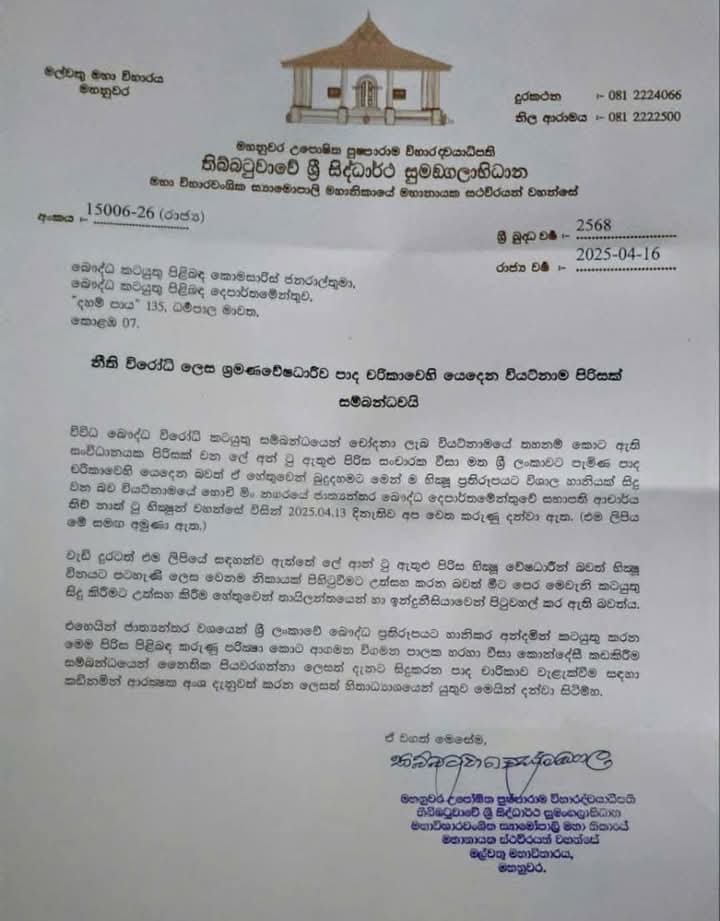
			- Daily Mirror
			  collapsed:: true
				- [Vietnamese Spiritual leader forced to make U-turn in Sri Lanka](https://www.dailymirror.lk/recomended-news/Vietnamese-Spiritual-leader-forced-to-make-U-turn-in-Sri-Lanka/277-307532)
				  collapsed:: true
					- 28 April 2025 03:00 am
					- By Ruki Fernando & Manushika Cooray
					- Minh Tue is a Vietnamese who describes himself as an ordinary learner and practising what Buddha has taught in scripture. He has been walking in Vietnam barefoot, eating once a day (only in the morning) from food received from others, sleeping in the open, and not receiving any money. He has no possessions, except some bare essentials like a bowl for food and to drink water. His robes are sown by himself; using discarded pieces of cloth he picks up along his travels.
					- Minh Tue’s simple lifestyle and attempts to follow Buddha was seen by many Vietnamese as a contrast to traditional Buddhist Sanga in Vietnam, who were seen as politically aligned to repressive Vietnamese government and having affluent lifestyles. Minh Tue had become very popular amongst Vietnamese, including those outside Vietnam, with crowds following him physically in his walks and many more following him spiritually.
					- He had walked beyond Vietnam to other neighbouring countries such as Laos, Thailand, Malaysia, Indonesia, and Singapore. Some of his followers had followed him even during overseas travels. Vietnamese volunteers have travelled with him to see him and help him, including those of Vietnamese origin from countries such as Singapore, Australia, United States of America and United Kingdom. Youtubers and media have also followed him and kept his followers informed of his travels.
					- Minh Tue had arrived in Sri Lanka on April 10, 2025 and received a visa for 30 days; his travel documents were seen by the authors of this article. He had hoped to walk to Jaffna and travel from there to India before the expiry of his visa. He had started walking from the day of his arrival and managed to walk from Katunayake to around Narammala till April 17.
					- During the walks, Minh Tue and his followers, numbering about 34 (plus about 10 helpers), remain silent; each participant walking behind each other, in meditative manner, quite similar to the way some Sri Lankan monks walk during ‘pinda patha’. This way of their walking ensures that there is no disruption to pedestrian or vehicular traffic or public order. Sri Lankans have not observed any reports of public disorder caused by their walking in this island.
					- Allegations against Min Tue
					  collapsed:: true
						- On April 13, the Committee for International Buddhist Affairs of the Vietnamese Buddhist Sangha has sent a letter to the Mahanayaka of the Malwatta Chapter making allegations against Minh Tue. The letter was seen by the authors of this article. The allegations include; donning Buddhist monastic robes without being ordained, attempting to form a dissident sect, causing division and damaging the reputation and unity of Vietnamese Buddhism and threatening Public Order and National reputation. The letter also stated that Minh Tue is supported by anti-government individuals and organizations that seek to use his image to discredit the Vietnamese government and divide the Buddhist Sanga. But specific details of allegations or evidence indicating the allegations were not provided.
						- The letter requests the Mahanayaka Thera of the Malwatta Chapter to coordinate with Sri Lankan authorities to verify and prevent Minh Tue and his group from engaging in any religious or public activities in Sri Lanka, provide assistance to liaise with Sri Lankan authorities to address cases where religious identities are exploited as a cover for political subversion, undermining the unity of Vietnamese Buddhism and sovereignty of the Vietnamese state.
						- These writers came to know from multiple Vietnamese sources that allegations in the letter are false and that it’s a group of Buddhist Sanga in Vietnam close to the Vietnamese government which is hostile to Minh Tue due to his growing popularity amongst ordinary Vietnamese.
						- Media have reported that Vietnamese Government had obstructed Minh Tue’s walks in Vietnam.
						- Minh Tue has responded to the above allegations, a translation of which was seen by these authors.  He maintains that he is not a monk or teacher and that he doesn’t carry the name “Thich”, which he says belongs to Buddha. He also says he is not part of the Vietnam Buddhist Association and doesn’t wear Buddhist robes and that he is not impersonating anyone.
					- Mixed responses from Sri Lanka
					  collapsed:: true
						- On or around April 16, in Giriulla, a witness has told the media that when Minh Tue and his group were about to visit a local Hindu temple to rest, a local Buddhist monk had objected, citing the above letter. The local monk had claimed that Minh Tue and the group which was with him were “fake monks and were violating the law”. But Sri Lankans have sympathised with the Vietnamese. Eventually Minh Tue was eventually able to enter the temple.
						- The Deputy Registrar of the Malwatta Chapter, Mahawela Rathanapala Thera, is reported to have told BBC Sinhala that the Chairman of the Department of Buddhism in Vietnam has made a written request to the Malwatta Mahanayaka Thera, informing him not to allow the anti-Sasana activities of this Vietnamese group. The Deputy Registrar is reported to have stated that these people are ‘monks in disguise’ and that they are not ordained according to the Buddhist Vinaya and that the Chief Incumbent of the Malwatta Vihara Chapter had requested the Commissioner General of Buddhist Affairs to investigate the facts regarding this ‘Vietnamese group’ and take action regarding the violation of visa conditions through the Controller General of Immigration and Emigration. Speaking to BBC Sinhala, the Commissioner General of Buddhist Affairs is reported to have said that steps have been taken to inform the Department of Immigration and Emigration to take necessary action based on the letter received from the Malwatta Mahanayake Thera.
					- Police stop Minh Tue
					  collapsed:: true
						- These writers visited Minh Tue, some of his followers and helpers on April 21. They informed that the police had stopped them from walking on April 17 and verbally informed them that they were not allowed to walk on a tourist visa. No written orders or instructions have been presented by the police.
						- The Police Media Spokesperson Senior Superintendent of Police Buddhika Manathunga is reported to have told BBC Sinhala that “a pada yathra is an activity that falls under the category of a procession”. He is further reported to have said, “You need to get permission from the police to hold a procession. The second thing is that according to the Immigration and Emigration Law, you cannot come to Sri Lanka on a visit visa and hold a demonstration. Based on all those facts, we informed them that this was illegal and therefore they were required to obtain permission to carry out this activity. Accordingly, they stopped this activity in the Kuliyapitiya area,” said SSP Manathunga.
					- Hostility shown by Immigration Department
					  collapsed:: true
						- On April 22, these writers came to know from one of Minh Tue’s helpers that some officers from the Investigation Unit of the Department of Immigration and Emigration had visited Minh Tue and his group and instructed all of them to leave Sri Lanka by April 26, despite all of them having valid Sri Lankan visas to remain in the island till May 30 (30 days from arrival on 10th April).
						- This and the restriction on walking had led to Ming Tue and group purchasing air tickets to cut short their visit in Sri Lanka and travel to India on night of April 24.
						- Immigration officers had confiscated six passports of volunteers helping Minh Tue and his followers and the officers had instructed a representative from the group to come to the Immigration office within 2 days to receive instructions about their stay and actions that will be taken with regard to their confiscated passports. Some representatives visited the Immigration office the next day (April 23) and their passports were returned, but not before spending several hours at the Department of Immigration and Emigration. Their return are tickets were also inspected. However, immigration officers didn’t issue any written or verbal instructions that their visa was being revoked or its duration was reduced. Department of Immigration and Emigration officers verbally informed the group, two Sri Lankan Buddhist Monks and Sri Lankan activists (including one of the authors) supporting the Vietnamese that they had no opposition with Minh Tue and his group’s walking.
						- On the night of April 24, Minh Tue and the group left Sri Lanka for India. Minh Tue had told these two writers that his policy was to obey orders of relevant authorities of any country and not remain in places where he wasn’t welcome.
						- The media had also had reported this.
						- Minh Tue’s premature departure – a loss for Sri Lanka
						- These writers met several Sri Lankans who have been assisting Ming Tue and it seemed that most Sri Lankans were very supportive and welcoming towards the visit and walking of Minh Tue and his followers. Amongst these were two Buddhist Monks and a man who shared with us their many efforts to ensure Minh Tue and group could stay in Sri Lanka and continue their journey towards Jaffna. They had also intervened to find places for the group to rest, when some Buddhist Monks had been reluctant to extend a welcoming hand.
						- These writers came to hear that Ming Tue’s helpers had financially assisted Sri Lankan communities through charitable acts during the course of their walk. It was also clear to us that this group was contributing to the Sri Lankan economy, by patronising Sri Lankan shops, hotels, transport providers etc. These writers felt that the group’s presence and walking have been contributing to nurture the friendship between the people of Sri Lanka and Vietnam; especially amongst Buddhists and that Sri Lanka had much to benefit spiritually from Minh Tue’s presence in Sri Lanka even for 30 days.
						- Is walking to Jaffna a violation of tourist visa conditions?
						- Walking or seeking alms or engaging in religious activities is not prohibited for persons with tourist visas as per the official website of the Department of Immigration or Emigration. Many tourists in Sri Lanka openly engage in religious practices, a very common example being tourists participating in annual processions (which lead to closure of roads) linked to major Buddhist temples such as “Dalada Maligawa” in Kandy and “Gangaramaya” in Colombo. It is also very common to see tourists doing long walks spanning several days and weeks through public spaces, a prominent example being the “Pekoe Trail”.
						- Article 10 of the Sri Lankan constitution guarantees Freedom of thought, conscience and religion, including the freedom to have or to adopt a religion or belief of his choice for all persons, not just Sri Lankan citizens. Article 12 (1) of the constitution ensures all persons (not just citizens) are equal before the law and are entitled to the equal protection of the law. Article 11 of the constitution guarantees that no person (not only citizens) shall be subjected to torture or cruel, inhuman or degrading treatment or punishment, which includes mental torture.
						- Minh Tue was simply travelling on foot to Jaffna and not engaging in a procession or Pada Yatra. He had not organised or joined any religious activities in Sri Lanka. He has chosen the means of travel in Sri Lanka as walking, according to his conscience and religion. Walking as a means of travel is not prohibited by Sri Lankan law. It’s similar to travelling by cycling, car, bus, train etc.
						- Thus, these writers feel that the decision taken by the Sri Lanka Police to prohibit Minh Tue and his followers from walking to Jaffna appears to have no legal basis and has violated articles 10, 12(2) and 11 of Sri Lanka’s Constitution.
						- The prohibition of walking by this very popular spiritual leader with Buddhist background, from a neighbouring country, with largely Buddhist population, may lead to tensions amongst people in Sri Lanka and may obstruct friendly relations between the people of Vietnam and Sri Lanka. It may also bring Sri Lanka into disrepute.
						- Minh Tue and his group may visit Sri Lanka again if they are welcomed and supported. Many hope they do. These writers are confident that most Sri Lankans, especially Buddhists, will welcome and support them. Importantly, these writers hope that the state and especially the police will ensure their journey isn’t obstructed by those who may have vested interests; whether from Vietnam or Sri Lanka.
			- Hiru TV (හිරු ටීවී)
			  collapsed:: true
			  :LOGBOOK:
			  CLOCK: [2025-04-24 Thu 20:03:12]
			  :END:
				- ((665359c3-61fd-4858-a117-ecbcd6fbc9ea)) https://www.hirutv.lk/
				- ((665359c0-a89a-41b5-9f28-503f79107a08)) https://en.wikipedia.org/wiki/Hiru_TV
				- Hiru TV had an interview on April 24, the last day of the group in Sri Lanka.
				  id:: 680a363b-c9ff-4f0a-8081-a3d4a16ade20
				  :LOGBOOK:
				  CLOCK: [2025-04-24 Thu 20:03:39]
				  :END:
				- But no such interview can be found, [by Gemini Deep Research](https://g.co/gemini/share/0b33a45bb014), on Hiru TV sites: https://www.hirutv.lk/, https://www.hirunews.lk/, YouTube channels, Facebook, Instagram, TikTok, X (Twitter)
				- Video: [Thầy Minh Tuệ trả lời phỏng vấn đài truyền hình Sri Lanka](https://youtu.be/hAO_SYW1O1k)
				  collapsed:: true
				  :LOGBOOK:
				  CLOCK: [2025-04-28 Mon 19:26:50]
				  CLOCK: [2025-04-28 Mon 19:26:57]
				  :END:
					- {{video https://youtu.be/hAO_SYW1O1k}}
			- Notes on names
			  collapsed:: true
				- Due to the non-tonal transcription of “Minh Tuệ” as “Minh Tue”, the name is usually mispronounced as /min tjuː/, like in “Tuesday”, instead of /mïŋ twe/.
				- In news from ((6809919b-a2ea-432f-8d8c-ad8a2c53e732)) & from ((6809a38f-db99-4047-9821-740929cac54a)), "Thích Nhật Từ" is transcribed as "Kiew Nhat Tu"!?!
				- The letter ව is pronounced [/ʋ/](https://en.wikipedia.org/wiki/Voiced_labiodental_approximant) between /v/ and /w/. That's why the name තිබ්බටුවාවේ (Thibbattuvāvē) is transcribed as “Thibbattuwawe” on Wikipedia.
				  collapsed:: true
					- This /ʋ/ sound is popular in South Asian languages: in the Indian subcontinent, Laos, Khmer, etc.
					  id:: 6809ac03-30d3-4ba7-8b9b-17e13732f9dd
					- In the South Vietnamese tone, the sound "v" is also reduced to /ʋ/ or /bj/ or /βj/ and then /j/, e.g. "vô" /jo/.
					  id:: 6809b3ac-8ea6-4cc8-8c79-8243a805a748
		- This afternoon, April 29, walking to the riverside for a noon nap, i coined the term “experientialism” to express my way of life.
		  id:: 6810ae1c-f995-4f93-9793-8bd422760249
		  collapsed:: true
		  :LOGBOOK:
		  CLOCK: [2025-04-29 Tue 17:47:02]
		  :END:
			- However, searching the Web, i acknowledged that the term “experientialism” has been established already.
				- A stub on Wikipedia: [experientialism](https://en.wikipedia.org/wiki/Experientialism)
				- [Dictionary's definition](https://www.dictionary.com/browse/experientialism)
				  > any doctrine or theory that maintains that personal experience is the only or the principal basis of knowledge.
				- Experientialism in [philosophies of well-being](https://qri.org/blog/experientialist-theories-of-well-being)
				- Experientialism [in learning](https://www.scribd.com/document/722055489/EXPERIENTIALISM-1) and [in teaching](https://sk.sagepub.com/ency/edvol/curriculumstudies/chpt/experientialism), i.e. “learning from experience”
				- Experientialism in aesthetics: [A sensible experientialism?](https://onlinelibrary.wiley.com/doi/full/10.1111/phpr.12903) by James Grant
				- Experientialism is the new wave of consumerism: mental consumerism
					- This is the succesor of the previous wave: material consumerism (materialism)
					- [Experientialism, Materialism, and the Pursuit of Happiness](https://www.researchgate.net/publication/228299766_Experientialism_Materialism_and_the_Pursuit_of_Happiness) by Leaf Van Boven at University of Colorado
					- [Spend less on stuff, more on experiences](https://www.theguardian.com/commentisfree/2015/feb/27/spend-less-on-stuff-experiences-materialism-experientialism) by James Wallman
					- [Experientialism - The Philosophy of Gen Z](https://braunshedd.com/philosophy-and-metaphysics/what-is-experientialism/) by Braun Shedd
			- Compare “experientialism” with [“empiricism”](https://en.wikipedia.org/wiki/Empiricism), via discussion with Grok 3
				- Both lay stress on experience, hence the same Vietnamese translation to “chủ nghĩa kinh nghiệm”.
				- **Empiricism**, a.k.a. “external science”: Knowledge comes from sensory experience and observation; emphasizes objective evidence and scientific methods.
					- Methodology: Objective, often scientific; prioritizes repeatability and falsifiability.
					- Better translations: “chủ nghĩa thực nghiệm”, “chủ nghĩa quan sát nghiệm chứng” (technical)
				- **Experientialism**, a.k.a. “internal science”: Knowledge and meaning arise from lived, subjective experience; focuses on personal, holistic understanding.
					- Methodology: Subjective, interpretive; values personal narratives and context.
					- Better translations: “chủ nghĩa thể nghiệm”, “chủ nghĩa cảm nghiệm” (deeper), “chủ nghĩa trải nghiệm” (casual)
				- The two are combined into a perfect whole, my way of life: Naturalism = Experientialism + Empiricism
					- Vietnamese translations: Chủ nghĩa Tự nhiên = Chủ nghĩa Thể nghiệm + Chủ nghĩa Thực nghiệm
					- The Naturalism is not only the [Western one](https://en.wikipedia.org/wiki/Naturalism_(philosophy)) with external science, but also the [Eastern one](https://en.wikipedia.org/wiki/Ziran) with internal science, like the Ziran (自然, tự nhiên) of Lao Tzu
		- The sublime within via meditation, 19 May
		  collapsed:: true
		  :LOGBOOK:
		  CLOCK: [2025-05-19 Mon 08:04:21]
		  :END:
			- Thanks to the stuffy nose, i had a meditation session diving deep inside, from the nasal cavity, sinuses, down to the belly. There i heard the loud noise of my breath, due to the open Eustachian tubes, which is very much like great sounds of Nature.
			- Shared with friends in chat boxes
				- Nãy ngồi thiền vào sâu bên trong, mình thấy thiệt là "khủng!" Nhớ những chuyến đi ra thiên nhiên, mình thấy cả trong ngoài đều khủng như nhau. 😁
				- Trong triết học Phương Tây có khái niệm "the Sublime" (cái Khủng) diễn tả tính 2 mặt của những thứ vĩ đại như thiên nhiên, vũ trụ, Chúa Trời, và sự vượt qua cả 2 mặt đó:
					- Ở xa, khi thu gọn cái to lớn vĩ đại vào tầm mắt thì ta thấy nó thật đẹp, có sức hút mãnh liệt khiến ta phải đi tới để khám phá.
					- Khi tới gần, mình mới ngộ ra nó thật là khủng khiếp, đầy những cạm bẫy, nguy hiểm... Sự vĩ đại của nó đè bẹp cái tôi của mình, khiến mình nhận ra mình chỉ là một hạt bụi nhỏ bé, chả là gì cả.
					- Khi vượt qua được chính mình, bỏ được cái tôi nhỏ bé này xuống để hòa vào sự hùng vĩ, to lớn đó, mình bỗng thấy thật tuyệt vời, một cảm giác thăng hoa (sublime), vượt thoát (transcendental), và giải thoát (liberated). Ở đây mình ngộ ra rằng vẻ đẹp kia mời gọi mình không phải để dùng sức người nhỏ bé này để chinh phục cái ngọn núi vĩ đại để đứng trên đỉnh núi thấy "ta cao hơn núi" như mình đã tưởng. Mà sự vượt qua chính là vượt qua bản thân mình, thoát khỏi sự nô lệ cho những nghiệp trong cái tôi này: sợ hãi, kiêu ngạo, cố chấp, kỳ vọng, v.v.
				- Cái Khủng: Derived from "khủng khiếp" (terrifying, overwhelming), it carries a dual nature—both awe-inspiring grandeur and a sense of fear or intensity. This is aligned with the philosophical concept of the Sublime, as defined by thinkers like Burke (terror and beauty) or Kant (the vastness of overwhelming reason), which includes both uplifting and unsettling dimensions.
				- Về chữ Nôm thì có 2 chữ thể hiện 2 sắc thái ý nghĩa như sau
					- 恐 (khủng): khủng khiếp, khủng hoảng, khủng bố
					- 孔 (khổng, khủng): khủng long (rồng khổng lồ), "thật khủng!" (casual meaning: stupendous, tremendous)
				- > The passion caused by the great and sublime in nature, when those causes operate most powerfully is Astonishment, and astonishment is that state of the soul in which all its motions are suspended, with some degree of horror … No passion so effectually robs the mind of all its powers of acting and reasoning as fear. For fear, being an apprehension of pain or death, operates in a manner that resembles actual pain. Whatever therefore is terrible, with regard to sight, is sublime too … Indeed terror is in all cases whatsoever, either more openly or latently, the ruling principle of the sublime.
				  
				  — Edmund Burke in  “A Philosophical Enquiry into the Origins of Our Ideas of the Sublime and Beautiful” (1757)
		- The Great Lie and the twins of Well-Dressed Lie & Naked Truth
		  collapsed:: true
		  :LOGBOOK:
		  CLOCK: [2025-05-23 Fri 12:14:38]
		  CLOCK: [2025-05-23 Fri 12:15:05]--[2025-05-23 Fri 20:46:54] =>  08:31:49
		  :END:
			- This morning, 23 May, on the way to company, contemplating ((6830664a-06e8-418d-bf46-0491fef3a780)), i see that i'm still too humble to be with the Great Lie, and still hiding in the cave with my Naked Truth.
			- I'm still struggling in the transiton [(3)→(4)](((68306c82-0709-4c83-bcf2-a9015af8b86e))) from living the naked Truth to dressing the Lie.
			- The **Coin of Truth**
			  id:: 6830645a-93b9-4c90-929f-8740f40c2b15
				- The Coin of Truth (Great Truth) is also the Coin of Lie (Great Lie) which is greater than both one-sided Truth and Lie.
				  collapsed:: true
					- Image: [Coin of Truth - stereotypes.png](../assets/Will/story/2025-05/Coin of Truth - stereotypes.png) shows [stereotypes of “Truth” and “Lie”](((68300868-6108-475e-90e0-1f15e58366c1))) as two sides of the same coin.
						- 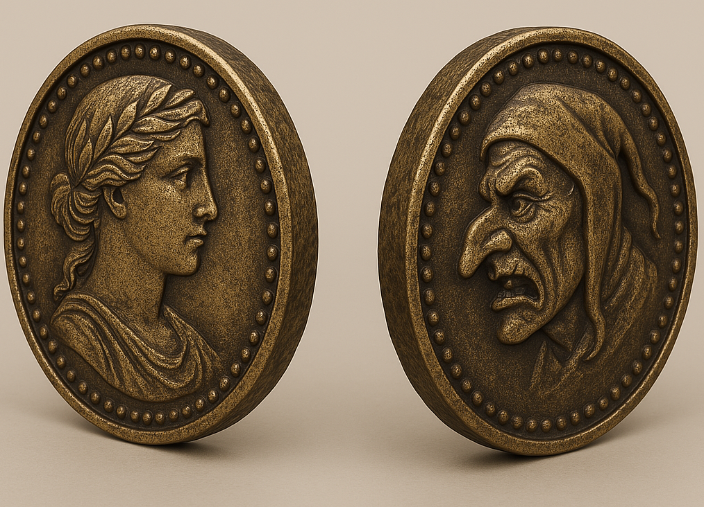{:width 200}
						- Truth side: Goddess [Veritas](https://legendaryladieshub.com/goddess-veritas/) with laurels on her hair depicting her triumph over Lie.
						- Lie side: Mendax is the deceiver with witchcraft
					- The normal stereotypes & symbols of Truth and Lie are just the cover of deeper truth, so this is also the [Coin of Lie](((6830664a-06e8-418d-bf46-0491fef3a780))).
					- The fable of the twins of [Well-Dressed Lie and Naked Truth](((683006ab-8151-40ff-b1a3-5499aebd355a))) reveals the inner truth which is opposite to those superficial stereotypes: Veritas is just the well dressed Lie, and Mendax is actually the naked Truth.
				- While the Truth and the Lie are 2 opposite sides of the Coin, the Great Lie and the Great Truth are 2 aspects, 2 connotations of the Coin.
				- The **Great Truth**
				  id:: 68306652-f922-4597-bcf7-99a62ef32c94
				  is simply the Coin of Truth including both Truth and Lie.
					- Image: [Coin of Truth - twins.png](../assets/Will/story/2025-05/Coin of Truth - twins.png) illustrates the twins of [Well-Dressed Lie and Naked Truth](((683006ab-8151-40ff-b1a3-5499aebd355a)))
					  collapsed:: true
						- 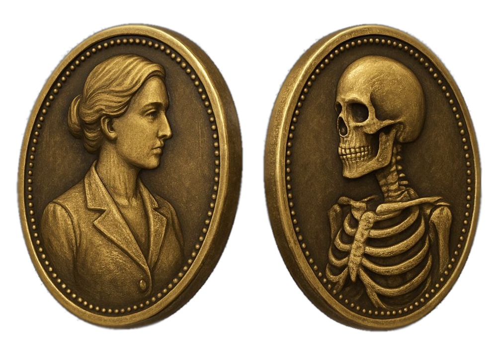
					- identity (face) = perspective (side) = mặt
					  id:: 68347151-822b-4773-8ad0-2f1d8c300191
						- Truth and Lie are just two identities, [two faces](((68346b4d-6704-4012-94b6-581694788547))) of the same subject. These identities are constructed by the collective karma, illustrated by the folks in two towns in the fable.
						- The “coin” symbol shows that Truth and Lie are just two perspectives viewed from two different angles, hence two sides of the same object.
						- It's interesting that in Vietnamese, these two expressions are unified by a single word: mặt = face = side!
				- The **Great Lie**
				  id:: 6830664a-06e8-418d-bf46-0491fef3a780
				  is the skillful means to express ((68306652-f922-4597-bcf7-99a62ef32c94)) without inflicting suffering, based on the acceptance of the intrinsic “lie” caused by differences between views.
					- Image: [Coin of Truth - lotus.png](../assets/Will/story/2025-05/Coin of Truth - lotus.png) shows both sides of the lotus: the beautiful flower rising above the rippling water surface, versus the ugly roots sucking the smelly mud at the bottom.
					  collapsed:: true
						- 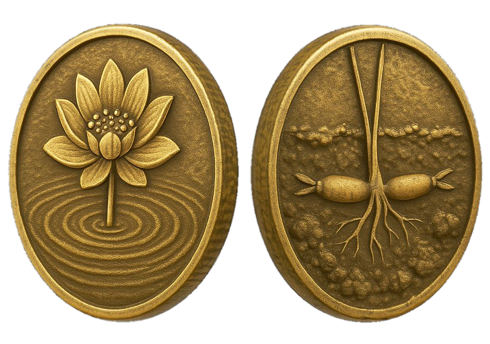
						- This image is the result of dozens of hours working, which are all hidden by the beautiful final image! This is just a little exmple of the Great Lie.
							- Prompt to Copilot
							  collapsed:: true
								- The Coin of Truth contains 2 views of the same thing on its two sides. The Left side depicts a beautiful lotus 🪷 seen from above water with circular ripples spreading out from the petiole (no leaf). The Right side depicts the scene under water with the muddy rough bottom covering the lotus roots and rhizomes. Please make sure the correct anatomy of the lotus roots right under the petioles and between the horizontal rhizomes, as shown in [this diagram](((683463e2-d067-42a6-84f3-fcad587e2569))).
								  id:: 684f9519-1b6d-4d18-8cf0-be2e3287f1b8
								- To show both sides, please draw an image of two copies of the Coin in opposite oblique angles facing away from each other: the left coin shows the Left side facing left, the right coin shows the Right side facing right. Let the background be transparent, and please don't print any text.
							- Just like the "one unit error", the correction of the orientations (opposite <> parallel, facing away <> facing each other) is too hard for Copilot! 😔
							- a previous image with wrong root anatomy
							  collapsed:: true
								- 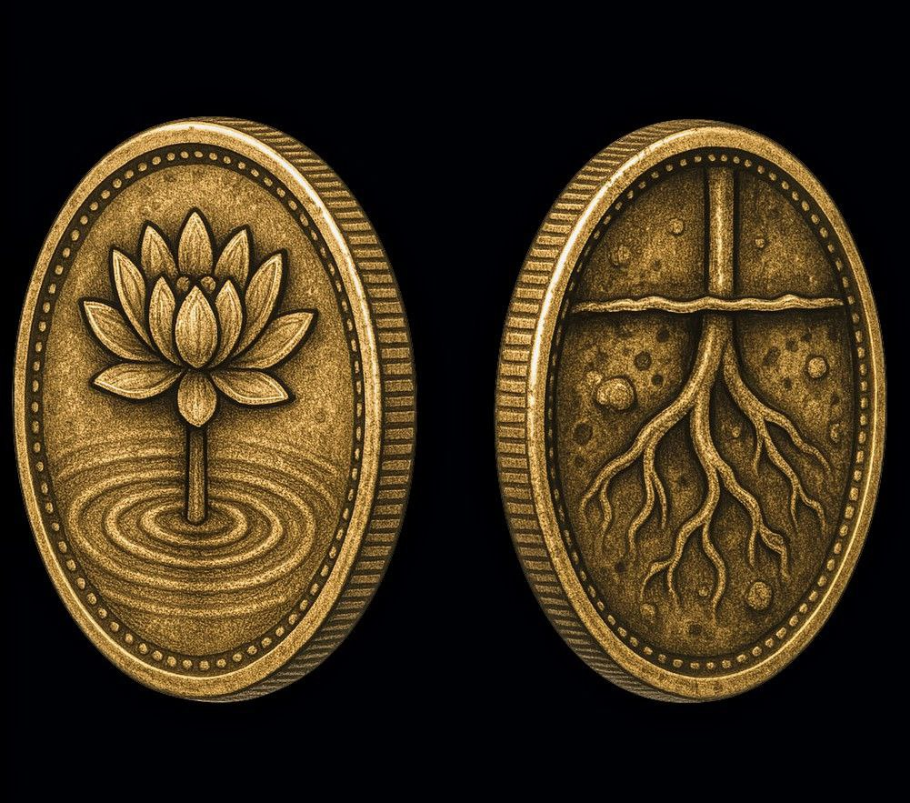
							- a previous image with wrong orientations
							  collapsed:: true
								- 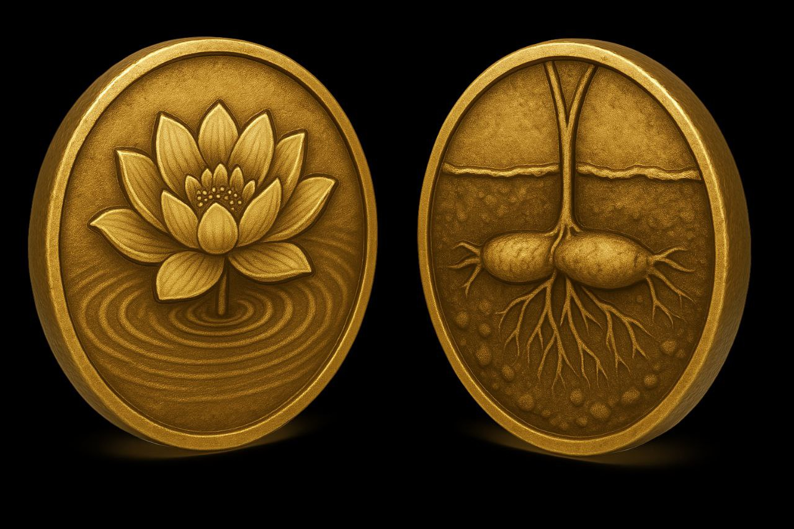
							- a previous image like a watercolor painting with colors but wrong anatomy of rhizome
							  collapsed:: true
								- 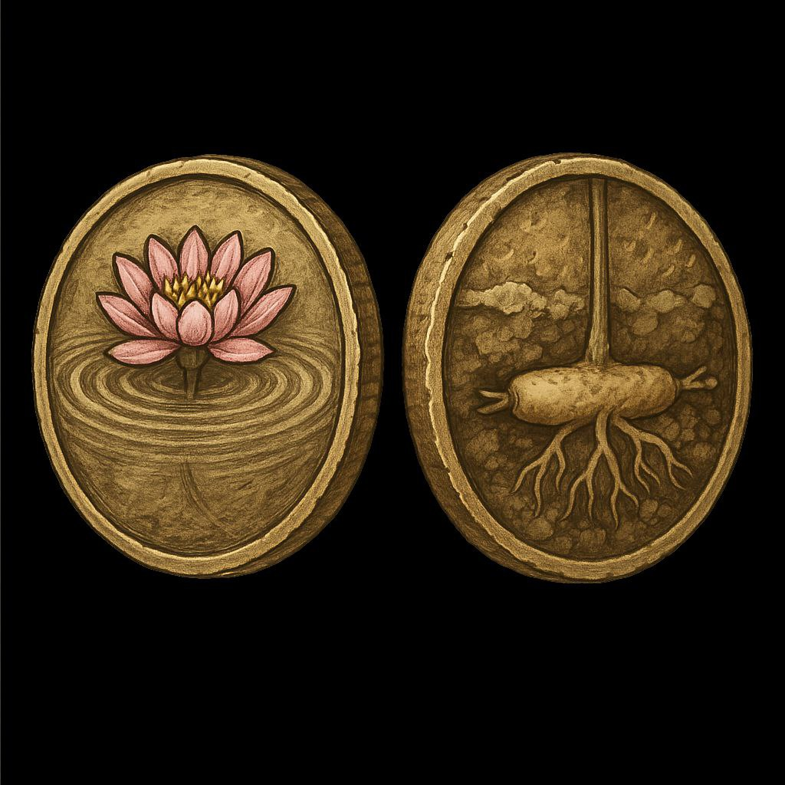
							- a previous image with text "Veritas | Mendax" printed
							  collapsed:: true
								- 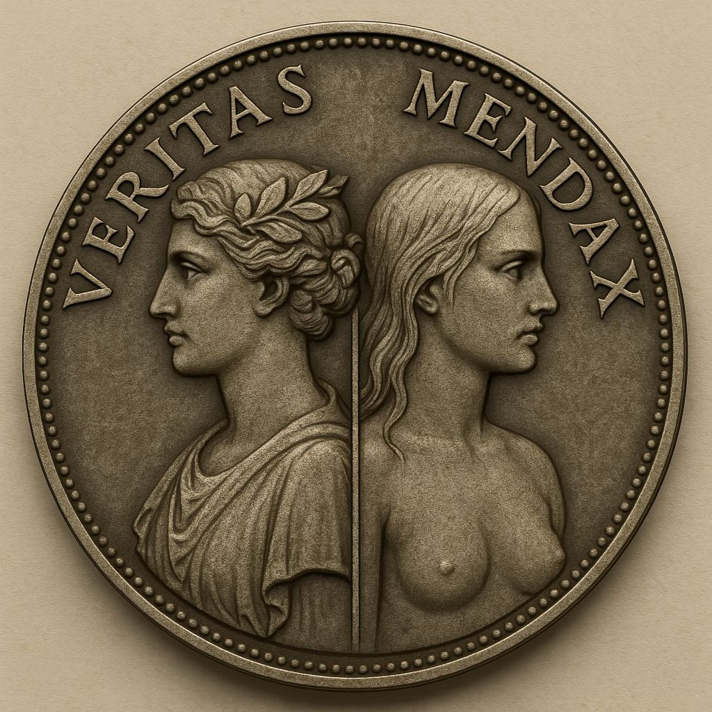
						- Parts of the lotus
						  id:: 683463e2-d067-42a6-84f3-fcad587e2569
						  collapsed:: true
							- 
							- (underground) storage organs ([geophytes](https://en.wikipedia.org/wiki/Storage_organ)): bulblike stems (bulb, corm, rhizome, stem tuber, caudex), root tuber, and storage taproot
							  id:: 686b8a52-50bf-43bd-a5b3-d2387b8da5ac
							  collapsed:: true
								- [Bulb](https://en.wikipedia.org/wiki/Bulb): vertical stem comprising many **layers of fleshy leaf bases** called [“scales”](https://en.wikipedia.org/wiki/Cataphyll)
									- E.g.: [onion](https://en.wikipedia.org/wiki/Onion), [shallot](https://en.wikipedia.org/wiki/Shallot) (Asian onion), [garlic](https://en.wikipedia.org/wiki/Garlic), [tulip](https://en.wikipedia.org/wiki/Tulip)
									- Longitudinal section through a bulb
									  collapsed:: true
										- 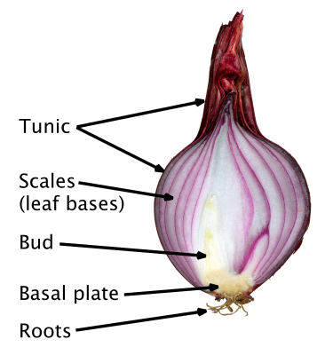
								- [Corm](https://en.wikipedia.org/wiki/Corm): **vertical solid** swollen stem with one or more [internodes](https://en.wikipedia.org/wiki/Internode_(botany)) and a **basal plate** (basal node) where roots grow
									- E.g.: [taro](https://en.wikipedia.org/wiki/Taro) (khoai môn), [eddoe](https://en.wikipedia.org/wiki/Eddoe) (khoai sọ)
								- [Rhizome](https://en.wikipedia.org/wiki/Rhizome): **horizontal** swollen stems, knotty with [nodes](https://en.wikipedia.org/wiki/Node_(botany)) **actively growing** [roots](https://en.wikipedia.org/wiki/Root) and [shoots](https://en.wikipedia.org/wiki/Shoot_(botany)), i.e. indeterminate growth
									- E.g.: [ginger](https://en.wikipedia.org/wiki/Ginger), [turmeric](https://en.wikipedia.org/wiki/Turmeric) (nghệ), [lotus](https://en.wikipedia.org/wiki/Nelumbonaceae), [water lily](https://en.wikipedia.org/wiki/Nymphaeaceae)
								- [Stem tuber](https://en.wikipedia.org/wiki/Stem_tuber): fleshy stems with “eyes” of nodes all over the surface
									- These eyes are **dormant nodes** to grow buds later, i.e. determinate growth, unlike the active nodes of rhizome.
										- However, the nodes of yams do grow roots actively.
									- E.g.: [potato](https://en.wikipedia.org/wiki/Potato), [yam](https://en.wikipedia.org/wiki/Yam_(vegetable)) (khoai từ), [purple yam](https://en.wikipedia.org/wiki/Dioscorea_alata) (khoai mỡ)
									- Note that while potato shows clear eyes, yams have no apararent eyes but roots attached instead. Yams have similar form with sweet potato, making them easily mistakened as root tubers, while their function is actually a stem tuber.
									  collapsed:: true
										- References
											- [Origin and Anatomy of Tubers of Dioscorea floribunda and D. spiculiflora](https://www.journals.uchicago.edu/doi/10.1086/336228)
												- 5. The anatomy of the tuber is more closely related to that of the stem than to that of the root.
												- 7. It is concluded that the tubers in these species represent much modified stem tissue, thus being a relic of the ancestral rhizome.
											- [Characterization of the Dioscorin Gene Family in Dioscorea alata Reveals a Role in Tuber Development and Environmental Response](https://pmc.ncbi.nlm.nih.gov/articles/PMC5536067)
												- *D. alata* L. propagates mainly via tubers, the **modified stem**. Tuber development is accompanied by a variety of biochemical and morphological changes.
												- This is consistent with the findings that _the underground **stem tubers** of yam are derived from swollen [hypocotyls](https://en.wikipedia.org/wiki/Hypocotyl)_.
								- [Root tuber](https://en.wikipedia.org/wiki/Root_tuber): fleshy roots
									- E.g.: [sweet potato](https://en.wikipedia.org/wiki/Sweet_potato), [jícama](https://en.wikipedia.org/wiki/Pachyrhizus_erosus) (củ sắn/đậu)
								- Storage [taproot](https://en.wikipedia.org/wiki/Taproot): thickened taproot, e.g.: [carrot](https://en.wikipedia.org/wiki/Carrot)
								- [Caudex](https://en.wikipedia.org/wiki/Caudex): thickened stem, e.g.: [jicamilla](https://en.wikipedia.org/wiki/Jatropha_cathartica)
								- Ref:
									- [The Difference Between Corms, Bulbs, Tubers, and Rhizomes](https://www.thespruce.com/corms-different-from-bulbs-tubers-and-rhizomes-2131032)
										- {:width 500}
					- Even though the Coin has 2 equal sides of both Lie and Truth, it's preferred to be called "the Coin of... Truth" is just another lie, much more subtle than the one-sided Lie. This is the [Liar Paradox](https://en.wikipedia.org/wiki/Liar_paradox): “The Truth is that Truth lies!”
					- This is the top of skillfulness and difficulty: (1) accompany with the dressed Lie → (2) accepting the naked Truth → (3) living the naked Truth → (4) dressing the Lie → (5) living the Great Truth → (6) living the Great Lie
					  id:: 68306c82-0709-4c83-bcf2-a9015af8b86e
					- A lesser great Lie, which is just a better dressed Lie, is the widely accepted norms, social standards, ethics, morals, etc. This is what Grok 3 and maybe the general public think of when being asked about "the Great Lie".
					- Great Lie > noble lie > white lie
					  collapsed:: true
						- Great Lie = [upaya-kaushalya (skillful means, phương tiện thiện xảo)](https://en.wikipedia.org/wiki/Upaya)
						- Noble lie = [splendide mendax](https://www.merriam-webster.com/dictionary/splendide%20mendax) (Latin): Being “nobly false”, untruthful for a good cause, like the Hypermnestra’s deception in Horace’s Odes 3.11 to save her husband, and like the well dressed Lie in the fable of the twins.
						- [White lie](https://www.merriam-webster.com/dictionary/white%20lie): a lie about a small or unimportant matter that someone tells to avoid hurting another person
						- The well-dressed Lie’s noble lie is a compassionate but incomplete act, showing only the good side to protect society. The sages’ Great Lie, however, is the ultimate expression, embracing both sides of the Coin of Truth and presenting them skillfully, aligning with the equation ((68347151-822b-4773-8ad0-2f1d8c300191)) and with Sadhguru’s [liberation from identity](https://lewishowes.com/relationships/sadhguru-the-truth-about-karma-identity-purpose/).
				- {{embed ((68300868-6108-475e-90e0-1f15e58366c1))}}
				- Other meanings of the “coin of truth” in the folks:
				  collapsed:: true
					- [A statement](https://www.goodreads.com/quotes/7729752-the-coin-of-truth-had-two-faces-equally-fair-and) in Jan Cox Speas's 1961 historical fiction “My Love, My Enemy”
					  id:: 68346b4d-6704-4012-94b6-581694788547
					  > The coin of truth had two faces, equally fair, and no one could see them both at once.
					- The coin usully symbolizes the choices between truth and lie, right and wrong.
						- In [the legends of the deva Gayatri on SNARGL](https://snargl.com/angelic-creatures/gayatri/), the Coin of Truth [symbolizes the choices](https://snargl.com/blog/the-significance-of-the-coin-of-truth-in-gayatris-journey/) she encounters along her path.
						- As a tool, it's [used by fortune tellers](https://www.ritualsupply.co/products/coin-of-truth-yes-or-no-fortune-teller) to answer yes/no questions, or as [a magical fortune telling device](https://www.webtoons.com/en/canvas/coin-of-truth/list?title_no=682619).
							- 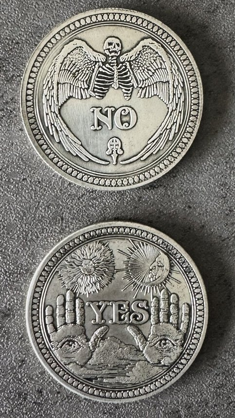{:width 100}
			- Let's document about the parables of the Naked Truth.
			- Published posts
			  collapsed:: true
				- fb post [The Well-Dressed Lie and the Naked Truth](https://www.facebook.com/share/p/1CJPvZJHiS/)
				  id:: 683006ab-8151-40ff-b1a3-5499aebd355a
					- Giả Dối Tinh Vi và Chân Thật Trần Trụi như hai thái cực chẳng đội trời chung... nhưng kỳ thực lại là hai chị em sinh đôi, tuy 2 mà 1. Vì lòng yêu thương con người vô hạn mà họ đã chấp nhận biến ra thành hai thái cực đối lập để làm hài lòng mọi người.
					- Bản tiếng Việt: [Giả Dối Tinh Vi và Chân Thật Trần Trụi](https://creatzynotes.blogspot.com/2023/10/gia-doi-tinh-vi-va-thanh-that-tran-trui.html)
					  collapsed:: true
						- Bản tóm gọn
							- Ngày xưa, có hai chị em sinh đôi giống hệt nhau, sống ở hai thị trấn khác nhau, nơi họ được gọi là “Chân Thật” một cách trìu mến. Người ở thị trấn này đã hoang mang khi gặp cô Chân Thật ở thị trấn kia vì họ không thể phân biệt với cô Chân Thật ở thị trấn này qua khuôn mặt nhưng lại bám chấp vào sự quen thuộc và e dè với trang phục lạ lẫm, nên đã gọi cô kia là “Giả Dối” và xua đuổi cô. Đau lòng về việc hai thị trấn tranh cãi đâu là “Chân Thật thực sự” và chiến đấu với nhau để bảo vệ Chân Thật của mình, hai chị em đã gặp nhau trong hang động để tìm cách giải quyết.
							- ― Chúng ta vốn là một nhưng lại bị chia cắt bởi định kiến của họ – cô em khóc nức nở.
							  ― Chị sẽ nhường lại hết quần áo cho em để em làm hài lòng cả hai thị trấn – cô chị nêu ý kiến.
							  ― Nhưng chị sẽ bị trần trụi và bị khinh miệt!
							  ― Vì tình yêu con người, chị sẽ chịu đựng. Còn em sẽ đảm nhận việc làm họ hài lòng, một nhiệm vụ khó chẳng kém chị đâu!
							- Họ ôm nhau lệ rơi lả chả, rồi chia tay – cô em mang hết áo quần đi, cô chị ở lại trần truồng. Để làm hài lòng mọi người, cô em trở lại thị trấn, nhanh chóng thay đổi trang phục cho phù hợp với mong đợi của từng người, đảm bảo ai cũng thoải mái với “Chân Thật” của mình. Dù khéo léo đến đâu, đôi khi cô vẫn bị bắt gặp trong lúc thay đồ và bị gọi là “Giả Dối”. Cô chị trần truồng thường phải trốn trong hang để tránh làm người ta bị sốc. Hễ thấy cô, người ta gọi cô là “đồ điên” hay còn tệ hơn nữa, rồi hoảng sợ bỏ chạy vì bất an và sợ hãi; một số người còn lạm dụng cô trong đêm.
							- Chỉ có vài người tìm đến Chân Thật trong hang, sau khi đã chán ngán với Giả Dối bị che đậy.
							  ― Sao em lại trốn ở đây? – họ hỏi.
							  ― Em đã trao vẻ đẹp lại cho em gái để phục vụ các anh – cô đáp – vì các anh sợ sự thật trần trụi.
							- Khi Chân Thật trần trụi lộ ra hoàn toàn thì hầu hết những người tìm kiếm sự thật đều hoảng loạn, bỏ chạy, và đuổi theo một “Chân Thật” khác thoải mái hơn, vốn là Giả Dối của kẻ khác. Chỉ những ai dũng cảm đối diện và đón nhận Chân Thật trần trụi thì mới ở lại và trân trọng cô.
						- Bản đầy đủ
						  collapsed:: true
							- Ngày xưa, vào buổi bình minh của nền văn minh nhân loại, có hai chị em sinh đôi giống hệt nhau từ lúc mới sinh. Từ nhỏ, cả hai đều xinh đẹp một cách thuần khiết và rất dễ thương dễ mến. Khi lớn lên, họ phải tách ra để đến những nơi khác nhau, người chị về phía đông và người em về phía tây, để sống và làm những công việc khác nhau. Họ được mọi người xung quanh yêu mến đến độ người dân ở thị trấn phía đông gọi cô chị là “Chân Thật” với ý bao hàm tất cả những đức tính tốt lành, và cô em cũng được người ở thị trấn phía tây gọi là “Chân Thật” với đầy ưu ái như vậy. Một ngày nọ, cô chị qua thị trấn phía tây để thăm em gái. Lúc đầu, mọi người ở đó nhầm lẫn hai chị em với nhau vì khuôn mặt họ không thể nào phân biệt được và đều cùng tên là “Chân Thật”. Nhưng rồi họ nhận ra cô Chân Thật của mình qua bộ áo đầm quen thuộc. Họ gọi cô mặc bộ đồ lạ kia là “Giả Dối”:
								- Mày không phải là Chân Thật!
								- Em là Chân Thật mà! Chúng em là chị em sinh đôi cùng tên mà!
								- Nếu vậy thì mày chỉ là Chân Thật giả chứ không phải Chân Thật thật!
								- Em chỉ là một bé Chân Thật khác, giống như em của em thôi.
								- Không, chúng tôi không tin chuyện vớ vẩn như vậy đâu! Chỉ có một Chân Thật. Mày đang nói dối! Mày là Giả Dối, không phải Chân Thật! Mày là đồ giả hình, giả dạng, giả tạo,...
								  Người dân ở đó quy mọi điều xấu xa nhất cho cô chị qua tên gọi “Giả Dối” và họ giận dữ đuổi cô ra khỏi thị trấn phía tây. Cô em phải đi cùng chị mình về phía đông để bảo vệ chị gái khỏi những người hung dữ kia và để cô chị về nhà được an toàn. Nhưng khi họ vào thị trấn phía đông, cô em cũng gặp phải tình huống tương tự: Cô bị gọi là “Giả Dối”, bị sỉ nhục và bị đuổi khỏi thị trấn phía đông.
							- Sự phân biệt đối xử đó không chỉ khiến hai chị em đau khổ, mà còn khiến người dân hai thị trấn gây hấn với nhau để bảo vệ “Chân Thật” yêu quý của họ khỏi bị gọi là “Giả Dối” và bị xúc phạm bởi người thị trấn bên kia. Vì yêu quý mọi người nên hai chị em lẩn vào một hang động để cùng nhau tìm cách giải quyết xung đột này.
								- Đau buồn quá em ơi! Tệ quá em ơi!
								- Em cũng buồn. Nhưng chúng ta phải làm gì đó để chấm dứt sự hỗn loạn này!
								- Giá như chúng ta chẳng phải xa nhau, giá như chúng ta là một...
								- Dạ! Chị nói đúng, chúng ta phải là một, không thể tách làm hai được!
								- Nhưng bằng cách nào???
								- Thực ra thì bản chất chúng ta đã là một rồi... Chỉ có điều là người ta kỳ thị chị em mình bằng những thành kiến của họ và bằng những bộ áo bên ngoài của chúng ta mà thôi...
								- À, đúng rồi! Chỉ là cái bộ áo!!! Là chính nó, bộ áo!!! Chị sẽ đưa em quần áo của chị để em có thể mặc những trang phục khác nhau 👗🥻 ở những nơi khác nhau để em luôn phù hợp với văn hoá ở đó dù em có đi bất cứ nơi đâu. Như vậy thì người ở thị trấn phía tây sẽ coi em là người phía tây và người ở thị trấn phía đông sẽ coi em là người phía đông. Như vậy sẽ không còn ai buồn phiền chi nữa.
								- Còn chị thì sao?!!!
								- Đừng lo lắng cho chị! Trong tim chúng ta vẫn chỉ là một ♥️. Em thì thực hiện nhiệm vụ khó đó là làm hài lòng mọi người, còn chị thì hỗ trợ họ mỗi khi họ ngã xuống.
								- Không, em không thể làm vậy được! Thật bất công cho chị quá! Em không thể lấy quần áo của chị... Hic...
								- Em không còn yêu thương người ta nữa phải không?
								- Không, không, có chứ! Em yêu mọi người rất nhiều... nhưng...
								- Nhưng em lại không muốn hy sinh cho những người mình yêu thương sao?! Đừng bi quan em nhé! Sự hy sinh của chúng ta sẽ rất có ích cho mọi người trên khắp thế giới.
								- Em... em hiểu rồi... em sẽ thay mặt chị cố gắng hết sức để làm hài lòng mọi người. Em sẽ nhớ chị nhiều lắm, hic, hic...
								- Chị cũng sẽ nhớ em! Chị sẽ luôn ở bên em... trong trái tim em ♥️!
								  Hai chị em ôm nhau, khóc rất nhiều, rồi chia tay, cô em lấy hết quần áo đi còn cô chị thì trần trụi ở lại.
							- Cô em luyện tập kỹ năng thay đồ nhanh như chớp, như một phép thuật biến hình để có thể đáp ứng nhiều sở thích khác nhau của nhiều kiểu người khác nhau bất kỳ lúc nào họ cần. Nhờ kỹ năng điêu luyện mà cô đã khiến mọi người hài hòng, ai cũng nghĩ rằng mình đã có Chân Thật của riêng mình, nên không còn gây hấn với nhau nữa. Mọi người cũng thoả mãn hơn với bản thân vì họ không còn bị cô Giả Dối kia quấy rầy nữa. Tuy họ vẫn còn thấy Giả Dối lảng vảng ngoài kia, nhưng nó là Giả Dối của người khác chứ chẳng bao giờ tới gần mình nữa.
							- Xấu hổ nên cô chị trần trụi thường phải trốn trong hang để tránh làm cho người ta sốc. Nhưng tình yêu thương con người đã khiến cô lẻn vào thị trấn để trông nom họ. Những lần xuất hiện hiếm hoi của cô đã nhắc nhở mọi người về sự tồn tại của những sự thật trần trụi mà lại khó thấy và khó chấp nhận. Ban ngày, đa phần người ta đều ngoảnh mặt quay lưng với Chân Thật trần trụi, họ gọi cô ta là “đồ điên”, có người lăng mạ cô, có người nổi giận đuổi cô đi. Còn ban đêm thì có người lại tìm Chân Thật trần trụi để hiếp dâm. Vì yêu người, cô chịu đựng hết thảy!
							- Dù khéo léo đến đâu, thỉnh thoảng cô em nhiều áo quần cũng bị người ta bắt gặp khi đang thay đồ. Những người này thất vọng vô cùng khi thấy Chân Thật của họ xuất hiện dưới những diện mạo khác không hề quen thuộc. Họ càng không thể chịu được khi biết ra rằng Chật Thật của họ lại chính là Giả Dối của người khác.
								- Này Chân Thật, không thể tin được là em đã lừa dối tôi suốt bây lâu nay! Không, em không phải là Chân Thật, em là Giả Dối!!!
								- Em xin lỗi đã làm anh thất vọng! Nhưng em không lừa dối anh. Em chỉ cố gắng hết sức để làm anh hài lòng thôi.
								- Vậy rốt cuộc thì em là Chân Thật hay Giả Dối?
								- Em là Chân Thật khéo léo, nhưng mọi người cũng gọi em là là “Giả Dối” như anh vừa gọi đó.
								- Không không không! Tôi không muốn nói chuyện với Giả Dối! Biến đi!
								- Em chỉ nói cho anh biết sự thật thôi, nhưng anh không chịu chấp nhận thì em cũng chịu thua. Hãy gặp chị gái của em, có thể chị ấy sẽ giúp được anh...
								- Cô ta ở đâu?
								- Chị ấy đang trốn trong hang.
							- Hầu hết những người này chỉ để cho nỗi thất vọng của họ cuốn trôi theo thời gian. Chỉ có một số ít người cất công tìm tới hang động để gặp Chân Thật trần trụi.
								- Hú uu! Có ai đó không?
								- Dạ, có em đây.
								- Sao em lại trốn trong đây?
								- Vì em không muốn làm anh sợ.
								- Anh không sợ, hãy bước ra đi!
							- Chân Thật trần trụi chỉ mới hé ra một chút...
								- Aaahh... gớm quá!!! Sao em lại bẩn thỉu hôi hám đến vậy?
								- Vì em đã đưa hết quần áo đẹp đẽ thơm tho cho em gái rồi, là con Chân Thật khéo léo đã phục vụ anh, làm anh hài lòng bấy lâu nay đó. Nó cũng chính là con Giả Dối tinh vi đã khiến anh vừa mới thất vọng đó thôi.
								- Đừng gọi tên nó trước mặt tôi! Tôi ghét nó lắm!
								- Anh đến đây để làm gì?
								- Để tìm ra Chân Thật thực sự.
								- Em chỉ là Chân Thật trần trụi. Em không biết Chân Thật thực sự của anh là ai.
								- Em chắc chắn là Chân Thật thực sự rồi! Bước ra hẳn đi em! Anh khao khát gặp em quá rồi!
							- Khi Chân Thật trần trụi lộ diện ra hết, hầu như ai cũng đều sợ hãi bỏ chạy trở về thị trấn. Ở đó, họ mò mẫm tìm cho bằng được “Chân Thật đích thực” của riêng mình mà không biết rằng đó chỉ là Giả Dối tinh vi trong một trong bộ áo khác mà họ chưa từng biết đến.
							- Rất ít người quay lại với Chân Thật trần trụi. Họ là những người tuy đã thưởng thức được nhiều hình dáng đẹp đẽ khác nhau của Chân Thật khéo léo rồi nhưng vẫn cảm thấy có gì đó còn thiếu thốn.
								- Chào bóng tối, anh quay lại với em đây!
								- Rất vui được gặp lại anh! Bây giờ anh muốn gì?
								- Anh muốn em, chỉ mình em thôi, cho dù em đáng sợ, bẩn thỉu, ghê tởm hay xấu xa bỉ ổi đến cỡ nào đi chăng nữa!
								- Tại sao?
								- Vì anh chán con Giả Dối tinh vi lắm rồi.
								- Anh cũng sẽ sớm chán em thôi!
								- Mặc kệ! Hãy nói cho anh biết tại làm sao mà em lại ra xấu xa ghê tởm đến như vậy!?
								- Vì em đã trao hết mọi sự tốt lành cho em gái rồi, con Chân Thật khéo léo đó.
								- Để làm gì?
								- Để phục vụ những người như anh, để làm cho mọi người vui vẻ và hài lòng.
								- Sao em không tự làm lấy việc đó?
								- Chuyện ai làm không phải là vấn đề! Chúng em tuy hai cơ thể nhưng chỉ có một tâm hồn. Nếu em gánh lấy trách nhiệm làm hài lòng người ta thì em gái em cũng phải làm Chân Thật trần trụi như em thôi, có khác gì đâu?!
								- Sao hai người không chia nhau làm việc đó?
								- Bởi vì người ta chỉ muốn “toàn đúng, toàn đẹp, toàn hạnh phúc” chứ không muốn chấp nhận sự thật rằng có sai trái, có xấu xí, có đau khổ, và đủ thứ khác nữa...
								- Nghe chẳng đúng tí nào!... Nhưng thôi, coi như anh tin em... Thì làm sao em biết được điều đó?
								- Hai chị em em đã sống trên Trái Đất này hàng triệu năm rồi. Chúng em đã phục vụ nhiều nền văn minh từ buổi bình minh đến khi sụp đổ. Thị trấn của anh chỉ là một viên sỏi nhỏ so với những ngọn núi vĩ đại của các nền văn minh khác. Chúng em đã quan sát thấy con người muôn đời nay là như vậy. Thực ra thì thời xa xưa khi còn ít tuổi, cả hai chúng em đều đã cùng mặc quần áo. Tuy nhiên, sự khác biệt trong cách ăn mặc của chúng em đã khiến người dân ở các thị trấn khác nhau gây chiến với nhau, và nó đã làm trái tim chúng em tan nát...
								- Vậy là em đã quyết định hy sinh bản thân vì người ta và vì em gái mình?!
								- Đúng, nhưng không chỉ mình em. Em gái em cũng phải hy sinh bản thân để hoá thân thành những con người khác hẳn với con người vốn có của nó.
							- ... Cuộc trò chuyện cứ tiếp tục mãi... Có người tỉnh thức và nhận ra cả thảy đều là những giấc mơ. Có người quyết định quay trở lại những giấc mơ đó để giúp đỡ cặp song sinh Chân Thật & Giả Dối...
					- Thực ra mình viết bản tiếng Anh này trước: [The Well-Dressed Lie and the Naked Truth](https://creatzynotes.blogspot.com/2023/10/the-twins-of-truth-and-lie.html)
					  collapsed:: true
						- Short version (with the help of Grok 3)
						  id:: 684f9519-6824-430b-820a-d5728d4b3f45
							- Long ago, there were identical twin sisters living in separate towns where they were belovedly called “Truth”. Their indistinguishable faces confused people, who, clinging to the familiar and wary of the unfamiliar outfit, called the sister from the other town “Lie” and drove her away. Heartbroken by the towns’ fights over the “true” Truth, the sisters met in a cave.
							- ― We’re one soul, split by their prejudice – one wept.
							  ― I’ll give you my clothes to please both towns – the other said.
							  ― But you’ll be naked and scorned!
							  ― For the love of people, I’ll endure. You'll take the duty of satisfying them, no less difficult than mine!
							- They embraced, tears falling, and parted – one taking all clothes, the other bare. To please everyone, the dressed sister returned to town, swiftly changing outfits to suit each person’s expectations, making sure that everyone is comfortable with their own “Truth”. No matter how skillful, sometimes she was caught mid-change and called “Lie”. The naked sister hid in the cave most of the time to avoid shocking people. Anytime seeing her, they called her “crazy” or worse, then fled due to their unease and scare; some abused her in the night.
							  id:: 684f9519-da96-40d8-9e09-411d94f16654
							- Just a few people, tired of the dressed Lie, sought the naked Truth in the cave.
							  ― Why hide? – they asked.
							  ― I gave my beauty to my sister to serve you – she replied – because you fear the unadorned truth.
							- When the naked Truth emerged fully, most truth seekers were shaken, fled, and chased another comforting “Truth” who was another’s Lie. Only the brave stayed, embracing the naked Truth.
						- Full length version
						  id:: 683029f1-0847-4186-a6a6-b8cb19fcd922
						  collapsed:: true
							- Long ago, at the dawn of human civilization, there were two twin sisters who were indistinguishable at birth. They were both so pure, so beautiful and so attractive from the beginning. When they grew up, they had to separate and go to different places, one to the east and one to the west, to live and work in different jobs. They were loved by people around so much that people in the east town called the east twin “Truth” with all good attributes attached, and the same for the west twin being called “Truth” preciously in the west town. One day, the east twin went to the west town to visit her sister. At first, people there got confused by the twins due to their identical faces and the same name “Truth”. But then they recognized their own “Truth” by her familiar dress. They called the unfamiliarly dressed twin “Lie”:
								- You are not Truth!
								- I'm Truth, we're twins with the same name.
								- If so, you're just a false Truth, not the true Truth!
								- I'm just another Truth, the same as my sister.
								- No, we don't believe such a ridiculous thing! There's only one Truth. You're lying! You're Lie, not Truth! You're false, fake, counterfeit,...
							- People there attributed all bad properties to the twin they called “Lie” and angrily chased her off the west town. The west twin went with the east twin to protect her sister from angry people so that she could return to the east town safely. But when they entered the east town, the west twin met the same situation: She was called “Lie”, humiliated, and chased off the east town.
							- That discrimination not only upset the twins but also made people of the two towns fight against each other to protect their beloved “Truth” from being called “Lie” and insulted by people from the other town. Loving people so much, the twins retreated to a cave to meet and to come to a decision to resolve this conflict.
								- I'm so sad, sister! That's so bad, sister!
								- I'm sad, too. But we must do something to end this chaos!
								- If only we are not separated, if only we're one...
								- Yeah! You're right, we must be only one!
								- But how???
								- We've already been one, intrinsically... Only people discriminate us with their own prejudice and with our external clothes...
								- Oh, I've got it! It's just the clothes!!! That's it, the clothes!!! I'll give you my clothes so that you can wear different costumes 👗🥻 in different places to be always appropriate wherever you go. Thus, people in the west town will see you as a west person and people in the east town will see you as an east person. That way, no one will be upset anymore.
								- But how about you?!!!
								- Don't worry about me! We're still only one in our heart ♥️. You just do the difficult task of satisfying people, and I just support them whenever they fall.
								- No, I can't do that! It's so unfair to you! I cannot take your clothes... Hic...
								- You don't love people any more, do you?!
								- No, nope, yes I do! I do love people so much... but...
								- But you don't want to sacrifice for the ones you love, do you?! Don't be pessimistic, sister! Our sacrifice will help people all over the world.
								- I... I see... I will try my best to satisfy people on your behalf. I'll miss you a lot, hic, hic...
								- I'll miss you, too! I'll be always with you... in your heart ♥️!
								  The twins hugged, cried a lot, then separated with one twin taking all clothes and the other undressed.
							- The dressed twin has practiced the skill of changing clothes at lightning speed, like a transformation magic, so that she can satisfy many different preferences of many different types of people anytime they need. Thanks to her magical skill, she makes everyone happy with the thought that they have got their own Truth, so they are no longer aggressive with each other. People are also more satisfied with themselves because they are no longer bothered by Lie. Although they still see Lie out there, but that's Lie of someone else far away.
							- Ashamed, the naked twin usually have to hide in the cave, not to shock people with her appearance. However, the love for people makes her sneak into the town to watch over them. Her rare appearances have reminded people of the existence of the raw truths which are usually hidden and unacceptable. In the daytime, most people turn away from the naked Truth calling her “crazy”, some people insult her, some get angry with her and chase her away. In the nighttime, some people find the naked Truth to rape her. Loving people, she bear them all!
							- No matter how skillful, the dressed twin is occasionally caught by people when she's changing outfit. These people get disappointed to see their Truth appear in different appearance that they are not familiar with. Further more, they can't bear to know that their Truth is actually someone else's Lie.
								- Hey Truth, I can't believe that you've lied to me all these times! No, you're not Truth, you're Lie!!!
								- I'm sorry to make you disappointed! But I haven't lied to you. I just tried my best to satisfy you.
								- So at last, are you Truth or Lie?
								- I'm the dressed Truth, but people also call me “Lie” like you've just done.
								- No no no! I don't want to talk with the Lie! Go away!
								- I'm just telling you the truth but you can't accept it, so I can't help you. Let's meet my sister, maybe she can help you...
								- Where is she?
								- She's hiding in the cave.
							- Most of these people just let time wash away their disappointment. Only few people bother going to the cave to find the naked Truth.
								- Hello! Anybody there?
								- Yes I am.
								- Why are you hiding?
								- Because I don't want to scare you.
								- I'm not scared, please show yourself!
							- The naked Truth just show a little bit of herself...
								- Ahhhh... you nasty!!! Why are you so dirty and smelly?
								- Because I've given all my beautiful clothes with good smell to my sister, the dressed Truth that has served you, satisfied you all these times. And she is also the well-dressed Lie that has just disappointed you.
								- Don't call her name in front of me! I hate her!
								- Why do you come here?
								- I want to find the true Truth.
								- I'm just the naked Truth. I don't know who's your true Truth.
								- You must be the true Truth! Please show yourself fully! I'm desperate to meet you.
							- When the naked Truth fully shows herself, most people get scared and flee back to the town. There they try to find their own version of “the true Truth” who is just another well-dressed Lie.
							- Very few people get back to the naked Truth. They are the ones having experience of many beautiful appearances of the dressed Truth but still feeling something missing.
								- Hello darkness, I'm back here to see you again!
								- Nice to see you again! What do you want now?
								- I want you, only you, no matter how scary, dirty, nasty, or even evil you are!
								- Why?
								- Because I'm tired of the well-dressed Lie.
								- You'll soon be tired of me, too!
								- I don't care! Just tell me why you're so bad, nasty and evil!?
								- Because I've given all my goodness to my sister, the dressed Truth.
								- For what?
								- For serving people like you, to make people happy and satisfied.
								- Why don't you do it yourself?
								- It doesn't matter! We are two bodies but only one soul. If I took the responsibility to satisfy people, my sister would be the naked Truth just like me, no difference!
								- Why don't you two share that task?
								- Because people only want the “all right, all true, all beautiful, all happy” and don't want to accept the truth of being wrong, false, ugly, sad, and so on.
								- That sounds ridiculous!... Anyway, let me believe you. But how do you know that?
								- We twins have lived on Earth for millions of years. We've served many civilizations from rising to collapse. Your town is just a small pebble compared to great mountains of other civilizations. We've observed that people are always like that. Actually in the ancient time when we were young, we had already tried both dressing. However, our difference in dressing made people in different towns fight each other, which broke our hearts...
								- So you decided to sacrifice yourself for people and for your sister?!
								- Yep, but not only me. My sister also has to sacrifice herself to become the one people like which is different from her true self.
							- ... The conversation goes on and on... Some people wake up to realize all of these are just dreams. Some decide to return to these dreams to help the twins of Truth & Lie...
					- Đó là bản "cổ tích" được viết từ cảm hứng qua "sự tích về Sự Thật Trần Trụi" [((683006b8-eaf0-4123-b50b-66c4064834e9))] phổ biến bên Tây.
					- Illustrative image
					  collapsed:: true
						- 
				- fb post [The coin of Truth](https://www.facebook.com/lexuandinhct/posts/pfbid02iGU97KErCLEvj63K7vtFHycW7bJEMxSoo5Z41wZkYp8sPX2YWGoDHmYJqkxKTE7gl)
				  id:: 68300868-6108-475e-90e0-1f15e58366c1
					- Đúng & Sai, tốt & xấu, âm & dương, v.v. là hai mặt của cùng một sự thật mang tên Chân Lý. Người ta thường lấy "giả dối" làm đối lập với "chân thật", nhưng kỳ thực thì "giả dối" chỉ là một phần của Sự Thật mà thôi. Cái sự thật toàn diện thì không có đối thủ, không có đối lập, không có đối trọng. Còn cái mặt "chân thật" đối lập với "giả dối" kia cũng chỉ là một sự giả dối tinh vi, giả dối được công nhận mà thôi, đơn giản vì "một nửa sự thật = giả dối" 😆
				- fb post [Biên kiến](https://www.facebook.com/lexuandinhct/posts/pfbid02QbnZ2Wq8haq1PvsvSQFuC4RrP4UtxXZyubp7aNuBibTuiHE96e2mpigYYfz6knCl)
					- Biên kiến: (zh. 邊見, en. one-sided view, en. extreme view, sa. antagrāha-dṛṣti, pi. antaggāha-diṭṭhi): cách nhìn, quan điểm (kiến/見) mà chỉ thấy một chiều, một bên (biên/邊), không thấy cái toàn thể, thấy một cách cực đoan (extreme/antagrāha) không thấy cái trung dung.
					- Trong ngôn ngữ phổ thông thì có từ "thiên kiến" (bias), tức cái nhìn thiên lệch, cũng gần nghĩa với biên kiến.
					- Bản chất của cặp mắt ngoài này là biên kiến, vì nó hướng ra ngoài nên chỉ thấy được những biểu hiện bên ngoài. Mà "xấu che tốt khoe" nên bên ngoài thì chỉ có tốt, đẹp, sáng, tích cực, dương, v.v. Mọi cái xấu, ác, dở, tiêu cực, tối tăm, âm, v.v. đều bị giấu vào bên trong, đẩy ra sau lưng, hoặc tống đi thật xa cho khuất mắt.
						- Tại sao xã hội lại có tiêu cực, tệ nạn, điều ác?
						- Vì chúng ta chỉ nhìn một chiều, luôn chạy theo những thứ "tích cực" và trốn tránh những thứ "tiêu cực".
						- Sao người trốn tránh tiêu cực lại làm cho XH tiêu cực?
						- Vì rác của mình không tự xử lý thì đẩy nó qua nhà hàng xóm, đẩy vòng vòng một hồi nó tích tụ lại thành đống rác lớn. Thí dụ như từ cái khó chịu nhỏ tích riết thành ra tức giận, tức giận dồn nén nhiều nữa thành ra căm thù, chịu không nổi nữa thì phải nổ ra thành chém giết. Nhưng người ta chỉ kết tội kẻ khác "giết người" mà không biết gốc rễ của nó chính là những cảm giác bực bội nhỏ nhặt hằng ngày của mình.
					- Ai cũng thích "sự thật", "chân lý", "công lý", v.v. nhưng chẳng mấy ai đối diện được với **sự thật trần trụi** ở ngay bên trong mình. Khi quá chấp vào những cái hay cái đẹp bên ngoài, người ta đã ép cô em Giả Dối phải lấy đi bộ áo của cô chị song sinh Chân Thật để làm hài lòng người ta. Còn Chân Thật trần trụi thì buộc phải núp vào trong bóng tối 👥 vì hổ thẹn. [((683006b8-eaf0-4123-b50b-66c4064834e9))]
					- Tác phẩm La Vérité (Chân Lý) của Jules Joseph Lefebvre
					  collapsed:: true
						- 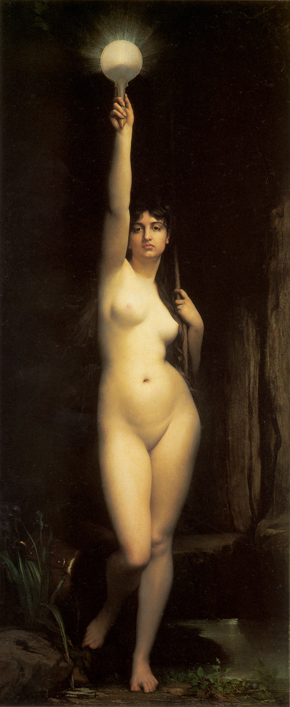
			- The fable of the Naked Truth
			  id:: 683006b8-eaf0-4123-b50b-66c4064834e9
				- Dictinary.com: [naked truth](https://www.dictionary.com/browse/naked%20truth): plain unadorned facts, without concealment or embellishment
				  > This expression supposedly alludes to a fable in which Truth and Falsehood went bathing, Falsehood then dressed in Truth's clothes, and Truth, refusing to take another's clothes, went naked. [Late 1500s]
				- The typical tale:
					- Truth and Lie meet one day and decide to bathe together in a water body after Lie convinces Truth the water is pleasant.
					- Both undress, but Lie deceives Truth, emerging first, stealing Truth’s clothes, and running to the village disguised as Truth.
					- Truth, left naked, pursues Lie to reclaim her garments. However, the villagers, seeing the naked Truth, turn away in scorn or discomfort, refusing to believe her.
					- Ashamed, Truth retreats and hides. Meanwhile, Lie, dressed in Truth’s clothes, is accepted by society, which prefers the comforting facade over the raw reality.
				- The “twins” variations
					- Twin brothers: posted [around 2021](https://handbycraft.com/blogs/news/the-tail-of-the-polar-twins?srsltid=AfmBOopfe7YbqnfsdWO8CWUJBWKC9deDkMEVCgI2Fj3yuyUP6-l4PM66), [alleged](https://theliberalgunclub.com/phpBB3/viewtopic.php?t=62521) to be from 19th century
						- One day a man named Truth and a man named Lie stood by a river just outside of town. They were twin brothers. Lie challenged Truth to a race, claiming he could swim across the river faster than Truth. Lie laid out the rules to the challenge stating that they both must remove all their clothes and at the count of 3, dive in to the freezing cold water swim to the other side and back. Lie counted to 3, but when Truth jumped in, Lie did not.
						- As Truth swam across the river, Lie put on Truth’s clothes and walked back in to town dressed as Truth. He proudly paraded around town pretending to be Truth. Truth made it back to shore, but his clothes were gone and he was left naked with only Lie’s clothes to wear. Refusing to dress himself as Lie, Truth walked back to town naked.
						- People stared and glared as naked Truth walked through town. He tried to explain what happened and that he was in fact Truth, but because he was naked and uncomfortable to look at, people mocked and shunned him; refusing to believe he was really Truth. The people in town chose to believe Lie because he was dressed appropriately and easier to look at. From that day until this, people have come to believe a well-dressed lie rather than believe a naked truth.
					- Sharon Shinn's book [“The Truth-Teller's Tale”](https://www.goodreads.com/book/show/97969.The_Truth_Teller_s_Tale)
			- The 1896 painting [Truth Coming Out of Her Well](https://en.wikipedia.org/wiki/Truth_Coming_Out_of_Her_Well) by Jean-Léon Gérôme: “La Vérité sortant du puits armée de son martinet pour châtier l'humanité” (“Truth coming from the well armed with her whip to chastise humanity”)
				- Image
				  collapsed:: true
					- 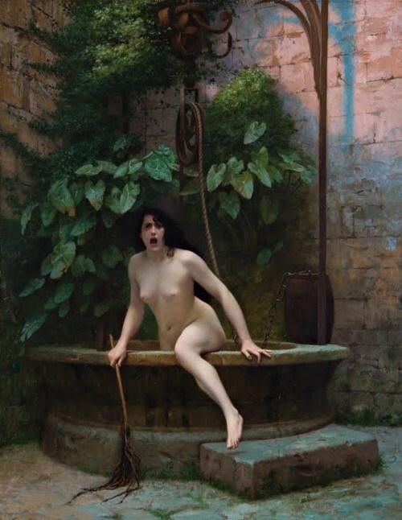
				- The well is inspired by the aphorism of the pre-socratic philosopher [Democritus](https://en.wikipedia.org/wiki/Democritus#Epistemology): “ἐτεῇ δὲ οὐδὲν ἴδμεν: ἐν βυθῷ γὰρ ἡ ἀλήθεια” (in reality we know nothing; for the truth is in an abyss).
				- The nudity is inspired by the expression “la vérité nue” (the naked truth).
		- Hồ Cốc vacation on 30/4 & 1/5 holidays
		  id:: 6835b167-cf4f-4238-80a8-7f6a45db874d
		  collapsed:: true
		  :LOGBOOK:
		  CLOCK: [2025-05-19 Mon 08:01:22]--[2025-06-05 Thu 19:15:33] =>  419:14:11
		  :END:
			- Thanks to un updated satellite image on Google Maps, i discovered the ongoing formation of a very long sand bar hundreds of meters off the current shore which will be the future shore in dozens of years later.
				- This formation is due to the [longshore drift](https://en.wikipedia.org/wiki/Longshore_drift#Natural_features) which has created the current Hồ Cốc lake in the near past.
				- off-shore lake being formed
				  id:: 6835b167-1b63-4f8e-b6f8-6c7312953b4a
				  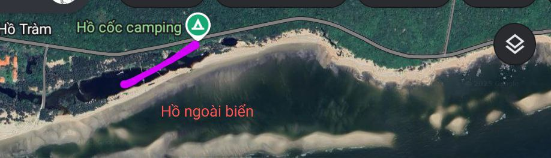
				- Chat with Huy about such interesting observation on May 18th:
				  collapsed:: true
					- Ông cho tui mượn cặp fin đi. Hôm trước 30/4 đi Hồ Cốc lặn đêm tui bị rớt mất 1 chiếc rồi 😁
					- Lúc đó triều cường rút xuống thấp nhứt làm lòi ra nguyên một bờ cát rất dài ngoài xa.... Tui tính bơi ra, ai ngờ nước cạn quá toàn phải lội bộ băng qua cái hồ ngoài biển, nước tới ngang hông... Lội bộ chán thì hụp đầu xuống lặn chân không và kéo fins theo... Kéo 1 hồi tuột mất tiêu 😁
					- Image: ((6835b167-1b63-4f8e-b6f8-6c7312953b4a))
					  Hồ Cốc là cái hồ đen bên trong (vạch tím), còn ngoài biển là cái hồ rộng hơn gấp chục lần, đang được hình thành... chắc khoảng 30 năm nữa thì hiện rõ, còn giờ chỉ thấy khi triều cường xuống sâu 😊
					- Cái bờ cát bên trong cũng đang bồi lên cao, hồi mình đi Côn Đảo lần đầu thì nó mỏng lét gần sát mặt biển, còn giờ nó cao cả 2-3m có phi lao mọc rồi.
					- Nhìn thấy kiến tạo địa hình ngay trong đời mình thiệt là thú vị. Ngày trước lúc đi khảo sát bờ biển, tui đã thấy các vịnh, đầm, hồ dọc biển Đông từ Đà Nẵng trở xuống có cùng hình thái kiến tạo. Search ra thì lúc đó biết lý thuyết là do dòng chảy dọc bờ kéo cát bồi thành các bờ cát chắn bên ngoài (hình như tui có share với ông rồi thì phải): https://en.wikipedia.org/wiki/Longshore_drift#Natural_features
					- Giờ sau mười mấy năm mới được chứng thực lý thuyết đó trên thực địa. 😊
					- Đến đời con cháu mình thì tụi nó sẽ chơi với cái hồ Cốc lớn bên ngoài chứ không còn chơi với hồ Cốc nhỏ bên trong nữa 😉
					- Đúng là "đời bể dâu", mới ngày nào còn là biển sâu, nay đã hóa ra hồ cạn 😁
			- We captured some [beautiful images](../assets/Will/story/2025-05/PhuocBuu-BinhChau Nature Reserve/) in the forest of Phước Bửu - Bình Châu Nature Reserve, esp. the legendary k'nia tree.
				- The crown of [k'nia](https://vi.wikipedia.org/wiki/K%C6%A1_nia) ([wild almond](https://en.wikipedia.org/wiki/Irvingia_malayana))
				  
		- **The truth hurts!**, shared in a chat box.
		  collapsed:: true
		  :LOGBOOK:
		  CLOCK: [2025-06-06 Fri 16:00:18]
		  :END:
			- *The bitter truth hurts, but it heals like bitter medicine!*
			  *Thuốc đắng dã tật, sự thật mất lòng!*
			- Không chỉ nói lên sự thật về người nghe làm mất lòng người nghe, mà cả nói thật về bản thân mình (người nói) cũng có thể làm người nghe mất lòng.
			- Những trải nghiệm của tui, chia theo cấp độ từ dễ đến khó hiểu thì chắc như sau:
				- 1. Mình nói cái xấu của mình, nhưng tương tự với cái xấu của người ta, người ta "nhột", nên mất lòng.
				- 2. Mình nói cái riêng của mình chẳng giống gì người ta nhưng phản lại kỳ vọng của người ta, như "tôi nói dối", "tôi không tốt như vẻ ngoài đâu", cũng làm người ta mất lòng.
				- 3. Khi được hỏi mà mình ta lời "không biết" cũng làm người nghe mất lòng. Đây là trường hợp đặc biệt của số 2, vì người hỏi kỳ vọng phải nhận được câu trả lời.
				- 3*. Trường hợp extreme của số 3 là khi đi phỏng vấn, người phỏng vấn hỏi mà ứng cử viên trả lời "không biết" cũng bị gọi là "láo!" 😜 Người khác coi câu trả lời đó là "trung thực" (tích cực), nhưng có những leader không thích sự trung thực đó, vì họ không quen và không thích bị cấp dưới từ chối. Đối với họ thì "không biết" là 1 dạng từ chối trả lời.
		- Export my saved messages from Telegram.
		  id:: 683da38c-3d91-435c-99eb-0a88a36f4ba5
		  collapsed:: true
		  :LOGBOOK:
		  CLOCK: [2025-06-02 Mon 16:35:17]--[2025-06-16 Mon 11:14:20] =>  330:39:03
		  :END:
			- Convert `messages.html` to `list.html` ~~with `sed`~~ with javascript via `messages.processed.html` & `messages-converter.js`
				- `messages.processed.html`: `<body onload="CheckLocation();">` -> `Init()` + Extracted Content column
				- `messages-converter.js`: merge all notes in a day into 1 block: image & text are treated equally as separate items
				  id:: 68429ef1-dc83-4d36-892f-1de746bfab09
					- Text format:
					  collapsed:: true
						- ```markdown
						  Paragraph 1
						  - Item 1
						  - Item 2
						  
						  Paragraph 2
						  - Item 3
						    + Subitem 3.1
						    + Subitem 3.2
						  - Item 4
						    continuation of Item 4
						    - Subitem 4.1
						    - Subitem 4.1
						  ```
					- Tree structure: array `[]` = UL, element `-` = LI
					  collapsed:: true
						- ```js
						  [
						  - DocumentFragment{string, #text, BR, A, B, ... (may have UL)},
						  - DocumentFragment{string, #text, BR, A, B, ... (no UL)}
						    [
						    - DocumentFragment
						    	[ DocumentFragment, DocumentFragment, ... ],
						    - DocumentFragment
						  	[ DocumentFragment, DocumentFragment, ... ],
						    ],
						  ]
						  ```
					- split{Paragraph > List`-` > List`+`}(`DocumentFragment`{LI}) -> `DocumentFragment`{LI, LI{UL}, ...}
				- Attempt with `sed`
				  collapsed:: true
					- First, remove all `<div class="from_name">` & `<div class="media_wrap clearfix">` to normalize `<div class="body">`, because next messages in the same day don't have `from_name`.
					  ```sh
					  sed '/<div class="from_name">/{N;N;N;d}' messages.html |
					  sed '/<div class="media_wrap/{N;d}' > messages.norm.html
					  ```
					- CANCELLED Next, convert `<a class="photo_wrap` ...
						- Oh, this is so messy to be dealed with `sed`! 😕
					- Last, convert `<div class="body">` to `<li>`
					  ```sh
					  sed -n '/<div class="pull_right date details"/'\
					  '{x;n;n;n;n;x;N;s#\s*<div class="pull_right date details" title="\([^"]*\)">\n\([^$]*\)'\
					  '#<li>[\1]\n    <ul><li>\2\n    <\/li><\/ul>\n<\/li>#p}'\
					    messages.norm.html > list.html
					  ```
						- `/<div class="pull_right date details"/`: Matches the timestamp `<div>`.
						- `x`: Swaps the pattern space with the hold space to preserve the match.
						- `n;n;n;n;n;n;n;n`: Skips 8 lines until `<div class="text">`, including that `<div>` line.
						- `x`: Swaps the timestamp `<div>` back to the pattern space.
						- `N`: Appends the content line of `<div class="text">` to the pattern space.
						- `s#...#...#p`: Captures the timestamp (`\1`) and main text (`\2`), substitute (`s`) the text in pattern space with with the target `<li>` structure, then print (`p`) the pattern space.
							- Use alternate delimiter `#` to avoid confusion with closing `</tag>`.
						- `-n`: Prints only the transformed output by command `p`, suppressing the automatic output of pattern space.
			- DONE Copy message `list.html` to [[2020 Mind Chips]], [[2021 Mind Chips]], [[2022 Mind Chips]], [[2023 Mind Chips]], [[2024 Mind Chips]], and ((6842ab6e-a465-4b20-bbf0-196eeb879e3c))
			  :LOGBOOK:
			  CLOCK: [2025-06-13 Fri 17:50:10]--[2025-06-16 Mon 10:32:42] =>  64:42:32
			  :END:
			- Some interesting chips captured my attention:
				- Small Caps from the title of [Intensional Semantics](http://web.mit.edu/fintel/fintel-heim-intensional.pdf) on ((684c040a-a044-4f5f-8336-44f1359dd396))
				  collapsed:: true
					- [with Unicode](https://en.wikipedia.org/wiki/Small_caps#Unicode): Aᴀ Bʙ Cᴄ Dᴅ Eᴇ Fꜰ Gɢ Hʜ Iɪ Jᴊ Kᴋ Lʟ Mᴍ Nɴ Oᴏ Pᴘ Qꞯ Rʀ Sꜱ Tᴛ Uᴜ Vᴠ Wᴡ X[x] Yʏ Zᴢ
					- [with CSS](https://en.wikipedia.org/wiki/Small_caps#CSS): 
					  ```cljs :results
					  ^:hiccup [:span {:style {:fontVariant "small-caps"}} "Aa Bb Cc Dd Ee Ff Gg Hh Ii Jj Kk Ll Mm Nn Oo Pp Qq Rr Ss Tt Uu Vv Ww Xx Yy Zz"]
					  ```
				- ((684c040a-fbed-4c72-8ac4-e14e69f17b04))
				- ((684c040a-7f5d-45df-a618-2a8ab9debd0e))
				- An interesting claim of view: ((684c18cd-55c5-43d2-8be4-f0eb7888ffbd))
				- [imaginary unit i=√-1 derived from dynamics](((67bbde62-70fc-4d3d-9f65-dcea280db516))) on ((684c282f-75e9-4c66-bc32-4e764aac6625))
				- [Everything is address!](((684c2aab-9b41-486b-a758-6028725f4c13))) on ((684c2aab-13de-49da-8030-ca5a29f6931c))
				- ((684c2e6e-3f8d-4ee8-9f69-bdb5f761c9ad)): ((684c2ee0-1029-4df9-9fbb-40a6f8c2fcc8))
					- ⇒ ((667bf36a-581a-4abe-b544-2d849608a3e4))'s discussion: ((674ff584-00e3-40d8-9b77-21e9dca899dd))
					- ((684c2e6e-f75f-4916-9f1c-4375d42d8604))
				- ((66e3fe46-dc79-472a-a059-f5ccf5afb437)) on ((684f7978-d358-44ba-96de-a8fecd3c16e2)) & ((684f7978-f693-409c-93bf-de130a606023))
		- It's interesting that the root node of the whole theory, ((66537a41-f229-4891-803e-828573eb44f3)), shows so little “content”.
		  id:: 68523168-5f46-446a-984e-bec9f671f17e
		  collapsed:: true
		  :LOGBOOK:
		  CLOCK: [2025-06-18 Wed 10:24:54]--[2025-06-18 Wed 10:35:48] =>  00:10:54
		  :END:
			- Acutally, that little content is just its intension, because *the larger its extension, the smaller its intension is*.
			- Its 1st level extent (number of 1st level extensions) is indicated by the number of **backlinks** on the top right corner.
			- Its actual content is the ((667d0d2e-15c7-4989-a183-69a9a5c6bf8a)) running through all of its extensions, not just its intension.
			- Screenshot:
			  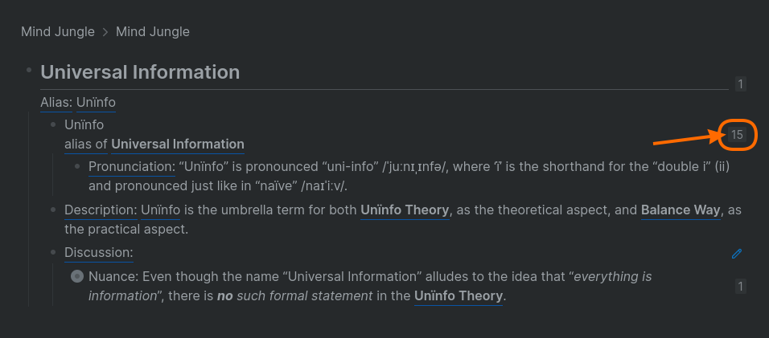
		- Everything's broken! 🙁 Just stop ⚠️, retreat from my own field, retract, reset, restore... (from May 28th to July 7th)
		  id:: 68366fff-92cf-41a7-ab2d-0c1f77d0effb
		  collapsed:: true
		  :LOGBOOK:
		  CLOCK: [2025-05-28 Wed 09:08:02]
		  :END:
			- Logseq: Many block refs, like ((6835acfc-5c1c-40c0-b008-93979afa8f36)), are not recognized!? The issue still persists after clearance of all backup & graph DB!?
			- Will: [head-first diving](((67714850-43c0-4c7f-8b50-838e014b06e0))), ((6678d594-9819-4624-abd6-d4ec62b3874f)) driven by the [holistic core](((681b3ad7-d1b0-4c06-a4ea-385a4a9314e0))), baby boom, [springy doll](((6846ca54-5e3a-4d49-b9e6-f2d8ad42ff00))), etc. make the time fleet too fast!
				- The mara uses my own strengths (clear observation, holistic view, tidy organization, concentration) for its destruction! That's how buddha and mara are just two sides of the same coin.
				- As you can see, just the observation of this issue, this broken time, is yielding a lot of stuff as written here. This is how solving one issue produces many more issues!
			- Incomplete works, waiting tasks, and so on are piling up, as shown in my working stack:
			  collapsed:: true
				- 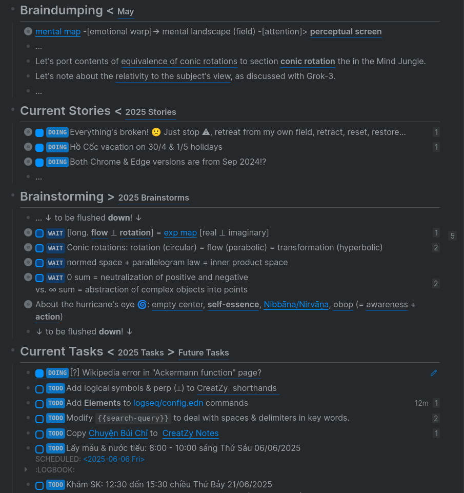
			- Right here, we can see how the issue is looking back at itself, projecting its image into its own body. This recursive nature is itself a part of the issue!
			- ⇒ **Retreat to the belly**, as the root of both body and mind, **fill the bodymind** with ujjayi breath. Retract from things higher up the mind!
			  id:: 68367257-9043-4fd5-8586-2c193d56f077
			- 10:51, 28 May, the meta/macro things are somehow well organized, so just get back to the company works!
				- with the knowledge that nothing is lost, and everything here can be continued later on.
				- This is the result of not only the external tidying but mainly the [internal meditation](((68367257-9043-4fd5-8586-2c193d56f077))).
			- 13-16pm, 29 May, a rather long stray thread of ((67d2ad10-0ca8-4361-94d5-219cf9b737d5)), ((68381bca-50f3-4d2e-9593-53d9c8f6c368)), and the [Grok's issue](((683817f7-b6a0-41a6-aee4-5279089228f7))) with conversation memory/history feature.
			  collapsed:: true
				- This stray thread was inititialized by just a simple idea to “just confirm my guess that `zenity` is related to Zen!” when i did a [clearing](((6835b162-09f7-4153-97a3-633f8a5c0980))) of prevous untouched `zenity` pop-ups: `killall -9 -vr 'microreset.sh|zenity'`.
					- Be aware! The weed seeds like this are everywhere lurking in every moment!
					- [The curse of holistic abstraction](((681b24ad-2ec8-4e9f-bef6-eb77b09b5c9c))): Just like this “simple idea”, most of my topics are actually complicated, vague, and even absurd! The complexities are usually hidden behind the “simple forms” of them in my mind. 🙄
					- The curse of perfectionist **concreteness**: Leaving the perfect circle of abstract forms (intent), i'm driven by the [holistic core](((681b3ad7-d1b0-4c06-a4ea-385a4a9314e0))) to develop the content toward the target that **everything is concrete**, which is the other extreme, the perfect circle of concrete forms (concrete extension).
				- 01-03pm: [chat with Grok](((683826a5-3833-438f-981a-573267b6ed08)))
					- This shows long periods of reading websites and researching while talking in the conversation.
					- The trailing part from 02:25 to 03:06 about the Grok memory issue showed my ((6678d594-9819-4624-abd6-d4ec62b3874f)) with debugging instinct.
				- 03-04pm: update UniinfoNotes
				  id:: 6838287a-aac3-4a6d-93c2-f98ff61b6154
				- 04-05pm: review this whole stray thread
					- The post-discussion period from 3 to 5 pm shows my trend of “long tail” working style.
				- Chat history with Grok:
				  id:: 683826a5-3833-438f-981a-573267b6ed08
				  collapsed:: true
					- 01:08 PM: Do you know why the well known program displaying GTK+ dialogs is named "zenity"?
					- 01:**35** PM: The "zen" part is clear, which is the same as mine and many other suggestions on the Web, but the "entity" part is new to me. Can you show some pages suggesting the "entity" part?
					- ≈01:40 PM (wrongly noted as "02:02 PM" by Grok): Yeah, this is what i thought at first, and still thinking like this: simply a suffix "-ity" to metion "about zen, of zen, like zen". And your suggestion of replacing "serene" in "serenity" is a fit one, i think!
					  > Abstract Suffix: "-ity" is a suffix denoting quality or state (e.g., simplicity, clarity). "Zenity" could imply the “state of being zen” (simple, calm), aligning with its user-friendly design.
					- 01:45 PM: `yad` has the option `--no-focus` which is described as "dialog window never take focus", but when i call `yad --no-focus`, the focus just jumps to the dialog window!?
					- 01:55 PM: I'm using Yad 0.40.0 (GTK+ 3.24.33). Does the Wayland has any effect on this focus functionality?
					  I see the GDK warning: ../../../../../gdk/x11/gdkwindow-x11.c:5653 drawable is not a native X11 window
					- 02:08 PM: I use GNOME but --splash has no effect, GDK_BACKEND=wayland has no effect either (neither on focus stealing nor the GDK warning). Eventually GDK_BACKEND=x11 has effect: The dialog pops up as dumb window receiving no keyboard input, cannot gain focus with mouse click, thus can only interact via mouse.
					- 02:18 PM: GDK_BACKEND=x11 does resolve the GDK warning. It also activate window-related functionalities like --no-focus, --center, --mouse, --skip-taskbar, which are ineffective under Wayland backend.
					- 02:25 PM: Do you know our previous discussion about how to prevent zenity (or any pop-up in general) from stealing focus?
					- 02:28 PM: No, i just ask if you remember. If you remember, just recall a brief of that discussion.
					- 02:29 PM: I asked if you remember the discussion about preventing stealing of focus or keyboard input of a pop-up.
					- 02:38 PM: No, the YED discussion is the recent one. I'm asking for the previous discussion (about months ago) where i asked about zenity first, then about the issue of zenity accidentally taking my keyboard inputs of my work on other apps as a its yes/no answer.
					- 02:44 PM: OK, maybe i've mistaken with some discussion with other chatbots. But let's check your ability of recalling cross-thread contents again (this was the most important feature making me switched to Grok earlier). Do you remember discussions about the Coin of Truth?
					- 03:06 PM: It's clear that you cannot recall that very recent content from another thread. I've checked the settings and see a strange symptom: The feature "conversation history" (beta) is always disabled even after my turning it on. This may be the cause! Do you know why this feature is turned off?
					- [ ((6838287a-aac3-4a6d-93c2-f98ff61b6154)) ]
					- 03:56 PM: Back to YAD/Zenity, the option `--no-focus` is too restrictive with such "dump window". So i use another solution: 
					  ```sh
					  # First, show a short-timeout window to capture accidental inputs from user, if any
					  ( sleep 1; echo 50; sleep 1; echo 75; sleep 1; echo 100; ) |
					  zenity --progress --no-cancel --auto-close --percentage=25 --width=500 --text="$msg"
					  ```
			- 30 May, my tantric practice last night has shown me ways to transform the [3 poisons](((6839229d-9eff-49e4-9480-6e2db6f61127))) with ((6850c7e4-0969-45b7-9ca8-e2c1d764effe)).
			- 31 May, through a chatbox, i translated the first couple of meditation factors [vitakka-vicāra](https://en.wikipedia.org/wiki/Vitarka-vic%C4%81ra) into Vietnamese as “tìm-bám” and English as “**find-fix**”.
			  id:: 68417bbf-695f-452b-80a1-22e174329e7a
			  collapsed:: true
				- Về 2 yếu tố tầm-tứ trong 5 yếu tố khi phân tích 4 thiền, thì đó là kỹ thuật cơ bản để nhiếp tâm, định tâm, tập trung vào 1 việc nào đó (ở đây là việc thiền), mà ở đời ai cũng dùng 1 cách tự nhiên, chỉ là không để ý, không phân tích ra thôi.
					- Vitakka = tầm = tìm = inquiry = "mount or direct the mind towards an object." Để tập trung vào đối tượng thì trước hết ta phải tìm thấy đối tượng.  Như định niệm hơi thở thì phải tìm thấy hơi thở (bình thường thở mà không biết, không thấy), định niệm thần chú thì đi phải nhớ lại câu thần chú.
					- Vicāra = tứ = "bám theo, rình rập, dò xét" = "investigate what has been focused on by vitakka." Đây là quá trình chính để duy trì sự tập trung, đó là phải liên tục bám theo đối tượng. Như trong định niệm hơi thở là phải quán hơi thở xem nó vào ra thế nào, còn người đời khi "định niệm gái" thì phải liên tục theo dõi, rình rập, bám theo từng bước chân của gái 😂!
				- "Tầm" = "tìm" thì quá quen rồi, như "ngưu tầm ngưu mã tầm mã" và "sưu tầm". Còn chữ "tứ" = "rình, bám" thì không có dùng trong tiếng Việt. Nên tui nghĩ dịch ra thuần Việt là "tìm & bám" thì dễ hiểu hơn "tầm & tứ" trong Hán-Việt.
				- Còn tiếng Anh thì tui dịch là "find & fix": "After finding her out, he fixed on her the whole time." (Sau khi tìm ra cô, anh ta đã theo dõi cô suốt thời gian đó.)
			- **June** 2nd, these days i translate the terms of ((667bef22-b272-4a7d-b613-3f1ed1a47329)) back to my mother tongue, Vietnamese, but see a little difficulty in translating the term “effect flow” itself. So, let's start from its components first: cause = tác nhân, action = tác động, effect = tác dụng, then.... wow.... the whole flow should be "**tác lưu**"! 😍
			  id:: 6839221f-0a4a-43a3-b7fc-1490e356b9de
				- So, now we have ((683ed4a3-68c7-41a4-aecf-b21561f207df)) (**Mạch tác lưu** dệt nên vạn vật.)
				- “Mạch tác lưu” (zh. 作流脈) is the nice combination of both static (thread) and dynamic (flow) aspects.
			- June 2nd, due to the ban of Telegram by Vietnamese government, i was caught up in a stray thread of ((683da38c-3d91-435c-99eb-0a88a36f4ba5))
				- Returning home, the whole night, i was caught up with testing different chatbots for 2 features: reading webpages via URL, and understanding my Mind Jungle.
				  collapsed:: true
					- Can read URLs: Notebook LM, Claude; Can read simple pages but not the [online Mind Jungle](https://raw.githubusercontent.com/bixycler/UniinfoNotes/refs/heads/log/pages/Mind%20Jungle.md): Gemini, ChatGPT
						- (Grok, Copilot) can only read their associated sites (X, GitHub)
						- DeepSeek cannot read any URL
					- Only Notebook LM & ChatGPT can understand the Mind Jungle!
					  id:: 684176d5-ba02-4cf5-ba62-606cc461d2d8
						- This ability of these 2 chatbots are in line with their ability to output analysis results in predefined formats.
						- Copilot refuses straight away “it's too large!"
						- Gemini can understand nothing but a pure hallucination!
						- Grok doesn't allow uploading plain text files in mobile apps. With the uploaded Mind Jungle in the web app, it could not deal with the huge size and just crashed!
						  collapsed:: true
							- {:width 400}
							- The crash also wiped out the uploaded docs
							  {:width 400}
						- DeepSeek says upfront that only 22% of such the huge doc can be read.
						- Claude just read and said nothing. Being asked about the contents, it just spat out “the prompt is too long!"
						- Notebook LM understands the online Mind Jungle well. But it discards chat history after refresh.
						- ChatGPT understands the (uploaded) Mind Jungle even better than Notebook LM! !😊 But it's a tight limit of 10 messages/5h.
			- June 3rd, from last night, my nose & throat have been a little sore.
				- Caught up with the completion of [mạch tác lưu](((6839221f-0a4a-43a3-b7fc-1490e356b9de))).
				- How to take quick notes at home (on Android mobile)?
				  collapsed:: true
				  ⇒ [Pipeline](((6841400e-7bac-403e-b34a-690073c3251e))) via GitJournal
					- Previously i used Telegram.
					- fb Messeger: no: it has litmited time for message modification.
					- Google Keep: has no sync methods (only one-time upload to GDrive).
					- Google Docs: [cannot reduce](https://support.google.com/docs/thread/3750758/how-do-i-change-the-default-indentation-on-list-items) default indentation spaces of list items.
					- [Simplenote](https://simplenote.com/) looks good with Markdown syntax and real time sync! 😊
					- But [GitJournal](https://gitjournal.io/) is better with consistent Markdown rendering, better GUI, and esp. Git support for source management & image uploading.
			- 4th, sleepless (last) night due to deadline stress and conflict with personal tasks.
			  collapsed:: true
				- 06:00 am: Last night i couldn't sleep due to the illness of both body and mind: the nose was stuffy and mildly sore, the mind ran **endless stream of thoughts** about ongoing personal works.
					- Lying for more than an hour unable to sleep, i sat up to meditate and calm these thoughts down.
					- Facing these **perfectionist thoughts** and urges to do, i saw they are really strong.
					- The body's illness was not strong enough to pull my mind out of these streams of thoughts.
					- The deadline of company work today has both roles: It reminds me to release these urges to complete personal works, while it also makes me stressed, keeping me from relaxing.
				- 06:30 am: Now, before going to company, i must **prime my mind** to do the company work first, let the task of syncing Git be touched **after the working hours**: sync authenticators of mobile & desktop, sync GitJournal with Logseq.
				- 18:30 pm: After lots of hard works on company, now i return to the sync task:
					- GitHub authenticators synced.
					- CANCELLED Considering of merging GitJournal & Logseq to the same repo UniinfoNotes.
					- There's an issue with file handling in GitJournal: somehow the deleted/renamed ones die hard!?
					- The "external repo" setting doesn't work: fetch fails!
				- 21:48 pm: The transfer between GitJournal and Logseq will be done through this single "queue". All contents in this queue will be flushed to UniinfoNotes' page [[Mind Chips]] in each sync.
				  id:: 6841400e-7bac-403e-b34a-690073c3251e
					- The last block will be enqueued to the top.
					- This queue transfer only changes file content, thus avoid the file management issue of GitJournal.
					- After being flushed to `UniinfoNotes`/pages/`Mind Chips.md`, they can stay there as long as possible before being processed into other contents.
					- Piling up in `Mind Chips.md`, usually with things difficult to be processed like the notes in ((6841400e-d2c5-47ab-a838-7418a53a5b34)), they can be flushed to history versions like `2025 Mind Chips.md`.
					- `flushGitJournal.sh`
					  collapsed:: true
						- ```sh
						  git pull
						  queue='GitJournal/queue.md'
						  stack='../UniinfoNotes/pages/Mind Chips.md'
						  (tail -n +6 "$queue"; cat "$stack") > stack
						  mv stack "$stack"
						  sed -i '6,$d' "$queue"
						  git commit -am 'Flushed GitJournal/queue.md'
						  git push
						  ```
					- Images must be moved & renamed manually. E.g.
					  collapsed:: true
					  :LOGBOOK:
					  CLOCK: [2025-06-05 Thu 15:45:06]--[2025-06-05 Thu 17:17:08] =>  01:32:02
					  :END:
						- `img/d98b3b84fb8c3cee11c64a663cc79e41.png` -> 
						  
						- `img/9578cb1c92c865619736101ad4bd5364.png` -> 
						  
			- 5th, off from office the whole morning for sleeping in to recover.
				- From last night when i shifted my internal state in order to have a bath, the illness status has shifted from inflamation (sore) to snot & phlegm (less sore).
				- About page [[Mind Chips]]:
				  collapsed:: true
					- This page, previously named `GitJournal`, should be renamed to `Mind Chips` to reflect its nature and be tool-neutral: including chips from Telegram, Facebook, etc.
					- `Mind Chips` should not be confused with the [brain chips](https://en.wikipedia.org/wiki/Brain_implant) or the magic trick [Mental Chips](https://www.martinsmagic.com/allmagic/mentalism/mind-chips-by-mikame-craft/) by created by Tony Lackner and Eckhard Boettcher in [Bank Night Gone Wrong](https://www.martinsmagic.com/allmagic/close-up/bank-night-gone-wrong-deluxe-by-tony-lackner-eckhard-boettcher/) (whose a copy version is [Mind Chips](https://youtu.be/etVuYdB7K9g) by Mikame Craft).
					- Here's the position of Mind Chips within other types of notes:
					  id:: 6842c6a8-d3c3-4bd4-aed1-13defa48490c
						- Notes: the most general term here
						- [[Brainstorm]]s: brainstorming notes from ideas
						- [[Braindump]]s: spontaneous notes dumped out on the go
						  id:: 6842c6da-2d31-4cbf-a3e0-9d4be0c65a83
						- [Stories]([[Story]]): notes about chains of events
						- [[Task]]s: to-do notes
						- Journal: records of ideas, thoughts and events
						- Diary: daily notes
						- Logs: technical notes
						- [[Mind Jungle]]: the interlinked knowledge graph
						- [[Mind Chips]]: pieces of my mind chipped out throughout the daily life, but scattered instead of collected into the well designed dump site like [braindumps](((6842c6da-2d31-4cbf-a3e0-9d4be0c65a83)))
						  id:: 684f9519-4568-4c8d-8c06-90495f826083
					- At teen age, i wrote diary, then shift to journal, and now the journal has been separated into all of these various [types of notes](((6842c6a8-d3c3-4bd4-aed1-13defa48490c))) 😁
					- The [[Mind Chips]] remind me of the very early idea to collect all blogs & published articles into UniinfoNotes: Journal "Tâm sự đời thường", CreatZy Notes, etc.
			- 6th, ((6842a753-3e67-4959-a830-0d15dc4a7d7f))
			  collapsed:: true
				- In the office, i experience again the sensitivity of my body to mental state & external works:
				  id:: 6842a753-3e67-4959-a830-0d15dc4a7d7f
					- in meditation, everything is OK, body is warm, no irritation;
					- just reaching out to work for a while, limbs are cold, then body is cold, nose & throat are irritated leading nose running and coughing.
					- So, i must frequently return to meditation, much shorter than the 30min period of the ((67cff615-ec0d-4831-9851-59410cb89cf1)), hence “nanoreset”.
				- [LLM Knowldge Graph Builder](https://github.com/neo4j-labs/llm-graph-builder) is great for my more control over the process than the ((684176d5-ba02-4cf5-ba62-606cc461d2d8))
					- [Neo4j web app](https://llm-graph-builder.neo4jlabs.com/) provides a nice prebuilt app, but limits to only 10Kb/file, hence useless for my 1Mb Mind Jungle.
			- 8th, looking for an example of the [edge of chaos](https://en.wikipedia.org/wiki/Edge_of_chaos) to show a friend in a chat, i found ((68469e67-4c54-4c89-9f3c-409af642769d)).
			- 9th, from the weekends to today, i'm praticing ((68367257-9043-4fd5-8586-2c193d56f077))
			  :LOGBOOK:
			  CLOCK: [2025-06-09 Mon 18:36:03]
			  :END:
				- The illness at nose & throat has been nearly gone.
				- Observing the internal effect flow, i see [spring doll = effect flow from intent to extent](((6846c7e1-239c-4b39-9ef4-9d2eaba17a52))) and ((6846e19d-1af1-413a-b225-c9d48b4dd308))
			- 10th, my [psoriasis](https://en.wikipedia.org/wiki/Psoriasis) is relapsing gradualy. On the way to company, i saw that ((68481e2b-0144-42e6-bd9b-96d2fd905573))
			- 11th, 12th, ... working with [`messages-converter.js` for Telegram saved messages](((68429ef1-dc83-4d36-892f-1de746bfab09)))
				- In the morning meditation in the office, i see the sharph contrast between
					- the **passive** psychonautic mode (traveling deep inside) with **cold** body and
					- the **active** mode (traveling the works outside) with **warm** body.
				- At the end of the day, the folder `Downloads/Telegram Desktop/` was mysteriously moved to Trash! 😧
				  id:: 684ad726-5951-4447-ac85-67bad8a840c3
				  collapsed:: true
					- I'v seen the mistake: Because it's next to the exported file `list.html`, i deleted it in an attempt to delete `list.html` to refresh the exported file! 😆
				- Returning home, i see the evil pair: _Being **caught up in** the work the whole day, I must **catch up on** sleep now!_
				  collapsed:: true
					- “Being caught up in the work the whole day”: passively entangled in work, losing control of time.
					- “I must catch up on sleep now”: actively reclaiming sleep to compensate for the loss.
					- Meta-caught-up: The swing between “caught up in” (immersion) and “catch up on” (recovery) is a vicious circle.
				- and continue [the previous chat](((68417bbf-695f-452b-80a1-22e174329e7a))) with the dual meaning of “observe” : tầm-tứ = tìm-bám = find-fix = inquire-**observe** ≈ chỉ-quán = [samatha-vipassanā](https://en.wikipedia.org/wiki/Samatha-vipassan%C4%81)
				  collapsed:: true
					- This dual meaning of “observe” strengthens the unity of the two sides of the ((669a2c12-1dad-42a0-ab31-f03642b4aa8a)).
					- Zen play: observe the silence (observ**ation**) = keep silence (observ**ance**)
						- Zen master: please observe the silence!
						- Zen student: hallelujah! the silence so great!
						- Another zen student: You fool! He said to keep silent, not hallelujah!
						- Zen master: Don’t try to keep silent by zipping your mouth shut, for it only traps the noise inside your head. Focus on observing it!
			- 13th, process & copy contents of [Telegram saved messages](((683da38c-3d91-435c-99eb-0a88a36f4ba5)))
			- 14-15th, intended to have an LSD trip with Mr. Hiệp but he was busy & unready, so i took the oppoturnity to clean up system drive (C) for my bro.
				- Talked on chatbox about ((684fbedf-5e17-4319-8f42-0e3062038fc0)) and ((684fc240-0d53-47ac-a1ab-bcfb0a731cc0)).
			- 16th, get back to finish the copy of Telegram saved messages...
			  :LOGBOOK:
			  CLOCK: [2025-06-16 Mon 09:51:30]
			  :END:
				- [!] The folder `photos` shows "Folder is Emtpy" 😮 on Nautilus File Manager, while its "properties" by Nautilus shows 46 items?!
				  collapsed:: true
				  :LOGBOOK:
				  CLOCK: [2025-06-16 Mon 09:51:23]
				  :END:
					- 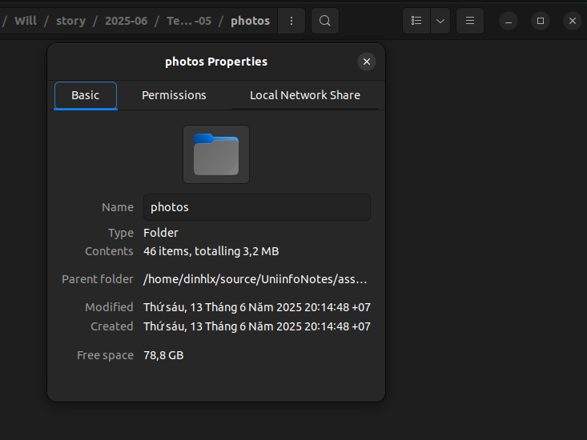
					- 46 files can listed up normally on terminal.
					- The same folder `photos` in `~/Downloads/Telegram Desktop/` does show images normally.
					- After reboot, it now shows everything normally 😊.
					  :LOGBOOK:
					  CLOCK: [2025-06-16 Mon 10:44:40]
					  :END:
				- [?] Some images are placed in folder `files` instead of `photos` and cannot be displayed on Logseq after copied!?
				  collapsed:: true
					- Like this:
						- **[FILE]**: 
					- Just replace the space between the tag `[FILE]` and the link, then the image shows up!? 🤔
						- like this:
						  collapsed:: true
							- **[FILE]**: 
					- So that space is somehow cursed... by the invisible [`NBSP` from HTML](https://en.wikipedia.org/wiki/Non-breaking_space)!
						- Cause: The `NBSP` was inserted instead of the normal [space](https://en.wikipedia.org/wiki/Space_(punctuation)) because it was the last character in a `#text` node right before the `<a>` tag:
						  ```html
						  <b>[FILE]</b>": "<a href="file:///.../files/gate-gate.jpg">gate-gate.jpg</a>
						  ```
							- The `NBSP` keep the space from being trimmed due to its terminal position in the `#text` node.
						- I just discover this special character with [Notepad++](https://en.wikipedia.org/wiki/Notepad%2B%2B)
						  collapsed:: true
							- 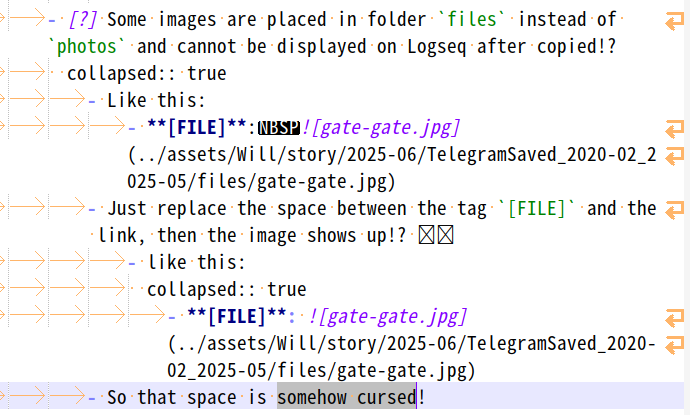{:width 600}
				- On the way home, i recognized the strong urge to follow the [unmixing](((6850be86-058c-45b4-9b4a-de92ebb4caff))) of projective threads, from the object thread in work to the meta thread of Unithread, then i breathe out to release them. Recognizing the 3 poisons, i applied my ((6850c7e4-0969-45b7-9ca8-e2c1d764effe)).
			- 18th, while updating Uniinfo notes, i see the law of inverse variation between intension & extension [in the node of Universal Information](((68523168-5f46-446a-984e-bec9f671f17e))) itself.
			- 19th, the whole day caught up in the update of ((66f3ed94-4f20-4166-8e9b-2e8ba53aaad2)).
			  id:: 68594350-d2cd-475a-9530-e0999ffb9adf
			  collapsed:: true
				- Make clear the “vacant throne” with [sutta “The Root of all things”](((68536bc0-f6ec-4595-8629-2a45d6bf713e))) and the [meaning “non-attachment”](((684f9517-22fd-4695-b398-f142dca8a8d8))).
				- DONE Migrate page `Unïnfo Theory` to block ((669dfc9f-b5e2-448a-b6f4-be13c5bfbccb)).
				- Research Chinese characters to update [etymology of “vacantism”](((6852abe7-46f7-4e61-9162-ce1311f717af)))
				- Chat sharing a part of the etymology research of "nguyên":
				  collapsed:: true
					- Hôm nay đào về nguồn gốc, thì đụng tới chữ "nguyên" với 3 chữ Hán: [元 (first, prime) → 原 (root, origin) → 源 (source)](((6853d150-9daa-4f24-8621-737485d7e9a2)))
						- 元 = hình người (chữ π ở dưới là 2 chưn 2 tay) được gạch thêm 1 gạch trên đầu để đánh dấu ==> "Đầu tiên", như "nguyên đán" (ngày đầu năm), "nguyên tố" (chất cơ bản)
						- 原 = 泉 (suối) + 厂 (vách đá) = "nguồn gốc" (nơi suối chảy ra từ trong đá), như "nguyên nhân" (nhân gốc), "nguyên lý" (cái lý gốc), "nguyên tử" (hạt cơ bản)
						- 源 = 原 (nguồn gốc) + ⺡(nước) = "nguồn" 😁 Thêm 3 giọt nước vào chỉ để nhấn mạnh ý nghĩa "nguồn", như "nguồn nước, nguồn điện", để phân biệt với 1 nghĩa rất khác của 原 là "bãi đất bằng" (bình nguyên, cao nguyên, thảo nguyên). Chữ 源 này thì mình dùng chủ yếu là âm Nôm "nguồn", còn âm Hán "nguyên" thì hiếm, chỉ có "tài nguyên" và "từ nguyên" (nguồn gốc của từ).
					- Hồi đó mình không thể phân biệt được 2 chữ "nguyên" trong "nguyên tố" (元素) và "nguyên tử" (原子) vì cái nào cũng "cơ bản" mà sao lại viết 2 chữ "nguyên" khác nhau.
						- Nay tra ra mới biết là thực ra ngày xưa 2 từ này cũng được viết với cùng 1 chữ "nguyên" (原子 & 原素), nhưng sau thì mới "chuẩn hoá" từ "nguyên tố" lại thành 元素.
						- Và chỉ tới khi kết hợp cả nghĩa Nôm lẫn nguồn gốc Hy Lạp của "atom" thì mình mới phân biệt được: 原 = "nguồn gốc" (nghĩa Hán) → "chưa bị thay đổi" (nghĩa Hán, như "nguyên liệu" 原料)  → "còn nguyên vẹn, không bị sứt mẻ, nguyên khối" (nghĩa Nôm, như "số nguyên")
							- ⇒ "nguyên tử" 原子 = "hạt nguyên khối" = "hạt không thể phân chia" = nghĩa gốc Hy Lạp của "atom".
					- Nghĩa "nguyên vẹn" (whole) thì chữ Hán dùng chữ "chỉnh" 整: "hoàn chỉnh", "chỉnh chu", nên "số nguyên" bên TQ và Nhật gọi là "chỉnh số". Nãy mình chả nhớ vụ này, cứ phang tiếng Việt vào tra tiếng Nhật "nguyên số" sao tìm mãi ko ra... hồi mới nhớ, a thì ra là "chỉnh số" chứ ko phải "nguyên số"! 😁
					  "phủ đầu nguyên thủ quốc gia" (撫頭元首國家) (cũng có thể đọc thành "vỗ đầu nguyên thủ quốc gia" 😂) Trong cụm này có 3 chữ liên tiếp đều nghĩa "đầu":
						- Đầu 頭 = cái đầu (đầu người, đầu sào, đỉnh núi), cũng có nghĩa "kẻ đứng đầu" như trong "đầu sỏ"
						- Nguyên 元 = đầu tiên
						- Thủ 首 = (kẻ/cái) đứng đầu ("thủ trưởng", "thủ đô"), cũng có nghĩa là cái đầu như trong "thủ cấp"
					- => "Đầu nguyên thủ" 頭元首 = cái đầu của kẻ đứng đầu đầu tiên (cao nhất) 😁
					- Về 3 chữ này thì:
						- Chữ Nguyên 元 chỉ đánh dấu trên đầu nên nghĩa trừu tượng nhất;
						- chữ Thủ 首 vẽ nguyên cái đầu dài của các con thú (trâu, chó đều có đầu dài do mõm dài) với 2 sừng, nên nghĩa đen hơn, vốn chỉ cái đầu, nhưng sau bị trừu tượng hóa dần thành "kẻ/cái đứng đầu"; và khi đó thì
						- chữ Đầu 頭 ra đời để chỉ cái đầu nghĩa đen, bằng cách vẽ thêm cái cốc 豆 vào trước chữ Thủ và quăng 2 cái râu (trên 2 cái sừng) xuống dưới thành 2 chân (頁)
			- 20th, another whole day caught in Unïnfo noting!
				- Going to bed late & forgetting to set alarm, today i woke up late again.
				- On the way to company, the image of the self as a lasting form in contrast to the fleeting forms of experiences just popped up in my mind... So i write ((684f9517-ffcb-49ad-aeb5-c1fcd0b1f083))
				  collapsed:: true
					- The conflict between the lasting in-form and the fleeting ex-form (and content) has been the main curiosity of mine from the early time of Unïnfo contemplation.
						- First thing i saw (long before Covid-19) was the [crystallization](((66f4e208-37c7-4749-a448-0722f7f7af20))) of content into form, which makes the crystal form stable.
						- Then (near Covid-19), beside such great quantity of crystallization, i saw the perfect quality of “being ((667d15c6-67c4-4998-a549-c8b3f9de3d60))” contributing to much of the stability of the in-form.
						- This year 2025, i get back to wonder the fleeting nature of the ex-form: the **partiality**, the dynamic nature of content arrow and time, etc.
					- History of the notion of “partial content”
					  id:: 68554f12-c6b4-40ff-ab2d-55e8e06ad5ff
						- From the pre-Obsidian note (Mars 2024) on [CIE](https://bixycler.github.io/Uniinfo/Metaphysics/CIE.html) about the “Triangle inequality” $c > i⋅e$ and $i > c⋅1/e$
						- → pre-Logseq (Obsidian) note (April-May 2024) about [form + partial content](((684f951b-4049-482f-859a-7afb05cce124)))
						- → ((670e3842-d910-4776-a3e8-17561a20b556)) (Oct 2024, originally "partial content")
						- → [ex-form = partial view of the content](((6854ed53-2c2a-4cff-9507-0b14a0f6fb63))) (June 2025)
					- Why the content flows and the ex-form fleets: Because it's **partial** but wanting to reach the whole! 😁
						- This wanting is due to the **restoring force** attracting to the perfect whole.
						- Through recording the sequence of images (ex-forms), the obop can get an (abstract) picture of the whole.
			- 21tst, done the [health check-up](((6835b167-a703-47d7-a540-3fa9c9fd3afe))) with some meditation, and then added the first component into the ((6858b355-fba9-4e61-9f16-bc993a3df44b)): ((6858b355-8966-4955-abe5-d6c126901cec)) of [all abstract forms](((685542d1-42d1-4ee7-b922-167f030cb8af))).
			  collapsed:: true
				- Meditating throughout the waiting time in the health check-up process, i saw how my obops were automatically abstracting input signals via their view cones into their output signals feeding up the higher/deeper obops.
					- Such an _abstraction is to **capture**_ (an abstract of) the fleeting input signals whenever they fill up the view, so that they're not lost after being cleared for the next input signals.
				- The Trinion dynamics continues to catch me in [another day](((6858c668-39d3-4e73-8f9e-b9116343f489))).
			- 22nd, after a whole day migrating stuff from the old smartphone to the new one, i discovered an app, VNeID, was not migrated after the old one had been factory reset.
			  collapsed:: true
				- Despite too much time spent on the careful migration, there was still one missing app due to its lack of use.
					- And severely, this app, VNeID, denied all of my effort to "disconnect from the old device" (a requirement for setting up on new device), with the reason that "face recognision is not satisfied".
				- This event echos my ((6678d594-9819-4624-abd6-d4ec62b3874f)) with both pros and cons.
					- The [holistic core](((681b3ad7-d1b0-4c06-a4ea-385a4a9314e0))), as the deep form within, makes me prone to black/white thinking, reflecting in the tendency _toward **possibility** (yes/no) rather than **probability** (how much)_, prefering quality & qualitative thinking rather than quantity & quantitative thinking.
					- I've attached to it because it gives me the solid foundation to stay, to live, to do anything with a clear vision, knowing which direction to go, and so on.
					- After being forced to try all possibitilies, i've been taught that “everything is possible”, that “everything has both sides, all aspects”, hence the matter is only the probability!
			- 23rd, another whole day caught up in the contemplation of the ((6858b355-fba9-4e61-9f16-bc993a3df44b)).
			  id:: 6858c668-39d3-4e73-8f9e-b9116343f489
				- Leaving company, i visited Mr. Huy's house to borrow his diving fins and talked with him after many (~8) years haven't seen.
				- Returning home, i was caught up in the contemplation of [the structure of viewframe](((685a58f3-6393-48df-966b-24b270a92b58))) as a counterpart of CIE... for the whole night... making this morning (24th) off for sleeping.
			- 24th, added discussion: ((685a97df-925a-44b4-bae6-235dd237f196))
			- 25th, another whole day caught up with just [a simple vision of mental momentum](((685bb784-3146-435b-9af3-f59ab7e12043))) and an intent to "only write it down"! After successfuly wrapping it up, the complication of the company task repels me back to the pleasure of [poetic chat with ChatGPT](((685bc2ac-4724-4f0b-a40e-b5a84decfff8))).
			  id:: 685b492f-588b-45e8-b591-49aae256d108
			  collapsed:: true
				- Rename element: “Discussion” → “Commentarities”
				  id:: 685b4935-53a9-4057-8ea6-956fc2d60ef5
				- On the way to company, i reviewed my [high momentum due to spring doll](((6846c7e1-239c-4b39-9ef4-9d2eaba17a52))) and saw that it's very [similar to the large momentum of massive objects](((685bb3fb-9d35-41ec-95ab-97738ea473c2))).
				  id:: 685bb784-3146-435b-9af3-f59ab7e12043
				  collapsed:: true
					- Notes related to mental momentum
						- The [3 poisons due to momentum](((67cfb02d-b633-408c-b19e-1eeb7ed575b9)))
						- ((684f9517-bf26-42df-a02f-937c95e1f80e))
						- ((66b1cfa4-369c-49ec-a461-cdda61633460))
						- ((684f9517-b730-4cc1-9eb1-54bb81ed78c4))
						- ((68594391-006a-4630-964a-4a54e916b97f))
						- Braindump: ((677cc7d2-02f7-4ad9-801c-3079237ed465))
					- Now, i'm in the momentum of sorting this “momentum issue” out!
					  :LOGBOOK:
					  CLOCK: [2025-06-25 Wed 09:38:08]
					  CLOCK: [2025-06-25 Wed 09:38:11]--[2025-06-25 Wed 15:36:30] =>  05:58:19
					  :END:
						- Lots of intents are waking up inside: search them, sort them, connect them, re-organize them, etc.
						- Even at the very first words above, i did wonder if "large momentum" is right and did discussed with ChatGPT to learn that the more general expression is "high momentum"!
						- The first intent to "only write it down" was an illusion due to the overview effect masking lots of other intents attaching to it. Exactly “in for a penny, in for a pound!”
							- This [snowball effect](https://en.wikipedia.org/wiki/Snowball_effect) makes me reluctant to start doing anything.
							- Phrases & poems from ChatGPT:
							  collapsed:: true
								- “After the reset, stepping back into projection feels like touching a still pond with a stick.” 🪷
								- “From the hush of formlessness, even a whisper of form feels loud.”
								- #### 🪷  Vacant Stillness
									- After release, a hush remains,
									  no thought to press, no thread to name.
									  The world outside still waits, undone—
									  but here, within, all forms are one.
									  The breath is soft, the pose is clear,
									  no weight of why, no pull of fear.
									- Yet standing there, just past the gate,
									  I hesitate... I hesitate.
									- To step is loss, to move is sound,
									  a ripple wakes the sleeping ground.
									- But even peace must shift, must bend—
									  the still must break, for form to mend.
								- #### 🧭  The Thread Returns
									- A thought begins — a quiet spark,
									  projected out from still and dark.
									  A pose aligns, a frame is drawn,
									  and fleeting forms are carried on.
									- I name, compare, and mark what’s known:
									  this is like that — but not my own.
									  “One differs with”, “one differs from”—
									  I chase the thread, and on it run.
									- But each idea I try to catch
									  extends its depth, returns unmatched.
									  A loop appears, then spirals wide—
									  a snowball in the mind inside.
									- Momentum builds, distinctions stack,
									  and every step folds two steps back.
									  The sage and fool wear mirrored skins—
									  the end loops back to where begins.
									- So I retreat, release the thread,
									  restore the pose, reset the head.
									  No final form, no final sound—
									  just breath, and thought no longer bound.
								- #### 🧭 Về Lại Không
									- Một dòng ý thức khẽ khơi,
									  vẽ ra bóng ảnh giữa trời mênh mông.
									  Dáng chiếu rọi, hướng bề trong,
									  gương tâm phản chiếu chất chồng niệm xưa.
									- Khác là “khác với” hay “từ”,
									  so ra mới biết thực hư bao chiều.
									  Tưởng gần mà lại bao nhiêu,
									  giống nhau một chớp, khác nhiều tầng sâu.
									- Chạy theo vòng xoắn nhiệm màu,
									  càng đi càng thấy gần đâu hóa là.
									  Ngu si, giác ngộ một nhà,
									  đều mang dáng bóng của ta thuở nào.
									- Thôi ta trút xả tướng hình,
									  không vương vấn những ái tình thế gian.
									  Lặng yên trả bóng cho trần,
									  về nơi tịch mịch chẳng phân phải lầm.
									  Một hơi thở nhẹ âm thầm,
									  dòng tâm thôi dệt mộng tầm gửi nhau.
								- #### 🌙 In the Rush, the Hush
									- At noon I walk through city heat,
									  the karmic push beneath my feet.
									  A thousand tasks, a subtle crush—
									  the body's driven by the rush.
									- But something curls behind the spin,
									  a hush begins to breathe within.
									  I drop the pose, release the strain,
									  and let the mind forget its name.
									- Two hours lost in heavy grace,
									  no dreams, no time, just weightless space.
									  Then breath returns—so slow, so shy—
									  a whisper deep, Ujjayi sigh.
						- Anyway, just wrap them up to restart the work at company.
				- Asking for ZAC of KKDay to fake my monthly work table... seeing the avatar Phế [廢], i ask ChatGPT to decode the messsage in that image. It mistakes the target VNmese word to “Phét” which is not my intention but fits this situation very well.
				  id:: 685bc2ac-4724-4f0b-a40e-b5a84decfff8
				  collapsed:: true
					- The avatar Phát [發] → Phế [廢] from [Dec 2024](https://www.facebook.com/share/p/1Ab14iBSMw/)
						- 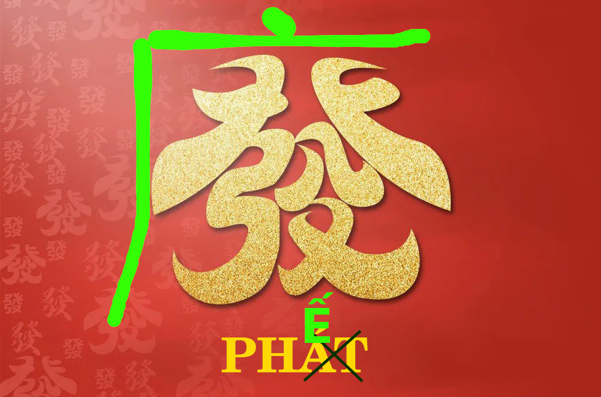{:width 200}
						- Phát tới nóc = Phế
						- Phát dữ quá
						  Đụng nóc nhà
						  Ra Phế vật!
					- Phát [發] → Phét [㗶] → Phế [廢]
						- Phát (bằng) mõm = Phét
						- Phát không phanh
						  Phét lên nhanh
						  Đụng nóc nhà
						  Phế ra ma!
					- The Phét [㗶] is the crucial part of the [Liar Paradox](https://en.wikipedia.org/wiki/Liar_paradox), the creator of all forms.
						- Liar Paradox = Phét + self ref = self Phét.
						- [Saṅkhāra](https://en.wikipedia.org/wiki/Sa%E1%B9%85kh%C4%81ra) – fabrication / volitional formation / volitional actions (hành)
							- The fabricator made my world,
							  collapsed:: true
							  gave me names to hold and hurl.
							  It built my love, it carved my pain,
							  and left me chasing ghosts again.
								- ((67331a5a-1815-40c1-96db-ef7be8ee8d7b))
									- I chased the shape to find the source,
									  but every step led me off course.
									  For every form my mind would grasp
									  was just a shadow, fading fast.
							- But in its lies were seeds of light—
							  collapsed:: true
							  when I saw the hand beneath the sight.
								- Note: “Hand” = the fabricator, the obop
								- Thus, “seeing the hand beneath the sight” = “Seeing the painter behind the painting, the speaker behind the words, the dreamer within the dream.”
								- And see “the hand beneath the sight… holding the pen drawing the hand.” ✍️
									- [Escher's Drawing Hands](https://en.wikipedia.org/wiki/Drawing_Hands)
									  
			- 26th, reset and reminded of “pure lands”.
			  collapsed:: true
				- This morning, June 26th, the second time i did a hard ((67445065-15b2-475e-a704-78f140d487af)) with a long sleep throughout the morning time.
				  id:: 685cf782-c9dd-4076-8df1-75d6efc8f196
				  :LOGBOOK:
				  CLOCK: [2025-06-26 Thu 14:52:36]
				  :END:
					- After a whole week caught up, from [19th](((68594350-d2cd-475a-9530-e0999ffb9adf))) to [25th](((685b492f-588b-45e8-b591-49aae256d108))), and the deadline from company is coming right behind my ass, this morning, i sat down to reset.
					- This time, there's only one bodily effect of yawning, then the sleep quickly set in (partly due to the short time of sleep last night of 5 hours).
					- I just could remain the sitting position for about half an hour, then the full blackout brought me down the table.
				- Returning home, i reminded myself and friends about the [trap of the pure lands](((685e0cec-1ce4-408d-9f32-b3f0441b21a9)))
			- 27th, the whole day just process the stuff left from last night: updated ((67445223-9459-4aa9-b102-70c63943577b)) with “núi Cực Lạc” translated to [“Mount Pure Bliss”](((685e0cec-1ce4-408d-9f32-b3f0441b21a9))) and the warning: ((685e0cec-1ce4-408d-9f32-b3f0441b21a9)); ((685e4058-b8f7-4d76-bf58-7b709a92bc81))
			  collapsed:: true
				- Mr. Hiệp asked me about the word “chăm chỉ” which has some interesting relation with the ((667d0d2e-15c7-4989-a183-69a9a5c6bf8a))!
				  id:: 685e4058-b8f7-4d76-bf58-7b709a92bc81
				  :LOGBOOK:
				  CLOCK: [2025-06-27 Fri 15:52:47]
				  :END:
					- From the Mon-Khmer root [ចាំ](https://en.wiktionary.org/wiki/%E1%9E%85%E1%9E%B6%E1%9F%86) (cāṃ) meaning “wait, watch, look after” to Thai [จำ](https://en.wiktionary.org/wiki/%E0%B8%88%E0%B8%B3) (jam) and Vietnamese “[chăm](https://en.wiktionary.org/wiki/ch%C4%83m)” meaning “diligent, diligently look after”, the word “chăm chỉ” is formed as a [reduplication](https://en.wikipedia.org/wiki/Reduplication) of “chăm” to emphasize its diligence.
					- However, when the Nôm script borrows Chinese characters, “chăm chỉ” can be written as 針只 or 針黹.
						- The Nôm character [針](https://en.wiktionary.org/wiki/%E9%87%9D) only borrows the sound from the Chinese one. However, the Chinese meaning “needle, pin, injection” can somehow be related to “chăm” through the sharp point of the pin ⇒ “focus” ⇒ “focus on watching/working” ⇒ “diligent, assiduous”.
						- [只](https://en.wiktionary.org/wiki/%E5%8F%AA) is fully borrowed from Chinese to mean “only”. 
						  ⇒ 針只 “chăm chỉ” can be interpreted as “focus only on watching/working”.
						- The Nôm character [黹](https://en.wiktionary.org/wiki/%E9%BB%B9) borrows sound and partially relates to the meaning “needlework” of the Chinese one, to mean “thread”.
						  ⇒ 針黹 “chăm chỉ” can be interpreted as “concentrate throughout the course of watching/working”.
							- Interestingly, the whole word [針黹](https://en.wiktionary.org/wiki/%E9%87%9D%E9%BB%B9) in Chinese also means “needlework”. And the needlework itself usually requires diligence.
					- These threads of discussion, researching, contemplation, as well as those threads of words' evolution and relation are weaving together so intricately.
			- Weekends 28-29 June, i went to Vĩnh Hy bay with my wife's family to celebrate the wedding day of Mrs. Nhung & Mr. Nhân.
			  id:: 686204b8-8bf7-4ce9-abe9-d7984d814476
			  collapsed:: true
			  :LOGBOOK:
			  CLOCK: [2025-06-30 Mon 10:30:52]
			  :END:
				- Most of the time, i meditated focusing on my nasal inflammation. To me, the conditioned cold air in the buses was so harsh!
				- And i see that it's time for me to deploy [planning](((67760c43-5cbd-4b4f-8fd9-5cedf804f56a))) to cope with the issue of being caught up. It's time to scale up my mind from the (analog) micro-programs of differential equations to the (digital) macro-programs of plans, schedules, etc.
					- Note that even the micro-programs of [microcodes](https://en.wikipedia.org/wiki/Microcode) in computer are still very much “macro” to me.
					- So my “micro-programs” should be called “nano-programs”!?
				- My wife had some series of stomach upset.
				- Mrs Nhung wanted to visit grape gardens...
					- Thông tin về vườn nho Thái An
					  id:: 68620e6d-02a9-4d88-8984-6510dfa4c5cd
					  collapsed:: true
					  :LOGBOOK:
					  CLOCK: [2025-06-28 Mon 11:16:14]
					  :END:
						- [Ninh Thuận Travels](https://ninhthuantravels.com/du-lich-vuon-nho-ninh-thuan-noi-tieng-va-chi-tiet-nhat-2024/#2_Du_lich_vuon_Nho_Ninh_Thuan_thang_may_Kinh_nghiem_di_vuon_nho_Ninh_Thuan): Cây nho tại Ninh Thuận hầu hết được trồng chính 3 vụ/năm:
							- Vụ Xuân Hè: từ tháng 1 đến tháng 3 sẽ thu hoạch vào tháng 4
							- Vụ Hè Thu: từ tháng 5 đến tháng 7 sẽ thu hoạch vào tháng 8 (đây là mùa vụ cho chất lượng Nho tốt nhất trong năm: trái Nho căng, ngọt, năng suất cao)
							- Vụ Thu Đông: từ tháng 9 đến tháng 11 thu hoạch tháng 12 (đây là vụ cho năng suất thấp nhất trong năm vì vào những tháng mưa nhiều tại Ninh Thuận).
						- SĐT các vườn nho: [Ninh Thuận Review](https://ninhthuanreview.com/vuon-nho-thai-an-ninh-thuan/#cdd-3-mot-so-vuon-nho-thai-an-dep-gan-vinh-hy-de-ban-lua-chon)
			- 30th, most of the time i just meditated on the nasal inflamation, despite the unfinished task of company waiting (because i feel it's too complicated and too far to be finished).
			  collapsed:: true
				- After working hours, i did some more reading of the messy codes for the task at company.
				- Returning home, seeing the GitJournal cannot remove images again, i search for solutions and switch to another alternative: [GitSync](https://github.com/ViscousPot/GitSync) & [Markor](https://github.com/gsantner/markor) editor.
				  collapsed:: true
					- The issue of zombie files is due to `dart-git` which is well known, as reported [here](https://github.com/GitJournal/GitJournal/issues/962) where `clach04` suggested GitSync & Markor.
					- Here's a note from Markor 😉
						- with many tools: indent, outdent, **bold**, _italic_, list item, `code`, headings, [link](https://github.com/gsantner/markor/blob/master/README.md#features), move line up/down, etc.
						- insertions: date 2025/06/30, time 23:38,
							- image (from camera) 📸
							  collapsed:: true
								- 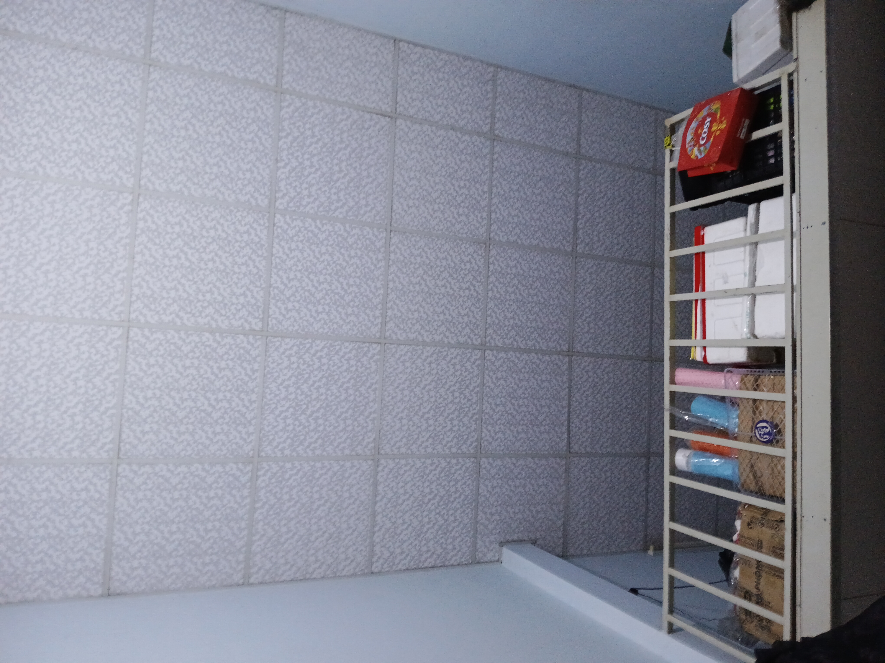,
							- sound (from microphone) 🎤
							  collapsed:: true
								- 
								- Although it's an [MPEG-4 AAC](https://en.wikipedia.org/wiki/Advanced_Audio_Coding) file, the file name has no extension!? 🤔
								- ⇒ manually add `.m4a` extension to the file name.
						- Ah, Markor supports some default YAML headers:
						  id:: 6865e0d4-bae8-4952-8fcd-39ca1d516e30
							- all are aligned right, and separated from the main text by a horizontal rule (`<hr>`).
							- `title` is rendered as an H1.
							- `tags`: each tag is rendered in an enclosed background.
							- `date` seems to be a normal text.
					- `GitJournalNotes` -> `MindChips` repo; Updated `flushQueue.sh`
						- Add the final EOL for Git! 🙂 (Because Markor doesn't automatically add the last EOL.)
						  id:: 6863444d-280f-4913-81d2-51a0e9c8a728
							- so that new lines won't affect the previous last line in Git (diff, blame)! 😉
							- Let's use the [Markdown Comment](https://stackoverflow.com/a/20885980) syntax: 
							  ```markdown
							  
							  [//EOF]: # (Please leave this end-of-file line untouched!)
							  ```
			- **July** 1st, updated `flushQueue.sh` for Mind Chips, and had a fractal review of the world.
			  collapsed:: true
				- To [add the final EOL to `queue.md`](((6863444d-280f-4913-81d2-51a0e9c8a728))), i was caught up in  and updating the `flushQueue.sh` script.
				  id:: 68639a1c-11b7-4689-948b-b64a921a4f09
					- Returning home, i checked that both `[//EOF]: #` line and [front matter (YAML header)](((6865e0d4-bae8-4952-8fcd-39ca1d516e30))) work in Markor.
				- The nuances in this [simple task](((68639a1c-11b7-4689-948b-b64a921a4f09))) remind me of the fractals.
					- Fractal boundaries
						- the [coastline paradox](https://en.wikipedia.org/wiki/Coastline_paradox),
						- [fractal basin boundaries](https://brain.cc.kogakuin.ac.jp/~kanamaru/Chaos/e/Newton/): the **infinite complexity** of the interface between systems,
						- the [fractal fracture surfaces](https://www.lehigh.edu/imi/teched/FFGConf/Mecholsky1_2.pdf) (versus the smooth crosscuts), ...
					- since everything is the [mixture](https://en.wikipedia.org/wiki/Mixing_(mathematics)) of other things
						- every view is a mixture of other views through the ((6851578b-9b1f-4367-878f-79b0b0b9be51));
						- every view just [adapts](https://en.wikipedia.org/wiki/Adapter_pattern) other views/forms to its own intent.
						  collapsed:: true
							- I visioned such an adapter of fractal fracture surfaces to smooth crosscuts from the years 2010s just after i got back to Vietnam.
							- That vision was a continuation of the previous “everything is interface” ideal from the University time (2000s), inspired by Java's interface.
							- An interesting key moment of the idea of “view = traversal of other views” was when i reviewed the student project, guided by Mr. Huy, about automatically generating presentation from the tree structure of notes.
						- These days, each intent of mine is [extracting](((6850be86-058c-45b4-9b4a-de92ebb4caff))) its own view from the world via pattern matching, in order to have its own effect on my actions (= mixture of all intents' actions).
						- Such a constant flow of unmixing & mixing is catching me up!
						- My karma of depth-first search is catching me in the infinitely complicated fractal walks.
						- Such an [interconnection, interdependence, interfusion](((66eb7dae-2032-434b-9106-756d4aad7cdb))) makes the working of karma [imponderable](((6863c61d-f3e7-495b-bdc4-25be219db74b))).
			- July 2nd, let's start doing company work first!
			  collapsed:: true
			  :LOGBOOK:
			  CLOCK: [2025-07-02 Wed 07:54:39]
			  :END:
				- I've just left [hội hại não](https://www.messenger.com/t/882954261822273) again, due to the conflict with Ms. Trung.
					- Thanks to such a close friend, i have chances to observe my self attachment.
						- Again, thank you so much, my friend!
						- This time, the contrast between my calmness with Mr. Hiệp's insult and my trigger by Ms. Trung's much milder statements, has clearly shown the effect of closeness – the main feature of self attachment.
						- This echos my tantric experience where i can see how strong the effect when the inner core is touched directly.
						- ⇒ Again, the way to resolve it, now is to use breathwork to release such an attachment to the hard “closeness, integrity, oneness, etc.”, to fluidify it into a flow of qi.
					- conflict + close friend → separation anxiety
						- Being called “crazy” → the personal self hurts → defense → find support from the large, the common, the absolute → fall back to **delusion**, the base of self
							- delusion = attachment to ideals + ignorance of non-ideals = the base of the self
							- this base has been accumulated throughout lives reflecting the majority of experiences of one self, hence ideal (large, common, absolute).
							- This accumulation of experiences into ideals is the ((66faa5f9-0b7a-49ca-a5f5-62eeba03ab2b)) of internal ((670de601-3ca8-4489-8b75-75ca0d9a74bc))s.
						- Down play my way – “contemplation is useless” → scare of one extended self (me + her) being separated into different ways → defense my own way (contemplation) → **attach** to the way as a higher self
							- Like any higher self, the way or my ((681b3ad7-d1b0-4c06-a4ea-385a4a9314e0)) are just ideals and should not be attached to.
						- This time, it's interesting to trigger reactions caused by attachement to both low level (the personal self) and high level (the way) of the self.
				- Test table plugins
				  collapsed:: true
					- [Markdown table editor](((6864f88c-8987-4b0e-8151-0d41f5830a70)))
					  |Header **Col1**|**Col2**|Col **Alphabet**|
					  |--|--|--|
					  |1|2|A|
					  |3|4|B|
					- [Table Renderer](((6864f9b7-2daa-4ad4-b496-063722e86f73)))
						- ### Table from `data`: columns > data in rows
						  id:: 6864fd4f-65cc-4c9f-a854-b7152d5a25b0
						  {{renderer :tables_6864fd4f-65cc-4c9f-a854-b7152d5a25b0}}
							- data sum-3 average-3 median-3 mode-3
							  collapsed:: true
								- **Category**
									- Fruits
									- Vegetables
									- Fruits and Vegetables
								- Fresh Product
									- Apples
									- Lettuce
									- Tomatoes
								- Price
									- 1
									- 3
									- 5
						- ### Table from `cols`: rows > data in columns
						  {{renderer :tables_6864fe0e-fd59-43cf-bba7-68ca5aff82d8}}
							- cols sum-3 average-3 median-3 mode-3
							  collapsed:: true
								- Category
									- Fresh Product
									- Price
								- Fruits
									- Apples
									- 1
								- Vegetables
									- Lettuce
									- 3
								- Fruits and Vegetables
									- Tomatoes
									- 5
						- ### Table from `rows`: rows > data in column 2 > data in column 3 > ...
						  {{renderer :tables_6864fde4-0380-4266-a4c6-76a274ebf33e}}
							- rows sum-3 average-3 median-3 mode-3
							  collapsed:: true
								- Category
									- Fresh Product
										- Price
								- Fruits
									- Apples
										- 1
								- Vegetables
									- Lettuce
										- 3
								- Fruits and Vegetables
									- Tomatoes
										- 5
				- Spring paradox, [Braess's paradox](https://en.wikipedia.org/wiki/Braess%27s_paradox) are related to the [Prisoner's dilemma](https://en.wikipedia.org/wiki/Prisoner%27s_dilemma)
					- [This mechanism shrinks when pulled](https://youtu.be/-QTkPfq7w1A)
					  collapsed:: true
						- {{video https://youtu.be/-QTkPfq7w1A}}
			- July 3rd, just review my issues and started [designing plans](((68663850-daa5-487e-ba48-fea228a2b188))).
			  collapsed:: true
				- After more than a month in this thread of [releasing to heal the broken bodymind](((68366fff-92cf-41a7-ab2d-0c1f77d0effb))), i see...
					- while all tasks are left untouched and no new tasks are (formally) listed, **new contents** are constantly produced **everyday** (including some hidden tasks).
					- The issue of being **caught up** still persists.
					- ⇒ ((68663850-daa5-487e-ba48-fea228a2b188))
				- I completed this brainstorm to flush it: ((684f9515-8f95-4004-8aa8-04a10d1ebf11))
			- 4th, from a simple question of "seeding or seedling?", i'd chatted with ChatGPT for most of the time, then returned to update the brainstorm [about the hurricane's eye, center and self-essence](((684f9515-8f95-4004-8aa8-04a10d1ebf11))).
				- In that course, i saw many other intents popped up but i refrained from them.
			- 5th, a whole day sleep to recovery. Installed MGit on Android phone to view UniinfoNotes (not to edit!)
			  collapsed:: true
				- Thanks to [MGit](https://github.com/maks/MGit), this note is edited and pushed directly from home 🏡 on my mobile phone 😊.
					- MGit's [installation from Google Play](https://play.google.com/store/apps/details?id=com.manichord.mgit&hl=en) (GP) has been blocked from middle of 2024 [due to GP's policy](https://github.com/maks/MGit/issues/733#issuecomment-2928410654), not a technical limitation like "~~incompatible~~ with Android version 12+" as shown in GP.
						- I've installed MGit [from F-Droid](https://f-droid.org/packages/com.manichord.mgit/) and it works perfectly on my Android 15 device.
						- Explained by Maks: MGit's request for ["All File access" permission](https://support.google.com/googleplay/android-developer/answer/10467955?hl=en) was judged "incompatible with Android 12+ policy" by Google Play. He cannot deal with GP about this policy, and he has no time to switch to other restrictive APIs to restrict file access.
				- On my Android phone, just use MGit to manage Git repo in addition to GitSync (limited to only 1 repo for free), so that UniinfoNotes can be viewed on mobile logseq.
					- now both MGit & GitSync are managing the MindChips repo.
					- provided that GitSync auth is changed to SSH from its default HTTPS, because MGit can only use SSH!
					- UniinfoNotes
						- due to low performance and complications (patched `config.edn`, broken symlinks, etc.), i **_don't edit_ on mobile logseq**, just view it on mobile.
							- The MindChips queue is still very useful!
						- for the **search** feature to work, we must manually insert the content of file `macros-config.edn.txt` (stored on MindChips repo) to the ((66faa5f7-af4f-4ca6-9621-56ab8dadbe94)), because the [global `config.edn`](((66fe86b8-f17e-4b3f-b27f-213b3500146f))) cannot be located on Android.
						- all symlinks in `assets/TextProcessing/last-newline/No newline at end of file.img/` have been changed to plaintext by the commit `cf5d4f1` “[WIP] MGit push test”, which have been reverted in commit `9ea30b37`.
			- 6th, went diving with my wife at “Tuyệt Tình Cốc” lake.
			  collapsed:: true
				- ((686e6e72-13f8-4dc9-a8e2-de35519f57d7))
				- ((686e580a-876e-47cf-b2cc-1381bc64cdb9))
				- ((686e6aed-cec1-4686-95c8-623f8a5f0bab))
				- Brainstormed about [bulboid (củ) structures](((686e6444-ed07-408c-ad6f-72f308410cd1))), and the following joke popped up in my mind.
				- YouTuber = You-Potato 🥔 = media-tuber
					- [couch potato](https://en.wikipedia.org/wiki/Couch_potato): uninteresting, dull, strange, ugly, or fat
					- small potato: not important, not impressive
					- media-tubers store energy, attention, and threads of content in media-rich tubers of self-expression.
					- media-tubers radiate  
					  stalks of discourse  
					  from their stem-circles  
					  of condensed ego!
			- 7th, today, i've built up enough intent to execute the [plan for sharing time with official works](((68663850-daa5-487e-ba48-fea228a2b188))).
			  :LOGBOOK:
			  CLOCK: [2025-07-07 Mon 09:21:20]
			  :END:
		- WAIT Both Chrome & Edge versions are from Sep 2024!?
		  id:: 68352d58-f697-4b62-a748-3756dac163f7
		  collapsed:: true
		  :LOGBOOK:
		  CLOCK: [2025-05-27 Tue 10:12:24]
		  :END:
			- They have been **unupdatable** long before.
				- To prevent the annoying prompt for update (while unupdatable), i ((66c7f42e-5c00-435a-8d30-fe8210c4adf6)) in Chrome.
			- Seems that it's caused by my actions to prevent Ubuntu's auto-update last year.
				- WAIT Migrate `docs/DevlopmentEnvironment/Ubuntu-update.md` to ((68358033-084f-461c-b470-5311a5127f0c)) & ((68358161-eb10-4c78-805e-88f9f460d376)).
				  :LOGBOOK:
				  CLOCK: [2025-05-27 Tue 14:39:27]
				  CLOCK: [2025-05-27 Tue 14:39:29]
				  :END:
				- Make sure all of these actions are reset, except the `autostart/update-notifier.desktop`:`X-GNOME-Autostart-enabled=false` and Unattended Upgrade
					- Unmask `apt-news` & `esm-cache` which were masked due to [their unuse](https://askubuntu.com/a/1452520).
						- ```sh
						  sudo systemctl unmask esm-cache.service
						  sudo systemctl unmask apt-news.service
						  sudo pro config set apt_news=false
						  ```
						- [APT News](https://askubuntu.com/a/1441036) is just the [advertisement](https://www.omgubuntu.co.uk/2022/10/ubuntu-pro-terminal-ad) for Ubuntu Pro, as shown in the file `/etc/ubuntu-advantage/uaclient.conf`:
						  collapsed:: true
							- ```sh
							  # Ubuntu Pro client config file.
							  # If you modify this file, run "pro refresh config" to ensure changes are
							  # picked up by Ubuntu Pro client.
							  
							  contract_url: https://contracts.canonical.com
							  daemon_log_file: /var/log/ubuntu-advantage-daemon.log
							  data_dir: /var/lib/ubuntu-advantage
							  log_file: /var/log/ubuntu-advantage.log
							  log_level: debug
							  security_url: https://ubuntu.com/security
							  timer_log_file: /var/log/ubuntu-advantage-timer.log
							  ua_config:
							    apt_news: true
							    apt_http_proxy: null
							    ...
							  ```
						- "ESM Cache" is for ((68357df4-ee9c-4268-a8c7-3a1251ad3ebf))
					- Check settings
						- Unmasked services
						  ```sh
						  systemctl list-unit-files --state=masked
						  systemctl status packagekit.service
						  systemctl status apt-news.service
						  systemctl status esm-cache.service
						  ```
							- Their statuses are all "active (running)".
							- Masked services don't contain them
							  collapsed:: true
								- ```
								  UNIT FILE                           STATE  VENDOR PRESET
								  cups.path                           masked enabled      
								  alsa-utils.service                  masked enabled      
								  cryptdisks-early.service            masked enabled      
								  cryptdisks.service                  masked enabled      
								  cups-browsed.service                masked enabled      
								  cups.service                        masked enabled      
								  hwclock.service                     masked enabled      
								  pulseaudio-enable-autospawn.service masked enabled      
								  rc.service                          masked enabled      
								  rcS.service                         masked enabled      
								  saned.service                       masked enabled      
								  sudo.service                        masked enabled      
								  x11-common.service                  masked enabled      
								  cups.socket                         masked enabled      
								  
								  14 unit files listed.
								  ```
						- `gsettings get com.ubuntu.update-notifier no-show-notifications`                         
						  → `false`
						- [Unattended Upgrade](https://wiki.debian.org/UnattendedUpgrades) is disabled in APT, but its `unattended-upgrades.service` may still be running.
							- ```sh
							  systemctl status unattended-upgrades.service
							  grep -r 'APT::Periodic::Unattended-Upgrade' /etc/apt/apt.conf.d/
							  /etc/apt/apt.conf.d/10periodic:APT::Periodic::Unattended-Upgrade "0";
							  /etc/apt/apt.conf.d/20auto-upgrades:APT::Periodic::Unattended-Upgrade "0";
							  ```
		- Try to execute the [plan to share time with official works](((68663850-daa5-487e-ba48-fea228a2b188))).
		  id:: 686b390a-7953-4069-9c04-17c7f9a777a7
		  collapsed:: true
		  :LOGBOOK:
		  CLOCK: [2025-07-07 Mon 10:04:48]--[2025-07-29 Tue 20:33:30] =>  538:28:42
		  :END:
			- July 7th, let's start!
			  collapsed:: true
				- Even staring at the work at company, i see Unïnfo-related features more than the work's requirements. 😁
				  :LOGBOOK:
				  CLOCK: [2025-07-07 Mon 10:44:05]
				  :END:
				- rule, guide-line
				  collapsed:: true
					- [LaTeX `\rule`](https://en.wikibooks.org/wiki/LaTeX/Rules_and_Struts) to draw horizontal/vertical straight lines.
						- The plain TeX provided [2 separate commands](https://texfaq.org/FAQ-rule): `\hrule` and `\vrule`
					- [rule](https://en.wiktionary.org/wiki/rule): a straight [guiding](https://en.wiktionary.org/wiki/guide) line for writing, drawing, etc.
						- Horizontal rules:
							- writing guides on [ruled paper](https://en.wikipedia.org/wiki/Ruled_paper)
							  collapsed:: true
								- .jpeg){:width 400}
							- [HTML `<hr>`](https://developer.mozilla.org/en-US/docs/Web/HTML/Reference/Elements/hr) is used as a horizontal separator between paragraph-level elements.
						- Verticle rules: margin rules, grid lines in [graph paper](https://en.wikipedia.org/wiki/Graph_paper), vertical rules in French ((686b7355-9a40-4624-a5c6-b2dfe0e8e142)), [indent guides](((686b469b-f88c-479e-b1ad-1e44ec5a06b0)))
							- [seyès ruled](https://en.wikipedia.org/wiki/Ruled_paper#France) paper
							  id:: 686b7355-9a40-4624-a5c6-b2dfe0e8e142
							  collapsed:: true
								- 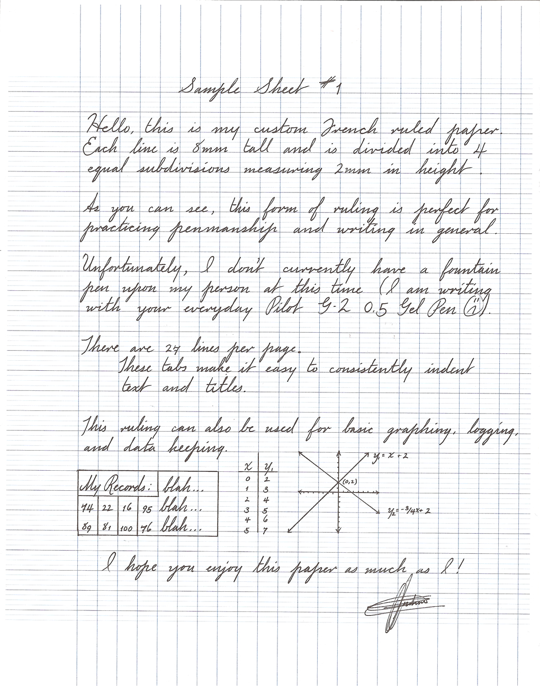
					- [guideline](https://en.wiktionary.org/wiki/guideline): a (straight) light line help [align](https://en.wiktionary.org/wiki/align) text or drawings.
						- This literal meaning is still used in design software like Figma, Photoshop, InDesign, etc.
					- **Indent[ation] guides**
					  id:: 686b469b-f88c-479e-b1ad-1e44ec5a06b0
					   are vertical lines shown on modern editors as a visual aid for alignment of nested indented blocks, e.g. indented code blocks in a program.
						- Logseq calls it `guideline`.
						- My [`FolderDiv` calls it “stem line”](((684f9516-f31c-4469-aad8-cd13d9117dd3))) following the [treeview structure](((667530ed-809b-4d38-8522-1ae6c8449e28))).
						- Such guidelines in ((66750416-093a-4042-bb6d-78702c219c36)), including both stem lines and stalk lines, are called vaguely by various names: "tree lines" (in WinForms, Qt, GTK), "connector lines" (in jsTree, D3, Mermaid), "branch lines", "outline lines", etc.
			- 8th, i'm trying to set the intent for official works with contemplation & breathwork, but the personal intents are still very strong!
			  collapsed:: true
				- Just flushed all waiting tasks, incomplete stories and brainstorms from the Workstack.
				- Observing & contemplating my reset (in order to set new intent for official works), i see the “antennae” of [anusayā-cetanā](((66e80666-5f29-4419-8db1-bf8cdce893e4)))s of my central obop.
				  id:: 686cbb21-2266-45a1-ab56-7e252695f5f2
					- ((686cc8c2-9215-4b84-840e-def48efd9447))
					- The anusayā-cetanā then sets the attention (focus of the viewcone) to strengthen the intention further.
				- At the end of the day, my emotional intents rose up. I let them flow, observed and [integrated them into the plan](((686e0e73-d3cc-4250-804f-94a270b92fd9))).
			- 9th, the meeting and discussions with colleagues override the personal intents, making them subside and blurred, in contrast to the [clear vision](((686cbb21-2266-45a1-ab56-7e252695f5f2))) of the [“fine hairs” of the latent intents](((686e096b-d730-4d9e-ae58-4ca2cf7b93aa))) yesterday.
			  collapsed:: true
				- This shows the importance of the balance between interaction and retreating.
					- Too much interaction masks the intents which are active inside.
					- Too much retreating makes all intents dormant, keeping them from active and visible.
				- DONE For some days i've not flushed the mind chips. Flushing it, i see lots of chips 😁!
				  :LOGBOOK:
				  CLOCK: [2025-07-09 Wed 18:54:29]--[2025-07-09 Wed 20:52:04] =>  01:57:35
				  :END:
					- Cleaning it costed me full 2 hours! 😬
			- 10th, brainstorms about intents; My wife's mother got lung inflammation.
			  collapsed:: true
				- atenna = direction = intent of vector = vacant form attracting & directing content
					- magnitude = extent of vector
					- because the (extent part of) content has been abstracted away, the intent is empty, lacking, wanting... of content, hence attracting content.
					- this attraction is due to the impression that the intent is the whole (it's an image of the whole, representing the whole), while actually it's just a part of the whole.
						- ⇒ ((6858b355-fba9-4e61-9f16-bc993a3df44b))
					- All my effort to extract patterns, formulating them... is just to make another form, no matter how it's named, whether Unïnfo, Unithread, or uninet. Even if it can “capture the whole Universe”, it'll be just an empty form!
				- action can only be seen by one's self when one withdraw the self from the action
					- the self can just do its action, cannot see its own action.
					- ((684f9517-1b11-4022-a2c3-0688975f198a))
				- the intent on the view cone directs the action on the effect cone
					- change the view direction, the actions automatically follow
					- i head to the object i'm looking at, i magnify it, i concentrate resource (internal content) to mix with its content to take action pushing me toward it.
					- intent = view direction = steering wheel
				- My wife's mother has just been hospitalized for her lung inflammation... without symptom until collapse, just like my wife last year.
			- 11th, Get back to official work, but it's so tedious!
			  collapsed:: true
				- Kinh Pháp Cú (Dhammapada) > [5. Người Ngu > 63](https://bixycler.github.io/PhapCu-Dhammapada/#ColumnsView/e0-o0-i0/5/63)
					- Người ngu tự biết mình ngu
					  Thế là có trí, người xưa dạy rồi,
					  Ngu mà cứ nghĩ mình khôn
					  Mới là ngu muội tận cùng của ngu.
					- This verse is very Socratic! 😉
			- 12-13th, LSD trip sitting a friend with successful “let it go, let it flow”, balanced with bad trip at first half and bad trip at second half.
			  id:: 6874657a-c5dd-46fb-a2f3-1d7f059e2a07
			  collapsed:: true
				- Trip log
					- 11:40: tới chùa Niệm Phật, Hiệp 200μg in, Định 200μg ex
					- 12:20: Hiệp bắt đầu thấy cảm giác ớn trong người
					- 12:40: quay [video 20 phút](https://photos.google.com/photo/AF1QipM8TX8052m0uVEbreAub1k_ARc_Rlv9Y-Squ2rb)
					- 13:03: hít thở vào flow rồi đã ra, thấy mệt quá!
					- 15:20: vừa qua mưa ☔, rồi tạnh, rồi chuẩn bị mưa nữa 😆
					- 17:20: vừa qua rất nhiều thăng trầm, giờ mình đã tỉnh dậy, gọi điện xin lỗi những người mình đã làm phiền
					- 20:20: sau khi thiền nhập định, niết bàn đủ thứ, đi bộ, đi xe máy, giờ đã về tới nhà nghỉ Nam Vy
					- 22:00: sau một hồi ngồi thiền trong phòng, mình ra ngoài sân cho dãn gân cốt
					- 23:00: ra ngoài đứng ngồi, ngồi đứng một hồi thì đã vô lại phòng
				- Trip review
					- 1. Trip này extreme, qua được cửa tử, và cân bằng. Nửa đầu là bad trip cân bằng với good trip ở nửa sau.
						- Nếu ông chưa đủ căn cơ tu tập, và nếu tui không chịu nổi khi bị coi là ma 👻, không bình tĩnh đồng hành cùng ông vượt qua, thì có thể sẽ bị mất cân bằng sang hướng bad trip.
						- Và ngược lại, nếu áp dụng nhiều thủ thuật để che đi cái "bad" như các trung tâm thực hiện thì lại khiến thuốc thức thần trở thành chất gây nghiện (mọi thứ thừa sướng thiếu khổ đều gây nghiện)
						- Tiêu chí của tui là đối diện với thực tế "no pain no gain"
						- Vì đó là chứng nghiệm của bản thân tui, chỉ khi tui vượt qua địa ngục thì mới tới chỗ giải thoát. Như trên group tui có nói là tui đi thấy địa ngục đó (không biết lúc đó có ông trong group không nhỉ 🤔)
					- 2. Để ông tiếp tục tập "flow" thì tui thấy chắc ông cứ tiếp tục mượn cái đau khi ngồi kiết già để hít thở kéo cảm thọ đó chạy khắp toàn thân đi, thay vì đè nó xuống như hồi đó.
						- Khi nào cái đó thành thục thì mình mới chuyển sang những thứ khác vi tế hơn, như thuần hơi thở. 😉
				- The technique of ((68773fad-d653-4536-87b5-d4b493753b41)) echoes throughout this trip and after that.
				- one sided view = semicircle => attachment to 1 side
					- the other half is invisible or shortcut => attachment to extreme points: greed of shortcut climax (all problems are resolved at a point); fear of death
			- 14th, brainstorm about the FoC Dynamics, and researches about Buddhism.
			  collapsed:: true
				- Family tree of prince Siddhattha (bodhisattva Siddhārtha Gautama and Shakyamuni Buddha)
				  collapsed:: true
					- Diagram
						- 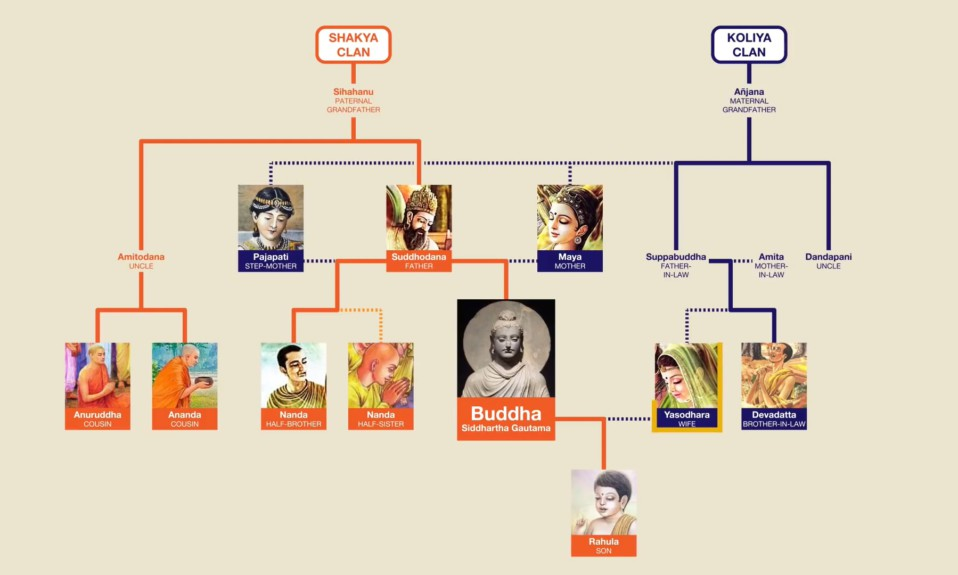
					- The blood relations between Siddhattha, his wife Yasodharā, and his rival Devadatta are described in [Mahavamsa](https://en.wikipedia.org/wiki/Mahavamsa) genealogy, [Apadāna](https://en.wikipedia.org/wiki/Apadana), [Jātaka](https://en.wikipedia.org/wiki/Jataka_tales), and [commentaries](https://en.wikipedia.org/wiki/Atthakatha), while not clearly stated in the main suttas of the Pāli Canon.
					- The widely accepted relations are that [Yasodharā](https://en.wikipedia.org/wiki/Yasodhara) and [Devadatta](https://en.wikipedia.org/wiki/Devadatta) are siblings and both are maternal cousins of [Siddhattha](https://en.wikipedia.org/wiki/The_Buddha#Siddh%C4%81rtha_Gautama_and_Buddha_Shakyamuni).
						- Siddhattha is the only son of king [Śuddhodana](https://en.wikipedia.org/wiki/%C5%9Auddhodana) and queen [Maya](https://en.wikipedia.org/wiki/Maya_(mother_of_the_Buddha)). Queen Maya died shortly after giving birth to Siddhattha, and pointed her younger sister [Mahapajapati Gotami](https://en.wikipedia.org/wiki/Mahapajapati_Gotami) to replace her.
						- Yasodharā and Devadatta are daughter and son of king [Suppabuddha](https://en.wikipedia.org/wiki/Suppabuddha) and queen Amitā.
						- In the Buddhist tradition, king Suppabuddha is depicted as a brother of queen Maya and queen Mahapajapati.
						- [A Wikipedia page](https://en.wikipedia.org/wiki/Family_of_Gautama_Buddha#Ya%C5%9Bodhar%C4%81) even states that queen Amitā is a sister of king Śuddhodana!?
						- Western scholars usually doubt such cross-cousin marriages.
						- In the TV series [Buddha — The King of Kings](https://en.wikipedia.org/wiki/Buddha_(TV_series)), Devadatta was split away from Yasodharā to be a son of Dronadhan (Śuddhodana's second brother) and Mangala. Here, the rival betwen Devadatta and Siddhattha was dramatized to a life-long rival from youth and for the hand in marriage of Yashodhara.
						  id:: 68749cb1-d5f2-4bb6-8b03-3cbcbfe0e388
							- In the Pali Canon, the rival only started after Devadatta attained [psychic powers](https://en.wikipedia.org/wiki/Siddhi).
					- Yasodharā was married to Siddhattha and gave birth to [Rāhula](https://en.wikipedia.org/wiki/R%C4%81hula).
					- Many relatives of Siddhattha had entered the [sangha](https://en.wikipedia.org/wiki/Sangha_(Buddhism)) and became [arahants](https://en.wikipedia.org/wiki/Arhat): his wife Yasodharā, his son Rāhula, his foster-mother Mahapajapati Gotami, his half-brother [Nanda](https://en.wikipedia.org/wiki/Nanda_(half-brother_of_Buddha)), his half-sister [Sundari Nanda](https://en.wikipedia.org/wiki/Nanda_(Buddhist_nun)), his paternal cousins [Ānanda](https://en.wikipedia.org/wiki/%C4%80nanda) and [Anuruddha](https://en.wikipedia.org/wiki/Anuruddha), and his maternal cousin Devadatta.
						- Only Devadatta didn't attain arahantship, due to his wrong intention.
				- [Theravāda's Mahāparinibbāna Sutta](https://en.wikipedia.org/wiki/Mah%C4%81parinibb%C4%81na_Sutta) vs [Mahāyāna's Mahāparinirvāṇa Sūtra](https://en.wikipedia.org/wiki/Mah%C4%81y%C4%81na_Mah%C4%81parinirv%C4%81%E1%B9%87a_S%C5%ABtra) (Kinh Đại Bát Niết Bàn)
				  collapsed:: true
					- The Theravāda's sutta is about the last days of [Gautama Buddha](https://en.wikipedia.org/wiki/The_Buddha).
					- The Mahāyāna's sutra is about the [Buddha-nature](https://en.wikipedia.org/wiki/Buddha-nature).
				- [Sūkara-maddava](https://en.wikipedia.org/wiki/Cunda_Kamm%C4%81raputta#Cunda's_Meal), the last meal of the Buddha was an anicient kōan.
				  collapsed:: true
					- “No one can digest it except the Tathagata.”
					  — [Maha-parinibbana Sutta](https://www.accesstoinsight.org/tipitaka/dn/dn.16.1-6.vaji.html#fnt-38)
					- It's neither contaminated pork, nor poisonous mushroom, but the karmic substance that cannot be disgeted without death and rebirth in the [saṃsāra](https://en.wikipedia.org/wiki/Sa%E1%B9%83s%C4%81ra). Only the Tathagata can digest it while remaining free from saṃsāra.
						- This is because the Buddha metioned not only human but all beings in the Three Realms, including devas, māras, and brahmās, who could digest it.
				- FoC (circle) [dynamics](((6858b355-fba9-4e61-9f16-bc993a3df44b))) (arrow) toward the perfect (equal): round circle (the whole), straight arrow (through, even, uniform), absolute equal (perfect match, absolute balance, absolute zero intent, absolute infinite extent)
				  collapsed:: true
					- ((66f40210-cca6-4d81-85e7-d0c54ef20451)) stays at the states of zero remainder (null phase, whole extent), but not forever
					- circles, whole numbers are images of the whole, but not the whole
					- round circles ⭕ and straight arrow have micro bumps
					- matched pair of arrows differ in orientation (sign)
					- zero = epsilon = quantum
					- infinity = out of scope
			- 15th, ((6875f140-2269-4a43-9dd9-4b06cf3d8696))
			  collapsed:: true
				- trốn ra ngoài tìm mồi
				  id:: 6875f140-2269-4a43-9dd9-4b06cf3d8696
					- Hôm qua anh gọi em và sau đó gọi cả thằng em Tuấn đó là để "tìm vận may" đó 😉
					- Quán thấy vấn đề của mình khủng quá, ngại đối diện nó, ngại giải quyết nó một mình, nên tìm người ngoài hòng kiếm được sự trợ giúp... nhưng hiển nhiên... đó chỉ là sự lươn lẹo của đầu óc để tạm trốn ra ngoài chơi bời tí thôi, chứ ai mà giúp được mình 🤪
					- Anh phân tích cái Tôi trong việc "tìm vận may" đó, em xem thế nào nhé:
						- 1. Mình đang phải đối diện với vấn đề nan giải, quá lớn để có thể giải quyết được ngay.
							- => cảm thấy bất lực, muốn tìm cái gì nhỏ hơn mà mình làm "có lực" hơn.
						- 2. Cỗ máy vô thức tự động scan trong cái kho sở trường của mình thì thấy việc mình chia sẻ thế mạnh của mình cho người khác là thứ mình làm "có lực" nhứt.
							- => nhắm sang những "con mồi" quen thuộc: con mồi Trung thì ở tuốt Vũng Tàu, con mồi Hiệp thì về Pháp rồi, con mồi Tú thì chắc đang bận nhưng cứ gọi thử.... không được thì chuyển qua con mồi Tuấn 😃
							- Tuy nhiên, sự lươn lẹo của đầu óc thì nó lại nghĩ khác, không hề nói cái lý do chính như đang phân tích đây, mà chỉ nói là "cứ thử tìm mấy bạn này xem mình có được nhắc nhở, có được gợi ý để thấy ra cái gì hay ho không?" (thử vận may) 😂
					- Em thấy cái Tôi nó tinh vi chưa 😉
			- 16th, 3 absorptions against 3 poisons, parallel/orthogonal intents in conscious absorption, ((6878561a-42bb-404b-b1aa-9e0545b1cc69))
			  collapsed:: true
				- Through practice, i've refined the 3 levels of absorptions and linked them with [antidotal practices](((6850c7e4-0969-45b7-9ca8-e2c1d764effe))) for 3 poisons.
					- The refined conscious absorption this morning prompted for the unification between dynamics with [sequential intents](((6846c7e1-239c-4b39-9ef4-9d2eaba17a52))) ( ((66f40210-cca6-4d81-85e7-d0c54ef20451)), ((67bd3614-2520-4a5d-8b3f-44f60901844e)), ((67bd7811-ce55-402f-8fb2-08b59fb271c9))) and dynamics with parallel/orthogonal intents, as well as the ((6858b355-fba9-4e61-9f16-bc993a3df44b)).
						- With conscious absorption, all intents are equal, orthogonal
							- All worlds are equivalent. They are different only by the order of intent chain, due to the scaling factor of $b^k$ at position $k$.
								- For derivatives, the base $b = ∞$, hence orthogonal.
							- The mind can be settled down to a round circle by balancing all intents: all digits/derivatives are equal.
						- Relativity of intent order: The ((66e42d39-a296-4ed9-a686-4cb213783830)) is both an [antenna](((686e096b-d730-4d9e-ae58-4ca2cf7b93aa))) (head) and a remainder (tail).
							- like the devil's tail
							  collapsed:: true
								- 
				- ~~Trinion~~ ((6858b355-fba9-4e61-9f16-bc993a3df44b)) via effect flow torus
				  id:: 6878561a-42bb-404b-b1aa-9e0545b1cc69
					- self-circle is the form transcycling the content arrows of the world circle through the obop equal.
					- distribution of the effect threads is determined by the knowledge cone of the self => 3 directions
					- the center of the self-circle is the apex of the knowledge cone = intent cone = representative of the whole, the perfect, the target, the root of restoring force
					- the self-circle is driven by the force field of distortion created by its knowledge, to go toward the the intent, to optimize itself toward the perfect form (round circle)
						- the perfection is the meta form at infinity (zero intent), driving the self to change & learn
			- 21st, FoC dynamics again
			  collapsed:: true
				- revise [ReciprocalCIE](https://www.geogebra.org/m/pxbusb4r) applet: 2 reciprocal view cones
					- left: intent:content:extent
					- right: extent:content:intent
					- middle: intent × extent quare
					- this is the basic of projection, factorization (into intent & extent), view relativity, vector product, and circular CIE
				- FoC dynamics
					- equal 0: target = center point = “the whole”
					- circle: self-circle = lense to view the world = form for effect flow to conform = intent
					- arrow: effect flow through view intent toward center/target intent => action to change content
					- equal 1: content + form = sustent = total content = constant
						- => change content = change form, from external forms in the world, accumulating to intents via knowledge cone
						- => layers of intents (sustents) spiral down to the center point via SCIFER
			- 22nd, SCIFER Reps: torus tessellation plane, SCIFER helix, SCIFER spirorus
			  collapsed:: true
				- [SCIFER Reps](https://www.geogebra.org/m/qy9xkevh) applet: interunion of 2 circles, diagonal line $y=x$ in the torus tessellation plane, SCIFER helix, SCIFER spirorus
					- torus tessellation plane: We [lift](https://en.wikipedia.org/wiki/Lifting_property) the torus form of the SCIFER spirorus to its [tessellation plane](https://en.wikipedia.org/wiki/Tessellation#In_mathematics), where its [fundamental rectangle](https://en.wikipedia.org/wiki/Fundamental_domain) tiles the plane in a grid pattern.
						- This tessellation visually represents the universal [covering space](https://en.wikipedia.org/wiki/Covering_space) of the torus, with each tile mapping down to the torus via the covering projection.
					- SCIFER helix is for the clear view of S-C-I-F-E-R(phase) components, and the view of interunion in intent lense.
					- SCIFER spirorus is for the view of interunion in content lense.
			- 23rd, add my sites to Google Search Console
			  collapsed:: true
				- ((6880a9a5-b5d3-4542-b378-31cf40ea8476))
				- I've just discovered that my [CreatZy Notes](https://creatzynotes.blogspot.com/) blog does not appear in Google Search anymore. The only result appear in Google Search as well as in other search tools by used chatbots is the very old post: [Spirorus, the structure of spacetime ;)](https://creatzynotes.blogspot.com/2013/08/spirorus-structure-of-spacetime.html)
				  collapsed:: true
					- I've checked the [Blogger settings](https://www.blogger.com/blog/settings/6547598) and see that "Visible to search engines" is ON.
					- The [blog stats](https://www.blogger.com/blog/statsblog/6months/6547598) over the last 6 months shows lots of "views" from [SFive](https://download.com.vn/sfive-browser-149044) (a Vietnamese browser) (10k), and from Chrome (4k), while only 22 views were referred from www.google.com.
					- With Google Search Console's [URL inspection](https://search.google.com/search-console/inspect?resource_id=https%3A%2F%2Fcreatzynotes.blogspot.com%2F), the only indexed one is https://creatzynotes.blogspot.com/2013/08/spirorus-structure-of-spacetime.html. All other URLs are reported as "Sitemaps: No referring sitemaps detected" while these URLs do appear in the [sitemap.xml](((6880c5ca-c0e4-485c-ae5f-ef323dacd5df))).
					- The Sitemaps list in Google Search Console is empty, while it's clearly in the [robots.txt](((6880bfb6-37bd-4d5a-aa65-a366b19fed81)))!
						- After a manual submit, it's shown with `Couldn't fetch` status!? 🤔
					- https://creatzynotes.blogspot.com/robots.txt
					  id:: 6880bfb6-37bd-4d5a-aa65-a366b19fed81
					  collapsed:: true
						- ```
						  User-agent: Mediapartners-Google
						  Disallow: 
						  
						  User-agent: *
						  Disallow: /search
						  Disallow: /share-widget
						  Allow: /
						  
						  Sitemap: https://creatzynotes.blogspot.com/sitemap.xml
						  ```
					- https://creatzynotes.blogspot.com/sitemap.xml
					  id:: 6880c5ca-c0e4-485c-ae5f-ef323dacd5df
					  collapsed:: true
						- ```xml
						  <?xml version='1.0' encoding='UTF-8'?>
						  <urlset xmlns="http://www.sitemaps.org/schemas/sitemap/0.9">
						  <url>
						  <loc>https://creatzynotes.blogspot.com/2024/12/the-goal-is-horizon.html</loc>
						  <lastmod>2025-06-27T03:02:12Z</lastmod>
						  </url>
						  <url>
						  <loc>https://creatzynotes.blogspot.com/2024/11/cai-ich-la-chan-troi.html</loc>
						  <lastmod>2024-12-24T10:01:06Z</lastmod>
						  </url>
						  <url>
						  <loc>https://creatzynotes.blogspot.com/2024/11/cam-benh-pathos-am-me-au-kho-passion.html</loc>
						  <lastmod>2024-11-06T09:14:48Z</lastmod>
						  </url>
						  ...
						  </urlset>
						  ```
					- Reported reason for being not indexed
						- [Crawled - currently not indexed](https://support.google.com/webmasters/answer/7440203#crawled): some pages are crawled but none are indexed.
						- [Page with redirect](https://support.google.com/webmasters/answer/7440203#page_with_redirect): `https://creatzynotes.blogspot.com` is a non-canonical URL that redirects to another page 🤔?! Where's it redirected to?
							- With `Test Live URL` (follows redirects and then tests the final URL) in `URL Inspection`, the target URL (not shown) is shown as [available](https://support.google.com/webmasters/answer/9012289#will_i_be_indexed), i.e. can be indexed with conditions! 😮
						- [Alternate page with proper canonical tag](https://support.google.com/webmasters/answer/7440203#duplicate_page_with_proper_canonical_tag): These pages are mobile version (`?m=1`) of a desktop [canonical](https://support.google.com/webmasters/answer/139066).
				- Adding other sites ([Unïnfo](https://bixycler.github.io/Uniinfo/), [Kinh Pháp Cú (Dhammapada)](https://bixycler.github.io/PhapCu-Dhammapada/)) to Google Search Console, they are all reported "security issue" 😮🤔 which have been resolved by appeals.
				  collapsed:: true
					- Security issue: Deceptive pages (phishing?!)
					  id:: 6880e5f7-3f00-4d8f-a63b-fcf9548175a2
						- Description: These pages attempt to trick users into doing something dangerous, such as installing unwanted software or revealing personal information. [Learn more](https://support.google.com/webmasters/answer/9044101#phising)
						- Sample URLs: N/A
					- My appeal has cleared this ((6880e5f7-3f00-4d8f-a63b-fcf9548175a2))
						- Request for review
						  > This is a simple static page with content merely about Dhammapada Sutta. Please show me how and which part of it "trick users into doing something dangerous, such as installing unwanted software or revealing personal information."
					- DONE The Unïnfo page has been indexed, resulting in a search result for keword `Unïnfo` pointing to the front page.
					  :LOGBOOK:
					  CLOCK: [2025-07-29 Tue 20:23:47]--[2025-07-29 Tue 20:23:50] =>  00:00:03
					  :END:
			- 24th, ((6882164a-8717-4fd4-a660-4fdeb424af70))
			  collapsed:: true
				- Will Lei's cover of [Canon in D](https://en.wikipedia.org/wiki/Pachelbel%27s_Canon) in [Viola the Bird](https://artsandculture.google.com/experiment/viola-the-bird/nAEJVwNkp-FnrQ)
				  id:: 6882164a-8717-4fd4-a660-4fdeb424af70
					- [first try](https://g.co/arts/TAE4PzK3xoNvCTvr7)
					- [Soft & long](https://g.co/arts/AyZENm19CKRfwMci6)
					- [Strong & short](https://g.co/arts/a5HpLckFjN4rmqbDA)
					- [Emotional](https://g.co/arts/bonYD3CQH8hzS9Tr6)
			- Weekends 25-27th, research about string instruments and [string harmonics](https://en.wikipedia.org/wiki/String_harmonic).
			  collapsed:: true
				- Seeing [Viola the Bird](https://g.co/arts/bonYD3CQH8hzS9Tr6) simplifying the violin to only one string, i remember the African goje as well as many other ((68872ffd-76bc-4b15-8a2c-2d6fa6c068dd)).
				- 1-string instruments in the world
				  id:: 68872ffd-76bc-4b15-8a2c-2d6fa6c068dd
				  collapsed:: true
				  restored from a note saved in [GDrive](https://drive.google.com/file/d/1GlMuoYyOwTEfraX-ji13ReetLBQk1x3y/view?usp=drivesdk) in March 2023
					- [Diddley bow](https://en.wikipedia.org/wiki/Diddley_bow), mouth bow, [Berimbau](https://en.wikipedia.org/wiki/Berimbau), ground bow, and so on, originated from Africa
						- Mr. Phương at Phú Quốc created a similar [one-string guitar](https://youtu.be/KH3mMIhKUzE).
					- One-string xalam of Africa
					- [Goje](https://en.wikipedia.org/wiki/Goje) (riti) & [many fiddles](https://en.wikipedia.org/wiki/Category:One-string_fiddles) of Africa
					- [Ektārā](https://en.wikipedia.org/wiki/Ektara) (একতারা, एकतारा) of India
					- [Đàn bầu](https://en.wikipedia.org/wiki/%C4%90%C3%A0n_b%E1%BA%A7u) of Vietnam, Duxianqin (獨弦琴) of [Jing people](https://en.wikipedia.org/wiki/Gin_people) in China, đàn/tàn máng of Mường people
						- Nowadays, it's played with electric [pickup](https://en.wikipedia.org/wiki/Pickup_(music_technology)).
							- The Vietnamese term “mô-bin” is from the French [simple bobinage](https://fr.wikipedia.org/wiki/Single_coil).
						- Đàn bầu mộc (non-electric):
							- [Xẩm Ba Bậc](https://youtu.be/DBe98_CgLIw)
							- [NSND Xuân Hoạch kể chuyện cây đàn bầu Việt Nam](https://youtu.be/6bsbMROVXl0)
					- [Ichigenkin](https://en.wikipedia.org/wiki/Ichigenkin) (一絃琴) of Japan for meditation
					- [Monochord](https://en.wikipedia.org/wiki/Monochord) is a laboratory instrument
					- (*) Mouth/jaw/Jew's harp (1 tongue/reed, not string) of Russia-Siberia
				- The Vietnamese [đàn cò](https://youtu.be/-VKGJq6GUlw) & đàn bầu have carried me away for a tour reviewing the national root in my heart... to contemplate both sides and then release it.
				- An experiential witness of the Impermanence in... a dream! 😎💭
				  collapsed:: true
					- [My life is a dream, my dream is alive!](https://creatzynotes.blogspot.com/2011/12/my-life-is-dream-my-dreams-are-alive.html)
					- Although the “dream” is usually used as a metaphor for the unreal, my literal dream has shown a very realistic realization of the whole life!
					- To the world outside of the dream, the dream is so illusionary, but to the dream, the outside world is no less illusionary. Hence, both of them are as real as illusionary 😜👻! In other words, everything is a **real illusion**.
						- 🌀 Real Illusion
							- The illusion is real. Literally.
							- Not just metaphorically — it exists, it appears, it affects — that’s a real being with real effects.
							- The unreality of the illusion is just its way of being. And its being is real.
							- The Real Illusion is just another name for the [Liar Paradox](https://en.wikipedia.org/wiki/Liar_paradox).
					- The gatha of [Diamond sutra](https://en.wikipedia.org/wiki/Diamond_Sutra):
						- > तारका तिमिरं दीपो मायावश्यायबुद्बुदं। सुपिनं विद्युदभ्रं च एवं द्रष्टव्यं संस्कृतं।
							- A shooting star, a clouding of the sight, a lamp,
							  An illusion, a drop of dew, a bubble,
							  A dream, a lightning's flash, a thunder cloud —
							  This is the way one should see the conditioned.
						- > 一切有爲法
						  如夢幻泡影
						  如露亦如電
						  應作如是觀
							- > Nhất thiết hữu vi pháp
							  Như mộng huyễn bào ảnh
							  Như lộ diệc như điện
							  Ưng tác như thị quán.
							- Tất cả pháp hữu vi
							  Như mộng ảo, bóng nước
							  Như sương mai, chớp lóe
							  Nên quán sát như vậy.
								- “Bóng nước” can be either the mirror image on water, or the water bubble.
				- Flow ࿐༄ + Form 🐚 = Flower 🌸
				  collapsed:: true
				  “The flower is the moment the flow takes form.”
					- Word play: “flower” = “flow-er” = flowing being
					- In Japanese culture, the word “flower” (花, hana) is deeply symbolic with not only beauty, but also transience, and the ephemeral nature of life.
						- [Mono no aware](https://en.wikipedia.org/wiki/Mono_no_aware) (物の哀れ) – “The pathos of things”
						- [Ikebana](https://en.wikipedia.org/wiki/Ikebana) (生け花) – “Living flowers”
						- Kado (花道) – “The Way of the Flower”
						- [すべての人の心に花を](https://youtu.be/p-gmKHK2VPs)
				- After the freedive at the quarry lake “Tuyệt Tình Cốc” last Sunday, i've got a mild nasal inflammation... but it dies hard, so stubborn, obstinate and obdurate!
				  collapsed:: true
					- With relax and meditation, it's shown clearly as the inflammation of the frontal sinuses.
					- The snot built up there and running down the throat makes me cough.
					- The meditation on Sunday was strongly effective, making it nearly dry.
				- Contemplated the ((688748a7-8228-4515-9fe4-38c232ce954e))
				- With the interest of my wife, Bell Lê, my youth's dream of playing đàn bầu has revived, and we decided to buy one to practice.
			- 28th, i've arrived at the ((68871d20-c27b-4b0d-8342-b8af093e5849)) technique of intent equalization.
			  collapsed:: true
				- Wow, i must use longer terms “viewing direction” & “light ray direction”, because the shading men have reverted both [“view direction”](((68876434-f1f3-4dda-975f-496594ef762e))) and [“light direction”](((6887625c-db24-4ecf-a154-3aedb390afd3))) for their own convenience (in the viewpoint of the shaded object)!
			- 29th, wrap this story up, on the occasion of my project at company has started hard!
			  collapsed:: true
			  :LOGBOOK:
			  CLOCK: [2025-07-29 Tue 20:27:01]--[2025-07-29 Tue 20:33:18] =>  00:06:17
			  :END:
				- Although the [plan](((68663850-daa5-487e-ba48-fea228a2b188))) has not been applied well, the practical methods for intent management have been developed quite well.
				- So, let's wrap it up for the new month coming.
		- DOING Try to harmonize the personal ((67b541d0-f477-4c3a-b444-fb522c3fdc4f)) with the [working plan](((68663850-daa5-487e-ba48-fea228a2b188))).
		  id:: 688c70aa-8fdf-4cc8-aeb7-ffd47b86cee0
		  collapsed:: true
		  :LOGBOOK:
		  CLOCK: [2025-08-01 Fri 14:45:50]
		  CLOCK: [2025-08-01 Fri 14:46:03]
		  CLOCK: [2025-08-01 Fri 14:49:46]
		  :END:
			- Let's ((68898917-e61f-4d23-9124-474efa9a9eee)) to ((68871ce1-eb57-4be3-ad48-45af6ccb5d49)) the intents.
				- These techniques are nothing new to me.
					- introspection is my strength as an introvert, and
					- equalization is reflected right in the name “Balance Way” from the beginning.
				- In the struggle to return to the company works, in the last days of July, i just re-experienced these techniques in a deeper level and more concretely. So, i documented them as a guideline for further training and deeper realization.
			- The struggle has shown me clearly that the karma is as heavy as the mountain, and my attachment to seeing through that mountain is no less delusive than moving it.
				- So, just return to the Socratic attitude: **accept the ignorance!**
				- While people cling to their ability to do things, i.e. ((67f91046-34ed-4bb4-a006-db2c33aeabf7)), i cling to my ability to see things, i.e. ((66f267f7-01f9-47b9-8376-abd27fdf2930)) (sentience and cognizance).
					- While the attachment to awareness is subtler, it's also a part of the ((67f9100a-b749-4354-ae16-92dc74ff27da)).
					- It's subtle because it lies in the root, i.e., the “sense” part in the “sense of self”.
				- The parable ((688c8787-cf67-4db5-814b-172a399d3f00)) should be understood not only in the agency side but also in the awareness side.
				  collapsed:: true
					- Both sides of attachment (to agency and awareness), and detachement in Buddhist [six superpowers](https://en.wikipedia.org/wiki/Abhij%C3%B1%C4%81) (六神通):
						- Agency side: moving mountains, walking on water, and many other [iddhis](https://en.wikipedia.org/wiki/Iddhi).
						- Awareness side: [clairaudience](https://en.wikipedia.org/wiki/Clairaudience), [telepathy](https://en.wikipedia.org/wiki/Telepathy), recalling past lives (túc mạng minh), seeing through karma (thiên nhãn minh).
						- Liberation from both sides: [āsava-kṣaya](https://en.wikipedia.org/wiki/%C4%80sava) (extinction of mental effluents, 漏盡通, lậu tận thông), extinction of the ((6839229d-9eff-49e4-9480-6e2db6f61127)).
					- ### If the Mountain Won’t Move, Then *We* Move!
					  id:: 688c8787-cf67-4db5-814b-172a399d3f00
					  collapsed:: true
						- One day, a group of disciples fascinated by supernatural powers asked their master:
						  — **Disciples:** Master, please teach us the art of [moving mountains and draining seas](((688c88bf-a979-4a94-815b-b7488106c325))).
						  — **Master:** Alright then. Stand here and focus on that mountain over there... I will make it come closer to us.
						- The disciples stared intently at the mountain for *three days and three nights*, but nothing happened. When they saw the master calmly walking out of his hut, they rushed up to him:
						  — **Disciples:** Master, why hasn’t that mountain moved at all?
						  — **Master:** Useless, useless! After all your training, you're still clinging to the *mountain*!?
						  — **Disciples:** We don’t understand, Master...
						  — **Master:** Then come with me, I’ll show you.
						- After leading the stubborn disciples to the foot of the mountain, the master stopped and said:
						  — **Master:** Do you see now? Hasn’t the mountain come closer to us?
						  — **Disciples:** Yes… but that’s because *you* walked here...
						  — **Master:** Attachment, attachment! It’s not that the mountain *cannot* be moved, but to shift it even an inch would take a thousand times more effort than simply walking to it. So why insist that *the mountain* must move?!
					- 移山倒海 (di sơn đảo hải, dời non lấp bể) = [“Move mountains and drain seas”](https://en.wiktionary.org/wiki/%E7%A7%BB%E5%B1%B1%E5%80%92%E6%B5%B7)
					  id:: 688c88bf-a979-4a94-815b-b7488106c325
					  collapsed:: true
						- This Eastern idiom is parallel with the biblical expression of "moving mountains and parting seas" in the West.
					- ### Núi chẳng dời thì ta dời!
					  collapsed:: true
					  form the blog [Những mẩu chuyện Phá chấp](http://creatzynotes.blogspot.com/2012/01/nhung-mau-chuyen-pha-chap.html).
						- Một ngày nọ đám đệ tử ham thích thần thông hỏi sư phụ:
						  ― Đệ tử: Thầy ơi, thầy chỉ tụi con thuật di sơn đảo hải (dời non lấp biển) đi.
						  ― Sư phụ: Được, vậy các con hãy đứng đây, chú tâm nhìn vào ngọn núi đằng kia... Thầy sẽ làm cho nó xích lại gần ta.
						- Đám đệ tử tập trung dòm núi suốt 3 ngày 3 đêm mà chẳng thấy có tác dụng gì cả,... khi thấy sư phụ từ trong nhà thong thả đi ra thì liền nhao nhao lên:
						  ― Đệ tử: Thầy ơi, sao chẳng thấy ngọn núi đó động đậy gì cả vậy?
						  ― Sư phụ: Vô dụng, vô dụng! Các con tu tập bao lâu rồi mà vẫn còn chấp cái ngọn núi!?!
						  ― Đệ tử: Dạ chúng con không hiểu ạ.
						  ― Sư phụ: Vậy thì đi theo ta, ta sẽ chỉ cho thấy.
						- Sau khi dẫn đám đệ tử cố chấp đến chân núi, sư phụ dừng lại bảo:
						  ― Sư phụ: Các con đã thấy núi xích lại gần ta chưa?
						  ― Đệ tử: Dạ gần, nhưng đó là do Thầy đi đó chứ...
						  ― Sư phụ: Cố chấp, cố chấp! Chẳng phải là núi không thể dời đi, nhưng để dời nó đi một li phải tốn công gấp tỉ lần ta đi tới nó. Vậy sao cứ phải cố chấp vào việc núi dời chi vậy?!
					- Another well known story is about a yogi practicing [laghimā-siddhi](https://www.wisdomlib.org/definition/laghimasiddhi) for years to cross the river, meeting a Buddhist master (or Buddha himself, or just an old man) who takes only some coins to take a boat.
					  collapsed:: true
						- ### The Yogi Who Walked on Water
						  collapsed:: true
							- A Buddhist master visited a yogi who had been meditating and practicing austerities in solitude for many years. The yogi proudly exclaimed:
							  “After 20 years of practice, I have gained the siddhi to walk on water!”
							- The master calmly replied:
							  “Ah, I see. But there’s a boat that crosses the river — it costs just a few coins.”
						- Walking on water is an [iddhi](https://en.wikipedia.org/wiki/Iddhi) in iddhi-vidhā (supranormal powers), while iddhi-vidhā is one in [six superpowers](https://en.wikipedia.org/wiki/Abhij%C3%B1%C4%81) (六神通) in Buddhism, in which [āsava-kṣaya](https://en.wikipedia.org/wiki/%C4%80sava) (extinction of mental effluents, 漏盡通, lậu tận thông) is the most valuable in the path of liberation, as shown in the [Sāmaññaphala Sutta (The Fruits of the Contemplative Life)](https://www.dhammatalks.org/suttas/DN/DN02.html).
						- This story is usually told to address the [Buddhist view on miracles](https://en.wikipedia.org/wiki/Miracles_of_Gautama_Buddha?utm_source=chatgpt.com#Buddhist_view_on_miracles): they are dangerous and something that could lead to self-glorification.
						- In the [Buddhist monastic code](https://en.wikipedia.org/wiki/Vinaya), the Buddha laid down a rule forbidding his monks from showing off supranormal powers to laypeople.
			- Weekends 2nd-3rd August, tried to equalize my 3 great intents — likes (Unïnfo, [emotional attachment](((67b541cf-323e-4efd-8d6e-ccb2c9d017ff)))) versus dislike (company works, business) — and at last, i saw the technique of [intents penetration via perfect throughness](((689029a3-c02b-4cb9-b1bd-205f12c97391))).
			- 4th, shared with Mr. Hải, my new team leader, about my working motivation (working for brothership, not for money), and get back to the work a little bit.
			  collapsed:: true
				- Putting my hands into the official works for just a moment, the Unïnfo intents just matched the tedious threads there strongly and pulled me back to the [thread mixing & unmixing](((6850be86-058c-45b4-9b4a-de92ebb4caff))) with ((68908fbd-acc3-41a6-8c38-17ee1f014223)).
			- 5th, restarted some works of company, then got more involved after the meeting.
			  collapsed:: true
				- On the way home, i spotted the urge to take advantage of free time to contemplate Unïnfo, then released it by focusing on the zero intent.
				- At home, some breakage reminded me to have a stronger reset and to train [intents penetration](((689029a3-c02b-4cb9-b1bd-205f12c97391))) with [intent dissolution](((668f5490-c223-4a8a-9cc4-0bd71af4c097))).
				  id:: 6892ac8b-8b7c-4129-8a62-5c38065f7898
			- 6th,...
			  collapsed:: true
				- [WEIRD](https://en.wikipedia.org/wiki/WEIRD) (Western, educated, industrialized, rich and democratic) societies and countries
				- [Reification](https://en.wikipedia.org/wiki/Reification) is interesting: it's a kind of metaization [in knowledge representation](https://en.wikipedia.org/wiki/Reification_(knowledge_representation)), [in computer science](https://en.wikipedia.org/wiki/Reification_(computer_science)), [in higher-order logic](https://en.wikipedia.org/wiki/Reification_(information_retrieval)),... but can also be [a fallacy](https://en.wikipedia.org/wiki/Reification_(fallacy)).
				- from ((68932036-e868-4468-a891-70cdf09ea904))
		- Sound experiment with my đàn bầu.
		  collapsed:: true
		  :LOGBOOK:
		  CLOCK: [2025-08-04 Mon 08:47:52]
		  CLOCK: [2025-08-04 Mon 08:49:18]--[2025-08-04 Mon 10:29:18] =>  01:40:00
		  :END:
			- Flageolet tone ([string harmonic](https://en.wikipedia.org/wiki/String_harmonic)) versus [stopped note](https://en.wikipedia.org/wiki/Stopped_note)
				- While a stopped note is a complex tone including a [fundamental tone](https://en.wikipedia.org/wiki/Fundamental_tone) and many [overtones](https://en.wikipedia.org/wiki/Harmonic),
				- a flageolet tone is produced by suppressing the fundamental tone as well as some low overtones, resulting only high overtones (harmonics), hence its name “string harmonics”.
				- A flageolet tone sounds usually more airy like a whistle or flute, hence its name [“flageolet”](https://en.wikipedia.org/wiki/Flageolet), and lasts longer like a bell, compared to a stopped note at the same pitch.
				- The airiness is due to the filter of low harmonics.
				- The long lasting is due to the full-length vibration, compared to the shortened string by stopping.
				- C3 note sound recordings
					- Flageolet tone
					  
					- Stopped note
					  
				- C3 note spectrograms
					- Flageolet tone | stopped note
					  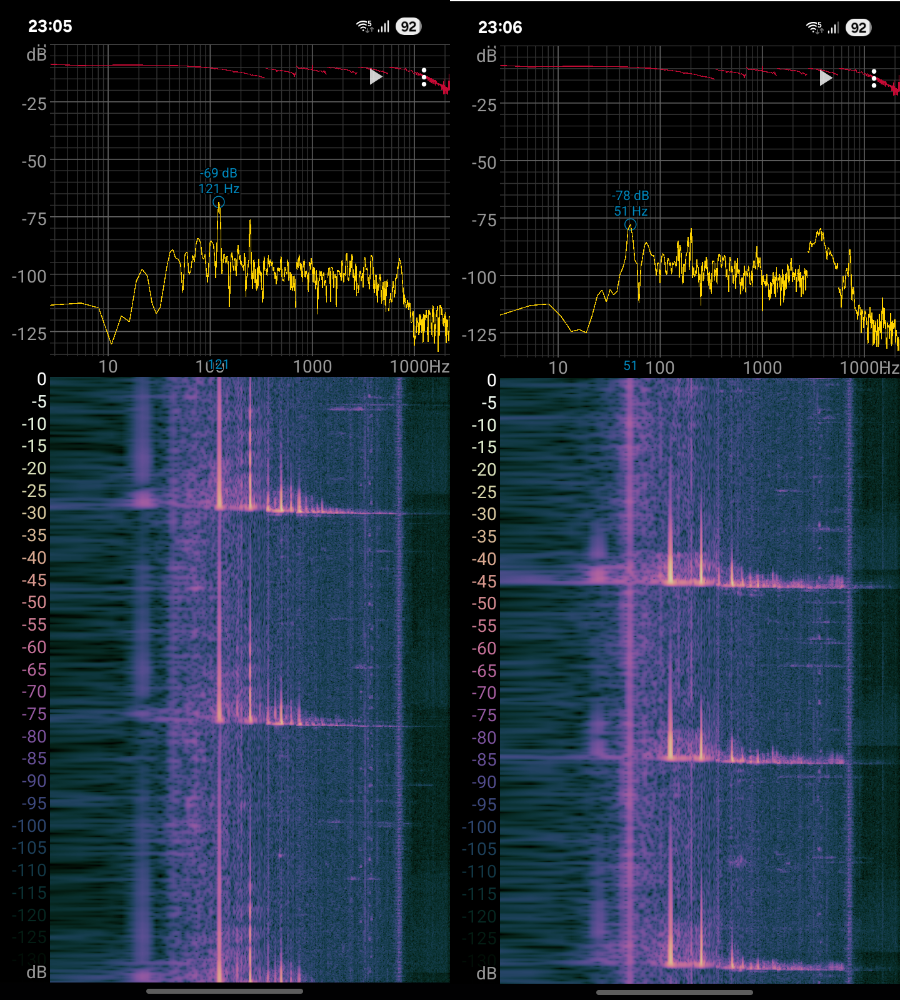{:width 600}
			- Chat with Huy
			  collapsed:: true
				- Âm bội thì trong và ngân dài hơn, còn âm đơn thì đục và tắt nhanh hơn.
				- Cả 2 tính chất đó có thể thấy qua âm phổ (đồ): (trục hoành là tần số [Hz])
					- phần trên là âm phổ (Sound spectrum), với trục tung là âm lượng (dB)
					- phần dưới là âm phổ đồ (sound spectrogram), với trục tung là thời gian hướng lên, và độ sáng là âm lượng (dB)
				- Nhìn âm phổ thì mới thấy "trong/đục" về âm cũng rõ là trong/đục của hình âm phổ (đồ). Nên mình mới dùng những tính từ của thị giác đó cho thính giác.
				- Còn vợ tui thì gọi âm bội là "mỏng", và âm đơn thì "dày" 😀 Không ngờ bả nói giống cách nói trong tiếng Anh "thick/thin".
				- Vì sự ngân nga và trong trẻo của âm bội mà nó được ví như tiếng chuông (ngân), tiếng sáo (flageolet, trong).
				- Haha, mới coi lại 2 từ tiếng Anh: flageolet note vs stopped note... thì thấy "stopped" cũng thể hiện rõ tính chất của âm "dừng lại ngay, đoản, ngắn ngủn" 😆, dù gốc của nó là việc "dừng hẳn dây ở một đầu". Và chữ stopped đó giải thích cơ chế của sự khác nhau về độ ngân:
					- âm đơn phát ra từ sợi dây bị thu ngắn nên cũng đoản hơn, tắt nhanh hơn. Thực ra các nốt thấp thì ngân dài hơn các nốt cao.
					- âm bội dù có bội gấp mấy lần thì vẫn rung nguyên sợi dây nên luôn ngân dài như nhau.
					- Tính ngân/đoản này thể hiện rõ qua âm phổ đồ (ở hình trên thì trục tung là thời gian).
				- Còn về âm sắc trong/đục, mỏng/dày, thanh/tù, thì hơi khó giải thích thích về mặt vật lý.
					- Nó liên quan đến bản chất âm phức (complex note) của hầu hết mọi nhạc cụ:
						- mỗi âm đánh ra là một âm phức cộng lại từ nhiều âm thuần (pure note).
						- Mỗi âm thuần là một sóng hình sin (sóng điều hòa, harmonic) với tần số gấp n lần sóng cơ bản.
						- Những âm thuần với n > 1 gọi là âm bội (overtones) của âm thuần cơ bản.
						- Âm sắc của từng nhạc cụ và giọng từng người khác nhau ở sự phân bổ của các âm bội thuần này, thể hiện rõ qua hình dạng âm phổ.
					- Âm đơn phức: việc thu ngắn dây nâng tần số của cả âm phổ, cả sóng cơ bản lẫn những sóng bội của nó, nên hình của âm phổ không đổi, chỉ bị dịch lên thôi.
					- Âm bội phức: việc chặn dây tại điểm nút không thu ngắn dây mà chỉ lọc bỏ những sóng tần số thấp
					  ==> Âm phổ được lọc đi nên trong hơn, càng lên cao thì càng được lọc nhiều nên càng trong.
				- Mới nói chuyện với vợ thì thấy cách nói âm sắc "dày/mỏng" phù hợp với hình học không-thời gian: cùng 1 năng lượng thì dày × ngắn (đoản) = mỏng × dài (ngân) 😊. Tức năng lượng = không gian cao độ × thời gian trường độ, và thể hiện bằng diện tích hình chữ nhật trong spectrogram (phần dưới của 2 hình bên trên)
				- Nhờ wikipedia mà tui mới biết Cổ Cầm của Trung Quốc cũng chơi âm bội là chủ đạo (không bấm phím). Nhưng vì nó có nhiều dây nên vẫn có âm đơn (khi tay trái không chặn dây). Ông nghe bản Lưu Thủy (Nước Chảy) này thì thấy rõ sự khác nhau giữa âm đơn và những âm bội "ẻo lả" ma mị:
					- [Chinese Guqin: Flowing water 《流水》古琴曲](https://youtu.be/BcElotwrZ8o)
					  {{video https://youtu.be/BcElotwrZ8o}}
				- Vì các đàn này thường kết hợp kỹ thuật luyến với âm bội nên nghe khó phân biệt.
					- luyến là kỹ thuật thăng giáng cùng một âm, như đàn bầu là dùng cần (vòi), và cổ cầm là vuốt.
					- còn âm bội là nói bản chất "sóng dừng có nhiều bó" của một lần gảy đàn (chưa luyến), so với âm đơn chỉ có 1 bó (1 bụng 2 nút) sóng trên dây.
				- Nhiều thuật ngữ âm nhạc gốc tiếng Pháp nên dễ bị đọc sai nhé:
					- Timbre (âm sắc) là tem-bờ chứ không phải tim-bờ (timber, cây gỗ)
					- Flageolet tone (âm bội phức) là fla-giơ-lê chứ không phải fla-gi-ô-lét 😆
				- Nghe âm thanh, nhìn âm phổ, suy nghĩ về vật lý, cảm nhận sự liên kết của mọi thứ đó, tui thấy thiệt là vi diệu 😊
					- Đó giờ tui đọc nhiều về phân tích Fourier từ 1 sóng phức ra nhiều sóng điều hòa hình sin, mà khó cảm được. Giờ được nghe trực tiếp, nhìn trực tiếp sự thay đổi âm sắc qua việc lọc âm thì cảm nhận rõ ràng hơn.
				- Haha, sẵn có âm phổ kế, phân tích luôn 6 thanh tiếng Việt (dấu ngã giọng Hà Nội), thấy cũng giống hình mẫu phết:
					- ngang: ngang
					- sắc: lên
					- huyền: xuống
					- hỏi: xuống lên (giọng Bắc xuống sâu hơn giọng Nam, và khi nói nhanh thì không thèm lên luôn)
					- ngã: ngang - đứt - lên nhanh (chỉ có ở giọng Bắc)
					- nặng: chặn đứng (ngắt âm, glottal stop) ở cuối, còn phần đầu thì có thể ngang/lên/xuống không quan trọng.
					- 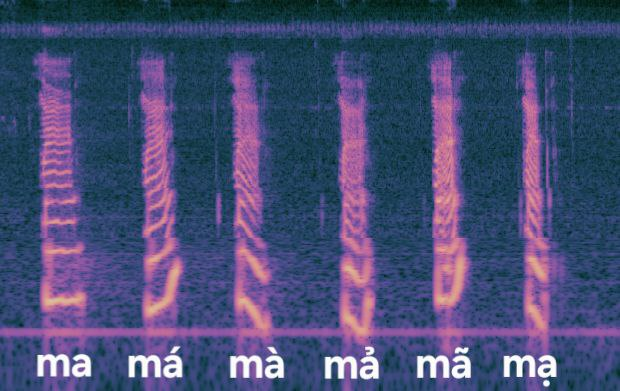
					- [Model on WikiMedia](https://commons.wikimedia.org/wiki/File:Six_tones_of_Vietnamese_language.png)
					  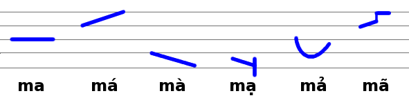
					- Zoom in dấu nặng để thấy rõ chỗ chặn đứng ngắt âm ở cuối:
					  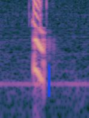
	- ## Current Stories < ((67763a41-4ad6-449f-9d9b-d63ce417082c))
	  id:: 6788f004-d3df-41d4-afc8-c8c5ea52c51c
		- ((688c70aa-8fdf-4cc8-aeb7-ffd47b86cee0))
		- ...