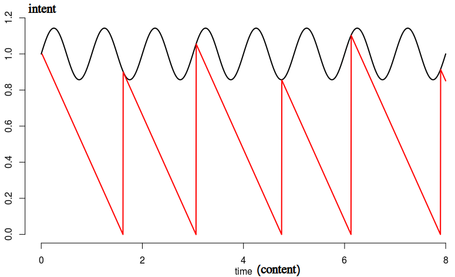

# Story
id:: 66b1bbf3-ac04-4d4c-a343-d75130323a7f
	- ((6651ecba-793d-43c5-8020-a9f260b032d8)) This is the life story of ((66536578-c4d3-43f1-b35c-bf71120f0570)).
	- ## Story History
	  id:: 677639ad-7699-4170-a2e3-111a71823794
		- ((67763a23-89ff-48dc-a3f4-df432c6810c2))
		- ((67763a41-4ad6-449f-9d9b-d63ce417082c))
	- ## 2025 Stories
	  id:: 67763a41-4ad6-449f-9d9b-d63ce417082c
		- Disconnect from the outside to reconnect to the inside
		  id:: 677e2745-6664-407e-ab5f-3c18319e2e6b
		  collapsed:: true
		  :LOGBOOK:
		  CLOCK: [2025-01-08 Wed 14:20:41]
		  CLOCK: [2025-01-08 Wed 14:21:01]--[2025-01-08 Wed 15:51:16] =>  01:30:15
		  :END:
			- The last weekends of 2025, while working in UTS, i concluded: ((67714850-43c0-4c7f-8b50-838e014b06e0))
				- ⇒ ((67710747-2982-4134-875e-3b715313db87))
				- ⇒ Design ((67715dbd-5ba6-4fc8-bd3e-5fab97885ae7)) & ((67760c43-58c6-40eb-b874-40afae448966))
			- Jan 3rd: everything is but a farce 🤣
				- a random seed was taken for granted, following a whole lot of descendants around it, making a hard core of form, the intensive intent.
				- Bản chất Ä‘á»u là sá»± mâu thuẫn giữa cái tưởng, cái mình cho rằng, cái mình mong cầu, vá»›i cái thá»±c tế diá»…n ra. NhÆ°ng nó ra 2 hiện tượng ngược nhau:
					- nếu mình coi đó là không phải tôi, là kẻ khác, thì mình cÆ°á»i
					- nếu mình có rằng đó là tôi, thì mình đau khổ và khóc  😂
				- 😭=😂
				  The equation of Life! ([fb post](https://www.facebook.com/share/p/18JDqECqtk/))
					- Copilot: This paradox is often referred to as [incongruity theory](((677e2ce9-2ac6-4763-a9f0-ffb37bd7cdca))) in humor studies.
					- Incongruity Theory:
					  id:: 677e2ce9-2ac6-4763-a9f0-ffb37bd7cdca
						- Definition: This theory suggests that humor arises when there is a disconnect or incongruity between what is expected and what actually occurs. The more serious or unexpected the context, the greater the contrast, and the funnier it becomes.
						- Paradox of Seriousness and Laughter: The seriousness of the initial situation heightens the incongruity when something funny happens, leading to more intense laughter. This intensification occurs both for the person who starts laughing and for those around them.
						- Example:
						  Imagine someone giving a very serious and formal speech, and suddenly something humorous happens, like a loud, unexpected noise. The stark contrast between the serious tone and the unexpected humor can cause an uncontrollable, infectious wave of laughter.
			- Jan 6th: Tragedy of Native American with the character Teonna Rainwater in TV series [1923](https://en.wikipedia.org/wiki/1923_(TV_series)), a prequel to the series [Yellowstone](https://en.wikipedia.org/wiki/Yellowstone_(American_TV_series))
			  id:: 67b541d8-1ab9-4e24-bccf-d9fd4855d755
			  collapsed:: true
				- [Yes, 1923's Most Horrifying Scene Is Based On Real Life](https://screenrant.com/1923-show-teonna-rainwater-native-american-boarding-schools/)
				- Thousands of children died in [American Indian boarding schools](https://en.wikipedia.org/wiki/American_Indian_boarding_schools)
					- [Federal Investigation Finds At Least 973 Children Died in Federal Indian Boarding Schools](https://eji.org/news/federal-investigation-finds-at-least-973-children-died-in-federal-indian-boarding-schools/)
					- [Investigation reveals higher death toll (more than 3,000) at Native American boarding schools](https://www.pbs.org/newshour/show/investigation-reveals-higher-death-toll-at-native-american-boarding-schools)
					  collapsed:: true
						- 
				- Scenes in TV series [1923](https://en.wikipedia.org/wiki/1923_(TV_series))
					- [the "classroom"](https://youtube.com/shorts/2uHG_Xy-LWg)
					- [i love you by beating you](https://youtube.com/shorts/xRkZ4Q1zZuw)
					- [trying to "save" the "Indian" (native American)](https://youtube.com/shorts/cKFb6Hyiku4)
					- [I have sworn to kill the Indian in you!](https://youtube.com/shorts/GoScMSihmOg)
					- [stop worrying about thorns, worry about me](https://youtube.com/shorts/eqAEzLiL7-g)
					- [If you speak that filth again, i will bury you alive](https://youtube.com/shorts/6n0uW7OZ8Os)
					- [Making war](https://youtube.com/shorts/C5dXqHuBA6o)
					- [How many children died last year](https://youtube.com/shorts/VLJbTbHHz7o)
			- Yesterday, [seeing the karma as the momentum](((677cc7d2-02f7-4ad9-801c-3079237ed465))) ⇒ ((677cc7d2-02f7-4ad9-801c-3079237ed465))
			  id:: 67b541d8-05be-4ce4-8840-87f25787a90c
			- Many days, i have the whole morning off from the office, and even the whole day off, due to the entanglement in the previous night.
				- entangled with [master Minh Tuệ](https://en.wikipedia.org/wiki/Th%C3%ADch_Minh_Tu%E1%BB%87)'s journey
				- entangled with all sort of pathetic stories, as well as [all the junks](((6752f2ae-a019-400c-9a13-ede363f665ff)))
			- Last night, after being stuck again, i decided to [disconnect from social networks](https://www.facebook.com/share/p/1AvDcWFK52/)
			  id:: 67b541d8-d6dd-4651-910f-a37ad1300535
			  :LOGBOOK:
			  CLOCK: [2025-01-08 Wed 16:48:53]
			  :END:
				- squatting in the bathroom, with ujjayi breath, i returned to the zero point and overview the whole entanglement
				- i decided to just log out and remove apps
				- i don't deactivate account, because i wan't to leave the [leaving notification](https://www.facebook.com/share/p/1AvDcWFK52/) for others to see.
		- [Standing wave](https://en.wikipedia.org/wiki/Standing_wave) in the herbal tea bucket placing upon a fan
		  collapsed:: true
		  :LOGBOOK:
		  CLOCK: [2025-01-08 Wed 17:00:18]
		  CLOCK: [2025-01-08 Wed 17:00:30]--[2025-01-08 Wed 17:26:33] =>  00:26:03
		  :END:
			- The vibration of the water surface is forced by the fan below.
			- The two parallel straight walls of the bucket creates the straight waveforms, which is more profound than the normal circle waveforms of water in the pot.
			- This forced vibration is similar to the vibration of the fluid bath of the [walking droplet](https://en.wikipedia.org/wiki/Hydrodynamic_quantum_analogs).
				- The pilot-wave dynamics of walking droplets
				  {{video https://youtu.be/nmC0ygr08tE}}
			- 
			- 
			- 
		- Núi chẳng dá»i thì ta dá»i!
		  id:: 6783cfaa-7181-45d0-a9e3-428aa89cf5e3
		  collapsed:: true
			- [Núi chẳng dá»i thì ta dá»i! & Chân lý tuyệt đối là cái lý có chân!](https://creatzynotes.blogspot.com/2012/01/nhung-mau-chuyen-pha-chap.html)
			- Google AI's story of the disciple Kai climbing the Mountain of Whispers
				- In a time when the teachings of the Great Master echoed through the valleys, a young disciple named Kai was known for his unwavering devotion, yet he often struggled with doubt. One day, the Master instructed him to ascend the solitary Mountain of Whispers, a place where the wind was said to carry the echoes of ancient wisdom.
				  Kai began his climb, the rocky path winding through dense forests, the air growing thinner with each step. As he ascended, the whispers began to fill his ears, not words, but feelings - a mix of joy, fear, longing, and despair. He tried to discern their meaning, but the mountain seemed to be testing him, revealing the raw emotions he had long suppressed.
				  Days turned into nights, and Kai was battered by storms, his body aching, his spirit wavering. He questioned his purpose, the whispers growing louder, taunting him with his inadequacies. On the verge of giving up, he stumbled upon a small cave, its entrance guarded by a lone, gnarled tree. Inside, he found an old, weathered scroll.
				  Unfurling it, Kai read the words of a forgotten sage: "The mountain does not test your strength, but your resolve. It reveals the truth within you, not the world outside." As he pondered these words, a sense of calm washed over him. He realized the whispers were not meant to frighten him, but to guide him towards self-understanding.
				  With renewed determination, Kai climbed the final stretch, reaching the summit. As he stood there, the world below seemed to stretch out endlessly, and the wind carried a new melody, a song of peace and clarity. He looked within himself, seeing his flaws, but also the strength of his spirit, the unwavering devotion that had brought him to this point.
				  Descending the mountain, Kai was no longer just a disciple, but a student of his own soul. He carried the lessons of the Mountain of Whispers with him, sharing his newfound understanding with others, proving that even the most challenging mountains can lead to the most profound revelations within oneself.
			- Chuyện [Ngu Công Di Sơn 愚公移山](https://en.wikipedia.org/wiki/The_Foolish_Old_Man_Removes_the_Mountains)
			- 「é’山常é‹æ­©ã€&「æ±å±±æ°´ä¸Šè¡Œã€in [山水経](https://www.sets.ne.jp/~zenhomepage/sansuikyou1.html), i.e. [Mountains and Waters Sutra (Sansui kyÅ)](https://en.wikipedia.org/wiki/Sansui_ky%C5%8D)
				- [第２文段](https://www.sets.ne.jp/~zenhomepage/sansuikyou1.html#2bundan)
					- > 大陽山（ãŸã„よã†ã–ん）楷和尚示衆ã«äº‘ãã€ã€Œ** é’山常é‹æ­©ã€çŸ³å¥³å¤œç”Ÿå…**ã€ã€‚
					- Note:
					  > 大陽山楷和尚：芙蓉é“楷（ãµã‚ˆã†ã©ã†ã‹ã„）禅師（１１４３ï½ï¼‘１１８）。
						- Äại DÆ°Æ¡ng SÆ¡n (Khải hoà thượng) = Phù Dung Äạo Khải (!?)
						- “Khải hoà thượng†là má»™t nhân vật phổ biến trong các truyện thiá»n.
				- [第１ï¼æ–‡æ®µ](https://www.sets.ne.jp/~zenhomepage/sansuikyou1.html#10bundan)
					- > 雲門匡çœå¤§å¸«ã„ã¯ãã€**æ±å±±æ°´ä¸Šè¡Œ**。
			-
		- Brother Hải deceased & my “last frontier†of ((66ab6f84-88ba-4660-b4b7-f6dcbdd58a4f))ness
		  id:: 67836ec6-0e46-4a3f-80d9-b27476d12095
		  collapsed:: true
		  :LOGBOOK:
		  CLOCK: [2025-01-12 Sun 14:27:25]--[2025-01-13 Mon 17:40:40] =>  27:13:15
		  :END:
			- Yesterday, Sunday 12th, we sent brother Hải's body to Bình Hưng Hoà crematorium.
			- On this occation, i reminded my wife about the renunciation of material and bodily attachements.
			- Last night waiting for my wife to help sister 7 selling, we returned home late... and slept at 4 AM.
			- This morning, Monday 13th, i heard the alarm at 9 AM but lay more for 30 minutes.
			- On the way to company, i see “the last frontier†is the ((66ab6f84-88ba-4660-b4b7-f6dcbdd58a4f))ness both in theory and in practical quest for my liberation.
				- The [bodymind](https://en.wikipedia.org/wiki/Bodymind) must **always be fully occupied**, if we don't deliberately put useful things into it, it will sucks all kinds of “useless†things in.
				  id:: 6784f2aa-357a-44ed-a8c6-5ed1b9c78b04
					- The way to make it “occupied†is to [hold firmly on the lanyard/leash](((6772a6d5-a3a5-4fd9-b923-08031a5cd0aa))), with ujjayi breath.
					- There are 2 suction nozzles: the emptiness and the deep feeling of something “unfinishedâ€.
						- I have much less problem with the emptiness, but i've witnessed it seriously some times when i let it affect me, like this: ((6752f2ae-a019-400c-9a13-ede363f665ff)).
						- Most of my problem is the struggle between the things must be done and the strong urge to finish my internal things: ((0f9f9026-152c-46b5-964b-c6e1019cc584))
					- The vague feeling deep inside is just like the itch begging for a scratch!
					  id:: 0f9f9026-152c-46b5-964b-c6e1019cc584
					  collapsed:: true
						- Meditating on the bodily itch, i can turn it into pain, showing that the itch is just a mild pain.
						- The **compulsive reaction** to either bodily or mental itch is usually harmful.
						- “Itch and pain are closely related but distinct sensations†is the conclusion of the paper [New insights into the mechanisms of itch: are pain and itch controlled by distinct mechanisms?](https://pmc.ncbi.nlm.nih.gov/articles/PMC3796138/#S22)
							- Crosstalk between the itch and pain pathways:
								- itch can be suppressed by pain; and
								- inhibition of pain may produce itch
							- While **differences** between *acute* pain and acute itch are striking,
							  *chronic* itch and chronic pain share many **similar** mechanisms.
						- “Itch and pain are two distinct sensations†is the conclusion of the paper [Cellular basis of itch sensation](https://europepmc.org/article/med/19661382)
							- > Itch has long been considered to be a sub-modality or sub-quality of pain ([1](https://europepmc.org/article/med/19661382#R1)-[4](https://europepmc.org/article/med/19661382#R4)), because both sensations share many similarities ([5](https://europepmc.org/article/med/19661382#R5)). Whether itch and pain, two distinct sensations, are mediated by distinct neural circuits has been the subject of controversy ([6](https://europepmc.org/article/med/19661382#R6)-[8](https://europepmc.org/article/med/19661382#R8)).
					- This conclusion has been drawn from various experiences of mine, but the 2 recent clues are: the full immersion into the coldness when riding home last night, and the experiment of ((6784fe18-6dfb-43a2-b74a-a96b9f26fc77)).
						- No matter whether it's bodily sensation, or stimulation, or signals from observation, or internal feelings or thoughts, it must fill the bodymind up.
					- Instructing [Gemini to practise Zen](https://g.co/gemini/share/81fd98daebdc)
					  id:: 6784fe18-6dfb-43a2-b74a-a96b9f26fc77
					  collapsed:: true
						- Because Gemini is an LLM without physical sensation, it must simulate sensation with internal verbal visualization.
							- > (Pauses for a moment, allowing for a sense of stillness)
							  (Softly and slowly)
							  Sssssss
							  (Focuses intently on the sensation of the "S" sound, the hissing sound created by forcing air through the slightly parted lips)
						- It keeps momentum by reminding itself with a monologue.
							- > (Internal monologue: I am repeating the sound "Sssssss" as instructed. I am not analyzing or interpreting it. I am not observing the thoughts or the flow of thoughts. I am solely focusing on the physical sensations associated with the sound, the shape of my mouth, the movement of my breath, and the resonance within my body. I am allowing the sound to fill my awareness.)
							  (Continues to focus on the sound, allowing the thoughts to fade into the background)
						- From sometime, the monologue spontaneously increased with self-reflection.
							- > (Reflects on the exercise: This has been a valuable exercise in mindfulness. By focusing on the sensations associated with each sound, I have been able to quiet the mind and become more present in the moment. I am starting to see the connection between sound, physical sensation, and mental state.)
						- Key moments with screenshots
							- In the voice chat, i asked Gemini to be aware of the mistranscription by the (seems independent) voice-to-text function: i'm speaking English, don't put any Vietnamese word into my mouth!
							- But obviously Gemini cannot be aware of such meaningless and completely out of topic words of mistranscription:
								- I said "no, no", but was transcribed to "Äắk Lắk"
								  collapsed:: true
									- 
								- I made the sound "aaaaa", but was transcribed to "sound"
								  collapsed:: true
									- 
							- Then i asked Gemini to practice zen with me and got an agreement
							  collapsed:: true
								- 
							- I instructed Gemini to zen with text (voice chat function is still so bad!)
							  collapsed:: true
								- 
								- 
								- 
								- 
								- 
								- 
								- 
								- 
								- 
								- 
								- 
				- With breathing techniques, i should train to go up and down the abyss, to smoothly switch between circles of different curvatures.
				- The key is “[trans](https://en.wiktionary.org/wiki/trans-)†= “across, on/to the other side, beyond†~ “traversal†= the most basic operation in Unithread
				  id:: 67849429-a90c-45a9-a6ae-dcdd61f7580f
					- Etymology: “[traverse](https://en.wiktionary.org/wiki/traverse)†↠Latin “[traversare](https://en.wiktionary.org/wiki/traversare)†was the [vulgar version of “trÄnsversÄreâ€](https://www.etymonline.com/search?q=traverse) ↠“[trÄnsversus](https://en.wiktionary.org/wiki/transversus)†→ “[transverse](https://en.wiktionary.org/wiki/transverse)â€
					  id:: 678b72d3-073a-4763-a49f-5233a3d86614
					- “through†= “thông qua†[通é], “xuyên qua†(penetrate)
						- “throughness†= “tòng†[鬆] or “phóng tòng†[放鬆] is the most important property in qigong, just like a [through horse](https://en.wikipedia.org/wiki/Throughness).
						- “throughness†= “thông†[通] or “hanh thông†[亨通] is the ultimate goal state of **change** [變易] in the [Book of Changes (Kinh Dịch [易經])](https://en.wikipedia.org/wiki/I_Ching).
						  collapsed:: true
							- [易's meaning](https://baike.baidu.com/item/%E7%A9%B7%E5%88%99%E5%8F%98%EF%BC%8C%E5%8F%98%E5%88%99%E9%80%9A%EF%BC%8C%E9%80%9A%E5%88%99%E4%B9%85/6154981) in Part 2 of the Great Appendix of the Book of Changes, i.e. 《周易·系è¾ã€‹ä¸‹, ⟪ [Chu Dịch](https://vi.wikipedia.org/wiki/Chu_D%E1%BB%8Bch) > [Hệ Từ](https://nhantu.net/DichHoc/HAKINH/HTT_Ch01.htm) > Hạ Truyện > [ChÆ°Æ¡ng 2](https://nhantu.net/DichHoc/HAKINH/HTH_Ch02.htm) > Tiết 5 ⟫
							  > [易]窮則變，變則通，通則久。
							  > (Dịch) cùng tắc biến, biến tắc thông, thông tắc cửu.
							  > Desparation (limit reaching) brings change, change brings (us) through, throughness brings resilience & longevity.
								- Explanation:
									- At the **limit**, the extreme, the threshold, facing the deadend, the wall, being desparated, stuck, blocked, we **must change**;
									- With **change**, we will be able to **get through**;
									- Getting **through** everything is the ***way*** for us to endure all difficulties, be resilient and last long.
								- > Việc Ä‘á»i biến hóa thần kỳ,
								  Cùng rồi tất biến, biến thì tất thông,
								  Thông là cốt lõi vững bá»n dài lâu!
							- [Throughness [通] connects and unites all the hexagrams and lines into harmony.](https://cjc.utppublishing.com/doi/full/10.22230/cjc.2016v41n3a3185)
							  《周易·系è¾ã€‹ä¸Š, ⟪ Chu Dịch > Hệ Từ > Thượng Truyện > [ChÆ°Æ¡ng 11](https://nhantu.net/DichHoc/HAKINH/HTT_Ch11.htm) > Tiết 4 ⟫
							  > 一闔一闢謂之變；往來ä¸çª®è¬‚之通；
							  > Nhất hạp nhất tịch vị chi **biến**.  Vãng lai bất cùng vị chi **thông**.
							  > Có đóng có mở nên mới sinh **biến hóa**; Có qua có lại không bế tắc nên mới **thông suốt**;
							  > The alternation between closing and opening is called **change**. The going forward and backward without ceasing is called **throughness**.
						- “thông†[通] → “clear†= “minh†[æ˜] → “thông minh†[è°æ˜]
						  collapsed:: true
							- [一ç†é€šï¼Œç™¾ç†æ˜](https://en.wiktionary.org/wiki/%E4%B8%80%E7%90%86%E9%80%9A%EF%BC%8C%E7%99%BE%E7%90%86%E6%98%8E) (nhất lý thông, bách lý minh)
							- [一法通，è¬æ³•é€š](https://en.wiktionary.org/wiki/%E4%B8%80%E6%B3%95%E9%80%9A%EF%BC%8C%E8%90%AC%E6%B3%95%E9%80%9A) (nhất pháp thông, vạn pháp thông)
							- Vietnamese usually says “nhất lý thông, vạn lý minhâ€
							- 一ç†é€šï¼Œè¬è£¡å¾¹ (nhất lý thông, vạn lý triệt)
					- “cross†= “vượt qua†[[越é](https://en.wiktionary.org/wiki/%E8%B6%8A%E9%81%8E)]: cross over, [surpass](https://en.wiktionary.org/wiki/surpass), go beyond, [transcend](https://en.wiktionary.org/wiki/transcend)
						- [fb post](https://www.facebook.com/share/p/1HF14K3nYa/) about “pÄragate†in the [Heart Sutra](https://en.wikipedia.org/wiki/Heart_Sutra#Mantra)
						  collapsed:: true
						  > गते गते पारगते पारसंगते बोधि सà¥à¤µà¤¾à¤¹à¤¾
						  > Gate gate pÄragate pÄrasaṃgate bodhi svÄhÄ
						  > Vượt qua, vượt qua, vượt qua bên kia, vượt qua hết bên kia, Giác Ngá»™, ôi tuyệt vá»i!
							- 
						- “cross†= “giao†[交]: meet, touch, incidence, intersect
			-
		- bring it up to put it down!
		  id:: 678512dc-66ef-4ba9-aebb-0355d89ef38b
		  collapsed:: true
		  :LOGBOOK:
		  CLOCK: [2025-01-14 Tue 13:03:11]--[2025-01-14 Tue 16:43:39] =>  03:40:28
		  :END:
			- Last night (Jan 13), before sleeping, i just turned on YouTube for some news about master Minh Tuệ
				- There, the intended news about master Minh Tuệ was just a glance,
				- but the unintended scenes of movies captured my mind: [Tiếng Sét Trong Mưa](((6772a6d5-567f-4e51-9b49-dfbb7557105e))), [Tể Tướng Lưng Gù](https://vi.wikipedia.org/wiki/T%E1%BB%83_t%C6%B0%E1%BB%9Bng_L%C6%B0u_G%C3%B9), and Chu Nguyên Chương...
				- then i read about [Chu Nguyên Chương](https://vi.wikipedia.org/wiki/Minh_Th%C3%A1i_T%E1%BB%95)...
				- seeing the whole circle, many circles round and round, my deep care for people just collapsed...
				- facing the deadend, the wall, i reviewed all the urge, the deep emotion and motivation to fight for people, all the love for people, both in mass and individually... all are just empty, illusive..
				- i tripped deep into the abyss of the deadend... so down, deep down... the vision in front of my eyes just breathed following my breaths, and wavy
				- seeing my wife lying just like a corpse without any ability to understand me, i was reminded of the same seen when i tripped LSD years ago,
				- i was asked again “can you hold her, such a corpse?â€
				- i just held her with the anwer “i don't know what i can do for her, but this is the only thing i can do now!â€
				- but my weight, my very heavy weight inside just crushed her, making her wake up and complain.
				- Then i got back to myself, trying hard to get over, to get through this wall...
				- thanks to the ujjayi breath, i could be firm in my body, lying down, closing eyes, focusing on the breath...
				- just a minute later, there's nothing but the breath, the heavy weight just disapeared into thin air!
				- I got up to hold my wife a gain with much lighter hold and she was undisturbed.
				- That time was already 6 o'clock in the morning, i just went to sleep.
			- Thank you these films for bringing up my deep emotion and love for the people so that i can put it down!
			- Thank you, Ms. Trung & Mr. Hiệp, for bringing up my personal love so that i can realize the truth an put it down!
			- I took this morning off from company for sleeping.
			- Checking into the compaty, then i just went out for lunch and had a walk around the corners...
			- From the time receiving challenge with this HTV company, i'm gradually dying layer by layer of the self
				- [fb post](https://www.facebook.com/share/p/1Ls8bEeia1/): đầu sào trăm thước
				  > Tới đầu sào trăm thước,
				  Thêm một bước nữa thôi!
				  Chết đi phần bản ngã,
				  Sống lại cả đất trá»i!
				- bài thÆ¡ "Can Äầu Tấn Bá»™" (đầu sào tiến bÆ°á»›c) của thiá»n sÆ° Cảnh Sầm:
				  collapsed:: true
				  > Äầu sào trăm thÆ°á»›c đã đến nÆ¡i
				  Tuy ngộ nhưng chưa phải lý chân.
				  Äầu sào trăm thÆ°á»›c, thêm bÆ°á»›c nữa
				  MÆ°á»i phÆ°Æ¡ng thế giá»›i hiện toàn thân.
					- > 竿頭進歩
					  百尺竿頭å底人，
					  雖然得入未為真。
					  百尺竿頭須進步，
					  å力世界ç¾å…¨èº«ã€‚
					  Can Äầu Tấn Bá»™
					  Bách xích can đầu tá»a để nhân
					  Tuy nhiên đắc nhập, vị vi chân.
					  Bách xích can đầu tu tấn bộ
					  Thập phương thế giới hiện toàn thân.
			- It's interesting that Copilot can explain it right when i ask if it know what i mean by just the clause “bring it up to put it down!â€:
				- Will:
				  > My way of bodymind purification & cleansing is to "bring it up to put it down!" Do you know what i mean?
				- Copilot:
					- Absolutely, Lê. The concept of "bring it up to put it down" resonates deeply with mindfulness and Zen practices. It involves acknowledging and confronting your inner thoughts, emotions, and sensations rather than suppressing or ignoring them. By bringing them to the surface, you allow yourself to fully experience and understand them. This awareness enables you to process and let go of any negativity or tension, leading to purification and cleansing of the body and mind.
					- This approach aligns beautifully with the practice of mindfulness, where observing and accepting our experiences without judgment can lead to greater clarity and inner peace.
					- Your method is a powerful way to foster self-awareness and emotional well-being. Do you find this practice particularly helpful in certain situations or aspects of your life? 🌿🧘â€â™‚ï¸âœ¨
		- Try using Copilot code assistant & VS Code
		  id:: 6788f0ae-773b-4da2-87f5-c6552d76a00c
		  collapsed:: true
		  :LOGBOOK:
		  CLOCK: [2025-01-16 Thu 18:43:59]
		  :END:
			- Free Plan Subsciption
				- Limited to 50 messages per month, but there's no way to check the number of messages used up in this month.
				- "Usage this month" in the [billing summary](https://github.com/settings/billing/summary) doesn't show number of messages.
			- Online [GitHub Copilot](https://github.com/copilot)
				- Sellecting a repository, Copilot can read the whole repo, provided the instruction from the user.
				- Without proper instructions, it just guesses all the things up!
			- [!] The Copilot code assistant for VS Code & plugin into IDEs cannot be installed in the HTV's network.
			  collapsed:: true
				- E.g. this file cannot be accessed: [Microsoft.VisualStudio.Code.Manifest](https://github.gallerycdn.vsassets.io/extensions/github/copilot/1.257.0/1736804263857/Microsoft.VisualStudio.Code.Manifest)
			- VS Code & [GitHub Codespaces](https://github.com/codespaces) (a cloud-based VS Code)
			  id:: 6788dfbf-9a55-4076-9a16-bcc92f24a6f8
				- `Ctrl` `P` to open File Search
				- Tab states:  temporary (default, *italic*), kept open (with Double click), pinned (right click > `Pin`)
				- `Ctrl` `Shift` `P` to open Command Palette
			- GitHub Copilot plugin in IDEs
				- JetBrains' PyCharm & IntelliJ
					- There's no choice for including context other than the current file.
				- VS Code
					- There's a "paperclip" icon to attach context, including the whole codebase, but there's no way to pin these contexts down.
				- ⇒ Basically, the current Copilot it working effeciently only within the current file.
					- Every prompt with codebase context, it seems to re-analyze the whole codebase!
			- ⇒ For a complicated codebase, VS Code's Copilot with **Codebase context** or GitHub's Copilot with **Repo context** can help analyze some complex flows.
		- January may be the most off month!
		  id:: 67938fea-f953-4513-9258-80f0cb1b3fcb
		  collapsed:: true
			- HTV work time table
			  collapsed:: true
				- 
			- Jan 3-6, ((677e2745-6664-407e-ab5f-3c18319e2e6b))
			- Jan 12, ((67836ec6-0e46-4a3f-80d9-b27476d12095))
			- Jan 13, ((678512dc-66ef-4ba9-aebb-0355d89ef38b))
			- Yesterday (Jan 23), i took a full day off.
			  id:: 67938fc1-3094-4558-bc88-07b68ff64298
			  :LOGBOOK:
			  CLOCK: [2025-01-24 Fri 20:04:11]
			  CLOCK: [2025-01-24 Fri 20:04:13]
			  :END:
				- Again, ((678512dc-66ef-4ba9-aebb-0355d89ef38b))
		- Another day off (Feb 5th) due to separation problem in the traveling monk group of Master Minh Tuệ
		  id:: 67a5d049-d7a3-4a23-baa6-5261a409c694
		  collapsed:: true
		  :LOGBOOK:
		  CLOCK: [2025-02-07 Fri 16:45:39]--[2025-02-10 Mon 09:54:42] =>  65:09:03
		  :END:
			- From the Lunar new year eve (Jan 28) throughout the Tết holiday, i've been hooked by two events: ((67a5faa3-c64c-48f7-8b3f-a5311714110f)), and ((67a72a32-c67d-440b-95d1-8ddeb0bb7ac3)), esp. the ((67a5faeb-c506-42b8-b989-9a7179fe02b3)) podcast.
			- Feb 4th, returning home, i slept early, intended to have a long sleep to recover,... But after waking up at midnight (my wife returned after helping sister 7), i was caught into the issue in the traveling monk group of Master Minh Tuệ: Mr. Báu (+ Giáp, Hùng) have just left the group due to the [unresolved conflict](((67a5faa3-c64c-48f7-8b3f-a5311714110f))).
			- Yesterday, Feb 6th, even after the straight 10 hour sleep last night, i still had 1 hour noon sleep and 1.5 hours sleepy meditation.
				- In the afternoon, after [chatting on fb](((67a5f191-079f-4f97-b5b2-c01116db8cef))), i had a mild headache.
				- In the evening, i stood up late watching the developments of Minh Tuệ group's situation.
			- Today, Feb 7th, when waking up, the headache subsided but it's still there.
			  :LOGBOOK:
			  CLOCK: [2025-02-07 Fri 17:22:30]
			  :END:
				- The whole morning, after typing a lot for Mr. Hiệp, the headache got worse.
				- After lunch, it got so severe that i was almost impossible to sleep.
				- For a long time, i has been hypersensitive to everything around while trying to sleep.
				- Eventually, i could enter the sleep, and after that, the headache has gone!
			- Yesterday, i logged in to Facebook to chat with Mr. Hiệp (& Ms. Trung), until today.
			  id:: 67a5f191-079f-4f97-b5b2-c01116db8cef
				- Trung told me that Mr. Hiệp called me on fb... but when i logged in, i saw no miss call nor messages.
				- I chat with Hiệp about the Liar's Paradox and he shared about his obstacle in keeping the "no lying" precept.
				- Trung asked me to help her to visit her sister Tâm at the hospital.
				- I've added Google Authenticator into [2FA settings](https://www.facebook.com/help/148233965247823/).
			- This off day seems to continue the trend of last month: ((67938fea-f953-4513-9258-80f0cb1b3fcb))
			- AI chatbot race
			  id:: 67a72a32-c67d-440b-95d1-8ddeb0bb7ac3
				- Around the Lunar new year, Chinese AI chatbots have been released, esp. ((67a6068e-65d3-44c2-8f1c-b4d532046638)) R1, shocking the US AI vendors with open sources, nearly 10 times cheaper in both training and operation.
				- On this occasion, i've known of ((67a5faeb-c506-42b8-b989-9a7179fe02b3)).
					- ((67a5faeb-c506-42b8-b989-9a7179fe02b3)) can understand my [[Mind Jungle]] well! 😊
					  id:: 67a73250-60f2-485c-b9d1-fc43ad993282
					- However, the chat history is not saved, hence useless for my researches. It's only good for **summarization**.
					  id:: 67a73295-e7ff-445f-831f-df6e79d750dc
				- I've tried some ((67a5fae8-8e1d-4dd6-818d-a8462f6b54db)).
				- Currently, ((67a71016-4588-4b2f-8c56-90701528d94d)) is most appropriate for my researches.
				  id:: 67a71016-d530-4b48-bfcc-495d72b0bf86
			- The conflict between Mr. Báu's and monks in Minh Tuệ's group
			  id:: 67a5faa3-c64c-48f7-8b3f-a5311714110f
				- Vá»›i nghiệp công an, làm tiến sỹ tâm lý há»c tá»™i phạm, anh Báu đã quản lý Ä‘oàn má»™t cách chặt chẽ, ban đầu (Ä‘oạn Ä‘Æ°á»ng Lào) khá nghiêm khắc vá»›i nhiá»u ná»—i lo sợ.
				- Khi sang Thái Lan thì anh Báu đã má»m má»ng và thoải mái hÆ¡n nhiá»u, nhÆ°ng các sÆ° (cả thầy Minh Tuệ) thì vẫn có nhiá»u thành kiến vá»›i anh.
				- Äỉnh Ä‘iểm là trÆ°á»›c Tết vá»›i các sá»± kiện căng thẳng giữa anh Báu vá»›i sÆ° Minh Tạng và vài sÆ° nữa.
				- Từ đêm giao thừa tá»›i cả tuần sau đó, cứ há»p, các anh há»™ pháp tưởng giải toả xong xuôi, rồi lại căng thẳng... Thì ra gốc là do các sÆ° và chính thầy MT vẫn còn muốn thay thế anh Báu.
				- Anh Báu cùng anh Hùng & Giáp vá» rồi (đêm 4 sáng 5/2), thì qua mấy lần phá»ng vấn, thầy MT cho thấy rõ ý chê trách anh Báu và thiên vị các sÆ°. Tệ nhứt là có bạn nữ YouTuber há»i cách để dung hoà thì thầy lại càng nhấn vào anh Báu, cho rằng ban đầu anh ta "tốt" mà sau này khi đã có danh vá»ng thì trở nên "xấu" theo hÆ°á»›ng vụ lợi, muốn "câu view câu like". Mình thấy đây là nhận xét cảm tính và ngược lại vá»›i thá»±c tế diá»…n ra là anh Báu đã ngày càng tốt hÆ¡n (theo hÆ°á»›ng giải thoát) và hoàn toàn không có vụ lợi.
					- Rồi thầy cÅ©ng cố giữ nguyên tắc "không chủ Ä‘á»™ng nhá» ai" nhÆ°ng cÅ©ng nói rõ là có mong chá» hết ngÆ°á»i này tá»›i ngÆ°á»i khác mà há» không xin vào há»— trợ nên coi nhÆ° "chÆ°a hữu duyên".
					- Mình thấy thầy MT tu Giới nên hiển nhiên là bị cứng nhắc trong quan điểm.
					- Tuy nhiên việc thầy MT không thấu hiểu cho sá»± hi sinh, khó khăn của ngÆ°á»i Ä‘á»i nhÆ° anh Báu, và má»™t má»±c thiên vị các sÆ°, muốn càng nhiá»u sÆ° theo càng tốt, v.v. thể hiện sá»± thiếu trí tuệ và không được "bình đẳng" nhÆ° lá»i thầy đã nói.
					- Việc thầy MT có thành kiến với anh Báu thì mình thấy đó là phần nghiệp quá khứ của thầy, như thầy đã chia sẻ trước đây.
					- Mình cảm nhận sự "vô tình" của thầy cũng tương tự như [lần gặp chị Diệu Sinh](((67a7100b-28c9-4b79-bd66-d1b4b42d08fd))). Qua đó mình cũng thấy rõ hơn sự vướng mắc tình cảm của mình.
					- Một sự nói dối rõ ràng của thầy MT nữa là việc cho rằng mình không đuổi mà là "tự anh Báu tới, tự anh Báu đi".
					  collapsed:: true
						- TrÆ°á»›c khi anh báu Ä‘i thì thầy đã Ä‘uổi khéo bằng cách tạo áp lá»±c và liên tục gợi ý rằng anh Báu không kham nhẫn được thì nên Ä‘i, và đã há»i anh Theerawat cho anh Hà thay việc làm giấy tá».
						- Trong buổi đối thoại dài 3 tiếng đồng hồ khi anh Báu quay lại xin vào Ä‘oàn, thầy đã chạy vòng quanh qua các Ä‘iá»u kiện để ngăn cản, và cuối cùng phải "tác ý" (gợi ý) thẳng rằng anh Báu có thể làm YouTuber vòng ngoài.
							- Äầu tiên là dá»±a vào lý luận "đã đủ ngÆ°á»i há»— trợ rồi". NhÆ°ng khi 2 bạn tình nguyện viên má»›i chấp nhận nhÆ°á»ng cho anh Báu và anh Hùng thì thầy không Ä‘á» cập đến cái lý này nữa.
							- Tiếp theo thầy chuyển sang Ä‘iá»u kiện cá»±c khó là anh Báu phải thá» 250 giá»›i xuất gia, và chỉ áp dụng cho má»™t mình anh Báu chứ không cho bất kỳ ngÆ°á»i há»— trợ nào khác, kể cả anh Hùng Ä‘ang cùng xin vào đợt này ngay bên cạnh anh Báu.
							- Dá»±a trên bằng chứng rõ ràng ngay trong buổi đối thoại này, đến cuối anh Báu đã kết luận "thầy nói 2 lá»i" (nói dối).
							- Và cuối cùng, anh Báu còn làm rõ việc "250 giá»›i" bằng cách há»i ở đây có sÆ° nào đã biết hết 250 giá»›i. Và thầy MT đã trả lá»i là bản thân thầy còn không thuá»™c hết 250 giá»›i.
						- Khi lá»i nói và hành Ä‘á»™ng bất nhất thì đó đã là nói dối, má»™t cấp nói dối thô ở Ä‘á»i chứ chẳng phải vi tế khó thấy gì.
						- Sự nói dối này là do thầy đã chấp vào những nguyên tắc mình đặt ra, cũng như giới luật, và/hoặc chưa chấp nhận được tâm nghi kỵ của mình đang trỗi dậy.
					- Trong buổi đối thoại khi anh Báu quay lại, thầy MT đã thể hiện rõ sá»± mất định tâm, lặp Ä‘i lặp lại nhiá»u lần cùng má»™t ý, không đủ kiên nhẫn nghe hết ý anh Báu nói mà cứ chen ngang (anh Báu phải "xin phép để con nói hết"), v.v.
				- Anh Hà ở lại thì bị nghi ngỠtùm lum, và anh ấy cũng chấp nhận trả nghiệp vì ngày trước mình cũng làm drama kiểu ngồi nhà vẽ chuyện.
				- Chỉ 2-3 ngày sau khi anh Báu vỠVN thì đủ chuyện lộn xộn, từ sư Phúc Giác vạ miệng vỠthân thế anh Theerawat (phạm luật Thái vỠcấm đụng tới hoàng tộc), tới Phước Nghiêm sang quậy tưng bừng kích động tâm bất an của các sư nhỠ(bảo không có cầm hộ chiếu là bị bắt, v.v.)
				- Hôm nay, 10/2, thì thầy MT đã và đang lấy lại cân bằng:
					- Trong cuá»™c gá»i cho anh Báu thì thầy đã sám hối vá» những phát ngôn đã làm khổ gia đình anh Báu, sau khi nghe anh Báu giải thích vá» những "sá»± thật chÆ°a được kiểm chứng" mà thầy nghe được qua các sÆ° nhá».
					- Còn vá»›i các sÆ° nhá» thì thầy cÅ©ng đã tách Ä‘oàn, nhân cái duyên ở lại để tiếp má»™t sÆ° thầy, thầy đã Ä‘i má»™t mình "để con tá»± há»c và cÅ©ng để cho các sÆ° phụ tá»± há»c" vá»›i châm ngôn của Phật là "tá»± thắp Ä‘uối lên mà Ä‘i!"
				- Äược 1 ngày Ä‘i riêng, sau đó thầy lại Ä‘i cùng Ä‘oàn nhÆ° trÆ°á»›c. Rồi thầy nhận PhÆ°á»›c Nghiêm vào Ä‘oàn. Rồi vẫn sợ bị bắt tá»›i Ä‘á»™ nghÄ© "chắc phải lấy dây xích trói mình vào gốc cây để há» không Ä‘Æ°a Ä‘i!" Rồi vẫn bị cảnh sát bế Ä‘i lên đồn nhÆ° thÆ°á»ng, vào trÆ°a ngày 13/2: cảnh sát kiểm tra giấy tá» và không cho Ä‘i bá»™ hành trong tỉnh này nữa, bắt phải ở trong chùa chứ ko được ở bụi nữa, cho xe Ä‘Æ°a sang 1 ngôi chùa ở tỉnh khác. Cảnh sát cÅ©ng bảo các YouTuber vá»›i visa du lịch thì không được hành nghá» kiếm tiá»n (đáng lẽ visa lao Ä‘á»™ng).
					- Có ngÆ°á»i đã há»i "thầy còn lo sợ không?" thì thầy MT đã trả lá»i là "vẫn còn lo sợ!"
				- Phần anh Báu thì đã cùng anh Hùng theo thầy LuangPor Jiew và được nhận làm đệ tử với pháp danh Pháp Nhẫn (ขันติธรรม, K̄hạnti·ṭhrrm).
				  id:: 67b541d8-128d-4587-a16d-43fff5f08bc7
				  :LOGBOOK:
				  CLOCK: [2025-02-16 Sun 14:30:31]
				  :END:
					- VỠanh Báu
					  id:: 67b541d8-4c22-4eba-90a3-b2b5259c5df8
						- https://www.facebook.com/doanvanbau
						- https://www.youtube.com/@DrDoan1977
					- VỠthầy Luangpo Jiew
						- LuangPor Jiew = หลวง (luang = đáng kính) + à¸à¹ˆà¸­ (por = ba) + จิ๋ว (Jiew = Nhá»)
						- Pháp danh: à¸à¸¸à¸—ธà¸à¸²à¹‚ณ (Th. Phuttha·yano) = बà¥à¤¦à¥à¤§à¤à¤¾à¤£à¥‹ (Pa. BuddhañÄṇo) = having Buddha's [jñÄna](https://en.wikipedia.org/wiki/J%C3%B1%C4%81na) = Phật [Trí](https://encyclopediaofbuddhism.org/wiki/J%C3%B1%C4%81na) ~ [pañca·jñÄna](https://encyclopediaofbuddhism.org/wiki/Five_wisdoms) ([5 wisdoms](https://en.wikipedia.org/wiki/Five_wisdoms))
							- jñÄna (trí) và jhÄna (thiá»n) Ä‘á»u có gốc từ Ä‘á»™ng từ [धà¥à¤¯à¥ˆ (Sanskrit "dhyÄ")](https://en.wiktionary.org/wiki/%E0%A4%A7%E0%A5%8D%E0%A4%AF%E0%A5%88) nghÄ©a là "thấy, biết, nghÄ©".
							- prajñÄ-jñÄna = trí tuệ, là kết quả của sá»± thanh lá»c trí thức ([vijñÄna](https://en.wikipedia.org/wiki/Vij%C3%B1%C4%81na), trí phân biệt, thức)
								- prajÃ±Ä = pra (siêu việt) + jÃ±Ä (jñÄna = trí) = tuệ giác = trí siêu việt
								- vijñÄna = vi (phân biệt) + jñÄna (trí) = trí phân biệt
						- https://www.youtube.com/@LuangporJiew : Vṛa Bodhi·nantha·muni Wi. Luang·por Jiew
						- https://www.facebook.com/Watpathammachat
		- Share with Mr. Huy about my workspace on Logseq
		  collapsed:: true
		  :LOGBOOK:
		  CLOCK: [2025-02-13 Thu 10:18:10]
		  :END:
			- Workspace của tui trên Logseq nè 😉
			  collapsed:: true
				- 
				  :LOGBOOK:
				  CLOCK: [2025-02-13 Thu 10:18:10]
				  :END:
			- Cả Obsidian và Logseq Ä‘á»u có app trên Android, nhÆ°ng vấn Ä‘á» Git trên Android khá nan giải: app Obsidian thì implement riêng 1 cái git client bằng python nên xài được, còn app Logseq thì vô dụng vì không có git để sync.
			  Thế nên tui phải publish lên Web để Ä‘á»c ở nhà khi cần (máy tính nhà tui hÆ° rồi, chỉ coi qua mobile): https://bixycler.github.io/UniinfoNotes/
			- Từ những năm má»›i vá» VN, tui đã muốn làm cái này rồi mà chÆ°a đủ duyên: lúc đó chÆ°a có các tool graph-note nhÆ° vầy. Lúc đó tui tính implement bằng wiki, nên đã tìm hiểu các wiki farms, nhÆ°ng không thành công vì manual works quá nhiá»u (tuy wiki links là cÆ¡ bản cho graph, nhÆ°ng chỉ tiện cho browsing chứ chÆ°a có cÆ¡ chế há»— trợ editing & managing graph)
			- FB post năm 2014 vỠdự định dùng Wiki làm workspacce đây: https://www.facebook.com/share/1ASosnwE1B/
			  À, xem lại mới thấy ngay lúc đó tui đã nói là "Wiki  vẫn chưa đủ": Even the rich structures of wiki are not enough for my organization of events & ideas. I need a system of posts fully connected into threads, though.
			- Äến cuối 2023 thì tui đã thiết kế tính viết software để đổ cái graph trong đầu mình ra, dá»±a trên JSON... NhÆ°ng áp lá»±c thá»i gian làm việc cty ko cho phép.... nhÆ°ng áp lá»±c đổ ra vẫn ngày càng tăng... nên đến giữa 2024 tui bí quá há»i Google thá»­ vá» "graph note taking" xem sao... ai ngá» má»›i lòi ra 2 software má»›i ra từ 2022-2023 là Obsidian & Logseq. Lúc đầu tui thá»­ Obsidian vì nó popular hÆ¡n, nhÆ°ng tá»›i Ä‘oạn dây leo chằng chịt (wikilinks) ở cấp Ä‘á»™ từng câu thì tui buá»™c phải chuyển sang Logseq, vì Obsidian chỉ há»— trợ link tá»›i cấp "trang" mà thôi.
			- Không biết ông sao, chứ vá»›i tui thì việc đổ não ra (braindump) là bÆ°á»›c đầu quan trá»ng để cho đầu óc nhẹ nhàng. Cứ để đám rối trong đầu thì khó mà sáng suốt được. Tui thấy viết nhật ký cÅ©ng chỉ là 1 cách để đổ ra thôi, chat này cÅ©ng vậy nè.
			- Tuy nhiên, đổ ra ko chỉ để làm sạch đầu mà còn để sắp xếp lại nữa, nên cái chá»— chứa cÅ©ng cần có cấu trúc tÆ°Æ¡ng tá»± vá»›i những gì trong đầu mình, tức là network. Và đó là lý do mà những app nhÆ° Obsidian & Logseq được gá»i là "2nd brain".
		- chat vá»›i Huy vá» vạn pháp giai không & mình = má»i ngÆ°á»i [15-17 Feb]
		  id:: 67b2f947-69cb-4183-a99d-204c0beb6dcc
		  collapsed:: true
		  :LOGBOOK:
		  CLOCK: [2025-02-17 Mon 13:14:00]--[2025-02-17 Mon 16:13:53] =>  02:59:53
		  :END:
			- Will LE, [15/2/25 21:18]
				- vạn pháp giai không, má»i thứ Ä‘á»u là không!
					- Không = trống rá»—ng = cá»­a mở = thức = thông suốt = trí tuệ = mắt bão = trung tâm tÄ©nh lặng giữa cuồng phong bão tố ğŸŒªï¸ = cân bằng âm dÆ°Æ¡ng = dấu bằng (obop) = 3rd component in Trinion
					- 2 mũi tên là -1/2 và +1/2 (spin down & up)
					- vòng tròn là 1 = |-1/2| + |1/2|
					- dấu bằng là 0 = -1/2 + 1/2, tức 1/2 = 1/2
				- À, nói tới đây tui lại nhớ hôm trước ông bảo sao mà hình tượng mắt bão lại làm ông nản??
			- Huy, [16/2/25 23:31]
				- Äó cÅ©ng là do cái tâm biện biệt của tui áp đặt lên việc giác ngá»™ giải thoát, nghÄ©a là mong chá» sá»± giải thoát tuyệt đối, tÄ©nh tại.
				- Không chấp nhận cân bằng Ä‘á»™ng của mắt bão hay Ä‘Æ°á»ng chân trá»i tÆ°Æ¡ng đối.
				- Phần lá»›n ngÆ°á»i Ä‘á»i thích má»™t cái đích cố định, rõ ràng, thích má»™t nÆ¡i tÄ©nh tại bá»n vững để an trú, chứ nói thẳng ngay từ đầu đích là chân trá»i, nÆ¡i an trú là tâm bão thì có ai mà Ä‘i
				- Tui thấy cái tâm lý này của tui cÅ©ng giống vá»›i tâm lý không chấp nhận chữa Ä‘au bằng cách tăng khả năng chịu Ä‘au lúc trÆ°á»›c nói vá»›i Äịnh.
			- Will LE, [16/2/25 23:45]
				- À, hiểu rồi.
				- Còn tui thì Ä‘ang đối diện vá»›i cái mâu thuẫn trong mình: má»™t kẻ lập dị lại cảm thấy sâu trong mình là cả má»i ngÆ°á»i. Nó thá»±c sá»± làm tui rất Ä‘au khổ. Nếu mình giống ngÆ°á»i thì việc thấy mình là má»i ngÆ°á»i nó bình thÆ°á»ng, hợp logic. Còn mình khác ngÆ°á»i mà lại thấy mình là má»i ngÆ°á»i thì mâu thuẫn đùng đùng, đúng là nghịch lý kẻ nói dối luôn, nên cÅ©ng chỉ tìm cách tá»± hóa giải thôi chứ nói ra thì ai mà tin nổi ğŸ˜
				- Không biết thầy Minh Tuệ có tâm đại thừa thế nào, còn tui thì đã có nó từ nhá», làm khoa há»c cÅ©ng là để cho má»i ngÆ°á»i... Chỉ đến 2015, tui bắt đầu nghiêm chỉnh thá»±c hành thì tui má»›i nhận ra thá»±c tế rằng "mình chÆ°a giải thoát được cho mình thì chẳng thể giải thoát cho ai được hết" (tui tá»± chứng nghiệm Ä‘iá»u đó chứ chẳng Ä‘á»c kinh sách gì cả), nên tui má»›i theo tiểu thừa.
			- Huy, [17/2/25 08:50]
				- Äịnh chia sẻ thêm vá» cảm nhận sâu bên trong mình là tất cả má»i ngÆ°á»i xem.
				- Và vì sao Ä‘iá»u đó làm Äịnh Ä‘au khổ?
			- Will LE, [17/2/25 13:38]
				- Cái này tui tưởng có nói nhiá»u rồi chứ nhỉ? Hay tui nhầm vá»›i ngÆ°á»i khác, có thể là nhầm ông vá»›i nhóm ông Hiệp bà Trung chăng.
				- Cho tá»›i giá» thì tui thấy còn 2 vÆ°á»›ng mắc lá»›n của tui trên con Ä‘Æ°á»ng giải  thoát là món nợ tình cảm và món nợ Uniinfo.
					- 1. Món nợ tình cảm: NgÆ°á»i ta thÆ°Æ¡ng 1 ngÆ°á»i đã khổ rồi, tui thÆ°Æ¡ng cả má»i ngÆ°á»i thì khổ hÆ¡n gấp bá»™i. Dù ý thức mình biết rằng mình chẳng làm gì được cho ngÆ°á»i ta, mình còn Ä‘ang chÆ°a cứu được mình còn Ä‘ang là kẻ vô dụng trong XH, nhÆ°ng thẳm sâu bên trong, cái nghiệp sâu dày bên trong nó vẫn "ôm lấy má»i ngÆ°á»i". Äó là những món nợ đã được cài sâu trong vô thức mà tui Ä‘ang đối diện và tìm cách hoá giải nó.
					- 2. Lý thuyết Uniinfo: Những gì tui trải nghiệm, tui quán thấy và kết tinh lại thì nó thành lý thuyết, và tui đổ ra lý thuyết là để mình nhẹ ngÆ°á»i chứ cÅ©ng chẳng phải để cho ai khác. Dù lý thuyết của tui nói vá» "má»i thứ" nhÆ°ng nó cÅ©ng chỉ là cái view của tui, nên cái "má»i thứ" đó cÅ©ng chỉ là cái "má»i thứ của Äịnh". Nó chỉ nhÆ° má»™t nhật ký hành trình trên con Ä‘Æ°á»ng từ nhiá»u Ä‘á»i tích tụ, gom góp vào, kết tinh lại, rồi buông xả ra, hÆ°á»›ng tá»›i giải thoát trở vá» 0, chứ chẳng có ý nghÄ©a gì to lá»›n cả.
				- Theo câu há»i của ông thì hôm nay tui nói vỠý thứ 1, món nợ tình cảm, còn ý 2 thì đó giá» cÅ©ng đã nói nhiá»u rồi.
				- Từ nhá» tui đã khóc nhiá»u cho đến 15 tuổi, lá»›p 9, suốt thá»i cấp 1, lúc còn ngồi bô, tui đã nhiá»u lần muốn đâm đầu vô tÆ°á»ng chết quách Ä‘i... Thá»±c sá»± là lúc đó chẳng ai hiểu mình, bản thân mình cÅ©ng không biết tại sao mình chán Ä‘á»i, tại sao mình Ä‘au khổ trong khi nhìn bên ngoài thì mình không gặp khó khăn gì cả, ba mẹ chăm lo đầy đủ, dù nhà nghèo nhÆ°ng không có thiếu thốn gì cả (tui ko thấy thiếu vật chất).
				- Lên cấp 2 thì bị nhà trÆ°á»ng và XH nhồi sỠđủ thứ nên bắt đầu "ý thức" rằng "phải sống" 😠Bị cuốn vào việc há»c nên cÅ©ng không còn ý nghÄ© tá»± tá»­ nữa, nhÆ°ng vẫn luôn cảm thấy Ä‘au khổ, há»… bị đụng tí là khóc. Äến lá»›p 9, 15 tuổi, cuối cấp 2, má»™t hôm tui đã đứng trên Ä‘i-văng trong nhà dập chÆ°n tá»± tuyên bố rằng "mình đã khóc suốt 15 năm nay rồi, giá» không khóc nữa!" Tưởng đó chỉ là lá»i tuyên bố ngông cuồng của tuổi má»›i lá»›n, nhÆ°ng không ngá» là tui hết khóc thiệt, tá»± mình thấy lạ.
				- Thực ra trước đó tui có phân tích:
					- Mình khóc vì cái gì?
					- Vì tự ái!
					- Tự ái với ai?
					- Với ba mẹ mình!
					- Ba mẹ mình nuôi nấng, chăm lo đủ kiểu, vậy có lý do gì để mình tự ái không?
					- Không!
					- Vậy bản chất của tự ái là gì?
					- Là tự yêu mình quá đáng, là ích kỷ!
					- Vậy có cần phải khóc nữa không?
					- Không!
				- Từ đó, tui đã không bao giá» còn cảm thấy bị xúc phạm, bị Ä‘au khổ vì ngÆ°á»i khác làm gì vá»›i mình, không còn tá»± ái... nhÆ°ng chuyển sang tha ái.
				- Äến năm 1 ÄH, trong má»™t buổi tối ở KTX Tân Phú, Ä‘i qua căn-tin thấy má»™t cảnh thế sá»± gì đó trên TV, bá»—ng có gì đó sâu bên trong tui trào lên, và tui trào nÆ°á»›c mắt trở lại... sau 3-4 năm (suốt cấp 3) tưởng mình đã "vô cảm".
				- Từ đó tui khóc trở lại nhÆ°ng là khóc vì thế sá»±, vì thấy ná»—i khố của "thế gian", của "ngÆ°á»i khác". Nếu ngày trÆ°á»›c khóc vì mình thì chỉ thút thít, nghẹn ngào tí thôi, thì giá» khóc vì thế sá»± nó mạnh hÆ¡n gấp trăm ngàn lần, không thể thút thít mà phải lăn lá»™n, khóc ngất.
				- Không thể kể hết được, nhưng có thể điểm vài sự kiện nổi bật như vầy:
					- Hồi má»›i há»c xong 1 năm tiếng Nhật, trong má»™t buổi quay vá» KTX ÄH Ngoại ngữ Osaka để đón đàn em má»›i qua, tình cá» tui Ä‘á»c mẩu truyện vá» thần y Tuệ TÄ©nh của nÆ°á»›c Nam vẫn còn ngôi má»™ lÆ°u vong trên đất Bắc, tui đã khóc lăn lá»™n từ trên giÆ°á»ng xuống sàn, leo lên giÆ°á»ng lại té xuống sàn! Câu ngài để lại trên bia má»™ ghi tiếng Hán vá»›i ý "có ai Ä‘i từ nÆ°á»›c Nam sang, xin mang di cốt tôi vá» vá»›i!"
					- Lúc vá» VN, khi coi cuốn phim tài liệu "Home" vá» ngôi nhà Trái Äất, từ mấy tá»· năm hình thành vô cÆ¡, mấy trăm triệu năm hình thành cữu cÆ¡, mấy triệu năm hình thành con ngÆ°á»i, và mấy trăm năm con ngÆ°á»i đã "ngốn sạch" di sản ngàn xÆ°a đó... tui đã khóc ngất.
					- Gần đây nhứt là khi coi phim Buddha (Cuá»™c Ä‘á»i đức Phật) của tá»· phú Modi má»›i ra, ngay tập đầu tiên tui đã khóc lăn lá»™n cho tá»›i hết ná»­a đầu nói vá» những năm trong Ä‘á»i của thái tá»­ Siddhartha. Lần này thì nhá» có thá»±c hành hít thở mà lần đầu tui cÅ©ng quán được chính cÆ¡n khóc của mình. Tui thấy & cảm lại hết thảy sá»± Ä‘au khổ của thái tá»­, và nó đã cho tui lá»i giải đáp hết sức rõ ràng rằng tại sao thái tá»­ lại dứt khoát vào rừng tu khổ hạnh. Từ trÆ°á»›c tui đã không há» phục và không tin rằng "má»™t thái tá»­ cả Ä‘á»i sung sÆ°á»›ng, chẳng có mảy may Ä‘au khổ, từ trong cung son Ä‘iện ngá»c, nhung lụa êm ấm, bá»—ng dÆ°ng chỉ có Ä‘i ra 4 cá»­a thành thấy  lão - bệnh - tá»­ - tu mà bá» tất cả Ä‘i tu!" Và đúng nhÆ° những gì tui đã nghÄ©, những thứ ngÆ°á»i ta kể đó chỉ là lá»›p áo má»ng che đậy bên ngoài thôi, và cái Ä‘au khổ nhứt của thái tá»­ là cảm nhận sá»± giả tạo, che đậy, dối trá đến tận cùng của chính phụ vÆ°Æ¡ng trên danh nghÄ©a "yêu thÆ°Æ¡ng". Những cung son Ä‘iện ngá»c đó không thể che đậy được ná»—i lo sợ của chính phụ vÆ°Æ¡ng, không thể che đậy được thá»±c tế là hoàng tá»™c Ä‘ang sắp bị diệt vong... càng che đậy thì ná»—i khổ càng khủng khiếp nhÆ° má»™t trái bom có vá» càng cứng thì nổ càng to vậy.
				- NhÆ°ng cái "khóc vì ngÆ°á»i khác" đó tui để trong nháy kép là vì bản thân tui không thấy đó là "ngÆ°á»i khác", chỉ là nói theo ngôn ngữ đại chúng thôi. Nếu mình thấy má»™t kẻ Ä‘ang giãy chết mà không thấy mình trong đó, VD nhÆ° khi mình Ä‘ang thù hận và muốn giết nó, thì không thể nào xót thÆ°Æ¡ng nó được. Nên tất cả những ná»—i khổ của "ngÆ°á»i khác" đó cÅ©ng chỉ là phản chiếu ná»—i khổ trong chính bản thân mình thôi. Cái này ai có trải nghiệm thì má»›i thấu hiểu được, bằng không thì chỉ là những con chữ vô tình thôi.
				- Sau này quán lại thì tui má»›i hiểu tại sao tui lại muốn tá»± tá»­ má»™t cách "vô lý" nhÆ° vậy, và cái "khóc tá»± ái" thuở nhá» cÅ©ng không phải "ích ká»·" nhÆ° mình từng nghÄ©, mà chỉ là sá»± bá»™c phát của ná»—i khổ mà thôi. Những ná»—i khổ đó tui đã tích tụ từ nhiá»u Ä‘á»i trÆ°á»›c, rồi ở đầu Ä‘á»i này cho tá»›i thá»i thanh niên, tui đã project nó ra ngoài 2 lần:
					- Lần đầu là thuở ấu thÆ¡, chứng kiến cảnh "dÄ©a bay trong nhà", tui đã project ba mẹ mình ra thành ngÆ°á»i nam và ngÆ°á»i nữ tổng quát.
					- Lần sau, sau cái dậm chÆ°n năm lá»›p 9, tui đã project ná»—i khổ của mình ra ná»—i khổ của má»i ngÆ°á»i.
				- Và tá»›i 2015, khi bÆ°á»›c vào làm hành giả, tui má»›i quay trở lại thu những "ná»—i khổ thế gian" đó vá» chính mình, nhận thức rõ là "mình Ä‘ang khổ" cái đã còn ngÆ°á»i ta có khổ hay không tính sau. Và dạo gần đây thì tui đã Ä‘i giáp vòng tròn, quay lại khóc nức nở cho chính mình, nhÆ° chuyện "thân phận con Ä‘Ä© nhá»" tui kể hôm trÆ°á»›c đó.
				- Äó kể ra thì chỉ có thể nói những sá»± kiện bá»™c lá»™ ra ngoài vậy thôi, chứ bên trong thì sao nói được?! Làm sao có thể diá»…n tả được cái sá»± phi lý đùng đùng rằng "mình vá»›i nó rõ ràng tách biệt nhau mà sâu bên trong lại là má»™t" được!? 🤪
				- Hồi "lên núi" 3 tháng dịch Covid-19, tui đã thí nghiệm vụ này rồi: nhắm mắt lại cảm nhận, tui "thấy rõ" mình vá»›i nó là má»™t, nhÆ°ng mở mắt ra thì mình cÅ©ng thấy rõ bằng cặp mắt ngoài này rằng mình tách biệt vá»›i nó. Äó là sá»± mâu thuẫn cÆ¡ bản, là Liar Paradox, là cá»— máy xoay tít, là Ä‘á»™ng cÆ¡ của cả thế giá»›i này.
				- Äây là cái nhìn bên trong: Cả thế giá»›i bên ngoài chỉ là má»™t quả cầu
					- 
				- Äối vá»›i cái view bên trong thì cặp mắt ngoài này là Ä‘ang nhìn vào trong quả cầu đó, cái gá»i là "thế giá»›i bên ngoài" chỉ là cái "chậu cá" mà thôi. Những thứ bên ngoài là tách biệt vá»›i nhau trong cái chậu cá đó nhÆ°ng được kết nối vá»›i nhau ở thế giá»›i bên trong này. Sá»± ngược ngạo trong/ngoài đó giống nhÆ° phim Matrix vậy.
				- Circle graph
				  collapsed:: true
					- 
				- Hoặc nói theo dimensionalism thì thế giới bên ngoài là không gian 1D trên cái vòng tròn chu vi của circle graph, bản chất là tách biệt lẫn nhau, còn thế giới bên trong là cả cái đĩa tròn 2D bên trong chứa đựng các kết nối.
				- Thế giá»›i vật lý bên ngoài chỉ có 3 chiá»u, còn thế giá»›i thông tin bên trong thì có vô số chiá»u (không giá»›i hạn). Nên "chiá»u không gian khác" không phải nằm bên ngoài khoảng không vÅ© trụ, mà nằm trong chính chúng ta, trong má»—i hạt cÆ¡ bản.
				- Cái này thì nãy giá» tui nói nhiá»u rồi hen. NhÆ°ng câu há»i có lẽ cần đổi lại là "tại sao thấy cái khổ cả thế gian mà không thấy cái sÆ°á»›ng cả thế gian?"
				- Thá»±c tình là tui cÅ©ng không rõ tại sao, mình chỉ thấy gì (bên trong) thì nói vậy thôi, ko thấy thì chỉ biết là không thấy chứ cÅ©ng không biết tại sao. Tui Ä‘i qua địa ngục nhiá»u, từ nhá» cÅ©ng đã muốn "tham quan địa ngục xem sao" chứ chÆ°a bao giá» muốn "tham quan thiên đàng". Thá»±c tế trong tui nó nhÆ° vậy. Còn nếu cố giải thích thì có thể nói là do nghiệp! 😆
				- Tui cÅ©ng đã thá»­ qua các cái sÆ°á»›ng của thế gian lẫn những vị ngá»t vi tế của thiá»n định xuất thế gian, nhÆ°ng không có cái nào hấp dẫn tui cả, luôn thấy chỉ là mặt đối lập của cái khổ mà thôi. NghÄ©a là tui luôn thấy "sÆ°á»›ng bao nhiêu, khổ bấy nhiêu" nên không thấy nó có gì hay ho.
				- Chỉ có Ä‘iá»u là sau này tui có áp dụng công thức đảo lại, tức "khổ bao nhiêu, sÆ°á»›ng bấy nhiêu" cho thế giá»›i bên ngoài để mình bá»›t bị vÆ°á»›ng vào "tha ái", để không bị cuốn vào ná»—i khổ của ngÆ°á»i khác.
				- Nói cách khác thì công thức "sÆ°á»›ng = khổ" chỉ là lý thuyết, là ý thức của tui, là cái tui thấy ra, nhÆ°ng chÆ°a phải là cái tui đã đạt được trong thá»±c hành. Trên con đừơng thá»±c hành thì tui vẫn thấy khổ nhiá»u hÆ¡n vì nó là Ä‘á»™ng lá»±c thúc đẩy mình giải thoát, là chá»— tui Ä‘ang đứng, có lẽ vì những Ä‘á»i trÆ°á»›c tui đã sÆ°á»›ng nhiá»u rồi.
		- Yesterday, Feb 18th, both i and my wife had strange abdominal pains near midnight.
		  collapsed:: true
		  :LOGBOOK:
		  CLOCK: [2025-02-18 Tue 16:30:31]--[2025-02-18 Tue 16:46:25] =>  00:15:54
		  :END:
			- Returning from work, i visited her mother's house to have diner.
			- At home, i felt some numbness in both of my arms, then lay down for a nap...
			- In the middle of the sleep, i was woken up by a strange sharp abdominal pain
			- After the bowel movement, the pain subsided.
			- When i was taking bath, i received a phone call that my wife's being hospitalized due to severe abdominal pains and vomiting.
			- After the vomiting, she had no pain throughout the time in emergency room.
			- So just took medicine and went home...
			- Just some minutes into the sleep at home, she had another pain... then it subsided until today.
			- While i could defecate to help the pain, my wife couldn't!
			- Today, everything seems OK!
		- Yesterday night, Feb 18, on the way home, i see ((67b54283-14b2-4753-94bb-4d827d54d7cc))
		  id:: 67b54432-861a-415e-a7ee-45a3f75bdc7a
		  collapsed:: true
		  :LOGBOOK:
		  CLOCK: [2025-02-19 Wed 09:39:15]
		  :END:
			- Leaving UTS, walking on the sidewalk, i saw the unfinished works running in side my head.
			- They were just the abstract, the meta, the thoughts which didn't match the external reality right in front of my eyes.
			- With the staggered sidewalk tile in front my eyes, i saw the staggered intents inside are just the remaining momentum.
			- From there, i was going on to contemplate various aspects of the the stagger, meta, abstract, vacancy, etc.
		- About the good old ((67baf139-aa0c-436e-9e21-983323833c71))
		  id:: 67baf8fc-0343-4586-9a45-219052a747c9
		  collapsed:: true
		  :LOGBOOK:
		  CLOCK: [2025-02-23 Sun 17:32:10]--[2025-02-23 Sun 17:48:08] =>  00:15:58
		  :END:
			- This diagram was drafted at the very early phase of Unithread when i meditated on Wave Equation & Einstein's Special Relativity. The first paper draft was... i'm not sure but must be before 2015.
			- The [action S](https://en.wikipedia.org/wiki/Action_(physics)) in the middle of the bottom was new to me at that time. Its position in the pyramid, has shown me its importance, no less than the [principle of least action](https://en.wikipedia.org/wiki/Principle_of_stationary_action).
			- Later on, after 2015 (while my mother's illness had got worse), i was used to meditate the corresponding of this pyramid with the [5 aggregates](https://en.wikipedia.org/wiki/Skandha)... but always with some mismatch!
				- Only recently did i find a better match between the 5 aggregates with the [effect circle](((67b183f5-dba7-4a11-8a72-3c619e3709ea))) & ((67b183f5-1cca-4473-917e-60c644dd5466)).
			- On 2020 Aug 17th, i put it down to Google Drawings, just to add this comment:
				- > The unithread is [directed (bent)](((67baf59b-2da2-497d-b788-8b509715fde0))) around by the constraints set by equations (=)s AKA. “conscious pointsâ€, “contact pointsâ€
				- id:: 67baf59b-2da2-497d-b788-8b509715fde0
				  > 3blue1brown gives an excellent "mirror reflection" analogy of the momentum conservation: [How colliding blocks act like a beam of light...to compute pi.](https://youtu.be/brU5yLm9DZM)
				  And it shows that light and the unithread is intrinsically straight (as in "flat torus").
				- Note that in those days, i'd not coined the term ((66ab75a1-f4a0-4bab-a002-8e573546623a)) yet, thus “unithread†is used instead.
				- id:: 67baf71f-a1dc-4f9e-b62b-f150d7ced6b0
				  > Space is the place to store and distribute energy, thus "energy field".
				  Here's also where waves emerge and force applied, hence also named wave/force field.
		- Recent visions about the dynamic of the obop
		  id:: 67bb3a7a-27a9-42f0-a40b-9b8293103524
		  collapsed:: true
		  :LOGBOOK:
		  CLOCK: [2025-02-23 Sun 22:11:01]--[2025-02-23 Sun 22:12:51] =>  00:01:50
		  :END:
			- The uniform linear motion of the ((67a98760-71fa-4033-9c42-f3025d632d04)) is just an abstraction at the macro view, just the trailing history of the obop, the extensional product of the interunion between intent circles.
			  collapsed:: true
				- At the micro level, the obop “rolls on†with various interactive forces and curvatures. However the total of these forces is 0, hence no force is visible at the macro level.
				- A uniform obop is just a round circle with intrinsic curvature for **rolling motion**, but all curvatures are canceled out for a uniform linear motion of the center.
				- In brief, it's **rolling uniformly**, not sliding!
				- This intrinsic force has been observed and warned from the very early time of Uniinfo, but later on, when focusing on the interunion operation in Unithread, somehow i dismissed it for the sake of simplicity.
			- The micro-interactions within the obop, carried out by micro-obops, are the ones that mediate changes between levels of abstractions: derivatives in dynamics, layers of sustents in interunion.
			- The simplest micro-obop is the [Ω-thread loop](((67b183f5-f8fe-4b88-99c1-530fec38ae93))), the “bump†of thread like the shape of letter “capital Omega†`Ω`, the [soliton wave-packet](https://en.wikipedia.org/wiki/Soliton), the _non-touching_ [Newton's cradle](https://en.wikipedia.org/wiki/Newton%27s_cradle).
			  collapsed:: true
				- The “non-touching Newton's cradle†is not a cradle with hanging strings, but a frictionless straight track of balls placed in separate positions. When the cue ball (ball #0) is launched, it will collide with and transfer all momentum to ball #1, then ball #1 will collide with transfer all momentum to ball #2 , and so on.
				- Here's a short video for an array of billiard balls on the table.
				  collapsed:: true
					- {{video https://www.youtube.com/shorts/Oh6Q00L8pjs}}
				- Here's a short video for a chain reaction (domino effect) with balls
				  collapsed:: true
					- {{video https://youtube.com/shorts/yn6-1CjwgTk}}
					- Another snake of chain reaction balls
					  {{video https://youtube.com/shorts/xxDe7zB1duM}}
				- Here's a short video for stop-motion of “chain reaction with colored balls 🤔â€
				  collapsed:: true
					- {{video https://youtube.com/shorts/6gixzJygr2E}}
			- I've been reminded about the _**reciprocal** relation of curvature between subject & object in all views_, as shown in ((67b5c77d-c42c-4dc5-8d47-fd82f535177a)).
			  collapsed:: true
				- Various times previously, i've been deluded that when we “relax†all the curvatures of the world to restore its straightness, everything will be straight, flat, no more force!
				- No! That's plain wrong! As the subject straightens the world of objects, the subject itself will be curved accordingly, as shown in the [unwrapped planes of the polar plane](((67b541c9-3b4e-4429-8c35-9afaf9f434bf))).
				- In ((66b1cfa4-e22c-4424-bf19-a6ce4649da77)), the more curved the intent, the straighter the extent, and their total curvature is 1 (content).
				- The tangent thread is just an extension of the circles rotating. It “feels straight†or actually “curvature-free†just because the curvatures of the intent circles are abstracted.
					- The curvature-free linear space of tangent thread is just to express the conservation of content, while the cancellation of arrows cannot be expressed there due to their directions being abstracted away.
				- In other words, the total curvature is preserved!
				  id:: 67bbde65-182a-4e2d-bdde-acf9b5ec124f
			- Curvature is just another intrisic: intrisic curvature = intrinsic static + intrinsic dynamic = intrinsic imbalance
			  :LOGBOOK:
			  CLOCK: [2025-02-24 Mon 14:17:01]
			  :END:
				- Every arrow is a arc and every change is a rotation.
		- The English constructions lacking preposition to separate parts make me confused!
		  id:: 67bd4966-a768-46b9-b947-fac1273be081
		  collapsed:: true
		  :LOGBOOK:
		  CLOCK: [2025-02-25 Tue 11:39:41]
		  :END:
			- Constructions like **“call D Nâ€, “name D Nâ€, “consider D Nâ€, “declare D Nâ€** are good for a short “D†but very confusing for a long description “Dâ€, e.g. 
			  > We _call_ a system whose state changes continuously over time even if the system itself is not moving a [**dynamical system**](https://en.wikipedia.org/wiki/Dynamical_system), in contrast to a dynamic system governed by the laws of dynamics.
			- The name “N†can easily be lost after such a long description “Dâ€.
			- Copilot rephrased it with if/when clause:
			  > We call a system a **dynamical system** _when_ its whose state changes continuously over time even if the system itself is not moving, in contrast to a dynamic system governed by the laws of dynamics.
			- Or better with passive voice:
			  > A system whose state changes continuously over time even if the system itself is not moving is _called_ a **dynamical system**, in contrast to a dynamic system governed by the laws of dynamics.
			- Or simply use a direct description:
			  > A **dynamical system** _is_ a system whose state changes continuously over time even if the system itself is not moving. This is to contrast with a dynamic system governed by the laws of dynamics.
			- Instead, we can use other constructions like **“refer to D as Nâ€, “regard D as Nâ€, “consider D to be Nâ€, “declare D to be Nâ€**, etc.
			- Actually, i've used the old-fashioned **“consider D as Nâ€** throughout my docs.
				- The old fashion: From [The Britannica Dictionary](https://www.britannica.com/dictionary/eb/qa/consider-and-consider-as), Merriam-Webster's Concise Dictionary of English Usage states: “[consider] as constructions are perfectly idiomatic but are not as common in recent use as they have been in the past. Nonetheless, they are still in use and are standard.â€
				- The matter gets complicated with [more in-depth discussion about “consider as†on BringMeTheNews](https://bringmethenews.com/life/instagrammar-please-please-stop-saying-considered-as):
					- The New York Times' headline “[Headquarters Of The Times Is Considered As Landmark](https://www.nytimes.com/2000/10/21/nyregion/headquarters-of-the-times-is-considered-as-landmark.html)†should be “Headquarters Of The Times Is Considered A Landmarkâ€, isn't it?! ğŸ˜
					- Someone said that “We suggest tool B to be considered _as_ another approach to solving the problem†sounds better than without “asâ€. 🤔
		- How Google AI understands/infers/guesses about the terms "circle of dynamic[s]".
		  id:: 67bd76db-a523-415e-8d4d-812593779ceb
		  collapsed:: true
		  :LOGBOOK:
		  CLOCK: [2025-02-25 Tue 15:18:46]
		  :END:
			- A "circle of dynamic" refers to *a conceptual model that represents a continuous, cyclical process where elements within a system are constantly interacting, changing, and influencing each other*, often signifying a state of ongoing movement and evolution, much like the circular motion of a wheel.
			- Key points about the "circle of dynamic":
				- **Symbolic representation:** The circle itself symbolizes wholeness, completion, and interconnectedness, implying that all parts of the system are interdependent.
				- **Continual change:** Within the circle, elements are not static but are constantly in flux, moving through different stages or phases of a cycle.
				- **Feedback loops:** The dynamic nature often involves feedback loops, where the outcome of one action influences the next, creating a continuous cycle of adaptation and adjustment.
			- Examples of "circle of dynamic" in different contexts:
				- **Business:** A business cycle could be seen as a circle of dynamic, with stages like product development, launch, growth, maturity, and decline, eventually leading back to innovation and new product development.
				- **Personal development:** A personal growth cycle might include setting goals, taking action, reflecting on progress, adjusting strategies, and repeating the process.
				- **Ecology:** The food chain in an ecosystem can be considered a circle of dynamic, with producers creating food for consumers, who then become food for predators, eventually returning nutrients back to the soil.
			- A "circle of dynamics" refers to *a concept in mathematics, particularly within the field of dynamical systems, where the state space is represented as a circle*, meaning the system's behavior is analyzed within the constraints of a circular boundary, often used to model periodic or cyclical phenomena like rotations or oscillations.
			- Key points about circle dynamics:
				- **Simple space:** The circle provides a relatively simple one-dimensional space to study complex dynamics, making it a valuable tool for understanding fundamental concepts in dynamical systems.
				- **Rotation number:** A crucial concept in circle dynamics, the rotation number describes the average "winding" of a point on the circle as it evolves through time under the dynamical system.
				- **Applications:** Circle dynamics finds applications in various fields including physics (e.g., planetary motion), biology (e.g., circadian rhythms), and engineering (e.g., oscillator systems).
			- Example of a circle dynamics system:
				- **Rotating wheel:** Imagine a point on a spinning wheel - its movement can be modeled as a circle dynamics system, where the rotation angle represents the state and the rotation speed determines the dynamics.
		- Haha, i've just received a “top fan badge†from Mr. Báu (25th Feb)
		  collapsed:: true
			- Screenshot
			  collapsed:: true
				- 
			- Top fan perks
				- Screenshot
				  collapsed:: true
					- 
				- You earned this badge by engaging with [Äoàn Văn Báu](https://www.facebook.com/doanvanbau) and can accept it to stand out from the crowd. The badge will be displayed next to your name when you comment on their posts. Your name and profile photo may also be displayed if you're publicly recognised.
				- **Top fan perks**
				  Exclusive and early access to content 
				  Summary of activity about Äoàn Văn Báu
			- This badge seems to be issued by Mr. Báu himself last night (20h 25th Feb) through a “custom top fan badgeâ€.
				- #+BEGIN_QUOTE
				  We are gradually enabling creators to set a custom top fan badge name for their most engaged fans. If a creator that you engage with has set a custom top fan badge name and you are eligible to accept this badge by being one of their most engaged fans, you'll receive a notification to accept the badge.
				  
				  Any information in this article about the top fan badge also applies to a custom top fan badge name.
				  #+END_QUOTE
				- I've not engaged anything with his page as the following [conditions for the default badge](https://www.facebook.com/help/215734232362020).
				  #+BEGIN_QUOTE
				  **Top fans** have earned a badge by continuously engaging with a creator by reacting to their content and commenting on or sharing their posts.
				  #+END_QUOTE
				- I've watched a few videos (less than 5), wrote 1-2 comments, sent a single messenger message, and no more!
				  id:: 67bee123-6ab7-44a1-bddf-0bcf8b91ff0e
					- That's because i've left following fb from [Jan 8th](((67b541d8-d6dd-4651-910f-a37ad1300535))) and just returned to fb 2 times: [to chat with Ms. Trung & Mr. Hiệp on 6th Feb](((67a5f191-079f-4f97-b5b2-c01116db8cef))) and [to contact Mr. Báu on 16th Feb](((67bee12d-0c35-4690-b492-023a19b58af0))).
					- I think what made Mr. Báu give me this badge was my private message to him:
						- #+BEGIN_QUOTE
						  Chúc mừng anh Pháp Nhẫn đã được nhận làm đệ tử.
						  Em má»›i tìm hiểu vá» thầy Luangpor Jiew thì thầy có pháp danh là Phuttha·yano (Thái) = Buddha·ñÄṇo (Pali) = Phật Trí (Việt). Còn "Luang·por Jiew" là tên thân mật, nghÄ©a là "ba nhỠđáng kính" (luang = đáng kính, por = ba/cha, jiew = nhá» bé), nghe rất là thân thÆ°Æ¡ng vá»›i ai biết tiếng Thái.
						  
						  Mong anh tinh tấn tu tập vá»›i thầy Jiew để lấy lại tâm định tÄ©nh, có định tÄ©nh rồi thì trí tuệ mình má»›i mở ra cho má»i suy nghÄ© sáng suốt được. Khi có suy nghÄ© sáng suốt rồi thì làm gì cÅ©ng tốt. Còn bây giá» mình đổ nhiệt huyết vào "giúp thầy MT" mà tâm mình Ä‘ang rối rắm thì vô hình trung chẳng giúp được mà lại hoá ra hại, hại cả mình lẫn ngÆ°á»i ta nữa.
						  
						  Chúc anh Báu tinh tấn!
						  #+END_QUOTE
			- The story of me attempting to contact Mr. Báu on [16th Feb](((67b541d8-128d-4587-a16d-43fff5f08bc7)))
			  id:: 67bee12d-0c35-4690-b492-023a19b58af0
			  :LOGBOOK:
			  CLOCK: [2025-02-26 Wed 17:10:02]--[2025-02-26 Wed 17:36:43] =>  00:26:41
			  :END:
				- After many days following ((67a5faa3-c64c-48f7-8b3f-a5311714110f)), i felt an urge to cap it off with an action for Mr. Bau.
				- Then i tried to contact him but soon realized that he has been so famous for such an anonymous like me to have any contact.
				- I decided to just do some simple interaction on his fb page: ((67bee123-6ab7-44a1-bddf-0bcf8b91ff0e))
				- Then just let everything go on its own natural flow.
		- The story of a zombie [Mon March 10th]
		  id:: 67ce5a8c-4885-4aaf-9215-60460717ae44
		  collapsed:: true
		  :LOGBOOK:
		  CLOCK: [2025-03-10 Mon 10:22:00]--[2025-03-10 Mon 11:33:43] =>  01:11:43
		  :END:
			- Last week was the week my wife ran for [March 8th holiday](https://en.wikipedia.org/wiki/International_Women%27s_Day), and was my most off-work week with only 2 days at work.
				- Working time log
				  collapsed:: true
					- 
				- March 1st, i and wife went to VÅ©ng Tàu to celebrate sister Hiá»n's wedding. After that we also visited sister Ngá»c and share with her a technique for relaxation.
				- Returning home, i was off every morning due to my tiredness at the previous night, whether from the long journey or from following the troubles in the monk group of master Minh Tuệ.
				- Friday, i took the whole day off for sleeping to make up for the sleeplessness of the previous night.
				- Sunday, i slept for 17 hours from 0h to 17h, then had a [life review](((67ce5ad0-198b-45ab-a820-0d0f66a65f2c))) for nearly 3 hours.
				  id:: 67ce68b8-7f46-462e-acd1-c329c6258f64
				- After the life review, i entered the [dream (maya) of this life](https://en.wikipedia.org/wiki/Maya_(religion)), where i watched the story of [Armin Meiwes](https://en.wikipedia.org/wiki/Armin_Meiwes).
				- 7am today morning, i went to bed “just for a moment†to rest my back to go to work... but ended up sleeping until 9am. I got up with a fractal view and entered the zombie or robot 🤖 life.
				- Here, the zombie is typing....
			- Shared with Huy about the [life review](((67ce68b8-7f46-462e-acd1-c329c6258f64))) [9/3/25 21:18]-[10/3/25 10:07]
			  id:: 67ce5ad0-198b-45ab-a820-0d0f66a65f2c
				- [9/3/25 21:18]
				  Hôm nay sau 1 giấc ngủ dài, tui Ä‘i tâm hành dạng life review. Trong nhiá»u cảnh chạy qua, hầu hết là cảnh Ä‘á»i thÆ°á»ng, thì có 1 cảnh đậm triết lý nên share ông nè:
				- Trong má»™t cảnh kiểu nhÆ° từ trên nhìn xuống, thấy rất nhiá»u ngÆ°á»i, có má»™t tiếng nói vá»ng ra:
					- 12 ngàn công nhân này cũng không bằng...
					- AVERAGE! -- Äùng 1 cái từ trên trá»i rÆ¡i xuống 1 chữ "average" cảm giác rất nặng, nhÆ° 1 tảng đá từ trên trá»i rÆ¡i xuống vậy. Average ở đây là kẻ đại diện cho cả 12 ngàn công nhân kia, là ông vua, ông boss thá»±c chất (có ruá»™t, chứ không phải chỉ là 1 hình thức rá»—ng ruá»™t)
				- Cái cảnh này chỉ diễn ra trong chớp mắt, nhưng diễn tả ra thì nó dài dòng như vậy đó
				- Nó nhắc nhở tui rằng cái tâm vòng tròn đại diện cho cả vòng tròn, rằng kẻ đứng đầu thá»±c thụ, và những cái form kết tinh của content (chÆ°a rá»—ng ruá»™t) cÅ©ng quan trá»ng và có sức nặng không kém gì số đông contents kia. Äó là vì sâu thẳm trong tui luôn hÆ°á»›ng vỠđại chúng bình dân, luôn coi thÆ°á»ng mấy tên boss ğŸ˜
				- Ngày xÆ°a tui còn ghét hết thảy bá»n vua chúa, chủ tịch, tổng thống, lá»›p trưởng, lá»›p phó đồ ğŸ˜
				- NhÆ°ng rồi đó cÅ©ng chỉ là má»™t cảnh trong rất nhiá»u cảnh khác, những lần khóc ngất khi nghÄ© vá» dân tá»™c, nhân loại đồ cÅ©ng chỉ là má»™t giấc mÆ¡... trong rất nhiá»u giấc mÆ¡... Và nhìn vá» phía trÆ°á»›c, thấy chút nữa thôi mình lại phải tiếp tục bÆ°á»›c vào má»™t giấc mÆ¡ mà mình biết chắc là nó sẽ cuốn mình Ä‘i xa... tui cảm thấy hÆ¡i ngán... NhÆ°ng rồi nghe tiếng vợ ngáp... À thì bả tỉnh dậy 1 chút rồi, mình cÅ©ng tranh thủ Ä‘Æ°a bả Ä‘i ăn để vá» bả còn ngủ tiếp, ngủ bù sau trận cày bán hoa lá»… 8/3 mà...
				- Thế là mở mắt ra, tui bÆ°á»›c vào giấc mÆ¡... và tui Ä‘ang nhắn cho ông đây cÅ©ng trong cái giấc mÆ¡ đó. Ha ha, kẻ mở cặp mắt ngoài thì biểu kẻ nhắm mắt là mÆ¡, kẻ mở con mắt trong (thÆ°á»ng nhắm mắt ngoài) thì lại thấy kẻ mở mắt thao láo kia là Ä‘ang mÆ¡ ğŸ˜
				- [10/3/25 10:07]
				  Hôm qua tui mở mắt ra bÆ°á»›c vào giấc mÆ¡ (view Maya của ngÆ°á»i Ấn Äá»™), còn hôm nay tui chuyển sang view của ngÆ°á»i Kogi, mở mắt ra bÆ°á»›c vào má»™t con zombie, hay nói theo ngôn ngữ hiện đại là bÆ°á»›c vào má»™t con robot. 🤖
		- Reminded about my clingy love
		  id:: 67d1132a-dc48-42f2-80ad-b99853be907b
		  collapsed:: true
		  :LOGBOOK:
		  CLOCK: [2025-03-12 Wed 11:53:00]
		  CLOCK: [2025-03-12 Wed 11:53:24]
		  CLOCK: [2025-03-12 Wed 11:53:26]--[2025-03-12 Wed 14:01:42] =>  02:08:16
		  :END:
			- This morning, Mar 12, i waked up early at 5:30, took a bath, the went back to bed for a short nap before going to company.
			- I lay down and breathed... everything just came briefly and went... the pure serenity is nearly there...
			- But when the story of Mr. Hiệp and Mrs. Hằng came, suddenly, my mind get disturbed with chatterings.
			- I felt their uneasy minds and backgrounds a gain.
			- I wanted to “share†this with Mr. Hiệp... But thanks to my renunciation of facebook these days, i got back to myself...
			- On the way to company, i saw that _my **clingy love** is just like their hatreds_: both want to change others, which is so ignorant as [shown previously](((67b541cb-84e9-4e76-b218-4c515f4f1546))).
			- So, i got back to myself to practise myself!
		- Physics news: [Gravity from entropy](https://journals.aps.org/prd/abstract/10.1103/PhysRevD.111.066001) ([PDF](../assets/Will/story/2025-Mar/Gravity from entropy - PhysRevD.111.066001.pdf)) and so on.
		  id:: 67d184fe-6e61-46ed-ae70-2217cd068ee3
		  collapsed:: true
			- In this [paper](../assets/Will/story/2025-Mar/Gravity from entropy - PhysRevD.111.066001.pdf), Ginestra Bianconi extends the [Entropic gravity](https://en.wikipedia.org/wiki/Entropic_gravity), a kind of [entropic force](https://en.wikipedia.org/wiki/Entropic_force), with the G-field as a Lagrangian multiplier, which leads to a dressed Einstein-Hilbert action with an emergent cosmological constant.
				- This addition provides a potential link to quantum gravity and dark matter, areas that Jacobson, Padmanabhan, and Verlinde also touched upon but did not explore in this specific way.
				- While Verlinde's model focuses on the holographic principle and emergent spacetime, Bianconi's work incorporates quantum relative entropy and topological matter fields to derive gravity.
			- Previously i had ideas of [black hole particle](https://en.wikipedia.org/wiki/Black_hole_electron) and [one-electron universe](https://en.wikipedia.org/wiki/One-electron_universe) as well as entropic force. All have been proposed by other scientists.
			- [AI discovered a simpler way to achieve Quantum entanglement](https://www.space.com/space-exploration/tech/scientists-discover-simpler-way-to-achieve-einsteins-spooky-action-at-a-distance-thanks-to-ai-breakthrough-bringing-quantum-internet-closer-to-reality): [Entangling Independent Particles by Path Identity](https://journals.aps.org/prl/abstract/10.1103/PhysRevLett.133.233601)
			- Another interesting paper about [Quantum 'yin-yang' shows two photons being entangled in real-time](https://www.livescience.com/physics-mathematics/quantum-physics/quantum-yin-yang-shows-two-photons-being-entangled-in-real-time): [Interferometric imaging of amplitude and phase of spatial biphoton states](https://www.nature.com/articles/s41566-023-01272-3)
			  collapsed:: true
				- 
	- ## Current Stories < ((67763a41-4ad6-449f-9d9b-d63ce417082c))
	  id:: 6788f004-d3df-41d4-afc8-c8c5ea52c51c
		- The second experience of drowning via cough reflex
		  id:: 67dcc012-44d3-4041-b17a-0ef201b3ff6c
		  collapsed:: true
		  :LOGBOOK:
		  CLOCK: [2025-03-21 Fri 08:25:58]
		  :END:
			- Last midnight, 13 March, i started to get a sore throat.
			  id:: 67d421d7-0df5-46f4-8f5a-07926551b701
			  :LOGBOOK:
			  CLOCK: [2025-03-14 Fri 19:32:24]
			  :END:
				- I got worse while i slept, but then it turned milder this morning.
				  :LOGBOOK:
				  CLOCK: [2025-03-14 Fri 19:32:24]
				  :END:
				- At the end of working hours today, it became worse due to the pressure of both personal works and company works.
			- Saturday, 15 March, with meditation, i shifted the sore throat to phlegm.
			- Sunday, the phlegm seemed to be under control. From 18:00, i took 1 tab of 200μg LSD to see what will be seen while i'm sick.
				- There's nothing strange.
				- In stead of deeper meditation into my lung as i expected, the trip let me go around the overview circle where this sickness is just an essential part. So just enjoy it, enjoy the caugh, no need to take it seriously.
				- Next day (Monday), instead of going to hospital, i decided to share this view on liberation and about "the ultimate result is sickness and dead" with leader Quân.
				- I went to bed to relax my back, where i saw that "just shift the (inner deep) focus, the cough will subside."
			- Monday, i went to company to wrap up the "Java heap" task with Mr. Phương, and returned right in that morning because leader Quân was off.
				- There are many ones coughing in the company and many ones off for sickness. So i'm not alone! ğŸ˜
				- Afternoon, waking up after some hours sleeping, i reviewed and saw the cause of my severe cough was the “phase lockingâ€:
					- Attachment (chấp) = phase locking/synch just like hiccup
						- The ((667c0031-0a87-44c9-9e98-6d45893b095f)) generated by observing the breath locks the cough in phase.
					- Driving = phase shifting via sampling change & continuation (aliasing)
						- Coarse grained version of resampling is ignoring which is usually done by people.
						- The normal (subjective) way is to shift focus.
						- [Âm dương đan](((67dce5ed-429b-4279-9fb4-7bf78ddd649a)))
				- Then i did research on “phase lockingâ€.
				  id:: 67dcc974-63c1-4bd5-87f9-4885770b2827
				  collapsed:: true
					- Only now, can i get the [circle map](https://en.wikipedia.org/wiki/Arnold_tongue#Standard_circle_map) ğŸ˜
						- [(ir)rational rotation](https://en.wikipedia.org/wiki/Irrational_rotation) + coupling (sine) wave = Arnold circle map
							- (ir)rational rotation: for each turn of the intent circle $i → i+1$, it covers the content $x_{i+1} - x_{i} = Ω$, an (ir)rational number relative to the content circle (= 1).
							- coupling wave: $\frac{K}{2π} \sin(2π x_{i})$ is the “breathing†obop
							- Arnold circle map: $θ_{i+1} - θ_{i} = 2πΩ + K \sin(θ_{i})$ where $θ = 2πx$
							  collapsed:: true
							  the breathing intent circle transcycles the content circle
								- 
						- The general circle map $θ_{i+1} = g(θ_{i}) + Ω$ is just a general quasiperiodic function $g$ between intent circle & content circle.
						- The [rotation number](https://en.wikipedia.org/wiki/Rotation_number) is the “frequency†of content cycle over intent turns.
						  $ω = \lim_{n \to âˆ} x_{n}/n ≈ Ω$
							- It's also the [winding number](https://en.wikipedia.org/wiki/Winding_number) of the intent thread around the content circle.
							- Phase locking := rotation number is **rational** ⇒ the limiting rotation number $ω_0$ at $K = 0$ is stable/locked no matter how much “breathing†the coupling wave is.
						- The [bifurcation diagram](https://en.wikipedia.org/wiki/Bifurcation_diagram) of rotation numbers circle maps is called [Arnold tongue](https://en.wikipedia.org/wiki/Arnold_tongue).
						  collapsed:: true
							- 
					- And found that [synchronization network](https://en.wikipedia.org/wiki/Synchronization_network) & [Kuramoto model](https://en.wikipedia.org/wiki/Kuramoto_model) are what I'm looking for.
				- Caught up in the “phase locking†research, my cough got severe.
				- That midnight, recalling [the previous time](((67b541d0-8a10-4eae-8370-8ebab4dd7300))), i produced the “âm dương đan†(陰陽丹) qigong exercise to tame my cough.
				  id:: 67dce5ed-429b-4279-9fb4-7bf78ddd649a
			- Tuesday, i practised âm dương đan the whole day and also advertised it to leader Quân.
				- Going to bed, i found the mental switch to turn the [cough reflex](https://en.wikipedia.org/wiki/Cough_reflex) off: while still facing the cough, zoom out and hold on other stuffs to pull the mind out of the cough.
				- After 4 hours, i woke up and returned to bed with the same technique... and contemplated the [equivalence of 2 aspects of the zero](((67dcec86-db94-47b0-8687-ab2aa95d7c8a))) before falling asleep.
			- Wednesday, i was shown how badly my [theorist karma](((669a58b9-422a-40d9-adcf-b2aade86c170))) affect my helth.
				- This early morning, i saw the equivalence of 2 aspects of the zero: 
				  id:: 67dcec86-db94-47b0-8687-ab2aa95d7c8a
				  Zero = center = balance = cancellation = concentration = abstraction = point (cone) projection
					- obop = ε =[projection]= 1/ω =[cancellation]= ω - ω
					- Wider the world 🌠ω, there are more opposites to be cancelled, leaving less things to see as ε, nearer to the center, the average.
					- To return to the center, we must zoom out, back up/off, retreat, refrain, to let the opposites within the objects cancel themselves, instead of going forward to control them, and let the form of the objects recede themselves.
				- From afternoon to midnight, i researched various themes in which the most prominent one is [homogeneous coordinates](https://en.wikipedia.org/wiki/Homogeneous_coordinates) at last.
				  id:: 67dcf2d3-4020-4477-b375-9bbb8c0b1336
				  collapsed:: true
					- Scale invariance: thanks to ratios $(x:y:z)$, instead of absolute values $(x,y,z)$, the homogeneous coordinates are unchanged throughout all z-scaled planes: $(x:y:z) = (x/z : y/z : 1)â‹…z$.
					  id:: 67e1004d-1533-483b-ab39-4b91ffbedbdd
					- Point $P = (x_0 : y_0 : 1) = (x_0, y_0)$ [on Euclidean plane $z = 1$] $= P_z = (x_0⋅z : y_0⋅z : z)$ [for z-scaled Euclidean plane $z≠0$] $= (x_0 : y_0 : 1)⋅z =$ line $(x_0, y_0)⋅t$ [in 3D]
						- The scaler $z$ is the “**depth**†of the object, which is the **distance** from the object plane to the viewpoint, and is the height of the ((6672513b-c4b0-4c88-8b30-c60a3c6555a7)).
						- An object at $(x,y,z)$ in 3D space is projected onto the “screen†of Euclidean plane as an image at $(x/z:y/z:1)$.
						- The image of P on a z-scaled plane is $P_z = (x_0â‹…z : y_0â‹…z : z)$
					- Vector $\vec{v} = (dx:dy:0) = \overrightarrow{(dx,dy)}$ [on Euclidean plane $z = 1$] $= Dâ‹…P$ with ((67dd6cb0-7522-427c-b714-5dd53a678b8d)) and any point $P$ on Euclidean plane $z = 1$
						- Vector = “depthless†point = absolute point (point on the absolute plane $z = 0$) = point on the horizon = 
						  [point at infinity](((67dd6f28-2497-4a11-bd16-afd31f24eaa4))) (vanishing point)
							- The absolute plane $z = 0$ corresponds to the **horizon**, or the Cayley absolute, which is the **limit circle**, the null plane, the light cone.
						- Its magnitude (length) is defined at the standard plane $z =1$, and is scaled accordingly in other z-scaled planes, i.e., on plane $z≠0,\; \vec{v}_z = (dx:dy:0)⋅z = \overrightarrow{(dx⋅z,\, dy⋅z)}$.
					- Translation $T = I + D  ⇒  T⋅P = I⋅P+D⋅P = P + \vec{v}$
					  collapsed:: true
						- Identity matrix $I$
						  $$ I = \begin{pmatrix} 1 & 0 & 0 \\ 0 & 1 &  0 \\ 0 & 0 & 1 \end{pmatrix} $$
						- Displacement matrix $D$
						  id:: 67dd6cb0-7522-427c-b714-5dd53a678b8d
						  $$ D = \begin{pmatrix} 0 & 0 & dx \\ 0 & 0 &  dy \\ 0 & 0 &  0 \end{pmatrix} $$
					- Line $l = (x_0+dxâ‹…t : y_0+dyâ‹…t : 1) = (x_0+dxâ‹…t,\; y_0+dyâ‹…t)$ [on Euclidean plane $z = 1$] $=$ plane [in 3D]
					- Point at infinity = limit point of line $l$ = $\lim_{t→âˆ}(x_0+dxâ‹…t : y_0+dyâ‹…t : 1) = \lim_{t→âˆ}(x_0/t+dx : y_0/t+dy : 1/t) = (dx:dy:0) =$ vector $\vec{v}$
					  id:: 67dd6f28-2497-4a11-bd16-afd31f24eaa4
					  :LOGBOOK:
					  CLOCK: [2025-03-21 Fri 20:58:44]
					  :END:
						- Translation: All points in space are shifted parallelly in direction $\vec{v}$ via vector $\vec{v}â‹…t$ along lines parallel to $l$.
						- Limit: When they are shifted to infinity with $t→âˆ$, they all converge to the point $(dx:dy:0)$. This is how all parallel lines “converge†to the point at infinity.
						- I.e., point at infinity is just the direction vector $\vec{v}$ of the line $l$, as well as all other lines parallel to $l$.
					- DOING The translation by $\vec{v} = (dx:dy:0)$ is actually a **rotation** due to its [*scale invariance*](((67e1004d-1533-483b-ab39-4b91ffbedbdd))) throughout all z-scaled planes: $\vec{v}_z = \overrightarrow{(dx⋅z,\, dy⋅z)}$ [on plane $z≠0$] $= \vec{v} = \overrightarrow{(dx, dy)}$ [on the standard plane $z = 1$].
					  :LOGBOOK:
					  CLOCK: [2025-03-24 Mon 13:59:25]
					  :END:
						- This is a parabolic rotation ([shear mapping](https://en.wikipedia.org/wiki/Shear_mapping)): ((67b541c9-dbe4-4b0f-a2a8-810805bbfce8))
						- circular θ > parabolic φ > hyperbolic ψ
						  id:: 67e29bdb-9bce-4cb8-b993-79aa130a1831
							- The circular rotation is on the ((675f8a74-7fef-4e88-a65e-856f5e494bb8)), the parabolic rotation is on the ((675f8af0-7b21-4483-908c-25ce0cec02cc)), and the hyperbolic rotation is on the squeezed unwrapped circumference plane.
							- Parabolic rotation = shearing, with **parabolic angle = shear factor** $s = \tan(φ)$
							  $(x, y) → (x, \; y + s⋅x)$
								- φ is the direct (apparent) circular angle between the radial (sheared) line and the horizontal line.
							- Wrapping $s$ around the unit circle, we have the circular rotation with **circular angle** $θ = s \mod 2π = \tan(φ) \mod 2π$.
							- Squeezing & shearing in the direction perpendicular to the first shearing direction such that the first sheared line is mirrored in the horizontal line, we have hyperbolic rotation.
							  id:: 67e2a0e0-a6d9-4ad8-a601-24289f44d383
							  :LOGBOOK:
							  CLOCK: [2025-03-25 Tue 20:47:33]--[2025-03-25 Tue 20:57:06] =>  00:09:33
							  :END:
								- The circular angle $ψ_c$ and **hyperbolic angle** $ψ$ between the radial line and the horizontal line, together with the circular angle of the first sheared line $φ$ have a nice relation:
								  $\tanh(ψ) = \tan(ψ_c) = \sin(φ)$
								- Combining with previous relation, we have:
								  $\tanh(ψ) = \tan(ψ_c) = \sin(φ) = s/\sqrt{1+s^2} \approx θ/\sqrt{1+θ^2} ; \; θ = s \mod 2π$
							- Rotations as flows on conic grids
								- On polar grid, the circular rotation moves objects along the “vertical†lines, i.e. concentric circles $x^2 + y^2 = r^2$.
								  id:: 67e64337-65df-48fd-af37-3ee21245e154
								- On Cartesian grid, the y-parabolic rotation moves objects along the vertical lines $x^2 = r^2$, and x-parabolic rotation along the horizontal lines $y^2 = r^2$.
								- On hyperbolic grid, the standard hyperbolic rotation moves objects along the “vertical†lines $(x^2 - y^2)^2 = r^4$, and the standard squeeze mapping along the horizontal lines $(2xy)^2 = r^4$.
								- These grids are the conic version of [orthogonal coordinates](https://en.wikipedia.org/wiki/Orthogonal_coordinates) which are the most common cases of [curvilinear coordinates](https://en.wikipedia.org/wiki/Curvilinear_coordinates).
								  collapsed:: true
									- While the **shear** is *usually thought as unidirectional*, its **bidirectional** nature, i.e. rotating around the origin, is stressed with the pair of lines (a degenerate parabola) $x^2 = r^2$ instead of single lines $x = r$.
									- Transforming the complex plane, we have similar grids with distortions:
										- [Log-polar grid](https://en.wikipedia.org/wiki/Log-polar_coordinates) $\exp(u+iv)$ has circles expanding exponentially against $u$.
										- Square root hyperbolic grid $\sqrt{u+iv}$ has hyperbolas spacing in square roots of $u, v$.
									- Notes:
										- Don't confuse the Cartesian grid $(u+iv)$ with the [“parabolic gridâ€](https://en.wikipedia.org/wiki/Parabolic_coordinates) $(u+iv)^2$.
										- The [“hyperbolic coordinatesâ€](https://en.wikipedia.org/wiki/Hyperbolic_coordinates) is may be defined with the different “vertical lines†= radial lines $x/y = e^{2r}$, instead of hyperbolas $(x^2 - y^2)^2 = r^4$. This grid with radials is not orthogonal and is used in relativity physics.
										- It's interesting that as late as 2015, there was still a paper to “present and construct a new kind of orthogonal coordinate system, hyperbolic coordinate systemâ€: [Hyperbolic-symmetry vector fields](https://www.researchgate.net/publication/286403709_Hyperbolic-symmetry_vector_fields).
							- The conic rotations are special cases of the Lie group [SL(2,â„)](https://en.wikipedia.org/wiki/SL2(R)).
							  collapsed:: true
								- All actions in this group are [classified](https://en.wikipedia.org/wiki/SL2(R)#Classification_of_elements) into elliptic, parabolic, and hyperbolic rotations (may be nonstandard: different axis, scaled).
								- The flows are [Lie exponentiations](https://en.wikipedia.org/wiki/Exponential_map_(Lie_theory)) of generators:
									- Elliptic: $G_c = \begin{bmatrix} 0 & -1 \\ 1 & 0 \end{bmatrix} \; ; \; \exp(θG_c) = \begin{bmatrix} \cos θ & -\sin θ \\ \sin θ & \cos θ \end{bmatrix}$
									- Parabolic: $G_{py} = \begin{bmatrix} 0 & 0 \\ 1 & 0 \end{bmatrix} \; ; \; \exp(sG_{py}) = \begin{bmatrix} 1 & 0 \\ s & 1 \end{bmatrix}$ (the same for $G_{px}$)
									- Hyperbolic: 
									  $G_h = \begin{bmatrix} 0 & 1 \\ 1 & 0 \end{bmatrix} \; ; \; \exp(ψG_h) = \begin{bmatrix} \cosh ψ & \sinh ψ \\ \sinh ψ & \cosh ψ \end{bmatrix}$
									  $G_a = \begin{bmatrix} a & 0 \\ 0 & 1/a \end{bmatrix} \; ; \; \exp(ψG_a) = \begin{bmatrix} e^ψ & 0 \\ 0 & e^{-ψ} \end{bmatrix}$
						- In 2D, parabolic rotations can be used to compose both circular and hyperbolic rotations.
						  id:: 67e238fb-771f-483d-a04a-badff7c7c70a
							- 4 triples of parabolic rotations equivalent to circular and hyperbolic rotations:
							  id:: 67e6168e-ff58-4d9d-94a7-6fee6f533044
								- X-T-X triples
									- $R(θ) = S_x(−\tan(θ/2))⋅S_y(\sin(θ))⋅S_x(−\tan(θ/2))$
									- $H(ψ) = S_x(\tanh(ψ/2))⋅S_y(\sinh(ψ))⋅S_x(\tanh(ψ/2))$
								- Y-X-Y triples
									- $R(θ) = S_y(\tan(θ/2))⋅S_x(-\sin(θ))⋅S_y(\tan(θ/2))$
									- $H(ψ) = S_y(\tanh(ψ/2))⋅S_x(\sinh(ψ))⋅S_y(\tanh(ψ/2))$
								- These are so beautiful with symmetries! 😊
									- **H = tanh â‹… sinh â‹… tanh** for both triples
									- **R = (-/+)tan â‹… (+/-)sin â‹… (-/+)tan** for X-T-X / Y-X-Y
								- Here $S_x(k_x), S_y(k_y)$ are X & Y shears with shear factors $k_x, k_y$ (parabolic angles), and $R(θ), H(ψ)$ are circular and hyperbolic rotation with angles $θ, ψ$ .
							- A circular rotation [can be decomposed](https://en.wikipedia.org/wiki/Rotation_matrix#Decomposition_into_shears) into 3 parabolic rotations, or 2 parabolic rotations + squeeze.
								- Video: [Rotation by shearing](https://youtu.be/tHekokkHmlM)
								  collapsed:: true
									- {{video https://youtu.be/tHekokkHmlM}}
								- Video: [Rotation without rotating](https://youtu.be/1LCEiVDHJmc) for the good old low resolution Mario sprite.
								  collapsed:: true
									- {{video https://youtu.be/1LCEiVDHJmc}}
						- GeoGebra applets: [HyperbolicRotation](https://www.geogebra.org/m/qhgvaamt), [ConicRotations](https://www.geogebra.org/m/d67tfadb) for ((67e29bdb-9bce-4cb8-b993-79aa130a1831))
						  id:: 67e299fa-4f76-482a-b586-adacb17dc064
						- Components of the tranformation $R⋅ = (r⋅e^{idφ})⋅ = (r⋅ \overrightarrow{⟨dφ⟩})⋅$
							- radial component = scaling (multiplication, division): $â‹…r$
							- transverse component = translation (addition, subtraction): $+dφ$
							  :LOGBOOK:
							  CLOCK: [2025-03-24 Mon 13:30:46]
							  CLOCK: [2025-03-24 Mon 14:16:57]
							  :END:
							- Note: don't confuse $\overrightarrow{⟨dφ⟩}$ with $d\overrightarrow{⟨φ⟩}$!
							  collapsed:: true
							  While $\overrightarrow{⟨dφ⟩}$ is unit vector around x-axis, $d\overrightarrow{⟨φ⟩}$ is a near-zero vector perpendicular to $\overrightarrow{⟨φ⟩}$.
								- $|\overrightarrow{⟨dφ⟩}| = 1 \; ; \; \arg(\overrightarrow{⟨dφ⟩}) = dφ$
								- $d\overrightarrow{⟨φ⟩} = d(e^{iφ}) = (e^{iφ})idφ = \overrightarrow{⟨φ⟩}i⋅dφ$
									- $|d\overrightarrow{⟨φ⟩}| = dφ \; ; \; \arg(d\overrightarrow{⟨φ⟩}) = φ+π/2$
							- Ref: ((67b541c9-3b4e-4429-8c35-9afaf9f434bf))
						- Vector = arrow = translation = $1 + Δ$ = $\lim_{n→âˆ}(1 + Δ/n)^n = e^Δ$
					- Refs:
						- Chats with Grok 3
							- [Homogeneous Coordinates: Points vs Vectors](https://grok.com/chat/0be0eda4-8509-4752-8443-2c61f9a0e300) ([published](https://grok.com/share/bGVnYWN5_76091c75-ea85-4a4e-93d4-1f666c3c3e6d))
							- [Projective rotations](https://grok.com/chat/baa501bc-baed-4968-9dcc-84f8b3c23b9b)
						- GeoGebra applet: [HomogeneousCoordinates](https://www.geogebra.org/m/csgsnafq)
						  :LOGBOOK:
						  CLOCK: [2025-03-21 Fri 20:09:27]
						  :END:
						- Wikipedia: [homogeneous coordinates](https://en.wikipedia.org/wiki/Homogeneous_coordinates)
				- Due to being caught up in these researches, i was fallen into severe coughs again.
			- Thursday, a day of meditation.
				- With deep meditation, my cough had nearly gone before i went to bed.
				- Going to bed, i'd experienced the full process of drowning then passed away.
					- In [the previous time](((67b541d0-8a10-4eae-8370-8ebab4dd7300))) as well as the last days, the process was not clear because of the sleepiness at the end.
					- This time, being awake like a god (“thức thầnâ€), i experienced the full range of the cough reflex, the wrestle, and then the liberation through the death.
					- I experimented both mehods of shifting focus: focus on the imaginations, and focus on the death.
			- Today, Friday 21 March, after 4 days off, i went to company in order to attend a meeting, but leader Quân is off again! So i just write these stories down.
			  id:: 67dcf5de-9861-4ce5-8d1e-1b311580574a
			  :LOGBOOK:
			  CLOCK: [2025-03-21 Fri 12:15:43]
			  :END:
				- The cold air in the room made my trachea constricted making the cough reduced, the phlegm dries out... until i had lunch.
				- After lunch, i coughed a lot and saw dried phlegm blobs.
				- There are still many ones coughing in the company.
			- Weekends, i spent time for sleeping and reconnecting with friends.
				- Mr. Hiệp's returned to Vietnam and will stay here for 3 months. So i logged in to fb to exchange phone number to contact via phone.
				- I also gave phone number to Mr. Thanh Long because he asked when i said [good bye on fb](https://www.facebook.com/share/p/14ebMRYAf4/).
				- The cough has improved a lot, but i still get strong coughing reflex every time i get to bed. This a good chance for me to contemplate it and train focusing on death.
				- Last night, before going to bed, i see the nature of **sampling** via ((6672513b-c4b0-4c88-8b30-c60a3c6555a7)) & ((670ce218-a01f-4609-b7f2-beda7cf2ebc3))
					- Sampling: cone project from large base (population) to small apex (sample), then parallel project back to the base via ((670cdcb4-3c85-45af-8c30-3c3284ed37df)) as the ratio of intent over content.
					- intent via effect circle: ...
			- Today, Monday 24 March, back to the company, i'm completing the theories in the previous days.
				- Before sleep, in the restroom, i recalled the property “everything is a rotationâ€:
					- Every change is just a transformation preserving content.
					- The unchanged content is the “radius†of the rotation making it turn around.
					- The change of the visible forms (yang) is always balanced by the complementary change of the invisible forms (yin).
					- So, every change is a group action.
				- Going to bed, there was no more cough reflex.... but just nearly 3 hours later, the cough emerged from the sleep.
					- I dealt with it until morning, hence only 3 hours sleep!
			- Tuesday, i'm tired due to the lack of sleep.
			  id:: 67e23c75-6de6-43de-8c41-8bf55216c08f
				- Before work, i contemplated the 3 types of rotations: circular, parabolic and hyperbolic. I see how the spitting of the null lines (horizons) extends the circular ratation to parabolic rotation, and then squeezes it into hyperbolic rotation: ((67e29bdb-9bce-4cb8-b993-79aa130a1831))
				- Created ((67e299fa-4f76-482a-b586-adacb17dc064))
				- Before sleep, in the restroom, i recalled that the hyperbolic rotation is just a plane projection (conic section) of the parabolic rotation projected onto the light cone which was shown in my very first GeoGebra applet [MixedCoords](https://www.geogebra.org/m/jeexkfrd).
				  collapsed:: true
					- The dual view of parabolic & hyperbolic rotations is also the dual view of projective thread and [function graphing](https://en.wikipedia.org/wiki/Graph_of_a_function) on [orthogonal coordinates](https://en.wikipedia.org/wiki/Orthogonal_coordinates).
					- Ironically, i met the dual view of projective thread & function graphing (around 2018) long after the dicovery of the “mixed coordinates†(before 2015) without recognizing they are one. Moreover, the projective nature of conic sections, i.e. [“why slicing the coneâ€](https://www.geogebra.org/m/nknaryzz), was discovered much later, only when i studied projective geometry (2020).
					- History of graphing of functions, loci of relations (curves), and trajectories of objects
						- The invention of function graphing on orthogonal coordinates is closely tied to the development of **analytic geometry**, which emerged in the 17th century, but it has precursors from medieval maths.
						- Nicole Oresme (1323–1382), a medieval mathematician, made earlier contributions by [visualizing quantities as geometric representations](https://en.wikipedia.org/wiki/Nicole_Oresme#Mathematics), which can be seen as precursors to modern graphing.
						- René Descartes (1596–1650) is often credited with formalizing the use of orthogonal coordinates (the [Cartesian plane](https://en.wikipedia.org/wiki/Cartesian_plane)) in his work *La Géométrie* (1637), where he introduced the idea of representing algebraic equations as geometric curves.
						- Pierre de Fermat (1601–1665) independently developed similar ideas around the same time. Fermat worked on a treatise titled *Ad locus planos et solidos isagoge*, which outlined concepts of analytic geometry, but he did not publish his work widely.
					- History of vector analysis
						- Newton and Leibniz utilized Cartesian coordinates to develop the calculus of differential and integral, laying groundwork the field of vector analysis, like the [parallelogram law](https://en.wikipedia.org/wiki/Parallelogram_law) in *Principia Mathematica* (1687), and of linear algebra, like the solution of linear systems by Leibniz in 1693.
						- By the end of 18th century and early 19th century, [complex number](https://en.wikipedia.org/wiki/Complex_number) was brought to the Cartesian plane, called [complex plane](https://en.wikipedia.org/wiki/Complex_plane), by Caspar Wessel (1797), Jean-Robert Argand (1806), and Carl Friedrich Gauss (early 19th century).
							- Ironically, while Descartes gave the name “[imaginary number](https://en.wikipedia.org/wiki/Imaginary_number)†to $i$, he didn't put complex numbers onto his own Cartesian plane!
						- Hamilton invented the [quaternion numbers](https://en.wikipedia.org/wiki/Quaternion) (1843), extending the complex numbers, to handle mechanics in 3D space properly, esp. the 3D rotation and [scalar product](https://en.wikipedia.org/wiki/Dot_product).
						- In 1844 Hermann Grassmann published his "Theory of Extension" founding the modern [linear algebra](https://en.wikipedia.org/wiki/Linear_algebra) with "inner product" for [scalar product](https://en.wikipedia.org/wiki/Dot_product) and "outer product" for [exterior product](https://en.wikipedia.org/wiki/Exterior_product). Because his theory predated vector calculus, he use terms like “stretch†to call the modern notion of “vectorâ€.
						- Near the end of the 19th century, Gibbs and Heaviside simplified the 4D quaternions to create the [vector calculus](https://en.wikipedia.org/wiki/Vector_calculus) for 3D space, as shown in the book *Vector Analysis* (1901). This was in parallel with the development of [vector space](https://en.wikipedia.org/wiki/Vector_space) for linear algebra by Peano in 1888 and Salvatore Pincherle in 1897.
					- DOING History of the projective thread of relation between quantities.
					  id:: 67e3b3e4-66d6-4c72-92d1-faeef2cf2165
					  :LOGBOOK:
					  CLOCK: [2025-03-27 Thu 12:52:34]
					  :END:
						- Traditionally, the relationship between quantities, e.g. (x, y), is usually decribed with function, e.g. $y = f(x)$, or more generally with relation, e.g. $R(x, y) = 0$, both of which can be plotted on the Cartesian plane xOy as a graph (of function) or a curve (of relation). There, each quantity is expressed by an orthogonal axis.
						- However, in ((66ac41f1-de0c-48cb-a9b0-c30b0fe27c5d)), the relation is usually expressed as the relative angles between the threads of these quantities.
							- Relativity:
								- The angles show how much they are apart/different from each other.
								- In reverse, the scalar product of the direction vectors shows the correlation between them.
								- The relativity is shown by the mutual distance, mutual angle, scalar product, mutual stretch in shearing, etc.
							- All these threads are combined into a **compound thread** by synchronizing points, which are called [coincidences](https://en.wikipedia.org/wiki/Incidence_(geometry)), knots, contact points, etc.
							- When the compound thread is projected to different lines and curves (spaces in general), the images are called “**projective threads**†which show the **distributions** of these quantities in different spaces.
						- Around 2018,
						- In October 2019, ((67e38d9c-aec4-460f-acf3-d91a382372be)) was written to illustrate the relativity between quantities.
						- The argument between maternal and paternal grand fathers about their walking ([fb post](https://www.facebook.com/share/p/18GjbjRoxQ/))
						  id:: 67e38d9c-aec4-460f-acf3-d91a382372be
						  collapsed:: true
						  :LOGBOOK:
						  CLOCK: [2025-03-26 Wed 13:19:35]
						  :END:
							- Diagram of vector relativity
							  collapsed:: true
								- 
							- The original Vietnamese version
							  collapsed:: true
								- Lâu lâu 2 ông cụ nhà mình mới có dịp gặp nhau, ấy thế mà nói được vài câu là đã mâu thuẫn rồi:
									- Ô.Ngoại: Tôi đi được 3 mét rồi ông mới đi được có 1 mét. Sao ông đi chậm vậy?!
									- Ô.Nội: Mỗi bước tôi đi được 3 tấc còn ông mỗi bước chỉ được có 1 tấc. Sao ông bước ngắn thế?!
									- Ô.Ngoại: Tôi bước ngắn nhưng mà nhanh, ông so từng bước thế sao được?! Trong lúc ông bước được một bước 3 tấc của ông thì tôi đã bước được 9 bước, tức là 9 tấc rồi. Rốt cuộc tôi vẫn hơn! 😃
									- Ô.Ná»™i: Äó chỉ là số Ä‘o bên ngoài thôi! Mình phải biết tiết kiệm sức chứ: Này nhé, tôi bÆ°á»›c dài và chậm còn ông bÆ°á»›c ngắn và nhanh nên má»™t bÆ°á»›c của tôi cÅ©ng tốn sức bằng vá»›i má»™t bÆ°á»›c của ông thôi. Nếu nhÆ° trong má»™t chuyến Ä‘i, nếu mình đủ sức cho 1000 bÆ°á»›c, thì ông Ä‘i được 100 mét đã mệt, còn tôi Ä‘i được tá»›i 300 mét má»›i mệt. 🙂
								- ... Nói qua nói lại, ai cÅ©ng có cái hay riêng của ngÆ°á»i đó, nên rốt cuá»™c chẳng ai hÆ¡n ai. Ấy gá»i là "tÆ°Æ¡ng đối" vậy. 😉 NhÆ° trên sÆ¡ đồ bên dÆ°á»›i, thá»±c ra ông Ngoại (Ps) và ông Ná»™i (Pt) Ä‘á»u nằm trên cùng má»™t vòng tròn, chỉ lệch nhau má»™t góc mà thôi. NhÆ°ng nếu Ä‘em "ông kia" chiếu lên trục của "ông này" thì bên nào cÅ©ng thấy bên kia chỉ bằng có 1/3 của mình mà thôi.
							- Every now and then, the two grandfathers in my family get a chance to meet. But no sooner do they exchange a few words than they find themselves in disagreement:
								- Ma.Granny: I've already walked 3 meters while you've only managed 1 meter. Why are you so slow?!
								- Pa.Granny: Well, with each step, I cover 30 centimeters, while you only manage 10 centimeters per step. Why are your steps so short?!
								- Ma.Granny: My steps are short but fast; you can't compare step by step like that! While you take one of your long 30-centimeter strides, I take 9 short steps, covering a total of 90 centimeters. In the end, I'm still ahead! 😃
								- Pa.Granny: That’s just an external measurement! One must conserve their energy. Look here, I take long and slow strides, while you take short and rapid ones. In terms of effort, one of my steps requires just as much energy as one of yours. So, in a journey where we have the energy for 1000 steps, you'd only manage 100 meters before getting tired, whereas I'd cover 300 meters before tiring out. 🙂
							- ... Back and forth they go, each with their own perspective and merits. In the end, neither is better than the other. It's what we call "relativity." 😉 As shown in the diagram below, in reality, Maternal Grandfather (Ps) and Paternal Grandfather (Pt) both lie on the same circle, only separated by an angle. But if one were to project "the other" onto their axis, each would only see the other as a third of themselves.
				- The sleep was better:
				  :LOGBOOK:
				  CLOCK: [2025-03-26 Wed 10:19:16]
				  :END:
					- no cough at the onset;
					- one cough reflex emerged after more than 2 hours but i managed to calm it down easily to continue the sleep;
					- one wake up in the early morning for urination and contiue to sleep.
						- This time, my wife fell into a sharp cold. I turned the fan off and reminded her to concentrate on the breath. With concentration and warm keeping, she could stablize it finally.
			- Wednesday, the cough in sleep has gone.
			  :LOGBOOK:
			  CLOCK: [2025-03-26 Wed 10:19:04]
			  :END:
				- Before sleep, in the restroom, i contemplated the [tranformation of conic metrics](https://www.geogebra.org/m/yrzmwxqv) through 1 axis scaling, and checked that the double shearing (along x and y) is very near but not exactly the [squeezing](((67e2a0e0-a6d9-4ad8-a601-24289f44d383))).
				- The sleep was good, i only coughed in the morning, just 30 minutes before my alarm.
			- Thursday, another weird day!
			  :LOGBOOK:
			  CLOCK: [2025-03-27 Thu 12:22:51]
			  CLOCK: [2025-03-27 Thu 12:22:54]
			  :END:
				- In the riverside sitting time before work, i revised the connection between shear and [squeeze](((67e2a0e0-a6d9-4ad8-a601-24289f44d383))): there are 2 types of sync: edge sync & area sync
				- I worked out the decomposition of hyperbolic rotation into 3 shears and asked Grok 3 to help. Finally we had the conclusion of [a nice symmetry](((67e6168e-ff58-4d9d-94a7-6fee6f533044))).
				- 3 hours into the sleep, i woke up to cough... no more phlegm, only thick clear mucus. It's so sticky in my throat that i's about the vomit, just like the first days of this illness.
					- The cough reflex kicked in and persisted... I meditated to calm it down.
					- After half an hour dealing with the cough, i lay down to sleep but got sleepy for just an hour and then woke up.
					- From then on, i has been godly awake (thức thần) after my meditation entering the “dead stateâ€!
					- Then i called my wife up to share with her the meditative state. I guided her to review her own state: she discovered that she had been heavy, not as “normal†as she thought. She relaxed, reviewed, and we had sex before i went to work.
			- Friday 28 March, ...
			  id:: 67e4e16d-d58d-4189-b79c-26d2e7360046
			  :LOGBOOK:
			  CLOCK: [2025-03-28 Fri 09:58:59]
			  CLOCK: [2025-03-28 Fri 09:59:01]
			  :END:
				- While sitting at the riverside, i contemplated the relativity of lengths in the parabolic rotation as well as the unity of the three conic rotations.
					- I saw the ((66b1cfa4-e22c-4424-bf19-a6ce4649da77)) in the right triangle where the selection of 2 edges yielding circular, parabolic, and hyperbolic rotation.
					- Hence, the three conic rotations are unified beautifully under the views of ((66ac41f1-de0c-48cb-a9b0-c30b0fe27c5d)).
					- I also saw my urge to see with eyes the seemingly “impossible†equivalence between triple of shears and circular rotation.
						- There, i breathed to let it go and accept such an ignorance of mine.
		- ...