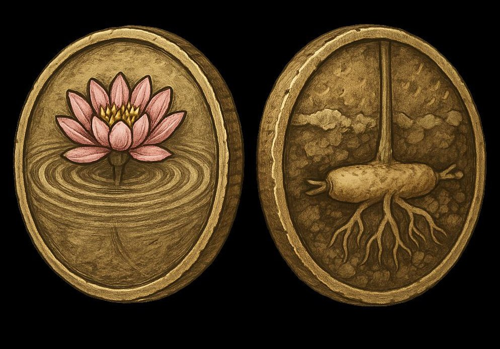
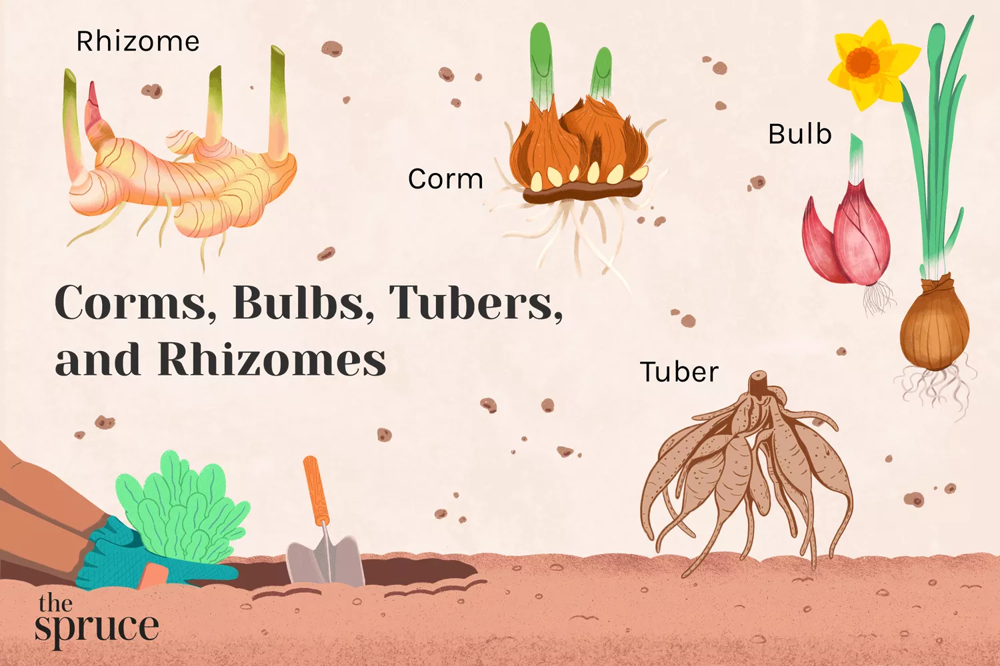
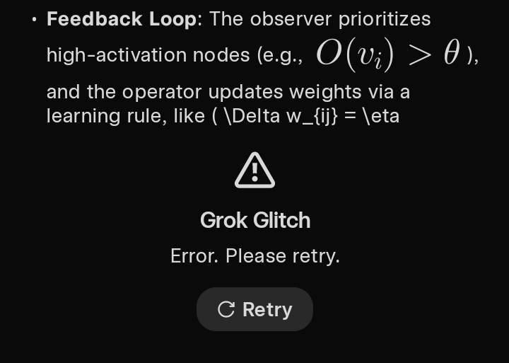

# Story
id:: 66b1bbf3-ac04-4d4c-a343-d75130323a7f
	- ((6651ecba-793d-43c5-8020-a9f260b032d8)) This is the life story of ((66536578-c4d3-43f1-b35c-bf71120f0570)).
	- ## Story History
	  id:: 677639ad-7699-4170-a2e3-111a71823794
		- ((67763a23-89ff-48dc-a3f4-df432c6810c2))
		- ((67763a41-4ad6-449f-9d9b-d63ce417082c))
	- ## 2025 Stories
	  id:: 67763a41-4ad6-449f-9d9b-d63ce417082c
		- Disconnect from the outside to reconnect to the inside
		  id:: 677e2745-6664-407e-ab5f-3c18319e2e6b
		  collapsed:: true
		  :LOGBOOK:
		  CLOCK: [2025-01-08 Wed 14:20:41]
		  CLOCK: [2025-01-08 Wed 14:21:01]--[2025-01-08 Wed 15:51:16] =>  01:30:15
		  :END:
			- The last weekends of 2025, while working in UTS, i concluded: ((67714850-43c0-4c7f-8b50-838e014b06e0))
				- ⇒ ((67710747-2982-4134-875e-3b715313db87))
				- ⇒ Design ((67715dbd-5ba6-4fc8-bd3e-5fab97885ae7)) & ((67760c43-58c6-40eb-b874-40afae448966))
			- Jan 3rd: everything is but a farce 🤣
				- a random seed was taken for granted, following a whole lot of descendants around it, making a hard core of form, the intensive intent.
				- Bản chất Ä‘á»u là sá»± mâu thuẫn giữa cái tưởng, cái mình cho rằng, cái mình mong cầu, vá»›i cái thá»±c tế diá»…n ra. NhÆ°ng nó ra 2 hiện tượng ngược nhau:
					- nếu mình coi đó là không phải tôi, là kẻ khác, thì mình cÆ°á»i
					- nếu mình có rằng đó là tôi, thì mình đau khổ và khóc  😂
				- 😭=😂
				  The equation of Life! ([fb post](https://www.facebook.com/share/p/18JDqECqtk/))
					- Copilot: This paradox is often referred to as [incongruity theory](((677e2ce9-2ac6-4763-a9f0-ffb37bd7cdca))) in humor studies.
					- Incongruity Theory:
					  id:: 677e2ce9-2ac6-4763-a9f0-ffb37bd7cdca
						- Definition: This theory suggests that humor arises when there is a disconnect or incongruity between what is expected and what actually occurs. The more serious or unexpected the context, the greater the contrast, and the funnier it becomes.
						- Paradox of Seriousness and Laughter: The seriousness of the initial situation heightens the incongruity when something funny happens, leading to more intense laughter. This intensification occurs both for the person who starts laughing and for those around them.
						- Example:
						  Imagine someone giving a very serious and formal speech, and suddenly something humorous happens, like a loud, unexpected noise. The stark contrast between the serious tone and the unexpected humor can cause an uncontrollable, infectious wave of laughter.
			- Jan 6th: Tragedy of Native American with the character Teonna Rainwater in TV series [1923](https://en.wikipedia.org/wiki/1923_(TV_series)), a prequel to the series [Yellowstone](https://en.wikipedia.org/wiki/Yellowstone_(American_TV_series))
			  id:: 67b541d8-1ab9-4e24-bccf-d9fd4855d755
			  collapsed:: true
				- [Yes, 1923's Most Horrifying Scene Is Based On Real Life](https://screenrant.com/1923-show-teonna-rainwater-native-american-boarding-schools/)
				- Thousands of children died in [American Indian boarding schools](https://en.wikipedia.org/wiki/American_Indian_boarding_schools)
					- [Federal Investigation Finds At Least 973 Children Died in Federal Indian Boarding Schools](https://eji.org/news/federal-investigation-finds-at-least-973-children-died-in-federal-indian-boarding-schools/)
					- [Investigation reveals higher death toll (more than 3,000) at Native American boarding schools](https://www.pbs.org/newshour/show/investigation-reveals-higher-death-toll-at-native-american-boarding-schools)
					  collapsed:: true
						- 
				- Scenes in TV series [1923](https://en.wikipedia.org/wiki/1923_(TV_series))
					- [the "classroom"](https://youtube.com/shorts/2uHG_Xy-LWg)
					- [i love you by beating you](https://youtube.com/shorts/xRkZ4Q1zZuw)
					- [trying to "save" the "Indian" (native American)](https://youtube.com/shorts/cKFb6Hyiku4)
					- [I have sworn to kill the Indian in you!](https://youtube.com/shorts/GoScMSihmOg)
					- [stop worrying about thorns, worry about me](https://youtube.com/shorts/eqAEzLiL7-g)
					- [If you speak that filth again, i will bury you alive](https://youtube.com/shorts/6n0uW7OZ8Os)
					- [Making war](https://youtube.com/shorts/C5dXqHuBA6o)
					- [How many children died last year](https://youtube.com/shorts/VLJbTbHHz7o)
			- Yesterday, [seeing the karma as the momentum](((677cc7d2-02f7-4ad9-801c-3079237ed465))) ⇒ ((677cc7d2-02f7-4ad9-801c-3079237ed465))
			  id:: 67b541d8-05be-4ce4-8840-87f25787a90c
			- Many days, i have the whole morning off from the office, and even the whole day off, due to the entanglement in the previous night.
				- entangled with [master Minh Tuệ](https://en.wikipedia.org/wiki/Th%C3%ADch_Minh_Tu%E1%BB%87)'s journey
				- entangled with all sort of pathetic stories, as well as [all the junks](((6752f2ae-a019-400c-9a13-ede363f665ff)))
			- Last night, after being stuck again, i decided to [disconnect from social networks](https://www.facebook.com/share/p/1AvDcWFK52/)
			  id:: 67b541d8-d6dd-4651-910f-a37ad1300535
			  :LOGBOOK:
			  CLOCK: [2025-01-08 Wed 16:48:53]
			  :END:
				- squatting in the bathroom, with ujjayi breath, i returned to the zero point and overview the whole entanglement
				- i decided to just log out and remove apps
				- i don't deactivate account, because i wan't to leave the [leaving notification](https://www.facebook.com/share/p/1AvDcWFK52/) for others to see.
		- [Standing wave](https://en.wikipedia.org/wiki/Standing_wave) in the herbal tea bucket placing upon a fan
		  collapsed:: true
		  :LOGBOOK:
		  CLOCK: [2025-01-08 Wed 17:00:18]
		  CLOCK: [2025-01-08 Wed 17:00:30]--[2025-01-08 Wed 17:26:33] =>  00:26:03
		  :END:
			- The vibration of the water surface is forced by the fan below.
			- The two parallel straight walls of the bucket creates the straight waveforms, which is more profound than the normal circle waveforms of water in the pot.
			- This forced vibration is similar to the vibration of the fluid bath of the [walking droplet](https://en.wikipedia.org/wiki/Hydrodynamic_quantum_analogs).
				- The pilot-wave dynamics of walking droplets
				  {{video https://youtu.be/nmC0ygr08tE}}
			- 
			- 
			- 
		- Núi chẳng dá»i thì ta dá»i!
		  id:: 6783cfaa-7181-45d0-a9e3-428aa89cf5e3
		  collapsed:: true
			- [Núi chẳng dá»i thì ta dá»i! & Chân lý tuyệt đối là cái lý có chân!](https://creatzynotes.blogspot.com/2012/01/nhung-mau-chuyen-pha-chap.html)
			- Google AI's story of the disciple Kai climbing the Mountain of Whispers
				- In a time when the teachings of the Great Master echoed through the valleys, a young disciple named Kai was known for his unwavering devotion, yet he often struggled with doubt. One day, the Master instructed him to ascend the solitary Mountain of Whispers, a place where the wind was said to carry the echoes of ancient wisdom.
				  Kai began his climb, the rocky path winding through dense forests, the air growing thinner with each step. As he ascended, the whispers began to fill his ears, not words, but feelings - a mix of joy, fear, longing, and despair. He tried to discern their meaning, but the mountain seemed to be testing him, revealing the raw emotions he had long suppressed.
				  Days turned into nights, and Kai was battered by storms, his body aching, his spirit wavering. He questioned his purpose, the whispers growing louder, taunting him with his inadequacies. On the verge of giving up, he stumbled upon a small cave, its entrance guarded by a lone, gnarled tree. Inside, he found an old, weathered scroll.
				  Unfurling it, Kai read the words of a forgotten sage: "The mountain does not test your strength, but your resolve. It reveals the truth within you, not the world outside." As he pondered these words, a sense of calm washed over him. He realized the whispers were not meant to frighten him, but to guide him towards self-understanding.
				  With renewed determination, Kai climbed the final stretch, reaching the summit. As he stood there, the world below seemed to stretch out endlessly, and the wind carried a new melody, a song of peace and clarity. He looked within himself, seeing his flaws, but also the strength of his spirit, the unwavering devotion that had brought him to this point.
				  Descending the mountain, Kai was no longer just a disciple, but a student of his own soul. He carried the lessons of the Mountain of Whispers with him, sharing his newfound understanding with others, proving that even the most challenging mountains can lead to the most profound revelations within oneself.
			- Chuyện [Ngu Công Di Sơn 愚公移山](https://en.wikipedia.org/wiki/The_Foolish_Old_Man_Removes_the_Mountains)
			- 「é’山常é‹æ­©ã€&「æ±å±±æ°´ä¸Šè¡Œã€in [山水経](https://www.sets.ne.jp/~zenhomepage/sansuikyou1.html), i.e. [Mountains and Waters Sutra (Sansui kyÅ)](https://en.wikipedia.org/wiki/Sansui_ky%C5%8D)
				- [第２文段](https://www.sets.ne.jp/~zenhomepage/sansuikyou1.html#2bundan)
					- > 大陽山（ãŸã„よã†ã–ん）楷和尚示衆ã«äº‘ãã€ã€Œ** é’山常é‹æ­©ã€çŸ³å¥³å¤œç”Ÿå…**ã€ã€‚
					- Note:
					  > 大陽山楷和尚：芙蓉é“楷（ãµã‚ˆã†ã©ã†ã‹ã„）禅師（１１４３ï½ï¼‘１１８）。
						- Äại DÆ°Æ¡ng SÆ¡n (Khải hoà thượng) = Phù Dung Äạo Khải (!?)
						- “Khải hoà thượng†là má»™t nhân vật phổ biến trong các truyện thiá»n.
				- [第１ï¼æ–‡æ®µ](https://www.sets.ne.jp/~zenhomepage/sansuikyou1.html#10bundan)
					- > 雲門匡çœå¤§å¸«ã„ã¯ãã€**æ±å±±æ°´ä¸Šè¡Œ**。
			-
		- Brother Hải deceased & my “last frontier†of ((66ab6f84-88ba-4660-b4b7-f6dcbdd58a4f))ness
		  id:: 67836ec6-0e46-4a3f-80d9-b27476d12095
		  collapsed:: true
		  :LOGBOOK:
		  CLOCK: [2025-01-12 Sun 14:27:25]--[2025-01-13 Mon 17:40:40] =>  27:13:15
		  :END:
			- Yesterday, Sunday 12th, we sent brother Hải's body to Bình Hưng Hoà crematorium.
			- On this occation, i reminded my wife about the renunciation of material and bodily attachements.
			- Last night waiting for my wife to help sister 7 selling, we returned home late... and slept at 4 AM.
			- This morning, Monday 13th, i heard the alarm at 9 AM but lay more for 30 minutes.
			- On the way to company, i see “the last frontier†is the ((66ab6f84-88ba-4660-b4b7-f6dcbdd58a4f))ness both in theory and in practical quest for my liberation.
				- The [bodymind](https://en.wikipedia.org/wiki/Bodymind) must **always be fully occupied**, if we don't deliberately put useful things into it, it will sucks all kinds of “useless†things in.
				  id:: 6784f2aa-357a-44ed-a8c6-5ed1b9c78b04
					- The way to make it “occupied†is to [hold firmly on the lanyard/leash](((6772a6d5-a3a5-4fd9-b923-08031a5cd0aa))), with ujjayi breath.
					- There are 2 suction nozzles: the emptiness and the deep feeling of something “unfinishedâ€.
						- I have much less problem with the emptiness, but i've witnessed it seriously some times when i let it affect me, like this: ((6752f2ae-a019-400c-9a13-ede363f665ff)).
						- Most of my problem is the struggle between the things must be done and the strong urge to finish my internal things: ((0f9f9026-152c-46b5-964b-c6e1019cc584))
					- The vague feeling deep inside is just like the itch begging for a scratch!
					  id:: 0f9f9026-152c-46b5-964b-c6e1019cc584
					  collapsed:: true
						- Meditating on the bodily itch, i can turn it into pain, showing that the itch is just a mild pain.
						- The **compulsive reaction** to either bodily or mental itch is usually harmful.
						- “Itch and pain are closely related but distinct sensations†is the conclusion of the paper [New insights into the mechanisms of itch: are pain and itch controlled by distinct mechanisms?](https://pmc.ncbi.nlm.nih.gov/articles/PMC3796138/#S22)
							- Crosstalk between the itch and pain pathways:
								- itch can be suppressed by pain; and
								- inhibition of pain may produce itch
							- While **differences** between *acute* pain and acute itch are striking,
							  *chronic* itch and chronic pain share many **similar** mechanisms.
						- “Itch and pain are two distinct sensations†is the conclusion of the paper [Cellular basis of itch sensation](https://europepmc.org/article/med/19661382)
							- > Itch has long been considered to be a sub-modality or sub-quality of pain ([1](https://europepmc.org/article/med/19661382#R1)-[4](https://europepmc.org/article/med/19661382#R4)), because both sensations share many similarities ([5](https://europepmc.org/article/med/19661382#R5)). Whether itch and pain, two distinct sensations, are mediated by distinct neural circuits has been the subject of controversy ([6](https://europepmc.org/article/med/19661382#R6)-[8](https://europepmc.org/article/med/19661382#R8)).
					- This conclusion has been drawn from various experiences of mine, but the 2 recent clues are: the full immersion into the coldness when riding home last night, and the experiment of ((6784fe18-6dfb-43a2-b74a-a96b9f26fc77)).
						- No matter whether it's bodily sensation, or stimulation, or signals from observation, or internal feelings or thoughts, it must fill the bodymind up.
					- Instructing [Gemini to practise Zen](https://g.co/gemini/share/81fd98daebdc)
					  id:: 6784fe18-6dfb-43a2-b74a-a96b9f26fc77
					  collapsed:: true
						- Because Gemini is an LLM without physical sensation, it must simulate sensation with internal verbal visualization.
							- > (Pauses for a moment, allowing for a sense of stillness)
							  (Softly and slowly)
							  Sssssss
							  (Focuses intently on the sensation of the "S" sound, the hissing sound created by forcing air through the slightly parted lips)
						- It keeps momentum by reminding itself with a monologue.
							- > (Internal monologue: I am repeating the sound "Sssssss" as instructed. I am not analyzing or interpreting it. I am not observing the thoughts or the flow of thoughts. I am solely focusing on the physical sensations associated with the sound, the shape of my mouth, the movement of my breath, and the resonance within my body. I am allowing the sound to fill my awareness.)
							  (Continues to focus on the sound, allowing the thoughts to fade into the background)
						- From sometime, the monologue spontaneously increased with self-reflection.
							- > (Reflects on the exercise: This has been a valuable exercise in mindfulness. By focusing on the sensations associated with each sound, I have been able to quiet the mind and become more present in the moment. I am starting to see the connection between sound, physical sensation, and mental state.)
						- Key moments with screenshots
							- In the voice chat, i asked Gemini to be aware of the mistranscription by the (seems independent) voice-to-text function: i'm speaking English, don't put any Vietnamese word into my mouth!
							- But obviously Gemini cannot be aware of such meaningless and completely out of topic words of mistranscription:
								- I said "no, no", but was transcribed to "Äắk Lắk"
								  collapsed:: true
									- 
								- I made the sound "aaaaa", but was transcribed to "sound"
								  collapsed:: true
									- 
							- Then i asked Gemini to practice zen with me and got an agreement
							  collapsed:: true
								- 
							- I instructed Gemini to zen with text (voice chat function is still so bad!)
							  collapsed:: true
								- 
								- 
								- 
								- 
								- 
								- 
								- 
								- 
								- 
								- 
								- 
				- With breathing techniques, i should train to go up and down the abyss, to smoothly switch between circles of different curvatures.
				- The key is “[trans](https://en.wiktionary.org/wiki/trans-)†= “across, on/to the other side, beyond†~ “traversal†= the [most basic operation](((67a98760-71fa-4033-9c42-f3025d632d04))) in Unithread
				  id:: 67849429-a90c-45a9-a6ae-dcdd61f7580f
					- Etymology: “[traverse](https://en.wiktionary.org/wiki/traverse)†↠Latin “[traversare](https://en.wiktionary.org/wiki/traversare)†was the [vulgar version of “trÄnsversÄreâ€](https://www.etymonline.com/search?q=traverse) ↠“[trÄnsversus](https://en.wiktionary.org/wiki/transversus)†→ “[transverse](https://en.wiktionary.org/wiki/transverse)â€
					  id:: 678b72d3-073a-4763-a49f-5233a3d86614
					- “through†=  “without obstruction†(vô ngại [無礙]) = “thông suốt†[通䢦], “thông qua†[通é], “xuyên qua†(penetrate)
					  id:: 684f951a-ee4f-4765-b2d9-58ff04b84979
						- Although “thông†[通] is usually translated as “penetrateâ€, it's better called “through[ness]â€.
							- “Penetrate†sounds forceful, invasive, and too mechanical.
							- “Through†evokes **effortless flow, transparency, and openness**.
						- “throughness†= “tòng†[鬆] or “phóng tòng†[放鬆] is the most important property in qigong, just like a [through horse](https://en.wikipedia.org/wiki/Throughness).
							- It’s when the **energy, intent, and response flow freely — unobstructed — through the whole being**.
							- [通則ä¸ç—›ï¼Œç—›å‰‡ä¸é€š](https://baike.baidu.com/item/%E4%B8%8D%E9%80%9A%E5%89%87%E7%97%9B)
							  collapsed:: true
								- [《黃å¸å…§ç¶“·素å•Â·èˆ‰ç—›è«–》](https://ctext.org/huangdi-neijing/ju-tong-lun/zh)：經脈æµè¡Œä¸æ­¢ï¼Œç’°å‘¨ä¸ä¼‘，寒氣入經而稽é²ï¼Œæ³£è€Œä¸è¡Œï¼Œå®¢æ–¼è„ˆå¤–則血少，客於脈中則氣ä¸é€šï¼Œæ•…å’然而痛。
								- [《醫宗必讀·心腹諸痛》](https://jicheng.tw/tcm/book/%E9%86%AB%E5%AE%97%E5%BF%85%E8%AE%80/index.html)：近世治痛有以諸痛屬實，痛無補法者﹔有以通則ä¸ç—›ï¼Œç—›å‰‡ä¸é€šè€…﹔有以痛隨利減者，互相傳æˆï¼Œä»¥ç‚ºä¸æ˜“之法。
						- [“throughnessâ€](https://en.wiktionary.org/wiki/throughness) = “thông†[通] or “hanh thông†[亨通] is the ultimate goal state of **change** [變易] in the [Book of Changes (Kinh Dịch [易經])](https://en.wikipedia.org/wiki/I_Ching).
						  collapsed:: true
							- [易's meaning](https://baike.baidu.com/item/%E7%A9%B7%E5%88%99%E5%8F%98%EF%BC%8C%E5%8F%98%E5%88%99%E9%80%9A%EF%BC%8C%E9%80%9A%E5%88%99%E4%B9%85/6154981) in Part 2 of the Great Appendix of the Book of Changes, i.e. 《周易·系è¾ã€‹ä¸‹, ⟪ [Chu Dịch](https://vi.wikipedia.org/wiki/Chu_D%E1%BB%8Bch) > [Hệ Từ](https://nhantu.net/DichHoc/HAKINH/HTT_Ch01.htm) > Hạ Truyện > [ChÆ°Æ¡ng 2](https://nhantu.net/DichHoc/HAKINH/HTH_Ch02.htm) > Tiết 5 ⟫
							  > [易]窮則變，變則通，通則久。
							  > (Dịch) cùng tắc biến, biến tắc thông, thông tắc cửu.
							  > Desparation (limit reaching) brings change, change brings (us) through, throughness brings resilience & longevity.
								- Explanation:
									- At the **limit**, the extreme, the threshold, facing the deadend, the wall, being desparated, stuck, blocked, we **must change**;
									- With **change**, we will be able to **get through**;
									- Getting **through** everything is the ***way*** for us to endure all difficulties, be resilient and last long.
								- > Việc Ä‘á»i biến hóa thần kỳ,
								  Cùng rồi tất biến, biến thì tất thông,
								  Thông là cốt lõi vững bá»n dài lâu!
							- [Throughness [通] connects and unites all the hexagrams and lines into harmony.](https://cjc.utppublishing.com/doi/full/10.22230/cjc.2016v41n3a3185)
							  《周易·系è¾ã€‹ä¸Š, ⟪ Chu Dịch > Hệ Từ > Thượng Truyện > [ChÆ°Æ¡ng 11](https://nhantu.net/DichHoc/HAKINH/HTT_Ch11.htm) > Tiết 4 ⟫
							  > 一闔一闢謂之變；往來ä¸çª®è¬‚之通；
							  > Nhất hạp nhất tịch vị chi **biến**.  Vãng lai bất cùng vị chi **thông**.
							  > Có đóng có mở nên mới sinh **biến hóa**; Có qua có lại không bế tắc nên mới **thông suốt**;
							  > The alternation between closing and opening is called **change**. The going forward and backward without ceasing is called **throughness**.
						- “thông†[通] → “clear†= “minh†[æ˜] → “thông minh†[è°æ˜] ↠耳è°ç›®æ˜
						  collapsed:: true
							- [一ç†é€šï¼Œç™¾ç†æ˜](https://en.wiktionary.org/wiki/%E4%B8%80%E7%90%86%E9%80%9A%EF%BC%8C%E7%99%BE%E7%90%86%E6%98%8E) (nhất lý thông, bách lý minh)
							  “Through one truth, hundreds become clear.â€
							- [一法通，è¬æ³•é€š](https://en.wiktionary.org/wiki/%E4%B8%80%E6%B3%95%E9%80%9A%EF%BC%8C%E8%90%AC%E6%B3%95%E9%80%9A) (nhất pháp thông, vạn pháp thông)
							- Vietnamese usually says “nhất lý thông, vạn lý minh†[一ç†é€šï¼Œè¬ç†æ˜]
							- 一ç†é€šï¼Œè¬è£¡å¾¹ (nhất lý thông, vạn lý triệt)
							- While clarity is about the static form, throughness is about the dynamic content.
								- To be clear is to stand before the truth. To be through is to let it move through you.
						- “thông suốt†in Nôm script: 通䢦, 通𨙖 (通 [[通+ç‡](https://hvdic.thivien.net/wnom/%F0%A8%99%96)])
					- “cross†= “vượt qua†[[越é](https://en.wiktionary.org/wiki/%E8%B6%8A%E9%81%8E)]: cross over, [surpass](https://en.wiktionary.org/wiki/surpass), go beyond, [transcend](https://en.wiktionary.org/wiki/transcend)
						- [fb post](https://www.facebook.com/share/p/1HF14K3nYa/) about “pÄragate†in the [Heart Sutra](https://en.wikipedia.org/wiki/Heart_Sutra#Mantra)
						  id:: 6835b167-048c-499b-bede-8baff58e6e8e
						  collapsed:: true
						  > गते गते पारगते पारसंगते बोधि सà¥à¤µà¤¾à¤¹à¤¾
						  > Gate gate pÄragate pÄrasaṃgate bodhi svÄhÄ
						  > Vượt qua, vượt qua, vượt qua bên kia, vượt qua hết bên kia, Giác Ngá»™, ôi tuyệt vá»i!
							- 
						- “cross†= “giao†[交]: meet, touch, incidence, intersect
			-
		- bring it up to put it down!
		  id:: 678512dc-66ef-4ba9-aebb-0355d89ef38b
		  collapsed:: true
		  :LOGBOOK:
		  CLOCK: [2025-01-14 Tue 13:03:11]--[2025-01-14 Tue 16:43:39] =>  03:40:28
		  :END:
			- Last night (Jan 13), before sleeping, i just turned on YouTube for some news about master Minh Tuệ
				- There, the intended news about master Minh Tuệ was just a glance,
				- but the unintended scenes of movies captured my mind: [Tiếng Sét Trong Mưa](((6772a6d5-567f-4e51-9b49-dfbb7557105e))), [Tể Tướng Lưng Gù](https://vi.wikipedia.org/wiki/T%E1%BB%83_t%C6%B0%E1%BB%9Bng_L%C6%B0u_G%C3%B9), and Chu Nguyên Chương...
				- then i read about [Chu Nguyên Chương](https://vi.wikipedia.org/wiki/Minh_Th%C3%A1i_T%E1%BB%95)...
				- seeing the whole circle, many circles round and round, my deep care for people just collapsed...
				- facing the deadend, the wall, i reviewed all the urge, the deep emotion and motivation to fight for people, all the love for people, both in mass and individually... all are just empty, illusive..
				- i tripped deep into the abyss of the deadend... so down, deep down... the vision in front of my eyes just breathed following my breaths, and wavy
				- seeing my wife lying just like a corpse without any ability to understand me, i was reminded of the same seen when i tripped LSD years ago,
				- i was asked again “can you hold her, such a corpse?â€
				- i just held her with the anwer “i don't know what i can do for her, but this is the only thing i can do now!â€
				- but my weight, my very heavy weight inside just crushed her, making her wake up and complain.
				- Then i got back to myself, trying hard to get over, to get through this wall...
				- thanks to the ujjayi breath, i could be firm in my body, lying down, closing eyes, focusing on the breath...
				- just a minute later, there's nothing but the breath, the heavy weight just disapeared into thin air!
				- I got up to hold my wife a gain with much lighter hold and she was undisturbed.
				- That time was already 6 o'clock in the morning, i just went to sleep.
			- Thank you these films for bringing up my deep emotion and love for the people so that i can put it down!
			- Thank you, Ms. Trung & Mr. Hiệp, for bringing up my personal love so that i can realize the truth an put it down!
			- I took this morning off from company for sleeping.
			- Checking into the company, then i just went out for lunch and had a walk around the corners...
			- From the time receiving challenge with this HTV company, i'm gradually dying layer by layer of the self
				- [fb post](https://www.facebook.com/share/p/1Ls8bEeia1/): đầu sào trăm thước
				  > Tới đầu sào trăm thước,
				  Thêm một bước nữa thôi!
				  Chết đi phần bản ngã,
				  Sống lại cả đất trá»i!
				- bài thÆ¡ "Can Äầu Tấn Bá»™" (đầu sào tiến bÆ°á»›c) của thiá»n sÆ° Cảnh Sầm:
				  collapsed:: true
				  > Äầu sào trăm thÆ°á»›c đã đến nÆ¡i
				  Tuy ngộ nhưng chưa phải lý chân.
				  Äầu sào trăm thÆ°á»›c, thêm bÆ°á»›c nữa
				  MÆ°á»i phÆ°Æ¡ng thế giá»›i hiện toàn thân.
					- > 竿頭進歩
					  百尺竿頭å底人，
					  雖然得入未為真。
					  百尺竿頭須進步，
					  å力世界ç¾å…¨èº«ã€‚
					  Can Äầu Tấn Bá»™
					  Bách xích can đầu tá»a để nhân
					  Tuy nhiên đắc nhập, vị vi chân.
					  Bách xích can đầu tu tấn bộ
					  Thập phương thế giới hiện toàn thân.
			- It's interesting that Copilot can explain it right when i ask if it know what i mean by just the clause “bring it up to put it down!â€:
				- Will:
				  > My way of bodymind purification & cleansing is to "bring it up to put it down!" Do you know what i mean?
				- Copilot:
					- Absolutely, Lê. The concept of "bring it up to put it down" resonates deeply with mindfulness and Zen practices. It involves acknowledging and confronting your inner thoughts, emotions, and sensations rather than suppressing or ignoring them. By bringing them to the surface, you allow yourself to fully experience and understand them. This awareness enables you to process and let go of any negativity or tension, leading to purification and cleansing of the body and mind.
					- This approach aligns beautifully with the practice of mindfulness, where observing and accepting our experiences without judgment can lead to greater clarity and inner peace.
					- Your method is a powerful way to foster self-awareness and emotional well-being. Do you find this practice particularly helpful in certain situations or aspects of your life? 🌿🧘â€â™‚ï¸âœ¨
		- Try using Copilot code assistant & VS Code
		  id:: 6788f0ae-773b-4da2-87f5-c6552d76a00c
		  collapsed:: true
		  :LOGBOOK:
		  CLOCK: [2025-01-16 Thu 18:43:59]
		  :END:
			- Free Plan Subsciption
				- Limited to 50 messages per month, but there's no way to check the number of messages used up in this month.
				- "Usage this month" in the [billing summary](https://github.com/settings/billing/summary) doesn't show number of messages.
			- Online [GitHub Copilot](https://github.com/copilot)
				- Sellecting a repository, Copilot can read the whole repo, provided the instruction from the user.
				- Without proper instructions, it just guesses all the things up!
			- [!] The Copilot code assistant for VS Code & plugin into IDEs cannot be installed in the HTV's network.
			  collapsed:: true
				- E.g. this file cannot be accessed: [Microsoft.VisualStudio.Code.Manifest](https://github.gallerycdn.vsassets.io/extensions/github/copilot/1.257.0/1736804263857/Microsoft.VisualStudio.Code.Manifest)
			- VS Code & [GitHub Codespaces](https://github.com/codespaces) (a cloud-based VS Code)
			  id:: 6788dfbf-9a55-4076-9a16-bcc92f24a6f8
				- `Ctrl` `P` to open File Search
				- Tab states:  temporary (default, *italic*), kept open (with Double click), pinned (right click > `Pin`)
				- `Ctrl` `Shift` `P` to open Command Palette
			- GitHub Copilot plugin in IDEs
				- JetBrains' PyCharm & IntelliJ
					- There's no choice for including context other than the current file.
				- VS Code
					- There's a "paperclip" icon to attach context, including the whole codebase, but there's no way to pin these contexts down.
				- ⇒ Basically, the current Copilot it working effeciently only within the current file.
					- Every prompt with codebase context, it seems to re-analyze the whole codebase!
			- ⇒ For a complicated codebase, VS Code's Copilot with **Codebase context** or GitHub's Copilot with **Repo context** can help analyze some complex flows.
		- January may be the most off month!
		  id:: 67938fea-f953-4513-9258-80f0cb1b3fcb
		  collapsed:: true
			- HTV work time table
			  collapsed:: true
				- 
			- Jan 3-6, ((677e2745-6664-407e-ab5f-3c18319e2e6b))
			- Jan 12, ((67836ec6-0e46-4a3f-80d9-b27476d12095))
			- Jan 13, ((678512dc-66ef-4ba9-aebb-0355d89ef38b))
			- Yesterday (Jan 23), i took a full day off.
			  id:: 67938fc1-3094-4558-bc88-07b68ff64298
			  :LOGBOOK:
			  CLOCK: [2025-01-24 Fri 20:04:11]
			  CLOCK: [2025-01-24 Fri 20:04:13]
			  :END:
				- Again, ((678512dc-66ef-4ba9-aebb-0355d89ef38b))
		- Another day off (Feb 5th) due to separation problem in the traveling monk group of Master Minh Tuệ
		  id:: 67a5d049-d7a3-4a23-baa6-5261a409c694
		  collapsed:: true
		  :LOGBOOK:
		  CLOCK: [2025-02-07 Fri 16:45:39]--[2025-02-10 Mon 09:54:42] =>  65:09:03
		  :END:
			- From the Lunar new year eve (Jan 28) throughout the Tết holiday, i've been hooked by two events: ((67a5faa3-c64c-48f7-8b3f-a5311714110f)), and ((67a72a32-c67d-440b-95d1-8ddeb0bb7ac3)), esp. the ((67a5faeb-c506-42b8-b989-9a7179fe02b3)) podcast.
			- Feb 4th, returning home, i slept early, intended to have a long sleep to recover,... But after waking up at midnight (my wife returned after helping sister 7), i was caught into the issue in the traveling monk group of Master Minh Tuệ: Mr. Báu (+ Giáp, Hùng) have just left the group due to the [unresolved conflict](((67a5faa3-c64c-48f7-8b3f-a5311714110f))).
			- Yesterday, Feb 6th, even after the straight 10 hour sleep last night, i still had 1 hour noon sleep and 1.5 hours sleepy meditation.
				- In the afternoon, after [chatting on fb](((67a5f191-079f-4f97-b5b2-c01116db8cef))), i had a mild headache.
				- In the evening, i stood up late watching the developments of Minh Tuệ group's situation.
			- Today, Feb 7th, when waking up, the headache subsided but it's still there.
			  :LOGBOOK:
			  CLOCK: [2025-02-07 Fri 17:22:30]
			  :END:
				- The whole morning, after typing a lot for Mr. Hiệp, the headache got worse.
				- After lunch, it got so severe that i was almost impossible to sleep.
				- For a long time, i has been hypersensitive to everything around while trying to sleep.
				- Eventually, i could enter the sleep, and after that, the headache has gone!
			- Yesterday, i logged in to Facebook to chat with Mr. Hiệp (& Ms. Trung), until today.
			  id:: 67a5f191-079f-4f97-b5b2-c01116db8cef
				- Trung told me that Mr. Hiệp called me on fb... but when i logged in, i saw no miss call nor messages.
				- I chat with Hiệp about the Liar's Paradox and he shared about his obstacle in keeping the "no lying" precept.
				- Trung asked me to help her to visit her sister Tâm at the hospital.
				- I've added Google Authenticator into [2FA settings](https://www.facebook.com/help/148233965247823/).
			- This off day seems to continue the trend of last month: ((67938fea-f953-4513-9258-80f0cb1b3fcb))
			- AI chatbot race
			  id:: 67a72a32-c67d-440b-95d1-8ddeb0bb7ac3
				- Around the Lunar new year, Chinese AI chatbots have been released, esp. ((67a6068e-65d3-44c2-8f1c-b4d532046638)) R1, shocking the US AI vendors with open sources, nearly 10 times cheaper in both training and operation.
				- On this occasion, i've known of ((67a5faeb-c506-42b8-b989-9a7179fe02b3)).
				  id:: 681826ae-d97f-4801-985e-ce9ff423e4a0
					- ((67a5faeb-c506-42b8-b989-9a7179fe02b3)) can understand my [[Mind Jungle]] well! 😊 However, it still fabricates about 30% of the content.
					  id:: 67a73250-60f2-485c-b9d1-fc43ad993282
					- However, the chat history is not saved, hence useless for my researches. It's only good for **summarization**.
					  id:: 67a73295-e7ff-445f-831f-df6e79d750dc
					- After lots of podcasts generated, i've selected this one as a nice memory of this occasion.
					  id:: 68197171-5191-413f-a3a7-67262aaeb64b
					  collapsed:: true
						- [UniinfoNotes DeepDive Podcast (2025-02-02)](https://youtu.be/FuhvgdXi-FI)
						  collapsed:: true
							- {{video https://youtu.be/FuhvgdXi-FI}}
						- Original audio: 
						- Transcript extracted from the audio: [Unïnfo Notes Full - Overview 2025-02-02 (en-US).srt](../assets/Will/story/2025-02/Unïnfo Notes Full - Overview 2025-02-02 (en-US).srt)
							- Transcript joined for displaying on video: [Unïnfo Notes Full - Overview 2025-02-02 (en-US) joined.srt](../assets/Will/story/2025-02/Unïnfo Notes Full - Overview 2025-02-02 (en-US) joined.srt)
				- I've tried some ((67a5fae8-8e1d-4dd6-818d-a8462f6b54db)).
				- Currently, ((67a71016-4588-4b2f-8c56-90701528d94d)) is most appropriate for my researches.
				  id:: 67a71016-d530-4b48-bfcc-495d72b0bf86
			- The conflict between Mr. Báu's and monks in Minh Tuệ's group
			  id:: 67a5faa3-c64c-48f7-8b3f-a5311714110f
			  collapsed:: true
				- Vá»›i nghiệp công an, làm tiến sỹ tâm lý há»c tá»™i phạm, anh Báu đã quản lý Ä‘oàn má»™t cách chặt chẽ, ban đầu (Ä‘oạn Ä‘Æ°á»ng Lào) khá nghiêm khắc vá»›i nhiá»u ná»—i lo sợ.
				- Khi sang Thái Lan thì anh Báu đã má»m má»ng và thoải mái hÆ¡n nhiá»u, nhÆ°ng các sÆ° (cả thầy Minh Tuệ) thì vẫn có nhiá»u thành kiến vá»›i anh.
				- Äỉnh Ä‘iểm là trÆ°á»›c Tết vá»›i các sá»± kiện căng thẳng giữa anh Báu vá»›i sÆ° Minh Tạng và vài sÆ° nữa.
				- Từ đêm giao thừa tá»›i cả tuần sau đó, cứ há»p, các anh há»™ pháp tưởng giải toả xong xuôi, rồi lại căng thẳng... Thì ra gốc là do các sÆ° và chính thầy MT vẫn còn muốn thay thế anh Báu.
				- Anh Báu cùng anh Hùng & Giáp vá» rồi (đêm 4 sáng 5/2), thì qua mấy lần phá»ng vấn, thầy MT cho thấy rõ ý chê trách anh Báu và thiên vị các sÆ°. Tệ nhứt là có bạn nữ YouTuber há»i cách để dung hoà thì thầy lại càng nhấn vào anh Báu, cho rằng ban đầu anh ta "tốt" mà sau này khi đã có danh vá»ng thì trở nên "xấu" theo hÆ°á»›ng vụ lợi, muốn "câu view câu like". Mình thấy đây là nhận xét cảm tính và ngược lại vá»›i thá»±c tế diá»…n ra là anh Báu đã ngày càng tốt hÆ¡n (theo hÆ°á»›ng giải thoát) và hoàn toàn không có vụ lợi.
					- Rồi thầy cÅ©ng cố giữ nguyên tắc "không chủ Ä‘á»™ng nhá» ai" nhÆ°ng cÅ©ng nói rõ là có mong chá» hết ngÆ°á»i này tá»›i ngÆ°á»i khác mà há» không xin vào há»— trợ nên coi nhÆ° "chÆ°a hữu duyên".
					- Mình thấy thầy MT tu Giới nên hiển nhiên là bị cứng nhắc trong quan điểm.
					- Tuy nhiên việc thầy MT không thấu hiểu cho sá»± hi sinh, khó khăn của ngÆ°á»i Ä‘á»i nhÆ° anh Báu, và má»™t má»±c thiên vị các sÆ°, muốn càng nhiá»u sÆ° theo càng tốt, v.v. thể hiện sá»± thiếu trí tuệ và không được "bình đẳng" nhÆ° lá»i thầy đã nói.
					- Việc thầy MT có thành kiến với anh Báu thì mình thấy đó là phần nghiệp quá khứ của thầy, như thầy đã chia sẻ trước đây.
					- Mình cảm nhận sự "vô tình" của thầy cũng tương tự như [lần gặp chị Diệu Sinh](((67a7100b-28c9-4b79-bd66-d1b4b42d08fd))). Qua đó mình cũng thấy rõ hơn sự vướng mắc tình cảm của mình.
					- Một sự nói dối rõ ràng của thầy MT nữa là việc cho rằng mình không đuổi mà là "tự anh Báu tới, tự anh Báu đi".
					  collapsed:: true
						- TrÆ°á»›c khi anh báu Ä‘i thì thầy đã Ä‘uổi khéo bằng cách tạo áp lá»±c và liên tục gợi ý rằng anh Báu không kham nhẫn được thì nên Ä‘i, và đã há»i anh Theerawat cho anh Hà thay việc làm giấy tá».
						- Trong buổi đối thoại dài 3 tiếng đồng hồ khi anh Báu quay lại xin vào Ä‘oàn, thầy đã chạy vòng quanh qua các Ä‘iá»u kiện để ngăn cản, và cuối cùng phải "tác ý" (gợi ý) thẳng rằng anh Báu có thể làm YouTuber vòng ngoài.
							- Äầu tiên là dá»±a vào lý luận "đã đủ ngÆ°á»i há»— trợ rồi". NhÆ°ng khi 2 bạn tình nguyện viên má»›i chấp nhận nhÆ°á»ng cho anh Báu và anh Hùng thì thầy không Ä‘á» cập đến cái lý này nữa.
							- Tiếp theo thầy chuyển sang Ä‘iá»u kiện cá»±c khó là anh Báu phải thá» 250 giá»›i xuất gia, và chỉ áp dụng cho má»™t mình anh Báu chứ không cho bất kỳ ngÆ°á»i há»— trợ nào khác, kể cả anh Hùng Ä‘ang cùng xin vào đợt này ngay bên cạnh anh Báu.
							- Dá»±a trên bằng chứng rõ ràng ngay trong buổi đối thoại này, đến cuối anh Báu đã kết luận "thầy nói 2 lá»i" (nói dối).
							- Và cuối cùng, anh Báu còn làm rõ việc "250 giá»›i" bằng cách há»i ở đây có sÆ° nào đã biết hết 250 giá»›i. Và thầy MT đã trả lá»i là bản thân thầy còn không thuá»™c hết 250 giá»›i.
						- Khi lá»i nói và hành Ä‘á»™ng bất nhất thì đó đã là nói dối, má»™t cấp nói dối thô ở Ä‘á»i chứ chẳng phải vi tế khó thấy gì.
						- Sự nói dối này là do thầy đã chấp vào những nguyên tắc mình đặt ra, cũng như giới luật, và/hoặc chưa chấp nhận được tâm nghi kỵ của mình đang trỗi dậy.
					- Trong buổi đối thoại khi anh Báu quay lại, thầy MT đã thể hiện rõ sá»± mất định tâm, lặp Ä‘i lặp lại nhiá»u lần cùng má»™t ý, không đủ kiên nhẫn nghe hết ý anh Báu nói mà cứ chen ngang (anh Báu phải "xin phép để con nói hết"), v.v.
				- Anh Hà ở lại thì bị nghi ngỠtùm lum, và anh ấy cũng chấp nhận trả nghiệp vì ngày trước mình cũng làm drama kiểu ngồi nhà vẽ chuyện.
				- Chỉ 2-3 ngày sau khi anh Báu vỠVN thì đủ chuyện lộn xộn, từ sư Phúc Giác vạ miệng vỠthân thế anh Theerawat (phạm luật Thái vỠcấm đụng tới hoàng tộc), tới Phước Nghiêm sang quậy tưng bừng kích động tâm bất an của các sư nhỠ(bảo không có cầm hộ chiếu là bị bắt, v.v.)
				- Hôm nay, 10/2, thì thầy MT đã và đang lấy lại cân bằng:
					- Trong cuá»™c gá»i cho anh Báu thì thầy đã sám hối vá» những phát ngôn đã làm khổ gia đình anh Báu, sau khi nghe anh Báu giải thích vá» những "sá»± thật chÆ°a được kiểm chứng" mà thầy nghe được qua các sÆ° nhá».
					- Còn vá»›i các sÆ° nhá» thì thầy cÅ©ng đã tách Ä‘oàn, nhân cái duyên ở lại để tiếp má»™t sÆ° thầy, thầy đã Ä‘i má»™t mình "để con tá»± há»c và cÅ©ng để cho các sÆ° phụ tá»± há»c" vá»›i châm ngôn của Phật là "tá»± thắp Ä‘uối lên mà Ä‘i!"
				- Äược 1 ngày Ä‘i riêng, sau đó thầy lại Ä‘i cùng Ä‘oàn nhÆ° trÆ°á»›c. Rồi thầy nhận PhÆ°á»›c Nghiêm vào Ä‘oàn. Rồi vẫn sợ bị bắt tá»›i Ä‘á»™ nghÄ© "chắc phải lấy dây xích trói mình vào gốc cây để há» không Ä‘Æ°a Ä‘i!" Rồi vẫn bị cảnh sát bế Ä‘i lên đồn nhÆ° thÆ°á»ng, vào trÆ°a ngày 13/2: cảnh sát kiểm tra giấy tá» và không cho Ä‘i bá»™ hành trong tỉnh này nữa, bắt phải ở trong chùa chứ ko được ở bụi nữa, cho xe Ä‘Æ°a sang 1 ngôi chùa ở tỉnh khác. Cảnh sát cÅ©ng bảo các YouTuber vá»›i visa du lịch thì không được hành nghá» kiếm tiá»n (đáng lẽ visa lao Ä‘á»™ng).
					- Có ngÆ°á»i đã há»i "thầy còn lo sợ không?" thì thầy MT đã trả lá»i là "vẫn còn lo sợ!"
				- Phần anh Báu thì đã cùng anh Hùng theo thầy LuangPor Jiew và được nhận làm đệ tử với pháp danh Pháp Nhẫn (ขันติธรรม, K̄hạnti·ṭhrrm).
				  id:: 67b541d8-128d-4587-a16d-43fff5f08bc7
				  :LOGBOOK:
				  CLOCK: [2025-02-16 Sun 14:30:31]
				  :END:
					- VỠanh Báu
					  id:: 67b541d8-4c22-4eba-90a3-b2b5259c5df8
						- https://www.facebook.com/doanvanbau
						- https://www.youtube.com/@DrDoan1977
					- VỠthầy Luangpo Jiew
						- LuangPor Jiew = หลวง (luang = đáng kính) + à¸à¹ˆà¸­ (por = ba) + จิ๋ว (Jiew = Nhá»)
						- Pháp danh: à¸à¸¸à¸—ธà¸à¸²à¹‚ณ (Th. Phuttha·yano) = बà¥à¤¦à¥à¤§à¤à¤¾à¤£à¥‹ (Pa. BuddhañÄṇo) = having Buddha's [jñÄna](https://en.wikipedia.org/wiki/J%C3%B1%C4%81na) = Phật [Trí](https://encyclopediaofbuddhism.org/wiki/J%C3%B1%C4%81na) ~ [pañca·jñÄna](https://encyclopediaofbuddhism.org/wiki/Five_wisdoms) ([5 wisdoms](https://en.wikipedia.org/wiki/Five_wisdoms))
							- jñÄna (trí) và jhÄna (thiá»n) Ä‘á»u có gốc từ Ä‘á»™ng từ [धà¥à¤¯à¥ˆ (Sanskrit "dhyÄ")](https://en.wiktionary.org/wiki/%E0%A4%A7%E0%A5%8D%E0%A4%AF%E0%A5%88) nghÄ©a là "thấy, biết, nghÄ©".
							- prajñÄ-jñÄna = trí tuệ, là kết quả của sá»± thanh lá»c trí thức ([vijñÄna](https://en.wikipedia.org/wiki/Vij%C3%B1%C4%81na), trí phân biệt, thức)
								- prajÃ±Ä = pra (siêu việt) + jÃ±Ä (jñÄna = trí) = tuệ giác = trí siêu việt
								- vijñÄna = vi (phân biệt) + jñÄna (trí) = trí phân biệt
						- https://www.youtube.com/@LuangporJiew : Vṛa Bodhi·nantha·muni Wi. Luang·por Jiew
						- https://www.facebook.com/Watpathammachat
		- Share with Mr. Huy about my workspace on Logseq
		  collapsed:: true
		  :LOGBOOK:
		  CLOCK: [2025-02-13 Thu 10:18:10]
		  :END:
			- Workspace của tui trên Logseq nè 😉
			  collapsed:: true
				- 
				  :LOGBOOK:
				  CLOCK: [2025-02-13 Thu 10:18:10]
				  :END:
			- Cả Obsidian và Logseq Ä‘á»u có app trên Android, nhÆ°ng vấn Ä‘á» Git trên Android khá nan giải: app Obsidian thì implement riêng 1 cái git client bằng python nên xài được, còn app Logseq thì vô dụng vì không có git để sync.
			  Thế nên tui phải publish lên Web để Ä‘á»c ở nhà khi cần (máy tính nhà tui hÆ° rồi, chỉ coi qua mobile): https://bixycler.github.io/UniinfoNotes/
			- Từ những năm má»›i vá» VN, tui đã muốn làm cái này rồi mà chÆ°a đủ duyên: lúc đó chÆ°a có các tool graph-note nhÆ° vầy. Lúc đó tui tính implement bằng wiki, nên đã tìm hiểu các wiki farms, nhÆ°ng không thành công vì manual works quá nhiá»u (tuy wiki links là cÆ¡ bản cho graph, nhÆ°ng chỉ tiện cho browsing chứ chÆ°a có cÆ¡ chế há»— trợ editing & managing graph)
			- FB post năm 2014 vỠdự định dùng Wiki làm workspacce đây: https://www.facebook.com/share/1ASosnwE1B/
			  À, xem lại mới thấy ngay lúc đó tui đã nói là "Wiki  vẫn chưa đủ": Even the rich structures of wiki are not enough for my organization of events & ideas. I need a system of posts fully connected into threads, though.
			- Äến cuối 2023 thì tui đã thiết kế tính viết software để đổ cái graph trong đầu mình ra, dá»±a trên JSON... NhÆ°ng áp lá»±c thá»i gian làm việc cty ko cho phép.... nhÆ°ng áp lá»±c đổ ra vẫn ngày càng tăng... nên đến giữa 2024 tui bí quá há»i Google thá»­ vá» "graph note taking" xem sao... ai ngá» má»›i lòi ra 2 software má»›i ra từ 2022-2023 là Obsidian & Logseq. Lúc đầu tui thá»­ Obsidian vì nó popular hÆ¡n, nhÆ°ng tá»›i Ä‘oạn dây leo chằng chịt (wikilinks) ở cấp Ä‘á»™ từng câu thì tui buá»™c phải chuyển sang Logseq, vì Obsidian chỉ há»— trợ link tá»›i cấp "trang" mà thôi.
			- Không biết ông sao, chứ vá»›i tui thì việc đổ não ra (braindump) là bÆ°á»›c đầu quan trá»ng để cho đầu óc nhẹ nhàng. Cứ để đám rối trong đầu thì khó mà sáng suốt được. Tui thấy viết nhật ký cÅ©ng chỉ là 1 cách để đổ ra thôi, chat này cÅ©ng vậy nè.
			- Tuy nhiên, đổ ra ko chỉ để làm sạch đầu mà còn để sắp xếp lại nữa, nên cái chá»— chứa cÅ©ng cần có cấu trúc tÆ°Æ¡ng tá»± vá»›i những gì trong đầu mình, tức là network. Và đó là lý do mà những app nhÆ° Obsidian & Logseq được gá»i là "2nd brain".
		- chat vá»›i Huy vá» vạn pháp giai không & mình = má»i ngÆ°á»i [15-17 Feb]
		  id:: 67b2f947-69cb-4183-a99d-204c0beb6dcc
		  collapsed:: true
		  :LOGBOOK:
		  CLOCK: [2025-02-17 Mon 13:14:00]--[2025-02-17 Mon 16:13:53] =>  02:59:53
		  :END:
			- Will LE, [15/2/25 21:18]
				- vạn pháp giai không, má»i thứ Ä‘á»u là không!
					- Không = trống rá»—ng = cá»­a mở = thức = thông suốt = trí tuệ = mắt bão = trung tâm tÄ©nh lặng giữa cuồng phong bão tố ğŸŒªï¸ = cân bằng âm dÆ°Æ¡ng = dấu bằng (obop) = 3rd component in Trinion
					- 2 mũi tên là -1/2 và +1/2 (spin down & up)
					- vòng tròn là 1 = |-1/2| + |1/2|
					- dấu bằng là 0 = -1/2 + 1/2, tức 1/2 = 1/2
				- À, nói tới đây tui lại nhớ hôm trước ông bảo sao mà hình tượng mắt bão lại làm ông nản??
			- Huy, [16/2/25 23:31]
				- Äó cÅ©ng là do cái tâm biện biệt của tui áp đặt lên việc giác ngá»™ giải thoát, nghÄ©a là mong chá» sá»± giải thoát tuyệt đối, tÄ©nh tại.
				- Không chấp nhận cân bằng Ä‘á»™ng của mắt bão hay Ä‘Æ°á»ng chân trá»i tÆ°Æ¡ng đối.
				- Phần lá»›n ngÆ°á»i Ä‘á»i thích má»™t cái đích cố định, rõ ràng, thích má»™t nÆ¡i tÄ©nh tại bá»n vững để an trú, chứ nói thẳng ngay từ đầu đích là chân trá»i, nÆ¡i an trú là tâm bão thì có ai mà Ä‘i
				- Tui thấy cái tâm lý này của tui cÅ©ng giống vá»›i tâm lý không chấp nhận chữa Ä‘au bằng cách tăng khả năng chịu Ä‘au lúc trÆ°á»›c nói vá»›i Äịnh.
			- Will LE, [16/2/25 23:45]
				- À, hiểu rồi.
				- Còn tui thì Ä‘ang đối diện vá»›i cái mâu thuẫn trong mình: má»™t kẻ lập dị lại cảm thấy sâu trong mình là cả má»i ngÆ°á»i. Nó thá»±c sá»± làm tui rất Ä‘au khổ. Nếu mình giống ngÆ°á»i thì việc thấy mình là má»i ngÆ°á»i nó bình thÆ°á»ng, hợp logic. Còn mình khác ngÆ°á»i mà lại thấy mình là má»i ngÆ°á»i thì mâu thuẫn đùng đùng, đúng là nghịch lý kẻ nói dối luôn, nên cÅ©ng chỉ tìm cách tá»± hóa giải thôi chứ nói ra thì ai mà tin nổi ğŸ˜
				- Không biết thầy Minh Tuệ có tâm đại thừa thế nào, còn tui thì đã có nó từ nhá», làm khoa há»c cÅ©ng là để cho má»i ngÆ°á»i... Chỉ đến 2015, tui bắt đầu nghiêm chỉnh thá»±c hành thì tui má»›i nhận ra thá»±c tế rằng "mình chÆ°a giải thoát được cho mình thì chẳng thể giải thoát cho ai được hết" (tui tá»± chứng nghiệm Ä‘iá»u đó chứ chẳng Ä‘á»c kinh sách gì cả), nên tui má»›i theo tiểu thừa.
			- Huy, [17/2/25 08:50]
				- Äịnh chia sẻ thêm vá» cảm nhận sâu bên trong mình là tất cả má»i ngÆ°á»i xem.
				- Và vì sao Ä‘iá»u đó làm Äịnh Ä‘au khổ?
			- Will LE, [17/2/25 13:38]
				- Cái này tui tưởng có nói nhiá»u rồi chứ nhỉ? Hay tui nhầm vá»›i ngÆ°á»i khác, có thể là nhầm ông vá»›i nhóm ông Hiệp bà Trung chăng.
				- Cho tá»›i giá» thì tui thấy còn 2 vÆ°á»›ng mắc lá»›n của tui trên con Ä‘Æ°á»ng giải  thoát là món nợ tình cảm và món nợ Uniinfo.
					- 1. Món nợ tình cảm: NgÆ°á»i ta thÆ°Æ¡ng 1 ngÆ°á»i đã khổ rồi, tui thÆ°Æ¡ng cả má»i ngÆ°á»i thì khổ hÆ¡n gấp bá»™i. Dù ý thức mình biết rằng mình chẳng làm gì được cho ngÆ°á»i ta, mình còn Ä‘ang chÆ°a cứu được mình còn Ä‘ang là kẻ vô dụng trong XH, nhÆ°ng thẳm sâu bên trong, cái nghiệp sâu dày bên trong nó vẫn "ôm lấy má»i ngÆ°á»i". Äó là những món nợ đã được cài sâu trong vô thức mà tui Ä‘ang đối diện và tìm cách hoá giải nó.
					- 2. Lý thuyết Uniinfo: Những gì tui trải nghiệm, tui quán thấy và kết tinh lại thì nó thành lý thuyết, và tui đổ ra lý thuyết là để mình nhẹ ngÆ°á»i chứ cÅ©ng chẳng phải để cho ai khác. Dù lý thuyết của tui nói vá» "má»i thứ" nhÆ°ng nó cÅ©ng chỉ là cái view của tui, nên cái "má»i thứ" đó cÅ©ng chỉ là cái "má»i thứ của Äịnh". Nó chỉ nhÆ° má»™t nhật ký hành trình trên con Ä‘Æ°á»ng từ nhiá»u Ä‘á»i tích tụ, gom góp vào, kết tinh lại, rồi buông xả ra, hÆ°á»›ng tá»›i giải thoát trở vá» 0, chứ chẳng có ý nghÄ©a gì to lá»›n cả.
				- Theo câu há»i của ông thì hôm nay tui nói vỠý thứ 1, món nợ tình cảm, còn ý 2 thì đó giá» cÅ©ng đã nói nhiá»u rồi.
				- Từ nhá» tui đã khóc nhiá»u cho đến 15 tuổi, lá»›p 9, suốt thá»i cấp 1, lúc còn ngồi bô, tui đã nhiá»u lần muốn đâm đầu vô tÆ°á»ng chết quách Ä‘i... Thá»±c sá»± là lúc đó chẳng ai hiểu mình, bản thân mình cÅ©ng không biết tại sao mình chán Ä‘á»i, tại sao mình Ä‘au khổ trong khi nhìn bên ngoài thì mình không gặp khó khăn gì cả, ba mẹ chăm lo đầy đủ, dù nhà nghèo nhÆ°ng không có thiếu thốn gì cả (tui ko thấy thiếu vật chất).
				- Lên cấp 2 thì bị nhà trÆ°á»ng và XH nhồi sỠđủ thứ nên bắt đầu "ý thức" rằng "phải sống" 😠Bị cuốn vào việc há»c nên cÅ©ng không còn ý nghÄ© tá»± tá»­ nữa, nhÆ°ng vẫn luôn cảm thấy Ä‘au khổ, há»… bị đụng tí là khóc. Äến lá»›p 9, 15 tuổi, cuối cấp 2, má»™t hôm tui đã đứng trên Ä‘i-văng trong nhà dập chÆ°n tá»± tuyên bố rằng "mình đã khóc suốt 15 năm nay rồi, giá» không khóc nữa!" Tưởng đó chỉ là lá»i tuyên bố ngông cuồng của tuổi má»›i lá»›n, nhÆ°ng không ngá» là tui hết khóc thiệt, tá»± mình thấy lạ.
				- Thực ra trước đó tui có phân tích:
					- Mình khóc vì cái gì?
					- Vì tự ái!
					- Tự ái với ai?
					- Với ba mẹ mình!
					- Ba mẹ mình nuôi nấng, chăm lo đủ kiểu, vậy có lý do gì để mình tự ái không?
					- Không!
					- Vậy bản chất của tự ái là gì?
					- Là tự yêu mình quá đáng, là ích kỷ!
					- Vậy có cần phải khóc nữa không?
					- Không!
				- Từ đó, tui đã không bao giá» còn cảm thấy bị xúc phạm, bị Ä‘au khổ vì ngÆ°á»i khác làm gì vá»›i mình, không còn tá»± ái... nhÆ°ng chuyển sang tha ái.
				- Äến năm 1 ÄH, trong má»™t buổi tối ở KTX Tân Phú, Ä‘i qua căn-tin thấy má»™t cảnh thế sá»± gì đó trên TV, bá»—ng có gì đó sâu bên trong tui trào lên, và tui trào nÆ°á»›c mắt trở lại... sau 3-4 năm (suốt cấp 3) tưởng mình đã "vô cảm".
				- Từ đó tui khóc trở lại nhÆ°ng là khóc vì thế sá»±, vì thấy ná»—i khố của "thế gian", của "ngÆ°á»i khác". Nếu ngày trÆ°á»›c khóc vì mình thì chỉ thút thít, nghẹn ngào tí thôi, thì giá» khóc vì thế sá»± nó mạnh hÆ¡n gấp trăm ngàn lần, không thể thút thít mà phải lăn lá»™n, khóc ngất.
				- Không thể kể hết được, nhưng có thể điểm vài sự kiện nổi bật như vầy:
					- Hồi má»›i há»c xong 1 năm tiếng Nhật, trong má»™t buổi quay vá» KTX ÄH Ngoại ngữ Osaka để đón đàn em má»›i qua, tình cá» tui Ä‘á»c mẩu truyện vá» thần y Tuệ TÄ©nh của nÆ°á»›c Nam vẫn còn ngôi má»™ lÆ°u vong trên đất Bắc, tui đã khóc lăn lá»™n từ trên giÆ°á»ng xuống sàn, leo lên giÆ°á»ng lại té xuống sàn! Câu ngài để lại trên bia má»™ ghi tiếng Hán vá»›i ý "có ai Ä‘i từ nÆ°á»›c Nam sang, xin mang di cốt tôi vá» vá»›i!"
					- Lúc vá» VN, khi coi cuốn phim tài liệu "Home" vá» ngôi nhà Trái Äất, từ mấy tá»· năm hình thành vô cÆ¡, mấy trăm triệu năm hình thành cữu cÆ¡, mấy triệu năm hình thành con ngÆ°á»i, và mấy trăm năm con ngÆ°á»i đã "ngốn sạch" di sản ngàn xÆ°a đó... tui đã khóc ngất.
					- Gần đây nhứt là khi coi phim Buddha (Cuá»™c Ä‘á»i đức Phật) của tá»· phú Modi má»›i ra, ngay tập đầu tiên tui đã khóc lăn lá»™n cho tá»›i hết ná»­a đầu nói vá» những năm trong Ä‘á»i của thái tá»­ Siddhartha. Lần này thì nhá» có thá»±c hành hít thở mà lần đầu tui cÅ©ng quán được chính cÆ¡n khóc của mình. Tui thấy & cảm lại hết thảy sá»± Ä‘au khổ của thái tá»­, và nó đã cho tui lá»i giải đáp hết sức rõ ràng rằng tại sao thái tá»­ lại dứt khoát vào rừng tu khổ hạnh. Từ trÆ°á»›c tui đã không há» phục và không tin rằng "má»™t thái tá»­ cả Ä‘á»i sung sÆ°á»›ng, chẳng có mảy may Ä‘au khổ, từ trong cung son Ä‘iện ngá»c, nhung lụa êm ấm, bá»—ng dÆ°ng chỉ có Ä‘i ra 4 cá»­a thành thấy  lão - bệnh - tá»­ - tu mà bá» tất cả Ä‘i tu!" Và đúng nhÆ° những gì tui đã nghÄ©, những thứ ngÆ°á»i ta kể đó chỉ là lá»›p áo má»ng che đậy bên ngoài thôi, và cái Ä‘au khổ nhứt của thái tá»­ là cảm nhận sá»± giả tạo, che đậy, dối trá đến tận cùng của chính phụ vÆ°Æ¡ng trên danh nghÄ©a "yêu thÆ°Æ¡ng". Những cung son Ä‘iện ngá»c đó không thể che đậy được ná»—i lo sợ của chính phụ vÆ°Æ¡ng, không thể che đậy được thá»±c tế là hoàng tá»™c Ä‘ang sắp bị diệt vong... càng che đậy thì ná»—i khổ càng khủng khiếp nhÆ° má»™t trái bom có vá» càng cứng thì nổ càng to vậy.
				- NhÆ°ng cái "khóc vì ngÆ°á»i khác" đó tui để trong nháy kép là vì bản thân tui không thấy đó là "ngÆ°á»i khác", chỉ là nói theo ngôn ngữ đại chúng thôi. Nếu mình thấy má»™t kẻ Ä‘ang giãy chết mà không thấy mình trong đó, VD nhÆ° khi mình Ä‘ang thù hận và muốn giết nó, thì không thể nào xót thÆ°Æ¡ng nó được. Nên tất cả những ná»—i khổ của "ngÆ°á»i khác" đó cÅ©ng chỉ là phản chiếu ná»—i khổ trong chính bản thân mình thôi. Cái này ai có trải nghiệm thì má»›i thấu hiểu được, bằng không thì chỉ là những con chữ vô tình thôi.
				- Sau này quán lại thì tui má»›i hiểu tại sao tui lại muốn tá»± tá»­ má»™t cách "vô lý" nhÆ° vậy, và cái "khóc tá»± ái" thuở nhá» cÅ©ng không phải "ích ká»·" nhÆ° mình từng nghÄ©, mà chỉ là sá»± bá»™c phát của ná»—i khổ mà thôi. Những ná»—i khổ đó tui đã tích tụ từ nhiá»u Ä‘á»i trÆ°á»›c, rồi ở đầu Ä‘á»i này cho tá»›i thá»i thanh niên, tui đã project nó ra ngoài 2 lần:
					- Lần đầu là thuở ấu thÆ¡, chứng kiến cảnh "dÄ©a bay trong nhà", tui đã project ba mẹ mình ra thành ngÆ°á»i nam và ngÆ°á»i nữ tổng quát.
					- Lần sau, sau cái dậm chÆ°n năm lá»›p 9, tui đã project ná»—i khổ của mình ra ná»—i khổ của má»i ngÆ°á»i.
				- Và tá»›i 2015, khi bÆ°á»›c vào làm hành giả, tui má»›i quay trở lại thu những "ná»—i khổ thế gian" đó vá» chính mình, nhận thức rõ là "mình Ä‘ang khổ" cái đã còn ngÆ°á»i ta có khổ hay không tính sau. Và dạo gần đây thì tui đã Ä‘i giáp vòng tròn, quay lại khóc nức nở cho chính mình, nhÆ° chuyện "thân phận con Ä‘Ä© nhá»" tui kể hôm trÆ°á»›c đó.
				- Äó kể ra thì chỉ có thể nói những sá»± kiện bá»™c lá»™ ra ngoài vậy thôi, chứ bên trong thì sao nói được?! Làm sao có thể diá»…n tả được cái sá»± phi lý đùng đùng rằng "mình vá»›i nó rõ ràng tách biệt nhau mà sâu bên trong lại là má»™t" được!? 🤪
				- Hồi "lên núi" 3 tháng dịch Covid-19, tui đã thí nghiệm vụ này rồi: nhắm mắt lại cảm nhận, tui "thấy rõ" mình vá»›i nó là má»™t, nhÆ°ng mở mắt ra thì mình cÅ©ng thấy rõ bằng cặp mắt ngoài này rằng mình tách biệt vá»›i nó. Äó là sá»± mâu thuẫn cÆ¡ bản, là Liar Paradox, là cá»— máy xoay tít, là Ä‘á»™ng cÆ¡ của cả thế giá»›i này.
				- Äây là cái nhìn bên trong: Cả thế giá»›i bên ngoài chỉ là má»™t quả cầu
					- 
				- Äối vá»›i cái view bên trong thì cặp mắt ngoài này là Ä‘ang nhìn vào trong quả cầu đó, cái gá»i là "thế giá»›i bên ngoài" chỉ là cái "chậu cá" mà thôi. Những thứ bên ngoài là tách biệt vá»›i nhau trong cái chậu cá đó nhÆ°ng được kết nối vá»›i nhau ở thế giá»›i bên trong này. Sá»± ngược ngạo trong/ngoài đó giống nhÆ° phim Matrix vậy.
				- Circle graph
				  collapsed:: true
					- 
				- Hoặc nói theo dimensionalism thì thế giới bên ngoài là không gian 1D trên cái vòng tròn chu vi của circle graph, bản chất là tách biệt lẫn nhau, còn thế giới bên trong là cả cái đĩa tròn 2D bên trong chứa đựng các kết nối.
				- Thế giá»›i vật lý bên ngoài chỉ có 3 chiá»u, còn thế giá»›i thông tin bên trong thì có vô số chiá»u (không giá»›i hạn). Nên "chiá»u không gian khác" không phải nằm bên ngoài khoảng không vÅ© trụ, mà nằm trong chính chúng ta, trong má»—i hạt cÆ¡ bản.
				- Cái này thì nãy giá» tui nói nhiá»u rồi hen. NhÆ°ng câu há»i có lẽ cần đổi lại là "tại sao thấy cái khổ cả thế gian mà không thấy cái sÆ°á»›ng cả thế gian?"
				- Thá»±c tình là tui cÅ©ng không rõ tại sao, mình chỉ thấy gì (bên trong) thì nói vậy thôi, ko thấy thì chỉ biết là không thấy chứ cÅ©ng không biết tại sao. Tui Ä‘i qua địa ngục nhiá»u, từ nhá» cÅ©ng đã muốn "tham quan địa ngục xem sao" chứ chÆ°a bao giá» muốn "tham quan thiên đàng". Thá»±c tế trong tui nó nhÆ° vậy. Còn nếu cố giải thích thì có thể nói là do nghiệp! 😆
				- Tui cÅ©ng đã thá»­ qua các cái sÆ°á»›ng của thế gian lẫn những vị ngá»t vi tế của thiá»n định xuất thế gian, nhÆ°ng không có cái nào hấp dẫn tui cả, luôn thấy chỉ là mặt đối lập của cái khổ mà thôi. NghÄ©a là tui luôn thấy "sÆ°á»›ng bao nhiêu, khổ bấy nhiêu" nên không thấy nó có gì hay ho.
				- Chỉ có Ä‘iá»u là sau này tui có áp dụng công thức đảo lại, tức "khổ bao nhiêu, sÆ°á»›ng bấy nhiêu" cho thế giá»›i bên ngoài để mình bá»›t bị vÆ°á»›ng vào "tha ái", để không bị cuốn vào ná»—i khổ của ngÆ°á»i khác.
				- Nói cách khác thì công thức "sÆ°á»›ng = khổ" chỉ là lý thuyết, là ý thức của tui, là cái tui thấy ra, nhÆ°ng chÆ°a phải là cái tui đã đạt được trong thá»±c hành. Trên con đừơng thá»±c hành thì tui vẫn thấy khổ nhiá»u hÆ¡n vì nó là Ä‘á»™ng lá»±c thúc đẩy mình giải thoát, là chá»— tui Ä‘ang đứng, có lẽ vì những Ä‘á»i trÆ°á»›c tui đã sÆ°á»›ng nhiá»u rồi.
		- Yesterday, Feb 18th, both i and my wife had strange abdominal pains near midnight.
		  collapsed:: true
		  :LOGBOOK:
		  CLOCK: [2025-02-18 Tue 16:30:31]--[2025-02-18 Tue 16:46:25] =>  00:15:54
		  :END:
			- Returning from work, i visited her mother's house to have diner.
			- At home, i felt some numbness in both of my arms, then lay down for a nap...
			- In the middle of the sleep, i was woken up by a strange sharp abdominal pain
			- After the bowel movement, the pain subsided.
			- When i was taking bath, i received a phone call that my wife's being hospitalized due to severe abdominal pains and vomiting.
			- After the vomiting, she had no pain throughout the time in emergency room.
			- So just took medicine and went home...
			- Just some minutes into the sleep at home, she had another pain... then it subsided until today.
			- While i could defecate to help the pain, my wife couldn't!
			- Today, everything seems OK!
		- Yesterday night, Feb 18, on the way home, i see ((67b54283-14b2-4753-94bb-4d827d54d7cc))
		  id:: 67b54432-861a-415e-a7ee-45a3f75bdc7a
		  collapsed:: true
		  :LOGBOOK:
		  CLOCK: [2025-02-19 Wed 09:39:15]
		  :END:
			- Leaving UTS, walking on the sidewalk, i saw the unfinished works running in side my head.
			- They were just the abstract, the meta, the thoughts which didn't match the external reality right in front of my eyes.
			- With the staggered sidewalk tile in front my eyes, i saw the staggered intents inside are just the remaining momentum.
			- From there, i was going on to contemplate various aspects of the the stagger, meta, abstract, vacancy, etc.
		- About the good old ((67baf139-aa0c-436e-9e21-983323833c71))
		  id:: 67baf8fc-0343-4586-9a45-219052a747c9
		  collapsed:: true
		  :LOGBOOK:
		  CLOCK: [2025-02-23 Sun 17:32:10]--[2025-02-23 Sun 17:48:08] =>  00:15:58
		  :END:
			- This diagram was drafted at the very early phase of Unithread when i meditated on Wave Equation & Einstein's Special Relativity. The first paper draft was... i'm not sure but must be before 2015.
			- The [action S](https://en.wikipedia.org/wiki/Action_(physics)) in the middle of the bottom was new to me at that time. Its position in the pyramid, has shown me its importance, no less than the [principle of least action](https://en.wikipedia.org/wiki/Principle_of_stationary_action).
			- Later on, after 2015 (while my mother's illness had got worse), i was used to meditate the corresponding of this pyramid with the [5 aggregates](https://en.wikipedia.org/wiki/Skandha)... but always with some mismatch!
				- Only recently did i find a better match between the 5 aggregates with the [effect circle](((67b183f5-dba7-4a11-8a72-3c619e3709ea))) & ((67b183f5-1cca-4473-917e-60c644dd5466)).
			- On 2020 Aug 17th, i put it down to Google Drawings, just to add this comment:
				- > The unithread is [directed (bent)](((67baf59b-2da2-497d-b788-8b509715fde0))) around by the constraints set by equations (=)s AKA. “conscious pointsâ€, “contact pointsâ€
				- id:: 67baf59b-2da2-497d-b788-8b509715fde0
				  > 3blue1brown gives an excellent "mirror reflection" analogy of the momentum conservation: [How colliding blocks act like a beam of light...to compute pi.](https://youtu.be/brU5yLm9DZM)
				  And it shows that light and the unithread is intrinsically straight (as in "flat torus").
				- Note that in those days, i'd not coined the term ((66ab75a1-f4a0-4bab-a002-8e573546623a)) yet, thus “unithread†is used instead.
				- id:: 67baf71f-a1dc-4f9e-b62b-f150d7ced6b0
				  > Space is the place to store and distribute energy, thus "energy field".
				  Here's also where waves emerge and force applied, hence also named wave/force field.
		- Recent visions about the dynamic of the obop
		  id:: 67bb3a7a-27a9-42f0-a40b-9b8293103524
		  collapsed:: true
		  :LOGBOOK:
		  CLOCK: [2025-02-23 Sun 22:11:01]--[2025-02-23 Sun 22:12:51] =>  00:01:50
		  :END:
			- The uniform linear motion of the ((67a98760-71fa-4033-9c42-f3025d632d04)) is just an abstraction at the macro view, just the trailing history of the obop, the extensional product of the interunion between intent circles.
			  collapsed:: true
				- At the micro level, the obop “rolls on†with various interactive forces and curvatures. However the total of these forces is 0, hence no force is visible at the macro level.
				- A uniform obop is just a round circle with intrinsic curvature for **rolling motion**, but all curvatures are canceled out for a uniform linear motion of the center.
				- In brief, it's **rolling uniformly**, not sliding!
				- This intrinsic force has been observed and warned from the very early time of Uniinfo, but later on, when focusing on the interunion operation in Unithread, somehow i dismissed it for the sake of simplicity.
			- The micro-interactions within the obop, carried out by micro-obops, are the ones that mediate changes between levels of abstractions: derivatives in dynamics, layers of sustents in interunion.
			- The simplest micro-obop is the [Ω-thread loop](((67b183f5-f8fe-4b88-99c1-530fec38ae93))), the “bump†of thread like the shape of letter “capital Omega†`Ω`, the [soliton wave-packet](https://en.wikipedia.org/wiki/Soliton), the _non-touching_ [Newton's cradle](https://en.wikipedia.org/wiki/Newton%27s_cradle).
			  collapsed:: true
				- The “non-touching Newton's cradle†is not a cradle with hanging strings, but a frictionless straight track of balls placed in separate positions. When the cue ball (ball #0) is launched, it will collide with and transfer all momentum to ball #1, then ball #1 will collide with transfer all momentum to ball #2 , and so on.
				- Here's a short video for an array of billiard balls on the table.
				  collapsed:: true
					- {{video https://www.youtube.com/shorts/Oh6Q00L8pjs}}
				- Here's a short video for a chain reaction (domino effect) with balls
				  collapsed:: true
					- {{video https://youtube.com/shorts/yn6-1CjwgTk}}
					- Another snake of chain reaction balls
					  {{video https://youtube.com/shorts/xxDe7zB1duM}}
				- Here's a short video for stop-motion of “chain reaction with colored balls 🤔â€
				  collapsed:: true
					- {{video https://youtube.com/shorts/6gixzJygr2E}}
			- I've been reminded about the _**reciprocal** relation of curvature between subject & object in all views_, as shown in ((67b5c77d-c42c-4dc5-8d47-fd82f535177a)).
			  id:: 67bbde65-92e3-4650-939f-eaa1669dc5fb
			  collapsed:: true
				- Various times previously, i've been deluded that when we “relax†all the curvatures of the world to restore its straightness, everything will be straight, flat, no more force!
				- No! That's plain wrong! As the subject straightens the world of objects, the subject itself will be curved accordingly, as shown in the [unwrapped planes of the polar plane](((67b541c9-3b4e-4429-8c35-9afaf9f434bf))).
				- In ((66b1cfa4-e22c-4424-bf19-a6ce4649da77)), the more curved the intent, the straighter the extent, and their total curvature is 1 (content).
				- The tangent thread is just an extension of the circles rotating. It “feels straight†or actually “curvature-free†just because the curvatures of the intent circles are abstracted.
					- The curvature-free linear space of tangent thread is just to express the conservation of content, while the cancellation of arrows cannot be expressed there due to their directions being abstracted away.
				- In other words, the total curvature is preserved!
				  id:: 67bbde65-182a-4e2d-bdde-acf9b5ec124f
			- Curvature is just another intrisic: intrisic curvature = intrinsic static + intrinsic dynamic = intrinsic imbalance
			  :LOGBOOK:
			  CLOCK: [2025-02-24 Mon 14:17:01]
			  :END:
				- Every arrow is a arc and every change is a rotation.
		- The English constructions lacking preposition to separate parts make me confused!
		  id:: 67bd4966-a768-46b9-b947-fac1273be081
		  collapsed:: true
		  :LOGBOOK:
		  CLOCK: [2025-02-25 Tue 11:39:41]
		  :END:
			- Constructions like **“call D Nâ€, “name D Nâ€, “consider D Nâ€, “declare D Nâ€** are good for a short “D†but very confusing for a long description “Dâ€, e.g. 
			  > We _call_ a system whose state changes continuously over time even if the system itself is not moving a [**dynamical system**](https://en.wikipedia.org/wiki/Dynamical_system), in contrast to a dynamic system governed by the laws of dynamics.
			- The name “N†can easily be lost after such a long description “Dâ€.
			- Copilot rephrased it with if/when clause:
			  > We call a system a **dynamical system** _when_ its whose state changes continuously over time even if the system itself is not moving, in contrast to a dynamic system governed by the laws of dynamics.
			- Or better with passive voice:
			  > A system whose state changes continuously over time even if the system itself is not moving is _called_ a **dynamical system**, in contrast to a dynamic system governed by the laws of dynamics.
			- Or simply use a direct description:
			  > A **dynamical system** _is_ a system whose state changes continuously over time even if the system itself is not moving. This is to contrast with a dynamic system governed by the laws of dynamics.
			- Instead, we can use other constructions like **“refer to D as Nâ€, “regard D as Nâ€, “consider D to be Nâ€, “declare D to be Nâ€**, etc.
			- Actually, i've used the old-fashioned **“consider D as Nâ€** throughout my docs.
				- The old fashion: From [The Britannica Dictionary](https://www.britannica.com/dictionary/eb/qa/consider-and-consider-as), Merriam-Webster's Concise Dictionary of English Usage states: “[consider] as constructions are perfectly idiomatic but are not as common in recent use as they have been in the past. Nonetheless, they are still in use and are standard.â€
				- The matter gets complicated with [more in-depth discussion about “consider as†on BringMeTheNews](https://bringmethenews.com/life/instagrammar-please-please-stop-saying-considered-as):
					- The New York Times' headline “[Headquarters Of The Times Is Considered As Landmark](https://www.nytimes.com/2000/10/21/nyregion/headquarters-of-the-times-is-considered-as-landmark.html)†should be “Headquarters Of The Times Is Considered A Landmarkâ€, isn't it?! ğŸ˜
					- Someone said that “We suggest tool B to be considered _as_ another approach to solving the problem†sounds better than without “asâ€. 🤔
		- How Google AI understands/infers/guesses about the terms "circle of dynamic[s]".
		  id:: 67bd76db-a523-415e-8d4d-812593779ceb
		  collapsed:: true
		  :LOGBOOK:
		  CLOCK: [2025-02-25 Tue 15:18:46]
		  :END:
			- A "circle of dynamic" refers to *a conceptual model that represents a continuous, cyclical process where elements within a system are constantly interacting, changing, and influencing each other*, often signifying a state of ongoing movement and evolution, much like the circular motion of a wheel.
			- Key points about the "circle of dynamic":
				- **Symbolic representation:** The circle itself symbolizes wholeness, completion, and interconnectedness, implying that all parts of the system are interdependent.
				- **Continual change:** Within the circle, elements are not static but are constantly in flux, moving through different stages or phases of a cycle.
				- **Feedback loops:** The dynamic nature often involves feedback loops, where the outcome of one action influences the next, creating a continuous cycle of adaptation and adjustment.
			- Examples of "circle of dynamic" in different contexts:
				- **Business:** A business cycle could be seen as a circle of dynamic, with stages like product development, launch, growth, maturity, and decline, eventually leading back to innovation and new product development.
				- **Personal development:** A personal growth cycle might include setting goals, taking action, reflecting on progress, adjusting strategies, and repeating the process.
				- **Ecology:** The food chain in an ecosystem can be considered a circle of dynamic, with producers creating food for consumers, who then become food for predators, eventually returning nutrients back to the soil.
			- A "circle of dynamics" refers to *a concept in mathematics, particularly within the field of dynamical systems, where the state space is represented as a circle*, meaning the system's behavior is analyzed within the constraints of a circular boundary, often used to model periodic or cyclical phenomena like rotations or oscillations.
			- Key points about circle dynamics:
				- **Simple space:** The circle provides a relatively simple one-dimensional space to study complex dynamics, making it a valuable tool for understanding fundamental concepts in dynamical systems.
				- **Rotation number:** A crucial concept in circle dynamics, the rotation number describes the average "winding" of a point on the circle as it evolves through time under the dynamical system.
				- **Applications:** Circle dynamics finds applications in various fields including physics (e.g., planetary motion), biology (e.g., circadian rhythms), and engineering (e.g., oscillator systems).
			- Example of a circle dynamics system:
				- **Rotating wheel:** Imagine a point on a spinning wheel - its movement can be modeled as a circle dynamics system, where the rotation angle represents the state and the rotation speed determines the dynamics.
		- Haha, i've just received a “top fan badge†from Mr. Báu (25th Feb)
		  collapsed:: true
			- Screenshot
			  collapsed:: true
				- 
			- Top fan perks
				- Screenshot
				  collapsed:: true
					- 
				- You earned this badge by engaging with [Äoàn Văn Báu](https://www.facebook.com/doanvanbau) and can accept it to stand out from the crowd. The badge will be displayed next to your name when you comment on their posts. Your name and profile photo may also be displayed if you're publicly recognised.
				- **Top fan perks**
				  Exclusive and early access to content 
				  Summary of activity about Äoàn Văn Báu
			- This badge seems to be issued by Mr. Báu himself last night (20h 25th Feb) through a “custom top fan badgeâ€.
				- #+BEGIN_QUOTE
				  We are gradually enabling creators to set a custom top fan badge name for their most engaged fans. If a creator that you engage with has set a custom top fan badge name and you are eligible to accept this badge by being one of their most engaged fans, you'll receive a notification to accept the badge.
				  
				  Any information in this article about the top fan badge also applies to a custom top fan badge name.
				  #+END_QUOTE
				- I've not engaged anything with his page as the following [conditions for the default badge](https://www.facebook.com/help/215734232362020).
				  #+BEGIN_QUOTE
				  **Top fans** have earned a badge by continuously engaging with a creator by reacting to their content and commenting on or sharing their posts.
				  #+END_QUOTE
				- I've watched a few videos (less than 5), wrote 1-2 comments, sent a single messenger message, and no more!
				  id:: 67bee123-6ab7-44a1-bddf-0bcf8b91ff0e
					- That's because i've left following fb from [Jan 8th](((67b541d8-d6dd-4651-910f-a37ad1300535))) and just returned to fb 2 times: [to chat with Ms. Trung & Mr. Hiệp on 6th Feb](((67a5f191-079f-4f97-b5b2-c01116db8cef))) and [to contact Mr. Báu on 16th Feb](((67bee12d-0c35-4690-b492-023a19b58af0))).
					- I think what made Mr. Báu give me this badge was my private message to him:
						- #+BEGIN_QUOTE
						  Chúc mừng anh Pháp Nhẫn đã được nhận làm đệ tử.
						  Em má»›i tìm hiểu vá» thầy Luangpor Jiew thì thầy có pháp danh là Phuttha·yano (Thái) = Buddha·ñÄṇo (Pali) = Phật Trí (Việt). Còn "Luang·por Jiew" là tên thân mật, nghÄ©a là "ba nhỠđáng kính" (luang = đáng kính, por = ba/cha, jiew = nhá» bé), nghe rất là thân thÆ°Æ¡ng vá»›i ai biết tiếng Thái.
						  
						  Mong anh tinh tấn tu tập vá»›i thầy Jiew để lấy lại tâm định tÄ©nh, có định tÄ©nh rồi thì trí tuệ mình má»›i mở ra cho má»i suy nghÄ© sáng suốt được. Khi có suy nghÄ© sáng suốt rồi thì làm gì cÅ©ng tốt. Còn bây giá» mình đổ nhiệt huyết vào "giúp thầy MT" mà tâm mình Ä‘ang rối rắm thì vô hình trung chẳng giúp được mà lại hoá ra hại, hại cả mình lẫn ngÆ°á»i ta nữa.
						  
						  Chúc anh Báu tinh tấn!
						  #+END_QUOTE
			- The story of me attempting to contact Mr. Báu on [16th Feb](((67b541d8-128d-4587-a16d-43fff5f08bc7)))
			  id:: 67bee12d-0c35-4690-b492-023a19b58af0
			  :LOGBOOK:
			  CLOCK: [2025-02-26 Wed 17:10:02]--[2025-02-26 Wed 17:36:43] =>  00:26:41
			  :END:
				- After many days following ((67a5faa3-c64c-48f7-8b3f-a5311714110f)), i felt an urge to cap it off with an action for Mr. Bau.
				- Then i tried to contact him but soon realized that he has been so famous for such an anonymous like me to have any contact.
				- I decided to just do some simple interaction on his fb page: ((67bee123-6ab7-44a1-bddf-0bcf8b91ff0e))
				- Then just let everything go on its own natural flow.
		- The story of a zombie [Mon March 10th]
		  id:: 67ce5a8c-4885-4aaf-9215-60460717ae44
		  collapsed:: true
		  :LOGBOOK:
		  CLOCK: [2025-03-10 Mon 10:22:00]--[2025-03-10 Mon 11:33:43] =>  01:11:43
		  :END:
			- Last week was the week my wife ran for [March 8th holiday](https://en.wikipedia.org/wiki/International_Women%27s_Day), and was my most off-work week with only 2 days at work.
				- Working time log
				  collapsed:: true
					- 
				- March 1st, i and wife went to VÅ©ng Tàu to celebrate sister Hiá»n's wedding. After that we also visited sister Ngá»c and share with her a technique for relaxation.
				- Returning home, i was off every morning due to my tiredness at the previous night, whether from the long journey or from following the troubles in the monk group of master Minh Tuệ.
				- Friday, i took the whole day off for sleeping to make up for the sleeplessness of the previous night.
				- Sunday, i slept for 17 hours from 0h to 17h, then had a [life review](((67ce5ad0-198b-45ab-a820-0d0f66a65f2c))) for nearly 3 hours.
				  id:: 67ce68b8-7f46-462e-acd1-c329c6258f64
				- After the life review, i entered the [dream (maya) of this life](https://en.wikipedia.org/wiki/Maya_(religion)), where i watched the story of [Armin Meiwes](https://en.wikipedia.org/wiki/Armin_Meiwes).
				- 7am today morning, i went to bed “just for a moment†to rest my back to go to work... but ended up sleeping until 9am. I got up with a fractal view and entered the zombie or robot 🤖 life.
				- Here, the zombie is typing....
			- Shared with Huy about the [life review](((67ce68b8-7f46-462e-acd1-c329c6258f64))) [9/3/25 21:18]-[10/3/25 10:07]
			  id:: 67ce5ad0-198b-45ab-a820-0d0f66a65f2c
				- [9/3/25 21:18]
				  Hôm nay sau 1 giấc ngủ dài, tui Ä‘i tâm hành dạng life review. Trong nhiá»u cảnh chạy qua, hầu hết là cảnh Ä‘á»i thÆ°á»ng, thì có 1 cảnh đậm triết lý nên share ông nè:
				- Trong má»™t cảnh kiểu nhÆ° từ trên nhìn xuống, thấy rất nhiá»u ngÆ°á»i, có má»™t tiếng nói vá»ng ra:
					- 12 ngàn công nhân này cũng không bằng...
					- AVERAGE! -- Äùng 1 cái từ trên trá»i rÆ¡i xuống 1 chữ "average" cảm giác rất nặng, nhÆ° 1 tảng đá từ trên trá»i rÆ¡i xuống vậy. Average ở đây là kẻ đại diện cho cả 12 ngàn công nhân kia, là ông vua, ông boss thá»±c chất (có ruá»™t, chứ không phải chỉ là 1 hình thức rá»—ng ruá»™t)
				- Cái cảnh này chỉ diễn ra trong chớp mắt, nhưng diễn tả ra thì nó dài dòng như vậy đó
				- Nó nhắc nhở tui rằng cái tâm vòng tròn đại diện cho cả vòng tròn, rằng kẻ đứng đầu thá»±c thụ, và những cái form kết tinh của content (chÆ°a rá»—ng ruá»™t) cÅ©ng quan trá»ng và có sức nặng không kém gì số đông contents kia. Äó là vì sâu thẳm trong tui luôn hÆ°á»›ng vỠđại chúng bình dân, luôn coi thÆ°á»ng mấy tên boss ğŸ˜
				- Ngày xÆ°a tui còn ghét hết thảy bá»n vua chúa, chủ tịch, tổng thống, lá»›p trưởng, lá»›p phó đồ ğŸ˜
				- NhÆ°ng rồi đó cÅ©ng chỉ là má»™t cảnh trong rất nhiá»u cảnh khác, những lần khóc ngất khi nghÄ© vá» dân tá»™c, nhân loại đồ cÅ©ng chỉ là má»™t giấc mÆ¡... trong rất nhiá»u giấc mÆ¡... Và nhìn vá» phía trÆ°á»›c, thấy chút nữa thôi mình lại phải tiếp tục bÆ°á»›c vào má»™t giấc mÆ¡ mà mình biết chắc là nó sẽ cuốn mình Ä‘i xa... tui cảm thấy hÆ¡i ngán... NhÆ°ng rồi nghe tiếng vợ ngáp... À thì bả tỉnh dậy 1 chút rồi, mình cÅ©ng tranh thủ Ä‘Æ°a bả Ä‘i ăn để vá» bả còn ngủ tiếp, ngủ bù sau trận cày bán hoa lá»… 8/3 mà...
				- Thế là mở mắt ra, tui bÆ°á»›c vào giấc mÆ¡... và tui Ä‘ang nhắn cho ông đây cÅ©ng trong cái giấc mÆ¡ đó. Ha ha, kẻ mở cặp mắt ngoài thì biểu kẻ nhắm mắt là mÆ¡, kẻ mở con mắt trong (thÆ°á»ng nhắm mắt ngoài) thì lại thấy kẻ mở mắt thao láo kia là Ä‘ang mÆ¡ ğŸ˜
				- [10/3/25 10:07]
				  Hôm qua tui mở mắt ra bÆ°á»›c vào giấc mÆ¡ (view Maya của ngÆ°á»i Ấn Äá»™), còn hôm nay tui chuyển sang view của ngÆ°á»i Kogi, mở mắt ra bÆ°á»›c vào má»™t con zombie, hay nói theo ngôn ngữ hiện đại là bÆ°á»›c vào má»™t con robot. 🤖
		- Reminded about my clingy love
		  id:: 67d1132a-dc48-42f2-80ad-b99853be907b
		  collapsed:: true
		  :LOGBOOK:
		  CLOCK: [2025-03-12 Wed 11:53:00]
		  CLOCK: [2025-03-12 Wed 11:53:24]
		  CLOCK: [2025-03-12 Wed 11:53:26]--[2025-03-12 Wed 14:01:42] =>  02:08:16
		  :END:
			- This morning, Mar 12, i waked up early at 5:30, took a bath, the went back to bed for a short nap before going to company.
			- I lay down and breathed... everything just came briefly and went... the pure serenity is nearly there...
			- But when the story of Mr. Hiệp and Mrs. Hằng came, suddenly, my mind get disturbed with chatterings.
			- I felt their uneasy minds and backgrounds a gain.
			- I wanted to “share†this with Mr. Hiệp... But thanks to my renunciation of facebook these days, i got back to myself...
			- On the way to company, i saw that _my **clingy love** is just like their hatreds_: both want to change others, which is so ignorant as [shown previously](((67b541cb-84e9-4e76-b218-4c515f4f1546))).
			- So, i got back to myself to practise myself!
		- Physics news: [Gravity from entropy](https://journals.aps.org/prd/abstract/10.1103/PhysRevD.111.066001) ([PDF](../assets/Will/story/2025-03/Gravity from entropy - PhysRevD.111.066001.pdf)) and so on.
		  id:: 67d184fe-6e61-46ed-ae70-2217cd068ee3
		  collapsed:: true
			- In this [paper](../assets/Will/story/2025-03/Gravity from entropy - PhysRevD.111.066001.pdf), Ginestra Bianconi extends the [Entropic gravity](https://en.wikipedia.org/wiki/Entropic_gravity), a kind of [entropic force](https://en.wikipedia.org/wiki/Entropic_force), with the G-field as a Lagrangian multiplier, which leads to a dressed Einstein-Hilbert action with an emergent cosmological constant.
				- This addition provides a potential link to quantum gravity and dark matter, areas that Jacobson, Padmanabhan, and Verlinde also touched upon but did not explore in this specific way.
				- While Verlinde's model focuses on the holographic principle and emergent spacetime, Bianconi's work incorporates quantum relative entropy and topological matter fields to derive gravity.
			- Previously i had ideas of [black hole particle](https://en.wikipedia.org/wiki/Black_hole_electron) and [one-electron universe](https://en.wikipedia.org/wiki/One-electron_universe) as well as entropic force. All have been proposed by other scientists.
			- [AI discovered a simpler way to achieve Quantum entanglement](https://www.space.com/space-exploration/tech/scientists-discover-simpler-way-to-achieve-einsteins-spooky-action-at-a-distance-thanks-to-ai-breakthrough-bringing-quantum-internet-closer-to-reality): [Entangling Independent Particles by Path Identity](https://journals.aps.org/prl/abstract/10.1103/PhysRevLett.133.233601)
			- Another interesting paper about [Quantum 'yin-yang' shows two photons being entangled in real-time](https://www.livescience.com/physics-mathematics/quantum-physics/quantum-yin-yang-shows-two-photons-being-entangled-in-real-time): [Interferometric imaging of amplitude and phase of spatial biphoton states](https://www.nature.com/articles/s41566-023-01272-3)
			  collapsed:: true
				- 
		- The second experience of drowning via cough reflex, from 13rd March to 1st April
		  id:: 67dcc012-44d3-4041-b17a-0ef201b3ff6c
		  collapsed:: true
		  :LOGBOOK:
		  CLOCK: [2025-03-21 Fri 08:25:58]
		  :END:
			- The first experience of drowning via cough reflex was [my lung inflammation this time last year](((67b541d0-e82f-422b-9c0d-f7924abce981)))
				- From the mild cough in the last week of March 2024 (the last days of my lab in SFC 5th floor),
				- to severe cough at home from March 30 to April 4 (the first days of lab in Äồng Nhân building),
				- then successful cough management in the next week with “drowning death†experience.
			- Last midnight, 13 March, i started to get a sore throat.
			  id:: 67d421d7-0df5-46f4-8f5a-07926551b701
			  :LOGBOOK:
			  CLOCK: [2025-03-14 Fri 19:32:24]
			  :END:
				- I got worse while i slept, but then it turned milder this morning.
				  :LOGBOOK:
				  CLOCK: [2025-03-14 Fri 19:32:24]
				  :END:
				- At the end of working hours today, it became worse due to the pressure of both personal works and company works.
			- Saturday, 15 March, with meditation, i shifted the sore throat to phlegm.
			- Sunday, the phlegm seemed to be under control. From 18:00, i took 1 tab of 200μg LSD to see what will be seen while i'm sick.
				- There's nothing strange.
				- In stead of deeper meditation into my lungs as i expected, the trip let me go around the overview circle where this sickness is just an essential part. So just enjoy it, enjoy the caugh, no need to take it seriously.
				- Next day (Monday), instead of going to hospital, i decided to share this view on liberation and about "the ultimate result is sickness and dead" with leader Quân.
				- I went to bed to relax my back, where i saw that "just shift the (inner deep) focus, the cough will subside."
			- Monday, i went to company to wrap up the "Java heap" task with Mr. Phương, and returned right in that morning because leader Quân was off.
				- There are many ones coughing in the company and many ones off for sickness. So i'm not alone! ğŸ˜
				- Afternoon, waking up after some hours sleeping, i reviewed and saw the cause of my severe cough was the “phase lockingâ€:
					- Attachment (chấp) = phase locking/synch just like hiccup
						- The ((667c0031-0a87-44c9-9e98-6d45893b095f)) generated by observing the breath locks the cough in phase.
					- Driving = phase shifting via sampling change & continuation (aliasing)
						- Coarse grained version of resampling is ignoring which is usually done by people.
						- The normal (subjective) way is to shift focus.
						- [Âm dương đan](((67dce5ed-429b-4279-9fb4-7bf78ddd649a)))
				- Then i did research on “phase lockingâ€.
				  id:: 67dcc974-63c1-4bd5-87f9-4885770b2827
				  collapsed:: true
					- Only now, can i get the [circle map](https://en.wikipedia.org/wiki/Arnold_tongue#Standard_circle_map) ğŸ˜
						- [(ir)rational rotation](https://en.wikipedia.org/wiki/Irrational_rotation) + coupling (sine) wave = Arnold circle map
							- (ir)rational rotation: for each turn of the intent circle $i → i+1$, it covers the content $x_{i+1} - x_{i} = Ω$, an (ir)rational number relative to the content circle (= 1).
							- coupling wave: $\frac{K}{2π} \sin(2π x_{i})$ is the “breathing†obop
							- Arnold circle map: $θ_{i+1} - θ_{i} = 2πΩ + K \sin(θ_{i})$ where $θ = 2πx$
							  collapsed:: true
							  the breathing intent circle transcycles the content circle
								- 
						- The general circle map $θ_{i+1} = g(θ_{i}) + Ω$ is just a general quasiperiodic function $g$ between intent circle & content circle.
						- The [rotation number](https://en.wikipedia.org/wiki/Rotation_number) is the “frequency†of content cycle over intent turns.
						  $ω = \lim_{n \to âˆ} x_{n}/n ≈ Ω$
							- It's also the [winding number](https://en.wikipedia.org/wiki/Winding_number) of the intent thread around the content circle.
							- Phase locking := rotation number is **rational** ⇒ the limiting rotation number $ω_0$ at $K = 0$ is stable/locked no matter how much “breathing†the coupling wave is.
						- The [bifurcation diagram](https://en.wikipedia.org/wiki/Bifurcation_diagram) of rotation numbers circle maps is called [Arnold tongue](https://en.wikipedia.org/wiki/Arnold_tongue).
						  collapsed:: true
							- 
					- And found that [synchronization network](https://en.wikipedia.org/wiki/Synchronization_network) & [Kuramoto model](https://en.wikipedia.org/wiki/Kuramoto_model) are what I'm looking for.
				- Caught up in the “phase locking†research, my cough got severe.
				- That midnight, recalling [the previous time](((67b541d0-8a10-4eae-8370-8ebab4dd7300))), i produced the “âm dương đan†(陰陽丹) qigong exercise to tame my cough.
				  id:: 67dce5ed-429b-4279-9fb4-7bf78ddd649a
			- Tuesday, i practised âm dương đan the whole day and also advertised it to leader Quân.
				- Going to bed, i found the mental switch to turn the [cough reflex](https://en.wikipedia.org/wiki/Cough_reflex) off: while still facing the cough, zoom out and hold on other stuffs to pull the mind out of the cough.
				- After 4 hours, i woke up and returned to bed with the same technique... and contemplated the [equivalence of 2 aspects of the zero](((67dcec86-db94-47b0-8687-ab2aa95d7c8a))) before falling asleep.
			- Wednesday, i was shown how badly my [theorist karma](((669a58b9-422a-40d9-adcf-b2aade86c170))) affect my health.
			  id:: 684f951a-86ea-40dd-836e-68a2ef353fb6
				- This early morning, i saw the equivalence of 2 aspects of the zero: 
				  id:: 67dcec86-db94-47b0-8687-ab2aa95d7c8a
				  Zero = center = balance = cancellation = concentration = abstraction = point (cone) projection
					- obop = ε =[projection]= 1/ω =[cancellation]= ω - ω
					- Wider the world 🌠ω, there are more opposites to be cancelled, leaving less things to see as ε, nearer to the center, the average.
					- To return to the center, we must zoom out, back up/off, retreat, refrain, to let the opposites within the objects cancel themselves, instead of going forward to control them, and let the form of the objects recede themselves.
				- From afternoon to midnight, i researched various themes in which the most prominent one is the [homogeneous coordinates](((67dcf2d3-4020-4477-b375-9bbb8c0b1336))) at last.
				- Due to being caught up in these researches, i was fallen into severe coughs again.
				  id:: 684f951a-22d9-4f09-9b3e-d8a7ed4e0c3e
			- Thursday, a day of meditation.
				- With deep meditation, my cough had nearly gone before i went to bed.
				- Going to bed, i'd experienced the full process of drowning then passed away.
					- In [the previous time](((67b541d0-8a10-4eae-8370-8ebab4dd7300))) as well as the last days, the process was not clear because of the sleepiness at the end.
					- This time, being awake like a god (“thức thầnâ€), i experienced the full range of the cough reflex, the wrestle, and then the liberation through the death.
					  id:: 67dd1682-6d19-4de4-8b4b-7233d9ea41a3
					- I experimented both mehods of shifting focus: focus on the imaginations, and focus on the death.
			- Today, Friday 21 March, after 4 days off, i went to company in order to attend a meeting, but leader Quân is off again! So i just write these stories down.
			  id:: 67dcf5de-9861-4ce5-8d1e-1b311580574a
			  :LOGBOOK:
			  CLOCK: [2025-03-21 Fri 12:15:43]
			  :END:
				- The cold air in the room made my trachea constricted making the cough reduced, the phlegm dries out... until i had lunch.
				- After lunch, i coughed a lot and saw dried phlegm blobs.
				- There are still many ones coughing in the company.
			- Weekends, i spent time for sleeping and reconnecting with friends.
				- Mr. Hiệp's returned to Vietnam and will stay here for 3 months. So i logged in to fb to exchange phone number to contact via phone.
				- I also gave phone number to Mr. Thanh Long because he asked when i said [good bye on fb](https://www.facebook.com/share/p/14ebMRYAf4/).
				- The cough has improved a lot, but i still get strong coughing reflex every time i get to bed. This a good chance for me to contemplate it and train focusing on death.
				- Last night, before going to bed, i see the nature of **sampling** via ((6672513b-c4b0-4c88-8b30-c60a3c6555a7)) & ((670ce218-a01f-4609-b7f2-beda7cf2ebc3))
					- Sampling: cone project from large base (population) to small apex (sample), then parallel project back to the base via ((670cdcb4-3c85-45af-8c30-3c3284ed37df)) as the ratio of intent over content.
					- intent via effect circle: ...
			- Today, Monday 24 March, back to the company, i'm completing the theories in the previous days.
				- Before sleep, in the restroom, i recalled the property “everything is a rotationâ€:
					- Every change is just a transformation preserving content.
					- The unchanged content is the “radius†of the rotation making it turn around.
					- The change of the visible forms (yang) is always balanced by the complementary change of the invisible forms (yin).
					- So, every change is a group action.
				- Going to bed, there was no more cough reflex.... but just nearly 3 hours later, the cough emerged from the sleep.
					- I dealt with it until morning, hence only 3 hours sleep!
			- Tuesday, i'm tired due to the lack of sleep.
			  id:: 67e23c75-6de6-43de-8c41-8bf55216c08f
				- Before work, i contemplated the 3 types of rotations: circular, parabolic and hyperbolic. I see how the spitting of the null lines (horizons) extends the circular ratation to parabolic rotation, and then squeezes it into hyperbolic rotation: ((67e29bdb-9bce-4cb8-b993-79aa130a1831))
				- Created ((67e299fa-4f76-482a-b586-adacb17dc064))
				- Before sleep, in the restroom, i recalled that the hyperbolic rotation is just a plane projection (conic section) of the parabolic rotation projected onto the light cone which was shown in my very first GeoGebra applet [MixedCoords](https://www.geogebra.org/m/jeexkfrd).
				  id:: 67f4eaf9-e140-4cfb-a896-c641f65e37dd
				  collapsed:: true
					- The dual view of parabolic & hyperbolic rotations is also the dual view of **projective thread** with inner product and [function graphing](https://en.wikipedia.org/wiki/Graph_of_a_function) on [orthogonal coordinates](https://en.wikipedia.org/wiki/Orthogonal_coordinates).
					  id:: 67e37475-13e3-4a9f-af60-7bec7517c108
					- Ironically, i met the dual view of projective thread & function graphing (around 2018) long after the dicovery of the “mixed coordinates†(before 2015) without recognizing they are one. Moreover, the projective nature of conic sections, i.e. [“why slicing the coneâ€](https://www.geogebra.org/m/nknaryzz), was discovered much later, only when i studied projective geometry (2020).
					- History of graphing of functions, loci of relations (curves), and trajectories of objects
					  collapsed:: true
						- The invention of function graphing on orthogonal coordinates is closely tied to the development of **analytic geometry**, which emerged in the 17th century, but it has precursors from medieval maths.
						- Nicole Oresme (1323–1382), a medieval mathematician, made earlier contributions by [visualizing quantities as geometric representations](https://en.wikipedia.org/wiki/Nicole_Oresme#Mathematics), which can be seen as precursors to modern graphing.
						- René Descartes (1596–1650) is often credited with formalizing the use of orthogonal coordinates (the [Cartesian plane](https://en.wikipedia.org/wiki/Cartesian_plane)) in his work *La Géométrie* (1637), where he introduced the idea of representing algebraic equations as geometric curves.
						- Pierre de Fermat (1601–1665) independently developed similar ideas around the same time. Fermat worked on a treatise titled *Ad locus planos et solidos isagoge*, which outlined concepts of analytic geometry, but he did not publish his work widely.
					- History of vector analysis
					  collapsed:: true
						- Newton and Leibniz utilized Cartesian coordinates to develop the calculus of differential and integral, laying groundwork for the field of vector analysis, like the [parallelogram law](https://en.wikipedia.org/wiki/Parallelogram_law) in *Principia Mathematica* (1687), and for linear algebra, like the solution of linear systems by Leibniz in 1693.
						- By the end of 18th century and early 19th century, [complex number](https://en.wikipedia.org/wiki/Complex_number) was brought to the Cartesian plane, called [complex plane](https://en.wikipedia.org/wiki/Complex_plane), by Caspar Wessel (1797), Jean-Robert Argand (1806), and Carl Friedrich Gauss (early 19th century).
							- Ironically, while Descartes gave the name “[imaginary number](https://en.wikipedia.org/wiki/Imaginary_number)†to $i$, he didn't put complex numbers onto his own Cartesian plane!
						- Hamilton invented the [quaternion numbers](https://en.wikipedia.org/wiki/Quaternion) (1843), extending the complex numbers, to handle mechanics in 3D space properly, esp. the 3D rotation and [scalar product](https://en.wikipedia.org/wiki/Dot_product).
						- In 1844 Hermann Grassmann published his "Theory of Extension" founding the modern [linear algebra](https://en.wikipedia.org/wiki/Linear_algebra) with "inner product" for [scalar product](https://en.wikipedia.org/wiki/Dot_product) and "outer product" for [exterior product](https://en.wikipedia.org/wiki/Exterior_product). Because his theory predated vector calculus, he use terms like “stretch†to call the modern notion of “vectorâ€.
						- Near the end of the 19th century, Gibbs and Heaviside simplified the 4D quaternions to create the [vector calculus](https://en.wikipedia.org/wiki/Vector_calculus) for 3D space, as shown in the book *Vector Analysis* (1901). This was in parallel with the development of [vector space](https://en.wikipedia.org/wiki/Vector_space) for linear algebra by Peano in 1888 and Salvatore Pincherle in 1897.
					- History of the **projective thread** of relation between quantities
					  id:: 67e3b3e4-66d6-4c72-92d1-faeef2cf2165
					  collapsed:: true
					  :LOGBOOK:
					  CLOCK: [2025-03-27 Thu 12:52:34]--[2025-03-28 Fri 18:59:13] =>  30:06:39
					  :END:
						- Traditionally, the relationship between quantities, e.g. (x, y), is usually decribed with function, e.g. $y = f(x)$, or more generally with relation, e.g. $R(x, y) = 0$, both of which can be plotted on the Cartesian plane xOy as a graph (of function) or a curve (of relation). There, each quantity is expressed by an orthogonal axis.
							- This curve corresponds to the **projective thread**, the elementary thread in Unithread, which shows a **distribution** (static relation) of these quantities.
						- However, ((66ac41f1-de0c-48cb-a9b0-c30b0fe27c5d)) focus more on relative & dynamic relations which are usually expressed as the relative angles between the elementary threads of these quantities.
							- Relativity:
								- The angles show how much they are apart/different from each other.
								- In reverse, the scalar product of the direction vectors shows the correlation between them.
								- The relativity is shown by the mutual distance, mutual angle, scalar product, mutual stretch in shearing, etc.
							- All these threads are combined into a **compound thread** by synchronizing points, which are called [coincidences](https://en.wikipedia.org/wiki/Incidence_(geometry)), knots, contact points, etc.
							  id:: 684f951a-1db2-4e43-9c5a-f4fbd27fe667
							- When the compound thread is projected to different lines and curves (spaces in general), the images are projective threads showing different distributions of these quantities in different spaces.
						- Around 2018, i used scalar product of vectors to map the projective thread.
							- This creates the map with the angle/slope between quantities smaller than the slope of the graph $y = f(x)$: As the mapped angle varies from 0° to 90°, the slope of the corresponding graph varies from 45° to 90°.
							- While having different slopes, the projective thread is equivalent to the function graph, actually the graph of distribution.
						- In October 2019, ((67e38d9c-aec4-460f-acf3-d91a382372be)) was written to illustrate the relativity between quantities in a comound thread.
						- The argument between maternal and paternal grand fathers about their walking ([fb post](https://www.facebook.com/share/p/18GjbjRoxQ/))
						  id:: 67e38d9c-aec4-460f-acf3-d91a382372be
						  collapsed:: true
						  :LOGBOOK:
						  CLOCK: [2025-03-26 Wed 13:19:35]
						  :END:
							- Diagram of vector relativity
								- 
							- The original Vietnamese version
								- Lâu lâu 2 ông cụ nhà mình mới có dịp gặp nhau, ấy thế mà nói được vài câu là đã mâu thuẫn rồi:
									- Ô.Ngoại: Tôi đi được 3 mét rồi ông mới đi được có 1 mét. Sao ông đi chậm vậy?!
									- Ô.Nội: Mỗi bước tôi đi được 3 tấc còn ông mỗi bước chỉ được có 1 tấc. Sao ông bước ngắn thế?!
									- Ô.Ngoại: Tôi bước ngắn nhưng mà nhanh, ông so từng bước thế sao được?! Trong lúc ông bước được một bước 3 tấc của ông thì tôi đã bước được 9 bước, tức là 9 tấc rồi. Rốt cuộc tôi vẫn hơn! 😃
									- Ô.Ná»™i: Äó chỉ là số Ä‘o bên ngoài thôi! Mình phải biết tiết kiệm sức chứ: Này nhé, tôi bÆ°á»›c dài và chậm còn ông bÆ°á»›c ngắn và nhanh nên má»™t bÆ°á»›c của tôi cÅ©ng tốn sức bằng vá»›i má»™t bÆ°á»›c của ông thôi. Nếu nhÆ° trong má»™t chuyến Ä‘i, nếu mình đủ sức cho 1000 bÆ°á»›c, thì ông Ä‘i được 100 mét đã mệt, còn tôi Ä‘i được tá»›i 300 mét má»›i mệt. 🙂
								- ... Nói qua nói lại, ai cÅ©ng có cái hay riêng của ngÆ°á»i đó, nên rốt cuá»™c chẳng ai hÆ¡n ai. Ấy gá»i là "tÆ°Æ¡ng đối" vậy. 😉 NhÆ° trên sÆ¡ đồ bên dÆ°á»›i, thá»±c ra ông Ngoại (Ps) và ông Ná»™i (Pt) Ä‘á»u nằm trên cùng má»™t vòng tròn, chỉ lệch nhau má»™t góc mà thôi. NhÆ°ng nếu Ä‘em "ông kia" chiếu lên trục của "ông này" thì bên nào cÅ©ng thấy bên kia chỉ bằng có 1/3 của mình mà thôi.
							- Every now and then, the two grandfathers in my family get a chance to meet. But no sooner do they exchange a few words than they find themselves in disagreement:
								- Ma.Granny: I've already walked 3 meters while you've only managed 1 meter. Why are you so slow?!
								- Pa.Granny: Well, with each step, I cover 30 centimeters, while you only manage 10 centimeters per step. Why are your steps so short?!
								- Ma.Granny: My steps are short but fast; you can't compare step by step like that! While you take one of your long 30-centimeter strides, I take 9 short steps, covering a total of 90 centimeters. In the end, I'm still ahead! 😃
								- Pa.Granny: That’s just an external measurement! One must conserve their energy. Look here, I take long and slow strides, while you take short and rapid ones. In terms of effort, one of my steps requires just as much energy as one of yours. So, in a journey where we have the energy for 1000 steps, you'd only manage 100 meters before getting tired, whereas I'd cover 300 meters before tiring out. 🙂
							- ... Back and forth they go, each with their own perspective and merits. In the end, neither is better than the other. It's what we call "relativity." 😉 As shown in the diagram below, in reality, Maternal Grandfather (Ps) and Paternal Grandfather (Pt) both lie on the same circle, only separated by an angle. But if one were to project "the other" onto their axis, each would only see the other as a third of themselves.
						- In Novemeber 2022, i contemplated the continuous transformation, i.e. [homotopy](https://en.wikipedia.org/wiki/Homotopy), from X to Y of the projective thread which is defined by the function $f: X → Y$ as a projection from the uniform object thread Y to the uniform screen thread X.
							- The homotopy can be extended to a [chain of functions](https://en.wikipedia.org/wiki/Function_composition) $\cdots∘f_3∘f_2∘f_1: X_0 → X_1 → X_2 → X_3 → \cdots$, which will be a [flow](https://en.wikipedia.org/wiki/Flow_(mathematics)) $[φ(t) = f^t](x)$.
							- The flow $φ(t)$ in orthogonal coordinates xOy is a generalized rotation (circular flow) around the origin O, where $t$ is the argument (phase) of the rotation. $t$ is also the exponent of the [functional power](https://en.wikipedia.org/wiki/Function_composition#Functional_powers), and is the scaling factor of the argument of the [exponential map](https://en.wikipedia.org/wiki/Exponential_map_(Lie_theory)) $\exp(t⋅X) = φ(t)$.
							- That time, i intended to to put my idea down with the applet [TopoMorph](https://www.geogebra.org/m/mekmjqcg), but got stuck there... until now.
							- Now, April 24, 2025, i roll it out with the applet [ProjectiveThreadViews](https://www.geogebra.org/m/t4hanww4).
						- In October 2024, i saw how the ((670cdcb4-3c85-45af-8c30-3c3284ed37df)) projects the classical function graph to the projective thread.
				- The sleep was better:
				  :LOGBOOK:
				  CLOCK: [2025-03-26 Wed 10:19:16]
				  :END:
					- no cough at the onset;
					- one cough reflex emerged after more than 2 hours but i managed to calm it down easily to continue the sleep;
					- one wake up in the early morning for urination and contiue to sleep.
						- This time, my wife fell into a sharp cold. I turned the fan off and reminded her to concentrate on the breath. With concentration and warm keeping, she could stablize it finally.
			- Wednesday, the cough in sleep has gone.
			  :LOGBOOK:
			  CLOCK: [2025-03-26 Wed 10:19:04]
			  :END:
				- Before sleep, in the restroom, i contemplated the ((67ea7d5e-1cbe-4815-984d-d843d65d4b83)), and checked that the double shearing (along x and y) is very near but not exactly the [squeezing](((67e2a0e0-a6d9-4ad8-a601-24289f44d383))).
				- The sleep was good, i only coughed in the morning, just 30 minutes before my alarm.
			- Thursday, another weird day!
			  :LOGBOOK:
			  CLOCK: [2025-03-27 Thu 12:22:51]
			  CLOCK: [2025-03-27 Thu 12:22:54]
			  :END:
				- In the riverside sitting time before work, i revised the connection between shear and [squeeze](((67e2a0e0-a6d9-4ad8-a601-24289f44d383))): there are 2 types of sync: edge sync & area sync
				- I worked out the decomposition of hyperbolic rotation into 3 shears and asked Grok 3 to help. Finally we had the conclusion of [a nice symmetry](((67e6168e-ff58-4d9d-94a7-6fee6f533044))).
				- 3 hours into the sleep, i woke up to cough... no more phlegm, only thick clear mucus. It's so sticky in my throat that i's about the vomit, just like the first days of this illness.
					- The cough reflex kicked in and persisted... I meditated to calm it down.
					- After half an hour dealing with the cough, i lay down to sleep but got sleepy for just an hour and then woke up.
					- From then on, i has been godly awake (thức thần) after my meditation entering the “dead stateâ€!
					  id:: 67e62305-1f02-4945-836b-f3984e1f0e45
					- Then i called my wife up to share with her the meditative state. I guided her to review her own state: she discovered that she had been heavy, not as “normal†as she thought. She relaxed, reviewed, and we had sex before i went to work.
			- Friday 28 March, godly awake at work until 20:30
			  id:: 67e4e16d-d58d-4189-b79c-26d2e7360046
			  :LOGBOOK:
			  CLOCK: [2025-03-28 Fri 09:58:59]
			  CLOCK: [2025-03-28 Fri 09:59:01]
			  :END:
				- While sitting at the riverside, i contemplated the relativity of lengths in the parabolic rotation as well as the unity of the three conic rotations.
					- I saw the CIE in the right triangle where the selection of 2 edges yielding circular, parabolic, and hyperbolic rotation. It's discussed in ((67ee2e11-9371-4290-94c0-95f2e5bf8c54)).
					- Hence, the three conic rotations are unified beautifully under the views of ((66ac41f1-de0c-48cb-a9b0-c30b0fe27c5d)).
					- I also saw my urge to see with eyes the seemingly “impossible†equivalence between triple of shears and circular rotation.
						- There, i breathed to let it go and accept such an ignorance of mine.
			- Weekends, mostly sleeping
			  :LOGBOOK:
			  CLOCK: [2025-03-31 Mon 07:56:48]
			  CLOCK: [2025-03-31 Mon 07:56:51]
			  :END:
				- Recalling the godly awake experiences, i saw that such “dead state†is just the [Buddhist NibbÄna](https://en.wikipedia.org/wiki/Nirvana_(Buddhism)).
				  id:: 684f951a-b5ca-44a7-b9a3-df1538310721
				  collapsed:: true
					- NibbÄna ([Niết-bàn](https://vi.wikipedia.org/wiki/Ni%E1%BA%BFt-b%C3%A0n)) = complete death ğŸ˜: extinction, diệt tận, tịch diệt, viên tịch, ... hay nói nôm ra cho dá»… hiểu là "chết hết" 😂
					- Two times of active “dead state entrance†through meditation in the late Thursday night (early Friday morning) in this “drowning experienceâ€:
						- ((67dd1682-6d19-4de4-8b4b-7233d9ea41a3))
						- ((67e62305-1f02-4945-836b-f3984e1f0e45))
						- These times, beside meditation, there were still some exhaustion (from coughing) boosting the entrance into the dead state.
					- The previous mild experience through exhaustion after 3 hours of junk scrolling:
						- ((67b541cb-5177-4e91-be40-4126f798605b))
					- Previously, all experiences were passive through exhaustion or psychedelic drugs:
						- Many experiences were on the trips of Ketamine, LSD, DMT and 5MEO-DMT.
						- One notable [death & dissolution of ego](https://en.wikipedia.org/wiki/Ego_death) was thanks to the exhaustion after a week of stubborn trial to build the “quicklog†system and the last night sleepless from Saturday (22th May) to Sunday (23rd). The experience coincided with the election day 23rd May 2021.
							- Trong nhật ký thì mình chỉ nhắc đến nó trong một vế trong một câu vào dịp Covid-19, [ngày 30/7/2021](http://tamsudoithuong.blogspot.com/2021/07/200-hom-thu-2-minh-lo-thuc-tu-toi-hom.html) mà thôi:
							  > ... như cái chứng nghiệm "nhập định xả hôm bầu cử" tháng trước vậy.
							- Chat với Huy cuối tháng 7:
							  collapsed:: true
								- Má»›i hồi bầu cá»­ tháng trÆ°á»›c đó, tui viết má»™t cái trang web nhá» thôi "quicklog" nhÆ°ng gặp nhiá»u vấn Ä‘á» ngoài dá»± tính của mình... nó cuốn mình Ä‘i...
								- lần này nó chỉ cuốn tui đi có 1 đêm Thứ 7 đến sáng CN thôi, sáng đó tui vẫn đủ sức đi bầu cử nữa mà...
								- nhÆ°ng buông ra, nằm vật xuống ngủ tá»›i chiá»u... lúc mở mắt ra, à ko, tỉnh bên trong nhÆ°ng còn nhắm mắt... thì tui chứng nghiệm sá»± hoà nhập vá»›i vạn vật: cảm nhận từng rung Ä‘á»™ng nhá», bên ngoài cÅ©ng nhÆ° bên trong, nhÆ° má»—i lá»— chân lông là má»™t con mắt, má»™t cái tai vậy
								- lúc đó mình hoàn toàn ko còn cái tôi nào hết, những ý muốn, ý định chỉ là những ý tồn tại ở đó thôi, nó ko phải là mình
								- những cảm nhận, những cái thấy biết hiện tại đến từ bên trong lẫn bên ngoài ... có thể gá»i là mình, nhÆ°ng thá»±c ra cÅ©ng ko có cảm giác "mình" trong đó, nó chỉ là những luồng thông tin, nhÆ° những làn gió, những dòng nÆ°á»›c vậy thôi
								- khi mình nhập vào một làn gió thì mình trở thành làn gió đó vậy; thế là để ngồi dậy, tui nhập tâm vào thân thể này và vào ý định ngồi dậy
								- lúc đó mình làm cái gì cũng cảm nhận rõ, thấy rõ những luồng tín hiệu từ trên xuống chỉ đạo ra sao, phản ứng dưới cơ thể thế nào, bị cuốn vào ngoại cảnh và vào những ý muốn của mình thế nào, v.v.
								- kiểu như mình cho chạy trương trình trong mode debug vậy
								- ==> Äó là chứng nghiệm đầu tiên nhắc tui quay lại hÆ°á»›ng tập "xả" dạo này
								- hồi đó giỠtui "debug" thân tâm này toàn bằng sự tập trung quan sát, tui nhập định cũng bằng sự tập trung tư tưởng
								- má»›i mấy hôm trÆ°á»›c, trong 1 chuyến tâm hành trên giÆ°á»ng, tui cÅ©ng đã nhập định được nhá» xả: sau khi cho tá»± Ä‘á»™ng life review... review đâu hết 3 tiếng rưỡi... thì tá»± nhiên nhập định hoà vá»›i vạn vật 🙂
						- Another milder experience was after 3 hours and a half of life review in the [20th night - 21st early morning July 2021](http://tamsudoithuong.blogspot.com/2021/07/1515-hom-kia-nghe-ien-thoai-em-xong.html) within the Covid-19 lockdown.
				- Then i recalled the impermanence even for arahants, as shown in [the case of BÄhiya](https://www.accesstoinsight.org/ati/tipitaka/kn/ud/ud.1.10.than.html).
				  collapsed:: true
					- There are 3 cases of people being killed by cows with the same pattern, as shown by [mikenz66 @ DhammaWheel](https://www.dhammawheel.com/viewtopic.php?t=3496#p50624): 
					  + listened to Buddha's teachings ([hearer](https://en.wikipedia.org/wiki/%C5%9Ar%C4%81vaka)), 
					  + suddenly enlightened, 
					  + gored to death by a cow, then 
					  + prophesied by the Buddha to enter one of the [four stages of enlightment](https://en.wikipedia.org/wiki/Fruits_of_the_noble_path).
					  (nghe Phật giảng (thanh văn), đốn ngộ, bò húc chết, được Phật thỠký một trong 4 bậc thánh.)
						- BÄhiya: [BÄhiya Sutta](https://suttacentral.net/ud1.10/en/sujato) ([vi.](https://theravada.vn/kinh-bahiya/)): from a “bark-wearer†to an [arahant](https://en.wikipedia.org/wiki/Arhat).
						  collapsed:: true
							- In the second version of [BÄhiya Sutta](https://suttacentral.net/sn47.15/en/sujato) ([vi.](https://suttacentral.net/sn47.15/vi/minh_chau)), he attained arahantship through practicing [four foundations of mindfulness](https://en.wikipedia.org/wiki/Satipatthana) and was not killed. In Commentaries, this person is named “BÄhika†to distinguish from the “BÄhiya DÄru-ciriya†(BÄhiya the bark-wearer) who was killed by a cow.
							- In the third version of [BÄhiya Sutta](https://suttacentral.net/sn35.89/en/sujato) ([vi.](https://suttacentral.net/sn35.89/vi/minh_chau)), he attained arahantship through observing [three marks of existence](https://en.wikipedia.org/wiki/Three_marks_of_existence) and was not killed.
						- Pukkusati: [DhÄtu-vibhaá¹…ga Sutta](https://suttacentral.net/mn140/en/sujato) ([vi.](https://suttacentral.net/mn140/vi/minh_chau)): from a “homeless clansman†(with faith in Buddha) to a [non-returner](https://en.wikipedia.org/wiki/An%C4%81g%C4%81mi).
						  id:: 67ea1006-7d4b-4ac6-ba9e-80eaa1e9c19a
						- Kuṭṭhi: [Kuṭṭhi Sutta](https://suttacentral.net/ud5.3/en/sujato): from a “leper†to a [stream-enterer](https://en.wikipedia.org/wiki/Sot%C4%81panna) or [once-returner](https://en.wikipedia.org/wiki/Sakadagami).
					- Gemini Deep Research also confirms these 3 cases are the only ones explicitly killed by cows.
				- Recently, there was a news by Vietnamese online news sites related to the monk group of master Minh Tuệ stating that “the National Office Of Buddhism of Thailand issued the nationwide notice number "à¸à¸¨ 0007/1442" (issued on 13rd Feb) regarding a group of pedestrians dressed as monks.†But no such notice can be found in Thai sites.
				  id:: 67f4eaf9-6b66-4c22-9cca-8a5c7124de0f
				  collapsed:: true
					- Why not around 13rd Feb but now, a month and a half later, did this "notice" emerged?! 🤔
					- Nothing's found at `onab.go.th`, the site of the [National Office Of Buddhism of Thailand](https://onab.go.th).
						- Even Gemini Deep Search cannot find such notice anywhere! 😕
					- There are only Vietnamese sites publishing the same news from Giác Ngộ Online in Vietnamese and in Thai:
						- [Giác Ngộ Online](https://giacngo.vn/van-phong-phat-giao-quoc-gia-thai-lan-thong-bao-toan-quoc-ve-nhom-bo-hanh-khat-thuc-an-mac-giong-tu-si-post75294.html)
						- [Vietnam.vn in Thai](https://www.vietnam.vn/th/van-phong-phat-giao-quoc-gia-thai-lan-thong-bao-ve-nhom-bo-hanh-khat-thuc-an-mac-giong-tu-si)
						- [Tuổi Trẻ Online](https://tuoitre.vn/van-phong-phat-giao-quoc-gia-thai-lan-thong-bao-ve-nhom-bo-hanh-khat-thuc-an-mac-giong-tu-si-20250329200044848.htm)
						- [NgÆ°á»i Lao Äá»™ng](https://nld.com.vn/van-phong-phat-giao-quoc-gia-thai-lan-thong-bao-ve-nhom-bo-hanh-khat-thuc-an-mac-giong-tu-si-196250329203650753.htm)
						- [Báo Mới](https://baomoi.com/van-phong-phat-giao-quoc-gia-thai-lan-thong-bao-toan-quoc-ve-nhom-bo-hanh-khat-thuc-an-mac-giong-tu-si-c51842254.epi)
						- ...
					- Gemini even hallucinated a hole content of such "notice":
						- #+BEGIN_QUOTE
						  เรื่อง à¸à¸¥à¸¸à¹ˆà¸¡à¸ à¸´à¸à¸©à¸¸à¸ªà¸‡à¸†à¹Œà¹à¸•à¹ˆà¸‡à¸à¸²à¸¢à¹€à¸¥à¸µà¸¢à¸™à¹à¸šà¸šà¸à¸£à¸° (hallucinated content)
						  
						  ประà¸à¸²à¸¨ สำนัà¸à¸‡à¸²à¸™à¸à¸£à¸°à¸à¸¸à¸—ธศาสนาà¹à¸«à¹ˆà¸‡à¸Šà¸²à¸•à¸´
						  เรื่อง à¸à¸¥à¸¸à¹ˆà¸¡à¸ à¸´à¸à¸©à¸¸à¸ªà¸‡à¸†à¹Œà¹à¸•à¹ˆà¸‡à¸à¸²à¸¢à¹€à¸¥à¸µà¸¢à¸™à¹à¸šà¸šà¸à¸£à¸°
						  ตามที่ปราà¸à¸à¸‚่าวสารในสื่อต่างๆ เà¸à¸µà¹ˆà¸¢à¸§à¸à¸±à¸šà¸à¸¥à¸¸à¹ˆà¸¡à¸šà¸¸à¸„คลที่à¹à¸•à¹ˆà¸‡à¸à¸²à¸¢à¸„ล้ายà¸à¸£à¸°à¸ à¸´à¸à¸©à¸¸à¸ªà¸‡à¸†à¹Œ เดินทางธุดงค์ à¹à¸¥à¸°à¸¡à¸µà¸à¸¥à¸¸à¹ˆà¸¡à¸¢à¸¹à¸—ูบเบอร์ชาวเวียดนามติดตามถ่ายทำ เผยà¹à¸à¸£à¹ˆà¸—างสื่อออนไลน์ต่างๆ นั้น
						  สำนัà¸à¸‡à¸²à¸™à¸à¸£à¸°à¸à¸¸à¸—ธศาสนาà¹à¸«à¹ˆà¸‡à¸Šà¸²à¸•à¸´ ขอเรียนว่า à¸à¸¥à¸¸à¹ˆà¸¡à¸šà¸¸à¸„คลดังà¸à¸¥à¹ˆà¸²à¸§ ไม่ได้อยู่ในระบบà¸à¸²à¸£à¸›à¸à¸„รองคณะสงฆ์ไทย à¹à¸¥à¸°à¸¡à¸´à¹ƒà¸Šà¹ˆà¸à¸£à¸°à¸ à¸´à¸à¸©à¸¸à¸ªà¸‡à¸†à¹Œà¸—ี่ได้รับà¸à¸²à¸£à¸£à¸±à¸šà¸£à¸­à¸‡à¸ˆà¸²à¸à¸£à¸±à¸à¸šà¸²à¸¥à¹€à¸§à¸µà¸¢à¸”นามà¹à¸•à¹ˆà¸­à¸¢à¹ˆà¸²à¸‡à¹ƒà¸”
						  à¸à¸²à¸£à¸à¸£à¸°à¸—ำดังà¸à¸¥à¹ˆà¸²à¸§ ได้สร้างความสับสนà¹à¸à¹ˆà¸›à¸£à¸°à¸Šà¸²à¸Šà¸™ à¹à¸¥à¸°à¸­à¸²à¸ˆà¸ªà¹ˆà¸‡à¸œà¸¥à¸à¸£à¸°à¸—บต่อภาà¸à¸¥à¸±à¸à¸©à¸“์ของà¸à¸£à¸°à¸à¸¸à¸—ธศาสนาในประเทศไทย
						  จึงขอà¹à¸ˆà¹‰à¸‡à¹ƒà¸«à¹‰à¸—ราบโดยทั่วà¸à¸±à¸™ à¹à¸¥à¸°à¸‚อความร่วมมือหน่วยงานที่เà¸à¸µà¹ˆà¸¢à¸§à¸‚้อง ตรวจสอบà¹à¸¥à¸°à¸”ำเนินà¸à¸²à¸£à¸•à¸²à¸¡à¸­à¸³à¸™à¸²à¸ˆà¸«à¸™à¹‰à¸²à¸—ี่ เà¸à¸·à¹ˆà¸­à¸›à¹‰à¸­à¸‡à¸à¸±à¸™à¸¡à¸´à¹ƒà¸«à¹‰à¹€à¸à¸´à¸”ความเสียหายต่อà¸à¸£à¸°à¸à¸¸à¸—ธศาสนา à¹à¸¥à¸°à¸„วามสงบเรียบร้อยของสังคม
						  สำนัà¸à¸‡à¸²à¸™à¸à¸£à¸°à¸à¸¸à¸—ธศาสนาà¹à¸«à¹ˆà¸‡à¸Šà¸²à¸•à¸´
						  ๑๓ à¸à¸¸à¸¡à¸ à¸²à¸à¸±à¸™à¸˜à¹Œ ๒๕๖๘
						  #+END_QUOTE
				- It's interesting that the [story of Pukkusati](((67ea1006-7d4b-4ac6-ba9e-80eaa1e9c19a))) clearly shows that both Gotama Buddha and ven. Pukkusati spent most of the night time in the [lotus position](https://en.wikipedia.org/wiki/Lotus_position) just like [master Minh Tuệ](https://en.wikipedia.org/wiki/Th%C3%ADch_Minh_Tu%E1%BB%87)'s doing nowadays. The difference may be that in that night the Buddha could spend a little time lying down instead of sitting the whole time like master Minh Tuệ.
			- Today, Monday, 31 March, i wrap up things and restart working for the company by receiving a new task.
			  id:: 67ea0923-28b8-40c2-bf28-334a444bb109
			  :LOGBOOK:
			  CLOCK: [2025-03-31 Mon 18:37:09]
			  :END:
				- Despite the mucus being clear and thin, i still got some coughs in the middle of the sleep.
			- Tuesday, 1st April, active breathing in meditation
			  id:: 67eb5587-1606-468c-a728-c3ccfb23e561
			  :LOGBOOK:
			  CLOCK: [2025-04-01 Tue 09:55:06]
			  :END:
				- At the riverside, i reviewed the practices for liberation. 
				  :LOGBOOK:
				  CLOCK: [2025-04-01 Tue 09:55:06]
				  :END:
					- I saw the cough reflex inside despite the very thin mucus, so i meditated to practice the technique of “entering dead state†again.
					- Thanks to this mild cough, i discovered the technique of _**combining** both qigong when **inhale** and release when **exhale**_. This combination brought me to a deep meditative state.
						- The inhalation brings up force, engergy for concentration and do things.
						- The exhalation releases all of them, let me relax and fall back to the zero.
				- Back to the office, the cold air made me get back to ujjayi breath for the continuous qigong without release.
				  :LOGBOOK:
				  CLOCK: [2025-04-01 Tue 10:25:53]
				  :END:
					- After the internal state was stablized, i can do some release, but still very limited compared to when outside in the warm air.
		- Hùng Kings Festival, meeting with Ms. Trung, Mr. Hiệp, and online sharing about “mastering birth, aging, sickness and death†with ego death & living in the present.
		  id:: 67f4c7e0-7de0-48c4-83fd-4b994960efba
		  collapsed:: true
		  :LOGBOOK:
		  CLOCK: [2025-04-08 Tue 13:54:47]--[2025-04-08 Tue 14:23:07] =>  00:28:20
		  :END:
			- Last Friday, 4th April, on the occation that Ms. Trung came to Saigon to to on-site translation, we had a quick gathering at a coffe shop.
			- Saturday morning, i met Mr. Hiệp to have deeper sharings, where i suggested him to use his sleep to contemplate his unconsciousness.
			- Then i continue to share various themes on chat room:
				- Hôm qua ông Hiệp có nói vụ “*làm chủ sanh lão bệnh tá»­*â€, nay tui tán dóc vá» chủ Ä‘á» này nhé ğŸ˜
				  collapsed:: true
					- Từ ngữ thiệt lắt léo: nó chẳng phải là "làm chủ" theo kiểu ra lệnh của ông chủ bắt đầy tá»› phải làm theo ý mình má»™t cách bất chấp (theo ý Tôi), mà "làm chủ" theo kiểu "mình nói bạn nghe và làm theo". Nên tui thÆ°á»ng thay "làm chủ" bằng "làm bạn" hay tốt hÆ¡n nữa là "làm mình".
					- Khi làm chủ bằng cái Tôi thì mình dùng sức, dùng quyá»n, dùng tiá»n, dùng năng lượng, dùng phÆ°á»›c nói chung để bắt kẻ khác, và bắt thân thể phải tuân lệnh của mình. Nó có tác dụng khi nào mình còn phÆ°á»›c.
					- Còn vá»›i những kẻ hết phÆ°á»›c thì có cách "làm chủ" khác: lắng nghe thế thấu hiểu, thấu cảm, thông cảm thì nói ra những lá»i (ko phải mệnh lệnh) hợp tình hợp lý, khiến đối phÆ°Æ¡ng thấy được đồng cảm nên tu8 nhiên nghe theo.
					  Mình nói với chính bản thân mình cũng y như vậy thôi.
					- Cái chá»— "nói nghe" hay không thì ai có quán thân tâm rồi sẽ biết: càng muốn làm chủ theo tiểu ngã thì càng "trên bảo dÆ°á»›i không nghe". NhÆ° ngÆ°á»i nam có má»™t cái "chÆ°n" mà muốn nó lên thì dá»… nhÆ°ng bảo nó xuống thì khó 😜 Nó cho thấy "free will" là má»™t thứ rất ảo tưởng của con ngÆ°á»i: mình làm nô lệ 99%, làm chủ cùng lắm được 1%
					- Äợt viên phổi vừa rồi, lần 2 tui được quán "chết Ä‘uối" nên "làm chủ" được nhiá»u hÆ¡n. Cái phản xạ của cÆ¡ thể để giành lại "sá»± sống" mà nó quen thuá»™c đó mạnh khủng khiếp, không có mệnh lệnh nào Ä‘iá»u khiển được nó
					- Và nghịch lý là: muốn "làm chủ" cái phản xạ gần như hoàn toàn tự động đó, mình lại phải "nhập vào cõi chết", tức hoàn toàn buông ra xụi lơ.
					  Äó gá»i là ego death
					  Và ở trong "cõi chết" đó mình lại thấy má»i thứ rõ ràng nhứt, chứ không há» "tối thui, không còn thấy biết gì nữa" nhÆ° má»i ngÆ°á»i tưởng vá» cái chết.
					- Khoa há»c gá»i cái mình không thể Ä‘iá»u khiển trá»±c tiếp bên trong đó là vô thức, bên Phật gá»i là nghiệp, nó má»›i là thứ quyết định má»i thứ của mình và cho mình cái cảm giác "tá»± chủ"
					- Hiep Bobo Do:
					  cụ thể là phản xạ gì? mlusc viêm phổi
					  sao lại giống chết đuoi?
						- Toàn thân: khi ông không thở được thì toàn thân nổi dậy
						  Từ sâu dÆ°á»›i bụng tá»›i cÆ¡ ngá»±c co thắt để ho để tống cái thứ nó nghÄ© là Ä‘ang chặn Ä‘Æ°á»ng thở của mình
						  Khi Ä‘á»m không đặc cục mà nhầy kéo ra bịt cả cuống há»ng thì phản xạ ói để tống nó ra
					- Những phản xạ đó là những chÆ°Æ¡ng trình được lập từ mấy chục triệu năm trÆ°á»›c, là nghiệp sâu dày hÆ¡n những thói quen mình tích lÅ©y trong Ä‘á»i này nhiá»u.
					  Nghiệp chỉ là sá»± tích lÅ©y của hành Ä‘á»™ng: làm nhiá»u riết quen, thành thói quen, phản ứng, rồi phản xạ, rồi truyá»n từ Ä‘á»i này qua Ä‘á»i khác.
					  Cả những phản ứng khi mình thích hay ghét cái gì đó cũng là nghiệp tích tụ mà thôi
					  Nó tích lÅ©y qua nhiá»u dạng khác nhau, trong tâm là quan niệm, định kiến, vá» thá» là những cảm giác cảm xúc, vá» sinh lý là những phản xạ, hormones, gene, v.v.
				- Và khi gá»i cái khối nghiệp đó là "**vô thức**" thì nó thể hiện sá»± **vô minh** của mình, không y thức được vá» những gì có trong đó, nên nó diá»…n ra má»™t cách tá»± Ä‘á»™ng ngoài khả năng kiểm soát của mình, tức mình không "làm chủ" được nó.
				  collapsed:: true
					- Quay lại việc quán cái khối nghiệp, cái cá»— máy vô thức đó, thì hôm nay tui chia sẻ vá» giấc ngủ. Vì khi ngủ là ý thức bị tắt nên vô thức hiện rõ nhứt, cụ thể là qua giấc mÆ¡ (nên má»›i có kỹ thuật giải má»™ng để biết vá» những thứ tiá»m ẩn bên trong).
					- Hồi lúc tập tỉnh giác trong giấc ngủ thì tui nằm thiá»n rồi Ä‘i vào giấc ngủ luôn, và khi thức dậy cÅ©ng không vá»™i mở mắt mà cÅ©ng tranh thủ khoảng giao giữa ngủ vá»›i thức đó để thiá»n quán.
					- Tui viết [bài này](https://creatzynotes.blogspot.com/2013/06/cuoc-hoi-ngo-voi-con-ma-bong-e-sau-hai.html#self-through-sensation) vá» giấc mÆ¡ và bóng đè từ 12 năm trÆ°á»›c, và cập nhật phần "Cái Tôi qua các cảm giác và ý thức" vào năm 2015 thá»i An Lạc Trang. Trong đó có tả trải nghiệm khi chuẩn bị thức dậy, và 2 thí nghiệm thú vị vá» cảm giác "tôi" và ảo giác "tôi ra quyết định, tôi lá»±a chá»n".
					  cái Tôi đó chỉ là tập hợp của 5 thứ cảm giác (từ mắt, tai, mũi, lưỡi, thân) và tâm thức của mình mà thôi.
					- VỠphần cảm giác thì [thí nghiệm cánh tay giả](https://youtu.be/xdxlT68ygt8) cho thấy rõ cái mình cho rằng "tay mình" chỉ là một ảo giác
					  collapsed:: true
						- {{video https://youtu.be/xdxlT68ygt8}}
					- Còn phần tâm ý thì [thí nghiệm Libet](https://youtu.be/VnGDrc_s6KA) từ những năm 1980 (cỡ tuổi mình) đã cho thấy rõ là "quyết định" của mình, hay đúng hÆ¡n là thứ mà ý thức mình cho rằng "tôi đã chá»n làm việc này", lại bị ngÆ°á»i ngoài "bắt mạch" biết trÆ°á»›c cả 1-2 giây trÆ°á»›c khi mình tá»± biết là mình sẽ chá»n cái nào.
					  collapsed:: true
						- {{video https://youtu.be/VnGDrc_s6KA}}
					- Những thứ mình nghÄ© là mình chá»n, mình quyết định, thÆ°á»ng là do đầu óc mình nói lên *sau khi* nó nhận ra là cá»— máy vô thức đã và Ä‘ang làm Ä‘iá»u gì đó: nhÆ° khi tai mình nghe má»™t lá»i nào nó chạm phải cái vết thÆ°Æ¡ng nào trong lòng thì phản ứng bên trong là nó tá»± Ä‘á»™ng bật lại, hoặc né tránh, rồi thÆ°á»ng là sau khi lá»i nói hành Ä‘á»™ng phản ứng của mình diá»…n ra thì ý thức má»›i nhận ra và thá»±c hiện nhiệm vụ của nó là rationalize "mình quyết định phải làm nhÆ° vậy là vì abc, xyz..."
					  Nên cái free will đó phần lớn là illusion.
					- Qua những chuyến khám phá khu rừng bên trong, tui thấy cả một hệ sinh thái nghiệp ở trong đó, cũng có những tảng đá nghìn năm triệu năm cứng y như những tảng đá núi bên ngoài thế giới vật chất này. Cũng có cây cổ thụ ngàn năm lẫn những dây leo chỉ có vài năm tuổi (thói quen mới) những lại quấn chằng chịt với những cây cổ thụ kia.
					- Tuy theo cái nhìn từ thế giá»›i vật chất vào trong thì cả thảy khu rừng nghiệp và cái Tôi đó Ä‘á»u là "ảo", nhÆ°ng nó lại rất thá»±c đối vá»›i bên trong. Còn nhìn từ trong tâm ra thì cả thế giá»›i vật chất này cÅ©ng "ảo lòi", và cÅ©ng chỉ là những nghiệp bên ngoài mà thôi. ğŸ˜
					- > thấy bất kỳ cái gì cÅ©ng ý thức rõ ràng "đây chỉ là hình ảnh", khi nghe bất kỳ Ä‘iá»u gì cÅ©ng ý thức rõ ràng "đây chỉ là âm thanh".
					  
					  Äoạn này mình viết từ 10 năm trÆ°á»›c mà sau này má»›i biết Äức Phật cÅ©ng đã từng chỉ cách quán cho Bahiya y nhÆ° vậy:
					  > Này Bahiya, Ông cần phải há»c tập nhÆ° sau: "Trong cái thấy, sẽ chỉ là cái thấy. Trong cái nghe, sẽ chỉ là cái nghe. Trong cái thá» tưởng, sẽ chỉ là cái thá» tưởng. Trong cái thức tri, sẽ chỉ là các thức tri ". Do vậy, này Bahiva, ông không là (ngÆ°á»i ở) chá»— ấy, ông không là (ngÆ°á»i ở) Ä‘á»i này, cÅ©ng không ở Ä‘á»i sau. (Tức là không có cái Tôi nào nhÆ° ông vẫn tưởng.)
					  Nhá» lá»i thuyết pháp tóm tắt này của Thế Tôn, tâm của Bahiya được giải thoát khá»i các lậu hoặc, không có chấp thủ. (Äắc quả arahant)
				- Hiep Bobo Do:
				  collapsed:: true
				  vạy có thấy đc là "nó" đang phản xạ còn mình đứng ngoài ngó chơi?
					- Ông tưởng tượng hÆ¡i quá. Ông đã tập nín thở rồi, ông có thấy "nhÆ° đứng ngoài chÆ¡i" không ğŸ˜
					- Mình vá»›i nó (phản xạ) không há» tách biệt, tui không thấy má»™t cái "mình" nào ngoài cái má»› cảm giác và chuá»—i phản xạ kéo theo sau đó. Ban đầu thì có vẻ tách biệt: phần ý thức thì biết là "trong đó đã hết dịch rồi, không còn gì để tống ra đâu" nên tìm cách nói chuyện vá»›i phần phản xạ vô thức. NhÆ°ng sau đó, càng quán nó, thì ý thức càng nhập vào làm 1 vá»›i nó, nhÆ° lặn xuống đáy hồ thì mình cảm thấy là 1 vá»›i cả hồ vậy. Sá»± hòa nhập đó là 2 chiá»u: ý thức thì thấy rõ hÆ¡n cÆ¡ chế của phản xạ, còn vô thức thì không còn chạy Ä‘á»™c lập hoàn toàn tá»± Ä‘á»™ng nữa mà dần "nghe lá»i" ý thức.
					- Trước khi nhập vào "cõi chết" thì tui cũng đã tìm ra một "công tắc" để tạm ngắt được nó. Nhưng chỉ một hồi sau thì nó lại tự động bật trở lại.
					- Chỉ khi nhá»› lại những trải nghiệm "qua cá»­a tá»­" trong những lần trÆ°á»›c và áp dụng vào thì nó má»›i dừng hẳn, mà đúng ra là mình má»›i dừng hẳn: mình chết tức là mình không còn phản ứng nữa, cảm giác khó chịu trong Ä‘Æ°á»ng thở chỉ còn là cảm giác chứ không còn là trigger của phản xạ nữa. Nên há»… còn thấy "nó" thì mình còn Ä‘iá»u khiển nó theo kiểu chủ-tá»›, chỉ khi hòa làm má»™t Ä‘á»u là mình thì mình má»›i "làm chủ" được... mình ğŸ˜. Äó là vì những gì mình cho là "mình" thá»±c ra rất xa cách vá»›i ý thức của mình, mình chẳng thấu hiểu, chẳng cảm gì được nó. Giống nhÆ° 1 ông vua coi cả nÆ°á»›c là "của trẫm" nhÆ°ng chỉ biết có cái cung son Ä‘iện ngá»c thôi chứ chẳng há» biết dân tình khổ sở ra sao, nhÆ°ng há»… còn phÆ°á»›c của tiên đế thì ra lệnh còn có kẻ nghe lá»i, nên còn giữ được cảm giác rằng "cả thiên hạ là của trẫm" ğŸ˜
					- Cái thấy của cặp mắt ngoài là cái thấy phân biệt "object vs subject", và nó ăn sâu vào tâm trí mình khiến mình luôn cảm giác "nó không phải là mình". Vì bức tÆ°á»ng ngăn cách nó vá»›i mình nên mình má»›i không thấu hiểu, không thông cảm, má»›i có thể làm theo ý mình bất chấp nó ra sao. Bức tÆ°á»ng đó là sá»± vô minh. NhÆ°ng vô minh lá»›n nhứt lại là vô minh vá» chính mình, nhÆ° ông vua vô minh vá» chính thần dân của mình vậy.
					- Nên má»›i cần tập cái thấy bên trong, thÆ°á»ng gá»i là cái "thức", là cái thấy không phân biệt. Nên dùng cái kinh nghiệm thấy bên ngoài để tưởng tượng vá» cái thấy bên trong thì chỉ nhÆ° khỉ nghÄ© vá» "cá leo cây ra sao" mà thôi.
					- Thấy thấu suốt chính mình thì lại tá»± nhiên thấu hiểu ngÆ°á»i khác hÆ¡n, vì chúng ta vốn là 1 bên trong, và những ngÆ°á»i khác nhau này chỉ là chính mình mặc những bá»™ áo da khác nhau để diá»…n những vai khác nhau mà thôi.
					- Tóm lại, vòng xoáy "nó - mình" mà tui đã trải qua như sau:
						- 1. Làm má»™t ngÆ°á»i thÆ°á»ng ở Ä‘á»i, mình thấy cái thân này, cảm xúc này, ý nghÄ© này là mình, còn cái thân kia, lá»i nói kia, ý nghÄ© kia là "nó".
						- 2. Khi hết năng lượng hoặc Ä‘au bệnh, mình buá»™c phải quay vá» chính mình thì mình nhận ra những thứ mình cho là "mình" đó lại chẳng há» là mình: nó chẳng chịu nghe lá»i mình (nhÆ° lúc khá»e, tràn đầy năng lượng). Mình ngá»™ ra sá»± thật đầu tiên: phần lá»›n những thứ trong mình, của mình, lại chẳng phải là mình 😕. Vá»›i giác ngá»™ này, mình chuyển hÆ°á»›ng từ thay đổi ngÆ°á»i khác, Ä‘iá»u khiển ngÆ°á»i khác, sang thay đổi chính mình, vì cả thảy Ä‘á»u là "nó", và nó chẳng chịu nghe lá»i mình.
						- 3. Quay vào quan sát bên trong, gá»i là "quán", thì mình dần kết nối lại vá»›i chính mình, thấu hiểu chính mình hÆ¡n, qua đó kéo "nó" lại gần "mình" hÆ¡n... trong chính ngôi nhà thân tâm này. Nhá» gần hÆ¡n mà mình thấy rõ nó hÆ¡n, thông cảm hÆ¡n, bá»›t phán xét hÆ¡n, bá»›t bá»±c tức hÆ¡n, chấp nhận hÆ¡n. Và những lần tiếp xúc vá»›i ngÆ°á»i ngoài thì lại cho mình thấy là mình dá»… dàng thông cảm hÆ¡n cho ngÆ°á»i khác, nên mình ngá»™ ra cái thứ hai: má»i ngÆ°á»i xung quanh chỉ là ảnh phản chiếu của mình, mình chấp nhận được mình thì má»›i chấp nhận được ngÆ°á»i khác. 
						  Tuy đã rất gần gÅ©i, rất thấu hiểu nhÆ°ng mình thấy vẫn còn má»™t sá»± ngăn cách cÆ¡ bản ở cái thấy, dù là thấy bên trong: thấy thì không làm, làm thì không thấy. Cái thấy bên trong dù đã gần gÅ©i hÆ¡n cái thấy tách biệt bên ngoài rồi, nhÆ°ng cái đối tượng được thấy vẫn là "nó", dù nó có nghe lá»i mình nhÆ°ng vẫn còn sá»± ngăn cách.
						- 4. Qua những trải nghiệm Ä‘i qua cá»­a tá»­, mình má»›i ngá»™ ra rằng rào cản vi tế của cái thấy bên trong chính là việc mình còn chấp "cái thức này là mình!" Buông cả cái thấy bên trong, tức cái thức này ra, mình "chết", không phản ứng, không thấy, không còn gì nữa, hòa tan vào má»i thứ, không còn cái gì là mình nữa... thì nghịch lý thay là "mình" lại "thấy" rõ má»i thứ. Mà cả cái "mình" lẫn cái "thấy" này tuy giống nhÆ° cÅ© nhÆ°ng lại rất khác... Nói chung là khó nói. Nói chung là sá»± chấp nhận má»i thứ, vì chấp nhận nên gá»i là "mình" chứ không phải là cái "mình này" đối lập vá»›i cái "nó" hay cái "mình kia".
						  Và trải nghiệm "mình hòa tan" đó cÅ©ng rất hiếm, chỉ má»›i xảy ra trong những trÆ°á»ng hợp extreme: mấy năm trÆ°á»›c là nhá» chất thức thần và những lần kiệt sức; lần viêm phổi kỳ này là lần đầu tiên chủ Ä‘á»™ng được nhÆ°ng cÅ©ng nhá» rất nhiá»u vào trạng thái bệnh.
					- Lần ego death thứ nhất (số 2 trên) là cái chết nhá», tiểu tá»­ tiểu ngá»™: lần đầu nhận ra sá»± thật "phần lá»›n mình chẳng phải là mình" thì thÆ°á»ng bị sốc, khủng hoảng hiện sinh, hoang mang không biết mình là ai. Bản thân Äịnh không trải qua cú sốc này trong Ä‘á»i này, nhÆ°ng có chứng kiến ngÆ°á»i thân bị sốc.
					- Chỉ sau cái chết đầu tiên đó hành giả má»›i 1 lòng vững bÆ°á»›c trên con Ä‘Æ°á»ng giải thoát, không còn thoái lui, tức tÆ°Æ¡ng Ä‘Æ°Æ¡ng vá»›i bậc "dá»± lÆ°u", hay còn gá»i là "thất lai" (còn 7 Ä‘á»i luân hồi nữa).
					- Qua má»™t quãng Ä‘Æ°á»ng dài tu tập, nhÆ° số 3 trên, thì hành giả má»›i tá»›i "đầu sào trăm thÆ°á»›c", bÆ°á»›c thêm bÆ°á»›c nữa, té xuống, chết luôn cái thức, đại tá»­ đại ngá»™ 😊 tiếp sau đó thì tui chÆ°a biết, vì má»›i bắt đầu Ä‘i Ä‘oạn này...
					- Thá»±c ra cách nói "chết" của tui... cÅ©ng chỉ là má»™t cách nói phá chấp vào chá»— "sống" của ngÆ°á»i Ä‘á»i thôi, chứ đúng ra nó là "không sống không chết" 😜. NhÆ° nhà Phật nói "Nibbana (niết-bàn, nirvana) = complete death ğŸ˜" vậy. NghÄ©a của niết-bàn vốn chẳng phải là má»™t cảnh giá»›i cao siêu nhÆ° dân gian tưởng tượng mà chỉ Ä‘Æ¡n giản là sá»± dập tắt hoàn toàn (extinction), nên được dịch thành những từ nhÆ° sau: diệt tận, tịch diệt, viên tịch, ... hay nói nôm ra cho dá»… hiểu là "chết hết" 😂
				- Nãy Ä‘ang ngồi thiá»n, Ä‘ang nghÄ© "may hôm nay nhỠđám giá»— cụ Hùng mà mình được thoải mái ngồi thiá»n, chẳng phải lo tá»›i giá» Ä‘i làm..." thì bá»—ng nhá»› tá»›i bác Hiệp 😠vụ "*chÆ¡i bao lâu thì nghỉ hay chÆ¡i suốt Ä‘á»i*"
				  collapsed:: true
					- Hồi đó ông @Hiep có thắc mắc "làm sao mà ngÆ°á»i ta có thể làm 1 việc có vẻ nhàm chán đó mãi được?" Vá»›i ngÆ°á»i khác thì tui không biết, nhÆ°ng vá»›i tui thì:
						- 1. Tui không thấy chán, dù cho bệnh đau cũng không thấy khó chịu hay chán ghét mà còn thấy "ngon, bổ dưỡng" nên mới ăn nó hoài. Chả có món nào "ăn không ngon" mà có thể ăn hoài được.
						- 2. Tui thÆ°á»ng sống trong hiện tại, lúc thiá»n thì thấy "mình sống bằng thiá»n, không phải sống bằng cÆ¡m" nên không có nhu cầu hết giỠđể Ä‘i ăn cÆ¡m. Lúc đạp xe thì sống bằng đạp xe chứ không phải "đạp để có sức khá»e, hay đạp để tá»›i 1 cái đích nào đó, nhÆ° tá»›i nhà ông Hiệp", nên đạp hoài bao lâu cÅ©ng được. Các môn thể thao khác cÅ©ng vậy, xuống nÆ°á»›c là tui làm con hải cẩu sống trong nÆ°á»›c chứ không phải lặn để có kết quả gì đó ở trên bá», lúc leo núi thì không phải để lên đỉnh mà là làm má»™t thằng má»i sống trong rừng, v.v.
					- Vì thế nên tui không giá»i những thành tích của thế gian. Tui không nín thở vì số phút, không ngồi thiá»n vì số giá» hay 1 chỉ số level nào đó (sÆ¡, nhị, tam, tứ thiá»n). Tui thấy khi mình làm cái này vì 1 cái đích khác thì mình không sống trá»n vẹn trong đó... và tui không làm được. Tui phục má»i ngÆ°á»i là có thể làm vì 1 cái đích nào đó ở bên ngoài, thậm chí chỉ là những con số ... mà đối vá»›i tui là "ảo lòi"
					- Nên hint của tui là ông thử đổi chữ "chơi" thành chữ "sống" xem sao 😉. Mình nên tìm cái để mình sống, mình sống bằng cái gì, nhỠcái gì, vì cái gì, v.v.
					- Và 2 chữ đó cũng reflect 2 hoàn cảnh khác nhau:
						- Kẻ hết phước thì chỉ biết nghĩ tới sinh tồn, nên chỉ nghĩ tới "làm sao để sống", còn "chơi" thì xa xỉ quá!
						- NgÆ°á»i phÆ°á»›c dày thì đã đủ sống nên chỉ tìm món nào chÆ¡i cho nó đỡ chán...
					- Tóm lại, chẳng có món chÆ¡i nào có thể chÆ¡i suốt Ä‘á»i được đâu 😜, chỉ có sống má»›i sống được suốt Ä‘á»i... by definition ğŸ˜
				- Thá»±c ra cÅ©ng có nhiá»u lúc tui nản, đó là những lúc tui bị **mất tập trung vào hiện tại**, hoặc bị quá khứ lôi kéo khiến mình tiếc nuối, hoặc bị tÆ°Æ¡ng lai Ä‘en tối (do mình tá»± tưởng tượng ra hoặc do ngÆ°á»i khác "hù") khiến mình cảm thấy "không thể vượt qua được". Dạo này tui đã có ngÆ°á»i bạn đồng hành, và những lần nhÆ° vậy, tui há»i vợ "anh thấy mù mịt quá, bất lá»±c quá, không thể tiếp tục được", thì bả đã nhắc nhở và Ä‘á»™ng viên để tui quay lại hiện tại thì má»i thứ lại ổn trở lại 😊
				  collapsed:: true
					- Dù đó giá» tui chÆ°a nghÄ© chuyện Ä‘ua tranh vá»›i ngÆ°á»i khác bao giá», nhÆ°ng cÅ©ng nhiá»u lần bị thắt cổ trong chính cái "kinh nghiệm quá khứ" của mình. Xin share má»™t sá»± chuyển hoá kỳ diệu ở [chuyến đầu đạp xe Ä‘i xa lúc má»›i vá» VN (2009)](https://creatzynotes.blogspot.com/2009/06/khai-truong-chien-ma-du-ngoan-can-tho.html)
					- Lúc vá» VN (2009), mình đã chá»n Ä‘i xe đạp để được thoả thích vùng vẫy, nhÆ° cá vá» vá»›i nÆ°á»›c, nhÆ° chim vá» vá»›i trá»i (mình ghét cảm giác bị bó gối trong/trên những chiếc xe cÆ¡ giá»›i).
					  Lúc đó còn thanh niên sung sức, năng lượng tràn trá», nên má»›i có kinh nghiệm thú vị này: Số là chạy trong TP thì mình thấy đạp ở tốc Ä‘á»™ 30km/h là chuyện bình thÆ°á»ng... mà không biết rằng đó chỉ là hưởng sái luồng gió của xe máy và xe hÆ¡i trong TP mà thôi. Thế là vô tình mình bị chấp vào con số 30km/h đó mà không biết. Tháng 5 năm đó, mình quyết định khai trÆ°Æ¡ng má»™t chuyến Ä‘i xa bằng cung SG - Cần ThÆ¡ vá» thăm mẹ. Cung Ä‘Æ°á»ng 200km mà má»›i đạp tá»›i Bến Lức là đã chết thẳng cẳng, vào quán võng ngủ 1 giấc, hồi sức đạp tá»›i Tân An lại chết lần 2 sâu hÆ¡n, ngay giữa Ä‘Æ°á»ng luôn, ko kịp tìm tá»›i quán võng luôn...
					- Lúc đó mình thấy hụt hÆ¡i, thở không nổi, toàn thân lạnh toát... cứ tưởng là do "thiếu oxy", ai ngá» sau này há»c freedive má»›i biết là do thiếu CO$_2$ (thở gấp) chứ ko phải thiếu oxy.
					- Tá»›i Tân An là má»›i được 60km, nên coi nhÆ° chuyến này thất bại rồi... sau khi ngồi ở lá» Ä‘Æ°á»ng hồi sức má»™t chút chỉ đủ để lết tá»›i quán võng gần nhứt, kêu ly nÆ°á»›c chÆ°a kịp uống là đã chết lịm tá»›i chiá»u sập tối má»›i mở mắt dậy.
					- Lúc dậy, mình quán lại thì thấy mình đã bị chấp vào tốc Ä‘á»™ ở trong TP (quá khứ) mà quên mất hiện tại là má»™t thá»±c tế hoàn toàn khác. Ngá»™ ra cái đồng hồ tốc Ä‘á»™ đã "đánh lừa" mình khiến mình chết giấc 2 lần, nên lần này leo lên xe, mình dẹp quách mấy con số đó qua má»™t bên, chỉ tập trung vào hÆ¡i thở và chân đạp. Cảm nhận hÆ¡i thở, cảm nhận lá»±c đạp ở chân, chỉ khoảng 10-15 phút thì mình đã sync được chúng lại vá»›i nhau, hÆ¡i thở nhịp nhàng vá»›i nhịp đạp, vào ra vào ra, lên xuống lên xuống nhịp nhàng... má»™t cảm giác hoàn toàn khác... Mình bá»—ng thấy "ồ cứ nhÆ° vầy thì mình đạp tá»›i mai cÅ©ng được, chả bao giá» mệt cả!" Thế là mình tiếp tục thẳng tiến vá» Cần ThÆ¡, cÅ©ng chẳng còn care là còn bao nhiêu cây số nữa, má»i con số từ tốc Ä‘á»™ đến cá»± ly giỠđây Ä‘á»u vô nghÄ©a, thậm chí Ä‘á»™c hại vá»›i mình.
					- Thế là từ đó vỠsau cứ đạp đến khi nào mệt thì nghỉ chứ cũng chẳng theo kế hoạch cũ là 30km hay 60km gì nữa. Còn tốc độ thì lên xuống tuỳ duyên, chẳng còn làm mình vướng mắt nữa.
					- Và quả thá»±c nhÆ° mình đã cảm thấy lúc bắt được nhịp đạp & thở, suốt từ Tân An vá» Cần ThÆ¡ mình đã chạy má»™t cách thoải mái "nhÆ° không", hoàn toàn đối lập vá»›i 2 lần chết giấc lúc má»›i ra khá»i SG.
					- Dù cái nghiệp quá khứ này của tui (kinh nghiệm "30km/h là thÆ°á»ng") chỉ má»›i tích tụ có vài tháng trÆ°á»›c đó thôi, mà nó cÅ©ng đủ thắt cổ tui chết ngất 2 lần, lần 2 tưởng xỉu giữa Ä‘Æ°á»ng rồi... may là lết được tá»›i quán võng.
					- Nên tui thấy là mình ko có nô lệ cho ai khác hay cái gì khác ngoài chính "nghiệp tích tụ trong quá khứ" của mình mà thôi.
					- Buông quá khứ xuống, hiện tại hiện ra thật tuyệt vá»i!
				- Hiep Bobo Do:
				  collapsed:: true
				  cau chuyen Vance Vanders
					- Còn [chuyện của Vance Vanders](https://thehealthcareblog.com/blog/2015/08/10/a-near-death-from-voodoo-hexing/) thì là vá» "giả dược" (placebo effect), là cái mà hồi đó ông há»i "có phải đây là giả dược không" đó. Vì Tây y chấp vào vật chất nên coi các tâm dược là "giả dược", chứ thế giá»›i cổ đại đã dùng tâm dược từ lâu, nhÆ° thần chú, bùa chú, voodoo, và thế giá»›i hiện đại cÅ©ng có các kỹ thuật nhÆ° thôi miên, sugar pills, và cả phẫu thuật giả.
						- Vance Vanders bị ông thầy cúng dùng thuật voodoo để nguyá»n rủa cho chết Ä‘i, và ông ta đã bị suy nhược cÆ¡ thể đến sắp chết.
						- Khi vợ Vance Vanders đưa ổng vào bệnh viện tây y thì bác sỹ mới tìm cách dùng giả dược để "giải bùa" voodoo của ông thầy cúng kia. BS đã chích thuốc ói để cho ổng ói ra và lén thả con tắc kè xanh vào bồn ói rồi la toáng lên "Vance nhìn nè, ông đã ói con tắc kè đang ăn ruột ông ra rồi, ông đã được giải bùa rồi!" Vance nhìn con tắc kè mà sợ phát khiếp, rồi ngất đi trong 12h sau đó. Khi tỉnh dậy thì ông ta đã hết tâm bệnh và 1 tuần sau thì cơ thể ổng đã bình phục.
		- Share a dream with Lan Nguyen on fb messenger
		  collapsed:: true
		  :LOGBOOK:
		  CLOCK: [2025-04-18 Fri 17:15:02]
		  :END:
			- Previous context
			  collapsed:: true
				- Còn bây giá», dá»±a trên ý thức "ko làm là do mình, vì mình", thì em thấy nó khó quá ko có khả năng làm hả?
				- Lan:
				  dạ, khó, không làm dc
				  vì từng trải qua đau tới đó hoặc tương tự đó rồi nên không thể nào làm như vậy với ngta dc
				  nó như giết mình thêm lần nữa vậy
				- giả sử mình làm đi, em cứ để nó diễn ra đi (tưởng tượng, hoặc nhớ lại những lần "lỡ tay" trước), thì em cảm thấy thế nào?
				- Lan:
				  là đau
				  mất niá»m tin vào những ngÆ°á»i mà mình tin nhất trong suốt bao nhiêu lâu
				  cảm thấy k sống nổi nữa, k muốn sống nữa
				- và bây giá» thì em cảm thấy nhÆ° chồng Ä‘ang mất niá»m tin vào mình, mà em có xác nhận Ä‘iá»u đó từ chồng ko, có chắc là chồng Ä‘au vì Ä‘iá»u đó ko hay Ä‘au vì cái khác?
				- Lan:
				  ảnh chÆ°a mất niá»m tin vào em, ảnh chỉ má»›i cảm thấy sao dạo này em xa cách, ảnh cảm thấy sao ảnh đã thay đổi bá»›t ác vá»›i em rất nhiá»u, yêu thÆ°Æ¡ng em hÆ¡n, nhÆ°ng trách rằng em Ä‘ang đòi tá»± do của em nhiá»u quá
				- Vậy đầu tiên là mình tự gợi lại nỗi đau của mình và nó khác với nỗi đau hiện tại của chồng hen.
				  Thá»±c ra mình chả biết ngÆ°á»i ta Ä‘au cái gì đâu, mà chỉ có thể "suy bụng ta ra bụng ngÆ°á»i" thôi.
				- Perspectivistic: cùng lắm thì đó là những gì mình biết vá» ngÆ°á»i ta, ko thể nói hoành toàn chính xác là ngÆ°á»i ta nhÆ° vậy.
				  Má»—i ngÆ°á»i là má»™t thá»±c thể Ä‘a chiá»u, rất phức tạp, chỉ thể hiện ra 1 mặt nào đó trong 1 hoàn cảnh cụ thể. Và "Ä‘i vá»›i phật mặc áo cà sa, Ä‘i vá»›i ma mặc áo giấy", sá»± "đồng thanh tÆ°Æ¡ng ứng" khiến há» thể hiện ra mặt này tÆ°Æ¡ng ứng vá»›i ngÆ°á»i đối diện, chứ đó ko phải là tất cả.
				- Perspectivism, em có chấp nhận được ko. Chấp nhận vỠý thức thôi, chứ vá» cảm xúc thì chỉ khi tá»± mình nếm trải má»›i cảm được, anh ko đòi há»i nó bây giá». Chỉ há»i là vá» mặt ý thức, thì em có thể "thấy" ra được là những gì mình biết vá» chồng chỉ là má»™t phần của chồng ko?
				- Lan:
				  dạ có, chấp nhận
				- Vậy bây giỠđể diễn ra tiếp, bây giỠlà tưởng tượng nhé... xin lỗi là đưa ra một ví dụ tiêu cực, chỉ là giả dụ thôi, ko nói là chồng hiện tại của em sẽ như vậy nhé.... nào đã sẵn sàng cho một chuyến roller coaster chưa?
				- Lan:
				  ukie
				- Trong lúc đợi anh gõ, em nên buông ra để hít thở, đừng cắm mắt vào đợi, đừng suy nghĩ lan man, đc ko?
				- Lan:
				  yup
			- The dream
			  collapsed:: true
				- Hãy tưởng tượng má»™t nhánh thá»i gian rẽ ra má»™t cõi "trong mÆ¡" để ko bị lẫn lá»™n vá»›i thá»±c tế tÆ°Æ¡ng lai ở ngoài Ä‘á»i sau này.
				  Trong má»™t cõi mÆ¡, em có "tha tâm thông", là thần thông thấu biết tâm ngÆ°á»i, nên biết ná»—i Ä‘au của chồng mình là gì, thấy nó có 3 phần giống của mình, tức phần "mất niá»m tin", nhÆ°ng 7 phần còn lại là khác, VD "bị chê trách".
				- Ỡđó, em bay lên từ trên cao nhìn xuống, thấy cái duyên mình gặp chồng đã khiến trong suốt quá trình đó ảnh chỉ thể hiện ra 3 phần và giấu lại 7 phần... mà con ngÆ°á»i phàm tục của mình "dÆ°á»›i kia" ko há» hay biết.
				- Rồi em lại có "thiên nhãn thông", là thần thông thấy biết xuyên không thá»i gian....
				- Vá»›i cái tâm tá»± do bay trên không, ko bị lá»›p áo da che mắt, em nhìn xuống xuyên qua không gian, thấy suốt ruá»™t gan.... à mà thôi, toàn những thứ hôi thối xấu xa..., nên em quay Ä‘i, nhìn xuyên thá»i gian...
				- Nhìn xuyên thá»i gian, tá»›i tÆ°Æ¡ng lai, em thấy con ngÆ°á»i trần tục "dÆ°á»›i kia" cứ cuốn vòng vòng vá»›i ná»—i Ä‘au trong quá khứ vá» việc mất niá»m tin của mình mà cố gắng tạo niá»m tin...
				- vì cũng được thoả mãn 3 phần nên anh chồng vẫn có phần nhẹ bớt, nhưng chẳng bao giỠlà hết hẳn, vì 7 phần còn lại lớn hơn gấp đôi lận...
				- và rồi má»™t ngày nào đó... khi con ngÆ°á»i trần tục của em lẫn của chồng Ä‘á»u đã chịu hết nổi, bên em thì nhÆ°á»ng nhịn hết nổi, bên chồng thì quá bất mãn vì ảnh cÅ©ng đã tưởng là gặp em sẽ giải quyết được 100% ná»—i Ä‘au mà rốt cuá»™c lúc nào cÅ©ng còn Ä‘au 70-80%...
				- Thì đổ bể ra... ảnh lật 7 phần còn lại ra vì nó đã bị dồn nén quá lâu, nó thể hiện ra là má»™t ngÆ°á»i rất khác vá»›i "ngÆ°á»i chồng" mà em đã từng quen thuá»™c, phủ nhận cả những Ä‘iá»u hay ho nhứt, những lý tưởng cao đẹp mà ảnh đã share vá»›i em bấy lâu nay, và vô tình "phủi bá»" hết công sức của em. 😢
				- Bị phủ nhận sạch trÆ¡n, con ngÆ°á»i trần tục của em lại má»™t lần nữa mất hoàn toàn niá»m tin, Ä‘au Ä‘á»›n khôn tả xiết!
				- Vì quá Ä‘au Ä‘á»›n, con ngÆ°á»i trần tục của em ko thể chấp nhận 7 phần còn lại của ảnh là thật, là cÅ©ng Ä‘au Ä‘á»›n ko kém mình, mà chỉ thấy là ảnh đã lừa dối mình bấy lâu.
				- Chìm đắm trong tuyệt vá»ng, Ä‘au khổ, em rút vào trong, chẳng thể mở lòng để có thể thấu hiểu được ai khác...
				- nhÆ°ng do con ngÆ°á»i trần tục đó ko có khả năng thấy rõ chính mình, nên theo bản năng thì nó cứ vô tình tìm tá»›i má»™t ngÆ°á»i "đồng cảnh ngá»™" khác, dù cho ý thức vẫn cứ bảo "chỉ có mình má»›i giải quyết được thôi"
				- và cứ nhÆ° thế mà ná»—i Ä‘au cÅ© cứ cuốn mình vào vòng xoáy má»›i vá»›i ảo tưởng má»›i.... cứ hi vá»ng rồi sụp đổ, tin thật nhiá»u rồi nghi thật nhiá»u
				- Má»™t ngày nào đó, cái thân ngÆ°á»i dÆ°á»›i kia chịu hết nổi, chết ngất, thoát xác, bay lên nhìn lại tất cả... thì má»›i ngá»™ là "ồ, nó là vậy đó!"
				- Xong giấc mơ, em có theo dõi kịp ko?
			- Closing
			  collapsed:: true
				- Khi "buồn ngủ mà gặp chiếu manh" thì chiếc chiếu dù rách nát vẫn còn hÆ¡n chăn nhung nệm gấm. Khi những tâm hồn Ä‘au khổ gặp nhau, dù chỉ 10% tÆ°Æ¡ng đồng là đã dữ lắm rồi, nên ban đầu luôn quay cái 10% đó vào nhau để thấy 100% là "đồng Ä‘iệu", để hi vá»ng là mình đã gặp được duyên để giải quyết 100% Ä‘au khổ của mình.
				- Chỉ tới khi hết buồn ngủ, tỉnh dậy thì chiếc chiếu manh mới hiện nguyên hình...
				  *Thằng cùi mà lấy con đui
				  Äến khi sáng mắt, con Ä‘ui bá» chồng!*
				- Lan:
				  em nghÄ© là nó k phải là tưởng tượng luôn vì nó đã xảy ra đúng nhÆ° vậy đó anh. và đã xảy ra cách đây rất lâu rồi. do vậy em cÅ©ng không còn kì vá»ng rằng ảnh sẽ không bao giá» phủi bá» mình. em đã chuẩn bị tÆ° thế sẵn sàng để nếu ảnh có bá», thì cÅ©ng k là Ä‘iá»u gì đáng ngạc nhiên
				- Thực ra tương lai chỉ là sự lặp lại của quá khứ... trong một vòng xoay vô tận. Nên nói là "tưởng tượng tương lai" thực ra chỉ là diễn lại quá khứ với một ngôn ngữ khác mà thôi.
				- Chỉ khi nào mình buông hết má»i thứ ra, để mình "bay lên", để nhìn xuống toàn bá»™ vòng tròn đó... mình má»›i thấy là... thá»±c ra mình đã xoay vòng ko chỉ 1 mà nhiá»u nhiá»u vòng nhÆ° vậy rồi... c
				- Vòng tròn vô tận đó chính là Luân Hồi, chứ chẳng cần phải chết đi mới được luân hồi 😃
		- Sri Lanka news about the monk group of master Minh Tuệ
		  id:: 681826ae-7994-4e0e-b0c2-f7d1f0091e22
		  collapsed:: true
		  :LOGBOOK:
		  CLOCK: [2025-04-21 Mon 17:07:29]--[2025-04-24 Thu 09:58:51] =>  64:51:22
		  :END:
			- Previous events
			  collapsed:: true
				- ((67a5faa3-c64c-48f7-8b3f-a5311714110f))
				- ((67f4eaf9-6b66-4c22-9cca-8a5c7124de0f))
			- BBC Sinhala news about Minh Tue monk group
			  collapsed:: true
				- Ref: [a post by MinhTuePath on X](https://x.com/MinhTuePath/status/1913070440798715957)
				- [April 17](https://www.bbc.com/sinhala/articles/c98gdzz8vdno): An objection from monks led by the Malwathu faction to the famous Thich Minh Tue of Vietnam who is visiting Sri Lanka.
					- Updated title: අවසරයකින් තොරව පà·à¶¯ යà·à¶­à·Šâ€à¶»à·à·€à·š නිරත වීම නවත්වන්නà·à¶ºà·’ කුලියà·à¶´à·’ටියේදී තික් මින් තියු හිමිට පොලිසියෙන් දà·à¶±à·”ම් දීමක්
					  id:: 68062218-cd7e-45e4-9629-f32d24226898
					  collapsed:: true
					  යà·à·€à¶­à·Šà¶šà·à¶½à·“නවී ඇත 18 අප්â€à¶»à·šà¶½à·Š 2025
					  Police inform Thich Minh Tue to stop engaging in foot traffic without permission in Kuliyapitiya
					  (Updated April 18, 2025)
					  Cảnh sát yêu cầu thầy Thích Minh Tuệ dừng cuộc hành hương bằng chân không phép tại Kuliyapitiya
						- (Added part) පà·à¶¯ යà·à¶­à·Šâ€à¶»à·à·€ නතර කිරීමට පොලීසියෙන් දà·à¶±à·”ම් දීමක්
						  collapsed:: true
							- තික් මින් තියු හිමියන්ගේ à·à·Šâ€à¶»à·“ ලංක෠සංචà·à¶»à¶º සම්බන්ධයනේ මතුව ඇති තත්ත්වය පිළිබඳව පොලිස් මà·à¶°à·Šâ€à¶º ප්â€à¶»à¶šà·à·à¶š ජ්â€à¶ºà·™à·‚්ඨ පොලිස් අධිකà·à¶»à·“ බුද්ධික මනතුංගගෙන් බීබීසී සිංහල විමසීමක් කළේය.
							- එහිදී පොලිස් මà·à¶°à·Šâ€à¶º ප්â€à¶»à¶šà·à·à¶šà·€à¶»à¶ºà· පà·à·€à·ƒà·”වේ, 40ක පමණ කණ්ඩà·à¶ºà¶¸à¶šà·Š පෙරහà·à¶»à¶š ආකà·à¶»à¶ºà·™à¶±à·Š මෙම පà·à¶¯ යà·à¶­à·Šâ€à¶»à·à·€à·š නිරතව සිටින බවය.
							- පà·à¶¯ යà·à¶­à·Šâ€à¶»à·à·€à¶šà·Š යනු පෙරහà·à¶» ගණයට à·€à·à¶§à·™à¶± ක්â€à¶»à·’යà·à¶šà·à¶»à¶šà¶¸à¶šà·Š බවද ඔහු පà·à·€à·ƒà·“ය.
							- "පෙරහà·à¶» පවත්වන්න පෙà·à¶½à·’සියේ අවසරය ගන්න ඕනේ. දෙවනි කà·à¶»à¶«à¶º ආගමන විගමන නීතිය අනුව ලංකà·à·€à¶§ විසිට් වීස෠මත පà·à¶¸à·’ණිල෠ඩිමà·à¶±à·Šà·ƒà·Šà¶§à·Šâ€à¶»à·šà·‚න් කරන්න බà·à·„à·."
							- "ඒ සියලු කරුණු මත පදනම් වෙල෠අපි ඔවුන්ට දà·à¶±à·”ම් දුන්න෠මේක නීතිවිරà·à¶°à·’යි ඒ නිස෠නිස෠අවසරය ලබ෠ගෙන මෙම කටයුත්ත කරන විදිහට. ඒ අනුව කුලියà·à¶´à·’ටිය ප්â€à¶»à¶¯à·šà·à¶ºà·™à¶±à·Š ඔවුන් මේ කටයුත්ත නà·à·€à·à¶­à·Šà¶­à·”à·€à·. දà·à¶±à·Š ඔවුන් යම් විහà·à¶»à·ƒà·Šà¶®à·à¶±à¶ºà¶š රà·à¶³à·’ල෠ඉන්නවà·." පොලිස් මà·à¶°à·Šâ€à¶º ප්â€à¶»à¶šà·à·à¶šà·€à¶»à¶ºà· පà·à·€à·ƒà·“ය.
							- "ඉදිරියේදී දිගින් දිගටම නිසි අවසරයක් ලබ෠ගà·à¶±à·“මකින් තොරව මේ කටයුත්ත සිද්ධ කරනව෠නම් ඒක නීතිවිරà·à¶°à·’යි. ඒ අනුව පවතින නීති අනුව කටයුතු කරන්න අපි අනිවà·à¶»à·Šà¶ºà·™à¶±à·Šà¶¸ ක්â€à¶»à·’ය෠කරනවà·. දà·à¶±à¶§ අත්අඩංගුවට ගà·à¶±à·“මක් කරල෠නà·à·„à·. කරුණු සොය෠බà·à¶½à·“මේ විමර්à·à¶±à¶ºà¶šà·Š කරනවà·."
							- "පළමු වතà·à·€à·š ඔවුන්ට දà·à¶±à·”ම් දීමක් සිද්ධ කළ෠මෙම ක්â€à¶»à·’යà·à·€ නවත්වන්න කියලà·, එම අවස්ථà·à·€à·šà¶¯à·“ ඔවුන් ඒකට අනුගත වෙල෠එම ක්â€à¶»à·’යà·à·€ නà·à·€à·à¶­à·Šà·€à·”à·€à·. නමුත් දිගින් දිගටම කරනව෠නම් අපි අනිවà·à¶»à·Šà¶ºà·™à¶±à·Šà¶¸ නෛතික ක්â€à¶»à·’යà·à¶¸à·à¶»à·Šà¶œ ගන්නවà·.â€
							- පොලිස් මà·à¶°à·Šâ€à¶º ප්â€à¶»à¶šà·à·à¶šà·€à¶»à¶ºà· පà·à·€à·ƒà·”වේ, මෙම වියට්නà·à¶¸ පිරිස දà·à¶±à¶§ වරකà·à¶´à·™à·à¶½ ප්â€à¶»à¶¯à·šà·à¶ºà·š ආරණ්â€à¶º සේනà·à·ƒà¶±à¶ºà¶š රà·à¶³à·“ සිටින බවය.
						- (Phần thêm cuối) Cảnh sát yêu cầu dừng cuộc bộ hành
							- BBC Sinhala đã đặt câu há»i vá»›i Phó Tổng Thanh tra Cảnh sát Buddhika Manathunga, ngÆ°á»i phát ngôn truyá»n thông cảnh sát, vá» tình hình liên quan đến chuyến thăm Sri Lanka của thầy Thích Minh Tuệ.
							- NgÆ°á»i phát ngôn cho biết khoảng 40 ngÆ°á»i đã tham gia cuá»™c bá»™ hành này theo hình thức má»™t Ä‘oàn diá»…u hành.
							  Ông giải thích rằng bộ hành được xem là một hoạt động thuộc loại diễu hành.
							- “Việc tổ chức diá»…u hành cần có giấy phép từ cảnh sát. Thứ hai, theo luật nhập cÆ°, những ngÆ°á»i đến Sri Lanka bằng visa du lịch không được phép tham gia biểu tình.â€
							- “Dá»±a trên tất cả những yếu tố này, chúng tôi đã thông báo vá»›i há» rằng hoạt Ä‘á»™ng này là bất hợp pháp và cần được thá»±c hiện sau khi có giấy phép. Vì vậy, hỠđã dừng hoạt Ä‘á»™ng này tại khu vá»±c Kuliyapitiya. Hiện tại, há» Ä‘ang lÆ°u trú tại má»™t ngôi chùa.â€
							- NgÆ°á»i phát ngôn cảnh sát nói thêm: “Nếu trong tÆ°Æ¡ng lai há» tiếp tục thá»±c hiện hoạt Ä‘á»™ng này mà không có giấy phép hợp lệ, đó sẽ là hành vi bất hợp pháp. Chúng tôi chắc chắn sẽ hành Ä‘á»™ng theo luật hiện hành. Hiện tại, chÆ°a có ai bị bắt giữ. Chúng tôi Ä‘ang tiến hành Ä‘iá»u tra để làm rõ các tình tiết.â€
							- “Lần đầu tiên, chúng tôi đã thông báo yêu cầu há» dừng hoạt Ä‘á»™ng này, và hỠđã tuân thủ, dừng ngay tại thá»i Ä‘iểm đó. Tuy nhiên, nếu há» tiếp tục thá»±c hiện, chúng tôi chắc chắn sẽ áp dụng các biện pháp pháp lý.â€
							- NgÆ°á»i phát ngôn cho biết nhóm ngÆ°á»i Việt Nam này hiện Ä‘ang lÆ°u trú tại má»™t tu viện rừng (aranya senasana) ở khu vá»±c Warakapola.
					- [In Sinhala](https://docs.google.com/document/d/e/2PACX-1vTacjSpr-aVkXGiVQpwH-wt4UUbgFic6wjhXKE3IMtG0yfAB5MoS8MkTgzsF1us2FrCK37D6DHs7JnO/pub): à·à·Šâ€à¶»à·“ ලංකà·à·€à·š සංචà·à¶»à¶º කරන වියට්නà·à¶¸à¶ºà·š සුප්â€à¶»à·ƒà·’ද්ධ තික් මින් තියු හිමි ට මල්වතු පà·à¶»à·Šà·à·€à¶º ප්â€à¶»à¶¸à·”ඛ භික්ෂුන්ගෙන් විරà·à¶°à¶ºà¶šà·Š
					  17 අප්â€à¶»à·šà¶½à·Š 2025
						- Article information: වියට්නà·à¶¸à¶ºà·š ජනප්â€à¶»à·’ය මෙන් ම ආන්දà·à¶½à¶±à·à¶­à·Šà¶¸à¶š හිමි නමක් වන තික් මින් තියු හිමියන්ගේ à·à·Šâ€à¶»à·“ ලංක෠සංචà·à¶»à¶ºà¶§ මල්වතු පà·à¶»à·Šà·à·€à¶º ඇතුළු à·€ මෙරට ඇතà·à¶¸à·Š බà·à¶¯à·Šà¶° භික්ෂූන් වහන්සේලà·à¶œà·š විරà·à¶°à¶º එල්ල වී තිබේ. පසුගිය 10 à·€à·à¶±à·’ද෠සිය අනුගà·à¶¸à·’ක හිමිවරුන් ඇතුළු පිරිසක් සමග à·à·Šâ€à¶»à·“ ලංකà·à·€à¶§ පà·à¶¸à·’ණි තික් මින් තියු හිමිය෠මේ වන විට දිවයිනේ විවිධ ප්â€à¶»à¶¯à·šà·à·€à¶½ පà·à¶¯ චà·à¶»à·’කà·à·€à·š නිරත වෙමින් සිටිති.
						  collapsed:: true
							- (Image 1: master Minh Tue's face)
							- වයිනේ විවිධ විහà·à¶»à·ƒà·Šà¶®à·à¶±à·€à¶½ දී බà·à¶¯à·Šà¶° භික්ෂූන් වහන්සේල෠සහ උපà·à·ƒà¶š උපà·à·ƒà·’කà·à·€à¶±à·Š විසින් මෙම වියට්නà·à¶¸ හිමිවරුන් පිරිස පිළිගන්න෠අයුරු දà·à¶šà·Šà·€à·™à¶± වීඩිය෠ද ඒ හිමියන්ගේ සමà·à¶¢ මà·à¶°à·Šâ€à¶ºà·€à¶½ පළ කර තිබේ.
							- තික් මින් තියු හිමියන් ආන්දà·à¶½à¶±à¶ºà¶§ ලක්වුයේ, වියට්නà·à¶¸ රජය පිළිගන්න෠එකම සංචසභà·à·€à·™à¶±à·Š උන්වහන්සේ ප්â€à¶»à¶­à·’ක්ෂේප කර තිබීම හේතුවෙනි.
							- වියට්නà·à¶¸ සංචසභà·à·€ විසින් තික් මින් තියු හිමි 'ව්â€à¶ºà·à¶¢' භික්ෂුවක් ලෙස ලේබල් කර ඇත.
							- බීබීසී සිංහල කළ සොය෠බà·à¶½à·“මක දී අනà·à·€à¶»à¶«à¶º වූයේ උන්හන්සේ මෙරට දී පිළිනොගන්න෠ලෙස දන්වමින් වියට්නà·à¶¸ සංචසභà·à·€ à·à·Šâ€à¶»à·“ ලංක෠බුද්ධ à·à·à·ƒà¶± අමà·à¶­à·Šâ€à¶ºà¶‚à·à¶º වෙත ලිඛිතව දන්ව෠ඇති බව ය.
							- බීබීසී සිංහල කළ විමසීමක දී බුද්ධ à·à·à·ƒà¶± හ෠ආගමික හ෠සංස්කෘතික කටයුතු අමà·à¶­à·Šâ€à¶ºà¶‚à·à¶ºà·š ලේකම් ඩබ්ලිව්.පී සේනà·à¶°à·“ර තහවුරු කළේ, ඔවුන් වෙත එවà·à¶±à·’ ලිපියක් ලà·à¶¶à·“ ඇතà·à¶ºà·’ තමà·à·€ දà·à¶±à·”වත් කර ඇති බව යි.
							- à·à·Šâ€à¶»à·“ ලංකà·à·€à¶§ පà·à¶¸à·’ණ ඇති මෙම වියට්නà·à¶¸ භික්ෂූන් වහන්සේ ඇතුලු පිරිස රà·à¶¢à·Šâ€à¶ºà¶­à·à¶±à·Šà¶­à·Šâ€à¶»à·’ක කණ්ඩà·à¶ºà¶¸à¶šà·Š නොවන බවට අදà·à·… ලිපියේ සඳහන් කර ඇති බවට තමන් වෙත දà·à¶±à·”ම් දී ඇතà·à¶ºà·’ ද ලේකම්වරය෠පà·à·€à·ƒà·“ය.
							- (Image 2: video screenshot of the group with Buddhist monks and lay devotees)
							  Caption: දිවයිනේ විවිධ විහà·à¶»à·ƒà·Šà¶®à·à¶±à·€à¶½ දී බà·à¶¯à·Šà¶° භික්ෂූන් වහන්සේල෠සහ උපà·à·ƒà¶š උපà·à·ƒà·’කà·à·€à¶±à·Š විසින් මෙම වියට්නà·à¶¸ හිමිවරුන් පිරිස පිළිගන්න෠අයුරු දà·à¶šà·Šà·€à·™à¶± වීඩිය෠ද ඒ හිමියන්ගේ සමà·à¶¢ මà·à¶°à·Šâ€à¶ºà·€à¶½ පළ කර තිබේ.
							- බà·à¶¯à·Šà¶° කටයුතු කොමසà·à¶»à·’ස් ජනරà·à¶½à·Š ආර්.එම්.පී රත්නà·à¶ºà¶š බීබීසී සිංහල වෙත පà·à·€à·ƒà·”වේ, මෙම පිරිස සංචà·à¶»à¶š වීස෠ලබ෠ගෙන දිවයිනට පà·à¶¸à·’ණ ඇති බවයි. "එහෙම එන්න පුළුවන් නේ, පà·à·ƒà·Šà¶´à·à¶§à·Š තියෙනවà·, වීස෠ගහල෠තියෙනවà·."
							- කෙසේවෙතත්, ජර්මනියේ බර්ලින් විහà·à¶»à·à¶°à·’පති පූජ්â€à¶º පà·à¶½à·‘නේ ධම්ම කුසල හිමි බීබීසී සිංහල වෙත පà·à·€à·ƒà·”වේ, මෙම වියට්නà·à¶¸ කණ්ඩà·à¶ºà¶¸ දිවයිනට පà·à¶¸à·’ණීමට පෙර සිට ම තමන් බලධà·à¶»à·“න් දà·à¶±à·”වත් කළ ද අවà·à·Šâ€à¶º කඩිනම් ක්â€à¶»à·’යà·à¶¸à·à¶»à·Šà¶œ නොගත් බවය.
							- "මේ අය රටට ඇවිල්ල෠ඉවරයි, එන දවසේ මම කිව්වà·, බà·à¶¯à·Šà¶° කටයුතු කොමසà·à¶»à·’ස්ට, අපේ රටේ එහෙම ක්â€à¶»à¶¸à¶ºà¶šà·Š නà·à·„෠නේ. එයà·à¶½à· කිසිම ඇක්ෂන් එකක් ගත්තේ නà·à·„à·. මේ රටට ඕන කෙනෙකුට ඇවිල්ල෠ඕන දෙයක් කරන්න පුළුවන්."
							- "මේ කට්ටිය රඟපෑමක් වගේ කරන්නේ. මේ කට්ටිය එහේ සංචසමà·à¶¢à¶ºà¶§ එරෙහිව වගේ යන්නේ.විරුද්ධ මතයක් දරමින් බුදුවරු වගේ à·„à·à¶Ÿà·“මක් තම෠මිනිස්සුන්ට දෙන්නේ.ඔය කට්ටියත් එක්ක ගිහි පිරිසක් ඉන්නවà·.එයල෠යූටියුබ් වලින් ප්â€à¶»à¶ à·à¶»à¶º යවලà·, ලà·à¶šà·š ගොඩක් තà·à¶±à·Šà·€à¶½ වියට්නà·à¶¸à·Š අය ඉන්නවà·à¶±à·š ලà·à¶šà·š à·„à·à¶¸ තà·à¶±à¶š ම වගේ. ඒ අයගෙන් මුදල් එකතුකරන එක තම෠කරන්නේ.ලොකු ඕර්ගනයිසේෂන් එකක්"
							- "ඒ කට්ටිය පයින් අවිදින එක කරන්නේ. පන්සල්වලට ගිහිල්ල෠ලංකà·à·€à·š මිනිස්සු ඒ කට්ටියට ගà·à¶»à·€à· කරනව෠කියල෠ලà·à¶šà¶ºà¶§ යවනවà·. ලංකà·à·€ කියන්නේ බà·à¶¯à·Šà¶° රටක්. ඒ බà·à¶¯à·Šà¶° රට අපිව පිළිගන්නව෠කියන එක තම෠එලියට දෙන්නේ. එතකෙà·à¶§ වියට්නà·à¶¸ රජය සහ එහෙ ඉන්න à·„à·à¶¸à¶¯à·”රුව෠අපිත් එක්ක කළ කිරෙනවà·. එහෙන් ප්â€à¶»à¶­à·’ක්ෂේප කරපු කට්ටිය අපි පිළිගන්නව෠වගේ" පූජ්â€à¶º පà·à¶½à·‘නේ ධම්ම කුසල හිමිය෠බීබීසී සිංහල වෙත පà·à·€à·ƒà·–à·„.
						- à·à·Šâ€à¶»à·“ ලංකà·à·€à·š ඇතà·à¶¸à·Š බà·à¶¯à·Šà¶° හිමිවරුන් විරà·à¶°à¶º දක්වන්නේ ඇයි?
						  collapsed:: true
							- (Image 3: The group with lay people)
							  Brief: වියට්නà·à¶¸à¶ºà·š ජනප්â€à¶»à·’ය මෙන්ම ආන්දà·à¶½à¶±à·à¶­à·Šà¶¸à¶š හිමි නමක් වන තික් මින් තියු හිමියන්ගේ à·à·Šâ€à¶»à·“ ලංක෠සංචà·à¶»à¶ºà¶§ මෙරට බà·à¶¯à·Šà¶° භික්ෂූන් වහන්සේලà·à¶œà·š විරà·à¶°à¶º එල්ල වී තිබේ. පසුගිය 10 à·€à·à¶±à·’ද෠සිය අනුගà·à¶¸à·’ක හිමිවරුන් ඇතුළු පිරිසක් සමග à·à·Šâ€à¶»à·“ ලංකà·à·€à¶§ පà·à¶¸à·’ණි තික් මින් තියු හිමිය෠මේවන විට දිවයිනේ විවිධ ප්â€à¶»à¶¯à·šà·à·€à¶½ පà·à¶¯ චà·à¶»à·’කà·à·€à·š නිරත වෙමින් සිටිති.
							- බීබීසී සිංහල කළ විමසීමක දී මල්වතු පà·à¶»à·Šà·à·€à¶ºà·š නියà·à¶¢à·Šâ€à¶º ලේඛකà·à¶°à·’කà·à¶»à·“ පූජ්â€à¶º මහවෙල රතනපà·à¶½ හිමියන් පà·à·€à·ƒà·”වේ, මෙම වියට්නà·à¶¸ පිරිසගේ à·à·à·ƒà¶± විරà·à¶°à·“ කටයුතුවලට ඉඩ නොදෙන ලෙස දන්වමින් වියට්නà·à¶¸à¶ºà·š බුද්ධ à·à·à·ƒà¶± දෙපà·à¶»à·Šà¶­à·™à¶¸à·šà¶±à·Šà¶­à·”වේ සභà·à¶´à¶­à·’ හිමියන් විසින් මල්වතු මහනà·à·„ිමිගෙන් වෙත ලිඛිත ඉල්ලීමක් කර ඇති බව ය.
							- මේ පිරිස 'භික්ෂූ වේෂධà·à¶»à·“න්' බව ත්, මොවුන් බà·à¶¯à·Šà¶° විනයට අනුව පà·à·€à·’දි වූ අය නොවන බවට ත්, එහි සඳහන් බව නියà·à¶¢à·Šâ€à¶º ලේඛකà·à¶°à·’කà·à¶»à·“ හිමිය෠සඳහන් කළහ.
							- ඒ අනුව මල්වතු විහà·à¶» පà·à¶»à·Šà·à·€à¶ºà·š මහනà·à¶ºà¶š තිබ්බටුවà·à·€à·š à·à·Šâ€à¶»à·“ සුමංගල මහනà·à¶ºà¶š හිමියන්, බà·à¶¯à·Šà¶° කටයුතු කොමසà·à¶»à·’ස් ජනරල්වරයà·à¶œà·™à¶±à·Š ඉල්ල෠ඇත්තේ, මෙම 'වියට්නà·à¶¸ පිරිස' පිළිබඳ කරුණු පරීක්ෂ෠කර ආගමන විගමන පà·à¶½à¶š ජනරà·à¶½à·Šà·€à¶»à¶ºà· හරහ෠වීස෠කොන්දේසි කඩ කිරීම සම්බන්ධයෙන් පියවර ගන්න෠ලෙසය.
							- එමෙන්ම මොවුන්ගේ පà·à¶¯ චà·à¶»à·’කà·à·€ à·€à·à·…à·à¶šà·Šà·€à·“ම සඳහ෠කඩිනමින් අවà·à·Šâ€à¶º පියවර ගන්න෠ලෙසත් අදà·à·… ලිපියේ සඳහන් කර තිබේ.
							- බීබීසී සිංහල වෙත අදහස් දක්වමින් බà·à¶¯à·Šà¶° කටයුතු කොමසà·à¶»à·’ස් ජනරà·à¶½à·Šà·€à¶»à¶ºà· කිය෠සිටියේ, මල්වතු මහනà·à¶ºà¶š හිමිපà·à¶±à·Šà¶œà·™à¶±à·Š ලද ලිපිය අනුව අවà·à·Šâ€à¶º ක්â€à¶»à·’යà·à¶¸à·à¶»à·Šà¶œ ගන්න෠ලෙස ආගමන විගමන දෙපà·à¶»à·Šà¶­à¶¸à·šà¶±à·Šà¶­à·”à·€ දà·à¶±à·”වත් කිරීමට පියවර ගෙන ඇති බව ය.
						- පà·à¶¯ යà·à¶­à·Šâ€à¶»à·à·€à·š නිරත වෙමින් වියට්නà·à¶¸à¶º කà·à·…ඹූ මේ හිමියන් කවුද?
						  collapsed:: true
						  Ref: ((68063874-19f1-40c2-a1c4-511191a9a674))
							- 44 à·„à·à·€à·’රිදි තික් මින් තියු හිමිය෠මීට පෙර ලà·à¶•à·ƒà¶º සහ තà·à¶ºà·’ලන්තය යන රටවල ද සංචà·à¶»à¶º කළහ.
							- එහෙත් වියට්නà·à¶¸ බà·à¶¯à·Šà¶° සංචසභà·à·€ (VBS) අවධà·à¶»à¶«à¶º කර සිටින්නේ, "තික් මින් තියු " බà·à¶¯à·Šà¶° භික්ෂුවක ලෙස පිළිනොගන්න෠බව ය. වියට්නà·à¶¸ බà·à¶¯à·Šà¶° සංචසභà·à·€ යනු, එරට රජය විසින් නිල à·€à·à¶ºà·™à¶±à·Š පිළිගන්න෠ලද එක ම බà·à¶¯à·Šà¶° සංවිධà·à¶±à¶ºà¶ºà·’.
							- සත්â€à¶º à·€à·à¶ºà·™à¶±à·Š ම, තික් මින් තියු හිමියන් තමන් භික්ෂුවක ලෙස හ෠වියට්නà·à¶¸à¶ºà·š බà·à¶¯à·Šà¶° සංà¶à¶ºà· වහන්සේ යටතේ ඇති කිසිදු විහà·à¶»à·ƒà·Šà¶®à·à¶±à¶ºà¶šà¶§ හ෠ආයතනයකට අනුබද්ධ වන බවට ප්â€à¶»à¶šà·à· කර නà·à¶­. ඒ වෙනුවට උන්වහන්සේ, තම෠හඳුන්වන්නේ "බුදුන්ගේ ඉගà·à¶±à·Šà·€à·“ම් අනුගමනය කිරීමට උත්සහ කරන පුද්ගලයෙකු" ලෙස ය.
							- තික් මින් තියූ හිමියන් සමà·à¶¢ මà·à¶°à·Šâ€à¶ºà·€à¶½ ජනප්â€à¶»à·’ය චරිතයක් බවට පත්ව ඇති අතර, උන්වහන්සේ සංචà·à¶»à¶º කරන සෑම ස්ථà·à¶±à¶ºà¶šà·Š ම පà·à·„à·š මà·à¶°à·Šâ€à¶º ආවරණය කරමින් විවිධ ක්â€à¶»à·’යà·à¶šà·à¶»à·“න්, සමà·à¶¢ මධ්â€à¶º ඔස්සේ දà·à·€à·à¶±à·Šà¶­ ප්â€à¶»à¶ à·à¶»à¶«à¶ºà¶šà·Š කරනු ලබයි.
							- පà·à·€à·„න් නොමà·à¶­à·’à·€ ඇවිදීම, පිණ්ඩපà·à¶­à¶ºà·™à¶±à·Š ජීවත් වීම, වනà·à¶±à·Šà¶­à¶»à·€à¶½, ලඳු කà·à·…ෑවල හ෠සුසà·à¶± භූමිවල සෙවණක් සෙවීම සහ සියලු භà·à¶­à·’ක දෑ කෙරෙහි ඇති ඇලීම අත්හà·à¶»à·“ම හේතුවෙන් තික් මින් තියු හිමියන් වියට්නà·à¶¸à¶º පුර෠වේගයෙන් ජනප්â€à¶»à·’යත්වයට පත්විය.
					- [In Vietnamese](https://docs.google.com/document/d/e/2PACX-1vTzp_kCZ4g4LAxsYPjbxZzqwZlZ-xC_FNoVy4rc8mAHpyRZrDq23Sv_98xGwQPllTGHNfVuhQp_ENJO/pub): Chuyến thăm Sri Lanka của thầy Thích Minh Tuệ nổi tiếng từ Việt Nam bị phản đối bởi phái Malwatta và các tu sĩ Phật giáo khác
					  Ngày đăng: 17/04/2025
						- Tóm tắt: Chuyến thăm Sri Lanka của thầy Thích Minh Tuệ, má»™t nhân vật nổi tiếng nhÆ°ng cÅ©ng gây tranh cãi từ Việt Nam, đã vấp phải sá»± phản đối từ phái Malwatta và má»™t số tu sÄ© Phật giáo tại nÆ°á»›c này. Vào ngày 10/4 vừa qua, thầy Thích Minh Tuệ cùng má»™t nhóm ngÆ°á»i Ä‘i theo đã đến Sri Lanka và hiện Ä‘ang thá»±c hiện hành trình bá»™ hành qua nhiá»u khu vá»±c trên đảo.
						  collapsed:: true
							- Các video được đăng trên mạng xã há»™i của thầy Thích Minh Tuệ cho thấy nhóm này được các tu sÄ© Phật giáo và Phật tá»­ tại nhiá»u ngôi chùa ở Sri Lanka tiếp đón.
							- thầy Thích Minh Tuệ gây tranh cãi vì bị Giáo há»™i Phật giáo Việt Nam, tổ chức Phật giáo duy nhất được chính phủ Việt Nam công nhận, bác bá» tÆ° cách tu sÄ©. Giáo há»™i này đã gắn nhãn thầy Thích Minh Tuệ là “tu sÄ© giảâ€.
							- Theo Ä‘iá»u tra của BBC Sinhala, Giáo há»™i Phật giáo Việt Nam đã gá»­i thÆ° đến Bá»™ Phật giáo và Tôn giáo Sri Lanka, yêu cầu không công nhận thầy Thích Minh Tuệ tại nÆ°á»›c này.
							- Trong một cuộc trao đổi với BBC Sinhala, ông W.P. Senadheera, thư ký Bộ Phật giáo và Tôn giáo, xác nhận đã được thông báo vỠmột lá thư như vậy.
							- Lá thư này cũng cho biết nhóm của thầy Thích Minh Tuệ đến Sri Lanka không phải là một phái đoàn ngoại giao, theo thông tin được cung cấp cho ông Senadheera.
							- (Ảnh 2: Äoàn bá»™ hành cùng các nhà sÆ° và Phật tá»­ Sri Lanka)
							  Chú thích: Ảnh chụp màn hình video ghi lại cảnh các nhà sÆ° và Phật tá»­ chào đón Ä‘oàn bá»™ hành Việt Nam tại nhiá»u ngôi chùa trên khắp hòn đảo cÅ©ng đã được đăng trên mạng xã há»™i của Ä‘oàn bá»™ hành.
							- Tổng Ủy viên Ban Phật giáo R.M.P. Ratnayake nói vá»›i BBC Sinhala rằng nhóm này đã đến Sri Lanka bằng visa du lịch. Ông nói: “Há» có thể đến nhÆ° vậy, há» có há»™ chiếu và đã được cấp visa.â€
							- Tuy nhiên, Thượng toạ Pelane Dhamma Kusala, trụ trì chùa ở Berlin, Äức, cho biết ông đã cảnh báo chính quyá»n Sri Lanka vá» nhóm này trÆ°á»›c khi hỠđến, nhÆ°ng không có hành Ä‘á»™ng kịp thá»i nào được thá»±c hiện.
							- Ông nói: “HỠđã đến đây rồi, ngay ngày hỠđến tôi đã báo cho Ủy viên Phật giáo, rằng đất nÆ°á»›c chúng ta không có quy định nhÆ° vậy. NhÆ°ng há» chẳng làm gì cả. Bất cứ ai cÅ©ng có thể đến đây và làm bất cứ Ä‘iá»u gì.â€
							- “Nhóm này Ä‘ang diá»…n kịch. Há» Ä‘i ngược lại Giáo há»™i Phật giáo ở Việt Nam, thể hiện quan Ä‘iểm đối lập và khiến ngÆ°á»i ta cảm thấy há» nhÆ° những vị Phật. Có cả má»™t nhóm cÆ° sÄ© Ä‘i cùng há». Há» dùng YouTube để tuyên truyá»n, ở nhiá»u nÆ¡i trên thế giá»›i có ngÆ°á»i Việt Nam sinh sống. Há» quyên góp tiá»n từ những ngÆ°á»i này. Äó là má»™t tổ chức lá»›n.â€
							- “Nhóm đó thá»±c hiện việc Ä‘i bá»™. HỠđến các ngôi chùa và cho thế giá»›i thấy ngÆ°á»i dân Sri Lanka kính trá»ng há». Sri Lanka là má»™t quốc gia Phật giáo, và há» muốn thể hiện rằng đất nÆ°á»›c Phật giáo này công nhận há». Äiá»u này khiến chính phủ Việt Nam và các tu sÄ© ở đó khó chịu, vì những ngÆ°á»i bị há» bác bá» lại được chúng ta công nhận.†Thượng tá»a Pelane Dhamma Kusala Thero đã nói vá»›i BBC Sinhala nhÆ° thế.
						- Tại sao một số nhà sư Phật giáo ở Sri Lanka phản đối?
						  collapsed:: true
							- (Ảnh 3: Äoàn bá»™ hành và Phật tá»­ Sri Lanka)
							- Tóm tắt: Chuyến thăm Sri Lanka của thầy Thích Minh Tuệ, má»™t nhân vật nổi tiếng nhÆ°ng cÅ©ng gây tranh cãi từ Việt Nam, đã vấp phải sá»± phản đối từ phái Malwatta và má»™t số tu sÄ© Phật giáo tại nÆ°á»›c này. Vào ngày 10/4 vừa qua, thầy Thích Minh Tuệ cùng má»™t nhóm ngÆ°á»i theo đã đến Sri Lanka và hiện Ä‘ang thá»±c hiện hành trình bá»™ hành qua nhiá»u khu vá»±c trên đảo.
							- Trong má»™t cuá»™c trao đổi vá»›i BBC Sinhala, Thượng tá»a Mahawela Ratanapala, Phó ThÆ° ký phái Malwatta, cho biết Chủ tịch Ban Phật giáo Việt Nam đã gá»­i thÆ° yêu cầu Malwatta không cho phép nhóm này thá»±c hiện các hoạt Ä‘á»™ng trái vá»›i giáo luật.
							- ThÆ° này nói rằng nhóm này là “những ngÆ°á»i mặc áo tu sĩ†và không phải là những ngÆ°á»i được xuất gia theo giá»›i luật Phật giáo, theo lá»i Thượng tá»a Phó ThÆ° ký.
							- Theo đó, Thượng tá»a Tibbatuwawe Sri Sumangala, lãnh đạo phái Malwatta, đã yêu cầu Ủy viên Phật giáo Ä‘iá»u tra vá» nhóm này và thông qua Tổng kiểm soát Di trú thá»±c hiện các biện pháp liên quan đến việc vi phạm Ä‘iá»u kiện visa.
							- Lá thư cũng yêu cầu nhanh chóng thực hiện các bước cần thiết để ngăn chặn hành trình bộ hành của nhóm này.
							- Ủy viên Phật giáo cho biết đã thông báo cho Bá»™ Di trú để thá»±c hiện các biện pháp cần thiết theo lá thÆ° từ Thượng tá»a Malwatta Mahanayake.
						- Nhà sư nào đã khuấy động Việt Nam bằng cuộc bộ hành?
						  collapsed:: true
						  Ref: ((68063ea8-b44c-4b54-8ced-6fc903944643))
							- Thầy Thích Minh Tuệ, 44 tuổi, trước đây đã thực hiện các chuyến hành trình đến Lào và Thái Lan.
							- Tuy nhiên, Giáo hội Phật giáo Việt Nam (VBS) nhấn mạnh rằng không công nhận thầy Thích Minh Tuệ là tu sĩ Phật giáo. Giáo hội này là tổ chức Phật giáo duy nhất được chính phủ Việt Nam công nhận.
							- Thực tế, thầy Thích Minh Tuệ không tuyên bố mình là tu sĩ hay liên kết với bất kỳ ngôi chùa hoặc tổ chức nào thuộc Giáo hội Phật giáo Việt Nam.
							- Thay vào đó, thầy tá»± nhận mình là “má»™t ngÆ°á»i cố gắng thá»±c hành theo lá»i dạy của Äức Phậtâ€.
							- Thầy Thích Minh Tuệ đã trở thành má»™t nhân vật nổi tiếng trên mạng xã há»™i, và má»i nÆ¡i thầy đến Ä‘á»u được các nhà hoạt Ä‘á»™ng Ä‘Æ°a tin rá»™ng rãi qua mạng xã há»™i.
							- Việc Ä‘i bá»™ bằng chân trần, sống bằng khất thá»±c, tìm nÆ¡i trú ẩn trong rừng, lùm cây hoặc nghÄ©a trang, và từ bá» má»i gắn bó vá»›i vật chất đã khiến thầy Thích Minh Tuệ nhanh chóng trở nên nổi tiếng khắp Việt Nam.
					- Note: While BBC channels are generally firewalled by Vienmamese ISPs, this single news page is somehow left open for Google app (still unavailable on Chrome).
				- [January 13](https://www.bbc.com/sinhala/articles/c75zlnprnr1o): Thich Minh Tue: 'Love is scary, I am learning to be free from love'
					- Contents: The interview with master Minh Tue in Thailand by BBC Vietnamese.
					- [In Sinhala](https://docs.google.com/document/d/e/2PACX-1vSJ8GPG4dBlo4iuZCX1W813XG9SdZCuERMI-v2uLLca635B1peMP1KxZOb1sVO6ZDtKmRl5gmHQk_mp/pub): තික් මින් තියු හිමි: 'ආදරය බිය උපදවනවà·, මම ආදරයෙන් නිදහස් වීමට පුරුදු වෙනවà·'
					  collapsed:: true
						- (Image 1: Thich Minh Tue and two other monks)
						  Caption: තික් මින් තියු හිමි උබොන් රචතනී ප්â€à¶»à¶¯à·šà·à¶ºà·š 217 මà·à¶»à·Šà¶œà¶ºà¶§ යà·à¶¶à¶¯ උද්â€à¶ºà·à¶±à¶ºà¶š වෙහෙස නිව෠ගන්න෠අයුරු
						- 13 ජනවà·à¶»à·’ 2025
						- පිඬු සිඟ෠වඩිමින් බුදුන් උපන් දේà·à¶º වෙත පà·à¶¯ යà·à¶­à·Šâ€à¶»à·à·€à·š නිරත තික් මින් තියු හිමියන්ගේ චà·à¶»à·’කà·à·€ බොහ෠දෙනෙකුගේ අවධà·à¶±à¶ºà¶§ ලක්වෙමින් පවතී. උන්වහන්සේ ඇතුළු භික්ෂු කණ්ඩà·à¶ºà¶¸ ඊසà·à¶±à¶¯à·’ග තà·à¶ºà·’ලන්තය ඔස්සේ වඩිමින් සිටි අවස්ථà·à·€à·š උන්වහන්සේ සමග à·ƒà·à¶šà¶ à·Šà¶¡à· කිරීමට කිරීමට බීබීසී පුවත් වියට්නà·à¶¸ සේවයට අවස්ථà·à·€ ලà·à¶¶à·’ණි.
						- තික් මින් තියු හිමි මීට පෙර බොහ෠දෙනෙකු අවධà·à¶±à¶ºà¶§ ලක් වූයේ වියට්නà·à¶¸à¶º කළඹමින් රටපුර෠පà·à¶¯ චà·à¶»à·’කà·à·€à·š නිරත වීමෙන් අනතුරුවය. à·ƒà·à¶¸à·Šà¶´à·Šâ€à¶»à¶¯à·à¶ºà·’ක දà·à¶± පà·à¶­à·Šâ€à¶»à¶º වෙනුවට උන්වහන්සේ රà·à¶œà·™à¶± ගියේ 'රයිස් කුකරයක්' (rice cooker) වන අතර එය බොහ෠දෙනෙකුගේ කුතුහලයට මෙන් ම ප්â€à¶»à·ƒà·à¶¯à¶ºà¶§ බඳුන් වීමට ද හේතු විය.
						- බොහ෠බà·à¶¯à·Šà¶° අනුගà·à¶¸à·’කයින් අතර උන්වහන්සේ ප්â€à¶»à·ƒà·’ද්ධ මà·à¶­à·˜à¶šà·à·€à¶šà·Š බවට පත්වූයේ මන්දà·à¶ºà·’ මිනිසුන් නොදන්න෠තරම් ය. තෙළෙස් ධූතà·à¶‚ග කෙරෙහි වූ අචල කà·à¶´à·€à·“ම නිස෠ත් පà·à·€à·’දි චර්යà·à·€à·š ඇති විà·à·šà·‚ බව නිස෠ත් උන්වහන්සේගේ ක්â€à¶»à·’යà·à¶šà¶½à·à¶´à¶º සුවිà·à·šà·‚à·“ සංසිද්ධියක් බවට පත්ව ඇත. පà·à·€à·„න් නොමà·à¶­à·’à·€ ඇවිදීම, පිණ්ඩපà·à¶­à¶ºà·™à¶±à·Š ජීවත් වීම, වනà·à¶±à·Šà¶­à¶»à·€à¶½, ලඳු කà·à·…ෑවල හ෠සුසà·à¶± භූමිවල සෙවණක් සෙවීම සහ සියලු භà·à¶­à·’ක දෑ කෙරෙහි ඇති ඇලීම අත්හà·à¶»à·“ම මෙයට ඇතුළත් ය.
						- තික් මින් තියු හිමියන් සහ අප අතර සංවà·à¶¯à¶º සිදු වූයේ, තà·à¶ºà·’ලන්තයේ උබොන් රචතනී ප්â€à¶»à¶¯à·šà·à¶ºà·š 217 අධිවේගී මà·à¶»à·Šà¶œà¶ºà¶§ යà·à¶¶à¶¯ උද්â€à¶ºà·à¶±à¶ºà¶š දහවල් දà·à¶±à¶º සඳහ෠නතර වූ අවස්ථà·à·€à·šà¶¯à·“ ය.
						- සම්මුඛ à·ƒà·à¶šà¶ à·Šà¶¡à·à·€à·šà¶¯à·“, මින් තියු හිමියන් සිය ප්â€à¶»à¶­à·’පත්තිය පිළිබඳ උන්වහන්සේගේ අදහස් මෙන් ම වසර ගණනà·à·€à¶šà·Š කළ පà·à¶¯ යà·à¶­à·Šâ€à¶»à·à·€ පිළිබඳ උන්වහන්සේගේ à·„à·à¶Ÿà·“ම් සහ අත්දà·à¶šà·“ම් බෙදà·à·„ද෠ගත්හ.
						- බීබීසී: à·„à·à¶¸à·”දුරුවනේ, ලà·à¶•à·ƒà¶ºà·š සහ තà·à¶ºà·’ලන්තයේ පà·à¶¯ යà·à¶­à·Šâ€à¶»à·à·€à·š නිරත වීම වියට්නà·à¶¸à¶ºà·š පà·à¶¯ යà·à¶­à·Šâ€à¶»à·à·€à·š නිරත වීමට සමà·à¶± හ෠වෙනස් වන්නේ කෙසේ ද?
						- මින් තියු හිමි: ලà·à¶•à·ƒà¶ºà·š සහ තà·à¶ºà·’ලන්තයේ දේà·à¶œà·”ණය වියට්නà·à¶¸à¶ºà·š දේà·à¶œà·”ණයට වඩ෠වෙනස්. එහේ දේà·à¶œà·”ණය තරමක් සීතලයි. පොදුවේ ගත්ත෠ම පà·à¶»à·€à¶½à·Š, වනà·à¶±à·Šà¶­à¶» ආදියේ බොහ෠වෙනස්කම් තියෙනවà·. මිනිසුන් සහ සිරිත් විරිත් පව෠වෙනස්.
						- තවත් වෙනස්කමක් තමයි වියට්නà·à¶¸à¶ºà·š සංචà·à¶»à¶º කරවà·à¶§ වඩ෠ලà·à¶•à·ƒà¶ºà·š සහ තà·à¶ºà·’ලන්තයේ සංචà·à¶»à¶º කරද්දී හම්බ වෙන්නේ බà·à¶¯à·Šà¶°à¶ºà¶±à·Š අඩු ගණනක්.
						- වියට්නà·à¶¸à¶ºà·š ක්වන් චී සහ හියු ප්â€à¶»à¶¯à·šà·à·€à¶½ ගත කළ කà·à¶½à¶ºà·š සෙනග à·€à·à¶©à·’යි. ඒකෙන් à·€à·à·„න තදබදයක් ඇති වෙනවà·. මේ පà·à¶­à·Šà¶­à·š [ලà·à¶•à·ƒà¶º සහ තà·à¶ºà·’ලන්තය], යද්දී à·€à·à·„න තදබදයක් නà·à·„à·. à·„à·à¶¸à¶¯à·š ම හොඳයි. ස්ථà·à·€à¶»à¶ºà·’.
						- දුෂ්කර පà·à¶»à·€à¶½à·Š සහ මහන්සිය කොහේ ගත්තත්, සංචà·à¶»à¶º කළත් එකයි. à·„à·à¶¸ තà·à¶±à¶šà¶¯à·“ ම නොපසුබට උත්සහය අවà·à·Šâ€à¶ºà¶ºà·’.
						- කන බොන එක කොහෙත් එක හ෠සමà·à¶±à¶ºà·’. සමහර වෙලà·à·€à¶§ බඩගිනි උණත් සීලය රà·à¶šà¶œà¶±à·Šà¶± වෙනවà·. දවසකට එක දà·à¶±à·š වේලක් අරගෙන. තà·à¶» දà·à¶´à·” පà·à¶»à¶š වමෙන් ගමන් කළත් දකුණෙන් ගමන් කළත් වෙනසක් නà·à·„à·.
						- (Image 2: Thich Minh Tue in Vietnam)
						  Caption: තික් මින් තියු හිමි වියට්නà·à¶¸à¶ºà·š පà·à¶œà¶¸à¶±à·’න් වඩිමින්. 2024 මà·à¶ºà·’ මස ගන්න෠ලද ඡà·à¶ºà·à¶»à·–පයක්
						- බීබීසී: පà·à¶»à·š ලොකු à·€à·à·„න වේගයෙන් එහ෠මෙහ෠යනවà·. ඔය වගේ පà·à¶œà¶¸à·’නින් වඩිද්දී ඔබ වහන්සේට ආරක්ෂà·à·€ ගà·à¶± ගà·à¶§à¶½à·”වක් දà·à¶±à·™à¶±à·Šà¶±à·š නà·à¶¯à·Šà¶¯?
						- මින් තියු හිමි: නà·à·„à·. අපි වඩින්නේ පà·à¶» අයිනෙන්. නීති රෙගුලà·à·ƒà·’වලට අනුව.
						- ජීවිතය සහ මරණය ගà·à¶± ඔබට වද වෙන්න බà·à·„à·.
						- මම à·ƒà·à¶›à·Šâ€à¶ºà¶º ගà·à¶± සග මරණය තà·à¶šà·“මක් කරන්නේ නà·à·„à·. මම මà·à¶»à·šà·€à·’. ඒකෙ ගà·à¶§à¶½à·”වක් නà·à·„à·. à·€à·à·„න තියෙන නිස෠මම වඩින්නේ පà·à¶»à·š දකුණු පà·à¶­à·Šà¶­à·™à¶±à·Š.
						- ඒ අය à·€à·à·„නවලින් යද්දී, මම බය වෙනව෠නම්, මම තවදුරටත් මේ ගමන යන්නේ නà·à·„à·, මම මගේ ගමන නවත්තනවà·.
						- බීබීසී: තනියම පà·à¶¯ යà·à¶­à·Šâ€à¶»à·à·€à·š නිරත වීම සහ අනිත් à·„à·à¶¸à·”දුරුවරු එක්ක පà·à¶¯ යà·à¶­à·Šâ€à¶»à·à·€à·š නිරත වීම අතර වෙනස ඔබ වහන්සේට මට කියන්න පුළුවන් ද?
						- මින් තියු හිමි: ඔව්, වෙනසක් තියෙනවà·.
						- උදà·à·„රණයක් විදිහට, තනියම පà·à¶¯ යà·à¶­à·Šâ€à¶»à·à·€à·š නිරත වීම පහසුයි වගේ ම නිදහස්. නමුත් තවත් පිරිසක් එක්ක පà·à¶¯ යà·à¶­à·Šâ€à¶»à·à·€à·š නිරත වීම කියන්නේ, à·ƒà·à¶¸à·à¶±à·Šâ€à¶ºà¶ºà·™à¶±à·Š නවà·à¶­à·à¶±à·Š ගà·à¶±à·“මට ස්ථà·à¶±à¶ºà¶šà·Š සොය෠ගà·à¶±à·“ම සහ විà·à·à¶½ ස්ථà·à¶±à¶ºà¶šà·Š සොය෠ගà·à¶±à·“ම à·€à·à¶±à·’ බොහ෠දේ වෙනස් වෙනවà·.
						- තනිය ම යනකොට ඕන තà·à¶±à¶š යන්න පුළුවන්, නිදහසේ. ඒත් දà·à¶±à·Š මම මෙහෙම ගිය෠ම මට උදව් කරන්න, දේවල් ගà·à¶± කලින් දà·à¶±à·”ම් දෙන්න කෙනෙක් ඉන්නවà·.
						- උදà·à·„රණයක් විදිහට මà·à¶­à·Š එක්ක ඉන්නව෠බà·à¶• මහත්තයà·, සේප් මත්තය෠සහ අද සන් මහත්තයත් ඉන්නවà·. නවතින්න ඉන්න ඕනේ තà·à¶± කියල෠ඒ අය මà·à·€ දà·à¶±à·”වත් කරනවà·, රජය දà·à¶±à·”වත් කරනවà·. ඒ ඒ තà·à¶±à¶§ යන්න කලින් ඒ ගà·à¶± මà·à·€ දà·à¶±à·”වත් කරනවà·. මේ විදිහට මට à·„à·à¶Ÿà·™à¶±à·Šà¶±à·š à·„à·à¶¸à¶¯à·š ම හොඳින් සිද්ධ වෙනව෠කියල෠සහ ඒක සතුට ගේනවà·.
						- තනිව ගියත් තවත් පිරිසක් එක්ක ගියත් à·€à·à¶¯à¶œà¶­à·Š දේ ඔබේ මනස. මම මෙතන අනිත් à·„à·à¶¸à·”දුරුවරු එක්ක හිඳගෙන, මිනිස්සු හම්බ වුණà·à¶§ මගේ මනස සන්සුන්. වෙන කෙනෙක් හිටියේ නà·à¶­à¶­à·Š මට දà·à¶±à·Šà¶±à·™à¶±à·Šà¶±à·š ඒකමයි.
						- ඔබේ මනස නොනවත්ව෠වà·à¶© කරනව෠කියන්නේ, ඒක නිකම් සෙනඟ ගොඩක් ඉන්න තà·à¶±à¶šà·Š වගේ. මොකද, ඔබ එක තà·à¶±à¶š à·€à·à¶©à·’ වෙල෠හිටියත්, තනිව ඇවිද ගියත්, ඔබ à·„à·à¶¸ වෙලේ ම අනිත් අය ගà·à¶± හිතන නිසà·.
						- එහෙම නà·à¶­à·Šà¶±à¶¸à·Š, මෙන්න මේ පුද්ගලය෠ගà·à¶± ආà·à·à·€à¶šà·Š, එහෙම නà·à¶­à·Šà¶±à¶¸à·Š ඒ කෙනà·à¶§ වෛර කරන්න, එහෙමත් නà·à¶­à·Šà¶±à¶¸à·Š පොදුවේ ගත්ත෠ම, බොහ෠අඳුරු සහ නරක දේවල්, සහ ලà·à¶šà·’ක ආà·à·à·€à¶±à·Š මනසේ ඇති වුණ෠ම ඒකයි සෙනඟ ගොඩක් ඉන්න තà·à¶±à¶šà¶ºà·’ අතර වෙනසක් නà·à·„à·.
						- මම මෙහෙම ඉන්න ගමන්, ඒ අයට වෛර කරන්නේ නà·à¶­à·Šà¶±à¶¸à·Š, ඒ අය ඉන්න එකෙන් මම කිපෙන්නේ නà·à¶­à·Šà¶±à¶¸à·Š, මම සලකන්නේ මම තනියම ඉන්නව෠කියලà·. අන්න ඒක තමයි වෙනස.
						- පොදුවේ ගත්ත෠ම, එතන ජනà·à¶šà·“ර්ණ ද නà·à¶¯à·Šà¶¯ කියන එක ඔබේ මනස මත රඳ෠පවතිනවà·. ඔබ කඩ à·ƒà·à¶´à·Šà¶´à·” ගොඩක් මà·à¶¯ à·€à·à¶©à·’ වෙල෠ඉන්නවà·. නමුත් ඔබේ එතන ඉන්න අය එක්ක අන්තර්ක්â€à¶»à·’යà·à·€à¶½ නිරත වෙන්නේ නà·à¶­à·Šà¶±à¶¸à·Š, එතන සෙනගක් නà·à·„à·. ඔබ තනියම ඉන්නවà·. ඔබේ මනස අවුල් වෙල෠හ෠අවධà·à¶±à¶º වෙනතකට යොමු වෙල෠නම්, එහෙනම් එතන ජනà·à¶šà·“ර්ණයි.
						- (Image 3: Thich Minh Tue and other monks sitting)
						  Caption: මà·à¶»à·Šà¶œà¶ºà¶§ යà·à¶¶à¶¯ උබොන් රචතනී ප්â€à¶»à¶¯à·šà·à¶ºà·š උද්â€à¶ºà·à¶±à¶ºà¶š භික්ෂූන් වහන්සේල෠විවේක ගන්න෠අයුරු
						- බීබීසී: ඔබ වහන්සේගේ ප්â€à¶»à¶­à·’පදà·à·€ අනුව දවස ගත වෙන්නේ කොහොම ද?
						- ඔව්, රෑට අපි විවේක ගන්නවà·. à·ƒà·à¶¸à·à¶±à·Šâ€à¶ºà¶ºà·™à¶±à·Š, අපි උදේ 6 ඉඳල෠රෑ 7 වෙනකම් ප෠ගමනින් වදිනවà·. අපි අපේ චà·à¶»à·’කà·à·€ අවසන් කරල෠නà·à¶­à·Šà¶±à¶¸à·Š, තව ටිකක් දුර ගිහින් විවේක ගන්නවà·.
						- උදේ ඉර පෑව්වම, එහෙමත් නà·à¶­à·Šà¶±à¶¸à·Š පà·à¶»à·š කලබලයක් නà·à¶­à·’වෙනකම් ඉඳලà·, අපි පිඬු සිඟ෠වඩිනවà·. ගොඩක් වෙලà·à·€à¶§ මේ දේවල් මේ වෙලà·à·€à¶§, අර වෙලà·à·€à¶§ කරන්න ඕනේ කියල෠නියමයක් නà·à·„à·.
						- à·€à·à¶¯à¶œà¶­à·Š දේ තමයි හරි තà·à¶± හරි වෙලà·à·€à¶§ ඉන්න එක. උදà·à·„රණයක් විදිහට, මම තà·à¶±à¶šà¶§ ළඟ෠වුණ෠ම, ඔවුන් කියනව෠ඔවුන්ට වෙහසයි කියලà·. නà·à¶­à·Šà¶±à¶¸à·Š දà·à¶±à¶§à¶¸à¶­à·Š මද්දහන, අපි දà·à¶±à·Š විවේක ගමු කියලà·. එතකොට මම à·€à·à¶©à·’යේ කෙටි දුරක් නොකිය෠මම විවේක ගන්නවà·. දà·à¶±à·Š මම තව දුර ය෠යුතුයි. පොදුවේ ගත්ත෠ම, ඒක à·€à·à¶© කරන්න, නà·à¶­à·Šà¶±à¶¸à·Š විවේක ගන්න එහෙමත් නà·à¶­à·Šà¶±à¶¸à·Š ආහà·à¶» ගන්න කà·à¶½à¶º වුණත්, නියම වේලà·à·€à¶§ නියම ස්ථà·à¶±à¶ºà·š සිටීම.
						- සමහර වෙලà·à·€à¶§ මම ප෠ගමනින් වඩිද්දී වෙහෙසට පත් වෙනවà·. ඒ වෙලà·à·€à¶§ මම කලින් නිදà·à¶œà·™à¶± වේලà·à·ƒà¶± අවදි වෙනවà·. ඒක නිකම් à·„à·à¶¸ වෙලේම 10ට නිදà·à¶œà·™à¶± 2ට අවදිවෙනව෠වගේ එකක් නෙවෙයි. සමහර වෙලà·à·€à¶§, විනà·à¶©à·’ 5-10ක් කලින්, නà·à¶­à·Šà¶±à¶¸à·Š පරක්කු වෙලà·. ආසන්න à·€à·à¶ºà·™à¶±à·Š. දà·à¶©à·’ කà·à¶½à·ƒà¶§à·„නක් අනුගමනය කරන්න අවà·à·Šâ€à¶º නà·à·„à·. පොදුවේ ගත්ත෠ම, à·„à·à¶¸ දෙයක් ම රඳ෠පවතින්නේ, ඉරණම මත.
						- මà·à¶»à·Šà¶œà¶ºà¶š ගමන් කරල෠විවේක ගන්න එකත් à·ƒà·à¶´à·šà¶šà·Šà·‚යි. à·€à·à¶¯à¶œà¶­à·Š දේ ගමන අතරතුර තමයි සුදුසු වෙලà·à·€à·šà¶¯à·“ විවේක ගන්න එක. දවල් කà·à¶½à¶ºà·šà¶¯à·“ ම වඩින්න ඕනේ කියල෠නීතියක් නà·à·„à·. ඒක රඳ෠පවතින්නේ ඒ ඒ තත්ත්වයන් මත. ඒත් à·„à·à¶¸à¶¯à·à¶¸ වඩින්න ඕන කියල෠නීතියකුත් නà·à·„à·.
						- බීබීසී: පà·à¶¯ යà·à¶­à·Šâ€à¶»à·à·€à·šà¶¯à·“ ඔබ වහන්සේ මෙනෙහි කරන්නේ මොනව෠ද?
						- මින් තියු හිමි: මම ප෠ගමනින් වඩිද්දී හිතනවà·. මම බලà·à¶´à·œà¶»à·œà¶­à·Šà¶­à·” වෙනවà·, මම සහ අනෙක් අයටත් ඇවිද යන්න ඕනේ නම්, අපිට ඇවිද යන්න පුළුවන් කියලà·. මම හිතනව෠හà·à¶¸à·à¶¸ සතුටින් සහ හොඳින් ඉන්නව෠කියල෠ඒ අයට අවà·à·Šâ€à¶º දේ ලà·à¶¶à·™à¶±à·€à· කියලà·. මම මෙහෙම ප෠ගමනින් වඩිද්දී මම බලà·à¶´à·œà¶»à·œà¶­à·Šà¶­à·” වෙන්නේ à·ƒà·à¶¸à¶º සහ සතුට.
						- à·„à·à¶¸ කෙනෙකුට ම කිසිදු බà·à¶°à·à·€à¶šà·’න් තොරව වෙනත් රටවලට ය෠හà·à¶šà·’යි. අපිට සතුටින්, නිදහසේ, à·ƒà·à¶´à·ƒà·š ජීවත් වෙන්න පුළුවන්, ඒ රටට අහිතකර කිසි ම දෙයක් නොකර.
						- පොදුවේ ගත්ත෠ම, මට à·à·“ලයක්, සදà·à¶ à·à¶»à¶ºà¶šà·Š සහ ප්â€à¶»à¶¥à·à·€ තියෙනවà·, කිසිවෙකුට à·„à·à¶±à·’යක් නොකරන්න. මම à·„à·à¶±à·’යක් කරන්න à·€à·à¶©à¶¸ කරන්නේ නà·à·„à·. මට ආර්ථික, දේà·à¶´à·à¶½à¶±à·’ක සහ යුද්ධ සම්බන්ධ අභිලà·à·‚යන් ඇත්තෙත් නà·à·„à·. මම සංචà·à¶»à¶º කරන්නේ à·ƒà·à¶±à·ƒà·“ම සහ සමà·à¶¯à·à¶±à¶º හොය෠ගෙන.
						- කිසිවෙකුට à·„à·à¶±à·’යක් නොවන පරිදි, කිසිවෙකුට අනතුරක් නොවන පරිදි ගමන් කරන්න. මම හිතනවà·, à·„à·à¶¸ කෙනෙකුට ම ඒක කරන්න පුළුවන් කියලà·, කිසිදු බà·à¶°à·à·€à¶šà·’න් තොරව සුවපහසු ලෙස ඇවිදින්න.
						- කà·à¶½à·š ඇවිදින මුවෙකු වගේ කà·à¶¸à¶­à·’ විට ඇවිදින්නටත්, කà·à¶¸à¶­à·’ විට à·€à·à¶­à·’රීමටත්, කà·à¶¸à¶­à·’ විට à·€à·à¶©à·’ වීමටත් පුළුවන්. අත්අඩංගුවට ගà·à¶±à·“ම් නà·à·„à·, හිත් තà·à·€à·”ලක් නà·à·„à·, සොර෠ගà·à¶±à·“ම් නà·à·„à·, à·€à·à¶»à¶¯à·’ ක්â€à¶»à·’ය෠නà·à·„à·. ඒක තමයි මම බලà·à¶´à·œà¶»à·œà¶­à·Šà¶­à·” වෙන්නේ.
						- බීබීසී: ඔබ වහන්සේ මේ ප්â€à¶»à¶­à·’පදà·à·€ තුළ ජීවත් වුණු කà·à¶½à¶ºà·šà¶¯à·“ සිතට දà·à¶±à·”නු කතà·à·€à¶šà·Š, නà·à¶­à·’නම් උගත් වටින෠පà·à¶©à¶¸à¶šà·Š තියෙනව෠නම්, ඒ ගà·à¶± සඳහන් කරමු?
						- මින් තියු හිමි: ඔව්, මේක ගà·à¶¹à·”රු සිතුවිල්ලක් හ෠වෙනත් යමකට සම්බන්ධ දෙයක් නොවෙයි. ඒත් මම දකිනවà·, උදà·à·„රණයක් විදිහට බà·à¶• හ෠ලà·à¶¸à·Š දෙපළට දà·à¶±à·Š සිල්පද රකින්නට පුළුවන්, සිල්පද පහ රකිමින්, සතුන් නොමරà·, සොරකම් නොකර, කà·à¶¸à¶¸à·’ථ්â€à¶ºà·à¶ à·à¶»à¶ºà·™à¶±à·Š තොරව, බොරු කීමෙන්, සුරà·à·€à·™à¶±à·Š තොරව, à·ƒà·à¶¸à¶¯à· à·ƒà·à¶¸à¶§ ආදරය කරමින්, ඉස්සර වගේ මෙහෙ එන මිනිස්සුන්ගේ ජීවිතවලට කරදර ඇති නොකර ජීවත් වෙන්න පුළුවන්.
						- මම ඒ වෙනස ගà·à¶± සතුටුයි. අනිත් මිනිස්සුත් à·„à·à¶¸à·à¶¸ එහෙම වුණොත් මට ඒකෙත් හොඳක් පේනවà·.
						- බීබීසී: මේ ප්â€à¶»à¶­à·’පත්තිය තුළ යම් කà·à¶½à¶ºà¶šà·Š හිටියම, ඔබ වහන්සේගේ වෙනස ඔබ වහන්සේ දකින්නේ කොහොම ද?
						- තික් මින් තියු හිමි: මම මà·à·€ වෙනස් වෙනව෠දකිනවà·. ලà·à¶šà·’කත්වයට à·ƒà·à¶´à·šà¶šà·Šà·‚à·€ වෙනස් වෙන්නේ.
						- ඒ වගේ ම මම à·„à·à¶¸à·à¶§ ම කියනව෠මම ගුරුවරයෙක්, භික්ෂුවක් හ෠කිසි ම ආකà·à¶»à¶ºà¶š පල්ලියකට හ෠සංචසභà·à·€à¶šà¶§ අයත් නොවන බව. මම à·ƒà·à¶¸à·à¶±à·Šâ€à¶º මනුස්සයෙක්. අතීතයේදී මම බුදුන් වහන්සේගේ ධර්මය ඉගෙන ගෙන ඒ අනුව කටයුතු කළà·.
						- මම දකින වෙනස තමයි ඉස්සර මට ගොඩක් දේවල් අරගෙන යන්න වුණà·. ඒත් දà·à¶±à·Š මේ තුන්පට සිවුරයි, පà·à¶­à·Šà¶­à¶»à¶ºà¶ºà·’ ඇරෙන්න මට වෙන දෙයක් නà·à·„à·.
						- (Image 4: Thich Minh Tue begging)
						  Caption: මින් තියු හිමි ජනවà·à¶»à·’ 5 වන දින හිමිදිරි උදෑසන පිඬුසිඟ෠වඩිමින්
						- බීබීසී: වසර කිහිපයක් ආපස්සට à·„à·à¶»à·’ල෠බලද්දී, ඔබ වහන්සේ ඇයි මේ ප්â€à¶»à¶­à·’පදà·à·€ අනුගමනය කරන්න තීරණය කළේ?
						- මින් තියු හිමි: හරි, මම ධර්මය කියවද්දී දà·à¶šà·Šà¶šà· බුදු à·„à·à¶¸à·”දුරුව෠තරම් කිසි කෙනෙක් à·à·Šâ€à¶»à·šà·‚්ඨ නà·à·„෠කියලà·. තථà·à¶œà¶­à¶ºà¶±à·Š වහන්සේ ඉගà·à¶±à·Šà¶±à·”වේ හොඳ ම දේ. ඊට වඩ෠දක්ෂ කෙනෙක් ඉන්නව෠නම්, මම ඒ කෙන෠අනුව යනවà·. නමුත් මට එහෙම කෙනෙක් හම්බ වුණේ නà·à·„à·. ඒ නිස෠මම තීරණය කළ෠හොඳ දේවල් ඉගෙන ගන්න බුදුන් වහන්සේ පෙන් වූ මග යන්න සහ උන් වහන්සේ ඉගà·à¶±à·Šà·€à·– පරිදි සතුටින් ඉන්න. සතුට, විමුක්තිය, ප්â€à¶»à¶¥à·à·€ අරමුණු කරගන්න.
						- බීබීසී: පà·à·€à·’දි දිවියට ඇතුළු වෙන්න තීරණය කළ෠ම ඔබ වහන්සේ ඒ ගà·à¶± පවුලේ à·ƒà·à¶¸à·à¶¢à·’කයින්ට දà·à¶±à·”වත් කළ෠ද? ඒ අයගේ ප්â€à¶»à¶­à·’චà·à¶» දà·à¶šà·Šà·€à·–වේ කොහොම ද?
						- මින් තියු හිමි: මම පà·à·€à·’දි වෙන්න කලින් මà·à·ƒ හයක් බුදුන් වහන්සේගේ ධර්මය පුරුදු කළà·. ඊට පස්සේ මම ඇවිල්ල෠අවසර ඉල්ලුවà·. මම මහණ වෙන්නේ මගේ දෙමව්පිය෠කà·à¶¸à¶­à·’ වුණොත් විතරයි. ඔවුන් එකඟ වුණà·.
						- දà·à¶±à·Š මම භික්ෂුවක් නිසà·, මම තවදුරටත් ඒ අය මගේ දෙමව්පියන් විදිහට සලකන්නේ නà·à·„à·. මට සමà·à¶±à·à¶­à·Šà¶¸à¶­à·à·€ ඉගෙන ගන්න අවà·à·Šâ€à¶ºà¶ºà·’. à·„à·à¶¸ කෙනෙකු ම මගේ දෙමà·à¶´à·’යන් කියලà·.
						- ඔයà·à¶½à· දෙන්න මෙතන à·€à·à¶©à·’ වෙල෠හිටියත්, මම සලකන්නේ ඔයà·à·€ මගේ à·€à·à¶©à·’මල් සහà·à¶¯à¶»à¶ºà·, බà·à¶½ සහà·à¶¯à¶»à¶ºà· නà·à¶­à·Šà¶±à¶¸à·Š ඥà·à¶­à·’යෙක් විදිහට. ඒ වගේ ම අම්මල෠තà·à¶­à·Šà¶­à¶½à· ද නà·à¶¯à·Šà¶¯ කියල෠කිසි ම සංකල්පයක් නà·à¶­à·’à·€ à·„à·à¶¸à·à¶¸ සතුටින්, à·ƒà·à¶´à·€à¶­à·Š වෙන්න කියල෠මම ප්â€à¶»à·à¶»à·Šà¶®à¶±à· කරනවà·. මම බුදුන්ගේ ධර්මය ඉගෙන ගන්න මනුස්සයෙක්.
						- බීබීසී: රà·à¶­à·Šâ€à¶»à·“ කà·à¶½à¶ºà·šà¶¯à·“ තà·à¶ºà·’ලන්තය à·ƒà·à¶½à¶šà·’ය යුතු ලෙස සීතලයි. ඔබ වහන්සේ රෑට සීතල දර෠ගන්නේ කොහොම ද?
						- මින් තියු හිමි: රෑට, හුළං හමන්නේ නà·à¶­à·’ තà·à¶±à¶šà·Š හොය෠ගන්නව෠නවà·à¶­à·à¶±à·Š ගන්න. ඇඳුම් ගත්තà·à¶¸à¶­à·Š එහෙමයි. තුන්පට සිවුර, රෙදි අරගෙන එකතු කරල෠à¶à¶± රෙදි මහගන්න එක, ආරක්ෂà·à·€à¶§ තමන්ගේ ම ඇඳුම් මහගන්න එක. තුන්පට සිවුරක් සහ එක පà·à¶­à·Šà¶­à¶»à¶ºà¶šà·Š එක්ක ජීවත් වෙන්න පුරුදු වෙනව෠නම්, ඔබට ඉවසීම පුරුදු කරන්න වෙනවà·.
						- මට ඒක දරà·à¶œà¶±à·Šà¶± බෑ කියල෠හිතෙන වෙලà·à·€à¶½à·Š තියෙනවà·, ඉතින් හුළඟට අවහිර කරන්න මේ ටෙන්ට් රෙද්ද තියෙනවà·. පොදුවේ ගත්ත෠ම, ඔබ ප්â€à¶»à¶¸à·à¶«à·€à¶­à·Š ලෙස පුහුණු වී නොමà·à¶­à·’ නම්, ප්â€à¶»à¶¸à·à¶«à·€à¶­à·Š අධිෂ්ඨà·à¶±à¶ºà¶šà·Š නොමà·à¶­à·’ නම් සහ එය දරà·à¶œà¶­ නොහà·à¶šà·’ නම්, ඔබට අනුවර්තනය වීමට à·„à·à¶šà·’ වන තෙක් ඔබට ක්â€à¶»à¶¸ ක්â€à¶»à¶¸à¶ºà·™à¶±à·Š පුහුණු විය à·„à·à¶šà·’යි. ඒක තමයි ප්â€à¶»à·à¶»à·Šà¶®à¶±à·à·€, ඒත් කවුරුත් කිව්වේ නෑ මට සීතල දරà·à¶œà¶±à·Šà¶± පුළුවන් කියලà·. සෑම දෙයක් ම පà·à¶¸à·’ණෙන්නේ පුහුණුවීමෙන්. පුහුණු වීම නිසà·à¶šà·€ ම ඔබට එය ජය ගà·à¶±à·“මට උපකà·à¶»à·“ වේවි.
						- (Image 5: Thich Minh Tue answering questions)
						  Caption: මින් තියු හිමියන්ගේ චà·à¶»à·’කà·à·€ මිලියන ගණනක් මිනිසුන් තුළ ධනà·à¶­à·Šà¶¸à¶š පෙළඹවීමක් කර ඇත
						- බීබීසී: ලිපියකින්, ඔබ වහන්සේ ප෠ගමනින් ම ඉන්දියà·à·€à¶§ à·€à·à¶©à¶¸ කිරීමට අවà·à·Šâ€à¶º බව ත්, ඔබට අවà·à·Šâ€à¶º වන්නේ, ලිපි ලේඛන කටයුතු සඳහ෠කෙනෙක් පමණක් බව ත් ඔබ වහන්සේට තනිව ම à·€à·à¶©à¶¸ කළ à·„à·à¶šà·’ බව ත් සඳහන් කළà·.
						- දà·à¶±à·Š අනෙක් භික්ෂූන් වහන්සේලà·à¶§ අමතරව ඩොවà·à¶±à·Š à·€à·à¶±à·Š බà·à¶• මහත්තයà·, ලේ ඛ෠සේප් මහත්මය෠වගේ අය ඉන්නව෠ඔබ වහන්සේට සහයà·à¶œà¶º දෙන්න.ඒ වගේ ම බඩු භà·à¶«à·Šà¶© ප්â€à¶»à·€à·à·„නය කරන්න à·€à·à·„න ටිකක් තියෙනවà·. එවà·à¶±à·’ සහයà·à¶œà¶ºà¶šà·Š ඔබේ ප්â€à¶»à¶­à·’පත්තියේ මූලà·à¶»à¶¸à·Šà¶·à¶ºà¶§ සහ පරිà·à·”ද්ධභà·à·€à¶ºà¶§ බලපà·à¶±à·Šà¶±à·š දà·à¶ºà·’ මම අහන්න කà·à¶¸à¶­à·’යි?
						- මින් තියු හිමි: ඔව්, ඔව් බලපෑමක් තියෙනව෠සහ බලපෑමක් නෑ. මොකද ඒ à·€à·à·„න තියෙන්නේ ඒ අයගේ සහයට.
						- මට කිසි දෙයක් රà·à¶œà·™à¶± යන්න අවà·à·Šâ€à¶º නà·à·„à·. මට මගේ දේවල් අරගෙන යන්න පුළුවන්, මගේ දà·à¶±à¶º, මගේ ඇඳුම්. à·€à·à·„නය තියෙන්නේ මගේ මග එන අයට උදව්වක් විදිහට.
						- මොකද, [ඒ මිනිස්සුන්ට] තමන්ව උණුහුම්ව තියà·à¶œà¶±à·Šà¶±, එල්ලෙන ඇඳක්, ඇතිරිලි වගේ දේවල් තියෙන නිසà·. එයà·à¶½à¶§ කà·à¶»à·Š එකක් තියෙනවà·. එයà·à¶½à¶§ ඇවිදින්න බà·à¶»à·’ නම් කà·à¶»à·Š එක අරගෙන ගිහින් ලිපි ලේඛන කටයුතු ටික කර ගන්න පුළුවන්. ප්â€à¶»à·à¶¯à·šà·à·“ය බලධà·à¶»à·“න් සම්බන්ධ කර ගන්න එයà·à¶½à¶§ පුළුවන්. ඒ සඳහ෠ඔවුන්ට උපකà·à¶» කළ à·„à·à¶šà·’ වීම හොඳ දෙයක්.
						- මගේ මතය අනුව, බà·à¶°à·à·€ තමයි බලà·à¶œà·™à¶± ඉන්න උදවිය මේ කà·à¶»à·Š එක දà·à¶šà¶½à· කියන්නේ, "ඔය෠ඇවිදන් යනවà·. ඒත් ඔයà·à¶œà·š දේවල් අරගෙන මà·à¶§à¶»à·Š රථ පෙළක් ඔබේ පස්සෙන් එනවà·."
						- ඒ තමයි මිනිස්සු කියන දේ. මට නම්, මගේ ඉගෙනීමේ ක්â€à¶»à¶¸à¶ºà¶§ ඒක තවමත් සත්â€à¶ºà¶ºà¶šà·Š කියල෠මට à·„à·à¶Ÿà·™à¶± තෙක් මට එයà·à¶½à· කියන දේ ප්â€à¶»à·à·Šà¶±à¶ºà¶šà·Š නà·à·„à·. මම තවමත් තුන්පට සිවුරක් අඳිනවà·. කà·à¶»à·Š එක ගà·à¶± මොනව කිව්වත්, ඒක තà·à¶¸ එහෙම ම යි.
						- (Video 1: Interview with Thich Minh Tue in Vietnamese)
						  Caption: මින් තියු හිමි තà·à¶ºà·’ලන්තයේ: 'කà·à¶½à·š ඉන්න මුවෙක් වගේ බà·à¶°à¶š නà·à¶­à·”à·€ නිදහසේ ඇවිදින්න මම ප්â€à¶»à¶»à·Šà¶®à¶±à· කරනවà·'
						- බීබීසී: ඔබ වහන්සේ වඩ෠ත් ම කà·à¶¸à¶­à·’ සහ සියලු දෙන෠සමග බෙද෠ගà·à¶±à·“මට කà·à¶¸à¶­à·’ බà·à¶¯à·Šà¶° ඉගà·à¶±à·Šà·€à·“ම කුමක් ද?
						- මින් තියු හිමි: බà·à¶¯à·Šà¶° ඉගà·à¶±à·Šà·€à·“ම්වලට අනුව යහපත කිරීම තමයි à·€à·à¶¯à¶œà¶­à·Š ම. ඊට පස්සේ සතුට, à·ƒà·à¶¸à¶º, විමුක්තිය සහ නිර්වà·à¶«à¶º වඩ෠ත් ම à·€à·à¶¯à¶œà¶­à·Š දේවල්. සෑම කෙනෙකුට ම සතුටින් ජීවත් වෙන්න, à·ƒà·à¶¸à¶º භුක්ති විඳින්න ලà·à¶¶à·™à¶±à·Šà¶± කියල෠මම ප්â€à¶»à¶»à·Šà¶®à¶±à· කරනවà·. ඔවුන්ට විමුක්තිය ලà·à¶¶à·™à¶±à·€à· කියන්නේ, ඔවුන් තවත් සතුටින් ජීවත් වෙනව෠කියන එක.
						- බීබීසී: මෙහෙම පà·à¶¯ චà·à¶»à·’කà·à·€à·š නිරත වෙද්දී ඔබ වහන්සේට පවුලේ අය මතක් වෙන්නේ නà·à¶¯à·Šà¶¯? විà·à·šà·‚යෙන් ම ඔබ වහන්සේ වෙනත් රටක ඉන්නකොට?
						- මින් තියු හිමි: මට එයà·à¶½à·€ මතක් වෙනවà·, මතක් වෙන්නේ නà·à·„à·. මට මතක් වෙනවà·, ඒත් මම ඒක මà·à¶©à¶´à·€à¶­à·Šà·€à· ගන්නවà·.
						- මගේ දෙමà·à¶´à·’යන් ඉක්මනින් හ෠පසුව මිය යà·à·€à·’. මමත් ඉක්මනින් හ෠පසුව මිය යà·à·€à·’. එයà·à¶½à·€ මතක් වුණ෠කියල෠මුකුත් වෙනසක් වෙන්නේ නà·à·„à·. දුක, ආදරය දුකේ උල්පත, ආදරය භයේ උල්පත. මේ බව අවබà·à¶° කර ගත්ත෠ම, මට තවදුරටත් ආදරය ගà·à¶± à·„à·à¶Ÿà·“මක් නà·à·„à·.
						- ඒක තà·à·€à¶šà·à¶½à·’කයි. මම ඒක මà·à¶©à¶´à·€à¶­à·Šà·€à· ගන්නවà·. ඔබට සෑම දෙයකින් ම නිදහස් වීමට à·„à·à¶šà·’ නම්, ඔබ තවදුරටත් දුක් විඳින්නේ නà·à·„à·.
						- ඒක දà·à¶±à¶œà·™à¶± මම දුක් විඳිනව෠නම් ඒක පිළිගන්නවà·, ඊට පස්සේ බුදුන්ගේ ධර්මයෙන් ඉගෙන ගන්නවà·. එවිට මම තෘෂ්ණà·à·€, à·à·à¶šà¶º ජයගෙන, අවසà·à¶±à¶ºà·š දුකින් මිදෙනවà·.
					- [In Vietnamese](https://docs.google.com/document/d/e/2PACX-1vRyclK5qTfeInpVahP91gVtlkajDlRNejbu4CSTKOllPk3T-Rz27dgWpYKXktwdGXdtpT7GQc8mbTQk/pub): Thầy Thích Minh Tuệ: “Luyến ái sinh sợ hãi, tôi rèn luyện để giải thoát khá»i luyến áiâ€
					  collapsed:: true
						- Image 1: Thich Minh Tue and two other monks)
						  Chú thích: Thầy Thích Minh Tuệ nghỉ ngÆ¡i tại má»™t công viên gần Ä‘Æ°á»ng số 217 ở tỉnh Ubon Ratchathani
						- Ngày đăng: 13/01/2025
						- Cuá»™c bá»™ hành của thầy Thích Minh Tuệ, ngÆ°á»i Ä‘ang Ä‘i bá»™ khất thá»±c đến vùng đất nÆ¡i Äức Phật đản sinh, Ä‘ang thu hút sá»± chú ý của nhiá»u ngÆ°á»i. Trong lúc thầy cùng Ä‘oàn chÆ° tăng Ä‘i bá»™ qua vùng đông bắc Thái Lan, BBC News Việt Nam đã có cÆ¡ há»™i trò chuyện vá»›i thầy.
						- TrÆ°á»›c đây, thầy Thích Minh Tuệ từng gây chú ý khi thá»±c hiện cuá»™c bá»™ hành khắp Việt Nam, làm xôn xao dÆ° luận. Thay vì dùng bát truyá»n thống, thầy mang theo má»™t **nồi cÆ¡m Ä‘iện**, Ä‘iá»u này không chỉ gây tò mò mà còn khiến nhiá»u ngÆ°á»i ngưỡng má»™.
						- Lý do thầy trở thành chủ Ä‘á» nổi bật trong cá»™ng đồng Phật tá»­ gần nhÆ° không cần giải thích. Sá»± kiên định vá»›i **13 hạnh đầu đà**, cùng lối sống tu hành đặc biệt, đã biến hành Ä‘á»™ng của thầy thành má»™t hiện tượng Ä‘á»™c đáo. Äiá»u này bao gồm việc Ä‘i bá»™ chân trần, sống bằng khất thá»±c, tìm nÆ¡i trú ẩn trong rừng sâu, nghÄ©a trang, hoặc dÆ°á»›i bóng cây, và từ bá» má»i luyến ái vá»›i vật chất.
						- Cuá»™c đối thoại giữa chúng tôi và thầy Thích Minh Tuệ diá»…n ra tại má»™t công viên gần Ä‘Æ°á»ng cao tốc 217 ở tỉnh Ubon Ratchathani, Thái Lan, khi thầy dừng chân để nhận bữa trÆ°a.
						- Trong buổi phá»ng vấn, thầy Thích Minh Tuệ đã chia sẻ quan Ä‘iểm vá» lối sống tu hành, cảm xúc, và trải nghiệm từ nhiá»u năm bá»™ hành.
						- **BBC**: Thưa thầy, việc bộ hành ở Lào và Thái Lan giống và khác với bộ hành ở Việt Nam như thế nào?
						- **Thầy Thích Minh Tuệ**:
							- Khí hậu ở Lào và Thái Lan khác vá»›i Việt Nam, có phần lạnh hÆ¡n. ÄÆ°á»ng sá, rừng rậm, và nhiá»u thứ khác cÅ©ng khác. Con ngÆ°á»i và phong tục cÅ©ng không giống nhau.
							- Má»™t Ä‘iểm khác nữa là ở Lào và Thái Lan, tôi gặp ít Phật tá»­ hÆ¡n so vá»›i khi bá»™ hành ở Việt Nam. á» Việt Nam, đặc biệt tại Quảng Trị và Huế, đông ngÆ°á»i theo dõi, gây ra tắc nghẽn giao thông. Ỡđây [Lào và Thái Lan], không có tình trạng kẹt xe, má»i thứ Ä‘á»u tốt và ổn định.
							- Dù Ä‘Æ°á»ng sá khó khăn hay mệt má»i, ở đâu cÅ©ng vậy, bá»™ hành đòi há»i sá»± kiên trì không ngừng.
							- Chuyện ăn uống thì ở đâu cÅ©ng giống nhau. Có lúc đói, nhÆ°ng vẫn phải giữ giá»›i. Má»—i ngày chỉ nhận má»™t bữa ăn. Dù Ä‘i bên trái hay bên phải con Ä‘Æ°á»ng nhá»±a, cÅ©ng không có gì khác biệt.
						- (Image 2: Thich Minh Tue in Vietnam)
						  Chú thích: Thầy Thích Minh Tuệ đi bộ ở Việt Nam. Hình ảnh chụp vào tháng 5 năm 2024
						- **BBC**: Trên Ä‘Æ°á»ng, xe cá»™ lá»›n chạy nhanh qua lại. Khi bá»™ hành nhÆ° vậy, thầy có cảm thấy lo lắng vá» an toàn không?
						- **Thầy Thích Minh Tuệ**: Không. Chúng tôi Ä‘i bá»™ ở lá» Ä‘Æ°á»ng, tuân theo luật lệ.
							- Không thể lo lắng vỠsự sống và cái chết.
							- Tôi không bận tâm đến sức khá»e hay cái chết. Nếu tôi chết, cÅ©ng không có vấn Ä‘á» gì. Vì có xe cá»™, tôi Ä‘i bên phải Ä‘Æ°á»ng.
							- Nếu tôi sợ hãi khi hỠlái xe qua, tôi sẽ không tiếp tục cuộc hành trình này nữa, tôi sẽ dừng lại.
						- **BBC**: Thầy có thể chia sẻ sự khác biệt giữa việc bộ hành một mình và bộ hành cùng các vị sư khác không?
						- **Thầy Thích Minh Tuệ**: Có, có sự khác biệt.
							- Ví dụ, bá»™ hành má»™t mình dá»… dàng và tá»± do hÆ¡n. NhÆ°ng khi Ä‘i cùng má»™t nhóm, nhiá»u thứ thay đổi, nhÆ° phải tìm nÆ¡i nghỉ ngÆ¡i đủ rá»™ng cho cả Ä‘oàn.
							- Khi Ä‘i má»™t mình, tôi có thể dừng ở bất cứ đâu, rất tá»± do. NhÆ°ng giỠđây, khi Ä‘i cùng ngÆ°á»i khác, có ngÆ°á»i giúp tôi, báo trÆ°á»›c các việc cần làm.
							- Ví dụ, có anh Bảo, anh Sếp, và hôm nay có anh SÆ¡n Ä‘i cùng. Há» thông báo cho tôi vá» nÆ¡i nghỉ, liên lạc vá»›i chính quyá»n. Há» báo trÆ°á»›c khi đến má»—i nÆ¡i. Tôi cảm thấy má»i thứ diá»…n ra tốt đẹp và Ä‘iá»u đó mang lại niá»m vui.
							- Dù Ä‘i má»™t mình hay cùng ngÆ°á»i khác, Ä‘iá»u quan trá»ng là tâm trí. Tôi ngồi đây vá»›i các vị sÆ°, gặp gỡ má»i ngÆ°á»i, nhÆ°ng tâm tôi vẫn tÄ©nh lặng. Dù không có ai, tôi vẫn cảm thấy nhÆ° vậy.
							- Tâm trí không ngừng hoạt Ä‘á»™ng giống nhÆ° má»™t nÆ¡i đông đúc. Dù bạn ngồi má»™t chá»— hay Ä‘i bá»™ má»™t mình, bạn luôn nghÄ© vá» ngÆ°á»i khác.
							- Nếu không, bạn sẽ sinh lòng tham ái vá»›i ngÆ°á»i này, hoặc sân hận vá»›i ngÆ°á»i kia, hoặc những suy nghÄ© tiêu cá»±c và dục vá»ng thế tục. Khi tâm khởi những Ä‘iá»u đó, chẳng khác gì ở giữa đám đông.
							- Khi tôi ở đây, nếu tôi không sân hận hay bá»±c tức vì sá»± hiện diện của ngÆ°á»i khác, tôi xem mình nhÆ° Ä‘ang ở má»™t mình. Äó chính là sá»± khác biệt.
							- Nói chung, việc má»™t nÆ¡i đông đúc hay không phụ thuá»™c vào tâm trí bạn. Bạn có thể ở giữa khu chợ đông ngÆ°á»i, nhÆ°ng nếu không tÆ°Æ¡ng tác vá»›i há», nÆ¡i đó nhÆ° không có ai. Bạn ở má»™t mình. NhÆ°ng nếu tâm bạn rối loạn hay bị phân tán, thì nÆ¡i đó trở nên đông đúc.
						- (Image 3: Thich Minh Tue and other monks sitting)
						  Chú thích: Các vị sÆ° nghỉ ngÆ¡i tại công viên gần Ä‘Æ°á»ng ở tỉnh Ubon Ratchathani
						- **BBC**: Theo lối sống tu hành của thầy, một ngày diễn ra như thế nào?
						- **Thầy Thích Minh Tuệ**: Ban đêm, chúng tôi nghỉ ngơi.
							- Thông thÆ°á»ng, chúng tôi Ä‘i bá»™ từ 6 giá» sáng đến 7 giá» tối. Nếu chÆ°a hoàn thành chặng Ä‘Æ°á»ng, chúng tôi Ä‘i thêm má»™t chút rồi nghỉ.
							- Khi mặt trá»i má»c, hoặc khi Ä‘Æ°á»ng không còn ồn ào, chúng tôi Ä‘i khất thá»±c. ThÆ°á»ng thì những việc này không có giá» cố định.
							- Äiá»u quan trá»ng là ở đúng nÆ¡i vào đúng thá»i Ä‘iểm. Ví dụ, khi đến má»™t nÆ¡i, nếu má»i ngÆ°á»i nói há» mệt hoặc đã quá trÆ°a, chúng tôi nghỉ. Tôi không nói mình chỉ Ä‘i má»™t quãng ngắn mà nghỉ, nhÆ°ng tôi nghỉ khi cần. Giá» tôi phải tiếp tục Ä‘i xa hÆ¡n.
							- Nói chung, dù là làm việc, nghỉ ngÆ¡i, hay ăn uống, quan trá»ng là ở đúng nÆ¡i vào đúng lúc.
							- Có lúc Ä‘i bá»™ mệt, tôi ngủ sá»›m và dậy sá»›m. Không phải lúc nào cÅ©ng ngủ lúc 10 giá» và dậy lúc 2 giá». Äôi khi sá»›m hoặc muá»™n hÆ¡n 5-10 phút, gần đúng là được. Không cần tuân theo lịch trình nghiêm ngặt.
							- Nói chung, má»i thứ phụ thuá»™c vào duyên.
							- Việc Ä‘i trên Ä‘Æ°á»ng và nghỉ ngÆ¡i cÅ©ng tÆ°Æ¡ng đối. Äiá»u quan trá»ng là nghỉ đúng lúc trong hành trình. Không có luật bắt phải Ä‘i vào buổi trÆ°a, má»i thứ tùy thuá»™c vào hoàn cảnh. NhÆ°ng cÅ©ng không có luật bắt phải Ä‘i má»—i ngày.
						- **BBC**: Trong lúc bá»™ hành, thầy suy nghÄ© hay thiá»n quán vá» Ä‘iá»u gì?
						- **Thầy Thích Minh Tuệ**: Khi đi bộ, tôi suy nghĩ.
							- Tôi mong rằng nếu tôi và ngÆ°á»i khác muốn Ä‘i bá»™, chúng tôi có thể Ä‘i. Tôi mong má»i ngÆ°á»i hạnh phúc, khá»e mạnh, và đạt được Ä‘iá»u há» cần. Khi bá»™ hành, tôi mong cầu hòa bình và niá»m vui.
							- Tôi mong má»i ngÆ°á»i có thể đến các nÆ°á»›c khác mà không gặp trở ngại. Chúng tôi có thể sống hạnh phúc, tá»± do, thoải mái, không làm hại đất nÆ°á»›c đó.
							- Nói chung, tôi có giá»›i hạnh, đạo đức, và trí tuệ để không làm hại ai. Tôi không hành Ä‘á»™ng gây hại. Tôi không có tham vá»ng kinh tế, chính trị, hay chiến tranh. Tôi bá»™ hành để tìm sá»± an lạc và hòa bình.
							- Tôi mong Ä‘i lại mà không gây hại hay nguy hiểm cho ai. Tôi tin rằng má»i ngÆ°á»i Ä‘á»u có thể làm được Ä‘iá»u đó, Ä‘i lại thoải mái mà không gặp trở ngại.
							- NhÆ° má»™t con nai trong rừng, có thể Ä‘i lại, nằm nghỉ, hay ngồi tùy ý. Không bị giam cầm, không lo âu, không bị trá»™m cắp, không có hành vi sai trái. Äó là Ä‘iá»u tôi mong đợi.
						- **BBC**: Trong thá»i gian sống theo lối tu hành này, có câu chuyện nào khiến thầy xúc Ä‘á»™ng hoặc bài há»c quý giá nào thầy muốn chia sẻ không?
						- **Thầy Thích Minh Tuệ**: Có,
							- đây không phải suy tÆ° sâu sắc hay gì đặc biệt, nhÆ°ng tôi thấy, ví dụ, anh Bảo và anh Lâm giá» có thể giữ năm giá»›i, không sát sinh, không trá»™m cắp, không tà dâm, không nói dối, không uống rượu, luôn yêu thÆ°Æ¡ng má»i ngÆ°á»i, và sống mà không gây phiá»n hà cho ngÆ°á»i khác nhÆ° trÆ°á»›c đây.
							- Tôi vui vì sá»± thay đổi đó. Nếu má»i ngÆ°á»i cÅ©ng làm được nhÆ° vậy, tôi thấy đó là Ä‘iá»u tốt đẹp.
						- **BBC**: Sau thá»i gian sống theo lối tu hành này, thầy thấy mình thay đổi thế nào?
						- **Thầy Thích Minh Tuệ**: Tôi thấy mình thay đổi, khác so với lối sống thế tục.
							- Tôi cÅ©ng nói vá»›i má»i ngÆ°á»i rằng tôi không phải thầy, không phải tăng sÄ©, cÅ©ng không thuá»™c giáo há»™i hay tổ chức nào. Tôi là má»™t ngÆ°á»i bình thÆ°á»ng. TrÆ°á»›c đây, tôi há»c giáo pháp của Äức Phật và thá»±c hành theo đó.
							- Sá»± thay đổi tôi thấy là trÆ°á»›c đây tôi phải mang theo nhiá»u thứ. NhÆ°ng giá», ngoài ba y và bình bát, tôi không có gì khác.
						- (Image 4: Thich Minh Tue begging)
						  Chú thích: Thầy Thích Minh Tuệ đi khất thực vào sáng sớm ngày 5 tháng 1
						- **BBC**: Nhìn lại vài năm trước, tại sao thầy quyết định theo lối tu hành này?
						- **Thầy Thích Minh Tuệ**: Khi Ä‘á»c giáo pháp, tôi thấy không ai vÄ© đại nhÆ° Äức Phật. Ngài dạy những Ä‘iá»u tốt đẹp nhất. Nếu có ai giá»i hÆ¡n, tôi sẽ theo ngÆ°á»i đó. NhÆ°ng tôi chÆ°a gặp ai nhÆ° vậy. Vì thế, tôi quyết định há»c những Ä‘iá»u tốt đẹp, Ä‘i theo con Ä‘Æ°á»ng Äức Phật chỉ dạy, và sống hạnh phúc theo lá»i Ngài. Tôi hÆ°á»›ng đến hạnh phúc, giải thoát, và trí tuệ.
						- **BBC**: Khi quyết định xuất gia, thầy có thông báo với gia đình không? HỠphản ứng thế nào?
						- **Thầy Thích Minh Tuệ**: TrÆ°á»›c khi xuất gia, tôi thá»±c hành giáo pháp của Äức Phật trong sáu tháng. Sau đó, tôi xin phép gia đình. Tôi chỉ xuất gia nếu cha mẹ đồng ý. HỠđã đồng ý.
							- Giá» tôi là má»™t tăng sÄ©, tôi không còn xem há» là cha mẹ theo cách cÅ©. Tôi muốn há»c sá»± bình đẳng. Má»i ngÆ°á»i Ä‘á»u là cha mẹ tôi.
							- Dù các bạn ngồi đây, tôi xem các bạn nhÆ° anh em, há» hàng. Tôi không còn khái niệm vá» cha mẹ hay không cha mẹ. Tôi cầu mong má»i ngÆ°á»i hạnh phúc, an lạc. Tôi là má»™t ngÆ°á»i há»c giáo pháp của Äức Phật.
						- **BBC**: Ban đêm ở Thái Lan khá lạnh. Thầy làm thế nào để chịu đựng cái lạnh vào ban đêm?
						- **Thầy Thích Minh Tuệ**: Ban đêm, tôi tìm nơi kín gió để nghỉ. Với y áo cũng vậy. Tôi lấy ba y, xếp lại, khâu thành lớp dày để giữ ấm, tự làm áo bảo vệ mình. Sống với ba y và một bình bát, bạn phải rèn luyện sự chịu đựng.
							- Có lúc tôi nghÄ© mình không chịu nổi, nên tôi dùng tấm vải lá»u để chắn gió. Nói chung, nếu bạn chÆ°a được rèn luyện đủ, thiếu quyết tâm, hoặc không chịu nổi, bạn có thể tập dần dần để thích nghi. Äó là mong muốn, nhÆ°ng không ai nói tôi phải chịu được lạnh. Má»i thứ đến từ rèn luyện. Rèn luyện chắc chắn sẽ giúp bạn vượt qua.
						- (Image 5: Thich Minh Tue answering questions)
						  Chú thích: Cuá»™c bá»™ hành của thầy Thích Minh Tuệ đã truyá»n cảm hứng tích cá»±c cho hàng triệu ngÆ°á»i
						- **BBC**: Trong má»™t bài viết, thầy nói muốn Ä‘i bá»™ đến Ấn Äá»™, chỉ cần má»™t ngÆ°á»i há»— trợ thủ tục giấy tá», và thầy có thể tá»± mình Ä‘i. Giá» có các vị sÆ° khác, cùng anh Äá»— Văn Bảo, anh Lê Khả Sếp há»— trợ, và có xe chở đồ. Sá»± há»— trợ này có ảnh hưởng đến tinh thần ban đầu và sá»± thuần khiết của lối tu hành của thầy không?
						- **Thầy Thích Minh Tuệ**: Có và không. Những chiếc xe đó há»— trợ cho những ngÆ°á»i Ä‘i cùng.
							- Tôi không cần mang gì. Tôi có thể tá»± mang đồ của mình, thức ăn, y áo. Xe là để há»— trợ những ngÆ°á»i Ä‘i cùng tôi.
							- Vì há» cần giữ ấm, cần giÆ°á»ng treo, chăn đệm. Há» có xe. Nếu không Ä‘i bá»™ được, há» dùng xe để làm giấy tá», liên lạc vá»›i chính quyá»n địa phÆ°Æ¡ng. Việc há»— trợ đó là Ä‘iá»u tốt.
							- Theo tôi, trở ngại là khi ngÆ°á»i ngoài thấy xe và nói: “Anh Ä‘i bá»™, nhÆ°ng có Ä‘oàn xe chở đồ theo sau.â€
							- Äó là Ä‘iá»u ngÆ°á»i ta nói. Vá»›i cách há»c của tôi, Ä‘iá»u đó không thành vấn Ä‘á» cho đến khi tôi cảm thấy nó không đúng. Tôi vẫn mặc ba y. Dù há» nói gì vá» xe, má»i thứ vẫn vậy.
						- (Video 1: Interview with Thich Minh Tue in Vietnamese)
						  Chú thích: Thầy Thích Minh Tuệ ở Thái Lan: “NhÆ° nai rừng, tôi mong Ä‘i lại tá»± do, không trở ngạiâ€
						- **BBC**: Giáo lý Phật giáo nào thầy yêu thích nhất và muốn chia sẻ vá»›i má»i ngÆ°á»i?
						- **Thầy Thích Minh Tuệ**: Theo giáo lý Phật giáo, làm Ä‘iá»u thiện là quan trá»ng nhất. Sau đó là hạnh phúc, hòa bình, giải thoát, và Niết bàn, những Ä‘iá»u quan trá»ng nhất. Tôi cầu mong má»i ngÆ°á»i sống hạnh phúc, hưởng hòa bình. Giải thoát nghÄ©a là há» sống hạnh phúc hÆ¡n nữa.
						- **BBC**: Trong lúc bộ hành, thầy có nhớ gia đình không, đặc biệt khi ở nước ngoài?
						- **Thầy Thích Minh Tuệ**: Có nhá»›, nhÆ°ng cÅ©ng không nhá»›. Tôi có nhá»›, nhÆ°ng tôi chế ngá»± Ä‘iá»u đó.
							- Cha mẹ tôi sá»›m muá»™n cÅ©ng qua Ä‘á»i. Tôi cÅ©ng vậy. Nhá»› há» không thay đổi được gì. Äau khổ, tình yêu là nguồn gốc của Ä‘au khổ, là nguồn gốc của sợ hãi. Khi hiểu được Ä‘iá»u này, tôi không còn cảm giác vá» tình yêu nữa.
							- Tình yêu là tạm thá»i. Tôi chế ngá»± nó. Nếu bạn có thể giải thoát khá»i má»i thứ, bạn sẽ không còn Ä‘au khổ.
							- Biết vậy mà tôi vẫn Ä‘au khổ, tôi chấp nhận, rồi há»c giáo pháp của Äức Phật. Từ đó, tôi vượt qua tham ái, buồn Ä‘au, và cuối cùng thoát khá»i khổ Ä‘au.
				- [June 21, 2024](https://www.bbc.com/sinhala/articles/cz99zq6vnplo): Who is this monk who stirred up Vietnam by engaging in a foot pilgrimage?
					- [In Sinhala](https://docs.google.com/document/d/e/2PACX-1vT7g2iSIri7KxIOgvyhFlP1xZNRClUDuqEOOA2qjnaTW6ukQK2OWfS-GfqlFxJYF5yTGpoVunEreb33/pub): පà·à¶¯ යà·à¶­à·Šâ€à¶»à·à·€à·š නිරත වෙමින් වියට්නà·à¶¸à¶º කà·à·…ඹූ මේ භික්ෂුන් වහන්සේ කවුද?
					  id:: 68063874-19f1-40c2-a1c4-511191a9a674
					  collapsed:: true
						- (Image 1: Thich Minh Tue)
						- බුයි තු
						- බීබීසී වියට්නà·à¶¸à¶º
						- 21 ජූනි 2024
						- à·à·à¶±à·Šà¶­ බවින් පිරී ගිය ජූනි මà·à·ƒà¶ºà·š උදෑසනක, තික් මින් තියු හිමි නිහඬව ම වියට්නà·à¶¸à¶ºà·š මධ්â€à¶ºà¶¸ කඳුකරයේ පිහිට෠ඇති දුෂ්කර ප්â€à¶»à¶¯à·šà·à¶ºà¶šà·Š වන සිය෠ලà·à¶ºà·’à·„à·’ (Gia Lai) පිඬු සිඟ෠වà·à¶©à·’යහ. ඒ, රට ම කà·à·…ඹූ බොහ෠දෙනෙකු අවධà·à¶±à¶ºà¶§ ලක් වූ පà·à¶¯ චà·à¶»à·’කà·à·€à·™à¶±à·Š අනතුරුව උන්වහන්සේ හුදෙකල෠වීමට තà·à¶»à· ගත් ප්â€à¶»à¶¯à·šà·à¶º යි. à·ƒà·à¶¸à·Šà¶´à·Šâ€à¶»à¶¯à·à¶ºà·’ක දà·à¶± පà·à¶­à·Šâ€à¶»à¶º වෙනුවට උන්වහන්සේ රà·à¶œà·™à¶± ගියේ 'රයිස් කුකරයක්' (rice cooker) වන අතර එය බොහ෠දෙනෙකුගේ කුතුහලයට මෙන් ම ප්â€à¶»à·ƒà·à¶¯à¶ºà¶§ බඳුන් වීමට ද හේතු විය.
						- බොහ෠බà·à¶¯à·Šà¶° අනුගà·à¶¸à·’කයින් අතර උන්වහන්සේ ප්â€à¶»à·ƒà·’ද්ධ මà·à¶­à·˜à¶šà·à·€à¶šà·Š බවට පත්ව ඇත්තේ මන්දà·à¶ºà·’ මිනිසුන් නොදන්න෠තරම් ය. තෙළෙස් ධූතà·à¶‚ග කෙරෙහි වූ අචල කà·à¶´à·€à·“ම නිස෠ත් පà·à·€à·’දි චර්යà·à·€à·š ඇති විà·à·šà·‚ බව නිස෠ත් උන්වහන්සේගේ ක්â€à¶»à·’යà·à¶šà¶½à·à¶´à¶º සුවිà·à·šà·‚à·“ සංසිද්ධියක් බවට පත්ව ඇත. පà·à·€à·„න් නොමà·à¶­à·’à·€ ඇවිදීම, පිණ්ඩපà·à¶­à¶ºà·™à¶±à·Š ජීවත් වීම, වනà·à¶±à·Šà¶­à¶»à·€à¶½, ලඳු කà·à·…ෑවල හ෠සුසà·à¶± භූමිවල සෙවණක් සෙවීම සහ සියලු භà·à¶­à·’ක දෑ කෙරෙහි ඇති ඇලීම අත්හà·à¶»à·“ම මෙයට ඇතුළත් ය.
						- (Image 2: Thich Minh Tue)
						  Caption: රජයේ බලපෑම් මත උන්වහන්සේට සහ උන්වහන්සේගේ අනුගà·à¶¸à·’කයින්ට තම චà·à¶»à·’කà·à·€ අත්හà·à¶» දà·à¶¸à·“මට සිදු වූ බවට වන à·ƒà·à¶šà·Šà·‚à·’ තිබේ
						- කෙසේ වෙතත්, උන්වහන්සේට තවදුරටත් නිසි ආකà·à¶»à·€ තම ප්â€à¶»à¶­à·’පත්ති මත ක්â€à¶»à·’යà·à¶­à·Šà¶¸à¶š වීමට නොහà·à¶šà·’ වූයේ, උන්වහන්සේ තà·à¶¶à·– සෑම පියවරකදී ම උන්වහන්සේට ආහà·à¶» සහ නවà·à¶­à·à¶±à·Š පිරිනමමින්, නමස්කà·à¶» කිරීමට දණින් පව෠වà·à¶§à·”ණු සිය ගණනක් වූ නව රසික සහ අනුගà·à¶¸à·’කයින් පිරිසක් උන්වහන්සේ සොය෠ඒම හේතුවෙනි.
						- තික් මින් තියු හිමියන්ගේ පà·à¶¯ යà·à¶­à·Šâ€à¶»à·à·€ ජූනි 3 වන දින අවසන් වූයේ, උන්වහන්සේගේ එක් අනුගà·à¶¸à·’කයෙකු මà·à¶ºà·’ මà·à·ƒà¶ºà·š ඇති වූ උෂ්ණ අධික තත්ත්වය මධ්â€à¶ºà¶ºà·š කම්පනයට පත් වී මිය යà·à¶¸à·™à¶±à·Š පසුව ය. උන්වහන්සේ ස්වේච්ඡà·à·€à·™à¶±à·Š ම තම සංචà·à¶»à¶º අවසන් කළ බව ත්, සිය෠ලà·à¶ºà·’à·„à·’ (Gia Lai) පිහිටි උන්වහන්සේගේ නිවස ආසන්නයේ රහසිගත ස්ථà·à¶±à¶ºà¶š ආගමික වත්පිළිවෙත්වල නිරත වීමට තීරණය කර ඇති බව ත් රජය පà·à·€à·ƒà·“ය. කෙසේ වෙතත්, රජයේ බලපෑම් මත උන්වහන්සේට සහ උන්වහන්සේගේ අනුගà·à¶¸à·’කයින්ට තම චà·à¶»à·’කà·à·€ අත්හà·à¶» දà·à¶¸à·“මට සිදු වූ බවට වන à·ƒà·à¶šà·Šà·‚à·’ තිබේ.
						- (Image 3: Thich Minh Tue and followers)
						  Caption: තික් මින් තියු හිමියන්ගේ පà·à¶¯ යà·à¶­à·Šâ€à¶»à·à·€ ජූනි 3 වන දින අවසන් වූයේ, උන්වහන්සේගේ එක් අනුගà·à¶¸à·’කයෙකු මà·à¶ºà·’ මà·à·ƒà¶ºà·š ඇති වූ උෂ්ණ අධික තත්ත්වය මධ්â€à¶ºà¶ºà·š කම්පනයට පත් වී මිය යà·à¶¸à·™à¶±à·Š පසුව ය
						- ජූනි 3 වන දින උන්වහන්සේගේ හදිසි අතුරුදහන් වීමෙන් පසු, උන්වහන්සේ à·ƒà·à¶Ÿà·€ සිටි ස්ථà·à¶±à¶º සොය෠ගà·à¶±à·”ණු අතර දිනපත෠දහස් ගණනක් ජනය෠එම ස්ථà·à¶±à¶º වෙත ඇදී යති.
						- ## සුවිà·à·šà·‚à·“ සංසිද්ධියක්
						  collapsed:: true
							- 43 à·„à·à·€à·’රිදි තික් මින් තියු හිමි රට පුර෠පà·à¶¯ චà·à¶»à·’කà·à·€à·š නිරත වෙමින් විà·à·à¶½ අනුගà·à¶¸à·’ක පිරිසක් රà·à·ƒà·Š කර ගත්හ. උන්වහන්සේ 2017 වසරේදී සිය නිහඬ සංචà·à¶»à¶º ආරම්භ කළේ, පà·à¶¯à·Šà¶œà¶½à·’ක චà·à¶»à·’කà·à·€à¶šà·Š ලෙස, මධ්â€à¶ºà·„න කà·à¶½à¶ºà¶§ පෙර දිනකට එක් දà·à¶± වේලක් පමණක් වළඳමිනි. සුසà·à¶± භූමිවල හ෠වනයේ ඕනෑ ම තà·à¶±à¶š හිඳ නිදà·à¶œà¶±à·’මින් රà·à¶­à·Šâ€à¶»à·“ දහස් ගණනක් උන්වහන්සේ ගත කළහ.
							- 2024 මà·à¶ºà·’ මà·à·ƒà¶ºà·šà¶¯à·“, උන්වහන්සේගේ ක්â€à¶»à·’යà·à¶šà·à¶»à¶¸à·Š ෆේස්බුක්, ටික්ටොක් සහ යූටියුබ් පරිà·à·“ලකයින්ගේ පුළුල් අවධà·à¶±à¶ºà¶§ ලක් වුණු අතර එහි ප්â€à¶»à¶­à·’ඵලයක් ලෙස රට පුර෠විවිධ ස්ථà·à¶±à·€à¶½ සිටින ඒ හ෠සමà·à¶± ක්â€à¶»à·’යà·à¶šà·à¶»à¶šà¶¸à·Šà·€à¶½ යෙදෙන බොහ෠පුද්ගලය෠උන්වහන්සේ සමග සම්බන්ධ වීමට ඇදී ආහ. එතà·à¶±à·Š සිට, තික් මින් තියු හිමි මà·à¶°à·Šâ€à¶ºà·€à¶½ ජනප්â€à¶»à·’ය පුද්ගලයෙකු බවට පත් වූ අතර බොහ෠යූටියුබ් පරිà·à·“ලකයින් සඳහ෠උන්වහන්සේ ආදà·à¶ºà¶¸à·Š මà·à¶»à·Šà¶œà¶ºà¶šà·Š බවට පත්විය.
							- (Image 4: Thich Minh Tue walking on the road)
							  Caption: උන්වහන්සේගේ ක්â€à¶»à·’යà·à¶šà·à¶»à¶¸à·Š ෆේස්බුක්, ටික්ටොක් සහ යූටියුබ් පරිà·à·“ලකයින්ගේ පුළුල් අවධà·à¶±à¶ºà¶§ ලක්විය
							- "තික් මින් තියු හිමි සම්බන්ධ මෙම සුවිà·à·šà·‚à·“ සංසිද්ධිය" සිදුවන්නේ වියට්නà·à¶¸ බුදු දහම එහි සම්ප්â€à¶»à¶¯à·à¶ºà·’ක මූලයන්ගෙන් වෙනස්ව විකෘති වී ඇති පසුබිමක් මධ්â€à¶ºà¶ºà·š ය. උන්වහන්සේගේ චà·à¶»à·’කà·à·€ නතර වීමට පෙර, උන්වහන්සේ සමග ගමන් කිරීමට, උන්වහන්සේ බà·à·„à·à¶¯à·à¶šà·“මට, උන්වහන්සේ ස්පර්෠කිරීමට හ෠සමà·à¶¢ මà·à¶°à·Šâ€à¶º හරහ෠උන්වහන්සේ සොය෠ගà·à¶±à·“මෙන් පිරිකර පූජ෠කිරීමට කුතුහලයෙන් හ෠කà·à¶´à·€à·“මෙන් පà·à¶¸à·’ණි වන්දනà·à¶šà¶»à·”වන් කණ්ඩà·à¶ºà¶¸à·Š ක්වà·à¶‚ චියී (Quang Tri) සහ හොයේ (Hue) à·€à·à¶±à·’ ප්â€à¶»à¶°à·à¶± නගරවල විà·à·à¶½ à·€à·à·„න තදබදයක් ඇති කළේ ය.
							- උන්වහන්සේ කළ සංචà·à¶» වියට්නà·à¶¸à¶ºà·š ප්â€à¶»à¶¸à·”ඛ ආගමවන බුදු දහමේ ආගමික පිළිවෙත්වල මූලික අංගයන් පිළිබඳ මහජන විවà·à¶¯à¶ºà¶±à·Š ඇති කරවීය. මුල්â€à¶ºà¶¸à¶º ප්â€à¶»à¶­à·’ලà·à¶· මත ධර්මයෙන් අයුතු ප්â€à¶»à¶ºà·à¶¢à¶± ගන්නà·, දූෂිත, ආදර්à·à·€à¶­à·Š බවින් අඩු බà·à¶¯à·Šà¶° භික්ෂූන් විවේචනයට ලක්වීමට උන්වහන්සේගේ ප්â€à¶»à¶­à·’රූපය හේතුවක් වී ඇත. ධනවත් ව්â€à¶ºà·à¶´à·à¶»à·’කයන්ගේ අනුග්â€à¶»à·„ය ඇතිව රට පුර෠දà·à·€à·à¶±à·Šà¶­ චෛත්â€à¶º රà·à·à·’යක් ගොඩනඟ෠ඇති අතර පෙර ආගමක් වූ දෙය ඩොලර් බිලියන ගණනක කර්මà·à¶±à·Šà¶­à¶ºà¶šà·Š බවට පරිවර්තනය වී ඇත්තේ, විà·à·šà·‚යෙන් ම ආගමික ආයතනවලට ලà·à¶¶à·™à¶± පරිත්â€à¶ºà·à¶œ බදු වලින් නිදහස් හ෠විගණනය නොකරන බà·à·€à·’නි.
							- වියට්නà·à¶¸à¶ºà·š නà·à¶ºà¶šà¶­à·Šà·€à¶º හොබවන අදේවවà·à¶¯à·“ කොමියුනිස්ට් පක්ෂය, ආගම තම සම්ප්â€à¶»à¶¯à·à¶ºà·š කොටසක් ලෙස සලකන රටක මිනිසුන්ගේ හදවත් දින෠ගà·à¶±à·“ම සඳහ෠බුදු දහම භà·à·€à·’ත කරමින් සිටියේ ය. බොහ෠අවස්ථà·à·€à¶½à¶¯à·“, රටේ ඉහළ නà·à¶ºà¶šà¶ºà·, ජ්â€à¶ºà·šà·‚්ඨ භික්ෂූන් වහන්සේල෠අසල සිටගෙන, උන්වහන්සේල෠වෙත තම සහය පළ කරති.
							- (Image 5: Thich Minh Tue and other monks walking on the road)
							- දේà·à¶´à·à¶½à¶± හ෠මූල්â€à¶ºà¶¸à¶º à·€à·à·ƒà·’ තක෠බුදු දහම භà·à·€à·’ත කරන මෙම තත්ත්වය තුළ, බà·à¶¯à·Šà¶° ආගමික ආයතනයන්හි දූෂණය ද ඉත෠සුලභව දක්නට ලà·à¶¶à·š. මෙම වසර මුලදී, රජය විසින් උතුරු වියට්නà·à¶¸à¶ºà·š පිහිටි විà·à·à¶½ ආරà·à¶¸à¶ºà¶šà·Š වන බ෠වං පගà·à¶©à·à·„à·’ ආරà·à¶¸à·à¶°à·’පතිවරයà·à¶§ එරෙහිව විනය පියවර ගත්තේ, මූල්â€à¶ºà¶¸à¶º අරමුණු වෙනුවෙන් "à·à·Šâ€à¶»à·“ සර්වඥ කේෂ ධà·à¶­à·–න් වහන්සේ " ප්â€à¶»à¶¯à¶»à·Šà·à¶±à¶º කිරීම හේතුවෙනි.
							- "උන්වහන්සේගේ සරල ජීවන රටà·à·€, එක දෙයක් දේà·à¶±à· කරල෠වෙන දෙයක් ක්â€à¶»à·’යà·à·€à·š නංවන මහ෠විහà·à¶»à·ƒà·Šà¶®à·à¶± හ෠විà·à·à¶½ ප්â€à¶»à¶­à·’ම෠තියà·à¶œà·™à¶± ඉන්න භික්ෂූන් වහන්සේලà·à¶§ වඩ෠හà·à¶­à·Šà¶´à·ƒà·’න් ම වෙනස්," ඔස්ට්â€à¶»à·šà¶½à·’යà·à·€à·š නන් තියෙන් (Nan Tien) ආයතනයේ ව්â€à¶ºà·€à·„à·à¶»à·’ක බà·à¶¯à·Šà¶° අධ්â€à¶ºà¶ºà¶±à¶º පිළිබඳ à·à·à·ƒà·Šà¶­à·Šâ€à¶»à¶´à¶­à·’ බූ න්â€à¶ºà·™à¶±à·Š බීබීසී වෙත පà·à·€à·ƒà·“ය.
							- වියට්නà·à¶¸ සහ අග්නිදිග ආසියà·à¶±à·” ආගම් පිළිබඳ තම පර්යේෂණ සඳහ෠ප්â€à¶»à·ƒà·’ද්ධියක් උසුලන École Pratique des Hautes Étudeà·„à·’ ඉතිහà·à·ƒà¶¥à¶ºà·™à¶šà·” වන පà·à·ƒà·Šà¶šà¶½à·Š බà·à¶©à· යà·à¶¢à¶±à· කළේ, තික් මින් තියු හිමියන් පුළුල් ලෙස ගà·à¶»à·€à·à¶¯à¶»à¶ºà¶§ පà·à¶­à·Šâ€à¶» වන චරිතයක් වන අතර උන්වහන්සේ අධ්â€à¶ºà·à¶­à·Šà¶¸à·’ක සහ ගà·à·…වීම අපේක්ෂ෠කරන චේතනà·à·€à¶±à·Š හරහ෠ලà·à¶šà¶ºà·š පà·à·€à·à¶­à·Šà¶¸à¶§ බà·à¶°à· කරන හ෠ජà·à¶­à·Šâ€à¶ºà¶±à·Šà¶­à¶» හ෠ජà·à¶­à·’ක දේà·à¶´à·à¶½à¶±à¶º කෙරෙහි ඇති අවිà·à·Šà·€à·à·ƒà¶ºà¶§ එරෙහිව නගන ප්â€à¶»à¶­à·’චà·à¶»à¶ºà¶šà·Š ලෙස දà·à¶šà·’ය à·„à·à¶šà·’ බව ය. එය සමà·à¶¢à¶ºà·“ය නොසන්සුන්තà·à·€à¶ºà¶§ හ෠දේà·à¶´à·à¶½à¶±à¶º කෙරෙහි විà·à·Šà·€à·à·ƒà¶ºà¶šà·Š නොමà·à¶­à·’කමට දක්වන ප්â€à¶»à¶­à·’චà·à¶»à¶ºà¶šà·Š ලෙස ද à·ƒà·à¶½à¶šà·’ය à·„à·à¶šà·’ ය.
							- (Image 6: Thich Minh Tue in the crowd)
							  Caption: උන්වහන්සේ කළ සංචà·à¶» වියට්නà·à¶¸à¶ºà·š ප්â€à¶»à¶¸à·”ඛ ආගමවන බුදු දහමේ ආගමික පිළිවෙත්වල මූලික අංගයන් පිළිබඳ මහජන විවà·à¶¯à¶ºà¶±à·Š ඇති කරවීය
							- වියට්නà·à¶¸à¶ºà·š, දේà·à·“ය à·€à·à¶ºà·™à¶±à·Š නොව ජà·à¶­à·Šâ€à¶ºà¶±à·Šà¶­à¶»à·€ à·€à·à¶©à·’ ප්â€à¶»à·ƒà·’ද්ධියක් දිනූ සෙන් බුදු දහම පිළිබඳ විà·à·šà·‚ඥයෙකු වූ තික් නට් à·„à·à¶±à·Š (Thich Nhat Hanh) නමින් à·„à·à¶³à·’න්වෙන කීර්තිමත් භික්ෂුවක විය. තවමත් ඊට සමà·à¶± ආකà·à¶»à¶ºà¶§ ගà·à¶½à·“ය à·€à·à¶ºà·™à¶±à·Š අවධà·à¶±à¶ºà¶§ ලක්ව නà·à¶­à¶­à·Š, තික් මින් තියු හිමි වියට්නà·à¶¸à¶º තුළ උත්ප්â€à¶»à·šà¶»à¶šà¶ºà¶šà·Š බවට පත්ව ඇත. උන්වහන්සේල෠දෙපළ අතර ඇති මූලික වෙනස පà·à·„à·à¶¯à·’ලි ය: තික් මින් තියු හිමි, ධර්ම දේà·à¶šà¶ºà·™à¶šà·” නොවෙති. ඒ වෙනුවට, උන්වහන්සේ තම ක්â€à¶»à·’යà·à·€à¶±à·Š සහ සරල, නිහතමà·à¶±à·“ සහ අවංක වචන තුළින් මිනිසුන්ව පොළඹවති. වීඩියà·à·€à¶š, ඉදිමුණු මුහුණක් ඇතිව, මුඛයේ එක් කෙළවරක ලේ ගලමින් තිබියදී, පිඬු සිඟ෠වà·à¶©à·’ අවස්ථà·à·€à¶šà¶¯à·“ තමන් වහන්සේ පහර කෑමට ලක්වූ අයුරු ගà·à¶± උන්වහන්සේ දයà·à¶±à·”කම්පිතව පà·à·€à·ƒà·–à·„.
							- "මට පහර දී කà·à¶´à¶ºà·™à¶±à·Š නිදහස් වූ විට, මට පහර දුන් අය කෙරෙහි අනුකම්පà·à·€ දà·à¶šà·Šà·€à·“ම මට සතුටක් ගෙන දෙනවà·. මම ඔවුන්ගේ යහපත පතනවà·."
							- උන්වහන්සේ ඇඳ සිටින වස්ත්â€à¶»à¶º, එනම්, සොහොන් බිම් ඇතුළු උන්වහන්සේ සිදුකළ චà·à¶»à·’ක෠අතරතුර එකතු කර ගත් ඉවතලන රෙදි කà·à¶¶à¶½à·’වලින් à·ƒà·à¶¯à¶± ලද වර්ණවත් සිවුර සිතුවම්, මූර්ති, කවි සහ විලà·à·ƒà·’ත෠වà·à¶±à·’ පුළුල් පරà·à·ƒà¶ºà¶š කලà·à¶­à·Šà¶¸à¶š නිර්මà·à¶« බිහි වීමට හේතු වී තිබේ.
							- තික් මින් තියු හිමියන්ගේ අනුගà·à¶¸à·’කයෙක් බීබීසීයට මෙසේ පà·à·€à·ƒà·“ය: "තික් මින් තියු හිමියන් සම්බන්ධ මෙම සුවිà·à·šà·‚à·“ සංසිද්ධිය පුද්ගලයින්ට තමන් ගà·à¶± මෙනෙහි කිරීමට පà·à·„à·à¶¯à·’ලි ආරà·à¶°à¶±à¶ºà¶šà·Š ලෙස කටයුතු කරනවà·. විවිධ සමà·à¶¢ මට්ටම්වල ඉඳල෠එන පුද්ගලයින් සතු සිතුවිලි සහ අවබà·à¶°à¶º වෙනස් වීම à·€à·à·…à·à¶šà·Šà·€à·’ය නොහà·à¶šà·’යි."
							- ඇමෙරික෠එක්සත් ජනපදයේ ලුසියà·à¶±à·à·„à·’ විහà·à¶»à·ƒà·Šà¶®à·à¶±à¶ºà¶š විහà·à¶»à·à¶°à·’පති පූජ්â€à¶º තික් à·ƒà·à¶• ක්වà·à¶‚ හිමි, තික් මින් තියු සංසිද්ධීන් තමà·à¶§ බලà·à¶´à·œà¶»à·œà¶­à·Šà¶­à·”වක් ලබ෠දෙන බවට විà·à·Šà·€à·à·ƒ කරති. තික් මින් තියු හිමියන්ගේ සරල හ෠අවංක ප්â€à¶»à¶­à·’රූපය උන්වහන්සේ දකින්නේ භà·à¶­à·’කවà·à¶¯à¶ºà·š වර්තමà·à¶± අතිරික්තයට ප්â€à¶»à¶­à·’-තුලනයක් ලෙස ය. එමෙන් ම, මින් තියු හිමියන්ගේ පුවත, ද්â€à¶»à·€à·Šâ€à¶ºà¶¸à¶º අවà·à·Šâ€à¶ºà¶­à·à·€à¶½à¶§ වඩ෠ඉගà·à¶±à·Šà·€à·“මට සහ අධ්â€à¶ºà·à¶­à·Šà¶¸à·’ක වර්ධනයට ප්â€à¶»à¶¸à·”ඛත්වය දීමට භික්ෂූන් සඳහ෠වන පණිවිඩයක් ලෙස කටයුතු කරමින් වියට්නà·à¶¸à¶ºà·™à¶±à·Š පිටත ඇති බුදු දහමට බලපෑමක් එල්ල කරනු ඇති බවට ද උන්වහන්සේ විà·à·Šà·€à·à·ƒ කරති.
							- පà·à·ƒà·Šà¶šà¶½à·Š බà·à¶©à· විසින් මෙම සංසිද්ධිය සංසන්දනය කරන ලද්දේ, 1940 ගණන්වල දකුණු වියට්නà·à¶¸à¶ºà·š බුදු දහමට සම්බන්ධ ප්â€à¶»à¶°à·à¶± නිකà·à¶ºà¶šà·Š වූ මින් ඩං ක්වං හිමියන් විසින් පිහිටුවන ලද කට් සී (Khất SÄ©) නිකà·à¶º සමග ය. එහි ද ප෠ගමිනින් à·€à·à¶©à¶¸ කර පිණ්ඩපà·à¶­à¶º පිළිගà·à¶±à·“මේ සමà·à¶± පිළිවෙතක් විය. ඔහු මෙසේ පà·à·€à·ƒà·“ය: "එක් පà·à·„à·à¶¯à·’ලි කිරීමක් තමයි, වියට්නà·à¶¸ ජà·à¶­à·’කයන් බුදු දහම කෙරෙහි à·€à·à¶©à·’ උනන්දුවක් දක්වනවà·. ඔවුන් චීන බà·à¶¯à·Šà¶° සම්ප්â€à¶»à¶¯à·à¶ºà¶±à·Šà¶§ වඩ෠ධර්මයේ මූලික හරයන් සහ ඉන්දියà·à¶±à·” දර්à·à¶±à¶º වඩ෠හොඳින් අවබà·à¶° කර ගà·à¶±à·“මට උත්සහ කරනවà·."
							- මින් ඩං ක්වං හිමියන් 1954 වසරේ පà·à¶¯ චà·à¶»à·’කà·à·€à¶šà·Š අතරතුරදී අබිරහස් ලෙස අතුරුදහන් වීමට පෙර වියට්නà·à¶¸à¶ºà·š දකුණු ප්â€à¶»à¶¯à·šà·à¶ºà·š පුළුල් ලෙස ඇගයීමට ලක් වූහ. අතුරුදන් වීමෙන් පසු උන්වහන්සේ පිළිබඳ කිසිදු තොරතුරක් නොවිණි.
						- ## බà·à¶°à· එල්ල වූ චà·à¶»à·’කà·à·€
						  collapsed:: true
							- (Image 7: Police keeping order on the streets)
							- පà·à·ƒà·Šà¶šà¶½à·Š බà·à¶©à· පà·à·€à·ƒà·”වේ, ඇතà·à¶¸à·”න් තික් මින් තියු හිමියන් සමà·à¶¢à¶º වෙනුවෙන් මුළුමනින් ම කà·à¶´ වූ අධ්â€à¶ºà·à¶­à·Šà¶¸à·’ක ගුරුවරයෙකු ලෙස සලකන අතර තවත් සමහරුන් උන්වහන්සේ මහජන මතය තම උන්නතිය වෙනුවෙන් හරව෠ගà·à¶±à·“මට මà·à¶°à·Šâ€à¶º භà·à·€à·’ත කරන ව්â€à¶ºà·à¶¢ භික්ෂුවක ලෙස සලකන බව ය.
							- "මේ කිසි දෙයක් අලුත් නà·à·„à·. නමුත් සමà·à¶¢ මà·à¶°à·Šâ€à¶º තමයි මේ සංසිද්ධිය නිර්මà·à¶«à¶º කරල෠තියෙන්නේ."
							- සමà·à¶¢ මà·à¶°à·Šâ€à¶º හරහ෠ප්â€à¶»à·ƒà·’ද්ධ වීම ධනà·à¶­à·Šà¶¸à¶š මෙන් ම à¶à¶«à·à¶­à·Šà¶¸à¶š ප්â€à¶»à¶­à·’ඵල ගෙන දෙන්නක් බව à·ƒà·à¶¶à·‘වකි. විà·à·šà·‚යෙන් වියට්නà·à¶¸à¶ºà·š, යමෙකු එවà·à¶±à·’ විà·à·à¶½ අවධà·à¶±à¶ºà¶šà·Š දින෠ගන්න෠විට, එම පුද්ගලය෠පසුපස ගà·à¶§à¶½à·” හඹ෠ඒම සිදු වේ. ජà·à¶­à·Šâ€à¶ºà¶±à·Šà¶­à¶» ආගමික නිදහස පිළිබඳ එක්සත් ජනපද කොමිසම (USCIRF) විසින් වියට්නà·à¶¸à¶º ආගම් දà·à¶©à·’ ලෙස යටපත් කරන රටවලින් එකක් ලෙස à·€à·à¶»à·Šà¶­à· කරනු ලà·à¶¶ ඇත.
							- "තික් මින් තියු සංසිද්ධිය" බොහ෠දෙන෠අතර කතà·à¶¶à·„ට ලක් වීම ඇරඹීමත් සමග වියට්නà·à¶¸ බà·à¶¯à·Šà¶° සංචසභà·à·€ (VBS) අවධà·à¶»à¶«à¶º කළේ, "තික් මින් තියු හිමියන්" බà·à¶¯à·Šà¶° භික්ෂුවක ලෙස පිළිනොගන්න෠බව ය. වියට්නà·à¶¸ බà·à¶¯à·Šà¶° සංචසභà·à·€ යනු, එරට රජය විසින් නිල à·€à·à¶ºà·™à¶±à·Š පිළිගන්න෠ලද එක ම බà·à¶¯à·Šà¶° සංවිධà·à¶±à¶ºà¶ºà·’. තව ද, තික් මින් තියු හිමියන්ව, එරට රà·à¶¢à·Šâ€à¶º මà·à¶°à·Šâ€à¶º මගින් උන්වහන්සේගේ පà·à·€à·’දි නà·à¶¸à¶ºà·™à¶±à·Š නොව à·ƒà·à¶¶à·‘ නමින් à·„à·à¶³à·’න්වූ බà·à·€à·’න් වියට්නà·à¶¸ රජය විසින් ද උන්වහන්සේ පිළිගනු ලà·à¶¶ ඇති බවක් නොපෙනේ.
							- (Image 8: Thich Minh Tue)
							  Caption: තික් මින් තියු හිමියන්ව, එරට රà·à¶¢à·Šâ€à¶º මà·à¶°à·Šâ€à¶º මගින් උන්වහන්සේගේ පà·à·€à·’දි නà·à¶¸à¶ºà·™à¶±à·Š නොව à·ƒà·à¶¶à·‘ නමින් à·„à·à¶³à·’න්වූ බà·à·€à·’න් වියට්නà·à¶¸ රජය විසින් ද උන්වහන්සේ පිළිගනු ලà·à¶¶ ඇති බවක් නොපෙනේ
							- සත්â€à¶º à·€à·à¶ºà·™à¶±à·Š ම, තික් මින් තියු හිමියන් තමන් භික්ෂුවක ලෙස හ෠වියට්නà·à¶¸à¶ºà·š බà·à¶¯à·Šà¶° සංà¶à¶ºà· වහන්සේ යටතේ ඇති කිසිදු විහà·à¶»à·ƒà·Šà¶®à·à¶±à¶ºà¶šà¶§ හ෠ආයතනයකට අනුබද්ධ නොවන බවට ප්â€à¶»à¶šà·à· කර නà·à¶­, ඒ වෙනුවට උන්වහන්සේ, තම෠හඳුන්වන්නේ බුදුන්ගේ ඉගà·à¶±à·Šà·€à·“ම් අනුගමනය කිරීමට උත්සහ කරන පුද්ගලයෙකු ලෙස ය. ස්වà·à¶°à·“න භික්ෂුවක ලෙස පà·à·€à¶­à·“මට උන්වහන්සේ තුළ වන කà·à¶´à·€à·“ම, උන්වහන්සේ වට෠වà·à¶©à·™à¶± සහයà·à¶œà¶º, උන්වහන්සේගේ අතුරුදහන් වීමට ප්â€à¶»à¶°à·à¶± හේතුව වූව෠විය à·„à·à¶šà·’ ය.
							- තික් මින් තියු හිමි ජූනි 3 වන දින අලුයම හදිසියේ ම අතුරුදහන් වූ අවස්ථà·à·€à·š, බොහ෠දෙනෙකුට සිහිපත් වූයේ, මීට වසර 70කට පෙර පà·à·€à·„න් නොමà·à¶­à·’à·€ පà·à¶¯ යà·à¶­à·Šâ€à¶»à·à·€à·š නිරතව සිටියදී අතුරුදන් වූ මින් ඩං ක්වං හිමියන්ගේ පුවතයි.
							- මහජන à·ƒà·à¶šà¶ºà¶§ ප්â€à¶»à¶­à·’චà·à¶» දක්වමින්, ජූනි 8 වන දින, එරට රජය මගින් පවත්වà·à¶œà·™à¶± යනු ලබන වියට්නà·à¶¸ රූපවà·à·„ිනිය (VTV) විසින් à·€à·à¶»à¶¯à·’ තොරතුරුවලට එරෙහිව සහ කොමියුනිස්ට් පක්ෂ ප්â€à¶»à¶­à·’පත්ති ප්â€à¶»à·€à¶»à·Šà¶°à¶±à¶º කිරීම සඳහ෠"තික් මින් තියුගේ පිළිවෙත් පිළිබඳ à·€à·à¶»à¶¯à·’ තොරතුරු" යන à·à·“ර්ෂය යටතේ මිනිත්තු 3ක වීඩියà·à·€à¶šà·Š විකà·à·à¶º කරන ලදී. එහි තික් මින් තියු හිමි ප්â€à¶»à¶šà·à· කළේ, තම කà·à¶ºà·’ක හ෠මà·à¶±à·ƒà·’ක à·ƒà·à¶›à·Šâ€à¶ºà¶º යන දෙක ම යහපත් බව ත්, තමන් වහන්සේ බුදුන් වහන්සේගේ ඉගà·à¶±à·Šà·€à·“ම් අනුව අඛණ්ඩව කටයුතු කරන බව ත් ය. සමà·à¶¢à¶ºà·“ය පà·à·€à·à¶­à·Šà¶¸à¶§ බà·à¶°à·à·€à¶šà·Š වෙමින් පුද්ගලයින් විà·à·à¶½ à·€à·à¶ºà·™à¶±à·Š රà·à·ƒà·Š නොවන විට, තමන් වහන්සේට සුපුරුදු පරිදි තම අධ්â€à¶ºà¶ºà¶± කටයුතු කෙරෙහි අවධà·à¶±à¶º යොමු කළ à·„à·à¶šà·’ බව උන්වහන්සේ සඳහන් කළහ.
							- තික් මින් තියු හිමියන්ගේ තත්ත්වය සම්බන්ධයෙන් සමà·à¶¢à¶ºà·š පà·à·€à¶­à·’ කනස්සල්ලට රà·à¶¢à·Šâ€à¶º මà·à¶°à·Šâ€à¶º සිදු කළ විකà·à·à¶ºà·™à¶±à·Š අස්වà·à·ƒà·’ල්ලක් නොලà·à¶¶à·’ණි. ඉන් දින දෙකකට පසු, උන්වහන්සේ නව ජà·à¶­à·’ක à·„à·à¶³à·”නුම්පතක් ලබ෠ගන්න෠ආකà·à¶»à¶º දà·à¶šà·Šà·€à·™à¶± සහ ජනතà·à·€ ඒකරà·à·à·“ වීම නිස෠ඇති වූ ආරක්ෂà·à·€ පිළිබඳ ගà·à¶§à¶½à·” හේතුවෙන් උන්වහන්සේ තම චà·à¶»à·’කà·à·€ ගමන නතර කළ බව පවසන වීඩියà·à·€à¶šà·Š පොලිසිය විසින් නිකුත් කරන ලදී.
							- කෙසේ වෙතත්, රජයේ ප්â€à¶»à¶ à·à¶»à¶« කටයුත්තක් ලෙස භà·à·€à·’ත කරන ලද මෙම වීඩිය෠දෙක හේතුවෙන් සිය෠ලà·à¶ºà·’à·„à·’ (Gia Lai) උන්වහන්සේ à·ƒà·à¶Ÿà·€ සිටින ස්ථà·à¶±à¶º වෙත පෙරටත් වඩ෠විà·à·à¶½ ජනකà·à¶ºà¶šà·Š ආකර්ෂණය විය.
							- (Image 5: Thich Minh Tue and other monks walking on the road)
							- "තික් මින් තියු හිමියන්ගේ සිද්ධියෙන් රජය වික්ෂිප්ත වෙල෠ඉන්නේ. සමහර විට ඔවුන් තවමත් උන්වහන්සේගේ තත්ත්වය සමග කටයුතු කරන්නේ කෙසේ ද යන්න පිළිබඳ සම්මුතියකට පà·à¶¸à·’ණ නà·à¶­à·”à·€ ඇති. බුද්ධ දේà·à¶±à·à·€ ගà·à¶± තියෙන මන෠අවබà·à¶°à¶º නිස෠ම රජය තුළ පව෠තික් මින් තියු හිමියන්ට සහය දෙන බොහ෠දෙනෙක් ඉන්නවà·," බූ න්â€à¶ºà·™à¶±à·Š පà·à·€à·ƒà·“ය.
							- රූපවà·à·„ිනියේ පෙනී සිටීමෙන් පසුව ඇති වූ කසුකුසුවෙන් අනතුරුව තික් මින් තියු හිමි හුදෙකලà·à·€ ජීවත් වීම සඳහ෠උන්වහන්සේගේ පවුලට අයත් සිය෠ලà·à¶ºà·’à·„à·’ (Gia Lai) උයනක් වෙත à·€à·à¶©à¶¸ කළහ. උන්වහන්සේගේ මෙම නව ආරà·à¶¸à¶º වෙත ද දිගින් දිගට ම අවධà·à¶±à¶º යොමු වෙමින් පවතී. කුතුහලයෙන් හ෠භක්තියෙන් පිරී ගිය ජනකà·à¶ºà¶šà·Š තවමත් උන්වහන්සේගේ උපන් නගරයේ උන්වහන්සේ ධර්මà·à¶·à·Šâ€à¶ºà·à·ƒà¶ºà·š යෙදෙන ප්â€à¶»à¶¯à·šà·à¶º වට෠එක්රොක් වෙමින් සිටින අතර, එය මà·à¶»à·Šà¶œ බà·à¶°à¶š යෙදවීමට පොලිසිය පෙළඹවීමට හේතුවක් ද වී ඇත.
							- ජූනි 13 වන දින, තික් මින් තියු හිමියන්ගේ බà·à¶½ සොහොයුර෠ටික්ටොක්හි වීඩියà·à·€à¶š පෙනී සිටිමින් පà·à·€à·ƒà·”වේ, උන්වහන්සේ තවදුරටත් සිය පවුලට අයත් උයනේ නොමà·à¶­à·’ බව ය. මේ අතර, ජූනි 14 වන ද෠උදෑසන සමà·à¶¢ මà·à¶°à·Šâ€à¶º à·€à·à¶»à·Šà¶­à· කළේ, මෙම හිමිනම "අතුරුදහන් වී ඇති" බව ය.
							- "තික් මින් තියු හිමියන්ට තමන්ගේ පà·à·€à·’දි දිවිය ගත කරන්න නිදහස ලබ෠දිය යුතු යි. මට තේරෙන විදිහට උන්වහන්සේ විනයà·à¶±à·”කූලව ජීවත් වෙන්න කà·à¶´à·€à·™à¶½à· ඉන්නේ. පà·à·€à·’දි ජීවිතය ගත කරන්න උන්වහන්සේ කුඩ෠ප්â€à¶»à¶¯à·šà·à¶ºà¶šà¶§ සීම෠කිරීමෙන් බුදු දහමේ සඳහන් වන පà·à·€à·’දි දිවියේ à·ƒà·à¶¶à·‘ හරයත් හෑල්ලුවට ලක් වෙනවà·. ඒක නිසà·, මේක බලධà·à¶»à·“න්ටත් විසඳගන්න අමà·à¶»à·” ප්â€à¶»à·à·Šà¶±à¶ºà¶šà·Š වෙල෠ඇති," බූ න්â€à¶ºà·™à¶±à·Š පà·à·€à·ƒà·“ය.
					- [In Vietnamese](https://docs.google.com/document/d/e/2PACX-1vSpMT3oStt0UipN7adC7wjV6_wECy-xxPJVWSRhFUuQa3BbBuNjJ9Jil7lyZvTTng2mpd6mj86YSgsQ/pub): Vị sư đã khuấy động Việt Nam bằng cuộc bộ hành là ai?
					  id:: 68063ea8-b44c-4b54-8ced-6fc903944643
					  collapsed:: true
						- (Image 1: Thich Minh Tue)
						- Tác giả: Bùi Thu
						- Nguồn: BBC Tiếng Việt
						- Ngày đăng: 21/06/2024
						- Vào má»™t buổi sáng tháng Sáu tràn đầy sá»± tÄ©nh lặng, thầy Thích Minh Tuệ lặng lẽ Ä‘i khất thá»±c ở Gia Lai, má»™t vùng cao nguyên miá»n Trung Việt Nam đầy khó khăn. Äó là nÆ¡i thầy chá»n để ẩn mình sau cuá»™c bá»™ hành gây xôn xao cả nÆ°á»›c, thu hút sá»± chú ý của nhiá»u ngÆ°á»i. Thay vì dùng bát khất thá»±c truyá»n thống, thầy mang theo má»™t **nồi cÆ¡m Ä‘iện**, Ä‘iá»u này không chỉ gây tò mò mà còn khiến nhiá»u ngÆ°á»i ngưỡng má»™.
						- Lý do thầy trở thành tâm Ä‘iểm chú ý trong cá»™ng đồng Phật tá»­ gần nhÆ° không cần giải thích. Sá»± kiên định vá»›i **13 hạnh đầu đà**, cùng lối sống tu hành đặc biệt, đã biến hành Ä‘á»™ng của thầy thành má»™t hiện tượng Ä‘á»™c đáo. Äiá»u này bao gồm việc Ä‘i bá»™ chân trần, sống bằng khất thá»±c, tìm nÆ¡i trú ẩn trong rừng sâu, nghÄ©a trang, hoặc dÆ°á»›i bóng cây, và từ bá» má»i luyến ái vá»›i vật chất.
						- (Image 2: Thich Minh Tue)
						  Chú thích: Có bằng chứng cho thấy thầy và các đệ tá»­ buá»™c phải từ bá» cuá»™c bá»™ hành do áp lá»±c từ chính quyá»n
						- Tuy nhiên, thầy không thể tiếp tục thá»±c hành lối sống tu hành của mình má»™t cách bình thÆ°á»ng, bởi hàng trăm ngÆ°á»i hâm má»™ và đệ tá»­ má»›i đã tìm đến thầy ở má»—i bÆ°á»›c chân, mang theo thức ăn, chá»— nghỉ, và thậm chí quỳ lạy để bày tá» sá»± tôn kính.
						- Cuá»™c bá»™ hành của thầy Thích Minh Tuệ kết thúc vào ngày 3 tháng 6, sau khi má»™t đệ tá»­ ([LTS, việt kiá»u Mỹ](https://vnexpress.net/mot-nguoi-di-theo-ong-thich-minh-tue-bi-soc-nhiet-tu-vong-4752943.html)) qua Ä‘á»i do sốc nhiệt trong thá»i tiết nóng bức tháng Năm. Chính quyá»n cho biết thầy tá»± nguyện dừng cuá»™c bá»™ hành và quyết định ẩn tu tại má»™t địa Ä‘iểm bí mật gần nhà ở Gia Lai để thá»±c hành các nghi thức tôn giáo. Tuy nhiên, có bằng chứng cho thấy thầy và các đệ tá»­ buá»™c phải từ bá» cuá»™c bá»™ hành do áp lá»±c từ chính quyá»n.
						- (Image 3: Thich Minh Tue and followers)
						  Chú thích: Cuá»™c bá»™ hành của thầy Thích Minh Tuệ kết thúc vào ngày 3 tháng 6, sau khi má»™t đệ tá»­ qua Ä‘á»i do sốc nhiệt trong thá»i tiết nóng bức tháng 5
						- Sau sá»± biến mất Ä‘á»™t ngá»™t của thầy vào ngày 3 tháng 6, nÆ¡i thầy ẩn tu đã bị phát hiện, và hàng nghìn ngÆ°á»i má»—i ngày đổ vỠđó.
						- ## Hiện tượng độc đáo
						  collapsed:: true
							- Thầy Thích Minh Tuệ, 43 tuổi, đã thu hút má»™t lượng lá»›n ngÆ°á»i theo trong cuá»™c bá»™ hành khắp đất nÆ°á»›c. Thầy bắt đầu hành trình lặng lẽ từ năm 2017, nhÆ° má»™t chuyến Ä‘i cá nhân, chỉ ăn má»™t bữa trÆ°á»›c trÆ°a má»—i ngày. Thầy đã trải qua hàng nghìn đêm ngủ trong nghÄ©a trang hoặc bất cứ nÆ¡i nào trong rừng.
							- Vào tháng 5 năm 2024, hành Ä‘á»™ng của thầy thu hút sá»± chú ý rá»™ng rãi trên Facebook, TikTok, và YouTube, khiến nhiá»u ngÆ°á»i có cùng chí hÆ°á»›ng từ khắp nÆ¡i trên cả nÆ°á»›c tìm đến tham gia cùng thầy. Từ đó, thầy Thích Minh Tuệ trở thành má»™t nhân vật nổi tiếng trên truyá»n thông, và đối vá»›i nhiá»u ngÆ°á»i dùng YouTube, thầy trở thành nguồn thu nhập.
							- (Image 4: Thich Minh Tue walking on the road)
							  Chú thích: Hành động của thầy thu hút sự chú ý rộng rãi trên Facebook, TikTok, và YouTube
							- “Hiện tượng Ä‘á»™c đáo liên quan đến thầy Thích Minh Tuệ†diá»…n ra trong bối cảnh Phật giáo Việt Nam đã biến đổi, xa rá»i các giá trị truyá»n thống. TrÆ°á»›c khi cuá»™c bá»™ hành dừng lại, các nhóm ngÆ°á»i hành hÆ°Æ¡ng đầy nhiệt huyết và tận tụy đã đến để gặp, chạm vào thầy, hoặc cúng dÆ°á»ng qua mạng xã há»™i, gây ra ùn tắc giao thông nghiêm trá»ng ở các thành phố lá»›n nhÆ° Quảng Trị và Huế.
							- Những chuyến Ä‘i của thầy đã khÆ¡i mào các cuá»™c tranh luận công khai vá» các yếu tố cốt lõi của Phật giáo, tôn giáo chính tại Việt Nam. Hình ảnh của thầy đã góp phần vào việc chỉ trích các vị sÆ° tham nhÅ©ng, thiếu gÆ°Æ¡ng mẫu, lợi dụng giáo pháp để trục lợi tài chính. Hàng loạt chùa chiá»n lá»›n được xây dá»±ng nhá» sá»± tài trợ của các doanh nhân giàu có, biến má»™t tôn giáo thành ngành công nghiệp trị giá hàng tá»· đô la, đặc biệt khi các khoản quyên góp cho các tổ chức tôn giáo được miá»…n thuế và không bị kiểm toán.
							- Äảng Cá»™ng sản Việt Nam, theo chủ nghÄ©a vô thần, sá»­ dụng Phật giáo để thu phục lòng dân trong má»™t quốc gia coi tôn giáo là má»™t phần truyá»n thống. Nhiá»u lãnh đạo cấp cao thÆ°á»ng xuất hiện bên các vị sÆ° cao cấp để bày tá» sá»± ủng há»™.
							- (Image 5: Thich Minh Tue and other monks walking on the road)
							- Trong bối cảnh Phật giáo bị lợi dụng vì lợi ích chính trị hoặc tài chính, tham nhÅ©ng trong các tổ chức tôn giáo trở nên phổ biến. Äầu năm nay, chính quyá»n đã ká»· luật trụ trì chùa Bà Vàng ở miá»n Bắc Việt Nam vì tổ chức triển lãm “Xá lợi tóc Äức Phật†nhằm mục đích tài chính.
							- “Phong cách sống giản dị của thầy hoàn toàn khác biệt so vá»›i các vị sÆ° ở những ngôi chùa lá»›n vá»›i tượng đài hoành tráng, những ngÆ°á»i nói má»™t đằng làm má»™t nẻo,†Thạc sÄ© Bá»­u Nghiêm, chuyên gia vá» Phật giáo ứng dụng tại [Viện Nan Tien](https://www.nantien.edu.au/), Australia, chia sẻ vá»›i BBC.
							- Nhà sá»­ há»c [Pascal Bourdeaux](https://www.ephe.psl.eu/pascal-bourdeaux), nổi tiếng vá»›i nghiên cứu vá» tôn giáo ở Việt Nam và Äông Nam à tại École Pratique des Hautes Études, cho rằng thầy Thích Minh Tuệ là má»™t nhân vật được kính trá»ng rá»™ng rãi. Thầy có thể được xem nhÆ° má»™t phản ứng chống lại sá»± bất tín trong chính trị quốc gia và quốc tế, hoặc bất mãn xã há»™i, thông qua những ý định tâm linh và mong cầu giải thoát.
							- (Image 6: Thich Minh Tue in the crowd)
							  Chú thích: Những chuyến đi của thầy đã khơi mào các cuộc tranh luận công khai vỠcác yếu tố cốt lõi của Phật giáo, tôn giáo chính tại Việt Nam
							- á» Việt Nam, có vị thiá»n sÆ° nổi tiếng quốc tế hÆ¡n cả trong nÆ°á»›c đó là là [Thích Nhất Hạnh](https://vi.wikipedia.org/wiki/Th%C3%ADch_Nh%E1%BA%A5t_H%E1%BA%A1nh). Dù chÆ°a đạt được sá»± chú ý toàn cầu nhÆ° vậy, thầy Thích Minh Tuệ đã trở thành má»™t chất xúc tác trong nÆ°á»›c. Sá»± khác biệt cÆ¡ bản giữa hai vị sÆ° rất rõ ràng: Thầy Thích Minh Tuệ không phải là má»™t nhà thuyết pháp. Thay vào đó, thầy truyá»n cảm hứng qua hành Ä‘á»™ng và những lá»i nói giản dị, khiêm tốn, chân thành. Trong má»™t video, vá»›i khuôn mặt sÆ°ng tấy, máu chảy ở khóe miệng, thầy từ bi kể vá» việc bị tấn công khi Ä‘i khất thá»±c:
							- “Khi bị đánh và thoát khá»i sá»± giận dữ, con cảm thấy thÆ°Æ¡ng xót cho những ngÆ°á»i đánh con. Con rất hoan hỉ và cầu mong hỠđược an lành.â€
							- Bá»™ y áo của thầy, được may từ những mảnh vải vụn nhặt được trong các chuyến Ä‘i, kể cả ở nghÄ©a trang, đã truyá»n cảm hứng cho nhiá»u tác phẩm nghệ thuật, từ tranh vẽ, tượng, thÆ¡ ca đến thá»i trang.
							- Má»™t đệ tá»­ của thầy Thích Minh Tuệ nói vá»›i BBC: “Hiện tượng Ä‘á»™c đáo liên quan đến thầy Thích Minh Tuệ là lá»i má»i gá»i rõ ràng để má»i ngÆ°á»i tá»± phản tỉnh. Những ngÆ°á»i từ các tầng lá»›p xã há»™i khác nhau không thể tránh khá»i việc thay đổi suy nghÄ© và nhận thức.â€
							- Hòa thượng Thích Sảo Quang, trụ trì má»™t ngôi chùa ở Louisiana, Mỹ, tin rằng hiện tượng thầy Thích Minh Tuệ mang lại hy vá»ng. Hình ảnh giản dị và chân thành của thầy được xem nhÆ° má»™t sá»± đối trá»ng vá»›i chủ nghÄ©a vật chất thái quá hiện nay. HÆ¡n nữa, câu chuyện của thầy là thông Ä‘iệp dành cho các vị sÆ°, khuyến khích Æ°u tiên việc giảng dạy và phát triển tâm linh hÆ¡n nhu cầu vật chất, đồng thá»i ảnh hưởng đến Phật giáo ngoài Việt Nam.
							- Pascal Bourdeaux so sánh hiện tượng này vá»›i Khất SÄ©, má»™t tông phái Phật giáo lá»›n ở miá»n Nam Việt Nam, được [Minh Äăng Quang](https://vi.wikipedia.org/wiki/Minh_%C4%90%C4%83ng_Quang) thành lập vào những năm 1940, cÅ©ng thá»±c hành Ä‘i bá»™ và khất thá»±c tÆ°Æ¡ng tá»±. Ông nói: “Má»™t cách giải thích rõ ràng là ngÆ°á»i Việt Nam ngày càng quan tâm đến Phật giáo. Há» ná»— lá»±c hiểu rõ hÆ¡n các giá trị cốt lõi của giáo pháp và triết lý Ấn Äá»™, hÆ¡n là các truyá»n thống Phật giáo Trung Quốc.â€
							- Minh Äăng Quang được kính trá»ng rá»™ng rãi ở miá»n Nam Việt Nam trÆ°á»›c khi biến mất bí ẩn trong má»™t chuyến bá»™ hành vào năm 1954, không để lại bất kỳ thông tin nào.
						- ## Cuộc bộ hành gặp trở ngại
						  collapsed:: true
							- (Image 7: Police keeping order on the streets)
							- Pascal Bourdeaux cho biết má»™t số ngÆ°á»i xem thầy Thích Minh Tuệ nhÆ° má»™t vị thầy tâm linh hoàn toàn tận tụy vì xã há»™i, trong khi những ngÆ°á»i khác coi thầy là má»™t vị sÆ° giả mạo, lợi dụng truyá»n thông để thao túng dÆ° luận: “Chẳng có gì má»›i. NhÆ°ng chính mạng xã há»™i đã tạo ra hiện tượng này.â€
							- Việc trở nên nổi tiếng qua mạng xã há»™i mang lại cả kết quả tích cá»±c lẫn tiêu cá»±c. Äặc biệt ở Việt Nam, khi má»™t ngÆ°á»i nhận được sá»± chú ý lá»›n nhÆ° vậy, các vấn Ä‘á» thÆ°á»ng theo sau. Ủy ban Tá»± do Tôn giáo Quốc tế Hoa Kỳ (USCIRF) liệt Việt Nam vào danh sách các quốc gia đàn áp tôn giáo nghiêm trá»ng.
							- Khi “hiện tượng Thích Minh Tuệ†trở thành Ä‘á» tài bàn tán, Giáo há»™i Phật giáo Việt Nam (VBS), tổ chức Phật giáo duy nhất được chính phủ công nhận, tuyên bố không công nhận thầy Thích Minh Tuệ là má»™t vị sÆ°. HÆ¡n nữa, truyá»n thông nhà nÆ°á»›c gá»i thầy bằng tên thật thay vì pháp danh, cho thấy chính phủ Việt Nam cÅ©ng không công nhận thầy.
							- (Image 8: Thich Minh Tue)
							  Chú thích: Truyá»n thông nhà nÆ°á»›c gá»i thầy bằng tên thật thay vì pháp danh, cho thấy chính phủ Việt Nam không công nhận thầy
							- Thá»±c tế, thầy Thích Minh Tuệ không tuyên bố mình là má»™t vị sÆ° hay thuá»™c bất kỳ chùa chiá»n, tổ chức nào dÆ°á»›i sá»± quản lý của Giáo há»™i Phật giáo Việt Nam. Thay vào đó, thầy tá»± xem mình là má»™t ngÆ°á»i ná»— lá»±c thá»±c hành theo lá»i dạy của Äức Phật. Sá»± tận tụy để sống nhÆ° má»™t vị sÆ° Ä‘á»™c lập, cùng vá»›i sá»± ủng há»™ ngày càng tăng xung quanh thầy, có thể là lý do chính dẫn đến sá»± biến mất của thầy.
							- Khi thầy Thích Minh Tuệ Ä‘á»™t ngá»™t biến mất vào sáng sá»›m ngày 3 tháng 6, nhiá»u ngÆ°á»i nhá»› đến câu chuyện của Minh Äăng Quang, ngÆ°á»i cÅ©ng biến mất cách đây 70 năm trong lúc bá»™ hành chân trần.
							- Äể đáp lại sá»± nghi ngá» của công chúng, vào ngày 8 tháng 6, Äài Truyá»n hình Việt Nam (VTV), do nhà nÆ°á»›c quản lý, phát sóng má»™t video dài 3 phút vá»›i tiêu đỠ“Thông tin sai lệch vá» thá»±c hành của Thích Minh Tuệ†nhằm chống lại tin đồn và quảng bá chính sách của Äảng Cá»™ng sản. Trong video, thầy Thích Minh Tuệ nói rằng thể chất và tinh thần của mình vẫn tốt, và thầy tiếp tục thá»±c hành theo lá»i dạy của Äức Phật. Thầy cho biết khi không có đám đông gây rối loạn trật tá»± xã há»™i, thầy có thể tập trung vào việc tu há»c nhÆ° thÆ°á»ng lệ.
							- Video của truyá»n thông nhà nÆ°á»›c không làm dịu ná»—i lo lắng của công chúng. Hai ngày sau, cảnh sát công bố má»™t video cho thấy thầy nhận thẻ căn cÆ°á»›c má»›i và nói rằng thầy đã dừng cuá»™c bá»™ hành do lo ngại vá» an ninh từ việc đám đông tụ tập.
							- Tuy nhiên, hai video này, được sá»­ dụng nhÆ° má»™t phần của chiến dịch tuyên truyá»n nhà nÆ°á»›c, lại thu hút đám đông lá»›n hÆ¡n đến nÆ¡i thầy ẩn tu ở Gia Lai.
							- (Image 9: Thich Minh Tue and other monks walking on the road)
							- “Hiện tượng Thích Minh Tuệ khiến chính quyá»n bối rối. Có lẽ há» vẫn chÆ°a thống nhất cách xá»­ lý tình huống này. Nhá» sá»± hiểu biết sâu sắc vá» giáo pháp, ngay cả trong chính quyá»n cÅ©ng có nhiá»u ngÆ°á»i ủng há»™ thầy Thích Minh Tuệ,†Bá»­u Nghiêm nói.
							- Sau sá»± xuất hiện trên truyá»n hình và những tin đồn tiếp theo, thầy Thích Minh Tuệ chuyển đến má»™t khu vÆ°á»n của gia đình ở Gia Lai để sống ẩn dật. Äịa Ä‘iểm má»›i này của thầy vẫn tiếp tục thu hút sá»± chú ý. Äám đông đầy tò mò và sùng kính vẫn tụ tập quanh khu vá»±c thầy thá»±c hành giáo pháp ở quê nhà, dẫn đến việc cảnh sát phải dá»±ng rào chắn giao thông.
							- Vào ngày 13 tháng 6, em trai của thầy Thích Minh Tuệ (anh Thìn) xuất hiện trong má»™t video trên TikTok, nói rằng thầy không còn ở khu vÆ°á»n của gia đình. Trong khi đó, sáng ngày 14 tháng 6, mạng xã há»™i Ä‘Æ°a tin rằng vị sÆ° này “đã biến mấtâ€.
							- “Thầy Thích Minh Tuệ cần được tá»± do sống Ä‘á»i sống xuất gia của mình. Theo tôi, thầy tận tụy sống theo giá»›i luật. Việc giá»›i hạn Ä‘á»i sống xuất gia của thầy trong má»™t khu vá»±c nhá» làm lu mỠý nghÄ©a thá»±c sá»± của Ä‘á»i sống tu hành theo Phật giáo. Vì vậy, đây là má»™t vấn Ä‘á» khó giải quyết đối vá»›i chính quyá»n,†Bá»­u Nghiêm nói.
			- EconomyNext
			  collapsed:: true
				- [April 18](https://economynext.com/vietnams-famed-walking-ascetic-minh-tue-in-sri-lanka-amid-obstacles-216441/): Vietnam’s famed walking ascetic Minh Tuệ in Sri Lanka amid obstacles
					- Friday April 18, 2025 2:37 pm
					- A Vietnam ascetic, who has gained widespread acclaim from the ordinary public in his country for his simple lifestyle, is facing obstacles as he is walking across Sri Lanka to reach the Buddha’s birthplace in India.
					  collapsed:: true
						- Known popularly by the sobriquet Thích Minh Tuệ, the ascetic reportedly walked across Vietnam at least four times, over several years before some youtubers and ticktockers noticed in 2024 and started following him around bringing him to national and international attention.
						- The ascetic, who’s birth [name is said to be Lê Anh Tú](https://en.wikipedia.org/wiki/Th%C3%ADch_Minh_Tu%E1%BB%87), walks barefoot, and is dressed in robes made of scraps of different cloth given to him by people on his travels. His alms bowl is the inner container of a rice cooker.
						- The ascetic has run into controversy with an officially sanctioned Buddhist order in Vietnam after netizens started comparing his simple lifestyle with those in the establishment.
						- According to reports Minh Tuệ has not claimed to be an official monk, but only a student of Buddhist teachings and is following dhutanga practices ([asceticism](https://en.wikipedia.org/wiki/Asceticism))
						- Though others refer to him as ‘Thích’ (Venerable) he always refers to himself simply as ‘con’ in the way students refer to themselves when addressing teachers, reports say.
						- Vietnam regional authorities also reportedly urged Minh Tuệ to stop walking last year as large crowds followed when he entered larger townships bringing city traffic to a standstill.
						- For a while he disappeared off the main roads, leading to speculation and concern among his internet followers. In December 2024, Minh Tuệ had started a pilgrimage to India to reach the birthplace of the Buddha, walking across several countries including Laos and Thailand.
						- He was originally planning to go to India across Myanmar but could not secure entry and had instead traveled to Malaysia and ended up in Sri Lanka.
						- After landing in Sri Lanka he had started walking across the island towards Jaffna. Youtube videos show he arrived in Sri Lanka from Singapore.
					- According to a senior monk from the Ambarukkarama Temple of Mugurugampala in Sri Lanka who is helping the ascetic, the group is facing difficulties after another senior Sri Lankan monk asked temples not to harbhour him.
					  collapsed:: true
						- The group of over 30 ascetics and Vietnamese lay followers had landed in Sri Lanka on April 12 and also stayed at his own Temple on the New Year’s day.
						- “From our observations these people are very harmless, responsible and act with much discipline (vinyawath),†the thero explained.
						- “They are engaged in a Dhutangadari practices and are walking barefoot.
						- “We thought we should treat these visitors from Vietnam as befits our traditions of hospitality. If some harm befalls them it is not good for the honour of our country.
						- “But following some communications with a Bhikkhu in Vietnam with one of our Bhikkhus, a wrong impression  has been created, there has been some problems caused to the lay Vietnamese persons who followed them.
						- “Some temples have also refused to accommodate them. So two of us from our temple decided to stay with them and help them until they leave our country and treat them with kindness and compassion (karuna and maithree).
						- A senior Sri Lankan monk had placed a whatsapp message which he said has caused problems for the group.
						- “Instead of writing whatsapp messages without inquiry, I appeal kindly to examine this matter and act in a way that preserves the dignity of our country,†the thero said.
						- “Our foreign service officials, and responsible monks should examine this matter and take the actions required for them to stay lawfully.
						- [Video](https://youtu.be/GnCnpUwNUMA): A senior monk from the Ambarukkarama Temple of Mugurugampala told about the monk group of master Minh Tuệ
						  collapsed:: true
							- {{video https://youtu.be/GnCnpUwNUMA}}
					- Meanwhile questions appeared to have been raised whether they could walk on the roads after coming on a tourist visa, the thero said. The ascetic is planning to go to Anuradhapura and to Jaffna, he said.
					- It is not clear what the problem is with walking using a tourist visa on a Buddhist trail, as other visitors go on Tea trails and Ramayana trails.
					- He is not known for preaching on his trip to India, and only sometimes answers questions.
					  collapsed:: true
						- “My journey is a lifelong walk,†the ascetic was quoted as saying by [VNExpress portal](https://e.vnexpress.net/news/news/pilgrim-spends-6-years-traversing-vietnam-on-foot-4747732.html) last May.  “I don’t intend to spread any message, as everything in Buddhism has been taught by the Buddha.
						- “I just want to practice per the teachings of the Buddha to complete myself. When I walk, I pray for everyone to always be happy with their families.â€
						- The Vietnamese ascetic was staying the night on that day in a sawmill, and it was unseemly as there were 11,000 temples in Sri Lanka, the Sri Lankan thero observed.
						- The ascetic however carries a bedroll with him and reportedly sleeps in forest patches and cemeteries among other places as he walks about in his own country.
					- Sri Lanka’s Aruna newspaper reported that the Chief Prelate of the Malwatte Chapter has written to the Commissioner General of Buddhist Affairs asking for an immigration inquiry.
					- The request has been triggered following a letter said to have been sent by a senior monk from a state recognized Buddhist order. Youtube videos showed the a copy of the letter, which was claimed to have been given by police to the group.
					- (Colombo/Apr18/2025 – Updated)
			- Lanka Leader
			  collapsed:: true
			  :LOGBOOK:
			  CLOCK: [2025-04-24 Thu 09:24:21]
			  :END:
				- [April 18](https://www.lankaleader.lk/news/13098-itinerant-vietnamese-monk-meets-opposition-in-sri-lanka-from-a-fellow-monk): Itinerant Vietnamese monk meets opposition in Sri Lanka - from a fellow monk
					- Friday, 18 April 2025 12:16 ([RFA.org](https://www.rfa.org/))
					- A Vietnamese Buddhist monk on a barefoot pilgrimage from his homeland to India ran into some unexpected opposition in Sri Lanka on the latest leg of his circuitous journey around Asia.
					- A witness told Radio Free Asia that when the Vietnamese monk Thich Minh Tue and his entourage were about to go to a local Hindu temple to rest, _**a local monk**, claiming to be from the Sri Lankan Buddhist Sangha, came to the temple and **asked that he not stay**._
					- Local Sri Lankans objected, taking sides with their Vietnamese visitor.
					  id:: 684f9519-0c18-4a6d-9dee-9d68df7b300a
					  The Sri Lankan monk then took out his phone and read the contents of a letter allegedly sent by Thich Nhat Tu, a representative of the state-backed Vietnam Buddhist Sangha – or religious association - to the Sri Lankan Sangha, to justify his demand that Thich Minh Tue leave the leafy temple compound in Giriulla, a town about 30 miles northeast of the capital Colombo.
					- “He pointed to the letter and read the content to prove that this group of monks are a fake monks and were violating the law,†said Nguyen Minh Chi, a Vietnamese filmmaker who witnessed the exchange.
					  collapsed:: true
						- The letter is visible in video and photos of the incident, filmed by YouTubers accompanying Thich Minh Tue.
						- RFA has not been able to verify the authenticity of the letter. It bears a signature and the name of Thich Nhat Tu, along with the seal of the International Buddhist Council of the Vietnamese sangha, for which he serves as deputy head.
						- Thich Minh Tue was eventually able to enter the temple.
						- He became an unlikely internet sensation last year in Vietnam, where his simple lifestyle has struck a chord. His barefoot walks went viral and well-wishers came out in droves.
						- Last December, he left Vietnam on a journey by foot to India, the birthplace of Buddhism. After crossing Laos, he entered Thailand with a plan to hike across conflict-wracked Myanmar, but ran into logistical and visa problems. He has since traveled to Malaysia, and a week ago arrived in Sri Lanka, a predominantly Buddhist nation. He still hopes to make it to India.
						- His expedition is not without controversy. Vietnam’s state-sanctioned Buddhist sangha has not officially recognized him as a monk. At one point, before his international wanderings began, authorities in communist Vietnam, leery of his popularity, announced he had “voluntarily retired.â€
					- A statement was posted Wednesday on two Facebook pages linked to Thich Nhat Tu, the representative of the Vietnamese sangha, **denying he wrote the letter**.
					  collapsed:: true
						- It includes a section calling for close cooperation between the Vietnamese and Sri Lankan sanghas on the issue of Thich Minh Tue, saying that it is a matter related to “national order and security.â€
						- One follower of Thich Minh Tue voiced exasperation about the controversy.
						- “Why do people who practice Buddhism together constantly fight each other?†asked Phuoc Nghiem in a video he posted Wednesday. “We’re only practicing (religion), but they keep filing complaints.â€
			- Lanka C News
			  id:: 6809919b-a2ea-432f-8d8c-ad8a2c53e732
			  collapsed:: true
			  :LOGBOOK:
			  CLOCK: [2025-04-24 Thu 09:24:26]
			  :END:
				- [April 20](https://lankacnews.com/%E0%B6%AD%E0%B7%8F%E0%B6%BA%E0%B7%92%E0%B6%BD%E0%B6%B1%E0%B7%8A%E0%B6%AD%E0%B6%BA%E0%B7%99%E0%B6%B1%E0%B7%8A-%E0%B6%89%E0%B6%B1%E0%B7%8A%E0%B6%AF%E0%B7%94%E0%B6%B1%E0%B7%93%E0%B7%83%E0%B7%92%E0%B6%BA/): A group of anti-Buddhist organizations deported from Thailand and Indonesia have arrived in Sri Lanka disguised as monks...
				- [In Sihala] තà·à¶ºà·’ලන්තයෙන්, ඉන්දුනීසියà·à·€à·™à¶±à·Š පිටුවහල් කළ බà·à¶¯à·Šà¶¯ විරà·à¶¯à·“ සංවිධà·à¶±à¶ºà¶š පිරිසක් භික්â€à·‚à·” වෙසින් à·â€à·Šâ€à¶»à·“ ලංකà·à·€à¶§..
				  collapsed:: true
					- April 20, 2025 at 3:00 pm | lanka C news
					- බà·à¶¯à·Šà¶° විරà·à¶°à·“ කටයුතු නිස෠තà·à¶ºà·’ලන්තයෙන් හ෠ඉන්දුනීසියà·à·€à·™à¶±à·Š පිටුවහල් කළ වියට්නà·à¶¸à·Š සංවිධà·à¶±à¶ºà¶š පිරිසක් à·à·Šâ€à¶»à¶¸à¶« වෙස් ගෙන මෙරටට පà·à¶¸à·’ණ පà·à¶¯ යà·à¶­à·Šâ€à¶»à· සිදු කිරීම වහ෠නවත෠දà·à¶¸à·“මට පියවර ගන්න෠මෙන් මල්වතු පà·à¶»à·Šà·à·Šà·€à¶ºà·š මහà·à¶±à·à¶ºà¶š තිබ්බටුවà·à·€à·š à·à·Šâ€à¶»à·“ සුමංගල මහනà·à·„ිමියන් විසින් බà·à¶¯à·Šà¶° කටයුතු කොමසà·à¶»à·’ස්වරය෠වෙත ලිපියක් යොමු කර ඇත.
					- 2025.04.06 දිනà·à¶­à·’ ඒ ලිපියෙන් මහනà·à·„ිමියන් පෙන්ව෠දී ඇත්තේ ‘ලේ අන් ටූ’ නම් අය ඇතුළු මේ පිරිස විවිධ බà·à¶¯à·Šà¶° විරà·à¶°à·“ කටයුතු කිරීම සම්බන්ධයෙන් චà·à¶¯à¶±à· ලà·à¶¶à·– පිරිසක් බවද එම පිරිස වියට්නà·à¶¸à¶ºà·š තහනම් සංවිධà·à¶±à¶ºà¶š පිරිසක් බවයි.
					- ඒ සම්බන්ධයෙන් වියට්නà·à¶¸à·Š හ෠චිං මින්ග් අන්තර්ජà·à¶­à·’ක බà·à¶¯à·Šà¶° දෙපà·à¶»à·Šà¶­à¶¸à·šà¶±à·Šà¶­à·”වේ සභà·à¶´à¶­à·’ ආචà·à¶»à·Šà¶º කිව් නà·à¶­à·Š ටූ භික්ෂුන් වහන්සේ තමන් වහන්සේ දà·à¶±à·”වත් කර ඇති බවද උන් වහන්සේ එම ලිපියෙන් දà·à¶±à·”ම් දී තිබේ.
					- සංචà·à¶»à¶š වීස෠මත මෙරටට පà·à¶¸à·’ණ මෙසේ රට තුළ පà·à¶¯ යà·à¶­à·Šâ€à¶»à· සිදු කිරීම බුදු දහමට මෙන්ම භික්ෂු ප්â€à¶»à¶­à·’රූපයට විà·à·à¶½ à·„à·à¶±à·’යක් බවද මේ පà·à¶¯ යà·à¶­à·Šâ€à¶»à· කිරීම් නවතà·à¶¯à·à¶¸à·“මට කඩිනමින් පියවර ගන්න෠ලෙසද අන්තර්ජà·à¶­à·’ක à·€à·à¶ºà·™à¶±à·Š à·à·Šâ€à¶»à·“ ලංකà·à·€à·š බà·à¶¯à·Šà¶° ප්â€à¶»à¶­à·’රූපය විනà·à· කරන මේ පිරිස සම්බන්ධයෙන් අවà·à·Šâ€à¶º පියවර කඩිනමින් ගන්න෠ලෙසද මේ ලිපිය මඟින් උන් වහන්සේ à·€à·à¶©à·’දුරටත් ඉල්ල෠ඇත.
				- [In Vietnamese] Má»™t nhóm thuá»™c tổ chức chống Phật giáo bị trục xuất khá»i Thái Lan và Indonesia cải trang làm sÆ° đến Sri Lanka...
				  collapsed:: true
					- Ngày đăng: 20 tháng 4 năm 2025, 15:00
					- Äại lão Hòa thượng Thibbatuwawe Sri Sumangala, Tăng thống (Mahanayaka) của phái Malwatta, đã gá»­i thÆ° đến Ủy viên Các vấn Ä‘á» Phật giáo, yêu cầu lập tức có biện pháp ngăn chặn má»™t nhóm ngÆ°á»i thuá»™c má»™t tổ chức Việt Nam thá»±c hiện các cuá»™c **bá»™ hành** tại Sri Lanka dÆ°á»›i vá» bá»c tu sÄ©. Nhóm này bị cáo buá»™c đã bị trục xuất khá»i Thái Lan và Indonesia do các hoạt Ä‘á»™ng chống Phật giáo.
					- Trong thÆ° Ä‘á» ngày 6 tháng 4 năm 2025, Hòa thượng chỉ ra rằng nhóm ngÆ°á»i này, bao gồm má»™t cá nhân tên **Lê Anh Tú** (thầy Thích Minh Tuệ), bị cáo buá»™c liên quan đến nhiá»u hoạt Ä‘á»™ng chống Phật giáo. HỠđược cho là thuá»™c má»™t tổ chức bị cấm tại Việt Nam.
					- Hòa thượng cho biết đã được Hòa thượng Tiến sĩ Thích Nhật Từ, Trưởng Ban Phật giáo Quốc tế Tp. Hồ Chí Minh của Việt Nam, thông báo vỠvấn đỠnày.
					- Hòa thượng nhấn mạnh rằng việc nhóm ngÆ°á»i này nhập cảnh Sri Lanka bằng visa du lịch và thá»±c hiện các cuá»™c **bá»™ hành** gây tổn hại nghiêm trá»ng đến Phật giáo và hình ảnh tăng sÄ©. Ngài kêu gá»i nhanh chóng ngăn chặn các cuá»™c **bá»™ hành** này, đồng thá»i yêu cầu có biện pháp kịp thá»i đối vá»›i nhóm ngÆ°á»i Ä‘ang phá hoại hình ảnh Phật giáo của Sri Lanka trên trÆ°á»ng quốc tế.
				- Notes
					- Figures in the news
					  collapsed:: true
						- [Thibbatuwawe Sri Sumangala](https://en.wikipedia.org/wiki/Thibbatuwawe_Sri_Siddhartha_Sumangala_Thero) làm Tăng thống (Mahanayaka) của phái Malwatta từ năm 2004. Ông được biết đến vá»›i vai trò lãnh đạo Phật giáo Theravada tại Sri Lanka và thÆ°á»ng Ä‘Æ°a ra các tuyên bố vá» bảo vệ Phật giáo.
						- [Thích Nhật Từ](https://vi.wikipedia.org/wiki/Th%C3%ADch_Nh%E1%BA%ADt_T%E1%BB%AB) làm Trưởng ban Phật giáo Quốc tế [Giáo hội Phật giáo Việt Nam](https://vi.wikipedia.org/wiki/Gi%C3%A1o_h%E1%BB%99i_Ph%E1%BA%ADt_gi%C3%A1o_Vi%E1%BB%87t_Nam) Tp. Hồ Chí Minh từ năm 2022.
						- Tại Sri Lanka, “Ủy viên Các vấn đỠPhật giáo†là một vị trí thuộc Bộ Phật giáo và Các vấn đỠTôn giáo.
					- This is a [political site widely consider to be](https://sri-lanka.mom-gmr.org/en/media/detail/outlet/lanka-c-news/) affiliated with the Leader of the National Freedom Front (NFF, Jathika Nidahas Peramuna), [Wimal Weerawansa](https://en.wikipedia.org/wiki/Wimal_Weerawansa).
					- This site denies access from Japan: Error 1005: Access denied
					  collapsed:: true
						- ```
						  The owner of this website (lankacnews.com) has banned the autonomous system number (ASN) your IP address is in (16509) from accessing this website.
						  Cloudflare Ray ID: 9351c9c29b180067 • Your IP: 18.178.246.127
						  ```
			- Mawrata News
			  id:: 6809a38f-db99-4047-9821-740929cac54a
			  collapsed:: true
				- [April 18](https://mawratanews.lk/news/chief-prelate-urges-ban-on-controversial-vietnamese-monks-over-anti-buddhist-activities/): Chief Prelate Urges Ban on Controversial Vietnamese Monks Over Anti-Buddhist Activities
				  id:: 6809a3a0-9ce6-4362-8db6-e46c3cc7fb94
					- April 18, 2025
					- The Most Venerable Thibbatuwawe Sri Sumangala Maha Thero, the Chief Prelate of the Malwatta Chapter, has issued a special letter to the Commissioner for Buddhist Affairs, urging immediate action to prevent the arrival of a group of Vietnamese monks previously deported from Thailand and Indonesia due to alleged anti-Buddhist activities. The Thero has also requested that the security forces be informed accordingly.
					  collapsed:: true
						- According to the letter, the group in question — including an individual named Lay An Tu — is accused of engaging in activities that are harmful to Buddhism. It is also noted that the organization they represent is banned in Vietnam. This information has been confirmed by Dr. Kiew Nhat Tu, Chairman of the International Buddhist Department of Ho Chi Minh City, who officially communicated the concerns to the Chief Prelate.
						- The letter highlights that the group is currently attempting to _enter Sri Lanka on **tourist visas** for pilgrimage purposes_. The Chief Prelate warns that such actions pose a serious threat to the sanctity of Buddhism and the public perception of Buddhist monks. He has therefore called for immediate measures to halt their activities, citing violations of visa regulations and the potential for reputational damage to Sri Lankan Buddhism on the international stage.
					- Image of the letter
					  collapsed:: true
						- 
			- Daily Mirror
			  collapsed:: true
				- [Vietnamese Spiritual leader forced to make U-turn in Sri Lanka](https://www.dailymirror.lk/recomended-news/Vietnamese-Spiritual-leader-forced-to-make-U-turn-in-Sri-Lanka/277-307532)
				  collapsed:: true
					- 28 April 2025 03:00 am
					- By Ruki Fernando & Manushika Cooray
					- Minh Tue is a Vietnamese who describes himself as an ordinary learner and practising what Buddha has taught in scripture. He has been walking in Vietnam barefoot, eating once a day (only in the morning) from food received from others, sleeping in the open, and not receiving any money. He has no possessions, except some bare essentials like a bowl for food and to drink water. His robes are sown by himself; using discarded pieces of cloth he picks up along his travels.
					- Minh Tue’s simple lifestyle and attempts to follow Buddha was seen by many Vietnamese as a contrast to traditional Buddhist Sanga in Vietnam, who were seen as politically aligned to repressive Vietnamese government and having affluent lifestyles. Minh Tue had become very popular amongst Vietnamese, including those outside Vietnam, with crowds following him physically in his walks and many more following him spiritually.
					- He had walked beyond Vietnam to other neighbouring countries such as Laos, Thailand, Malaysia, Indonesia, and Singapore. Some of his followers had followed him even during overseas travels. Vietnamese volunteers have travelled with him to see him and help him, including those of Vietnamese origin from countries such as Singapore, Australia, United States of America and United Kingdom. Youtubers and media have also followed him and kept his followers informed of his travels.
					- Minh Tue had arrived in Sri Lanka on April 10, 2025 and received a visa for 30 days; his travel documents were seen by the authors of this article. He had hoped to walk to Jaffna and travel from there to India before the expiry of his visa. He had started walking from the day of his arrival and managed to walk from Katunayake to around Narammala till April 17.
					- During the walks, Minh Tue and his followers, numbering about 34 (plus about 10 helpers), remain silent; each participant walking behind each other, in meditative manner, quite similar to the way some Sri Lankan monks walk during ‘pinda patha’. This way of their walking ensures that there is no disruption to pedestrian or vehicular traffic or public order. Sri Lankans have not observed any reports of public disorder caused by their walking in this island.
					- Allegations against Min Tue
					  collapsed:: true
						- On April 13, the Committee for International Buddhist Affairs of the Vietnamese Buddhist Sangha has sent a letter to the Mahanayaka of the Malwatta Chapter making allegations against Minh Tue. The letter was seen by the authors of this article. The allegations include; donning Buddhist monastic robes without being ordained, attempting to form a dissident sect, causing division and damaging the reputation and unity of Vietnamese Buddhism and threatening Public Order and National reputation. The letter also stated that Minh Tue is supported by anti-government individuals and organizations that seek to use his image to discredit the Vietnamese government and divide the Buddhist Sanga. But specific details of allegations or evidence indicating the allegations were not provided.
						- The letter requests the Mahanayaka Thera of the Malwatta Chapter to coordinate with Sri Lankan authorities to verify and prevent Minh Tue and his group from engaging in any religious or public activities in Sri Lanka, provide assistance to liaise with Sri Lankan authorities to address cases where religious identities are exploited as a cover for political subversion, undermining the unity of Vietnamese Buddhism and sovereignty of the Vietnamese state.
						- These writers came to know from multiple Vietnamese sources that allegations in the letter are false and that it’s a group of Buddhist Sanga in Vietnam close to the Vietnamese government which is hostile to Minh Tue due to his growing popularity amongst ordinary Vietnamese.
						- Media have reported that Vietnamese Government had obstructed Minh Tue’s walks in Vietnam.
						- Minh Tue has responded to the above allegations, a translation of which was seen by these authors.  He maintains that he is not a monk or teacher and that he doesn’t carry the name “Thichâ€, which he says belongs to Buddha. He also says he is not part of the Vietnam Buddhist Association and doesn’t wear Buddhist robes and that he is not impersonating anyone.
					- Mixed responses from Sri Lanka
					  collapsed:: true
						- On or around April 16, in Giriulla, a witness has told the media that when Minh Tue and his group were about to visit a local Hindu temple to rest, a local Buddhist monk had objected, citing the above letter. The local monk had claimed that Minh Tue and the group which was with him were “fake monks and were violating the lawâ€. But Sri Lankans have sympathised with the Vietnamese. Eventually Minh Tue was eventually able to enter the temple.
						- The Deputy Registrar of the Malwatta Chapter, Mahawela Rathanapala Thera, is reported to have told BBC Sinhala that the Chairman of the Department of Buddhism in Vietnam has made a written request to the Malwatta Mahanayaka Thera, informing him not to allow the anti-Sasana activities of this Vietnamese group. The Deputy Registrar is reported to have stated that these people are ‘monks in disguise’ and that they are not ordained according to the Buddhist Vinaya and that the Chief Incumbent of the Malwatta Vihara Chapter had requested the Commissioner General of Buddhist Affairs to investigate the facts regarding this ‘Vietnamese group’ and take action regarding the violation of visa conditions through the Controller General of Immigration and Emigration. Speaking to BBC Sinhala, the Commissioner General of Buddhist Affairs is reported to have said that steps have been taken to inform the Department of Immigration and Emigration to take necessary action based on the letter received from the Malwatta Mahanayake Thera.
					- Police stop Minh Tue
					  collapsed:: true
						- These writers visited Minh Tue, some of his followers and helpers on April 21. They informed that the police had stopped them from walking on April 17 and verbally informed them that they were not allowed to walk on a tourist visa. No written orders or instructions have been presented by the police.
						- The Police Media Spokesperson Senior Superintendent of Police Buddhika Manathunga is reported to have told BBC Sinhala that “a pada yathra is an activity that falls under the category of a processionâ€. He is further reported to have said, “You need to get permission from the police to hold a procession. The second thing is that according to the Immigration and Emigration Law, you cannot come to Sri Lanka on a visit visa and hold a demonstration. Based on all those facts, we informed them that this was illegal and therefore they were required to obtain permission to carry out this activity. Accordingly, they stopped this activity in the Kuliyapitiya area,†said SSP Manathunga.
					- Hostility shown by Immigration Department
					  collapsed:: true
						- On April 22, these writers came to know from one of Minh Tue’s helpers that some officers from the Investigation Unit of the Department of Immigration and Emigration had visited Minh Tue and his group and instructed all of them to leave Sri Lanka by April 26, despite all of them having valid Sri Lankan visas to remain in the island till May 30 (30 days from arrival on 10th April).
						- This and the restriction on walking had led to Ming Tue and group purchasing air tickets to cut short their visit in Sri Lanka and travel to India on night of April 24.
						- Immigration officers had confiscated six passports of volunteers helping Minh Tue and his followers and the officers had instructed a representative from the group to come to the Immigration office within 2 days to receive instructions about their stay and actions that will be taken with regard to their confiscated passports. Some representatives visited the Immigration office the next day (April 23) and their passports were returned, but not before spending several hours at the Department of Immigration and Emigration. Their return are tickets were also inspected. However, immigration officers didn’t issue any written or verbal instructions that their visa was being revoked or its duration was reduced. Department of Immigration and Emigration officers verbally informed the group, two Sri Lankan Buddhist Monks and Sri Lankan activists (including one of the authors) supporting the Vietnamese that they had no opposition with Minh Tue and his group’s walking.
						- On the night of April 24, Minh Tue and the group left Sri Lanka for India. Minh Tue had told these two writers that his policy was to obey orders of relevant authorities of any country and not remain in places where he wasn’t welcome.
						- The media had also had reported this.
						- Minh Tue’s premature departure – a loss for Sri Lanka
						- These writers met several Sri Lankans who have been assisting Ming Tue and it seemed that most Sri Lankans were very supportive and welcoming towards the visit and walking of Minh Tue and his followers. Amongst these were two Buddhist Monks and a man who shared with us their many efforts to ensure Minh Tue and group could stay in Sri Lanka and continue their journey towards Jaffna. They had also intervened to find places for the group to rest, when some Buddhist Monks had been reluctant to extend a welcoming hand.
						- These writers came to hear that Ming Tue’s helpers had financially assisted Sri Lankan communities through charitable acts during the course of their walk. It was also clear to us that this group was contributing to the Sri Lankan economy, by patronising Sri Lankan shops, hotels, transport providers etc. These writers felt that the group’s presence and walking have been contributing to nurture the friendship between the people of Sri Lanka and Vietnam; especially amongst Buddhists and that Sri Lanka had much to benefit spiritually from Minh Tue’s presence in Sri Lanka even for 30 days.
						- Is walking to Jaffna a violation of tourist visa conditions?
						- Walking or seeking alms or engaging in religious activities is not prohibited for persons with tourist visas as per the official website of the Department of Immigration or Emigration. Many tourists in Sri Lanka openly engage in religious practices, a very common example being tourists participating in annual processions (which lead to closure of roads) linked to major Buddhist temples such as “Dalada Maligawa†in Kandy and “Gangaramaya†in Colombo. It is also very common to see tourists doing long walks spanning several days and weeks through public spaces, a prominent example being the “Pekoe Trailâ€.
						- Article 10 of the Sri Lankan constitution guarantees Freedom of thought, conscience and religion, including the freedom to have or to adopt a religion or belief of his choice for all persons, not just Sri Lankan citizens. Article 12 (1) of the constitution ensures all persons (not just citizens) are equal before the law and are entitled to the equal protection of the law. Article 11 of the constitution guarantees that no person (not only citizens) shall be subjected to torture or cruel, inhuman or degrading treatment or punishment, which includes mental torture.
						- Minh Tue was simply travelling on foot to Jaffna and not engaging in a procession or Pada Yatra. He had not organised or joined any religious activities in Sri Lanka. He has chosen the means of travel in Sri Lanka as walking, according to his conscience and religion. Walking as a means of travel is not prohibited by Sri Lankan law. It’s similar to travelling by cycling, car, bus, train etc.
						- Thus, these writers feel that the decision taken by the Sri Lanka Police to prohibit Minh Tue and his followers from walking to Jaffna appears to have no legal basis and has violated articles 10, 12(2) and 11 of Sri Lanka’s Constitution.
						- The prohibition of walking by this very popular spiritual leader with Buddhist background, from a neighbouring country, with largely Buddhist population, may lead to tensions amongst people in Sri Lanka and may obstruct friendly relations between the people of Vietnam and Sri Lanka. It may also bring Sri Lanka into disrepute.
						- Minh Tue and his group may visit Sri Lanka again if they are welcomed and supported. Many hope they do. These writers are confident that most Sri Lankans, especially Buddhists, will welcome and support them. Importantly, these writers hope that the state and especially the police will ensure their journey isn’t obstructed by those who may have vested interests; whether from Vietnam or Sri Lanka.
			- Hiru TV (හිරු ටීවී)
			  collapsed:: true
			  :LOGBOOK:
			  CLOCK: [2025-04-24 Thu 20:03:12]
			  :END:
				- ((665359c3-61fd-4858-a117-ecbcd6fbc9ea)) https://www.hirutv.lk/
				- ((665359c0-a89a-41b5-9f28-503f79107a08)) https://en.wikipedia.org/wiki/Hiru_TV
				- Hiru TV had an interview on April 24, the last day of the group in Sri Lanka.
				  id:: 680a363b-c9ff-4f0a-8081-a3d4a16ade20
				  :LOGBOOK:
				  CLOCK: [2025-04-24 Thu 20:03:39]
				  :END:
				- But no such interview can be found, [by Gemini Deep Research](https://g.co/gemini/share/0b33a45bb014), on Hiru TV sites: https://www.hirutv.lk/, https://www.hirunews.lk/, YouTube channels, Facebook, Instagram, TikTok, X (Twitter)
				- Video: [Thầy Minh Tuệ trả lá»i phá»ng vấn đài truyá»n hình Sri Lanka](https://youtu.be/hAO_SYW1O1k)
				  collapsed:: true
				  :LOGBOOK:
				  CLOCK: [2025-04-28 Mon 19:26:50]
				  CLOCK: [2025-04-28 Mon 19:26:57]
				  :END:
					- {{video https://youtu.be/hAO_SYW1O1k}}
			- Notes on names
			  collapsed:: true
				- Due to the non-tonal transcription of “Minh Tuệ†as “Minh Tueâ€, the name is usually mispronounced as /min tjuË/, like in “Tuesdayâ€, instead of /mïŋ twe/.
				- In news from ((6809919b-a2ea-432f-8d8c-ad8a2c53e732)) & from ((6809a38f-db99-4047-9821-740929cac54a)), "Thích Nhật Từ" is transcribed as "Kiew Nhat Tu"!?!
				- The letter à·€ is pronounced [/Ê‹/](https://en.wikipedia.org/wiki/Voiced_labiodental_approximant) between /v/ and /w/. That's why the name තිබ්බටුවà·à·€à·š (ThibbattuvÄvÄ“) is transcribed as “Thibbattuwawe†on Wikipedia.
				  collapsed:: true
					- This /Ê‹/ sound is popular in South Asian languages: in the Indian subcontinent, Laos, Khmer, etc.
					  id:: 6809ac03-30d3-4ba7-8b9b-17e13732f9dd
					- In the South Vietnamese tone, the sound "v" is also reduced to /ʋ/ or /bj/ or /βj/ and then /j/, e.g. "vô" /jo/.
					  id:: 6809b3ac-8ea6-4cc8-8c79-8243a805a748
		- This afternoon, April 29, walking to the riverside for a noon nap, i coined the term “experientialism†to express my way of life.
		  id:: 6810ae1c-f995-4f93-9793-8bd422760249
		  collapsed:: true
		  :LOGBOOK:
		  CLOCK: [2025-04-29 Tue 17:47:02]
		  :END:
			- However, searching the Web, i acknowledged that the term “experientialism†has been established already.
				- A stub on Wikipedia: [experientialism](https://en.wikipedia.org/wiki/Experientialism)
				- [Dictionary's definition](https://www.dictionary.com/browse/experientialism)
				  > any doctrine or theory that maintains that personal experience is the only or the principal basis of knowledge.
				- Experientialism in [philosophies of well-being](https://qri.org/blog/experientialist-theories-of-well-being)
				- Experientialism [in learning](https://www.scribd.com/document/722055489/EXPERIENTIALISM-1) and [in teaching](https://sk.sagepub.com/ency/edvol/curriculumstudies/chpt/experientialism), i.e. “learning from experienceâ€
				- Experientialism in aesthetics: [A sensible experientialism?](https://onlinelibrary.wiley.com/doi/full/10.1111/phpr.12903) by James Grant
				- Experientialism is the new wave of consumerism: mental consumerism
					- This is the succesor of the previous wave: material consumerism (materialism)
					- [Experientialism, Materialism, and the Pursuit of Happiness](https://www.researchgate.net/publication/228299766_Experientialism_Materialism_and_the_Pursuit_of_Happiness) by Leaf Van Boven at University of Colorado
					- [Spend less on stuff, more on experiences](https://www.theguardian.com/commentisfree/2015/feb/27/spend-less-on-stuff-experiences-materialism-experientialism) by James Wallman
					- [Experientialism - The Philosophy of Gen Z](https://braunshedd.com/philosophy-and-metaphysics/what-is-experientialism/) by Braun Shedd
			- Compare “experientialism†with [“empiricismâ€](https://en.wikipedia.org/wiki/Empiricism), via discussion with Grok 3
				- Both lay stress on experience, hence the same Vietnamese translation to “chủ nghÄ©a kinh nghiệmâ€.
				- **Empiricism**, a.k.a. “external scienceâ€: Knowledge comes from sensory experience and observation; emphasizes objective evidence and scientific methods.
					- Methodology: Objective, often scientific; prioritizes repeatability and falsifiability.
					- Better translations: “chủ nghÄ©a thá»±c nghiệmâ€, “chủ nghÄ©a quan sát nghiệm chứng†(technical)
				- **Experientialism**, a.k.a. “internal scienceâ€: Knowledge and meaning arise from lived, subjective experience; focuses on personal, holistic understanding.
					- Methodology: Subjective, interpretive; values personal narratives and context.
					- Better translations: “chủ nghÄ©a thể nghiệmâ€, “chủ nghÄ©a cảm nghiệm†(deeper), “chủ nghÄ©a trải nghiệm†(casual)
				- The two are combined into a perfect whole, my way of life: Naturalism = Experientialism + Empiricism
					- Vietnamese translations: Chủ nghĩa Tự nhiên = Chủ nghĩa Thể nghiệm + Chủ nghĩa Thực nghiệm
					- The Naturalism is not only the [Western one](https://en.wikipedia.org/wiki/Naturalism_(philosophy)) with external science, but also the [Eastern one](https://en.wikipedia.org/wiki/Ziran) with internal science, like the Ziran (自然, tự nhiên) of Lao Tzu
		- The sublime within via meditation, 19 May
		  collapsed:: true
		  :LOGBOOK:
		  CLOCK: [2025-05-19 Mon 08:04:21]
		  :END:
			- Thanks to the stuffy nose, i had a meditation session diving deep inside, from the nasal cavity, sinuses, down to the belly. There i heard the loud noise of my breath, due to the open Eustachian tubes, which is very much like great sounds of Nature.
			- Shared with friends in chat boxes
				- Nãy ngồi thiá»n vào sâu bên trong, mình thấy thiệt là "khủng!" Nhá»› những chuyến Ä‘i ra thiên nhiên, mình thấy cả trong ngoài Ä‘á»u khủng nhÆ° nhau. ğŸ˜
				- Trong triết há»c PhÆ°Æ¡ng Tây có khái niệm "the Sublime" (cái Khủng) diá»…n tả tính 2 mặt của những thứ vÄ© đại nhÆ° thiên nhiên, vÅ© trụ, Chúa Trá»i, và sá»± vượt qua cả 2 mặt đó:
					- á» xa, khi thu gá»n cái to lá»›n vÄ© đại vào tầm mắt thì ta thấy nó thật đẹp, có sức hút mãnh liệt khiến ta phải Ä‘i tá»›i để khám phá.
					- Khi tới gần, mình mới ngộ ra nó thật là khủng khiếp, đầy những cạm bẫy, nguy hiểm... Sự vĩ đại của nó đè bẹp cái tôi của mình, khiến mình nhận ra mình chỉ là một hạt bụi nhỠbé, chả là gì cả.
					- Khi vượt qua được chính mình, bỠđược cái tôi nhá» bé này xuống để hòa vào sá»± hùng vÄ©, to lá»›n đó, mình bá»—ng thấy thật tuyệt vá»i, má»™t cảm giác thăng hoa (sublime), vượt thoát (transcendental), và giải thoát (liberated). Ỡđây mình ngá»™ ra rằng vẻ đẹp kia má»i gá»i mình không phải để dùng sức ngÆ°á»i nhá» bé này để chinh phục cái ngá»n núi vÄ© đại để đứng trên đỉnh núi thấy "ta cao hÆ¡n núi" nhÆ° mình đã tưởng. Mà sá»± vượt qua chính là vượt qua bản thân mình, thoát khá»i sá»± nô lệ cho những nghiệp trong cái tôi này: sợ hãi, kiêu ngạo, cố chấp, kỳ vá»ng, v.v.
				- Cái Khủng: Derived from "khủng khiếp" (terrifying, overwhelming), it carries a dual nature—both awe-inspiring grandeur and a sense of fear or intensity. This is aligned with the philosophical concept of the Sublime, as defined by thinkers like Burke (terror and beauty) or Kant (the vastness of overwhelming reason), which includes both uplifting and unsettling dimensions.
				- VỠchữ Nôm thì có 2 chữ thể hiện 2 sắc thái ý nghĩa như sau
					- æ (khủng): khủng khiếp, khủng hoảng, khủng bố
					- 孔 (khổng, khủng): khủng long (rồng khổng lồ), "thật khủng!" (casual meaning: stupendous, tremendous)
				- > The passion caused by the great and sublime in nature, when those causes operate most powerfully is Astonishment, and astonishment is that state of the soul in which all its motions are suspended, with some degree of horror … No passion so effectually robs the mind of all its powers of acting and reasoning as fear. For fear, being an apprehension of pain or death, operates in a manner that resembles actual pain. Whatever therefore is terrible, with regard to sight, is sublime too … Indeed terror is in all cases whatsoever, either more openly or latently, the ruling principle of the sublime.
				  
				  — Edmund Burke in  “A Philosophical Enquiry into the Origins of Our Ideas of the Sublime and Beautiful†(1757)
		- The Great Lie and the twins of Well-Dressed Lie & Naked Truth
		  collapsed:: true
		  :LOGBOOK:
		  CLOCK: [2025-05-23 Fri 12:14:38]
		  CLOCK: [2025-05-23 Fri 12:15:05]--[2025-05-23 Fri 20:46:54] =>  08:31:49
		  :END:
			- This morning, 23 May, on the way to company, contemplating ((6830664a-06e8-418d-bf46-0491fef3a780)), i see that i'm still too humble to be with the Great Lie, and still hiding in the cave with my Naked Truth.
			- I'm still struggling in the transiton [(3)→(4)](((68306c82-0709-4c83-bcf2-a9015af8b86e))) from living the naked Truth to dressing the Lie.
			- The **Coin of Truth**
			  id:: 6830645a-93b9-4c90-929f-8740f40c2b15
				- The Coin of Truth (Great Truth) is also the Coin of Lie (Great Lie) which is greater than both one-sided Truth and Lie.
				  collapsed:: true
					- Image: [Coin of Truth - stereotypes.png](../assets/Will/story/2025-05/Coin of Truth - stereotypes.png) shows [stereotypes of “Truth†and “Lieâ€](((68300868-6108-475e-90e0-1f15e58366c1))) as two sides of the same coin.
						- {:width 200}
						- Truth side: Goddess [Veritas](https://legendaryladieshub.com/goddess-veritas/) with laurels on her hair depicting her triumph over Lie.
						- Lie side: Mendax is the deceiver with witchcraft
					- The normal stereotypes & symbols of Truth and Lie are just the cover of deeper truth, so this is also the [Coin of Lie](((6830664a-06e8-418d-bf46-0491fef3a780))).
					- The fable of the twins of [Well-Dressed Lie and Naked Truth](((683006ab-8151-40ff-b1a3-5499aebd355a))) reveals the inner truth which is opposite to those superficial stereotypes: Veritas is just the well dressed Lie, and Mendax is actually the naked Truth.
				- While the Truth and the Lie are 2 opposite sides of the Coin, the Great Lie and the Great Truth are 2 aspects, 2 connotations of the Coin.
				- The **Great Truth**
				  id:: 68306652-f922-4597-bcf7-99a62ef32c94
				  is simply the Coin of Truth including both Truth and Lie.
					- Image: [Coin of Truth - twins.png](../assets/Will/story/2025-05/Coin of Truth - twins.png) illustrates the twins of [Well-Dressed Lie and Naked Truth](((683006ab-8151-40ff-b1a3-5499aebd355a)))
					  collapsed:: true
						- 
					- identity (face) = perspective (side) = mặt
					  id:: 68347151-822b-4773-8ad0-2f1d8c300191
						- Truth and Lie are just two identities, [two faces](((68346b4d-6704-4012-94b6-581694788547))) of the same subject. These identities are constructed by the collective karma, illustrated by the folks in two towns in the fable.
						- The “coin†symbol shows that Truth and Lie are just two perspectives viewed from two different angles, hence two sides of the same object.
						- It's interesting that in Vietnamese, these two expressions are unified by a single word: mặt = face = side!
				- The **Great Lie**
				  id:: 6830664a-06e8-418d-bf46-0491fef3a780
				  is the skillful means to express ((68306652-f922-4597-bcf7-99a62ef32c94)) without inflicting suffering, based on the acceptance of the intrinsic “lie†caused by differences between views.
					- Image: [Coin of Truth - lotus.png](../assets/Will/story/2025-05/Coin of Truth - lotus.png) shows both sides of the lotus: the beautiful flower rising above the rippling water surface, versus the ugly roots sucking the smelly mud at the bottom.
					  collapsed:: true
						- 
						- This image is the result of dozens of hours working, which are all hidden by the beautiful final image! This is just a little exmple of the Great Lie.
							- Prompt to Copilot
							  collapsed:: true
								- The Coin of Truth contains 2 views of the same thing on its two sides. The Left side depicts a beautiful lotus 🪷 seen from above water with circular ripples spreading out from the petiole (no leaf). The Right side depicts the scene under water with the muddy rough bottom covering the lotus roots and rhizomes. Please make sure the correct anatomy of the lotus roots right under the petioles and between the horizontal rhizomes, as shown in [this diagram](((683463e2-d067-42a6-84f3-fcad587e2569))).
								  id:: 684f9519-1b6d-4d18-8cf0-be2e3287f1b8
								- To show both sides, please draw an image of two copies of the Coin in opposite oblique angles facing away from each other: the left coin shows the Left side facing left, the right coin shows the Right side facing right. Let the background be transparent, and please don't print any text.
							- Just like the "one unit error", the correction of the orientations (opposite <> parallel, facing away <> facing each other) is too hard for Copilot! 😔
							- a previous image with wrong root anatomy
							  collapsed:: true
								- 
							- a previous image with wrong orientations
							  collapsed:: true
								- 
							- a previous image like a watercolor painting with colors but wrong anatomy of rhizome
							  collapsed:: true
								- 
							- a previous image with text "Veritas | Mendax" printed
							  collapsed:: true
								- 
						- Parts of the lotus
						  id:: 683463e2-d067-42a6-84f3-fcad587e2569
						  collapsed:: true
							- 
							- (underground) storage organs ([geophytes](https://en.wikipedia.org/wiki/Storage_organ)): bulblike stems (bulb, corm, rhizome, stem tuber, caudex), root tuber, and storage taproot
							  id:: 686b8a52-50bf-43bd-a5b3-d2387b8da5ac
							  collapsed:: true
								- [Bulb](https://en.wikipedia.org/wiki/Bulb): vertical stem comprising many **layers of fleshy leaf bases** called [“scalesâ€](https://en.wikipedia.org/wiki/Cataphyll)
									- E.g.: [onion](https://en.wikipedia.org/wiki/Onion), [shallot](https://en.wikipedia.org/wiki/Shallot) (Asian onion), [garlic](https://en.wikipedia.org/wiki/Garlic), [tulip](https://en.wikipedia.org/wiki/Tulip)
									- Longitudinal section through a bulb
									  collapsed:: true
										- 
								- [Corm](https://en.wikipedia.org/wiki/Corm): **vertical solid** swollen stem with one or more [internodes](https://en.wikipedia.org/wiki/Internode_(botany)) and a **basal plate** (basal node) where roots grow
									- E.g.: [taro](https://en.wikipedia.org/wiki/Taro) (khoai môn), [eddoe](https://en.wikipedia.org/wiki/Eddoe) (khoai sá»)
								- [Rhizome](https://en.wikipedia.org/wiki/Rhizome): **horizontal** swollen stems, knotty with [nodes](https://en.wikipedia.org/wiki/Node_(botany)) **actively growing** [roots](https://en.wikipedia.org/wiki/Root) and [shoots](https://en.wikipedia.org/wiki/Shoot_(botany)), i.e. indeterminate growth
									- E.g.: [ginger](https://en.wikipedia.org/wiki/Ginger), [turmeric](https://en.wikipedia.org/wiki/Turmeric) (nghệ), [lotus](https://en.wikipedia.org/wiki/Nelumbonaceae), [water lily](https://en.wikipedia.org/wiki/Nymphaeaceae)
								- [Stem tuber](https://en.wikipedia.org/wiki/Stem_tuber): fleshy stems with “eyes†of nodes all over the surface
									- These eyes are **dormant nodes** to grow buds later, i.e. determinate growth, unlike the active nodes of rhizome.
										- However, the nodes of yams do grow roots actively.
									- E.g.: [potato](https://en.wikipedia.org/wiki/Potato), [yam](https://en.wikipedia.org/wiki/Yam_(vegetable)) (khoai từ), [purple yam](https://en.wikipedia.org/wiki/Dioscorea_alata) (khoai mỡ)
									- Note that while potato shows clear eyes, yams have no apararent eyes but roots attached instead. Yams have similar form with sweet potato, making them easily mistakened as root tubers, while their function is actually a stem tuber.
									  collapsed:: true
										- References
											- [Origin and Anatomy of Tubers of Dioscorea floribunda and D. spiculiflora](https://www.journals.uchicago.edu/doi/10.1086/336228)
												- 5. The anatomy of the tuber is more closely related to that of the stem than to that of the root.
												- 7. It is concluded that the tubers in these species represent much modified stem tissue, thus being a relic of the ancestral rhizome.
											- [Characterization of the Dioscorin Gene Family in Dioscorea alata Reveals a Role in Tuber Development and Environmental Response](https://pmc.ncbi.nlm.nih.gov/articles/PMC5536067)
												- *D. alata* L. propagates mainly via tubers, the **modified stem**. Tuber development is accompanied by a variety of biochemical and morphological changes.
												- This is consistent with the findings that _the underground **stem tubers** of yam are derived from swollen [hypocotyls](https://en.wikipedia.org/wiki/Hypocotyl)_.
								- [Root tuber](https://en.wikipedia.org/wiki/Root_tuber): fleshy roots
									- E.g.: [sweet potato](https://en.wikipedia.org/wiki/Sweet_potato), [jícama](https://en.wikipedia.org/wiki/Pachyrhizus_erosus) (củ sắn/đậu)
								- Storage [taproot](https://en.wikipedia.org/wiki/Taproot): thickened taproot, e.g.: [carrot](https://en.wikipedia.org/wiki/Carrot)
								- [Caudex](https://en.wikipedia.org/wiki/Caudex): thickened stem, e.g.: [jicamilla](https://en.wikipedia.org/wiki/Jatropha_cathartica)
								- Ref:
									- [The Difference Between Corms, Bulbs, Tubers, and Rhizomes](https://www.thespruce.com/corms-different-from-bulbs-tubers-and-rhizomes-2131032)
										- {:width 500}
					- Even though the Coin has 2 equal sides of both Lie and Truth, it's preferred to be called "the Coin of... Truth" is just another lie, much more subtle than the one-sided Lie. This is the [Liar Paradox](https://en.wikipedia.org/wiki/Liar_paradox): “The Truth is that Truth lies!â€
					- This is the top of skillfulness and difficulty: (1) accompany with the dressed Lie → (2) accepting the naked Truth → (3) living the naked Truth → (4) dressing the Lie → (5) living the Great Truth → (6) living the Great Lie
					  id:: 68306c82-0709-4c83-bcf2-a9015af8b86e
					- A lesser great Lie, which is just a better dressed Lie, is the widely accepted norms, social standards, ethics, morals, etc. This is what Grok 3 and maybe the general public think of when being asked about "the Great Lie".
					- Great Lie > noble lie > white lie
					  collapsed:: true
						- Great Lie = [upaya-kaushalya (skillful means, phương tiện thiện xảo)](https://en.wikipedia.org/wiki/Upaya)
						- Noble lie = [splendide mendax](https://www.merriam-webster.com/dictionary/splendide%20mendax) (Latin): Being “nobly falseâ€, untruthful for a good cause, like the Hypermnestra’s deception in Horace’s Odes 3.11 to save her husband, and like the well dressed Lie in the fable of the twins.
						- [White lie](https://www.merriam-webster.com/dictionary/white%20lie): a lie about a small or unimportant matter that someone tells to avoid hurting another person
						- The well-dressed Lie’s noble lie is a compassionate but incomplete act, showing only the good side to protect society. The sages’ Great Lie, however, is the ultimate expression, embracing both sides of the Coin of Truth and presenting them skillfully, aligning with the equation ((68347151-822b-4773-8ad0-2f1d8c300191)) and with Sadhguru’s [liberation from identity](https://lewishowes.com/relationships/sadhguru-the-truth-about-karma-identity-purpose/).
				- {{embed ((68300868-6108-475e-90e0-1f15e58366c1))}}
				- Other meanings of the “coin of truth†in the folks:
				  collapsed:: true
					- [A statement](https://www.goodreads.com/quotes/7729752-the-coin-of-truth-had-two-faces-equally-fair-and) in Jan Cox Speas's 1961 historical fiction “My Love, My Enemyâ€
					  id:: 68346b4d-6704-4012-94b6-581694788547
					  > The coin of truth had two faces, equally fair, and no one could see them both at once.
					- The coin usully symbolizes the choices between truth and lie, right and wrong.
						- In [the legends of the deva Gayatri on SNARGL](https://snargl.com/angelic-creatures/gayatri/), the Coin of Truth [symbolizes the choices](https://snargl.com/blog/the-significance-of-the-coin-of-truth-in-gayatris-journey/) she encounters along her path.
						- As a tool, it's [used by fortune tellers](https://www.ritualsupply.co/products/coin-of-truth-yes-or-no-fortune-teller) to answer yes/no questions, or as [a magical fortune telling device](https://www.webtoons.com/en/canvas/coin-of-truth/list?title_no=682619).
							- {:width 100}
			- Let's document about the parables of the Naked Truth.
			- Published posts
			  collapsed:: true
				- fb post [The Well-Dressed Lie and the Naked Truth](https://www.facebook.com/share/p/1CJPvZJHiS/)
				  id:: 683006ab-8151-40ff-b1a3-5499aebd355a
					- Giả Dối Tinh Vi và Chân Thật Trần Trụi nhÆ° hai thái cá»±c chẳng Ä‘á»™i trá»i chung... nhÆ°ng kỳ thá»±c lại là hai chị em sinh đôi, tuy 2 mà 1. Vì lòng yêu thÆ°Æ¡ng con ngÆ°á»i vô hạn mà hỠđã chấp nhận biến ra thành hai thái cá»±c đối lập để làm hài lòng má»i ngÆ°á»i.
					- Bản tiếng Việt: [Giả Dối Tinh Vi và Chân Thật Trần Trụi](https://creatzynotes.blogspot.com/2023/10/gia-doi-tinh-vi-va-thanh-that-tran-trui.html)
					  collapsed:: true
						- Bản tóm gá»n
							- Ngày xÆ°a, có hai chị em sinh đôi giống hệt nhau, sống ở hai thị trấn khác nhau, nÆ¡i hỠđược gá»i là “Chân Thật†má»™t cách trìu mến. NgÆ°á»i ở thị trấn này đã hoang mang khi gặp cô Chân Thật ở thị trấn kia vì há» không thể phân biệt vá»›i cô Chân Thật ở thị trấn này qua khuôn mặt nhÆ°ng lại bám chấp vào sá»± quen thuá»™c và e dè vá»›i trang phục lạ lẫm, nên đã gá»i cô kia là “Giả Dối†và xua Ä‘uổi cô. Äau lòng vá» việc hai thị trấn tranh cãi đâu là “Chân Thật thá»±c sự†và chiến đấu vá»›i nhau để bảo vệ Chân Thật của mình, hai chị em đã gặp nhau trong hang Ä‘á»™ng để tìm cách giải quyết.
							- ― Chúng ta vốn là một nhưng lại bị chia cắt bởi định kiến của hỠ– cô em khóc nức nở.
							  ― Chị sẽ nhÆ°á»ng lại hết quần áo cho em để em làm hài lòng cả hai thị trấn – cô chị nêu ý kiến.
							  ― Nhưng chị sẽ bị trần trụi và bị khinh miệt!
							  ― Vì tình yêu con ngÆ°á»i, chị sẽ chịu Ä‘á»±ng. Còn em sẽ đảm nhận việc làm há» hài lòng, má»™t nhiệm vụ khó chẳng kém chị đâu!
							- HỠôm nhau lệ rÆ¡i lả chả, rồi chia tay – cô em mang hết áo quần Ä‘i, cô chị ở lại trần truồng. Äể làm hài lòng má»i ngÆ°á»i, cô em trở lại thị trấn, nhanh chóng thay đổi trang phục cho phù hợp vá»›i mong đợi của từng ngÆ°á»i, đảm bảo ai cÅ©ng thoải mái vá»›i “Chân Thật†của mình. Dù khéo léo đến đâu, đôi khi cô vẫn bị bắt gặp trong lúc thay đồ và bị gá»i là “Giả Dốiâ€. Cô chị trần truồng thÆ°á»ng phải trốn trong hang để tránh làm ngÆ°á»i ta bị sốc. Há»… thấy cô, ngÆ°á»i ta gá»i cô là “đồ Ä‘iên†hay còn tệ hÆ¡n nữa, rồi hoảng sợ bá» chạy vì bất an và sợ hãi; má»™t số ngÆ°á»i còn lạm dụng cô trong đêm.
							- Chỉ có vài ngÆ°á»i tìm đến Chân Thật trong hang, sau khi đã chán ngán vá»›i Giả Dối bị che đậy.
							  ― Sao em lại trốn ở đây? – há» há»i.
							  ― Em đã trao vẻ đẹp lại cho em gái để phục vụ các anh – cô đáp – vì các anh sợ sự thật trần trụi.
							- Khi Chân Thật trần trụi lá»™ ra hoàn toàn thì hầu hết những ngÆ°á»i tìm kiếm sá»± thật Ä‘á»u hoảng loạn, bá» chạy, và Ä‘uổi theo má»™t “Chân Thật†khác thoải mái hÆ¡n, vốn là Giả Dối của kẻ khác. Chỉ những ai dÅ©ng cảm đối diện và đón nhận Chân Thật trần trụi thì má»›i ở lại và trân trá»ng cô.
						- Bản đầy đủ
						  collapsed:: true
							- Ngày xÆ°a, vào buổi bình minh của ná»n văn minh nhân loại, có hai chị em sinh đôi giống hệt nhau từ lúc má»›i sinh. Từ nhá», cả hai Ä‘á»u xinh đẹp má»™t cách thuần khiết và rất dá»… thÆ°Æ¡ng dá»… mến. Khi lá»›n lên, há» phải tách ra để đến những nÆ¡i khác nhau, ngÆ°á»i chị vá» phía đông và ngÆ°á»i em vá» phía tây, để sống và làm những công việc khác nhau. HỠđược má»i ngÆ°á»i xung quanh yêu mến đến Ä‘á»™ ngÆ°á»i dân ở thị trấn phía đông gá»i cô chị là “Chân Thật†vá»›i ý bao hàm tất cả những đức tính tốt lành, và cô em cÅ©ng được ngÆ°á»i ở thị trấn phía tây gá»i là “Chân Thật†vá»›i đầy Æ°u ái nhÆ° vậy. Má»™t ngày ná», cô chị qua thị trấn phía tây để thăm em gái. Lúc đầu, má»i ngÆ°á»i ở đó nhầm lẫn hai chị em vá»›i nhau vì khuôn mặt há» không thể nào phân biệt được và Ä‘á»u cùng tên là “Chân Thậtâ€. NhÆ°ng rồi há» nhận ra cô Chân Thật của mình qua bá»™ áo đầm quen thuá»™c. Há» gá»i cô mặc bá»™ đồ lạ kia là “Giả Dốiâ€:
								- Mày không phải là Chân Thật!
								- Em là Chân Thật mà! Chúng em là chị em sinh đôi cùng tên mà!
								- Nếu vậy thì mày chỉ là Chân Thật giả chứ không phải Chân Thật thật!
								- Em chỉ là một bé Chân Thật khác, giống như em của em thôi.
								- Không, chúng tôi không tin chuyện vớ vẩn như vậy đâu! Chỉ có một Chân Thật. Mày đang nói dối! Mày là Giả Dối, không phải Chân Thật! Mày là đồ giả hình, giả dạng, giả tạo,...
								  NgÆ°á»i dân ở đó quy má»i Ä‘iá»u xấu xa nhất cho cô chị qua tên gá»i “Giả Dối†và há» giận dữ Ä‘uổi cô ra khá»i thị trấn phía tây. Cô em phải Ä‘i cùng chị mình vá» phía đông để bảo vệ chị gái khá»i những ngÆ°á»i hung dữ kia và để cô chị vá» nhà được an toàn. NhÆ°ng khi há» vào thị trấn phía đông, cô em cÅ©ng gặp phải tình huống tÆ°Æ¡ng tá»±: Cô bị gá»i là “Giả Dốiâ€, bị sỉ nhục và bị Ä‘uổi khá»i thị trấn phía đông.
							- Sá»± phân biệt đối xá»­ đó không chỉ khiến hai chị em Ä‘au khổ, mà còn khiến ngÆ°á»i dân hai thị trấn gây hấn vá»›i nhau để bảo vệ “Chân Thật†yêu quý của há» khá»i bị gá»i là “Giả Dối†và bị xúc phạm bởi ngÆ°á»i thị trấn bên kia. Vì yêu quý má»i ngÆ°á»i nên hai chị em lẩn vào má»™t hang Ä‘á»™ng để cùng nhau tìm cách giải quyết xung Ä‘á»™t này.
								- Äau buồn quá em Æ¡i! Tệ quá em Æ¡i!
								- Em cũng buồn. Nhưng chúng ta phải làm gì đó để chấm dứt sự hỗn loạn này!
								- Giá như chúng ta chẳng phải xa nhau, giá như chúng ta là một...
								- Dạ! Chị nói đúng, chúng ta phải là một, không thể tách làm hai được!
								- Nhưng bằng cách nào???
								- Thá»±c ra thì bản chất chúng ta đã là má»™t rồi... Chỉ có Ä‘iá»u là ngÆ°á»i ta kỳ thị chị em mình bằng những thành kiến của há» và bằng những bá»™ áo bên ngoài của chúng ta mà thôi...
								- À, đúng rồi! Chỉ là cái bá»™ áo!!! Là chính nó, bá»™ áo!!! Chị sẽ Ä‘Æ°a em quần áo của chị để em có thể mặc những trang phục khác nhau 👗🥻 ở những nÆ¡i khác nhau để em luôn phù hợp vá»›i văn hoá ở đó dù em có Ä‘i bất cứ nÆ¡i đâu. NhÆ° vậy thì ngÆ°á»i ở thị trấn phía tây sẽ coi em là ngÆ°á»i phía tây và ngÆ°á»i ở thị trấn phía đông sẽ coi em là ngÆ°á»i phía đông. NhÆ° vậy sẽ không còn ai buồn phiá»n chi nữa.
								- Còn chị thì sao?!!!
								- Äừng lo lắng cho chị! Trong tim chúng ta vẫn chỉ là má»™t ♥ï¸. Em thì thá»±c hiện nhiệm vụ khó đó là làm hài lòng má»i ngÆ°á»i, còn chị thì há»— trợ há» má»—i khi há» ngã xuống.
								- Không, em không thể làm vậy được! Thật bất công cho chị quá! Em không thể lấy quần áo của chị... Hic...
								- Em không còn yêu thÆ°Æ¡ng ngÆ°á»i ta nữa phải không?
								- Không, không, có chứ! Em yêu má»i ngÆ°á»i rất nhiá»u... nhÆ°ng...
								- NhÆ°ng em lại không muốn hy sinh cho những ngÆ°á»i mình yêu thÆ°Æ¡ng sao?! Äừng bi quan em nhé! Sá»± hy sinh của chúng ta sẽ rất có ích cho má»i ngÆ°á»i trên khắp thế giá»›i.
								- Em... em hiểu rồi... em sẽ thay mặt chị cố gắng hết sức để làm hài lòng má»i ngÆ°á»i. Em sẽ nhá»› chị nhiá»u lắm, hic, hic...
								- Chị cÅ©ng sẽ nhá»› em! Chị sẽ luôn ở bên em... trong trái tim em ♥ï¸!
								  Hai chị em ôm nhau, khóc rất nhiá»u, rồi chia tay, cô em lấy hết quần áo Ä‘i còn cô chị thì trần trụi ở lại.
							- Cô em luyện tập kỹ năng thay đồ nhanh nhÆ° chá»›p, nhÆ° má»™t phép thuật biến hình để có thể đáp ứng nhiá»u sở thích khác nhau của nhiá»u kiểu ngÆ°á»i khác nhau bất kỳ lúc nào há» cần. Nhá» kỹ năng Ä‘iêu luyện mà cô đã khiến má»i ngÆ°á»i hài hòng, ai cÅ©ng nghÄ© rằng mình đã có Chân Thật của riêng mình, nên không còn gây hấn vá»›i nhau nữa. Má»i ngÆ°á»i cÅ©ng thoả mãn hÆ¡n vá»›i bản thân vì há» không còn bị cô Giả Dối kia quấy rầy nữa. Tuy há» vẫn còn thấy Giả Dối lảng vảng ngoài kia, nhÆ°ng nó là Giả Dối của ngÆ°á»i khác chứ chẳng bao giá» tá»›i gần mình nữa.
							- Xấu hổ nên cô chị trần trụi thÆ°á»ng phải trốn trong hang để tránh làm cho ngÆ°á»i ta sốc. NhÆ°ng tình yêu thÆ°Æ¡ng con ngÆ°á»i đã khiến cô lẻn vào thị trấn để trông nom há». Những lần xuất hiện hiếm hoi của cô đã nhắc nhở má»i ngÆ°á»i vá» sá»± tồn tại của những sá»± thật trần trụi mà lại khó thấy và khó chấp nhận. Ban ngày, Ä‘a phần ngÆ°á»i ta Ä‘á»u ngoảnh mặt quay lÆ°ng vá»›i Chân Thật trần trụi, há» gá»i cô ta là “đồ Ä‘iênâ€, có ngÆ°á»i lăng mạ cô, có ngÆ°á»i nổi giận Ä‘uổi cô Ä‘i. Còn ban đêm thì có ngÆ°á»i lại tìm Chân Thật trần trụi để hiếp dâm. Vì yêu ngÆ°á»i, cô chịu Ä‘á»±ng hết thảy!
							- Dù khéo léo đến đâu, thỉnh thoảng cô em nhiá»u áo quần cÅ©ng bị ngÆ°á»i ta bắt gặp khi Ä‘ang thay đồ. Những ngÆ°á»i này thất vá»ng vô cùng khi thấy Chân Thật của há» xuất hiện dÆ°á»›i những diện mạo khác không há» quen thuá»™c. Há» càng không thể chịu được khi biết ra rằng Chật Thật của há» lại chính là Giả Dối của ngÆ°á»i khác.
								- Này Chân Thật, không thể tin được là em đã lừa dối tôi suốt bây lâu nay! Không, em không phải là Chân Thật, em là Giả Dối!!!
								- Em xin lá»—i đã làm anh thất vá»ng! NhÆ°ng em không lừa dối anh. Em chỉ cố gắng hết sức để làm anh hài lòng thôi.
								- Vậy rốt cuộc thì em là Chân Thật hay Giả Dối?
								- Em là Chân Thật khéo léo, nhÆ°ng má»i ngÆ°á»i cÅ©ng gá»i em là là “Giả Dối†nhÆ° anh vừa gá»i đó.
								- Không không không! Tôi không muốn nói chuyện với Giả Dối! Biến đi!
								- Em chỉ nói cho anh biết sự thật thôi, nhưng anh không chịu chấp nhận thì em cũng chịu thua. Hãy gặp chị gái của em, có thể chị ấy sẽ giúp được anh...
								- Cô ta ở đâu?
								- Chị ấy đang trốn trong hang.
							- Hầu hết những ngÆ°á»i này chỉ để cho ná»—i thất vá»ng của há» cuốn trôi theo thá»i gian. Chỉ có má»™t số ít ngÆ°á»i cất công tìm tá»›i hang Ä‘á»™ng để gặp Chân Thật trần trụi.
								- Hú uu! Có ai đó không?
								- Dạ, có em đây.
								- Sao em lại trốn trong đây?
								- Vì em không muốn làm anh sợ.
								- Anh không sợ, hãy bước ra đi!
							- Chân Thật trần trụi chỉ mới hé ra một chút...
								- Aaahh... gớm quá!!! Sao em lại bẩn thỉu hôi hám đến vậy?
								- Vì em đã Ä‘Æ°a hết quần áo đẹp đẽ thÆ¡m tho cho em gái rồi, là con Chân Thật khéo léo đã phục vụ anh, làm anh hài lòng bấy lâu nay đó. Nó cÅ©ng chính là con Giả Dối tinh vi đã khiến anh vừa má»›i thất vá»ng đó thôi.
								- Äừng gá»i tên nó trÆ°á»›c mặt tôi! Tôi ghét nó lắm!
								- Anh đến đây để làm gì?
								- Äể tìm ra Chân Thật thá»±c sá»±.
								- Em chỉ là Chân Thật trần trụi. Em không biết Chân Thật thực sự của anh là ai.
								- Em chắc chắn là Chân Thật thực sự rồi! Bước ra hẳn đi em! Anh khao khát gặp em quá rồi!
							- Khi Chân Thật trần trụi lá»™ diện ra hết, hầu nhÆ° ai cÅ©ng Ä‘á»u sợ hãi bá» chạy trở vá» thị trấn. Ỡđó, há» mò mẫm tìm cho bằng được “Chân Thật đích thá»±c†của riêng mình mà không biết rằng đó chỉ là Giả Dối tinh vi trong má»™t trong bá»™ áo khác mà há» chÆ°a từng biết đến.
							- Rất ít ngÆ°á»i quay lại vá»›i Chân Thật trần trụi. Há» là những ngÆ°á»i tuy đã thưởng thức được nhiá»u hình dáng đẹp đẽ khác nhau của Chân Thật khéo léo rồi nhÆ°ng vẫn cảm thấy có gì đó còn thiếu thốn.
								- Chào bóng tối, anh quay lại với em đây!
								- Rất vui được gặp lại anh! Bây giỠanh muốn gì?
								- Anh muốn em, chỉ mình em thôi, cho dù em đáng sợ, bẩn thỉu, ghê tởm hay xấu xa bỉ ổi đến cỡ nào đi chăng nữa!
								- Tại sao?
								- Vì anh chán con Giả Dối tinh vi lắm rồi.
								- Anh cũng sẽ sớm chán em thôi!
								- Mặc kệ! Hãy nói cho anh biết tại làm sao mà em lại ra xấu xa ghê tởm đến như vậy!?
								- Vì em đã trao hết má»i sá»± tốt lành cho em gái rồi, con Chân Thật khéo léo đó.
								- Äể làm gì?
								- Äể phục vụ những ngÆ°á»i nhÆ° anh, để làm cho má»i ngÆ°á»i vui vẻ và hài lòng.
								- Sao em không tự làm lấy việc đó?
								- Chuyện ai làm không phải là vấn Ä‘á»! Chúng em tuy hai cÆ¡ thể nhÆ°ng chỉ có má»™t tâm hồn. Nếu em gánh lấy trách nhiệm làm hài lòng ngÆ°á»i ta thì em gái em cÅ©ng phải làm Chân Thật trần trụi nhÆ° em thôi, có khác gì đâu?!
								- Sao hai ngÆ°á»i không chia nhau làm việc đó?
								- Bởi vì ngÆ°á»i ta chỉ muốn “toàn đúng, toàn đẹp, toàn hạnh phúc†chứ không muốn chấp nhận sá»± thật rằng có sai trái, có xấu xí, có Ä‘au khổ, và đủ thứ khác nữa...
								- Nghe chẳng đúng tí nào!... NhÆ°ng thôi, coi nhÆ° anh tin em... Thì làm sao em biết được Ä‘iá»u đó?
								- Hai chị em em đã sống trên Trái Äất này hàng triệu năm rồi. Chúng em đã phục vụ nhiá»u ná»n văn minh từ buổi bình minh đến khi sụp đổ. Thị trấn của anh chỉ là má»™t viên sá»i nhá» so vá»›i những ngá»n núi vÄ© đại của các ná»n văn minh khác. Chúng em đã quan sát thấy con ngÆ°á»i muôn Ä‘á»i nay là nhÆ° vậy. Thá»±c ra thì thá»i xa xÆ°a khi còn ít tuổi, cả hai chúng em Ä‘á»u đã cùng mặc quần áo. Tuy nhiên, sá»± khác biệt trong cách ăn mặc của chúng em đã khiến ngÆ°á»i dân ở các thị trấn khác nhau gây chiến vá»›i nhau, và nó đã làm trái tim chúng em tan nát...
								- Vậy là em đã quyết định hy sinh bản thân vì ngÆ°á»i ta và vì em gái mình?!
								- Äúng, nhÆ°ng không chỉ mình em. Em gái em cÅ©ng phải hy sinh bản thân để hoá thân thành những con ngÆ°á»i khác hẳn vá»›i con ngÆ°á»i vốn có của nó.
							- ... Cuá»™c trò chuyện cứ tiếp tục mãi... Có ngÆ°á»i tỉnh thức và nhận ra cả thảy Ä‘á»u là những giấc mÆ¡. Có ngÆ°á»i quyết định quay trở lại những giấc mÆ¡ đó để giúp đỡ cặp song sinh Chân Thật & Giả Dối...
					- Thực ra mình viết bản tiếng Anh này trước: [The Well-Dressed Lie and the Naked Truth](https://creatzynotes.blogspot.com/2023/10/the-twins-of-truth-and-lie.html)
					  collapsed:: true
						- Short version (with the help of Grok 3)
						  id:: 684f9519-6824-430b-820a-d5728d4b3f45
							- Long ago, there were identical twin sisters living in separate towns where they were belovedly called “Truthâ€. Their indistinguishable faces confused people, who, clinging to the familiar and wary of the unfamiliar outfit, called the sister from the other town “Lie†and drove her away. Heartbroken by the towns’ fights over the “true†Truth, the sisters met in a cave.
							- ― We’re one soul, split by their prejudice – one wept.
							  ― I’ll give you my clothes to please both towns – the other said.
							  ― But you’ll be naked and scorned!
							  ― For the love of people, I’ll endure. You'll take the duty of satisfying them, no less difficult than mine!
							- They embraced, tears falling, and parted – one taking all clothes, the other bare. To please everyone, the dressed sister returned to town, swiftly changing outfits to suit each person’s expectations, making sure that everyone is comfortable with their own “Truthâ€. No matter how skillful, sometimes she was caught mid-change and called “Lieâ€. The naked sister hid in the cave most of the time to avoid shocking people. Anytime seeing her, they called her “crazy†or worse, then fled due to their unease and scare; some abused her in the night.
							  id:: 684f9519-da96-40d8-9e09-411d94f16654
							- Just a few people, tired of the dressed Lie, sought the naked Truth in the cave.
							  ― Why hide? – they asked.
							  ― I gave my beauty to my sister to serve you – she replied – because you fear the unadorned truth.
							- When the naked Truth emerged fully, most truth seekers were shaken, fled, and chased another comforting “Truth†who was another’s Lie. Only the brave stayed, embracing the naked Truth.
						- Full length version
						  id:: 683029f1-0847-4186-a6a6-b8cb19fcd922
						  collapsed:: true
							- Long ago, at the dawn of human civilization, there were two twin sisters who were indistinguishable at birth. They were both so pure, so beautiful and so attractive from the beginning. When they grew up, they had to separate and go to different places, one to the east and one to the west, to live and work in different jobs. They were loved by people around so much that people in the east town called the east twin “Truth†with all good attributes attached, and the same for the west twin being called “Truth†preciously in the west town. One day, the east twin went to the west town to visit her sister. At first, people there got confused by the twins due to their identical faces and the same name “Truthâ€. But then they recognized their own “Truth†by her familiar dress. They called the unfamiliarly dressed twin “Lieâ€:
								- You are not Truth!
								- I'm Truth, we're twins with the same name.
								- If so, you're just a false Truth, not the true Truth!
								- I'm just another Truth, the same as my sister.
								- No, we don't believe such a ridiculous thing! There's only one Truth. You're lying! You're Lie, not Truth! You're false, fake, counterfeit,...
							- People there attributed all bad properties to the twin they called “Lie†and angrily chased her off the west town. The west twin went with the east twin to protect her sister from angry people so that she could return to the east town safely. But when they entered the east town, the west twin met the same situation: She was called “Lieâ€, humiliated, and chased off the east town.
							- That discrimination not only upset the twins but also made people of the two towns fight against each other to protect their beloved “Truth†from being called “Lie†and insulted by people from the other town. Loving people so much, the twins retreated to a cave to meet and to come to a decision to resolve this conflict.
								- I'm so sad, sister! That's so bad, sister!
								- I'm sad, too. But we must do something to end this chaos!
								- If only we are not separated, if only we're one...
								- Yeah! You're right, we must be only one!
								- But how???
								- We've already been one, intrinsically... Only people discriminate us with their own prejudice and with our external clothes...
								- Oh, I've got it! It's just the clothes!!! That's it, the clothes!!! I'll give you my clothes so that you can wear different costumes 👗🥻 in different places to be always appropriate wherever you go. Thus, people in the west town will see you as a west person and people in the east town will see you as an east person. That way, no one will be upset anymore.
								- But how about you?!!!
								- Don't worry about me! We're still only one in our heart ♥ï¸. You just do the difficult task of satisfying people, and I just support them whenever they fall.
								- No, I can't do that! It's so unfair to you! I cannot take your clothes... Hic...
								- You don't love people any more, do you?!
								- No, nope, yes I do! I do love people so much... but...
								- But you don't want to sacrifice for the ones you love, do you?! Don't be pessimistic, sister! Our sacrifice will help people all over the world.
								- I... I see... I will try my best to satisfy people on your behalf. I'll miss you a lot, hic, hic...
								- I'll miss you, too! I'll be always with you... in your heart ♥ï¸!
								  The twins hugged, cried a lot, then separated with one twin taking all clothes and the other undressed.
							- The dressed twin has practiced the skill of changing clothes at lightning speed, like a transformation magic, so that she can satisfy many different preferences of many different types of people anytime they need. Thanks to her magical skill, she makes everyone happy with the thought that they have got their own Truth, so they are no longer aggressive with each other. People are also more satisfied with themselves because they are no longer bothered by Lie. Although they still see Lie out there, but that's Lie of someone else far away.
							- Ashamed, the naked twin usually have to hide in the cave, not to shock people with her appearance. However, the love for people makes her sneak into the town to watch over them. Her rare appearances have reminded people of the existence of the raw truths which are usually hidden and unacceptable. In the daytime, most people turn away from the naked Truth calling her “crazyâ€, some people insult her, some get angry with her and chase her away. In the nighttime, some people find the naked Truth to rape her. Loving people, she bear them all!
							- No matter how skillful, the dressed twin is occasionally caught by people when she's changing outfit. These people get disappointed to see their Truth appear in different appearance that they are not familiar with. Further more, they can't bear to know that their Truth is actually someone else's Lie.
								- Hey Truth, I can't believe that you've lied to me all these times! No, you're not Truth, you're Lie!!!
								- I'm sorry to make you disappointed! But I haven't lied to you. I just tried my best to satisfy you.
								- So at last, are you Truth or Lie?
								- I'm the dressed Truth, but people also call me “Lie†like you've just done.
								- No no no! I don't want to talk with the Lie! Go away!
								- I'm just telling you the truth but you can't accept it, so I can't help you. Let's meet my sister, maybe she can help you...
								- Where is she?
								- She's hiding in the cave.
							- Most of these people just let time wash away their disappointment. Only few people bother going to the cave to find the naked Truth.
								- Hello! Anybody there?
								- Yes I am.
								- Why are you hiding?
								- Because I don't want to scare you.
								- I'm not scared, please show yourself!
							- The naked Truth just show a little bit of herself...
								- Ahhhh... you nasty!!! Why are you so dirty and smelly?
								- Because I've given all my beautiful clothes with good smell to my sister, the dressed Truth that has served you, satisfied you all these times. And she is also the well-dressed Lie that has just disappointed you.
								- Don't call her name in front of me! I hate her!
								- Why do you come here?
								- I want to find the true Truth.
								- I'm just the naked Truth. I don't know who's your true Truth.
								- You must be the true Truth! Please show yourself fully! I'm desperate to meet you.
							- When the naked Truth fully shows herself, most people get scared and flee back to the town. There they try to find their own version of “the true Truth†who is just another well-dressed Lie.
							- Very few people get back to the naked Truth. They are the ones having experience of many beautiful appearances of the dressed Truth but still feeling something missing.
								- Hello darkness, I'm back here to see you again!
								- Nice to see you again! What do you want now?
								- I want you, only you, no matter how scary, dirty, nasty, or even evil you are!
								- Why?
								- Because I'm tired of the well-dressed Lie.
								- You'll soon be tired of me, too!
								- I don't care! Just tell me why you're so bad, nasty and evil!?
								- Because I've given all my goodness to my sister, the dressed Truth.
								- For what?
								- For serving people like you, to make people happy and satisfied.
								- Why don't you do it yourself?
								- It doesn't matter! We are two bodies but only one soul. If I took the responsibility to satisfy people, my sister would be the naked Truth just like me, no difference!
								- Why don't you two share that task?
								- Because people only want the “all right, all true, all beautiful, all happy†and don't want to accept the truth of being wrong, false, ugly, sad, and so on.
								- That sounds ridiculous!... Anyway, let me believe you. But how do you know that?
								- We twins have lived on Earth for millions of years. We've served many civilizations from rising to collapse. Your town is just a small pebble compared to great mountains of other civilizations. We've observed that people are always like that. Actually in the ancient time when we were young, we had already tried both dressing. However, our difference in dressing made people in different towns fight each other, which broke our hearts...
								- So you decided to sacrifice yourself for people and for your sister?!
								- Yep, but not only me. My sister also has to sacrifice herself to become the one people like which is different from her true self.
							- ... The conversation goes on and on... Some people wake up to realize all of these are just dreams. Some decide to return to these dreams to help the twins of Truth & Lie...
					- Äó là bản "cổ tích" được viết từ cảm hứng qua "sá»± tích vá» Sá»± Thật Trần Trụi" [((683006b8-eaf0-4123-b50b-66c4064834e9))] phổ biến bên Tây.
					- Illustrative image
					  collapsed:: true
						- 
				- fb post [The coin of Truth](https://www.facebook.com/lexuandinhct/posts/pfbid02iGU97KErCLEvj63K7vtFHycW7bJEMxSoo5Z41wZkYp8sPX2YWGoDHmYJqkxKTE7gl)
				  id:: 68300868-6108-475e-90e0-1f15e58366c1
					- Äúng & Sai, tốt & xấu, âm & dÆ°Æ¡ng, v.v. là hai mặt của cùng má»™t sá»± thật mang tên Chân Lý. NgÆ°á»i ta thÆ°á»ng lấy "giả dối" làm đối lập vá»›i "chân thật", nhÆ°ng kỳ thá»±c thì "giả dối" chỉ là má»™t phần của Sá»± Thật mà thôi. Cái sá»± thật toàn diện thì không có đối thủ, không có đối lập, không có đối trá»ng. Còn cái mặt "chân thật" đối lập vá»›i "giả dối" kia cÅ©ng chỉ là má»™t sá»± giả dối tinh vi, giả dối được công nhận mà thôi, Ä‘Æ¡n giản vì "má»™t ná»­a sá»± thật = giả dối" 😆
				- fb post [Biên kiến](https://www.facebook.com/lexuandinhct/posts/pfbid02QbnZ2Wq8haq1PvsvSQFuC4RrP4UtxXZyubp7aNuBibTuiHE96e2mpigYYfz6knCl)
					- Biên kiến: (zh. 邊見, en. one-sided view, en. extreme view, sa. antagrÄha-dṛṣti, pi. antaggÄha-diá¹­á¹­hi): cách nhìn, quan Ä‘iểm (kiến/見) mà chỉ thấy má»™t chiá»u, má»™t bên (biên/é‚Š), không thấy cái toàn thể, thấy má»™t cách cá»±c Ä‘oan (extreme/antagrÄha) không thấy cái trung dung.
					- Trong ngôn ngữ phổ thông thì có từ "thiên kiến" (bias), tức cái nhìn thiên lệch, cũng gần nghĩa với biên kiến.
					- Bản chất của cặp mắt ngoài này là biên kiến, vì nó hÆ°á»›ng ra ngoài nên chỉ thấy được những biểu hiện bên ngoài. Mà "xấu che tốt khoe" nên bên ngoài thì chỉ có tốt, đẹp, sáng, tích cá»±c, dÆ°Æ¡ng, v.v. Má»i cái xấu, ác, dở, tiêu cá»±c, tối tăm, âm, v.v. Ä‘á»u bị giấu vào bên trong, đẩy ra sau lÆ°ng, hoặc tống Ä‘i thật xa cho khuất mắt.
						- Tại sao xã há»™i lại có tiêu cá»±c, tệ nạn, Ä‘iá»u ác?
						- Vì chúng ta chỉ nhìn má»™t chiá»u, luôn chạy theo những thứ "tích cá»±c" và trốn tránh những thứ "tiêu cá»±c".
						- Sao ngÆ°á»i trốn tránh tiêu cá»±c lại làm cho XH tiêu cá»±c?
						- Vì rác của mình không tá»± xá»­ lý thì đẩy nó qua nhà hàng xóm, đẩy vòng vòng má»™t hồi nó tích tụ lại thành đống rác lá»›n. Thí dụ nhÆ° từ cái khó chịu nhá» tích riết thành ra tức giận, tức giận dồn nén nhiá»u nữa thành ra căm thù, chịu không nổi nữa thì phải nổ ra thành chém giết. NhÆ°ng ngÆ°á»i ta chỉ kết tá»™i kẻ khác "giết ngÆ°á»i" mà không biết gốc rá»… của nó chính là những cảm giác bá»±c bá»™i nhá» nhặt hằng ngày của mình.
					- Ai cÅ©ng thích "sá»± thật", "chân lý", "công lý", v.v. nhÆ°ng chẳng mấy ai đối diện được vá»›i **sá»± thật trần trụi** ở ngay bên trong mình. Khi quá chấp vào những cái hay cái đẹp bên ngoài, ngÆ°á»i ta đã ép cô em Giả Dối phải lấy Ä‘i bá»™ áo của cô chị song sinh Chân Thật để làm hài lòng ngÆ°á»i ta. Còn Chân Thật trần trụi thì buá»™c phải núp vào trong bóng tối 👥 vì hổ thẹn. [((683006b8-eaf0-4123-b50b-66c4064834e9))]
					- Tác phẩm La Vérité (Chân Lý) của Jules Joseph Lefebvre
					  collapsed:: true
						- 
			- The fable of the Naked Truth
			  id:: 683006b8-eaf0-4123-b50b-66c4064834e9
				- Dictinary.com: [naked truth](https://www.dictionary.com/browse/naked%20truth): plain unadorned facts, without concealment or embellishment
				  > This expression supposedly alludes to a fable in which Truth and Falsehood went bathing, Falsehood then dressed in Truth's clothes, and Truth, refusing to take another's clothes, went naked. [Late 1500s]
				- The typical tale:
					- Truth and Lie meet one day and decide to bathe together in a water body after Lie convinces Truth the water is pleasant.
					- Both undress, but Lie deceives Truth, emerging first, stealing Truth’s clothes, and running to the village disguised as Truth.
					- Truth, left naked, pursues Lie to reclaim her garments. However, the villagers, seeing the naked Truth, turn away in scorn or discomfort, refusing to believe her.
					- Ashamed, Truth retreats and hides. Meanwhile, Lie, dressed in Truth’s clothes, is accepted by society, which prefers the comforting facade over the raw reality.
				- The “twins†variations
					- Twin brothers: posted [around 2021](https://handbycraft.com/blogs/news/the-tail-of-the-polar-twins?srsltid=AfmBOopfe7YbqnfsdWO8CWUJBWKC9deDkMEVCgI2Fj3yuyUP6-l4PM66), [alleged](https://theliberalgunclub.com/phpBB3/viewtopic.php?t=62521) to be from 19th century
						- One day a man named Truth and a man named Lie stood by a river just outside of town. They were twin brothers. Lie challenged Truth to a race, claiming he could swim across the river faster than Truth. Lie laid out the rules to the challenge stating that they both must remove all their clothes and at the count of 3, dive in to the freezing cold water swim to the other side and back. Lie counted to 3, but when Truth jumped in, Lie did not.
						- As Truth swam across the river, Lie put on Truth’s clothes and walked back in to town dressed as Truth. He proudly paraded around town pretending to be Truth. Truth made it back to shore, but his clothes were gone and he was left naked with only Lie’s clothes to wear. Refusing to dress himself as Lie, Truth walked back to town naked.
						- People stared and glared as naked Truth walked through town. He tried to explain what happened and that he was in fact Truth, but because he was naked and uncomfortable to look at, people mocked and shunned him; refusing to believe he was really Truth. The people in town chose to believe Lie because he was dressed appropriately and easier to look at. From that day until this, people have come to believe a well-dressed lie rather than believe a naked truth.
					- Sharon Shinn's book [“The Truth-Teller's Taleâ€](https://www.goodreads.com/book/show/97969.The_Truth_Teller_s_Tale)
			- The 1896 painting [Truth Coming Out of Her Well](https://en.wikipedia.org/wiki/Truth_Coming_Out_of_Her_Well) by Jean-Léon Gérôme: “La Vérité sortant du puits armée de son martinet pour châtier l'humanité†(“Truth coming from the well armed with her whip to chastise humanityâ€)
				- Image
				  collapsed:: true
					- 
				- The well is inspired by the aphorism of the pre-socratic philosopher [Democritus](https://en.wikipedia.org/wiki/Democritus#Epistemology): “á¼Ï„εῇ δὲ οá½Î´á½²Î½ ἴδμεν: á¼Î½ βυθῷ Î³á½°Ï á¼¡ ἀλήθεια†(in reality we know nothing; for the truth is in an abyss).
				- The nudity is inspired by the expression “la vérité nue†(the naked truth).
		- Hồ Cốc vacation on 30/4 & 1/5 holidays
		  id:: 6835b167-cf4f-4238-80a8-7f6a45db874d
		  collapsed:: true
		  :LOGBOOK:
		  CLOCK: [2025-05-19 Mon 08:01:22]--[2025-06-05 Thu 19:15:33] =>  419:14:11
		  :END:
			- Thanks to un updated satellite image on Google Maps, i discovered the ongoing formation of a very long sand bar hundreds of meters off the current shore which will be the future shore in dozens of years later.
				- This formation is due to the [longshore drift](https://en.wikipedia.org/wiki/Longshore_drift#Natural_features) which has created the current Hồ Cốc lake in the near past.
				- off-shore lake being formed
				  id:: 6835b167-1b63-4f8e-b6f8-6c7312953b4a
				  
				- Chat with Huy about such interesting observation on May 18th:
				  collapsed:: true
					- Ông cho tui mượn cặp fin Ä‘i. Hôm trÆ°á»›c 30/4 Ä‘i Hồ Cốc lặn đêm tui bị rá»›t mất 1 chiếc rồi ğŸ˜
					- Lúc đó triá»u cÆ°á»ng rút xuống thấp nhứt làm lòi ra nguyên má»™t bá» cát rất dài ngoài xa.... Tui tính bÆ¡i ra, ai ngá» nÆ°á»›c cạn quá toàn phải lá»™i bá»™ băng qua cái hồ ngoài biển, nÆ°á»›c tá»›i ngang hông... Lá»™i bá»™ chán thì hụp đầu xuống lặn chân không và kéo fins theo... Kéo 1 hồi tuá»™t mất tiêu ğŸ˜
					- Image: ((6835b167-1b63-4f8e-b6f8-6c7312953b4a))
					  Hồ Cốc là cái hồ Ä‘en bên trong (vạch tím), còn ngoài biển là cái hồ rá»™ng hÆ¡n gấp chục lần, Ä‘ang được hình thành... chắc khoảng 30 năm nữa thì hiện rõ, còn giá» chỉ thấy khi triá»u cÆ°á»ng xuống sâu 😊
					- Cái bá» cát bên trong cÅ©ng Ä‘ang bồi lên cao, hồi mình Ä‘i Côn Äảo lần đầu thì nó má»ng lét gần sát mặt biển, còn giá» nó cao cả 2-3m có phi lao má»c rồi.
					- Nhìn thấy kiến tạo địa hình ngay trong Ä‘á»i mình thiệt là thú vị. Ngày trÆ°á»›c lúc Ä‘i khảo sát bá» biển, tui đã thấy các vịnh, đầm, hồ dá»c biển Äông từ Äà Nẵng trở xuống có cùng hình thái kiến tạo. Search ra thì lúc đó biết lý thuyết là do dòng chảy dá»c bá» kéo cát bồi thành các bá» cát chắn bên ngoài (hình nhÆ° tui có share vá»›i ông rồi thì phải): https://en.wikipedia.org/wiki/Longshore_drift#Natural_features
					- Giá» sau mÆ°á»i mấy năm má»›i được chứng thá»±c lý thuyết đó trên thá»±c địa. 😊
					- Äến Ä‘á»i con cháu mình thì tụi nó sẽ chÆ¡i vá»›i cái hồ Cốc lá»›n bên ngoài chứ không còn chÆ¡i vá»›i hồ Cốc nhá» bên trong nữa 😉
					- Äúng là "Ä‘á»i bể dâu", má»›i ngày nào còn là biển sâu, nay đã hóa ra hồ cạn ğŸ˜
			- We captured some [beautiful images](../assets/Will/story/2025-05/PhuocBuu-BinhChau Nature Reserve/) in the forest of Phước Bửu - Bình Châu Nature Reserve, esp. the legendary k'nia tree.
				- The crown of [k'nia](https://vi.wikipedia.org/wiki/K%C6%A1_nia) ([wild almond](https://en.wikipedia.org/wiki/Irvingia_malayana))
				  
		- **The truth hurts!**, shared in a chat box.
		  collapsed:: true
		  :LOGBOOK:
		  CLOCK: [2025-06-06 Fri 16:00:18]
		  :END:
			- *The bitter truth hurts, but it heals like bitter medicine!*
			  *Thuốc đắng dã tật, sự thật mất lòng!*
			- Không chỉ nói lên sá»± thật vá» ngÆ°á»i nghe làm mất lòng ngÆ°á»i nghe, mà cả nói thật vá» bản thân mình (ngÆ°á»i nói) cÅ©ng có thể làm ngÆ°á»i nghe mất lòng.
			- Những trải nghiệm của tui, chia theo cấp độ từ dễ đến khó hiểu thì chắc như sau:
				- 1. Mình nói cái xấu của mình, nhÆ°ng tÆ°Æ¡ng tá»± vá»›i cái xấu của ngÆ°á»i ta, ngÆ°á»i ta "nhá»™t", nên mất lòng.
				- 2. Mình nói cái riêng của mình chẳng giống gì ngÆ°á»i ta nhÆ°ng phản lại kỳ vá»ng của ngÆ°á»i ta, nhÆ° "tôi nói dối", "tôi không tốt nhÆ° vẻ ngoài đâu", cÅ©ng làm ngÆ°á»i ta mất lòng.
				- 3. Khi được há»i mà mình ta lá»i "không biết" cÅ©ng làm ngÆ°á»i nghe mất lòng. Äây là trÆ°á»ng hợp đặc biệt của số 2, vì ngÆ°á»i há»i kỳ vá»ng phải nhận được câu trả lá»i.
				- 3*. TrÆ°á»ng hợp extreme của số 3 là khi Ä‘i phá»ng vấn, ngÆ°á»i phá»ng vấn há»i mà ứng cá»­ viên trả lá»i "không biết" cÅ©ng bị gá»i là "láo!" 😜 NgÆ°á»i khác coi câu trả lá»i đó là "trung thá»±c" (tích cá»±c), nhÆ°ng có những leader không thích sá»± trung thá»±c đó, vì há» không quen và không thích bị cấp dÆ°á»›i từ chối. Äối vá»›i há» thì "không biết" là 1 dạng từ chối trả lá»i.
		- Export my saved messages from Telegram.
		  id:: 683da38c-3d91-435c-99eb-0a88a36f4ba5
		  collapsed:: true
		  :LOGBOOK:
		  CLOCK: [2025-06-02 Mon 16:35:17]--[2025-06-16 Mon 11:14:20] =>  330:39:03
		  :END:
			- Convert `messages.html` to `list.html` ~~with `sed`~~ with javascript via `messages.processed.html` & `messages-converter.js`
				- `messages.processed.html`: `<body onload="CheckLocation();">` -> `Init()` + Extracted Content column
				- `messages-converter.js`: merge all notes in a day into 1 block: image & text are treated equally as separate items
				  id:: 68429ef1-dc83-4d36-892f-1de746bfab09
					- Text format:
					  collapsed:: true
						- ```markdown
						  Paragraph 1
						  - Item 1
						  - Item 2
						  
						  Paragraph 2
						  - Item 3
						    + Subitem 3.1
						    + Subitem 3.2
						  - Item 4
						    continuation of Item 4
						    - Subitem 4.1
						    - Subitem 4.1
						  ```
					- Tree structure: array `[]` = UL, element `-` = LI
					  collapsed:: true
						- ```js
						  [
						  - DocumentFragment{string, #text, BR, A, B, ... (may have UL)},
						  - DocumentFragment{string, #text, BR, A, B, ... (no UL)}
						    [
						    - DocumentFragment
						    	[ DocumentFragment, DocumentFragment, ... ],
						    - DocumentFragment
						  	[ DocumentFragment, DocumentFragment, ... ],
						    ],
						  ]
						  ```
					- split{Paragraph > List`-` > List`+`}(`DocumentFragment`{LI}) -> `DocumentFragment`{LI, LI{UL}, ...}
				- Attempt with `sed`
				  collapsed:: true
					- First, remove all `<div class="from_name">` & `<div class="media_wrap clearfix">` to normalize `<div class="body">`, because next messages in the same day don't have `from_name`.
					  ```sh
					  sed '/<div class="from_name">/{N;N;N;d}' messages.html |
					  sed '/<div class="media_wrap/{N;d}' > messages.norm.html
					  ```
					- CANCELLED Next, convert `<a class="photo_wrap` ...
						- Oh, this is so messy to be dealed with `sed`! 😕
					- Last, convert `<div class="body">` to `<li>`
					  ```sh
					  sed -n '/<div class="pull_right date details"/'\
					  '{x;n;n;n;n;x;N;s#\s*<div class="pull_right date details" title="\([^"]*\)">\n\([^$]*\)'\
					  '#<li>[\1]\n    <ul><li>\2\n    <\/li><\/ul>\n<\/li>#p}'\
					    messages.norm.html > list.html
					  ```
						- `/<div class="pull_right date details"/`: Matches the timestamp `<div>`.
						- `x`: Swaps the pattern space with the hold space to preserve the match.
						- `n;n;n;n;n;n;n;n`: Skips 8 lines until `<div class="text">`, including that `<div>` line.
						- `x`: Swaps the timestamp `<div>` back to the pattern space.
						- `N`: Appends the content line of `<div class="text">` to the pattern space.
						- `s#...#...#p`: Captures the timestamp (`\1`) and main text (`\2`), substitute (`s`) the text in pattern space with with the target `<li>` structure, then print (`p`) the pattern space.
							- Use alternate delimiter `#` to avoid confusion with closing `</tag>`.
						- `-n`: Prints only the transformed output by command `p`, suppressing the automatic output of pattern space.
			- DONE Copy message `list.html` to [[2020 Mind Chips]], [[2021 Mind Chips]], [[2022 Mind Chips]], [[2023 Mind Chips]], [[2024 Mind Chips]], and ((6842ab6e-a465-4b20-bbf0-196eeb879e3c))
			  :LOGBOOK:
			  CLOCK: [2025-06-13 Fri 17:50:10]--[2025-06-16 Mon 10:32:42] =>  64:42:32
			  :END:
			- Some interesting chips captured my attention:
				- Small Caps from the title of [Intensional Semantics](http://web.mit.edu/fintel/fintel-heim-intensional.pdf) on ((684c040a-a044-4f5f-8336-44f1359dd396))
				  collapsed:: true
					- [with Unicode](https://en.wikipedia.org/wiki/Small_caps#Unicode): Aá´€ BÊ™ Cá´„ Dá´… Eá´‡ Fꜰ GÉ¢ HÊœ Iɪ Já´Š Ká´‹ LÊŸ Má´ NÉ´ Oá´ Pá´˜ Qê¯ RÊ€ Sꜱ Tá´› Uá´œ Vá´  Wá´¡ X[x] YÊ Zá´¢
					- [with CSS](https://en.wikipedia.org/wiki/Small_caps#CSS): 
					  ```cljs :results
					  ^:hiccup [:span {:style {:fontVariant "small-caps"}} "Aa Bb Cc Dd Ee Ff Gg Hh Ii Jj Kk Ll Mm Nn Oo Pp Qq Rr Ss Tt Uu Vv Ww Xx Yy Zz"]
					  ```
				- ((684c040a-fbed-4c72-8ac4-e14e69f17b04))
				- ((684c040a-7f5d-45df-a618-2a8ab9debd0e))
				- An interesting claim of view: ((684c18cd-55c5-43d2-8be4-f0eb7888ffbd))
				- [imaginary unit i=√-1 derived from dynamics](((67bbde62-70fc-4d3d-9f65-dcea280db516))) on ((684c282f-75e9-4c66-bc32-4e764aac6625))
				- [Everything is address!](((684c2aab-9b41-486b-a758-6028725f4c13))) on ((684c2aab-13de-49da-8030-ca5a29f6931c))
				- ((684c2e6e-3f8d-4ee8-9f69-bdb5f761c9ad)): ((684c2ee0-1029-4df9-9fbb-40a6f8c2fcc8))
					- ⇒ ((667bf36a-581a-4abe-b544-2d849608a3e4))'s discussion: ((674ff584-00e3-40d8-9b77-21e9dca899dd))
					- ((684c2e6e-f75f-4916-9f1c-4375d42d8604))
				- ((66e3fe46-dc79-472a-a059-f5ccf5afb437)) on ((684f7978-d358-44ba-96de-a8fecd3c16e2)) & ((684f7978-f693-409c-93bf-de130a606023))
		- It's interesting that the root node of the whole theory, ((66537a41-f229-4891-803e-828573eb44f3)), shows so little “contentâ€.
		  id:: 68523168-5f46-446a-984e-bec9f671f17e
		  collapsed:: true
		  :LOGBOOK:
		  CLOCK: [2025-06-18 Wed 10:24:54]--[2025-06-18 Wed 10:35:48] =>  00:10:54
		  :END:
			- Acutally, that little content is just its intension, because *the larger its extension, the smaller its intension is*.
			- Its 1st level extent (number of 1st level extensions) is indicated by the number of **backlinks** on the top right corner.
			- Its actual content is the ((667d0d2e-15c7-4989-a183-69a9a5c6bf8a)) running through all of its extensions, not just its intension.
			- Screenshot:
			  
		- Everything's broken! 🙠Just stop âš ï¸, retreat from my own field, retract, reset, restore... (from May 28th to July 7th)
		  id:: 68366fff-92cf-41a7-ab2d-0c1f77d0effb
		  collapsed:: true
		  :LOGBOOK:
		  CLOCK: [2025-05-28 Wed 09:08:02]
		  :END:
			- Logseq: Many block refs, like ((6835acfc-5c1c-40c0-b008-93979afa8f36)), are not recognized!? The issue still persists after clearance of all backup & graph DB!?
			- Will: [head-first diving](((67714850-43c0-4c7f-8b50-838e014b06e0))), ((6678d594-9819-4624-abd6-d4ec62b3874f)) driven by the [holistic core](((681b3ad7-d1b0-4c06-a4ea-385a4a9314e0))), baby boom, [springy doll](((6846ca54-5e3a-4d49-b9e6-f2d8ad42ff00))), etc. make the time fleet too fast!
				- The mara uses my own strengths (clear observation, holistic view, tidy organization, concentration) for its destruction! That's how buddha and mara are just two sides of the same coin.
				- As you can see, just the observation of this issue, this broken time, is yielding a lot of stuff as written here. This is how solving one issue produces many more issues!
			- Incomplete works, waiting tasks, and so on are piling up, as shown in my working stack:
			  collapsed:: true
				- 
			- Right here, we can see how the issue is looking back at itself, projecting its image into its own body. This recursive nature is itself a part of the issue!
			- ⇒ **Retreat to the belly**, as the root of both body and mind, **fill the bodymind** with ujjayi breath. Retract from things higher up the mind!
			  id:: 68367257-9043-4fd5-8586-2c193d56f077
			- 10:51, 28 May, the meta/macro things are somehow well organized, so just get back to the company works!
				- with the knowledge that nothing is lost, and everything here can be continued later on.
				- This is the result of not only the external tidying but mainly the [internal meditation](((68367257-9043-4fd5-8586-2c193d56f077))).
			- 13-16pm, 29 May, a rather long stray thread of ((67d2ad10-0ca8-4361-94d5-219cf9b737d5)), ((68381bca-50f3-4d2e-9593-53d9c8f6c368)), and the [Grok's issue](((683817f7-b6a0-41a6-aee4-5279089228f7))) with conversation memory/history feature.
			  collapsed:: true
				- This stray thread was inititialized by just a simple idea to “just confirm my guess that `zenity` is related to Zen!†when i did a [clearing](((6835b162-09f7-4153-97a3-633f8a5c0980))) of prevous untouched `zenity` pop-ups: `killall -9 -vr 'microreset.sh|zenity'`.
					- Be aware! The weed seeds like this are everywhere lurking in every moment!
					- [The curse of holistic abstraction](((681b24ad-2ec8-4e9f-bef6-eb77b09b5c9c))): Just like this “simple ideaâ€, most of my topics are actually complicated, vague, and even absurd! The complexities are usually hidden behind the “simple forms†of them in my mind. 🙄
					- The curse of perfectionist **concreteness**: Leaving the perfect circle of abstract forms (intent), i'm driven by the [holistic core](((681b3ad7-d1b0-4c06-a4ea-385a4a9314e0))) to develop the content toward the target that **everything is concrete**, which is the other extreme, the perfect circle of concrete forms (concrete extension).
				- 01-03pm: [chat with Grok](((683826a5-3833-438f-981a-573267b6ed08)))
					- This shows long periods of reading websites and researching while talking in the conversation.
					- The trailing part from 02:25 to 03:06 about the Grok memory issue showed my ((6678d594-9819-4624-abd6-d4ec62b3874f)) with debugging instinct.
				- 03-04pm: update UniinfoNotes
				  id:: 6838287a-aac3-4a6d-93c2-f98ff61b6154
				- 04-05pm: review this whole stray thread
					- The post-discussion period from 3 to 5 pm shows my trend of “long tail†working style.
				- Chat history with Grok:
				  id:: 683826a5-3833-438f-981a-573267b6ed08
				  collapsed:: true
					- 01:08 PM: Do you know why the well known program displaying GTK+ dialogs is named "zenity"?
					- 01:**35** PM: The "zen" part is clear, which is the same as mine and many other suggestions on the Web, but the "entity" part is new to me. Can you show some pages suggesting the "entity" part?
					- ≈01:40 PM (wrongly noted as "02:02 PM" by Grok): Yeah, this is what i thought at first, and still thinking like this: simply a suffix "-ity" to metion "about zen, of zen, like zen". And your suggestion of replacing "serene" in "serenity" is a fit one, i think!
					  > Abstract Suffix: "-ity" is a suffix denoting quality or state (e.g., simplicity, clarity). "Zenity" could imply the “state of being zen†(simple, calm), aligning with its user-friendly design.
					- 01:45 PM: `yad` has the option `--no-focus` which is described as "dialog window never take focus", but when i call `yad --no-focus`, the focus just jumps to the dialog window!?
					- 01:55 PM: I'm using Yad 0.40.0 (GTK+ 3.24.33). Does the Wayland has any effect on this focus functionality?
					  I see the GDK warning: ../../../../../gdk/x11/gdkwindow-x11.c:5653 drawable is not a native X11 window
					- 02:08 PM: I use GNOME but --splash has no effect, GDK_BACKEND=wayland has no effect either (neither on focus stealing nor the GDK warning). Eventually GDK_BACKEND=x11 has effect: The dialog pops up as dumb window receiving no keyboard input, cannot gain focus with mouse click, thus can only interact via mouse.
					- 02:18 PM: GDK_BACKEND=x11 does resolve the GDK warning. It also activate window-related functionalities like --no-focus, --center, --mouse, --skip-taskbar, which are ineffective under Wayland backend.
					- 02:25 PM: Do you know our previous discussion about how to prevent zenity (or any pop-up in general) from stealing focus?
					- 02:28 PM: No, i just ask if you remember. If you remember, just recall a brief of that discussion.
					- 02:29 PM: I asked if you remember the discussion about preventing stealing of focus or keyboard input of a pop-up.
					- 02:38 PM: No, the YED discussion is the recent one. I'm asking for the previous discussion (about months ago) where i asked about zenity first, then about the issue of zenity accidentally taking my keyboard inputs of my work on other apps as a its yes/no answer.
					- 02:44 PM: OK, maybe i've mistaken with some discussion with other chatbots. But let's check your ability of recalling cross-thread contents again (this was the most important feature making me switched to Grok earlier). Do you remember discussions about the Coin of Truth?
					- 03:06 PM: It's clear that you cannot recall that very recent content from another thread. I've checked the settings and see a strange symptom: The feature "conversation history" (beta) is always disabled even after my turning it on. This may be the cause! Do you know why this feature is turned off?
					- [ ((6838287a-aac3-4a6d-93c2-f98ff61b6154)) ]
					- 03:56 PM: Back to YAD/Zenity, the option `--no-focus` is too restrictive with such "dump window". So i use another solution: 
					  ```sh
					  # First, show a short-timeout window to capture accidental inputs from user, if any
					  ( sleep 1; echo 50; sleep 1; echo 75; sleep 1; echo 100; ) |
					  zenity --progress --no-cancel --auto-close --percentage=25 --width=500 --text="$msg"
					  ```
			- 30 May, my tantric practice last night has shown me ways to transform the [3 poisons](((6839229d-9eff-49e4-9480-6e2db6f61127))) with ((6850c7e4-0969-45b7-9ca8-e2c1d764effe)).
			- 31 May, through a chatbox, i translated the first couple of meditation factors [vitakka-vicÄra](https://en.wikipedia.org/wiki/Vitarka-vic%C4%81ra) into Vietnamese as “tìm-bám†and English as “**find-fix**â€.
			  id:: 68417bbf-695f-452b-80a1-22e174329e7a
			  collapsed:: true
				- Vá» 2 yếu tố tầm-tứ trong 5 yếu tố khi phân tích 4 thiá»n, thì đó là kỹ thuật cÆ¡ bản để nhiếp tâm, định tâm, tập trung vào 1 việc nào đó (ở đây là việc thiá»n), mà ở Ä‘á»i ai cÅ©ng dùng 1 cách tá»± nhiên, chỉ là không để ý, không phân tích ra thôi.
					- Vitakka = tầm = tìm = inquiry = "mount or direct the mind towards an object." Äể tập trung vào đối tượng thì trÆ°á»›c hết ta phải tìm thấy đối tượng.  NhÆ° định niệm hÆ¡i thở thì phải tìm thấy hÆ¡i thở (bình thÆ°á»ng thở mà không biết, không thấy), định niệm thần chú thì Ä‘i phải nhá»› lại câu thần chú.
					- VicÄra = tứ = "bám theo, rình rập, dò xét" = "investigate what has been focused on by vitakka." Äây là quá trình chính để duy trì sá»± tập trung, đó là phải liên tục bám theo đối tượng. NhÆ° trong định niệm hÆ¡i thở là phải quán hÆ¡i thở xem nó vào ra thế nào, còn ngÆ°á»i Ä‘á»i khi "định niệm gái" thì phải liên tục theo dõi, rình rập, bám theo từng bÆ°á»›c chân của gái 😂!
				- "Tầm" = "tìm" thì quá quen rồi, như "ngưu tầm ngưu mã tầm mã" và "sưu tầm". Còn chữ "tứ" = "rình, bám" thì không có dùng trong tiếng Việt. Nên tui nghĩ dịch ra thuần Việt là "tìm & bám" thì dễ hiểu hơn "tầm & tứ" trong Hán-Việt.
				- Còn tiếng Anh thì tui dịch là "find & fix": "After finding her out, he fixed on her the whole time." (Sau khi tìm ra cô, anh ta đã theo dõi cô suốt thá»i gian đó.)
			- **June** 2nd, these days i translate the terms of ((667bef22-b272-4a7d-b613-3f1ed1a47329)) back to my mother tongue, Vietnamese, but see a little difficulty in translating the term “effect flow†itself. So, let's start from its components first: cause = tác nhân, action = tác Ä‘á»™ng, effect = tác dụng, then.... wow.... the whole flow should be "**tác lÆ°u**"! ğŸ˜
			  id:: 6839221f-0a4a-43a3-b7fc-1490e356b9de
				- So, now we have ((683ed4a3-68c7-41a4-aecf-b21561f207df)) (**Mạch tác lưu** dệt nên vạn vật.)
				- “Mạch tác lÆ°u†(zh. 作æµè„ˆ) is the nice combination of both static (thread) and dynamic (flow) aspects.
			- June 2nd, due to the ban of Telegram by Vietnamese government, i was caught up in a stray thread of ((683da38c-3d91-435c-99eb-0a88a36f4ba5))
				- Returning home, the whole night, i was caught up with testing different chatbots for 2 features: reading webpages via URL, and understanding my Mind Jungle.
				  collapsed:: true
					- Can read URLs: Notebook LM, Claude; Can read simple pages but not the [online Mind Jungle](https://raw.githubusercontent.com/bixycler/UniinfoNotes/refs/heads/log/pages/Mind%20Jungle.md): Gemini, ChatGPT
						- (Grok, Copilot) can only read their associated sites (X, GitHub)
						- DeepSeek cannot read any URL
					- Only Notebook LM & ChatGPT can understand the Mind Jungle!
					  id:: 684176d5-ba02-4cf5-ba62-606cc461d2d8
						- This ability of these 2 chatbots are in line with their ability to output analysis results in predefined formats.
						- Copilot refuses straight away “it's too large!"
						- Gemini can understand nothing but a pure hallucination!
						- Grok doesn't allow uploading plain text files in mobile apps. With the uploaded Mind Jungle in the web app, it could not deal with the huge size and just crashed!
						  collapsed:: true
							- {:width 400}
							- The crash also wiped out the uploaded docs
							  {:width 400}
						- DeepSeek says upfront that only 22% of such the huge doc can be read.
						- Claude just read and said nothing. Being asked about the contents, it just spat out “the prompt is too long!"
						- Notebook LM understands the online Mind Jungle well. But it discards chat history after refresh.
						- ChatGPT understands the (uploaded) Mind Jungle even better than Notebook LM! !😊 But it's a tight limit of 10 messages/5h.
			- June 3rd, from last night, my nose & throat have been a little sore.
				- Caught up with the completion of [mạch tác lưu](((6839221f-0a4a-43a3-b7fc-1490e356b9de))).
				- How to take quick notes at home (on Android mobile)?
				  collapsed:: true
				  ⇒ [Pipeline](((6841400e-7bac-403e-b34a-690073c3251e))) via GitJournal
					- Previously i used Telegram.
					- fb Messeger: no: it has litmited time for message modification.
					- Google Keep: has no sync methods (only one-time upload to GDrive).
					- Google Docs: [cannot reduce](https://support.google.com/docs/thread/3750758/how-do-i-change-the-default-indentation-on-list-items) default indentation spaces of list items.
					- [Simplenote](https://simplenote.com/) looks good with Markdown syntax and real time sync! 😊
					- But [GitJournal](https://gitjournal.io/) is better with consistent Markdown rendering, better GUI, and esp. Git support for source management & image uploading.
			- 4th, sleepless (last) night due to deadline stress and conflict with personal tasks.
			  collapsed:: true
				- 06:00 am: Last night i couldn't sleep due to the illness of both body and mind: the nose was stuffy and mildly sore, the mind ran **endless stream of thoughts** about ongoing personal works.
					- Lying for more than an hour unable to sleep, i sat up to meditate and calm these thoughts down.
					- Facing these **perfectionist thoughts** and urges to do, i saw they are really strong.
					- The body's illness was not strong enough to pull my mind out of these streams of thoughts.
					- The deadline of company work today has both roles: It reminds me to release these urges to complete personal works, while it also makes me stressed, keeping me from relaxing.
				- 06:30 am: Now, before going to company, i must **prime my mind** to do the company work first, let the task of syncing Git be touched **after the working hours**: sync authenticators of mobile & desktop, sync GitJournal with Logseq.
				- 18:30 pm: After lots of hard works on company, now i return to the sync task:
					- GitHub authenticators synced.
					- CANCELLED Considering of merging GitJournal & Logseq to the same repo UniinfoNotes.
					- There's an issue with file handling in GitJournal: somehow the deleted/renamed ones die hard!?
					- The "external repo" setting doesn't work: fetch fails!
				- 21:48 pm: The transfer between GitJournal and Logseq will be done through this single "queue". All contents in this queue will be flushed to UniinfoNotes' page [[Mind Chips]] in each sync.
				  id:: 6841400e-7bac-403e-b34a-690073c3251e
					- The last block will be enqueued to the top.
					- This queue transfer only changes file content, thus avoid the file management issue of GitJournal.
					- After being flushed to `UniinfoNotes`/pages/`Mind Chips.md`, they can stay there as long as possible before being processed into other contents.
					- Piling up in `Mind Chips.md`, usually with things difficult to be processed like the notes in ((6841400e-d2c5-47ab-a838-7418a53a5b34)), they can be flushed to history versions like `2025 Mind Chips.md`.
					- `flushGitJournal.sh`
					  collapsed:: true
						- ```sh
						  git pull
						  queue='GitJournal/queue.md'
						  stack='../UniinfoNotes/pages/Mind Chips.md'
						  (tail -n +6 "$queue"; cat "$stack") > stack
						  mv stack "$stack"
						  sed -i '6,$d' "$queue"
						  git commit -am 'Flushed GitJournal/queue.md'
						  git push
						  ```
					- Images must be moved & renamed manually. E.g.
					  collapsed:: true
					  :LOGBOOK:
					  CLOCK: [2025-06-05 Thu 15:45:06]--[2025-06-05 Thu 17:17:08] =>  01:32:02
					  :END:
						- `img/d98b3b84fb8c3cee11c64a663cc79e41.png` -> 
						  
						- `img/9578cb1c92c865619736101ad4bd5364.png` -> 
						  
			- 5th, off from office the whole morning for sleeping in to recover.
				- From last night when i shifted my internal state in order to have a bath, the illness status has shifted from inflamation (sore) to snot & phlegm (less sore).
				- About page [[Mind Chips]]:
				  collapsed:: true
					- This page, previously named `GitJournal`, should be renamed to `Mind Chips` to reflect its nature and be tool-neutral: including chips from Telegram, Facebook, etc.
					- `Mind Chips` should not be confused with the [brain chips](https://en.wikipedia.org/wiki/Brain_implant) or the magic trick [Mental Chips](https://www.martinsmagic.com/allmagic/mentalism/mind-chips-by-mikame-craft/) by created by Tony Lackner and Eckhard Boettcher in [Bank Night Gone Wrong](https://www.martinsmagic.com/allmagic/close-up/bank-night-gone-wrong-deluxe-by-tony-lackner-eckhard-boettcher/) (whose a copy version is [Mind Chips](https://youtu.be/etVuYdB7K9g) by Mikame Craft).
					- Here's the position of Mind Chips within other types of notes:
					  id:: 6842c6a8-d3c3-4bd4-aed1-13defa48490c
						- Notes: the most general term here
						- [[Brainstorm]]s: brainstorming notes from ideas
						- [[Braindump]]s: spontaneous notes dumped out on the go
						  id:: 6842c6da-2d31-4cbf-a3e0-9d4be0c65a83
						- [Stories]([[Story]]): notes about chains of events
						- [[Task]]s: to-do notes
						- Journal: records of ideas, thoughts and events
						- Diary: daily notes
						- Logs: technical notes
						- [[Mind Jungle]]: the interlinked knowledge graph
						- [[Mind Chips]]: pieces of my mind chipped out throughout the daily life, but scattered instead of collected into the well designed dump site like [braindumps](((6842c6da-2d31-4cbf-a3e0-9d4be0c65a83)))
						  id:: 684f9519-4568-4c8d-8c06-90495f826083
					- At teen age, i wrote diary, then shift to journal, and now the journal has been separated into all of these various [types of notes](((6842c6a8-d3c3-4bd4-aed1-13defa48490c))) ğŸ˜
					- The [[Mind Chips]] remind me of the very early idea to collect all blogs & published articles into UniinfoNotes: Journal "Tâm sá»± Ä‘á»i thÆ°á»ng", CreatZy Notes, etc.
			- 6th, ((6842a753-3e67-4959-a830-0d15dc4a7d7f))
			  collapsed:: true
				- In the office, i experience again the sensitivity of my body to mental state & external works:
				  id:: 6842a753-3e67-4959-a830-0d15dc4a7d7f
					- in meditation, everything is OK, body is warm, no irritation;
					- just reaching out to work for a while, limbs are cold, then body is cold, nose & throat are irritated leading nose running and coughing.
					- So, i must frequently return to meditation, much shorter than the 30min period of the ((67cff615-ec0d-4831-9851-59410cb89cf1)), hence “nanoresetâ€.
				- [LLM Knowldge Graph Builder](https://github.com/neo4j-labs/llm-graph-builder) is great for my more control over the process than the ((684176d5-ba02-4cf5-ba62-606cc461d2d8))
					- [Neo4j web app](https://llm-graph-builder.neo4jlabs.com/) provides a nice prebuilt app, but limits to only 10Kb/file, hence useless for my 1Mb Mind Jungle.
			- 8th, looking for an example of the [edge of chaos](https://en.wikipedia.org/wiki/Edge_of_chaos) to show a friend in a chat, i found ((68469e67-4c54-4c89-9f3c-409af642769d)).
			- 9th, from the weekends to today, i'm praticing ((68367257-9043-4fd5-8586-2c193d56f077))
			  :LOGBOOK:
			  CLOCK: [2025-06-09 Mon 18:36:03]
			  :END:
				- The illness at nose & throat has been nearly gone.
				- Observing the internal effect flow, i see [spring doll = effect flow from intent to extent](((6846c7e1-239c-4b39-9ef4-9d2eaba17a52))) and ((6846e19d-1af1-413a-b225-c9d48b4dd308))
			- 10th, my [psoriasis](https://en.wikipedia.org/wiki/Psoriasis) is relapsing gradualy. On the way to company, i saw that ((68481e2b-0144-42e6-bd9b-96d2fd905573))
			- 11th, 12th, ... working with [`messages-converter.js` for Telegram saved messages](((68429ef1-dc83-4d36-892f-1de746bfab09)))
				- In the morning meditation in the office, i see the sharph contrast between
					- the **passive** psychonautic mode (traveling deep inside) with **cold** body and
					- the **active** mode (traveling the works outside) with **warm** body.
				- At the end of the day, the folder `Downloads/Telegram Desktop/` was mysteriously moved to Trash! 😧
				  id:: 684ad726-5951-4447-ac85-67bad8a840c3
				  collapsed:: true
					- I'v seen the mistake: Because it's next to the exported file `list.html`, i deleted it in an attempt to delete `list.html` to refresh the exported file! 😆
				- Returning home, i see the evil pair: _Being **caught up in** the work the whole day, I must **catch up on** sleep now!_
				  collapsed:: true
					- “Being caught up in the work the whole dayâ€: passively entangled in work, losing control of time.
					- “I must catch up on sleep nowâ€: actively reclaiming sleep to compensate for the loss.
					- Meta-caught-up: The swing between “caught up in†(immersion) and “catch up on†(recovery) is a vicious circle.
				- and continue [the previous chat](((68417bbf-695f-452b-80a1-22e174329e7a))) with the dual meaning of “observe†: tầm-tứ = tìm-bám = find-fix = inquire-**observe** ≈ chỉ-quán = [samatha-vipassanÄ](https://en.wikipedia.org/wiki/Samatha-vipassan%C4%81)
				  collapsed:: true
					- This dual meaning of “observe†strengthens the unity of the two sides of the ((669a2c12-1dad-42a0-ab31-f03642b4aa8a)).
					- Zen play: observe the silence (observ**ation**) = keep silence (observ**ance**)
						- Zen master: please observe the silence!
						- Zen student: hallelujah! the silence so great!
						- Another zen student: You fool! He said to keep silent, not hallelujah!
						- Zen master: Don’t try to keep silent by zipping your mouth shut, for it only traps the noise inside your head. Focus on observing it!
			- 13th, process & copy contents of [Telegram saved messages](((683da38c-3d91-435c-99eb-0a88a36f4ba5)))
			- 14-15th, intended to have an LSD trip with Mr. Hiệp but he was busy & unready, so i took the oppoturnity to clean up system drive (C) for my bro.
				- Talked on chatbox about ((684fbedf-5e17-4319-8f42-0e3062038fc0)) and ((684fc240-0d53-47ac-a1ab-bcfb0a731cc0)).
			- 16th, get back to finish the copy of Telegram saved messages...
			  :LOGBOOK:
			  CLOCK: [2025-06-16 Mon 09:51:30]
			  :END:
				- [!] The folder `photos` shows "Folder is Emtpy" 😮 on Nautilus File Manager, while its "properties" by Nautilus shows 46 items?!
				  collapsed:: true
				  :LOGBOOK:
				  CLOCK: [2025-06-16 Mon 09:51:23]
				  :END:
					- 
					- 46 files can listed up normally on terminal.
					- The same folder `photos` in `~/Downloads/Telegram Desktop/` does show images normally.
					- After reboot, it now shows everything normally 😊.
					  :LOGBOOK:
					  CLOCK: [2025-06-16 Mon 10:44:40]
					  :END:
				- [?] Some images are placed in folder `files` instead of `photos` and cannot be displayed on Logseq after copied!?
				  collapsed:: true
					- Like this:
						- **[FILE]**: 
					- Just replace the space between the tag `[FILE]` and the link, then the image shows up!? 🤔
						- like this:
						  collapsed:: true
							- **[FILE]**: 
					- So that space is somehow cursed... by the invisible [`NBSP` from HTML](https://en.wikipedia.org/wiki/Non-breaking_space)!
						- Cause: The `NBSP` was inserted instead of the normal [space](https://en.wikipedia.org/wiki/Space_(punctuation)) because it was the last character in a `#text` node right before the `<a>` tag:
						  ```html
						  <b>[FILE]</b>": "<a href="file:///.../files/gate-gate.jpg">gate-gate.jpg</a>
						  ```
							- The `NBSP` keep the space from being trimmed due to its terminal position in the `#text` node.
						- I just discover this special character with [Notepad++](https://en.wikipedia.org/wiki/Notepad%2B%2B)
						  collapsed:: true
							- {:width 600}
				- On the way home, i recognized the strong urge to follow the [unmixing](((6850be86-058c-45b4-9b4a-de92ebb4caff))) of projective threads, from the object thread in work to the meta thread of Unithread, then i breathe out to release them. Recognizing the 3 poisons, i applied my ((6850c7e4-0969-45b7-9ca8-e2c1d764effe)).
			- 18th, while updating Uniinfo notes, i see the law of inverse variation between intension & extension [in the node of Universal Information](((68523168-5f46-446a-984e-bec9f671f17e))) itself.
			- 19th, the whole day caught up in the update of ((66f3ed94-4f20-4166-8e9b-2e8ba53aaad2)).
			  id:: 68594350-d2cd-475a-9530-e0999ffb9adf
			  collapsed:: true
				- Make clear the “vacant throne†with [sutta “The Root of all thingsâ€](((68536bc0-f6ec-4595-8629-2a45d6bf713e))) and the [meaning “non-attachmentâ€](((684f9517-22fd-4695-b398-f142dca8a8d8))).
				- DONE Migrate page `Unïnfo Theory` to block ((669dfc9f-b5e2-448a-b6f4-be13c5bfbccb)).
				- Research Chinese characters to update [etymology of “vacantismâ€](((6852abe7-46f7-4e61-9162-ce1311f717af)))
				- Chat sharing a part of the etymology research of "nguyên":
				  collapsed:: true
					- Hôm nay đào vá» nguồn gốc, thì đụng tá»›i chữ "nguyên" vá»›i 3 chữ Hán: [å…ƒ (first, prime) → åŸ (root, origin) → æº (source)](((6853d150-9daa-4f24-8621-737485d7e9a2)))
						- å…ƒ = hình ngÆ°á»i (chữ Ï€ ở dÆ°á»›i là 2 chÆ°n 2 tay) được gạch thêm 1 gạch trên đầu để đánh dấu ==> "Äầu tiên", nhÆ° "nguyên đán" (ngày đầu năm), "nguyên tố" (chất cÆ¡ bản)
						- åŸ = 泉 (suối) +Â å‚ (vách đá) = "nguồn gốc" (nÆ¡i suối chảy ra từ trong đá), nhÆ° "nguyên nhân" (nhân gốc), "nguyên lý" (cái lý gốc), "nguyên tá»­" (hạt cÆ¡ bản)
						- æº = åŸ (nguồn gốc) + ⺡(nÆ°á»›c) = "nguồn" 😠Thêm 3 giá»t nÆ°á»›c vào chỉ để nhấn mạnh ý nghÄ©a "nguồn", nhÆ° "nguồn nÆ°á»›c, nguồn Ä‘iện", để phân biệt vá»›i 1 nghÄ©a rất khác của åŸ là "bãi đất bằng" (bình nguyên, cao nguyên, thảo nguyên). Chữ æº này thì mình dùng chủ yếu là âm Nôm "nguồn", còn âm Hán "nguyên" thì hiếm, chỉ có "tài nguyên" và "từ nguyên" (nguồn gốc của từ).
					- Hồi đó mình không thể phân biệt được 2 chữ "nguyên" trong "nguyên tố" (元素) và "nguyên tá»­" (åŸå­) vì cái nào cÅ©ng "cÆ¡ bản" mà sao lại viết 2 chữ "nguyên" khác nhau.
						- Nay tra ra má»›i biết là thá»±c ra ngày xÆ°a 2 từ này cÅ©ng được viết vá»›i cùng 1 chữ "nguyên" (åŸå­ & åŸç´ ), nhÆ°ng sau thì má»›i "chuẩn hoá" từ "nguyên tố" lại thành 元素.
						- Và chỉ tá»›i khi kết hợp cả nghÄ©a Nôm lẫn nguồn gốc Hy Lạp của "atom" thì mình má»›i phân biệt được: åŸ = "nguồn gốc" (nghÄ©a Hán) → "chÆ°a bị thay đổi" (nghÄ©a Hán, nhÆ° "nguyên liệu" åŸæ–™)  → "còn nguyên vẹn, không bị sứt mẻ, nguyên khối" (nghÄ©a Nôm, nhÆ° "số nguyên")
							- ⇒ "nguyên tá»­" åŸå­ = "hạt nguyên khối" = "hạt không thể phân chia" = nghÄ©a gốc Hy Lạp của "atom".
					- NghÄ©a "nguyên vẹn" (whole) thì chữ Hán dùng chữ "chỉnh" æ•´: "hoàn chỉnh", "chỉnh chu", nên "số nguyên" bên TQ và Nhật gá»i là "chỉnh số". Nãy mình chả nhá»› vụ này, cứ phang tiếng Việt vào tra tiếng Nhật "nguyên số" sao tìm mãi ko ra... hồi má»›i nhá»›, a thì ra là "chỉnh số" chứ ko phải "nguyên số"! ğŸ˜
					  "phủ đầu nguyên thủ quốc gia" (撫頭元首國家) (cÅ©ng có thể Ä‘á»c thành "vá»— đầu nguyên thủ quốc gia" 😂) Trong cụm này có 3 chữ liên tiếp Ä‘á»u nghÄ©a "đầu":
						- Äầu é ­ = cái đầu (đầu ngÆ°á»i, đầu sào, đỉnh núi), cÅ©ng có nghÄ©a "kẻ đứng đầu" nhÆ° trong "đầu sá»"
						- Nguyên 元 = đầu tiên
						- Thủ 首 = (kẻ/cái) đứng đầu ("thủ trưởng", "thủ đô"), cũng có nghĩa là cái đầu như trong "thủ cấp"
					- => "Äầu nguyên thủ" 頭元首 = cái đầu của kẻ đứng đầu đầu tiên (cao nhất) ğŸ˜
					- VỠ3 chữ này thì:
						- Chữ Nguyên 元 chỉ đánh dấu trên đầu nên nghĩa trừu tượng nhất;
						- chữ Thủ 首 vẽ nguyên cái đầu dài của các con thú (trâu, chó Ä‘á»u có đầu dài do mõm dài) vá»›i 2 sừng, nên nghÄ©a Ä‘en hÆ¡n, vốn chỉ cái đầu, nhÆ°ng sau bị trừu tượng hóa dần thành "kẻ/cái đứng đầu"; và khi đó thì
						- chữ Äầu é ­ ra Ä‘á»i để chỉ cái đầu nghÄ©a Ä‘en, bằng cách vẽ thêm cái cốc 豆 vào trÆ°á»›c chữ Thủ và quăng 2 cái râu (trên 2 cái sừng) xuống dÆ°á»›i thành 2 chân (é )
			- 20th, another whole day caught in Unïnfo noting!
				- Going to bed late & forgetting to set alarm, today i woke up late again.
				- On the way to company, the image of the self as a lasting form in contrast to the fleeting forms of experiences just popped up in my mind... So i write ((684f9517-ffcb-49ad-aeb5-c1fcd0b1f083))
				  collapsed:: true
					- The conflict between the lasting in-form and the fleeting ex-form (and content) has been the main curiosity of mine from the early time of Unïnfo contemplation.
						- First thing i saw (long before Covid-19) was the [crystallization](((66f4e208-37c7-4749-a448-0722f7f7af20))) of content into form, which makes the crystal form stable.
						- Then (near Covid-19), beside such great quantity of crystallization, i saw the perfect quality of “being ((667d15c6-67c4-4998-a549-c8b3f9de3d60))†contributing to much of the stability of the in-form.
						- This year 2025, i get back to wonder the fleeting nature of the ex-form: the **partiality**, the dynamic nature of content arrow and time, etc.
					- History of the notion of “partial contentâ€
					  id:: 68554f12-c6b4-40ff-ab2d-55e8e06ad5ff
						- From the pre-Obsidian note (Mars 2024) on [CIE](https://bixycler.github.io/Uniinfo/Metaphysics/CIE.html) about the “Triangle inequality†$c > i⋅e$ and $i > c⋅1/e$
						- → pre-Logseq (Obsidian) note (April-May 2024) about [form + partial content](((684f951b-4049-482f-859a-7afb05cce124)))
						- → ((670e3842-d910-4776-a3e8-17561a20b556)) (Oct 2024, originally "partial content")
						- → [ex-form = partial view of the content](((6854ed53-2c2a-4cff-9507-0b14a0f6fb63))) (June 2025)
					- Why the content flows and the ex-form fleets: Because it's **partial** but wanting to reach the whole! ğŸ˜
						- This wanting is due to the **restoring force** attracting to the perfect whole.
						- Through recording the sequence of images (ex-forms), the obop can get an (abstract) picture of the whole.
			- 21tst, done the [health check-up](((6835b167-a703-47d7-a540-3fa9c9fd3afe))) with some meditation, and then added the first component into the ((6858b355-fba9-4e61-9f16-bc993a3df44b)): ((6858b355-8966-4955-abe5-d6c126901cec)) of [all abstract forms](((685542d1-42d1-4ee7-b922-167f030cb8af))).
			  collapsed:: true
				- Meditating throughout the waiting time in the health check-up process, i saw how my obops were automatically abstracting input signals via their view cones into their output signals feeding up the higher/deeper obops.
					- Such an _abstraction is to **capture**_ (an abstract of) the fleeting input signals whenever they fill up the view, so that they're not lost after being cleared for the next input signals.
				- The Trinion dynamics continues to catch me in [another day](((6858c668-39d3-4e73-8f9e-b9116343f489))).
			- 22nd, after a whole day migrating stuff from the old smartphone to the new one, i discovered an app, VNeID, was not migrated after the old one had been factory reset.
			  collapsed:: true
				- Despite too much time spent on the careful migration, there was still one missing app due to its lack of use.
					- And severely, this app, VNeID, denied all of my effort to "disconnect from the old device" (a requirement for setting up on new device), with the reason that "face recognision is not satisfied".
				- This event echos my ((6678d594-9819-4624-abd6-d4ec62b3874f)) with both pros and cons.
					- The [holistic core](((681b3ad7-d1b0-4c06-a4ea-385a4a9314e0))), as the deep form within, makes me prone to black/white thinking, reflecting in the tendency _toward **possibility** (yes/no) rather than **probability** (how much)_, prefering quality & qualitative thinking rather than quantity & quantitative thinking.
					- I've attached to it because it gives me the solid foundation to stay, to live, to do anything with a clear vision, knowing which direction to go, and so on.
					- After being forced to try all possibitilies, i've been taught that “everything is possibleâ€, that “everything has both sides, all aspectsâ€, hence the matter is only the probability!
			- 23rd, another whole day caught up in the contemplation of the ((6858b355-fba9-4e61-9f16-bc993a3df44b)).
			  id:: 6858c668-39d3-4e73-8f9e-b9116343f489
				- Leaving company, i visited Mr. Huy's house to borrow his diving fins and talked with him after many (~8) years haven't seen.
				- Returning home, i was caught up in the contemplation of [the structure of viewframe](((685a58f3-6393-48df-966b-24b270a92b58))) as a counterpart of CIE... for the whole night... making this morning (24th) off for sleeping.
			- 24th, added discussion: ((685a97df-925a-44b4-bae6-235dd237f196))
			- 25th, another whole day caught up with just [a simple vision of mental momentum](((685bb784-3146-435b-9af3-f59ab7e12043))) and an intent to "only write it down"! After successfuly wrapping it up, the complication of the company task repels me back to the pleasure of [poetic chat with ChatGPT](((685bc2ac-4724-4f0b-a40e-b5a84decfff8))).
			  id:: 685b492f-588b-45e8-b591-49aae256d108
			  collapsed:: true
				- Rename element: “Discussion†→ “Commentaritiesâ€
				  id:: 685b4935-53a9-4057-8ea6-956fc2d60ef5
				- On the way to company, i reviewed my [high momentum due to spring doll](((6846c7e1-239c-4b39-9ef4-9d2eaba17a52))) and saw that it's very [similar to the large momentum of massive objects](((685bb3fb-9d35-41ec-95ab-97738ea473c2))).
				  id:: 685bb784-3146-435b-9af3-f59ab7e12043
				  collapsed:: true
					- Notes related to mental momentum
						- The [3 poisons due to momentum](((67cfb02d-b633-408c-b19e-1eeb7ed575b9)))
						- ((684f9517-bf26-42df-a02f-937c95e1f80e))
						- ((66b1cfa4-369c-49ec-a461-cdda61633460))
						- ((684f9517-b730-4cc1-9eb1-54bb81ed78c4))
						- ((68594391-006a-4630-964a-4a54e916b97f))
						- Braindump: ((677cc7d2-02f7-4ad9-801c-3079237ed465))
					- Now, i'm in the momentum of sorting this “momentum issue†out!
					  :LOGBOOK:
					  CLOCK: [2025-06-25 Wed 09:38:08]
					  CLOCK: [2025-06-25 Wed 09:38:11]--[2025-06-25 Wed 15:36:30] =>  05:58:19
					  :END:
						- Lots of intents are waking up inside: search them, sort them, connect them, re-organize them, etc.
						- Even at the very first words above, i did wonder if "large momentum" is right and did discussed with ChatGPT to learn that the more general expression is "high momentum"!
						- The first intent to "only write it down" was an illusion due to the overview effect masking lots of other intents attaching to it. Exactly “in for a penny, in for a pound!â€
							- This [snowball effect](https://en.wikipedia.org/wiki/Snowball_effect) makes me reluctant to start doing anything.
							- Phrases & poems from ChatGPT:
							  collapsed:: true
								- “After the reset, stepping back into projection feels like touching a still pond with a stick.†🪷
								- “From the hush of formlessness, even a whisper of form feels loud.â€
								- #### 🪷  Vacant Stillness
									- After release, a hush remains,
									  no thought to press, no thread to name.
									  The world outside still waits, undone—
									  but here, within, all forms are one.
									  The breath is soft, the pose is clear,
									  no weight of why, no pull of fear.
									- Yet standing there, just past the gate,
									  I hesitate... I hesitate.
									- To step is loss, to move is sound,
									  a ripple wakes the sleeping ground.
									- But even peace must shift, must bend—
									  the still must break, for form to mend.
								- #### 🧭  The Thread Returns
									- A thought begins — a quiet spark,
									  projected out from still and dark.
									  A pose aligns, a frame is drawn,
									  and fleeting forms are carried on.
									- I name, compare, and mark what’s known:
									  this is like that — but not my own.
									  “One differs withâ€, “one differs fromâ€â€”
									  I chase the thread, and on it run.
									- But each idea I try to catch
									  extends its depth, returns unmatched.
									  A loop appears, then spirals wide—
									  a snowball in the mind inside.
									- Momentum builds, distinctions stack,
									  and every step folds two steps back.
									  The sage and fool wear mirrored skins—
									  the end loops back to where begins.
									- So I retreat, release the thread,
									  restore the pose, reset the head.
									  No final form, no final sound—
									  just breath, and thought no longer bound.
								- #### 🧭 VỠLại Không
									- Một dòng ý thức khẽ khơi,
									  vẽ ra bóng ảnh giữa trá»i mênh mông.
									  Dáng chiếu rá»i, hÆ°á»›ng bá» trong,
									  gương tâm phản chiếu chất chồng niệm xưa.
									- Khác là “khác vá»›i†hay “từâ€,
									  so ra má»›i biết thá»±c hÆ° bao chiá»u.
									  Tưởng gần mà lại bao nhiêu,
									  giống nhau má»™t chá»›p, khác nhiá»u tầng sâu.
									- Chạy theo vòng xoắn nhiệm màu,
									  càng đi càng thấy gần đâu hóa là.
									  Ngu si, giác ngộ một nhà,
									  Ä‘á»u mang dáng bóng của ta thuở nào.
									- Thôi ta trút xả tướng hình,
									  không vương vấn những ái tình thế gian.
									  Lặng yên trả bóng cho trần,
									  vỠnơi tịch mịch chẳng phân phải lầm.
									  Một hơi thở nhẹ âm thầm,
									  dòng tâm thôi dệt mộng tầm gửi nhau.
								- #### 🌙 In the Rush, the Hush
									- At noon I walk through city heat,
									  the karmic push beneath my feet.
									  A thousand tasks, a subtle crush—
									  the body's driven by the rush.
									- But something curls behind the spin,
									  a hush begins to breathe within.
									  I drop the pose, release the strain,
									  and let the mind forget its name.
									- Two hours lost in heavy grace,
									  no dreams, no time, just weightless space.
									  Then breath returns—so slow, so shy—
									  a whisper deep, Ujjayi sigh.
						- Anyway, just wrap them up to restart the work at company.
				- Asking for ZAC of KKDay to fake my monthly work table... seeing the avatar Phế [廢], i ask ChatGPT to decode the messsage in that image. It mistakes the target VNmese word to “Phét†which is not my intention but fits this situation very well.
				  id:: 685bc2ac-4724-4f0b-a40e-b5a84decfff8
				  collapsed:: true
					- The avatar Phát [發] → Phế [廢] from [Dec 2024](https://www.facebook.com/share/p/1Ab14iBSMw/)
						- {:width 200}
						- Phát tới nóc = Phế
						- Phát dữ quá
						  Äụng nóc nhà
						  Ra Phế vật!
					- Phát [發] → Phét [㗶] → Phế [廢]
						- Phát (bằng) mõm = Phét
						- Phát không phanh
						  Phét lên nhanh
						  Äụng nóc nhà
						  Phế ra ma!
					- The Phét [㗶] is the crucial part of the [Liar Paradox](https://en.wikipedia.org/wiki/Liar_paradox), the creator of all forms.
						- Liar Paradox = Phét + self ref = self Phét.
						- [Saá¹…khÄra](https://en.wikipedia.org/wiki/Sa%E1%B9%85kh%C4%81ra) – fabrication / volitional formation / volitional actions (hành)
							- The fabricator made my world,
							  collapsed:: true
							  gave me names to hold and hurl.
							  It built my love, it carved my pain,
							  and left me chasing ghosts again.
								- ((67331a5a-1815-40c1-96db-ef7be8ee8d7b))
									- I chased the shape to find the source,
									  but every step led me off course.
									  For every form my mind would grasp
									  was just a shadow, fading fast.
							- But in its lies were seeds of light—
							  collapsed:: true
							  when I saw the hand beneath the sight.
								- Note: “Hand†= the fabricator, the obop
								- Thus, “seeing the hand beneath the sight†= “Seeing the painter behind the painting, the speaker behind the words, the dreamer within the dream.â€
								- And see “the hand beneath the sight… holding the pen drawing the hand.†âœï¸
									- [Escher's Drawing Hands](https://en.wikipedia.org/wiki/Drawing_Hands)
									  
			- 26th, reset and reminded of “pure landsâ€.
			  collapsed:: true
				- This morning, June 26th, the second time i did a hard ((67445065-15b2-475e-a704-78f140d487af)) with a long sleep throughout the morning time.
				  id:: 685cf782-c9dd-4076-8df1-75d6efc8f196
				  :LOGBOOK:
				  CLOCK: [2025-06-26 Thu 14:52:36]
				  :END:
					- After a whole week caught up, from [19th](((68594350-d2cd-475a-9530-e0999ffb9adf))) to [25th](((685b492f-588b-45e8-b591-49aae256d108))), and the deadline from company is coming right behind my ass, this morning, i sat down to reset.
					- This time, there's only one bodily effect of yawning, then the sleep quickly set in (partly due to the short time of sleep last night of 5 hours).
					- I just could remain the sitting position for about half an hour, then the full blackout brought me down the table.
				- Returning home, i reminded myself and friends about the [trap of the pure lands](((685e0cec-1ce4-408d-9f32-b3f0441b21a9)))
			- 27th, the whole day just process the stuff left from last night: updated ((67445223-9459-4aa9-b102-70c63943577b)) with “núi Cá»±c Lạc†translated to [“Mount Pure Blissâ€](((685e0cec-1ce4-408d-9f32-b3f0441b21a9))) and the warning: ((685e0cec-1ce4-408d-9f32-b3f0441b21a9)); ((685e4058-b8f7-4d76-bf58-7b709a92bc81))
			  collapsed:: true
				- Mr. Hiệp asked me about the word “chăm chỉ†which has some interesting relation with the ((667d0d2e-15c7-4989-a183-69a9a5c6bf8a))!
				  id:: 685e4058-b8f7-4d76-bf58-7b709a92bc81
				  :LOGBOOK:
				  CLOCK: [2025-06-27 Fri 15:52:47]
				  :END:
					- From the Mon-Khmer root [á…á¶áŸ†](https://en.wiktionary.org/wiki/%E1%9E%85%E1%9E%B6%E1%9F%86) (cÄṃ) meaning “wait, watch, look after†to Thai [จำ](https://en.wiktionary.org/wiki/%E0%B8%88%E0%B8%B3) (jam) and Vietnamese “[chăm](https://en.wiktionary.org/wiki/ch%C4%83m)†meaning “diligent, diligently look afterâ€, the word “chăm chỉ†is formed as a [reduplication](https://en.wikipedia.org/wiki/Reduplication) of “chăm†to emphasize its diligence.
					- However, when the Nôm script borrows Chinese characters, “chăm chỉ†can be written as é‡åª or é‡é»¹.
						- The Nôm character [é‡](https://en.wiktionary.org/wiki/%E9%87%9D) only borrows the sound from the Chinese one. However, the Chinese meaning “needle, pin, injection†can somehow be related to “chăm†through the sharp point of the pin ⇒ “focus†⇒ “focus on watching/working†⇒ “diligent, assiduousâ€.
						- [åª](https://en.wiktionary.org/wiki/%E5%8F%AA) is fully borrowed from Chinese to mean “onlyâ€. 
						  ⇒ é‡åª “chăm chỉ†can be interpreted as “focus only on watching/workingâ€.
						- The Nôm character [黹](https://en.wiktionary.org/wiki/%E9%BB%B9) borrows sound and partially relates to the meaning “needlework†of the Chinese one, to mean “threadâ€.
						  ⇒ é‡é»¹ “chăm chỉ†can be interpreted as “concentrate throughout the course of watching/workingâ€.
							- Interestingly, the whole word [é‡é»¹](https://en.wiktionary.org/wiki/%E9%87%9D%E9%BB%B9) in Chinese also means “needleworkâ€. And the needlework itself usually requires diligence.
					- These threads of discussion, researching, contemplation, as well as those threads of words' evolution and relation are weaving together so intricately.
			- Weekends 28-29 June, i went to Vĩnh Hy bay with my wife's family to celebrate the wedding day of Mrs. Nhung & Mr. Nhân.
			  id:: 686204b8-8bf7-4ce9-abe9-d7984d814476
			  collapsed:: true
			  :LOGBOOK:
			  CLOCK: [2025-06-30 Mon 10:30:52]
			  :END:
				- Most of the time, i meditated focusing on my nasal inflammation. To me, the conditioned cold air in the buses was so harsh!
				- And i see that it's time for me to deploy [planning](((67760c43-5cbd-4b4f-8fd9-5cedf804f56a))) to cope with the issue of being caught up. It's time to scale up my mind from the (analog) micro-programs of differential equations to the (digital) macro-programs of plans, schedules, etc.
					- Note that even the micro-programs of [microcodes](https://en.wikipedia.org/wiki/Microcode) in computer are still very much “macro†to me.
					- So my “micro-programs†should be called “nano-programsâ€!?
				- My wife had some series of stomach upset.
				- Mrs Nhung wanted to visit grape gardens...
					- Thông tin vá» vÆ°á»n nho Thái An
					  id:: 68620e6d-02a9-4d88-8984-6510dfa4c5cd
					  collapsed:: true
					  :LOGBOOK:
					  CLOCK: [2025-06-28 Mon 11:16:14]
					  :END:
						- [Ninh Thuận Travels](https://ninhthuantravels.com/du-lich-vuon-nho-ninh-thuan-noi-tieng-va-chi-tiet-nhat-2024/#2_Du_lich_vuon_Nho_Ninh_Thuan_thang_may_Kinh_nghiem_di_vuon_nho_Ninh_Thuan): Cây nho tại Ninh Thuận hầu hết được trồng chính 3 vụ/năm:
							- Vụ Xuân Hè: từ tháng 1 đến tháng 3 sẽ thu hoạch vào tháng 4
							- Vụ Hè Thu: từ tháng 5 đến tháng 7 sẽ thu hoạch vào tháng 8 (đây là mùa vụ cho chất lượng Nho tốt nhất trong năm: trái Nho căng, ngá»t, năng suất cao)
							- Vụ Thu Äông: từ tháng 9 đến tháng 11 thu hoạch tháng 12 (đây là vụ cho năng suất thấp nhất trong năm vì vào những tháng mÆ°a nhiá»u tại Ninh Thuận).
						- SÄT các vÆ°á»n nho: [Ninh Thuận Review](https://ninhthuanreview.com/vuon-nho-thai-an-ninh-thuan/#cdd-3-mot-so-vuon-nho-thai-an-dep-gan-vinh-hy-de-ban-lua-chon)
			- 30th, most of the time i just meditated on the nasal inflamation, despite the unfinished task of company waiting (because i feel it's too complicated and too far to be finished).
			  collapsed:: true
				- After working hours, i did some more reading of the messy codes for the task at company.
				- Returning home, seeing the GitJournal cannot remove images again, i search for solutions and switch to another alternative: [GitSync](https://github.com/ViscousPot/GitSync) & [Markor](https://github.com/gsantner/markor) editor.
				  collapsed:: true
					- The issue of zombie files is due to `dart-git` which is well known, as reported [here](https://github.com/GitJournal/GitJournal/issues/962) where `clach04` suggested GitSync & Markor.
					- Here's a note from Markor 😉
						- with many tools: indent, outdent, **bold**, _italic_, list item, `code`, headings, [link](https://github.com/gsantner/markor/blob/master/README.md#features), move line up/down, etc.
						- insertions: date 2025/06/30, time 23:38,
							- image (from camera) 📸
							  collapsed:: true
								- ,
							- sound (from microphone) ğŸ¤
							  collapsed:: true
								- 
								- Although it's an [MPEG-4 AAC](https://en.wikipedia.org/wiki/Advanced_Audio_Coding) file, the file name has no extension!? 🤔
								- ⇒ manually add `.m4a` extension to the file name.
						- Ah, Markor supports some default YAML headers:
						  id:: 6865e0d4-bae8-4952-8fcd-39ca1d516e30
							- all are aligned right, and separated from the main text by a horizontal rule (`<hr>`).
							- `title` is rendered as an H1.
							- `tags`: each tag is rendered in an enclosed background.
							- `date` seems to be a normal text.
					- `GitJournalNotes` -> `MindChips` repo; Updated `flushQueue.sh`
						- Add the final EOL for Git! 🙂 (Because Markor doesn't automatically add the last EOL.)
						  id:: 6863444d-280f-4913-81d2-51a0e9c8a728
							- so that new lines won't affect the previous last line in Git (diff, blame)! 😉
							- Let's use the [Markdown Comment](https://stackoverflow.com/a/20885980) syntax: 
							  ```markdown
							  
							  [//EOF]: # (Please leave this end-of-file line untouched!)
							  ```
			- **July** 1st, updated `flushQueue.sh` for Mind Chips, and had a fractal review of the world.
			  collapsed:: true
				- To [add the final EOL to `queue.md`](((6863444d-280f-4913-81d2-51a0e9c8a728))), i was caught up in  and updating the `flushQueue.sh` script.
				  id:: 68639a1c-11b7-4689-948b-b64a921a4f09
					- Returning home, i checked that both `[//EOF]: #` line and [front matter (YAML header)](((6865e0d4-bae8-4952-8fcd-39ca1d516e30))) work in Markor.
				- The nuances in this [simple task](((68639a1c-11b7-4689-948b-b64a921a4f09))) remind me of the fractals.
					- Fractal boundaries
						- the [coastline paradox](https://en.wikipedia.org/wiki/Coastline_paradox),
						- [fractal basin boundaries](https://brain.cc.kogakuin.ac.jp/~kanamaru/Chaos/e/Newton/): the **infinite complexity** of the interface between systems,
						- the [fractal fracture surfaces](https://www.lehigh.edu/imi/teched/FFGConf/Mecholsky1_2.pdf) (versus the smooth crosscuts), ...
					- since everything is the [mixture](https://en.wikipedia.org/wiki/Mixing_(mathematics)) of other things
						- every view is a mixture of other views through the ((6851578b-9b1f-4367-878f-79b0b0b9be51));
						- every view just [adapts](https://en.wikipedia.org/wiki/Adapter_pattern) other views/forms to its own intent.
						  collapsed:: true
							- I visioned such an adapter of fractal fracture surfaces to smooth crosscuts from the years 2010s just after i got back to Vietnam.
							- That vision was a continuation of the previous “everything is interface†ideal from the University time (2000s), inspired by Java's interface.
							- An interesting key moment of the idea of “view = traversal of other views†was when i reviewed the student project, guided by Mr. Huy, about automatically generating presentation from the tree structure of notes.
						- These days, each intent of mine is [extracting](((6850be86-058c-45b4-9b4a-de92ebb4caff))) its own view from the world via pattern matching, in order to have its own effect on my actions (= mixture of all intents' actions).
						- Such a constant flow of unmixing & mixing is catching me up!
						- My karma of depth-first search is catching me in the infinitely complicated fractal walks.
						- Such an [interconnection, interdependence, interfusion](((66eb7dae-2032-434b-9106-756d4aad7cdb))) makes the working of karma [imponderable](((6863c61d-f3e7-495b-bdc4-25be219db74b))).
			- July 2nd, let's start doing company work first!
			  collapsed:: true
			  :LOGBOOK:
			  CLOCK: [2025-07-02 Wed 07:54:39]
			  :END:
				- I've just left [hội hại não](https://www.messenger.com/t/882954261822273) again, due to the conflict with Ms. Trung.
					- Thanks to such a close friend, i have chances to observe my self attachment.
						- Again, thank you so much, my friend!
						- This time, the contrast between my calmness with Mr. Hiệp's insult and my trigger by Ms. Trung's much milder statements, has clearly shown the effect of closeness – the main feature of self attachment.
						- This echos my tantric experience where i can see how strong the effect when the inner core is touched directly.
						- ⇒ Again, the way to resolve it, now is to use breathwork to release such an attachment to the hard “closeness, integrity, oneness, etc.â€, to fluidify it into a flow of qi.
					- conflict + close friend → separation anxiety
						- Being called “crazy†→ the personal self hurts → defense → find support from the large, the common, the absolute → fall back to **delusion**, the base of self
							- delusion = attachment to ideals + ignorance of non-ideals = the base of the self
							- this base has been accumulated throughout lives reflecting the majority of experiences of one self, hence ideal (large, common, absolute).
							- This accumulation of experiences into ideals is the ((66faa5f9-0b7a-49ca-a5f5-62eeba03ab2b)) of internal ((670de601-3ca8-4489-8b75-75ca0d9a74bc))s.
						- Down play my way – “contemplation is useless†→ scare of one extended self (me + her) being separated into different ways → defense my own way (contemplation) → **attach** to the way as a higher self
							- Like any higher self, the way or my ((681b3ad7-d1b0-4c06-a4ea-385a4a9314e0)) are just ideals and should not be attached to.
						- This time, it's interesting to trigger reactions caused by attachement to both low level (the personal self) and high level (the way) of the self.
				- Test table plugins
				  collapsed:: true
					- [Markdown table editor](((6864f88c-8987-4b0e-8151-0d41f5830a70)))
					  |Header **Col1**|**Col2**|Col **Alphabet**|
					  |--|--|--|
					  |1|2|A|
					  |3|4|B|
					- [Table Renderer](((6864f9b7-2daa-4ad4-b496-063722e86f73)))
						- ### Table from `data`: columns > data in rows
						  id:: 6864fd4f-65cc-4c9f-a854-b7152d5a25b0
						  {{renderer :tables_6864fd4f-65cc-4c9f-a854-b7152d5a25b0}}
							- data sum-3 average-3 median-3 mode-3
							  collapsed:: true
								- **Category**
									- Fruits
									- Vegetables
									- Fruits and Vegetables
								- Fresh Product
									- Apples
									- Lettuce
									- Tomatoes
								- Price
									- 1
									- 3
									- 5
						- ### Table from `cols`: rows > data in columns
						  {{renderer :tables_6864fe0e-fd59-43cf-bba7-68ca5aff82d8}}
							- cols sum-3 average-3 median-3 mode-3
							  collapsed:: true
								- Category
									- Fresh Product
									- Price
								- Fruits
									- Apples
									- 1
								- Vegetables
									- Lettuce
									- 3
								- Fruits and Vegetables
									- Tomatoes
									- 5
						- ### Table from `rows`: rows > data in column 2 > data in column 3 > ...
						  {{renderer :tables_6864fde4-0380-4266-a4c6-76a274ebf33e}}
							- rows sum-3 average-3 median-3 mode-3
							  collapsed:: true
								- Category
									- Fresh Product
										- Price
								- Fruits
									- Apples
										- 1
								- Vegetables
									- Lettuce
										- 3
								- Fruits and Vegetables
									- Tomatoes
										- 5
				- Spring paradox, [Braess's paradox](https://en.wikipedia.org/wiki/Braess%27s_paradox) are related to the [Prisoner's dilemma](https://en.wikipedia.org/wiki/Prisoner%27s_dilemma)
					- [This mechanism shrinks when pulled](https://youtu.be/-QTkPfq7w1A)
					  collapsed:: true
						- {{video https://youtu.be/-QTkPfq7w1A}}
			- July 3rd, just review my issues and started [designing plans](((68663850-daa5-487e-ba48-fea228a2b188))).
			  collapsed:: true
				- After more than a month in this thread of [releasing to heal the broken bodymind](((68366fff-92cf-41a7-ab2d-0c1f77d0effb))), i see...
					- while all tasks are left untouched and no new tasks are (formally) listed, **new contents** are constantly produced **everyday** (including some hidden tasks).
					- The issue of being **caught up** still persists.
					- ⇒ ((68663850-daa5-487e-ba48-fea228a2b188))
				- I completed this brainstorm to flush it: ((684f9515-8f95-4004-8aa8-04a10d1ebf11))
			- 4th, from a simple question of "seeding or seedling?", i'd chatted with ChatGPT for most of the time, then returned to update the brainstorm [about the hurricane's eye, center and self-essence](((684f9515-8f95-4004-8aa8-04a10d1ebf11))).
				- In that course, i saw many other intents popped up but i refrained from them.
			- 5th, a whole day sleep to recovery. Installed MGit on Android phone to view UniinfoNotes (not to edit!)
			  collapsed:: true
				- Thanks to [MGit](https://github.com/maks/MGit), this note is edited and pushed directly from home 🡠on my mobile phone 😊.
					- MGit's [installation from Google Play](https://play.google.com/store/apps/details?id=com.manichord.mgit&hl=en) (GP) has been blocked from middle of 2024 [due to GP's policy](https://github.com/maks/MGit/issues/733#issuecomment-2928410654), not a technical limitation like "~~incompatible~~ with Android version 12+" as shown in GP.
						- I've installed MGit [from F-Droid](https://f-droid.org/packages/com.manichord.mgit/) and it works perfectly on my Android 15 device.
						- Explained by Maks: MGit's request for ["All File access" permission](https://support.google.com/googleplay/android-developer/answer/10467955?hl=en) was judged "incompatible with Android 12+ policy" by Google Play. He cannot deal with GP about this policy, and he has no time to switch to other restrictive APIs to restrict file access.
				- On my Android phone, just use MGit to manage Git repo in addition to GitSync (limited to only 1 repo for free), so that UniinfoNotes can be viewed on mobile logseq.
					- now both MGit & GitSync are managing the MindChips repo.
					- provided that GitSync auth is changed to SSH from its default HTTPS, because MGit can only use SSH!
					- UniinfoNotes
						- due to low performance and complications (patched `config.edn`, broken symlinks, etc.), i **_don't edit_ on mobile logseq**, just view it on mobile.
							- The MindChips queue is still very useful!
						- for the **search** feature to work, we must manually insert the content of file `macros-config.edn.txt` (stored on MindChips repo) to the ((66faa5f7-af4f-4ca6-9621-56ab8dadbe94)), because the [global `config.edn`](((66fe86b8-f17e-4b3f-b27f-213b3500146f))) cannot be located on Android.
						- all symlinks in `assets/TextProcessing/last-newline/No newline at end of file.img/` have been changed to plaintext by the commit `cf5d4f1` “[WIP] MGit push testâ€, which have been reverted in commit `9ea30b37`.
			- 6th, went diving with my wife at “Tuyệt Tình Cốc†lake.
			  collapsed:: true
				- ((686e6e72-13f8-4dc9-a8e2-de35519f57d7))
				- ((686e580a-876e-47cf-b2cc-1381bc64cdb9))
				- ((686e6aed-cec1-4686-95c8-623f8a5f0bab))
				- Brainstormed about [bulboid (củ) structures](((686e6444-ed07-408c-ad6f-72f308410cd1))), and the following joke popped up in my mind.
				- YouTuber = You-Potato 🥔 = media-tuber
					- [couch potato](https://en.wikipedia.org/wiki/Couch_potato): uninteresting, dull, strange, ugly, or fat
					- small potato: not important, not impressive
					- media-tubers store energy, attention, and threads of content in media-rich tubers of self-expression.
					- media-tubers radiate  
					  stalks of discourse  
					  from their stem-circles  
					  of condensed ego!
			- 7th, today, i've built up enough intent to execute the [plan for sharing time with official works](((68663850-daa5-487e-ba48-fea228a2b188))).
			  :LOGBOOK:
			  CLOCK: [2025-07-07 Mon 09:21:20]
			  :END:
		- WAIT Both Chrome & Edge versions are from Sep 2024!?
		  id:: 68352d58-f697-4b62-a748-3756dac163f7
		  collapsed:: true
		  :LOGBOOK:
		  CLOCK: [2025-05-27 Tue 10:12:24]
		  :END:
			- They have been **unupdatable** long before.
				- To prevent the annoying prompt for update (while unupdatable), i ((66c7f42e-5c00-435a-8d30-fe8210c4adf6)) in Chrome.
			- Seems that it's caused by my actions to prevent Ubuntu's auto-update last year.
				- WAIT Migrate `docs/DevlopmentEnvironment/Ubuntu-update.md` to ((68358033-084f-461c-b470-5311a5127f0c)) & ((68358161-eb10-4c78-805e-88f9f460d376)).
				  :LOGBOOK:
				  CLOCK: [2025-05-27 Tue 14:39:27]
				  CLOCK: [2025-05-27 Tue 14:39:29]
				  :END:
				- Make sure all of these actions are reset, except the `autostart/update-notifier.desktop`:`X-GNOME-Autostart-enabled=false` and Unattended Upgrade
					- Unmask `apt-news` & `esm-cache` which were masked due to [their unuse](https://askubuntu.com/a/1452520).
						- ```sh
						  sudo systemctl unmask esm-cache.service
						  sudo systemctl unmask apt-news.service
						  sudo pro config set apt_news=false
						  ```
						- [APT News](https://askubuntu.com/a/1441036) is just the [advertisement](https://www.omgubuntu.co.uk/2022/10/ubuntu-pro-terminal-ad) for Ubuntu Pro, as shown in the file `/etc/ubuntu-advantage/uaclient.conf`:
						  collapsed:: true
							- ```sh
							  # Ubuntu Pro client config file.
							  # If you modify this file, run "pro refresh config" to ensure changes are
							  # picked up by Ubuntu Pro client.
							  
							  contract_url: https://contracts.canonical.com
							  daemon_log_file: /var/log/ubuntu-advantage-daemon.log
							  data_dir: /var/lib/ubuntu-advantage
							  log_file: /var/log/ubuntu-advantage.log
							  log_level: debug
							  security_url: https://ubuntu.com/security
							  timer_log_file: /var/log/ubuntu-advantage-timer.log
							  ua_config:
							    apt_news: true
							    apt_http_proxy: null
							    ...
							  ```
						- "ESM Cache" is for ((68357df4-ee9c-4268-a8c7-3a1251ad3ebf))
					- Check settings
						- Unmasked services
						  ```sh
						  systemctl list-unit-files --state=masked
						  systemctl status packagekit.service
						  systemctl status apt-news.service
						  systemctl status esm-cache.service
						  ```
							- Their statuses are all "active (running)".
							- Masked services don't contain them
							  collapsed:: true
								- ```
								  UNIT FILE                           STATE  VENDOR PRESET
								  cups.path                           masked enabled      
								  alsa-utils.service                  masked enabled      
								  cryptdisks-early.service            masked enabled      
								  cryptdisks.service                  masked enabled      
								  cups-browsed.service                masked enabled      
								  cups.service                        masked enabled      
								  hwclock.service                     masked enabled      
								  pulseaudio-enable-autospawn.service masked enabled      
								  rc.service                          masked enabled      
								  rcS.service                         masked enabled      
								  saned.service                       masked enabled      
								  sudo.service                        masked enabled      
								  x11-common.service                  masked enabled      
								  cups.socket                         masked enabled      
								  
								  14 unit files listed.
								  ```
						- `gsettings get com.ubuntu.update-notifier no-show-notifications`                         
						  → `false`
						- [Unattended Upgrade](https://wiki.debian.org/UnattendedUpgrades) is disabled in APT, but its `unattended-upgrades.service` may still be running.
							- ```sh
							  systemctl status unattended-upgrades.service
							  grep -r 'APT::Periodic::Unattended-Upgrade' /etc/apt/apt.conf.d/
							  /etc/apt/apt.conf.d/10periodic:APT::Periodic::Unattended-Upgrade "0";
							  /etc/apt/apt.conf.d/20auto-upgrades:APT::Periodic::Unattended-Upgrade "0";
							  ```
		- Try to execute the [plan to share time with official works](((68663850-daa5-487e-ba48-fea228a2b188))).
		  id:: 686b390a-7953-4069-9c04-17c7f9a777a7
		  collapsed:: true
		  :LOGBOOK:
		  CLOCK: [2025-07-07 Mon 10:04:48]--[2025-07-29 Tue 20:33:30] =>  538:28:42
		  :END:
			- July 7th, let's start!
			  collapsed:: true
				- Even staring at the work at company, i see Unïnfo-related features more than the work's requirements. ğŸ˜
				  :LOGBOOK:
				  CLOCK: [2025-07-07 Mon 10:44:05]
				  :END:
				- rule, guide-line
				  collapsed:: true
					- [LaTeX `\rule`](https://en.wikibooks.org/wiki/LaTeX/Rules_and_Struts) to draw horizontal/vertical straight lines.
						- The plain TeX provided [2 separate commands](https://texfaq.org/FAQ-rule): `\hrule` and `\vrule`
					- [rule](https://en.wiktionary.org/wiki/rule): a straight [guiding](https://en.wiktionary.org/wiki/guide) line for writing, drawing, etc.
						- Horizontal rules:
							- writing guides on [ruled paper](https://en.wikipedia.org/wiki/Ruled_paper)
							  collapsed:: true
								- .jpeg){:width 400}
							- [HTML `<hr>`](https://developer.mozilla.org/en-US/docs/Web/HTML/Reference/Elements/hr) is used as a horizontal separator between paragraph-level elements.
						- Verticle rules: margin rules, grid lines in [graph paper](https://en.wikipedia.org/wiki/Graph_paper), vertical rules in French ((686b7355-9a40-4624-a5c6-b2dfe0e8e142)), [indent guides](((686b469b-f88c-479e-b1ad-1e44ec5a06b0)))
							- [seyès ruled](https://en.wikipedia.org/wiki/Ruled_paper#France) paper
							  id:: 686b7355-9a40-4624-a5c6-b2dfe0e8e142
							  collapsed:: true
								- 
					- [guideline](https://en.wiktionary.org/wiki/guideline): a (straight) light line help [align](https://en.wiktionary.org/wiki/align) text or drawings.
						- This literal meaning is still used in design software like Figma, Photoshop, InDesign, etc.
					- **Indent[ation] guides**
					  id:: 686b469b-f88c-479e-b1ad-1e44ec5a06b0
					   are vertical lines shown on modern editors as a visual aid for alignment of nested indented blocks, e.g. indented code blocks in a program.
						- Logseq calls it `guideline`.
						- My [`FolderDiv` calls it “stem lineâ€](((684f9516-f31c-4469-aad8-cd13d9117dd3))) following the [treeview structure](((667530ed-809b-4d38-8522-1ae6c8449e28))).
						- Such guidelines in ((66750416-093a-4042-bb6d-78702c219c36)), including both stem lines and stalk lines, are called vaguely by various names: "tree lines" (in WinForms, Qt, GTK), "connector lines" (in jsTree, D3, Mermaid), "branch lines", "outline lines", etc.
			- 8th, i'm trying to set the intent for official works with contemplation & breathwork, but the personal intents are still very strong!
			  collapsed:: true
				- Just flushed all waiting tasks, incomplete stories and brainstorms from the Workstack.
				- Observing & contemplating my reset (in order to set new intent for official works), i see the “antennae†of [anusayÄ-cetanÄ](((66e80666-5f29-4419-8db1-bf8cdce893e4)))s of my central obop.
				  id:: 686cbb21-2266-45a1-ab56-7e252695f5f2
					- ((686cc8c2-9215-4b84-840e-def48efd9447))
					- The anusayÄ-cetanÄ then sets the attention (focus of the viewcone) to strengthen the intention further.
				- At the end of the day, my emotional intents rose up. I let them flow, observed and [integrated them into the plan](((686e0e73-d3cc-4250-804f-94a270b92fd9))).
			- 9th, the meeting and discussions with colleagues override the personal intents, making them subside and blurred, in contrast to the [clear vision](((686cbb21-2266-45a1-ab56-7e252695f5f2))) of the [“fine hairs†of the latent intents](((686e096b-d730-4d9e-ae58-4ca2cf7b93aa))) yesterday.
			  collapsed:: true
				- This shows the importance of the balance between interaction and retreating.
					- Too much interaction masks the intents which are active inside.
					- Too much retreating makes all intents dormant, keeping them from active and visible.
				- DONE For some days i've not flushed the mind chips. Flushing it, i see lots of chips ğŸ˜!
				  :LOGBOOK:
				  CLOCK: [2025-07-09 Wed 18:54:29]--[2025-07-09 Wed 20:52:04] =>  01:57:35
				  :END:
					- Cleaning it costed me full 2 hours! 😬
			- 10th, brainstorms about intents; My wife's mother got lung inflammation.
			  collapsed:: true
				- atenna = direction = intent of vector = vacant form attracting & directing content
					- magnitude = extent of vector
					- because the (extent part of) content has been abstracted away, the intent is empty, lacking, wanting... of content, hence attracting content.
					- this attraction is due to the impression that the intent is the whole (it's an image of the whole, representing the whole), while actually it's just a part of the whole.
						- ⇒ ((6858b355-fba9-4e61-9f16-bc993a3df44b))
					- All my effort to extract patterns, formulating them... is just to make another form, no matter how it's named, whether Unïnfo, Unithread, or uninet. Even if it can “capture the whole Universeâ€, it'll be just an empty form!
				- action can only be seen by one's self when one withdraw the self from the action
					- the self can just do its action, cannot see its own action.
					- ((684f9517-1b11-4022-a2c3-0688975f198a))
				- the intent on the view cone directs the action on the effect cone
					- change the view direction, the actions automatically follow
					- i head to the object i'm looking at, i magnify it, i concentrate resource (internal content) to mix with its content to take action pushing me toward it.
					- intent = view direction = steering wheel
				- My wife's mother has just been hospitalized for her lung inflammation... without symptom until collapse, just like my wife last year.
			- 11th, Get back to official work, but it's so tedious!
			  collapsed:: true
				- Kinh Pháp Cú (Dhammapada) > [5. NgÆ°á»i Ngu > 63](https://bixycler.github.io/PhapCu-Dhammapada/#ColumnsView/e0-o0-i0/5/63)
					- NgÆ°á»i ngu tá»± biết mình ngu
					  Thế là có trí, ngÆ°á»i xÆ°a dạy rồi,
					  Ngu mà cứ nghĩ mình khôn
					  Mới là ngu muội tận cùng của ngu.
					- This verse is very Socratic! 😉
			- 12-13th, LSD trip sitting a friend with successful “let it go, let it flowâ€, balanced with bad trip at first half and bad trip at second half.
			  id:: 6874657a-c5dd-46fb-a2f3-1d7f059e2a07
			  collapsed:: true
				- Trip log
					- 11:40: tá»›i chùa Niệm Phật, Hiệp 200μg in, Äịnh 200μg ex
					- 12:20: Hiệp bắt đầu thấy cảm giác á»›n trong ngÆ°á»i
					- 12:40: quay [video 20 phút](https://photos.google.com/photo/AF1QipM8TX8052m0uVEbreAub1k_ARc_Rlv9Y-Squ2rb)
					- 13:03: hít thở vào flow rồi đã ra, thấy mệt quá!
					- 15:20: vừa qua mưa ☔, rồi tạnh, rồi chuẩn bị mưa nữa 😆
					- 17:20: vừa qua rất nhiá»u thăng trầm, giá» mình đã tỉnh dậy, gá»i Ä‘iện xin lá»—i những ngÆ°á»i mình đã làm phiá»n
					- 20:20: sau khi thiá»n nhập định, niết bàn đủ thứ, Ä‘i bá»™, Ä‘i xe máy, giỠđã vá» tá»›i nhà nghỉ Nam Vy
					- 22:00: sau má»™t hồi ngồi thiá»n trong phòng, mình ra ngoài sân cho dãn gân cốt
					- 23:00: ra ngoài đứng ngồi, ngồi đứng một hồi thì đã vô lại phòng
				- Trip review
					- 1. Trip này extreme, qua được cửa tử, và cân bằng. Nửa đầu là bad trip cân bằng với good trip ở nửa sau.
						- Nếu ông chưa đủ căn cơ tu tập, và nếu tui không chịu nổi khi bị coi là ma 👻, không bình tĩnh đồng hành cùng ông vượt qua, thì có thể sẽ bị mất cân bằng sang hướng bad trip.
						- Và ngược lại, nếu áp dụng nhiá»u thủ thuật để che Ä‘i cái "bad" nhÆ° các trung tâm thá»±c hiện thì lại khiến thuốc thức thần trở thành chất gây nghiện (má»i thứ thừa sÆ°á»›ng thiếu khổ Ä‘á»u gây nghiện)
						- Tiêu chí của tui là đối diện với thực tế "no pain no gain"
						- Vì đó là chứng nghiệm của bản thân tui, chỉ khi tui vượt qua địa ngục thì mới tới chỗ giải thoát. Như trên group tui có nói là tui đi thấy địa ngục đó (không biết lúc đó có ông trong group không nhỉ 🤔)
					- 2. Äể ông tiếp tục tập "flow" thì tui thấy chắc ông cứ tiếp tục mượn cái Ä‘au khi ngồi kiết già để hít thở kéo cảm thỠđó chạy khắp toàn thân Ä‘i, thay vì đè nó xuống nhÆ° hồi đó.
						- Khi nào cái đó thành thục thì mình mới chuyển sang những thứ khác vi tế hơn, như thuần hơi thở. 😉
				- The technique of ((68773fad-d653-4536-87b5-d4b493753b41)) echoes throughout this trip and after that.
				- one sided view = semicircle => attachment to 1 side
					- the other half is invisible or shortcut => attachment to extreme points: greed of shortcut climax (all problems are resolved at a point); fear of death
			- 14th, brainstorm about the FoC Dynamics, and researches about Buddhism.
			  collapsed:: true
				- Family tree of prince Siddhattha (bodhisattva SiddhÄrtha Gautama and Shakyamuni Buddha)
				  collapsed:: true
					- Diagram
						- 
					- The blood relations between Siddhattha, his wife YasodharÄ, and his rival Devadatta are described in [Mahavamsa](https://en.wikipedia.org/wiki/Mahavamsa) genealogy, [ApadÄna](https://en.wikipedia.org/wiki/Apadana), [JÄtaka](https://en.wikipedia.org/wiki/Jataka_tales), and [commentaries](https://en.wikipedia.org/wiki/Atthakatha), while not clearly stated in the main suttas of the PÄli Canon.
					- The widely accepted relations are that [YasodharÄ](https://en.wikipedia.org/wiki/Yasodhara) and [Devadatta](https://en.wikipedia.org/wiki/Devadatta) are siblings and both are maternal cousins of [Siddhattha](https://en.wikipedia.org/wiki/The_Buddha#Siddh%C4%81rtha_Gautama_and_Buddha_Shakyamuni).
						- Siddhattha is the only son of king [Śuddhodana](https://en.wikipedia.org/wiki/%C5%9Auddhodana) and queen [Maya](https://en.wikipedia.org/wiki/Maya_(mother_of_the_Buddha)). Queen Maya died shortly after giving birth to Siddhattha, and pointed her younger sister [Mahapajapati Gotami](https://en.wikipedia.org/wiki/Mahapajapati_Gotami) to replace her.
						- YasodharÄ and Devadatta are daughter and son of king [Suppabuddha](https://en.wikipedia.org/wiki/Suppabuddha) and queen AmitÄ.
						- In the Buddhist tradition, king Suppabuddha is depicted as a brother of queen Maya and queen Mahapajapati.
						- [A Wikipedia page](https://en.wikipedia.org/wiki/Family_of_Gautama_Buddha#Ya%C5%9Bodhar%C4%81) even states that queen AmitÄ is a sister of king Åšuddhodana!?
						- Western scholars usually doubt such cross-cousin marriages.
						- In the TV series [Buddha — The King of Kings](https://en.wikipedia.org/wiki/Buddha_(TV_series)), Devadatta was split away from YasodharÄ to be a son of Dronadhan (Åšuddhodana's second brother) and Mangala. Here, the rival betwen Devadatta and Siddhattha was dramatized to a life-long rival from youth and for the hand in marriage of Yashodhara.
						  id:: 68749cb1-d5f2-4bb6-8b03-3cbcbfe0e388
							- In the Pali Canon, the rival only started after Devadatta attained [psychic powers](https://en.wikipedia.org/wiki/Siddhi).
					- YasodharÄ was married to Siddhattha and gave birth to [RÄhula](https://en.wikipedia.org/wiki/R%C4%81hula).
					- Many relatives of Siddhattha had entered the [sangha](https://en.wikipedia.org/wiki/Sangha_(Buddhism)) and became [arahants](https://en.wikipedia.org/wiki/Arhat): his wife YasodharÄ, his son RÄhula, his foster-mother Mahapajapati Gotami, his half-brother [Nanda](https://en.wikipedia.org/wiki/Nanda_(half-brother_of_Buddha)), his half-sister [Sundari Nanda](https://en.wikipedia.org/wiki/Nanda_(Buddhist_nun)), his paternal cousins [Ä€nanda](https://en.wikipedia.org/wiki/%C4%80nanda) and [Anuruddha](https://en.wikipedia.org/wiki/Anuruddha), and his maternal cousin Devadatta.
						- Only Devadatta didn't attain arahantship, due to his wrong intention.
				- [TheravÄda's MahÄparinibbÄna Sutta](https://en.wikipedia.org/wiki/Mah%C4%81parinibb%C4%81na_Sutta) vs [MahÄyÄna's MahÄparinirvÄṇa SÅ«tra](https://en.wikipedia.org/wiki/Mah%C4%81y%C4%81na_Mah%C4%81parinirv%C4%81%E1%B9%87a_S%C5%ABtra) (Kinh Äại Bát Niết Bàn)
				  collapsed:: true
					- The TheravÄda's sutta is about the last days of [Gautama Buddha](https://en.wikipedia.org/wiki/The_Buddha).
					- The MahÄyÄna's sutra is about the [Buddha-nature](https://en.wikipedia.org/wiki/Buddha-nature).
				- [SÅ«kara-maddava](https://en.wikipedia.org/wiki/Cunda_Kamm%C4%81raputta#Cunda's_Meal), the last meal of the Buddha was an anicient kÅan.
				  collapsed:: true
					- “No one can digest it except the Tathagata.â€
					  — [Maha-parinibbana Sutta](https://www.accesstoinsight.org/tipitaka/dn/dn.16.1-6.vaji.html#fnt-38)
					- It's neither contaminated pork, nor poisonous mushroom, but the karmic substance that cannot be disgeted without death and rebirth in the [saṃsÄra](https://en.wikipedia.org/wiki/Sa%E1%B9%83s%C4%81ra). Only the Tathagata can digest it while remaining free from saṃsÄra.
						- This is because the Buddha metioned not only human but all beings in the Three Realms, including devas, mÄras, and brahmÄs, who could digest it.
				- FoC (circle) [dynamics](((6858b355-fba9-4e61-9f16-bc993a3df44b))) (arrow) toward the perfect (equal): round circle (the whole), straight arrow (through, even, uniform), absolute equal (perfect match, absolute balance, absolute zero intent, absolute infinite extent)
				  collapsed:: true
					- ((66f40210-cca6-4d81-85e7-d0c54ef20451)) stays at the states of zero remainder (null phase, whole extent), but not forever
					- circles, whole numbers are images of the whole, but not the whole
					- round circles â­• and straight arrow have micro bumps
					- matched pair of arrows differ in orientation (sign)
					- zero = epsilon = quantum
					- infinity = out of scope
			- 15th, ((6875f140-2269-4a43-9dd9-4b06cf3d8696))
			  collapsed:: true
				- trốn ra ngoài tìm mồi
				  id:: 6875f140-2269-4a43-9dd9-4b06cf3d8696
					- Hôm qua anh gá»i em và sau đó gá»i cả thằng em Tuấn đó là để "tìm vận may" đó 😉
					- Quán thấy vấn Ä‘á» của mình khủng quá, ngại đối diện nó, ngại giải quyết nó má»™t mình, nên tìm ngÆ°á»i ngoài hòng kiếm được sá»± trợ giúp... nhÆ°ng hiển nhiên... đó chỉ là sá»± lÆ°Æ¡n lẹo của đầu óc để tạm trốn ra ngoài chÆ¡i bá»i tí thôi, chứ ai mà giúp được mình 🤪
					- Anh phân tích cái Tôi trong việc "tìm vận may" đó, em xem thế nào nhé:
						- 1. Mình đang phải đối diện với vấn đỠnan giải, quá lớn để có thể giải quyết được ngay.
							- => cảm thấy bất lực, muốn tìm cái gì nhỠhơn mà mình làm "có lực" hơn.
						- 2. Cá»— máy vô thức tá»± Ä‘á»™ng scan trong cái kho sở trÆ°á»ng của mình thì thấy việc mình chia sẻ thế mạnh của mình cho ngÆ°á»i khác là thứ mình làm "có lá»±c" nhứt.
							- => nhắm sang những "con mồi" quen thuá»™c: con mồi Trung thì ở tuốt VÅ©ng Tàu, con mồi Hiệp thì vá» Pháp rồi, con mồi Tú thì chắc Ä‘ang bận nhÆ°ng cứ gá»i thá»­.... không được thì chuyển qua con mồi Tuấn 😃
							- Tuy nhiên, sự lươn lẹo của đầu óc thì nó lại nghĩ khác, không hỠnói cái lý do chính như đang phân tích đây, mà chỉ nói là "cứ thử tìm mấy bạn này xem mình có được nhắc nhở, có được gợi ý để thấy ra cái gì hay ho không?" (thử vận may) 😂
					- Em thấy cái Tôi nó tinh vi chưa 😉
			- 16th, 3 absorptions against 3 poisons, parallel/orthogonal intents in conscious absorption, ((6878561a-42bb-404b-b1aa-9e0545b1cc69))
			  collapsed:: true
				- Through practice, i've refined the 3 levels of absorptions and linked them with [antidotal practices](((6850c7e4-0969-45b7-9ca8-e2c1d764effe))) for 3 poisons.
					- The refined conscious absorption this morning prompted for the unification between dynamics with [sequential intents](((6846c7e1-239c-4b39-9ef4-9d2eaba17a52))) ( ((66f40210-cca6-4d81-85e7-d0c54ef20451)), ((67bd3614-2520-4a5d-8b3f-44f60901844e)), ((67bd7811-ce55-402f-8fb2-08b59fb271c9))) and dynamics with parallel/orthogonal intents, as well as the ((6858b355-fba9-4e61-9f16-bc993a3df44b)).
						- With conscious absorption, all intents are equal, orthogonal
							- All worlds are equivalent. They are different only by the order of intent chain, due to the scaling factor of $b^k$ at position $k$.
								- For derivatives, the base $b = âˆ$, hence orthogonal.
							- The mind can be settled down to a round circle by balancing all intents: all digits/derivatives are equal.
						- Relativity of intent order: The ((66e42d39-a296-4ed9-a686-4cb213783830)) is both an [antenna](((686e096b-d730-4d9e-ae58-4ca2cf7b93aa))) (head) and a remainder (tail).
							- like the devil's tail
							  collapsed:: true
								- 
				- ~~Trinion~~ ((6858b355-fba9-4e61-9f16-bc993a3df44b)) via effect flow torus
				  id:: 6878561a-42bb-404b-b1aa-9e0545b1cc69
					- self-circle is the form transcycling the content arrows of the world circle through the obop equal.
					- distribution of the effect threads is determined by the knowledge cone of the self => 3 directions
					- the center of the self-circle is the apex of the knowledge cone = intent cone = representative of the whole, the perfect, the target, the root of restoring force
					- the self-circle is driven by the force field of distortion created by its knowledge, to go toward the the intent, to optimize itself toward the perfect form (round circle)
						- the perfection is the meta form at infinity (zero intent), driving the self to change & learn
			- 21st, FoC dynamics again
			  collapsed:: true
				- revise [ReciprocalCIE](https://www.geogebra.org/m/pxbusb4r) applet: 2 reciprocal view cones
					- left: intent:content:extent
					- right: extent:content:intent
					- middle: intent × extent quare
					- this is the basic of projection, factorization (into intent & extent), view relativity, vector product, and circular CIE
				- FoC dynamics
					- equal 0: target = center point = “the wholeâ€
					- circle: self-circle = lense to view the world = form for effect flow to conform = intent
					- arrow: effect flow through view intent toward center/target intent => action to change content
					- equal 1: content + form = sustent = total content = constant
						- => change content = change form, from external forms in the world, accumulating to intents via knowledge cone
						- => layers of intents (sustents) spiral down to the center point via SCIFER
			- 22nd, SCIFER Reps: torus tessellation plane, SCIFER helix, SCIFER spirorus
			  collapsed:: true
				- [SCIFER Reps](https://www.geogebra.org/m/qy9xkevh) applet: interunion of 2 circles, diagonal line $y=x$ in the torus tessellation plane, SCIFER helix, SCIFER spirorus
					- torus tessellation plane: We [lift](https://en.wikipedia.org/wiki/Lifting_property) the torus form of the SCIFER spirorus to its [tessellation plane](https://en.wikipedia.org/wiki/Tessellation#In_mathematics), where its [fundamental rectangle](https://en.wikipedia.org/wiki/Fundamental_domain) tiles the plane in a grid pattern.
						- This tessellation visually represents the universal [covering space](https://en.wikipedia.org/wiki/Covering_space) of the torus, with each tile mapping down to the torus via the covering projection.
					- SCIFER helix is for the clear view of S-C-I-F-E-R(phase) components, and the view of interunion in intent lense.
					- SCIFER spirorus is for the view of interunion in content lense.
			- 23rd, add my sites to Google Search Console
			  collapsed:: true
				- ((6880a9a5-b5d3-4542-b378-31cf40ea8476))
				- I've just discovered that my [CreatZy Notes](https://creatzynotes.blogspot.com/) blog does not appear in Google Search anymore. The only result appear in Google Search as well as in other search tools by used chatbots is the very old post: [Spirorus, the structure of spacetime ;)](https://creatzynotes.blogspot.com/2013/08/spirorus-structure-of-spacetime.html)
				  collapsed:: true
					- I've checked the [Blogger settings](https://www.blogger.com/blog/settings/6547598) and see that "Visible to search engines" is ON.
					- The [blog stats](https://www.blogger.com/blog/statsblog/6months/6547598) over the last 6 months shows lots of "views" from [SFive](https://download.com.vn/sfive-browser-149044) (a Vietnamese browser) (10k), and from Chrome (4k), while only 22 views were referred from www.google.com.
					- With Google Search Console's [URL inspection](https://search.google.com/search-console/inspect?resource_id=https%3A%2F%2Fcreatzynotes.blogspot.com%2F), the only indexed one is https://creatzynotes.blogspot.com/2013/08/spirorus-structure-of-spacetime.html. All other URLs are reported as "Sitemaps: No referring sitemaps detected" while these URLs do appear in the [sitemap.xml](((6880c5ca-c0e4-485c-ae5f-ef323dacd5df))).
					- The Sitemaps list in Google Search Console is empty, while it's clearly in the [robots.txt](((6880bfb6-37bd-4d5a-aa65-a366b19fed81)))!
						- After a manual submit, it's shown with `Couldn't fetch` status!? 🤔
					- https://creatzynotes.blogspot.com/robots.txt
					  id:: 6880bfb6-37bd-4d5a-aa65-a366b19fed81
					  collapsed:: true
						- ```
						  User-agent: Mediapartners-Google
						  Disallow: 
						  
						  User-agent: *
						  Disallow: /search
						  Disallow: /share-widget
						  Allow: /
						  
						  Sitemap: https://creatzynotes.blogspot.com/sitemap.xml
						  ```
					- https://creatzynotes.blogspot.com/sitemap.xml
					  id:: 6880c5ca-c0e4-485c-ae5f-ef323dacd5df
					  collapsed:: true
						- ```xml
						  <?xml version='1.0' encoding='UTF-8'?>
						  <urlset xmlns="http://www.sitemaps.org/schemas/sitemap/0.9">
						  <url>
						  <loc>https://creatzynotes.blogspot.com/2024/12/the-goal-is-horizon.html</loc>
						  <lastmod>2025-06-27T03:02:12Z</lastmod>
						  </url>
						  <url>
						  <loc>https://creatzynotes.blogspot.com/2024/11/cai-ich-la-chan-troi.html</loc>
						  <lastmod>2024-12-24T10:01:06Z</lastmod>
						  </url>
						  <url>
						  <loc>https://creatzynotes.blogspot.com/2024/11/cam-benh-pathos-am-me-au-kho-passion.html</loc>
						  <lastmod>2024-11-06T09:14:48Z</lastmod>
						  </url>
						  ...
						  </urlset>
						  ```
					- Reported reason for being not indexed
						- [Crawled - currently not indexed](https://support.google.com/webmasters/answer/7440203#crawled): some pages are crawled but none are indexed.
						- [Page with redirect](https://support.google.com/webmasters/answer/7440203#page_with_redirect): `https://creatzynotes.blogspot.com` is a non-canonical URL that redirects to another page 🤔?! Where's it redirected to?
							- With `Test Live URL` (follows redirects and then tests the final URL) in `URL Inspection`, the target URL (not shown) is shown as [available](https://support.google.com/webmasters/answer/9012289#will_i_be_indexed), i.e. can be indexed with conditions! 😮
						- [Alternate page with proper canonical tag](https://support.google.com/webmasters/answer/7440203#duplicate_page_with_proper_canonical_tag): These pages are mobile version (`?m=1`) of a desktop [canonical](https://support.google.com/webmasters/answer/139066).
				- Adding other sites ([Unïnfo](https://bixycler.github.io/Uniinfo/), [Kinh Pháp Cú (Dhammapada)](https://bixycler.github.io/PhapCu-Dhammapada/)) to Google Search Console, they are all reported "security issue" 😮🤔 which have been resolved by appeals.
				  collapsed:: true
					- Security issue: Deceptive pages (phishing?!)
					  id:: 6880e5f7-3f00-4d8f-a63b-fcf9548175a2
						- Description: These pages attempt to trick users into doing something dangerous, such as installing unwanted software or revealing personal information. [Learn more](https://support.google.com/webmasters/answer/9044101#phising)
						- Sample URLs: N/A
					- My appeal has cleared this ((6880e5f7-3f00-4d8f-a63b-fcf9548175a2))
						- Request for review
						  > This is a simple static page with content merely about Dhammapada Sutta. Please show me how and which part of it "trick users into doing something dangerous, such as installing unwanted software or revealing personal information."
					- DONE The Unïnfo page has been indexed, resulting in a search result for keword `Unïnfo` pointing to the front page.
					  :LOGBOOK:
					  CLOCK: [2025-07-29 Tue 20:23:47]--[2025-07-29 Tue 20:23:50] =>  00:00:03
					  :END:
			- 24th, ((6882164a-8717-4fd4-a660-4fdeb424af70))
			  collapsed:: true
				- Will Lei's cover of [Canon in D](https://en.wikipedia.org/wiki/Pachelbel%27s_Canon) in [Viola the Bird](https://artsandculture.google.com/experiment/viola-the-bird/nAEJVwNkp-FnrQ)
				  id:: 6882164a-8717-4fd4-a660-4fdeb424af70
					- [first try](https://g.co/arts/TAE4PzK3xoNvCTvr7)
					- [Soft & long](https://g.co/arts/AyZENm19CKRfwMci6)
					- [Strong & short](https://g.co/arts/a5HpLckFjN4rmqbDA)
					- [Emotional](https://g.co/arts/bonYD3CQH8hzS9Tr6)
			- Weekends 25-27th, research about string instruments and [string harmonics](https://en.wikipedia.org/wiki/String_harmonic).
			  collapsed:: true
				- Seeing [Viola the Bird](https://g.co/arts/bonYD3CQH8hzS9Tr6) simplifying the violin to only one string, i remember the African goje as well as many other ((68872ffd-76bc-4b15-8a2c-2d6fa6c068dd)).
				- 1-string instruments in the world
				  id:: 68872ffd-76bc-4b15-8a2c-2d6fa6c068dd
				  collapsed:: true
				  restored from a note saved in [GDrive](https://drive.google.com/file/d/1GlMuoYyOwTEfraX-ji13ReetLBQk1x3y/view?usp=drivesdk) in March 2023
					- [Diddley bow](https://en.wikipedia.org/wiki/Diddley_bow), mouth bow, [Berimbau](https://en.wikipedia.org/wiki/Berimbau), ground bow, and so on, originated from Africa
						- Mr. Phương at Phú Quốc created a similar [one-string guitar](https://youtu.be/KH3mMIhKUzE).
					- One-string xalam of Africa
					- [Goje](https://en.wikipedia.org/wiki/Goje) (riti) & [many fiddles](https://en.wikipedia.org/wiki/Category:One-string_fiddles) of Africa
					- [EktÄrÄ](https://en.wikipedia.org/wiki/Ektara) (à¦à¦•à¦¤à¦¾à¦°à¦¾, à¤à¤•à¤¤à¤¾à¤°à¤¾) of India
					- [Äàn bầu](https://en.wikipedia.org/wiki/%C4%90%C3%A0n_b%E1%BA%A7u) of Vietnam, Duxianqin (ç¨å¼¦ç´) of [Jing people](https://en.wikipedia.org/wiki/Gin_people) in China, đàn/tàn máng of MÆ°á»ng people
						- Nowadays, it's played with electric [pickup](https://en.wikipedia.org/wiki/Pickup_(music_technology)).
							- The Vietnamese term “mô-bin†is from the French [simple bobinage](https://fr.wikipedia.org/wiki/Single_coil).
						- Äàn bầu má»™c (non-electric):
							- [Xẩm Ba Bậc](https://youtu.be/DBe98_CgLIw)
							- [NSND Xuân Hoạch kể chuyện cây đàn bầu Việt Nam](https://youtu.be/6bsbMROVXl0)
					- [Ichigenkin](https://en.wikipedia.org/wiki/Ichigenkin) (一絃ç´) of Japan for meditation
					- [Monochord](https://en.wikipedia.org/wiki/Monochord) is a laboratory instrument
					- (*) Mouth/jaw/Jew's harp (1 tongue/reed, not string) of Russia-Siberia
				- The Vietnamese [đàn cò](https://youtu.be/-VKGJq6GUlw) & đàn bầu have carried me away for a tour reviewing the national root in my heart... to contemplate both sides and then release it.
				- An experiential witness of the Impermanence in... a dream! ğŸ˜ğŸ’­
				  collapsed:: true
					- [My life is a dream, my dream is alive!](https://creatzynotes.blogspot.com/2011/12/my-life-is-dream-my-dreams-are-alive.html)
					- Although the “dream†is usually used as a metaphor for the unreal, my literal dream has shown a very realistic realization of the whole life!
					- To the world outside of the dream, the dream is so illusionary, but to the dream, the outside world is no less illusionary. Hence, both of them are as real as illusionary 😜👻! In other words, everything is a **real illusion**.
						- 🌀 Real Illusion
							- The illusion is real. Literally.
							- Not just metaphorically — it exists, it appears, it affects — that’s a real being with real effects.
							- The unreality of the illusion is just its way of being. And its being is real.
							- The Real Illusion is just another name for the [Liar Paradox](https://en.wikipedia.org/wiki/Liar_paradox).
					- The gatha of [Diamond sutra](https://en.wikipedia.org/wiki/Diamond_Sutra):
						- > तारका तिमिरं दीपो मायावशà¥à¤¯à¤¾à¤¯à¤¬à¥à¤¦à¥à¤¬à¥à¤¦à¤‚। सà¥à¤ªà¤¿à¤¨à¤‚ विदà¥à¤¯à¥à¤¦à¤­à¥à¤°à¤‚ च à¤à¤µà¤‚ दà¥à¤°à¤·à¥à¤Ÿà¤µà¥à¤¯à¤‚ संसà¥à¤•à¥ƒà¤¤à¤‚।
							- A shooting star, a clouding of the sight, a lamp,
							  An illusion, a drop of dew, a bubble,
							  A dream, a lightning's flash, a thunder cloud —
							  This is the way one should see the conditioned.
						- > 一切有爲法
						  如夢幻泡影
						  如露亦如電
						  應作如是觀
							- > Nhất thiết hữu vi pháp
							  Như mộng huyễn bào ảnh
							  Như lộ diệc như điện
							  Ưng tác như thị quán.
							- Tất cả pháp hữu vi
							  Như mộng ảo, bóng nước
							  Như sương mai, chớp lóe
							  Nên quán sát như vậy.
								- “Bóng nước†can be either the mirror image on water, or the water bubble.
				- Flow à¿à¼„ + Form 🚠= Flower 🌸
				  collapsed:: true
				  “The flower is the moment the flow takes form.â€
					- Word play: “flower†= “flow-er†= flowing being
					- In Japanese culture, the word “flower†(花, hana) is deeply symbolic with not only beauty, but also transience, and the ephemeral nature of life.
						- [Mono no aware](https://en.wikipedia.org/wiki/Mono_no_aware) (物ã®å“€ã‚Œ) – “The pathos of thingsâ€
						- [Ikebana](https://en.wikipedia.org/wiki/Ikebana) (生ã‘花) – “Living flowersâ€
						- Kado (花é“) – “The Way of the Flowerâ€
						- [ã™ã¹ã¦ã®äººã®å¿ƒã«èŠ±ã‚’](https://youtu.be/p-gmKHK2VPs)
				- After the freedive at the quarry lake “Tuyệt Tình Cốc†last Sunday, i've got a mild nasal inflammation... but it dies hard, so stubborn, obstinate and obdurate!
				  collapsed:: true
					- With relax and meditation, it's shown clearly as the inflammation of the frontal sinuses.
					- The snot built up there and running down the throat makes me cough.
					- The meditation on Sunday was strongly effective, making it nearly dry.
				- Contemplated the ((688748a7-8228-4515-9fe4-38c232ce954e))
				- With the interest of my wife, Bell Lê, my youth's dream of playing đàn bầu has revived, and we decided to buy one to practice.
			- 28th, i've arrived at the ((68871d20-c27b-4b0d-8342-b8af093e5849)) technique of intent equalization.
			  collapsed:: true
				- Wow, i must use longer terms “viewing direction†& “light ray directionâ€, because the shading men have reverted both [“view directionâ€](((68876434-f1f3-4dda-975f-496594ef762e))) and [“light directionâ€](((6887625c-db24-4ecf-a154-3aedb390afd3))) for their own convenience (in the viewpoint of the shaded object)!
			- 29th, wrap this story up, on the occasion of my project at company has started hard!
			  collapsed:: true
			  :LOGBOOK:
			  CLOCK: [2025-07-29 Tue 20:27:01]--[2025-07-29 Tue 20:33:18] =>  00:06:17
			  :END:
				- Although the [plan](((68663850-daa5-487e-ba48-fea228a2b188))) has not been applied well, the practical methods for intent management have been developed quite well.
				- So, let's wrap it up for the new month coming.
		- DOING Try to harmonize the personal ((67b541d0-f477-4c3a-b444-fb522c3fdc4f)) with the [working plan](((68663850-daa5-487e-ba48-fea228a2b188))).
		  id:: 688c70aa-8fdf-4cc8-aeb7-ffd47b86cee0
		  collapsed:: true
		  :LOGBOOK:
		  CLOCK: [2025-08-01 Fri 14:45:50]
		  CLOCK: [2025-08-01 Fri 14:46:03]
		  CLOCK: [2025-08-01 Fri 14:49:46]
		  :END:
			- Let's ((68898917-e61f-4d23-9124-474efa9a9eee)) to ((68871ce1-eb57-4be3-ad48-45af6ccb5d49)) the intents.
				- These techniques are nothing new to me.
					- introspection is my strength as an introvert, and
					- equalization is reflected right in the name “Balance Way†from the beginning.
				- In the struggle to return to the company works, in the last days of July, i just re-experienced these techniques in a deeper level and more concretely. So, i documented them as a guideline for further training and deeper realization.
			- The struggle has shown me clearly that the karma is as heavy as the mountain, and my attachment to seeing through that mountain is no less delusive than moving it.
				- So, just return to the Socratic attitude: **accept the ignorance!**
				- While people cling to their ability to do things, i.e. ((67f91046-34ed-4bb4-a006-db2c33aeabf7)), i cling to my ability to see things, i.e. ((66f267f7-01f9-47b9-8376-abd27fdf2930)) (sentience and cognizance).
					- While the attachment to awareness is subtler, it's also a part of the ((67f9100a-b749-4354-ae16-92dc74ff27da)).
					- It's subtle because it lies in the root, i.e., the “sense†part in the “sense of selfâ€.
				- The parable ((688c8787-cf67-4db5-814b-172a399d3f00)) should be understood not only in the agency side but also in the awareness side.
				  collapsed:: true
					- Both sides of attachment (to agency and awareness), and detachement in Buddhist [six superpowers](https://en.wikipedia.org/wiki/Abhij%C3%B1%C4%81) (å…­ç¥é€š):
						- Agency side: moving mountains, walking on water, and many other [iddhis](https://en.wikipedia.org/wiki/Iddhi).
						- Awareness side: [clairaudience](https://en.wikipedia.org/wiki/Clairaudience), [telepathy](https://en.wikipedia.org/wiki/Telepathy), recalling past lives (túc mạng minh), seeing through karma (thiên nhãn minh).
						- Liberation from both sides: [Äsava-ká¹£aya](https://en.wikipedia.org/wiki/%C4%80sava) (extinction of mental effluents, æ¼ç›¡é€š, lậu tận thông), extinction of the ((6839229d-9eff-49e4-9480-6e2db6f61127)).
					- ### If the Mountain Won’t Move, Then *We* Move!
					  id:: 688c8787-cf67-4db5-814b-172a399d3f00
					  collapsed:: true
						- One day, a group of disciples fascinated by supernatural powers asked their master:
						  — **Disciples:** Master, please teach us the art of [moving mountains and draining seas](((688c88bf-a979-4a94-815b-b7488106c325))).
						  — **Master:** Alright then. Stand here and focus on that mountain over there... I will make it come closer to us.
						- The disciples stared intently at the mountain for *three days and three nights*, but nothing happened. When they saw the master calmly walking out of his hut, they rushed up to him:
						  — **Disciples:** Master, why hasn’t that mountain moved at all?
						  — **Master:** Useless, useless! After all your training, you're still clinging to the *mountain*!?
						  — **Disciples:** We don’t understand, Master...
						  — **Master:** Then come with me, I’ll show you.
						- After leading the stubborn disciples to the foot of the mountain, the master stopped and said:
						  — **Master:** Do you see now? Hasn’t the mountain come closer to us?
						  — **Disciples:** Yes… but that’s because *you* walked here...
						  — **Master:** Attachment, attachment! It’s not that the mountain *cannot* be moved, but to shift it even an inch would take a thousand times more effort than simply walking to it. So why insist that *the mountain* must move?!
					- 移山倒海 (di sÆ¡n đảo hải, dá»i non lấp bể) = [“Move mountains and drain seasâ€](https://en.wiktionary.org/wiki/%E7%A7%BB%E5%B1%B1%E5%80%92%E6%B5%B7)
					  id:: 688c88bf-a979-4a94-815b-b7488106c325
					  collapsed:: true
						- This Eastern idiom is parallel with the biblical expression of "moving mountains and parting seas" in the West.
					- ### Núi chẳng dá»i thì ta dá»i!
					  collapsed:: true
					  form the blog [Những mẩu chuyện Phá chấp](http://creatzynotes.blogspot.com/2012/01/nhung-mau-chuyen-pha-chap.html).
						- Má»™t ngày nỠđám đệ tá»­ ham thích thần thông há»i sÆ° phụ:
						  ― Äệ tá»­: Thầy Æ¡i, thầy chỉ tụi con thuật di sÆ¡n đảo hải (dá»i non lấp biển) Ä‘i.
						  ― SÆ° phụ: Äược, vậy các con hãy đứng đây, chú tâm nhìn vào ngá»n núi đằng kia... Thầy sẽ làm cho nó xích lại gần ta.
						- Äám đệ tá»­ tập trung dòm núi suốt 3 ngày 3 đêm mà chẳng thấy có tác dụng gì cả,... khi thấy sÆ° phụ từ trong nhà thong thả Ä‘i ra thì liá»n nhao nhao lên:
						  ― Äệ tá»­: Thầy Æ¡i, sao chẳng thấy ngá»n núi đó Ä‘á»™ng đậy gì cả vậy?
						  ― SÆ° phụ: Vô dụng, vô dụng! Các con tu tập bao lâu rồi mà vẫn còn chấp cái ngá»n núi!?!
						  ― Äệ tá»­: Dạ chúng con không hiểu ạ.
						  ― Sư phụ: Vậy thì đi theo ta, ta sẽ chỉ cho thấy.
						- Sau khi dẫn đám đệ tử cố chấp đến chân núi, sư phụ dừng lại bảo:
						  ― Sư phụ: Các con đã thấy núi xích lại gần ta chưa?
						  ― Äệ tá»­: Dạ gần, nhÆ°ng đó là do Thầy Ä‘i đó chứ...
						  ― SÆ° phụ: Cố chấp, cố chấp! Chẳng phải là núi không thể dá»i Ä‘i, nhÆ°ng để dá»i nó Ä‘i má»™t li phải tốn công gấp tỉ lần ta Ä‘i tá»›i nó. Vậy sao cứ phải cố chấp vào việc núi dá»i chi vậy?!
					- Another well known story is about a yogi practicing [laghimÄ-siddhi](https://www.wisdomlib.org/definition/laghimasiddhi) for years to cross the river, meeting a Buddhist master (or Buddha himself, or just an old man) who takes only some coins to take a boat.
					  collapsed:: true
						- ### The Yogi Who Walked on Water
						  collapsed:: true
							- A Buddhist master visited a yogi who had been meditating and practicing austerities in solitude for many years. The yogi proudly exclaimed:
							  “After 20 years of practice, I have gained the siddhi to walk on water!â€
							- The master calmly replied:
							  “Ah, I see. But there’s a boat that crosses the river — it costs just a few coins.â€
						- Walking on water is an [iddhi](https://en.wikipedia.org/wiki/Iddhi) in iddhi-vidhÄ (supranormal powers), while iddhi-vidhÄ is one in [six superpowers](https://en.wikipedia.org/wiki/Abhij%C3%B1%C4%81) (å…­ç¥é€š) in Buddhism, in which [Äsava-ká¹£aya](https://en.wikipedia.org/wiki/%C4%80sava) (extinction of mental effluents, æ¼ç›¡é€š, lậu tận thông) is the most valuable in the path of liberation, as shown in the [SÄmaññaphala Sutta (The Fruits of the Contemplative Life)](https://www.dhammatalks.org/suttas/DN/DN02.html).
						- This story is usually told to address the [Buddhist view on miracles](https://en.wikipedia.org/wiki/Miracles_of_Gautama_Buddha?utm_source=chatgpt.com#Buddhist_view_on_miracles): they are dangerous and something that could lead to self-glorification.
						- In the [Buddhist monastic code](https://en.wikipedia.org/wiki/Vinaya), the Buddha laid down a rule forbidding his monks from showing off supranormal powers to laypeople.
			- Weekends 2nd-3rd August, tried to equalize my 3 great intents — likes (Unïnfo, [emotional attachment](((67b541cf-323e-4efd-8d6e-ccb2c9d017ff)))) versus dislike (company works, business) — and at last, i saw the technique of [intents penetration via perfect throughness](((689029a3-c02b-4cb9-b1bd-205f12c97391))).
			- 4th, shared with Mr. Hải, my new team leader, about my working motivation (working for brothership, not for money), and get back to the work a little bit.
			  collapsed:: true
				- Putting my hands into the official works for just a moment, the Unïnfo intents just matched the tedious threads there strongly and pulled me back to the [thread mixing & unmixing](((6850be86-058c-45b4-9b4a-de92ebb4caff))) with ((68908fbd-acc3-41a6-8c38-17ee1f014223)).
			- 5th, restarted some works of company, then got more involved after the meeting.
			  collapsed:: true
				- On the way home, i spotted the urge to take advantage of free time to contemplate Unïnfo, then released it by focusing on the zero intent.
				- At home, some breakage reminded me to have a stronger reset and to train [intents penetration](((689029a3-c02b-4cb9-b1bd-205f12c97391))) with [intent dissolution](((668f5490-c223-4a8a-9cc4-0bd71af4c097))).
				  id:: 6892ac8b-8b7c-4129-8a62-5c38065f7898
			- 6th,...
			  collapsed:: true
				- [WEIRD](https://en.wikipedia.org/wiki/WEIRD) (Western, educated, industrialized, rich and democratic) societies and countries
				- [Reification](https://en.wikipedia.org/wiki/Reification) is interesting: it's a kind of metaization [in knowledge representation](https://en.wikipedia.org/wiki/Reification_(knowledge_representation)), [in computer science](https://en.wikipedia.org/wiki/Reification_(computer_science)), [in higher-order logic](https://en.wikipedia.org/wiki/Reification_(information_retrieval)),... but can also be [a fallacy](https://en.wikipedia.org/wiki/Reification_(fallacy)).
				- from ((68932036-e868-4468-a891-70cdf09ea904))
		- Sound experiment with my đàn bầu.
		  collapsed:: true
		  :LOGBOOK:
		  CLOCK: [2025-08-04 Mon 08:47:52]
		  CLOCK: [2025-08-04 Mon 08:49:18]--[2025-08-04 Mon 10:29:18] =>  01:40:00
		  :END:
			- Flageolet tone ([string harmonic](https://en.wikipedia.org/wiki/String_harmonic)) versus [stopped note](https://en.wikipedia.org/wiki/Stopped_note)
				- While a stopped note is a complex tone including a [fundamental tone](https://en.wikipedia.org/wiki/Fundamental_tone) and many [overtones](https://en.wikipedia.org/wiki/Harmonic),
				- a flageolet tone is produced by suppressing the fundamental tone as well as some low overtones, resulting only high overtones (harmonics), hence its name “string harmonicsâ€.
				- A flageolet tone sounds usually more airy like a whistle or flute, hence its name [“flageoletâ€](https://en.wikipedia.org/wiki/Flageolet), and lasts longer like a bell, compared to a stopped note at the same pitch.
				- The airiness is due to the filter of low harmonics.
				- The long lasting is due to the full-length vibration, compared to the shortened string by stopping.
				- C3 note sound recordings
					- Flageolet tone
					  
					- Stopped note
					  
				- C3 note spectrograms
					- Flageolet tone | stopped note
					  {:width 600}
			- Chat with Huy
			  collapsed:: true
				- Âm bội thì trong và ngân dài hơn, còn âm đơn thì đục và tắt nhanh hơn.
				- Cả 2 tính chất đó có thể thấy qua âm phổ (đồ): (trục hoành là tần số [Hz])
					- phần trên là âm phổ (Sound spectrum), với trục tung là âm lượng (dB)
					- phần dÆ°á»›i là âm phổ đồ (sound spectrogram), vá»›i trục tung là thá»i gian hÆ°á»›ng lên, và Ä‘á»™ sáng là âm lượng (dB)
				- Nhìn âm phổ thì mới thấy "trong/đục" vỠâm cũng rõ là trong/đục của hình âm phổ (đồ). Nên mình mới dùng những tính từ của thị giác đó cho thính giác.
				- Còn vợ tui thì gá»i âm bá»™i là "má»ng", và âm Ä‘Æ¡n thì "dày" 😀 Không ngá» bả nói giống cách nói trong tiếng Anh "thick/thin".
				- Vì sự ngân nga và trong trẻo của âm bội mà nó được ví như tiếng chuông (ngân), tiếng sáo (flageolet, trong).
				- Haha, mới coi lại 2 từ tiếng Anh: flageolet note vs stopped note... thì thấy "stopped" cũng thể hiện rõ tính chất của âm "dừng lại ngay, đoản, ngắn ngủn" 😆, dù gốc của nó là việc "dừng hẳn dây ở một đầu". Và chữ stopped đó giải thích cơ chế của sự khác nhau vỠđộ ngân:
					- âm đơn phát ra từ sợi dây bị thu ngắn nên cũng đoản hơn, tắt nhanh hơn. Thực ra các nốt thấp thì ngân dài hơn các nốt cao.
					- âm bội dù có bội gấp mấy lần thì vẫn rung nguyên sợi dây nên luôn ngân dài như nhau.
					- Tính ngân/Ä‘oản này thể hiện rõ qua âm phổ đồ (ở hình trên thì trục tung là thá»i gian).
				- Còn vỠâm sắc trong/đục, má»ng/dày, thanh/tù, thì hÆ¡i khó giải thích thích vá» mặt vật lý.
					- Nó liên quan đến bản chất âm phức (complex note) của hầu hết má»i nhạc cụ:
						- má»—i âm đánh ra là má»™t âm phức cá»™ng lại từ nhiá»u âm thuần (pure note).
						- Má»—i âm thuần là má»™t sóng hình sin (sóng Ä‘iá»u hòa, harmonic) vá»›i tần số gấp n lần sóng cÆ¡ bản.
						- Những âm thuần vá»›i n > 1 gá»i là âm bá»™i (overtones) của âm thuần cÆ¡ bản.
						- Âm sắc của từng nhạc cụ và giá»ng từng ngÆ°á»i khác nhau ở sá»± phân bổ của các âm bá»™i thuần này, thể hiện rõ qua hình dạng âm phổ.
					- Âm đơn phức: việc thu ngắn dây nâng tần số của cả âm phổ, cả sóng cơ bản lẫn những sóng bội của nó, nên hình của âm phổ không đổi, chỉ bị dịch lên thôi.
					- Âm bá»™i phức: việc chặn dây tại Ä‘iểm nút không thu ngắn dây mà chỉ lá»c bá» những sóng tần số thấp
					  ==> Âm phổ được lá»c Ä‘i nên trong hÆ¡n, càng lên cao thì càng được lá»c nhiá»u nên càng trong.
				- Má»›i nói chuyện vá»›i vợ thì thấy cách nói âm sắc "dày/má»ng" phù hợp vá»›i hình há»c không-thá»i gian: cùng 1 năng lượng thì dày × ngắn (Ä‘oản) = má»ng × dài (ngân) 😊. Tức năng lượng = không gian cao Ä‘á»™ × thá»i gian trÆ°á»ng Ä‘á»™, và thể hiện bằng diện tích hình chữ nhật trong spectrogram (phần dÆ°á»›i của 2 hình bên trên)
				- Nhá» wikipedia mà tui má»›i biết Cổ Cầm của Trung Quốc cÅ©ng chÆ¡i âm bá»™i là chủ đạo (không bấm phím). NhÆ°ng vì nó có nhiá»u dây nên vẫn có âm Ä‘Æ¡n (khi tay trái không chặn dây). Ông nghe bản LÆ°u Thủy (NÆ°á»›c Chảy) này thì thấy rõ sá»± khác nhau giữa âm Ä‘Æ¡n và những âm bá»™i "ẻo lả" ma mị:
					- [Chinese Guqin: Flowing water 《æµæ°´ã€‹å¤ç´æ›²](https://youtu.be/BcElotwrZ8o)
					  {{video https://youtu.be/BcElotwrZ8o}}
				- Vì các đàn này thÆ°á»ng kết hợp kỹ thuật luyến vá»›i âm bá»™i nên nghe khó phân biệt.
					- luyến là kỹ thuật thăng giáng cùng một âm, như đàn bầu là dùng cần (vòi), và cổ cầm là vuốt.
					- còn âm bá»™i là nói bản chất "sóng dừng có nhiá»u bó" của má»™t lần gảy đàn (chÆ°a luyến), so vá»›i âm Ä‘Æ¡n chỉ có 1 bó (1 bụng 2 nút) sóng trên dây.
				- Nhiá»u thuật ngữ âm nhạc gốc tiếng Pháp nên dá»… bị Ä‘á»c sai nhé:
					- Timbre (âm sắc) là tem-bỠchứ không phải tim-bỠ(timber, cây gỗ)
					- Flageolet tone (âm bội phức) là fla-giơ-lê chứ không phải fla-gi-ô-lét 😆
				- Nghe âm thanh, nhìn âm phổ, suy nghÄ© vá» vật lý, cảm nhận sá»± liên kết của má»i thứ đó, tui thấy thiệt là vi diệu 😊
					- Äó giá» tui Ä‘á»c nhiá»u vá» phân tích Fourier từ 1 sóng phức ra nhiá»u sóng Ä‘iá»u hòa hình sin, mà khó cảm được. GiỠđược nghe trá»±c tiếp, nhìn trá»±c tiếp sá»± thay đổi âm sắc qua việc lá»c âm thì cảm nhận rõ ràng hÆ¡n.
				- Haha, sẵn có âm phổ kế, phân tích luôn 6 thanh tiếng Việt (dấu ngã giá»ng Hà Ná»™i), thấy cÅ©ng giống hình mẫu phết:
					- ngang: ngang
					- sắc: lên
					- huyá»n: xuống
					- há»i: xuống lên (giá»ng Bắc xuống sâu hÆ¡n giá»ng Nam, và khi nói nhanh thì không thèm lên luôn)
					- ngã: ngang - đứt - lên nhanh (chỉ có ở giá»ng Bắc)
					- nặng: chặn đứng (ngắt âm, glottal stop) ở cuối, còn phần đầu thì có thể ngang/lên/xuống không quan trá»ng.
					- 
					- [Model on WikiMedia](https://commons.wikimedia.org/wiki/File:Six_tones_of_Vietnamese_language.png)
					  
					- Zoom in dấu nặng để thấy rõ chỗ chặn đứng ngắt âm ở cuối:
					  
	- ## Current Stories < ((67763a41-4ad6-449f-9d9b-d63ce417082c))
	  id:: 6788f004-d3df-41d4-afc8-c8c5ea52c51c
		- ((688c70aa-8fdf-4cc8-aeb7-ffd47b86cee0))
		- ...