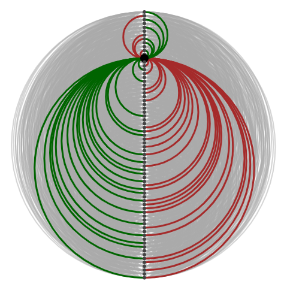
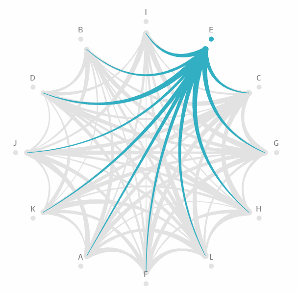

# Unïnfo Theory Core
	- ## Universal Information
	  id:: 66537a41-f229-4891-803e-828573eb44f3
	  collapsed:: true
	  ((665359e4-4597-4775-b849-f9acbb98960a)) ((66537a44-f579-4fcc-a02b-2f32d0d409fc))
		- Unïnfo
		  id:: 66537a44-f579-4fcc-a02b-2f32d0d409fc
		  ((665c9af1-1ce2-461c-af33-671690618c8f)) ((66537a41-f229-4891-803e-828573eb44f3))
			- ((669a1e5f-734c-41c1-bf1c-21813b6e81d8)) “**Uni**versal **Info**rmation” → “Uni-info” /ˈjuːnɪˌɪnfoʊ/ → “Uniinfo” → “Unïnfo” /ˈjuːniːnfoʊ/
			- ((66f3c28a-a18f-4cca-90d6-c086ac7fccdf)) “Unïnfo” is pronounced “YOU-nih-info” /ˈjuːnɪˌɪnfoʊ/ or better “YOU-neen-foh” /ˈjuːniːnfoʊ/, but _never_ “UN-info” /ˈʌnˌɪnfoʊ/. The “double-dotted i” (ï) there is pronounced similar to that of “naïve” /naɪˈiːv/.
				- The double-dotted i (ï) denotes the unification of the two letters ‘ii’, hence its unified pronunciation /ˈjuːniːnfoʊ/ in stead of the separate one /ˈjuːnɪˌɪnfoʊ/.
				  id:: 68a3ea54-f275-40b8-93ae-4a2bd8da4a06
					- For the ease of typing on keyboard, the separate spelling “Uniinfo” is also used casually in place of the formal spelling “Unïnfo”.
					- To avoid broken rendering, “Unïnfo” with precomposed ‘ï’ may be used instead of the standard “Unïnfo” with combined ‘ï’.
					- The “twisting double i” [model](https://bixycler.github.io/Uniinfo/TwistingDoubleI/TwistingDoubleI.html)
					  id:: 698974b1-d593-4d0a-b57a-41e8e2ac629a
					  collapsed:: true
						- Image
						  
						- Video
						  
				- Note: Don't read “Unïnfo” as “UN-info” /ˈʌnˌɪnfoʊ/ – as if it means [“uninformation”](https://en.wiktionary.org/wiki/uninformation) (unwanted, untrue, useless information) or [uninformed](https://en.wiktionary.org/wiki/uninformed) (ignorant) which is quite different from the concept of unity at the heart of Unïnfo.
				- Typographic note: While visualy indistinguishable, the letter ‘ï’ in ((66537a44-f579-4fcc-a02b-2f32d0d409fc)) is neither [i with diaeresis (ï) [U+EF]](https://en.wikipedia.org/wiki/%C3%8F) nor [i-umlaut (`&iuml;`)](https://en.wikipedia.org/wiki/I-mutation), but an ‘i’ with [double dot (◌̈) [U+0308] above](https://en.wikipedia.org/wiki/Two_dots_(diacritic)#Vowels).
				  id:: 68a520bf-ed90-4e1f-ae2a-0700d7f51b05
					- The combination `ï = i +  ̈` should be rendered with only two dots (not three dots), because these are the two dots of the two letters `ii`, left over after the fusion.
					- This double dot mark denotes neither [vowel hiatus (diaeresis)](https://en.wikipedia.org/wiki/Vowel_hiatus) nor [umlaut](https://en.wikipedia.org/wiki/Umlaut_(diacritic)).
					- This double dot mark can be seen as, similar to the IPA notation (ː) and the [macron](https://en.wikipedia.org/wiki/Macron_(diacritic)), denoting the [long vowel](https://en.wikipedia.org/wiki/Vowel_length#Diacritics) similar to its usage in [Aymara](https://en.wikipedia.org/wiki/Aymara_language) and [Ligurian](https://en.wikipedia.org/wiki/Ligurian_language).
		- ((6651ecba-793d-43c5-8020-a9f260b032d8)) ((66537a44-f579-4fcc-a02b-2f32d0d409fc)) is the umbrella term for both the ((669dfc9f-b5e2-448a-b6f4-be13c5bfbccb)), as the theoretical aspect, and the ((665379b7-e4f6-4240-8029-fd143e2230c7)), as the practical aspect.
		- ((665359ff-79f1-4669-b10b-f2b0e633a7c1))
			- Nuance: Even though the name “Universal Information” alludes to the idea that “*everything is information*”, there is _**no** such formal statement_ in the ((669dfc9f-b5e2-448a-b6f4-be13c5bfbccb)).
			  id:: 6819f75f-1bab-4cc7-9316-228d14aa80d9
			  collapsed:: true
				- The theory was named “Universal Information” simply because the author ((66536578-c4d3-43f1-b35c-bf71120f0570)) is an information scientist. At that time, he saw the hierarchy of visible matter as: mass > energy > information. That means “*every __visible__ thing is information.*”
				- Later on, when studying the ((66ac41f1-de0c-48cb-a9b0-c30b0fe27c5d)) Theory, he discovered the invisible ((687f322c-2334-46e5-816b-57889e5c6b89)) underlying the visible ((66f7af1e-02d6-4c9b-b8f4-01a5ac6749d8))s (information, energy, mass, charges, ...).
				- That means, instead of “information”, the “universal substance underlying everything” is formally modeled as the  ((675c03d8-3185-41a8-9f98-e869fabec793)) and the ((66ab75a1-f4a0-4bab-a002-8e573546623a)), which capture not only information but also _the underlying **sustent** that carries information_.
	- ## Unïnfo Theory
	  id:: 669dfc9f-b5e2-448a-b6f4-be13c5bfbccb
	  collapsed:: true
	  The Theory of ((66537a41-f229-4891-803e-828573eb44f3))
		- GitHub: https://github.com/bixycler/Uniinfo
		- ((6651ecba-793d-43c5-8020-a9f260b032d8)) The published theoretical part of the ((66537a44-f579-4fcc-a02b-2f32d0d409fc)).
			- The metaphysical theory of Unïnfo [𝕄]
				- ((669dfc7d-5355-41db-93a1-8d590e8ec9d8)) [♾]:
					- ((66f3d4a2-375f-4098-9228-66c611f0da90)): [Circle](((66f3d561-424a-4e1d-be55-98ac39c48502))), [Arrow](((66f3d5ca-a982-4d12-b307-fd4812adeb3b))), [Equal](((66f3d5cc-0d68-47bb-b09a-87cda33c7354)))
					- ((66f3d61c-35d0-46ae-9786-752af40e64c4)): [Exsistence](((66f3d644-782c-4f33-bd5c-db6e0a2d447a))), [Differentiation](((1a22a090-6786-4114-8aad-35b122783bff))), [Unification](((c96a6d20-a0f6-48bd-9d70-9bc00b6b3c69)))
					- ((66f3e0be-7d8c-45d6-92c3-6bad456555c9)): ((66f3e66a-8afb-4b20-bf85-111bc4aee09c)), ((66f3e588-9094-45af-9dff-2225c3ac39ab)), ((a95f4693-fe48-4a60-b1e3-5897a40efc5a))
				- ((66f3ed94-4f20-4166-8e9b-2e8ba53aaad2))
					- ((6772a6cd-771f-4f24-9c3a-39c442234be5))
					- ((6a071b20-7248-42da-88ed-633be610b6df))
				- The ((66f3b5e5-496a-4545-be7a-b1df2d94bd11)): ((678e1c3f-6202-45aa-8527-f4bdad9927b9)) = ((665ca429-84e3-49ff-921e-c07d19cd99ba)) ☉ ((6678288e-699b-4325-bdba-bf6349fe0d57))
					- ((66723642-58f1-4a74-bba3-0108f14c6bac)): ((6653769c-3334-46fa-a1d5-4ce6a7fc23e8)), ((6672513b-c4b0-4c88-8b30-c60a3c6555a7)), ((685a47f5-728a-4b34-95c5-d8e3bba5aad1))
					- ((678e2046-54ac-4284-865d-6f3e38f589a1))
					- ((686e6e72-13f8-4dc9-a8e2-de35519f57d7))
				- [Unitorus](https://bixycler.github.io/Uniinfo/Unitorus/UniTorus.html) – The emblem of Unïnfo
				  id:: 68594391-f2b0-4501-86ec-af8b67346db9
					- {:height 40, :width 60}
			- ((66ac41f1-de0c-48cb-a9b0-c30b0fe27c5d)) Theory [Ʊ]
				- The ((66b1cfa4-e22c-4424-bf19-a6ce4649da77)) [((66f3c32c-9b5a-4e5a-95cc-411256b40b4f))]: ((66b1cfa4-2537-4361-a626-da81ca5b4e6f)) ÷ ((66f3c97f-94e8-4783-96c5-fe9cadf4f9a9)) = ((66f7af1e-02d6-4c9b-b8f4-01a5ac6749d8))
				- The ((66f40210-cca6-4d81-85e7-d0c54ef20451)) mechanism & the ((67bd7811-ce55-402f-8fb2-08b59fb271c9))
					- Projective dynamics: ((67bd3614-2520-4a5d-8b3f-44f60901844e)), Elastic Dynamics, Newtonian Dynamics
				- The ((66ab75a1-f4a0-4bab-a002-8e573546623a)) & ((667bef22-b272-4a7d-b613-3f1ed1a47329))
				- The ((675c03d8-3185-41a8-9f98-e869fabec793)) [((678e23b4-0fbe-4a5d-923f-6252405053df))]
			- Knowledge Theory [𝕂]
			- uninet [**ᔕ**]
	- ## Trinion
	  id:: 669dfc7d-5355-41db-93a1-8d590e8ec9d8
	  collapsed:: true
	  ((66f3d561-424a-4e1d-be55-98ac39c48502)) ((66f3d5cc-0d68-47bb-b09a-87cda33c7354)) ((66f3d5ca-a982-4d12-b307-fd4812adeb3b))
	  ○ = ↑
	  “a platform, not a foundation”
		- ((6651ecba-793d-43c5-8020-a9f260b032d8)) In ((669dfc9f-b5e2-448a-b6f4-be13c5bfbccb)), every concrete thing, i.e. ((678e1c3f-6202-45aa-8527-f4bdad9927b9)), is made of the ((66f3d4a2-375f-4098-9228-66c611f0da90)): Circle, Arrow and Equal. These components are described in the [three postulates](((66f3d61c-35d0-46ae-9786-752af40e64c4))). Corresponding to the three components, there are [three intrinsics](((66f3e0be-7d8c-45d6-92c3-6bad456555c9))) of the Trinion – the _static_, the _dynamic_ and the _balance_ – which show the ((66f3ed94-4f20-4166-8e9b-2e8ba53aaad2)) of ((66537a44-f579-4fcc-a02b-2f32d0d409fc)). Vacantism means that the ((669dfc7d-5355-41db-93a1-8d590e8ec9d8)) is neither the ultimate truth, nor the [first principle](https://en.wikipedia.org/wiki/First_principle), nor the primordial existence, but just the experiential launchpad for the theory of ((66537a44-f579-4fcc-a02b-2f32d0d409fc)).
			- ((66f3c28a-a18f-4cca-90d6-c086ac7fccdf)) “Trinion” is pronounced “tree-nion” /ˈtrɪnjən/.
		- Three components of the ((669dfc7d-5355-41db-93a1-8d590e8ec9d8))
		  id:: 66f3d4a2-375f-4098-9228-66c611f0da90
		  collapsed:: true
			- Circle
			  id:: 66f3d561-424a-4e1d-be55-98ac39c48502
			  ○
			  ((667d15c6-67c4-4998-a549-c8b3f9de3d60)) in ((669dfc7d-5355-41db-93a1-8d590e8ec9d8))
			- Arrow
			  id:: 66f3d5ca-a982-4d12-b307-fd4812adeb3b
			  ↑
			  ((667d15b7-6364-49a9-ac58-c64d2a992b63)) in ((669dfc7d-5355-41db-93a1-8d590e8ec9d8))
			- Equal
			  id:: 66f3d5cc-0d68-47bb-b09a-87cda33c7354
			  `=`
			  ((6653751a-a1b4-44b0-a81e-0a446eb8918c)) in ((669dfc7d-5355-41db-93a1-8d590e8ec9d8))
				- ((665359ff-79f1-4669-b10b-f2b0e633a7c1))
				  collapsed:: true
					- About the name “Equal”
					  collapsed:: true
						- The name “Equal” of the third component is an adjective noun meaning “equality”, “equilibrium”, “equivalence”, “balance”.
							- Note that this is an [obsolete meaning](https://en.wiktionary.org/wiki/equal#Noun) different from the modern meaning “equal parts” or “peers” used in everyday English.
						- Its symbol “`=`” is called “[equal sign](https://en.wikipedia.org/wiki/Equals_sign)” in American English or “equals sign” by Unicode Consortium in British English.
					- About the equation ⟪○ = ↑⟫
					  id:: 66f3fd7d-625b-49a2-a87a-d8c6f260329f
					  collapsed:: true
						- The equation “Circle Equals Arrow” is both,
							- the **equivalence principle** of the macrocosm (Universe), written with the _static equal_ ⟪○ = ↑⟫, and
							- the **differential equation** of the microcosm (Trinion), written with the _dynamic equal_ ⟪○ ⇌ ↑⟫.
		- Three [postulates](((66f3cf07-4be5-4a50-9d99-b190b60f6ffa))) of the ((669dfc7d-5355-41db-93a1-8d590e8ec9d8))
		  id:: 66f3d61c-35d0-46ae-9786-752af40e64c4
			- **Postulate of Existence**
			  id:: 66f3d644-782c-4f33-bd5c-db6e0a2d447a
			  There _exists_ a ((66f3d561-424a-4e1d-be55-98ac39c48502)) (○).
			- **Postulate of Differentiation**
			  id:: 1a22a090-6786-4114-8aad-35b122783bff
			  The Circle transforms into _different_ ((665ca429-84e3-49ff-921e-c07d19cd99ba))s. This transformation is called the ((66f3d5ca-a982-4d12-b307-fd4812adeb3b)) (↑) which is itself _different_ from the Circle.
			- **Postulate of Unification**
			  id:: c96a6d20-a0f6-48bd-9d70-9bc00b6b3c69
			  The Circle and the Arrow are two aspects of _the same_ being called ((669dfc7d-5355-41db-93a1-8d590e8ec9d8)) (⊜). This equivalence is called the ((66f3d5cc-0d68-47bb-b09a-87cda33c7354)) (`=`). Thanks to the same origin, when the two former components (○, ↑) meet each other, they _recognize_ each other. That recognition is denoted by the _equation_ ⟪○ = ↑⟫.
		- Three [intrinsics](((66f3e170-dc4b-45ea-8720-de4580a30d01))) of the ((669dfc7d-5355-41db-93a1-8d590e8ec9d8))
		  id:: 66f3e0be-7d8c-45d6-92c3-6bad456555c9
		  collapsed:: true
			- ((6651ecba-793d-43c5-8020-a9f260b032d8)) Corresponding to Circle, Arrow and Equal, there are three intrinsics of [the static](((66f3e66a-8afb-4b20-bf85-111bc4aee09c))), [the dynamic](((66f3e588-9094-45af-9dff-2225c3ac39ab))) and [the balance](((a95f4693-fe48-4a60-b1e3-5897a40efc5a))), respectively.
				- 
			- ### Intrinsic Static
			  id:: 66f3e66a-8afb-4b20-bf85-111bc4aee09c
				- “Every arrow is sustained by circles (⇴).” 
				  id:: 699c0363-a78b-4ca8-9992-be7a20d09026
				  Just like a vehicle moving with its wheels, every change has its invariant(s), every motion has its law(s). The law of motion is invariant, the wheels of moving vehicle are invariant. Because they are invariants underlying the variants, they are called “intrinsic statics”.
					- 
				- “Every equal is in the shape of circle (⊜).”
				  The most familiar equality is that two objects having the same information: shape, appearance, measure, value, structure, class, type, image, extension, etc. The symmetry of equality, i.e. ⟪A = B⟫ ⇔ ⟪B = A⟫, shows a loop from A to B then back to A. Thus its shape is a circle.
					- 
					- The more subtle equality is that of the opposites, just like |-1234| = |+1234|. The opposites are “equal” because they are complement, together they comprise a whole which is represented by the Circle.
						- {:width 50, :height 50}
			- ### Intrinsic Dynamic
			  id:: 66f3e588-9094-45af-9dff-2225c3ac39ab
				- “Every circle is composed of arrows (⥁).”
				  id:: 699c0363-0995-47fc-9e99-fdc7a36a375f
				  Just like a spinning top or a high-speed fan, some object looks static because it's moving in circle, its motion is looping back, it's going back and forth (🗘).
					- As the fan spins too fast, we can only see it as a stationary solid disk, while its blades are actually rotating under the hood.
					- {:width 50, :height 50} {:width 300}
				- “Every equal is in the shape of arrows (⇌).”
				  id:: 684f9517-8a24-4709-a62a-bd075acb9d2c
					- The balance between things is always a [dynamic equilibrium](https://en.wikipedia.org/wiki/Dynamic_equilibrium) where the exchange between them cancels them out. For example, in mechanics, we have balance between force vectors, in chemistry, we have balance between reaction directions, etc.
					- The Equal is not a trivial equality of identical things, i.e. ⟪$A = A$⟫, but the equality between different things, e.g. ⟪$A = B$⟫.
						- Any meaningful equation ⟪$A = B$⟫ presumes that $A$ differs $B$ in some aspect, at least in their names.
						- In this sense, the Equal is not only a passive property but an active “equalizer” that makes different things equal, a “balancer” that balances the imbalance.
						- Here, the Equal is the one that brings differentiated things back together, to be one again, hence the “unification point” in the circle of ((667c008f-cd1f-4a6b-a9c8-d6efa1d8d342)).
						- Diagram
							- 
			- ### Intrinsic Balance
			  id:: a95f4693-fe48-4a60-b1e3-5897a40efc5a
				- “Every arrow is sustained by the macro balance of the whole (⊜).”
				  For each “this ↑” there always exists a “that ↓” to counterbalance.
					- If we cannot find the counterbalance, it's hidden in the meta world, e.g., when something is placed in an imbalanced position, there emerges a returning force as a meta to counterbalance.
					- The parts can be imbalanced but the whole is always balanced.
					- Another expression of the holistic balance is the [cyclic order](https://en.wikipedia.org/wiki/Cyclic_order), e.g., $a < b < c < a ⟹ a \sim b \sim c$.
					- However, to a selful eye, the wholistic balance can be difficult to see because the whole contains not only the visible but also the invisible, not only the objects but also the metas. So, to see the whole's balance, we must use a holistic eye.
					- 
				- “Every circle is sustained by the micro balance of the selfless eye (⇌).”
				  When we reduce the self to zero, just look at the contact point, the incidence point, we see the contacting parties always balance each other. Such ((66e40f4b-34ae-499a-8192-0a0f4f580c7e)) is the “glue” sutaining all circles.
					- Combining the ((66f3e588-9094-45af-9dff-2225c3ac39ab)), we have “circle = arrows + equal points”: a circle is just a chain of arrows glued head-to-tail by equal points.
					- 
		- ### vacantism
		  id:: 66f3ed94-4f20-4166-8e9b-2e8ba53aaad2
		  collapsed:: true
		  “an openness, not a nothingness”
		  ((665359e4-4597-4775-b849-f9acbb98960a)) ((66f3f2ad-5b53-4322-889a-f2c85f135fbf)), ((66f3f2ca-cb22-4357-82aa-c8fcf8cc7b3e))
		  ((66c80da9-4cfb-4de7-b83d-8b70665207bf)) ((68b95b62-9e60-4ef2-9540-f563c76a5d17))
			- vô nguyên
			  id:: 66f3f2ad-5b53-4322-889a-f2c85f135fbf
			  ((665c9af1-1ce2-461c-af33-671690618c8f)) ((66f3ed94-4f20-4166-8e9b-2e8ba53aaad2))
			- 無元
			  id:: 66f3f2ca-cb22-4357-82aa-c8fcf8cc7b3e
			  ((665c9af1-1ce2-461c-af33-671690618c8f)) ((66f3ed94-4f20-4166-8e9b-2e8ba53aaad2))
			- vacantistic
			  id:: 68b95b62-9e60-4ef2-9540-f563c76a5d17
			  ((66c80e01-002b-42ae-9c60-49bf3fc6e159)) ((66f3ed94-4f20-4166-8e9b-2e8ba53aaad2))
			- ((6651ecba-793d-43c5-8020-a9f260b032d8)) The ((66f3e0be-7d8c-45d6-92c3-6bad456555c9)) mean that [the Existence](((66f3d644-782c-4f33-bd5c-db6e0a2d447a))) of the Trinion is not an [independent](https://en.wikipedia.org/wiki/Transcendence_(religion)) and [absolute](https://www.newworldencyclopedia.org/entry/Absolute_(philosophy)) “[primordial existence](https://en.wikipedia.org/wiki/First_principle)”, but a _[dynamic Existence](https://en.wikipedia.org/wiki/Prat%C4%ABtyasamutp%C4%81da) in harmony with both [Differentiation](((1a22a090-6786-4114-8aad-35b122783bff))) and [Unification](((c96a6d20-a0f6-48bd-9d70-9bc00b6b3c69)))_. This property of the Trinion is called ((66f3ed94-4f20-4166-8e9b-2e8ba53aaad2)) (Vietnamese “vô nguyên”, Chinese “無元”), which means *“the [absence](https://en.wikipedia.org/wiki/Śūnyatā) of [independent](https://en.wikipedia.org/wiki/Transcendence_(religion)) [original essence](https://en.wikipedia.org/wiki/Essence)”*, but does *not* mean [nihilism](https://en.wikipedia.org/wiki/Nihilism). Structurally, vacantism is shown by the ((6772a6cd-771f-4f24-9c3a-39c442234be5)).
			  collapsed:: true
				- Moreover, the Trinion unifies the [emptiness](https://en.wikipedia.org/wiki/Śūnyatā) in the invisible world with the [infinity](https://en.wikipedia.org/wiki/Infinity) in the visible world, thus sometimes is denoted with a circled infinity symbol “♾”.
				- The vacantism is also expressed in Tao Te Ching as the following:
					- id:: 684f9517-7e89-4efb-9b6c-16bf3458ce67
					  #+BEGIN_QUOTE
					  “The Way is vacant, yet never used up.  
					  Immeasurable abyss it is, as the ancestor of all things!”  
					  「道沖而用之或不盈。  
					  淵兮似萬物之宗。」
					  #+END_QUOTE 
					  — [Chapter 4. The Sourceless](https://en.wikisource.org/wiki/Translation:Tao_Te_Ching#Chapter_4_(%E7%AC%AC%E5%9B%9B%E7%AB%A0)), Tao Te Ching
					- id:: 684f9517-afac-49ba-97e3-b88529d74b24
					  #+BEGIN_QUOTE
					  “The door and windows are cut out to form a room;  
					  thanks to its vacancy, the room is usable.”
					  「鑿戶牖以為室，當其無，有室之用。」
					  #+END_QUOTE 
					  — [Chapter 11. The usage of the vacancy](https://en.wikisource.org/wiki/Translation:Tao_Te_Ching#Chapter_11_(%E7%AC%AC%E5%8D%81%E4%B8%80%E7%AB%A0)), Tao Te Ching
				- In ((66537a44-f579-4fcc-a02b-2f32d0d409fc)), the physical spacetime as well as all informational spaces are “**vacant**” instead of “empty”. That means they are _spaces of **possibilities**, containing **potentials**_, instead of nothing.
			- Grand Circle (◯) of Unïnfo
			  id:: 6772a6cd-771f-4f24-9c3a-39c442234be5
			  collapsed:: true
				- ((6651ecba-793d-43c5-8020-a9f260b032d8)) Through [differentiation](((1a22a090-6786-4114-8aad-35b122783bff))), the Trinion transforms into various ((665ca429-84e3-49ff-921e-c07d19cd99ba))s of all beings in the Universe. Then through [unification](((c96a6d20-a0f6-48bd-9d70-9bc00b6b3c69))), every being, even the Universe, is just the Trinion itself, closing the ((6772a6cd-771f-4f24-9c3a-39c442234be5)). That means the Trinion is equivalent to the Universe in both ways: its *extension is all beings* in the Universe, and its *intension is the whole Universe itself*. While the extensional equivalence through differentiation is the [reductionism](https://en.wikipedia.org/wiki/Reductionism) of the ((667bd93a-cce4-4dbf-9831-725e4dffe463)), the intensional equivalence through unification is the [holism](https://en.wikipedia.org/wiki/Holism) of the ((667bda02-8dc9-488e-ba16-ea75c3d7895c)).
				  collapsed:: true
					- As a [cyclic order](https://en.wikipedia.org/wiki/Cyclic_order), the Grand Circle shows the vacantness of the Trinion that clears the illusion of a linear order from an absolute suppreme being or foundation to all things in the Universe. The Grand Circle has been traditionally symbolized by [the Ouroboros](https://en.wikipedia.org/wiki/Ouroboros), and its paradoxical impression is called “[strange loop](https://en.wikipedia.org/wiki/Strange_loop)” recently by Douglas Hofstadter.
						- {:width 200, :height 150}
				- Diagrams: various ((6a3a62f4-15f1-4116-b3f6-6dd409462ec4))
				  id:: 6a014961-66b5-4a4c-9756-c546eede6fd9
				  collapsed:: true
					- Triangle: The Grand Circle as the **ontology** of the Trinion
					  id:: 699c0363-c70e-461d-9abc-26f14d51887c
					  
					- Circle: The Grand Circle as the **equivalence** between the Trinion and the Universe
					  id:: 6a014f61-c9e8-4189-80e4-2beaa0414313
					  
					- Bowtie: The Grand Circle linearized by cutting the Universe into **intension** and **extension** of the Trinion
					  
					- Diamond: The Grand Circle linearized by cutting the Trinion into **source** and **sink** of the universal ((667bef22-b272-4a7d-b613-3f1ed1a47329)) through the World
					  
					- [Arc diagram](https://en.wikipedia.org/wiki/Arc_diagram) of cause cones (green) and effect cones (red) of beings
					  {:width 300}
						- The intricacy of this diagram reflects the [interconnectedness of all beings](((66eb7dae-2032-434b-9106-756d4aad7cdb))).
					- [Chord diagram](https://en.wikipedia.org/wiki/Chord_diagram_(information_visualization)) of the cones in the circle of the Universe
					  {:width 400}
					- Tree: The Grand Circle as a ((667bf36a-581a-4abe-b544-2d849608a3e4))
					  id:: 6a3a6f72-763b-49a6-b0d8-b11c3318b025
					  
				- Perspectives of the Grand Circle
				  id:: 6a3a62f4-15f1-4116-b3f6-6dd409462ec4
					- The Grand Circle as a tree
					  id:: 6a3a6340-296f-49aa-bb88-e523073cc177
					  collapsed:: true
						- {{embed ((6a3a6f72-763b-49a6-b0d8-b11c3318b025))}}
						- Shoot system – Reductionism
							- The canopy represents the phenomenal world – the infinite variety, complexity, and distinct forms of beings.
							- The branches represent pluralism (đa nguyên), including dualism, simplifying the chaos of the canopy into primary limbs.
							- The trunk represents monism (nhất nguyên), the single, localized column anchoring everything above it.
						- Root system – Vacantism
							- It is decentralized, fluid, and infinitely branching, proving the bottom is not a dead end but the engine of live content.
							- It mirrors the shoot system above – reflecting the principle of “as above, so below” – where the [geometric inversion](https://en.wikipedia.org/wiki/Inversive_geometry) transforms the reduction to 0 into an expansion toward ∞.
							- Although completely invisible beneath the soil surface of the world interface, this subterranean network is just as vast as the canopy, acting as the active ground of the entire structure.
								- This invisibility explains why emptiness is so easily ignored or misunderstood as nothingness or a static void.
						- The Living Torus – The ((667bf36a-581a-4abe-b544-2d849608a3e4))
							- By bending the tree model until the tips of the canopy curve down to meet the deep root system, it forms a continuous torus, visually representing the circular effect flow through three phases.
								- {{embed ((6a014f61-c9e8-4189-80e4-2beaa0414313))}}
							- 1. **Differentiation** in the **effect cone**: The vacantistic ground generates various forms of beings into the canopy through the upward push of the shoot system.
							- 2. **Mixmatching** in the **world interface**: Each being spreads its effect out through the environment to interact with all other beings, forming an $N×N$ matrix of interaction.
								- This continuous exchange – where each being receives effects from all others to mixmatch with its own live content – actively drives the arrow of time.
								- Finally, these world effects mixmatch with the root system through the ground, echoing the cultural idiom “lá rụng về cội” (葉落歸根, leaves fall back to their roots).
									- English equivalents like “ashes to ashes, dust to dust” and “in my end is my beginning” capture this dissolution as a graceful natural law.
							- 3. **Unification** in the **cause cone**: The entire phenomenal world is absorbed by the root system to be integrated back into a coherent flow of effect, pumped back up the trunk.
						- ((665359ff-79f1-4669-b10b-f2b0e633a7c1))
							- The Lineage of the Wide Root
							  id:: 6a3a7402-1157-4cac-b074-48cf25b46b23
							  collapsed:: true
								- The Biological Reality of the Cause Cone
									- The human mind enforces a strict flat plane when tracking historical origins, treating the “root” as a single, isolated starting point.
									- In reality, tracking ancestry backward reveals a massive, exponentially expanding Cause Cone rather than a straight line.
										- If a being traces their ancestral lineages back 30 generations – roughly 750–900 years – the binary branching of parents ($2^{30}$) demands over a billion distinct, simultaneous root endpoints.
										- This geometric expansion shows that the lineage is not a simple thread, but a massive web condensing its entire historical weight down to feed this single, present body.
										- Every being is a localized site where a vast, underground forest of universal trajectories concentrates to sprout a single leaf.
								- The Linear Trimming of the Net
									- To make history, power, and property manageable for flat systems, human cultures perform a violent, linear trim on this expansive architecture.
									- Etymological restriction: The very word “lineage” is built on the word “line”, forcing a dense spatial graph to serialize into a one-dimensional sequence.
									- Linear mechanisms of control:
										- Patrilineal and matrilineal stripping: Social protocols deliberately amputate 50% of the root system at every single generation to ensure names, land, and power flow down a predictable wire.
										- The myth of the single source: To make a figure or master absolute under linear logic, systems cut the diamond by erasing the horizontal mixmatch of earthly trajectories, replacing them with a single, vertical wire.
										- Master–disciple chains: Historical narratives reduce a complex, subterranean net of cross-pollination and conversations into a clean, artificial sequence where one node simply begets the next.
								- The Temporal Translation of Indra's Net
									- The flat mind lacks the cognitive architecture to process a concurrent, N-dimensional web of connections in the immediate present.
									- When confronted with the non-dual truth of connection – such as the Buddhist insight that hitting a stranger is hitting your own relative – the linear mind must invent a workaround.
									- Chronological serialization: Because it cannot grasp the invisible spatial connection running through the shared root right now, it projects the architecture onto a flat timeline.
										- It translates the deep intension of Indra's Net into a sequential story of “past lives” to make the structural identity digestible for flat logic.
								- The Evolutionary Filter and Stillness
									- The flat view functions as a necessary biological survival hack and reduction valve to prevent cognitive overload at the interface.
									- Total exposure to the wide root forces the observer into a zero-person perspective (0PP), locking them into absolute observation and stillness.
										- When the entire context graph is seen simultaneously, the ego-borders evaporate, and the system freezes in spacetime due to the perfect balance of the circle.
									- To act and move on the flat stage of the world, a being must execute a skillful rotation – step down their dimensions to cast a specific, partial 2D shadow while keeping the infinite, wide-rooted volume intact within.
						-
					- The circular effect flow
					  id:: 6a3a6381-21b1-46ed-9eb6-e7aeff52c874
					  collapsed:: true
						- The Tension of the Two Views
							- Every being acts as a local site where the universal content condenses, forming a **crystal image of the self**.
							- This architecture can be mapped to the biological division of a plant – the root system and the shoot system.
								- The Root System (Cause Cone): This represents the deep intension, containing the ancestral, universal causes.
								- The Shoot System (Effect Cone): This represents the visible extension, containing the dynamic, outward effects.
								- The Surface Boundary: Because the world interface acts as the ground level, the vast root system remains completely hidden under the surface, making the intension invisible to ordinary observation.
							- Depending on the viewpoint, this crystallization is perceived in two opposing directions – the extensional and the intensional.
							- Extensional view: This perspective focuses on the surface effects where global, new vectors arrive to disrupt and modify a static, local anchor.
								- Operating only above the surface, it observes only the shoot system and mistakes the visible leaf for an isolated, independent entity.
								- Due to ignorance of the hidden root system, each being mistakes its crystal for its own separate property, creating a rigid self-attachment to this local anchor.
							- Intensional view: This perspective inverts the geometry entirely, digging beneath the surface to map the global as the ancient, invariant root and the local as the newly unfolding, dynamic leaf.
								- Under this lens, the old root of the being is recognized not as an isolated asset, but as the crystallization of the whole universe into that specific, local site.
						- The Grand Circle and its Cuts
							- In Unïnfo, the relationship between the singularity (Trinion) and the whole Universe (All Beings) is modeled as a non-dual loop called the Grand Circle.
							- To analyze this loop through linear logic, we must cut the circle at different coordinates, casting different 2D shadows.
							- The Bowtie Cut: Slicing the circle at the wide world interface – the belly – unrolls it into a double light cone with the Trinion completely intact as the shared central apex.
								- The intact Trinion acts as the transition boundary – the soil line – where the subterranean root system (left) meets the aerial shoot system (right).
								- It acts as the sovereign lens, focusing the vast, hidden cosmic cause (Intension) on the left – the true source of crystallization – and projecting it outward as a visible, dynamic effect (Extension) on the right.
							- The Diamond Cut: Slicing the circle precisely through the Trinion singularity splits it into two halves – the old root (internal cause) and the new interaction (external effect).
								- When opened, the split Trinion becomes the two extreme outer tips of the diamond, while the uncut wide bellies of the cones glue together in the center.
								- This topology traces the trajectory of a being, starting as the internal root and passing through the shared world interface where the **mixmatch** of different effect flows occurs.
						- The Multi-Agent Complexity and Indra's Net
							- When we close the Grand Circle through all instances of the Trinion simultaneously, the system blossoms into a dense context graph.
							- This graph resembles Indra's Net, where the world is just a shared stage – an interface for the constant dance and mixmatch between the manifestations of the same whole.
							- In this net, the external “slap” or globalized force hitting a local site from the outside is not an alien invasion.
								- It is the refracted reflection of the site's own internal root, returning to meet itself via the trajectory of another being.
						- Resolving the Conflict of Perfectionism
							- The individual subject trapped in a linear view experiences this geometric tension as a painful, static conflict called perfectionism.
							- Perfectionism is a fixation – a seizure in the bearings of a highly polished, holistic core that locks it at a single position and angle.
							- A linear attempt to cure perfectionism requires destructive modification, adding or removing parts of the source to comply with the flat world.
							- The Unïnfo approach resolves this not by modifying the core, but by **rotating** it.
								- Because a circle is a closed system of absolute conservation, rotation alters the interface without any net change to the source.
								- By allowing the circle to spin, we can present whatever imperfect 2D shadow the immediate situation requires while keeping the N-dimensional core perfectly whole inside.
					- The circular logic
					  id:: 6a3ca168-4296-4d81-8d6d-a93b293a1da2
					  collapsed:: true
						- The limitation of linear logic
						  id:: 6a3ca19d-b4db-451d-a6c4-48e11c989743
							- Traditional logic built vertical firewalls to banish circularity – which they treated as a fatal error – seeking safety in hierarchies.
								- Bertrand Russell's [Type Theory](https://en.wikipedia.org/wiki/Type_theory) separated objects and sets to prevent self-inclusion.
								- Alfred Tarski's [Semantic Hierarchy](https://en.wikipedia.org/wiki/Semantic_theory_of_truth) separated object languages and metalanguages to prevent self-reference.
							- These linear systems only prove things by turning the world into a one-way conveyor belt.
								- They run into the [Agrippan Trilemma](https://en.wikipedia.org/wiki/M%C3%BCnchhausen_trilemma): the absolute starting points – the axioms – are completely unprovable from within the system.
								- To start the conveyor belt, logicians must either rely on blind dogmatism, an infinite regress, or a forbidden loop.
								- Tarski's [Indefinability Theorem](https://en.wikipedia.org/wiki/Tarski%27s_undefinability_theorem) proved that arithmetical truth cannot be defined within the system itself.
								- The linear system remains a silent engine until an external judge steps in to validate its meaning.
							- This linear architecture is modeled after a deep-rooted belief in linear time.
								- It treats cause and effect as a straight arrow, unaware that life is a dynamic loop.
						- Exposing the hidden substance
							- By turning the gaze inward, we discover that the true foundation of any system is the conscious observer.
							- This reality is preserved in the etymological roots of the word [subject](https://en.wiktionary.org/wiki/subject):
								- **Sub-ject** (*sub* + *jacere*): “that which is thrown underneath” – the invisible root system of pure awareness hidden beneath the surface.
								- **Sub-stance** (*sub* + *stare*): “that which stands underneath” – the living ground holding up the entire visible apparatus.
							- Materialism flipped the coin to name hundreds of separate “substances” – like atoms, quarks, and biochemical compounds.
								- It built an incredibly detailed map of the foliage, but treated each leaf as an isolated fragment.
								- It completely forgot the one true substance standing underneath: the experiencing Subject.
						- The living tree of logic
							- The logical flow can be modeled as a tree where the above and the below feed each other.
							- The **deductive shoot system** branches upward into the air.
								- It traces the consequences of axioms – the trunk flare – and splits into distinct leaves and logical parts.
							- The **inductive root system** taps into the dark soil of direct experience.
								- It draws up the intuitive nutrients of awareness to feed the trunk flare of axioms, which is also called root flare of postulates.
							- The **living circle**: the fruits of the shoot drop, decompose, and sink into the soil to feed the roots. closing the circle of the tree.
								- This forms a self-sustaining **deductive–inductive circle**.
								- This loop proves the absolute **mutual necessity** of both systems, and the radical **insufficiency** of any single system in isolation.
								- Different from the [circular reasoning fallacy](https://en.wikipedia.org/wiki/Circular_reasoning) which is a dry dead loop, this living circle is sustained by the wet root system of induction [crystallizing](((66faa5f9-0b7a-49ca-a5f5-62eeba03ab2b))) experiential content into logical forms, not by dry reasoning.
									- The circle proves itself not by reasoning but by existence: The root system is proven by the life of the subject, and the shoot system is proven by the matching with objective reality.
								- In Unïnfo, this living circle is the ((667c0031-0a87-44c9-9e98-6d45893b095f)) expressed as the ((6a3cbac0-2c6d-4e76-84de-ebd468284fca)).
				- ((665359ff-79f1-4669-b10b-f2b0e633a7c1))
					- How the Grand Circle dissolves traditional paradoxes
					  collapsed:: true
						- Resolution of the [hard problem of consciousness](https://en.wikipedia.org/wiki/Hard_problem_of_consciousness)
							- Dissolving the foundation: The “hard” part of the problem is the hidden assumption of a fixed foundation.
							- Scale-induced stasis: Due to the massive ratio ($c, h$) between the universe at the base and the human at the apex, the subject appears as a fixed crystal.
							- Crystal as whole: This seemingly fixed foundation is actually the crystallization of the whole universe at a specific coordinate.
							- Vacantism: By replacing the fixed foundation with vacancy, the problem is resolved – the subject is recognized as the substrate rather than an emergent byproduct.
						- Holistic Resolution of Tension
							- Beyond Design vs. Chance: This resolution dissolves the choice between a “Creative God” and “Mere Chance”. Creation is the top-down action of the 0PP field localizing into a 1PP coordinate.
							- Well-Designed Brain vs. Boltzmann Brain: The brain is not a random fluctuation in a void, but a crystallization of the whole universe.
							- Structural Design: The “design” is the crystallization itself. Its elegance is the elegance of the whole, which excels any part.
			- Great Mirror Wisdom
			  id:: 6a071b20-7248-42da-88ed-633be610b6df
			  collapsed:: true
				- ((6651ecba-793d-43c5-8020-a9f260b032d8)) The ((6a071b20-7248-42da-88ed-633be610b6df)) is the reflection mechanism of the Universe on itself.
				- Mechanics of the mirror
					- Impartial reflection: The mirror reflects everything with equal precision, without judgment, preference, or resistance.
					- Frictionless updating: The reflection is instantaneous and leaves no trace once the object moves, refusing to grasp previous images.
				- Relationship with time
					- Death of the static past: The past is recognized not as a fixed place but as a reconstructed projection happening in the present.
					- Arrow of time: An emergent mixing of threads in the present rather than a predestined path.
				- Memory and structural records
					- Interaction of directions: Top-down view provides knowledge for bottom-up action; the whole universe acts upon every single point.
					- Nature of memory: Memory is an image yet to be updated because nothing has yet caused it to change at that spacetime coordinate.
					- Graduation of images: A continuous spectrum from fleeting data to lasting knowledge, but with absolutely no permanent form.
			- ### Liar Paradox
			  id:: 6a3cbac0-2c6d-4e76-84de-ebd468284fca
			  collapsed:: true
			  “The Truth lies, and the Lie is telling the truth!”
				- ((665359c0-a89a-41b5-9f28-503f79107a08)) https://en.wikipedia.org/wiki/Liar_paradox
				- ((6651ecba-793d-43c5-8020-a9f260b032d8)) ((6a3cbac0-2c6d-4e76-84de-ebd468284fca)) is the paradox generated in a static binary truth value system when an _honest liar_ admits that _“I am lying.”_ This is the logical [koan](https://en.wikipedia.org/wiki/Koan) to break down the attachement to a static truth value system, leading to the breakthrough to a living dynamical system – the ((6772a6cd-771f-4f24-9c3a-39c442234be5)). The dynamical system generates all things through its ((667bf36a-581a-4abe-b544-2d849608a3e4)), hence Liar Paradox is the **creator of all things**. In the light of this paradox, the relative truth oppositing the relative lie is shown to be just a partial truth – one side in the ((6830645a-93b9-4c90-929f-8740f40c2b15)) – hence a lesser truth (“the Truth lies”) compared to the ((68306652-f922-4597-bcf7-99a62ef32c94)) = ((6830664a-06e8-418d-bf46-0491fef3a780)) (“the Lie is telling the truth”) of the [whole](((669dfc7d-5355-41db-93a1-8d590e8ec9d8))).
				- ### Coin of Truth
				  id:: 6830645a-93b9-4c90-929f-8740f40c2b15
				  collapsed:: true
					- The Coin of Truth (Great Truth) is also the Coin of Lie (Great Lie) which is greater than both one-sided Truth and Lie.
					  collapsed:: true
						- Image: [Coin of Truth - stereotypes.png](../assets/Will/story/2025-05/Coin of Truth - stereotypes.png) shows [stereotypes of “Truth” and “Lie”](((68300868-6108-475e-90e0-1f15e58366c1))) as two sides of the same coin.
							- {:width 200}
							- Truth side: Goddess [Veritas](https://legendaryladieshub.com/goddess-veritas/) with laurels on her hair depicting her triumph over Lie.
							- Lie side: Mendax is the deceiver with witchcraft
						- The normal stereotypes & symbols of Truth and Lie are just the cover of deeper truth, so this is also the [Coin of Lie](((6830664a-06e8-418d-bf46-0491fef3a780))).
						- The fable of the twins of [Well-Dressed Lie and Naked Truth](((683006ab-8151-40ff-b1a3-5499aebd355a))) reveals the inner truth which is opposite to those superficial stereotypes: Veritas is just the well dressed Lie, and Mendax is actually the naked Truth.
					- While the Truth and the Lie are 2 opposite sides of the Coin, the Great Lie and the Great Truth are 2 aspects, 2 connotations of the Coin.
					- ### Great Truth
					  id:: 68306652-f922-4597-bcf7-99a62ef32c94
					  is simply the Coin of Truth including both Truth and Lie.
						- Image: [Coin of Truth - twins.png](../assets/Will/story/2025-05/Coin of Truth - twins.png) illustrates the twins of [Well-Dressed Lie and Naked Truth](((683006ab-8151-40ff-b1a3-5499aebd355a)))
						  collapsed:: true
							- 
						- identity (face) = perspective (side) = mặt
						  id:: 68347151-822b-4773-8ad0-2f1d8c300191
							- Truth and Lie are just two identities, [two faces](((68346b4d-6704-4012-94b6-581694788547))) of the same subject. These identities are constructed by the collective karma, illustrated by the folks in two towns in the fable.
							- The “coin” symbol shows that Truth and Lie are just two perspectives viewed from two different angles, hence two sides of the same object.
							- It's interesting that in Vietnamese, these two expressions are unified by a single word: mặt = face = side!
					- ### Great Lie
					  id:: 6830664a-06e8-418d-bf46-0491fef3a780
					  is the skillful means to express the ((68306652-f922-4597-bcf7-99a62ef32c94)) without inflicting suffering, based on the acceptance of the intrinsic “lie” caused by differences between views.
						- Image: [Coin of Truth - lotus.png](../assets/Will/story/2025-05/Coin of Truth - lotus.png) shows both sides of the lotus: the beautiful flower rising above the rippling water surface, versus the ugly roots sucking the smelly mud at the bottom.
						  collapsed:: true
							- 
							- This image is the result of dozens of hours working, which are all hidden by the beautiful final image! This is just a little exmple of the Great Lie.
								- Prompt to Copilot
								  collapsed:: true
									- The Coin of Truth contains 2 views of the same thing on its two sides. The Left side depicts a beautiful lotus 🪷 seen from above water with circular ripples spreading out from the petiole (no leaf). The Right side depicts the scene under water with the muddy rough bottom covering the lotus roots and rhizomes. Please make sure the correct anatomy of the lotus roots right under the petioles and between the horizontal rhizomes, as shown in [this diagram](((683463e2-d067-42a6-84f3-fcad587e2569))).
									  id:: 684f9519-1b6d-4d18-8cf0-be2e3287f1b8
									- To show both sides, please draw an image of two copies of the Coin in opposite oblique angles facing away from each other: the left coin shows the Left side facing left, the right coin shows the Right side facing right. Let the background be transparent, and please don't print any text.
								- Just like the "one unit error", the correction of the orientations (opposite <> parallel, facing away <> facing each other) is too hard for Copilot! 😔
								- a previous image with wrong root anatomy
								  collapsed:: true
									- 
								- a previous image with wrong orientations
								  collapsed:: true
									- 
								- a previous image like a watercolor painting with colors but wrong anatomy of rhizome
								  collapsed:: true
									- 
								- a previous image with text "Veritas | Mendax" printed
								  collapsed:: true
									- 
							- Parts of the lotus
							  id:: 683463e2-d067-42a6-84f3-fcad587e2569
							  collapsed:: true
								- 
								- (underground) storage organs ([geophytes](https://en.wikipedia.org/wiki/Storage_organ)): bulblike stems (bulb, corm, rhizome, stem tuber, caudex), root tuber, and storage taproot
								  id:: 686b8a52-50bf-43bd-a5b3-d2387b8da5ac
								  collapsed:: true
									- [Bulb](https://en.wikipedia.org/wiki/Bulb): vertical stem comprising many **layers of fleshy leaf bases** called [“scales”](https://en.wikipedia.org/wiki/Cataphyll)
										- E.g.: [onion](https://en.wikipedia.org/wiki/Onion), [shallot](https://en.wikipedia.org/wiki/Shallot) (Asian onion), [garlic](https://en.wikipedia.org/wiki/Garlic), [tulip](https://en.wikipedia.org/wiki/Tulip)
										- Longitudinal section through a bulb
										  collapsed:: true
											- 
									- [Corm](https://en.wikipedia.org/wiki/Corm): **vertical solid** swollen stem with one or more [internodes](https://en.wikipedia.org/wiki/Internode_(botany)) and a **basal plate** (basal node) where roots grow
										- E.g.: [taro](https://en.wikipedia.org/wiki/Taro) (khoai môn), [eddoe](https://en.wikipedia.org/wiki/Eddoe) (khoai sọ)
									- [Rhizome](https://en.wikipedia.org/wiki/Rhizome): **horizontal** swollen stems, knotty with [nodes](https://en.wikipedia.org/wiki/Node_(botany)) **actively growing** [roots](https://en.wikipedia.org/wiki/Root) and [shoots](https://en.wikipedia.org/wiki/Shoot_(botany)), i.e. indeterminate growth
										- E.g.: [ginger](https://en.wikipedia.org/wiki/Ginger), [turmeric](https://en.wikipedia.org/wiki/Turmeric) (nghệ), [lotus](https://en.wikipedia.org/wiki/Nelumbonaceae), [water lily](https://en.wikipedia.org/wiki/Nymphaeaceae)
									- [Stem tuber](https://en.wikipedia.org/wiki/Stem_tuber): fleshy stems with “eyes” of nodes all over the surface
										- These eyes are **dormant nodes** to grow buds later, i.e. determinate growth, unlike the active nodes of rhizome.
											- However, the nodes of yams do grow roots actively.
										- E.g.: [potato](https://en.wikipedia.org/wiki/Potato), [yam](https://en.wikipedia.org/wiki/Yam_(vegetable)) (khoai từ), [purple yam](https://en.wikipedia.org/wiki/Dioscorea_alata) (khoai mỡ)
										- Note that while potato shows clear eyes, yams have no apararent eyes but roots attached instead. Yams have similar form with sweet potato, making them easily mistakened as root tubers, while their function is actually a stem tuber.
										  collapsed:: true
											- References
												- [Origin and Anatomy of Tubers of Dioscorea floribunda and D. spiculiflora](https://www.journals.uchicago.edu/doi/10.1086/336228)
													- 5. The anatomy of the tuber is more closely related to that of the stem than to that of the root.
													- 7. It is concluded that the tubers in these species represent much modified stem tissue, thus being a relic of the ancestral rhizome.
												- [Characterization of the Dioscorin Gene Family in Dioscorea alata Reveals a Role in Tuber Development and Environmental Response](https://pmc.ncbi.nlm.nih.gov/articles/PMC5536067)
													- *D. alata* L. propagates mainly via tubers, the **modified stem**. Tuber development is accompanied by a variety of biochemical and morphological changes.
													- This is consistent with the findings that _the underground **stem tubers** of yam are derived from swollen [hypocotyls](https://en.wikipedia.org/wiki/Hypocotyl)_.
									- [Root tuber](https://en.wikipedia.org/wiki/Root_tuber): fleshy roots
										- E.g.: [sweet potato](https://en.wikipedia.org/wiki/Sweet_potato), [jícama](https://en.wikipedia.org/wiki/Pachyrhizus_erosus) (củ sắn/đậu)
									- Storage [taproot](https://en.wikipedia.org/wiki/Taproot): thickened taproot, e.g.: [carrot](https://en.wikipedia.org/wiki/Carrot)
									- [Caudex](https://en.wikipedia.org/wiki/Caudex): thickened stem, e.g.: [jicamilla](https://en.wikipedia.org/wiki/Jatropha_cathartica)
									- Ref:
										- [The Difference Between Corms, Bulbs, Tubers, and Rhizomes](https://www.thespruce.com/corms-different-from-bulbs-tubers-and-rhizomes-2131032)
											- {:width 500}
						- Even though the Coin has 2 equal sides of both Lie and Truth, it's preferred to be called "the Coin of... Truth" is just another lie, much more subtle than the one-sided Lie. This is the [Liar Paradox](https://en.wikipedia.org/wiki/Liar_paradox): “The Truth is that Truth lies!”
						- This is the top of skillfulness and difficulty: (1) accompany with the dressed Lie → (2) accepting the naked Truth → (3) living the naked Truth → (4) dressing the Lie → (5) living the Great Truth → (6) living the Great Lie
						  id:: 68306c82-0709-4c83-bcf2-a9015af8b86e
						- A lesser great Lie, which is just a better dressed Lie, is the widely accepted norms, social standards, ethics, morals, etc. This is what Grok 3 and maybe the general public think of when being asked about "the Great Lie".
						- Great Lie > noble lie > white lie
						  collapsed:: true
							- Great Lie = [upaya-kaushalya (skillful means, phương tiện thiện xảo)](https://en.wikipedia.org/wiki/Upaya)
							- Noble lie = [splendide mendax](https://www.merriam-webster.com/dictionary/splendide%20mendax) (Latin): Being “nobly false”, untruthful for a good cause, like the Hypermnestra’s deception in Horace’s Odes 3.11 to save her husband, and like the well dressed Lie in the fable of the twins.
							- [White lie](https://www.merriam-webster.com/dictionary/white%20lie): a lie about a small or unimportant matter that someone tells to avoid hurting another person
							- The well-dressed Lie’s noble lie is a compassionate but incomplete act, showing only the good side to protect society. The sages’ Great Lie, however, is the ultimate expression, embracing both sides of the Coin of Truth and presenting them skillfully, aligning with the equation ((68347151-822b-4773-8ad0-2f1d8c300191)) and with Sadhguru’s [liberation from identity](https://lewishowes.com/relationships/sadhguru-the-truth-about-karma-identity-purpose/).
					- ((665359ff-79f1-4669-b10b-f2b0e633a7c1))
						- ((699c0369-4ebe-4f73-ba92-28ad7d08b184))
						- Other meanings of the “coin of truth” in the folks
						  collapsed:: true
							- [A statement](https://www.goodreads.com/quotes/7729752-the-coin-of-truth-had-two-faces-equally-fair-and) in Jan Cox Speas's 1961 historical fiction “My Love, My Enemy”
							  id:: 68346b4d-6704-4012-94b6-581694788547
							  > The coin of truth had two faces, equally fair, and no one could see them both at once.
							- The coin usully symbolizes the choices between truth and lie, right and wrong.
								- In [the legends of the deva Gayatri on SNARGL](https://snargl.com/angelic-creatures/gayatri/), the Coin of Truth [symbolizes the choices](https://snargl.com/blog/the-significance-of-the-coin-of-truth-in-gayatris-journey/) she encounters along her path.
								- As a tool, it's [used by fortune tellers](https://www.ritualsupply.co/products/coin-of-truth-yes-or-no-fortune-teller) to answer yes/no questions, or as [a magical fortune telling device](https://www.webtoons.com/en/canvas/coin-of-truth/list?title_no=682619).
									- {:width 100}
			- ((665359ff-79f1-4669-b10b-f2b0e633a7c1))
				- About the term “vacantism”
				  id:: 6852b33f-a694-442e-a599-0110163e4ac8
				  collapsed:: true
					- Basically ((66f3ed94-4f20-4166-8e9b-2e8ba53aaad2)) simply means “**no first**” or [“no prime” (無元)](((68594391-d60e-40af-9285-0591b598288e))), because in ((66537a44-f579-4fcc-a02b-2f32d0d409fc)), every concrete thing is circular, thus the whole Universe is circular and nothing can be absolutely “the first”.
					  id:: 68b96854-7e4a-45a9-b0ef-1d8fb57e5fa3
					- This denial of the any [first principle](https://en.wikipedia.org/wiki/First_principle), or primordial substance, or [essence](https://en.wikipedia.org/wiki/Essence), makes Vacantism equivalent to [non-foundationalism](https://en.wikipedia.org/wiki/Anti-foundationalism) and [non-essentialism](https://en.wikipedia.org/wiki/Non-essentialism). The vacancy of Vacantism is equivalent to “[śūnyatā](https://en.wikipedia.org/wiki/%C5%9A%C5%ABnyat%C4%81)” which is usually translated to “emptiness” in English. However, because such words like “empty”, “void”, “nothing”, “zero”, “null”, “nil” have negative meaning, it's usually confused with [nihilism](https://en.wikipedia.org/wiki/Nihilism) which is denied by Buddhism, Taoism, and Vacantism. Because everything in Unïnfo is relative to ((667259a0-aa2e-49fa-bcbd-b3768a9f30b2)), Vacantism is a kind of [perspectivism](https://en.wikipedia.org/wiki/Perspectivism) which is a non-nihilistic [relativism](https://en.wikipedia.org/wiki/Relativism).
					  id:: 66f3ee6f-9f62-4f7f-ad00-34f5d4b0c800
						- id:: 684f9517-3cbd-495d-8e40-85932d03bbe0
						  > “Non-action but nothing is not done!”
						  「無為而無不為。」
						  
						  — [Chapter 48. Forget the knowledge](https://en.wikisource.org/wiki/Translation:Tao_Te_Ching#Chapter_48_(%E7%AC%AC%E5%9B%9B%E5%8D%81%E5%85%AB%E7%AB%A0)), Tao Te Ching
					- Here, the term “vacantism” is used to emphasise the _**usefulness** of the [vacancy](((66600918-9f92-4730-b056-c2cd87a742aa)))_, just like “vacant rooms” in hotel and “vacant hours” in life. Instead of “emptiness” and “nothingness”, the “vacancy” in “vacantism” shows availability and readiness: _there's always space waiting to be filled in_. Even if it's occupied, the occupation is temporary, and the occupation of one space generates vacancy in another space.
						- The usefulness of vacancy is stated in Tao Te Ching, Chapter 11:
						  id:: 68594391-adfa-4c9d-91ff-c53ce13806ad
						  {{embed ((684f9517-afac-49ba-97e3-b88529d74b24))}}
					- And ultimately, “vacantism” means “the throne of the supreme being is vacant – not to be claimed and possessed by a [transcendent](https://en.wikipedia.org/wiki/Transcendence_(religion)) & [eternal](https://en.wikipedia.org/wiki/Eternity) one, and not for anyone to cling to.”
						- About the “vacant throne”, in the Buddhist sutta “[The Root of all things](https://en.wikipedia.org/wiki/M%C5%ABlapariy%C4%81ya_Sutta)” ([Mūlapariyāya Sutta](https://www.dhammatalks.org/suttas/MN/MN1.html)), the [attachment](https://en.wikipedia.org/wiki/Up%C4%81d%C4%81na) to any kind of primal root is uprooted by [arahants](https://en.wikipedia.org/wiki/Arhat) and [Tathāgatas](https://en.wikipedia.org/wiki/Tathāgata), whether it is the “root-nature” ([Mula-Prakriti](https://en.wikipedia.org/wiki/Prakriti#Samkhya)), the “primal matter” or “First Principle” ([Pradhana](https://en.wikipedia.org/wiki/Pradhana)), the “primal conciousness” or “Supreme Being” ([Purusha](https://en.wikipedia.org/wiki/Purusha)), or even the “unbinding, extinguished state” ([nibbāna](https://en.wikipedia.org/wiki/Nirvana)) itself.
						  id:: 68536bc0-f6ec-4595-8629-2a45d6bf713e
						- Note that vacantism does not deny the presence of a supreme being, esp. an [immanent](https://en.wikipedia.org/wiki/Immanence) one. The “throne of the supreme being” is said to be *vacant* not because there can be no such being, but because no fixed being can be entitled to that throne by default, to own it inherently, and to occupy it exclusively permanently.
						  id:: 684f9517-22fd-4695-b398-f142dca8a8d8
							- This vacancy represents **[non-attachment](https://en.wikipedia.org/wiki/Nonattachment_(philosophy)) to metaphysical absolutism**. It keeps the throne **open** for whoever or whatever rising through context and relation to fulfill that role, to sit there temporarily.
					- Historically, the term “vacantism” was coined due to the lack of correspondent English term for the Vietnamese term “vô nguyên” (Chinese “無元”) in the chain “trialism” (vi. “tam nguyên”) → “dualism” (vi. “nhị nguyên”) → “monism” (vi. “nhất nguyên”) → “???-ism” (vi. “vô nguyên”) when [counting](((684f9517-64ce-41bd-a88c-0476cbfa790d))) the number of ontological primitives of ((669dfc9f-b5e2-448a-b6f4-be13c5bfbccb)), which can be easily confused with its [ontological](https://en.wikipedia.org/wiki/Ontology) [categories](https://en.wikipedia.org/wiki/Theory_of_Categories).
					  collapsed:: true
						- Actually, at first “vô nguyên” was translated to “emptism” in the note “[Mọi thứ đều có Ba, để Ba sinh ra mọi thứ](http://creatzynotes.blogspot.com/2020/11/ba-sinh-moi-thu-moi-thu-sinh-ba.html)”, but then “vacantism” was chosen when editing this document of Trinion.
						- Chinese characters for “nguyên” from abstract to concrete: [元](https://en.wiktionary.org/wiki/%E5%85%83) (first, prime) → [原](https://en.wiktionary.org/wiki/%E5%8E%9F) (root, origin) → [源](https://en.wiktionary.org/wiki/%E6%BA%90) (source)
						  id:: 6852abe7-46f7-4e61-9162-ce1311f717af
							- “**No first**” (無元): ((68b96854-7e4a-45a9-b0ef-1d8fb57e5fa3))
							  id:: 68594391-d60e-40af-9285-0591b598288e
								- In the 1926 book *Philosophy of No First Principle* ([無元哲學](Philosophy-NoFirstPrinciple_無元哲學_CADAL07002676.djvu.pdf)) by 朱謙之 (Zhu Qianzhi, Chu Khiêm Chi) [on Wikimedia Commons](https://commons.wikimedia.org/wiki/File:CADAL07002676_%E7%84%A1%E5%85%83%E5%93%B2%E5%AD%B8_%EF%BC%88%E5%93%B2%E5%AD%B8%EF%BC%89.djvu), Zhu situates “無元” as a critical stance against [foundationalism](https://en.wikipedia.org/wiki/Foundationalism).
								  > The world has no fixed, singular origin or "元". All forms arise through **relation**, **flow**, and **emptiness**, not substance.
							- Next to “無元” is [“無原”](https://baike.baidu.com/item/%E7%84%A1%E5%8E%9F/927272) (**no origin**), meaning “unfathomable origin”, which is often found in Chinese ancient philosophical texts and literary works. The term can be traced back to the Han Dynasty classic 淮南子 ([Huainanzi](https://en.wikipedia.org/wiki/Huainanzi), [Hoài Nam Tử](https://vi.wikipedia.org/wiki/Ho%C3%A0i_Nam_t%E1%BB%AD)), which explains the inexhaustibility of the origin of things through classic expressions such as “轉于無原” (“turning to no origin”, “chuyển vu vô nguyên”, “quay về vô nguyên”).
								- Note: Don't confuse “無原” with the modern term “無原由” (“no reason” / “unjustified”) in administrative/legal contexts.
							- And the last is “no source” (無源), an ancient philosophical term used in commentary on Tao Te Ching.
								- 無源 refers to the 4th chapter of Tao Te Ching about the infinite vacancy of the [Tao](https://en.wikipedia.org/wiki/Tao) (道):
								  {{embed ((684f9517-7e89-4efb-9b6c-16bf3458ce67))}}
								- Note: Don't confuse this philosophical meaning with “without power source” in 無源元件 [“passive device”](https://en.wikipedia.org/wiki/Electronic_component#Passive_components), e.g., resistors, transformers.
							- ((669a1e5f-734c-41c1-bf1c-21813b6e81d8))
							  id:: 6853d150-9daa-4f24-8621-737485d7e9a2
							  collapsed:: true
								- [元](https://en.wiktionary.org/wiki/%E5%85%83): Pictogram – a figure with two lines [二] for a head (one connected to body, one above it), emphasizing the head → “first, prime”
								- [原](https://en.wiktionary.org/wiki/%E5%8E%9F): Ideogrammic compound 原 = [泉](https://en.wiktionary.org/wiki/%E6%B3%89) (“spring”) + [厂](https://en.wiktionary.org/wiki/%E5%8E%82) (“cliff”) – a spring bursting from a cliff-side → “origin, root”. A conservative variant is [厡](https://en.wiktionary.org/wiki/%E5%8E%A1), in which water is well visible at the bottom.
									- 元 and 原 had been used interchangeably in the sense “origin” until 原 became favoured in the early [Ming dynasty](https://en.wikipedia.org/wiki/Ming_dynasty) to avoid the name of the [Yuan dynasty (元朝)](https://en.wikipedia.org/wiki/Yuan_dynasty).
									- The relation between the “head” 元 and the “root” 原 refects the similarity between the animal's head with the plant's root, as shown in biology from [Darwin's “root-brain” hypothesis](https://pmc.ncbi.nlm.nih.gov/articles/PMC2819436/) to [modern researches](https://en.wikipedia.org/wiki/Plant_intelligence).
									- In chemistry, “[element](https://en.wikipedia.org/wiki/Chemical_element)” = [元素](https://en.wiktionary.org/wiki/%E5%85%83%E7%B4%A0) (prime substance), but “[atom](https://en.wikipedia.org/wiki/Atom)” = [原子](https://en.wiktionary.org/wiki/%E5%8E%9F%E5%AD%90) (original particle) with nuances in there meaning.
										- The “element” also had now-obsolete translations like [原素](https://en.wiktionary.org/wiki/%E5%8E%9F%E7%B4%A0) & [原質](https://en.wiktionary.org/wiki/%E5%8E%9F%E8%B3%AA).
										- In Vietnamese [Nôm](https://en.wikipedia.org/wiki/Ch%E1%BB%AF_N%C3%B4m),
											- the obsolete word 原質 ([nguyên chất](https://en.wiktionary.org/wiki/nguy%C3%AAn_ch%E1%BA%A5t)) has been adapted to the meaning of “pure (substance)” (original, intact substance); and
											- the character 原 ([nguyên](https://en.wiktionary.org/wiki/nguy%C3%AAn#Etymology_2)) has been developed to have the meaning of “whole, integral”, e.g. [nguyên vẹn](https://en.wiktionary.org/wiki/nguy%C3%AAn_v%E1%BA%B9n) (whole, undamaged), [số nguyên](https://en.wiktionary.org/wiki/s%E1%BB%91_nguy%C3%AAn) (whole number, integer), which effectively makes the meaning of 原子 clear: 原子 = [nguyên tử](https://en.wiktionary.org/wiki/nguy%C3%AAn_t%E1%BB%AD) = whole particle = indivisible particle = atom.
								- [源](https://en.wiktionary.org/wiki/%E6%BA%90): Phono-semantic & ideogrammic compound 源 = 原 (“origin”) + [氵](https://en.wiktionary.org/wiki/%E6%B0%B5) (“water”) → “source (of water)”
									- This is the developed version of 原 to separate the meaning of “source” from other meanings of 原 like “field, plain” or “raw, unprocessed”. Before this development, “source” was written with 原.
					- ((669a1e5f-734c-41c1-bf1c-21813b6e81d8)) English “vacantism” ← “[vacant](https://en.wiktionary.org/wiki/vacant)” ← Latin “[vacans](https://en.wiktionary.org/wiki/vacans#Latin)” ← “[vacō](https://en.wiktionary.org/wiki/vaco#Latin)” (empty, void, unoccupied, free [time]) ← PIE “[*h₁weh₂-](https://en.wiktionary.org/wiki/Reconstruction:Proto-Indo-European/h%E2%82%81weh%E2%82%82-)” (empty, extinguished) → English “void”, “want”, “vain”, “vacant”, “vacuum”, etc.
				- [Vacantism](((66f3ed94-4f20-4166-8e9b-2e8ba53aaad2))) through zero-person perspective
				  id:: 6a012b04-8e57-4927-a363-14ec798334b3
				  collapsed:: true
					- Perspectives
						- 1PP (First-Person Perspective): This is the subjective viewpoint from within the system where the universe localizes to look at itself.
						- 3PP (Third-Person Perspective): This represents the objective observer, viewing reality from the outside in, assuming a boundary between observer and observed.
						- 0PP (Zero-Person Perspective): This refers to pure awareness without a localized self, where the subject-object split collapses into an unbroken whole.
							- Parallel projection: Geometrically, 0PP acts as a parallel projection with no converging lines, revealing direct structural tension.
							- Undistorted truth: This is reached by relaxing the focal point right here now, rather than the 3PP illusion of placing an implied viewer at an infinite distance.
							- Direct immediacy: Unlike 1PP, 0PP does not distort through a localized lens; unlike 3PP, it does not move away or detach from the source.
					- The 3PP trap
						- God's eye illusion: People often mistake their localized 3PP judgment for absolute truth, projecting an internal wireframe onto the universe.
						- Head above a head: A Zen metaphor for creating a redundant, phantom observer that sits above natural experience to narrate and judge.
						- Absolute objectivity: The pursuit of pure objectivity eventually eliminates the subject, shrinking the “screen” to a point and resulting in nihilism.
					- Navigating the ((6772a6cd-771f-4f24-9c3a-39c442234be5))
						- 1. 1PP & 3PP – see it: The **view cone** separates the world at the base from the subject at the apex via a rendering screen.
							- The subject typically sees only the image on the screen, not the actual world or the subject behind the eyes.
							- Proper navigation involves reclaiming the whole view cone – both visible and invisible – to prevent structural collapse.
						- 2. 0PP – be it: At the apex, separation vanishes; the Buddhist “no-self” is the subject merging with the object to be the field.
							- The quantum field is the unbroken whole that cannot be broken into separate particles or waves.
						- 3. Back to 1PP – be & see it together: The field excites into a particle, bringing the whole universe into a position to see itself.
							- ((6a071b20-7248-42da-88ed-633be610b6df)): The subject remembers unity and continuously updates to reflect the object without freezing images.
							- **Frozen Godhead**: The subject forgets unity and clings to a static self-image of the past to try and control the world.
					- Relation to Vacantism
						- Essence and condition: Vacantism is the state of **vacancy** – the “openness” that serves as the prerequisite for the circle to flow.
						- Layman definition: Vacantism is the practice of “keeping the mind open” to ensure the “mirror” is not occupied by dead images.
						- Dynamic process: The Grand Circle is the movement of information flowing through that vacancy.
						- Non-nihilistic: Unlike “emptiness” which can imply a void, vacancy represents an available capacity for the whole universe to flow through – preventing the “suicide” of eliminating the subject.
				- Vacantism versus Reductionism
				  id:: 6a3a5f6d-40a6-4457-ad15-9ac0e9a51e5a
				  collapsed:: true
					- [Reductionism](https://en.wikipedia.org/wiki/Reductionism) is the method of simplifying the phenomenal world down to elementary building blocks, operating as a linear descent of parts.
						- **Pluralism** reduces reality to a finite, manageable set of distinct elements ($N > 2$), preserving structural diversity.
						- **Dualism** reduces everything to exactly two fundamental, opposing principles ($N = 2$).
						- **Monism** is the numerical limit of standard reductionism, reducing reality to a single, localized foundation ($N = 1$).
					- **Vacantism** takes another step by removing the last static foundation ($1$), thereby transitioning into [non-foundationalism](https://en.wikipedia.org/wiki/Anti-foundationalism) (vô nguyên).
					- Rather than collapsing into [nihilism](https://en.wikipedia.org/wiki/Nihilism), removing this rigid, predefined foundation opens the door to an infinite, self-generating ground.
					- Hence, $⟪0 = ∞⟫$, meaning _foundationless equals ∞-foundational_.
						- Just like the word “priceless” means “$∞$ price”, not zero value, Vacantism means openness, not nothingness.
					- Therefore, while the chain $N > \dots > 3 > 2 > 1 > 0$ appears as a continuous numerical reduction, the final step into $0$ completely flips the paradigm from reductionism to [holism](https://en.wikipedia.org/wiki/Holism).
					- This last step is the **inductive root system** of the [tree of the Grand Circle](((6a3a6340-296f-49aa-bb88-e523073cc177))), mirroring the **deductive shoot sytem**.
		- Trinion numbering
		  collapsed:: true
			- The equation ⟪○ = ↑⟫ is the One that unifies the Two opposites (○, ↑) via the Third (=). This is called ((69367cf5-9894-4fb8-a293-2b1109777fc9)) (☯). Hence, the Unïnfo seems to be [trialistic](https://en.wikipedia.org/wiki/Pluralism_(philosophy)) (due to the Three components), or [dualistic](https://en.wikipedia.org/wiki/Dualism_in_cosmology) (due to the Two opposites), or [monistic](https://en.wikipedia.org/wiki/Monism) (due to the One equation), but actually it's ((68b95b62-9e60-4ef2-9540-f563c76a5d17)) as reflected by the intrinsics of the Zero (the Trinion).
			  id:: 684f9517-64ce-41bd-a88c-0476cbfa790d
				- id:: 699c0363-55fd-46cb-a2a5-932ccca82735
				  > “The Way generates the One; the One generates the Two; the Two generates the Three; the Three generates all things.”
				  「道生一，一生二，二生三，三生萬物。」
				  
				  — [Chapter 42. The transformation of the Way](https://en.wikisource.org/wiki/Translation:Tao_Te_Ching#Chapter_42_(%E7%AC%AC%E5%9B%9B%E5%8D%81%E4%BA%8C%E7%AB%A0)), Tao Te Ching, Lao Tzu
			- As nominals, ⟪○⟫, ⟪↑⟫ and ⟪=⟫ are numbered “0”, “1” and “2” (Chinese “二”), resp., which represent their intension.
			- As ordinals, ⟪○⟫, ⟪↑⟫ and ⟪=⟫ are called “the First”, “the Second” and “the Third”, resp.
			- As cardinals, ⟪⊜⟫, ⟪○ = ↑⟫, ⟪○, ↑⟫ and ⟪○, ↑, =⟫ are called “the Zero”, “the One”, “the Two” and “the Three”, resp.
			- Moreover, the three components ⟪○⟫, ⟪↑⟫ and ⟪=⟫ are also identified with “1”, “2” and “0”, resp., when considering their extension.
			- In Taoism, the Zero (⊜) is called “the Way”, the 1st and the 2nd (○, ↑) are called “yin”[陰,⚋] (dark, negative, disconnected, blocked) and “yang”[陽,⚊] (light, positive, connected, through) which are harmonized by the 3rd (`=`). The 3rd is the most important one with many manifestations: the Equal, the middle, the interaction, the interface, ...
				- id:: 699c0363-0471-4989-a833-5635c81d3761
				  > “All things carry Yin on their back and embrace Yang in their front,
				  which are harmonised by the Breath of Vacancy in the Conflict .”  
				  「萬物負陰而抱陽，沖氣以為和。」
				  
				  — [Chapter 42. The transformation of the Way](https://en.wikisource.org/wiki/Translation:Tao_Te_Ching#Chapter_42_(%E7%AC%AC%E5%9B%9B%E5%8D%81%E4%BA%8C%E7%AB%A0)), Tao Te Ching, Lao Tzu
			- The Arrow ⟪↑⟫ here is the long and curved arrow (↝) which can be broken into many short and straight arrows ⟪↥, ↧⟫ called “vectors” where the Equation turns out to be ⟪○ = ↥ + ↧⟫.
		- ((665359ff-79f1-4669-b10b-f2b0e633a7c1))
			- About the name “Trinion”
			  id:: 6716110e-3b83-40b7-965c-3ae44547d832
			  collapsed:: true
				- “Trinion” = “Tri-” + “union” is the union of the three components. This puts more emphasis on _the unity of the three_, compared to other triads like the ((66b1cfa4-e22c-4424-bf19-a6ce4649da77)). This meaning is very much similar to [the “Holy Trinity”](https://en.wikipedia.org/wiki/Trinity) in theism, where “Trinity” may be considered as “Tri-” + “unity”.
				- In the course of finding a term not to be confused with the “Holy Trinity”, the “Triad” or simply the “Three” have been considered. But then the term “Trinion” was coined to reflect the harmony of both [the Differentiation](((1a22a090-6786-4114-8aad-35b122783bff))) and [the Unification](((c96a6d20-a0f6-48bd-9d70-9bc00b6b3c69))) as the dynamic of [the Existence](((66f3d644-782c-4f33-bd5c-db6e0a2d447a))) which is not only a “static & independent existence”.
				- And the Trinion can also be considered as the composit of layers of components as shown by the onion, which itself has [a Roman root meaning “one”](https://www.etymonline.com/word/onion).
					- 
				- Side notes:
					- Searching for “trinion”, I've found two usages, “trinion” as a 3D complex number ⟪x + y**i** + z**j**⟫, and [the “Trinion Wheel” in NeoDeism](https://www.neodeism.com/trinion-contradictions/).
					- The theme of triads in Unïnfo reflects the natural triadic relations in philosophies from the East to the West: Taoism's “yin-yang-qi”, Hinduism's Trimurti, Celtic culture's triplism, Christianity's Trinity, as well as triples of [categories of being](https://en.wikipedia.org/wiki/Category_of_being#Hegel) from Plotinus to Kant, Hegel and Peirce.
			- Postulate vs axiom
			  id:: 66f3cf07-4be5-4a50-9d99-b190b60f6ffa
			  collapsed:: true
				- “Postulates” and “axioms” are both basic assumptions of a theory and are used as the foundation and starting points to build that theory upon. However, while “axioms” are statements taken to be self-evident, accepted to be “true obviously” without question nor controversy, as reflected in the adjective “axiomatic” and in axiomatic systems of mathematics, “postulates” are statements derived from our real-world experiences, like the five postulates of Euclid (in contrast with Euclid's five axioms), and like the principles of physics.
				- In particular, the three postulates of Unïnfo here are statements derived from the author's experience.
				- Hence, these postulates are not meant to be the “ultimate truth”, and the correspondent components are not meant to be the most fundamental [categories](https://en.wikipedia.org/wiki/Theory_of_Categories) like in dualistic and plurualistic ontologies. These postulates are just proposed here to be the theory's starting points, which are open and will be revised again and again throughout the theory.
			- About “intrinsics”
			  id:: 66f3e170-dc4b-45ea-8720-de4580a30d01
			  collapsed:: true
				- Respectively corresponding with the three components Circle, Arrow and Equal, the three intrinsic properties _static_, _dynamic_ and _balance_ are so intrinsic that none of them can stand alone.
				- Here we use the adjective “intrinsic” to emphasize the other underlying properties of a component over the apparent property of that component, e.g. the “Intrinsic Static” and the “Intrinsic Dynamic” versus the apparent “Balance” of the Equal.
				- Historically, while the West (Europe) has a long tradition of philosophy based on the Static, i.e. “existence” via “form”, “category”, “essence”, “element”, the East (from Islamic world, India, to China) has a long tradition of philosophy based on the Dynamic, e.g. “anicca” (अनिच्च, en. “impermanence”), “saṅkhāra” (सङ्खार, en. “formation”), “xíng” (行, en. “phase of transformation”), “yi” (易, en. “change”).
					- About the Balance, both the West and the East had focused on the moral balance, e.g. the inscription “Nothing in excess” in the temple of Apollo at Delphi, the “middle way” in Buddhism, the “Doctrine of the Mean” (中庸, Zhōngyōng) in Confucianism. Then in modern science, the role of Balance has been shown to be universal via equations.
			- Blog post [Mọi thứ đều có Ba, để Ba sinh ra mọi thứ](https://creatzynotes.blogspot.com/2020/11/ba-sinh-moi-thu-moi-thu-sinh-ba.html)
			- History of the discovery of the Trinion
			  id:: 690c716b-e17d-4060-a5eb-e78f9b85686b
			  collapsed:: true
			  :LOGBOOK:
			  CLOCK: [2025-11-06 Thu 16:59:33]
			  :END:
				- Learning about [flip-flops](https://en.wikipedia.org/wiki/Flip-flop_(electronics)) in Osaka University around 2004, [Will](((66536578-c4d3-43f1-b35c-bf71120f0570))) got the first moment of eureka: 
				  > Wow, we can catch the lightning fast electricity into a static state simply with a closed loop!
				- The circular structure of the memory latch, composed simply from two inverters, was the ancestor of the first two components – the Circle and the Arrow.
					- `-1 + 1 = 0`
					  
				- Returning to Vietnam, [around 2010](https://tamsudoithuong.blogspot.com/2010/09/hom-nay-len-truong-nhung-cung-chang-lam.html), he generalized that circle of arrows to capture the static and dynamic aspects of all things.
				- After 3 years, at [the end of 2013](https://www.facebook.com/share/17ev2Leidr/), he nailed down the third component – the Equal – to complete the equation ⟪○ = ↑⟫.
				- #### ☯️ Ancestor Loop 🔄
					- Two NOT gates loop to learn,
					  lightning caught in thought,
					  each completes the other's turn – 
					  a stable state, self-taught.
					  From that quiet spark of mind
					  rose computer and Unïnfo, likewise.
			- Unïnfo brings life to the [classical logic](https://en.wikipedia.org/wiki/Classical_logic).
			  collapsed:: true
			  :LOGBOOK:
			  CLOCK: [2025-11-11 Tue 19:15:34]
			  :END:
				- While Aristotle called the Law of Non-contradiction “the most certain of all principles”, Will was also concerned about it the most, which lead him to the construction of Unïnfo.
					- Ref: blog post [The Implied Axioms of Science](https://creatzyitnotes.blogspot.com/2007/11/implied-axioms-of-science.html)
					- Acknowledging the difference but not accepting the exclusion, he arrived at the first postulate of Unïnfo, the Diff (Arrow), just a moment before the zero-th postulate, the Existence (Circle), and long before the third, the Unification (Equal).
				- The Trinion brings life to the absolute & static (dead) [laws of thoughts](https://en.wikipedia.org/wiki/Law_of_thought).
					- The **Circle** brings **form** to the trivial identity $A = A$ (Law of Identity): The $A$ is not a point, but a full circle $A → B → ... → Z → A$.
					- The **Arrow** brings **motion** in to connect the 2 ends $A$ and $¬A$ (Law of Non-contradiction): “A” and “not-A” are not exclusive, but a transition from one to the other.
					- The **Equal** brings **freedom** to the forbidden middle (Law of Excluded Middle): The forbidden one is released and placed at the central role of connecting, balancing the ends.
	- ## FoC
	  id:: 66f3b5e5-496a-4545-be7a-b1df2d94bd11
	  collapsed:: true
	  :LOGBOOK:
	  CLOCK: [2024-09-25 Wed 14:04:07]
	  :END:
	  ((665ca429-84e3-49ff-921e-c07d19cd99ba)) ☉ ((6678288e-699b-4325-bdba-bf6349fe0d57))
	  ((665359e4-4597-4775-b849-f9acbb98960a)) ((678e1c3f-6202-45aa-8527-f4bdad9927b9))
		- ### being
		  id:: 678e1c3f-6202-45aa-8527-f4bdad9927b9
		  ((665c9af1-1ce2-461c-af33-671690618c8f)) ((66f3b5e5-496a-4545-be7a-b1df2d94bd11))
			- ((6651ecba-793d-43c5-8020-a9f260b032d8)) Each ((678e1c3f-6202-45aa-8527-f4bdad9927b9)) is an ((66eaa84b-6ea5-4ae8-939b-f80fd3bf6afe)) of the ((669dfc7d-5355-41db-93a1-8d590e8ec9d8)), which is a ((68932044-a013-4cc6-b468-df8f3a43103c)) thing containing the three components: ((665ca429-84e3-49ff-921e-c07d19cd99ba)) (○), ((6678288e-699b-4325-bdba-bf6349fe0d57)) (↑) and ((94e87dc9-71af-477c-aa70-0f448c2f1e20)) (☉, =). Containing obop, all beings are ((667cfa3e-9856-43f0-956b-ebb4ff31d8eb))s.
			- ((66537674-6cf9-4459-8bea-7c1858c694a3))s of being
				- Abstracting the obop, the ((66c810a0-9861-4787-bdcf-1378219332be)) of a being is an ((667cfa42-ade7-4310-9a7b-6d14d01c16da)).
				- Further abstracting the form, the fundamental substance underlying all objects is the ((678e1d31-4874-4df6-bfb4-60822a6b5546)).
			- ((665359ff-79f1-4669-b10b-f2b0e633a7c1))
				- ((678e1c3f-6202-45aa-8527-f4bdad9927b9)) is to “thing” as ((667cfa3e-9856-43f0-956b-ebb4ff31d8eb)) is to ((667cfa42-ade7-4310-9a7b-6d14d01c16da)).
				  id:: 67ac5dfc-2224-4261-a5d2-52def30c3cba
				  collapsed:: true
					- While “being” must be concrete, “thing” can be abstract.
					- While “subject” is a synonym of “being”, it emphasizes the presence of the obop, to contrast with “object” as the abstract thing lacking obop.
					- While the general meaning of the noun “being” includes both subjective and objective entities, its everyday usage is more about “living beings” like humans, animals, deities, mythical beings & creatures, etc.
						- The objective meaning of “being” is used in [ontology](https://en.wikipedia.org/wiki/Ontology), the study of being. ((669a1e5f-734c-41c1-bf1c-21813b6e81d8)) “ontology” = “ōn” [being] + “logy” [study].
						- While in general philosophies, “being” is a synonym of “existence” which sounds very objective, [existentialism](https://en.wikipedia.org/wiki/Existentialism) treats such “existence” in a very subjective way.
						- The verb “be” in the sentence structure “subject verb object”, like “I am a man”, “it is a rock”, shows two sides of “being” as both subject and object. That means a “concrete being” must have subjectivity and “object” is just an “abstract being”. In Unïnfo, we preserve the term “being” for concrete things only.
				- ((678e1c3f-6202-45aa-8527-f4bdad9927b9)) is inseparable from “becoming”, as “[existence](((66f3d644-782c-4f33-bd5c-db6e0a2d447a)))” is inseparable from “[differentiation](((1a22a090-6786-4114-8aad-35b122783bff)))”, as stated by the ((66f3e0be-7d8c-45d6-92c3-6bad456555c9)).
				  collapsed:: true
					- This property is called ((66f3ed94-4f20-4166-8e9b-2e8ba53aaad2)).
					- Some Ancient Greek philosophers like Plato and Parmenides stated that reality is the world of unchanging beings, i.e. the [world of forms](https://en.wikipedia.org/wiki/Theory_of_forms), separated from the illusive world of ever changing becomings (phenomena).
		- Structure of ((678e1c3f-6202-45aa-8527-f4bdad9927b9))
			- TODO Migrate [[FoC]]
			  :LOGBOOK:
			  CLOCK: [2024-09-25 Wed 14:04:07]
			  :END:
			- ### Form Obop Content
				- Analysis of the Trinion
				- Integration and working of the components
			- ### Onion structure
			  id:: 686e630e-0d4d-4584-8c77-f9f0b865e631
			- ### Potato strucure
			- ((665359ff-79f1-4669-b10b-f2b0e633a7c1))
				- Bulboid structure: fold = store
				  id:: 686e6444-ed07-408c-ad6f-72f308410cd1
				  collapsed:: true
					- 🥔 Tuber: Life force folded into body
					- ⚛️ Particle: Energy folded into mass
					- 🔁 Memory Cell (flip-flop): Time folded into state
					- ⭕ Self: Content folded into Form
					- ♾️ Trinion: Arrows folded into Circle
					- bulboid = củ
				- Dual bulboid structures: the onion structure of view cone <> the potato structure of action cone
				  collapsed:: true
					- 🧅 the onion structure of multiple layers of self-circles: many circles around one eye 👁️ (bud, obop)
						- the self in reflection: this concentrating structure is the unification of the world into the observer.
						- this is also the hurricane structure.
					- 🥔 the potato structure of ((667bebeb-7f20-4d03-b860-1653c3137710)): many eyes 👀 on one circle
						- the self in expression: this radiating structure is the development from the operator.
						- these many eyes are illustrated by the thousand-armed and thousand-eyed Guanyin.
					- 🧅 Bulboid receptor in animal <> 🥔 Bulboid organ in plant
						- animal = particle = onion structure
						- plant = network = wave = potato structure
		- #### CIE operation
		  id:: 686e6e72-13f8-4dc9-a8e2-de35519f57d7
		  collapsed:: true
			- ((6651ecba-793d-43c5-8020-a9f260b032d8)) The ((66b1cfa4-e22c-4424-bf19-a6ce4649da77)) is expressed in the ((6851578b-9b1f-4367-878f-79b0b0b9be51)) through the mapping $y = O(x)$.
			  id:: 686e6eb2-b5f8-4592-9a56-378e197f9d11
				- object $y$ is the content
				- ((685a47f5-728a-4b34-95c5-d8e3bba5aad1)) O is the intent
				- position $x$ is the extent
				- ((6672513b-c4b0-4c88-8b30-c60a3c6555a7)) = projection $O: y → x$
				- ((6847e436-9a84-42c5-a853-75f6d626ed63)) = projection $y ← O × x$
			- ((665359ff-79f1-4669-b10b-f2b0e633a7c1))
				- ((685a58f3-6393-48df-966b-24b270a92b58))
		- *All beings have the same content.*
		  id:: 678e1960-58d6-4cf3-8fe3-25f2f4489b33
		  collapsed:: true
		  :LOGBOOK:
		  CLOCK: [2025-01-20 Mon 16:37:39]
		  :END:
		  Different beings are just the same content expressed in different forms.
		  ((665ca48e-f7c1-4541-b5cf-486d86b02997)) ((678e2046-54ac-4284-865d-6f3e38f589a1))
			- Law of the same content
			  id:: 678e2046-54ac-4284-865d-6f3e38f589a1
			  ((665ca495-93b4-47d4-a022-ce511b021a3d)) « ((678e1960-58d6-4cf3-8fe3-25f2f4489b33)) »
			- ((6651ecba-793d-43c5-8020-a9f260b032d8)) The total content of any ((678e1c3f-6202-45aa-8527-f4bdad9927b9)), i.e. all arrows of any being, is the ((678e1d31-4874-4df6-bfb4-60822a6b5546)) of the ((66c8046e-c5fe-4f27-b3cf-40f5f39b646b)). One being differs from other beings only through its form. That means each being (each instance of the ((669dfc7d-5355-41db-93a1-8d590e8ec9d8))), is just the ((66537a0b-d107-4f7e-b01f-bf624a647d8c)) manifesting in a particular form. This is the strong form of the ((69367cf5-9894-4fb8-a293-2b1109777fc9)).
			- Conservation of content
			  id:: 67a983b4-f6ad-4abb-b611-7952168d83a2
				- ((6651ecba-793d-43c5-8020-a9f260b032d8)) ((67a983b4-f6ad-4abb-b611-7952168d83a2)) is a special case of the ((678e2046-54ac-4284-865d-6f3e38f589a1)) when considering a single being throughout time.
			- **universal content**
			  id:: 678e1d31-4874-4df6-bfb4-60822a6b5546
			  the ((6678288e-699b-4325-bdba-bf6349fe0d57)) shared by all ((678e1c3f-6202-45aa-8527-f4bdad9927b9))s
			  ((665359e4-4597-4775-b849-f9acbb98960a)) ((687f322c-2334-46e5-816b-57889e5c6b89))
				- sustent
				  id:: 687f322c-2334-46e5-816b-57889e5c6b89
				  ((665c9af1-1ce2-461c-af33-671690618c8f)) ((678e1d31-4874-4df6-bfb4-60822a6b5546))
		- ### FoC dynamics
		  id:: 6858b355-fba9-4e61-9f16-bc993a3df44b
		  collapsed:: true
		  [differentiation](((1a22a090-6786-4114-8aad-35b122783bff))) of content → partiality of form → ((667c008f-cd1f-4a6b-a9c8-d6efa1d8d342)) of obop
		  part ⇒ diff ⇒ change
			- Differentiation: Every component is differentiated from the Trinion, hence equal to the Trinion in some aspect but not the whole Trinion.
				- The closed form (Circle) is the image of the Trinion but not the whole Trinion.
				- The total content (circular Arrow) is the body of the Trinion but not the whole Trinion.
				- The obop (Equal) is the representative of the Trinion but not the whole Trinion.
			- Partiality
			  id:: 6858b355-8966-4955-abe5-d6c126901cec
				- The Circle in the Trinion is not the whole Trinion, but just an abstract part of the whole, an image projected from the whole.
				- Abstract form (Circle) + content (Arrow) = concrete form [((66ab75a1-f4a0-4bab-a002-8e573546623a))] = total content [((667c0031-0a87-44c9-9e98-6d45893b095f))], but still missing the Equal, i.e. the obop, that looks at the Ω-thread and operates it.
				- The obop (Equal) is infinitely small compared to the total content, hence inherently partial relative to the Trinion. However, only through obop, can the whole Trinion be cognized, can the form be projected, and can the content be alive. That makes obop be an infinitely important point, a critical point, a ((6732cf13-5b1b-499d-80ec-4c5b407e9cc5)) singularity of the whole, hence inherently whole unto itself.
			- The Equal of the obop is tricky and contradictory: “Circle = Arrow” while they are apparently different!
				- Different things being equal is the nature of Circle, i.e. ((66f3e66a-8afb-4b20-bf85-111bc4aee09c)).
				- Contradiction is the nature of Arrow, i.e. ((66f3e588-9094-45af-9dff-2225c3ac39ab)).
				  id:: 6926be20-fe64-46a4-96e4-d53fae9045df
					- Contradiction is discussed in [dialectical materialism](https://en.wikipedia.org/wiki/Dialectical_materialism) via the statement “conflict is the driving force of change and transformation”.
				- Positively, Equal is the “unifier” in dynamic sense, but negatively, Equal is the “liar” in static sense. And i usually say “*the [Liar Paradox](https://en.wikipedia.org/wiki/Liar_paradox) is the creator of all things!*”
			- ((665359ff-79f1-4669-b10b-f2b0e633a7c1))
				- Bidirectional relation “differ[ent,ence] with” versus unidirectional relation “differ[ent,ence] from”
				  id:: 685a97df-925a-44b4-bae6-235dd237f196
				  collapsed:: true
					- In current English standard, while there are two-sided relational constructs like “compare with”, “disagree with”, there's no such a parallel construct for difference like “differ with”.
						- In the current standard, people just use the directional construct “differ from (a base/reference)” in all cases.
						- In British English, [“different to”](https://dictionary.cambridge.org/grammar/british-grammar/different-from-different-to-or-different-than) is also used in place of “different from”.
						- The only symmetric construct of difference is “the difference between A and B”, but it's more analytical than relational.
					- In ((66537a44-f579-4fcc-a02b-2f32d0d409fc)), “diff from”, “diff to”, “difference between”, and the newly coined “diff [with]” have clearly distinct meanings.
						- ➡️ Unidirectional constructs
							- “A's difference from B” = “B's difference to A” is the `diff` relation from $B$ to $A$, i.e. $\overrightarrow{BA} = B → A = A - B$.
								- The prefered style of taking “difference” is the “from” form, i.e. $A - B$, while the prefered style of the `diff` relation is the “to” form, i.e. $B → A$.
							- “A differs from B” = “B differs to A” = “A is different from B” = “B is different to A” is the qualification of the `diff` relation from $B$ to $A$, i.e. $\overrightarrow{BA} ≠ 0 ⟺ A - B ≠ 0 ⟺ A ≠ B$.
						- 🔁 Symmetric constructs
							- “A's difference with B” = “B's difference with A” is the bidirectional `diff` relation between $B$ and $A$, i.e. $\overleftrightarrow{BA} = B ↔ A = (A - B) ∧ (B - A)$.
							- “A differs [with] B” = “B differs [with] A” = “A is different with B” = “B is different with A” is the qualification of the bidirectional `diff` relation between $B$ and $A$, i.e. $\overleftrightarrow{BA} ≠ 0 ⟺ (A - B ≠ 0) ∧ (B - A ≠ 0) ⟺ (A ≠ B) ∧ (B ≠ A)$.
								- Notes
									- Don't confuse this new construct with the non-relational expression of “difference due to some factor”, e.g. “She looks different *with this new dress*” = “*In this new dress*, she looks different”  or “He acts different *with alcohol*” = “Under the influence of alcohol, he acts different.”
									- This construct is parallel with similar constructs: “compare with”, the archaic [“differ with” = “disagree with”](https://www.oxfordlearnersdictionaries.com/definition/english/differ), and the Vietnamese “khác với”.
							- “difference between A and B” = “difference between B and A” is the extent (magnitude) of bidirectional `diff` relation between $B$ and $A$, i.e. $BA = |\overleftrightarrow{BA}| = |B ↔ A| = (|A - B| + |B - A|)/2$.
						- 🧭 The direction of relations is crucial in Unïnfo, since both `sim` and `diff` relations are not symmetric by default.
							- Due to the ((66c88055-a994-4e59-a7dc-83f3331a6e1d)), ((685a9913-6bf4-41e4-89d1-5000a2b2f9d5)) nature of relation in Unïnfo, 
							  “A differs from B” doesn't mean “B differs from A”, and 
							  “A is similar to B” doesn't mean “B is similar to A”.
							- In Unïnfo, instead of static symmetric relations (like “distance between 2 points”), most of them are circular relations, like [cyclic order](https://en.wikipedia.org/wiki/Cyclic_order), e.g. $O_0 → O_1 → O_2 → ... → O_0$.
							- The circularity of relations gives rise to paradoxical characteristics, e.g.: 
							  > $O_0$ is very similar to $O_1$ but very different from $O_1$.
								- These paradoxes usually emerge in Quantum physics, like the [3-polarizer paradox](https://www.informationphilosopher.com/solutions/experiments/dirac_3-polarizers/).
								  collapsed:: true
									- [Bell's Theorem: The Quantum Venn Diagram Paradox](https://youtu.be/zcqZHYo7ONs)
										- {{video https://youtu.be/zcqZHYo7ONs}}
								- In philosophy, the East has the idiom “great wisdom appears as foolishness” ([大智若愚](https://baike.baidu.com/item/%E5%A4%A7%E6%99%BA%E8%8B%A5%E6%84%9A)), and the West has [Socratic irony](https://en.wikipedia.org/wiki/Socrates#Socratic_ignorance) “I know that I know nothing!”
									- Tao Te Ching: [Ch.41](https://en.wikisource.org/wiki/Translation:Tao_Te_Ching#Chapter_41_(%E7%AC%AC%E5%9B%9B%E5%8D%81%E4%B8%80%E7%AB%A0)) ([DDK41](https://nhantu.net/TonGiao/DaoDucKinh/DDK41.htm)): 廣德若不足
									  “Quảng đức nhược bất túc” 
									  “Those with noble Virtue seem lacking”
									  “Người có Đức lớn dường như thiếu Đức”
				- FoC dynamics ~ ((67bd3614-2520-4a5d-8b3f-44f60901844e)): equal = center, arrows = out & in radius, circle = trajectory of the arrowhead
				  id:: 686e580a-876e-47cf-b2cc-1381bc64cdb9
				  collapsed:: true
					- point equal: the init close loop of arrows
					- mass equal: the constant round trip between the center and the trajectory
					- intent equal: the constant radius (c = const) => round => close the next meta loop (next point equality)
					- => ((66f40210-cca6-4d81-85e7-d0c54ef20451))
		- Properties of the triple form - content - obop
		  id:: 66f411d3-f2d5-47c3-8f5a-d31c02cf88eb
		  :LOGBOOK:
		  CLOCK: [2024-09-25 Wed 20:38:04]
		  :END:
			- static - dynamic - balance
			- whole - partial - hollow
				- 1 - ½ - 0
			- solid - fluid - empty
			- heavy - light - zero
			- visible - invisible -
	- ## CIE
	  id:: 66b1cfa4-e22c-4424-bf19-a6ce4649da77
	  collapsed:: true
	  ((66b1cfa4-2537-4361-a626-da81ca5b4e6f)) ÷ ((66f3c97f-94e8-4783-96c5-fe9cadf4f9a9)) = ((66f7af1e-02d6-4c9b-b8f4-01a5ac6749d8))
	  content = intent × extent
	  ((665359e4-4597-4775-b849-f9acbb98960a)) ((66f3c32c-9b5a-4e5a-95cc-411256b40b4f))
		- Ψ
		  id:: 66f3c32c-9b5a-4e5a-95cc-411256b40b4f
		  collapsed:: true
		  ((665c9af1-1ce2-461c-af33-671690618c8f)) ((66b1cfa4-e22c-4424-bf19-a6ce4649da77))
			- The symbol “Ψ” is chosen because the Greek letter [psi](https://en.wikipedia.org/wiki/Psi_(Greek)) is not only pronounced similar to “cie”, but also composed of all capitalized letters of CIE, “C, I, E”.
				- 
		- ((6651ecba-793d-43c5-8020-a9f260b032d8)) While the three components of the ((669dfc7d-5355-41db-93a1-8d590e8ec9d8)) (`○`, `↑`, `=`) show the ((66c82f42-16bb-4886-a32b-5c246187cfee)) and qualitative structure of the Universe, the Trinion itself observes the Universe via the ((66c88055-a994-4e59-a7dc-83f3331a6e1d)) and quantitative ((669a2c12-1dad-42a0-ab31-f03642b4aa8a)) (obop) of the ((66f3b5e5-496a-4545-be7a-b1df2d94bd11)). The ((66f3c6a9-1486-46de-92fe-75aaeaf67834)) (`◉`) works with the three components ((66b1cfa4-2537-4361-a626-da81ca5b4e6f)), ((66f3c97f-94e8-4783-96c5-fe9cadf4f9a9)) and ((66f7af1e-02d6-4c9b-b8f4-01a5ac6749d8)), as shown in the “CIE” formula “content ÷ intent = extent” or “content = intent × extent”, where *extent* is the image of the object's *content*, and *intent* gives meaning to that image.
			- 
			- ((66f3c28a-a18f-4cca-90d6-c086ac7fccdf)) “CIE” is pronounced /saɪ/ or /siː/ whichever rhymes with the Greek letter ((66f3c32c-9b5a-4e5a-95cc-411256b40b4f)).
		- content
		  id:: 66b1cfa4-2537-4361-a626-da81ca5b4e6f
		  $c$
		  ((6678288e-699b-4325-bdba-bf6349fe0d57)) in ((66b1cfa4-e22c-4424-bf19-a6ce4649da77))
			- ((6651ecba-793d-43c5-8020-a9f260b032d8)) ((66b1cfa4-2537-4361-a626-da81ca5b4e6f)) is whatever contained in the ((667cfa42-ade7-4310-9a7b-6d14d01c16da)) to be ((66c835f1-29a9-4e07-90b8-92bcd89cdb9b))d and measured, hence, the measuree, the domain of operation, the unknown amount of material.
			  id:: 66f3ca15-2f7c-42b7-bcb0-946b9ccd1881
		- intent
		  id:: 66f3c97f-94e8-4783-96c5-fe9cadf4f9a9
		  $i$
		  ((66b1cfa4-01ef-4ee8-9409-32c9884c39cd)) in ((66b1cfa4-e22c-4424-bf19-a6ce4649da77))
			- ((6651ecba-793d-43c5-8020-a9f260b032d8)) ((66f3c97f-94e8-4783-96c5-fe9cadf4f9a9)) is standard inside the ((667cfa3e-9856-43f0-956b-ebb4ff31d8eb)) that is used to measure the object's ((66b1cfa4-2537-4361-a626-da81ca5b4e6f)), hence, the measurer, the unit of measurement, the modulus of division, the operator, the known amount of material which act as the container of content. In perception, it's the “eye's self”, the projector that projects the material object onto the mental world. The operation of measuring or projecting the unknown ($c$) against the known ($i$) is illustrated by the division $c/i$.
		- extent
		  id:: 66f7af1e-02d6-4c9b-b8f4-01a5ac6749d8
		  $e$
		  ((66b1cfa4-3a39-4672-9da2-cd3bcef71702)) in ((66b1cfa4-e22c-4424-bf19-a6ce4649da77))
			- ((6651ecba-793d-43c5-8020-a9f260b032d8)) ((66f7af1e-02d6-4c9b-b8f4-01a5ac6749d8)) is the number resulting from the [measurement](((66f3c97f-94e8-4783-96c5-fe9cadf4f9a9))), the rage of the operation, the image of projection. This number is non-material and purely a mental construction by the subject through its intent.
		- Three partitions of the ((66b1cfa4-e22c-4424-bf19-a6ce4649da77))
		  collapsed:: true
			- ((6651ecba-793d-43c5-8020-a9f260b032d8)) In dualistic view, the three components of CIE are 2-1 divided rotationally in three partitions.
				- The name of the three components “content – intent – extent” are taken from the fewer side of each partition. Othwerwise, the triple ($c, i, e$) can be called “content – context – form”.
			- Sustent ($c$, $i$) – Extent ($e$)
			  id:: 681826ac-63f5-4c4f-9c58-0fe3e922d758
				- ((6651ecba-793d-43c5-8020-a9f260b032d8)) The ((687f322c-2334-46e5-816b-57889e5c6b89)), including both content and intent, is the invisible *underlying substance* that sustains everything, whereas extent is the visible image of these things in the mind of the subject. That means the extent is an extension of the sustent by the subject through its projection of the object's content, i.e. through the observation function $ob_i(c) = e$. The extent not only extends the content with the subjective image, i.e. $e$ denoting the size, magnitude, amount of content, but also extends the intensional form (intent) to the extensional form $f = i×e$ to match the content $c$.
					- The partition “sustent–extent” is also called the “**physical–informational**” or “material–mental” partition.
					- While the extent cannot exist without the sustent, the sustent is [self-sustained](((684c2e6e-f75f-4916-9f1c-4375d42d8604))) because it's a closed circle comprising two complements of form ($i$) and content ($c$).
					- Content–intent relativity: Because both $c$ and $i$ are sustent, i.e. $s_0 = c, s_1 = i$ as in ((66f40210-cca6-4d81-85e7-d0c54ef20451)), which one is intent which one is content is relative to the choice of ((667c015e-6223-4f8a-ae84-a93a49f4ff94)): whichever the subject chooses to be its intent, the other will be content. In SCIFER, this content–intent pair of roles is flipped repeatedly.
				- ((665359ff-79f1-4669-b10b-f2b0e633a7c1))
					- The ((687f322c-2334-46e5-816b-57889e5c6b89)) = the self-sustained = the self-sustaining = the thing existing before, alongside (i.e. sustenance), and after (i.e. the sustained) the Extent
					  id:: 684c2e6e-f75f-4916-9f1c-4375d42d8604
					  collapsed:: true
						- ((669a1e5f-734c-41c1-bf1c-21813b6e81d8)) from Latin [sustentus](https://en.wiktionary.org/wiki/sustentus), perfect passive participle of [sustineō](https://en.wiktionary.org/wiki/sustineo#Latin)
						- OED: [sustent (n.)](https://www.oed.com/dictionary/sustent_n) (from 1664 to 1667)
						  > That which sustains; a sustaining support or force.
							- This is the only dictionary entry of “sustent”, as shown by [OneLook > sustent](https://www.onelook.com/?w=sustent).
						- How it's sustained: it's sustained by it's own parts, i.e. the content sustains the intent and vice versa.
						- The sustent is similar to the ((670e1047-529a-4698-9ad0-5e6c73c18202)) in philosophy, which is from “substāns” present participle of “substāre”, and means “self-standing thing underlying all things”. But there are diffs:
							- Sustent is actively maintaining itself, while the substance is just a dumb material for some subject (human or God) to attach attributes to make things.
							- Sustent includes at least 2 circles, while each substance is just one circle (the other[s] is the hands handling that substance).
							- Sustent is constantly changing, while substances are considered unchanged.
							- We may reuse the term “substance” with modified def “the one enduring changes while keeping a whole bundle of intrinsic properties called the ‘natures’ of it”. The wholeness is subjective, i.e. relative to the viewpoint, and each substance is just a reflection of the intent circle.
			- Form ($i$, $e$) – Content ($c$)
				- ((6651ecba-793d-43c5-8020-a9f260b032d8)) The form $f = i×e$ is the image of content $c$ projected into the intended dimension $i$: $c →_{i}e$. The extensional form $f = i×e$, being a product of the intensional (internal) form $i$ (intent of the subject) with the external form $e$ ( ((66ab6161-0306-42d5-ac16-4155c69216f5)) of the object), is to match the content $c$ of the object: $f = i×e \sim c$. The mismatch between form and content, i.e. the content remainder $r = c - f$, leads to the refinement of intent & sustent via the ((66f40210-cca6-4d81-85e7-d0c54ef20451)) process.
					- Because the subjective form $f = i×e$ reflects the objective content of the external world, this partition is also called the *mirror partition* of “**M(*i*, *e*) – W(*c*)**” (“mine–wild” or “me–world”).
					- Unified notion of “form”: In philosophy and science, “form” usually refers to internal forms ($i$) like format, formular, structure, while in natural language, “form” usually refers to external forms ($e$) like shape, appearance.
				- ((665359ff-79f1-4669-b10b-f2b0e633a7c1))
					- intent $i$ = “eye” 👁️ = “I, the subject”
					  collapsed:: true
						- The *internal form* $i$ of the obop's **eye** defines the *format* for the content $c$, so that $c$ appears to the obop as the *external form* $e$.
						- Because the internal form of the eye is especially important to the subject (obop) and the pronunciation of the letter “i” is the same as the word “eye”, “i” is usually used to denote the *eye of projection*, indexing the projection arrow $→_{i}$, where it can also means “I, the subject of projection”.
					- Inverse variation of the two forms $i ∝ 1/e$ against the same ((678e1d31-4874-4df6-bfb4-60822a6b5546)) $c = 1$
					  id:: 687f3ea0-89bf-4e6d-8a0a-ca2674fad094
					  collapsed:: true
						- When considering the whole Universe or a fixed [domain of discourse](https://en.wikipedia.org/wiki/Domain_of_discourse), the content is fixed $c = 1$, leading to the well known [inverse variation](https://philosophy.institute/logic/inverse-variation-principle-logic-extension-intension/) between intension $i$ and extension $e$.
			- Extensive ($e$, $c$) – Intensive ($i$)
				- ((6651ecba-793d-43c5-8020-a9f260b032d8)) In the observation function $e = ob_i(c) = c/i$ and the operation function $c = op_i(e) = i×e$, the *variables* $e, c$ are **extensive properties**, while the *parameter* $i$ is an **intensive property**, as shown in the [categorization of physical properties](https://en.wikipedia.org/wiki/Intensive_and_extensive_properties). That means, in the **subjective view** of the obop, its intent $i$ is kept invariant, while the extent $e$ varies directly with the conent $c$.
					- Note: Don't be confused between this subjective view where $i$ = constant, and the [objective view](((687f3ea0-89bf-4e6d-8a0a-ca2674fad094))) where $c$ = constant.
				- ((665359ff-79f1-4669-b10b-f2b0e633a7c1))
					- intent $i$ = index, indicator, iterator
					  collapsed:: true
						- As the obop $i$ ranges over the content $c$ to yield corresponding number $e$, $i$ is known as the *index*, the *indicator* of the “current position” (the “here”), also the *iterator* of the “current time” (the “now”).
		- TODO Migrate [[CIE]]'s Relativity & Pseudo-absoluteness
		  id:: 67b541d0-0c8c-4186-b5fd-460cfa4e3e27
		- ((665359ff-79f1-4669-b10b-f2b0e633a7c1))
			- Why the intent is under the content in the division $c/i$:
			  collapsed:: true
				- “**Sub**-ject” = **under**-thrown = the **under**lying agent of the action/operation of measurement.
				- “Unit” is “the one”, the one underlying all measurement, and the one that any content is measured against... by division.
				- “Denominator” is the “name” that gives subjective meaning to the objective content.
				- The intent $i$ is the underlying intension and meaning of the extent: “$e$” means “$e$ units of $i$, $e$ times $i$”.
				- Blog [“Bà mẹ” trong “phân số”](https://creatzynotes.blogspot.com/2023/06/ba-me-trong-phan-so.html)
			- Vietnamese terms:
			  collapsed:: true
				- Extent - intent: số lượng - tính chất (lượng - chất), (ngoại) hình - (nội) thức
				- Số lượng (extent) = quantity = số (number, phase) + lượng (amount): Here "number" means "whole number" and "amount" means abitrary number.
				- Sustent = content + intent: Tính = cảm tính (qualia) + lý tính (quanta)
				- Sustent - extent: Tính - lượng
				- Tính chất (intent) = quality = tính (nature, property = thuộc tính = attribute) + chất (substance, phase): Nature is the link between subject's property and object's attribute. A substance is a wholesome collection of complementary properties.
					- 同性相連，補性相合
					  Đồng tính tương liên, bổ tính tương hợp.
					- 同聲相應，同氣相求
					  Đồng thanh tương ứng, đồng khí tương cầu
					  —『易経・乾・文言・九五・孔子曰』(Khổng Tử viết văn ngôn cho hào thứ 5 của [quẻ Càn](https://nhantu.net/DichHoc/THUONGKINH/1Can.htm) trong Kinh Dịch)
				- Nội dung = tính chất × số lượng
				- Intension - extension: nội hàm - ngoại diên
				- Extensive - intensive: phân tán (mở rộng) - tập trung
				- Extensity - intensity: độ phân tán - độ tập trung (độ dãn - độ nén)
				- Form - content: hình thức - nội dung
				- Hình thức = (ngoại) hình + (nội) thức (mô thức)
				- Nội hàm = nội dung (cảm tính) + hàm thức (lý tính)
				- Thuộc tính mở rộng: nội dung, kích thước (ngoại diên)
				- Function = hàm: The old meaning of “*function as a container of variables and parameters*” ([Bernoulli 1718, Euler 1748](https://en.wikipedia.org/wiki/History_of_the_function_concept)), as captured by the Sino-Vietnamese term “hàm” [函], is retrieved here in the partition “extensive - intensive”. The modern meaning of “function as a mapping” was introduced by Dirichlet in 1837.
		- ### SCIFER
		  id:: 66f40210-cca6-4d81-85e7-d0c54ef20451
		  collapsed:: true
		  :LOGBOOK:
		  CLOCK: [2024-09-25 Wed 19:29:20]
		  :END:
		  ((665359e4-4597-4775-b849-f9acbb98960a)) ((687f528d-f612-40ef-8731-75ed54d0a960))
			- ∅
			  id:: 687f528d-f612-40ef-8731-75ed54d0a960
			  ((665c9af1-1ce2-461c-af33-671690618c8f)) ((66f40210-cca6-4d81-85e7-d0c54ef20451))
			- ((6651ecba-793d-43c5-8020-a9f260b032d8)) In ((66ac41f1-de0c-48cb-a9b0-c30b0fe27c5d)) theory, all forms are generated through the ((66f40210-cca6-4d81-85e7-d0c54ef20451)) mechanism by the ((687f5b57-04c6-4e38-9b67-4a22cbf6e3df)) between the ((66b1cfa4-2537-4361-a626-da81ca5b4e6f)) and the ((66f3c97f-94e8-4783-96c5-fe9cadf4f9a9)) $c⋇i$.
			  id:: 6735b187-6f6a-4dee-9f22-b7db6f8af855
				- ((66b1cfa4-e22c-4424-bf19-a6ce4649da77)) ... [Euclidean algorithm](https://en.wikipedia.org/wiki/Euclidean_algorithm) with remainder: sustent = content + form, intent - extent - remainder
				- ((66f3c28a-a18f-4cca-90d6-c086ac7fccdf)) “SCIFER” is pronounced [“cipher”](https://en.wiktionary.org/wiki/cipher#English) /ˈsaɪ.fə/, or [“chiffre”](https://en.wiktionary.org/wiki/chiffre#French) /ʃi.fʁ/ in French (with the name reordered as “SCIFRE”).
				- Typsetting: To highlight the relation with the CIE, SCIFER may be typeset as $_{S}CI_{F}E^{R}$.
				- Duals: form-content, sustent-extent, intent-extent, extent-phase
					- extent-phase: the intent sees the _**extent** of the **content**_ (as it looks outward), and the _**phase** of the **remainder**_ (as it looks inward).
					  collapsed:: true
						- extent = content/intent
						- phase = remainder/intent = intent'/content' = 1/extent'
							- Etymology: “phase” is from from the Greek word “phásis” (φάσις) meaning “appearance” of the Moon, planets and celestial bodies in general.
							- [Antikythera mechanism](https://en.wikipedia.org/wiki/Antikythera_mechanism) calculating cosmos phases.
			- ### interunion
			  id:: 687f5b57-04c6-4e38-9b67-4a22cbf6e3df
				- ((6651ecba-793d-43c5-8020-a9f260b032d8)) ((687f5b57-04c6-4e38-9b67-4a22cbf6e3df)) is the repetition of ((67654ecb-896a-4421-95e5-f72c07fc62a4))
			- SCIFER formulae
			  collapsed:: true
				- $c = e × i + r = f + r$;   $f = e × i$;   $(c, i, r) = (s_0, s_1, s_2)$;   $c/i = [e_0; e_1, e_2, ...] = [s_0 / s_1 / s_2 / s_3 / ...]$
					- [regular continued fraction](https://mathworld.wolfram.com/RegularContinuedFraction.html) & [Euclidean algorithm](https://en.wikipedia.org/wiki/Euclidean_algorithm)
						- The ((66b1cfa4-e22c-4424-bf19-a6ce4649da77)) formula is refined with the regular continued fraction (extensional continued fraction).
						  $$\frac{c}{i} = [e_0; e_1, e_2, ...] = e_0 + {\underset {k=1}{\overset {\infty }{\operatorname {K} }}}{\frac {1}{e_k}} = e_0 + \frac{1}{e_1 + \frac{1}{e_2 + ⋱}}$$
					- TODO The _**choice** of remainder sign_ (r > 0 for under-action e-, or r < 0 for over-action e+)... is similar to the one-unit-diff of the final term between [2 equivalent reps of the regular continued fraction](https://en.wikipedia.org/wiki/Simple_continued_fraction#Finite_continued_fractions).
					  ⇒ binary branching of [Stern–Brocot tree](https://en.wikipedia.org/wiki/Stern%E2%80%93Brocot_tree)
						- TODO Add animated SVGs to the Wiki page of Stern–Brocot tree: generation rules with median and with continuted fraction
				- The SCIFER mechanism is usually expressed in the form of **_intensional_ continued fraction**, or sustentational continued fraction:
				  $$ [s_0 / s_1 / s_2 / s_3 / ...] $$
				  $$ = [e_0; e_1, e_2, ...] $$
					- where the scale steps $s_k / s_{k+1} ≈ e_k = (s_k - s_{k+2}) / s_{k+1}$ make $[s_0 / s_1 / s_2 / s_3 / ...]$ a *variable-ratio progression*, like a [geometric progression](https://en.wikipedia.org/wiki/Geometric_progression),
					- and the linear steps $s_k - s_{k+2} = f_k = s_{k+1} × e_k$ make $[s_0 - s_2 - s_4 - ...]$ and $[s_1 - s_3 - s_5 - ...]$ *variable-step progressions*, like [arithmetic progressions](https://en.wikipedia.org/wiki/Arithmetic_progression);
					- because $s_k = s_{k+1} × e_k + s_{k+2} = f_k + s_{k+2}$
					- ((665359ff-79f1-4669-b10b-f2b0e633a7c1))
					  collapsed:: true
						- The notation $[s_0 / s_1 / s_2 / s_3 / ...]$ of intensional continued fraction is very similar to the notation of [homogeneous coordinates](https://en.wikipedia.org/wiki/Homogeneous_coordinates) $[s_0 : s_1 : s_2 : s_3 : ...]$.
						- The variable-coefficient progressions (variable-ratio/step progression) are special cases of the [general recursive sequence](https://en.wikipedia.org/wiki/Recurrence_relation).
						  id:: 682b0f4a-40aa-43be-9f70-33d0078ff0aa
						  collapsed:: true
						  :LOGBOOK:
						  CLOCK: [2025-05-19 Mon 18:06:44]
						  :END:
							- Complexity order: [recursively enumerable](https://en.wikipedia.org/wiki/Computably_enumerable_set) (partial recursive) > total [recursive](https://mathworld.wolfram.com/RecursiveFunction.html) > [primitive recursive](https://en.wikipedia.org/wiki/Primitive_recursive_function) > P-recursive ([holonomic](https://en.wikipedia.org/wiki/Holonomic_function)) > [constant-recursive](https://en.wikipedia.org/wiki/Constant-recursive_sequence)
							- [Recursive](https://en.wikipedia.org/wiki/General_recursive_function): General recurrences, including sequence-driven coefficients and [non-homogeneous linear recursive](https://en.wikipedia.org/wiki/Recurrence_relation#Solving_first-order_non-homogeneous_recurrence_relations_with_variable_coefficients), can result chaotic behaviors.
								- Unbounded recurrence by [minimization operator μ](https://en.wikipedia.org/wiki/%CE%9C_operator) which is equivalent to `while` loop.
								- Total function = halted program = computable
								- Partial function = unhalted program = enumerable
								- E.g. [Ackermann function](https://en.wikipedia.org/wiki/Ackermann_function): $A(m+1, n+1) = A(m, A(m+1, n)); \; A(m, -1) = 1; \;  A(0, -1) = 0$
								  id:: 682b3765-5c79-45f6-bcd5-ac480c2eb800
								  defined by Péter and Robinson to simplify the [orgininal](((682be581-969d-44bd-a229-a3bc9c03ad62))) Ackermann's $φ_n(x,y)$
									- This recursion is [double](https://en.wikipedia.org/wiki/Double_recursion), not primitive.
										- The inner recursion of unreduced argument $A(m+1,·)$ makes it cannot be unfolded into bounded `for` loops, but into a stack of arguments instead.
										- So, it can only be implemented with `while` on stack (simulating recursion).
									- Originally, Ackermann defined $φ_m(x,y)$ such that $φ_{(0,1,2)}(x,y) = (x+y, x×y, x^y)$
									  id:: 682be581-969d-44bd-a229-a3bc9c03ad62
										- Recursive form: $φ_m(x,y) = φ_{m-1}(x,φ_m(x,y-1))$
										- Base cases: $φ_0(x,y) = x+y$;   $φ_1(x,0) = 0$;   $φ_2(x,0) = 1$;   $φ_m(x,0) = x$
										- The standard binary function is obtained by fixing $x=1$:  $A(m,n) = φ_m(1,n)$
									- The very similar recursive form $B(m+1, n+1) = B(m, B(m, n)); \; B(0, n) = n+1$,  is just a successor, $B(m, n) = n+1$, with the whole variable $m$ discarded!
										- DOING [?] Wikipedia error in "Ackermann function" page?
										  id:: 682c1735-31c3-4024-8d8a-20d8434db966
										  collapsed:: true
										  :LOGBOOK:
										  CLOCK: [2025-05-20 Tue 12:56:46]
										  :END:
											- Revision history, thanks to [Wikipedia-Blame](https://wintus.github.io/Wikipedia-Blame/) in [GitHub](https://github.com/Wintus/Wikipedia-Blame).
												- On 17 August 2007, [76.247.115.69](https://en.wikipedia.org/wiki/Special:Contributions/76.247.115.69) added [→Definition and properties: Illustrated that Ackermann is expressible with primitive recursion + higher-order functionals](https://en.wikipedia.org/w/index.php?title=Ackermann_function&diff=151767125&oldid=151721753)
												  collapsed:: true
												  Ackermann–Péter function can be defined by
												  > primitive recursion over higher-order functionals
													- Formulate $Ack$ with primitive recursion thanks to the functional $Iter$ ([previously `B` with wrong def](((682c17e2-f858-43f9-a501-88c1e2f9854f))))
													  id:: 6833ecc7-379b-4d16-abd6-c9c9a54b6290
													  > the Ackermann function may be defined via primitive recursion over higher-order functionals as follows:
														- > $Ack(0) = Succ$
														  $Ack(m+1) = Iter(Ack(m-1))$
															- **Typo** in the recursive formula: added $m+1$ but forgot to reset $m-1$ to $m$.
														- > where $Succ$ is the usual successor function and $Iter$ is defined by primitive recursion as well:
														  $Iter(f)(0) = f(1)$
														  $Iter(f)(n+1) = f(Iter(f)(n))$
													- Previously
													  id:: 682c17e2-f858-43f9-a501-88c1e2f9854f
													  collapsed:: true
													  > In addition, the Ackermann function can be expressed with a combination of primitive recursion and higher-order functions (sometimes called functionals) by exploiting the type isomorphism A×B→C ≅ A→(B→C). The order of arguments of *C* is immaterial, but chosen for ease of illustration.
														- > $A(0) = Succ$
														  $A(m) = B(A(m-1))$
														  where
														  $B(f)(0) = 1$
														  $B(f)(n) = f(n-1)$
															- The definition of $B$ (where clause) was **plain wrong**!
													- Then [Clarified 'primitive recursion' versus 'primitive recursive'](https://en.wikipedia.org/w/index.php?title=Ackermann_function&diff=prev&oldid=151767125)
													  > Though the Ackermann function is often used to debunk the hypothesis that all useful or simple functions are primitive recursive, one should not confuse the primitive recursive functions with those definable by primitive recursion (it is this latter class that is of interest to programming language theorists because programs written using only primitive recursion are guaranteed to terminate).
														- And ((6833ecc7-379b-4d16-abd6-c9c9a54b6290))
												- On 31 August 2021, [Marc Schroeder](https://en.wikipedia.org/wiki/User:Marc_Schroeder) did a [major refactor](https://en.wikipedia.org/w/index.php?title=Ackermann_function&diff=prev&oldid=1041658631), rephrasing “higher-order functionals” to “sequence of 1-ary functions” and [iteration](https://en.wikipedia.org/wiki/Iterated_function).
													- The [currying](https://en.wikipedia.org/wiki/Currying) of m-ary to 1-ary function was hidden to a footnote.
													- The section `Definition and properties` was separted to `Definition`{`As m-ary function`, `As sequence of 1-ary functions`} , and moved `Properties` after `Table of values`.
											- Talks related to this definition
											  id:: 682c1ce8-de95-497b-b2cc-e4d86c353862
											  collapsed:: true
												- [Definition via higher-order functionals](https://en.wikipedia.org/wiki/Talk:Ackermann_function#Definition_via_higher-order_functionals)
												  On 16 July 2012, Daniel5Ko said:
												  > IIRC, a definition which is primitive recursive and uses HOFs can be found in the Paper "Total Functional Programming" by David Turner, but it may be slightly different - i.e. not extracting out something like the Iter here.
													- Tobias Bergemann said:
													  > [David Turner](https://en.wikipedia.org/wiki/David_Turner_(computer_scientist))'s paper on [total functional programming](https://en.wikipedia.org/wiki/Total_functional_programming) does in fact define the Ackermann function (using [Haskell](https://en.wikipedia.org/wiki/Haskell_(programming_language)) notation), but he does not define a separate iteration function.
													- Daniel5Ko replied:
														- The David Turner's paper gave Haskell codes of the exact definition of the Ackermann–Péter function.
														  #+BEGIN_QUOTE
														  From the paper:
														  ```haskell
														  ack 0 n = n+1
														  ack (m+1) 0 = ack m 1
														  ack (m+1) (n+1) = ack m (ack (m+1) n)
														  ```
														  #+END_QUOTE
														- Rewrite with functional `h` such that `f` = `ack m` and `h f` = `ack (m+1)`:
														  ```haskell
														  ack 0 = succ
														  ack (m+1) = h (ack m) where
														  	h f 0 = f 1
														  	h f (n+1) = f (h f n)
														  ```
														- Extracting `h` to Global Scope:
														  ```haskell
														  h :: (Int -> Int) -> (Int -> Int)
														  h f 0 = f 1
														  h f (n+1) = f (h f n)
														  
														  ack :: Int -> (Int -> Int)
														  ack 0 = succ
														  ack (m+1) = h (ack m)
														  ```
														- $ack(m+1) = h(ack(m)) = h(h(ack(m-1))) = ... = h^{m+1}(ack(0)) = h^{m+1}(succ)$ 
														  ⇒ $ack(m)$ is the m-th iterate of $h$ applied on $succ$.
														- And already said:
														  > By the way, definition in this style, even with a function called "iter", can be found on page 104 in [[5](http://www.cs.kent.ac.uk/people/staff/sjt/TTFP/ttfp.pdf)]. Unfortunately it's not quite the same Ackermann function, and not just slightly shifted or something, but **utterly wrong**, since there `ack n m == m+1` for all nonnegative n m. A really bad typo! ;)
													- However, there was no update of the section `Definition and properties` in this occasion (July 2012), except some [minor changes of parenthesis](https://en.wikipedia.org/w/index.php?title=Ackermann_function&diff=502596425&oldid=495513006).
												- on 27 December 2008, [r.e.s.](https://en.wikipedia.org/wiki/User:R.e.s.) gave [interative version by Harvey Friedman](https://en.wikipedia.org/wiki/Talk:Ackermann_function#c-R.e.s.-2008-12-27T21:42:00.000Z-Jb-adder-2008-12-07T07:59:00.000Z)
												  > There's also a good case to be made for including one of the "streamlined" versions of the Ackermann function, especially the one appearing in [*Long Finite Sequences*](http://citeseerx.ist.psu.edu/viewdoc/summary?doi=10.1.1.34.539) by Harvey Friedman: A1(n) = 2n, Ak+1(n) = AkAk...Ak(n)(1), where there are n Ak's in the iteration.
												- [primitive recursive vs. primitive recursion](https://en.wikipedia.org/wiki/Talk:Ackermann_function#primitive_recursive_vs._primitive_recursion): Resolved: they are the same!
												- [Possible confusion between Ackermann's function and Friedman's function because both use the capital letter A](https://en.wikipedia.org/wiki/Talk:Ackermann_function#Possible_confusion_between_Ackermann's_function_and_Friedman's_function_because_both_use_the_capital_letter_A)
											- My refactor
												- Split `History` to `Ackermann's original function φ(m,n,p)` and `other versions of Ackermann function`
												- `Definiton`: Move def of $φ(m,n,p)$ to `History`. Split Ackermann–Péter function to `Definition by recursion`, `Definition by iteration` (of function & of functional), and then `Definition by hyperoperation`.
												- Rephrase `Definition: as iterated 1-ary function` → `Definiton by interation` of both function $f = A(m)$ and functional $h(f) = h(A(m)) = A(m+1)$.
													- Iteration itself is a functional!
													- 1st order $f(n) = A(m,n)$
													- 2nd order $h(f)(n+1) = A(m+1)(n+1) = A(m)(A(m+1)(n)) = f(h(f)(n)) = f^{n+1}(h(f(0))) = f^{n+1}(f(1))$
														- This iteration of function $f$ is the [pure iteration form of primitive recursion](((682b333a-a938-4ccb-83d2-3afda66c938c))).
													- 3rd order $A(m+1) = h(A(m)) = h^{m+1}(A(0)) =  h^{m+1}(S)$
														- Pitfall: This iteration of functional $h$ is **not primitive** recursive function, due to the remaining arguments $n$ being applied last, not first like in the [pure iteration form of primitive recursion](((682b333a-a938-4ccb-83d2-3afda66c938c))).
														  $A(m,n) = h^m(S)(n) ≠ h^m(S(n))$
															- $h^m(S(n)) = S(n)$ simply!
												- Rephrase the abstract to state `Ackermann–Péter function is the *de facto* standard Ackermann function which is normally called "the Ackermann function"`.
							- Primitive recursive (PR): Bounded recurrence with `for` loops, including almost all computable functions studied in maths.
								- [Pure iteration](https://en.wikipedia.org/wiki/Primitive_recursive_function#Pure_recursion) form of PR: $p_{n+1}(x) = f(p_n(x)) = f^{n+1}(x); \; p_0(x) = x$,  from a *provided* function $f()$ independent from $p()$, is the [n-th iterate of f](https://en.wikipedia.org/wiki/Iterated_function) ($f^n$).
								  id:: 682b333a-a938-4ccb-83d2-3afda66c938c
								- Explicit long form of PR: $p(S(n), x) = f(n, p(n, x), x); \; p(0,x) = f_0(x)$, with successor function $S()$ over the iteration variable $n$ to generalize it beyond integers, and let $f()$ access both $n$ & $x$.
									- This is a bounded `for` loop over $n$ whose body is $f()$ with access to the global variable $x$.
							- P-recursive: Coefficients as polynomial functions of index k, solvable via generating/differential functions, often yielding special functions (e.g., factorial, Bessel functions). E.g.: $k!$ ([factorial](https://en.wikipedia.org/wiki/Factorial)), $H_k$ ([harmonic numbers](https://en.wikipedia.org/wiki/Harmonic_number), a special [harmonic progression](https://en.wikipedia.org/wiki/Harmonic_progression_(mathematics))), ...
							- Constant-recursive: Fixed coefficients, solvable via characteristic equations, generating closed-form expressions. E.g.: $F_{n}=F_{n-1}+F_{n-2}$ ([Fibonacci sequence](https://en.wikipedia.org/wiki/Fibonacci_sequence)), ...
				- Arrangement of SCIFER terms on paper
				  collapsed:: true
				  
				  + center around the intensional continued fraction $[s_0 / s_1 / s_2 / s_3 / ...]$,
				  + with scale steps $e_k ≈ s_k / s_{k+1}$ on one side, 
				  + and linear steps $f_k = s_k - s_{k+2}$ on the other side
					- Horizontal layout (more concise for typesetting)
					  ```
					      f0   f1   f2
					  s0 / s1 / s2 / s3
					    e0   e1   e2
					  c0   c1   c2   c3  
					       i0   i1   i2
					            r0   r1
					  c = e⋅i + r
					    =  f  + r
					  ```
					- Vertical layout (better for handwriting)
					  ```
					  			 c = i⋅e + r  = f + r
					  	s0       c0
					  	—— = e0   
					  f0  s1       c1  i0
					  	—— = e1
					  f1  s2       c2  i1  r0
					  	—— = e2
					  f2  s3       c3  i2  r1
					  f = i × e    
					  ```
					  
			- ### SCIFER helix
			  id:: 687505e2-062a-4267-98bc-ed0e9f6dced3
			  collapsed:: true
				- ((6651ecba-793d-43c5-8020-a9f260b032d8))
					- content = length of helical thread
					- intent = one complete helix turn
					- extent = content / extent = number of pitches = height of the helix in pitch unit
					- remainder = ((68750097-13e5-4662-9791-8207ec18e8aa)) of content in the intent circle
			- #### phase
			  id:: 68750097-13e5-4662-9791-8207ec18e8aa
			  collapsed:: true
				- ((6651ecba-793d-43c5-8020-a9f260b032d8)) ((68750097-13e5-4662-9791-8207ec18e8aa)) is the ((66f7af1e-02d6-4c9b-b8f4-01a5ac6749d8)) of the remainder within the ((66f3c97f-94e8-4783-96c5-fe9cadf4f9a9)), represented by its percentage.
				  ⇒ [potential](((6847e7fa-0d57-425c-b035-1a62db7725e6)))
			- TODO Migrate [[sCIfEr]]
			- ### SCIFER view cone
			  collapsed:: true
			  :LOGBOOK:
			  CLOCK: [2024-09-25 Wed 20:07:40]--[2024-09-25 Wed 20:07:45] =>  00:00:05
			  :END:
				- WAIT ((6651ecba-793d-43c5-8020-a9f260b032d8)) ((66f40210-cca6-4d81-85e7-d0c54ef20451)) as a ((6672513b-c4b0-4c88-8b30-c60a3c6555a7))
				- ((66537674-6cf9-4459-8bea-7c1858c694a3)): The content at the base of the cone is abstracted step by step through levels of $s_k$ to the zero at the apex.
				  id:: 66f40baf-1aca-40b7-828c-71d6f15f23fe
					- At each level, the SCIFER must complete a full ((667d15c6-67c4-4998-a549-c8b3f9de3d60)) to generate extent as the abstraction at the next level.
			- WAIT ((66f40210-cca6-4d81-85e7-d0c54ef20451)) as a ((669a58b9-eb34-41cd-8605-02e29b07e1b5))
				- (input, state) = (c, i) -> (e, i') = (output/action, next state)
			- WAIT ((66e3fe46-dc79-472a-a059-f5ccf5afb437)) in ((66f40210-cca6-4d81-85e7-d0c54ef20451))
			  id:: 699c0363-9600-46da-9751-1947e5c3123e
			  collapsed:: true
			  :LOGBOOK:
			  CLOCK: [2024-09-25 Wed 20:01:58]--[2024-09-25 Wed 20:05:25] =>  00:03:27
			  :END:
				- ((66e40f4b-34ae-499a-8192-0a0f4f580c7e))
					- $e_n = s_n = 0$
				- ((66e40f58-c9dd-47f4-999d-2e4a2aa874fe))
					- $c = S(e_k * s_k)$
				- ((66e40f75-0573-484e-8cb6-b6b8071ffb8c))
					- all levels of $s_k$
				- Ref: ((6716110c-1b10-41cc-9e26-c76ef782b6a3))
		-
	- ## uninet
	  id:: 669dcdf8-a48c-40b1-bdb1-54a73fc5ae71
	  collapsed:: true
	  :LOGBOOK:
	  CLOCK: [2024-07-22 Mon 10:24:16]
	  :END:
		- ((66f3c28a-a18f-4cca-90d6-c086ac7fccdf)) “uninet” is pronounced “uni-net” /ˈjuːnɪˌnɛt/.
		- ((669dfa9a-3322-4669-9d00-9093a7b14b38)) ((669dcdf8-a48c-40b1-bdb1-54a73fc5ae71)) = ((669dd16c-1836-40ec-86e5-772f8f4774ce)) + ((669a1bec-3347-4915-83e4-dcffc4d482d1)) = "trans" ((667d15b7-6364-49a9-ac58-c64d2a992b63)) + "form" ((667d15c6-67c4-4998-a549-c8b3f9de3d60)) + ((6653751a-a1b4-44b0-a81e-0a446eb8918c))
		  :LOGBOOK:
		  CLOCK: [2024-07-22 Mon 10:24:33]
		  :END:
			- transform = body = program (data structure + algorithm); equal = head
		- ((6651ecba-793d-43c5-8020-a9f260b032d8)) ((669dcdf8-a48c-40b1-bdb1-54a73fc5ae71)) is an implementation of the ((669dfc7d-5355-41db-93a1-8d590e8ec9d8)) on computer.
			- ((667d15b7-6364-49a9-ac58-c64d2a992b63)) -> ((667d0d2e-15c7-4989-a183-69a9a5c6bf8a)) -> ((667d15c6-67c4-4998-a549-c8b3f9de3d60)) -> ((665ca429-84e3-49ff-921e-c07d19cd99ba)) -> ((669dd16c-1836-40ec-86e5-772f8f4774ce)) [content-form] -> ((669a1bec-3347-4915-83e4-dcffc4d482d1)) -> ((669dcdf8-a48c-40b1-bdb1-54a73fc5ae71))
			  id:: 669dcbb4-ebec-4b6d-b1be-490ccab11f49
			  :LOGBOOK:
			  CLOCK: [2024-07-22 Mon 10:07:23]
			  CLOCK: [2024-07-22 Mon 10:08:10]
			  :END:
		- ((665359ff-79f1-4669-b10b-f2b0e633a7c1))
			- Due to the name ((669dcdf8-a48c-40b1-bdb1-54a73fc5ae71)), it may be mistaken with the ((675c03d8-3185-41a8-9f98-e869fabec793)), as a grand network of the whole Universe.
			  id:: 681826ac-6cb1-40f9-8cd1-547b853936ed
			  collapsed:: true
				- It's actually a universal network, but just a reflection of the Omnifold on computer, not the whole.
				- The metaphysical ((669dfc7d-5355-41db-93a1-8d590e8ec9d8)) → modeled in math as ((66ab75a1-f4a0-4bab-a002-8e573546623a)) → folded to fabricate the ((675c03d8-3185-41a8-9f98-e869fabec793)) → implemented on computer as the ((669dcdf8-a48c-40b1-bdb1-54a73fc5ae71))
				- In the future, if there is a need for a theory of uninet, it may be called "Uninet Theory", but now we just have uninets as instances of the Trinion implemented on computer.
		- autonoton
		  id:: 671e1608-1350-4e87-99b6-5492cc6fb449
		  collapsed:: true
		  ((68dfc116-5dc8-41a1-b448-b2e2ddc80068)) ((690960bc-0f6c-4ac4-9c73-3c030c9d4756)), autonotons 
		  ((671e0fcc-37b6-4f03-8e87-8923422ca8e0)) in ((669dcdf8-a48c-40b1-bdb1-54a73fc5ae71))
			- autonota
			  id:: 690960bc-0f6c-4ac4-9c73-3c030c9d4756
			  ((68dfc11b-c552-4a41-b4bb-0737db0f3f94)) ((671e1608-1350-4e87-99b6-5492cc6fb449))
			- autonotic
			  id:: 69096146-d968-4da2-b2d6-5431aa3814d9
			  ((66c80e01-002b-42ae-9c60-49bf3fc6e159)) ((671e1608-1350-4e87-99b6-5492cc6fb449))
			- ((669a1e5f-734c-41c1-bf1c-21813b6e81d8)) autonoton = [auto](https://en.wiktionary.org/wiki/auto-) (self) + [notion](https://en.wiktionary.org/wiki/notion) ← [nōtus](https://en.wiktionary.org/wiki/notus#Latin) (Italian “noto”) ← nōscō (know)
			  collapsed:: true
				- ((669dcdf8-a48c-40b1-bdb1-54a73fc5ae71)) = ((69096146-d968-4da2-b2d6-5431aa3814d9)) machine, versus classical automatic machines
					- Following the age of automatization, now comes the age of autonotization.
				- automaton ← [αὐτόμᾰτος](https://en.wiktionary.org/wiki/%CE%B1%E1%BD%90%CF%84%CF%8C%CE%BC%CE%B1%CF%84%CE%BF%CF%82) ← αὐτο (auto) + μένος (ménos = think) = self-willed, not only self-moving
					- The decay of meaning of “automaton” to mere self-moving is similar to the decaying of [自由](https://en.wiktionary.org/wiki/%E8%87%AA%E7%94%B1#Etymology_2) to [freedom](https://en.wikipedia.org/wiki/Freedom).
		- cognition
		  collapsed:: true
		  ((665359e4-4597-4775-b849-f9acbb98960a)) sự nhận thức
			- Diagram
			  collapsed:: true
				- 
			- ### perceptual screen
			  id:: 66ea4711-1392-4f5c-bea2-badc71a2fb9e
			  :LOGBOOK:
			  CLOCK: [2024-09-13 Fri 12:23:24]
			  :END:
			  ((665359e4-4597-4775-b849-f9acbb98960a)) tưởng uẩn, màn hình tri giác
				- ((6651ecba-793d-43c5-8020-a9f260b032d8)) Just as the retina is where the visual image is projected, ((66ea4711-1392-4f5c-bea2-badc71a2fb9e)) is where the [mental image](https://en.wikipedia.org/wiki/Mental_image) is projected via ((66ea4597-f085-4f38-95f7-91bf5cd61b1c)). This screen is related to the [mental workspace](https://en.wikipedia.org/wiki/Global_workspace_theory) and the [working memory](https://en.wikipedia.org/wiki/Working_memory). This screen is the stage where the ((66ea5808-8452-4ae9-8eb8-2ef64004bfcf)) takes place in the form of interaction between the ((66ea8e12-7c30-449b-9139-bfd8d82394d7)), as a force field, and the ((66ea8dbe-042e-41fc-a07c-841dcb5a737a)), as a particle in that force field.
				- **instantiation**
				  id:: 66ea4597-f085-4f38-95f7-91bf5cd61b1c
				  :LOGBOOK:
				  CLOCK: [2024-09-18 Wed 10:19:59]--[2024-09-18 Wed 16:29:05] =>  06:09:06
				  :END:
					- ((6651ecba-793d-43c5-8020-a9f260b032d8)) When a signal from the ((66ea4711-1392-4f5c-bea2-badc71a2fb9e)) reaches a node in the ((66ea8d84-c766-4c47-b06c-a0b57a530096)), that node is activated to create a new ((66eaa84b-6ea5-4ae8-939b-f80fd3bf6afe)) of itself on the screen. This new instance is combined with the source of the signal to develop the ((66ea8e12-7c30-449b-9139-bfd8d82394d7)), similar to the [object construction in OOP](https://en.wikipedia.org/wiki/Instance_(computer_science)). Each cycle of this process is call an ((66ea4597-f085-4f38-95f7-91bf5cd61b1c)). Most of objects on the screen are compounds, each is composed of several instances of ((66ea8df3-d2f3-4856-b24a-5095dd285f9b))s. Only some special objects like the self body, and the named objects, have a single corresponding concept past cone as its ID knowledge. The instantiation is related to the “participation” in Plato's [Theory of Forms](https://en.wikipedia.org/wiki/Theory_of_forms).
					  id:: 66ea9a0f-72df-42b6-8d72-fcc021ed5776
					  :LOGBOOK:
					  CLOCK: [2024-09-18 Wed 16:22:05]
					  :END:
					- instance
					  id:: 66eaa84b-6ea5-4ae8-939b-f80fd3bf6afe
						- ((6651ecba-793d-43c5-8020-a9f260b032d8)) An ((66eaa84b-6ea5-4ae8-939b-f80fd3bf6afe)) is a ((68932044-a013-4cc6-b468-df8f3a43103c)) ((678e1c3f-6202-45aa-8527-f4bdad9927b9)) activated by another being from an abstract model. We say that “the instance of a model is instantiated from that model.”
			- ### conscious circle
			  id:: 66ea5808-8452-4ae9-8eb8-2ef64004bfcf
			  :LOGBOOK:
			  CLOCK: [2024-09-18 Wed 11:37:05]
			  :END:
			  ((665359e4-4597-4775-b849-f9acbb98960a)) ((66f2681b-796a-4e25-b778-ba4fb6419425))
				- ((6651ecba-793d-43c5-8020-a9f260b032d8)) The ((66ea8dbe-042e-41fc-a07c-841dcb5a737a)) interacts with objects on the ((66ea4711-1392-4f5c-bea2-badc71a2fb9e)) in the way a particle interacts with a force field. The ((667c0031-0a87-44c9-9e98-6d45893b095f)) between the intent cone and the whole ((66ea8e12-7c30-449b-9139-bfd8d82394d7)) is called the ((66ea5808-8452-4ae9-8eb8-2ef64004bfcf)), which comprises many individual effect circles between the intent cone and individual objects which are also called conscious circles.
					- The main effect of this circle is maintaining ((66f2681b-796a-4e25-b778-ba4fb6419425)) of the subject and its side effects are ((66eaa51a-32c1-4f3a-830c-30aecb7c45a3)) of action and ((66eaa550-4e1e-4126-8004-bf3cb8956829)) of knowledge. This circle is also the one that [mixes](((66eac7d3-f1e6-420c-a2a5-1424c86d4185))) objects' ((66ab6161-0306-42d5-ac16-4155c69216f5))s up to make ((6678d596-9526-405a-968c-e73860e524f3))s in the knowledge cone. That means ((66ea5808-8452-4ae9-8eb8-2ef64004bfcf)) is actually a ((669a58b9-eb34-41cd-8605-02e29b07e1b5)) between the intent cone and the present cone.
					- This circle is similar to the [viññāṇa](https://en.wikipedia.org/wiki/Vij%C3%B1%C4%81na) in Buddhism and is related to the [closed-loop perception](https://en.wikipedia.org/wiki/Perception#Closed-loop_perception).
			- cones around the ((66ea5808-8452-4ae9-8eb8-2ef64004bfcf))
			  id:: 6735b187-cbe5-4444-bcd4-399d8c36e317
			  :LOGBOOK:
			  CLOCK: [2024-09-18 Wed 15:21:27]
			  :END:
				- world cone
				  id:: 66ea8dfa-4dc4-4541-948b-be0e72a0bc8b
					- ((6651ecba-793d-43c5-8020-a9f260b032d8)) ((66ea8dfa-4dc4-4541-948b-be0e72a0bc8b)) is the external ((667cfac2-17f1-4cbd-9f6d-1e722ff2a870)) in the shape of [worldview](https://en.wikipedia.org/wiki/Worldview) cone. Its peak is the ((66ea8e12-7c30-449b-9139-bfd8d82394d7)) containing objects in the present view of the subject. These objects are ((66eaa84b-6ea5-4ae8-939b-f80fd3bf6afe))s of the ((66ea8df3-d2f3-4856-b24a-5095dd285f9b))s which are activated and projected onto the ((66ea4711-1392-4f5c-bea2-badc71a2fb9e)). That means the ((66ea9505-9532-41ed-9f91-d4d8ddcaacc3)) is reflected across the perceptual screen to be the present cone, where the images of past cones on the screen are seen as forms of objects.
					- present cone
					  id:: 66ea8e12-7c30-449b-9139-bfd8d82394d7
					  is the peak of the ((66ea8dfa-4dc4-4541-948b-be0e72a0bc8b)). It's similar to the [saññā](https://en.wikipedia.org/wiki/Samjna_(concept)) (tưởng) in Buddhism.
				- knowledge cone
				  id:: 66ea8d84-c766-4c47-b06c-a0b57a530096
					- ((6651ecba-793d-43c5-8020-a9f260b032d8)) ((66ea8d84-c766-4c47-b06c-a0b57a530096)) is the internal world of the subject in the shape of a ((667252dc-e610-4d07-bcd0-9ea6fb4499fd)) of concepts which is rooted at the subject's self concept. Its peak is the ((66ea9505-9532-41ed-9f91-d4d8ddcaacc3)) containing knowledge of the ((66ea8e12-7c30-449b-9139-bfd8d82394d7)). At the root/summit, the subject's self extends a pinnacle called ((66ea8dbe-042e-41fc-a07c-841dcb5a737a)) poking into the present cone to take action and spreads its effect out to the external world via ((66eaa51a-32c1-4f3a-830c-30aecb7c45a3)). The changes of the subject's self image as well as objects on the perceptual screen are reflected back to the knowledge cone via ((66eaa550-4e1e-4126-8004-bf3cb8956829))s.
					- concept past cone
					  id:: 66ea8df3-d2f3-4856-b24a-5095dd285f9b
					  is a peak of the ((66ea8d84-c766-4c47-b06c-a0b57a530096)) projected from a concept.
					- past cone
					  id:: 66ea9505-9532-41ed-9f91-d4d8ddcaacc3
					  is the collective knowledge of objects, where each object is known by a ((66ea8df3-d2f3-4856-b24a-5095dd285f9b)).
					- learning cone
					  id:: 66eaa550-4e1e-4126-8004-bf3cb8956829
					  is an ((667bd93a-cce4-4dbf-9831-725e4dffe463)) of an object or the subject's self image on the ((66ea4711-1392-4f5c-bea2-badc71a2fb9e)), shining toward the base of the ((66ea8d84-c766-4c47-b06c-a0b57a530096)).
					- mutual reflections
					  id:: 66eac7d3-f1e6-420c-a2a5-1424c86d4185
					  collapsed:: true
						- ((6651ecba-793d-43c5-8020-a9f260b032d8)) each concept in the ((66ea8d84-c766-4c47-b06c-a0b57a530096)) reflects all other concepts in a [projective geometry](https://en.wikipedia.org/wiki/Projective_geometry). That means the knowledge cone is like the [Indra's Net](https://en.wikipedia.org/wiki/Indra%27s_net).
						  id:: 699c0362-0284-422e-9f76-4238c295233d
				- perception double cone
				  id:: 68df36a4-6a3e-4fc9-b44a-c8e92f62aee1
					- ((6651ecba-793d-43c5-8020-a9f260b032d8)) ((68df36a4-6a3e-4fc9-b44a-c8e92f62aee1)), or simply “perception cone”, is the combination of ((66ea8df3-d2f3-4856-b24a-5095dd285f9b)) & ((66ea8e12-7c30-449b-9139-bfd8d82394d7)) by the ((66ea8dbe-042e-41fc-a07c-841dcb5a737a)).
				- intent cone
				  id:: 66ea8dbe-042e-41fc-a07c-841dcb5a737a
					- ((6651ecba-793d-43c5-8020-a9f260b032d8)) ((66ea8dbe-042e-41fc-a07c-841dcb5a737a)) is the ((66eaa84b-6ea5-4ae8-939b-f80fd3bf6afe)) of the subject's self. It's the particle on the ((66ea4711-1392-4f5c-bea2-badc71a2fb9e)) representing the subject, which receives effects from the force field of the ((66ea8e12-7c30-449b-9139-bfd8d82394d7)) and expresses the subject's will as both external action and reaction to the objects on the screen. Because this cone is extended from the root/center of the knowledge cone, it's the condensation of the whole mass of knowledge, hence has a very strong structure (hard form) to drive the ((66ea5808-8452-4ae9-8eb8-2ef64004bfcf)). The subject may have many selves (identities) to be activated by different present cones.
					- ((66f93c78-15f5-43a7-8412-f7a5bc66e2ae))
					  id:: 66eab8b0-a5f6-417b-bdb1-effa175ca94e
						- ((66725725-f76a-4328-b162-f469b87e871b))
							- intention of a depth-first traversal is "to answer the question"
							- intention of a breadth-first traversal is "to cover the whole issue"
							- intention of a recorder is "to keep it"
					- effect cone
					  id:: 66eaa51a-32c1-4f3a-830c-30aecb7c45a3
					  is the ((667bd93a-cce4-4dbf-9831-725e4dffe463)) of the action at the tip of the ((66ea8dbe-042e-41fc-a07c-841dcb5a737a)).
		- learning by living
		  id:: 69dc4a34-43e6-4051-93b8-5260fb083255
		  collapsed:: true
		  ((665359e4-4597-4775-b849-f9acbb98960a)) ((69dc4a3c-6174-4bfb-80ad-9e09d5ed723a))
			- natural learning
			  id:: 69dc4a3c-6174-4bfb-80ad-9e09d5ed723a
			  ((665c9af1-1ce2-461c-af33-671690618c8f)) ((69dc4a34-43e6-4051-93b8-5260fb083255))
				- ((6651ecba-793d-43c5-8020-a9f260b032d8)) ((69dc4a3c-6174-4bfb-80ad-9e09d5ed723a)) is the aspect of ((69dc4a34-43e6-4051-93b8-5260fb083255)) contrasting with the [formal education](https://en.wikipedia.org/wiki/Formal_education) and AI training.
			- ((6651ecba-793d-43c5-8020-a9f260b032d8)) Learning and living are inseparable aspects of life, reflecting the duality of observation and operation in the ((94e87dc9-71af-477c-aa70-0f448c2f1e20)). The natural learning by living can be expressed in various ways: [lifelong learning](https://en.wikipedia.org/wiki/Lifelong_learning), [learning by doing](https://en.wikipedia.org/wiki/Learning-by-doing) and [learning by living](https://www.schiller.edu/glossary/learning-by-living/) in education, self-learning by [autodidacts](https://en.wikipedia.org/wiki/Autodidacticism), ((66c30a85-66c4-4916-8ea8-1f150e6a246a)) by LLM.
			- pyramid of knowledge
			  id:: 69dce3dc-0afa-4ab3-8a4b-ff517c0b06e0
			  collapsed:: true
				- ((6651ecba-793d-43c5-8020-a9f260b032d8)) The ((69dce3dc-0afa-4ab3-8a4b-ff517c0b06e0)) is a lifted cone of the onion structure of the ((669a5387-2a97-4311-a295-aa0afd9c4d76))s, by applying the radial lift (inverse ((670ce218-a01f-4609-b7f2-beda7cf2ebc3)))). The “pyramid” term is used, instead of the usual Unïnfo term “cone”, to match the well-known [DIKW pyramid](https://en.wikipedia.org/wiki/DIKW_pyramid). On this structure, learning is the process of recording and digesting life experience from outside in – traveling from the shell of raw data to the core of wisdom.
				- Structure: The pyramid represents a gradation of depth, density, and integration.
					- The Shell (Bottom): Raw data and information.
						- Characterized by **“mere remembering”** and rote learning.
						- High volume, low integration, low abstraction.
					- The Mantle (Middle): Knowledge and skills.
						- Characterized by thread **“weaving”** and **“mixmatching”**.
						- Data is cross-linked into functional mental models.
					- The Core (Top): Wisdom and attitude.
						- Characterized by thread ((691ae014-cb3b-407f-b84b-582f0025c37c))ing (compression, crystallization).
						- The highest resolution of memory where complexity is unified into essence.
				- Dynamics: The transition from the shell to the core is the ((69dce3dc-55d3-4079-8bfe-ae913ef62ac3)).
					- The information loses its **extensity** (volume, noise, and overhead) to gain **intensity** (depth, density, and structural impact).
				- memory substrate
				  id:: 69e73824-057d-4be2-98d0-33c62366f48f
					- ((6651ecba-793d-43c5-8020-a9f260b032d8)) Memory serves as the substrate for the system of nested cones through which the static ((69dce3dc-0afa-4ab3-8a4b-ff517c0b06e0)) is structurally stored and dynamically projected.
					- Diagram
					  collapsed:: true
						- 
					- State and perceptual screen: The current **state** of the system is carried by the working memory, which hosts the dynamic interaction between internal and external worlds.
						- The state manifests as a pair of cones (present and past) forming the ((66ea4711-1392-4f5c-bea2-badc71a2fb9e)) – the active interface where perception is carried out.
					- Cone layers: The pyramid is projected into 4 cone layers, each encompassing the *whole* pyramid (Shell, Mantle, and Core), ordered here from dynamic activation to static storage.
						- Present cone: The outward-protruding mirror of the knowledge cone representing the current active state (active living).
						- Past cone: Located within working memory, representing the immediate history of the state (reflection).
						- Short-term memory cone: The intermediate projection layer for integration.
						- Long-term memory cone: The static storage of the entire pyramid.
			- DOING mechanism of natural learning
			  id:: 69dce3dc-55d3-4079-8bfe-ae913ef62ac3
			  collapsed:: true
			  :LOGBOOK:
			  CLOCK: [2026-04-13 Mon 20:04:01]
			  :END:
				- ((6651ecba-793d-43c5-8020-a9f260b032d8)) The continuous process of digesting life experience through projection and reflection across the perceptual screen.
				- The driving force: The necessity of survival and internal coherence. Unlike traditional education or AI training which attempts to inject knowledge directly into the past cone, natural learning is forced by the friction of active living in the present cone.
				- Mirroring through the state: A two-stage mirroring process that manages the operational state of the system.
					- 1st stage (Projection & Capture): The static knowledge pyramid is mirrored into the **knowledge cone** (perpendicular to the static pyramid), which is then projected to the **present cone**. This present cone captures the perceptual screen, interfacing directly with the external **world cone**.
					- 2nd stage (Reflection & Integration): The lived experience on the perceptual screen is reflected from the **present cone** into the **past cone**. Driven by necessity, the system actively filters, integrates (weaves), and crystallizes (folds) this information.
					- Internalization: This crystallized information is subsequently projected and stored back into the static pyramid layers (short-term and then long-term memory), completing the learning cycle.
				- Application to formal education: To achieve deep knowledge, education must not stop at the formal layer (formulae, theory) but extend to the content layer. It must simulate real, high-entropy scenarios to activate the **present cone**, thereby triggering genuine reflection rather than mere rote storage.
		- Corkei
		  id:: 697b4547-9b65-4a96-b3d1-55245377c796
		  collapsed:: true
		  “Circuit of referential knowledge & effective information”
			- ((66f3c28a-a18f-4cca-90d6-c086ac7fccdf)) “Corkei” is pronounced “corkay” /ˈkɔɹkeɪ/, which rhymes with the cute “Corkie” /ˈkɔɹki/.
			- Emblem: A projection of the [tesseract](https://en.wikipedia.org/wiki/Tesseract), maybe the tree view or the Petrie polygon in Coxeter plane of group B4
			  id:: 698430b7-d336-44c4-a2e7-5a90d0f4af7e
			- ((6651ecba-793d-43c5-8020-a9f260b032d8)) ((697b4547-9b65-4a96-b3d1-55245377c796)) is a ((669dcdf8-a48c-40b1-bdb1-54a73fc5ae71)) emerging from the need of a ((697b4779-fdc8-4188-b3e0-fd984c167fb8)) for ((66536578-c4d3-43f1-b35c-bf71120f0570)).
			- ((6667abd2-14eb-4145-b9e3-e6f3037b3117))
			  collapsed:: true
				- Long ago, since the first visions of ((669dfc9f-b5e2-448a-b6f4-be13c5bfbccb)), Will had thought of a live & open network of ideas on an open source repository.
				- Mid-2022: Will created `quicklog` (on [GitHub](https://github.com/bixycler/quicklog)) intended to [dump his brain](((6667bf32-ab6a-4d64-842d-45d49137e694))), but soon stuck on technical walls.
				- 2023: Will created [Corkei](https://github.com/bixycler/Corkei) in order to dump his brain in a more structual way – in ((67fcbefb-63b6-438a-a676-82293350d71b))s.
					- However, the tech hindrance still bogged it down to pure ideas.
				- Mid-2024: Will switched to prebuilt [PKG apps](((6926be1f-d79d-415a-afe4-230d570013cf))) like ((66535660-643e-471a-a332-8f2306c5494f)) and ((66536e1b-6466-4153-90d6-583003d99a81)), then settled down on Logseq for his ((666baccf-6be1-4b9a-b186-f883ea04daf1)).
				- 2025 Oct 20th: The release of ((6926be21-727e-4568-a990-29ed81452fb0)) 2 days earlier made Will try the first agentic AI in his life.
					- This experience brought him the vision of [building Corkei from top down with AI agents and the uninet will emerge from bottom up](((694a8ac0-cddc-4bcd-bdc1-dbfb9dcb04de))).
				- ...
			- AI agent
			  collapsed:: true
				- Developed with ((6926be21-727e-4568-a990-29ed81452fb0)).
				- Developed based on knowledge base
				  id:: 699fc54d-feeb-41f6-96cb-9c1b62476292
					- The shift MCPs → skills → rule-based knowledge
						- MCPs → skills: why MCP while the agent can write tools?!
						- skills → rule-based knowledge: why skills while they are just pieces of knwledge?!
						- The “out-of-the-box” MCPs & skills are convenient, but that very convenience can also lead to MCPs bloat & skills bloat!
							- People install lots of stuff greedily which decreases the performance by context bloat and confusing the agent.
						- The "Git-backed" knowledge base
							- The knowledge graph in `docs/` and its indices in `.agent/rules/` are updated with the source code. So, we have different knowledge in different times, in different branches.
							- Project-specific knowledges like lessons, workflows, designs are tightly coupled with the codes.
	- ## Omnifold
	  id:: 675c03d8-3185-41a8-9f98-e869fabec793
	  collapsed:: true
	  :LOGBOOK:
	  CLOCK: [2024-12-13 Fri 16:59:25]
	  :END:
	  ((665359e4-4597-4775-b849-f9acbb98960a)) ((678e23b4-0fbe-4a5d-923f-6252405053df))
		- Ω
		  id:: 678e23b4-0fbe-4a5d-923f-6252405053df
		  ((665c9af1-1ce2-461c-af33-671690618c8f)) ((675c03d8-3185-41a8-9f98-e869fabec793))
		- ((6651ecba-793d-43c5-8020-a9f260b032d8)) In ((66ac41f1-de0c-48cb-a9b0-c30b0fe27c5d)), ((675c03d8-3185-41a8-9f98-e869fabec793)) is the ((687f322c-2334-46e5-816b-57889e5c6b89)) of the ((66537a0b-d107-4f7e-b01f-bf624a647d8c)), which is equivalent to the ((669dfc7d-5355-41db-93a1-8d590e8ec9d8)) in ((66537a44-f579-4fcc-a02b-2f32d0d409fc)). Omnifold is the ((66ab75a1-f4a0-4bab-a002-8e573546623a)) ((691ae014-cb3b-407f-b84b-582f0025c37c))ed and crumpled into a “blob” that contains **all possible forms** in infinite dimensional space. That means, extensionally, Omnifold is just a nondimensional & nondirectional point, while intensionally, it's [omnidimensional](((67505a68-91b9-4abb-bf92-4dddad8c5803))) & [omnidirectional](((67505a65-19d8-415a-8b80-c955a8768647))).
			- For an ((669a2487-054d-4408-ae41-189e34af81a9)) (hypothetically) outside of the Omnifold, it can only see a ((66e43b94-9183-4d49-af85-8a7a1c194c12)) because all content of the Omnifold has been *abstracted*. This point shows its nondirectionality.
			- When the outside ((667cfa3e-9856-43f0-956b-ebb4ff31d8eb)) handles the point from the outside, it can only feel the “mass” of the Omnifold, which shows its nondimensionality.
			- Only when the subject involves in the Omnifold, can it experience dimensions of the Omnifold as volumes and structures of information, as well as directions of the Ω-thread as changes and motions.
			- For the subject involving in the Omnifold, it cannot passively observe the structure and the threads there without feedback to the Omnifold. All ((94e87dc9-71af-477c-aa70-0f448c2f1e20))s of the subject interact with the Omnifold by means of the ((69a502fe-47e2-4629-a40c-78964d9e0396)) ((67a98760-71fa-4033-9c42-f3025d632d04)) the Ω-thread.
				- **Thread pulling**: The obopo extracts threads of information through observation.
				  collapsed:: true
					- Different subjects pull out different Ω-threads from the same Omnifold, which are just different ((66723642-58f1-4a74-bba3-0108f14c6bac))s of the same object, as different ((665ca429-84e3-49ff-921e-c07d19cd99ba))s of [the same content](((678e2046-54ac-4284-865d-6f3e38f589a1))).
					  id:: 6772a6cd-5b37-43ab-b8cb-b9656d26fdcc
					- For example, for an Omnifold in the form of an $m × n$ table,
						- one subject pulling out row by row will get the thread of $m$ rows, while
						- the other subject pulling out column by column will get the thread of $n$ columns.
				- **Thread spinning**: The obop uses the pulled out threads as contents to spin other threads as new forms, new folds to return back to the Omnifold through its action.
		- ((665ca48e-f7c1-4541-b5cf-486d86b02997)) From “twofold”, “threefold”, ..., “n-fold”, to “manifold”, and now “omnifold” as the ultimate “fold” 😄!
			- This name has been suggested by Copilot.
		- Dimensionality & directionality
			- $\overrightarrow{Ω} = ∮_Ω{d\vec{τ}} = 0$
			  id:: 67505a65-19d8-415a-8b80-c955a8768647
			  = nondirectional = all directions = omnidirectional
				- Zero identity: 0 (nondirectional **blob**) = $-1 + 1 = -1 - 2 - 3 - ... - ∞ + 1 + 2 + 3 + ... + ∞$ (balanced infinite **structure**)
				- The ((66600918-9f92-4730-b056-c2cd87a742aa)) of all forms and the ((66691d61-b8e9-4618-ac98-145056b646f4)) in Buddhism are resulted from this zero identity.
			- $|Ω| = ∮_Ω{|dτ|} = 1$
			  id:: 67505a68-91b9-4abb-bf92-4dddad8c5803
			  = nondimensional = dimensionless = all dimensions = omnidimensional
			  but usually confused with unidimensional
				- Unit identity: 1 (dimensionless **mass**) = $1 × 1 × 1 × ... × 1$ (infinite dimensional **hypervolume**)
				- The [unitarity](https://en.wikipedia.org/wiki/Unitarity_(physics)) in physics is a directly consequence of this unitarity of the ((675c03d8-3185-41a8-9f98-e869fabec793)).
			- The ((66f7af1e-02d6-4c9b-b8f4-01a5ac6749d8)) is dimensionless (dimension cancelled by ratio), but still has two directions `+` and `-`.
			  collapsed:: true
				- As the scale factor of content (ratio between content and intent), extent can be thought of as a “scalar”, but we don't use the term “scalar” to avoid confusion.
					- Each [“scalar quantity” in physics](https://en.wikipedia.org/wiki/Scalar_(physics)) additionally has a unit which is the informational dimension, hence not dimensionless.
					- [“Dimensionless quantity” in physics](https://en.wikipedia.org/wiki/Dimensionless_quantity) may be called “scalar” in Unïnfo, but we use the term “dimensionless” for clarity.
			- The mass (amount of content) is not only dimensionless but also nondirectional, a.k.a. “absolute value”.
		- ((665359ff-79f1-4669-b10b-f2b0e633a7c1))
			- WAIT Compared with other models of the Universe
			  collapsed:: true
			  :LOGBOOK:
			  CLOCK: [2024-12-13 Fri 18:37:00]
			  CLOCK: [2026-03-02 Mon 10:37:56]
			  :END:
				- Here-now Presentism (Point Presentism) vs [perspective presentism](((69b79d61-8668-42e0-8aa5-7d35e8651cd3)))
				- Block universe vs [possibility eternalism](((69a502fe-20b6-468d-b2f4-2940a12ad502)))
				- Bulk universe: 4D spacetime is just a [brane](https://en.wikipedia.org/wiki/Brane_cosmology) within this bulk.
				- Multiverse, parallel worlds
				- Holomovement
		- WAIT ((66537a44-f579-4fcc-a02b-2f32d0d409fc)) structure of the ((675c03d8-3185-41a8-9f98-e869fabec793))
		  id:: 69a5068c-df84-4f76-92ca-9131897c80df
		  collapsed:: true
		  :LOGBOOK:
		  CLOCK: [2026-03-02 Mon 10:42:38]
		  CLOCK: [2026-03-16 Mon 13:00:52]--[2026-03-17 Tue 19:51:42] =>  30:50:50
		  :END:
			- id:: 69b79d61-8668-42e0-8aa5-7d35e8651cd3
			  1. **Presentism** (the Equal $=$ ): I don't think Einstein meant a block universe, but he is not alive to defend himself, so i'm not sure what he actually thought. Anyway, here's my take: Relativity only debunked the simultaneity, i.e. no “present everywhere”, but only herenow. Time is inseparable from space, hence spacetime. So presentism is the reality of the **herenow**: your present can be my past or my future, not my present, hence “unreal” to me in the sense that it's not exactly true to me. And only my present (herenow) is exactly true to me (not to you). My herenow is not a point but a perspective (configuration) of the whole universe projected from my self.
			- id:: 69a502fe-20b6-468d-b2f4-2940a12ad502
			  2. **Eternalism** (the ((667d15c6-67c4-4998-a549-c8b3f9de3d60)) ○): What is eternal? The eternal is the whole possibility space of the whole universe, not the 4D block universe which is just a wrong projection of the eternal info human imagination. That space has infinite dimensions, i call it the "Omnifold". The simplest expression is a hypercube with unit hypervolume 1 = 1×1×1×1×1×... (infinite dimensions). It contains all herenows not only throughout spacetime but also through all selves. The wavefunction of quantum trace the evolution of herenow following a single particle. Its unitarity is the eternal hypervolume.
			- 3. ((69a502fe-47e2-4629-a40c-78964d9e0396)) – the ((667d15b7-6364-49a9-ac58-c64d2a992b63)) (↑) of ((667bef22-b272-4a7d-b613-3f1ed1a47329))
		-
	- ## Universal Thread
	  id:: 66ac41d1-09e7-44b1-9290-ea7d5f02a817
	  collapsed:: true
	  ((665359e4-4597-4775-b849-f9acbb98960a)) ((66ac41f1-de0c-48cb-a9b0-c30b0fe27c5d))
		- Unithread
		  id:: 66ac41f1-de0c-48cb-a9b0-c30b0fe27c5d
		  ((665c9af1-1ce2-461c-af33-671690618c8f)) ((66ac41d1-09e7-44b1-9290-ea7d5f02a817))
		- ((6651ecba-793d-43c5-8020-a9f260b032d8)) ((66ac41f1-de0c-48cb-a9b0-c30b0fe27c5d)) is the representation of ((66537a44-f579-4fcc-a02b-2f32d0d409fc)) in mathematical language, where everything is represented by the ((66ab75a1-f4a0-4bab-a002-8e573546623a)). ((66ac41f1-de0c-48cb-a9b0-c30b0fe27c5d)) is to ((66537a44-f579-4fcc-a02b-2f32d0d409fc)) as [representation theory](https://en.wikipedia.org/wiki/Representation_theory) is to [category theory](https://en.wikipedia.org/wiki/Category_theory) in modern mathematics.
		- ((665ca48e-f7c1-4541-b5cf-486d86b02997)) Even though the name “Universal Thread” hints at the “universal substance underlying everything”, that substance is formally modeled as the ((66ab75a1-f4a0-4bab-a002-8e573546623a)), while the names “Universal Thread” and “Unithread” are preserved to indicate the *__theory__ about the Ω-thread*.
		  id:: 6819fb74-f8fc-4608-a75d-7fbe76d3af27
		- ((665359ff-79f1-4669-b10b-f2b0e633a7c1))
		- ((66ac41f1-de0c-48cb-a9b0-c30b0fe27c5d)) operations
		  id:: 67a963d9-e7d3-4e46-a608-24059d730f4a
			- ((6651ecba-793d-43c5-8020-a9f260b032d8)) ((67a963d9-e7d3-4e46-a608-24059d730f4a)) are ((669a58b9-eb34-41cd-8605-02e29b07e1b5))s of ((66ab75a1-f4a0-4bab-a002-8e573546623a)), including basic operations like ((67a98760-71fa-4033-9c42-f3025d632d04)), ((67a9876d-03ee-4f1f-85be-619fb54c8bc6)), ....
			- transcycling
			  id:: 67a98760-71fa-4033-9c42-f3025d632d04
			  ((66c80da7-c0e8-46d2-85e5-71318fd44eff)) ((687743fd-9d45-45be-b9fd-3055cbb8a938))
				- ((6651ecba-793d-43c5-8020-a9f260b032d8)) ((67a98760-71fa-4033-9c42-f3025d632d04)) is the movement of a ((667d15c6-67c4-4998-a549-c8b3f9de3d60)) of ((667d0d2e-15c7-4989-a183-69a9a5c6bf8a)) on its ((66ab75a1-f4a0-4bab-a002-8e573546623a)) thanks to its ((66f3e588-9094-45af-9dff-2225c3ac39ab)). In general, there are 3 parts of this movement: thread input, rotating inside, and thread output. Transcycling is the “effect” in ((667bef22-b272-4a7d-b613-3f1ed1a47329)) of the Ω-thread. In Unithread view, all [bodies](((66c810a0-9861-4787-bdcf-1378219332be))) in the worlds, from celestial bodies, organisms (thread = food & info), to simple physical objects (thread = energy), are "living" (existing) by this movement. The difference is just how complicated the "rotation" inside that body is.
					- Illustration
					  id:: 67b183f5-f8fe-4b88-99c1-530fec38ae93
					  collapsed:: true
						- 
				- ((669a1e5f-734c-41c1-bf1c-21813b6e81d8)) “transcycling” = “translation + cycling”
				- transcycle
				  id:: 687743fd-9d45-45be-b9fd-3055cbb8a938
				  ((66c80dfd-95e2-4b5a-bd56-06e8307e81ca)) ((67a98760-71fa-4033-9c42-f3025d632d04))
					- ((6651ecba-793d-43c5-8020-a9f260b032d8)) 
					  {{embed ((67a963d2-c9b5-47e0-9b4d-9d6323a76c28))}}
				- ((665359ff-79f1-4669-b10b-f2b0e633a7c1))
					- transcycling ~ ((66b1cfa4-e22c-4424-bf19-a6ce4649da77)), while interunion ~ ((66f40210-cca6-4d81-85e7-d0c54ef20451))
					- ((6783e3ff-9e8f-43db-a173-5d0c6972deab))
					- ((67836d26-c378-4cc2-9b8d-ecf9ee7f57c1))
			- interunion
			  id:: 67a9876d-03ee-4f1f-85be-619fb54c8bc6