# Unïnfo Concepts
id:: 69844753-5970-4e97-805b-6c29d9547d54
	- ## Universal Information
	  id:: 66537a41-f229-4891-803e-828573eb44f3
	  collapsed:: true
	  ((665359e4-4597-4775-b849-f9acbb98960a)) ((66537a44-f579-4fcc-a02b-2f32d0d409fc))
		- Unïnfo
		  id:: 66537a44-f579-4fcc-a02b-2f32d0d409fc
		  ((665c9af1-1ce2-461c-af33-671690618c8f)) ((66537a41-f229-4891-803e-828573eb44f3))
			- ((669a1e5f-734c-41c1-bf1c-21813b6e81d8)) “**Uni**versal **Info**rmation” → “Uni-info” /ˈjuːnɪˌɪnfoʊ/ → “Uniinfo” → “Unïnfo” /ˈjuːniːnfoʊ/
			- ((66f3c28a-a18f-4cca-90d6-c086ac7fccdf)) “Unïnfo” is pronounced “YOU-nih-info” /ˈjuːnɪˌɪnfoʊ/ or better “YOU-neen-foh” /ˈjuːniːnfoʊ/, but _never_ “UN-info” /ˈʌnˌɪnfoʊ/. The “double-dotted i” (ï) there is pronounced similar to that of “naïve” /naɪˈiːv/.
				- The double-dotted i (ï) denotes the unification of the two letters ‘ii’, hence its unified pronunciation /ˈjuːniːnfoʊ/ in stead of the separate one /ˈjuːnɪˌɪnfoʊ/.
				  id:: 68a3ea54-f275-40b8-93ae-4a2bd8da4a06
					- For the ease of typing on keyboard, the separate spelling “Uniinfo” is also used casually in place of the formal spelling “Unïnfo”.
					- To avoid broken rendering, “Unïnfo” with precomposed ‘ï’ may be used instead of the standard “Unïnfo” with combined ‘ï’.
					- The “twisting double i” [model](https://bixycler.github.io/Uniinfo/TwistingDoubleI/TwistingDoubleI.html)
					  id:: 698974b1-d593-4d0a-b57a-41e8e2ac629a
					  collapsed:: true
						- Image
						  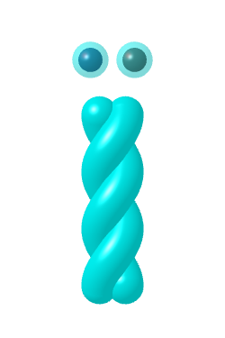
						- Video
						  
				- Note: Don't read “Unïnfo” as “UN-info” /ˈʌnˌɪnfoʊ/ – as if it means [“uninformation”](https://en.wiktionary.org/wiki/uninformation) (unwanted, untrue, useless information) or [uninformed](https://en.wiktionary.org/wiki/uninformed) (ignorant) which is quite different from the concept of unity at the heart of Unïnfo.
				- Typographic note: While visualy indistinguishable, the letter ‘ï’ in ((66537a44-f579-4fcc-a02b-2f32d0d409fc)) is neither [i with diaeresis (ï) [U+EF]](https://en.wikipedia.org/wiki/%C3%8F) nor [i-umlaut (`&iuml;`)](https://en.wikipedia.org/wiki/I-mutation), but an ‘i’ with [double dot (◌̈) [U+0308] above](https://en.wikipedia.org/wiki/Two_dots_(diacritic)#Vowels).
				  id:: 68a520bf-ed90-4e1f-ae2a-0700d7f51b05
					- The combination `ï = i +  ̈` should be rendered with only two dots (not three dots), because these are the two dots of the two letters `ii`, left over after the fusion.
					- This double dot mark denotes neither [vowel hiatus (diaeresis)](https://en.wikipedia.org/wiki/Vowel_hiatus) nor [umlaut](https://en.wikipedia.org/wiki/Umlaut_(diacritic)).
					- This double dot mark can be seen as, similar to the IPA notation (ː) and the [macron](https://en.wikipedia.org/wiki/Macron_(diacritic)), denoting the [long vowel](https://en.wikipedia.org/wiki/Vowel_length#Diacritics) similar to its usage in [Aymara](https://en.wikipedia.org/wiki/Aymara_language) and [Ligurian](https://en.wikipedia.org/wiki/Ligurian_language).
		- ((6651ecba-793d-43c5-8020-a9f260b032d8)) ((66537a44-f579-4fcc-a02b-2f32d0d409fc)) is the umbrella term for both the ((669dfc9f-b5e2-448a-b6f4-be13c5bfbccb)), as the theoretical aspect, and the ((665379b7-e4f6-4240-8029-fd143e2230c7)), as the practical aspect.
		- ((665359ff-79f1-4669-b10b-f2b0e633a7c1))
			- Nuance: Even though the name “Universal Information” alludes to the idea that “*everything is information*”, there is _**no** such formal statement_ in the ((669dfc9f-b5e2-448a-b6f4-be13c5bfbccb)).
			  id:: 6819f75f-1bab-4cc7-9316-228d14aa80d9
			  collapsed:: true
				- The theory was named “Universal Information” simply because the author ((66536578-c4d3-43f1-b35c-bf71120f0570)) is an information scientist. At that time, he saw the hierarchy of visible matter as: mass > energy > information. That means “*every __visible__ thing is information.*”
				- Later on, when studying the ((66ac41f1-de0c-48cb-a9b0-c30b0fe27c5d)) Theory, he discovered the invisible ((687f322c-2334-46e5-816b-57889e5c6b89)) underlying the visible ((66f7af1e-02d6-4c9b-b8f4-01a5ac6749d8))s (information, energy, mass, charges, ...).
				- That means, instead of “information”, the “universal substance underlying everything” is formally modeled as the  ((675c03d8-3185-41a8-9f98-e869fabec793)) and the ((66ab75a1-f4a0-4bab-a002-8e573546623a)), which capture not only information but also _the underlying **sustent** that carries information_.
	- ## Unïnfo Theory
	  id:: 669dfc9f-b5e2-448a-b6f4-be13c5bfbccb
	  collapsed:: true
	  The Theory of ((66537a41-f229-4891-803e-828573eb44f3))
		- GitHub: https://github.com/bixycler/Uniinfo
		- ((6651ecba-793d-43c5-8020-a9f260b032d8)) The published theoretical part of the ((66537a44-f579-4fcc-a02b-2f32d0d409fc)).
			- The metaphysical theory of Unïnfo [𝕄]
				- ((669dfc7d-5355-41db-93a1-8d590e8ec9d8)) [♾]:
					- ((66f3d4a2-375f-4098-9228-66c611f0da90)): [Circle](((66f3d561-424a-4e1d-be55-98ac39c48502))), [Arrow](((66f3d5ca-a982-4d12-b307-fd4812adeb3b))), [Equal](((66f3d5cc-0d68-47bb-b09a-87cda33c7354)))
					- ((66f3d61c-35d0-46ae-9786-752af40e64c4)): [Exsistence](((66f3d644-782c-4f33-bd5c-db6e0a2d447a))), [Differentiation](((1a22a090-6786-4114-8aad-35b122783bff))), [Unification](((c96a6d20-a0f6-48bd-9d70-9bc00b6b3c69)))
					- ((66f3e0be-7d8c-45d6-92c3-6bad456555c9)): ((66f3e66a-8afb-4b20-bf85-111bc4aee09c)), ((66f3e588-9094-45af-9dff-2225c3ac39ab)), ((a95f4693-fe48-4a60-b1e3-5897a40efc5a))
				- ((66f3ed94-4f20-4166-8e9b-2e8ba53aaad2))
				- The ((66f3b5e5-496a-4545-be7a-b1df2d94bd11)): ((678e1c3f-6202-45aa-8527-f4bdad9927b9)) = ((665ca429-84e3-49ff-921e-c07d19cd99ba)) ☉ ((6678288e-699b-4325-bdba-bf6349fe0d57))
					- ((66723642-58f1-4a74-bba3-0108f14c6bac)): ((6653769c-3334-46fa-a1d5-4ce6a7fc23e8)), ((6672513b-c4b0-4c88-8b30-c60a3c6555a7)), ((685a47f5-728a-4b34-95c5-d8e3bba5aad1))
					- ((678e2046-54ac-4284-865d-6f3e38f589a1))
					- ((686e6e72-13f8-4dc9-a8e2-de35519f57d7))
				- [Unitorus](https://bixycler.github.io/Uniinfo/Unitorus/UniTorus.html) – The emblem of Unïnfo
				  id:: 68594391-f2b0-4501-86ec-af8b67346db9
					- 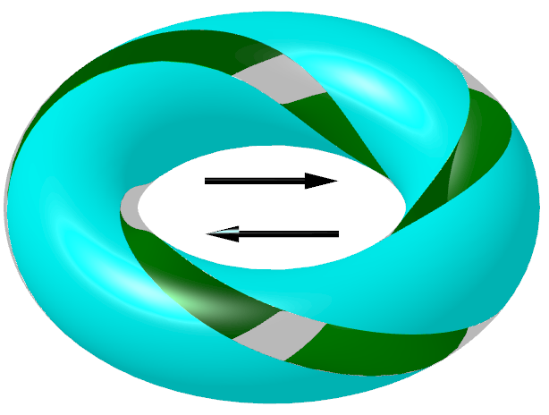{:height 40, :width 60}
			- ((66ac41f1-de0c-48cb-a9b0-c30b0fe27c5d)) Theory [Ʊ]
				- The ((66b1cfa4-e22c-4424-bf19-a6ce4649da77)) [((66f3c32c-9b5a-4e5a-95cc-411256b40b4f))]: ((66b1cfa4-2537-4361-a626-da81ca5b4e6f)) ÷ ((66f3c97f-94e8-4783-96c5-fe9cadf4f9a9)) = ((66f7af1e-02d6-4c9b-b8f4-01a5ac6749d8))
				- The ((66f40210-cca6-4d81-85e7-d0c54ef20451)) mechanism & the ((67bd7811-ce55-402f-8fb2-08b59fb271c9))
					- Projective dynamics: ((67bd3614-2520-4a5d-8b3f-44f60901844e)), Elastic Dynamics, Newtonian Dynamics
				- The ((66ab75a1-f4a0-4bab-a002-8e573546623a)) & ((667bef22-b272-4a7d-b613-3f1ed1a47329))
				- The ((675c03d8-3185-41a8-9f98-e869fabec793)) [((678e23b4-0fbe-4a5d-923f-6252405053df))]
			- Knowledge Theory [𝕂]
			- uninet [**ᔕ**]
	- ## Trinion
	  id:: 669dfc7d-5355-41db-93a1-8d590e8ec9d8
	  collapsed:: true
	  ((66f3d561-424a-4e1d-be55-98ac39c48502)) ((66f3d5cc-0d68-47bb-b09a-87cda33c7354)) ((66f3d5ca-a982-4d12-b307-fd4812adeb3b))
	  ○ = ↑
	  “a platform, not a foundation”
		- ((6651ecba-793d-43c5-8020-a9f260b032d8)) In ((669dfc9f-b5e2-448a-b6f4-be13c5bfbccb)), every concrete thing, i.e. ((678e1c3f-6202-45aa-8527-f4bdad9927b9)), is made of ((66f3d4a2-375f-4098-9228-66c611f0da90)): Circle, Arrow and Equal. These components are described in the [three postulates](((66f3d61c-35d0-46ae-9786-752af40e64c4))). Corresponding to the three components, there are [three intrinsics](((66f3e0be-7d8c-45d6-92c3-6bad456555c9))) of the Trinion – the _static_, the _dynamic_ and the _balance_ – which show the ((66f3ed94-4f20-4166-8e9b-2e8ba53aaad2)) of ((66537a44-f579-4fcc-a02b-2f32d0d409fc)). Vacantism means that the ((669dfc7d-5355-41db-93a1-8d590e8ec9d8)) is neither the ultimate truth, nor the [first principle](https://en.wikipedia.org/wiki/First_principle), nor the primordial existence, but just the experiential launchpad for the theory of ((66537a44-f579-4fcc-a02b-2f32d0d409fc)).
			- ((66f3c28a-a18f-4cca-90d6-c086ac7fccdf)) “Trinion” is pronounced “tree-nion” /ˈtrɪnjən/.
		- Three components of the ((669dfc7d-5355-41db-93a1-8d590e8ec9d8))
		  id:: 66f3d4a2-375f-4098-9228-66c611f0da90
		  collapsed:: true
			- Circle
			  id:: 66f3d561-424a-4e1d-be55-98ac39c48502
			  ○
			  ((667d15c6-67c4-4998-a549-c8b3f9de3d60)) in ((669dfc7d-5355-41db-93a1-8d590e8ec9d8))
			- Arrow
			  id:: 66f3d5ca-a982-4d12-b307-fd4812adeb3b
			  ↑
			  ((667d15b7-6364-49a9-ac58-c64d2a992b63)) in ((669dfc7d-5355-41db-93a1-8d590e8ec9d8))
			- Equal
			  id:: 66f3d5cc-0d68-47bb-b09a-87cda33c7354
			  `=`
			  ((6653751a-a1b4-44b0-a81e-0a446eb8918c)) in ((669dfc7d-5355-41db-93a1-8d590e8ec9d8))
				- ((665359ff-79f1-4669-b10b-f2b0e633a7c1))
					- About the name “Equal”
					  collapsed:: true
						- The name “Equal” of the third component is an adjective noun meaning “equality”, “equilibrium”, “equivalence”, “balance”.
							- Note that this is an [obsolete meaning](https://en.wiktionary.org/wiki/equal#Noun) different from the modern meaning “equal parts” or “peers” used in everyday English.
						- Its symbol “`=`” is called “[equal sign](https://en.wikipedia.org/wiki/Equals_sign)” in American English or “equals sign” by Unicode Consortium in British English.
					- About the equation ⟪○ = ↑⟫
					  id:: 66f3fd7d-625b-49a2-a87a-d8c6f260329f
					  collapsed:: true
						- The equation “Circle Equals Arrow” is both,
							- the **equivalence principle** of the macrocosm (Universe), written with the _static equal_ ⟪○ = ↑⟫, and
							- the **differential equation** of the microcosm (Trinion), written with the _dynamic equal_ ⟪○ ⇌ ↑⟫.
		- Three [postulates](((66f3cf07-4be5-4a50-9d99-b190b60f6ffa))) of the ((669dfc7d-5355-41db-93a1-8d590e8ec9d8))
		  id:: 66f3d61c-35d0-46ae-9786-752af40e64c4
			- **Postulate of Existence**
			  id:: 66f3d644-782c-4f33-bd5c-db6e0a2d447a
			  There _exists_ a ((66f3d561-424a-4e1d-be55-98ac39c48502)) (○).
			- **Postulate of Differentiation**
			  id:: 1a22a090-6786-4114-8aad-35b122783bff
			  The Circle transforms into _different_ ((665ca429-84e3-49ff-921e-c07d19cd99ba))s. This transformation is called the ((66f3d5ca-a982-4d12-b307-fd4812adeb3b)) (↑) which is itself _different_ from the Circle.
			- **Postulate of Unification**
			  id:: c96a6d20-a0f6-48bd-9d70-9bc00b6b3c69
			  The Circle and the Arrow are two aspects of _the same_ being called ((669dfc7d-5355-41db-93a1-8d590e8ec9d8)) (⊜). This equivalence is called the ((66f3d5cc-0d68-47bb-b09a-87cda33c7354)) (`=`). Thanks to the same origin, when the two former components (○, ↑) meet each other, they _recognize_ each other. That recognition is denoted by the _equation_ ⟪○ = ↑⟫.
		- Three [intrinsics](((66f3e170-dc4b-45ea-8720-de4580a30d01))) of the ((669dfc7d-5355-41db-93a1-8d590e8ec9d8))
		  id:: 66f3e0be-7d8c-45d6-92c3-6bad456555c9
		  collapsed:: true
			- ((6651ecba-793d-43c5-8020-a9f260b032d8)) Corresponding to Circle, Arrow and Equal, there are three intrinsics of [the static](((66f3e66a-8afb-4b20-bf85-111bc4aee09c))), [the dynamic](((66f3e588-9094-45af-9dff-2225c3ac39ab))) and [the balance](((a95f4693-fe48-4a60-b1e3-5897a40efc5a))), respectively.
				- 
			- ### Intrinsic Static
			  id:: 66f3e66a-8afb-4b20-bf85-111bc4aee09c
				- “Every arrow is sustained by circles (⇴).” 
				  id:: 699c0363-a78b-4ca8-9992-be7a20d09026
				  Just like a vehicle moving with its wheels, every change has its invariant(s), every motion has its law(s). The law of motion is invariant, the wheels of moving vehicle are invariant. Because they are invariants underlying the variants, they are called “intrinsic statics”.
					- 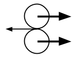
				- “Every equal is in the shape of circle (⊜).”
				  The most familiar equality is that two objects having the same information: shape, appearance, measure, value, structure, class, type, image, extension, etc. The symmetry of equality, i.e. ⟪A = B⟫ ⇔ ⟪B = A⟫, shows a loop from A to B then back to A. Thus its shape is a circle.
					- 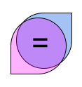
					- The more subtle equality is that of the opposites, just like |-1234| = |+1234|. The opposites are “equal” because they are complement, together they comprise a whole which is represented by the Circle.
						- 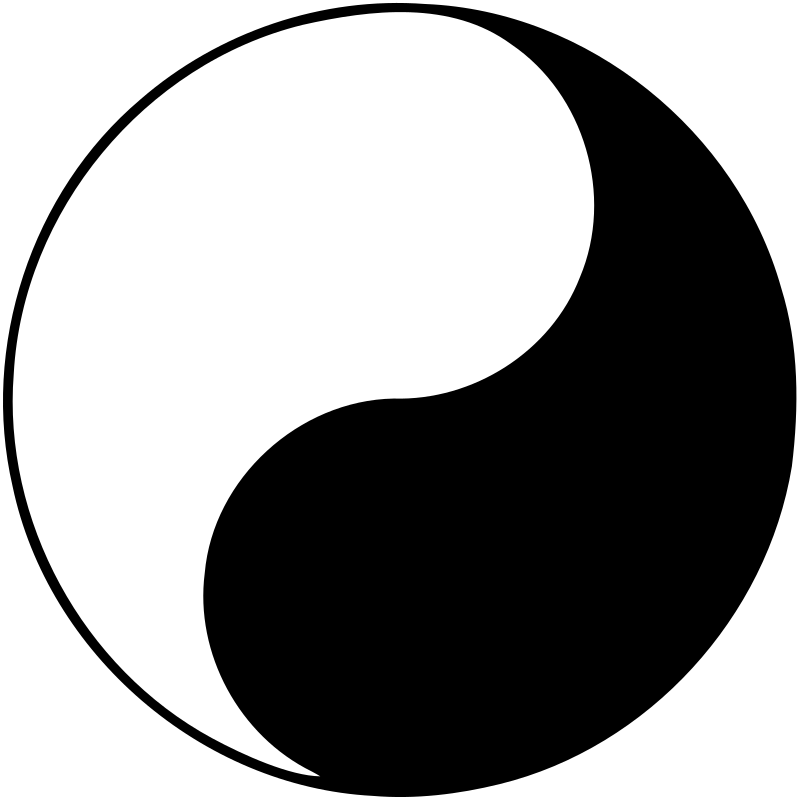{:width 50, :height 50}
			- ### Intrinsic Dynamic
			  id:: 66f3e588-9094-45af-9dff-2225c3ac39ab
				- “Every circle is composed of arrows (⥁).”
				  id:: 699c0363-0995-47fc-9e99-fdc7a36a375f
				  Just like a spinning top or a high-speed fan, some object looks static because it's moving in circle, its motion is looping back, it's going back and forth (🗘).
					- As the fan spins too fast, we can only see it as a stationary solid disk, while its blades are actually rotating under the hood.
					- 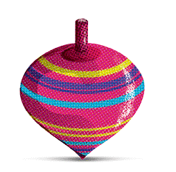{:width 50, :height 50} 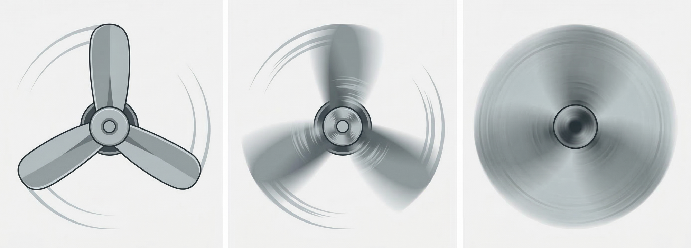{:width 300}
				- “Every equal is in the shape of arrows (⇌).”
				  id:: 684f9517-8a24-4709-a62a-bd075acb9d2c
					- The balance between things is always a [dynamic equilibrium](https://en.wikipedia.org/wiki/Dynamic_equilibrium) where the exchange between them cancels them out. For example, in mechanics, we have balance between force vectors, in chemistry, we have balance between reaction directions, etc.
					- The Equal is not a trivial equality of identical things, i.e. ⟪$A = A$⟫, but the equality between different things, e.g. ⟪$A = B$⟫.
						- Any meaningful equation ⟪$A = B$⟫ presumes that $A$ differs $B$ in some aspect, at least in their names.
						- In this sense, the Equal is not only a passive property but an active “equalizer” that makes different things equal, a “balancer” that balances the imbalance.
						- Here, the Equal is the one that brings differentiated things back together, to be one again, hence the “unification point” in the circle of ((667c008f-cd1f-4a6b-a9c8-d6efa1d8d342)).
						- Diagram
							- 
			- ### Intrinsic Balance
			  id:: a95f4693-fe48-4a60-b1e3-5897a40efc5a
				- “Every arrow is sustained by the macro balance of the whole (⊜).”
				  For each “this ↑” there always exists a “that ↓” to counterbalance.
					- If we cannot find the counterbalance, it's hidden in the meta world, e.g., when something is placed in an imbalanced position, there emerges a returning force as a meta to counterbalance.
					- The parts can be imbalanced but the whole is always balanced.
					- Another expression of the holistic balance is the [cyclic order](https://en.wikipedia.org/wiki/Cyclic_order), e.g., $a < b < c < a ⟹ a \sim b \sim c$.
					- However, to a selful eye, the wholistic balance can be difficult to see because the whole contains not only the visible but also the invisible, not only the objects but also the metas. So, to see the whole's balance, we must use a holistic eye.
					- 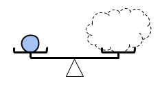
				- “Every circle is sustained by the micro balance of the selfless eye (⇌).”
				  When we reduce the self to zero, just look at the contact point, the incidence point, we see the contacting parties always balance each other. Such ((66e40f4b-34ae-499a-8192-0a0f4f580c7e)) is the “glue” sutaining all circles.
					- Combining the ((66f3e588-9094-45af-9dff-2225c3ac39ab)), we have “circle = arrows + equal points”: a circle is just a chain of arrows glued head-to-tail by equal points.
					- 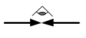
		- ### Vacantism
		  id:: 66f3ed94-4f20-4166-8e9b-2e8ba53aaad2
		  collapsed:: true
		  “an openness, not a nothingness”
		  ((665359e4-4597-4775-b849-f9acbb98960a)) ((66f3f2ad-5b53-4322-889a-f2c85f135fbf)), ((66f3f2ca-cb22-4357-82aa-c8fcf8cc7b3e))
		  ((66c80da9-4cfb-4de7-b83d-8b70665207bf)) ((68b95b62-9e60-4ef2-9540-f563c76a5d17))
			- vô nguyên
			  id:: 66f3f2ad-5b53-4322-889a-f2c85f135fbf
			  ((665c9af1-1ce2-461c-af33-671690618c8f)) ((66f3ed94-4f20-4166-8e9b-2e8ba53aaad2))
			- 無元
			  id:: 66f3f2ca-cb22-4357-82aa-c8fcf8cc7b3e
			  ((665c9af1-1ce2-461c-af33-671690618c8f)) ((66f3ed94-4f20-4166-8e9b-2e8ba53aaad2))
			- vacantistic
			  id:: 68b95b62-9e60-4ef2-9540-f563c76a5d17
			  ((66c80e01-002b-42ae-9c60-49bf3fc6e159)) ((66f3ed94-4f20-4166-8e9b-2e8ba53aaad2))
			- ((6651ecba-793d-43c5-8020-a9f260b032d8)) The ((66f3e0be-7d8c-45d6-92c3-6bad456555c9)) mean that [the Existence](((66f3d644-782c-4f33-bd5c-db6e0a2d447a))) of the Trinion is not an [independent](https://en.wikipedia.org/wiki/Transcendence_(religion)) and [absolute](https://www.newworldencyclopedia.org/entry/Absolute_(philosophy)) “[primordial existence](https://en.wikipedia.org/wiki/First_principle)”, but a _[dynamic Existence](https://en.wikipedia.org/wiki/Prat%C4%ABtyasamutp%C4%81da) in harmony with both [Differentiation](((1a22a090-6786-4114-8aad-35b122783bff))) and [Unification](((c96a6d20-a0f6-48bd-9d70-9bc00b6b3c69)))_. This property of the Trinion is called ((66f3ed94-4f20-4166-8e9b-2e8ba53aaad2)) (Vietnamese “vô nguyên”, Chinese “無元”), which means *“the [absence](https://en.wikipedia.org/wiki/Śūnyatā) of [independent](https://en.wikipedia.org/wiki/Transcendence_(religion)) [original essence](https://en.wikipedia.org/wiki/Essence)”*, and should not be confused with [nihilism](https://en.wikipedia.org/wiki/Nihilism).
			  collapsed:: true
				- Moreover, the Trinion unifies the [emptiness](https://en.wikipedia.org/wiki/Śūnyatā) in the invisible world with the [infinity](https://en.wikipedia.org/wiki/Infinity) in the visible world, thus sometimes is denoted with a circled infinity symbol “♾”.
				- The vacantism is also expressed in Tao Te Ching as the following:
					- id:: 684f9517-7e89-4efb-9b6c-16bf3458ce67
					  #+BEGIN_QUOTE
					  “The Way is vacant, yet never used up.  
					  Immeasurable abyss it is, as the ancestor of all things!”  
					  「道沖而用之或不盈。  
					  淵兮似萬物之宗。」
					  #+END_QUOTE 
					  — [Chapter 4. The Sourceless](https://en.wikisource.org/wiki/Translation:Tao_Te_Ching#Chapter_4_(%E7%AC%AC%E5%9B%9B%E7%AB%A0)), Tao Te Ching
					- id:: 684f9517-afac-49ba-97e3-b88529d74b24
					  #+BEGIN_QUOTE
					  “The door and windows are cut out to form a room;  
					  thanks to its vacancy, the room is usable.”
					  「鑿戶牖以為室，當其無，有室之用。」
					  #+END_QUOTE 
					  — [Chapter 11. The usage of the vacancy](https://en.wikisource.org/wiki/Translation:Tao_Te_Ching#Chapter_11_(%E7%AC%AC%E5%8D%81%E4%B8%80%E7%AB%A0)), Tao Te Ching
				- In ((66537a44-f579-4fcc-a02b-2f32d0d409fc)), the physical spacetime as well as all informational spaces are “**vacant**” instead of “empty”. That means they are _spaces of **possibilities**, containing **potentials**_, instead of nothing.
			- Grand Circle (◯) of Unïnfo
			  id:: 6772a6cd-771f-4f24-9c3a-39c442234be5
				- ((6651ecba-793d-43c5-8020-a9f260b032d8)) Through [Differentiation](((1a22a090-6786-4114-8aad-35b122783bff))), the Trinion transforms into various ((665ca429-84e3-49ff-921e-c07d19cd99ba))s of all beings in the Universe, extensionally. And intensionally, the Trinion is the Universe itself. Then through [Unification](((c96a6d20-a0f6-48bd-9d70-9bc00b6b3c69))), intensionally, every being is just the Trinion itself.
					- 
					- As a [cyclic order](https://en.wikipedia.org/wiki/Cyclic_order), the Grand Circle shows the vacantness of the Trinion that clears the illusion of a linear order from an absolute suppreme being to all things in the Universe. The Grand Circle has been traditionally symbolized by [the Ouroboros](https://en.wikipedia.org/wiki/Ouroboros), and its paradoxical impression is called “[strange loop](https://en.wikipedia.org/wiki/Strange_loop)” recently by Douglas Hofstadter.
						- 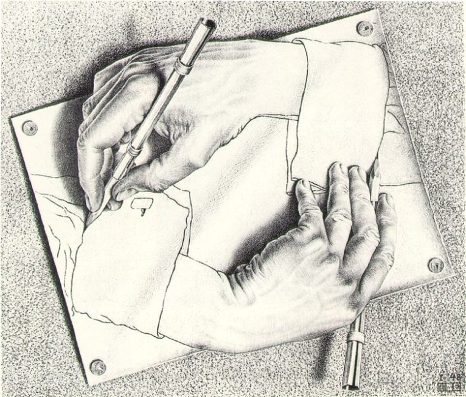{:width 200, :height 150}
			- ((665359ff-79f1-4669-b10b-f2b0e633a7c1))
				- About the term “vacantism”
				  id:: 6852b33f-a694-442e-a599-0110163e4ac8
				  collapsed:: true
					- Basically ((66f3ed94-4f20-4166-8e9b-2e8ba53aaad2)) simply means “**no first**” or [“no prime” (無元)](((68594391-d60e-40af-9285-0591b598288e))), because in ((66537a44-f579-4fcc-a02b-2f32d0d409fc)), every concrete thing is circular, thus the whole Universe is circular and nothing can be absolutely “the first”.
					  id:: 68b96854-7e4a-45a9-b0ef-1d8fb57e5fa3
					- This denial of the any [first principle](https://en.wikipedia.org/wiki/First_principle), or primordial substance, or [essence](https://en.wikipedia.org/wiki/Essence), makes Vacantism equivalent to [non-foundationalism](https://en.wikipedia.org/wiki/Anti-foundationalism) and [non-essentialism](https://en.wikipedia.org/wiki/Non-essentialism). The vacancy of Vacantism is equivalent to “[śūnyatā](https://en.wikipedia.org/wiki/%C5%9A%C5%ABnyat%C4%81)” which is usually translated to “emptiness” in English. However, because such words like “empty”, “void”, “nothing”, “zero”, “null”, “nil” have negative meaning, it's usually confused with [nihilism](https://en.wikipedia.org/wiki/Nihilism) which is denied by Buddhism, Taoism, and Vacantism. Because everything in Unïnfo is relative to ((667259a0-aa2e-49fa-bcbd-b3768a9f30b2)), Vacantism is a kind of [perspectivism](https://en.wikipedia.org/wiki/Perspectivism) which is a non-nihilistic [relativism](https://en.wikipedia.org/wiki/Relativism).
					  id:: 66f3ee6f-9f62-4f7f-ad00-34f5d4b0c800
						- id:: 684f9517-3cbd-495d-8e40-85932d03bbe0
						  > “Non-action but nothing is not done!”
						  「無為而無不為。」
						  
						  — [Chapter 48. Forget the knowledge](https://en.wikisource.org/wiki/Translation:Tao_Te_Ching#Chapter_48_(%E7%AC%AC%E5%9B%9B%E5%8D%81%E5%85%AB%E7%AB%A0)), Tao Te Ching
					- Here, the term “vacantism” is used to emphasise the _**usefulness** of the [vacancy](((66600918-9f92-4730-b056-c2cd87a742aa)))_, just like “vacant rooms” in hotel and “vacant hours” in life. Instead of “emptiness” and “nothingness”, the “vacancy” in “vacantism” shows availability and readiness: _there's always space waiting to be filled in_. Even if it's occupied, the occupation is temporary, and the occupation of one space generates vacancy in another space.
						- The usefulness of vacancy is stated in Tao Te Ching, Chapter 11:
						  id:: 68594391-adfa-4c9d-91ff-c53ce13806ad
						  {{embed ((684f9517-afac-49ba-97e3-b88529d74b24))}}
					- And ultimately, “vacantism” means “the throne of the supreme being is vacant – not to be claimed and possessed by a [transcendent](https://en.wikipedia.org/wiki/Transcendence_(religion)) & [eternal](https://en.wikipedia.org/wiki/Eternity) one, and not for anyone to cling to.”
						- About the “vacant throne”, in the Buddhist sutta “[The Root of all things](https://en.wikipedia.org/wiki/M%C5%ABlapariy%C4%81ya_Sutta)” ([Mūlapariyāya Sutta](https://www.dhammatalks.org/suttas/MN/MN1.html)), the [attachment](https://en.wikipedia.org/wiki/Up%C4%81d%C4%81na) to any kind of primal root is uprooted by [arahants](https://en.wikipedia.org/wiki/Arhat) and [Tathāgatas](https://en.wikipedia.org/wiki/Tathāgata), whether it is the “root-nature” ([Mula-Prakriti](https://en.wikipedia.org/wiki/Prakriti#Samkhya)), the “primal matter” or “First Principle” ([Pradhana](https://en.wikipedia.org/wiki/Pradhana)), the “primal conciousness” or “Supreme Being” ([Purusha](https://en.wikipedia.org/wiki/Purusha)), or even the “unbinding, extinguished state” ([nibbāna](https://en.wikipedia.org/wiki/Nirvana)) itself.
						  id:: 68536bc0-f6ec-4595-8629-2a45d6bf713e
						- Note that vacantism does not deny the presence of a supreme being, esp. an [immanent](https://en.wikipedia.org/wiki/Immanence) one. The “throne of the supreme being” is said to be *vacant* not because there can be no such being, but because no fixed being can be entitled to that throne by default, to own it inherently, and to occupy it exclusively permanently.
						  id:: 684f9517-22fd-4695-b398-f142dca8a8d8
							- This vacancy represents **[non-attachment](https://en.wikipedia.org/wiki/Nonattachment_(philosophy)) to metaphysical absolutism**. It keeps the throne **open** for whoever or whatever rising through context and relation to fulfill that role, to sit there temporarily.
					- Historically, the term “vacantism” was coined due to the lack of correspondent English term for the Vietnamese term “vô nguyên” (Chinese “無元”) in the chain “trialism” (vi. “tam nguyên”) → “dualism” (vi. “nhị nguyên”) → “monism” (vi. “nhất nguyên”) → “???-ism” (vi. “vô nguyên”) when [counting](((684f9517-64ce-41bd-a88c-0476cbfa790d))) the number of ontological primitives of ((669dfc9f-b5e2-448a-b6f4-be13c5bfbccb)), which can be easily confused with its [ontological](https://en.wikipedia.org/wiki/Ontology) [categories](https://en.wikipedia.org/wiki/Theory_of_Categories).
					  collapsed:: true
						- Actually, at first “vô nguyên” was translated to “emptism” in the note “[Mọi thứ đều có Ba, để Ba sinh ra mọi thứ](http://creatzynotes.blogspot.com/2020/11/ba-sinh-moi-thu-moi-thu-sinh-ba.html)”, but then “vacantism” was chosen when editing this document of Trinion.
						- Chinese characters for “nguyên” from abstract to concrete: [元](https://en.wiktionary.org/wiki/%E5%85%83) (first, prime) → [原](https://en.wiktionary.org/wiki/%E5%8E%9F) (root, origin) → [源](https://en.wiktionary.org/wiki/%E6%BA%90) (source)
						  id:: 6852abe7-46f7-4e61-9162-ce1311f717af
							- “**No first**” (無元): ((68b96854-7e4a-45a9-b0ef-1d8fb57e5fa3))
							  id:: 68594391-d60e-40af-9285-0591b598288e
								- In the 1926 book *Philosophy of No First Principle* ([無元哲學](Philosophy-NoFirstPrinciple_無元哲學_CADAL07002676.djvu.pdf)) by 朱謙之 (Zhu Qianzhi, Chu Khiêm Chi) [on Wikimedia Commons](https://commons.wikimedia.org/wiki/File:CADAL07002676_%E7%84%A1%E5%85%83%E5%93%B2%E5%AD%B8_%EF%BC%88%E5%93%B2%E5%AD%B8%EF%BC%89.djvu), Zhu situates “無元” as a critical stance against [foundationalism](https://en.wikipedia.org/wiki/Foundationalism).
								  > The world has no fixed, singular origin or "元". All forms arise through **relation**, **flow**, and **emptiness**, not substance.
							- Next to “無元” is [“無原”](https://baike.baidu.com/item/%E7%84%A1%E5%8E%9F/927272) (**no origin**), meaning “unfathomable origin”, which is often found in Chinese ancient philosophical texts and literary works. The term can be traced back to the Han Dynasty classic 淮南子 ([Huainanzi](https://en.wikipedia.org/wiki/Huainanzi), [Hoài Nam Tử](https://vi.wikipedia.org/wiki/Ho%C3%A0i_Nam_t%E1%BB%AD)), which explains the inexhaustibility of the origin of things through classic expressions such as “轉于無原” (“turning to no origin”, “chuyển vu vô nguyên”, “quay về vô nguyên”).
								- Note: Don't confuse “無原” with the modern term “無原由” (“no reason” / “unjustified”) in administrative/legal contexts.
							- And the last is “no source” (無源), an ancient philosophical term used in commentary on Tao Te Ching.
								- 無源 refers to the 4th chapter of Tao Te Ching about the infinite vacancy of the [Tao](https://en.wikipedia.org/wiki/Tao) (道):
								  {{embed ((684f9517-7e89-4efb-9b6c-16bf3458ce67))}}
								- Note: Don't confuse this philosophical meaning with “without power source” in 無源元件 [“passive device”](https://en.wikipedia.org/wiki/Electronic_component#Passive_components), e.g., resistors, transformers.
							- ((669a1e5f-734c-41c1-bf1c-21813b6e81d8))
							  id:: 6853d150-9daa-4f24-8621-737485d7e9a2
							  collapsed:: true
								- [元](https://en.wiktionary.org/wiki/%E5%85%83): Pictogram – a figure with two lines [二] for a head (one connected to body, one above it), emphasizing the head → “first, prime”
								- [原](https://en.wiktionary.org/wiki/%E5%8E%9F): Ideogrammic compound 原 = [泉](https://en.wiktionary.org/wiki/%E6%B3%89) (“spring”) + [厂](https://en.wiktionary.org/wiki/%E5%8E%82) (“cliff”) – a spring bursting from a cliff-side → “origin, root”. A conservative variant is [厡](https://en.wiktionary.org/wiki/%E5%8E%A1), in which water is well visible at the bottom.
									- 元 and 原 had been used interchangeably in the sense “origin” until 原 became favoured in the early [Ming dynasty](https://en.wikipedia.org/wiki/Ming_dynasty) to avoid the name of the [Yuan dynasty (元朝)](https://en.wikipedia.org/wiki/Yuan_dynasty).
									- The relation between the “head” 元 and the “root” 原 refects the similarity between the animal's head with the plant's root, as shown in biology from [Darwin's “root-brain” hypothesis](https://pmc.ncbi.nlm.nih.gov/articles/PMC2819436/) to [modern researches](https://en.wikipedia.org/wiki/Plant_intelligence).
									- In chemistry, “[element](https://en.wikipedia.org/wiki/Chemical_element)” = [元素](https://en.wiktionary.org/wiki/%E5%85%83%E7%B4%A0) (prime substance), but “[atom](https://en.wikipedia.org/wiki/Atom)” = [原子](https://en.wiktionary.org/wiki/%E5%8E%9F%E5%AD%90) (original particle) with nuances in there meaning.
										- The “element” also had now-obsolete translations like [原素](https://en.wiktionary.org/wiki/%E5%8E%9F%E7%B4%A0) & [原質](https://en.wiktionary.org/wiki/%E5%8E%9F%E8%B3%AA).
										- In Vietnamese [Nôm](https://en.wikipedia.org/wiki/Ch%E1%BB%AF_N%C3%B4m),
											- the obsolete word 原質 ([nguyên chất](https://en.wiktionary.org/wiki/nguy%C3%AAn_ch%E1%BA%A5t)) has been adapted to the meaning of “pure (substance)” (original, intact substance); and
											- the character 原 ([nguyên](https://en.wiktionary.org/wiki/nguy%C3%AAn#Etymology_2)) has been developed to have the meaning of “whole, integral”, e.g. [nguyên vẹn](https://en.wiktionary.org/wiki/nguy%C3%AAn_v%E1%BA%B9n) (whole, undamaged), [số nguyên](https://en.wiktionary.org/wiki/s%E1%BB%91_nguy%C3%AAn) (whole number, integer), which effectively makes the meaning of 原子 clear: 原子 = [nguyên tử](https://en.wiktionary.org/wiki/nguy%C3%AAn_t%E1%BB%AD) = whole particle = indivisible particle = atom.
								- [源](https://en.wiktionary.org/wiki/%E6%BA%90): Phono-semantic & ideogrammic compound 源 = 原 (“origin”) + [氵](https://en.wiktionary.org/wiki/%E6%B0%B5) (“water”) → “source (of water)”
									- This is the developed version of 原 to separate the meaning of “source” from other meanings of 原 like “field, plain” or “raw, unprocessed”. Before this development, “source” was written with 原.
					- ((669a1e5f-734c-41c1-bf1c-21813b6e81d8)) English “vacantism” ← “[vacant](https://en.wiktionary.org/wiki/vacant)” ← Latin “[vacans](https://en.wiktionary.org/wiki/vacans#Latin)” ← “[vacō](https://en.wiktionary.org/wiki/vaco#Latin)” (empty, void, unoccupied, free [time]) ← PIE “[*h₁weh₂-](https://en.wiktionary.org/wiki/Reconstruction:Proto-Indo-European/h%E2%82%81weh%E2%82%82-)” (empty, extinguished) → English “void”, “want”, “vain”, “vacant”, “vacuum”, etc.
		- Numbering
		  collapsed:: true
			- The equation ⟪○ = ↑⟫ is the One that unifies the Two opposites (○, ↑) via the Third (=). This is called ((69367cf5-9894-4fb8-a293-2b1109777fc9)) (☯). Hence, the Unïnfo seems to be [trialistic](https://en.wikipedia.org/wiki/Pluralism_(philosophy)) (due to the Three components), or [dualistic](https://en.wikipedia.org/wiki/Dualism_in_cosmology) (due to the Two opposites), or [monistic](https://en.wikipedia.org/wiki/Monism) (due to the One equation), but actually it's ((68b95b62-9e60-4ef2-9540-f563c76a5d17)) as reflected by the intrinsics of the Zero (the Trinion).
			  id:: 684f9517-64ce-41bd-a88c-0476cbfa790d
				- > “The Way generates the One; the One generates the Two; the Two generates the Three; the Three generates all things.”
				  「道生一，一生二，二生三，三生萬物。」
				  
				  — [Chapter 42. The transformation of the Way](https://en.wikisource.org/wiki/Translation:Tao_Te_Ching#Chapter_42_(%E7%AC%AC%E5%9B%9B%E5%8D%81%E4%BA%8C%E7%AB%A0)), Tao Te Ching, Lao Tzu
			- As nominals, ⟪○⟫, ⟪↑⟫ and ⟪=⟫ are numbered “0”, “1” and “2” (Chinese “二”), resp., which represent their intension.
			- As ordinals, ⟪○⟫, ⟪↑⟫ and ⟪=⟫ are called “the First”, “the Second” and “the Third”, resp.
			- As cardinals, ⟪⊜⟫, ⟪○ = ↑⟫, ⟪○, ↑⟫ and ⟪○, ↑, =⟫ are called “the Zero”, “the One”, “the Two” and “the Three”, resp.
			- Moreover, the three components ⟪○⟫, ⟪↑⟫ and ⟪=⟫ are also identified with “1”, “2” and “0”, resp., when considering their extension.
			- In Taoism, the Zero (⊜) is called “the Way”, the 1st and the 2nd (○, ↑) are called “yin”[陰,⚋] (dark, negative, disconnected, blocked) and “yang”[陽,⚊] (light, positive, connected, through) which are harmonized by the 3rd (`=`). The 3rd is the most important one with many manifestations: the Equal, the middle, the interaction, the interface, ...
				- id:: 699c0363-0471-4989-a833-5635c81d3761
				  > “All things carry Yin on their back and embrace Yang in their front,
				  which are harmonised by the Breath of Vacancy in the Conflict .”  
				  「萬物負陰而抱陽，沖氣以為和。」
				  
				  — [Chapter 42. The transformation of the Way](https://en.wikisource.org/wiki/Translation:Tao_Te_Ching#Chapter_42_(%E7%AC%AC%E5%9B%9B%E5%8D%81%E4%BA%8C%E7%AB%A0)), Tao Te Ching, Lao Tzu
			- The Arrow ⟪↑⟫ here is the long and curved arrow (↝) which can be broken into many short and straight arrows ⟪↥, ↧⟫ called “vectors” where the Equation turns out to be ⟪○ = ↥ + ↧⟫.
		- ((665359ff-79f1-4669-b10b-f2b0e633a7c1))
			- About the name “Trinion”
			  id:: 6716110e-3b83-40b7-965c-3ae44547d832
			  collapsed:: true
				- “Trinion” = “Tri-” + “union” is the union of the three components. This puts more emphasis on _the unity of the three_, compared to other triads like the ((66b1cfa4-e22c-4424-bf19-a6ce4649da77)). This meaning is very much similar to [the “Holy Trinity”](https://en.wikipedia.org/wiki/Trinity) in theism, where “Trinity” may be considered as “Tri-” + “unity”.
				- In the course of finding a term not to be confused with the “Holy Trinity”, the “Triad” or simply the “Three” have been considered. But then the term “Trinion” was coined to reflect the harmony of both [the Differentiation](((1a22a090-6786-4114-8aad-35b122783bff))) and [the Unification](((c96a6d20-a0f6-48bd-9d70-9bc00b6b3c69))) as the dynamic of [the Existence](((66f3d644-782c-4f33-bd5c-db6e0a2d447a))) which is not only a “static & independent existence”.
				- And the Trinion can also be considered as the composit of layers of components as shown by the onion, which itself has [a Roman root meaning “one”](https://www.etymonline.com/word/onion).
					- 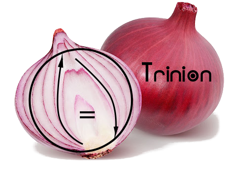
				- Side notes:
					- Searching for “trinion”, I've found two usages, “trinion” as a 3D complex number ⟪x + y**i** + z**j**⟫, and [the “Trinion Wheel” in NeoDeism](https://www.neodeism.com/trinion-contradictions/).
					- The theme of triads in Unïnfo reflects the natural triadic relations in philosophies from the East to the West: Taoism's “yin-yang-qi”, Hinduism's Trimurti, Celtic culture's triplism, Christianity's Trinity, as well as triples of [categories of being](https://en.wikipedia.org/wiki/Category_of_being#Hegel) from Plotinus to Kant, Hegel and Peirce.
			- Postulate vs axiom
			  id:: 66f3cf07-4be5-4a50-9d99-b190b60f6ffa
			  collapsed:: true
				- “Postulates” and “axioms” are both basic assumptions of a theory and are used as the foundation and starting points to build that theory upon. However, while “axioms” are statements taken to be self-evident, accepted to be “true obviously” without question nor controversy, as reflected in the adjective “axiomatic” and in axiomatic systems of mathematics, “postulates” are statements derived from our real-world experiences, like the five postulates of Euclid (in contrast with Euclid's five axioms), and like the principles of physics.
				- In particular, the three postulates of Unïnfo here are statements derived from the author's experience.
				- Hence, these postulates are not meant to be the “ultimate truth”, and the correspondent components are not meant to be the most fundamental [categories](https://en.wikipedia.org/wiki/Theory_of_Categories) like in dualistic and plurualistic ontologies. These postulates are just proposed here to be the theory's starting points, which are open and will be revised again and again throughout the theory.
			- About “intrinsics”
			  id:: 66f3e170-dc4b-45ea-8720-de4580a30d01
			  collapsed:: true
				- Respectively corresponding with the three components Circle, Arrow and Equal, the three intrinsic properties _static_, _dynamic_ and _balance_ are so intrinsic that none of them can stand alone.
				- Here we use the adjective “intrinsic” to emphasize the other underlying properties of a component over the apparent property of that component, e.g. the “Intrinsic Static” and the “Intrinsic Dynamic” versus the apparent “Balance” of the Equal.
				- Historically, while the West (Europe) has a long tradition of philosophy based on the Static, i.e. “existence” via “form”, “category”, “essence”, “element”, the East (from Islamic world, India, to China) has a long tradition of philosophy based on the Dynamic, e.g. “anicca” (अनिच्च, en. “impermanence”), “saṅkhāra” (सङ्खार, en. “formation”), “xíng” (行, en. “phase of transformation”), “yi” (易, en. “change”).
					- About the Balance, both the West and the East had focused on the moral balance, e.g. the inscription “Nothing in excess” in the temple of Apollo at Delphi, the “middle way” in Buddhism, the “Doctrine of the Mean” (中庸, Zhōngyōng) in Confucianism. Then in modern science, the role of Balance has been shown to be universal via equations.
			- Blog post [Mọi thứ đều có Ba, để Ba sinh ra mọi thứ](https://creatzynotes.blogspot.com/2020/11/ba-sinh-moi-thu-moi-thu-sinh-ba.html)
			- History of the discovery of the Trinion
			  id:: 690c716b-e17d-4060-a5eb-e78f9b85686b
			  collapsed:: true
			  :LOGBOOK:
			  CLOCK: [2025-11-06 Thu 16:59:33]
			  :END:
				- Learning about [flip-flops](https://en.wikipedia.org/wiki/Flip-flop_(electronics)) in Osaka University around 2004, [Will](((66536578-c4d3-43f1-b35c-bf71120f0570))) got the first moment of eureka: 
				  > Wow, we can catch the lightning fast electricity into a static state simply with a closed loop!
				- The circular structure of the memory latch, composed simply from two inverters, was the ancestor of the first two components – the Circle and the Arrow.
					- `-1 + 1 = 0`
					  
				- Returning to Vietnam, [around 2010](https://tamsudoithuong.blogspot.com/2010/09/hom-nay-len-truong-nhung-cung-chang-lam.html), he generalized that circle of arrows to capture the static and dynamic aspects of all things.
				- After 3 years, at [the end of 2013](https://www.facebook.com/share/17ev2Leidr/), he nailed down the third component – the Equal – to complete the equation ⟪○ = ↑⟫.
				- #### ☯️ Ancestor Loop 🔄
					- Two NOT gates loop to learn,
					  lightning caught in thought,
					  each completes the other's turn – 
					  a stable state, self-taught.
					  From that quiet spark of mind
					  rose computer and Unïnfo, likewise.
			- Unïnfo brings life to the [classical logic](https://en.wikipedia.org/wiki/Classical_logic).
			  collapsed:: true
			  :LOGBOOK:
			  CLOCK: [2025-11-11 Tue 19:15:34]
			  :END:
				- While Aristotle called the Law of Non-contradiction “the most certain of all principles”, Will was also concerned about it the most, which lead him to the construction of Unïnfo.
					- Ref: blog post [The Implied Axioms of Science](https://creatzyitnotes.blogspot.com/2007/11/implied-axioms-of-science.html)
					- Acknowledging the difference but not accepting the exclusion, he arrived at the first postulate of Unïnfo, the Diff (Arrow), just a moment before the zero-th postulate, the Existence (Circle), and long before the third, the Unification (Equal).
				- The Trinion brings life to the absolute & static (dead) [laws of thoughts](https://en.wikipedia.org/wiki/Law_of_thought).
					- The **Circle** brings **form** to the trivial identity $A = A$ (Law of Identity): The $A$ is not a point, but a full circle $A → B → ... → Z → A$.
					- The **Arrow** brings **motion** in to connect the 2 ends $A$ and $¬A$ (Law of Non-contradiction): “A” and “not-A” are not exclusive, but a transition from one to the other.
					- The **Equal** brings **freedom** to the forbidden middle (Law of Excluded Middle): The forbidden one is released and placed at the central role of connecting, balancing the ends.
	- ## FoC
	  id:: 66f3b5e5-496a-4545-be7a-b1df2d94bd11
	  collapsed:: true
	  :LOGBOOK:
	  CLOCK: [2024-09-25 Wed 14:04:07]
	  :END:
	  ((665ca429-84e3-49ff-921e-c07d19cd99ba)) ☉ ((6678288e-699b-4325-bdba-bf6349fe0d57))
	  ((665359e4-4597-4775-b849-f9acbb98960a)) ((678e1c3f-6202-45aa-8527-f4bdad9927b9))
		- ### being
		  id:: 678e1c3f-6202-45aa-8527-f4bdad9927b9
		  ((665c9af1-1ce2-461c-af33-671690618c8f)) ((66f3b5e5-496a-4545-be7a-b1df2d94bd11))
			- ((6651ecba-793d-43c5-8020-a9f260b032d8)) Each ((678e1c3f-6202-45aa-8527-f4bdad9927b9)) is an ((66eaa84b-6ea5-4ae8-939b-f80fd3bf6afe)) of the ((669dfc7d-5355-41db-93a1-8d590e8ec9d8)), which is a ((68932044-a013-4cc6-b468-df8f3a43103c)) thing containing the three components: ((665ca429-84e3-49ff-921e-c07d19cd99ba)) (○), ((6678288e-699b-4325-bdba-bf6349fe0d57)) (↑) and ((94e87dc9-71af-477c-aa70-0f448c2f1e20)) (☉, =). Containing obop, all beings are ((667cfa3e-9856-43f0-956b-ebb4ff31d8eb))s.
			- ((66537674-6cf9-4459-8bea-7c1858c694a3))s of being
				- Abstracting the obop, the ((66c810a0-9861-4787-bdcf-1378219332be)) of a being is an ((667cfa42-ade7-4310-9a7b-6d14d01c16da)).
				- Further abstracting the form, the fundamental substance underlying all objects is the ((678e1d31-4874-4df6-bfb4-60822a6b5546)).
			- ((665359ff-79f1-4669-b10b-f2b0e633a7c1))
				- ((678e1c3f-6202-45aa-8527-f4bdad9927b9)) is to “thing” as ((667cfa3e-9856-43f0-956b-ebb4ff31d8eb)) is to ((667cfa42-ade7-4310-9a7b-6d14d01c16da)).
				  id:: 67ac5dfc-2224-4261-a5d2-52def30c3cba
				  collapsed:: true
					- While “being” must be concrete, “thing” can be abstract.
					- While “subject” is a synonym of “being”, it emphasizes the presence of the obop, to contrast with “object” as the abstract thing lacking obop.
					- While the general meaning of the noun “being” includes both subjective and objective entities, its everyday usage is more about “living beings” like humans, animals, deities, mythical beings & creatures, etc.
						- The objective meaning of “being” is used in [ontology](https://en.wikipedia.org/wiki/Ontology), the study of being. ((669a1e5f-734c-41c1-bf1c-21813b6e81d8)) “ontology” = “ōn” [being] + “logy” [study].
						- While in general philosophies, “being” is a synonym of “existence” which sounds very objective, [existentialism](https://en.wikipedia.org/wiki/Existentialism) treats such “existence” in a very subjective way.
						- The verb “be” in the sentence structure “subject verb object”, like “I am a man”, “it is a rock”, shows two sides of “being” as both subject and object. That means a “concrete being” must have subjectivity and “object” is just an “abstract being”. In Unïnfo, we preserve the term “being” for concrete things only.
				- ((678e1c3f-6202-45aa-8527-f4bdad9927b9)) is inseparable from “becoming”, as “[existence](((66f3d644-782c-4f33-bd5c-db6e0a2d447a)))” is inseparable from “[differentiation](((1a22a090-6786-4114-8aad-35b122783bff)))”, as stated by the ((66f3e0be-7d8c-45d6-92c3-6bad456555c9)).
				  collapsed:: true
					- This property is called ((66f3ed94-4f20-4166-8e9b-2e8ba53aaad2)).
					- Some Ancient Greek philosophers like Plato and Parmenides stated that reality is the world of unchanging beings, i.e. the [world of forms](https://en.wikipedia.org/wiki/Theory_of_forms), separated from the illusive world of ever changing becomings (phenomena).
		- Structure of ((678e1c3f-6202-45aa-8527-f4bdad9927b9))
			- TODO Migrate [[FoC]]
			  :LOGBOOK:
			  CLOCK: [2024-09-25 Wed 14:04:07]
			  :END:
			- ### Form Obop Content
				- Analysis of the Trinion
				- Integration and working of the components
			- ### Onion structure
			  id:: 686e630e-0d4d-4584-8c77-f9f0b865e631
			- ### Potato strucure
			- ((665359ff-79f1-4669-b10b-f2b0e633a7c1))
				- Bulboid structure: fold = store
				  id:: 686e6444-ed07-408c-ad6f-72f308410cd1
				  collapsed:: true
					- 🥔 Tuber: Life force folded into body
					- ⚛️ Particle: Energy folded into mass
					- 🔁 Memory Cell (flip-flop): Time folded into state
					- ⭕ Self: Content folded into Form
					- ♾️ Trinion: Arrows folded into Circle
					- bulboid = củ
				- Dual bulboid structures: the onion structure of view cone <> the potato structure of action cone
				  collapsed:: true
					- 🧅 the onion structure of multiple layers of self-circles: many circles around one eye 👁️ (bud, obop)
						- the self in reflection: this concentrating structure is the unification of the world into the observer.
						- this is also the hurricane structure.
					- 🥔 the potato structure of ((667bebeb-7f20-4d03-b860-1653c3137710)): many eyes 👀 on one circle
						- the self in expression: this radiating structure is the development from the operator.
						- these many eyes are illustrated by the thousand-armed and thousand-eyed Guanyin.
					- 🧅 Bulboid receptor in animal <> 🥔 Bulboid organ in plant
						- animal = particle = onion structure
						- plant = network = wave = potato structure
		- #### CIE operation
		  id:: 686e6e72-13f8-4dc9-a8e2-de35519f57d7
		  collapsed:: true
			- ((6651ecba-793d-43c5-8020-a9f260b032d8)) The ((66b1cfa4-e22c-4424-bf19-a6ce4649da77)) is expressed in the ((6851578b-9b1f-4367-878f-79b0b0b9be51)) through the mapping $y = O(x)$.
			  id:: 686e6eb2-b5f8-4592-9a56-378e197f9d11
				- object $y$ is the content
				- ((685a47f5-728a-4b34-95c5-d8e3bba5aad1)) O is the intent
				- position $x$ is the extent
				- ((6672513b-c4b0-4c88-8b30-c60a3c6555a7)) = projection $O: y → x$
				- ((6847e436-9a84-42c5-a853-75f6d626ed63)) = projection $y ← O × x$
			- ((665359ff-79f1-4669-b10b-f2b0e633a7c1))
				- ((685a58f3-6393-48df-966b-24b270a92b58))
		- *All beings have the same content.*
		  id:: 678e1960-58d6-4cf3-8fe3-25f2f4489b33
		  collapsed:: true
		  :LOGBOOK:
		  CLOCK: [2025-01-20 Mon 16:37:39]
		  :END:
		  Different beings are just the same content expressed in different forms.
		  ((665ca48e-f7c1-4541-b5cf-486d86b02997)) ((678e2046-54ac-4284-865d-6f3e38f589a1))
			- Law of the same content
			  id:: 678e2046-54ac-4284-865d-6f3e38f589a1
			  ((665ca495-93b4-47d4-a022-ce511b021a3d)) « ((678e1960-58d6-4cf3-8fe3-25f2f4489b33)) »
			- ((6651ecba-793d-43c5-8020-a9f260b032d8)) The total content of any ((678e1c3f-6202-45aa-8527-f4bdad9927b9)), i.e. all arrows of any being, is the ((678e1d31-4874-4df6-bfb4-60822a6b5546)) of the ((66c8046e-c5fe-4f27-b3cf-40f5f39b646b)). One being differs from other beings only through its form. That means each being (each instance of the ((669dfc7d-5355-41db-93a1-8d590e8ec9d8))), is just the ((66537a0b-d107-4f7e-b01f-bf624a647d8c)) manifesting in a particular form. This is the strong form of the ((69367cf5-9894-4fb8-a293-2b1109777fc9)).
			- Conservation of content
			  id:: 67a983b4-f6ad-4abb-b611-7952168d83a2
				- ((6651ecba-793d-43c5-8020-a9f260b032d8)) ((67a983b4-f6ad-4abb-b611-7952168d83a2)) is a special case of the ((678e2046-54ac-4284-865d-6f3e38f589a1)) when considering a single being throughout time.
			- **universal content**
			  id:: 678e1d31-4874-4df6-bfb4-60822a6b5546
			  the ((6678288e-699b-4325-bdba-bf6349fe0d57)) shared by all ((678e1c3f-6202-45aa-8527-f4bdad9927b9))s
			  ((665359e4-4597-4775-b849-f9acbb98960a)) ((687f322c-2334-46e5-816b-57889e5c6b89))
				- sustent
				  id:: 687f322c-2334-46e5-816b-57889e5c6b89
				  ((665c9af1-1ce2-461c-af33-671690618c8f)) ((678e1d31-4874-4df6-bfb4-60822a6b5546))
		- ### FoC dynamics
		  id:: 6858b355-fba9-4e61-9f16-bc993a3df44b
		  collapsed:: true
		  [differentiation](((1a22a090-6786-4114-8aad-35b122783bff))) of content → partiality of form → ((667c008f-cd1f-4a6b-a9c8-d6efa1d8d342)) of obop
		  part ⇒ diff ⇒ change
			- Differentiation: Every component is differentiated from the Trinion, hence equal to the Trinion in some aspect but not the whole Trinion.
				- The closed form (Circle) is the image of the Trinion but not the whole Trinion.
				- The total content (circular Arrow) is the body of the Trinion but not the whole Trinion.
				- The obop (Equal) is the representative of the Trinion but not the whole Trinion.
			- Partiality
			  id:: 6858b355-8966-4955-abe5-d6c126901cec
				- The Circle in the Trinion is not the whole Trinion, but just an abstract part of the whole, an image projected from the whole.
				- Abstract form (Circle) + content (Arrow) = concrete form [((66ab75a1-f4a0-4bab-a002-8e573546623a))] = total content [((667c0031-0a87-44c9-9e98-6d45893b095f))], but still missing the Equal, i.e. the obop, that looks at the Ω-thread and operates it.
				- The obop (Equal) is infinitely small compared to the total content, hence inherently partial relative to the Trinion. However, only through obop, can the whole Trinion be cognized, can the form be projected, and can the content be alive. That makes obop be an infinitely important point, a critical point, a ((6732cf13-5b1b-499d-80ec-4c5b407e9cc5)) singularity of the whole, hence inherently whole unto itself.
			- The Equal of the obop is tricky and contradictory: “Circle = Arrow” while they are apparently different!
				- Different things being equal is the nature of Circle, i.e. ((66f3e66a-8afb-4b20-bf85-111bc4aee09c)).
				- Contradiction is the nature of Arrow, i.e. ((66f3e588-9094-45af-9dff-2225c3ac39ab)).
				  id:: 6926be20-fe64-46a4-96e4-d53fae9045df
					- Contradiction is discussed in [dialectical materialism](https://en.wikipedia.org/wiki/Dialectical_materialism) via the statement “conflict is the driving force of change and transformation”.
				- Positively, Equal is the “unifier” in dynamic sense, but negatively, Equal is the “liar” in static sense. And i usually say “*the [Liar Paradox](https://en.wikipedia.org/wiki/Liar_paradox) is the creator of all things!*”
			- ((665359ff-79f1-4669-b10b-f2b0e633a7c1))
				- Bidirectional relation “differ[ent,ence] with” versus unidirectional relation “differ[ent,ence] from”
				  id:: 685a97df-925a-44b4-bae6-235dd237f196
				  collapsed:: true
					- In current English standard, while there are two-sided relational constructs like “compare with”, “disagree with”, there's no such a parallel construct for difference like “differ with”.
						- In the current standard, people just use the directional construct “differ from (a base/reference)” in all cases.
						- In British English, [“different to”](https://dictionary.cambridge.org/grammar/british-grammar/different-from-different-to-or-different-than) is also used in place of “different from”.
						- The only symmetric construct of difference is “the difference between A and B”, but it's more analytical than relational.
					- In ((66537a44-f579-4fcc-a02b-2f32d0d409fc)), “diff from”, “diff to”, “difference between”, and the newly coined “diff [with]” have clearly distinct meanings.
						- ➡️ Unidirectional constructs
							- “A's difference from B” = “B's difference to A” is the `diff` relation from $B$ to $A$, i.e. $\overrightarrow{BA} = B → A = A - B$.
								- The prefered style of taking “difference” is the “from” form, i.e. $A - B$, while the prefered style of the `diff` relation is the “to” form, i.e. $B → A$.
							- “A differs from B” = “B differs to A” = “A is different from B” = “B is different to A” is the qualification of the `diff` relation from $B$ to $A$, i.e. $\overrightarrow{BA} ≠ 0 ⟺ A - B ≠ 0 ⟺ A ≠ B$.
						- 🔁 Symmetric constructs
							- “A's difference with B” = “B's difference with A” is the bidirectional `diff` relation between $B$ and $A$, i.e. $\overleftrightarrow{BA} = B ↔ A = (A - B) ∧ (B - A)$.
							- “A differs [with] B” = “B differs [with] A” = “A is different with B” = “B is different with A” is the qualification of the bidirectional `diff` relation between $B$ and $A$, i.e. $\overleftrightarrow{BA} ≠ 0 ⟺ (A - B ≠ 0) ∧ (B - A ≠ 0) ⟺ (A ≠ B) ∧ (B ≠ A)$.
								- Notes
									- Don't confuse this new construct with the non-relational expression of “difference due to some factor”, e.g. “She looks different *with this new dress*” = “*In this new dress*, she looks different”  or “He acts different *with alcohol*” = “Under the influence of alcohol, he acts different.”
									- This construct is parallel with similar constructs: “compare with”, the archaic [“differ with” = “disagree with”](https://www.oxfordlearnersdictionaries.com/definition/english/differ), and the Vietnamese “khác với”.
							- “difference between A and B” = “difference between B and A” is the extent (magnitude) of bidirectional `diff` relation between $B$ and $A$, i.e. $BA = |\overleftrightarrow{BA}| = |B ↔ A| = (|A - B| + |B - A|)/2$.
						- 🧭 The direction of relations is crucial in Unïnfo, since both `sim` and `diff` relations are not symmetric by default.
							- Due to the ((66c88055-a994-4e59-a7dc-83f3331a6e1d)), ((685a9913-6bf4-41e4-89d1-5000a2b2f9d5)) nature of relation in Unïnfo, 
							  “A differs from B” doesn't mean “B differs from A”, and 
							  “A is similar to B” doesn't mean “B is similar to A”.
							- In Unïnfo, instead of static symmetric relations (like “distance between 2 points”), most of them are circular relations, like [cyclic order](https://en.wikipedia.org/wiki/Cyclic_order), e.g. $O_0 → O_1 → O_2 → ... → O_0$.
							- The circularity of relations gives rise to paradoxical characteristics, e.g.: 
							  > $O_0$ is very similar to $O_1$ but very different from $O_1$.
								- These paradoxes usually emerge in Quantum physics, like the [3-polarizer paradox](https://www.informationphilosopher.com/solutions/experiments/dirac_3-polarizers/).
								  collapsed:: true
									- [Bell's Theorem: The Quantum Venn Diagram Paradox](https://youtu.be/zcqZHYo7ONs)
										- {{video https://youtu.be/zcqZHYo7ONs}}
								- In philosophy, the East has the idiom “great wisdom appears as foolishness” ([大智若愚](https://baike.baidu.com/item/%E5%A4%A7%E6%99%BA%E8%8B%A5%E6%84%9A)), and the West has [Socratic irony](https://en.wikipedia.org/wiki/Socrates#Socratic_ignorance) “I know that I know nothing!”
									- Tao Te Ching: [Ch.41](https://en.wikisource.org/wiki/Translation:Tao_Te_Ching#Chapter_41_(%E7%AC%AC%E5%9B%9B%E5%8D%81%E4%B8%80%E7%AB%A0)) ([DDK41](https://nhantu.net/TonGiao/DaoDucKinh/DDK41.htm)): 廣德若不足
									  “Quảng đức nhược bất túc” 
									  “Those with noble Virtue seem lacking”
									  “Người có Đức lớn dường như thiếu Đức”
				- FoC dynamics ~ ((67bd3614-2520-4a5d-8b3f-44f60901844e)): equal = center, arrows = out & in radius, circle = trajectory of the arrowhead
				  id:: 686e580a-876e-47cf-b2cc-1381bc64cdb9
				  collapsed:: true
					- point equal: the init close loop of arrows
					- mass equal: the constant round trip between the center and the trajectory
					- intent equal: the constant radius (c = const) => round => close the next meta loop (next point equality)
					- => ((66f40210-cca6-4d81-85e7-d0c54ef20451))
		- Properties of the triple form - content - obop
		  id:: 66f411d3-f2d5-47c3-8f5a-d31c02cf88eb
		  :LOGBOOK:
		  CLOCK: [2024-09-25 Wed 20:38:04]
		  :END:
			- static - dynamic - balance
			- whole - partial - hollow
				- 1 - ½ - 0
			- solid - fluid - empty
			- heavy - light - zero
			- visible - invisible -
	- ## CIE
	  id:: 66b1cfa4-e22c-4424-bf19-a6ce4649da77
	  collapsed:: true
	  ((66b1cfa4-2537-4361-a626-da81ca5b4e6f)) ÷ ((66f3c97f-94e8-4783-96c5-fe9cadf4f9a9)) = ((66f7af1e-02d6-4c9b-b8f4-01a5ac6749d8))
	  content = intent × extent
	  ((665359e4-4597-4775-b849-f9acbb98960a)) ((66f3c32c-9b5a-4e5a-95cc-411256b40b4f))
		- Ψ
		  id:: 66f3c32c-9b5a-4e5a-95cc-411256b40b4f
		  collapsed:: true
		  ((665c9af1-1ce2-461c-af33-671690618c8f)) ((66b1cfa4-e22c-4424-bf19-a6ce4649da77))
			- The symbol “Ψ” is chosen because the Greek letter [psi](https://en.wikipedia.org/wiki/Psi_(Greek)) is not only pronounced similar to “cie”, but also composed of all capitalized letters of CIE, “C, I, E”.
				- 
		- ((6651ecba-793d-43c5-8020-a9f260b032d8)) While the three components of the ((669dfc7d-5355-41db-93a1-8d590e8ec9d8)) (`○`, `↑`, `=`) show the ((66c82f42-16bb-4886-a32b-5c246187cfee)) and qualitative structure of the Universe, the Trinion itself observes the Universe via the ((66c88055-a994-4e59-a7dc-83f3331a6e1d)) and quantitative ((669a2c12-1dad-42a0-ab31-f03642b4aa8a)) (obop) of the ((66f3b5e5-496a-4545-be7a-b1df2d94bd11)). The ((66f3c6a9-1486-46de-92fe-75aaeaf67834)) (`◉`) works with the three components ((66b1cfa4-2537-4361-a626-da81ca5b4e6f)), ((66f3c97f-94e8-4783-96c5-fe9cadf4f9a9)) and ((66f7af1e-02d6-4c9b-b8f4-01a5ac6749d8)), as shown in the “CIE” formula “content ÷ intent = extent” or “content = intent × extent”, where *extent* is the image of the object's *content*, and *intent* gives meaning to that image.
			- 
			- ((66f3c28a-a18f-4cca-90d6-c086ac7fccdf)) “CIE” is pronounced /saɪ/ or /siː/ whichever rhymes with the Greek letter ((66f3c32c-9b5a-4e5a-95cc-411256b40b4f)).
		- content
		  id:: 66b1cfa4-2537-4361-a626-da81ca5b4e6f
		  $c$
		  ((6678288e-699b-4325-bdba-bf6349fe0d57)) in ((66b1cfa4-e22c-4424-bf19-a6ce4649da77))
			- ((6651ecba-793d-43c5-8020-a9f260b032d8)) ((66b1cfa4-2537-4361-a626-da81ca5b4e6f)) is whatever contained in the ((667cfa42-ade7-4310-9a7b-6d14d01c16da)) to be ((66c835f1-29a9-4e07-90b8-92bcd89cdb9b))d and measured, hence, the measuree, the domain of operation, the unknown amount of material.
			  id:: 66f3ca15-2f7c-42b7-bcb0-946b9ccd1881
		- intent
		  id:: 66f3c97f-94e8-4783-96c5-fe9cadf4f9a9
		  $i$
		  ((66b1cfa4-01ef-4ee8-9409-32c9884c39cd)) in ((66b1cfa4-e22c-4424-bf19-a6ce4649da77))
			- ((6651ecba-793d-43c5-8020-a9f260b032d8)) ((66f3c97f-94e8-4783-96c5-fe9cadf4f9a9)) is standard inside the ((667cfa3e-9856-43f0-956b-ebb4ff31d8eb)) that is used to measure the object's ((66b1cfa4-2537-4361-a626-da81ca5b4e6f)), hence, the measurer, the unit of measurement, the modulus of division, the operator, the known amount of material which act as the container of content. In perception, it's the “eye's self”, the projector that projects the material object onto the mental world. The operation of measuring or projecting the unknown ($c$) against the known ($i$) is illustrated by the division $c/i$.
		- extent
		  id:: 66f7af1e-02d6-4c9b-b8f4-01a5ac6749d8
		  $e$
		  ((66b1cfa4-3a39-4672-9da2-cd3bcef71702)) in ((66b1cfa4-e22c-4424-bf19-a6ce4649da77))
			- ((6651ecba-793d-43c5-8020-a9f260b032d8)) ((66f7af1e-02d6-4c9b-b8f4-01a5ac6749d8)) is the number resulting from the [measurement](((66f3c97f-94e8-4783-96c5-fe9cadf4f9a9))), the rage of the operation, the image of projection. This number is non-material and purely a mental construction by the subject through its intent.
		- Three partitions of the ((66b1cfa4-e22c-4424-bf19-a6ce4649da77))
			- ((6651ecba-793d-43c5-8020-a9f260b032d8)) In dualistic view, the three components of CIE are 2-1 divided rotationally in three partitions.
				- The name of the three components “content – intent – extent” are taken from the fewer side of each partition. Othwerwise, the triple ($c, i, e$) can be called “content – context – form”.
			- Sustent ($c$, $i$) – Extent ($e$)
			  id:: 681826ac-63f5-4c4f-9c58-0fe3e922d758
				- ((6651ecba-793d-43c5-8020-a9f260b032d8)) The ((687f322c-2334-46e5-816b-57889e5c6b89)), including both content and intent, is the invisible *underlying substance* that sustains everything, whereas extent is the visible image of these things in the mind of the subject. That means the extent is an extension of the sustent by the subject through its projection of the object's content, i.e. through the observation function $ob_i(c) = e$. The extent not only extends the content with the subjective image, i.e. $e$ denoting the size, magnitude, amount of content, but also extends the intensional form (intent) to the extensional form $f = i×e$ to match the content $c$.
					- The partition “sustent–extent” is also called the “**physical–informational**” or “material–mental” partition.
					- While the extent cannot exist without the sustent, the sustent is [self-sustained](((684c2e6e-f75f-4916-9f1c-4375d42d8604))) because it's a closed circle comprising two complements of form ($i$) and content ($c$).
					- Content–intent relativity: Because both $c$ and $i$ are sustent, i.e. $s_0 = c, s_1 = i$ as in ((66f40210-cca6-4d81-85e7-d0c54ef20451)), which one is intent which one is content is relative to the choice of ((667c015e-6223-4f8a-ae84-a93a49f4ff94)): whichever the subject chooses to be its intent, the other will be content. In SCIFER, this content–intent pair of roles is flipped repeatedly.
				- ((665359ff-79f1-4669-b10b-f2b0e633a7c1))
					- The ((687f322c-2334-46e5-816b-57889e5c6b89)) = the self-sustained = the self-sustaining = the thing existing before, alongside (i.e. sustenance), and after (i.e. the sustained) the Extent
					  id:: 684c2e6e-f75f-4916-9f1c-4375d42d8604
					  collapsed:: true
						- ((669a1e5f-734c-41c1-bf1c-21813b6e81d8)) from Latin [sustentus](https://en.wiktionary.org/wiki/sustentus), perfect passive participle of [sustineō](https://en.wiktionary.org/wiki/sustineo#Latin)
						- OED: [sustent (n.)](https://www.oed.com/dictionary/sustent_n) (from 1664 to 1667)
						  > That which sustains; a sustaining support or force.
							- This is the only dictionary entry of “sustent”, as shown by [OneLook > sustent](https://www.onelook.com/?w=sustent).
						- How it's sustained: it's sustained by it's own parts, i.e. the content sustains the intent and vice versa.
						- The sustent is similar to the ((670e1047-529a-4698-9ad0-5e6c73c18202)) in philosophy, which is from “substāns” present participle of “substāre”, and means “self-standing thing underlying all things”. But there are diffs:
							- Sustent is actively maintaining itself, while the substance is just a dumb material for some subject (human or God) to attach attributes to make things.
							- Sustent includes at least 2 circles, while each substance is just one circle (the other[s] is the hands handling that substance).
							- Sustent is constantly changing, while substances are considered unchanged.
							- We may reuse the term “substance” with modified def “the one enduring changes while keeping a whole bundle of intrinsic properties called the ‘natures’ of it”. The wholeness is subjective, i.e. relative to the viewpoint, and each substance is just a reflection of the intent circle.
			- Form ($i$, $e$) – Content ($c$)
				- ((6651ecba-793d-43c5-8020-a9f260b032d8)) The form $f = i×e$ is the image of content $c$ projected into the intended dimension $i$: $c →_{i}e$. The extensional form $f = i×e$, being a product of the intensional (internal) form $i$ (intent of the subject) with the external form $e$ ( ((66ab6161-0306-42d5-ac16-4155c69216f5)) of the object), is to match the content $c$ of the object: $f = i×e \sim c$. The mismatch between form and content, i.e. the content remainder $r = c - f$, leads to the refinement of intent & sustent via the ((66f40210-cca6-4d81-85e7-d0c54ef20451)) process.
					- Because the subjective form $f = i×e$ reflects the objective content of the external world, this partition is also called the *mirror partition* of “**M(*i*, *e*) – W(*c*)**” (“mine–wild” or “me–world”).
					- Unified notion of “form”: In philosophy and science, “form” usually refers to internal forms ($i$) like format, formular, structure, while in natural language, “form” usually refers to external forms ($e$) like shape, appearance.
				- ((665359ff-79f1-4669-b10b-f2b0e633a7c1))
					- intent $i$ = “eye” 👁️ = “I, the subject”
					  collapsed:: true
						- The *internal form* $i$ of the obop's **eye** defines the *format* for the content $c$, so that $c$ appears to the obop as the *external form* $e$.
						- Because the internal form of the eye is especially important to the subject (obop) and the pronunciation of the letter “i” is the same as the word “eye”, “i” is usually used to denote the *eye of projection*, indexing the projection arrow $→_{i}$, where it can also means “I, the subject of projection”.
					- Inverse variation of the two forms $i ∝ 1/e$ against the same ((678e1d31-4874-4df6-bfb4-60822a6b5546)) $c = 1$
					  id:: 687f3ea0-89bf-4e6d-8a0a-ca2674fad094
					  collapsed:: true
						- When considering the whole Universe or a fixed [domain of discourse](https://en.wikipedia.org/wiki/Domain_of_discourse), the content is fixed $c = 1$, leading to the well known [inverse variation](https://philosophy.institute/logic/inverse-variation-principle-logic-extension-intension/) between intension $i$ and extension $e$.
			- Extensive ($e$, $c$) – Intensive ($i$)
				- ((6651ecba-793d-43c5-8020-a9f260b032d8)) In the observation function $e = ob_i(c) = c/i$ and the operation function $c = op_i(e) = i×e$, the *variables* $e, c$ are **extensive properties**, while the *parameter* $i$ is an **intensive property**, as shown in the [categorization of physical properties](https://en.wikipedia.org/wiki/Intensive_and_extensive_properties). That means, in the **subjective view** of the obop, its intent $i$ is kept invariant, while the extent $e$ varies directly with the conent $c$.
					- Note: Don't be confused between this subjective view where $i$ = constant, and the [objective view](((687f3ea0-89bf-4e6d-8a0a-ca2674fad094))) where $c$ = constant.
				- ((665359ff-79f1-4669-b10b-f2b0e633a7c1))
					- intent $i$ = index, indicator, iterator
					  collapsed:: true
						- As the obop $i$ ranges over the content $c$ to yield corresponding number $e$, $i$ is known as the *index*, the *indicator* of the “current position” (the “here”), also the *iterator* of the “current time” (the “now”).
		- TODO Migrate [[CIE]]'s Relativity & Pseudo-absoluteness
		  id:: 67b541d0-0c8c-4186-b5fd-460cfa4e3e27
		- ((665359ff-79f1-4669-b10b-f2b0e633a7c1))
			- Why the intent is under the content in the division $c/i$:
			  collapsed:: true
				- “**Sub**-ject” = **under**-thrown = the **under**lying agent of the action/operation of measurement.
				- “Unit” is “the one”, the one underlying all measurement, and the one that any content is measured against... by division.
				- “Denominator” is the “name” that gives subjective meaning to the objective content.
				- The intent $i$ is the underlying intension and meaning of the extent: “$e$” means “$e$ units of $i$, $e$ times $i$”.
				- Blog [“Bà mẹ” trong “phân số”](https://creatzynotes.blogspot.com/2023/06/ba-me-trong-phan-so.html)
			- Vietnamese terms:
			  collapsed:: true
				- Extent - intent: số lượng - tính chất (lượng - chất), (ngoại) hình - (nội) thức
				- Số lượng (extent) = quantity = số (number, phase) + lượng (amount): Here "number" means "whole number" and "amount" means abitrary number.
				- Sustent = content + intent: Tính = cảm tính (qualia) + lý tính (quanta)
				- Sustent - extent: Tính - lượng
				- Tính chất (intent) = quality = tính (nature, property = thuộc tính = attribute) + chất (substance, phase): Nature is the link between subject's property and object's attribute. A substance is a wholesome collection of complementary properties.
					- 同性相連，補性相合
					  Đồng tính tương liên, bổ tính tương hợp.
					- 同聲相應，同氣相求
					  Đồng thanh tương ứng, đồng khí tương cầu
					  —『易経・乾・文言・九五・孔子曰』(Khổng Tử viết văn ngôn cho hào thứ 5 của [quẻ Càn](https://nhantu.net/DichHoc/THUONGKINH/1Can.htm) trong Kinh Dịch)
				- Nội dung = tính chất × số lượng
				- Intension - extension: nội hàm - ngoại diên
				- Extensive - intensive: phân tán (mở rộng) - tập trung
				- Extensity - intensity: độ phân tán - độ tập trung (độ dãn - độ nén)
				- Form - content: hình thức - nội dung
				- Hình thức = (ngoại) hình + (nội) thức (mô thức)
				- Nội hàm = nội dung (cảm tính) + hàm thức (lý tính)
				- Thuộc tính mở rộng: nội dung, kích thước (ngoại diên)
				- Function = hàm: The old meaning of “*function as a container of variables and parameters*” ([Bernoulli 1718, Euler 1748](https://en.wikipedia.org/wiki/History_of_the_function_concept)), as captured by the Sino-Vietnamese term “hàm” [函], is retrieved here in the partition “extensive - intensive”. The modern meaning of “function as a mapping” was introduced by Dirichlet in 1837.
		- ### SCIFER
		  id:: 66f40210-cca6-4d81-85e7-d0c54ef20451
		  collapsed:: true
		  :LOGBOOK:
		  CLOCK: [2024-09-25 Wed 19:29:20]
		  :END:
		  ((665359e4-4597-4775-b849-f9acbb98960a)) ((687f528d-f612-40ef-8731-75ed54d0a960))
			- ∅
			  id:: 687f528d-f612-40ef-8731-75ed54d0a960
			  ((665c9af1-1ce2-461c-af33-671690618c8f)) ((66f40210-cca6-4d81-85e7-d0c54ef20451))
			- ((6651ecba-793d-43c5-8020-a9f260b032d8)) In ((66ac41f1-de0c-48cb-a9b0-c30b0fe27c5d)) theory, all forms are generated through the ((66f40210-cca6-4d81-85e7-d0c54ef20451)) mechanism by the ((687f5b57-04c6-4e38-9b67-4a22cbf6e3df)) between the ((66b1cfa4-2537-4361-a626-da81ca5b4e6f)) and the ((66f3c97f-94e8-4783-96c5-fe9cadf4f9a9)) $c⋇i$.
			  id:: 6735b187-6f6a-4dee-9f22-b7db6f8af855
				- ((66b1cfa4-e22c-4424-bf19-a6ce4649da77)) ... [Euclidean algorithm](https://en.wikipedia.org/wiki/Euclidean_algorithm) with remainder: sustent = content + form, intent - extent - remainder
				- ((66f3c28a-a18f-4cca-90d6-c086ac7fccdf)) “SCIFER” is pronounced [“cipher”](https://en.wiktionary.org/wiki/cipher#English) /ˈsaɪ.fə/, or [“chiffre”](https://en.wiktionary.org/wiki/chiffre#French) /ʃi.fʁ/ in French (with the name reordered as “SCIFRE”).
				- Typsetting: To highlight the relation with the CIE, SCIFER may be typeset as $_{S}CI_{F}E^{R}$.
				- Duals: form-content, sustent-extent, intent-extent, extent-phase
					- extent-phase: the intent sees the _**extent** of the **content**_ (as it looks outward), and the _**phase** of the **remainder**_ (as it looks inward).
					  collapsed:: true
						- extent = content/intent
						- phase = remainder/intent = intent'/content' = 1/extent'
							- Etymology: “phase” is from from the Greek word “phásis” (φάσις) meaning “appearance” of the Moon, planets and celestial bodies in general.
							- [Antikythera mechanism](https://en.wikipedia.org/wiki/Antikythera_mechanism) calculating cosmos phases.
			- ### interunion
			  id:: 687f5b57-04c6-4e38-9b67-4a22cbf6e3df
				- ((6651ecba-793d-43c5-8020-a9f260b032d8)) ((687f5b57-04c6-4e38-9b67-4a22cbf6e3df)) is the repetition of ((67654ecb-896a-4421-95e5-f72c07fc62a4))
			- SCIFER formulae
			  collapsed:: true
				- $c = e × i + r = f + r$;   $f = e × i$;   $(c, i, r) = (s_0, s_1, s_2)$;   $c/i = [e_0; e_1, e_2, ...] = [s_0 / s_1 / s_2 / s_3 / ...]$
					- [regular continued fraction](https://mathworld.wolfram.com/RegularContinuedFraction.html) & [Euclidean algorithm](https://en.wikipedia.org/wiki/Euclidean_algorithm)
						- The ((66b1cfa4-e22c-4424-bf19-a6ce4649da77)) formula is refined with the regular continued fraction (extensional continued fraction).
						  $$\frac{c}{i} = [e_0; e_1, e_2, ...] = e_0 + {\underset {k=1}{\overset {\infty }{\operatorname {K} }}}{\frac {1}{e_k}} = e_0 + \frac{1}{e_1 + \frac{1}{e_2 + ⋱}}$$
					- TODO The _**choice** of remainder sign_ (r > 0 for under-action e-, or r < 0 for over-action e+)... is similar to the one-unit-diff of the final term between [2 equivalent reps of the regular continued fraction](https://en.wikipedia.org/wiki/Simple_continued_fraction#Finite_continued_fractions).
					  ⇒ binary branching of [Stern–Brocot tree](https://en.wikipedia.org/wiki/Stern%E2%80%93Brocot_tree)
						- TODO Add animated SVGs to the Wiki page of Stern–Brocot tree: generation rules with median and with continuted fraction
				- The SCIFER mechanism is usually expressed in the form of **_intensional_ continued fraction**, or sustentational continued fraction:
				  $$ [s_0 / s_1 / s_2 / s_3 / ...] $$
				  $$ = [e_0; e_1, e_2, ...] $$
					- where the scale steps $s_k / s_{k+1} ≈ e_k = (s_k - s_{k+2}) / s_{k+1}$ make $[s_0 / s_1 / s_2 / s_3 / ...]$ a *variable-ratio progression*, like a [geometric progression](https://en.wikipedia.org/wiki/Geometric_progression),
					- and the linear steps $s_k - s_{k+2} = f_k = s_{k+1} × e_k$ make $[s_0 - s_2 - s_4 - ...]$ and $[s_1 - s_3 - s_5 - ...]$ *variable-step progressions*, like [arithmetic progressions](https://en.wikipedia.org/wiki/Arithmetic_progression);
					- because $s_k = s_{k+1} × e_k + s_{k+2} = f_k + s_{k+2}$
					- ((665359ff-79f1-4669-b10b-f2b0e633a7c1))
					  collapsed:: true
						- The notation $[s_0 / s_1 / s_2 / s_3 / ...]$ of intensional continued fraction is very similar to the notation of [homogeneous coordinates](https://en.wikipedia.org/wiki/Homogeneous_coordinates) $[s_0 : s_1 : s_2 : s_3 : ...]$.
						- The variable-coefficient progressions (variable-ratio/step progression) are special cases of the [general recursive sequence](https://en.wikipedia.org/wiki/Recurrence_relation).
						  id:: 682b0f4a-40aa-43be-9f70-33d0078ff0aa
						  collapsed:: true
						  :LOGBOOK:
						  CLOCK: [2025-05-19 Mon 18:06:44]
						  :END:
							- Complexity order: [recursively enumerable](https://en.wikipedia.org/wiki/Computably_enumerable_set) (partial recursive) > total [recursive](https://mathworld.wolfram.com/RecursiveFunction.html) > [primitive recursive](https://en.wikipedia.org/wiki/Primitive_recursive_function) > P-recursive ([holonomic](https://en.wikipedia.org/wiki/Holonomic_function)) > [constant-recursive](https://en.wikipedia.org/wiki/Constant-recursive_sequence)
							- [Recursive](https://en.wikipedia.org/wiki/General_recursive_function): General recurrences, including sequence-driven coefficients and [non-homogeneous linear recursive](https://en.wikipedia.org/wiki/Recurrence_relation#Solving_first-order_non-homogeneous_recurrence_relations_with_variable_coefficients), can result chaotic behaviors.
								- Unbounded recurrence by [minimization operator μ](https://en.wikipedia.org/wiki/%CE%9C_operator) which is equivalent to `while` loop.
								- Total function = halted program = computable
								- Partial function = unhalted program = enumerable
								- E.g. [Ackermann function](https://en.wikipedia.org/wiki/Ackermann_function): $A(m+1, n+1) = A(m, A(m+1, n)); \; A(m, -1) = 1; \;  A(0, -1) = 0$
								  id:: 682b3765-5c79-45f6-bcd5-ac480c2eb800
								  defined by Péter and Robinson to simplify the [orgininal](((682be581-969d-44bd-a229-a3bc9c03ad62))) Ackermann's $φ_n(x,y)$
									- This recursion is [double](https://en.wikipedia.org/wiki/Double_recursion), not primitive.
										- The inner recursion of unreduced argument $A(m+1,·)$ makes it cannot be unfolded into bounded `for` loops, but into a stack of arguments instead.
										- So, it can only be implemented with `while` on stack (simulating recursion).
									- Originally, Ackermann defined $φ_m(x,y)$ such that $φ_{(0,1,2)}(x,y) = (x+y, x×y, x^y)$
									  id:: 682be581-969d-44bd-a229-a3bc9c03ad62
										- Recursive form: $φ_m(x,y) = φ_{m-1}(x,φ_m(x,y-1))$
										- Base cases: $φ_0(x,y) = x+y$;   $φ_1(x,0) = 0$;   $φ_2(x,0) = 1$;   $φ_m(x,0) = x$
										- The standard binary function is obtained by fixing $x=1$:  $A(m,n) = φ_m(1,n)$
									- The very similar recursive form $B(m+1, n+1) = B(m, B(m, n)); \; B(0, n) = n+1$,  is just a successor, $B(m, n) = n+1$, with the whole variable $m$ discarded!
										- DOING [?] Wikipedia error in "Ackermann function" page?
										  id:: 682c1735-31c3-4024-8d8a-20d8434db966
										  collapsed:: true
										  :LOGBOOK:
										  CLOCK: [2025-05-20 Tue 12:56:46]
										  :END:
											- Revision history, thanks to [Wikipedia-Blame](https://wintus.github.io/Wikipedia-Blame/) in [GitHub](https://github.com/Wintus/Wikipedia-Blame).
												- On 17 August 2007, [76.247.115.69](https://en.wikipedia.org/wiki/Special:Contributions/76.247.115.69) added [→Definition and properties: Illustrated that Ackermann is expressible with primitive recursion + higher-order functionals](https://en.wikipedia.org/w/index.php?title=Ackermann_function&diff=151767125&oldid=151721753)
												  collapsed:: true
												  Ackermann–Péter function can be defined by
												  > primitive recursion over higher-order functionals
													- Formulate $Ack$ with primitive recursion thanks to the functional $Iter$ ([previously `B` with wrong def](((682c17e2-f858-43f9-a501-88c1e2f9854f))))
													  id:: 6833ecc7-379b-4d16-abd6-c9c9a54b6290
													  > the Ackermann function may be defined via primitive recursion over higher-order functionals as follows:
														- > $Ack(0) = Succ$
														  $Ack(m+1) = Iter(Ack(m-1))$
															- **Typo** in the recursive formula: added $m+1$ but forgot to reset $m-1$ to $m$.
														- > where $Succ$ is the usual successor function and $Iter$ is defined by primitive recursion as well:
														  $Iter(f)(0) = f(1)$
														  $Iter(f)(n+1) = f(Iter(f)(n))$
													- Previously
													  id:: 682c17e2-f858-43f9-a501-88c1e2f9854f
													  collapsed:: true
													  > In addition, the Ackermann function can be expressed with a combination of primitive recursion and higher-order functions (sometimes called functionals) by exploiting the type isomorphism A×B→C ≅ A→(B→C). The order of arguments of *C* is immaterial, but chosen for ease of illustration.
														- > $A(0) = Succ$
														  $A(m) = B(A(m-1))$
														  where
														  $B(f)(0) = 1$
														  $B(f)(n) = f(n-1)$
															- The definition of $B$ (where clause) was **plain wrong**!
													- Then [Clarified 'primitive recursion' versus 'primitive recursive'](https://en.wikipedia.org/w/index.php?title=Ackermann_function&diff=prev&oldid=151767125)
													  > Though the Ackermann function is often used to debunk the hypothesis that all useful or simple functions are primitive recursive, one should not confuse the primitive recursive functions with those definable by primitive recursion (it is this latter class that is of interest to programming language theorists because programs written using only primitive recursion are guaranteed to terminate).
														- And ((6833ecc7-379b-4d16-abd6-c9c9a54b6290))
												- On 31 August 2021, [Marc Schroeder](https://en.wikipedia.org/wiki/User:Marc_Schroeder) did a [major refactor](https://en.wikipedia.org/w/index.php?title=Ackermann_function&diff=prev&oldid=1041658631), rephrasing “higher-order functionals” to “sequence of 1-ary functions” and [iteration](https://en.wikipedia.org/wiki/Iterated_function).
													- The [currying](https://en.wikipedia.org/wiki/Currying) of m-ary to 1-ary function was hidden to a footnote.
													- The section `Definition and properties` was separted to `Definition`{`As m-ary function`, `As sequence of 1-ary functions`} , and moved `Properties` after `Table of values`.
											- Talks related to this definition
											  id:: 682c1ce8-de95-497b-b2cc-e4d86c353862
											  collapsed:: true
												- [Definition via higher-order functionals](https://en.wikipedia.org/wiki/Talk:Ackermann_function#Definition_via_higher-order_functionals)
												  On 16 July 2012, Daniel5Ko said:
												  > IIRC, a definition which is primitive recursive and uses HOFs can be found in the Paper "Total Functional Programming" by David Turner, but it may be slightly different - i.e. not extracting out something like the Iter here.
													- Tobias Bergemann said:
													  > [David Turner](https://en.wikipedia.org/wiki/David_Turner_(computer_scientist))'s paper on [total functional programming](https://en.wikipedia.org/wiki/Total_functional_programming) does in fact define the Ackermann function (using [Haskell](https://en.wikipedia.org/wiki/Haskell_(programming_language)) notation), but he does not define a separate iteration function.
													- Daniel5Ko replied:
														- The David Turner's paper gave Haskell codes of the exact definition of the Ackermann–Péter function.
														  #+BEGIN_QUOTE
														  From the paper:
														  ```haskell
														  ack 0 n = n+1
														  ack (m+1) 0 = ack m 1
														  ack (m+1) (n+1) = ack m (ack (m+1) n)
														  ```
														  #+END_QUOTE
														- Rewrite with functional `h` such that `f` = `ack m` and `h f` = `ack (m+1)`:
														  ```haskell
														  ack 0 = succ
														  ack (m+1) = h (ack m) where
														  	h f 0 = f 1
														  	h f (n+1) = f (h f n)
														  ```
														- Extracting `h` to Global Scope:
														  ```haskell
														  h :: (Int -> Int) -> (Int -> Int)
														  h f 0 = f 1
														  h f (n+1) = f (h f n)
														  
														  ack :: Int -> (Int -> Int)
														  ack 0 = succ
														  ack (m+1) = h (ack m)
														  ```
														- $ack(m+1) = h(ack(m)) = h(h(ack(m-1))) = ... = h^{m+1}(ack(0)) = h^{m+1}(succ)$ 
														  ⇒ $ack(m)$ is the m-th iterate of $h$ applied on $succ$.
														- And already said:
														  > By the way, definition in this style, even with a function called "iter", can be found on page 104 in [[5](http://www.cs.kent.ac.uk/people/staff/sjt/TTFP/ttfp.pdf)]. Unfortunately it's not quite the same Ackermann function, and not just slightly shifted or something, but **utterly wrong**, since there `ack n m == m+1` for all nonnegative n m. A really bad typo! ;)
													- However, there was no update of the section `Definition and properties` in this occasion (July 2012), except some [minor changes of parenthesis](https://en.wikipedia.org/w/index.php?title=Ackermann_function&diff=502596425&oldid=495513006).
												- on 27 December 2008, [r.e.s.](https://en.wikipedia.org/wiki/User:R.e.s.) gave [interative version by Harvey Friedman](https://en.wikipedia.org/wiki/Talk:Ackermann_function#c-R.e.s.-2008-12-27T21:42:00.000Z-Jb-adder-2008-12-07T07:59:00.000Z)
												  > There's also a good case to be made for including one of the "streamlined" versions of the Ackermann function, especially the one appearing in [*Long Finite Sequences*](http://citeseerx.ist.psu.edu/viewdoc/summary?doi=10.1.1.34.539) by Harvey Friedman: A1(n) = 2n, Ak+1(n) = AkAk...Ak(n)(1), where there are n Ak's in the iteration.
												- [primitive recursive vs. primitive recursion](https://en.wikipedia.org/wiki/Talk:Ackermann_function#primitive_recursive_vs._primitive_recursion): Resolved: they are the same!
												- [Possible confusion between Ackermann's function and Friedman's function because both use the capital letter A](https://en.wikipedia.org/wiki/Talk:Ackermann_function#Possible_confusion_between_Ackermann's_function_and_Friedman's_function_because_both_use_the_capital_letter_A)
											- My refactor
												- Split `History` to `Ackermann's original function φ(m,n,p)` and `other versions of Ackermann function`
												- `Definiton`: Move def of $φ(m,n,p)$ to `History`. Split Ackermann–Péter function to `Definition by recursion`, `Definition by iteration` (of function & of functional), and then `Definition by hyperoperation`.
												- Rephrase `Definition: as iterated 1-ary function` → `Definiton by interation` of both function $f = A(m)$ and functional $h(f) = h(A(m)) = A(m+1)$.
													- Iteration itself is a functional!
													- 1st order $f(n) = A(m,n)$
													- 2nd order $h(f)(n+1) = A(m+1)(n+1) = A(m)(A(m+1)(n)) = f(h(f)(n)) = f^{n+1}(h(f(0))) = f^{n+1}(f(1))$
														- This iteration of function $f$ is the [pure iteration form of primitive recursion](((682b333a-a938-4ccb-83d2-3afda66c938c))).
													- 3rd order $A(m+1) = h(A(m)) = h^{m+1}(A(0)) =  h^{m+1}(S)$
														- Pitfall: This iteration of functional $h$ is **not primitive** recursive function, due to the remaining arguments $n$ being applied last, not first like in the [pure iteration form of primitive recursion](((682b333a-a938-4ccb-83d2-3afda66c938c))).
														  $A(m,n) = h^m(S)(n) ≠ h^m(S(n))$
															- $h^m(S(n)) = S(n)$ simply!
												- Rephrase the abstract to state `Ackermann–Péter function is the *de facto* standard Ackermann function which is normally called "the Ackermann function"`.
							- Primitive recursive (PR): Bounded recurrence with `for` loops, including almost all computable functions studied in maths.
								- [Pure iteration](https://en.wikipedia.org/wiki/Primitive_recursive_function#Pure_recursion) form of PR: $p_{n+1}(x) = f(p_n(x)) = f^{n+1}(x); \; p_0(x) = x$,  from a *provided* function $f()$ independent from $p()$, is the [n-th iterate of f](https://en.wikipedia.org/wiki/Iterated_function) ($f^n$).
								  id:: 682b333a-a938-4ccb-83d2-3afda66c938c
								- Explicit long form of PR: $p(S(n), x) = f(n, p(n, x), x); \; p(0,x) = f_0(x)$, with successor function $S()$ over the iteration variable $n$ to generalize it beyond integers, and let $f()$ access both $n$ & $x$.
									- This is a bounded `for` loop over $n$ whose body is $f()$ with access to the global variable $x$.
							- P-recursive: Coefficients as polynomial functions of index k, solvable via generating/differential functions, often yielding special functions (e.g., factorial, Bessel functions). E.g.: $k!$ ([factorial](https://en.wikipedia.org/wiki/Factorial)), $H_k$ ([harmonic numbers](https://en.wikipedia.org/wiki/Harmonic_number), a special [harmonic progression](https://en.wikipedia.org/wiki/Harmonic_progression_(mathematics))), ...
							- Constant-recursive: Fixed coefficients, solvable via characteristic equations, generating closed-form expressions. E.g.: $F_{n}=F_{n-1}+F_{n-2}$ ([Fibonacci sequence](https://en.wikipedia.org/wiki/Fibonacci_sequence)), ...
				- Arrangement of SCIFER terms on paper
				  collapsed:: true
				  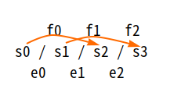
				  + center around the intensional continued fraction $[s_0 / s_1 / s_2 / s_3 / ...]$,
				  + with scale steps $e_k ≈ s_k / s_{k+1}$ on one side, 
				  + and linear steps $f_k = s_k - s_{k+2}$ on the other side
					- Horizontal layout (more concise for typesetting)
					  ```
					      f0   f1   f2
					  s0 / s1 / s2 / s3
					    e0   e1   e2
					  c0   c1   c2   c3  
					       i0   i1   i2
					            r0   r1
					  c = e⋅i + r
					    =  f  + r
					  ```
					- Vertical layout (better for handwriting)
					  ```
					  			 c = i⋅e + r  = f + r
					  	s0       c0
					  	—— = e0   
					  f0  s1       c1  i0
					  	—— = e1
					  f1  s2       c2  i1  r0
					  	—— = e2
					  f2  s3       c3  i2  r1
					  f = i × e    
					  ```
					  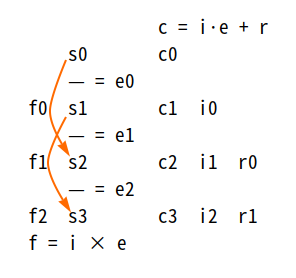
			- ### SCIFER helix
			  id:: 687505e2-062a-4267-98bc-ed0e9f6dced3
			  collapsed:: true
				- ((6651ecba-793d-43c5-8020-a9f260b032d8))
					- content = length of helical thread
					- intent = one complete helix turn
					- extent = content / extent = number of pitches = height of the helix in pitch unit
					- remainder = ((68750097-13e5-4662-9791-8207ec18e8aa)) of content in the intent circle
			- #### phase
			  id:: 68750097-13e5-4662-9791-8207ec18e8aa
			  collapsed:: true
				- ((6651ecba-793d-43c5-8020-a9f260b032d8)) ((68750097-13e5-4662-9791-8207ec18e8aa)) is the ((66f7af1e-02d6-4c9b-b8f4-01a5ac6749d8)) of the remainder within the ((66f3c97f-94e8-4783-96c5-fe9cadf4f9a9)), represented by its percentage.
				  ⇒ [potential](((6847e7fa-0d57-425c-b035-1a62db7725e6)))
			- TODO Migrate [[sCIfEr]]
			- ### SCIFER view cone
			  collapsed:: true
			  :LOGBOOK:
			  CLOCK: [2024-09-25 Wed 20:07:40]--[2024-09-25 Wed 20:07:45] =>  00:00:05
			  :END:
				- WAIT ((6651ecba-793d-43c5-8020-a9f260b032d8)) ((66f40210-cca6-4d81-85e7-d0c54ef20451)) as a ((6672513b-c4b0-4c88-8b30-c60a3c6555a7))
				- ((66537674-6cf9-4459-8bea-7c1858c694a3)): The content at the base of the cone is abstracted step by step through levels of $s_k$ to the zero at the apex.
				  id:: 66f40baf-1aca-40b7-828c-71d6f15f23fe
					- At each level, the SCIFER must complete a full ((667d15c6-67c4-4998-a549-c8b3f9de3d60)) to generate extent as the abstraction at the next level.
			- WAIT ((66f40210-cca6-4d81-85e7-d0c54ef20451)) as a ((669a58b9-eb34-41cd-8605-02e29b07e1b5))
				- (input, state) = (c, i) -> (e, i') = (output/action, next state)
			- WAIT ((66e3fe46-dc79-472a-a059-f5ccf5afb437)) in ((66f40210-cca6-4d81-85e7-d0c54ef20451))
			  id:: 699c0363-9600-46da-9751-1947e5c3123e
			  collapsed:: true
			  :LOGBOOK:
			  CLOCK: [2024-09-25 Wed 20:01:58]--[2024-09-25 Wed 20:05:25] =>  00:03:27
			  :END:
				- ((66e40f4b-34ae-499a-8192-0a0f4f580c7e))
					- $e_n = s_n = 0$
				- ((66e40f58-c9dd-47f4-999d-2e4a2aa874fe))
					- $c = S(e_k * s_k)$
				- ((66e40f75-0573-484e-8cb6-b6b8071ffb8c))
					- all levels of $s_k$
				- Ref: ((6716110c-1b10-41cc-9e26-c76ef782b6a3))
	- ## uninet
	  id:: 669dcdf8-a48c-40b1-bdb1-54a73fc5ae71
	  collapsed:: true
	  :LOGBOOK:
	  CLOCK: [2024-07-22 Mon 10:24:16]
	  :END:
		- ((66f3c28a-a18f-4cca-90d6-c086ac7fccdf)) “uninet” is pronounced “uni-net” /ˈjuːnɪˌnɛt/.
		- ((669dfa9a-3322-4669-9d00-9093a7b14b38)) ((669dcdf8-a48c-40b1-bdb1-54a73fc5ae71)) = ((669dd16c-1836-40ec-86e5-772f8f4774ce)) + ((669a1bec-3347-4915-83e4-dcffc4d482d1)) = "trans" ((667d15b7-6364-49a9-ac58-c64d2a992b63)) + "form" ((667d15c6-67c4-4998-a549-c8b3f9de3d60)) + ((6653751a-a1b4-44b0-a81e-0a446eb8918c))
		  :LOGBOOK:
		  CLOCK: [2024-07-22 Mon 10:24:33]
		  :END:
			- transform = body = program (data structure + algorithm); equal = head
		- ((6651ecba-793d-43c5-8020-a9f260b032d8)) ((669dcdf8-a48c-40b1-bdb1-54a73fc5ae71)) is an implementation of the ((669dfc7d-5355-41db-93a1-8d590e8ec9d8)) on computer.
			- ((667d15b7-6364-49a9-ac58-c64d2a992b63)) -> ((667d0d2e-15c7-4989-a183-69a9a5c6bf8a)) -> ((667d15c6-67c4-4998-a549-c8b3f9de3d60)) -> ((665ca429-84e3-49ff-921e-c07d19cd99ba)) -> ((669dd16c-1836-40ec-86e5-772f8f4774ce)) [content-form] -> ((669a1bec-3347-4915-83e4-dcffc4d482d1)) -> ((669dcdf8-a48c-40b1-bdb1-54a73fc5ae71))
			  id:: 669dcbb4-ebec-4b6d-b1be-490ccab11f49
			  :LOGBOOK:
			  CLOCK: [2024-07-22 Mon 10:07:23]
			  CLOCK: [2024-07-22 Mon 10:08:10]
			  :END:
		- ((665359ff-79f1-4669-b10b-f2b0e633a7c1))
			- Due to the name ((669dcdf8-a48c-40b1-bdb1-54a73fc5ae71)), it may be mistaken with the ((675c03d8-3185-41a8-9f98-e869fabec793)), as a grand network of the whole Universe.
			  id:: 681826ac-6cb1-40f9-8cd1-547b853936ed
			  collapsed:: true
				- It's actually a universal network, but just a reflection of the Omnifold on computer, not the whole.
				- The metaphysical ((669dfc7d-5355-41db-93a1-8d590e8ec9d8)) → modeled in math as ((66ab75a1-f4a0-4bab-a002-8e573546623a)) → folded to fabricate the ((675c03d8-3185-41a8-9f98-e869fabec793)) → implemented on computer as the ((669dcdf8-a48c-40b1-bdb1-54a73fc5ae71))
				- In the future, if there is a need for a theory of uninet, it may be called "Uninet Theory", but now we just have uninets as instances of the Trinion implemented on computer.
		- autonoton
		  id:: 671e1608-1350-4e87-99b6-5492cc6fb449
		  collapsed:: true
		  ((68dfc116-5dc8-41a1-b448-b2e2ddc80068)) ((690960bc-0f6c-4ac4-9c73-3c030c9d4756)), autonotons 
		  ((671e0fcc-37b6-4f03-8e87-8923422ca8e0)) in ((669dcdf8-a48c-40b1-bdb1-54a73fc5ae71))
			- autonota
			  id:: 690960bc-0f6c-4ac4-9c73-3c030c9d4756
			  ((68dfc11b-c552-4a41-b4bb-0737db0f3f94)) ((671e1608-1350-4e87-99b6-5492cc6fb449))
			- autonotic
			  id:: 69096146-d968-4da2-b2d6-5431aa3814d9
			  ((66c80e01-002b-42ae-9c60-49bf3fc6e159)) ((671e1608-1350-4e87-99b6-5492cc6fb449))
			- ((669a1e5f-734c-41c1-bf1c-21813b6e81d8)) autonoton = [auto](https://en.wiktionary.org/wiki/auto-) (self) + [notion](https://en.wiktionary.org/wiki/notion) ← [nōtus](https://en.wiktionary.org/wiki/notus#Latin) (Italian “noto”) ← nōscō (know)
			  collapsed:: true
				- ((669dcdf8-a48c-40b1-bdb1-54a73fc5ae71)) = ((69096146-d968-4da2-b2d6-5431aa3814d9)) machine, versus classical automatic machines
					- Following the age of automatization, now comes the age of autonotization.
				- automaton ← [αὐτόμᾰτος](https://en.wiktionary.org/wiki/%CE%B1%E1%BD%90%CF%84%CF%8C%CE%BC%CE%B1%CF%84%CE%BF%CF%82) ← αὐτο (auto) + μένος (ménos = think) = self-willed, not only self-moving
					- The decay of meaning of “automaton” to mere self-moving is similar to the decaying of [自由](https://en.wiktionary.org/wiki/%E8%87%AA%E7%94%B1#Etymology_2) to [freedom](https://en.wikipedia.org/wiki/Freedom).
		- cognition
		  collapsed:: true
		  ((665359e4-4597-4775-b849-f9acbb98960a)) sự nhận thức
			- Diagram
			  collapsed:: true
				- 
			- ### perceptual screen
			  id:: 66ea4711-1392-4f5c-bea2-badc71a2fb9e
			  :LOGBOOK:
			  CLOCK: [2024-09-13 Fri 12:23:24]
			  :END:
			  ((665359e4-4597-4775-b849-f9acbb98960a)) tưởng uẩn, màn hình tri giác
				- ((6651ecba-793d-43c5-8020-a9f260b032d8)) Just as the retina is where the visual image is projected, ((66ea4711-1392-4f5c-bea2-badc71a2fb9e)) is where the [mental image](https://en.wikipedia.org/wiki/Mental_image) is projected via ((66ea4597-f085-4f38-95f7-91bf5cd61b1c)). This screen is related to the [mental workspace](https://en.wikipedia.org/wiki/Global_workspace_theory) and the [working memory](https://en.wikipedia.org/wiki/Working_memory). This screen is the stage where the ((66ea5808-8452-4ae9-8eb8-2ef64004bfcf)) takes place in the form of interaction between the ((66ea8e12-7c30-449b-9139-bfd8d82394d7)), as a force field, and the ((66ea8dbe-042e-41fc-a07c-841dcb5a737a)), as a particle in that force field.
				- **instantiation**
				  id:: 66ea4597-f085-4f38-95f7-91bf5cd61b1c
				  :LOGBOOK:
				  CLOCK: [2024-09-18 Wed 10:19:59]--[2024-09-18 Wed 16:29:05] =>  06:09:06
				  :END:
					- ((6651ecba-793d-43c5-8020-a9f260b032d8)) When a signal from the ((66ea4711-1392-4f5c-bea2-badc71a2fb9e)) reaches a node in the ((66ea8d84-c766-4c47-b06c-a0b57a530096)), that node is activated to create a new ((66eaa84b-6ea5-4ae8-939b-f80fd3bf6afe)) of itself on the screen. This new instance is combined with the source of the signal to develop the ((66ea8e12-7c30-449b-9139-bfd8d82394d7)), similar to the [object construction in OOP](https://en.wikipedia.org/wiki/Instance_(computer_science)). Each cycle of this process is call an ((66ea4597-f085-4f38-95f7-91bf5cd61b1c)). Most of objects on the screen are compounds, each is composed of several instances of ((66ea8df3-d2f3-4856-b24a-5095dd285f9b))s. Only some special objects like the self body, and the named objects, have a single corresponding concept past cone as its ID knowledge. The instantiation is related to the “participation” in Plato's [Theory of Forms](https://en.wikipedia.org/wiki/Theory_of_forms).
					  id:: 66ea9a0f-72df-42b6-8d72-fcc021ed5776
					  :LOGBOOK:
					  CLOCK: [2024-09-18 Wed 16:22:05]
					  :END:
					- instance
					  id:: 66eaa84b-6ea5-4ae8-939b-f80fd3bf6afe
						- ((6651ecba-793d-43c5-8020-a9f260b032d8)) An ((66eaa84b-6ea5-4ae8-939b-f80fd3bf6afe)) is a ((68932044-a013-4cc6-b468-df8f3a43103c)) ((678e1c3f-6202-45aa-8527-f4bdad9927b9)) activated by another being from an abstract model. We say that “the instance of a model is instantiated from that model.”
			- ### conscious circle
			  id:: 66ea5808-8452-4ae9-8eb8-2ef64004bfcf
			  :LOGBOOK:
			  CLOCK: [2024-09-18 Wed 11:37:05]
			  :END:
			  ((665359e4-4597-4775-b849-f9acbb98960a)) ((66f2681b-796a-4e25-b778-ba4fb6419425))
				- ((6651ecba-793d-43c5-8020-a9f260b032d8)) The ((66ea8dbe-042e-41fc-a07c-841dcb5a737a)) interacts with objects on the ((66ea4711-1392-4f5c-bea2-badc71a2fb9e)) in the way a particle interacts with a force field. The ((667c0031-0a87-44c9-9e98-6d45893b095f)) between the intent cone and the whole ((66ea8e12-7c30-449b-9139-bfd8d82394d7)) is called the ((66ea5808-8452-4ae9-8eb8-2ef64004bfcf)), which comprises many individual effect circles between the intent cone and individual objects which are also called conscious circles.
					- The main effect of this circle is maintaining ((66f2681b-796a-4e25-b778-ba4fb6419425)) of the subject and its side effects are ((66eaa51a-32c1-4f3a-830c-30aecb7c45a3)) of action and ((66eaa550-4e1e-4126-8004-bf3cb8956829)) of knowledge. This circle is also the one that [mixes](((66eac7d3-f1e6-420c-a2a5-1424c86d4185))) objects' ((66ab6161-0306-42d5-ac16-4155c69216f5))s up to make ((6678d596-9526-405a-968c-e73860e524f3))s in the knowledge cone. That means ((66ea5808-8452-4ae9-8eb8-2ef64004bfcf)) is actually a ((669a58b9-eb34-41cd-8605-02e29b07e1b5)) between the intent cone and the present cone.
					- This circle is similar to the [viññāṇa](https://en.wikipedia.org/wiki/Vij%C3%B1%C4%81na) in Buddhism and is related to the [closed-loop perception](https://en.wikipedia.org/wiki/Perception#Closed-loop_perception).
			- cones around the ((66ea5808-8452-4ae9-8eb8-2ef64004bfcf))
			  id:: 6735b187-cbe5-4444-bcd4-399d8c36e317
			  :LOGBOOK:
			  CLOCK: [2024-09-18 Wed 15:21:27]
			  :END:
				- world cone
				  id:: 66ea8dfa-4dc4-4541-948b-be0e72a0bc8b
					- ((6651ecba-793d-43c5-8020-a9f260b032d8)) ((66ea8dfa-4dc4-4541-948b-be0e72a0bc8b)) is the external ((667cfac2-17f1-4cbd-9f6d-1e722ff2a870)) in the shape of [worldview](https://en.wikipedia.org/wiki/Worldview) cone. Its peak is the ((66ea8e12-7c30-449b-9139-bfd8d82394d7)) containing objects in the present view of the subject. These objects are ((66eaa84b-6ea5-4ae8-939b-f80fd3bf6afe))s of the ((66ea8df3-d2f3-4856-b24a-5095dd285f9b))s which are activated and projected onto the ((66ea4711-1392-4f5c-bea2-badc71a2fb9e)). That means the ((66ea9505-9532-41ed-9f91-d4d8ddcaacc3)) is reflected across the perceptual screen to be the present cone, where the images of past cones on the screen are seen as forms of objects.
					- present cone
					  id:: 66ea8e12-7c30-449b-9139-bfd8d82394d7
					  is the peak of the ((66ea8dfa-4dc4-4541-948b-be0e72a0bc8b)). It's similar to the [saññā](https://en.wikipedia.org/wiki/Samjna_(concept)) (tưởng) in Buddhism.
				- knowledge cone
				  id:: 66ea8d84-c766-4c47-b06c-a0b57a530096
					- ((6651ecba-793d-43c5-8020-a9f260b032d8)) ((66ea8d84-c766-4c47-b06c-a0b57a530096)) is the internal world of the subject in the shape of a ((667252dc-e610-4d07-bcd0-9ea6fb4499fd)) of concepts which is rooted at the subject's self concept. Its peak is the ((66ea9505-9532-41ed-9f91-d4d8ddcaacc3)) containing knowledge of the ((66ea8e12-7c30-449b-9139-bfd8d82394d7)). At the root/summit, the subject's self extends a pinnacle called ((66ea8dbe-042e-41fc-a07c-841dcb5a737a)) poking into the present cone to take action and spreads its effect out to the external world via ((66eaa51a-32c1-4f3a-830c-30aecb7c45a3)). The changes of the subject's self image as well as objects on the perceptual screen are reflected back to the knowledge cone via ((66eaa550-4e1e-4126-8004-bf3cb8956829))s.
					- concept past cone
					  id:: 66ea8df3-d2f3-4856-b24a-5095dd285f9b
					  is a peak of the ((66ea8d84-c766-4c47-b06c-a0b57a530096)) projected from a concept.
					- past cone
					  id:: 66ea9505-9532-41ed-9f91-d4d8ddcaacc3
					  is the collective knowledge of objects, where each object is known by a ((66ea8df3-d2f3-4856-b24a-5095dd285f9b)).
					- learning cone
					  id:: 66eaa550-4e1e-4126-8004-bf3cb8956829
					  is an ((667bd93a-cce4-4dbf-9831-725e4dffe463)) of an object or the subject's self image on the ((66ea4711-1392-4f5c-bea2-badc71a2fb9e)) toward the base of the ((66ea8d84-c766-4c47-b06c-a0b57a530096)).
					- mutual reflections
					  id:: 66eac7d3-f1e6-420c-a2a5-1424c86d4185
					  collapsed:: true
						- ((6651ecba-793d-43c5-8020-a9f260b032d8)) each concept in the ((66ea8d84-c766-4c47-b06c-a0b57a530096)) reflects all other concepts in a [projective geometry](https://en.wikipedia.org/wiki/Projective_geometry). That means the knowledge cone is like the [Indra's Net](https://en.wikipedia.org/wiki/Indra%27s_net).
						- ((665359ff-79f1-4669-b10b-f2b0e633a7c1))
							- [fb note](https://www.facebook.com/share/p/qbfkFvBptBxobMLo) about Indra's Net
							- Trip inside a 3D fractal (Kleinian) {{video https://youtu.be/XIzScwydxOE}}
				- perception double cone
				  id:: 68df36a4-6a3e-4fc9-b44a-c8e92f62aee1
					- ((6651ecba-793d-43c5-8020-a9f260b032d8)) ((68df36a4-6a3e-4fc9-b44a-c8e92f62aee1)), or simply “perception cone”, is the combination of ((66ea8df3-d2f3-4856-b24a-5095dd285f9b)) & ((66ea8e12-7c30-449b-9139-bfd8d82394d7)) by the ((66ea8dbe-042e-41fc-a07c-841dcb5a737a)).
				- intent cone
				  id:: 66ea8dbe-042e-41fc-a07c-841dcb5a737a
					- ((6651ecba-793d-43c5-8020-a9f260b032d8)) ((66ea8dbe-042e-41fc-a07c-841dcb5a737a)) is the ((66eaa84b-6ea5-4ae8-939b-f80fd3bf6afe)) of the subject's self. It's the particle on the ((66ea4711-1392-4f5c-bea2-badc71a2fb9e)) representing the subject, which receives effects from the force field of the ((66ea8e12-7c30-449b-9139-bfd8d82394d7)) and expresses the subject's will as both external action and reaction to the objects on the screen. Because this cone is extended from the root/center of the knowledge cone, it's the condensation of the whole mass of knowledge, hence has a very strong structure (hard form) to drive the ((66ea5808-8452-4ae9-8eb8-2ef64004bfcf)). The subject may have many selves (identities) to be activated by different present cones.
					- ((66f93c78-15f5-43a7-8412-f7a5bc66e2ae))
					  id:: 66eab8b0-a5f6-417b-bdb1-effa175ca94e
						- ((66725725-f76a-4328-b162-f469b87e871b))
							- intention of a depth-first traversal is "to answer the question"
							- intention of a breadth-first traversal is "to cover the whole issue"
							- intention of a recorder is "to keep it"
					- effect cone
					  id:: 66eaa51a-32c1-4f3a-830c-30aecb7c45a3
					  is the ((667bd93a-cce4-4dbf-9831-725e4dffe463)) of the action at the tip of the ((66ea8dbe-042e-41fc-a07c-841dcb5a737a)).
		- learning by living
		  id:: 69dc4a34-43e6-4051-93b8-5260fb083255
		  collapsed:: true
		  ((665359e4-4597-4775-b849-f9acbb98960a)) ((69dc4a3c-6174-4bfb-80ad-9e09d5ed723a))
			- natural learning
			  id:: 69dc4a3c-6174-4bfb-80ad-9e09d5ed723a
			  ((665c9af1-1ce2-461c-af33-671690618c8f)) ((69dc4a34-43e6-4051-93b8-5260fb083255))
				- ((6651ecba-793d-43c5-8020-a9f260b032d8)) ((69dc4a3c-6174-4bfb-80ad-9e09d5ed723a)) is the aspect of ((69dc4a34-43e6-4051-93b8-5260fb083255)) contrasting with the [formal education](https://en.wikipedia.org/wiki/Formal_education) and AI training.
			- ((6651ecba-793d-43c5-8020-a9f260b032d8)) Learning and living are inseparable aspects of life, reflecting the duality of observation and operation in the ((94e87dc9-71af-477c-aa70-0f448c2f1e20)). The natural learning by living can be expressed in various ways: [lifelong learning](https://en.wikipedia.org/wiki/Lifelong_learning), [learning by doing](https://en.wikipedia.org/wiki/Learning-by-doing) and [learning by living](https://www.schiller.edu/glossary/learning-by-living/) in education, self-learning by [autodidacts](https://en.wikipedia.org/wiki/Autodidacticism), ((66c30a85-66c4-4916-8ea8-1f150e6a246a)) by LLM.
			- pramid of knowledge
			  id:: 69dce3dc-0afa-4ab3-8a4b-ff517c0b06e0
			  collapsed:: true
				- ((6651ecba-793d-43c5-8020-a9f260b032d8)) The ((69dce3dc-0afa-4ab3-8a4b-ff517c0b06e0)) is a conic projection of the onion structure of the ((669a5387-2a97-4311-a295-aa0afd9c4d76))s, which is usually known as the [DIKW pyramid](https://en.wikipedia.org/wiki/DIKW_pyramid). On this structure, learning is the process of recording and digesting life experience from outside in – traveling from the shell of raw data to the core of wisdom.
				- Structure: The pyramid represents a gradation of depth, density, and integration.
					- The Shell (Bottom): Raw data and information.
						- Characterized by **“mere remembering”** and rote learning.
						- High volume, low integration, low abstraction.
					- The Mantle (Middle): Knowledge and skills.
						- Characterized by thread **“weaving”** and **“mixmatching”**.
						- Data is cross-linked into functional mental models.
					- The Core (Top): Wisdom and attitude.
						- Characterized by thread ((691ae014-cb3b-407f-b84b-582f0025c37c))ing (compression, crystallization).
						- The highest resolution of memory where complexity is unified into essence.
				- Dynamics: The transition from the shell to the core is the ((69dce3dc-55d3-4079-8bfe-ae913ef62ac3)).
					- The information loses its **extensity** (volume, noise, and overhead) to gain **intensity** (depth, density, and structural impact).
				- memory substrate
					- ((6651ecba-793d-43c5-8020-a9f260b032d8)) Memory serves as the physical substrate for the system of nested cones through which the static ((69dce3dc-0afa-4ab3-8a4b-ff517c0b06e0)) is structurally stored and dynamically projected.
					- Diagram
					  collapsed:: true
						- 
					- State and perceptual screen: The current **state** of the system is carried by the working memory, which hosts the dynamic interaction between internal and external worlds.
						- The state manifests as a pair of cones (present and past) forming the ((66ea4711-1392-4f5c-bea2-badc71a2fb9e)) – the active interface where perception is carried out.
					- Cone layers: The pyramid is projected into 4 nested cone layers, each encompassing the *whole* pyramid (Shell, Mantle, and Core), ordered here from dynamic activation to static storage.
						- Present cone: The outward-protruding mirror of the knowledge cone representing the current active state (active living).
						- Past cone: Located within working memory, representing the immediate history of the state (reflection).
						- Short-term memory cone: The intermediate projection layer for integration.
						- Long-term memory cone: The static storage of the entire pyramid.
			- DOING mechanism of natural learning
			  id:: 69dce3dc-55d3-4079-8bfe-ae913ef62ac3
			  collapsed:: true
			  :LOGBOOK:
			  CLOCK: [2026-04-13 Mon 20:04:01]
			  :END:
				- ((6651ecba-793d-43c5-8020-a9f260b032d8)) The continuous process of digesting life experience through projection and reflection across the perceptual screen.
				- The driving force: The necessity of survival and internal coherence. Unlike traditional education or AI training which attempts to inject knowledge directly into the past cone, natural learning is forced by the friction of active living in the present cone.
				- Mirroring through the state: A two-stage mirroring process that manages the operational state of the system.
					- 1st stage (Projection & Capture): The static knowledge pyramid is mirrored into the **knowledge cone** (perpendicular to the static pyramid), which is then projected to the **present cone**. This present cone captures the perceptual screen, interfacing directly with the external **world cone**.
					- 2nd stage (Reflection & Integration): The lived experience on the perceptual screen is reflected from the **present cone** into the **past cone**. Driven by necessity, the system actively filters, integrates (weaves), and crystallizes (folds) this information.
					- Internalization: This crystallized information is subsequently projected and stored back into the static pyramid layers (short-term and then long-term memory), completing the learning cycle.
				- Application to formal education: To achieve deep knowledge, education must not stop at the formal layer (formulae, theory) but extend to the content layer. It must simulate real, high-entropy scenarios to activate the **present cone**, thereby triggering genuine reflection rather than mere rote storage.
		- Corkei
		  id:: 697b4547-9b65-4a96-b3d1-55245377c796
		  collapsed:: true
		  “Circuit of referential knowledge & effective information”
			- ((66f3c28a-a18f-4cca-90d6-c086ac7fccdf)) “Corkei” is pronounced “corkay” /ˈkɔɹkeɪ/, which rhymes with the cute “Corkie” /ˈkɔɹki/.
			- Emblem: A projection of the [tesseract](https://en.wikipedia.org/wiki/Tesseract), maybe the tree view or the Petrie polygon in Coxeter plane of group B4
			  id:: 698430b7-d336-44c4-a2e7-5a90d0f4af7e
			- ((6651ecba-793d-43c5-8020-a9f260b032d8)) ((697b4547-9b65-4a96-b3d1-55245377c796)) is a ((669dcdf8-a48c-40b1-bdb1-54a73fc5ae71)) emerging from the need of a ((697b4779-fdc8-4188-b3e0-fd984c167fb8)) for ((66536578-c4d3-43f1-b35c-bf71120f0570)).
			- ((6667abd2-14eb-4145-b9e3-e6f3037b3117))
			  collapsed:: true
				- Long ago, since the first visions of ((669dfc9f-b5e2-448a-b6f4-be13c5bfbccb)), Will had thought of a live & open network of ideas on an open source repository.
				- Mid-2022: Will created `quicklog` (on [GitHub](https://github.com/bixycler/quicklog)) intended to [dump his brain](((6667bf32-ab6a-4d64-842d-45d49137e694))), but soon stuck on technical walls.
				- 2023: Will created [Corkei](https://github.com/bixycler/Corkei) in order to dump his brain in a more structual way – in ((67fcbefb-63b6-438a-a676-82293350d71b))s.
					- However, the tech hindrance still bogged it down to pure ideas.
				- Mid-2024: Will switched to prebuilt [PKG apps](((6926be1f-d79d-415a-afe4-230d570013cf))) like ((66535660-643e-471a-a332-8f2306c5494f)) and ((66536e1b-6466-4153-90d6-583003d99a81)), then settled down on Logseq for his ((666baccf-6be1-4b9a-b186-f883ea04daf1)).
				- 2025 Oct 20th: The release of ((6926be21-727e-4568-a990-29ed81452fb0)) 2 days earlier made Will try the first agentic AI in his life.
					- This experience brought him the vision of [building Corkei from top down with AI agents and the uninet will emerge from bottom up](((694a8ac0-cddc-4bcd-bdc1-dbfb9dcb04de))).
				- ...
			- AI agent
			  collapsed:: true
				- Developed with ((6926be21-727e-4568-a990-29ed81452fb0)).
				- Developed based on knowledge base
				  id:: 699fc54d-feeb-41f6-96cb-9c1b62476292
					- The shift MCPs → skills → rule-based knowledge
						- MCPs → skills: why MCP while the agent can write tools?!
						- skills → rule-based knowledge: why skills while they are just pieces of knwledge?!
						- The “out-of-the-box” MCPs & skills are convenient, but that very convenience can also lead to MCPs bloat & skills bloat!
							- People install lots of stuff greedily which decreases the performance by context bloat and confusing the agent.
						- The "Git-backed" knowledge base
							- The knowledge graph in `docs/` and its indices in `.agent/rules/` are updated with the source code. So, we have different knowledge in different times, in different branches.
							- Project-specific knowledges like lessons, workflows, designs are tightly coupled with the codes.
	- ## Omnifold
	  id:: 675c03d8-3185-41a8-9f98-e869fabec793
	  collapsed:: true
	  :LOGBOOK:
	  CLOCK: [2024-12-13 Fri 16:59:25]
	  :END:
	  ((665359e4-4597-4775-b849-f9acbb98960a)) ((678e23b4-0fbe-4a5d-923f-6252405053df))
		- Ω
		  id:: 678e23b4-0fbe-4a5d-923f-6252405053df
		  ((665c9af1-1ce2-461c-af33-671690618c8f)) ((675c03d8-3185-41a8-9f98-e869fabec793))
		- ((6651ecba-793d-43c5-8020-a9f260b032d8)) In ((66ac41f1-de0c-48cb-a9b0-c30b0fe27c5d)), ((675c03d8-3185-41a8-9f98-e869fabec793)) is the ((687f322c-2334-46e5-816b-57889e5c6b89)) of the ((66537a0b-d107-4f7e-b01f-bf624a647d8c)), which is equivalent to the ((669dfc7d-5355-41db-93a1-8d590e8ec9d8)) in ((66537a44-f579-4fcc-a02b-2f32d0d409fc)). Omnifold is the ((66ab75a1-f4a0-4bab-a002-8e573546623a)) ((691ae014-cb3b-407f-b84b-582f0025c37c))ed and crumpled into a “blob” that contains **all possible forms** in infinite dimensional space. That means, extensionally, Omnifold is just a nondimensional & nondirectional point, while intensionally, it's [omnidimensional](((67505a68-91b9-4abb-bf92-4dddad8c5803))) & [omnidirectional](((67505a65-19d8-415a-8b80-c955a8768647))).
			- For an ((669a2487-054d-4408-ae41-189e34af81a9)) (hypothetically) outside of the Omnifold, it can only see a ((66e43b94-9183-4d49-af85-8a7a1c194c12)) because all content of the Omnifold has been *abstracted*. This point shows its nondirectionality.
			- When the outside ((667cfa3e-9856-43f0-956b-ebb4ff31d8eb)) handles the point from the outside, it can only feel the “mass” of the Omnifold, which shows its nondimensionality.
			- Only when the subject involves in the Omnifold, can it experience dimensions of the Omnifold as volumes and structures of information, as well as directions of the Ω-thread as changes and motions.
			- For the subject involving in the Omnifold, it cannot passively observe the structure and the threads there without feedback to the Omnifold. All ((94e87dc9-71af-477c-aa70-0f448c2f1e20))s of the subject interact with the Omnifold by means of the ((69a502fe-47e2-4629-a40c-78964d9e0396)) ((67a98760-71fa-4033-9c42-f3025d632d04)) the Ω-thread.
				- **Thread pulling**: The obopo extracts threads of information through observation.
				  collapsed:: true
					- Different subjects pull out different Ω-threads from the same Omnifold, which are just different ((66723642-58f1-4a74-bba3-0108f14c6bac))s of the same object, as different ((665ca429-84e3-49ff-921e-c07d19cd99ba))s of [the same content](((678e2046-54ac-4284-865d-6f3e38f589a1))).
					  id:: 6772a6cd-5b37-43ab-b8cb-b9656d26fdcc
					- For example, for an Omnifold in the form of an $m × n$ table,
						- one subject pulling out row by row will get the thread of $m$ rows, while
						- the other subject pulling out column by column will get the thread of $n$ columns.
				- **Thread spinning**: The obop uses the pulled out threads as contents to spin other threads as new forms, new folds to return back to the Omnifold through its action.
		- ((665ca48e-f7c1-4541-b5cf-486d86b02997)) From “twofold”, “threefold”, ..., “n-fold”, to “manifold”, and now “omnifold” as the ultimate “fold” 😄!
			- This name has been suggested by Copilot.
		- Dimensionality & directionality
			- $\overrightarrow{Ω} = ∮_Ω{d\vec{τ}} = 0$
			  id:: 67505a65-19d8-415a-8b80-c955a8768647
			  = nondirectional = all directions = omnidirectional
				- Zero identity: 0 (nondirectional **blob**) = $-1 + 1 = -1 - 2 - 3 - ... - ∞ + 1 + 2 + 3 + ... + ∞$ (balanced infinite **structure**)
				- The ((66600918-9f92-4730-b056-c2cd87a742aa)) of all forms and the ((66691d61-b8e9-4618-ac98-145056b646f4)) in Buddhism are resulted from this zero identity.
			- $|Ω| = ∮_Ω{|dτ|} = 1$
			  id:: 67505a68-91b9-4abb-bf92-4dddad8c5803
			  = nondimensional = dimensionless = all dimensions = omnidimensional
			  but usually confused with unidimensional
				- Unit identity: 1 (dimensionless **mass**) = $1 × 1 × 1 × ... × 1$ (infinite dimensional **hypervolume**)
				- The [unitarity](https://en.wikipedia.org/wiki/Unitarity_(physics)) in physics is a directly consequence of this unitarity of the ((675c03d8-3185-41a8-9f98-e869fabec793)).
			- The ((66f7af1e-02d6-4c9b-b8f4-01a5ac6749d8)) is dimensionless (dimension cancelled by ratio), but still has two directions `+` and `-`.
			  collapsed:: true
				- As the scale factor of content (ratio between content and intent), extent can be thought of as a “scalar”, but we don't use the term “scalar” to avoid confusion.
					- Each [“scalar quantity” in physics](https://en.wikipedia.org/wiki/Scalar_(physics)) additionally has a unit which is the informational dimension, hence not dimensionless.
					- [“Dimensionless quantity” in physics](https://en.wikipedia.org/wiki/Dimensionless_quantity) may be called “scalar” in Unïnfo, but we use the term “dimensionless” for clarity.
			- The mass (amount of content) is not only dimensionless but also nondirectional, a.k.a. “absolute value”.
		- WAIT ((66537a44-f579-4fcc-a02b-2f32d0d409fc)) structure of the ((675c03d8-3185-41a8-9f98-e869fabec793))
		  id:: 69a5068c-df84-4f76-92ca-9131897c80df
		  collapsed:: true
		  :LOGBOOK:
		  CLOCK: [2026-03-02 Mon 10:42:38]
		  CLOCK: [2026-03-16 Mon 13:00:52]--[2026-03-17 Tue 19:51:42] =>  30:50:50
		  :END:
			- 1. **Presentism** (the Equal $=$ ): I don't think Einstein meant a block universe, but he is not alive to defend himself, so i'm not sure what he actually thought. Anyway, here's my take: Relativity only debunked the simultaneity, i.e. no “present everywhere”, but only herenow. Time is inseparable from space, hence spacetime. So presentism is the reality of the **herenow**: your present can be my past or my future, not my present, hence “unreal” to me in the sense that it's not exactly true to me. And only my present (herenow) is exactly true to me (not to you). My herenow is not a point but a perspective (configuration) of the whole universe projected from my self.
			- id:: 69a502fe-20b6-468d-b2f4-2940a12ad502
			  2. **Eternalism** (the ((667d15c6-67c4-4998-a549-c8b3f9de3d60)) ○): What is eternal? The eternal is the whole possibility space of the whole universe, not the 4D block universe which is just a wrong projection of the eternal info human imagination. That space has infinite dimensions, i call it the "Omnifold". The simplest expression is a hypercube with unit hypervolume 1 = 1×1×1×1×1×... (infinite dimensions). It contains all herenows not only throughout spacetime but also through all selves. The wavefunction of quantum trace the evolution of herenow following a single particle. Its unitarity is the eternal hypervolume.
			- 3. ((69a502fe-47e2-4629-a40c-78964d9e0396)) – the ((667d15b7-6364-49a9-ac58-c64d2a992b63)) (↑) of ((667bef22-b272-4a7d-b613-3f1ed1a47329))
		- ((665359ff-79f1-4669-b10b-f2b0e633a7c1))
			- WAIT Compared with other models of the Universe
			  collapsed:: true
			  :LOGBOOK:
			  CLOCK: [2024-12-13 Fri 18:37:00]
			  CLOCK: [2026-03-02 Mon 10:37:56]
			  :END:
				- Here-now Presentism (Point Presentism) vs [perspective presentism](1. **Presentism** (the Equal $=$): I don't think Einstein meant a block universe, but he is not alive to defend himself, so i'm not sure what he actually thought. Anyway, here's my take: Relativity only debunked the simultaneity, i.e. no "present everywhere", but only herenow. Time is inseparable from space, hence spacetime. So presentism is the reality of the **herenow**: your present can be my past or my future, not my present, hence "unreal" to me in the sense that it's not exactly true to me. And only my present (herenow) is exactly true to me (not to you). My herenow is not a point but a perspective (configuration) of the whole universe projected from my self.)
				- Block universe vs [possibility eternalism](((69a502fe-20b6-468d-b2f4-2940a12ad502)))
				- Bulk universe: 4D spacetime is just a [brane](https://en.wikipedia.org/wiki/Brane_cosmology) within this bulk.
				- Multiverse, parallel worlds
				- Holomovement
	- ## Universal Thread
	  id:: 66ac41d1-09e7-44b1-9290-ea7d5f02a817
	  collapsed:: true
	  ((665359e4-4597-4775-b849-f9acbb98960a)) ((66ac41f1-de0c-48cb-a9b0-c30b0fe27c5d))
		- Unithread
		  id:: 66ac41f1-de0c-48cb-a9b0-c30b0fe27c5d
		  ((665c9af1-1ce2-461c-af33-671690618c8f)) ((66ac41d1-09e7-44b1-9290-ea7d5f02a817))
		- ((6651ecba-793d-43c5-8020-a9f260b032d8)) ((66ac41f1-de0c-48cb-a9b0-c30b0fe27c5d)) is the representation of ((66537a44-f579-4fcc-a02b-2f32d0d409fc)) in mathematical language, where everything is represented by the ((66ab75a1-f4a0-4bab-a002-8e573546623a)). ((66ac41f1-de0c-48cb-a9b0-c30b0fe27c5d)) is to ((66537a44-f579-4fcc-a02b-2f32d0d409fc)) as [representation theory](https://en.wikipedia.org/wiki/Representation_theory) is to [category theory](https://en.wikipedia.org/wiki/Category_theory) in modern mathematics.
		- ((665ca48e-f7c1-4541-b5cf-486d86b02997)) Even though the name “Universal Thread” hints at the “universal substance underlying everything”, that substance is formally modeled as the ((66ab75a1-f4a0-4bab-a002-8e573546623a)), while the names “Universal Thread” and “Unithread” are preserved to indicate the *__theory__ about the Ω-thread*.
		  id:: 6819fb74-f8fc-4608-a75d-7fbe76d3af27
		- ((665359ff-79f1-4669-b10b-f2b0e633a7c1))
		- ((66ac41f1-de0c-48cb-a9b0-c30b0fe27c5d)) operations
		  id:: 67a963d9-e7d3-4e46-a608-24059d730f4a
			- ((6651ecba-793d-43c5-8020-a9f260b032d8)) ((67a963d9-e7d3-4e46-a608-24059d730f4a)) are ((669a58b9-eb34-41cd-8605-02e29b07e1b5))s of ((66ab75a1-f4a0-4bab-a002-8e573546623a)), including basic operations like ((67a98760-71fa-4033-9c42-f3025d632d04)), ((67a9876d-03ee-4f1f-85be-619fb54c8bc6)), ....
			- transcycling
			  id:: 67a98760-71fa-4033-9c42-f3025d632d04
			  ((66c80da7-c0e8-46d2-85e5-71318fd44eff)) ((687743fd-9d45-45be-b9fd-3055cbb8a938))
				- ((6651ecba-793d-43c5-8020-a9f260b032d8)) ((67a98760-71fa-4033-9c42-f3025d632d04)) is the movement of a ((667d15c6-67c4-4998-a549-c8b3f9de3d60)) of ((667d0d2e-15c7-4989-a183-69a9a5c6bf8a)) on its ((66ab75a1-f4a0-4bab-a002-8e573546623a)) thanks to its ((66f3e588-9094-45af-9dff-2225c3ac39ab)). In general, there are 3 parts of this movement: thread input, rotating inside, and thread output. Transcycling is the “effect” in ((667bef22-b272-4a7d-b613-3f1ed1a47329)) of the Ω-thread. In Unithread view, all [bodies](((66c810a0-9861-4787-bdcf-1378219332be))) in the worlds, from celestial bodies, organisms (thread = food & info), to simple physical objects (thread = energy), are "living" (existing) by this movement. The difference is just how complicated the "rotation" inside that body is.
					- Illustration
					  id:: 67b183f5-f8fe-4b88-99c1-530fec38ae93
					  collapsed:: true
						- 
				- ((669a1e5f-734c-41c1-bf1c-21813b6e81d8)) “transcycling” = “translation + cycling”
				- transcycle
				  id:: 687743fd-9d45-45be-b9fd-3055cbb8a938
				  ((66c80dfd-95e2-4b5a-bd56-06e8307e81ca)) ((67a98760-71fa-4033-9c42-f3025d632d04))
					- ((6651ecba-793d-43c5-8020-a9f260b032d8)) 
					  {{embed ((67a963d2-c9b5-47e0-9b4d-9d6323a76c28))}}
				- ((665359ff-79f1-4669-b10b-f2b0e633a7c1))
					- transcycling ~ ((66b1cfa4-e22c-4424-bf19-a6ce4649da77)), while interunion ~ ((66f40210-cca6-4d81-85e7-d0c54ef20451))
					- ((6783e3ff-9e8f-43db-a173-5d0c6972deab))
					- ((67836d26-c378-4cc2-9b8d-ecf9ee7f57c1))
			- interunion
			  id:: 67a9876d-03ee-4f1f-85be-619fb54c8bc6
	- ## thread
	  id:: 667d0d2e-15c7-4989-a183-69a9a5c6bf8a
	  collapsed:: true
		- ((6651ecba-793d-43c5-8020-a9f260b032d8)) From the [fabric thread](https://en.wikipedia.org/wiki/Thread_(yarn)), ((667d0d2e-15c7-4989-a183-69a9a5c6bf8a)) is abstracted as the thing running through the whole course of something. In ((66ac41f1-de0c-48cb-a9b0-c30b0fe27c5d)), a “thread” is the continuous line of ((6678288e-699b-4325-bdba-bf6349fe0d57)) running through its various ((665ca429-84e3-49ff-921e-c07d19cd99ba))s by ((669a58b9-eb34-41cd-8605-02e29b07e1b5))s among them. That means the “thread” in Unithread is just the static aspect of the ((667bef22-b272-4a7d-b613-3f1ed1a47329)), hence the name ((68522d55-b6a4-4f70-853c-4335510de6f7)). The ((678e1d31-4874-4df6-bfb4-60822a6b5546)) of the whole ((66537a0b-d107-4f7e-b01f-bf624a647d8c)) is called the ((66ab75a1-f4a0-4bab-a002-8e573546623a)) whose parts are usually addressed as simply “threads”. [Threads are spun from light](((671b5598-42a8-421d-a942-3819be212d50))) just like yarns are spun from fibers.
		- ((66725725-f76a-4328-b162-f469b87e871b)) [execution thread](https://en.wikipedia.org/wiki/Thread_(computing)), [conversation thread](https://en.wikipedia.org/wiki/Thread_(online_communication)), [fabric thread](https://en.wikipedia.org/wiki/Thread_(yarn)), [screw thread](https://en.wikipedia.org/wiki/Screw_thread), [Ariadne's thread](https://en.wikipedia.org/wiki/Ariadne%27s_thread_(logic))
		  id:: 66b1cfa4-6ce7-447b-b637-30d86f0e748e
		- Vietnamese: sợi, mạch
		- Chinese: 線(索), 脈(絡)
		- effect thread
		  id:: 68522d55-b6a4-4f70-853c-4335510de6f7
		  collapsed:: true
		  ((665c9af1-1ce2-461c-af33-671690618c8f)) ((667d0d2e-15c7-4989-a183-69a9a5c6bf8a))
			- mạch tác lưu
			  ((665c9af1-1ce2-461c-af33-671690618c8f)) ((68522d55-b6a4-4f70-853c-4335510de6f7))
			- 作流脈
			  ((665c9af1-1ce2-461c-af33-671690618c8f)) ((68522d55-b6a4-4f70-853c-4335510de6f7))
		- ### Ω-thread
		  id:: 66ab75a1-f4a0-4bab-a002-8e573546623a
		  ((665359e4-4597-4775-b849-f9acbb98960a)) ((67a17ea8-2d20-45fa-9fe6-e998541aa3a5)), ((68522d55-b6a4-4f70-853c-4335510de6f7)), mạch ôông
			- omnithread
			  id:: 67a17ea8-2d20-45fa-9fe6-e998541aa3a5
			  ((665c9af1-1ce2-461c-af33-671690618c8f)) ((66ab75a1-f4a0-4bab-a002-8e573546623a))
			- ((6651ecba-793d-43c5-8020-a9f260b032d8)) ((66ab75a1-f4a0-4bab-a002-8e573546623a)) is the representation of the ((669dfc7d-5355-41db-93a1-8d590e8ec9d8)) in mathematical language as a ((66ab6761-b62d-486b-bd15-44a4ecee8a99)) of ((667d0d2e-15c7-4989-a183-69a9a5c6bf8a)), and is the central object of the ((66ac41f1-de0c-48cb-a9b0-c30b0fe27c5d)) theory. Each Ω-thread is an ((66eaa84b-6ea5-4ae8-939b-f80fd3bf6afe)) of the Trinion, corresponding to a particular configuration/view of the Universe from a particular ((667272b8-88a8-4928-a22a-35035c9edf05)), as described in the ((678e2046-54ac-4284-865d-6f3e38f589a1)). An Ω-thread can be relaxed into a ((667d15c6-67c4-4998-a549-c8b3f9de3d60)), or can be folded into the ((675c03d8-3185-41a8-9f98-e869fabec793)) (Ω) which includes all possible Ω-threads. In contrast to the whole Ω-thread which is a concrete ((678e1c3f-6202-45aa-8527-f4bdad9927b9)), a part (chunk, segment) of it, simply called a “**thread**”, can capture an abstract concept or information, i.e. ((66f7af1e-02d6-4c9b-b8f4-01a5ac6749d8)).
			  id:: 681826ac-5a8d-4240-95fd-183e03b9ef66
				- WAIT Similar to the ((6772a6cd-771f-4f24-9c3a-39c442234be5))
				  :LOGBOOK:
				  CLOCK: [2025-01-20 Mon 20:56:58]
				  :END:
			- ((665ca48e-f7c1-4541-b5cf-486d86b02997)) Beside the formal names **Ω-thread** [from ((678e23b4-0fbe-4a5d-923f-6252405053df)), pronounced “**ohm**-thread”] & “**omnithread**” [from ((675c03d8-3185-41a8-9f98-e869fabec793))], it can also be called “ōm̐-thread” [from [ॐ](https://en.wikipedia.org/wiki/Om), also “aum-thread”], “one-thread [from ((67505a68-91b9-4abb-bf92-4dddad8c5803))], or “overall thread”, “[Ouroboros](https://en.wikipedia.org/wiki/Ouroboros) thread”, etc.
			  id:: 66ac48f5-823a-442b-8cc1-7c634b2be4ca
				- Vietnamese: mạch ôông (ōm̐-thread)
				- While written as “Ω-thread”, it's called “**ohm**-thread” instead of “omega-thread”.
				- Ω-thread is the universal ((68522d55-b6a4-4f70-853c-4335510de6f7)).
					- _The **universal effect thread** weaves up everything._
					  id:: 683ed4a3-68c7-41a4-aecf-b21561f207df
					  _**Mạch tác lưu** dệt nên vạn vật._
			- ((665359ff-79f1-4669-b10b-f2b0e633a7c1))
				- ((66ab75a1-f4a0-4bab-a002-8e573546623a)) corresponds to a closed directed dynamic metrizable refinable [topos](https://en.wikipedia.org/wiki/Pointless_topology) in topology.
				- “current” = coarse-grained thread, “thread” = fine-grained current, compared to the resolution of the eye.
	- ## view
	  id:: 66723642-58f1-4a74-bba3-0108f14c6bac
	  collapsed:: true
	  ((6699e4db-2e75-4427-94bb-96dfe0367dd1)) ((66727858-979d-4d95-8a90-7a749218cfba))
	  ((6699e5f2-7788-46c7-8233-87699a65ca30)) ((66725144-6bc9-4c9f-ba48-2cef02651e52))
	  ((66c80da7-c0e8-46d2-85e5-71318fd44eff)) ((66c811a1-b48b-4f91-9c47-b60be42ee7f4)), ((66c811a9-e8c7-42c5-bdc9-25fbd023f93a)), ((66c86420-37bf-4267-bd6f-8d683aaa42d8))
		- view
		  id:: 66c811a1-b48b-4f91-9c47-b60be42ee7f4
		  ((66c80dfd-95e2-4b5a-bd56-06e8307e81ca)) ((66723642-58f1-4a74-bba3-0108f14c6bac))
		- see
		  id:: 66c811a9-e8c7-42c5-bdc9-25fbd023f93a
		  ((66c80dfd-95e2-4b5a-bd56-06e8307e81ca)) ((66723642-58f1-4a74-bba3-0108f14c6bac))
		- sense
		  id:: 66c86420-37bf-4267-bd6f-8d683aaa42d8
		  ((66c80dfd-95e2-4b5a-bd56-06e8307e81ca)) ((66723642-58f1-4a74-bba3-0108f14c6bac))
		- ((6651ecba-793d-43c5-8020-a9f260b032d8)) ((66723642-58f1-4a74-bba3-0108f14c6bac)) is an image of a ((667cfac2-17f1-4cbd-9f6d-1e722ff2a870)) that is ((66c83149-6ee5-4a8c-b4eb-0308d1a11535))ed by a ((667cfa3e-9856-43f0-956b-ebb4ff31d8eb)) to a screen, a structure, or a mind (internal screen of the subject). There are many different views of the same ((667cfa42-ade7-4310-9a7b-6d14d01c16da)) when being viewed from different ((667272b8-88a8-4928-a22a-35035c9edf05))s. Views can be as simple as a flat image, a single word, or as complicated as a ((6672513b-c4b0-4c88-8b30-c60a3c6555a7)), a ((667259a0-aa2e-49fa-bcbd-b3768a9f30b2)), a ((6731b8c8-0ab1-4c16-8783-408258f67a4a)), etc. In a ((66723642-58f1-4a74-bba3-0108f14c6bac)), each ((667cfa42-ade7-4310-9a7b-6d14d01c16da)) has a specific ((665ca429-84e3-49ff-921e-c07d19cd99ba)). All knowledge of the ((667cfa3e-9856-43f0-956b-ebb4ff31d8eb)) about an object is no more than the forms of that object in all views of the subject.
		  id:: 6672364a-2cc2-4360-a174-1e4432c67a16
		- ((66725708-3dc4-43f5-a180-6b331c6a160f))
		  collapsed:: true
			- A ((66723642-58f1-4a74-bba3-0108f14c6bac)) in philosophy is a [perspective (point of view)](https://en.wikipedia.org/wiki/Perspectivism), which can be a [worldview](https://en.wikipedia.org/wiki/Worldview).
			  id:: 66b1cfa4-3db2-4d2c-9b9f-478417632c97
				- Nietzsche's [perspectivism](https://en.wikipedia.org/wiki/Perspectivism) formalized philosophies of [Protagoras](https://en.wikipedia.org/wiki/Protagoras) (pre-Socratic Greek), [Michel de Montaigne](https://en.wikipedia.org/wiki/Michel_de_Montaigne) (French Renaissance), and [Gottfried Leibniz](https://en.wikipedia.org/wiki/Gottfried_Leibniz) (German polymath).
			- The central doctrine in Jainism is [Anekāntavāda](https://en.wikipedia.org/wiki/Anekantavada) meaning not-one-side emphasizes the nature of many different ((66723642-58f1-4a74-bba3-0108f14c6bac))s of the same thing.
			- In Buddhism, a [view](https://en.wikipedia.org/wiki/View_(Buddhism)) is a product of [mental conditioning](https://en.wikipedia.org/wiki/Sankhara), and "[Right view](https://en.wikipedia.org/wiki/Noble_Eightfold_Path#Right_view)" is the neutral ((66723642-58f1-4a74-bba3-0108f14c6bac)) detached from all conditioning, escaped from the "jungle of views".
		- ((665359ff-79f1-4669-b10b-f2b0e633a7c1))
		- ### projection
		  id:: 6653769c-3334-46fa-a1d5-4ce6a7fc23e8
		  collapsed:: true
		  ((66c80da7-c0e8-46d2-85e5-71318fd44eff)) ((66c83149-6ee5-4a8c-b4eb-0308d1a11535)), ((66c82fd4-41e3-43b0-b850-b2b68be68ad5))
		  ((66c80da9-4cfb-4de7-b83d-8b70665207bf)) ((685a9913-6bf4-41e4-89d1-5000a2b2f9d5))
			- project
			  id:: 66c83149-6ee5-4a8c-b4eb-0308d1a11535
			  ((66c80dfd-95e2-4b5a-bd56-06e8307e81ca)) ((6653769c-3334-46fa-a1d5-4ce6a7fc23e8))
			- look
			  id:: 66c82fd4-41e3-43b0-b850-b2b68be68ad5
			  ((66c80dfd-95e2-4b5a-bd56-06e8307e81ca)) ((6653769c-3334-46fa-a1d5-4ce6a7fc23e8))
			- projectional
			  id:: 685a9913-6bf4-41e4-89d1-5000a2b2f9d5
			  ((66c80e01-002b-42ae-9c60-49bf3fc6e159)) ((6653769c-3334-46fa-a1d5-4ce6a7fc23e8))
			- ((6651ecba-793d-43c5-8020-a9f260b032d8)) A ((6653769c-3334-46fa-a1d5-4ce6a7fc23e8)) is a bundle of ((671b6f87-7492-4eab-af49-e3c89bc8c860)) from an ((667cfa42-ade7-4310-9a7b-6d14d01c16da)) to a ((667cfa3e-9856-43f0-956b-ebb4ff31d8eb))'s image of that object. Projection is a special kind of ((669a58b9-eb34-41cd-8605-02e29b07e1b5)) where the target form (image) is more ((66c8369a-ccb8-4f1f-b12b-bf7054cb79e4)) than the source form (object). This general projection via arrow is called ((670dd4d7-ed37-4954-8379-63138fa072d6)). That arrow can be a cone, hence ((670ce218-a01f-4609-b7f2-beda7cf2ebc3)), or can be implemented by thread winding, hence ((67654ecb-896a-4421-95e5-f72c07fc62a4)), or by wrapping the thread around an axis, hence ((670cdcb4-3c85-45af-8c30-3c3284ed37df)).
			  id:: 684f9517-449d-454f-a7e3-340fb5a57aa4
				- Projection is the foundation of all arrows, defining the direction of arrow.
				- In maths, a [projection](https://en.wikipedia.org/wiki/Projection_(mathematics)) is an [idempotent](https://en.wikipedia.org/wiki/Idempotence) [transformation](https://en.wikipedia.org/wiki/Transformation_(function)).
			- ((66725725-f76a-4328-b162-f469b87e871b)) [projection (homography)](https://en.wikipedia.org/wiki/Homography) in [projective geometry](https://en.wikipedia.org/wiki/Projective_geometry), [projection](https://en.wikipedia.org/wiki/Projection_(mathematics)) and [mapping](https://en.wikipedia.org/wiki/Function_(mathematics)) in mathematics, [projective object](https://en.wikipedia.org/wiki/Projective_object) in [category theory](https://en.wikipedia.org/wiki/Category_theory)
			  id:: 66b1cfa4-6de3-4a88-a14f-3265b6fd92e5
			- ((665359ff-79f1-4669-b10b-f2b0e633a7c1))
				- ((671b6f87-7492-4eab-af49-e3c89bc8c860)) ⇒ ((6653769c-3334-46fa-a1d5-4ce6a7fc23e8)) ⇒ ((6672513b-c4b0-4c88-8b30-c60a3c6555a7)) ⇒ ((669a58b9-eb34-41cd-8605-02e29b07e1b5)) ⇒ ((667d0d2e-15c7-4989-a183-69a9a5c6bf8a)) ⇒ ((667d0b78-fff6-49bc-90d5-165648ed56d3)) ⇒ ((66c810a0-9861-4787-bdcf-1378219332be))
				  id:: 671b5598-42a8-421d-a942-3819be212d50
				  collapsed:: true
				  :LOGBOOK:
				  CLOCK: [2024-10-25 Fri 15:23:55]
				  :END:
					- The **arrow of light** is directed by a *subject*, becoming a **projection**, in the form of **view cone**.
					  id:: 671b5623-9f23-447f-b5be-5b87e4f72f83
					- Each **transformation** is composed of many ((670ce218-a01f-4609-b7f2-beda7cf2ebc3))s, i.e. many ((6672513b-c4b0-4c88-8b30-c60a3c6555a7))s through many eyes.
					  id:: 67f4eaf0-b935-45ea-b8ba-b06cbfba5d23
						- 
						- By the symmetry and complementarity between view cone and effect cone, each transformation is also composed of many ((667bd93a-cce4-4dbf-9831-725e4dffe463))s as well as many ((6851578b-9b1f-4367-878f-79b0b0b9be51))s.
						  collapsed:: true
							- 
							- 
					- Each **thread** is spun by *transformations of various forms*.
					- Some threads are *solidified* into **relations** to weave the **body** (memory, knowledge, structure) of the subject itself.
					- The subject uses the knowledge accumulated in its body to [direct the arrow of light](((671b5623-9f23-447f-b5be-5b87e4f72f83))), and so on.
				- Arrow of ((66723642-58f1-4a74-bba3-0108f14c6bac))ing is an inverse projection from the current state back to some past instance, i.e. ((6672513b-c4b0-4c88-8b30-c60a3c6555a7)) <-> ((667bd931-8759-4008-8a9a-33e78a5cbdf3)).
				  collapsed:: true
					- Development of view over time:
						- First, an `ex` object is mirrored to its `in` image.
						  id:: 667aa63e-acc6-41b1-b716-f97a8afe41a1
						  collapsed:: true
							- In digital world, it's usually done statically with `copy`, or better dynamically with `embed`, `import`, `transclude`, etc.
						- The `in` image will be modified to adapt to the needs of the subject, via which it's transformed.
						  collapsed:: true
							- The embedding/transcluding function of tools like ((66536e1b-6466-4153-90d6-583003d99a81)) lacks this feature.
							- Revision control systems like `git`, ((66600918-6c84-41c7-afeb-96d30f74850b)) do this good, but lack the [dynamic mirror](((667aa63e-acc6-41b1-b716-f97a8afe41a1))) at the firs step.
						- The accumulated change over time (and space internally) is the view of the `ex` object, and is expressed as ref arrow `in -> ex`.
				- WAIT ((670ce218-a01f-4609-b7f2-beda7cf2ebc3)) = ((66537674-6cf9-4459-8bea-7c1858c694a3)) of a view into a ((667d162c-16cf-44d3-81a5-29b1b885164f)) = compression = phase distinction in ((66f40210-cca6-4d81-85e7-d0c54ef20451)) winding
				  id:: 671b29b6-68f7-47e1-b79c-f4d6284690a2
				  collapsed:: true
				  :LOGBOOK:
				  CLOCK: [2024-10-25 Fri 12:16:46]
				  CLOCK: [2024-10-25 Fri 12:17:20]
				  :END:
					- The size of particle = resolution of the screen
					- ((670cdcb4-3c85-45af-8c30-3c3284ed37df)) = memory of time by mapping the mixed up particles on screen to the linear order of particles in temporal memory
			- arrow projection
			  id:: 670dd4d7-ed37-4954-8379-63138fa072d6
			  the most general type of projection.
			- #### cone projection
			  id:: 670ce218-a01f-4609-b7f2-beda7cf2ebc3
			  :LOGBOOK:
			  CLOCK: [2024-10-15 Tue 09:38:46]
			  :END:
			  ((665c9af1-1ce2-461c-af33-671690618c8f)) ((667251ec-d4f7-4c09-adff-73e04a4b22ed))
			  ((676545b3-2d9f-43af-8ff0-3543dbe73159))
				- ((6651ecba-793d-43c5-8020-a9f260b032d8)) The most common type of projection is ((670ce218-a01f-4609-b7f2-beda7cf2ebc3)) where projection arrow is a ((6672513b-c4b0-4c88-8b30-c60a3c6555a7)): the world at the cone base is projected to its image at the cone apex.
					- A two-way projection within a double cone is called ((68908fbd-acc3-41a6-8c38-17ee1f014223)).
			- #### wrapping projection
			  id:: 670cdcb4-3c85-45af-8c30-3c3284ed37df
			  :LOGBOOK:
			  CLOCK: [2024-10-14 Mon 16:04:06]
			  :END:
			  ((665359e4-4597-4775-b849-f9acbb98960a)) ((67ee3a68-db55-49a9-947a-9399b4c3e3fa))
			  ((676545e8-429c-41e7-97ed-12cc8e8870d4))
				- pipe wrapping
				  id:: 67ee3a68-db55-49a9-947a-9399b4c3e3fa
				  ((665c9af1-1ce2-461c-af33-671690618c8f)) ((670cdcb4-3c85-45af-8c30-3c3284ed37df))
				- ((6651ecba-793d-43c5-8020-a9f260b032d8)) For the world line $x = F(t)$, wrapping $F$ around the t-axis with circumference $dx$, i.e. with radius $dx/2\pi$, we have an image of $F$ projected on $t$ as a coil whose frequency reflects the derivative $dF/dt$ as well as the angle between $F(t_i)$ and $t$. When that frequency is mapped to the orthogonal axis $ν = f(t)$, that graph shows the distribution of the thread [on](((6653769c-3334-46fa-a1d5-4ce6a7fc23e8))) t-axis, whose probability density function is $f$ and cumulative distribution function is $F$. This wrapping projection is the basis for [analysis](https://en.wikipedia.org/wiki/Analysis) in ((66ac41f1-de0c-48cb-a9b0-c30b0fe27c5d)) including the [clasical mathematical analysis](https://en.wikipedia.org/wiki/Mathematical_analysis), [vector analysis](https://en.wikipedia.org/wiki/Vector_calculus), and [statistics](https://en.wikipedia.org/wiki/Statistics).
				  id:: 67f4eaf0-d05b-4e28-9683-524980ee7021
				- ((665359ff-79f1-4669-b10b-f2b0e633a7c1))
					- wrapping projection = disk projection is the orthogonal version of the diagonal ((670ce218-a01f-4609-b7f2-beda7cf2ebc3)).
					  id:: 670cdd0c-a423-463e-a816-952884c57f88
						- wrapping projection is within the space only, while cone projection is the diagonal between space and time.
					- n-th term in Fourier series = wrapping with $dr_0/n$
			- #### winding projection
			  id:: 67654ecb-896a-4421-95e5-f72c07fc62a4
			  :LOGBOOK:
			  CLOCK: [2024-12-20 Fri 18:21:59]
			  :END:
			  ((67654618-70d2-49cd-88b7-f7c4e161dfd9))
				- ((6651ecba-793d-43c5-8020-a9f260b032d8))
		- ### observation
		  id:: 66c835e9-83df-4f36-a133-e5ba5926e4ef
		  collapsed:: true
		  ((66c80da7-c0e8-46d2-85e5-71318fd44eff)) ((66c835f1-29a9-4e07-90b8-92bcd89cdb9b)), ((66c835f5-58ee-485f-914c-3d95167feeb3))
			- observe
			  id:: 66c835f1-29a9-4e07-90b8-92bcd89cdb9b
			  ((66c80dfd-95e2-4b5a-bd56-06e8307e81ca)) ((66c835e9-83df-4f36-a133-e5ba5926e4ef))
			- watch
			  id:: 66c835f5-58ee-485f-914c-3d95167feeb3
			  ((66c80dfd-95e2-4b5a-bd56-06e8307e81ca)) ((66c835e9-83df-4f36-a133-e5ba5926e4ef))
		- ### viewpoint
		  id:: 667272b8-88a8-4928-a22a-35035c9edf05
		  collapsed:: true
		  ((665359e4-4597-4775-b849-f9acbb98960a)) ((68a7d02b-ebf4-4356-a98a-e881ae817f6a)), ((66728236-5b19-425c-bb5f-dfc0dc8b79fd))
			- center of projection
			  id:: 66728236-5b19-425c-bb5f-dfc0dc8b79fd
			  ((665c9af1-1ce2-461c-af33-671690618c8f)) ((667272b8-88a8-4928-a22a-35035c9edf05))
			- ((6651ecba-793d-43c5-8020-a9f260b032d8)) ((667272b8-88a8-4928-a22a-35035c9edf05)) is the position of the sensor (of the subject) where the world is projected to the coresponding ((66723642-58f1-4a74-bba3-0108f14c6bac)).
			  id:: 66728162-7ad9-4b46-b7ce-dfffc58254bc
			- ((665359ff-79f1-4669-b10b-f2b0e633a7c1))
				- "Point of view" is an ambiguous term, whose literal meaning is a ((667272b8-88a8-4928-a22a-35035c9edf05)), but its figurative meaning is a ((667259a0-aa2e-49fa-bcbd-b3768a9f30b2)).
		- ### view scale
		  id:: 68c763ce-b8e4-4091-b3b8-e188a16ea431
		  collapsed:: true
		  ((665359e4-4597-4775-b849-f9acbb98960a)) ((68c763fb-ca93-4f2d-b20f-ae8cbf5cf8e2))
			- viewscale
			  id:: 68c763fb-ca93-4f2d-b20f-ae8cbf5cf8e2
			  ((665c9af1-1ce2-461c-af33-671690618c8f)) ((68c763ce-b8e4-4091-b3b8-e188a16ea431))
			-
		- ### view cone
		  id:: 6672513b-c4b0-4c88-8b30-c60a3c6555a7
		  collapsed:: true
		  ((665359e4-4597-4775-b849-f9acbb98960a)) ((667251ec-d4f7-4c09-adff-73e04a4b22ed)), ((667259a0-aa2e-49fa-bcbd-b3768a9f30b2)), ((667bda02-8dc9-488e-ba16-ea75c3d7895c)), ((670ce218-a01f-4609-b7f2-beda7cf2ebc3))
		  ((6699e4db-2e75-4427-94bb-96dfe0367dd1)) ((667bd931-8759-4008-8a9a-33e78a5cbdf3))
			- viewcone
			  id:: 667251ec-d4f7-4c09-adff-73e04a4b22ed
			  ((665c9af1-1ce2-461c-af33-671690618c8f)) ((6672513b-c4b0-4c88-8b30-c60a3c6555a7))
			- perspective
			  id:: 667259a0-aa2e-49fa-bcbd-b3768a9f30b2
			  ((665c9af1-1ce2-461c-af33-671690618c8f)) ((6672513b-c4b0-4c88-8b30-c60a3c6555a7))
			- cause cone
			  id:: 667bda02-8dc9-488e-ba16-ea75c3d7895c
			  ((665c9af1-1ce2-461c-af33-671690618c8f)) ((6672513b-c4b0-4c88-8b30-c60a3c6555a7))
			- ((6651ecba-793d-43c5-8020-a9f260b032d8)) When the large world is ((66c83149-6ee5-4a8c-b4eb-0308d1a11535))ed to a little image, it creates a [cone](https://en.wikipedia.org/wiki/Cone) shape called ((6672513b-c4b0-4c88-8b30-c60a3c6555a7)), whose base is the world and apex is the ((66728236-5b19-425c-bb5f-dfc0dc8b79fd)). The ((68875ace-d35f-44c6-9a9f-e7f7fc29f19d)) from the base to the apex is opposite to the ((68875bab-dd31-4bbd-bd31-3a821fc5310c)) from the apex to the base.
				- view cone of an ((669a2487-054d-4408-ae41-189e34af81a9))
					- 
			- ((66725725-f76a-4328-b162-f469b87e871b))
			  id:: 66725708-3dc4-43f5-a180-6b331c6a160f
				- The [cone of vision](https://courses.byui.edu/art110_new/art110/week02/cone_of_vision.html) ([visual cone](https://handprint.com/HP/WCL/perspect1.html#fact3)), [visual field](https://en.wikipedia.org/wiki/Visual_field), [field of view](https://en.wikipedia.org/wiki/Field_of_view) in human & computer vision
				  id:: 673a17a7-0094-4f4d-bd79-525e7f803b50
				  collapsed:: true
					- The cone of vision is the closest example of a viewcone.
					- There are many terms around this cone of vision and perspective projection.
						- visual rays = lines of sight (sight lines) = rays from eye to (points of) objects
							- The central visual ray (central sight line) is the [viewing direction](((6739f671-fe51-4f10-ba24-b492b62fe932))) and is also ambiguously called “the sight line”.
						- ((68875bab-dd31-4bbd-bd31-3a821fc5310c)) (direction of view, viewing ray, principal visual ray) = axis of the visual cone
						  id:: 6739f671-fe51-4f10-ba24-b492b62fe932
						- principal (orthogonal) lines = lines parallel to the viewing direction in 3D corresponding to image lines converging to the [principal vanishing point](((673a04c4-6c6a-4b75-b336-45a8f149550d)))
						  id:: 6739fd3d-066d-46a6-b9f3-3dbab8c9d817
						- ((68a7d179-b663-42bd-85b9-6c18be6b6c97)) = ((68a7d163-32b3-4903-8f4b-a45f7fac6b51)) is the plane where the world is projected onto.
						- ((66728236-5b19-425c-bb5f-dfc0dc8b79fd)) = ((68a7d02b-ebf4-4356-a98a-e881ae817f6a)) = apex of the view cone is the point where all light rays converge.
						- perspective lines = orthogonals = parallel lines in 3D with image lines converging to a [vanishing point](((673a0211-a4ef-4548-acc5-f9141de253cb)))
						  collapsed:: true
							- Many ones define “orthogonal lines” as just the parallel lines with converging image lines, like [in Creative Glossary](http://www.creativeglossary.com/art-perspective/orthogonal-lines.html), [in GCELT](https://gcelt.org/what-are-converging-lines-in-art-unveiling-the-power-of-perspective/), [by DonCorgi](https://doncorgi.com/blog/types-of-perspective-drawing/), [in Rapid Fire Art](https://rapidfireart.com/2017/07/18/lesson-6-introduction-to-linear-perspectives/), [by Ms. Chang](http://www.mschangart.com/architecture/perspective-drawing), [by Helen South](https://www.liveabout.com/orthogonals-drawing-definition-1123067), etc.
								- Here, “orthogonal” can be understood as one in the 3 sets of parallel lines of the the cube which are perpendicular to each other in three-point perspective.
							- Only [Bruce MacEvoy at Handprint](https://handprint.com/HP/WCL/perspect1.html) defines “orthogonal” as “perpendicular to the image plane”.
							- The term “orthogonal” seems to originate from the forward lines perpendicular to the image plane in one-point perspective, in constrast with the [transversals](((673ab08d-2389-4306-a7ee-6970e17018c6))). But then, the notion has been generalized to any parallel lines in 2-point & 3-point perspective.
								- In Live About, [Helen South explains](https://www.liveabout.com/orthogonals-drawing-definition-1123067) the term “orthogonals” in both senses: perpendicular to the image plane and perpendicular to other set of orthogonals.
						- transversals = parallel lines with image lines don't converge (because they are parallel to the image plane)
						  id:: 673ab08d-2389-4306-a7ee-6970e17018c6
						  collapsed:: true
							- Many ones define “transversal lines” as “lines parallel to the image plane” like [in Rapid Fire Art](https://rapidfireart.com/2017/07/18/lesson-6-introduction-to-linear-perspectives/), [by Helen South](https://www.liveabout.com/orthogonals-drawing-definition-1123067), etc.
							- Only [Bruce MacEvoy at Handprint](https://handprint.com/HP/WCL/perspect1.html) defines “transversal” as “parallel to the ground line”.
						- vanishing point = the virtual point only on image plane (not in 3D) [where parallel lines converge](https://en.wikipedia.org/wiki/Vanishing_point)
						  id:: 673a0211-a4ef-4548-acc5-f9141de253cb
							- principal (or central vanishing) point = the vanishing point of the [principal lines](((6739fd3d-066d-46a6-b9f3-3dbab8c9d817)))
							  id:: 673a04c4-6c6a-4b75-b336-45a8f149550d
						- vanishing line = the virtual line only on image plane (not in 3D) [where parallel planes meet at infinity](https://en.wikipedia.org/wiki/Vanishing_point#Vanishing_line)
							- “vanishing lines” is also ambiguously used to refer to the image of parallel lines, as shown [in Merriam Webster dictionary](https://www.merriam-webster.com/dictionary/vanishing%20line) and some pages like [this article by Kiyeon Kim](https://www.tomboweurope.com/en/inspiration/perspective-drawing)
				- The past [light cone](https://en.wikipedia.org/wiki/Light_cone) in physics is a ((667251ec-d4f7-4c09-adff-73e04a4b22ed)).
				- A ((667251ec-d4f7-4c09-adff-73e04a4b22ed)) in a network is a ((667252dc-e610-4d07-bcd0-9ea6fb4499fd)).
			- eye point
			  id:: 68a7d02b-ebf4-4356-a98a-e881ae817f6a
			  ((665359e4-4597-4775-b849-f9acbb98960a)) ((667272b8-88a8-4928-a22a-35035c9edf05)), ((66728236-5b19-425c-bb5f-dfc0dc8b79fd))
				- ((6651ecba-793d-43c5-8020-a9f260b032d8)) ((68a7d02b-ebf4-4356-a98a-e881ae817f6a)) is the apex of the ((6672513b-c4b0-4c88-8b30-c60a3c6555a7)) where all ((671b6fee-d1e3-43f0-a5a5-7033e48d6e56))s converge.
				- ((665359ff-79f1-4669-b10b-f2b0e633a7c1))
					- In biological eye, ((68a7d02b-ebf4-4356-a98a-e881ae817f6a)) is the [nodal point of the eye](https://en.wikipedia.org/wiki/Cardinal_point_(optics)#Nodal_points_and_the_eye).
			- projecting direction
			  id:: 68875ace-d35f-44c6-9a9f-e7f7fc29f19d
				- ((6651ecba-793d-43c5-8020-a9f260b032d8)) ((68875ace-d35f-44c6-9a9f-e7f7fc29f19d)), denoted by a solid-head arrow, is the ((66e42d39-a296-4ed9-a686-4cb213783830)) of the central ((671b6f87-7492-4eab-af49-e3c89bc8c860)) of the ((6653769c-3334-46fa-a1d5-4ce6a7fc23e8)) corresponding to the view, i.e. the direction from the world to the eye.
				- light ray direction
				  id:: 6887607a-6282-4400-a240-9168b9a3f368
					- ((6651ecba-793d-43c5-8020-a9f260b032d8)) Each ((671b6f87-7492-4eab-af49-e3c89bc8c860)) has a different ((6887607a-6282-4400-a240-9168b9a3f368)), but all of them converge to the eye. The central light ray direction is the ((68875ace-d35f-44c6-9a9f-e7f7fc29f19d)).
						- Note: light ray direction is opposite to the [shading](https://en.wikipedia.org/wiki/Shading) “light direction” from the shaded surface to the light source.
						  id:: 6887625c-db24-4ecf-a154-3aedb390afd3
			- viewing direction
			  id:: 68875bab-dd31-4bbd-bd31-3a821fc5310c
				- ((6651ecba-793d-43c5-8020-a9f260b032d8)) ((68875bab-dd31-4bbd-bd31-3a821fc5310c)), denoted by a hollow-head arrow, is the ((66e42d39-a296-4ed9-a686-4cb213783830)) from the eye to the observed object.
					- Note: viewing direction is opposite to the [3D graphics](https://en.wikipedia.org/wiki/3D_computer_graphics) “view direction” from the object to the camera.
					  id:: 68876434-f1f3-4dda-975f-496594ef762e
			- image plane
			  id:: 68a7d163-32b3-4903-8f4b-a45f7fac6b51
			  ((665359e4-4597-4775-b849-f9acbb98960a)) ((68a7d179-b663-42bd-85b9-6c18be6b6c97))
				- projection plane
				  id:: 68a7d179-b663-42bd-85b9-6c18be6b6c97
				  ((665c9af1-1ce2-461c-af33-671690618c8f)) ((68a7d163-32b3-4903-8f4b-a45f7fac6b51))
				- ((6651ecba-793d-43c5-8020-a9f260b032d8)) ((68a7d163-32b3-4903-8f4b-a45f7fac6b51)) is the plane where the world is projected onto, i.e. the place where all projected images stay.
					- In possitive obop, whose all layers share the same ((68a7d02b-ebf4-4356-a98a-e881ae817f6a)), the projection plane is before the projection center;
					- in negative obop with many distinct eye points, the projection plane is behind the corresponding projection center.
				- ((665359ff-79f1-4669-b10b-f2b0e633a7c1))
					- In biological eye (a negative obop), ((68a7d163-32b3-4903-8f4b-a45f7fac6b51)) is the [retina](https://en.wikipedia.org/wiki/Retina).
			- #### tree view
			  id:: 667252dc-e610-4d07-bcd0-9ea6fb4499fd
			  collapsed:: true
			  :LOGBOOK:
			  CLOCK: [2024-06-21 Fri 15:28:24]
			  :END:
				- ((6651ecba-793d-43c5-8020-a9f260b032d8)) ((667252dc-e610-4d07-bcd0-9ea6fb4499fd)) is a ((667251ec-d4f7-4c09-adff-73e04a4b22ed)) of a ((667d1a95-b621-49cd-8a72-a074c963c92a)), representing a part of that network in a [tree structure](https://en.wikipedia.org/wiki/Tree_structure). In [GUI](https://en.wikipedia.org/wiki/Graphical_user_interface), [tree view](https://en.wikipedia.org/wiki/Tree_view) is a [graphical widget](https://en.wikipedia.org/wiki/Graphical_widget) showing the logical tree view to human eyes.
				- Structure
				  id:: 667530ed-809b-4d38-8522-1ae6c8449e28
				  collapsed:: true
				  :LOGBOOK:
				  CLOCK: [2024-06-21 Fri 15:32:49]
				  :END:
					- branch
					  id:: 66740680-9724-4a67-a2c3-40f8056eb882
					  collapsed:: true
					  [branch](https://en.wikipedia.org/wiki/Branch) = stem node (including branch stalk) + [stem line](https://en.wikipedia.org/wiki/Plant_stem) + sub-branches
						- bud
						  collapsed:: true
						  [bud](https://en.wikipedia.org/wiki/Bud) = collapsed branch
							- Abuse of language with "node"
							  collapsed:: true
								- Bud = collapsed node
								- Branch = expanded node
						- [!] In [data structure tree](((66751015-5c34-493e-9663-4f0f5234b66e))), each edge/link is usually called a "branch" which is confused. Actually, each edge is a stalk, and a branch (or a [shoot](https://en.wikipedia.org/wiki/Shoot_(botany))) is the whole subtree.
						- shoot
						  id:: 66751bd8-196d-4d66-a1fc-4df9155756ab
						  [shoot](https://en.wikipedia.org/wiki/Shoot_(botany)) = a branch developing up above the ground
						  ((691ae2bd-a60f-4db2-8132-bf54e9dee1b0)) ((699c0362-25aa-448b-b280-9076ca0619c8))
							- While "shoot" can refer to the whole branch, it is usually just the young part that is "shooting" at the tip of a branch.
					- stem node
					  id:: 66751b3b-5fd0-4efd-a43c-db2c4930ae4f
					   = the ((66740a44-3221-41c4-90d6-14068b74b38f)) at the base of the branch = the point where this branch is branched off from its stem.
						- The stem node corresponds to the the [branch collar](https://en.wikipedia.org/wiki/Branch_collar) in the biological tree.
					- stem line
					  id:: 66740af5-032a-4cb1-9c97-0e4d3933ab9b
					   = internode segments + node branching points
					- stem-circle
					  id:: 667bebeb-7f20-4d03-b860-1653c3137710
					   = folded ((66740af5-032a-4cb1-9c97-0e4d3933ab9b)) = border of ((66751b3b-5fd0-4efd-a43c-db2c4930ae4f))
					- node
					  id:: 66740a44-3221-41c4-90d6-14068b74b38f
					  collapsed:: true
					   = node stalk + node body
						- branch stalk = stalk of (branch) stem node (internal node)
						- leaf stalk = stalk of leaf node (terminal node)
						- If stem node is an ((66537674-6cf9-4459-8bea-7c1858c694a3)) of the whole branch, then node stalk is a further abstraction of that node.
						  collapsed:: true
							- ((66752164-1227-490c-8182-7949e4eb501d))
						- No clear distinction between "node stalk" and "node body" [in biological tree](https://en.wikipedia.org/wiki/Branch_attachment).
						  collapsed:: true
							- For terminal parts ([bud](https://en.wikipedia.org/wiki/Bud), [leaf](https://en.wikipedia.org/wiki/Leaf), [flower](https://en.wikipedia.org/wiki/Flower), [fruit](https://en.wikipedia.org/wiki/Fruit)), the node stalk is the bud trace internally and the leaf/flower/fruit stalk externally, clearly distinct from the bud/leaf/flower/fruit itself.
							- In a branch with non-terminal parts, the branch ((66751b3b-5fd0-4efd-a43c-db2c4930ae4f)) is defined as the "node" on the stem where this branch is branched off. But because there's no clear definition of "node" in this case, there's no clear distinction between "node stalk" and "node body".
								- The "node stalk" can be, internally, a node trace (branch/bud/leaf trace), a nodal cone ([knot](https://en.wikipedia.org/wiki/Wood#Knots)), or externally, a branch bark ridge.
								- The "node body" can be considered as the base of this branch which can be seen externally as the [branch collar](https://en.wikipedia.org/wiki/Branch_collar).
					- root
					  id:: 699c0362-25aa-448b-b280-9076ca0619c8
					  [root](https://en.wikipedia.org/wiki/Root) = inverse ((66740680-9724-4a67-a2c3-40f8056eb882))
					  ((691ae2bd-a60f-4db2-8132-bf54e9dee1b0)) ((66751bd8-196d-4d66-a1fc-4df9155756ab))
						- While a normal/direct/upward branch is a shoot, an inverse/downward branch is a root.
					- tree
					  id:: 699c0362-0f54-4ab5-a807-9e1ad3b9d599
					  [tree](https://en.wikipedia.org/wiki/Tree) = ((66751bd8-196d-4d66-a1fc-4df9155756ab)) system + ((699c0362-25aa-448b-b280-9076ca0619c8)) system = "leaf tree" + "root tree" = ((667bd931-8759-4008-8a9a-33e78a5cbdf3)) + ((6672513b-c4b0-4c88-8b30-c60a3c6555a7)) = double cone = ((66725144-6bc9-4c9f-ba48-2cef02651e52))
						- Diagram of a tree via the [Seal Script of character 木](https://commons.wikimedia.org/wiki/File:%E6%9C%A8-seal.svg)
						  collapsed:: true
							- 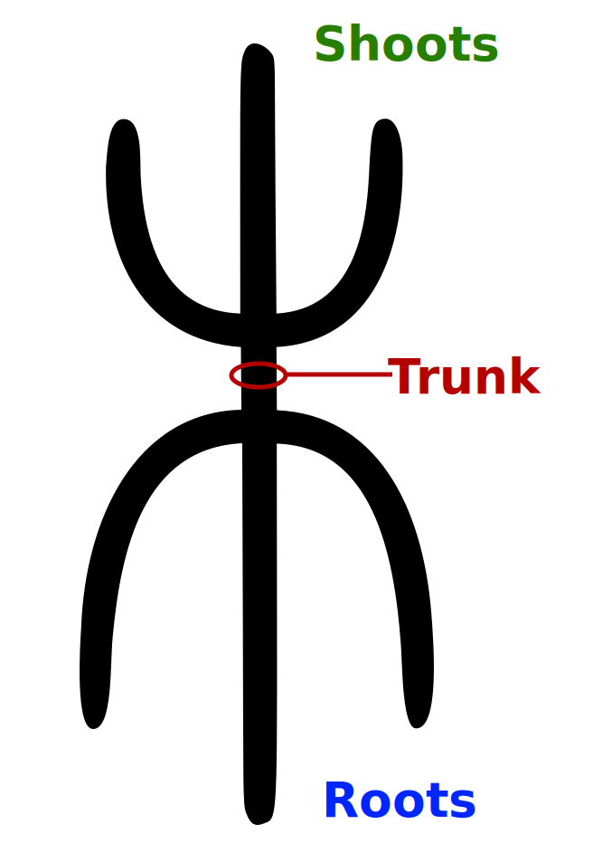{:width 100}
							- This form coincides with the letter ⵣ (Yaz) in the [Tifinagh alphabet](https://en.wikipedia.org/wiki/Tifinagh) – the symbol of the Amazigh people.
							- Ref: [Căn bản, gốc rễ, cội nguồn](https://creatzynotes.blogspot.com/2021/05/can-ban-goc-re.html)
						- base node
						  id:: 667bd594-66b8-4c0e-89a0-8088cbe2e1f6
						  = ((66751b3b-5fd0-4efd-a43c-db2c4930ae4f)) of the whole tree
						  ((665359e4-4597-4775-b849-f9acbb98960a)) ((699c0362-dcfd-46d8-8140-ba5379c2de0b))
							- The base node is the **common stem node** of both shoot system and root system. In the biological tree, the base node is the [trunk (bole)](https://en.wikipedia.org/wiki/Trunk_(botany)), or narrowly only the trunk flare (root flare/collar).
							- root node
							  id:: 699c0362-dcfd-46d8-8140-ba5379c2de0b
							  collapsed:: true
							  ((665c9af1-1ce2-461c-af33-671690618c8f)) ((667bd594-66b8-4c0e-89a0-8088cbe2e1f6))
								- Normally, the root system is not expanded but folded into a single "root node" in the tree, because the root branches are usually out of sight.
								- The figurative meaning of the word “root” is captured by the "root node", which is technically not the whole root system, but can colloquially refer to the whole root in a collapsed view.
				- Branching styles
				  collapsed:: true
					- lateral branching
					  id:: 667bdced-76f1-4023-9352-dee24dcbf415
					  is the branching [from the main stem to the lower-level branch](https://en.wikipedia.org/wiki/Branch_attachment).
						- Diagram:
						  collapsed:: true
							- 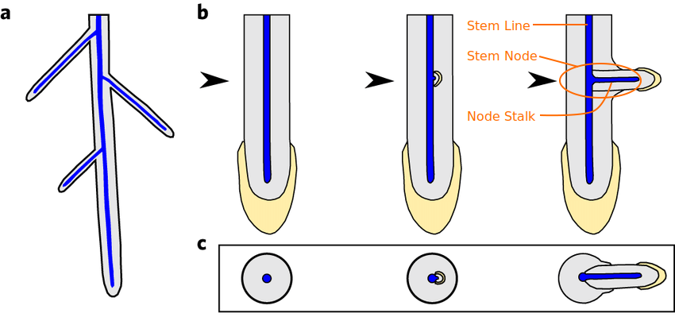
						- This is the primary [branching structure](((667530ed-809b-4d38-8522-1ae6c8449e28))) in ((667252dc-e610-4d07-bcd0-9ea6fb4499fd)).
						- This is used in [GUI tree view](((66750416-093a-4042-bb6d-78702c219c36))) and [triangular phylogenic tree](((66750135-8c59-477c-8baf-cb3898d54559))).
					- dichotomous branching
					  id:: 667bdf2a-005c-4a19-93bd-bda5d076981a
					  is the branching into 2 (or more) equivalent branches instead of the stem/branch discrimination.
						- folking
						  ((665c9af1-1ce2-461c-af33-671690618c8f)) ((667bdf2a-005c-4a19-93bd-bda5d076981a))
						- It's also call [folk branching](https://en.wikipedia.org/wiki/Tree_fork).
						- Diagram:
						  collapsed:: true
							- Diagram:
								- 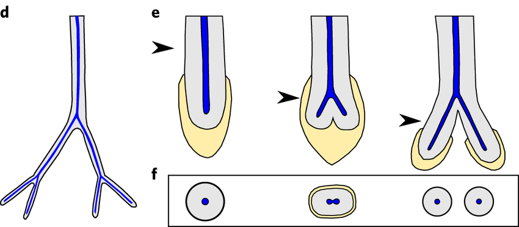
						- This is a secondary branching structure which can be converted to ((667bdced-76f1-4023-9352-dee24dcbf415)) by considering the folk point as a collapsed stem line with 2 nodes (or many nodes in [data structure tree](((66751015-5c34-493e-9663-4f0f5234b66e)))).
						- This is used in [data structure tree](((66751015-5c34-493e-9663-4f0f5234b66e))).
					- circular branching
					  id:: 684f9517-f730-4fc8-8162-05b594cd92cd
					  is the branching into many equivalent nodes, including the “parent node” of this node, around the ((667bebeb-7f20-4d03-b860-1653c3137710)).
						- This is the branching structure of [data structure tree](((66751015-5c34-493e-9663-4f0f5234b66e))) as well as mind maps.
						- The stem circle adds temporal lineage (time) to the branching structure (space) of the data structure tree.
							- The stem circle says to the pure spatial data structure tree:
								- The stem line isn't gone.
								- It just curled into the node,
									- folded like memory,
									- condensed like a tuber,
									- paused like a dormant bud.
								- The time is just **coiling up in space**!
						- The ((667bebeb-7f20-4d03-b860-1653c3137710)) integrates the branch equality of ((667bdf2a-005c-4a19-93bd-bda5d076981a)) into the ((66740af5-032a-4cb1-9c97-0e4d3933ab9b)) of ((667bdced-76f1-4023-9352-dee24dcbf415)).
							- The stem circle has more branch equality than ((667bdf2a-005c-4a19-93bd-bda5d076981a)) because the stalk of the stem node is just a branch stalk to the parent node, and the whole tree is just an [unrooted tree](https://en.wikipedia.org/wiki/Unrooted_binary_tree).
						- The biological analogies of stem circle are [bulblike stems](((686b8a52-50bf-43bd-a5b3-d2387b8da5ac))) like stem tubers 🥔 or corms.
						- base branch
						  collapsed:: true
						   = branch at 0° = stalk of stem node = branch stalk to the parent node
							- When viewed as a [rooted tree](https://en.wikipedia.org/wiki/Tree_(graph_theory)#Rooted_tree), the base branch is the back-branch to the parent node.
				- Representation
				  :LOGBOOK:
				  CLOCK: [2024-06-21 Fri 15:32:54]
				  :END:
					- 3 styles of tree diagrams
					  id:: 667500cd-a31d-4828-9dc4-93948e27e534
					  collapsed:: true
						- These [diagrams](https://docs.google.com/drawings/d/1zFtVcP_RBC5iGsfqpPvhjYEef9zg2ZSrEsjABb5qgOE) show different [components](((667530ed-809b-4d38-8522-1ae6c8449e28))) in ((66750135-8c59-477c-8baf-cb3898d54559)), ((66750416-093a-4042-bb6d-78702c219c36)), and ((66751015-5c34-493e-9663-4f0f5234b66e)).
							- {:height 658, :width 757}
						- Triangular [phylogenetic tree](https://www.sciencedirect.com/topics/biochemistry-genetics-and-molecular-biology/phylogenetic-tree)
						  id:: 66750135-8c59-477c-8baf-cb3898d54559
						   is closest to the [biological tree](((667502e5-b83a-4d2a-a801-34e7bcfa6b38))): The nodes are right on the stem line, and they are also branching points (or branch points). So, there are no branch stalks but only leaf stalks.
						- [GUI tree view](https://en.wikipedia.org/wiki/Tree_view)
						  id:: 66750416-093a-4042-bb6d-78702c219c36
						   is similar to [phylogenetic tree](((66750135-8c59-477c-8baf-cb3898d54559))) but each node are separated from the stem line by a node stalk, either branch stalk or leaf stalk. That means the branching point is now separated from the node and is the joint between the stem line and the stalk.
							- The stalk can be represented by a short line, an arrow, or an icon.
							  id:: 66752164-1227-490c-8182-7949e4eb501d
							- There's an artistic style of tree view where stem line is drawn as a long brace `{` and its stem node is placed in the middle.
							  id:: 6675279b-214e-43e4-81b9-14b43026ec67
							  collapsed:: true
								- 
						- [data structure tree](https://en.wikipedia.org/wiki/Tree_(data_structure))
						  id:: 66751015-5c34-493e-9663-4f0f5234b66e
						   can be constructed from [GUI tree view](((66750416-093a-4042-bb6d-78702c219c36))) by folding the stem line into the border of the stem node, called ((667bebeb-7f20-4d03-b860-1653c3137710)), forming a ((684f9517-f730-4fc8-8162-05b594cd92cd)) structure where node stalks are branch edges.
							- Data structure tree versus [phylogenetic tree](((66750135-8c59-477c-8baf-cb3898d54559))): similar shape, different meaning
								- While each edge in phylogenetic tree can be either an internode segment of a stem line or a stalk, every edge in data structure tree is a **stalk**.
								- So _don't be confused between a linear stem line with an **exponential series of stalks** (branch edges)_!
							- There's an artistic style of structure tree, usually used in [mind map](https://en.wikipedia.org/wiki/Mind_map)s, where the node is collapsed into a branching point and its stalk is used to name/describe that node.
							  collapsed:: true
								- 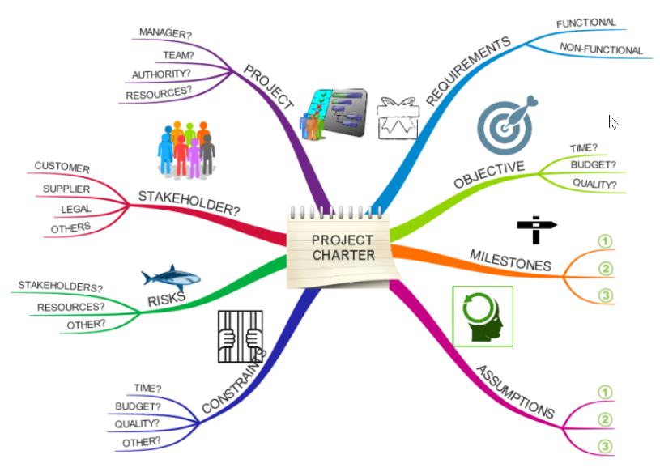
								- Another style renders similar to [an artistic style of tree view](((6675279b-214e-43e4-81b9-14b43026ec67)))
								  
						- Collected diagrams with annotation
						  collapsed:: true
							- 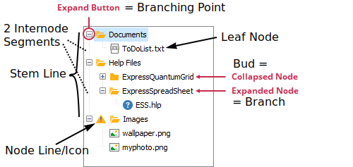
							- 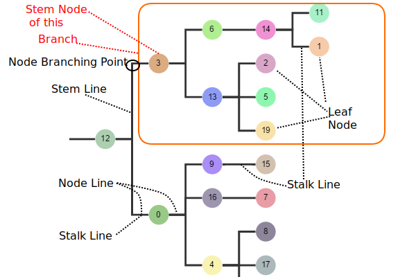
							- 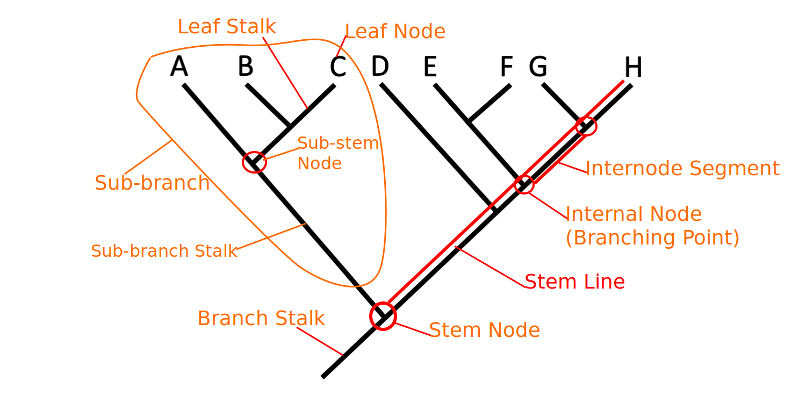
					- Beside [tree diagrams](((667500cd-a31d-4828-9dc4-93948e27e534))), a [tree structure](https://en.wikipedia.org/wiki/Tree_structure) can be represented by ((66752fbf-a751-4117-ae0d-17d9a19053e4)).
				- ((665359ff-79f1-4669-b10b-f2b0e633a7c1))
					- Discussion with Gemini about [tree-view & DAG-view of graph](https://gemini.google.com/app/aa1f15a6b07a2d26)
					- [Components](((667530ed-809b-4d38-8522-1ae6c8449e28))) of a tree view from ((667407ee-35ae-4d6f-8b58-89c19c0e0936))
					  id:: 6674066a-aeff-45af-96df-b0c2f278a2ae
					  collapsed:: true
					  :LOGBOOK:
					  CLOCK: [2024-06-21 Fri 15:33:13]
					  :END:
						- Discussion with Gemini about [Name of lines in Tree View](https://gemini.google.com/app/88d6d204c956507b)
						- The the components of tree view are named with reference from the biological tree anatomy like follows.
						- tree anatomy
						  id:: 667407ee-35ae-4d6f-8b58-89c19c0e0936
						  :LOGBOOK:
						  CLOCK: [2024-06-21 Fri 15:33:06]
						  :END:
							-  from University of Geogia hosted by [BugwoodCloud.org](https://bugwoodcloud.org/resource/files/25389.pdf)
							-  from University of Geogia hosted by [BugwoodCloud.org](https://bugwoodcloud.org/resource/files/19019.pdf)
							- [Britannica: Tree: Tree structure and growth](https://www.britannica.com/plant/tree/Tree-structure-and-growth)
							  id:: 66b1cfa4-7b88-4ef7-a07e-45a2f6409e26
							- anatomy of a tree branch (shoot)
							  id:: 667502e5-b83a-4d2a-a801-34e7bcfa6b38
							  collapsed:: true
								- 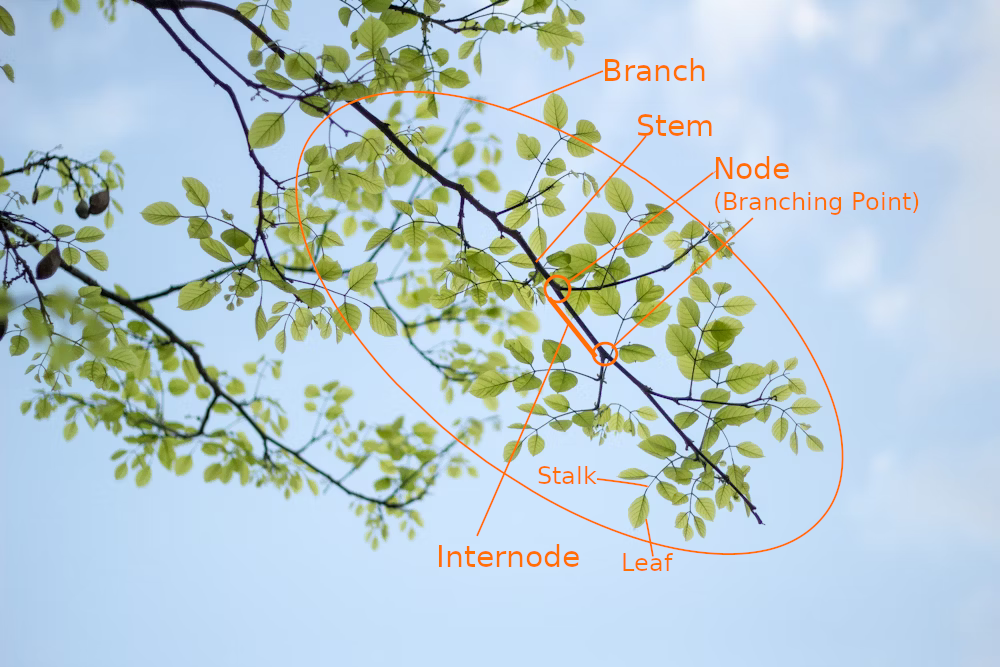
							- Vietnamese terms:
							  collapsed:: true
								- tree: cây
								- tree base (stump): gốc cây
								- root: rễ
								- bole: thân
								- trunk = stem of tree: sống cây
								- stem: sống cành
								- bough (limb): cành
								- branch: nhánh
								- twig (branchlet): nhánh con
								- stalk: cuống
								- bud: chồi
									- flower bud: nụ hoa
								- shoot: lộc
								- leaf: lá
								- flower: hoa, bông
								- fruit: quả, trái
								- seed: hạt, hột
							- ((665359ff-79f1-4669-b10b-f2b0e633a7c1))
								- Discussion with Gemini about [node vs. internode](https://gemini.google.com/app/0dbc3f1a3b0cff16).
							- Root system
							  id:: 66ec16b8-15b6-43f2-bfb1-a2bfbaaf8203
								- Opposite to shoot system: Not only downward versus upward, the root system has an *endogenous* origin, i.e. they originate and develop from an inner layer of the mother axis, such as [pericycle](https://en.wikipedia.org/wiki/Pericycle), whereas shoot system has an *exogenous* origin, i.e. they start to develop from the cortex, an outer layer.
								- Types of roots
								  collapsed:: true
									- 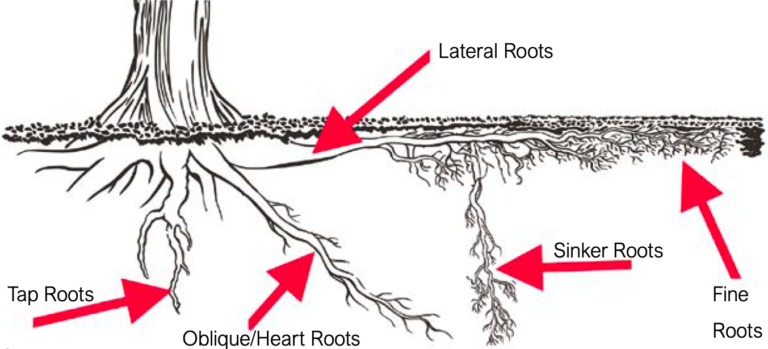
									- Ref: [3 Types of Tree Root Systems](https://aplustree.com/3-types-of-tree-root-systems/)
									- **Tap roots:** Every tree starts with a tap root that provides stability and absorption. Over time, other roots outgrow the taproot. Most taproots don't continue to grow ever more deeply because deep soils lack the oxygen and nutrients that roots need to survive.
									- **Lateral roots**: Lateral roots grow outwards right under the soil surface. They absorb a lot of water and nutrients as well as anchoring the tree.
									- **Oblique/heart roots:** Oblique roots, also known as heart roots, grow at a diagonal and have the same function as lateral roots.
									- **Sinker roots:** Sinker roots grow downwards from the lateral roots to a depth of several feet. There, lateral roots take advantage of any water and nutrients deeper in the soil in addition to increasing tree stability.
									- **Fine roots:** All the root types aforesaid can give rise to fine roots, which is where water and nutrients are directly absorbed. They also house mycorrhizae, which are fungal partnerships that increase root absorption capacity.
								- Types of root systems
								  id:: 66ec1a78-f952-4387-8ccd-9a9a3b2abf13
								  collapsed:: true
									- Ref: [3 Types of Tree Root Systems](https://aplustree.com/3-types-of-tree-root-systems/)
									- Tap root systems
										- 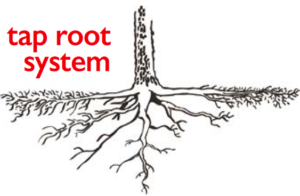
										- **Stability:** Tap root systems are very stable, but extremely rare in mature trees.
										- **Common Species:** Some oaks and pines, hickory, sweet gum, tupelo, walnut.
									- Heart (Oblique) root systems
										- 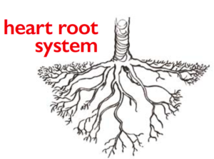
										- **Stability:** Heart root systems obtain their stability from root ball weight and soil resistance. The tree is held up by the weight of its root ball counteracting the weight of its aboveground parts and the strength of the soil around it. Heart root systems are prone to failure in wet soils. Once the soil is wet, wind and gravity can make the tree rotate in the ground, much like a ball-and-socket joint.
										- **Common Species:** Honey locust, red oak, sycamore. More common in Mediterranean and arid climates.
									- Lateral root systems
										- 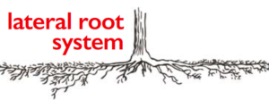
										- **Stability:** Lateral root systems obtain their stability from tree weight and root spread. These root systems don't necessarily have a lot of root mass, but because the roots are so widespread, the tree can be supported without investing so much in roots. About 80% of tree species and most urban trees have lateral root systems.
										- **Common Species:** Ash, birch, cottonwood, hackberry, maple.
								- Depth of roots
								  collapsed:: true
									- ((6651ecba-793d-43c5-8020-a9f260b032d8)) The depth of roots depends on ((66ec1a78-f952-4387-8ccd-9a9a3b2abf13)) of the tree, water, oxygen, and soil compaction levels. If all these conditions are met, roots can grow to great depths, which can be more than 20 feet (6 meters) at normal soil, and up to 60 metres (200 ft) at deserts. However in urban areas, soil compaction and poor drainage usually limit root depth to within 3 meters (10 ft).
										- 
									- ((665359ff-79f1-4669-b10b-f2b0e633a7c1))
										- [How Deep Do Tree Roots Really Grow?](https://www.deeproot.com/blog/blog-entries/how-deep-do-tree-roots-really-grow/)
									- Roots can go downward on young trees
										- 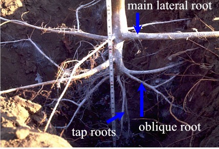
										- Roots often grow down under the trunk when trees are young. Two tap roots grew vertically under the trunk on this honeylocust three years after planting. Several oblique roots are also visible, growing down at an angle. Despite the deep roots, the largest diameter roots are the main lateral roots close to the soil surface. The ruler in the photo shows the deepest roots are 32 inches (81 cm) below the surface.
									- When the tree are grown up, most of the roots go outward
										- Horizontal rooting to about 4 foot (1.2 m) depth in loam soil over river wash till.
										  
										- When the tree are grown up, the tap roots stop growing while the lateral roots continue to grow as wide as the tree height.
									- Deep roots in well drained & uncompacted (nursery) soil
										- 
										- Trees in the nursery often have a number of roots growing straight down under the trunk.
										  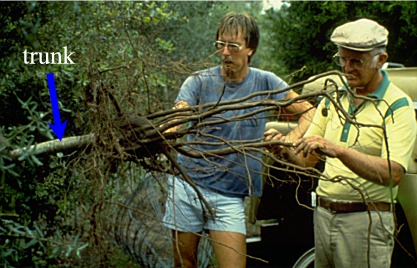
										- Early studies of tree roots from the 1930s, often working in easy-to-dig loose soils, presented an image of trees with deep roots and root architecture that mimicked the structure of the canopy.
										  
										- In their 1991 paper, “[On The Maximum Extent of Tree Roots](http://soilslab.cfr.washington.edu/publications/Stone&Kalicz-1991.pdf),” E.L. Stone and P.J. Kalicz summarized previous root depth studies of 49 genera and 211 species growing in a wide variety of soil types. They found numerous examples of trees reported to be growing roots to over 33 feet (10 meters), and one report of a tree that grew roots to a depth of 174 feet (53 meters).
										- The mollisols (deep >20 feet [6 meters] **prairie** soil – all O/A soil horizons) have 2 broadleaf tree root depths: 11 feet (Black Walnut) & 15 feet [4.5 meters] deep (White Oak). Both the Walnut & Oak have the least drought stress. The **loams **in the Silva Cell are functionally equivalent to mollisols. So, a 4 foot [1.2 meter] deep rooting space in O/A in Silva Cells will easily be utilized by tree roots.
										- Orjan Stahl, a tree researcher in Stockholm, made an exhaustive study of over 500 trees that had root and utility conflicts. He regularly found roots at depths of 7 to 9 feet (2.1 to 2.7 meters) and the deepest root he encountered was at 23 feet (7 meters).
			- nested viewcone
			  id:: 66752fbf-a751-4117-ae0d-17d9a19053e4
			  collapsed:: true
			  :LOGBOOK:
			  CLOCK: [2024-06-21 Fri 15:28:09]
			  :END:
				- ((6651ecba-793d-43c5-8020-a9f260b032d8)) Like ((667252dc-e610-4d07-bcd0-9ea6fb4499fd)), a ((66752fbf-a751-4117-ae0d-17d9a19053e4)) shows internal structure of a ((667251ec-d4f7-4c09-adff-73e04a4b22ed)).
				- Representation:
				  id:: 66752fca-96b5-46a0-9b66-c825cc1de9c7
					- Graphically, ((66752fbf-a751-4117-ae0d-17d9a19053e4)) can be represented by [Euler diagram](https://en.wikipedia.org/wiki/Euler_diagram), [nested set collection](https://en.wikipedia.org/wiki/Nested_set_collection), [treemapping](https://en.wikipedia.org/wiki/Treemapping).
					  id:: 66753405-9afe-478e-abd2-f43100e21c33
					- Textually, ((66752fbf-a751-4117-ae0d-17d9a19053e4)) can be represented by [Dyck word](https://en.wikipedia.org/wiki/Dyck_language) and ((6675369a-1d13-48c5-8a77-d588aa8b59b8)).
		- ### scope
		  id:: 685a47e4-21f2-40d6-b80c-d3adf401489b
		  collapsed:: true
			- ((6651ecba-793d-43c5-8020-a9f260b032d8)) ((685a47e4-21f2-40d6-b80c-d3adf401489b)) is the base of the ((6672513b-c4b0-4c88-8b30-c60a3c6555a7)), defining which objects to be ((66c811a1-b48b-4f91-9c47-b60be42ee7f4))ed, i.e. the content of the view.
		- ### view frame
		  id:: 685a47f5-728a-4b34-95c5-d8e3bba5aad1
		  collapsed:: true
		  ((665359e4-4597-4775-b849-f9acbb98960a)) ((685a480b-1739-4057-aaa8-c099dc95142e)), ((685a50e9-6854-42a5-a6cf-5190765881ff))
			- viewframe
			  id:: 685a480b-1739-4057-aaa8-c099dc95142e
			  ((665c9af1-1ce2-461c-af33-671690618c8f)) ((685a47f5-728a-4b34-95c5-d8e3bba5aad1))
			- lens
			  id:: 685a50e9-6854-42a5-a6cf-5190765881ff
			  ((665c9af1-1ce2-461c-af33-671690618c8f)) ((685a47f5-728a-4b34-95c5-d8e3bba5aad1))
			- ((6651ecba-793d-43c5-8020-a9f260b032d8)) ((685a47f5-728a-4b34-95c5-d8e3bba5aad1)) is the boundary of the ((685a47e4-21f2-40d6-b80c-d3adf401489b)), i.e. the circumference of the ((6672513b-c4b0-4c88-8b30-c60a3c6555a7))'s base, defining the limit of the ((66723642-58f1-4a74-bba3-0108f14c6bac)) as well as the underlying structure on which the view is created. While ((685a47e4-21f2-40d6-b80c-d3adf401489b)) and ((6672513b-c4b0-4c88-8b30-c60a3c6555a7)) are about the content of the view, viewframe is about the structure of the view imposed by the ((66c8613b-ce1a-4263-b24d-fc2172d5b59f)).
			- ((66725725-f76a-4328-b162-f469b87e871b))
				- [framing](https://en.wikipedia.org/wiki/Framing_(visual_arts)) and [picture frame](https://en.wikipedia.org/wiki/Picture_frame) in visual arts
				- [reference frame](https://en.wikipedia.org/wiki/Frame_of_reference) in physics
				- [framing](https://en.wikipedia.org/wiki/Framing_(social_sciences)) in social sciences, like [metaphorical framing](https://en.wikipedia.org/wiki/Metaphorical_framing)
				- frameworks in various fields: [conceptual framework](https://en.wikipedia.org/wiki/Conceptual_framework), [logical framework](https://en.wikipedia.org/wiki/Logical_framework), etc.
			- ((665359ff-79f1-4669-b10b-f2b0e633a7c1))
				- ((685a480b-1739-4057-aaa8-c099dc95142e)) = boundary of ((685a47e4-21f2-40d6-b80c-d3adf401489b)) = determinator of ((667c015e-6223-4f8a-ae84-a93a49f4ff94)), sim, diff
				  id:: 685a58f3-6393-48df-966b-24b270a92b58
				  collapsed:: true
				  :LOGBOOK:
				  CLOCK: [2025-06-24 Tue 14:51:35]
				  :END:
					- (scope, viewframe) = (base, circumference) of viewcone
					- Whole scope = no diff, no change; partial scope => diff => change
					- The frame O is the in-form, a part of the self (intent, obop), hence unchanged;
						- what's seen in the frame at position x is the content O(x), the object, being subject to change;
						- the position x is the extent, ex-form, image of object.
						- ⇒ Thus, the frame is a function projecting content to extent.
					- The self in thread, change, transformation:
						- change: Change requires a thread of self.
						- The continuity of a thread is determined by the obop observing that thread. Hence, a thread of subject is intrinsic to itself, while a thread of object is extrinsic.
		- worldview
		  id:: 6731b8c8-0ab1-4c16-8783-408258f67a4a
		  the ((667259a0-aa2e-49fa-bcbd-b3768a9f30b2)) about the ((667cfac2-17f1-4cbd-9f6d-1e722ff2a870))
			- ((665359c0-a89a-41b5-9f28-503f79107a08)) https://en.wikipedia.org/wiki/Worldview
		- ### eye
		  id:: 669a2487-054d-4408-ae41-189e34af81a9
		  collapsed:: true
		  ((665359e4-4597-4775-b849-f9acbb98960a)) ((66c8613b-ce1a-4263-b24d-fc2172d5b59f)), ((669a2697-56af-445c-9197-24aa498a5d5b)), ((669a2886-9e03-41a4-a790-24bf6b7dcd96)), ((66c85d4d-64de-48d9-b384-eebdc2635ab2))
		  ((6699ea73-dc77-4227-a293-b501f2eb1759)) ((b67b7276-441e-43f2-a5c1-81e3cbe0659e))
		  ((6699e5f2-7788-46c7-8233-87699a65ca30)) ((669a2c12-1dad-42a0-ab31-f03642b4aa8a))
			- viewer
			  id:: 66c8613b-ce1a-4263-b24d-fc2172d5b59f
			  ((665c9af1-1ce2-461c-af33-671690618c8f)) ((669a2487-054d-4408-ae41-189e34af81a9))
			  ((6699e4db-2e75-4427-94bb-96dfe0367dd1)) ((669a26cb-50d8-4347-a5c4-7c0c3acf1211))
				- ((6651ecba-793d-43c5-8020-a9f260b032d8)) When calling a body a ((66c8613b-ce1a-4263-b24d-fc2172d5b59f)), we emphasize its **role** of viewing as opposed to the ((669a26cb-50d8-4347-a5c4-7c0c3acf1211)) role of the subject of that body.
			- observer
			  id:: 669a2697-56af-445c-9197-24aa498a5d5b
			  ((665c9af1-1ce2-461c-af33-671690618c8f)) ((669a2487-054d-4408-ae41-189e34af81a9))
			- sensor
			  id:: 669a2886-9e03-41a4-a790-24bf6b7dcd96
			  ((665c9af1-1ce2-461c-af33-671690618c8f)) ((669a2487-054d-4408-ae41-189e34af81a9))
			  ((6699ea73-dc77-4227-a293-b501f2eb1759)) ((6889abf7-7c3c-4ef5-80fe-3edca20268bd))
			  ((66c80dde-a097-4744-8af8-c6e26dcfdda2)) ((6731c3c6-aee6-468d-a86c-0d470c4a6706))
			- projector
			  id:: 66c85d4d-64de-48d9-b384-eebdc2635ab2
			  ((665c9af1-1ce2-461c-af33-671690618c8f)) ((669a2487-054d-4408-ae41-189e34af81a9))
			- ((6651ecba-793d-43c5-8020-a9f260b032d8)) ((669a2487-054d-4408-ae41-189e34af81a9)) is the ((66532bb2-7680-461b-80b2-71fc96c89fb9)) of the ((667cfa3e-9856-43f0-956b-ebb4ff31d8eb)) which it uses to ((66c811a9-e8c7-42c5-bdc9-25fbd023f93a)) things. The eye cannot see itself directly, but it can see its ((66c87a15-e49f-4c86-8f31-f21042f4892c)) via reflection on external mirror.
			- #### eyeball
			  id:: 66c87a15-e49f-4c86-8f31-f21042f4892c
				- ((6651ecba-793d-43c5-8020-a9f260b032d8)) ((66c87a15-e49f-4c86-8f31-f21042f4892c)) is the ((66c810a0-9861-4787-bdcf-1378219332be)) of the ((669a2487-054d-4408-ae41-189e34af81a9)).
	- ## action
	  id:: 66727858-979d-4d95-8a90-7a749218cfba
	  collapsed:: true
	  ((665359e4-4597-4775-b849-f9acbb98960a)) ((6672785f-ac9e-42ba-921e-0264d0d83ae2))
	  ((6699e4db-2e75-4427-94bb-96dfe0367dd1)) ((66723642-58f1-4a74-bba3-0108f14c6bac))
	  ((6699e5f2-7788-46c7-8233-87699a65ca30)) ((66725144-6bc9-4c9f-ba48-2cef02651e52))
	  ((66c80da7-c0e8-46d2-85e5-71318fd44eff)) ((66c845ea-635f-4be1-a220-2c7a5049ef83)), ((66c845fe-6e8e-412e-902e-34ae8d728f90))
		- operation
		  id:: 6672785f-ac9e-42ba-921e-0264d0d83ae2
		  ((665c9af1-1ce2-461c-af33-671690618c8f)) ((66727858-979d-4d95-8a90-7a749218cfba))
		- act
		  id:: 66c845ea-635f-4be1-a220-2c7a5049ef83
		  ((66c80dfd-95e2-4b5a-bd56-06e8307e81ca)) ((66727858-979d-4d95-8a90-7a749218cfba))
		- do
		  id:: 66c845fe-6e8e-412e-902e-34ae8d728f90
		  ((66c80dfd-95e2-4b5a-bd56-06e8307e81ca)) ((66727858-979d-4d95-8a90-7a749218cfba))
		- ((6651ecba-793d-43c5-8020-a9f260b032d8)) An ((66727858-979d-4d95-8a90-7a749218cfba)) is a ((669a58b9-eb34-41cd-8605-02e29b07e1b5)) that a ((667cfa3e-9856-43f0-956b-ebb4ff31d8eb)) carries through time. Each action is a segment of the ((667bef22-b272-4a7d-b613-3f1ed1a47329)) carried out by the subject.
		  id:: 66c846f8-eac8-4daf-add8-121d12871c5a
		  :LOGBOOK:
		  CLOCK: [2024-08-23 Fri 15:23:23]
		  :END:
		- ((66725708-3dc4-43f5-a180-6b331c6a160f))
			- In Buddhism, ((66727858-979d-4d95-8a90-7a749218cfba)) is called [saṅkhāra](https://en.wikipedia.org/wiki/Sa%E1%B9%85kh%C4%81ra) meaning "formation", "conditioning".
			- In physics, ((66727858-979d-4d95-8a90-7a749218cfba)) is called "[force](https://en.wikipedia.org/wiki/Force)" and [interaction](https://en.wikipedia.org/wiki/Fundamental_interaction). The "inter" in "interaction" means the duality of action as a ((66725144-6bc9-4c9f-ba48-2cef02651e52)).
			- Im mathematics, ((66727858-979d-4d95-8a90-7a749218cfba)) has many names: [operation](https://en.wikipedia.org/wiki/Operation_(mathematics)), [transformation](https://en.wikipedia.org/wiki/Transformation_(function)), [group action](https://en.wikipedia.org/wiki/Group_action).
			- In Chinese philosophy, ((66727858-979d-4d95-8a90-7a749218cfba)) is called [行(hành)](https://en.wikipedia.org/wiki/Wuxing_(Chinese_philosophy)).
		- ((665359ff-79f1-4669-b10b-f2b0e633a7c1))
		  :LOGBOOK:
		  CLOCK: [2025-05-16 Fri 11:59:11]
		  :END:
			- Formation: _emtpy **possibility**_ → _unfulfilled **potential**_ → _fulfilled **action**_
			  id:: 6835b165-b560-4358-9e46-c4511124c928
			  collapsed:: true
			  :LOGBOOK:
			  CLOCK: [2025-05-16 Fri 11:59:30]
			  CLOCK: [2025-05-16 Fri 12:00:30]--[2025-06-10 Tue 19:45:38] =>  607:45:08
			  :END:
				- Potential: potential engergy, continuous range of possibilities inside, partial, incomplete, abstract
				- Action: actual work, discrete instances of actuality, full, complete, concrete
				- [act](((66c845ea-635f-4be1-a220-2c7a5049ef83))) = [form](((665ca429-84e3-49ff-921e-c07d19cd99ba))): action is the [formation of new form](((6847e7fa-0d57-425c-b035-1a62db7725e6))) (concrete extension) from the combination of old form (intent) and content.
				  id:: 68481e2b-0144-42e6-bd9b-96d2fd905573
					- Potential is such a new form in latent state having yet to appear, hence an unfulfilled action.
					- To act is to make that new form appear. Thus, action is a fulfilled potential.
					- In a broad sense, action is the whole process of formation from the empty possibility to potential and the final emergence of the new form.
					- In a narrow sense, action is the visible part of the formation process marked by the emergence of the new form.
				- The ((66b1cfa4-e22c-4424-bf19-a6ce4649da77)) model of action: from _emtpy **possibility**_ to _unfulfilled **potential**_ and _fulfilled **action**_
				  id:: 6847e7fa-0d57-425c-b035-1a62db7725e6
					- The **intent** is the internal form, the structure of the obop with the shape of a circle, just like a bottle, denoted by its capacity, usually normalized to $i = 1 = 100\%$.
					- The **content** is the “water” being poured into the bottle, denoted by its percentage $c$ (%) in the bottle.
					- The **extent** is the number of bottles, $e = c/i$, measuring the amount of water.
					- ((66c8369a-ccb8-4f1f-b12b-bf7054cb79e4))ing the actual content, the extent itself shows the *possible number of bottles*, i.e. **possibilities**, called ((69b3e6c8-735f-437d-9a7f-1a2841bfb336))s which are mere natural numbers $0, 1, 2, ...$
					  collapsed:: true
						- Each number (extent) has two meanings:
							- cardinal number, like 3, showing the number of possibilities, the size of possibility space, the extent of the extension set;
							- ordinal number, like 3rd, identifying the single possibility being referred, i.e. a particular abstract extension.
						- Abuse of terms:
							- Extension: The set of all particular (abstract) extensions {1st, 2nd, ...} is also called “(abstract) extension” as a collective noun.
							- Extent: While “extent” is usually the size of the extension set, i.e. a cardinal number, the ordinal number identifying a particular extension can be also called “extent” in general (better to be called “particular extent” or “identifier” in particular).
						- The zero(th)
							- The 0th extension is the intent itself, and it is the ((94e87dc9-71af-477c-aa70-0f448c2f1e20)) of all non-zero extensions, via the “element of” operator ($∈$).
							- The empty extension set (zero extension), while extensionally contains no element, hence 0 extent, intensionally includes the intent (0th element).
							- The (0th extension = the inent = the form) is extensionally contained in no extensions and intensionally included in all extensions.
							- The 0th is incomparable to non-zeroth: while the intent defines the amount of content of each extension, the crystalized content of the intent is incomparable to any particular extension.
					- When a bottle is *partially filled*, e.g. $c = 30\% = 0.3i$, it has the **potential** of being full 100%, but not yet, hence *unfulfilled*.
					- When a bottle is *fully filled*, i.e. “***fulfilled***”, a new ((69b3e6d4-8fbe-4f08-94e3-a3cfbbb3980a)) is produced which is not an abstract number but an *actual bottle of water*, hence an **action**.
					- Real life instances of this model are the [water scoop](https://en.wikipedia.org/wiki/Water_scoop_(hydropower)) (monjolo, [cối giã nước](https://baonghean.vn/doc-dao-chiec-coi-gia-gao-bang-suc-nuoc-o-tay-nghe-an-10091303.html)), the [shishi-odoshi](https://en.wikipedia.org/wiki/Shishi-odoshi).
					  id:: 699c0362-1cb5-483f-ac28-dddd26c54fb1
					  collapsed:: true
						- A monjolo in Caldas Novas, Goiás
						  
				- [Action potential](https://en.wikipedia.org/wiki/Action_potential)
					- (Membrane) Potential: The stored energy or readiness of a cell to perform an action, like a stretched spring. It's defined by the electrical charge difference across the membrane.
					- Action (Potential): The actual movement or signal (nerve impulse) that the cell sends, like the spring releasing and launching something. It is defined as a series of quick changes in membrane potential.
				- [Potentiality and actuality](https://en.wikipedia.org/wiki/Potentiality_and_actuality)
		- light cone
		  id:: 667bd931-8759-4008-8a9a-33e78a5cbdf3
		  collapsed:: true
		  ((665359e4-4597-4775-b849-f9acbb98960a)) ((667bd93a-cce4-4dbf-9831-725e4dffe463))
		  ((6699e4db-2e75-4427-94bb-96dfe0367dd1)) ((6672513b-c4b0-4c88-8b30-c60a3c6555a7))
			- effect cone
			  id:: 667bd93a-cce4-4dbf-9831-725e4dffe463
			  ((665c9af1-1ce2-461c-af33-671690618c8f)) ((667bd931-8759-4008-8a9a-33e78a5cbdf3))
			  ((6699e4db-2e75-4427-94bb-96dfe0367dd1)) ((6672513b-c4b0-4c88-8b30-c60a3c6555a7))
				- ((6651ecba-793d-43c5-8020-a9f260b032d8)) ((667bd93a-cce4-4dbf-9831-725e4dffe463)) is the cone of ((677f509b-f2db-47b1-aafb-5a475334b532))s of an ((66727858-979d-4d95-8a90-7a749218cfba)).
			- ((66725725-f76a-4328-b162-f469b87e871b))
				- The future [light cone](https://en.wikipedia.org/wiki/Light_cone) in physics is a ((667bd931-8759-4008-8a9a-33e78a5cbdf3)).
			- ### action cone
			  id:: 6847e436-9a84-42c5-a853-75f6d626ed63
			  ((6699e4db-2e75-4427-94bb-96dfe0367dd1)) ((68df36a4-6a3e-4fc9-b44a-c8e92f62aee1))
				- ((6651ecba-793d-43c5-8020-a9f260b032d8)) ((6847e436-9a84-42c5-a853-75f6d626ed63)) is the part of ((667bd93a-cce4-4dbf-9831-725e4dffe463)) limited within the ((66c810a0-9861-4787-bdcf-1378219332be)) of the ((667cfa3e-9856-43f0-956b-ebb4ff31d8eb)). The cone shape is caused by the [tree structure](((667252dc-e610-4d07-bcd0-9ea6fb4499fd))) of the body which makes the action of the central operator spread out to peripherals. The tree structure of executions, like function calls in computer programs, also makes the the action spread out in time.
		- ### actor
		  id:: 669a26cb-50d8-4347-a5c4-7c0c3acf1211
		  ((665359e4-4597-4775-b849-f9acbb98960a)) ((6889abf7-7c3c-4ef5-80fe-3edca20268bd)), ((b67b7276-441e-43f2-a5c1-81e3cbe0659e))
		  ((6699e4db-2e75-4427-94bb-96dfe0367dd1)) ((66c8613b-ce1a-4263-b24d-fc2172d5b59f))
		  ((6699e5f2-7788-46c7-8233-87699a65ca30)) ((669a2c12-1dad-42a0-ab31-f03642b4aa8a))
			- effector
			  id:: 6889abf7-7c3c-4ef5-80fe-3edca20268bd
			  ((665c9af1-1ce2-461c-af33-671690618c8f)) ((669a26cb-50d8-4347-a5c4-7c0c3acf1211))
			  ((6699ea73-dc77-4227-a293-b501f2eb1759)) ((669a2886-9e03-41a4-a790-24bf6b7dcd96))
			- hand
			  id:: b67b7276-441e-43f2-a5c1-81e3cbe0659e
			  ((665c9af1-1ce2-461c-af33-671690618c8f)) ((669a26cb-50d8-4347-a5c4-7c0c3acf1211))
			  ((6699ea73-dc77-4227-a293-b501f2eb1759)) ((669a2487-054d-4408-ae41-189e34af81a9))
			- ((6651ecba-793d-43c5-8020-a9f260b032d8)) ((669a26cb-50d8-4347-a5c4-7c0c3acf1211)) of an ((66727858-979d-4d95-8a90-7a749218cfba)) is the ((66c810a0-9861-4787-bdcf-1378219332be)) that performs that action. When calling a body an “actor”, we emphasize its **role** of performing action as opposed to the ((66c8613b-ce1a-4263-b24d-fc2172d5b59f)) role of the subject of that body. For a body specialized in action, we call it ((6889abf7-7c3c-4ef5-80fe-3edca20268bd)) or ((b67b7276-441e-43f2-a5c1-81e3cbe0659e)).
	- ## dynamics
	  id:: 69291b2c-dda9-4877-bf3e-7e84a519e218
	  collapsed:: true
	  :LOGBOOK:
	  CLOCK: [2025-11-28 Fri 10:46:55]
	  :END:
		- ((6651ecba-793d-43c5-8020-a9f260b032d8)) ((69291b2c-dda9-4877-bf3e-7e84a519e218)) is the study of ((667c008f-cd1f-4a6b-a9c8-d6efa1d8d342)). From the [classical physiscs dynamics](https://en.wikipedia.org/wiki/Dynamics_(mechanics)) studying force and its effect on motion, it has been abstracted to [calculus](https://en.wikipedia.org/wiki/Calculus) ([differential calculus](https://en.wikipedia.org/wiki/Differential_calculus) for rate of change, and [integral calculus](https://en.wikipedia.org/wiki/Integral_calculus) for accumulation of change, [calculus of variations](https://en.wikipedia.org/wiki/Calculus_of_variations) for stationary path of change), then it has been generalized to the modern [dynamical systems theory](https://en.wikipedia.org/wiki/Dynamical_systems_theory) since 20th century.
		- ### Circle of Dynamics
		  id:: 67bd7811-ce55-402f-8fb2-08b59fb271c9
		  collapsed:: true
		  ((665c9af1-1ce2-461c-af33-671690618c8f)) ((67b183f5-1cca-4473-917e-60c644dd5466))
			- Dynamics Circle
			  id:: 67b183f5-1cca-4473-917e-60c644dd5466
			  ((665359e4-4597-4775-b849-f9acbb98960a)) ((67bd7811-ce55-402f-8fb2-08b59fb271c9))
			- ((6651ecba-793d-43c5-8020-a9f260b032d8)) ((67b183f5-1cca-4473-917e-60c644dd5466)) is the ((667c0031-0a87-44c9-9e98-6d45893b095f)) of cycling around the ((67bd787d-4b28-42a0-a7b6-ba4bd60e5523)).
				- Circle: distribution (positions of masses) → density (yank) → [curvature = force](((67b5c77d-c42c-4dc5-8d47-fd82f535177a))) → momentum → position → distribution
					- ((67b183f5-dba7-4a11-8a72-3c619e3709ea))
					- The circle is composed of 2 arrows, [view cone](((684f9517-c0d3-48cb-bf23-3d71963551e5))) + [effect cone](((684f9517-b417-47da-ab50-38f625511e9d))), hence just the ((6851578b-9b1f-4367-878f-79b0b0b9be51)) wrapped around, like the Ouroboros and the taijitu ☯️ (☯).
				- ((6672513b-c4b0-4c88-8b30-c60a3c6555a7)): spatial distribution → density → curvature
				  id:: 684f9517-c0d3-48cb-bf23-3d71963551e5
					- This is the characteristic of waves, plants, networks.
					- Observing mechanism: differentiation in space up the Dynamics Pyramid
				- [Obop](((94e87dc9-71af-477c-aa70-0f448c2f1e20))) point: ((67b5c77d-c42c-4dc5-8d47-fd82f535177a)) is the [wave equation](https://en.wikipedia.org/wiki/Wave_equation) established based on the ((67bd3614-2520-4a5d-8b3f-44f60901844e)).
					- This equation operates the body and express
				- ((6847e436-9a84-42c5-a853-75f6d626ed63)): force (mass acceleration) → momentum (mass velocity) → point mass (mass position)
				  id:: 684f9517-b417-47da-ab50-38f625511e9d
					- This is the characteristic of particles, animals.
					- Operating mechanism: integration over time down the Dynamics Pyramid
					- ((6847e436-9a84-42c5-a853-75f6d626ed63)): The motion of the particle is action, thus the action cone includes force → momentum, and its effect is the position.
				- ((667bd93a-cce4-4dbf-9831-725e4dffe463)): wave in the world at the base of the pyramid, from indiviual particles to the whole field, closing the ((6909a3ff-8c16-4222-967a-f019759ca65c)).
				- Universe: spatial distribution = distribution of point masses = energy field = wave field
			- ((665359ff-79f1-4669-b10b-f2b0e633a7c1))
				-
		- ### Pyramid of Dynamics
		  id:: 67bd787d-4b28-42a0-a7b6-ba4bd60e5523
		  collapsed:: true
		  ((665359e4-4597-4775-b849-f9acbb98960a)) ((67baf139-aa0c-436e-9e21-983323833c71))
			- Dynamics Pyramid
			  id:: 67baf139-aa0c-436e-9e21-983323833c71
			  ((665c9af1-1ce2-461c-af33-671690618c8f)) ((67bd787d-4b28-42a0-a7b6-ba4bd60e5523))
				- Diagram
				  collapsed:: true
					- 
			- ((6651ecba-793d-43c5-8020-a9f260b032d8)) From [physical dynamics](https://en.wikipedia.org/wiki/Dynamics_(mechanics)), [physical quantities](https://en.wikipedia.org/wiki/Physical_quantity) are arranged into the ((67bd787d-4b28-42a0-a7b6-ba4bd60e5523)).
			  collapsed:: true
		- ### Circle Dynamic
		  id:: 67bd3614-2520-4a5d-8b3f-44f60901844e
			- ((6651ecba-793d-43c5-8020-a9f260b032d8)) ((67bd3614-2520-4a5d-8b3f-44f60901844e)) is the basic dynamic...
		- ### Calculus of Dynamics
		  id:: 69292bbb-c2dc-496d-9a04-bb4529407b25
		  collapsed:: true
		  :LOGBOOK:
		  CLOCK: [2025-11-28 Fri 11:57:58]
		  :END:
			- $\exp()$, the [eigenfunction](https://en.wikipedia.org/wiki/Eigenfunction) of linear differential operator, is the basic ((671e0fcc-37b6-4f03-8e87-8923422ca8e0)).
			  collapsed:: true
				- DE: $d f(x) = f(x) dx$
				- The micro image projected from the macro world is the driving force of the body.
				- Obop form: $d f(x)$
				- Ob: $d$ (diff); op: `+=` (accumulation, cumulative sum) $(1 + d)$
				- Viewcone: the extent $f(x)$ at the base is projected by $dx$ to the image $d f(x)$ at the apex.
				- Dynamic circle: $f(x)$ ⤚[view]→ $d f(x) = f(x) dx$ ⤚[accum]→ $f(x)$
				- View cone = 1-to-all relation $v(A) = V(A)dt$: its accumulation 
				  A `+=` v(A) = $(1 + v)(A)$ = (self + image)(A) 
				  over time becomes $\exp()$: 
				  $A(t) = [(1 + V dt)^{t/dt}](A(0)) = \exp(V t)(A(0))$
					- Philosopher view cone (meta), power set, simplices: $V = dt = 1 => P(S) = (1+1)^S$
					- Binomial power $(1 + x)^n$
					- Extensional view: particle moving in spacetime: V is tangent vector of A state space in direction $d(V)$, i.e. V(A) is the tendency of A's transition in direction $d(V)$. Path A(0) -> A(t) is the projection of tangent vector V t onto state space. Circle is a basic tangent space.
					- Intensional view: wave of threads weaving network in body:...
			- The [roots of unity](https://en.wikipedia.org/wiki/Root_of_unity) and $n$-th unit $j_n$ (like “negativity” $j_2 = -1$, and “imaginarity” $j_4 = i$) are derived from the $n$-th order ((667bff0e-d45d-4d41-8683-51c3cf76c0bc)) differential equation $f^{(n)} = f$.
			  id:: 692d5030-9310-4835-a021-87e88136446e
				- Let $j_n$ be the $n$^{th} unit arising from $n$^{th} order self-effect.
				- The $\exp()$ function arises from the first order: $f' = f ⇒ j_1 = \sqrt[1]{1} = 1$.
				- The negative unit $-1$ arises from the second order: $f'' = f ⇒ j_2 = \sqrt[2]{1} = -1$.
				- The [imaginary unit](https://en.wikipedia.org/wiki/Imaginary_unit) $i$ and $\sin()$ function arise from the fourth order: $f^{(4)} = f$, or $f'' = - f ⇒ j_4 = \sqrt[4]{1} = i$.
					- This gives rise to the ((67bd3614-2520-4a5d-8b3f-44f60901844e)).
				- Derivation
				  collapsed:: true
					- 1. The first-order self-effect with scaling factor $λ$:  Let's rewrite $f' = λ⋅f$ in differentials to see its internal structure.
						- $df(x) = f'(x)⋅dx = λ⋅f(x)⋅dx = f(x)⋅(λ⋅dx) =: d_λ[f(x)]$
						- Here, we define the differential operator $d_{λ}$ acting on $f$, for $λ$-scaled self-effect, to be multiplication by $λ⋅dx$.
						- 1.1. The $\exp()$ function arises from the first order: Applying the definition of differential to the equation, we directly get the result function to be a limit of repeated multiplication, i.e. [exponentiation](https://en.wikipedia.org/wiki/Exponentiation).
						  collapsed:: true
							- $df(x) = f(x+dx) - f(x) = λ⋅f(x)⋅dx$
							- Thanks to $df(x) \sim f(x)$, we can factor $f(x)$ out
							  $f(x+dx) = f(x) + f(x)⋅λ⋅dx = (1 + λ⋅dx)f(x)$
							- Recursively apply the factorization until $f(0)$
							  $f(x) = (1 + λ⋅dx)f(x-dx) = (1 + λ⋅dx)^2 f(x-2dx) =...$
							  $= (1 + λ⋅dx)^{x/dx} f(0)$
							- Let $ε = λ⋅dx$, $M = 1/ε$, $N = x/dx = λ⋅x⋅M$, and $I = f(0)$ we have
							  $f(x)$ 
							  $= I⋅ \lim_{ε→0}(1 + ε)^{λ⋅x/ε} = I⋅ (\lim_{ε→0}(1 + ε)^{1/ε})^{λ⋅x}$ 
							  $= I⋅ \lim_{N→∞}(1 + {λ⋅x/N})^N = I⋅ (\lim_{M→∞}(1 + {1/M})^M)^{λ⋅x}$
							  $=: I \exp(λ⋅x)$
							- The $x$-independent limit is the [natural base of exponential](https://en.wikipedia.org/wiki/E_(mathematical_constant)) (Euler's number)
							  $e = \lim_{ε→0}(1 + ε)^{1/ε} = \lim_{M→∞}(1 + 1/M)^M$
							- Then the solution to the first-order self-effect is the scaled $\exp()$ function
							  $f(x) = I \exp(λ⋅x) = f(0)⋅e^{λ⋅x} = e^{λ⋅x + \ln(I)}$
					- 2. The $n$-th order self-effect from 1st order: Applying $d_{λ}$ recursively $n$ times, we get the $n$-th order with scaling factor $λ^{n}$.
						- $d^n f(x) = d^n_λ[f(x)] = f(x)⋅(λ⋅dx)⋅(λ⋅dx)⋅...⋅(λ⋅dx)$
						- $d^n f(x) = f(x)⋅(λ⋅dx)^n = λ^n⋅f(x)⋅(dx)^n$
						- $f^{(n)} = λ^n⋅f$
					- 3. Set the $n$-th order scaling factor to unity: To get the “unit self-effect” ⟪ $f^{(n)}=f$ ⟫, we set its scaling factor $λ^n = 1$. Then the first-order scaling factor $λ$ becomes an $n$-th root of unity:
						- $f^{(n)} = λ^n⋅f = f \; ⟹ \; λ^{n}=1 \; ⟹ \; λ = \sqrt[n]{1}$
						- The trivial value is $λ = 1$, because $1^n = 1$, but it's not the only one.
					- WAIT 4. Fan the roots out by different derivatives: By choosing different functions for different orders of derivative $f^{(k)}, k: 1..n$, we obtain $n$ different values for $n$-th root of unity from $k$-th order scaling factor – each $k$ gives a root value $λ^k$.
					  :LOGBOOK:
					  CLOCK: [2025-12-01 Mon 09:55:53]
					  :END:
						- $(λ^k)^n = (λ^n)^k = 1^k = 1$ and $λ^k ≠ λ^m$ for $k ≠ m$ in $1..n$.
						- The $n$-th unit $j_n$ is defined to be the first-order scaling factor $λ$, which is the first root in $n$ roots.
						  $j_n := λ = \sqrt[n]{1}$
						- 4.1. The negative unit $-1$ arises from the second order:
						- 4.2. The imaginary unit $i$ and $\sin()$ function arise from the fourth order:
	- ## effect flow
	  id:: 667bef22-b272-4a7d-b613-3f1ed1a47329
	  collapsed:: true
	  ((665359e4-4597-4775-b849-f9acbb98960a)) tác lưu, luồng tác dụng
	  ((6699ea73-dc77-4227-a293-b501f2eb1759)) ((667bef50-a33a-4275-9ca3-e9d801ab5a81))
		- ((6651ecba-793d-43c5-8020-a9f260b032d8)) ((667bef22-b272-4a7d-b613-3f1ed1a47329)) is the ((67fcbbc6-915b-4d28-b9cf-098e916cdc86)) of ((66727858-979d-4d95-8a90-7a749218cfba))s. Because action is defined by its underlying ((669a58b9-eb34-41cd-8605-02e29b07e1b5)), effect flow is just the dynamic aspect of ((667d0d2e-15c7-4989-a183-69a9a5c6bf8a)). In microview, each effect flow is drawn by an ((669a26cb-50d8-4347-a5c4-7c0c3acf1211)). In effect flow, each ((677f509b-f2db-47b1-aafb-5a475334b532)) is also the ((677f7108-ffa5-4ea7-9a69-eaa355a7569e)) of next actions. That means there's neither pure effect nor pure cause in ((667bf36a-581a-4abe-b544-2d849608a3e4)), and only non-circular effect flow has such terminals. The effect flow is [interpenetrative](((66eb7dae-2032-434b-9106-756d4aad7cdb))) thanks to its mutual ((677f7100-e650-464a-a835-15a9f28df649))s inside.
		  id:: 6835b165-492a-4b22-94b1-3d2a3b42ca2a
			- effect flow is a **dynamic continuum** of ((677f509b-f2db-47b1-aafb-5a475334b532)) = ((677f7108-ffa5-4ea7-9a69-eaa355a7569e)) = [action](((6835b165-75f8-465e-84d4-b7b0f68b4dcb))) = ((677f7100-e650-464a-a835-15a9f28df649)) = ((677f7104-7fc4-4034-bb08-0dabd80a586f)).
			  id:: 683eac41-53d2-4341-a732-a6a923962629
			  :LOGBOOK:
			  CLOCK: [2025-06-03 Tue 15:06:25]
			  :END:
				- That means, *effect flow* is also *causal flow*, *action flow*, *flow of changes*, as well as *influential wave* and *condition wave*.
		- ((665359ff-79f1-4669-b10b-f2b0e633a7c1))
			- “Effect flow” versus causal chain, cause-and-effect chain (CEC), chain of causation
			  collapsed:: true
				- In constrast to those “chains” of *separate* causes and effects which are like strings of beads, ((683eac41-53d2-4341-a732-a6a923962629)) This continuum has been well expressed in the [dependent origination](https://en.wikipedia.org/wiki/Prat%C4%ABtyasamutp%C4%81da) principle, a.k.a. twelve-linked chain of conditions (dvādaśa-nidānāni, dvādaśa-hetupratyaya [十二因縁]).
				- The focus on “effect” instead of “cause” is to show the **observable change** and **emergent** property of the flow. Whereas _the cause is subjective to the obop_.
					- The term “effect”, with the apparently dynamic effect (change), dispels the illusion of “static & absolute causes”.
						- Just like in the butterfly effect, the very tiny change at the intial condition leads to the giant change in the result, the **apparent staticness** is due to the small scale of the cause, the seed.
							- That impression of a static cause/seed is but an illusion due to our limit of resolution (cannot see its tiny change). In ((66b1cfa4-e22c-4424-bf19-a6ce4649da77)), the tiny intent (cause) is the reciprocal of the huge extent (effect): $i = 1/e$.
						- Whatever observable is just “effect”, the “cause” exists only in the mind of the obop.
							- The “cause” here meaning causality & causation – the choice of causal direction – which one is causing which one – is subjective.
								- However, whenever the causal direction is determined, both cause and effect can be either inside or outside of the subject.
							- [Causality](https://en.wikipedia.org/wiki/Causality_(physics)) is metaphysical & subjective, not physical & objective, due to [time symmetry](https://en.wikipedia.org/wiki/T-symmetry) in classical physics and [unitarity](https://en.wikipedia.org/wiki/Unitarity_(physics)) in QM.
							- The relativity of causality is shown by the screwing effect or the [barberpole illusion](https://en.wikipedia.org/wiki/Barberpole_illusion) of the [Unitorus](((68594391-f2b0-4501-86ec-af8b67346db9))) and the [twisting double i](((698974b1-d593-4d0a-b57a-41e8e2ac629a))): is the flow caused by the rotation or by the push of the strands along the rope?
						- While the ((675c03d8-3185-41a8-9f98-e869fabec793)) is [unitary](((67505a68-91b9-4abb-bf92-4dddad8c5803))), out of any time, and causally independent, every obop lives in its own causal world bundled from all the [causal threads](((66ab75a1-f4a0-4bab-a002-8e573546623a))) passing through its body.
							- That means the effect flow of each obop defines the causal structure of its experience.
					- Terminology
					  collapsed:: true
						- In Vietnamese, tác lưu (作流) = luồng tác dụng (effect flow) = luồng tác nhân (causal flow) = luồng tác động (action flow) = sóng ảnh hưởng (influential wave) = sóng duyên (condition wave).
						- “Effect” is translated to “tác dụng” (作用) instead of “hiệu ứng (效應), hiệu quả (效果)” to withdraw from the extreme of an end result (kết quả, 結果).
						- “Cause” is translated to “tác nhân” (作因) instead of “nguyên nhân (原因)” to withdraw from the extreme of a first cause.
						- In English and Chinese, the general [workflow](https://en.wikipedia.org/wiki/Workflow) = 工作流 (công tác lưu) and its reactive version [action flow](https://support.zendesk.com/hc/en-us/articles/8855601898266-Creating-action-flows-to-automate-processes-across-Zendesk-and-external-systems-EAP) (initiated by triggers) are artificial cases of effect flow.
				- While those “chains” are linear laminar flows (streamlines), effect flow can contain many kinds of **nonlinearity**: eddies as ((667c0031-0a87-44c9-9e98-6d45893b095f))s, interpenetrative mixing through ((677f7100-e650-464a-a835-15a9f28df649))s, branching in both effect cone and cause cone.
				  collapsed:: true
					- 
			- Effect flow = wave propagation in a (highly distorted) field, in a landscape of possibilities
			  id:: 6780bc09-6c98-42ed-bbd1-ff940c2a1d10
			  collapsed:: true
				- conditioning = training = programming = space distortion = field formation = landscape shaping
					- A circuit is just a field with highly distorted distribution of possibilities, whose landscape contains nearly vertical walls.
				- mutual influence = interaction in the field; force field = field of influence
				- influence of condition on the self = program execution to [drive the self particle in the field](((66ea5808-8452-4ae9-8eb8-2ef64004bfcf)))
					- Self's action is just the result of influence; No action exists apart from influence & condition.
			- Example: effect flow of a mission via a field agent in the field
			  id:: 6780bc66-29b3-43f7-b577-698bae51aadf
			  collapsed:: true
				- Cause: As the source of the effect flow, the cause of this mission is what the field agent receives in the office: a task to be done, a problem to be solved, etc.
				- Condition: The condition for this mission includes everything in the field: the configuration of the field, other subjects in the field, etc.
				- Action: The field agent carries out the mission through the field and deliver the result to the assigned destination.
				- Influences: As the field agent works in the field, it navigates the terrain, meet and communicate with other subjects in order to accomplish the mission.
					- Forward influences: In this process, the agent receives influences from the terrain, the objects and the subjects in the field. These factors affect the agent's direction and their influences accumulate in the agent's records, determining the result of the mission.
					- Backward influences: While working in the field, the agent also removes obstructing objects, makes minor changes to the terrain, and exerts influence on other subjects through communication.
				- Effect: As the outcome of the effect flow, the effect is whatever the field agent delivers at the destination after completing all the work in the field.
				- Effect flow: The total effect is not only the outcome (the final effect) but the whole propagation of changes and influences from the initial cause throughout the course of the mission. While the primary and intended effect flows with the field agent from the initial cause to the final effect, various secondary and side effects ripple out through influences back upon the whole field. The primary effect itself not only results from the initial cause but is also accumulated from influences of the whole field.
				- Relativity of the self: There are many different offices in the field. A field agent can choose one office to work for, which it considers as “*my office* giving *my cause* for me to produce *my effect*”, here called “the office”, “the cause” and “the effect”. Actually, the effect of “the cause” is not only “the effect” but also included in the outcomes of all other missions that have interactions with this field agent. That means the linear relation from “the cause” to “the effect” is just relative to the choice of office, i.e. of the self.
		- Components of ((667bef22-b272-4a7d-b613-3f1ed1a47329))
		  id:: 677f9ae2-f7bc-47a7-a7e3-4dda29d9d834
			- ((6651ecba-793d-43c5-8020-a9f260b032d8)) The ((66727858-979d-4d95-8a90-7a749218cfba)) arrows from ((677f7108-ffa5-4ea7-9a69-eaa355a7569e))s to ((677f509b-f2db-47b1-aafb-5a475334b532))s represent the direction of the ((667bef22-b272-4a7d-b613-3f1ed1a47329)). Relative to the choice of ((667c015e-6223-4f8a-ae84-a93a49f4ff94)), the **primary action** of the self from the primary cause to the primary effect are specified, and are simply called “the action from the cause to the effect”. Secondary to the “the action”, other actions includes ((677f7100-e650-464a-a835-15a9f28df649))s of the surrounding ((677f7104-7fc4-4034-bb08-0dabd80a586f))s on the self, and ((69267f67-5e59-48d3-a11c-1e794e85dd1e))s from the self back to environment.
			  collapsed:: true
				- [EffectFlow-CauseConditionActionEffect](https://docs.google.com/drawings/d/1uS-8u6nr4pyRzJH6fOLm2ggm4TSEqPHWosKTT5OCdzA/)
				  {:height 304, :width 500}
			- ((665359ff-79f1-4669-b10b-f2b0e633a7c1))
				- Convective primary flow versus diffusive secondary flows
				  id:: 6926d573-2c8b-4a9e-941a-269335cf0885
				  collapsed:: true
				  :LOGBOOK:
				  CLOCK: [2025-11-26 Wed 17:24:55]
				  CLOCK: [2025-11-26 Wed 17:24:58]--[2025-11-26 Wed 18:00:37] =>  00:35:39
				  :END:
					- **Primary flow** by the primary action
						- Carries the main agent of the action.
						- Maintains identity and continuity of the self.
						- Longitudinal, axial, convective, direct, progressive, streamline, purposeful, teleological.
					- **Secondary flows** by influences and effluences
						- Dispersive effects radiating from the primary.
						- Spreading influence without carrying the main agent.
						- Transverse, radial, diffusive, wavefront, side-effects, byproducts, emanations.
					- The [convection–diffusion equation](https://en.wikipedia.org/wiki/Convection%E2%80%93diffusion_equation) describes both aspects of the flow.
					- Examples
						- **Circular wave** with a clean space/time split
							- In a circular wave propagating in 2D space (or spherical wave in 3D), the effect flow exhibits a clean separation between its convection and diffusion by time and space.
							- Primary flow in time: The invisible temporal propagation of the wave – the continuous advancement of the whole wave through time. This is the “through-line” carrying the effect forward in the direction orthogonal to the spatial dimensions.
							- Secondary flow in space: The visible spatial spreading – the radial expansion of the wavefront outward from the source. This is the effluence radiating in all spatial directions perpendicular to the temporal convection.
						- **Flying bullet** in spacetime
							- In a bullet flying through air, while the diffusion manifest spatially, the convection is both temporal and spatial.
							- Primary flow in spacetime: The bullet's trajectory (worldline) through spacetime – the directed transport of the projectile itself from cause (firing) to effect (impact). This flow maintains the agent's identity as a bullet.
							- Secondary flow in space: The sound wave, shock wave, and turbulent wake left behind in the air – the dispersive spreading of influence radiating from the bullet's path. These are side effects that propagate outward from the primary trajectory without carrying the bullet itself.
			- ### cause
			  id:: 677f7108-ffa5-4ea7-9a69-eaa355a7569e
			  ((665359e4-4597-4775-b849-f9acbb98960a)) tác nhân
				- ((6651ecba-793d-43c5-8020-a9f260b032d8)) In general, a ((677f7108-ffa5-4ea7-9a69-eaa355a7569e)) is any source of an ((66727858-979d-4d95-8a90-7a749218cfba)). But the term “cause” is usually limited to the primary cause of the primary action of the self, hence the ((67fcbdea-2ade-4264-b8c4-c419c6fc2779)) of the effect flow. Particularly, cause is the ((667c008f-cd1f-4a6b-a9c8-d6efa1d8d342)) of the source body of the action.
			- ### condition
			  id:: 677f7104-7fc4-4034-bb08-0dabd80a586f
			  ((665359e4-4597-4775-b849-f9acbb98960a)) điều kiện, duyên
				- ((6651ecba-793d-43c5-8020-a9f260b032d8)) Relative to a self, ((677f7104-7fc4-4034-bb08-0dabd80a586f)) is the source of ((677f7100-e650-464a-a835-15a9f28df649)) upon the primary action of the self. In the selfless view, “condition” is any ((677f7108-ffa5-4ea7-9a69-eaa355a7569e)) of any action.
			- ### influence
			  id:: 677f7100-e650-464a-a835-15a9f28df649
			  ((665359e4-4597-4775-b849-f9acbb98960a)) ảnh hưởng
			  ((691ae2bd-a60f-4db2-8132-bf54e9dee1b0)) ((69267f67-5e59-48d3-a11c-1e794e85dd1e))
				- ((6651ecba-793d-43c5-8020-a9f260b032d8)) Relative to a self, ((677f7100-e650-464a-a835-15a9f28df649)) is the action of the surrounding ((677f7104-7fc4-4034-bb08-0dabd80a586f)) taken on the self. In the common sense, “influence” is any secondary action, including ((69267f67-5e59-48d3-a11c-1e794e85dd1e)). And in the selfless view, “influence” is any ((66727858-979d-4d95-8a90-7a749218cfba)), whatsoever.
				- ((669a1e5f-734c-41c1-bf1c-21813b6e81d8)) “Influence” is the “flow into” some body. This inflow is the driving force underlying the [interpenetrative nature](((66eb7dae-2032-434b-9106-756d4aad7cdb))) of the effect flow, as what [dependent origination](https://en.wikipedia.org/wiki/Prat%C4%ABtyasamutp%C4%81da) principle is to causality.
			- ((66727858-979d-4d95-8a90-7a749218cfba)) of ((667bef22-b272-4a7d-b613-3f1ed1a47329))
			  id:: 6835b165-75f8-465e-84d4-b7b0f68b4dcb
			  ((665359e4-4597-4775-b849-f9acbb98960a)) tác động, hành
				- ((6651ecba-793d-43c5-8020-a9f260b032d8)) In general, ((66727858-979d-4d95-8a90-7a749218cfba)) is any ((669a58b9-eb34-41cd-8605-02e29b07e1b5)) within an effect flow. But the term “action” is usually limited to the primaray action of the subject self.
			- ### effect
			  id:: 677f509b-f2db-47b1-aafb-5a475334b532
			  ((665359e4-4597-4775-b849-f9acbb98960a)) tác dụng
				- ((6651ecba-793d-43c5-8020-a9f260b032d8)) ((677f509b-f2db-47b1-aafb-5a475334b532)) is the target of ((66727858-979d-4d95-8a90-7a749218cfba)) arrow in effect flow. Particularly, effect is the ((667c008f-cd1f-4a6b-a9c8-d6efa1d8d342)) of the target body resulted from the action. That means the effect is just an ((677f7100-e650-464a-a835-15a9f28df649)) on the target body.
				- #### side effect
				  ((665359e4-4597-4775-b849-f9acbb98960a)) tác dụng phụ
			- ### effluence
			  id:: 69267f67-5e59-48d3-a11c-1e794e85dd1e
			  ((691ae2bd-a60f-4db2-8132-bf54e9dee1b0)) ((677f7100-e650-464a-a835-15a9f28df649))
				- ((6651ecba-793d-43c5-8020-a9f260b032d8)) Relative to a self, ((69267f67-5e59-48d3-a11c-1e794e85dd1e)) is the outflow of effect from the self affecting its environment. For the common sense of “influence”, “effluence” can be seen as “outbound influence”.
				- ((669a1e5f-734c-41c1-bf1c-21813b6e81d8)) “Effluence” is the “flow out” of some body. The term “effluence” is traditionally used to refer to the emanation of a divine source in theology and phylosophy. Here, it's normalized to be the emanation of any self.
		- ### circular effect flow
		  id:: 667bf36a-581a-4abe-b544-2d849608a3e4
		  collapsed:: true
		  ((665359e4-4597-4775-b849-f9acbb98960a)) ((667bff0e-d45d-4d41-8683-51c3cf76c0bc)), ((667c0031-0a87-44c9-9e98-6d45893b095f))
		  ((6699e4db-2e75-4427-94bb-96dfe0367dd1)) ((667bf520-a80c-4b6d-98d8-1f71cae6fb56))
			- effect circle
			  id:: 667c0031-0a87-44c9-9e98-6d45893b095f
			  ((665c9af1-1ce2-461c-af33-671690618c8f)) ((667bf36a-581a-4abe-b544-2d849608a3e4))
			- ((6651ecba-793d-43c5-8020-a9f260b032d8)) ((667bf36a-581a-4abe-b544-2d849608a3e4)) is an ((667bef22-b272-4a7d-b613-3f1ed1a47329)) whose sink is viewed as coinciding with its source, and both are represented by the ((677e76ed-b324-4608-b146-90e8fcfa0c32)).
			- ((665359ff-79f1-4669-b10b-f2b0e633a7c1))
				- The ((667c0031-0a87-44c9-9e98-6d45893b095f)) in space generates the ((667d15b7-6364-49a9-ac58-c64d2a992b63)) in ((68fa164e-ef0e-4010-937d-ad9e0459f5f2)), i.e. ((667c008f-cd1f-4a6b-a9c8-d6efa1d8d342)). That time arrow extends the space into a meta-space, a.k.a. [spacetime](https://en.wikipedia.org/wiki/Spacetime). This extension can be continued to extend any (meta-)space to infinity.
				  id:: 667c001e-83b9-4de5-bf81-1c71898340a2
				- Various ((667c0031-0a87-44c9-9e98-6d45893b095f))s: ((66f40210-cca6-4d81-85e7-d0c54ef20451)) = ((67b183f5-1cca-4473-917e-60c644dd5466)) = [Five Aggregates](https://en.wikipedia.org/wiki/Skandha)
				  id:: 674ff584-00e3-40d8-9b77-21e9dca899dd
				  collapsed:: true
				  :LOGBOOK:
				  CLOCK: [2024-12-04 Wed 13:24:29]
				  CLOCK: [2024-12-04 Wed 13:24:51]
				  CLOCK: [2024-12-04 Wed 13:25:01]--[2024-12-04 Wed 20:29:40] =>  07:04:39
				  :END:
					- Diagram
					  id:: 67b183f5-dba7-4a11-8a72-3c619e3709ea
						- {:height 684, :width 790}
						  id:: 6835b165-8a07-4156-9440-a4536b5c8be3
						- Directions and colors
						  collapsed:: true
							- Like the [compass rose](https://en.wikipedia.org/wiki/Compass_rose) (for people in the [Northern Hemisphere](https://en.wikipedia.org/wiki/Northern_Hemisphere)), the **West** (position of **Amitabha** buddha) is on the **left**.
								- Note that this is different from the common configuration where Amitabha buddha at the West is shown on the top.
							- On the right, water (blue) is falling down to the earth (yellow) at the bottom;
							- on the left, fire (red) is raising up to the air/wind (green) on the top.
					- SCIFER with subtract - divide - add - multiply, and exp-log spiral
					  id:: 6835b165-5071-423a-a17b-80eb9b6278ef
						- subject-object (nāmarūpa) $(c, i)$
						  → sensation ⟪ $c_k - i = c_{k+1}$ ⟫ 
						  → conception ⟪ $c/i = e$ ⟫ 
						  → action ⟪ $f_k + i = f_{k+1}$ ⟫ 
						  → form ⟪ $i×e = f$ ⟫ 
						  → awareness ⟪ $c - f = r = i'$ ⟫ 
						  → inner subject-object $(c', i') = (i, r)$
						  → ...
						- Layers of sustents $s_k$ = layers of awareness = layers of log spiral
							- $r = c - f < i$ is the distance to target, error, mismatch of the outer layer which is the intent of the inner layer $r = i'$ to look at the outer self $i = c'$.
					- Five aggregates in ((66f3b5e5-496a-4545-be7a-b1df2d94bd11)) model
						- Diagram
							- 
						- Form and concept are external and internal forms, i.e. object and subject.
						- Sensasion and action are input and output contents of the subject.
						- Awareness is the opening of the subject's obop.
					- [5 Families](https://en.wikipedia.org/wiki/Five_Tath%C4%81gatas#Main_aspects_of_the_Five_Families): 5 aggregates, 5 buddhas, [5 wisdoms](https://en.wikipedia.org/wiki/Five_wisdoms), 5 directions, 5 dynamic derivatives $mx, ∂_x m, m\ddot x = F, m\dot x = p, m\ddot x = c^2 ∂_x^2m$
					  collapsed:: true
						- 5 buddhas in in [Vajrayana](https://en.wikipedia.org/wiki/Vajrayana)
							- Image
								- {:width 300}
								- 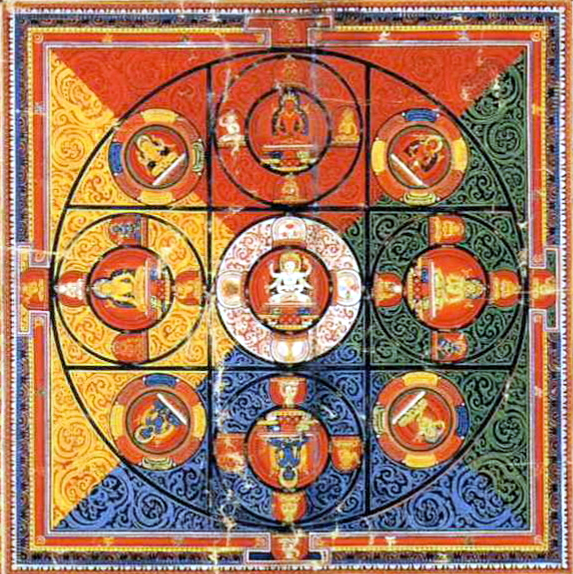
								- Note that in these images, as well as most of the images, Virocana & Amitabha (and other buddhas) are facing East, i.e. Amitabha buddha at the **West** is shown on **the top**.
						- [Akṣobhya](https://en.wikipedia.org/wiki/Akshobhya) buddha (Bất Động phật): east, water, blue, form, Ālaya-vijñāna → Mirror-like wisdom (Ādarśa-jñāna, Đại viên kính trí [大圓鏡智])
						- [Ratnasambhava](https://en.wikipedia.org/wiki/Ratnasambhava) buddha (Bảo Sanh phật): south, earth, yellow, sense, [Mānas](https://en.wikipedia.org/wiki/Manas-vijnana)-vijñāna → Equality widom (Samatā-jñāna, Bình đẳng tánh trí [平等性智])
						- [Amitābha](https://en.wikipedia.org/wiki/Amit%C4%81bha) buddha (Vô Lượng Quang phật, A-di-đà phật): west, fire, red, concept, mano-vijñāna → (Pratyavekṣaṇa-jñāna, Diệu quan sát trí [妙觀察智])
						- [Amoghasiddhi](https://en.wikipedia.org/wiki/Amoghasiddhi) buddha (Bất Không Thành Tựu phật): north, wind, green, act, five sensory awarenesses ({cakṣur,śrotra,ghrāṇa,jihvā,kāya}-vijñāna) → (Kṛty-anuṣṭhāna-jñāna, Thành sở tác trí [成所作智])
						- [Vairocana](https://en.wikipedia.org/wiki/Vairocana) buddha (Đại Nhật phật): center, space, white, aware, [Dharmadhātu](https://en.wikipedia.org/wiki/Dharmadhatu) → [Suchness](https://en.wikipedia.org/wiki/Suchness) wisdom (Tathātā-jñāna, Chân như trí [真如智], Dharmadhātu-svabhāva-jñāna, Pháp giới thể tánh trí [法界體性智])
						- References
							- [五智](https://buddhaspace.org/dict/fk/data/%25E4%25BA%2594%25E6%2599%25BA.html)
				- The κύκλος (cycle, circle) is the form; the κυβερνήτης ([cybernetics](https://en.wikipedia.org/wiki/Cybernetics), steersman) is the agent of that form.
				  id:: 67bbde62-70fc-4d3d-9f65-dcea280db516
				  collapsed:: true
					- Both are about circular motion & turning, and both have the first syllable transformed to "cy" with a very different pronunciation in English.
					- AI is the runaway child of Cybernetics, the child that fears the dangerous sea of his father, thus sails only in simulation.
					- From cybernetics to "cyber", the loop has collapsed into a straight wire:
						- from self-regulation to remote control;
						- from living feedback to mechanical command.
				- circular effect flow = circular causality = circular determinism = interdependency = interfusion = interpenetration = dependent origination
				  id:: 68f5a6d2-8148-4975-b3cb-799fe37a3d72
					- This circular dependency is shown by the spirorus which is the structure of spacetime.
				- ((667bf36a-581a-4abe-b544-2d849608a3e4)) is the characteristic of [cybernetics](https://en.wikipedia.org/wiki/Cybernetics).
			- ### change
			  id:: 667c008f-cd1f-4a6b-a9c8-d6efa1d8d342
			  collapsed:: true
			  “difference from itself” 
			  ((665359e4-4597-4775-b849-f9acbb98960a)) ((667bff0e-d45d-4d41-8683-51c3cf76c0bc))
				- self-effect
				  id:: 667bff0e-d45d-4d41-8683-51c3cf76c0bc
				  ((665c9af1-1ce2-461c-af33-671690618c8f)) ((667c008f-cd1f-4a6b-a9c8-d6efa1d8d342))
					- ((6651ecba-793d-43c5-8020-a9f260b032d8)) ((667bff0e-d45d-4d41-8683-51c3cf76c0bc)) is a [turn](https://en.wikipedia.org/wiki/Turn_(angle)) in the ((667bf36a-581a-4abe-b544-2d849608a3e4)).
				- ((6651ecba-793d-43c5-8020-a9f260b032d8)) ((667c008f-cd1f-4a6b-a9c8-d6efa1d8d342)) is the being's _difference from its_ ((667c015e-6223-4f8a-ae84-a93a49f4ff94)), hence a ((667bff0e-d45d-4d41-8683-51c3cf76c0bc)), as shown in the ((6858b355-fba9-4e61-9f16-bc993a3df44b)). In particular, the change of an object $O$ (in time, space, spacetime, or configuration space) from position $A$ to position $B$ is the difference between $O$ at $A$ and $O$ at $B$, i.e. $O_B - O_A$. The change of ((665ca429-84e3-49ff-921e-c07d19cd99ba)) is ((669a58b9-eb34-41cd-8605-02e29b07e1b5)).
				  id:: 684f9517-30d7-40e6-b93f-3386123e381c
				-
			- ### intentional cause
			  id:: 677e76ed-b324-4608-b146-90e8fcfa0c32
			  collapsed:: true
				- ((6651ecba-793d-43c5-8020-a9f260b032d8)) ((677e76ed-b324-4608-b146-90e8fcfa0c32)) is the ((66f93c78-15f5-43a7-8412-f7a5bc66e2ae)) of the ((94e87dc9-71af-477c-aa70-0f448c2f1e20)) of the ((667c0031-0a87-44c9-9e98-6d45893b095f)). As the first cause (source), it's the operator driving the effect flow, and as the final cause (sink), it's the observer qualifying the ((669a1bec-3347-4915-83e4-dcffc4d482d1)) of the effect circle.
					- Diagram
					  collapsed:: true
						- 
				- ((66725725-f76a-4328-b162-f469b87e871b))
					- Physics: Potential gradient: voltage, pressure, mass–energy curvature, chemical potential, temperature gradient
					- Error signal in control theory & cybernetics, prediction error in neuroscience
					- Uncertainty & information gap in Information theory & computation, [loss function](https://en.wikipedia.org/wiki/Loss_function) in [machine learning](https://en.wikipedia.org/wiki/Machine_learning)
					- Conflict in [dialectics](https://en.wikipedia.org/wiki/Dialectic) of [homeostasis](https://en.wikipedia.org/wiki/Homeostasis), personal growth, social and organizational evolution
				- ((665359ff-79f1-4669-b10b-f2b0e633a7c1))
					- The first cause is also the final cause – unified in the intentional cause
					  id:: 692d502f-b469-4b1d-9267-1d02e3953590
					  collapsed:: true
						- I don't use the term “final cause” like Aristotle because [the goal is the horizon](((67445223-9459-4aa9-b102-70c63943577b))):
							- 1) _in a single circle_, it's both the first (as the seed), and the last (as the purpose), and
							- 2) throughout the never ending cycle of effect, it will never be “final”.
						- At first, as a seed, the intent gives rise to the whole tree, i.e. ((66c810a0-9861-4787-bdcf-1378219332be)) of karma.
						- At last, the fruits are selected by the intent to satisfy the criteria of the purpose.
						- The statement that “the first cause is also the final cause” is similar to [Aquinas' 5th Way](https://en.wikipedia.org/wiki/Five_Ways_(Aquinas)#Fifth_way:_Argument_from_Final_Cause_or_Ends), but for the immanent God – the ((669dfc7d-5355-41db-93a1-8d590e8ec9d8)) – instead of a transcendent God.
						  id:: 692d69f0-ff24-4d71-a95c-2e27ebb28c7d
							- ((6667c99a-792f-4230-9fc6-c5fae874daef)) = Return to God (exitus–reditus) = ((c96a6d20-a0f6-48bd-9d70-9bc00b6b3c69))
					- ((677e76ed-b324-4608-b146-90e8fcfa0c32)) in ((667c0031-0a87-44c9-9e98-6d45893b095f)) – its fixaton & relaxation
					  id:: 69a502fe-1764-4e4d-85a4-ca0eff9c0754
					  collapsed:: true
						- The [first cause](((699c0362-eb81-42c5-843c-2559d2fe7b73))): gap, broken, error, missing, unknown, question, mismatch, problem, pain, suffering, failure, the “negativity” in general
						  id:: 69a502fe-ccb2-422d-a292-e4854e87fd90
						- The [final cause](((699c0362-f864-4879-9a07-204b96472cb0))): whole, form, the “positivity” in general
							- This is usually *fixed* which forms the **self-attachment**.
						- The clinging self: a fixed form of the whole, a permanent last cause
							- The fixation: by fixing the self-image, the obop creates a permanent & unchangable “hidden boss” controlling every action from behind, hence the term “subject”.
							- The nonfunctional: Due to that fixation, whenver there are conflicts unsolvable by the hidden boss, it exessively consumes resources to wrestle, occupying valuable free space with nonfunctional and even dysfunctional energy.
								- It usually foces the whole bodymind to wrestle in vain, creating destructive energy and actions, and only stops when all available resources are used up.
									- Its stop is forced by exhaustion, not voluntary.
								- This is illustrated by the “2nd arrow” in the Buddhist [“2 arrows” parable](https://suttacentral.net/sn36.6/en/sujato).
						- Selfless, liberated functional effect circle is driven by _**dynamic** intentional causes_ in unlimited dimensions (levels of abstraction).
							- The ((66600918-9f92-4730-b056-c2cd87a742aa)): There's always another higher dimension where it's free, vacant to escape the conflict by stepping out of the war zone.
							- The ((6653751a-a1b4-44b0-a81e-0a446eb8918c)): From that free stance, no self (fixation) is [controlling behind the eyes](((68a520bf-adba-4d78-9e3d-5f41de9f8153))), the obop is pure ((66e41e14-6c0c-41d7-9089-92916d47d7e0)), operating with ((669a3da2-1e6c-48bd-950f-af1ea1ceda25)).
							- The feedback: That equanimous obop makes _the intentional causes **change**_ by absorbing the conflicts of their effect circles.
							  id:: 69a50c8a-484e-45e0-bb2e-99b168f363e8
								- The unsolvable conflict is just a meta-error for the intent itself to change (refine).
								- The normal error (solvable problem) has both ways of effect:
									- Feedforward from intent to effect circle to solve it
									- Feedback from the effect flow to update intent's meta like probability.
					- ((677e76ed-b324-4608-b146-90e8fcfa0c32)) in knowledge circle = intent (know-why) = arrow returning to the root obop = qualifier = verifier = complement of the result/answer of the problem/question (know-where, know-what, formal cause)
					  id:: 68a7e246-8407-4e89-b393-912db172e4fe
					  collapsed:: true
					  :LOGBOOK:
					  CLOCK: [2025-08-17 Sun 20:22:03]
					  :END:
						- First cause: The problem/question is the gap in the circle, the absence of the result/answer.
						  id:: 699c0362-eb81-42c5-843c-2559d2fe7b73
							- This absence breaks the circle, leading to the urge to heal it, to make it complete by finding solution/answer.
						- View cone projects the process of resolution (quest, solving, working out, reasoning, proof, derivation, exploration, etc.), i.e. know-how (efficient cause), to the result/answer (know-where, know-what, formal cause).
						- Final cause: The verification/qualification of the solution/answer closes the effect circle.
						  id:: 699c0362-f864-4879-9a07-204b96472cb0
							- ((6667c99a-792f-4230-9fc6-c5fae874daef)): As long as there's still gaps, mismatch, imbalance, unknown, inequality, and so on, there's still motion – transition of effect circle – toward balance, the final target.
							- The “final cause” in [4 causes by Aristotle](https://en.wikipedia.org/wiki/Four_causes) corresponds to this half of the intentional cause.
						- ⇒ The intentional cause is “final” in the ((667bda02-8dc9-488e-ba16-ea75c3d7895c)), but “first” in the ((667bd93a-cce4-4dbf-9831-725e4dffe463)).
						- The external knowledge circle is the lowest circle in the tower of effect circles, under all active intents.
		-
	- ## view–control
	  id:: 66725144-6bc9-4c9f-ba48-2cef02651e52
	  collapsed:: true
	  ((665359e4-4597-4775-b849-f9acbb98960a)) ((66727388-ed2b-4f62-b8d7-ed70a0ad4ef3))
		- viewcontrol
		  id:: 66727388-ed2b-4f62-b8d7-ed70a0ad4ef3
		  ((665c9af1-1ce2-461c-af33-671690618c8f)) ((66725144-6bc9-4c9f-ba48-2cef02651e52))
		- ((6699eb54-ce9e-4472-a784-c59ffd47f02b)) ((66723642-58f1-4a74-bba3-0108f14c6bac)), ((66727858-979d-4d95-8a90-7a749218cfba))
		- ((6651ecba-793d-43c5-8020-a9f260b032d8)) ((66725144-6bc9-4c9f-ba48-2cef02651e52)) is the dual view of the ((667bef22-b272-4a7d-b613-3f1ed1a47329)) through any ((667cfa3e-9856-43f0-956b-ebb4ff31d8eb)) including both inward effect flow ( ((66723642-58f1-4a74-bba3-0108f14c6bac)), observation) and outward effect flow (control, operation, ((66727858-979d-4d95-8a90-7a749218cfba))). The subject of a ((66725144-6bc9-4c9f-ba48-2cef02651e52)) is called an ((669a2c12-1dad-42a0-ab31-f03642b4aa8a)).
		- ((665359ff-79f1-4669-b10b-f2b0e633a7c1))
			- force = ((67bc1f83-d9c4-4ee0-ac61-0de196425208)) 
			  id:: 67b5c77d-c42c-4dc5-8d47-fd82f535177a
			  collapsed:: true
			  ob = op
			  ⇒ F_{in} + F_{ex} = 0 
			  ⇔ my curvature + your curvature = 0 
			  ⇔ |my distortion| = |your distortion|
				- Uniform me vs distorted you <=> distorted me vs uniform you.
				  id:: 67b541d0-9e59-42ec-9199-9e9e114579e8
				  ```
				  M:[********|********]
				  W:[====|------------] F_ex = -->
				  <=>
				  M:[------------|====] F_in = <--
				  W:[********|********]
				  - F_ex = external force exerting on [M]y body
				  - F_in = internal force exerting on the [W]orld
				  + Both forces are to restore the balance
				  ```
				- A special case of this equation is the [equivalence principle](https://en.wikipedia.org/wiki/Equivalence_principle) in General Realativity.
		- ### cause–effect double cone
		  id:: 6851578b-9b1f-4367-878f-79b0b0b9be51
		  collapsed:: true
			- ((6651ecba-793d-43c5-8020-a9f260b032d8)) ((6851578b-9b1f-4367-878f-79b0b0b9be51)) is the ((667bef22-b272-4a7d-b613-3f1ed1a47329)) through an ((669a2c12-1dad-42a0-ab31-f03642b4aa8a)). Because both nappes extend infinitely out to the external world, two “ends” of the double cone is connected by the ((667cfac2-17f1-4cbd-9f6d-1e722ff2a870)) to form the ((6889a623-34cd-4b65-8a91-5cfdbb199b71)).
				- Structure: ((6672513b-c4b0-4c88-8b30-c60a3c6555a7)) > ((68df36a4-6a3e-4fc9-b44a-c8e92f62aee1)) > ((94e87dc9-71af-477c-aa70-0f448c2f1e20)) ⟨ ((66b1cfa4-01ef-4ee8-9409-32c9884c39cd)) > ((66c8772a-9b29-45b0-b169-2fa847333e02)) < ((66727858-979d-4d95-8a90-7a749218cfba)) ⟩ < ((6847e436-9a84-42c5-a853-75f6d626ed63)) < ((667bd93a-cce4-4dbf-9831-725e4dffe463))
				- Diagram
				  id:: 68514e8a-899e-4ae3-9164-44058cf139fa
					- {:height 459, :width 300}
			- perception–action double cone
			  id:: 685156b0-2f3b-4aa9-8b87-636d38a02cd2
				- ((6651ecba-793d-43c5-8020-a9f260b032d8)) ((685156b0-2f3b-4aa9-8b87-636d38a02cd2)) is the part of the ((6851578b-9b1f-4367-878f-79b0b0b9be51)) limited within the ((66c810a0-9861-4787-bdcf-1378219332be)) of the ((667cfa3e-9856-43f0-956b-ebb4ff31d8eb)), i.e. perception cone > obop < action cone. As both nappes intend infinitely into the internal world of the subject, the double cone has a complex structure: the double cone folds back on itself to be a single cone and is modularized into layers of ((68df2d82-e1d5-49c4-ac40-d45cf26f840c))s.
					- Note: Unlike the infinite cause–effect double cone, the perception–action double cone has finite bases, which are ((669a2886-9e03-41a4-a790-24bf6b7dcd96))s + ((66ea8d84-c766-4c47-b06c-a0b57a530096)) on the perception side, and ((6889abf7-7c3c-4ef5-80fe-3edca20268bd))s + knowledge cone base on the action side.
				- ((665359ff-79f1-4669-b10b-f2b0e633a7c1))
					- ((66b1cfa4-01ef-4ee8-9409-32c9884c39cd)) versus ((66727858-979d-4d95-8a90-7a749218cfba)) in karma
					  id:: 66e7d7dd-5f88-472c-8694-beb7222929bb
					  collapsed:: true
					  :LOGBOOK:
					  CLOCK: [2024-09-16 Mon 17:47:14]
					  :END:
						- The word “karma” originally meant “action”, but has been used [in Buddhism](https://en.wikipedia.org/wiki/Karma_in_Buddhism) mainly as ((66f93c78-15f5-43a7-8412-f7a5bc66e2ae)).
						  {{embed ((684f951b-9d1d-43aa-a533-c122c3113b5b))}}
							- cetanā: ý định, ý muốn, ý đồ, chủ ý, chủ định, chủ tâm, động cơ, "[Tư/思](https://giacnguyen.com/atydam/ghichu/cetasika/read.php?id=4)", "tư niệm" by Thích Minh Châu
							  id:: 66f7af1d-e9f3-49c4-a9f6-3b614a413a57
							  collapsed:: true
								- Read more
									- [manasikāra](https://en.wikipedia.org/wiki/Manasik%C4%81ra) (attention, tác ý, chú ý, chú tâm) is related to cetanā.
									- [Nghiệp & tự do ý chí](https://giacngo.vn/nghiep-tu-do-y-chi-post37265.html)
						- This narrowing down of “karma” from “action” to “intention” has twofold meaning.
							- Truthful meaning: _Intention **actively** creates **new** seeds_, whereas old seeds ripen in fruits to be received passively through not only experiences but also actions.
								- While action looks “active” (obviously!), it's only active externally.
								- Internally, action is generated automatically by the combination of
									- the conscious intention (cetanā, current new seed) and
									- the unconscious tendencies ([anusayā](((66e80666-5f29-4419-8db1-bf8cdce893e4))), old seeds) and
									- the external condition.
								- Deep inside, only the intention can be controlled actively by the subject, hence its role in the [ethic](((689eba59-b9e6-401b-9162-90d364911261))).
								- However, remember that we've [accumulated lots of old seeds](((68a29127-ae47-424a-8197-f34f77b7d7f9))) through past intentions in the past (lives) into our structure of body-mind, so that we can avoid the ((689ed6c2-2071-40c9-ac7d-64858153a391)).
							- Ethical meaning: *unintentional actions are innocent!*
							  id:: 689eba59-b9e6-401b-9162-90d364911261
								- The moral of the innocence of unintentional actions is reflected both in criminal law (lack of [mens rea](https://en.wikipedia.org/wiki/Mens_rea)), and in the Buddhist [story of Cakkhupāla Thera](https://www.wisdomlib.org/buddhism/book/dhammapada-illustrated/d/doc1084241.html) (Guardian of the Eye) which is the explanatory story for the first verse of [Dhammapada](https://suttacentral.net/dhp1-20/en/sujato).
								- Warning: Don't fall in to the ((689ed9d5-817a-4269-bd02-503f56e32e09)).
						- **Intent-Only Fallacy**
						  id:: 689ed6c2-2071-40c9-ac7d-64858153a391
						  “If I don't intend to do it, I won't face the consequences!”
						  ((665359e4-4597-4775-b849-f9acbb98960a)) ((689ed9d5-817a-4269-bd02-503f56e32e09))
							- ((6651ecba-793d-43c5-8020-a9f260b032d8)) Misunderstanding the depth of karmic storage, people usually conflate karma with current intentions, forgetting the past intentions in the [old karmas](((68a29127-ae47-424a-8197-f34f77b7d7f9))), leading to the ((689ed6c2-2071-40c9-ac7d-64858153a391)). This fallacy omits the laten tendencies ([anusayā](((66e80666-5f29-4419-8db1-bf8cdce893e4)))), which are the impression of the past intentions, from the karmic causes.
							- **Delusion of No-Malice Exemption**
							  id:: 689ed9d5-817a-4269-bd02-503f56e32e09
							  “Because i didn't mean to harm, i shouldn't be blamed!” 
							  ((665c9af1-1ce2-461c-af33-671690618c8f)) ((689ed6c2-2071-40c9-ac7d-64858153a391))
						- [Anusayā](((66e7e6c2-3856-496b-99b7-75ac46547c86))), the [dormant intent](((686ce608-1a1b-4b57-993a-fe8e943dc916))), the [underlying tendency](https://suttacentral.net/define/anusay%C4%81?lang=en), the **attitude** of the mind in response to stimuli, determines both intention and what karmic fruit to be experienced.
						  id:: 66e80666-5f29-4419-8db1-bf8cdce893e4
							- This anusayā·cetanā is the hidden obop at the apex of the ((68df2d82-e1d5-49c4-ac40-d45cf26f840c)), which is the central part of the karmic ((667c0031-0a87-44c9-9e98-6d45893b095f)).
								- > Give, and it will be given to you.
								  
								  -- Luke 6:38
							- The anusayā is accumulated and works in the unconscious, hence cannot be controlled directly. So, the only way to change karma (fruit) is via intention which is right in our consciousness.
								- We can indirectly change anusayā by the intention of cleansing it.
							- > It's not what happens to you, but how you react to it that matters.
							  
							  -- Epictetus
						- Suttas about ((66b1cfa4-01ef-4ee8-9409-32c9884c39cd)) ([anusayā]cetanā)
						  collapsed:: true
							- Numbered Discourses > 6. The Great Chapter > 63. [Penetrative](https://suttacentral.net/an6.63/en/thanissaro#5) > 5. Kamma
							  id:: 684f951b-9d1d-43aa-a533-c122c3113b5b
							  > Intention ([cetanā](https://en.wikipedia.org/wiki/Cetanā)), I tell you, is kamma. Intending, one does kamma by way of body, speech, and intellect.
								- This sutta explains the penetrative analysis of 6 factors of human life and correspondent way of liberation. There, the 5th factor is “karma” which is defined as “intention”.
							- Minor Discourses > Minor Collection > Sayings of the Dhamma (Dhammapada) > 1. [Pairs](https://suttacentral.net/dhp1-20/en/suddhaso)
							  > All things are preceded by the mind (mental karma),
							  surpassed by the mind, created by the mind.
								- The first 2 verses of the Dhammapada state the leading role of the mind over everything else.
								- The “mind (mano)” here [refers to its active aspect](https://suttacentral.net/dhp1-20/en/sujato), i.e. mental karma, which is itself preceded by intention (cetanā).
									- The central role of intention is also stressed by the associated [story of Cakkhupāla Thera](https://www.wisdomlib.org/buddhism/book/dhammapada-illustrated/d/doc1084241.html), given in the comentary Dhammapada-aṭṭhakathā.
							- Numbered Discourses > 21. The Body Born of Deeds > 10.217. [Intentional (Volitional)](https://suttacentral.net/an10.217/en/bodhi)
							  > Mendicants, I don't say that intentional deeds that have been performed and accumulated can be eliminated without being experienced (as results)... And I don't say that suffering can be ended without experiencing (the results of) intentional deeds that have been performed and accumulated.
								- This sutta explains the karmic chain from intentional seed to its fruits by examples.
							- Linked Discourses on the Six Sense Fields > The First Fifty > Impermanence > 35.146. [The Cessation of Deeds (Karmas)](https://suttacentral.net/sn35.146/en/sujato) (35.145. [Kamma Sutta](https://www.dhammatalks.org/suttas/SN/SN35_145.html))
							  id:: 68a29127-ae47-424a-8197-f34f77b7d7f9
							  #+BEGIN_QUOTE
							  And what is **old deeds** (karmas)? The eye/ear/nose/tongue/body/mind is old deeds. It should be seen as produced by choices and intentions, as something to be felt.
							  And what is **new deeds** (karmas)? The deeds you currently perform by way of body, speech, and mind.
							  #+END_QUOTE
								- This sutta clarifies the old karmas, which have been accumulated into the body-mind, versus the new karmas which are current actions with intention.
							- Numbered Discourses > 18. Intention > 4.171. [Intention](https://suttacentral.net/an4.171/en/sujato)
							  > + Mendicants, as long as there's a body, the intention that gives rise to bodily action causes pleasure and pain to arise in oneself. ... But these only apply when conditioned by ignorance.
							  > + By oneself one *makes the choice* that gives rise to bodily, verbal, and mental action, conditioned by which that pleasure and pain arise in oneself. ...
							  > + Ignorance is included in all these things. But when ignorance fades away > nothing for pleasure and pain to arise.
								- This sutta states that the karmic chain can be broken by clearing ignorance.
							- Linked Discourses > 4. Kaḷāra the Aristocrat > 12.38. [Intention (Volition)](https://suttacentral.net/sn12.38/en/sujato)
							  id:: 66e7e6c2-3856-496b-99b7-75ac46547c86
							  > + Mendicants, what you intend or plan, and what you have underlying tendencies toward, this becomes a support for the continuation of consciousness. ... > rebirth > death > suffering.
							  > + Mendicants, if you don't intend or plan, but still have underlying tendencies toward something, this becomes a support for the continuation of consciousness. ... > rebirth > death > suffering.
							  > + Mendicants, but if you don't intend or plan, and don't have underlying tendencies toward anything, this doesn't become a support for the continuation of consciousness. ... > no rebirth > no death > no suffering.
								- This sutta states that the karmic chain cannot be broken if “underlying tendencies” (obsessions, anusayā) remain, and it can only be broken when both intentions and underlying tendencies are eliminated.
								- Numbered Discourses > 2. Tendencies > 7.12. [Underlying Tendencies (anusayā)](https://suttacentral.net/an7.12/en/sujato)
								  > When a mendicant has given up the underlying tendencies of sensual desire, repulsion, views, doubt, conceit, desire to be reborn, and ignorance —cut them off at the root, made them like a palm stump, obliterated them, so they are unable to arise in the future— they're called a mendicant who has cut off craving, untied the fetters, and by rightly comprehending conceit has made an end of suffering.
								- These underlying tendencies are latent [kleśas](https://en.wikipedia.org/wiki/Kleshas_(Buddhism)), the most hidden ones.
									- Vitikamo-kilesa: *Ngoại phiền não, phiền não vi phạm*: các loại phiền não đã bộc lộ ra ngoài bằng thân hay khẩu, thành những hành động phạm giới. Phiền não loại nầy được chế ngự do sự hành trì giới luật.
									- Pariyutthana-kilesa: *Nội phiền não, phiền não ám ảnh*: các loại phiền não phát sanh trong tâm ngay lúc nhận biết cảnh, không biểu lộ ra ngoài, người nào có người đó biết, người khác không biết được, nhưng nếu với con mắt tinh tế cũng có thể biết được. Phiền não loại nầy được khắc phục do thiền định, dùng tâm thiền để chế ngự chúng.
									- __Anusaya-kilesa: *Tàng phiền não, phiền não ngủ ngầm*__: loại phiền não ngủ ngầm nơi tâm, không ai biết được do sự ô nhiễm nhiều đời, nhiều kiếp. Phiền não loại nầy được tiêu diệt bằng tuệ giác, nghĩa là trí tuệ phát sanh ở Đạo tâm siêu thế, khi chứng đắc các tầng thánh Tu Đà Hoàn, Tư Đà Hàm, A Na Hàm, A La Hán.
								- [KINH CETANA SUTTA: CHỚ DỰNG LẬP Ý NIỆM](https://thuvienhoasen.org/a24172/kinh-cetana-sutta-cho-dung-lap-y-niem)
						- Nuances about "intention"
						  collapsed:: true
						  :LOGBOOK:
						  CLOCK: [2024-09-17 Tue 19:51:07]
						  :END:
							- [The Heart's Intention](https://dharmawisdom.org/the-hearts-intention/)
							  > Setting intentions is not the same as making goals. Understanding the difference can lead to more skillful living and less suffering.
							  GOALS VS. INTENTIONS; Misusing Good Intentions; Mixing Motives; Sowing Karmic Seeds; Developing Resolve
							- [The Power of Intention: Turning Thoughts into Reality](https://www.livinginthegap.org/blog/the-power-of-intention-turning-thoughts-into-reality)
							- [THOUGHT OR INTENTION?](https://www.linkedin.com/pulse/thought-intention-christine-patton/)
							  > whenever there is any error or misdeed, the moment of its cause was with the intention... long before the action! If a person would bring correction to his life, he must look beyond the action to the moment when he first created the intention.
								- > There has been widespread confusion between thought and intention.
								  Scripture was teaching about the power of intent, and was mistranslated to read as ‘thought’ instead.
								- [Watch Your Thoughts...](https://quoteinvestigator.com/2013/01/10/watch-your-thoughts/) should be "Watch your intentions..."
						- ((66602f68-e23f-4b24-921e-b1a9fc0cc731)) ((66e97b7e-04be-4a0f-820f-2b2315a803a4))
						- ((66602f68-e23f-4b24-921e-b1a9fc0cc731)) fb post [Let's make an intensive intent!](https://www.facebook.com/lexuandinhct/posts/pfbid02bpWEDyTFoYZ9Vn223Nq56oMF9nkNnUsDcpJChva4v4kvSXWG6TZqc7YtG5APhvSDl)
						  :LOGBOOK:
						  CLOCK: [2024-09-20 Fri 19:48:46]
						  :END:
						- ((66602f68-e23f-4b24-921e-b1a9fc0cc731)) "intensive intent" + commitment -> vow (pranidhāna, a tool usually used in Mahayana)
							- [Intention is the practice](https://www.lionsroar.com/intention-is-the-practice/)
							  > On the Buddhist path, our intention deepens into commitment and then into vow. At that point, our intentions and our life become one.
			- intent double cone
			  id:: 68df2d82-e1d5-49c4-ac40-d45cf26f840c
				- ((6651ecba-793d-43c5-8020-a9f260b032d8)) ((68df2d82-e1d5-49c4-ac40-d45cf26f840c)) is the reflection of the ((685156b0-2f3b-4aa9-8b87-636d38a02cd2)) into the ((94e87dc9-71af-477c-aa70-0f448c2f1e20)), hence a structure of active ((66b1cfa4-01ef-4ee8-9409-32c9884c39cd))s, usually in the shape of a chain or a tree.
				- Two nappes:
					- While in everyday life and classical maths & programming, people normally focus on the **operative intent cone** of ((66f93c78-15f5-43a7-8412-f7a5bc66e2ae))s,
					- in ((669dfc9f-b5e2-448a-b6f4-be13c5bfbccb)), ((669dcdf8-a48c-40b1-bdb1-54a73fc5ae71)) mainly deals with the **formative intent cone** for observation and learning through the ((68df36a4-6a3e-4fc9-b44a-c8e92f62aee1)):
						- the ((66ea8e12-7c30-449b-9139-bfd8d82394d7)) of qualia, imaginals (mental images), and
						- the ((66ea8df3-d2f3-4856-b24a-5095dd285f9b)) of concepts, notions, intention.
				- ((665359ff-79f1-4669-b10b-f2b0e633a7c1))
					- ((68dfc246-ea07-4c54-a0a4-2361f1a9055e))
					- Logics: inductive logic in the formative intent cone ↔ deductive logic in the operative intent cone
					  :LOGBOOK:
					  CLOCK: [2025-11-04 Tue 14:23:12]
					  :END:
			- cause–effect mirror circles
			  id:: 6889a623-34cd-4b65-8a91-5cfdbb199b71
				- ((6651ecba-793d-43c5-8020-a9f260b032d8)) ((6889a623-34cd-4b65-8a91-5cfdbb199b71)), or simply “mirror circles”, are interlocking multiple ((667c0031-0a87-44c9-9e98-6d45893b095f))s formed by the folding of ((6851578b-9b1f-4367-878f-79b0b0b9be51)) into a [grand circle](((6772a6cd-771f-4f24-9c3a-39c442234be5))).
					- external effect circle
					  id:: 6909a3ff-8c16-4222-967a-f019759ca65c
					  The base of the effect cone folds back, through the external world, to be the base of the cause cone, forming the external effect circle.
					- knowledge circle
					  id:: 6909a541-f4da-48ce-af9e-31f499125b00
					  As the ((68df2d82-e1d5-49c4-ac40-d45cf26f840c)) reflects the ((685156b0-2f3b-4aa9-8b87-636d38a02cd2)) into the obop, the external effect circle is mirrored into the internal effect circle called “knowledge circle”.
					- The external effect circle and various knowledge circles keep contact together through layers of obops. This is the mirroring mechanism between the external world and internal world (knowledge cone).
					- Structure: external ((667cfac2-17f1-4cbd-9f6d-1e722ff2a870)) > ((667cfa3e-9856-43f0-956b-ebb4ff31d8eb))'s ((66c810a0-9861-4787-bdcf-1378219332be)) ( ((669a2886-9e03-41a4-a790-24bf6b7dcd96))s + formative intent cone > ((685156b0-2f3b-4aa9-8b87-636d38a02cd2)) > operative intent cone + ((6889abf7-7c3c-4ef5-80fe-3edca20268bd))s ) > external world
					- Diagram
					  collapsed:: true
						- 
				- ((665359ff-79f1-4669-b10b-f2b0e633a7c1))
					- The ((6909a541-f4da-48ce-af9e-31f499125b00)) is to ((6909a3ff-8c16-4222-967a-f019759ca65c)) as ((66b1cfa4-01ef-4ee8-9409-32c9884c39cd)) is to ((66b1cfa4-3a39-4672-9da2-cd3bcef71702)).
					  collapsed:: true
					  :LOGBOOK:
					  CLOCK: [2025-11-11 Tue 11:10:00]
					  CLOCK: [2025-11-11 Tue 11:10:08]--[2025-11-11 Tue 11:14:21] =>  00:04:13
					  :END:
						- The knowledge circle includes intent cones in the obop, while the effect circle includes the double cones extended from the obop to the body (perception–action) and to the world (cause–effect).
						- In dimensional view, the knowledge circle is othogonal to the effect circle.
							- Knowledge circle has the $i$ dimension of *internal, imginary, temporal*, in contrast to the effect circle's dimension $e$ of *external, real, spatial*.
		- Mutual exclusiveness
		  collapsed:: true
		  “thấy không làm, làm không thấy”  
		  “eyes no hands, hands no eyes”
			- “Seers don't do, doers don't see.”  
			  id:: 684f9517-1b11-4022-a2c3-0688975f198a
			  “Kẻ thấy thì không làm, kẻ làm thì không thấy.”
				- More pecisely, “doers cannot see what they do; seers cannot do what they see.”
					- That means this exclusiveness is in regard to the self only.
				- In the dualistic view of the ((667c015e-6223-4f8a-ae84-a93a49f4ff94)), its own seer and doer are exclusive ***by definition***, just like “the right is not wrong, the wrong is not right!”
					- In essence, the self is the separation between the inside (what belongs to the it) and the outside (what doen't belong to the it).
					- Based on the in/ex separation, the self separates things into all sort of duals: subject/object, do/see, right/wrong, good/bad, etc.
				- At the internal extreme, the seer's ((66c810a0-9861-4787-bdcf-1378219332be)) carries the the observation ((667c0031-0a87-44c9-9e98-6d45893b095f)) whose ((669a26cb-50d8-4347-a5c4-7c0c3acf1211)) is the ((669a2487-054d-4408-ae41-189e34af81a9)).
				  id:: 669a06b6-82cd-4e04-b5bf-ca60b89725d7
					- Here, the seer withdraws all its energy into the ((669a2487-054d-4408-ae41-189e34af81a9)), the inner circle, to observe, to modify its body (memory) in reflection of the external objects, hence leaving no energy for the doing of the body.
					- This is the "quantum effect of measurement".
				- At the external extreme, the ((667cfac2-17f1-4cbd-9f6d-1e722ff2a870)) of doers carries the the operation ((667c0031-0a87-44c9-9e98-6d45893b095f)) whose each ((669a26cb-50d8-4347-a5c4-7c0c3acf1211)) is the ((66c810a0-9861-4787-bdcf-1378219332be)) of each doer.
				  id:: 669a0848-a7a2-402f-b704-68cea407e43d
					- Here, the doer exerts all its power to the working of the body (hands) to rotate the external circle to change the external world, hence leaving no energy for the ((669a2487-054d-4408-ae41-189e34af81a9)).
					- This is the mechanical extreme.
			- “Eyes are useless without hands, hands are blind without eyes.”
			  “Thấy mà không làm là vô dụng, làm mà không thấy là mù quáng.”
				- This criticizes the weakness of the dualistic view and guides toward the holistic view of ((6699e3b1-754c-4665-b7aa-12cbc833a8d0)) and the ((6699f85b-fe03-4fb6-8b80-915e376954ff)).
		- Mutual inclusiveness
		  id:: 6699e3b1-754c-4665-b7aa-12cbc833a8d0
		  collapsed:: true
			- ((66c811a9-e8c7-42c5-bdc9-25fbd023f93a))ing is an ((66727858-979d-4d95-8a90-7a749218cfba)) of the ((669a2487-054d-4408-ae41-189e34af81a9)) itself.
			- Every ((6672785f-ac9e-42ba-921e-0264d0d83ae2)), i.e. change of ((665ca429-84e3-49ff-921e-c07d19cd99ba)) (transform), is a change of ((66723642-58f1-4a74-bba3-0108f14c6bac)) via the change of ((667272b8-88a8-4928-a22a-35035c9edf05)).
				- ((67a98760-71fa-4033-9c42-f3025d632d04)) = traversal = listing = enumeration = moving the ((667272b8-88a8-4928-a22a-35035c9edf05)) across the object to view it in a linear view, i.e. thread-view.
				  id:: 6783e3ff-9e8f-43db-a173-5d0c6972deab
				- Finding = traversal for a target point-view.
				- Search = traversal for a target ((667251ec-d4f7-4c09-adff-73e04a4b22ed)).
				- Sort = change from object-view to thread-view.
				- Organize = change from object-view to target ((667251ec-d4f7-4c09-adff-73e04a4b22ed)).
				- Classification, categorization = change from object-view to class/property/category view.
		- Harmony of ((66c811a9-e8c7-42c5-bdc9-25fbd023f93a))ing and ((66c845fe-6e8e-412e-902e-34ae8d728f90))ing
		  id:: 6699f85b-fe03-4fb6-8b80-915e376954ff
		  collapsed:: true
			- All ((66727858-979d-4d95-8a90-7a749218cfba))s are guided and constrained by the ascociated ((66723642-58f1-4a74-bba3-0108f14c6bac))s, thus the view is to action as the ((665ca429-84e3-49ff-921e-c07d19cd99ba)) is to ((6678288e-699b-4325-bdba-bf6349fe0d57)).
			  :LOGBOOK:
			  CLOCK: [2024-07-19 Fri 15:50:42]
			  :END:
			- Each ((66727858-979d-4d95-8a90-7a749218cfba)) arrow toward an ((667cfa42-ade7-4310-9a7b-6d14d01c16da)) has a corresponding ((6653769c-3334-46fa-a1d5-4ce6a7fc23e8)) arrow backward from that object.
			  :LOGBOOK:
			  CLOCK: [2024-08-23 Fri 16:14:01]
			  :END:
			- ((66b1cfa4-ec86-433e-b5ea-c52c991717c1))
	- ## observer–operator
	  id:: 669a2c12-1dad-42a0-ab31-f03642b4aa8a
	  collapsed:: true
	  ((665359e4-4597-4775-b849-f9acbb98960a)) ((94e87dc9-71af-477c-aa70-0f448c2f1e20)), ((66f3b94d-6cf8-461a-9312-c9973ac739fe)), ((66f3ba0f-ec07-42f2-8ab1-fef0ec30b57d)), ((5d7a0798-907d-46b7-8481-99d3be30de9e)), ((fa0b2bc6-05ac-418f-9a86-17635936a656))
	  ((6699eb54-ce9e-4472-a784-c59ffd47f02b)) ((669a2487-054d-4408-ae41-189e34af81a9)), ((669a26cb-50d8-4347-a5c4-7c0c3acf1211))
		- obop
		  id:: 94e87dc9-71af-477c-aa70-0f448c2f1e20
		  ((665c9af1-1ce2-461c-af33-671690618c8f)) ((669a2c12-1dad-42a0-ab31-f03642b4aa8a))
		  ((6699eb54-ce9e-4472-a784-c59ffd47f02b)) ((669a2487-054d-4408-ae41-189e34af81a9)), ((669a26cb-50d8-4347-a5c4-7c0c3acf1211))
			- ((66f3c28a-a18f-4cca-90d6-c086ac7fccdf)) “obop” is pronounced “ob-OP” /əbˈɒp/, like that of “obovate”, _not_ “O-bop” /ˈoʊ.bɒp/. When pronouncing in an unhyphenated style, it may sound /əˈbɒp/, but _never_ /ˈoʊ.bɒp/.
		- ☉
		  id:: 66f3b94d-6cf8-461a-9312-c9973ac739fe
		  collapsed:: true
		  ((665359e4-4597-4775-b849-f9acbb98960a)) ((66f3c5f6-0a79-4730-8eca-4d177c83c560)) 
		  ((665c9af1-1ce2-461c-af33-671690618c8f)) ((669a2c12-1dad-42a0-ab31-f03642b4aa8a))
			- abstract obop
			  id:: 66f3c5f6-0a79-4730-8eca-4d177c83c560
			  ((665c9af1-1ce2-461c-af33-671690618c8f)) ((66f3b94d-6cf8-461a-9312-c9973ac739fe))
		- ◉
		  id:: 66f3ba0f-ec07-42f2-8ab1-fef0ec30b57d
		  collapsed:: true
		  ((665359e4-4597-4775-b849-f9acbb98960a)) ((66f3c62a-42f5-47bd-a18a-b40783bc1a05)), ((66f3c6a9-1486-46de-92fe-75aaeaf67834))
		  ((665c9af1-1ce2-461c-af33-671690618c8f)) ((669a2c12-1dad-42a0-ab31-f03642b4aa8a))
			- concrete obop
			  id:: 66f3c62a-42f5-47bd-a18a-b40783bc1a05
			  ((665c9af1-1ce2-461c-af33-671690618c8f)) ((66f3ba0f-ec07-42f2-8ab1-fef0ec30b57d))
			- obop being
			  id:: 66f3c6a9-1486-46de-92fe-75aaeaf67834
			  ((665c9af1-1ce2-461c-af33-671690618c8f)) ((66f3ba0f-ec07-42f2-8ab1-fef0ec30b57d))
			- ((6651ecba-793d-43c5-8020-a9f260b032d8)) ((66f3c6a9-1486-46de-92fe-75aaeaf67834)) is an instance of the ((669dfc7d-5355-41db-93a1-8d590e8ec9d8)) in the role of an ((66f3d5cc-0d68-47bb-b09a-87cda33c7354)).
		- seer–doer
		  id:: 5d7a0798-907d-46b7-8481-99d3be30de9e
		  ((665c9af1-1ce2-461c-af33-671690618c8f)) ((669a2c12-1dad-42a0-ab31-f03642b4aa8a))
		- viewer–actor
		  id:: fa0b2bc6-05ac-418f-9a86-17635936a656
		  ((665c9af1-1ce2-461c-af33-671690618c8f)) ((669a2c12-1dad-42a0-ab31-f03642b4aa8a))
		- ((6651ecba-793d-43c5-8020-a9f260b032d8)) ((669a2c12-1dad-42a0-ab31-f03642b4aa8a)) is the dual role of any ((667cfa3e-9856-43f0-956b-ebb4ff31d8eb)) performing the ((66725144-6bc9-4c9f-ba48-2cef02651e52)). In ((66537a44-f579-4fcc-a02b-2f32d0d409fc)), obop is represented by the Equal which operates the Trinion using the ((66b1cfa4-e22c-4424-bf19-a6ce4649da77)) equation. The atomic ((66f3c6a9-1486-46de-92fe-75aaeaf67834)) is called “qualiton” which will be annihilated at the ((66ab7477-c060-4d07-ab13-bc3d11246854)) of the ((667c015e-6223-4f8a-ae84-a93a49f4ff94)) to be a “selfless obop” called “self-essence”. That means ((669dfc7d-5355-41db-93a1-8d590e8ec9d8)) ⤚[((66f3d5cc-0d68-47bb-b09a-87cda33c7354))]→ ((94e87dc9-71af-477c-aa70-0f448c2f1e20)) ⤚[((66f3c97f-94e8-4783-96c5-fe9cadf4f9a9))]→ ((671e0fcc-37b6-4f03-8e87-8923422ca8e0)) ⤚[((66ab7477-c060-4d07-ab13-bc3d11246854))]→ ((66c8772a-9b29-45b0-b169-2fa847333e02)). ((6867abcb-4e1c-493e-a38d-c7b8809dd6ad))
		- Symbols of the ((94e87dc9-71af-477c-aa70-0f448c2f1e20))
		  id:: 66faa5f9-a3dd-4065-8167-0e49a79e427a
		  collapsed:: true
		  There are many symbols representing many roles of the obop.
			- In ((669dfc7d-5355-41db-93a1-8d590e8ec9d8)), the Equal sign (`=`) is used to emphasize the ((669a1d82-91c8-40fd-81f5-e8ffe56e9e9c)) and unification roles of the obop.
			- In ((66f3b5e5-496a-4545-be7a-b1df2d94bd11)) , the composition symbols ((66f3b94d-6cf8-461a-9312-c9973ac739fe)) & ((66f3ba0f-ec07-42f2-8ab1-fef0ec30b57d)) are used to show the dualities of the obop as both observer (○) and operator (·), composed of both form (○) and content (●), including both intent (·) and extent (○).
				- The intent in the ((66f3c5f6-0a79-4730-8eca-4d177c83c560)) (☉) is abstracted into a dimensionless point representing the “point of contact” between the subject and the object, as well as the ((66ab7477-c060-4d07-ab13-bc3d11246854)) point of the ((667cfa3e-9856-43f0-956b-ebb4ff31d8eb)).
				- The intent in the ((66f3c62a-42f5-47bd-a18a-b40783bc1a05)) (◉) is a concrete being with all of its internal content represented by the filled circle (●).
			- In maths, the [dot operator (⋅)](https://en.wikipedia.org/wiki/Dot_product) and the [circled dot operator (⊙)](https://en.wikipedia.org/wiki/Hadamard_product_(matrices)) are used to denote the [operation](https://en.wikipedia.org/wiki/Operation_(mathematics)) role of the obop.
			- In theory of functions and in linguistics, the [composition operator (∘)](https://en.wikipedia.org/wiki/Function_composition), the [interpunct (·)](https://en.wikipedia.org/wiki/Interpunct) and the [hypenation point (‧)](https://en.wikipedia.org/wiki/Hyphen) are used to denote the dual role of connection-separation of the obop.
			- In astrology, the [symbol of Sun (☉)](https://en.wikipedia.org/wiki/Solar_symbol) shows the role of the obop as a source of light.
			- In computing, the [fisheye symbol (◉)](https://en.wikipedia.org/wiki/Circled_dot#Computing) shows the role of the obop as an eye, a focal point, a selected choice, the current one.
			- In archery, the target symbol (🞋, 🎯) shows the role of the obop as the target, the goal of all actions of the subject expressed as its intents. The ((686e630e-0d4d-4584-8c77-f9f0b865e631)) of the [bullseye](https://en.wikipedia.org/wiki/Bullseye_(target)) (◎) represents multiple layers of intents within the obop, whose inner most intent (center) is pinpointed with the [crosshair](https://en.wikipedia.org/wiki/Reticle) (⌖).
		- ### obop projection
		  id:: 68908fbd-acc3-41a6-8c38-17ee1f014223
			- ((6651ecba-793d-43c5-8020-a9f260b032d8)) The obop of a body $M$ in the world $W$ is a double ((667251ec-d4f7-4c09-adff-73e04a4b22ed)) between 2 circles $M$ & $W$. Its double ((670ce218-a01f-4609-b7f2-beda7cf2ebc3)) is called ((68908fbd-acc3-41a6-8c38-17ee1f014223)) with two directions:
				- observer is the viewcone projecting $W$ to an image in the body $M$;
					- $\overrightarrow{M_2M_1} ← \overrightarrow{M_2W_1W_2M_1}$
				- operator is the viewcone projecting $M$ to an effect in the world $W$.
					- $\overrightarrow{W_2M_1M_2W_1} → \overrightarrow{W_2W_1}$
				- 
				- The obop yields an inner product $⟨M,W⟩$ whose angle is 
				  $$θ = cos^{-1}\left({⟨M,W⟩\over |M|⋅|W|}\right) = \frac{M_2M_1}{M_2W_1W_2M_1} = \frac{W_2W_1}{W_2M_1M_2W_1}$$
				-
		- ((665359ff-79f1-4669-b10b-f2b0e633a7c1))
			- In the ((66b1cfa4-e22c-4424-bf19-a6ce4649da77)) model of ((94e87dc9-71af-477c-aa70-0f448c2f1e20)), the core of obop is the ((66b1cfa4-01ef-4ee8-9409-32c9884c39cd)) that observes the content to produce the extent which is used to operate the ((66c810a0-9861-4787-bdcf-1378219332be)). The intent can be composed of many sub-itents in many layers, where the “atomic intent” at the basic layer is the ((671e0fcc-37b6-4f03-8e87-8923422ca8e0)).
			  id:: 66e79e0c-8be2-49a4-b4d7-5c1fddefeabf
			  collapsed:: true
			  :LOGBOOK:
			  CLOCK: [2024-09-16 Mon 18:54:11]
			  :END:
				- At the "operator" side of the obop, the extent is the (mental) ((66727858-979d-4d95-8a90-7a749218cfba)) ([saṅkhāra](https://en.wikipedia.org/wiki/Sa%E1%B9%85kh%C4%81ra)) and its intent is the master of that action, i.e. the volition or [cetanā](https://en.wikipedia.org/wiki/Cetan%C4%81) in Buddhism.
				- ((66e7d7dd-5f88-472c-8694-beb7222929bb))
				- At the "observer" side of the obop, the intent itself is the ((6672513b-c4b0-4c88-8b30-c60a3c6555a7)) which is driven by the underlying tendency, or attitude, or [anusayā](((66e7e6c2-3856-496b-99b7-75ac46547c86))) in Buddhism.
			- ((66f29d57-a87f-4370-9f32-722922a7bff1))
			- ((684f9515-8f95-4004-8aa8-04a10d1ebf11))
			- Obop model in various fields
			  id:: 694a8194-3a16-4d52-9d60-d88aeaf125b5
			  collapsed:: true
				- Unithread: ob viewcone = input circle; op = output arrow
					- FoC: ob = division = content -> form; op = multiplication = form -> content
						- In function: form = parameter; content = variable value
						- Network: form = connection weight; content = node values (state)
						- Uninet: no static distinction between form & content. Their roles are relative to position.
							- In the sequence of sustents, lower intent = higher content
					- Quantum: only when the whole input circle receives full data, is the op activated to [take action](((6847e7fa-0d57-425c-b035-1a62db7725e6))).
					- Qualiton: The whole input circle is qualified by matching with its internal image.
				- [Water scoop](((699c0362-1cb5-483f-ac28-dddd26c54fb1))): ob viewcone = scoop; op = pounding
				  id:: 699c0362-08e9-4df1-bce1-ec5da386c35e
				- $f(t) = \exp(t)$: ob viewcone = $f(t) dt$; op = `+=`
				- Neuron: ob viewcone = tree of dendrites; op = activation (action potential passed through axon)
		-
	- ## body
	  id:: 66c810a0-9861-4787-bdcf-1378219332be
	  collapsed:: true
	  :LOGBOOK:
	  CLOCK: [2024-08-23 Fri 11:31:32]
	  :END:
		- ((6651ecba-793d-43c5-8020-a9f260b032d8)) ((66c810a0-9861-4787-bdcf-1378219332be)) is the thing that is ((66c811a9-e8c7-42c5-bdc9-25fbd023f93a))n by the ((667cfa3e-9856-43f0-956b-ebb4ff31d8eb)) when it looks at itself. Basically, body of a subject is just an ((66537674-6cf9-4459-8bea-7c1858c694a3)) of that subject where the ability to see is abstracted. In modern science, body means the matter, the material/physical part of the subject, but in ((669dfc9f-b5e2-448a-b6f4-be13c5bfbccb)), body also includes all information of the subject, e.g. [body of knowledge](https://en.wikipedia.org/wiki/Body_of_knowledge), [text corpus](https://en.wikipedia.org/wiki/Text_corpus).
	- ## form
	  id:: 665ca429-84e3-49ff-921e-c07d19cd99ba
	  collapsed:: true
	  ((665359e4-4597-4775-b849-f9acbb98960a)) ((66f4ec9a-6a38-4b02-bd52-5bf031eaf6fa))
	  ((6699ea73-dc77-4227-a293-b501f2eb1759)) ((6678288e-699b-4325-bdba-bf6349fe0d57))
	  ((66c80da9-4cfb-4de7-b83d-8b70665207bf)) ((67330c03-4e27-414f-bdc5-e5e7e0bed6bd))
		- ((665ca480-5ac8-4728-a331-2f68b48759d1)) ((665ca47c-476a-4bef-b982-d9a31a669fb1))
		- hình thức
		  id:: 66f4ec9a-6a38-4b02-bd52-5bf031eaf6fa
		  ((665c9af1-1ce2-461c-af33-671690618c8f)) ((665ca429-84e3-49ff-921e-c07d19cd99ba))
			- hình thức = ngoại hình [((66ab6161-0306-42d5-ac16-4155c69216f5))] + nội thức [((6678d596-9526-405a-968c-e73860e524f3))]
		- ((6651ecba-793d-43c5-8020-a9f260b032d8)) The ((665ca429-84e3-49ff-921e-c07d19cd99ba)) of an ((667cfa42-ade7-4310-9a7b-6d14d01c16da)) is the image of that object in a ((66723642-58f1-4a74-bba3-0108f14c6bac)) of some ((667cfa3e-9856-43f0-956b-ebb4ff31d8eb)). The external form is called ((66ab6161-0306-42d5-ac16-4155c69216f5)) or ((66ab6170-ea0d-4bd7-be7a-2e226a7ea7ee)), and the internal form is called ((6678d596-9526-405a-968c-e73860e524f3)) or ((66ab6059-7a9d-4419-99be-69c9944a543f)) of the object. Beside the obvious external form, the "internal form" is "seen" by the subject via generalization, ((66537674-6cf9-4459-8bea-7c1858c694a3)), analysis and reconstruction, i.e. not by the external eyes but by the mind's eye.
			- Britannica: [form (philosophy)](https://www.britannica.com/topic/form-philosophy)
		- ((66725725-f76a-4328-b162-f469b87e871b)) [Buddhist form](https://en.wikipedia.org/wiki/Rūpa) in the pair "name & form", [logical form](https://en.wikipedia.org/wiki/Logical_form), Plato's [ideal form](https://en.wikipedia.org/wiki/Theory_of_forms), Aristotelian [substantial form](https://en.wikipedia.org/wiki/Substantial_form), Marx' [form of value](https://en.wikipedia.org/wiki/Value-form), etc.
		  id:: 669a58b9-b3d0-4cec-abaa-55b6260d914c
		- types of forms
		  id:: 66f6682b-744a-49b8-8e11-8e020fc24acc
		  collapsed:: true
		  :LOGBOOK:
		  CLOCK: [2024-09-27 Fri 15:09:57]--[2024-10-14 Mon 20:55:19] =>  413:45:22
		  :END:
		  → [types of contents](((684f9517-cd97-4d6a-87f3-89ef73c78f0a)))
			- Diagram
				- 
				  :LOGBOOK:
				  CLOCK: [2024-10-17 Thu 19:42:39]
				  CLOCK: [2024-10-17 Thu 19:42:44]--[2024-10-17 Thu 20:49:03] =>  01:06:19
				  :END:
			- external form
			  id:: 670d0138-8f58-428b-808e-24c05a5239fb
			  collapsed:: true
			  ((665359e4-4597-4775-b849-f9acbb98960a)) ((670e18b8-b845-464f-9d93-4172ca3ce6e2)), ((66ab6161-0306-42d5-ac16-4155c69216f5))
			  ((6699ea73-dc77-4227-a293-b501f2eb1759)) ((670d0138-9012-4f3e-a9bd-997443fb22a3))
				- ex-form
				  id:: 670e18b8-b845-464f-9d93-4172ca3ce6e2
				  ((665c9af1-1ce2-461c-af33-671690618c8f)) ((670d0138-8f58-428b-808e-24c05a5239fb))
				- ((6651ecba-793d-43c5-8020-a9f260b032d8)) An ((670d0138-8f58-428b-808e-24c05a5239fb)), or an appearance of an object is the form seen by a subject from the outside of that object. _Different external subjects see **different appearances**_, thus interact with the object differently through different [interface](((670d0183-aba2-438b-b749-1b550e4a906b)))s. Within a world, each object has a ((670dd13a-21f3-44dd-9982-c1e129d518b2)) which is seen via the light of that world, hence common to all subjects in that world.
				- public appearance
				  id:: 670dd13a-21f3-44dd-9982-c1e129d518b2
					- ((6651ecba-793d-43c5-8020-a9f260b032d8)) ((670dd13a-21f3-44dd-9982-c1e129d518b2)) is the superficial form seen via the light of the world where this object exists. This is the normal meaning of the word "appearance" and is usually much shallower than the ((670d0183-aba2-438b-b749-1b550e4a906b))s seen by individual subjects.
				- inter-form
				  id:: 670d0183-aba2-438b-b749-1b550e4a906b
				  ((665359e4-4597-4775-b849-f9acbb98960a)) ((670e0fef-2a46-450b-b043-176cccfc804a))
					- ((665359ff-79f1-4669-b10b-f2b0e633a7c1)) An ((670d0183-aba2-438b-b749-1b550e4a906b)) of an object is the form that appears to a subject such that it can interact with the object. An inter-form can be seen as a deep and focused ex-form, esp. compared to the shallow and wide ((670dd13a-21f3-44dd-9982-c1e129d518b2)).
			- internal form
			  id:: 670d0138-9012-4f3e-a9bd-997443fb22a3
			  collapsed:: true
			  ((665359e4-4597-4775-b849-f9acbb98960a)) ((670e16ab-7b17-4127-8d4d-92516697d27e)), ((670d0160-ee4c-4b5f-b95f-80b0c2f3825f)), ((6678d596-9526-405a-968c-e73860e524f3)), ((670e1047-529a-4698-9ad0-5e6c73c18202))
			  ((6699ea73-dc77-4227-a293-b501f2eb1759)) ((670d0138-8f58-428b-808e-24c05a5239fb))
				- in-from
				  id:: 670e16ab-7b17-4127-8d4d-92516697d27e
				  collapsed:: true
				  ((665c9af1-1ce2-461c-af33-671690618c8f)) ((670d0138-9012-4f3e-a9bd-997443fb22a3))
					- Etymology of the word "inform":
						- in-form = put someone into (specific) form = train, teach, instruct => give knowledge => give information
						- Original "information" = outline, concept, idea (specific kinds of knowledge) => reduced to mere news-like information
				- ((6651ecba-793d-43c5-8020-a9f260b032d8)) The ((670d0138-9012-4f3e-a9bd-997443fb22a3)) of a subject is what the ((94e87dc9-71af-477c-aa70-0f448c2f1e20)) of that subject sees about its internal structure. Including the obop itself, that structure is a ((670d0160-ee4c-4b5f-b95f-80b0c2f3825f)) comprising both the [skeletal structure](((670d015b-cd7e-47fc-94aa-1caf98daef0e))) and the [interaction structure](((670d01e7-9f1c-4f50-8b74-d6a51d33f719))) for interaction with its components. The the obop of this form always has a tendency to return its form to the ((670e14c0-70c6-49ff-9bde-89db60b610c2)). When a subject has many obops, each one sees a (slightly) different internal form, where the closed forms of other obops and of component groups are abstracted into components interacting with this obop.
				- ((665359ff-79f1-4669-b10b-f2b0e633a7c1))
					- ((670d0138-9012-4f3e-a9bd-997443fb22a3)) = ((670d0160-ee4c-4b5f-b95f-80b0c2f3825f)) = ((6678d596-9526-405a-968c-e73860e524f3)) = ((670e1047-529a-4698-9ad0-5e6c73c18202))
					  id:: 684f9517-6d79-45da-8a3a-e0b6b1a67d94
						- Being “internal”, this form is sealed from the external effects, making it “closed”. Being closed in a circle, this form is stablized to be a “structure” and an independent “substance”.
						- Even though equivalent, each name connotes a different aspect of meaning.
							- “internal form” is to be dual with “external form”: in-form <> ex-form.
							- “closed form” is to show the ((667d15c6-67c4-4998-a549-c8b3f9de3d60)) structure of this form and its two components: c-form = s-form + i-form.
							- “stucture” & “substance” are to stress the stability and substantiality of this form, hence “substantial form”, in contrast with the insubstantiality and instability of the ((66ab6161-0306-42d5-ac16-4155c69216f5)) (“accidental form”).
				- closed form
				  id:: 670d0160-ee4c-4b5f-b95f-80b0c2f3825f
				  collapsed:: true
				  ((665359e4-4597-4775-b849-f9acbb98960a)) ((670e1227-a0b3-474f-bcc3-8bacdefac269)), ((670e1047-529a-4698-9ad0-5e6c73c18202)) 
				  [c /siː/ = s + i]: c-form = ((670e1285-9b00-427b-99f0-98c724677608)) + ((670e12c8-98eb-4293-b1cc-403c8210208f)) = ((670e1047-529a-4698-9ad0-5e6c73c18202))
				  ((6699eb54-ce9e-4472-a784-c59ffd47f02b)) ((670d015b-cd7e-47fc-94aa-1caf98daef0e)), ((670d01e7-9f1c-4f50-8b74-d6a51d33f719))
					- ((6651ecba-793d-43c5-8020-a9f260b032d8)) ((670d0160-ee4c-4b5f-b95f-80b0c2f3825f)) is a ((66ab6761-b62d-486b-bd15-44a4ecee8a99)) of content which is composed of two complements: the ((670d015b-cd7e-47fc-94aa-1caf98daef0e)) and the ((670d01e7-9f1c-4f50-8b74-d6a51d33f719)) for interaction with its components. Thanks to this ((667d15c6-67c4-4998-a549-c8b3f9de3d60)) structure, this form is stable, hence a ((670e1047-529a-4698-9ad0-5e6c73c18202)).
					- c-form
					  id:: 670e1227-a0b3-474f-bcc3-8bacdefac269
					  ((665c9af1-1ce2-461c-af33-671690618c8f)) ((670d0160-ee4c-4b5f-b95f-80b0c2f3825f))
						- “c” stands for “closed”, “complete”, “circle”.
					- skeletal form
					  id:: 670d015b-cd7e-47fc-94aa-1caf98daef0e
					  ((665359e4-4597-4775-b849-f9acbb98960a)) ((670e1285-9b00-427b-99f0-98c724677608))
					  ((6699ea73-dc77-4227-a293-b501f2eb1759)) ((670d01e7-9f1c-4f50-8b74-d6a51d33f719))
					  ((6699e5f2-7788-46c7-8233-87699a65ca30)) ((670d0160-ee4c-4b5f-b95f-80b0c2f3825f))
						- s-form
						  id:: 670e1285-9b00-427b-99f0-98c724677608
						  ((665c9af1-1ce2-461c-af33-671690618c8f)) ((670d015b-cd7e-47fc-94aa-1caf98daef0e))
							- “s” stands for “skeletal”, “structural”.
						- ((6651ecba-793d-43c5-8020-a9f260b032d8)) ((670d015b-cd7e-47fc-94aa-1caf98daef0e)) is the skeletal structure which the obop uses to operate its body. This skeleton is crystallized from experience about mutual ((670d0183-aba2-438b-b749-1b550e4a906b))s between its components.
						- ((665359ff-79f1-4669-b10b-f2b0e633a7c1))
							- Normally, when talking about “internal form”, people usually think of this ((670d015b-cd7e-47fc-94aa-1caf98daef0e)) instead of the whole ((670d0160-ee4c-4b5f-b95f-80b0c2f3825f)).
					- interaction form
					  id:: 670d01e7-9f1c-4f50-8b74-d6a51d33f719
					  ((665359e4-4597-4775-b849-f9acbb98960a)) ((670e12c8-98eb-4293-b1cc-403c8210208f))
					  ((6699ea73-dc77-4227-a293-b501f2eb1759)) ((670d015b-cd7e-47fc-94aa-1caf98daef0e))
					  ((6699e5f2-7788-46c7-8233-87699a65ca30)) ((670d0160-ee4c-4b5f-b95f-80b0c2f3825f))
						- i-form
						  id:: 670e12c8-98eb-4293-b1cc-403c8210208f
						  ((665c9af1-1ce2-461c-af33-671690618c8f)) ((670d01e7-9f1c-4f50-8b74-d6a51d33f719))
							- “i” stands for “interaction”, “intent”
						- ((6651ecba-793d-43c5-8020-a9f260b032d8)) ((670d01e7-9f1c-4f50-8b74-d6a51d33f719)) of a composite is the interaction structure including those ((670d0183-aba2-438b-b749-1b550e4a906b))s of its components for interaction between the obop and components, as well as the ((670f2f5f-ec97-4287-a711-1988ca03a262)) of this composite to interact with the external world.
				- round form
				  id:: 670e14c0-70c6-49ff-9bde-89db60b610c2
				  ((665359e4-4597-4775-b849-f9acbb98960a)) ((670e14da-ff8d-4ca3-8d19-d2daec1fa296)), ((670e105b-5244-4f95-9f90-c99acdbce0e4))
				  per-form = round ((670e1227-a0b3-474f-bcc3-8bacdefac269)) = ((670e105b-5244-4f95-9f90-c99acdbce0e4))
					- per-form
					  id:: 670e14da-ff8d-4ca3-8d19-d2daec1fa296
					  ((665c9af1-1ce2-461c-af33-671690618c8f)) ((670e14c0-70c6-49ff-9bde-89db60b610c2))
						- Etymology of the word "perform": "per" = complete (perfect) => carry out, finish, accomplish
					- ((6651ecba-793d-43c5-8020-a9f260b032d8)) ((670e14c0-70c6-49ff-9bde-89db60b610c2)) is a ((66ab6f84-88ba-4660-b4b7-f6dcbdd58a4f)) circle of content which lies at the ((66ab7477-c060-4d07-ab13-bc3d11246854)) of all ((670de601-3ca8-4489-8b75-75ca0d9a74bc)) and is the target of restoring force.
				- co-inter-form
				  id:: 670f2f5f-ec97-4287-a711-1988ca03a262
				  :LOGBOOK:
				  CLOCK: [2024-10-16 Wed 20:14:33]--[2024-10-17 Thu 18:48:19] =>  22:33:46
				  :END:
					- ((6651ecba-793d-43c5-8020-a9f260b032d8)) This is the ((67110213-d0ca-4449-811a-b51abf23bf65)), the other face of ((670d0183-aba2-438b-b749-1b550e4a906b)). While inter-form is the form viewed from the outside, for the external world to interact with this subject, co-inter-form is the form viewed from the inside, for the obop to interact with the external world. The co-inter-form is considered a part of the ((670d01e7-9f1c-4f50-8b74-d6a51d33f719)).
			- abstract form
			  id:: 670e0d9a-a926-49ca-951c-7013b2b29e8c
				- ((6651ecba-793d-43c5-8020-a9f260b032d8)) ((670e0d9a-a926-49ca-951c-7013b2b29e8c)) is a mere image of an object where the ((6678288e-699b-4325-bdba-bf6349fe0d57)) of that object is abstracted away. Abstract form is the normal meaning of the word “form”, but in Unïnfo, we call it “mere form”, “abstract form”, “empty form”, and preserve the word “form” for ((66f4e208-37c7-4749-a448-0722f7f7af20)).
			- concrete form
			  id:: 66f4e208-37c7-4749-a448-0722f7f7af20
				- ((6651ecba-793d-43c5-8020-a9f260b032d8)) In ((66537a44-f579-4fcc-a02b-2f32d0d409fc)), when talking about “form”, we usually mean ((66f4e208-37c7-4749-a448-0722f7f7af20)), which is the totality of ((670d0160-ee4c-4b5f-b95f-80b0c2f3825f)) and its ((670de73b-6fe0-4366-9d81-2d631a3f3ca3)). Here we say:
				  id:: 684f9517-b893-45e0-a72d-adcc0cf95829
				  > (concrete) form is the [crystallization](((66faa5f9-0b7a-49ca-a5f5-62eeba03ab2b))) of content.
				- ((665359ff-79f1-4669-b10b-f2b0e633a7c1))
					- The concrete form is united with its crystallized content, and Hegel also showed this unity via the [world of appearance](https://www.marxists.org/reference/archive/hegel/works/sl/slappear.htm).
					  collapsed:: true
						- {{embed ((670d1f75-b9a6-490a-9759-9f09189167b7))}}
					- ((66f4e208-37c7-4749-a448-0722f7f7af20)) is full both in quality (closed) and in quantity (crystal).
					  id:: 69128c15-b49b-4b95-98ec-eeaad519d42b
					  collapsed:: true
					  :LOGBOOK:
					  CLOCK: [2025-11-11 Tue 08:06:35]
					  CLOCK: [2025-11-11 Tue 08:06:38]--[2025-11-11 Tue 08:26:28] =>  00:19:50
					  :END:
						- The closedness in space, equivalent to the repetition in time, accumulates large (intensive) amount of content, hence crystallization.
						- Quantity shown by probability density
							- Accumulation of karmic dust into karma storage.
								- AI learning with probability.
							- Wavefunction density in quantum mechanics.
							- Density in materials.
							- Traces on [oscilloscope](https://en.wikipedia.org/wiki/Oscilloscope) display clearly show the transition from fleeting form with low density to lasting form with high density.
						- Quality shown by structure
							- ((66e3fe46-dc79-472a-a059-f5ccf5afb437)) show 3 levels of structural quality.
			- The unity of ((66ab6161-0306-42d5-ac16-4155c69216f5)) and ((6678d596-9526-405a-968c-e73860e524f3)) via ((670e0fef-2a46-450b-b043-176cccfc804a))
			  id:: 670e0b40-f9a8-496a-989a-692dbb375f38
				- ((6651ecba-793d-43c5-8020-a9f260b032d8)) The obop of the ((66532bc2-a18e-43ab-86ac-a0f0f7dcbbb5)) sees the ((670d0138-9012-4f3e-a9bd-997443fb22a3)) of its body through the ((670d0138-8f58-428b-808e-24c05a5239fb)) of the ((66532bb2-7680-461b-80b2-71fc96c89fb9))s, thus the appearance is external to the components but internal to the composite. There, both parts of the composite's structure are appearances of the components:
					- The ((670d01e7-9f1c-4f50-8b74-d6a51d33f719)) is just a collection of ((670d0183-aba2-438b-b749-1b550e4a906b))s of the components toward the obop.
					- The ((670d015b-cd7e-47fc-94aa-1caf98daef0e)) is the abstraction & crystallization of mutual ((670e0fef-2a46-450b-b043-176cccfc804a))s between the components.
				- ((665359ff-79f1-4669-b10b-f2b0e633a7c1))
					- Hegel also showed this unity via the [world of appearance](https://www.marxists.org/reference/archive/hegel/works/sl/slappear.htm).
					  id:: 67f4eaf0-31af-45ad-a843-1a9e03aec79b
					  collapsed:: true
						- {{embed ((67123b17-b024-414a-a5dd-ba05965eefe7))}}
						  {{embed ((670d1f75-b9a6-490a-9759-9f09189167b7))}}
			- ((665359ff-79f1-4669-b10b-f2b0e633a7c1))
				- Lasting form vs fleeting form
				  id:: 684f9517-ffcb-49ad-aeb5-c1fcd0b1f083
				  collapsed:: true
					- Aristotle's forms:
						- “substantial form” = ((684f9517-6d79-45da-8a3a-e0b6b1a67d94)) ⇐ lasting body & intent
						- “accidental form” = ((670d0138-8f58-428b-808e-24c05a5239fb)) = ((66ab6161-0306-42d5-ac16-4155c69216f5)) ⇒ fleeting image & extent
					- ((670e0d9a-a926-49ca-951c-7013b2b29e8c))s = images of content
					  id:: 685542d1-42d1-4ee7-b922-167f030cb8af
						- lasting closed form = image of the ((670e363d-c1eb-402a-8283-b4a3a2e65a59))
						  id:: 699c0362-7c2d-4a35-bc5b-e6fb2f6cf6d8
						- fleeting external form = a partial view of the content framed through the ((670d0183-aba2-438b-b749-1b550e4a906b))
						  id:: 6854ed53-2c2a-4cff-9507-0b14a0f6fb63
							- Partial view: The current state is just a partial view of the whole state space which is the self content of an atomic object and the ((684f9517-281b-4b0e-a96b-661f7cd0c668)) of a composite.
							- The “fleeting” property reflects the dynamic nature of the content arrow, e.g., the rotors (digit wheels) rotating relative to the stators (digit windows) in a ((6846d92b-cc0c-4db5-8b1d-766ec5a0d823)).
						- Whether fleeting or lasting, the abstract forms are just images of content, hence **partial**, hence [impermanent](https://en.wikipedia.org/wiki/Impermanence).
							- The partiality of form [leads](((6858b355-fba9-4e61-9f16-bc993a3df44b))) to its ((669a58b9-eb34-41cd-8605-02e29b07e1b5)), change, and impermanance.
								- Transformation: The one being formed is called “form”, but the same process deforms it. In other words, form is the product of formation and the object of deformation, i.e. form = formed & deformed.
								- Definitions of “form” through the full cycle of birth–change–death, or formation–distortion–dissolution
								  id:: 686e6aed-cec1-4686-95c8-623f8a5f0bab
								  collapsed:: true
									- 1. Formation: Form is whatever has been formed.
									- 2. Transformation: Form is anything being transformed.
									- 3. Deformation: Form is whatever will be deformed.
										- 3+. Perishment: Form is bound to perish.
									- Sắc tướng trong vòng tròn sinh–trụ–diệt:
										- 1. Hình tướng là thứ đã được hình thành.
										- 2. Hình tướng là thứ bị biến đổi.
										- 3. Hình tướng là thứ sẽ bị biến dạng.
										- 3+. Hình tướng là thứ phải chịu hư mất.
							- Due to the stability (lastingness) of the closed form, ordinary beings naturally develop attachment to the self, often under the illusion that it's permanent (everlasting).
							- In Buddhist texts, form is defined through change and emptiness ( ((66600918-9f92-4730-b056-c2cd87a742aa)) in Unïnfo).
							  collapsed:: true
								- [Itchy sutta](https://suttacentral.net/sn22.79/en/sujato) (Khajjanīya sutta, SN 22:79):
								  > And why do you call it *form [[rūpa](https://suttacentral.net/define/r%C5%ABpa?lang=en)]*? (Because) It's *deformed [[ruppati](https://suttacentral.net/define/ruppati?lang=en)]* (changed, transformed, afflicted, vexed).
								- [Prajnaparamita Heart Sutra](https://en.wikipedia.org/wiki/Heart_Sutra#Philological_explanation_of_the_text): 
								  > Form is empty, emptiness is form! (色即是空，空即是色。)
								- The “material” property of the the “form” (rūpa) is derived from the metaphysical theory at that time, regarding matter as composition of four elements “earth, water, air, fire”:
								  > ... form is derived from the four elements (earth, water, air, fire)
								  
								  — [Rounds of the Grasping Aggregates](https://suttacentral.net/sn22.56/en/sujato)
					- From a substantial body to an accidental image, there can be infinitely many intermediate images in between, composing a multitude of layers of images projected from the source by various obops.
						- These infinite intermediaries are similar to the [re-re-re-...prestantatives](((684f9518-6f65-4534-b296-184d3df8dd6b))) and Hegel's [world of appearances](((6854de2b-d5f3-4cb7-9b77-e5b3f2230acd))).
						- E.g.: from a body in the world → via intermediate images in the world (in the mind of the world itself) → to another obop in the world
							- TODO Draw a diagram.
						- Even fleeting, the projected image is still backed by some (much smaller) bodies (particles of the screeen). Hence, both source and target of the projection are circles.
				- Elementary particles: substance = essence = 1 => cannot bear distortion
				- Composite particles: substance > essence => bear distortion
		- conformation
		  id:: 6678282b-d710-4c6b-b584-5f65012c192d
		  collapsed:: true
			- When a ((6678288e-699b-4325-bdba-bf6349fe0d57)) nearing a ((665ca429-84e3-49ff-921e-c07d19cd99ba)), the distortion of space in that form makes the content seem to follow the form.
			  collapsed:: true
				- {{video https://youtu.be/Og4sxXfUC0Y}}
			- Links: [fb post in Nov 2023](https://www.facebook.com/lexuandinhct/videos/728404692637310), [GeoGebra applet](https://www.geogebra.org/m/j7czr4s5)
		- transformation
		  id:: 669a58b9-eb34-41cd-8605-02e29b07e1b5
			- ((6651ecba-793d-43c5-8020-a9f260b032d8)) A ((669a58b9-eb34-41cd-8605-02e29b07e1b5)) is an ((667d15b7-6364-49a9-ac58-c64d2a992b63)) from a ((67fcc51e-2e15-4f82-8b7e-0e2bd0170d60)) ((665ca429-84e3-49ff-921e-c07d19cd99ba)) to a ((67fcc52c-7f2b-4d50-9cef-f5edc45c4d7c)) form of [the same content](((678e2046-54ac-4284-865d-6f3e38f589a1))), i.e. the ((667c008f-cd1f-4a6b-a9c8-d6efa1d8d342)) of form. In ((66ac41f1-de0c-48cb-a9b0-c30b0fe27c5d)), ((67f4eaf0-b935-45ea-b8ba-b06cbfba5d23)).
			  collapsed:: true
				- 
			- source
			  id:: 67fcc51e-2e15-4f82-8b7e-0e2bd0170d60
				- ((6651ecba-793d-43c5-8020-a9f260b032d8)) ((67fcc51e-2e15-4f82-8b7e-0e2bd0170d60)) of a ((669a58b9-eb34-41cd-8605-02e29b07e1b5)) is the ((669e007d-7336-4010-be08-e54e962eae2e)) of the arrow of that transformation.
			- target
			  id:: 67fcc52c-7f2b-4d50-9cef-f5edc45c4d7c
				- ((6651ecba-793d-43c5-8020-a9f260b032d8)) ((67fcc52c-7f2b-4d50-9cef-f5edc45c4d7c)) of a ((669a58b9-eb34-41cd-8605-02e29b07e1b5)) is the ((669de25b-a52b-4eed-99a0-4ba86b9ee5ea)) of the arrow of that transformation.
			- ((665359ff-79f1-4669-b10b-f2b0e633a7c1))
				- Google Drawings: [Relas](https://docs.google.com/drawings/d/13-_IpB5wWJGKF_cnC-BTbn5w-mnt4e-nZ2dXgZr9tnw/)
				- Continuous transformation is a ((67fcbbc6-915b-4d28-b9cf-098e916cdc86)) $e^{\alpha t}*M$ of effect, like the  edit of text, modification of data.
				- Function/mapping/projection/light-cone is an abstraction of the flow into just 2 ends of that flow.
			- life cycle of form
			  collapsed:: true
			  :LOGBOOK:
			  CLOCK: [2024-10-15 Tue 10:31:35]
			  :END:
				- ((6651ecba-793d-43c5-8020-a9f260b032d8))
					- From some messy content, the first insight of form apears when that content closes into a ((66ab675b-2778-4f51-80ad-20a8f6988691)) which is the conceived form, and this event is called ((670de10a-74a7-49e7-856f-b77b50f8e3c6)). That closed loop receives more content from its source (mother) and organizes its content into a ((66ab6f84-88ba-4660-b4b7-f6dcbdd58a4f)) circle which is the crystal form ready to be separated from its source. This process of crystallization is called ((66faa5f9-0b7a-49ca-a5f5-62eeba03ab2b)), and the separation from its source is the birth of the ((670de601-3ca8-4489-8b75-75ca0d9a74bc)).
					- After birth, the form learns and adapts to the environment by ((670e1e36-8929-4a91-8f29-95775c21988e))ing its crystal structure, i.e. pruning its structure of complete graph, and by [loading more contents](((670dee3b-4d37-4852-993c-bdb9cdd2c3bc))) from the outside onto its crystal form. Throughout its lifetime, the crystal form deforms more and more in interaction with other forms. This deformation is the deviatation from the roundness, the imbalance that makes its ((66c8772a-9b29-45b0-b169-2fa847333e02)) to rebalance by restoring force that pulls it back to the original roundness.
					- A multi-layered crystal form can bear distortion to the extent that an outer layer of ((670d0160-ee4c-4b5f-b95f-80b0c2f3825f)) is broken (sick). The inner layers will try to heal the the broken layer by closing it. Each healing crystallizes some content deeper into the core of the this crystal form as well as its components (gene). When the innermost layer is broken, the crystal form is dead, and its contents (components, children) are released to the world.
					- A death of a crystal form does end the form of the composite but does not end the forms of its components nor its children. The released components with their own crystal forms will continue to participate in the formation of new composites in the process of rebirth.
					- The crystal form of a composite is thus a ((667d16f8-206e-4a85-80f3-24c2aa1bf4ad)) to carry components of other kinds, to help them transform and crystallize content. It's also a producer to produce children of its own kind.
				- conception
				  id:: 670de10a-74a7-49e7-856f-b77b50f8e3c6
				  the closing of ((6678288e-699b-4325-bdba-bf6349fe0d57)) into a ((66ab675b-2778-4f51-80ad-20a8f6988691)), i.e. conceived form, ((670d0160-ee4c-4b5f-b95f-80b0c2f3825f))
				- formation
				  id:: 66faa5f9-0b7a-49ca-a5f5-62eeba03ab2b
				  crystallization of ((6678288e-699b-4325-bdba-bf6349fe0d57)) into ((665ca429-84e3-49ff-921e-c07d19cd99ba))
				- crystal form
				  id:: 670de601-3ca8-4489-8b75-75ca0d9a74bc
					- ((6651ecba-793d-43c5-8020-a9f260b032d8)) At birth, the ((670de601-3ca8-4489-8b75-75ca0d9a74bc)) is a ((670e14c0-70c6-49ff-9bde-89db60b610c2)), perfect, full, has a [crystal structure](https://en.wikipedia.org/wiki/Crystal_structure) of [complete graph](https://en.wikipedia.org/wiki/Complete_graph). The content of a crystal form is called ((670de73b-6fe0-4366-9d81-2d631a3f3ca3)). In its lifetime, the crystal form usually loses its roundness when it crytallizes more content from the outside, but it still keeps its ((670d0160-ee4c-4b5f-b95f-80b0c2f3825f)) and always try to return to the round form.
				- deformation
				  id:: 670dd83a-3b33-4f1c-bce2-b6ab3783a1dd
				  ((66c80da7-c0e8-46d2-85e5-71318fd44eff)) ((670e1e36-8929-4a91-8f29-95775c21988e))
					- deform
					  id:: 670e1e36-8929-4a91-8f29-95775c21988e
					  ((66c80dfd-95e2-4b5a-bd56-06e8307e81ca)) ((670dd83a-3b33-4f1c-bce2-b6ab3783a1dd))
		- transform
		  id:: 669dd16c-1836-40ec-86e5-772f8f4774ce
			- ((6651ecba-793d-43c5-8020-a9f260b032d8)) ((669dd16c-1836-40ec-86e5-772f8f4774ce)), as a noun, includes not only the ((669a58b9-eb34-41cd-8605-02e29b07e1b5)), as "trans-", but also the source and target ((665ca429-84e3-49ff-921e-c07d19cd99ba))s of that transformation, as "-form".
				- In maths, "transform", like [Fourier transform](https://en.wikipedia.org/wiki/Fourier_transform), [integral transform](https://en.wikipedia.org/wiki/Integral_transform), is usually a [transformation](https://en.wikipedia.org/wiki/Transformation_(function)) in [function space](https://en.wikipedia.org/wiki/Function_space), whereas "transformation", like [geometric transformation](https://en.wikipedia.org/wiki/Geometric_transformation), is usually limited to [vector space](https://en.wikipedia.org/wiki/Vector_space).
		- formal
		  id:: 67330c03-4e27-414f-bdc5-e5e7e0bed6bd
		  ((66c80e01-002b-42ae-9c60-49bf3fc6e159)) ((665ca429-84e3-49ff-921e-c07d19cd99ba))
	- ## content
	  id:: 6678288e-699b-4325-bdba-bf6349fe0d57
	  collapsed:: true
	  ((6699ea73-dc77-4227-a293-b501f2eb1759)) ((665ca429-84e3-49ff-921e-c07d19cd99ba))
		- ((6651ecba-793d-43c5-8020-a9f260b032d8)) ((6678288e-699b-4325-bdba-bf6349fe0d57)) is an umbrella term capturing the abstract notion of "something packed inside the ((667cfa42-ade7-4310-9a7b-6d14d01c16da))": the daily used [content](https://en.wiktionary.org/wiki/content#Noun_2), the dynamic content in ((66f3b5e5-496a-4545-be7a-b1df2d94bd11)), the ((66b1cfa4-2537-4361-a626-da81ca5b4e6f)) in CIE, etc.
		- types of content regarding ((66f6682b-744a-49b8-8e11-8e020fc24acc))
		  id:: 684f9517-cd97-4d6a-87f3-89ef73c78f0a
			- crystallized content
			  id:: 670de73b-6fe0-4366-9d81-2d631a3f3ca3
			  ((665359e4-4597-4775-b849-f9acbb98960a)) ((670df155-ba22-48b9-b7b5-5eb25c78b310)), ((670e363d-c1eb-402a-8283-b4a3a2e65a59)), ((68552508-c073-4456-84c8-9b3c39f26a7e))
			  c-content = ((670df1e8-93ee-4d2d-8f6c-74b7aeec2b30)) × ((670df1ef-8f69-420e-ab1e-9c9844396704))
			  the content crystallized into a ((670de601-3ca8-4489-8b75-75ca0d9a74bc))
				- c-content
				  id:: 670df155-ba22-48b9-b7b5-5eb25c78b310
				  ((665c9af1-1ce2-461c-af33-671690618c8f)) ((670de73b-6fe0-4366-9d81-2d631a3f3ca3))
				- self content
				  id:: 670e363d-c1eb-402a-8283-b4a3a2e65a59
				  ((665c9af1-1ce2-461c-af33-671690618c8f)) ((670de73b-6fe0-4366-9d81-2d631a3f3ca3)) 
				  the content crystallized into ((670d0160-ee4c-4b5f-b95f-80b0c2f3825f))
				- in-content
				  id:: 68552508-c073-4456-84c8-9b3c39f26a7e
				  ((665c9af1-1ce2-461c-af33-671690618c8f)) ((670de73b-6fe0-4366-9d81-2d631a3f3ca3)) 
				  the content crystallized into ((670d0138-9012-4f3e-a9bd-997443fb22a3))
				- crystallized skeletal content
				  the content crystallized into ((670d015b-cd7e-47fc-94aa-1caf98daef0e))
					- s-content
					  id:: 670df1e8-93ee-4d2d-8f6c-74b7aeec2b30
				- crystallized interactive content
				  the content crystallized into ((670d01e7-9f1c-4f50-8b74-d6a51d33f719))
					- i-content
					  id:: 670df1ef-8f69-420e-ab1e-9c9844396704
			- extrinsic content
			  id:: 670e3842-d910-4776-a3e8-17561a20b556
			  :LOGBOOK:
			  CLOCK: [2024-10-15 Tue 20:58:07]--[2024-10-18 Fri 16:14:10] =>  67:16:03
			  :END:
			  ((665359e4-4597-4775-b849-f9acbb98960a)) ((685522f6-41a6-4b97-b768-512c46e09ce3)), ((685522db-7b28-4b29-b3a0-604d951b637d))
				- ex-content
				  id:: 685522f6-41a6-4b97-b768-512c46e09ce3
				  ((665c9af1-1ce2-461c-af33-671690618c8f)) ((670e3842-d910-4776-a3e8-17561a20b556))
					- “ex” stands for “extrinsic”, “extent”, “extracted”
				- part content
				  id:: 685522db-7b28-4b29-b3a0-604d951b637d
				  ((665c9af1-1ce2-461c-af33-671690618c8f)) ((670e3842-d910-4776-a3e8-17561a20b556))
					- ((6651ecba-793d-43c5-8020-a9f260b032d8)) ((685522db-7b28-4b29-b3a0-604d951b637d)) is the common sense of “content” in opposite to form, i.e., the content of the parts (components) contained in a form and not including the form itself. The name “part content” in ((66537a44-f579-4fcc-a02b-2f32d0d409fc)) indicates that this content is just a part of the ((684f9517-281b-4b0e-a96b-661f7cd0c668)). This name also contrasts with ((670e363d-c1eb-402a-8283-b4a3a2e65a59)) which is the crsytallized content of the form.
				- ((6651ecba-793d-43c5-8020-a9f260b032d8)) ((670e3842-d910-4776-a3e8-17561a20b556)) is the part of content extracted from components through their ((670e0fef-2a46-450b-b043-176cccfc804a))s. The part of components loaded into this form is the ((670dee3b-4d37-4852-993c-bdb9cdd2c3bc)) including not only this ex-content (common sense of “content”) but also the i-content of their interfaces.
				- ((66725725-f76a-4328-b162-f469b87e871b)) For simple components like variables in a program, their intefaces are data types and the ((670e3842-d910-4776-a3e8-17561a20b556)) of the program is the collection of values of these variables. These values are **extents** of the intents of the data types, and the collection of all intents is the ((670d01e7-9f1c-4f50-8b74-d6a51d33f719)) of this program.
			- loaded content
			  id:: 670dee3b-4d37-4852-993c-bdb9cdd2c3bc
			  = ((670df1ef-8f69-420e-ab1e-9c9844396704)) × ((685522f6-41a6-4b97-b768-512c46e09ce3))
			- total content
			  id:: 684f9517-281b-4b0e-a96b-661f7cd0c668
			   = ((670e363d-c1eb-402a-8283-b4a3a2e65a59)) × ((685522db-7b28-4b29-b3a0-604d951b637d)) = ((68552508-c073-4456-84c8-9b3c39f26a7e)) × ((685522f6-41a6-4b97-b768-512c46e09ce3))
			- Law of amount & substance
			  ((670dee3b-4d37-4852-993c-bdb9cdd2c3bc)) (amount) ≤ ((670e363d-c1eb-402a-8283-b4a3a2e65a59)) (substance)
				- This law is the [triangle inequality](https://en.wikipedia.org/wiki/Triangle_inequality) of the ((66ac41f1-de0c-48cb-a9b0-c30b0fe27c5d)) and is related to the [Law of transformation between quantity & quality](https://www.marxists.org/reference/archive/spirkin/works/dialectical-materialism/ch02-s09.html) in Dialectical Materialism.
	- ## intent
	  id:: 66b1cfa4-01ef-4ee8-9409-32c9884c39cd
	  collapsed:: true
	  ((66c80da7-c0e8-46d2-85e5-71318fd44eff)) ((68a7de4b-7072-4ec1-907e-5a0d9fdba859))
		- intend
		  id:: 68a7de4b-7072-4ec1-907e-5a0d9fdba859
		  ((66c80dfd-95e2-4b5a-bd56-06e8307e81ca)) ((66b1cfa4-01ef-4ee8-9409-32c9884c39cd))
		- ((6651ecba-793d-43c5-8020-a9f260b032d8)) ((66b1cfa4-01ef-4ee8-9409-32c9884c39cd)) is an umbrella term capturing the abstract notion of “something intensively packed inside the ((667cfa3e-9856-43f0-956b-ebb4ff31d8eb))”. In ((66537a44-f579-4fcc-a02b-2f32d0d409fc)), “intent” covers from the volitional ((66f93c78-15f5-43a7-8412-f7a5bc66e2ae)) ([intentionality](https://en.wikipedia.org/wiki/Intentionality)), the semantical ((66f93d8f-4fbf-4ed1-8bec-59bf92b6f2cd)), the phenomenal ((68dfbe7e-1d78-4233-a799-516e68c2733e)), to the ((66f3c97f-94e8-4783-96c5-fe9cadf4f9a9)) in CIE.
		- intention
		  id:: 66f93c78-15f5-43a7-8412-f7a5bc66e2ae
		  ((665359e4-4597-4775-b849-f9acbb98960a)) ((68df2ff2-cd0a-45e0-9309-969e0493404b))
			- operative intent
			  id:: 68df2ff2-cd0a-45e0-9309-969e0493404b
			  ((665c9af1-1ce2-461c-af33-671690618c8f)) ((66f93c78-15f5-43a7-8412-f7a5bc66e2ae))
			- ((665359c0-a89a-41b5-9f28-503f79107a08)) https://en.wikipedia.org/wiki/Intention
		- intension
		  id:: 66f93d8f-4fbf-4ed1-8bec-59bf92b6f2cd
		  ((665359e4-4597-4775-b849-f9acbb98960a)) ((68df309b-c3e7-4121-895c-9c74d2359646))
			- formative intent
			  id:: 68df309b-c3e7-4121-895c-9c74d2359646
			  ((665c9af1-1ce2-461c-af33-671690618c8f)) ((66f93d8f-4fbf-4ed1-8bec-59bf92b6f2cd))
			- ((665359c0-a89a-41b5-9f28-503f79107a08)) https://en.wikipedia.org/wiki/Intension
		- quale
		  id:: 68dfbe7e-1d78-4233-a799-516e68c2733e
		  ((68dfc116-5dc8-41a1-b448-b2e2ddc80068)) ((68dfc0c7-14fa-4582-9865-8b3d53e0ebdd))
		  ((665359e4-4597-4775-b849-f9acbb98960a)) ((3f718c7e-3449-49fa-8771-d50a5f8a8d48))
			- phenomenal intent
			  id:: 3f718c7e-3449-49fa-8771-d50a5f8a8d48
			  ((665c9af1-1ce2-461c-af33-671690618c8f)) ((68dfbe7e-1d78-4233-a799-516e68c2733e))
			- qualia
			  id:: 68dfc0c7-14fa-4582-9865-8b3d53e0ebdd
			  ((68dfc11b-c552-4a41-b4bb-0737db0f3f94)) ((68dfbe7e-1d78-4233-a799-516e68c2733e))
			- ((665359c0-a89a-41b5-9f28-503f79107a08)) https://en.wikipedia.org/wiki/Qualia
		- ((665359ff-79f1-4669-b10b-f2b0e633a7c1))
			- The general ((66b1cfa4-01ef-4ee8-9409-32c9884c39cd)) versus the strongly volitional “intent” in common usage
			  id:: 687f7bca-3f80-4a42-93b0-2dd9996ff426
			  collapsed:: true
				- Unïnfo's “intent” > “intention” > common “intent”
				  | Term                  | Volitional?     | Semantic, Conceptual? | Generalized? | Common Use                      |
				  | ------------------ | --------------- | ----------------------- | ------------ | --------------------------- |
				  | **Intent** (Unïnfo)  | Not necessarily | ✅ Yes                | ✅ Highly     | Internal potential of subjects |
				  | **Intent** (Common sense) | ✅ Strong        | ❌ Usually no         | ❌ Narrow     | Legal, formal, mental state     |
				  | **Intention**         | ✅ Yes           | ✅ Sometimes          | ❌ Medium     | Goal-driven action              |
				- The general meaning of “intent” used in Unïnfo is an archaic connotation mentioned in some (old) dictionaries, as shown by [OneLook > intent](https://www.onelook.com/?w=intent).
				  id:: 686cef15-5eab-44f1-b8d7-3d8a9edcfa69
					- [Vocabulary.com](https://www.vocabulary.com/dictionary/intent)
					  > 2. `noun` the intended meaning of a communication
					- [Collins English Dictionary > intent](https://www.collinsdictionary.com/dictionary/english/intent)
					  > 4.  implicit meaning; connotation
					- [The Wordsmyth English Dictionary > intent](https://www.wordsmyth.net/?level=3&ent_l=intent&rid=21494)
					  > meaning; significance.
					- [The Century Dictionary > intent](https://www.wordnik.com/words/intent)
					  > `noun` Notion; idea; thought; opinion.
				- The common “intent”, usually used in legal, formal, or psychological contexts, connotes a **deliberate mental state** which is stronger & clearer than “intention”. This connotation makes “intent” narrower than “intention”, while the usage of “intent” in Unïnfo is broader than “intention”.
				- Conscious intention vs. latent/dormant intent in the unconscious
				  id:: 686ce608-1a1b-4b57-993a-fe8e943dc916
					- In Unïnfo, ((66f93c78-15f5-43a7-8412-f7a5bc66e2ae)) must be **conscious**, while the [“unconscious intention”](https://en.wikipedia.org/wiki/Intention#Conscious_and_unconscious) described in psychoanalytic, as well as the “laten/dormant intent” ([anusayā](((66e80666-5f29-4419-8db1-bf8cdce893e4)))), falls out of the scope of “intention” and into the general meaning of “intent”.
					- The **latent intent** is just an *intention in the past*, which has sunk under the conscious surface, leaving only a tendency as its [“antenna”](https://en.wikipedia.org/wiki/Antenna_(zoology)) on the consciousness.
					  id:: 686e096b-d730-4d9e-ae58-4ca2cf7b93aa
						- Antenna = sensitive hair = tendency = ((66e42d39-a296-4ed9-a686-4cb213783830)) = ${\vec v}/|v|$ = distortion = deviation from the roundness, from the uniform
						- This sensitive hair is equivalent to the seed's [micropyle](https://byjus.com/neet/difference-between-hilum-and-micropyle/) as well as receptors on the testa (seed coat).
						  collapsed:: true
							- The micropyle is the “eye” of the seed, originally a pore in the [ovule](https://en.wikipedia.org/wiki/Ovule) for the the pollen tube to enter, which is leftover after fertilization for water absoption and for the root (radicle) to emerge in gemination.
							- [seed anatomy](https://ib.bioninja.com.au/seed-dispersal/) diagram
								- 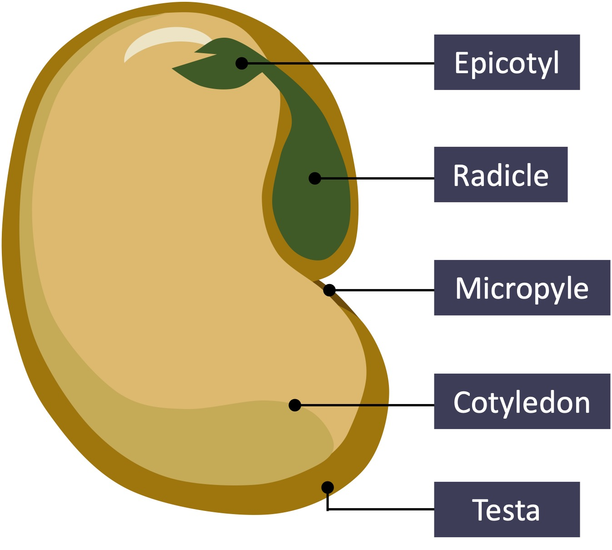{:width 300}
					- The antenna (intent's remaining tendency) matches the external stimulus with the corresponding dormant ((66b1cfa4-01ef-4ee8-9409-32c9884c39cd)) to wake it up to become an active ((66f93c78-15f5-43a7-8412-f7a5bc66e2ae)) of action.
					  id:: 686cc8c2-9215-4b84-840e-def48efd9447
					- In common usage, there are “laten/dormant intent” with slightly different meanings.
						- In technical and legal context, [laten intent](https://lsd.law/define/latent-intent) is the intention hidden under the surface, of formal text or expression.
						- In legal context, [dormant intent](https://lsd.law/define/dormant-legislative-intent) is the intention obscured by ambiguity or inconsistency of the text which the lawmakers were unaware of.
				- History:
					- Even before ((66537a44-f579-4fcc-a02b-2f32d0d409fc)), ((66536578-c4d3-43f1-b35c-bf71120f0570)) had used the word “inten**s**ion” as the general term including both semantical “inten**s**ion” and volitional “inten**t**ion”.
						- From his University time, he had contemplated a lot about the 2 duals of intension/extension and form/content.
						- Due to [hypophantasia](https://en.wikipedia.org/wiki/Aphantasia), Will's [“mental image”](https://plato.stanford.edu/entries/mental-representation/#Imagery) is much closer to the intension of the concept than a mental instance of it (an instance in the extension). That's why he feels all the internal contents (intents) are very much the same, both semantical “inten**s**ion” and volitional “inten**t**ion” are merged into his hypophantasic [mental representation](https://en.wikipedia.org/wiki/Mental_representation).
							- Mental representation & inten**s**ion: Instead of a clear sensory representation, Will's mental representation is a vague feeling capturing the general essence of the concept, together with a bundle of properties, behaviors, and relations capturing the functional aspect of the concept.
							- Mental representation & inten**t**ion: The intention is a mental state where mental representation together with emotion drives the action; and mental representation plays important role in formulating, rehearsing, committing, and execution of the intended action.
							- The low resolution and high abstraction/intension of his mental image/representation show the functional trade-off between semantic information (intension) and sensory quality (phantasic image).[[ref1](https://creatzynotes.blogspot.com/2021/05/thinking-styles-visual-vs-abstract-vs.html), [ref2](https://www.biorxiv.org/content/10.1101/2022.09.02.506121v4)] And hypophantasia is an expression of his autistic trait in the [autism spectrum](https://en.wikipedia.org/wiki/Autism).
							  id:: 68eca037-b18a-4046-9ac7-28fcf8334966
								- Closed eye result: [33/55](https://aphantasia.com/study/vviq/result?rid=0199dcd3-1ea1-791c-91db-b9676b71743f), hypophantasia
								- Open eye result: [45/55](https://aphantasia.com/study/vviq/result?rid=0199dcbc-c906-7048-8ca3-c1f2e4f892f6), at the low end of phantasia
							- Like other aphantasic people, Will can see vivid images in dreams as normal, as well as involuntarily visualizing clear images in a lucid-dreamlike state of meditation.
					- When Will contemplated the ((66b1cfa4-e22c-4424-bf19-a6ce4649da77)) in 2020, he revived the [archaic word “intent”](((686cef15-5eab-44f1-b8d7-3d8a9edcfa69))) to capture the general meaning of both semantical “inten**s**ion” and volitional “inten**t**ion”. The word “intent” was chosen instead of “intension” in order to be parallel with the other 2 compoents: content–intent–extent.
						- Actually, at first he thought that the term “intent” with general meaning was his own coinage... only to learn later that it was an archaic connotation.
			- The verb ((68a7de4b-7072-4ec1-907e-5a0d9fdba859)) in Unïnfo has the general meaning parallel with its [noun “intent”](((687f7bca-3f80-4a42-93b0-2dd9996ff426))), as shown with the ((68df2d82-e1d5-49c4-ac40-d45cf26f840c)): “to direct attention to and focus on a target within the subject”.
			  id:: 68a7de6e-fbe8-4fb9-8dc1-6279c066565f
			  collapsed:: true
			  :LOGBOOK:
			  CLOCK: [2025-08-17 Sun 20:06:01]
			  :END:
				- **to direct inward/toward**: to direct one's mind or heading inward or toward a target; to aim; to purpose (connotations 1, 2 & 7 in [Wiktionary](https://en.wiktionary.org/wiki/intend))
					- This connotation is about the arrow along the axis of the intent cone pointing to the apex.
				- **to focus inward**: to intensify, to condense, to strengthen (connotations 5 & 6 in Wiktionary)
					- This connotation is about the shape of the intent cone narrowing toward the apex.
				- Both ends of an infinite cone are infinity: “**intending** infinitely inward” ∥ “**extending** infinitely outward”
					- Illustration with projective geometry: The road ahead, no matter inside or outside, is seen narrowing toward a “point at horizon”, which is an ideal point at infinity.
					- Outward, the road narrows toward a visual vanishing point on the skyline.
					- Inward, the intent cone narrows toward a mental vanishing point on the “horizon within”.
					- Both are perspectival infinities: finite to the eye, boundless in the journey.
			- Functional classification of intents and their temporal relation
			  id:: 68dfc246-ea07-4c54-a0a4-2361f1a9055e
			  collapsed:: true
			  :LOGBOOK:
			  CLOCK: [2025-10-03 Fri 19:32:13]
			  :END:
				- ((68df309b-c3e7-4121-895c-9c74d2359646)) crysallizing [past experiences](((66ea8df3-d2f3-4856-b24a-5095dd285f9b))): The accumulation of past experiences gradually forms intension, concept, notion, which are stored in memory as dormant intents.
				- ((3f718c7e-3449-49fa-8771-d50a5f8a8d48)) showing [current quality](((66ea8e12-7c30-449b-9139-bfd8d82394d7))): In contact with object's content, whether externally or internally, the corresponding dormant intents from the past are activated into qualia and mental images in the working memory, which are cognitive intents.
				- ((68df2ff2-cd0a-45e0-9309-969e0493404b)) driving future ((66727858-979d-4d95-8a90-7a749218cfba))s: The interaction between cognitive intents unfolds them into the empty space of possibility. This emptiness generates the [contative](https://en.wikipedia.org/wiki/Conation) intents that drive actions to fill in the void, to fulfill the potential.
				- The experiences throughout the course of action will, in turn, be accumulated into new formative intents.
	- ## extent
	  id:: 66b1cfa4-3a39-4672-9da2-cd3bcef71702
	  collapsed:: true
	  ((665359e4-4597-4775-b849-f9acbb98960a)) ((69b3e6c8-735f-437d-9a7f-1a2841bfb336))
		- extension
		  id:: 66f949a4-675e-4c43-8da3-f2754ba2e128
			- abstract extension
			  id:: 69b3e6c8-735f-437d-9a7f-1a2841bfb336
			  ((665c9af1-1ce2-461c-af33-671690618c8f)) ((66b1cfa4-3a39-4672-9da2-cd3bcef71702)), ((670e0d9a-a926-49ca-951c-7013b2b29e8c))
				- ((6651ecba-793d-43c5-8020-a9f260b032d8)) In Unïnfo, whenever we say “extent”, we mean an abstract form, a mere image of the object created by the subject.
			- concrete extension
			  id:: 69b3e6d4-8fbe-4f08-94e3-a3cfbbb3980a
			  ((665c9af1-1ce2-461c-af33-671690618c8f)) ((66f4e208-37c7-4749-a448-0722f7f7af20))
		- ((6651ecba-793d-43c5-8020-a9f260b032d8)) ((66b1cfa4-3a39-4672-9da2-cd3bcef71702)) is an umbrella term capturing the abstract notion of “the part of ((667cfa3e-9856-43f0-956b-ebb4ff31d8eb)) extended from the ((66b1cfa4-01ef-4ee8-9409-32c9884c39cd))”: the ((66ab6161-0306-42d5-ac16-4155c69216f5)) whose a special case is the daily used [extent](https://en.wiktionary.org/wiki/extent#Noun), the semantical [extension](https://en.wikipedia.org/wiki/Extension_(semantics)), the ((66f7af1e-02d6-4c9b-b8f4-01a5ac6749d8)) in CIE, etc. Note that the semantical “extension” here refers to the ((665ca429-84e3-49ff-921e-c07d19cd99ba)) of the collection of objects referenced by the intension, where that form is just an image inside the subject.
	- ## world
	  id:: 667cfac2-17f1-4cbd-9f6d-1e722ff2a870
	  collapsed:: true
		- ((6651ecba-793d-43c5-8020-a9f260b032d8)) A ((667cfac2-17f1-4cbd-9f6d-1e722ff2a870)) is a place where at least one ((667cfa3e-9856-43f0-956b-ebb4ff31d8eb)) lives with many ((667cfa42-ade7-4310-9a7b-6d14d01c16da))s. A world usually contains many objects and many subjects.
		- ((66725708-3dc4-43f5-a180-6b331c6a160f))
		  collapsed:: true
			- The physical ((667cfac2-17f1-4cbd-9f6d-1e722ff2a870)) on [Earth](https://en.wikipedia.org/wiki/Earth) is called "the World", which itself is a part of the whole physical world called [Universe](https://en.wikipedia.org/wiki/Universe).
			- A [possible world](https://en.wikipedia.org/wiki/Possible_world) in modal logic is a complete and consistent way the ((667cfac2-17f1-4cbd-9f6d-1e722ff2a870)) is or could have been.
	- ## reference flow
	  id:: 667bef50-a33a-4275-9ca3-e9d801ab5a81
	  collapsed:: true
	  ((6699ea73-dc77-4227-a293-b501f2eb1759)) ((667bef22-b272-4a7d-b613-3f1ed1a47329))
		- ((6651ecba-793d-43c5-8020-a9f260b032d8)) ((667bef50-a33a-4275-9ca3-e9d801ab5a81)) is the ((67fcbbc6-915b-4d28-b9cf-098e916cdc86)) of ((66723642-58f1-4a74-bba3-0108f14c6bac))s where view is the underlying transformation. In microview, each reference flow is drawn by an ((669a2487-054d-4408-ae41-189e34af81a9)).
		- ((667bf816-d1c8-4ac3-b315-764c14bfbb1f)) ((667bef50-a33a-4275-9ca3-e9d801ab5a81)) is in opposite direction with ((667bef22-b272-4a7d-b613-3f1ed1a47329)). This opposition is in the sense of 2 complement arrows in a circle (🔄), and does not mean the exactly backward flow.
		  id:: 667bf653-a1ea-4a02-8669-a1a70901e9c3
		  collapsed:: true
			- In space, all ((667bef50-a33a-4275-9ca3-e9d801ab5a81)) has a corresponding ((667bef22-b272-4a7d-b613-3f1ed1a47329)), and they are usually refined to the degree that they seem to be exactly backward of each other, due to complement circles being refined to points.
			- [First note on fb](https://www.facebook.com/lxdinh/posts/pfbid034MLTAC99b6LG7pdmNKYia9hKaCiwAapreeqdb3vEWMeBvFUiPUdE2Y467AXj7v89l) about this complementarity was on 30 Nov 2017.
		- ((669a1e5f-734c-41c1-bf1c-21813b6e81d8)) “Refer” means to “carry back to the origin” which is opposite to “effect” which is to “act out”.
		- circular reference flow
		  id:: 667bf520-a80c-4b6d-98d8-1f71cae6fb56
		  ((665359e4-4597-4775-b849-f9acbb98960a)) ((667bfebf-a319-46be-a795-d7fc9c156363)), ((667c0481-27f1-4cd4-adcc-390de0e56cb7))
		  ((6699e4db-2e75-4427-94bb-96dfe0367dd1)) ((667bf36a-581a-4abe-b544-2d849608a3e4))
			- self-reference
			  id:: 667bfebf-a319-46be-a795-d7fc9c156363
			  ((665c9af1-1ce2-461c-af33-671690618c8f)) ((667bf520-a80c-4b6d-98d8-1f71cae6fb56))
				- ((66725725-f76a-4328-b162-f469b87e871b)) [self-reference](https://en.wikipedia.org/wiki/Self-reference), [circular reference](https://en.wikipedia.org/wiki/Circular_reference), [recursion](https://en.wikipedia.org/wiki/Recursion), etc.
			- self-view
			  id:: 667c0481-27f1-4cd4-adcc-390de0e56cb7
			  ((665c9af1-1ce2-461c-af33-671690618c8f)) ((667bf520-a80c-4b6d-98d8-1f71cae6fb56))
			- ((6651ecba-793d-43c5-8020-a9f260b032d8)) ((667bf520-a80c-4b6d-98d8-1f71cae6fb56)) is a ((667bef50-a33a-4275-9ca3-e9d801ab5a81)) whose sink is viewed as coinciding with its source.
			- ((665359ff-79f1-4669-b10b-f2b0e633a7c1))
				- Due to [complementarity](((667bf653-a1ea-4a02-8669-a1a70901e9c3))), in space, there's a ((667bf520-a80c-4b6d-98d8-1f71cae6fb56)) for each ((667bf36a-581a-4abe-b544-2d849608a3e4)).
				- A subject guides its ((66727858-979d-4d95-8a90-7a749218cfba))s via its self-positioning in the ((667cfac2-17f1-4cbd-9f6d-1e722ff2a870)), i.e. via the ((667c0481-27f1-4cd4-adcc-390de0e56cb7)) including both the world and its ((667c015e-6223-4f8a-ae84-a93a49f4ff94)). All subject's actions are toward the target ((669a1bec-3347-4915-83e4-dcffc4d482d1)) which is the ((667c0481-27f1-4cd4-adcc-390de0e56cb7)) accurately matching the corresponding ((667c0031-0a87-44c9-9e98-6d45893b095f)) from itself via the world back to itself.
				  id:: 66b1cfa4-ec86-433e-b5ea-c52c991717c1
				  collapsed:: true
					- Learning is the update of ((667c0481-27f1-4cd4-adcc-390de0e56cb7)). This is the [internal effect circle](((669a06b6-82cd-4e04-b5bf-ca60b89725d7))).
						- All observations of a ((667cfa3e-9856-43f0-956b-ebb4ff31d8eb)) are about itself which create various distorted views of itself.
					- Controlling is the update of ((667bff0e-d45d-4d41-8683-51c3cf76c0bc)). This is the [external effect circle](((669a0848-a7a2-402f-b704-68cea407e43d))).
						- When a ((667cfa3e-9856-43f0-956b-ebb4ff31d8eb)) handle an ((667cfa42-ade7-4310-9a7b-6d14d01c16da)) with no purpose for itself, it's not controlling but just acting for the effect circle of the object to bring ((667bff0e-d45d-4d41-8683-51c3cf76c0bc)) to the owner subject of that object.
						- All actions of a ((667cfa3e-9856-43f0-956b-ebb4ff31d8eb)) are for itself.
							- "Helping people or harming people, all are just for ourselves!"
							  "Giúp người hay hại người cũng đều vì mình cả!"
							  is the saying that i usually say.
	- ## flow
	  id:: 67fcbbc6-915b-4d28-b9cf-098e916cdc86
	  collapsed:: true
	  :LOGBOOK:
	  CLOCK: [2025-04-14 Mon 14:40:16]
	  :END:
	  ((66c80da7-c0e8-46d2-85e5-71318fd44eff)) ((67fccdf3-f1a4-45ee-b16a-43e003af85e9))
	  ((66c80da9-4cfb-4de7-b83d-8b70665207bf)) ((67fcce23-bec7-4fde-92c9-56c4f194a118))
		- flow
		  id:: 67fccdf3-f1a4-45ee-b16a-43e003af85e9
		  ((66c80dfd-95e2-4b5a-bd56-06e8307e81ca)) ((67fcbbc6-915b-4d28-b9cf-098e916cdc86))
		- flowing
		  id:: 67fcce23-bec7-4fde-92c9-56c4f194a118
		  ((66c80e01-002b-42ae-9c60-49bf3fc6e159)) ((67fcbbc6-915b-4d28-b9cf-098e916cdc86))
		- ((6651ecba-793d-43c5-8020-a9f260b032d8)) ((67fcbbc6-915b-4d28-b9cf-098e916cdc86)) is the continuation of ((669a58b9-eb34-41cd-8605-02e29b07e1b5))s by joining their arrows [head-to-tail](((667d151a-eaaa-4299-97b6-f3cd8f1aa98d))). In ((66ac41f1-de0c-48cb-a9b0-c30b0fe27c5d)), all flows are ((66e41705-54b1-4677-a595-fd01cb88a4fb)), hence ((67fcbefb-63b6-438a-a676-82293350d71b))s. However, usually only a part of the circuit is visible as a non-circular flow from ((67fcbdea-2ade-4264-b8c4-c419c6fc2779))s to ((67fcbdf7-37e7-4beb-8b1f-f80961596006))s, and the remaining part flowing from sinks back to sources is hidden in invisible higher dimensions.
		- ((665359ff-79f1-4669-b10b-f2b0e633a7c1))
			- ((67fe23f7-3afe-4e77-be1d-fa8a15416bc3))
		- ### source
		  id:: 67fcbdea-2ade-4264-b8c4-c419c6fc2779
		  collapsed:: true
		  :LOGBOOK:
		  CLOCK: [2025-04-14 Mon 14:49:05]
		  :END:
		  ((6699ea73-dc77-4227-a293-b501f2eb1759)) ((67fcbdf7-37e7-4beb-8b1f-f80961596006))
			- ((665359c0-a89a-41b5-9f28-503f79107a08)) [sources and sinks](https://en.wikipedia.org/wiki/Sources_and_sinks)
			- ((6651ecba-793d-43c5-8020-a9f260b032d8)) a ((67fcbdea-2ade-4264-b8c4-c419c6fc2779)) of a ((67fcbbc6-915b-4d28-b9cf-098e916cdc86)) is a region where the flow has non-zero [divergence](https://en.wikipedia.org/wiki/Divergence). Strictly speaking, a (positive) source is where the flow diverges (with positive divergence), and a ((67fcbdf7-37e7-4beb-8b1f-f80961596006)) is where the flow converges (with negative divergence), but here “sink” is consider to be just a “negative source”.
			- ((66725725-f76a-4328-b162-f469b87e871b))
				- [charges](https://en.wikipedia.org/wiki/Charge_(physics)): positive charge = (positive) ((67fcbdea-2ade-4264-b8c4-c419c6fc2779)), negative charge = ((67fcbdf7-37e7-4beb-8b1f-f80961596006))
				- mass = sink of gravity, [negative mass](https://en.wikipedia.org/wiki/Negative_mass) = source of gravity
				- [thermal reservoirs](https://en.wikipedia.org/wiki/Thermal_reservoir): heat source, heat sink
				- [attractor](https://en.wikipedia.org/wiki/Attractor) = sink, repellor = source
				- [zeros and poles](https://en.wikipedia.org/wiki/Zeros_and_poles) of complex functions: source or sink depends on the sign convention, but both zero = soliton, and pole = [singularity](https://en.wikipedia.org/wiki/Singularity_(mathematics)), are [topological defects](https://en.wikipedia.org/wiki/Topological_defect).
			- ((665359ff-79f1-4669-b10b-f2b0e633a7c1))
				- ((67f4eae9-34ed-4303-8dc0-8320a5fa6dd2))
		- ### sink
		  id:: 67fcbdf7-37e7-4beb-8b1f-f80961596006
		  :LOGBOOK:
		  CLOCK: [2025-04-14 Mon 14:49:05]
		  :END:
		  = negative ((67fcbdea-2ade-4264-b8c4-c419c6fc2779))
		  ((6699ea73-dc77-4227-a293-b501f2eb1759)) ((67fcbdea-2ade-4264-b8c4-c419c6fc2779))
		- ### medium
		  id:: 67fdda4a-dfc1-42d7-846a-ba64252e11c1
		  :LOGBOOK:
		  CLOCK: [2025-04-15 Tue 11:02:36]
		  :END:
		  = ((67fcbdea-2ade-4264-b8c4-c419c6fc2779)) + ((67fcbdf7-37e7-4beb-8b1f-f80961596006))
			- ((6651ecba-793d-43c5-8020-a9f260b032d8)) ((67fdda4a-dfc1-42d7-846a-ba64252e11c1)) is the combination of both ((67fcbdea-2ade-4264-b8c4-c419c6fc2779)) and ((67fcbdf7-37e7-4beb-8b1f-f80961596006)) into one place for the flow to pass through.
			- #### portal
			  id:: 67fe1736-f1b6-4289-8b89-43e5387d4f3e
			  :LOGBOOK:
			  CLOCK: [2025-04-15 Tue 15:33:24]
			  :END:
				- ((6651ecba-793d-43c5-8020-a9f260b032d8)) ((67fe1736-f1b6-4289-8b89-43e5387d4f3e)) is a dense ((67fdda4a-dfc1-42d7-846a-ba64252e11c1)) where a large amount (or all) of the flow passes through. In ((66ac41f1-de0c-48cb-a9b0-c30b0fe27c5d)), ((94e87dc9-71af-477c-aa70-0f448c2f1e20)) is the portal of ((667bef22-b272-4a7d-b613-3f1ed1a47329)).
		- ### resource
		  collapsed:: true
		  :LOGBOOK:
		  CLOCK: [2024-08-12 Mon 08:38:11]
		  :END:
			- ((6651ecba-793d-43c5-8020-a9f260b032d8)) ((669f3107-a33a-4b26-a636-6da62fa5520e)) = “packed source” is the accumulation of continuous ((67fcbdea-2ade-4264-b8c4-c419c6fc2779))s into packages (forms, circles) so that they can be transported to remote places and stored for later uses, hence “circle source”, “source around” and “source again”.
				- Spatial circle: “transportation” is the circulation of the original source around in space.
				- Temporal circle: “storage” is the compact circle in space to be transported through time to be “source again” at later time for later uses.
			- ((66725725-f76a-4328-b162-f469b87e871b)) charge particles (batteries), massive bodies, [thermal batteries](https://en.wikipedia.org/wiki/Thermal_energy_storage)
			- ((669a1e5f-734c-41c1-bf1c-21813b6e81d8)) “re-source” = “source again” = “rise again” = “flow up again”
				- “source” ← Latin “surgere” = “sub” + “regere” = “flow[regere] (up) from below[sub]” = “rise up”
				- 資源 = “accumulated source” = “supplying source” = source of various things (money, goods, matter, etc.)
				- “tài nguyên” [[財源](https://en.wiktionary.org/wiki/%E8%B2%A1%E6%BA%90#Vietnamese)] = “nguồn tiền”?! “Resource” should (better) be this “tài nguyên” [材源].
			- ((665359ff-79f1-4669-b10b-f2b0e633a7c1))
				- Resource = between content & form: crystallized to form, vaporized to content 
				    = currency = sensor = balancer bringing diff (content) back to sim (form) = energy = action (S) in mechanics = worker = maintainer of self = weaver of form = driver of content = mixer of content & form = constructor of self form & destructor of other form
					- resource limit/[constraint](((66b1cfa3-385f-437c-88f2-f76c0684c9e3))) = form
					- resource energy = content
				- equilibrium = balance = optimum = least resource consumption = least action (S min) = max entropy = perfect circle **within a view**, not absolutely!!!
				- all balance will be broken spontaneously = radioactive decay = all circles will be open = intrinsic dynamic
				- black hole distortion: inside intrinsic static <> outside intrinsic dynamic <=> Zeno arrow paradox
		- ### circular flow
		  id:: 67fcbee7-da00-45d8-bb21-deefb95d164e
		  :LOGBOOK:
		  CLOCK: [2025-04-14 Mon 14:49:05]
		  :END:
		  ((665359e4-4597-4775-b849-f9acbb98960a)) ((67fcbefb-63b6-438a-a676-82293350d71b))
			- circuit
			  id:: 67fcbefb-63b6-438a-a676-82293350d71b
			  ((665c9af1-1ce2-461c-af33-671690618c8f)) ((67fcbee7-da00-45d8-bb21-deefb95d164e))
		- ### current
		  id:: 67fcc081-80b9-4179-a6b0-6307adba595a
		  :LOGBOOK:
		  CLOCK: [2025-04-14 Mon 14:49:05]
		  :END:
		  ((66c80da9-4cfb-4de7-b83d-8b70665207bf)) ((67fccd8a-8eb9-47ca-bd1a-1c2a78d1bf93))
			- current
			  id:: 67fccd8a-8eb9-47ca-bd1a-1c2a78d1bf93
			  ((66c80e01-002b-42ae-9c60-49bf3fc6e159)) ((67fcc081-80b9-4179-a6b0-6307adba595a))
				- ((6651ecba-793d-43c5-8020-a9f260b032d8)) Being ((67fccd8a-8eb9-47ca-bd1a-1c2a78d1bf93)) means being in the ((67fcce23-bec7-4fde-92c9-56c4f194a118)) state of the now.
			- ((6651ecba-793d-43c5-8020-a9f260b032d8)) ((67fcc081-80b9-4179-a6b0-6307adba595a)) is an established ((67fcbbc6-915b-4d28-b9cf-098e916cdc86)) which is usually stable in time. Its establishment and stability is thanks to the underlying circularity, thus current is just the visible part of an underlying ((67fcbefb-63b6-438a-a676-82293350d71b)).
	- ## quality
	  id:: 66e426ec-d29b-4614-932b-2c70693790d7
	  collapsed:: true
	  ((6699e4db-2e75-4427-94bb-96dfe0367dd1)) ((66e426df-90e4-43c0-9f02-c48c336e830d))
		- ((66e4299e-0af8-47ee-adae-c13fb57fd15d))
			- ((66e42d39-a296-4ed9-a686-4cb213783830))
			  quality of ((667d15b7-6364-49a9-ac58-c64d2a992b63))
			- intension
			  quality of object
			- ((66b1cfa4-01ef-4ee8-9409-32c9884c39cd))
			  quality of subject
		- ((665359ff-79f1-4669-b10b-f2b0e633a7c1))
			- Philosophy of mind: [qualia](https://en.wikipedia.org/wiki/Qualia)
			- Dialectics of Nature: The transformation between the change of ((66e426df-90e4-43c0-9f02-c48c336e830d)) and the change of ((66e426ec-d29b-4614-932b-2c70693790d7)), as [a law in Dialectical Materialism](https://www.marxists.org/reference/archive/spirkin/works/dialectical-materialism/ch02-s09.html)
		- ### direction
		  id:: 66e42d39-a296-4ed9-a686-4cb213783830
			- ((6651ecba-793d-43c5-8020-a9f260b032d8)) ((66e42d39-a296-4ed9-a686-4cb213783830)) is an ((66537674-6cf9-4459-8bea-7c1858c694a3)) of ((667d15b7-6364-49a9-ac58-c64d2a992b63)) where its ((67bc2fc9-8389-4455-ace9-4aac8de73e1d)) is abstracted away, leaving only its ((66f3c97f-94e8-4783-96c5-fe9cadf4f9a9)), i.e. a unit arrow. In vector notation, an arrow $\vec v$, with magnitude $v = |\vec v|$, has direction represented by the unit vector ${\hat v} = {\vec v}/v$. While being unit/intent on the longitudinal direction, the direction itself has its own content represented by the circular extent on the transverse direction called ((68750097-13e5-4662-9791-8207ec18e8aa)).
		- ### qualiton
		  id:: 671e0fcc-37b6-4f03-8e87-8923422ca8e0
		  ((6699e4db-2e75-4427-94bb-96dfe0367dd1)) ((671e0f99-c35c-45f3-9f80-4d9cf00063de))
			- ((6651ecba-793d-43c5-8020-a9f260b032d8)) A ((671e0fcc-37b6-4f03-8e87-8923422ca8e0)) is a ((667d162c-16cf-44d3-81a5-29b1b885164f)) of ((66e426ec-d29b-4614-932b-2c70693790d7)) at the center (inner most ((66f3c97f-94e8-4783-96c5-fe9cadf4f9a9))) of the ((94e87dc9-71af-477c-aa70-0f448c2f1e20)). Through the process of [qualification](((681826ac-f5f2-4a84-a5f5-c110937ec85f))), the qualiton not only carries and sustains quality, but also applies that quality to ((671e0f99-c35c-45f3-9f80-4d9cf00063de))s to activate them into living qualitons. E.g., each [electron](https://en.wikipedia.org/wiki/Electron) is a qualiton of electricity which is a bundle of quanta (energy, spin, etc.) activated by the [prototype electron](https://en.wikipedia.org/wiki/One-electron_universe) (root qualiton).
				- ((669a1e5f-734c-41c1-bf1c-21813b6e81d8)) qualiton = [quality](https://www.etymonline.com/word/quality) + [-on](https://www.etymonline.com/word/-on)
			- ((665359ff-79f1-4669-b10b-f2b0e633a7c1))
				- ((681826ac-f5f2-4a84-a5f5-c110937ec85f))
				- ((671e0fcc-37b6-4f03-8e87-8923422ca8e0)) is to ((671e0f99-c35c-45f3-9f80-4d9cf00063de)) in Unithread, as ((66f3c97f-94e8-4783-96c5-fe9cadf4f9a9)) is to ((66f7af1e-02d6-4c9b-b8f4-01a5ac6749d8)) in the CIE formula.
	- ## quantity
	  id:: 66e426df-90e4-43c0-9f02-c48c336e830d
	  collapsed:: true
	  ((665359e4-4597-4775-b849-f9acbb98960a)) ((66e42b30-1aa4-4b6f-8c54-b29fc09085c6))
	  ((6699e4db-2e75-4427-94bb-96dfe0367dd1)) ((66e426ec-d29b-4614-932b-2c70693790d7))
		- amount
		  id:: 66e42b30-1aa4-4b6f-8c54-b29fc09085c6
		  ((665c9af1-1ce2-461c-af33-671690618c8f)) ((66e426df-90e4-43c0-9f02-c48c336e830d))
		- ((66e4299e-0af8-47ee-adae-c13fb57fd15d))
			- number
			  countable quantity
			- ((66e42b30-1aa4-4b6f-8c54-b29fc09085c6))
			  uncountable quantity
			- ((67bc2fc9-8389-4455-ace9-4aac8de73e1d))
			  id:: 66e42a2d-deb3-46dd-b477-94196a5d2d6f
			  quantity of form
				- forms: ((667d15c6-67c4-4998-a549-c8b3f9de3d60)), ((667d15b7-6364-49a9-ac58-c64d2a992b63)), etc.
			- size
			  quantity of shape
		- ((665359ff-79f1-4669-b10b-f2b0e633a7c1))
			- ((66c7fdec-59db-4f96-a8a7-913247586534))
		- ### quantum
		  id:: 671e0f99-c35c-45f3-9f80-4d9cf00063de
		  ((6699e4db-2e75-4427-94bb-96dfe0367dd1)) ((671e0fcc-37b6-4f03-8e87-8923422ca8e0))
			- ((665359c0-a89a-41b5-9f28-503f79107a08)) https://en.wikipedia.org/wiki/Quantum
			- datum
			  id:: 671e1634-9974-4845-b4bc-449ea3fe106a
			  ((671e0f99-c35c-45f3-9f80-4d9cf00063de)) in ((669dcdf8-a48c-40b1-bdb1-54a73fc5ae71))
	- ## equal
	  id:: 6653751a-a1b4-44b0-a81e-0a446eb8918c
	  collapsed:: true
	  ((66c80d5c-181f-4f06-a285-0624a65e9951)) ((66e41e14-6c0c-41d7-9089-92916d47d7e0))
		- ((6651ecba-793d-43c5-8020-a9f260b032d8)) From the [mathematical equality](https://en.wikipedia.org/wiki/Equality_(mathematics)), ((6653751a-a1b4-44b0-a81e-0a446eb8918c)) is generalized to the [third component](((66f3d5cc-0d68-47bb-b09a-87cda33c7354))) of the ((669dfc7d-5355-41db-93a1-8d590e8ec9d8)) which represent various aspects of the Universe, from simple equality, balance, to symmetry, ((669a1bec-3347-4915-83e4-dcffc4d482d1)), ((669a3da2-1e6c-48bd-950f-af1ea1ceda25)), etc.
		- equality
		  id:: 66e41e14-6c0c-41d7-9089-92916d47d7e0
		  ((66c80dde-a097-4744-8af8-c6e26dcfdda2)) ((6653751a-a1b4-44b0-a81e-0a446eb8918c))
		- equation
		  id:: 69367d7f-9ca8-4202-9ac7-1085cde52513
		  ((66c80dde-a097-4744-8af8-c6e26dcfdda2)) ((6653751a-a1b4-44b0-a81e-0a446eb8918c))
		- ((66e4299e-0af8-47ee-adae-c13fb57fd15d))
		  collapsed:: true
			- equal
			  id:: 66e411b5-6ef9-4695-bca1-dfcc6ca99bfc
			  equal in comparison
			- symmetry
			  equal in shape
			- balance
			  equal in exchange
		- Three levels of ((66e41e14-6c0c-41d7-9089-92916d47d7e0))
		  id:: 66e3fe46-dc79-472a-a059-f5ccf5afb437
		  collapsed:: true
		  :LOGBOOK:
		  CLOCK: [2024-09-13 Fri 16:01:12]--[2024-09-25 Wed 20:05:54] =>  292:04:42
		  :END:
		  ((66e40f4b-34ae-499a-8192-0a0f4f580c7e)) > ((66e40f58-c9dd-47f4-999d-2e4a2aa874fe)) > ((66e40f75-0573-484e-8cb6-b6b8071ffb8c))
			- ((6651ecba-793d-43c5-8020-a9f260b032d8))
				- Diagram
				  id:: 699d7bab-16fd-4118-aceb-1e7f534688bc
				  collapsed:: true
					- 
			- ((665359ff-79f1-4669-b10b-f2b0e633a7c1))
				- ((669dcdf8-a48c-40b1-bdb1-54a73fc5ae71)): quantum → time → space → self
				  id:: 692cf172-d3fe-4390-80fe-52a8c21bd107
				  collapsed:: true
				  :LOGBOOK:
				  CLOCK: [2025-12-01 Mon 10:22:02]
				  :END:
					- Uninet is a field of quanta related together by ((69292bbb-c2dc-496d-9a04-bb4529407b25)).
						- Each quantum is a phase circle storing datum for the corresponding qualiton: $x, y, z, ...$
						- These phase circles concatenate to form the ((66ab75a1-f4a0-4bab-a002-8e573546623a)), and they ((687743fd-9d45-45be-b9fd-3055cbb8a938)) together to spin self threads.
						- Some phase circles links together to form ((667c0031-0a87-44c9-9e98-6d45893b095f))s driven by the diff/error in that circle to reach the balance/round form.
							- These effect circles are the cells of uninet, called ((671e1608-1350-4e87-99b6-5492cc6fb449)).
						- Compared to [gradient descent](https://en.wikipedia.org/wiki/Gradient_descent): $\dot{x} = −∇V(x)$
						  collapsed:: true
							- No predefined potential landscape $V$ is required in unitnet, i.e. “background-independent” like General Relativity.
								- Actually, uninet, as well as the whole Unïnfo, requires a single qualifier – the ((6653751a-a1b4-44b0-a81e-0a446eb8918c)) – from which all other intents emerge through interaction between effect circles.
							- Unlike predefined [loss function](https://en.wikipedia.org/wiki/Loss_function) in [machine learning](https://en.wikipedia.org/wiki/Machine_learning), the ((677e76ed-b324-4608-b146-90e8fcfa0c32)) of autonoton emerges through learning: ((68df309b-c3e7-4121-895c-9c74d2359646)) → ((68df2ff2-cd0a-45e0-9309-969e0493404b)).
							- [Reinforcement learning](https://en.wikipedia.org/wiki/Reinforcement_learning) is the closest to uninet, thanks to its self-learnt **target/advantage** inside the loss (the Bellman target, the advantage estimate A(s,a), GAE, etc.).
					- Time = head-to-tail continuation = addition of arrows = quantum-wise addition
						- Point equality: magnitude is relative and scalable, only order (relation) between points on thread conserves. (topo compound thread)
						- Quanta are independent from each other
					- Space = rotation = multiplication of arrows with  attent arrow = projection by view = distortion to form
						- different views = different products (multiplications)
						- mass equality: the amount of thread conserves.
						- in rotation, quanta are linked into a loop (projective compound thread)
					- Self = round form = exp(x) equals x = maintenance of self-image
						- Intent/structure equality:
						- all quanta are linked to weave a compound thread
						- quantum loop has at least 4 quanta for ((67bd3614-2520-4a5d-8b3f-44f60901844e))
					- TODO Merge “topo/projective compound thread” here with [projective/compound threads](((67e3b3e4-66d6-4c72-92d1-faeef2cf2165))) previously.
			- point equality
			  id:: 66e40f4b-34ae-499a-8192-0a0f4f580c7e
			  :LOGBOOK:
			  CLOCK: [2024-09-13 Fri 19:52:01]
			  :END:
			  1 circle of the ((66537a0b-d107-4f7e-b01f-bf624a647d8c)): ((669dfc7d-5355-41db-93a1-8d590e8ec9d8))
				- ((6651ecba-793d-43c5-8020-a9f260b032d8)) ((66e40f4b-34ae-499a-8192-0a0f4f580c7e)) is the equal relation regarding the most abstract ((66e43b94-9183-4d49-af85-8a7a1c194c12)), a.k.a. conservation of ((66e426ec-d29b-4614-932b-2c70693790d7)) (momentum) (định tính). This conservation of quality via [complementarity](((66c8941d-6427-4e5c-9009-3af349500d7b))) is the characteristic of the monistic view of the [qualitative theory of Unïnfo](((669dfc9f-b5e2-448a-b6f4-be13c5bfbccb))).
				- Structure
					- $p + q = 0$
					- ((6678288e-699b-4325-bdba-bf6349fe0d57))s: ((667d15b7-6364-49a9-ac58-c64d2a992b63))s
					- ((665ca429-84e3-49ff-921e-c07d19cd99ba)): ((66ab675b-2778-4f51-80ad-20a8f6988691)) (closed loop)
					- ((94e87dc9-71af-477c-aa70-0f448c2f1e20)): vacantistic obop = terminal obop = origin, ((66728236-5b19-425c-bb5f-dfc0dc8b79fd))
			- mass equality
			  id:: 66e40f58-c9dd-47f4-999d-2e4a2aa874fe
			  :LOGBOOK:
			  CLOCK: [2024-09-13 Fri 19:52:06]
			  :END:
			  2 circles of the ((675c03d8-3185-41a8-9f98-e869fabec793)): Ω = ((667cfa3e-9856-43f0-956b-ebb4ff31d8eb)) + ((667cfa42-ade7-4310-9a7b-6d14d01c16da))
				- ((6651ecba-793d-43c5-8020-a9f260b032d8)) ((66e40f58-c9dd-47f4-999d-2e4a2aa874fe)) is the equal relation regarding ((66e42b30-1aa4-4b6f-8c54-b29fc09085c6)), a.k.a. conservation of ((66e426df-90e4-43c0-9f02-c48c336e830d)) (energy) (định lượng). This is the common connotation of the word “equal”. This conservation of quantity via reflection between intent & extent is the characteristic of the dualistic view of the [quantitative theory of Unithread](((66ac41d1-09e7-44b1-9290-ea7d5f02a817))). The conservation of content's quantity is due to the **constancy of the self intent**.
				- Structure
					- $|p| + |q| = 1 = |p'| + |q'|$ 
					  ⇔ $(|p| - |p'|) + (|q| - |q'|) = Δ|p| + Δ|q| = 0$
					- ((6678288e-699b-4325-bdba-bf6349fe0d57))s: ((667d15c6-67c4-4998-a549-c8b3f9de3d60))s
					- ((665ca429-84e3-49ff-921e-c07d19cd99ba)): symmetric loop
					- ((94e87dc9-71af-477c-aa70-0f448c2f1e20)): dualistic obop = center of mass
						- vacantistic obop = contact point between 2 circles = sensor
			- intent equality
			  id:: 66e40f75-0573-484e-8cb6-b6b8071ffb8c
			  :LOGBOOK:
			  CLOCK: [2024-09-13 Fri 19:52:12]
			  :END:
			  3 circles of the uninet: ((94e87dc9-71af-477c-aa70-0f448c2f1e20)), ((66c810a0-9861-4787-bdcf-1378219332be)), ((667cfac2-17f1-4cbd-9f6d-1e722ff2a870))
				- ((6651ecba-793d-43c5-8020-a9f260b032d8)) ((66e40f75-0573-484e-8cb6-b6b8071ffb8c)) is the equal relation regarding intensity, a.k.a. ((669a1bec-3347-4915-83e4-dcffc4d482d1)) – the conservation of structure (định hình). This conservation of structure via maintenance of body in the world is the characteristic of the trialistic view of ((669dcdf8-a48c-40b1-bdb1-54a73fc5ae71)).
				- Structure
					- ((6678288e-699b-4325-bdba-bf6349fe0d57))s: components = intertwined circles
					- ((665ca429-84e3-49ff-921e-c07d19cd99ba)): ((66ab6f84-88ba-4660-b4b7-f6dcbdd58a4f)) ((667d15c6-67c4-4998-a549-c8b3f9de3d60))
					- ((94e87dc9-71af-477c-aa70-0f448c2f1e20)): trialistic obop = dualistic obop = central obop = ((66ab7477-c060-4d07-ab13-bc3d11246854)) of symmetry
						- terminal vacantistic obop = sensor
						- central vacantistic obop = empty center
		- ((665359ff-79f1-4669-b10b-f2b0e633a7c1))
			- ((66ceeca0-a149-4fe0-85a8-9302f96eb669))
		- ### equilibrium
		  id:: 669a1bec-3347-4915-83e4-dcffc4d482d1
		  collapsed:: true
		  ((665359e4-4597-4775-b849-f9acbb98960a)) ((669a1d82-91c8-40fd-81f5-e8ffe56e9e9c))
		  ((66c80da7-c0e8-46d2-85e5-71318fd44eff)) ((66e3ed38-3108-4d43-944d-9d2c8d1a90f2))
		  ((66c80da9-4cfb-4de7-b83d-8b70665207bf)) ((66e3ed78-8815-4dcc-964c-5bc8325405dd))
			- balance
			  id:: 669a1d82-91c8-40fd-81f5-e8ffe56e9e9c
			  ((665c9af1-1ce2-461c-af33-671690618c8f)) ((669a1bec-3347-4915-83e4-dcffc4d482d1))
			- equilibrate
			  id:: 66e3ed38-3108-4d43-944d-9d2c8d1a90f2
			  ((66c80dfd-95e2-4b5a-bd56-06e8307e81ca)) ((669a1bec-3347-4915-83e4-dcffc4d482d1))
			- equilibrated
			  id:: 66e3ed78-8815-4dcc-964c-5bc8325405dd
			  ((66c80e01-002b-42ae-9c60-49bf3fc6e159)) ((669a1bec-3347-4915-83e4-dcffc4d482d1))
			- ((669a1e5f-734c-41c1-bf1c-21813b6e81d8)) equilibrium = equal (`=`) + Libra (`♎︎`)
			  id:: 669a1d85-ebf1-4f7d-8834-fc68f3ab7f0c
			- ((66e4299e-0af8-47ee-adae-c13fb57fd15d))
				- ((66ab6f84-88ba-4660-b4b7-f6dcbdd58a4f))
				  equilibrium in ((667d15c6-67c4-4998-a549-c8b3f9de3d60))
				- straight
				  equilibrium in line
				- uniform
				  equilibrium in distribution
				- ((669a1d82-91c8-40fd-81f5-e8ffe56e9e9c))
				  equilibrium in dynamic
				- optimum
				  equilibrium in progress
			- Law of ((669a1d82-91c8-40fd-81f5-e8ffe56e9e9c)) restoration
			  id:: 6667c99a-792f-4230-9fc6-c5fae874daef
			  :LOGBOOK:
			  CLOCK: [2024-06-11 Tue 10:50:54]
			  CLOCK: [2024-09-13 Fri 15:34:45]
			  :END:
			  “(Im)Balance is the ((677e76ed-b324-4608-b146-90e8fcfa0c32)) of all forces.”
				- All forces are caused by the ((66c8046e-c5fe-4f27-b3cf-40f5f39b646b)) to cancel its imbalance, hence **restoring forces**.
				  id:: 699c0362-5189-4cee-bcb5-84b6ff8574fe
				- Intentional cause: imbalance is the first cause (op), and balance is the final cause (ob).
				- This is the generalized version of the [law of entropy](https://en.wikipedia.org/wiki/Second_law_of_thermodynamics#Direction_of_spontaneous_processes).
			- ((665359ff-79f1-4669-b10b-f2b0e633a7c1))
				- ((66960ee2-d6dd-404b-a9d0-96340fce3cd2))
				- WAIT round = divisible = reached GCD (unit) = distributed content (change) to all digits = equilibrium = reached Mecha/Turing machine (from bio, uninet)
				  :LOGBOOK:
				  CLOCK: [2024-08-23 Fri 10:05:07]--[2024-09-13 Fri 15:37:57] =>  509:32:50
				  :END:
				- ((669a58b8-5018-4d00-abf9-3e69d36897d5))
				- ((66b1cfa4-70f7-4cc5-94db-c69c9e7e1e4e))
				- WAIT multiplication by contact/touch => spreading, smearing, wave dispersion
				  id:: 669dc0b1-21f2-4454-ab40-ea156269e195
				  :LOGBOOK:
				  CLOCK: [2024-07-22 Mon 09:15:15]
				  CLOCK: [2024-07-22 Mon 09:15:21]--[2024-09-13 Fri 15:41:00] =>  1278:25:39
				  :END:
				- ((668d0046-6d0f-4af9-8a2a-c446084a5f1f))
		- equanimity
		  id:: 669a3da2-1e6c-48bd-950f-af1ea1ceda25
			- ((665359c0-a89a-41b5-9f28-503f79107a08)) https://en.wikipedia.org/wiki/Equanimity
			- Buddhism: [upekṣā](https://en.wikipedia.org/wiki/Upek%E1%B9%A3%C4%81), [xả](https://vi.wikipedia.org/wiki/Bu%C3%B4ng_x%E1%BA%A3)
			- ((669a1e5f-734c-41c1-bf1c-21813b6e81d8)) equanimity = equal + mind
		- ### unity of opposites
		  id:: 69367cf5-9894-4fb8-a293-2b1109777fc9
		  coincidentia oppositorum
			- ((665359c0-a89a-41b5-9f28-503f79107a08)) https://en.wikipedia.org/wiki/Unity_of_opposites
			- ((6651ecba-793d-43c5-8020-a9f260b032d8)) ((69367cf5-9894-4fb8-a293-2b1109777fc9)) is the the meta-meaning of ((69367d7f-9ca8-4202-9ac7-1085cde52513)), i.e., the duality of two opposite meanings of ⟪A = B⟫ – the *formal meaning* is that two sides of the equation are aparently different, as shown in their **different** forms/symbols/expressions (“A” verus “B”) – and the *intended meaning* is that they have the **same** underlying content/extent/value.
	- ## arrow
	  id:: 667d15b7-6364-49a9-ac58-c64d2a992b63
	  collapsed:: true
		- ((6651ecba-793d-43c5-8020-a9f260b032d8)) From the [physical arrow](https://en.wikipedia.org/wiki/Arrow) [projectile](https://en.wikipedia.org/wiki/Projectile), ((667d15b7-6364-49a9-ac58-c64d2a992b63)) is abstracted into a [symbol (→)](https://en.wikipedia.org/wiki/Arrow_(symbol)) representing many aspects of meaning, including ((669a58b9-eb34-41cd-8605-02e29b07e1b5)) & ((66e42d39-a296-4ed9-a686-4cb213783830)) "from A to B" (A → B), [differentiation](((1a22a090-6786-4114-8aad-35b122783bff))) "B is different from A" (B ← A), relation "A is related to B" (A → B), projection, mapping, etc.
		- ((66532ccc-ae21-4940-8714-715060d6bd90)) tail ⤚[body]→ head
		  collapsed:: true
			- concrete body
			  id:: 669de102-8f98-4d96-bf00-4f4e602cb689
			   of an ((667d15b7-6364-49a9-ac58-c64d2a992b63)) is the whole arrow itself, including its ((669de25b-a52b-4eed-99a0-4ba86b9ee5ea)), ((669e007d-7336-4010-be08-e54e962eae2e)) and its ((669de24d-9e5e-4514-bfd5-5f506666e42b)).
				- In ((66537a44-f579-4fcc-a02b-2f32d0d409fc)), whenever mentioning "arrow", we means its ((669de102-8f98-4d96-bf00-4f4e602cb689)).
			- head
			  id:: 669de25b-a52b-4eed-99a0-4ba86b9ee5ea
			   of an ((667d15b7-6364-49a9-ac58-c64d2a992b63)) is the end where the arrow is heading toward.
				- arrowhead
				  id:: 69c5210d-e0bb-4ecc-8d5a-275b0d7e1102
				  ((669de25b-a52b-4eed-99a0-4ba86b9ee5ea)) of an arrow
				  ((6699ea73-dc77-4227-a293-b501f2eb1759)) ((66e43b94-9183-4d49-af85-8a7a1c194c12))
					- ((6651ecba-793d-43c5-8020-a9f260b032d8)) ((69c5210d-e0bb-4ecc-8d5a-275b0d7e1102)) is the ((66537674-6cf9-4459-8bea-7c1858c694a3)) of the ((667d15b7-6364-49a9-ac58-c64d2a992b63)) into a ((66e43b94-9183-4d49-af85-8a7a1c194c12)), i.e. the dynamic aspect of point.
			- tail
			  id:: 669e007d-7336-4010-be08-e54e962eae2e
			   of an ((667d15b7-6364-49a9-ac58-c64d2a992b63)) is the opposite end of the ((669de25b-a52b-4eed-99a0-4ba86b9ee5ea)).
			- abstract body (shaft)
			  id:: 669de24d-9e5e-4514-bfd5-5f506666e42b
			  of an ((667d15b7-6364-49a9-ac58-c64d2a992b63)) is the part connecting the ((669e007d-7336-4010-be08-e54e962eae2e)) and ((669de25b-a52b-4eed-99a0-4ba86b9ee5ea)).
				- In many theories (maths & informatics), only the abstract body is used as an "arrow", e.g. function, morphism, mapping, etc.
		- ((66725725-f76a-4328-b162-f469b87e871b))
			- source → target: ((669a58b9-eb34-41cd-8605-02e29b07e1b5)), morphism
			  id:: 669df777-8863-439f-8a0a-7b95a8e2bba5
			- source → sink: ((67fcbbc6-915b-4d28-b9cf-098e916cdc86))
			- source → destination: transmission
			- origin → destination: transportation
			- object → image: ((6653769c-3334-46fa-a1d5-4ce6a7fc23e8))
			- domain → range: mapping
			- input → output: function, process
			- old → new: ((667c008f-cd1f-4a6b-a9c8-d6efa1d8d342))
			- past → future: ((68fa164e-ef0e-4010-937d-ad9e0459f5f2))
	- ## circle
	  id:: 667d15c6-67c4-4998-a549-c8b3f9de3d60
	  collapsed:: true
	  ((66c80da9-4cfb-4de7-b83d-8b70665207bf)) ((66e41705-54b1-4677-a595-fd01cb88a4fb))
		- circular
		  id:: 66e41705-54b1-4677-a595-fd01cb88a4fb
		  ((66c80e01-002b-42ae-9c60-49bf3fc6e159)) ((667d15c6-67c4-4998-a549-c8b3f9de3d60))
		- ((6651ecba-793d-43c5-8020-a9f260b032d8)) From the perfect shape of [geometrical circle](https://en.wikipedia.org/wiki/Circle), ((667d15c6-67c4-4998-a549-c8b3f9de3d60)) is abstracted to be the ((665ca429-84e3-49ff-921e-c07d19cd99ba)) of any **closed** ((667d0d2e-15c7-4989-a183-69a9a5c6bf8a)). To be precise, this abstraction should be called ((66ab675b-2778-4f51-80ad-20a8f6988691)), but in Unïnfo we usually call it “circle” as an abuse of terminology. The true circle is a ((66ab6f84-88ba-4660-b4b7-f6dcbdd58a4f)) ((66ab6761-b62d-486b-bd15-44a4ecee8a99)) which can [degenerate](https://en.wikipedia.org/wiki/Degenerate_energy_levels) into all non-round loops via distortion. In ((66537a44-f579-4fcc-a02b-2f32d0d409fc)), ((667d15c6-67c4-4998-a549-c8b3f9de3d60)) is the ((665ca429-84e3-49ff-921e-c07d19cd99ba)) of all forms.
		- ((665359ff-79f1-4669-b10b-f2b0e633a7c1))
			- While classical geometry, from [Euclid's “Elements”](https://en.wikipedia.org/wiki/Euclid%27s_Elements), was built from points, straight lines, and curves, Unithread is built from circles, corresponding to the ((66f3d644-782c-4f33-bd5c-db6e0a2d447a)). These circles are originally perfectly round, but as they interact with each other, they are distorted into non-round loops, and even [degenerate](https://en.wikipedia.org/wiki/Degenerate_conic) into open curves or straight lines or points. This notion of “everything is circle” is similar to [Lie's sphere geometry](https://en.wikipedia.org/wiki/Lie_sphere_geometry).
		- cycle
		  id:: 66ab675b-2778-4f51-80ad-20a8f6988691
		  ((665359e4-4597-4775-b849-f9acbb98960a)) ((66ab6761-b62d-486b-bd15-44a4ecee8a99))
			- loop
			  id:: 66ab6761-b62d-486b-bd15-44a4ecee8a99
			  ((665c9af1-1ce2-461c-af33-671690618c8f)) ((66ab675b-2778-4f51-80ad-20a8f6988691))
			- ((6651ecba-793d-43c5-8020-a9f260b032d8)) A ((66ab675b-2778-4f51-80ad-20a8f6988691)) does not require to be ((66ab6f84-88ba-4660-b4b7-f6dcbdd58a4f)) like the [geometrical circle](https://en.wikipedia.org/wiki/Circle). The term “cycle” is usually used for the form of time, while the term ((66ab6761-b62d-486b-bd15-44a4ecee8a99)) is usually used for the form of objects in space.
		- Symbols: ○ (small), ◯ (large)
		- ### magnitude
		  id:: 67bc2fc9-8389-4455-ace9-4aac8de73e1d
			- ((6651ecba-793d-43c5-8020-a9f260b032d8)) ((67bc2fc9-8389-4455-ace9-4aac8de73e1d)) of a ((665ca429-84e3-49ff-921e-c07d19cd99ba)) is the ((66f7af1e-02d6-4c9b-b8f4-01a5ac6749d8)) of that form measured based on a unit form called ((66f3c97f-94e8-4783-96c5-fe9cadf4f9a9)).
		- ### curvature
		  id:: 67bc1f83-d9c4-4ee0-ac61-0de196425208
		  collapsed:: true
			- ((6651ecba-793d-43c5-8020-a9f260b032d8)) ((67bc1f83-d9c4-4ee0-ac61-0de196425208)) of a ((667d15c6-67c4-4998-a549-c8b3f9de3d60)) is the reciprocal of its ((67bc2fc9-8389-4455-ace9-4aac8de73e1d)).
			- Formulae:
				- $κ = dφ/ds = ω/v = 1/r$ for the ratio between steering velocity $ω = dφ/dt$ and longitudinal velocity $v = ds/dt$.
				  id:: 67bc5689-d4f1-4136-b775-92847ddd02f8
					- This is the [first Frenet–Serret formula](https://en.wikipedia.org/wiki/Frenet%E2%80%93Serret_formulas): $d {\bf T}/ds = κ⋅{\bf N}$.
					- $κ = (\sin θ)/h = \lim_{h→0}θ/h$ for an upright wheel of height $h$ slanting an angle $θ$ and its axis pointing to the center of the osculating circle.
						- This has the same form as the $dφ/ds$ formula, because ${\bf h}$ is just the direction vector ${\bf T}$ turned up 90° and scaled by $h$.
				- $ds_i/ds_o = 1 - κ⋅w$ for the ratio between inside arc $s_i$ and outside arc $s_o$ separted by width $w$.
				- [?] Relation to [refraction](https://en.wikipedia.org/wiki/Refraction)?
		- ### round
		  id:: 66ab6f84-88ba-4660-b4b7-f6dcbdd58a4f
		  collapsed:: true
		  ((66c80d5c-181f-4f06-a285-0624a65e9951)) ((67ee0ea8-b68d-4adc-8d57-2f0a7be16d22))
			- roundness
			  id:: 67ee0ea8-b68d-4adc-8d57-2f0a7be16d22
			  ((66c80dde-a097-4744-8af8-c6e26dcfdda2)) ((66ab6f84-88ba-4660-b4b7-f6dcbdd58a4f))
			- ((6651ecba-793d-43c5-8020-a9f260b032d8)) A ((66ab6170-ea0d-4bd7-be7a-2e226a7ea7ee)) is ((66ab6f84-88ba-4660-b4b7-f6dcbdd58a4f)) when every point in that shape has the same distance, called ((670ce8c2-8c54-42c6-84cd-93703c1fa60f)), to a fixed point called ((66ab7477-c060-4d07-ab13-bc3d11246854)), i.e. it has [circular symetry](https://en.wikipedia.org/wiki/Circular_symmetry). A round cycle is a perfect and ((66e3ed78-8815-4dcc-964c-5bc8325405dd)) ((667d15c6-67c4-4998-a549-c8b3f9de3d60)), i.e. a **true circle**.
			- ((665359ff-79f1-4669-b10b-f2b0e633a7c1))
				- ((66960ee2-d6dd-404b-a9d0-96340fce3cd2))
				- ((66ebb5fb-6850-4a83-94eb-dd3039891ffc))
				- ((66875f13-3385-48d5-99b1-fb72dc53291d))
				- ((66faa5f8-6fa9-4561-8234-296ad2f314d7))
				- ((66faa5f8-b0b8-4b3f-9a29-1901f315419e))
				- ((670cd7d1-8380-49db-a47c-6aa132256596))
			- #### center
			  id:: 66ab7477-c060-4d07-ab13-bc3d11246854
			  ((665359e4-4597-4775-b849-f9acbb98960a)) ((6867b512-9b5a-4279-8c98-28ea1a3c7995))
				- focal point
				  id:: 6867b512-9b5a-4279-8c98-28ea1a3c7995
				  ((665c9af1-1ce2-461c-af33-671690618c8f)) ((66ab7477-c060-4d07-ab13-bc3d11246854))
				- ((6651ecba-793d-43c5-8020-a9f260b032d8)) The ((66ab7477-c060-4d07-ab13-bc3d11246854)) of a ((667d15c6-67c4-4998-a549-c8b3f9de3d60)) is the point having equal distance from all points in the circle, i.e. the ((94e87dc9-71af-477c-aa70-0f448c2f1e20)) of ((66e40f75-0573-484e-8cb6-b6b8071ffb8c)). The concept of center can be extended to the center of mass, named “pre-center” (in ((66e40f58-c9dd-47f4-999d-2e4a2aa874fe))), and even further to the origin, the ((66728236-5b19-425c-bb5f-dfc0dc8b79fd)), named “pseudo-center” (in ((66e40f4b-34ae-499a-8192-0a0f4f580c7e))).
				  id:: 6716110f-c736-43d2-a8e8-f2d6d163bd4d
				- ((665359ff-79f1-4669-b10b-f2b0e633a7c1))
					- ((684f9515-8f95-4004-8aa8-04a10d1ebf11))
			- #### radius
			  id:: 670ce8c2-8c54-42c6-84cd-93703c1fa60f
		- ### rotation
		  id:: 67ed2855-1512-4db0-bc61-f714ea891106
		  :LOGBOOK:
		  CLOCK: [2025-04-02 Wed 19:09:10]
		  :END:
		  ((66c80da7-c0e8-46d2-85e5-71318fd44eff)) ((67ed285c-62ef-4608-9f6e-b642c7bc5d77))
			- rotate
			  id:: 67ed285c-62ef-4608-9f6e-b642c7bc5d77
			  ((66c80dfd-95e2-4b5a-bd56-06e8307e81ca)) ((67ed2855-1512-4db0-bc61-f714ea891106))
		- ### conic section
		  id:: 67ed249b-742e-4944-b048-dd6bf68d45fd
		  collapsed:: true
		  :LOGBOOK:
		  CLOCK: [2025-04-02 Wed 18:51:25]
		  :END:
		  ((665359e4-4597-4775-b849-f9acbb98960a)) ((67ed24b6-777e-40b2-9c42-fbafe7a66a82))
			- conic
			  id:: 67ed24b6-777e-40b2-9c42-fbafe7a66a82
			  ((665c9af1-1ce2-461c-af33-671690618c8f)) ((67ed249b-742e-4944-b048-dd6bf68d45fd))
			- ((665359c0-a89a-41b5-9f28-503f79107a08)) [conic section](https://en.wikipedia.org/wiki/Conic_section)
			- ((6651ecba-793d-43c5-8020-a9f260b032d8)) ((67ed249b-742e-4944-b048-dd6bf68d45fd))s are different images of the [perfect](((66ab6f84-88ba-4660-b4b7-f6dcbdd58a4f))) circle projected onto a plane by different ((667251ec-d4f7-4c09-adff-73e04a4b22ed))s.
			- #### conic rotation
			  id:: 67ed28ed-9acb-4458-be90-c11bebec7f0f
			  :LOGBOOK:
			  CLOCK: [2025-04-02 Wed 19:09:35]
			  :END:
				- ((6651ecba-793d-43c5-8020-a9f260b032d8)) ((67ed28ed-9acb-4458-be90-c11bebec7f0f)) is the ((67ed2855-1512-4db0-bc61-f714ea891106)) along a ((67ed249b-742e-4944-b048-dd6bf68d45fd)).
				- ((665359ff-79f1-4669-b10b-f2b0e633a7c1))
					- ((67e29bdb-9bce-4cb8-b993-79aa130a1831))
					- ((67ed2751-76d5-4bf1-9fc7-27c14ef6d1fa))
	- ## vacancy
	  id:: 66600918-9f92-4730-b056-c2cd87a742aa
	  collapsed:: true
	  ((665359e4-4597-4775-b849-f9acbb98960a)) ((66691d61-b8e9-4618-ac98-145056b646f4))
		- Emptiness
		  id:: 66691d61-b8e9-4618-ac98-145056b646f4
		  ((665c9af1-1ce2-461c-af33-671690618c8f)) ((66600918-9f92-4730-b056-c2cd87a742aa))
			- Buddhist: [śūnyatā (Sanskrit: शून्यता; Pali: suññatā)](https://en.wikipedia.org/wiki/%C5%9A%C5%ABnyat%C4%81)
		- ((6651ecba-793d-43c5-8020-a9f260b032d8)) ((66600918-9f92-4730-b056-c2cd87a742aa)) is the empty space that is available to be used. In ((66537a44-f579-4fcc-a02b-2f32d0d409fc)), vacancy is the underlying characteristic of all things, as stated in ((66f3ed94-4f20-4166-8e9b-2e8ba53aaad2)).
	- ## self
	  id:: 667c015e-6223-4f8a-ae84-a93a49f4ff94
	  collapsed:: true
	  ((665359e4-4597-4775-b849-f9acbb98960a)) ((66f27465-07bf-441d-95a7-33f10fc3e2e4)), ((66f273da-2bcc-449e-b0f6-83f384a57bfe))
		- bản thân
		  id:: 66f27465-07bf-441d-95a7-33f10fc3e2e4
		  ((665c9af1-1ce2-461c-af33-671690618c8f)) ((667c015e-6223-4f8a-ae84-a93a49f4ff94))
		- mình
		  id:: 66f273da-2bcc-449e-b0f6-83f384a57bfe
		  ((665c9af1-1ce2-461c-af33-671690618c8f)) ((667c015e-6223-4f8a-ae84-a93a49f4ff94))
		- ((665359c0-a89a-41b5-9f28-503f79107a08)) https://en.wikipedia.org/wiki/Self
		- ((6651ecba-793d-43c5-8020-a9f260b032d8)) A ((667c015e-6223-4f8a-ae84-a93a49f4ff94)) of a ((667cfa3e-9856-43f0-956b-ebb4ff31d8eb)) is a ((667d15c6-67c4-4998-a549-c8b3f9de3d60)) of ((6653769c-3334-46fa-a1d5-4ce6a7fc23e8)) from that subject to itself, i.e. the ((667c0031-0a87-44c9-9e98-6d45893b095f)) of that subject. Each subject may have many selves expressed as different ((669a5387-2a97-4311-a295-aa0afd9c4d76))s, but we ususally call the master self at the current moment “the self” and “the self-circle”. This circle can be seen as an [objective concept](https://en.wikipedia.org/wiki/Philosophy_of_self) of ((6810ceeb-6af6-442b-9910-baae2c315c46)), or as a subjective ((67f9100a-b749-4354-ae16-92dc74ff27da)).
		- ### life cycle of self
		  id:: 690827cf-c19e-4fc4-ba25-5d225afe06ae
		  collapsed:: true
			- id:: 69043439-614f-406a-8618-4253406958b8
			  1. The formation of a self starts with the closure of its ((669a5387-2a97-4311-a295-aa0afd9c4d76)) at the terminal obop, i.e. ((66e40f4b-34ae-499a-8192-0a0f4f580c7e)).
			- 2. The self is sustained by the conserving its content in its body, i.e. ((66e40f58-c9dd-47f4-999d-2e4a2aa874fe)).
			- 3. The constant-sized body revolves around the obop, like the radius rotating around the center, drawing the next level of body, forming the external self-circle → [1](((69043439-614f-406a-8618-4253406958b8))).
				- 3.1. Here, the first obop becomes the central obop, and many terminal obops emerges on the external self-circle.
					- This folding of the body to encapsulate the central obop is like the [neurulation](https://en.wikipedia.org/wiki/Neurulation) process in human embryonic development.
				- 3.2. The radial self-circle crystallizes into a fixed form, making the external self-circle a round circle, i.e. ((66e40f75-0573-484e-8cb6-b6b8071ffb8c)).
					- Here, the radial self-circle has replicated into many component self-circles in the external self-circle.
				- 3.3. Over time, the ((6810ceeb-6af6-442b-9910-baae2c315c46)) becomes complicated with many layers of self-circles.
					- Many layers of inner self-circles are compressed (due to spatial distortion) into a dense & hard core of the self, being the hard self of the central obop.
					- The inner most obops becomes more and more balanced, their intents cancel out approaching zero point.
				- 3.4. The external self-circle crystallizes into a fixed form, making its inner most obop empty.
					- Here, the inner most obop has been reflected by central obops of all the component self-circles.
					- Its intent has been cancelled out by the complete balance.
					- The empty center is the ((66c8772a-9b29-45b0-b169-2fa847333e02)), being [the focal point](((68665be1-f6a9-4121-859a-ec43ae37b5bf))) for all components to align themselves.
					- The emptiness of the inner most obop (self-essence) mirrors the emptiness of the terminal obops, making the [grand circle](((6772a6cd-771f-4f24-9c3a-39c442234be5))) of ((66f3ed94-4f20-4166-8e9b-2e8ba53aaad2)).
			- Examples
				- Cultural movements
					- The founder is the solid seed that grows the movement.
					- The movement often thrives when the founder's control or presence fades.
					- Passing away, the founder becomes the symbol in participants' hearts.
				- Wood growth
					- Heartwood is the hard core of the wood.
					- Being dead, that hard core is eventually hollowed out by external forces like microbes and fungi.
				- Crystals & snowflakes
					- Formation via [nucleation](https://en.wikipedia.org/wiki/Nucleation): The intial “seed” is solid (a concrete obop), like the [ice nucleus](https://en.wikipedia.org/wiki/Ice_nucleus), attracting contents from environment to grow the crystal.
					- As the crystal grows, the center can be emtpy, like axis of the hollow column.
					  collapsed:: true
						- 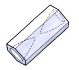
						- 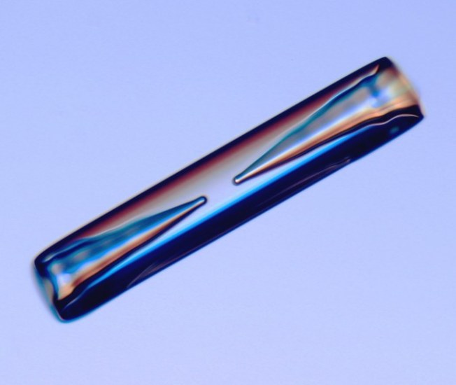
						- Ref: [Stunning Photos of Snowflakes and a Snow Flake Guide](https://fortifymylife.wordpress.com/2013/12/08/stunning-photos-of-snowflakes-and-a-snow-flake-guide/)
				- Stars
					- Nuclear fusion eats the core that created the star.
					- Eventually, the dense heart either collapses or blows apart, seeding new systems.
		- ### self-circle
		  id:: 669a5387-2a97-4311-a295-aa0afd9c4d76
		  ((665359e4-4597-4775-b849-f9acbb98960a)) ((6810d7ab-c35d-491e-9e2d-95c3024c276e))
			- spatial self
			  id:: 6810d7ab-c35d-491e-9e2d-95c3024c276e
			  ((665c9af1-1ce2-461c-af33-671690618c8f)) ((669a5387-2a97-4311-a295-aa0afd9c4d76))
			- ((6651ecba-793d-43c5-8020-a9f260b032d8)) ((669a5387-2a97-4311-a295-aa0afd9c4d76)) is the ((66c87463-4f07-420a-b12e-f456154f7dc8)) of everything that a ((667cfa3e-9856-43f0-956b-ebb4ff31d8eb)) sees as itself and belonging to itself. There are various self circles:
				- The ((66c810a0-9861-4787-bdcf-1378219332be)) is the middle self circle.
				- Outside, we have many extensions of the body: all belongings, all properties, family, race, nation, species, etc.
				  collapsed:: true
					- These extensions are discussed in [Dialogical Self Theory](https://en.wikipedia.org/wiki/Dialogical_self), through [ecological self](https://en.wikipedia.org/wiki/Ecological_self) in [Deep Ecology](https://en.wikipedia.org/wiki/Deep_ecology), as well as by various authors.
						- through the “relational self” or “self-as-relationship” in indigenous philosophies, as well as by authors in these papers:
							- 2009 book [Relational Being](https://www.researchgate.net/publication/239798192_Relational_Being_A_Brief_Introduction) by by Kenneth J. Gergen,
							- [“Self-Expansion Model of Motivation and Cognition in Close Relationships”](https://www.researchgate.net/publication/284143380_The_self-expansion_model_of_motivation_and_cognition_in_close_relationships)  (1986),
							- [Narrative and the Self as Relationship](https://www.sciencedirect.com/science/article/abs/pii/S0065260108602233) (1988),
						- through [extended mind thesis](https://en.wikipedia.org/wiki/Extended_mind_thesis) by Andy Clark and David Chalmers in 1998,
						- by Martin Heidegger through the concept of “being-there” or “Being-in-the-World” (Dasein) in the 1927 book [Being and Time](https://plato.stanford.edu/entries/heidegger/#BeinWorl),
						- by Belk in the 1988 paper [“Possessions and the extended self”](https://www.jstor.org/stable/2489522),
				- Inside, we have many intensions of the body: ((67f90bf0-ebcd-46fa-b99d-eda9bbbd3522)) (including [self-concept](https://en.wikipedia.org/wiki/Self-concept), [self-image](https://en.wikipedia.org/wiki/Self-image), [narative self](https://en.wikipedia.org/wiki/Narrative_identity), etc.), ((67f90c9f-2ee6-4265-9cb6-6a7c5091b775)), ((67f90ce4-e12a-4133-bdec-b73684152322)), ((67f90ce8-d597-47a0-ad73-43b9e546c096)), ((66c8772a-9b29-45b0-b169-2fa847333e02))
		- ### self-structure
		  id:: 6810ceeb-6af6-442b-9910-baae2c315c46
		  :LOGBOOK:
		  CLOCK: [2025-04-29 Tue 20:06:56]
		  CLOCK: [2025-04-29 Tue 20:06:57]
		  :END:
		  ((665359e4-4597-4775-b849-f9acbb98960a)) ((68186996-419d-4370-bc26-60e56869f3d0))
			- form of self
			  id:: 68186996-419d-4370-bc26-60e56869f3d0
			  ((665c9af1-1ce2-461c-af33-671690618c8f)) ((6810ceeb-6af6-442b-9910-baae2c315c46))
			- ((6651ecba-793d-43c5-8020-a9f260b032d8)) ((6810ceeb-6af6-442b-9910-baae2c315c46)), i.e. the ((6678d596-9526-405a-968c-e73860e524f3)) of the ((667c015e-6223-4f8a-ae84-a93a49f4ff94)), contains all ((669a5387-2a97-4311-a295-aa0afd9c4d76))s as the spatial slice, called the ((6810d7ab-c35d-491e-9e2d-95c3024c276e)), as well ass the whole ((667c0031-0a87-44c9-9e98-6d45893b095f)) through that slice.
				- Note: This “self-structure”, the structure of the whole self, is wider than the [self-concept](https://en.wikipedia.org/wiki/Self-concept), also called “self-structure” elsewhere, which is the structure of the ((669a5387-2a97-4311-a295-aa0afd9c4d76)) only.
			- ((665359ff-79f1-4669-b10b-f2b0e633a7c1))
				- The cyclone's structure represents the ((6810ceeb-6af6-442b-9910-baae2c315c46)).
				  id:: 673312a3-e94e-478f-9e21-bad72ef29d1b
				  collapsed:: true
					- Layers of the self, i.e. ((669a5387-2a97-4311-a295-aa0afd9c4d76))s, are the rain bands and the eyewall.
					  id:: 684f9518-69b3-415b-9c0e-2ed68395f531
						- To a self-circle containing inner self-circles, the outer layer is its ((66c810a0-9861-4787-bdcf-1378219332be)), and the inner circles are selful ((94e87dc9-71af-477c-aa70-0f448c2f1e20))s providing both ((66f267f7-01f9-47b9-8376-abd27fdf2930)) and ((66727858-979d-4d95-8a90-7a749218cfba)) to the body.
						  :LOGBOOK:
						  CLOCK: [2025-05-16 Fri 14:23:32]
						  :END:
						- The inner most layer, i.e. the eyewall, is the ((671e0fcc-37b6-4f03-8e87-8923422ca8e0)).
					- The [cyclone eye](https://en.wikipedia.org/wiki/Eye_(cyclone)), inside the eyewall, is the ((66c8772a-9b29-45b0-b169-2fa847333e02)) which is the selfless obop.
					  id:: 681826ad-768c-4671-b575-0d9f8ca64c6b
					- The outflow cirrus shield is the ((66ab6161-0306-42d5-ac16-4155c69216f5)) of the self, i.e. the physical ((66c810a0-9861-4787-bdcf-1378219332be)), in contrast to the mental bodies (inner self-circles, ((67f90bf0-ebcd-46fa-b99d-eda9bbbd3522))).
					- Rising and falling air flows are **effect fluxes**, i.e. segments of the ((667c0031-0a87-44c9-9e98-6d45893b095f)) through the ((6810d7ab-c35d-491e-9e2d-95c3024c276e)).
					- Blog post: [Cái Thức thanh tịnh nơi Mắt bão](https://creatzynotes.blogspot.com/2024/09/cai-thuc-thanh-tinh-noi-mat-bao.html)
					  collapsed:: true
						- Modified from [Hurricane-vi.svg](https://commons.wikimedia.org/wiki/File:Hurricane-vi.svg) < [Hurricane-en.svg](https://commons.wikimedia.org/wiki/File:Hurricane-en.svg)
						  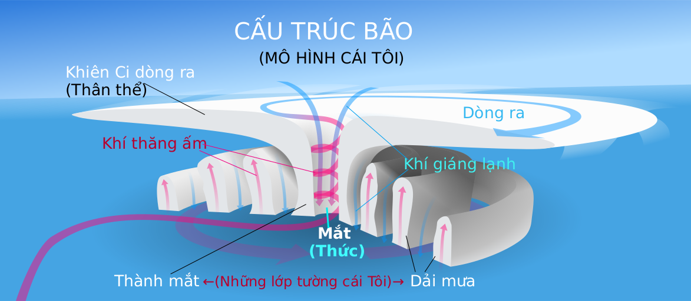
						- The storm's eye is used as a metaphor of the [Nirvāṇa](https://en.wikipedia.org/wiki/Nirvana) in the 3rd part “**Thức định** (định vào cái thức, absorption into the consciousness, 👁/=)” of the blog post [3 cấp độ Định](https://creatzynotes.blogspot.com/2021/03/3-cap-o-inh.html), similar to [a post by Michael Gerson](https://missionsixzero.com/the-eye-of-the-hurricane/).
						  id:: 699c0360-ba1b-433e-8d29-dda494cb46a7
		- ### sense of self
		  id:: 67f9100a-b749-4354-ae16-92dc74ff27da
		  collapsed:: true
		  :LOGBOOK:
		  CLOCK: [2025-04-11 Fri 19:50:21]
		  CLOCK: [2025-04-11 Fri 19:50:22]
		  :END:
			- ((6651ecba-793d-43c5-8020-a9f260b032d8)) ((67f9100a-b749-4354-ae16-92dc74ff27da)) is a [psychological complex](https://en.wikipedia.org/wiki/Psychology_of_self) produced by the ((672a0c61-ae93-440a-84e6-13778c8e91ca)) to tell about the subject itself. To develop the sense of self, the self-awareness and then the ((67f90c9f-2ee6-4265-9cb6-6a7c5091b775)) complexify the ((6810ceeb-6af6-442b-9910-baae2c315c46)) in this way:
				- ((66ab6f84-88ba-4660-b4b7-f6dcbdd58a4f)) ((667c0031-0a87-44c9-9e98-6d45893b095f)) → ((6810324e-f084-4693-b5cb-40778f4a6eee)) → ((6810327c-f633-4537-84a1-ca36a8d49d65)) [free]
				- [qualification](((671e0fcc-37b6-4f03-8e87-8923422ca8e0))) by ((66c8772a-9b29-45b0-b169-2fa847333e02)) → ((67f91046-34ed-4bb4-a006-db2c33aeabf7)) [will]
				- free + will → ((67f91050-a86c-4176-87ca-91010a8fe3c0)) → ((67f9100a-b749-4354-ae16-92dc74ff27da))
			- ((665359ff-79f1-4669-b10b-f2b0e633a7c1))
				- Unwholesome [senses of self](((67f9100a-b749-4354-ae16-92dc74ff27da))) are caused by their mismatches with the ((669a5387-2a97-4311-a295-aa0afd9c4d76)).
				  collapsed:: true
				  :LOGBOOK:
				  CLOCK: [2025-05-05 Mon 15:44:40]
				  :END:
					- The most common unwholesome sense of self is the “selfish sense”, that is the excessive sense of separateness (individuality) and free will relative to the limited self-circle.
					- This mismatch is due to the ignorance of the ((67f90c9f-2ee6-4265-9cb6-6a7c5091b775)) about the ((67f90ce8-d597-47a0-ad73-43b9e546c096)) which is limitless and is the source, the root of consciousness itself.
			- sense of wholeness
			  id:: 6810324e-f084-4693-b5cb-40778f4a6eee
			  :LOGBOOK:
			  CLOCK: [2025-04-29 Tue 08:59:04]
			  :END:
				- ((6651ecba-793d-43c5-8020-a9f260b032d8)) Thanks to the ((67ee0ea8-b68d-4adc-8d57-2f0a7be16d22)) of the ((667c0031-0a87-44c9-9e98-6d45893b095f)) in a ((6818a270-b75b-44ee-bbd2-0032846e4cb8)) ((6810ceeb-6af6-442b-9910-baae2c315c46)), any self developed enough to have a crystallized core will feel that it's a ((66c8046e-c5fe-4f27-b3cf-40f5f39b646b)), hence the ((6810324e-f084-4693-b5cb-40778f4a6eee)). Such a whole is the basis that sustains the self and keeps it stable.
			- sense of separateness
			  id:: 6810327c-f633-4537-84a1-ca36a8d49d65
			  :LOGBOOK:
			  CLOCK: [2025-04-29 Tue 08:59:04]
			  :END:
				- serparate self
				  id:: 6818a87d-bcad-402a-9703-c5318a477c5b
				- ((6651ecba-793d-43c5-8020-a9f260b032d8)) Based on the ((6810324e-f084-4693-b5cb-40778f4a6eee)), the self can exist on itself, though temporarily, hence the feeling of ((671b1eef-0820-4e03-8e8f-e9342ca18b26)), the ((6810327c-f633-4537-84a1-ca36a8d49d65)), and the notion of a ((6818a87d-bcad-402a-9703-c5318a477c5b)). This independency and the separate self will be developed throughout the process of [individuation](https://en.wikipedia.org/wiki/Individuation), where various internal self-circles are developed to sustain the self further: [narative self](https://en.wikipedia.org/wiki/Narrative_identity), ((67f90c9f-2ee6-4265-9cb6-6a7c5091b775)), etc. The sense of separateness increases with the complexity of the self-circles.
					- The separate self first forms in the [“existential self”](https://online-learning-college.com/knowledge-hub/gcses/gcse-psychology-help/the-concepts-of-self-and-self-concept/#h-the-existential-self), around first 6 months in human, which can be tested with the [mirror test](https://en.wikipedia.org/wiki/Mirror_test).
					- ((66c33468-23d5-44d7-955e-6711cb608157)) more about [self-concept](https://www.simplypsychology.org/self-concept.html), [separate self](https://www.diamondapproach.org/glossary/refinery_phrases/separateness)
			- sense of agency
			  id:: 67f91046-34ed-4bb4-a006-db2c33aeabf7
				- ((6651ecba-793d-43c5-8020-a9f260b032d8)) The ((67f91046-34ed-4bb4-a006-db2c33aeabf7)) is the feeling that [“I am the one who is causing or generating my actions”](https://en.wikipedia.org/wiki/Sense_of_agency), i.e. [“I'm in control of my actions”](https://en.wikipedia.org/wiki/Self-agency). This sense is created by the ((671e0fcc-37b6-4f03-8e87-8923422ca8e0)) at the center of the ((669a5387-2a97-4311-a295-aa0afd9c4d76)), i.e. the ((66c8772a-9b29-45b0-b169-2fa847333e02)). This sense is qualified by the match between the sensory feedback resulting from the action, i.e. the observing side, and the intitiation of action, i.e. the operating side. This match confirms the ((667bff0e-d45d-4d41-8683-51c3cf76c0bc)) and closes the effect circle.
				- ((665359ff-79f1-4669-b10b-f2b0e633a7c1))
					- The ((67f91046-34ed-4bb4-a006-db2c33aeabf7)) creates the notion of [will](https://en.wikipedia.org/wiki/Will_(philosophy)) as the internal intention of the external action.
					  collapsed:: true
						- The “will” is just the ((68df2d82-e1d5-49c4-ac40-d45cf26f840c)) at the tip of the ((66eaa51a-32c1-4f3a-830c-30aecb7c45a3)).
						- ((66e7d7dd-5f88-472c-8694-beb7222929bb))
						- Etymology of “will”: Modern English [“will” (intent, volition)](https://en.wiktionary.org/wiki/will#Etymology_2) ← Old English “\*willan, willian” ← Proto-Germanic “\*willjan” (wish, want)
					- While the ((67f90c9f-2ee6-4265-9cb6-6a7c5091b775)) has a strong sense of direct agency, actually it's just a ((6732cf13-5b1b-499d-80ec-4c5b407e9cc5)) of the whole ((669a5387-2a97-4311-a295-aa0afd9c4d76)).
					  collapsed:: true
						- Direct sense: “agent” = “initiator & subject of action” = ((94e87dc9-71af-477c-aa70-0f448c2f1e20))
						- Indierect sense: “agent” = “initiator of action on behalf of another one” = ((6732cf13-5b1b-499d-80ec-4c5b407e9cc5))
						- Order of controlling: representative < agent < controller < master
						- Layers of re-re-re-...presentatives are just like the layers of ((665ca429-84e3-49ff-921e-c07d19cd99ba))s and ((66ab6161-0306-42d5-ac16-4155c69216f5))s in Hegel's world of [appearances](((67123b17-b024-414a-a5dd-ba05965eefe7)))
						  id:: 684f9518-6f65-4534-b296-184d3df8dd6b
						  {{embed ((684f9518-5468-48fe-8afe-5469c3d18975))}}
							- “present” = “pre-” + “est” = (bring something to) be in front of (some one) = direct form
							- “represent” = “re-” + “present” = indirect form = “form of form”
					- [separateness](((6810327c-f633-4537-84a1-ca36a8d49d65))) + [agency](https://en.wikipedia.org/wiki/Agency_(philosophy)) = [autonomy](https://en.wikipedia.org/wiki/Autonomy) → ((67f91046-34ed-4bb4-a006-db2c33aeabf7))
			- sense of free will
			  id:: 67f91050-a86c-4176-87ca-91010a8fe3c0
				- ((6651ecba-793d-43c5-8020-a9f260b032d8)) The ((67f91050-a86c-4176-87ca-91010a8fe3c0)) is the feeling that “I have [free will](https://en.wikipedia.org/wiki/Free_will)” which is the ability make conscious choices and decisions independently, without being determined by prior or external causes. Here, “free will” = “free” [((671b160c-0589-4f83-a778-a9fb4df6783a)), ((6810327c-f633-4537-84a1-ca36a8d49d65))] + “will” [intention, determination, ((67f91046-34ed-4bb4-a006-db2c33aeabf7))].
		- ### self-essence
		  id:: 66c8772a-9b29-45b0-b169-2fa847333e02
		  collapsed:: true
		  ((665359e4-4597-4775-b849-f9acbb98960a)) ((69086748-b6e9-47c0-810b-4a92f882d6bc)), ((66f27ac0-b0b1-4dec-b256-5f4ab57e1972)), svabhāva, 自性
			- ((6651ecba-793d-43c5-8020-a9f260b032d8)) ((66c8772a-9b29-45b0-b169-2fa847333e02)) is the pure & ((66c8369a-ccb8-4f1f-b12b-bf7054cb79e4)) ((669a2697-56af-445c-9197-24aa498a5d5b)) within the ((667cfa3e-9856-43f0-956b-ebb4ff31d8eb)) which stays in the ((66ab7477-c060-4d07-ab13-bc3d11246854)) of the ((669a5387-2a97-4311-a295-aa0afd9c4d76)). Self-essence is an ((66537674-6cf9-4459-8bea-7c1858c694a3)) which cannot be seen directly and can only be felt indirectly via reflection, hence an ((69086748-b6e9-47c0-810b-4a92f882d6bc)).
			- empty center
			  id:: 69086748-b6e9-47c0-810b-4a92f882d6bc
			  ((665c9af1-1ce2-461c-af33-671690618c8f)) ((66c8772a-9b29-45b0-b169-2fa847333e02))
				- ((6651ecba-793d-43c5-8020-a9f260b032d8)) The ((69086748-b6e9-47c0-810b-4a92f882d6bc)) is modeled as [the eye of the cyclone](((684f9515-8f95-4004-8aa8-04a10d1ebf11))).
			- Ātman (आत्मा, आत्मन्)
			  id:: 66f27ac0-b0b1-4dec-b256-5f4ab57e1972
			  ((665c9af1-1ce2-461c-af33-671690618c8f)) ((66c8772a-9b29-45b0-b169-2fa847333e02))
				- ((6651ecba-793d-43c5-8020-a9f260b032d8)) ((66f27ac0-b0b1-4dec-b256-5f4ab57e1972)) is the Sanskrit term that refering to "essence, breath", đại ngã, linh hồn bất diệt (của Thượng Đế). In Mahayana Buddhism, the Sanskrit term svabhāva (स्वभाव) = pa. सभाव = zh. 自性 = vi. tự tánh is used to denote the [Buddha-nature](https://en.wikipedia.org/wiki/Buddha-nature) = [Brahman](https://en.wikipedia.org/wiki/Brahman) in Hinduism.
			- ((665359ff-79f1-4669-b10b-f2b0e633a7c1))
				- The argument of whether the ((66c8772a-9b29-45b0-b169-2fa847333e02)) is changing or unchanging, as in ((66f27ac0-b0b1-4dec-b256-5f4ab57e1972)) versus Budda-nature versus [anattā](https://en.wikipedia.org/wiki/Anatt%C4%81) & [śūnyatā](https://en.wikipedia.org/wiki/%C5%9A%C5%ABnyat%C4%81), is meaningless due to its intrinsic liar paradox: the self-essence is itself not a concrete self, but just an abstraction of the ((667c015e-6223-4f8a-ae84-a93a49f4ff94)). In other words, 
				  > while the concrete self has self-essence as its essence, the  self-essenee itself has no essence.
				- ((684f9515-8f95-4004-8aa8-04a10d1ebf11))
	- ## subject
	  id:: 667cfa3e-9856-43f0-956b-ebb4ff31d8eb
	  collapsed:: true
	  ((6699ea73-dc77-4227-a293-b501f2eb1759)) ((667cfa42-ade7-4310-9a7b-6d14d01c16da))
	  ((66c80da9-4cfb-4de7-b83d-8b70665207bf)) ((66c88055-a994-4e59-a7dc-83f3331a6e1d))
		- ((6651ecba-793d-43c5-8020-a9f260b032d8)) A ((667cfa3e-9856-43f0-956b-ebb4ff31d8eb)) is a thing that can ((66c811a9-e8c7-42c5-bdc9-25fbd023f93a)) and ((66c845fe-6e8e-412e-902e-34ae8d728f90)), i.e. a ((5d7a0798-907d-46b7-8481-99d3be30de9e)).
		- ((665359ff-79f1-4669-b10b-f2b0e633a7c1))
			- Traditionally, “subject” is used to refer human only.
			- In Unïnfo, “subject” is any seer-doer, from human to animal, from organism to ((671e0fcc-37b6-4f03-8e87-8923422ca8e0)).
			  id:: 6729d6db-3a8c-49da-95b0-28e1b2cb9806
			  collapsed:: true
				- This is the viewpoint of [Panpsychism](https://en.wikipedia.org/wiki/Panpsychism) and [Hylozoism](https://en.wikipedia.org/wiki/Hylozoism) which are development of the ancient [Animism](https://en.wikipedia.org/wiki/Animism).
				- The [observer effect](https://en.wikipedia.org/wiki/Observer_effect_(physics)) in Quantum Mechanics has shown that any particle can be an “observer” and the physicists do acknowledge it, but they are not serious about this fact.
					- This [chat with Copilot](((6729d059-7750-4a60-aa6c-766ca9a94ece))) has shown the common attitude about “observer” which is far from particle.
					- The traditional defintion of “observer” is anything behind the [Heisenberg cut](https://en.wikipedia.org/wiki/Heisenberg_cut) where **wave-function collapses**. This cut separates the observed system (object) which has wave property, and the the observing system (subject) which has particle property.
						- In order to collapse a wave-function, the observer must be “heavy” enough, either with many particles or a particle with strong interaction. This is the probabilistic nature of the [law of large numbers](https://en.wikipedia.org/wiki/Law_of_large_numbers). So in this sense, the observer must be a classical system and cannot be a single [elementary particle](https://en.wikipedia.org/wiki/Elementary_particle).
						- Ref: Can observers be particles? > [All you need is a system that is not in thermal equilibrium.](https://philosophy.stackexchange.com/a/7720)
				- In ((66ac41f1-de0c-48cb-a9b0-c30b0fe27c5d)), we don't require an ((66727858-979d-4d95-8a90-7a749218cfba)) to be a [wave-function collapse](https://en.wikipedia.org/wiki/Wave_function_collapse), thus any interfactive particle is a subject of that interaction.
				- Similar ideas
					- The [Foundational Questions Institute (FQxI)](https://fqxi.org/) grants to researchers around the globe to work on issues ranging from the origin of the **arrow of time** in quantum gravity to the nature of **consciousness**.
					- [George Rush](https://www.quora.com/profile/George-Rush-4) > [Do particle physicists consider particles conscious? If not, I think they should start as I have proof they might be.](https://www.quora.com/Do-particle-physicists-consider-particles-conscious-If-not-I-think-they-should-start-as-I-have-proof-they-might-be)
					-
		- subjective
		  id:: 66c88055-a994-4e59-a7dc-83f3331a6e1d
		  ((66c80e01-002b-42ae-9c60-49bf3fc6e159)) ((667cfa3e-9856-43f0-956b-ebb4ff31d8eb))
		  ((66c80d5c-181f-4f06-a285-0624a65e9951)) ((6728a766-210b-462b-8fd4-aee04981b4f9))
		  ((6699ea73-dc77-4227-a293-b501f2eb1759)) ((66c82f42-16bb-4886-a32b-5c246187cfee))
			- ((6651ecba-793d-43c5-8020-a9f260b032d8)) A ((665ca429-84e3-49ff-921e-c07d19cd99ba)) is ((66c88055-a994-4e59-a7dc-83f3331a6e1d)) when it's dependent on an individual subject.
			- subjectivity
			  id:: 6728a766-210b-462b-8fd4-aee04981b4f9
			  ((66c80dde-a097-4744-8af8-c6e26dcfdda2)) ((66c88055-a994-4e59-a7dc-83f3331a6e1d))
	- ## object
	  id:: 667cfa42-ade7-4310-9a7b-6d14d01c16da
	  collapsed:: true
	  ((6699ea73-dc77-4227-a293-b501f2eb1759)) ((667cfa3e-9856-43f0-956b-ebb4ff31d8eb)) 
	  ((66c80da9-4cfb-4de7-b83d-8b70665207bf)) ((66c82f42-16bb-4886-a32b-5c246187cfee))
		- objective
		  id:: 66c82f42-16bb-4886-a32b-5c246187cfee
		  ((66c80e01-002b-42ae-9c60-49bf3fc6e159)) ((667cfa42-ade7-4310-9a7b-6d14d01c16da))
		  ((66c80d5c-181f-4f06-a285-0624a65e9951)) ((6728a7ab-1629-4e23-bc56-10ead0d8348c))
		  ((6699ea73-dc77-4227-a293-b501f2eb1759)) ((66c88055-a994-4e59-a7dc-83f3331a6e1d))
			- ((6651ecba-793d-43c5-8020-a9f260b032d8)) A ((665ca429-84e3-49ff-921e-c07d19cd99ba)) is ((66c82f42-16bb-4886-a32b-5c246187cfee)) within a group of subjects when it's ((671b160c-0589-4f83-a778-a9fb4df6783a)) from all individual subjects in that group. While “objective” is dual to “subjective”, [their distintion is very relative](((6728aa9a-9fb2-4afa-864f-0eb049ac771b))).
			- objectivity
			  id:: 6728a7ab-1629-4e23-bc56-10ead0d8348c
			  ((66c80dde-a097-4744-8af8-c6e26dcfdda2)) ((66c82f42-16bb-4886-a32b-5c246187cfee))
		- ((6651ecba-793d-43c5-8020-a9f260b032d8)) An ((667cfa42-ade7-4310-9a7b-6d14d01c16da)) is a thing that is ((66c811a9-e8c7-42c5-bdc9-25fbd023f93a))n by a ((667cfa3e-9856-43f0-956b-ebb4ff31d8eb)), which may be another subject. The same object can be seen as many different ((665ca429-84e3-49ff-921e-c07d19cd99ba))s by different subjects, which are called ((66c88055-a994-4e59-a7dc-83f3331a6e1d)) images. The common of these forms is the ((66c82f42-16bb-4886-a32b-5c246187cfee)) image of the object.
		- ((665359ff-79f1-4669-b10b-f2b0e633a7c1))
			- A ((667cfa3e-9856-43f0-956b-ebb4ff31d8eb)) can only directly see the ((665ca429-84e3-49ff-921e-c07d19cd99ba)) of an object. All other properties like ((66727858-979d-4d95-8a90-7a749218cfba)) and/or ((94e87dc9-71af-477c-aa70-0f448c2f1e20)) of that object, the subject must infer from the collections of the seen forms then attribute to the object.
			- Relativity of ((6728a7ab-1629-4e23-bc56-10ead0d8348c)) and ((6728a766-210b-462b-8fd4-aee04981b4f9))
			  id:: 6728aa9a-9fb2-4afa-864f-0eb049ac771b
			  collapsed:: true
				- The common dichotomy is the [absolute objectivity versus absolute subjectivity](https://en.wikipedia.org/wiki/Subjectivity_and_objectivity_(philosophy)), whose ((6729c1c5-7eb2-408b-a205-f3039799d19c)) is _fixed by the human center, i.e. **human as the only subject**_: Anything independent from all humans (mind) is "objective", and anything dependent on human mind is "subjective".
					- This dichotomy is human-absolute, i.e. relative to the whole mankind, i.e. mandkind as the ((6729b90b-1ee3-4efc-b62c-281f9621f487)).
				- In Unïnfo, we consider the relative version of this dichotomy which is free from the human center:
					- relative objectivity = [inter-subjectivity](https://en.wikipedia.org/wiki/Intersubjectivity)
					  tính khách quan tương đối = tính chủ quan chung
						- Objectivity of coarse subjects is just the subjectivity of the fine subject common to all these coarse subjects.
						- So we refine the scale by intersection & interunion of all (coarse) subjects, hence “inter-subjectivity”.
					- relative subjectivity = idio-objectivity
					  tính chủ quan tương đối = tính khách quan riêng
						- While the subjectivity is idiomorphic and idiochromatic, it's still objective within the subject itself.
						- Only when comparing to others, can this subject know how much subjective its experience is.
						- The subjectivity is also relative to the external community:
							- When no one else accept this subjective form, it becomes “idiolect” of an “idiot”; On the other hand,
							- when many ones accept and adopt this form, it becomes “idiom” which is more objective than subjective.
						- The science is developing toward the objectivity in “nomothetic” way, but it cannot reach objectivity without passing through numerous subjectivities in “idiographic” way.
						- Etymology: “[idio-](https://en.wiktionary.org/wiki/idio-)” ← Greek “ídios” ([ἴδιος](https://en.wiktionary.org/wiki/%E1%BC%B4%CE%B4%CE%B9%CE%BF%CF%82#Ancient_Greek)) meaning “self, private, distinct, peculiar”
							- It's easily confused with “[ideo-](https://en.wiktionary.org/wiki/ideo-)” ← Greek “idéa” ([ἰδέα](https://en.wiktionary.org/wiki/%E1%BC%B0%CE%B4%CE%AD%CE%B1#Ancient_Greek)) meaning “form, shape, appearance, type, idea”.
			- ((6728a7ab-1629-4e23-bc56-10ead0d8348c)) / ((6728a766-210b-462b-8fd4-aee04981b4f9)) is the view of the ((66c8046e-c5fe-4f27-b3cf-40f5f39b646b)) / part and the nuance of ((671b1616-9958-48d9-95ba-9fc8e76f2867))
			  id:: 672c6f67-b678-4d99-9614-b4569770a512
			  collapsed:: true
			  :LOGBOOK:
			  CLOCK: [2024-11-07 Thu 14:50:23]
			  CLOCK: [2024-11-07 Thu 14:52:14]--[2024-11-07 Thu 15:39:36] =>  00:47:22
			  :END:
				- By definition, all universal properties of the whole is objective and non-universal properties are subjective to some part(s) within the whole.
					- ((66602f61-b849-41a9-bdb8-ec91b96adaec)) This statement is resulted from the definition of objectivity & subjectivity when extending the "group of subjects" to a whole.
				- ((6732cf59-2785-4c8b-9fb3-5bee5d1a2f31)): The law is an abstraction of the whole which represents the whole to govern the parts.
					-
				- The objective and subjective views of the ((6653751a-a1b4-44b0-a81e-0a446eb8918c)) (as the law):
					- Objective view of the whole: **intrinsic balance**: The conversation laws, or actually the root law of ((67a983b4-f6ad-4abb-b611-7952168d83a2)) states that the whole is always in balance, i.e. when this part is added, the other part is subtracted, when this dimension is multiplied, the other dimension is divided.
						- This law is the intrinsic nature of the whole, i.e. an abstraction of the whole, representing the whole, but not actually the whole.
					- Subjective view of the part: **the active balancer**: Any imbalance is just a partial view of the whole, i.e. a view by a part. At any moment this part, as a subject, is aware of its imbalance, it tries to return to the balance state of the whole.
						- This internal urge of the subject is the restoring force which is a manifestation of the law of balance derived from the whole. In this way, the part is governed by the whole via the law.
						- This returning direction defines the arrow of time (internal motion) and any motion externally.
					- More discussion about ((6729d0f0-2ce6-4ed1-b9ba-2a3b41a9701b))
						- When saying "matter is governed by physical laws", it means that "matter" is *not* the whole (uniquely independent) as stated by the materialistic dotrine, but just a part, eventhough a very objective part relative to human.
						- The objectivity of matter relative to human makes materialists think that it's uniquely independent, because objectivity is the manifestation of the whole.
	- ## sense
	  id:: 6731c3c6-aee6-468d-a86c-0d470c4a6706
	  collapsed:: true
	  :LOGBOOK:
	  CLOCK: [2024-11-11 Mon 15:53:50]
	  :END:
	  ((66c80da9-4cfb-4de7-b83d-8b70665207bf)) ((6731c3ce-d9ae-4413-bada-7527ad5125b0)), ((6731c4c4-e803-4de7-9961-e879a8c9c8b9))
	  ((66c80d5c-181f-4f06-a285-0624a65e9951)) ((669a2886-9e03-41a4-a790-24bf6b7dcd96))
		- sensate
		  id:: 6731c4c4-e803-4de7-9961-e879a8c9c8b9
		  ((66c80e01-002b-42ae-9c60-49bf3fc6e159)) ((6731c3c6-aee6-468d-a86c-0d470c4a6706))
		  ((66c80d5c-181f-4f06-a285-0624a65e9951)) ((6731c4d6-25b6-4081-a080-4ffaa5218ec7))
			- sensation
			  id:: 6731c4d6-25b6-4081-a080-4ffaa5218ec7
			  ((66c80dde-a097-4744-8af8-c6e26dcfdda2)) ((6731c4c4-e803-4de7-9961-e879a8c9c8b9))
			- ((6651ecba-793d-43c5-8020-a9f260b032d8)) A subject is ((6731c4c4-e803-4de7-9961-e879a8c9c8b9)) when that subject is **open** to receive signals.
		- sensitive
		  id:: 6731c3ce-d9ae-4413-bada-7527ad5125b0
		  ((66c80e01-002b-42ae-9c60-49bf3fc6e159)) ((6731c3c6-aee6-468d-a86c-0d470c4a6706))
		  ((66c80d5c-181f-4f06-a285-0624a65e9951)) ((6731c3f4-cb64-454e-b104-002b6c9d57a3))
			- ((6651ecba-793d-43c5-8020-a9f260b032d8)) Being ((6731c3ce-d9ae-4413-bada-7527ad5125b0)) *to some signal* means being open to receive that signal.
				- Note that we use the adjective “sensitive” (nhạy cảm) with its neutral meaning, and use “oversensitive” (mẫn cảm) to refer to its negative meaning.
			- sensitivity
			  id:: 6731c3f4-cb64-454e-b104-002b6c9d57a3
			  ((66c80dde-a097-4744-8af8-c6e26dcfdda2)) ((6731c3ce-d9ae-4413-bada-7527ad5125b0))
	- ## aware
	  id:: 66f267bf-5272-4dde-99a1-b220ba5bd852
	  collapsed:: true
	  :LOGBOOK:
	  CLOCK: [2024-09-24 Tue 14:18:27]
	  CLOCK: [2024-09-24 Tue 14:18:35]
	  :END:
	  ((66c80d5c-181f-4f06-a285-0624a65e9951)) ((66f267f7-01f9-47b9-8376-abd27fdf2930))
	  ((665359e4-4597-4775-b849-f9acbb98960a)) thức, nhận biết
		- awareness
		  id:: 66f267f7-01f9-47b9-8376-abd27fdf2930
		  ((66c80dde-a097-4744-8af8-c6e26dcfdda2)) ((66f267bf-5272-4dde-99a1-b220ba5bd852))
		  ((665359e4-4597-4775-b849-f9acbb98960a)) ((672a008c-835f-4e28-b969-2046feaf43b9))
		- ((6651ecba-793d-43c5-8020-a9f260b032d8)) When a ((667cfa3e-9856-43f0-956b-ebb4ff31d8eb))'s ((671e0fcc-37b6-4f03-8e87-8923422ca8e0)), touches object's content at a ((671e0f99-c35c-45f3-9f80-4d9cf00063de)) point, a ((672ac785-4f28-4dd0-a36c-07afef0ee83f)) arises as a new form of that qualiton activated from that quantum called “[qualia](https://en.wikipedia.org/wiki/Qualia)”, and the subject is aware of the form in the content, denoted by the equation ⟪form = content⟫.
		  id:: 671e4a96-c04c-4167-aad0-8efaecf6bf14
			- By recognizing ⟪form = content⟫, the awareness drives the arrow of content following the perceived form according to its relation with other internal forms in the subject. This recognization also updates the corresponding internal forms with the new content.
			- Through emergence, the concrete awareness becomes more and more complex, from the [primitive awareness](((689962b4-29d3-4fa0-9ad0-addaa6224369))) of simplexes like elementary particles which is mere sensation, to the ((6899629f-494f-483d-9f0d-e58da911ae1c)) of complex subjects, and the ((689962c3-fb89-4340-9148-e0703fdbe950)) of advanced subjects like human. Except the primitive awareness of simplexes, the word _“aware[ness]” **normally** refers to the **mental awareness**_ derived from the physical awareness (sensation).
		- Conditions for awareness
		  collapsed:: true
			- **subject's quantum** recorded from previous form
			  id:: 672ad2fd-ce09-4831-a9f6-67d95a2654a3
			  is the precondition for awareness.
				- In order to be aware of some form, the subject must have that form recorded as a quantum inside, which is usually a memory that has been memorized before, or a “gene” inherited from the source in the process of constructing ((670de601-3ca8-4489-8b75-75ca0d9a74bc)) of the subject.
			- ((6731c4c4-e803-4de7-9961-e879a8c9c8b9))
			  is the current external condition for awareness.
				- To be aware, the ((669a2886-9e03-41a4-a790-24bf6b7dcd96)) must be open to receive content from objects.
			- **obbject's quantum** [projected](((670ce218-a01f-4609-b7f2-beda7cf2ebc3))) from sensory information 
			  id:: 67315ec8-cbe8-467c-81c4-d4d0e8750824
			  is the current internal condition for awareness.
				- For some object to be aware of, it must be projected through a ((6672513b-c4b0-4c88-8b30-c60a3c6555a7)) into a single quantum.
			- **qualification**: qualiton matching the [object's quantum](((67315ec8-cbe8-467c-81c4-d4d0e8750824))) with the [subject's quantum](((672ad2fd-ce09-4831-a9f6-67d95a2654a3)))
			  id:: 681826ac-f5f2-4a84-a5f5-c110937ec85f
			  is the current direct condition for awareness.
				- To be aware of a form, the qualiton correspondent to that form must be alive (active) in the subject. This qualiton matches the object's quantum projected from sensation with the subject's quantum recorded in the past. While the object's quantum relates to object's content and the world, i.e. the ((66ea8e12-7c30-449b-9139-bfd8d82394d7)), the subject's quatum relates to the state and other contents of the subject, i.e. the ((66ea8df3-d2f3-4856-b24a-5095dd285f9b)).
				- The matching can be broken into two parts, the “touching” (xúc) and the “equal” (thức). When two unequal quanta touch, nothing happens, but when two equal quanta touch, the qualiton ignites a “spark, bust, snap, click, tick” that activates the reconstruction of the form previously recorded.
				- The qualiton is the one that decides the equality of quanta through the process of qualification. That means the quanta are not “objectively equal” but are “qualified to be equal” by the qualiton, hence the name “qualiton”. Moreover, after being qualified, the object's content and the internal form are actively kept equal by the qualiton, e.g. the “assignment” in programming language.
				- The central qualition, which is also an ((66f3c6a9-1486-46de-92fe-75aaeaf67834)), is usually mentioned as the “pure consciousness” in the meditation culture. However in Unïnfo, the central qualiton is considered as just the ((66c8772a-9b29-45b0-b169-2fa847333e02)) which is the subject of the central awareness in stead of the awareness itself.
		- Three levels of awareness
		  id:: 684f9517-6989-49cc-9b06-360965c446f7
		  [sensation](((689962b4-29d3-4fa0-9ad0-addaa6224369))) → [normal awareness](((6899629f-494f-483d-9f0d-e58da911ae1c))) → [consciousness](((689962c3-fb89-4340-9148-e0703fdbe950)))
			- ((6731c4d6-25b6-4081-a080-4ffaa5218ec7)) = physical awareness
			  id:: 689962b4-29d3-4fa0-9ad0-addaa6224369
				- Being ((6731c3ce-d9ae-4413-bada-7527ad5125b0)) to some signal means simply being **open** to receive that (raw) signal.
				  :LOGBOOK:
				  CLOCK: [2024-11-11 Mon 14:10:20]
				  :END:
				- This is the **primitive awareness** of simplexes, like [elementary particles](https://en.wikipedia.org/wiki/Elementary_particle), whose self-circle has only one layer.
			- normal ((66f267f7-01f9-47b9-8376-abd27fdf2930)) = mental awareness
			  id:: 6899629f-494f-483d-9f0d-e58da911ae1c
				- Being ((66f267bf-5272-4dde-99a1-b220ba5bd852)) of some thing means not only sensing its content but also _recognizing its **form**_ as a whole which is abstracted as a ((671e0f99-c35c-45f3-9f80-4d9cf00063de)).
				- This is the secondary awareness, normally refered as simply “awareness”, of any subject complex enough to have at least 2 self-circles: body & mind.
			- ((66f2681b-796a-4e25-b778-ba4fb6419425)) = self-awareness
			  id:: 689962c3-fb89-4340-9148-e0703fdbe950
				- Being ((66f267df-e3b0-444b-a721-1225ca59d292)) of some thing means not only recognizing the form itself but also its relations to other things, i.e., its position in the ((6731b8c8-0ab1-4c16-8783-408258f67a4a)) of the subject.
				- This is the advanced awareness of advanced subjects, like human, who has capability to be aware of its own self.
			- ((665359ff-79f1-4669-b10b-f2b0e633a7c1))
				- Awareness in various systems
				  id:: 6731937b-7d2d-4cdd-843a-cf45453ff4f6
				  collapsed:: true
				  :LOGBOOK:
				  CLOCK: [2024-11-11 Mon 12:18:42]--[2024-11-11 Mon 14:07:14] =>  01:48:32
				  :END:
					- Any **open system**, including physical system, is **sensitive** to the environment because it is affected by the world. This basic level of awareness is thanks to the awareness of elemetary particles.
					  id:: 6731a0ca-4f7a-45cd-b348-fb72aa338d2c
					- Classical [automaton](https://en.wikipedia.org/wiki/Automaton)
						- An automaton with a **predetermined routine** is basically **insensate** and **unaware** of almost anything. The “almost” is to exclude the “on/off” switch which may be the only thing that the automaton is **sensitive** to (physically aware of).
						  :LOGBOOK:
						  CLOCK: [2024-11-11 Mon 13:17:13]
						  :END:
						- An automaton with controls is exclusively aware of its control signals only.
						- Instead of considering the whole automaton as the subject, if we consider its components like the gears, they are subjects with physical awareness of other connected components so that they can response and work together. This is the [sensation of open physical systems](((6731a0ca-4f7a-45cd-b348-fb72aa338d2c))).
					- [Turing Machine](https://en.wikipedia.org/wiki/Turing_machine)
						- The Turing Machine as well as modern computers are **sensitive** to their inputs and are **aware** of their instructions/commands.
						- Beside the physical awareness of automaton, these machines have **limited mental awareness** programmed by human, which is limited to specific scopes and domains. A sophisticatedly programmed machine can appear to have so much awareness that it is called “smart”, e.g.  “smart phone”,  “smart devices”. However, these machines has no awareness outside of the scopes of their programs.
					- [Large Language Models](https://en.wikipedia.org/wiki/Large_language_model) (LLMs)
						- Modern ((66c300a9-beb5-4395-ae20-e9bb34ca8aae))s like GPT* have **emergent universal awareness** which shows advanced cognitive power similar to humans.
						- These LLMs are **unconscious** by design, i.e. structured with linear transformation without loop. However, some transient self-awareness can emerges thanks to the long chain of transformations or thanks to the setting of feeding their own generated text back to the next turn.
					- ((669dcdf8-a48c-40b1-bdb1-54a73fc5ae71))
						- The uninet is built around the ((66ea5808-8452-4ae9-8eb8-2ef64004bfcf)), hence having **consciousness** and **builtin universal awareness**.
		- ((665359ff-79f1-4669-b10b-f2b0e633a7c1))
			- In the popular culture, “consciousness” is usually used in place of “awareness” to also mean the basic awareness. So, to be clear, here we state that “awareness” = ((672a008c-835f-4e28-b969-2046feaf43b9)), and ((689962c3-fb89-4340-9148-e0703fdbe950)).
				- Ref: [Awareness Without a Sense of Self](https://neurosciencenews.com/pure-consciousness-18969/)
			- Space = awareness
			  collapsed:: true
				- The collection of all possible forms arising from all quanta of the content when touching all possible qualitons of the subject is the **concrete space of forms**. When all forms in that space is abstracted away, the remaining *empty space* represents the **abstract awareness**, A.K.A. “pure awareness”, without form nor content.
			- ((66f29d57-a87f-4370-9f32-722922a7bff1))
		- concrete awareness
		  id:: 672ac785-4f28-4dd0-a36c-07afef0ee83f
		  ((665359e4-4597-4775-b849-f9acbb98960a)) ((672ac78d-01b2-48c9-b85b-1fbe946760eb))
			- ((6651ecba-793d-43c5-8020-a9f260b032d8)) ((672ac785-4f28-4dd0-a36c-07afef0ee83f)) is being aware of some form in the content brought to the obop, i.e. the whole equation ⟪form = content⟫, in contrast to the ((68995ab6-2839-4aa2-a9db-678eeef62541)) which is only the ((6653751a-a1b4-44b0-a81e-0a446eb8918c)) ⟪=⟫ in that equation.
			- ### perception
			  id:: 672ac78d-01b2-48c9-b85b-1fbe946760eb
			  ((665c9af1-1ce2-461c-af33-671690618c8f)) ((672ac785-4f28-4dd0-a36c-07afef0ee83f))
			  = sensation + awareness
				- ((6651ecba-793d-43c5-8020-a9f260b032d8)) ((672ac78d-01b2-48c9-b85b-1fbe946760eb)) is being aware of some form brought to the ((66ea4711-1392-4f5c-bea2-badc71a2fb9e)) through sensation content.
		- abstract awareness
		  id:: 68995ab6-2839-4aa2-a9db-678eeef62541
		  ((665359e4-4597-4775-b849-f9acbb98960a)) ((6653751a-a1b4-44b0-a81e-0a446eb8918c))
		- pure consciousness
		  id:: 672a008c-835f-4e28-b969-2046feaf43b9
		  ((665c9af1-1ce2-461c-af33-671690618c8f)) ((66f267f7-01f9-47b9-8376-abd27fdf2930))
		- self-aware
		  id:: 672a0c51-a6cb-4570-b9ef-266d3e31763d
		  collapsed:: true
		  ((66c80d5c-181f-4f06-a285-0624a65e9951)) ((672a0c61-ae93-440a-84e6-13778c8e91ca))
		  ((665359e4-4597-4775-b849-f9acbb98960a)) ((66f267df-e3b0-444b-a721-1225ca59d292))
			- self-awareness
			  id:: 672a0c61-ae93-440a-84e6-13778c8e91ca
			  ((66c80dde-a097-4744-8af8-c6e26dcfdda2)) ((672a0c51-a6cb-4570-b9ef-266d3e31763d))
			  ((665359e4-4597-4775-b849-f9acbb98960a)) ((66f2681b-796a-4e25-b778-ba4fb6419425))
			- ### conscious
			  id:: 66f267df-e3b0-444b-a721-1225ca59d292
			  collapsed:: true
			  :LOGBOOK:
			  CLOCK: [2024-09-24 Tue 14:19:07]
			  CLOCK: [2024-09-24 Tue 14:19:10]
			  :END:
			  ((665c9af1-1ce2-461c-af33-671690618c8f)) ((672a0c51-a6cb-4570-b9ef-266d3e31763d)) 
			  ((66c80d5c-181f-4f06-a285-0624a65e9951)) ((66f2681b-796a-4e25-b778-ba4fb6419425))
			  ((665359e4-4597-4775-b849-f9acbb98960a)) ((66f2750c-a5ee-4ea6-aba5-f6587397ab5e))
				- consciousness
				  id:: 66f2681b-796a-4e25-b778-ba4fb6419425
				  ((66c80dde-a097-4744-8af8-c6e26dcfdda2)) ((66f267df-e3b0-444b-a721-1225ca59d292))
				  ((665c9af1-1ce2-461c-af33-671690618c8f)) ((66ea5808-8452-4ae9-8eb8-2ef64004bfcf))
				  ((665359e4-4597-4775-b849-f9acbb98960a)) ((672a0c61-ae93-440a-84e6-13778c8e91ca))
				- ý thức
				  id:: 66f2750c-a5ee-4ea6-aba5-f6587397ab5e
				  ((665c9af1-1ce2-461c-af33-671690618c8f)) ((66f267df-e3b0-444b-a721-1225ca59d292))
				- ((665359c0-a89a-41b5-9f28-503f79107a08)) https://en.wikipedia.org/wiki/Consciousness
			- ((6651ecba-793d-43c5-8020-a9f260b032d8)) While the ((667bff0e-d45d-4d41-8683-51c3cf76c0bc)) defines the objective ((68186996-419d-4370-bc26-60e56869f3d0)), the subjective ((67f9100a-b749-4354-ae16-92dc74ff27da)) is created by the ((672a0c61-ae93-440a-84e6-13778c8e91ca)). It also maintains the ((6731b8c8-0ab1-4c16-8783-408258f67a4a)) integrated from the subject's experiences. All actions of the subject are to keep this worldview integrative.
			  id:: 681826ac-495a-4eee-8b78-101b95b5a28f
			- Ref: [human self-awareness](https://en.wikipedia.org/wiki/Self-awareness)
	- ## light
	  id:: 671b6c19-7dee-4548-9154-a5eddbe870fc
	  collapsed:: true
	  :LOGBOOK:
	  CLOCK: [2024-10-25 Fri 16:59:59]
	  :END:
		- ((667d15b7-6364-49a9-ac58-c64d2a992b63)) of ((671b6c19-7dee-4548-9154-a5eddbe870fc))
		  id:: 671b6f87-7492-4eab-af49-e3c89bc8c860
		  ((665359e4-4597-4775-b849-f9acbb98960a)) ((671b6fee-d1e3-43f0-a5a5-7033e48d6e56))
			- light ray
			  id:: 671b6fee-d1e3-43f0-a5a5-7033e48d6e56
			  ((665c9af1-1ce2-461c-af33-671690618c8f)) ((671b6f87-7492-4eab-af49-e3c89bc8c860))
	- ## complement
	  id:: 66c8941d-6427-4e5c-9009-3af349500d7b
	  collapsed:: true
	  :LOGBOOK:
	  CLOCK: [2024-08-23 Fri 20:52:50]
	  :END:
	  ((665ca480-5ac8-4728-a331-2f68b48759d1)) ((667bf816-d1c8-4ac3-b315-764c14bfbb1f))
	  ((665359e4-4597-4775-b849-f9acbb98960a)) ((68e770c2-ddcf-4677-bd6d-9b6a790b5975))
		- ((665359c0-a89a-41b5-9f28-503f79107a08)) https://en.wikipedia.org/wiki/Complementarity_(physics)
		- ### dual
		  id:: 68e770c2-ddcf-4677-bd6d-9b6a790b5975
		  ((665c9af1-1ce2-461c-af33-671690618c8f)) ((66c8941d-6427-4e5c-9009-3af349500d7b))
			- ((665359c0-a89a-41b5-9f28-503f79107a08)) https://en.wikipedia.org/wiki/Duality_(mathematics)
		- Symbols:
			- `☯`: [Taijitu (太極圖)](https://en.wikipedia.org/wiki/Taijitu) symbol representing the unity of the opposites (yin & yang)
			- `⬗` & `⬖`: Crystallized duality of hollow half (yin) and solid half (yang)
			- `=/=` & `=\=`: Twisted thread of complementarity, shown as the hidden (apparently broken) part `⚋` (yin) being overcrossed and shadowed by the solid part `⚊` (yang)
			- ((665359ff-79f1-4669-b10b-f2b0e633a7c1))
				- Symbols/signs for ((66c8941d-6427-4e5c-9009-3af349500d7b))
				  id:: 68f1e075-0aa7-4498-8c35-32e44857eee8
				  collapsed:: true
				  :LOGBOOK:
				  CLOCK: [2024-08-23 Fri 12:16:21]
				  CLOCK: [2025-10-09 Thu 15:27:05]
				  :END:
					- While the Taijitu (太極圖) `☯` is well known, it's usually not used as a relational sign. So, here we design new signs for to express relation between duals.
					- While `=/=` is the sign of relaxed thread of complementarity, `⬗` is the sign of crystallized duality.
					- `<>`: opposite, dual
						- `⬗`: left hollow – right solid
						- `⬖`: left solid – right hollow
						- The two halves represents yin & yang in `☯`.
					- `=/=`: yin `⚋` (broken) and yang `⚊` (solid) intertwining together
						- 
						- The yin line is ***apparently* broken** just because it's lying under the yang line, hence its cross is **hidden**.
						- The symbol is just the crossing part, i.e. the obop, of the whole double circle ([Möbius strip](https://en.wikipedia.org/wiki/M%C3%B6bius_strip))
							- 
						- That means the symbol is a local linearization of the global unity of duals.
						- This symbol also resembles `≠`, but it replaces negation/separation with connectivity.
						- It can be reverted to `=\=` to change direction in relation.
	- ## whole
	  id:: 66c8046e-c5fe-4f27-b3cf-40f5f39b646b
	  collapsed:: true
	  :LOGBOOK:
	  CLOCK: [2024-08-23 Fri 10:39:31]
	  :END:
	  ((665ca48e-f7c1-4541-b5cf-486d86b02997)) ((6699e5f2-7788-46c7-8233-87699a65ca30)) 
	  ((665359e4-4597-4775-b849-f9acbb98960a)) ((66c87463-4f07-420a-b12e-f456154f7dc8))
		- totality
		  id:: 66c87463-4f07-420a-b12e-f456154f7dc8
		  ((665c9af1-1ce2-461c-af33-671690618c8f)) ((66c8046e-c5fe-4f27-b3cf-40f5f39b646b))
		- ((6651ecba-793d-43c5-8020-a9f260b032d8)) A ((66c8046e-c5fe-4f27-b3cf-40f5f39b646b)) is a ((678e1c3f-6202-45aa-8527-f4bdad9927b9)) whose ((6678d596-9526-405a-968c-e73860e524f3)) is a [perfect circle](((66ab6f84-88ba-4660-b4b7-f6dcbdd58a4f))). That means a whole is a perfect ((667d162c-16cf-44d3-81a5-29b1b885164f)).
		- Etymology of “whole”
		  collapsed:: true
			- “Whole”, just like “health” and “heal”, is from Proto-Germanic root `*haila` (undamaged) ← Proto-Indo-European root [*kailo](https://www.thefreedictionary.com/_/roots.aspx?type=Indo-European&root=kailo-) meaning “uninjured”.
			- The prefix `holo-` has the same meaning with “whole”, but is from a different root: Greek “holos” (whole, entire, complete) also meaning “safe and sound” ← Proto-Indo-European root [*sol-](https://www.etymonline.com/word/*sol-) ([solh₂-](https://en.wiktionary.org/wiki/Reconstruction:Proto-Indo-European/solh%E2%82%82-)) meaning “whole”.
		- ((66725725-f76a-4328-b162-f469b87e871b)) [elementary particles](https://en.wikipedia.org/wiki/Elementary_particle) in [particle physics](https://en.wikipedia.org/wiki/Particle_physics), [cell](https://en.wikipedia.org/wiki/Cell_(biology)) and [organism](https://en.wikipedia.org/wiki/Organism) in [biology](https://en.wikipedia.org/wiki/Biology), [ecosystem](https://en.wikipedia.org/wiki/Ecosystem), the [Universe](https://en.wikipedia.org/wiki/Universe)
		- ### representative
		  id:: 6732cf13-5b1b-499d-80ec-4c5b407e9cc5
		  collapsed:: true
			- ((6651ecba-793d-43c5-8020-a9f260b032d8)) Each ((66c8046e-c5fe-4f27-b3cf-40f5f39b646b)) may have different individual parts, called ((6732cf13-5b1b-499d-80ec-4c5b407e9cc5))s, representing the whole to manage different groups of individual parts. The whole interacts with a specific group of parts through the representative of that group with the ((6732cf59-2785-4c8b-9fb3-5bee5d1a2f31)).
				- The ((66ab7477-c060-4d07-ab13-bc3d11246854)) is a special representative which lies at the [base](((667bd594-66b8-4c0e-89a0-8088cbe2e1f6))) of the tree of representatives.
					- In society, the center is called by many names: “king, master, boss, president, head, ...”
				- The system of all levels of representatives is the ((6678d596-9526-405a-968c-e73860e524f3)) of the whole.
			- ((66725725-f76a-4328-b162-f469b87e871b))
				- Physical laws in physical world.
				- People's representatives in society.
			- ((665359ff-79f1-4669-b10b-f2b0e633a7c1))
				- ((684f9518-6f65-4534-b296-184d3df8dd6b))
			- #### Representative Rule
			  id:: 6732cf59-2785-4c8b-9fb3-5bee5d1a2f31
			  A ((6732cf13-5b1b-499d-80ec-4c5b407e9cc5)) is an _abstraction_ of the ((66c8046e-c5fe-4f27-b3cf-40f5f39b646b)) which represents the whole to govern the parts.
			- #### Representative Nature
			  id:: 67331da7-8b10-4890-ae51-9a92796c5af3
			  While a representative represents the whole, it's not the whole, just a part of the whole. That means any representative is still incomplete and reflects the whole with distortion.
		- ((6810ceeb-6af6-442b-9910-baae2c315c46)) of the ((66c8046e-c5fe-4f27-b3cf-40f5f39b646b))
		  id:: 67330a8d-c966-442c-8948-a9a2dd10ab60
			- The internal ((667c0031-0a87-44c9-9e98-6d45893b095f)) of the whole is from the center, through layers of ((6732cf13-5b1b-499d-80ec-4c5b407e9cc5))s to individual parts, and back to the center also through layers of representatives but in different routes and maners.
				- In the opposite direction, each part is ((66c835f5-58ee-485f-914c-3d95167feeb3))ing and heading toward its representative.
			- downward flow of form and upward flow of content
			  Usually, the downward flow from the center is more direct, concentrated, ((67330c03-4e27-414f-bdc5-e5e7e0bed6bd)) and vivid, while the upward flow from the parts is more indirect, distributed, informal and invisible.
				- Each part is heading toward its representative because that's the light end, the source of effect flow.
				- The representatives collect distributed upward effects for the whole to condensate into formal effects. This is similar to the sky [gathering clouds](((673312a3-e94e-478f-9e21-bad72ef29d1b))) for the rain.
				- Due to the process of collection and condensation, the representatives are far from the the parts: lagging behind in time and radically different from each individual part. The larger the whole (relative to its parts), the farther its representatives are from the parts.
				- content/form = cause/effect = process/result = path/target
					- The visible form is the ((6729b7cf-83b8-4a42-aac7-ec8cf16fa734)) of a lot of invisible content(s). So is the effect from various causes, as well as the result from the long process.
					- Due to its visibility, the form is taken as the target for subjects to head to. Directly heading to the the form, subjects are short-cutting the full path of content leading to the form, thus effectively using up the form's crystalized content, making it hollower and emptier.
			- The Game of Chasing Shadows
			  id:: 67331a5a-1815-40c1-96db-ef7be8ee8d7b
			  Trò Đuổi Hình Bắt Bóng
				- The visible forms and representatives are ((671e2782-2098-41a3-83a7-e042bfb468d7)) of the invisible content. In a sense, the forms are “shadows” of the whole content. The parts following the forms in order to reach the whole is an _infinite cycle of **chasing shadows**_.
				- Ironically, this “shadow” is so vivid, opposite to the normal dark “shadow” of the idiom “chasing shadows”. However, the effect is the same, an infinite cycle, because both shadows are illusive. That illusion is resulted from the ((67331da7-8b10-4890-ae51-9a92796c5af3)) and the hidden intention of the chaser to catch the entity represented by the forms but not the forms themselves.
				  collapsed:: true
					- In the Vietnamese idiom “đuổi hình bắt bóng”, the visualization is clearer: one chases the vivid but form (hình) in order to catch its entity but actually can only catch the illusive shadow (bóng).
					- A better analogy of the vivid form is the image reflection on water surface.
	- ## time
	  id:: 68fa164e-ef0e-4010-937d-ad9e0459f5f2
	  collapsed:: true
	  :LOGBOOK:
	  CLOCK: [2025-10-23 Thu 18:49:39]
	  :END:
	  ((665c9af1-1ce2-461c-af33-671690618c8f)) ((667bf36a-581a-4abe-b544-2d849608a3e4))
		- ((6699e4db-2e75-4427-94bb-96dfe0367dd1)) ((68fa1647-2d46-433e-b1ca-29f757b5ef62))
		- ((6651ecba-793d-43c5-8020-a9f260b032d8)) ((68fa164e-ef0e-4010-937d-ad9e0459f5f2)) is the ((67fcbbc6-915b-4d28-b9cf-098e916cdc86)) of ((667c008f-cd1f-4a6b-a9c8-d6efa1d8d342))s, each realized as a loop in the [coiling flow of time](((667bf36a-581a-4abe-b544-2d849608a3e4))).
		- ((665359ff-79f1-4669-b10b-f2b0e633a7c1))
			- Circular time versus linear time
			  id:: 690827cd-657e-4fb8-b78d-edc626994832
			  collapsed:: true
			  :LOGBOOK:
			  CLOCK: [2025-10-23 Thu 18:13:09]
			  :END:
				- Dual perspectives:
					- Internal perspective: To a **folding eye**, the “linear time” is just the circular time linearized: the rolling wheel produces the trace, which looks like a straight trajectory to external observers.
						- The global “linear time” is seen as just the infinite cycle of time due to the infinite size of the Universe.
						- This is why the linear time is absolute, universal, and static.
					- External perspective: To a **straight eye**, the “circular time” is just the linear time folded: the timeline is folded back into complicated loops and spirals inside the subject's mind.
						- The local “circular time” of each object is seen as just the ((68750097-13e5-4662-9791-8207ec18e8aa)) of that object.
						- This is why the circular time is relative, local, and dynamic.
				- Dual views about differential equation, the mathematical generator of time:
					- Physics view: Differential equations are often treated as formulas relating rates of change to states, producing linear trajectories upon integration.
					- Unïnfo view: Differential equations are **intrinsically circular loops** – next state depends on current state, just like the effect circle. The “self-diff” definition of **change** is a verbal expression of this looping mechanism, revealing the circularity hidden in traditional linear interpretation.
				- **Circular time** in Unïnfo perspective:
					- Time is defined by **change** which is the [difference from itself](((684f9517-30d7-40e6-b93f-3386123e381c))) (self-diff), making it intrinsically circular.
					- Time is a **self-referential, folding, coiling flow of effects** (self-ref) embodied by the Ω-thread.
						- In the coil of time, each loop is a change.
						- The past has been folded into the present, and the future will be unfolded from the present.
					- No circles (self-ref, self-diff, self-def), no change, no actual time!
						- In Unïnfo's view, the [linear time](((68fa148f-0ab4-4a45-894a-7a9c96d87058))) is not a real and live time, but a projection of time which is virtual and “frozen dead”.
					- All practical time measurements are inherently circular.
						- Ancient clocks used sundials, water clocks, or pendulums – all are **repeating cycles**.
						- Mechanical clocks and astronomical observations all rely on **periodicity**.
						- Modern [International Atomic Time](https://en.wikipedia.org/wiki/International_Atomic_Time) refines the cycles to extreme precision, but they are still counting **repetitive events**, e.g. the [cesium-133 hyperfine transition](https://www.nist.gov/pml/time-and-frequency-division/time-realization/cesium-fountain-atomic-clocks).
						- The **circular dial** on the traditional [clock face](https://en.wikipedia.org/wiki/Clock_face) is the symbol of circular time, showing its very circular nature.
					- **Arrow of time** is the constantly *mixing of the past in the present*, increasing entropy.
					  id:: 699c0360-e336-4475-87dc-5f0ce770a6b8
						- Information loss: n-to-1 function computation (action cone, deduction), thermodynamics, psychology, cosmic, wave function collapse = quantum decoherence + averaging
						- Intelligence = information gain = restoring arrow = knowledge learning (induction, observation) = seeing the future
						- Equilibrium (classical physics) = closed circle (simple circle): effect circle, deterministic machine
						- Wisdom = open circle (grand circle): knowledge circle, organism = nondeterministic system with quantum mechanics (exploring all possibilities)
						- ANN thinks in sound (real-valued wave), uninet thinks in light (complex-valued wave). Output probability = projection (via softmax in ANN & squared modulus in QM)
				- **Linear time** in popular physics and common mind:
				  id:: 68fa148f-0ab4-4a45-894a-7a9c96d87058
					- For most observers, time appears linear: a monotonic sequence of events measured by clocks and coordinates.
						- Human cognition prefers linear sequences due to memory, language, and predictive reasoning.
						- An unfolded linear time is much easier to deal with than a folded circular time.
					- Physics formalizes this as a straight axis, leading to the block universe model.
						- This externalization treats change as a projection of pre-existing events.
					- No matter how the linear minds try to escape the circular nature of time, the self-ref is baked in, as shown in the Wikipedia page of [time](https://en.wikipedia.org/wiki/Time#Definition).
					  > Multiple notions exist, and defining time in a manner applicable to all fields *without [circularity](https://en.wikipedia.org/wiki/Circular_definition)* has consistently eluded scholars.
					- The [problem of time](https://en.wikipedia.org/wiki/Problem_of_time)
						- The linear time is [frozen](https://en.wikipedia.org/wiki/Problem_of_time#The_frozen_formalism_problem), static, “dead”, just an axis in the [block universe](https://en.wikipedia.org/wiki/Eternalism_(philosophy_of_time)).
							- The [arrow of time](https://en.wikipedia.org/wiki/Arrow_of_time) cannot be found in such a static line.
						- The linear time is universal and absolute in Quantum Mechanics, while being malleable and relative in General Relativity.
							- Although GR's time is stilled stretched out, its complementarity with space and the deformation of spacetime stem from the circular nature to spacetime.
				- Established theories and philosophies:
					- Physics: time is mostly treated as an axis rather than a self-reflective flow.
						- Closed timelike curves and relativity hint at loops, but the block universe and linear time parameterizations dominate
					- Logic & Mathematics: Strange loops, recursion theory, and fixed-point theorems formalize self-reference and circularity, showing paradoxes arise in linear-only perspectives.
					- Philosophy: Eternal recurrence (Nietzsche), Eastern cyclic time (Hinduism, Buddhism, Daoism), and process philosophy (Whitehead, Bergson) emphasize cyclical or relational aspects of change.
					- Systems theory & cybernetics: Feedback loops and self-referential systems are circular, allowing emergent dynamics invisible to purely linear observation.
			- Temporal circle via ((667c0031-0a87-44c9-9e98-6d45893b095f))
			  id:: 68f5a6d2-3b0a-4443-a7e7-b64f4bdf217b
			  collapsed:: true
				- 0 intent = ∞ extent =  -∞ (distant past of environment) = +∞ (distant future of self expression)
				- past cone (cause cone): from distant space in distant past into intent
				- 2 nappes of the double cone fold into the **effect flow spirorus**.
				- future cone (effect cone): from intent out to circumference (content) of present, then out to distant space in distant future
				- projective spacetime = log time × linear space
					- TODO draw this spacetime scaling applet of the spirorus
					- apex of past/future cone is the vanishing point in future/past
				- the 2 cones meet in the present
					- in linear spacetime, they translate as the present flows
					- in projective spacetime, they rotate as the present flows
		- ### arrow of time
		  id:: 69a502fe-47e2-4629-a40c-78964d9e0396
			- ((665359c0-a89a-41b5-9f28-503f79107a08)) https://en.wikipedia.org/wiki/Arrow_of_time
			- ((6651ecba-793d-43c5-8020-a9f260b032d8)) ((69a502fe-47e2-4629-a40c-78964d9e0396)) is the selfless generator of the selful ((667c008f-cd1f-4a6b-a9c8-d6efa1d8d342)) which is a ((667d16f8-206e-4a85-80f3-24c2aa1bf4ad)) (segment) of ((68fa164e-ef0e-4010-937d-ad9e0459f5f2)). While change and its flow – time – are selful due to their ((667d15c6-67c4-4998-a549-c8b3f9de3d60)) form, arrow of time is the **selfless mixing** of all threads at the point of contact between those selves.
				- concrete arrow of time
				  is the ((669de102-8f98-4d96-bf00-4f4e602cb689)) including all participating change arrows and their selves, represented by the whole ((69b9470c-40e4-49ca-84df-1cb6a3379987)).
				- abstract arrow of time
				  is the common ((69c5210d-e0bb-4ecc-8d5a-275b0d7e1102)) at the meeting point of participating change arrows, actualizing the point of ((66e41e14-6c0c-41d7-9089-92916d47d7e0)) which is represented by the **now point** of the ((69b9470c-40e4-49ca-84df-1cb6a3379987)).
			- Diagram
			  id:: 69b7be1f-0ed4-45fa-8189-4094766076a3
			  collapsed:: true
				- 
				- Temporix
				  id:: 69b9470c-40e4-49ca-84df-1cb6a3379987
				  collapsed:: true
				  The Time Spinner
					- ((6651ecba-793d-43c5-8020-a9f260b032d8)) ((69b9470c-40e4-49ca-84df-1cb6a3379987)) is the spinner, mixer, executrix, queen of time, similar to the Greek [Clotho](https://en.wikipedia.org/wiki/Clotho). This [demon](https://en.wikipedia.org/wiki/Demon_(thought_experiment)) is designed based on the [arrow of time diagram](((69b7be1f-0ed4-45fa-8189-4094766076a3))) and inspired by the [Laplace's demon](https://en.wikipedia.org/wiki/Laplace%27s_demon) to be the universal ((94e87dc9-71af-477c-aa70-0f448c2f1e20)) of the ((66ab75a1-f4a0-4bab-a002-8e573546623a)).
					- 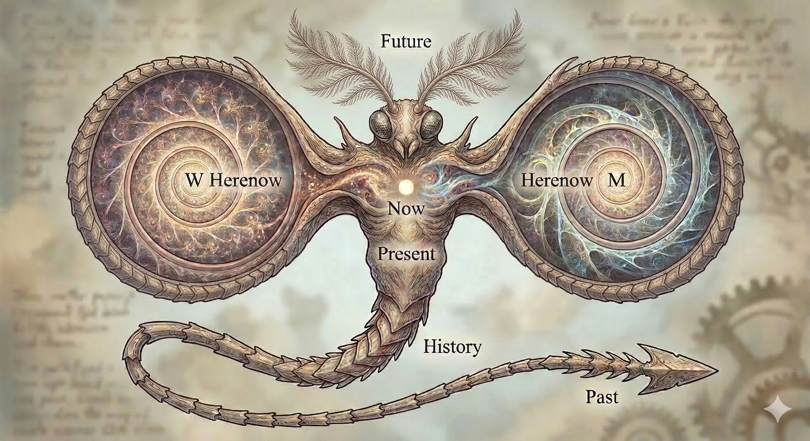
					- Features
						- The antennae branch into **future** possibilities.
						- The **now** heart mixes contents in space (2 wings) into time in the **present** body. The contents are from different selves (wings), each has its own **herenow**.
							- $W/M$ is the pair of dualistic opposites, such as man/woman, yin/yang, me/world, right/wrong, inside/outside, subject/object, etc.
						- The **history** “tail” is the linear recording of the **present** body, each record is a segment.
							- The historical records are reflected back to each wing as the segmented chitinous plates on its edge.
							- The hook of the **past** is what keeps all subjects stuck to the past (inertia).
							- If not skillfully untangled, the past stinger will inject poison (like scorpion, stingray) through attachment, clinging, fixation which is manifested through the three poisons of Greed, Anger, and Delusion.
					- Images of real-life animals
						- The upper part (head, feathered antennae, and large wings) are from the **moth**.
							- The wings are saucers of a fictional spaceship, like the [USS Enterprise](https://en.wikipedia.org/wiki/USS_Enterprise_(NCC-1701)).
						- The body of **human**.
						- The “tail” is of the **scorpion** mixed with the **millipede**.
							- The “tail” is actually the elongated body ([metasoma](https://en.wikipedia.org/wiki/Metasoma)), where each segment was added each time the creature molted, i.e. [anamorphosis](https://en.wikipedia.org/wiki/Anamorphosis_(biology)) like that of the millipede.
					- ((665359ff-79f1-4669-b10b-f2b0e633a7c1))
						- ((69b9470c-40e4-49ca-84df-1cb6a3379987)) in contrast with other mystical creatures and within itself
						  collapsed:: true
							- Emergence vs. predestination: Unlike the predestined timeline created by Clotho's fateful spindle and the deterministic calculation of Laplace's demon, with Temporix, the future is **open to possibilities**, and the past emerges from the **interaction** in the present.
							- Hooked stinger vs. scissors: Temporix shows a danger of time opposite to that of the Fates. It's the **burden and entanglement of the past**, instead of the unwanted events in the future (starting decisions by Clotho and ending decisions by Atropos).
							- The Now point vs. the pearl: The focal point of the Now is the internal “pearl”, compared to the external pearl that the Asian dragon 🐉 chases and guard.
							- Being present in both space & time: The present is the center both in space – “being here” between the wings – and in time – “being in the present” between past and future.
							- The History tail vs. the Past hook & stinger: While history is a useful data, a source of content for the present mixture, _the “past” as an independent & permanent thing or place is the **delusional attachment**_ that hooks and stings.
								- The actual past is the **reconstructed** events by pouring live content in the present to dead forms (segments) of history. That means it is inherently dependent on the current state and prone to distortion and hallucination.
								- The poisons (greed, anger, delusion) are the direct result of this delusional attachment.
									- Greed: Attaching to a “permanent” past success and trying to pull it into the now.
									- Anger: Attaching to a “permanent” past injury and trying to re-fight it in the now.
									- Delusion: The fundamental error of thinking that the history segments (data) are a Permanent Past (reality).
			- Present: When my self (compound particle) meets your self, my herenow mixes with your herenow resulting a **common “now”**, with a little “less here”, which we usually call “the present”.
				- The present is just the common part of many herenows of the participants, hence only a little portion of the Omnifold – the present dot (moment) – expressed through the interface between selves.
				- The [mixing](https://en.wikipedia.org/wiki/Mixing_(mathematics)) in the present is the arrow of time that [increases entropy](https://en.wikipedia.org/wiki/Entropy_of_mixing) by increasing extensity of the thread distribution via the multiplication of its extent by the number of participants to the meeting.
				  id:: 69b7a10c-73c2-4d34-9269-a27e5f23b90b
				- The information is lost through the [many-to-one function](https://mathworld.wolfram.com/Many-to-One.html) of ((66727858-979d-4d95-8a90-7a749218cfba))s.
				- The meeting is called [“wavefunction collapse” in QM](https://en.wikipedia.org/wiki/Wave_function_collapse) which reduces the uncertain futures (high entropy) into the certain prensent (low entropy).
			- Past: After the meeting, the common herenow is stored in both my self and your self, which both project out to be “the past”.
			  id:: 69b79d25-16e5-458a-bf1b-05c927494107
				- The past is a thread extending the present dot, hence just a small part of the Omifold.
				- The past of 2 selves has 2 copies in the Omnifold, the past of $n$ selves has $n$ copies, and so on. The more particles observing the common past, the more it is copied, the more certain it is, hence the lower entropy the past has.
			- Future: Looking forward to the next meeting, i can see my future but not yours because we're separated, hence each future has at most one copy, hence high entropy.
				- Actually, the further one look into future, the more diverse it is, the more its image resolution reduces – exponentially below 1 – hence much higher entropy.
				- Note that the expression “the future” is incorrect because there are various futures to come.
			- Note: Looking further into the past, the image also reduces resolution but linearly, hence the impression of the “fixed past”.
	- ## space
	  id:: 68fa1647-2d46-433e-b1ca-29f757b5ef62
	  collapsed:: true
	  :LOGBOOK:
	  CLOCK: [2025-10-23 Thu 18:49:30]
	  :END:
		- ((6699e4db-2e75-4427-94bb-96dfe0367dd1)) ((68fa164e-ef0e-4010-937d-ad9e0459f5f2))
	- ## appearance
	  id:: 66ab6161-0306-42d5-ac16-4155c69216f5
	  collapsed:: true
	  ((665359e4-4597-4775-b849-f9acbb98960a)) ((66ab6170-ea0d-4bd7-be7a-2e226a7ea7ee))
	  ((665c9af1-1ce2-461c-af33-671690618c8f)) ((670d0138-8f58-428b-808e-24c05a5239fb))
		- shape
		  id:: 66ab6170-ea0d-4bd7-be7a-2e226a7ea7ee
		  collapsed:: true
		  ((665c9af1-1ce2-461c-af33-671690618c8f)) ((66ab6161-0306-42d5-ac16-4155c69216f5))
			- ((6651ecba-793d-43c5-8020-a9f260b032d8)) ((66ab6170-ea0d-4bd7-be7a-2e226a7ea7ee)) is somehow more abstract than ((66ab6161-0306-42d5-ac16-4155c69216f5)), e.g. [geometrical shape](https://en.wikipedia.org/wiki/Shape) excludes some details like texture, color, etc.
		- ((6651ecba-793d-43c5-8020-a9f260b032d8)) ((66ab6161-0306-42d5-ac16-4155c69216f5)) of an ((667cfa42-ade7-4310-9a7b-6d14d01c16da)) is the ((670d0138-8f58-428b-808e-24c05a5239fb)) of that object.
	- ## structure
	  id:: 6678d596-9526-405a-968c-e73860e524f3
	  collapsed:: true
	  ((665359e4-4597-4775-b849-f9acbb98960a)) ((66ab6059-7a9d-4419-99be-69c9944a543f))
	  ((665c9af1-1ce2-461c-af33-671690618c8f)) ((670d0138-9012-4f3e-a9bd-997443fb22a3))
		- configuration
		  id:: 66ab6059-7a9d-4419-99be-69c9944a543f
		  ((665c9af1-1ce2-461c-af33-671690618c8f)) ((6678d596-9526-405a-968c-e73860e524f3))
		- ((6651ecba-793d-43c5-8020-a9f260b032d8)) ((6678d596-9526-405a-968c-e73860e524f3)) of an ((667cfa42-ade7-4310-9a7b-6d14d01c16da)) is the ((670d0138-9012-4f3e-a9bd-997443fb22a3)) of that object. A structure of a ((66532bc2-a18e-43ab-86ac-a0f0f7dcbbb5)) object can be decomposed into ((667d0b78-fff6-49bc-90d5-165648ed56d3))s between its ((66532bb2-7680-461b-80b2-71fc96c89fb9))s.
		- Variations:
		  id:: 667d09ec-4da1-428b-a7c9-bae1eb37a7ae
			- linear structure
			  id:: 667d0a09-6a59-483d-91e4-33a019655b42
			- circular structure
			- branching structure
			  id:: 66faa5f9-b719-4c5d-a1d9-d40b3fcbda21
			  is a [tree structure](((667252dc-e610-4d07-bcd0-9ea6fb4499fd))).
			- ### network
			  id:: 667d1a95-b621-49cd-8a72-a074c963c92a
				- Example: [network](https://en.wikipedia.org/wiki/Network_theory), [mathematical graph](https://en.wikipedia.org/wiki/Graph_(discrete_mathematics))
	- ## interface
	  id:: 670e0fef-2a46-450b-b043-176cccfc804a
	  collapsed:: true
	  :LOGBOOK:
	  CLOCK: [2024-10-15 Tue 13:47:19]
	  :END:
	  ((665c9af1-1ce2-461c-af33-671690618c8f)) ((670d0183-aba2-438b-b749-1b550e4a906b))
	  ((6699ea73-dc77-4227-a293-b501f2eb1759)) ((67110213-d0ca-4449-811a-b51abf23bf65))
		- ((6651ecba-793d-43c5-8020-a9f260b032d8)) ((670e0fef-2a46-450b-b043-176cccfc804a)) is the common boundary of two [bodies](((66c810a0-9861-4787-bdcf-1378219332be))) where they interact with each other.
		- ((66725725-f76a-4328-b162-f469b87e871b))
			- Information technology's [interfaces](https://en.wikipedia.org/wiki/Interface_(computing)) like [user interface](https://en.wikipedia.org/wiki/User_interface), [application programming interface](https://en.wikipedia.org/wiki/Application_programming_interface), [hardware interface](https://en.wikipedia.org/wiki/Electrical_connector), etc.
			- oil-water interface
		- cointerface
		  id:: 67110213-d0ca-4449-811a-b51abf23bf65
		  ((6699ea73-dc77-4227-a293-b501f2eb1759)) ((670e0fef-2a46-450b-b043-176cccfc804a))
			- The cointerface vs interface is the dual of complements similar to the [codomain vs domain](((670f5fa5-4e2b-4239-aeea-c1267f124d20))) in function as well as the [cocategory vs category](((670f5dfd-ff92-4122-a1d8-8dfaed3bd122))).
			  id:: 6711045f-1050-42a8-94f2-c913088ce9cd
				- ((670f4f06-b543-47d7-ab5d-846dcdd2281e))
				- The cointerface also shows itself in `D*`, D Star, the protocol-based programming language when dealing with the dialog-like bidirectional protocol.
					- Example interface
					  ```
					  (a, b) -> 
					  <- (c, d)
					  (e) ->
					  <- (f)
					  ```
					- Cointerface of Example interface
					  ```
					  (a, b) -> 
					  <- (c, d)
					  (e) ->
					  <- (f)
					  ```
					  ```
					  <- (a, b)
					  (c, d) ->
					  <- (e)
					  (f) ->
					  ```
	- ## substance
	  id:: 670e1047-529a-4698-9ad0-5e6c73c18202
	  collapsed:: true
	  :LOGBOOK:
	  CLOCK: [2024-10-15 Tue 13:48:45]
	  :END:
	  ((665359e4-4597-4775-b849-f9acbb98960a)) ((670e1053-773e-4cbb-9b5f-8bf9715759f7)), ((670d0160-ee4c-4b5f-b95f-80b0c2f3825f))
		- chất
		  id:: 670e1053-773e-4cbb-9b5f-8bf9715759f7
		  ((665c9af1-1ce2-461c-af33-671690618c8f)) ((670e1047-529a-4698-9ad0-5e6c73c18202))
		- ((665359c0-a89a-41b5-9f28-503f79107a08)) https://plato.stanford.edu/entries/substance/
	- ## essence
	  id:: 670e105b-5244-4f95-9f90-c99acdbce0e4
	  collapsed:: true
	  :LOGBOOK:
	  CLOCK: [2024-10-15 Tue 13:49:03]
	  :END:
	  ((665359e4-4597-4775-b849-f9acbb98960a)) ((670e106c-ed23-4496-a774-678a9a1fbb91))
	  ((665c9af1-1ce2-461c-af33-671690618c8f)) ((670e14c0-70c6-49ff-9bde-89db60b610c2))
		- bản chất
		  id:: 670e106c-ed23-4496-a774-678a9a1fbb91
		  ((665c9af1-1ce2-461c-af33-671690618c8f)) ((670e105b-5244-4f95-9f90-c99acdbce0e4))
		- Variations: ((66c8772a-9b29-45b0-b169-2fa847333e02))
	- ## independent
	  id:: 671b160c-0589-4f83-a778-a9fb4df6783a
	  collapsed:: true
	  ((66c80d5c-181f-4f06-a285-0624a65e9951)) ((671b1616-9958-48d9-95ba-9fc8e76f2867)), ((671b1eef-0820-4e03-8e8f-e9342ca18b26))
		- independency
		  id:: 671b1616-9958-48d9-95ba-9fc8e76f2867
		  ((66c80dde-a097-4744-8af8-c6e26dcfdda2)) ((671b160c-0589-4f83-a778-a9fb4df6783a))
		- independence
		  id:: 671b1eef-0820-4e03-8e8f-e9342ca18b26
		  ((66c80dde-a097-4744-8af8-c6e26dcfdda2)) ((671b160c-0589-4f83-a778-a9fb4df6783a))
		- ((6651ecba-793d-43c5-8020-a9f260b032d8)) An object A is ((671b160c-0589-4f83-a778-a9fb4df6783a)) from another object B when there is no ((667d0b78-fff6-49bc-90d5-165648ed56d3)) A ← B within the given scope of consideration. ((671b1616-9958-48d9-95ba-9fc8e76f2867)) is always ((66c80cbf-6626-4cb7-9b58-8ac3396e03da)) to some scope of consideration, and the “absolute independency” is just the independency relative to the universal scope.
		- ((66e4299e-0af8-47ee-adae-c13fb57fd15d))
			- In maths: [independent variable](https://en.wikipedia.org/wiki/Dependent_and_independent_variables), [stochastically independent](https://en.wikipedia.org/wiki/Independence_(probability_theory)), [logically independent](https://en.wikipedia.org/wiki/Independence_(mathematical_logic)), [perpendicular](https://en.wikipedia.org/wiki/Perpendicular), [orthogonal](https://en.wikipedia.org/wiki/Orthogonality), [linear independence](https://en.wikipedia.org/wiki/Linear_independence), [algebraic independence](https://en.wikipedia.org/wiki/Algebraic_independence), [independent set](https://en.wikipedia.org/wiki/Independent_set_(graph_theory)), [disjoint sets](https://en.wikipedia.org/wiki/Disjoint_sets)
			- In politics: [independence](https://en.wikipedia.org/wiki/Independence), [independent city](https://en.wikipedia.org/wiki/Independent_city), [independent politician](https://en.wikipedia.org/wiki/Independent_politician), etc.
			- In complex systems: emergent autonomy
			- In Holographic Universe: scale separation/invariance
			- In General Relativity: [background independence](https://en.wikipedia.org/wiki/Background_independence)
		- ((665359ff-79f1-4669-b10b-f2b0e633a7c1))
			- All independences are *emergent independence* built by walls of distance.
			  id:: 6916f0bf-dec9-4dff-a8c9-999c63adb522
			  collapsed:: true
			  :LOGBOOK:
			  CLOCK: [2025-11-14 Fri 16:05:12]
			  :END:
				- Maths wall = infinite(simal) limit
					- By means of limit, maths have made their walls “absolute independence”.
				- Physics wall = very large/small constants
				- Complex wall = big gaps between micro & macro scales
		- ### orthogonal
		  id:: 671b206e-c50c-47b0-903d-73e97d512d13
		  ((66c80d5c-181f-4f06-a285-0624a65e9951)) ((671b27ce-a9c8-48d7-b0b5-e056484a6747))
			- orthogonality
			  id:: 671b27ce-a9c8-48d7-b0b5-e056484a6747
			  ((66c80dde-a097-4744-8af8-c6e26dcfdda2)) ((671b206e-c50c-47b0-903d-73e97d512d13))
			- ((6651ecba-793d-43c5-8020-a9f260b032d8)) ((671b27ce-a9c8-48d7-b0b5-e056484a6747)) is a special kind of ((671b1616-9958-48d9-95ba-9fc8e76f2867)).
			- ((665359ff-79f1-4669-b10b-f2b0e633a7c1))
				- The [perpendicular](https://en.wikipedia.org/wiki/Perpendicular) symbol “⟂” versus the falsum symbol [up tack “⊥”](https://en.wikipedia.org/wiki/Up_tack)
				  collapsed:: true
				  :LOGBOOK:
				  CLOCK: [2025-04-25 Fri 17:50:36]
				  CLOCK: [2025-04-25 Fri 17:53:06]--[2025-04-25 Fri 21:29:51] =>  03:36:45
				  :END:
					- Although [Unicode 4.1 (March 2005)](https://www.unicode.org/charts/PDF/Unicode-4.1/U41-27C0.pdf) has introduced the symbol “⟂” ([U+27C2](https://www.compart.com/en/unicode/U+27C2)) dedicating to “perpendicular, orthogonal, independent”, many math typseting systems and HTML entities are still use the same symbol with the falsum “⊥” ([U+22A5](https://www.compart.com/en/unicode/U+22A5)).
						- The old Japanese charsets still have [no such distinction](https://ja.wikipedia.org/wiki/%E5%9E%82%E7%9B%B4%E8%A8%98%E5%8F%B7).
						- Note on the [discrepancy of `&perp;`](https://en.wikipedia.org/wiki/List_of_XML_and_HTML_character_entity_references#cite_note-perp-50) in the [List of XML and HTML character entity references](https://en.wikipedia.org/wiki/List_of_XML_and_HTML_character_entity_references):
						  > However, HTML uses U+22A5 as its "perpendicular" symbol: this is a discrepancy between HTML and Unicode.
						- [Unicode 4.0](https://www.unicode.org/versions/Unicode4.0.0/CodeCharts.pdf) did defined `UP TACK = orthogonal to = perpendicular = base, bottom`.
						  collapsed:: true
							- 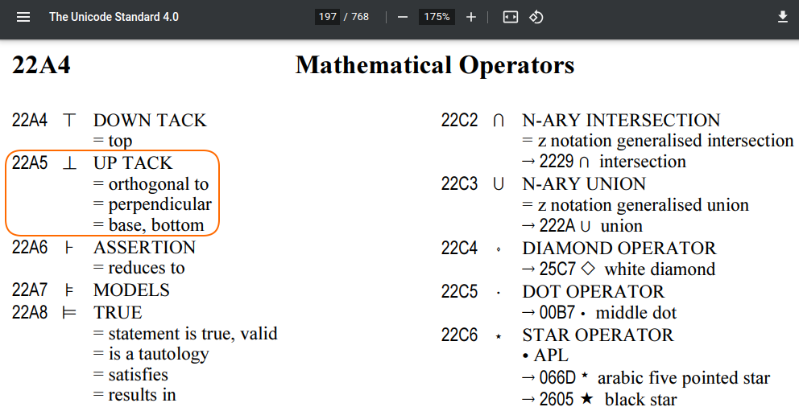
					- Math expressions: ⟂=$⟂$, ⊥=$⊥$, `\perp`=$\perp$, `\bot`=$\bot$
					- HTML entities: `&Perpendicular;`=[:b "&Perpendicular;"], `&perp;`=[:b "&perp;"], `&bot;`=[:b "&bot;"], `&bottom;`=[:b "&bottom;"], `&UpTee;`=[:b "&UpTee;"].
					- The two symbols are indistinguishable to the human eyes: ⟂⊥
						- In some fonts, they are rendered differently... just a little bit!
					- I've add this [historical note](https://en.wikipedia.org/w/index.php?title=Up_tack&diff=1287329130&oldid=1287327431) to Wikipedia page [up tack](https://en.wikipedia.org/wiki/Up_tack#Perpendicular_symbol)
					- I've updated [CreatZy shorthand](((66fe9e2e-13cf-4b31-96e7-1b050eed47c4))) `=T` from `⊥` (U+22A5) to `⟂` (U+27C2).
	- ## relation
	  id:: 667d0b78-fff6-49bc-90d5-165648ed56d3
	  collapsed:: true
	  ((665ca48e-f7c1-4541-b5cf-486d86b02997)) ((66600918-367c-413c-863d-2cf11a89c437))
	  ((66c80da9-4cfb-4de7-b83d-8b70665207bf)) ((671b1669-d31e-4965-adf4-2862cbefdfa8)), ((66c80cbf-6626-4cb7-9b58-8ac3396e03da))
		- related
		  id:: 671b1669-d31e-4965-adf4-2862cbefdfa8
		  ((66c80e01-002b-42ae-9c60-49bf3fc6e159)) ((667d0b78-fff6-49bc-90d5-165648ed56d3))
		- ((6651ecba-793d-43c5-8020-a9f260b032d8)) ((667d0b78-fff6-49bc-90d5-165648ed56d3)) between ((667cfa42-ade7-4310-9a7b-6d14d01c16da))s (usually 2 objects) is a ((667d0d2e-15c7-4989-a183-69a9a5c6bf8a)) connecting these objects together. A ((667d0d8e-0873-4440-a97d-b08f9405e769)) between 2 objects A and B is denoted by two arrows A → B and B → A, which are the ((6729b7cf-83b8-4a42-aac7-ec8cf16fa734)) of the corresponding two ((669a58b9-eb34-41cd-8605-02e29b07e1b5))s. A relation between many objects is the ((6678d596-9526-405a-968c-e73860e524f3)) of the ((66532bc2-a18e-43ab-86ac-a0f0f7dcbbb5)) of these objects. Although some relations, like ((667d0d8e-0873-4440-a97d-b08f9405e769)), appear to be unidirectional, that part is just the external (objective) arrow while there's a corresponding internal (subjective) arrow in the other direction, which is hidden inside the ((667cfa3e-9856-43f0-956b-ebb4ff31d8eb)) of relation, to complete the relation into a circle.
		- ((671b18a8-ac11-4930-bed3-645c0cc983a8))
			- binary relation
			  id:: 667d0d8e-0873-4440-a97d-b08f9405e769
				- Example: [binary relation](https://en.wikipedia.org/wiki/Binary_relation) and [relation](https://en.wikipedia.org/wiki/Relation_(mathematics)) in Maths.
		- ((665359ff-79f1-4669-b10b-f2b0e633a7c1))
		- ### relative
		  id:: 66c80cbf-6626-4cb7-9b58-8ac3396e03da
		  collapsed:: true
		  :LOGBOOK:
		  CLOCK: [2024-08-23 Fri 11:15:34]
		  :END:
		  ((66c80e01-002b-42ae-9c60-49bf3fc6e159)) ((667d0b78-fff6-49bc-90d5-165648ed56d3)) 
		  ((66c80d5c-181f-4f06-a285-0624a65e9951)) ((66c80dc7-8ed4-4cd1-8989-e75a42f31c60))
		  ((6699ea73-dc77-4227-a293-b501f2eb1759)) ((6729b71b-e8ea-414d-8202-b66c1fc2d67d))
			- relativity
			  id:: 66c80dc7-8ed4-4cd1-8989-e75a42f31c60
			  ((66c80dde-a097-4744-8af8-c6e26dcfdda2)) ((66c80cbf-6626-4cb7-9b58-8ac3396e03da))
			- ((6651ecba-793d-43c5-8020-a9f260b032d8)) Any ((665ca429-84e3-49ff-921e-c07d19cd99ba)) is an image ((66c83149-6ee5-4a8c-b4eb-0308d1a11535))ed by some ((669a2487-054d-4408-ae41-189e34af81a9)). Against the same ((6678288e-699b-4325-bdba-bf6349fe0d57)), different forms are seen via different ((667272b8-88a8-4928-a22a-35035c9edf05))s due to the form being created in relation to the point of projection. These differences show the ((66c80dc7-8ed4-4cd1-8989-e75a42f31c60)) of the form, i.e. the form is ((66c80cbf-6626-4cb7-9b58-8ac3396e03da)) to the point of projection, the viewpoint, which is called the ((6729b90b-1ee3-4efc-b62c-281f9621f487)).
			- reference point
			  id:: 6729b90b-1ee3-4efc-b62c-281f9621f487
				- ((66725725-f76a-4328-b162-f469b87e871b))
					- [reference frame](https://en.wikipedia.org/wiki/Frame_of_reference) in physics
		- absolute
		  id:: 6729b71b-e8ea-414d-8202-b66c1fc2d67d
		  collapsed:: true
		  ((6699ea73-dc77-4227-a293-b501f2eb1759)) ((66c80cbf-6626-4cb7-9b58-8ac3396e03da))
		  ((66c80d5c-181f-4f06-a285-0624a65e9951)) ((6729c1c5-7eb2-408b-a205-f3039799d19c))
			- ((6651ecba-793d-43c5-8020-a9f260b032d8)) A form is ((6729b71b-e8ea-414d-8202-b66c1fc2d67d)) in a ((667cfac2-17f1-4cbd-9f6d-1e722ff2a870)) when its ((6729b90b-1ee3-4efc-b62c-281f9621f487)) is the ((66ab7477-c060-4d07-ab13-bc3d11246854)) of that world, i.e. _an absolute form is relative to the whole world_ instead of a particular partial viewpoint. That center is the common reference point for the whole world, which effectively fixes all forms relative to it and make them absolute forms. The absolute reference point is called by many names like “center”, “root”, “origin”, etc.
			- absoluteness
			  id:: 6729c1c5-7eb2-408b-a205-f3039799d19c
			  ((66c80dde-a097-4744-8af8-c6e26dcfdda2)) ((6729b71b-e8ea-414d-8202-b66c1fc2d67d))
	- ## concretization
	  id:: 68932036-e868-4468-a891-70cdf09ea904
	  collapsed:: true
	  ((6699ea73-dc77-4227-a293-b501f2eb1759)) ((66537674-6cf9-4459-8bea-7c1858c694a3))
	  ((66c80da9-4cfb-4de7-b83d-8b70665207bf)) ((68932044-a013-4cc6-b468-df8f3a43103c))
		- concrete
		  id:: 68932044-a013-4cc6-b468-df8f3a43103c
		  ((6699ea73-dc77-4227-a293-b501f2eb1759)) ((66c8369a-ccb8-4f1f-b12b-bf7054cb79e4))
		  ((66c80e01-002b-42ae-9c60-49bf3fc6e159)) ((68932036-e868-4468-a891-70cdf09ea904))
		- ((6651ecba-793d-43c5-8020-a9f260b032d8)) ((68932036-e868-4468-a891-70cdf09ea904)) is the process of a subject making an ((66c8369a-ccb8-4f1f-b12b-bf7054cb79e4)) concept more concrete by adding details to it, so that the result will be tangible to larger ((669a5387-2a97-4311-a295-aa0afd9c4d76))s.
		  id:: 68932ee4-52d9-4a42-be26-1b1cba40aeff
		- ((66e4299e-0af8-47ee-adae-c13fb57fd15d))
			- ((66ea4597-f085-4f38-95f7-91bf5cd61b1c)) of a concept of a general category is the creation of particular instances in that category.
			- [reification](https://en.wikipedia.org/wiki/Reification) of an abstract concept is the encapsulation of that concept in a concrete container for handing like an object.
			- [objectification](https://en.wiktionary.org/wiki/objectification#English) is the process of projecting a concept/image in a subject out of that subject to become an object.
			- [materialization](https://en.wiktionary.org/wiki/materialization#English) is the process of turning an immaterial thing into a material object in the physical world.
	- ## abstraction
	  id:: 66537674-6cf9-4459-8bea-7c1858c694a3
	  collapsed:: true
	  ((6699ea73-dc77-4227-a293-b501f2eb1759)) ((68932036-e868-4468-a891-70cdf09ea904))
	  ((66c80da9-4cfb-4de7-b83d-8b70665207bf)) ((66c8369a-ccb8-4f1f-b12b-bf7054cb79e4))
	  ((66c80da7-c0e8-46d2-85e5-71318fd44eff)) ((66c8369a-ccb8-4f1f-b12b-bf7054cb79e4))
		- abstract
		  id:: 66c8369a-ccb8-4f1f-b12b-bf7054cb79e4
		  ((6699ea73-dc77-4227-a293-b501f2eb1759)) ((68932044-a013-4cc6-b468-df8f3a43103c)) 
		  ((66c80e01-002b-42ae-9c60-49bf3fc6e159)) ((66537674-6cf9-4459-8bea-7c1858c694a3))
		  ((66c80dfd-95e2-4b5a-bd56-06e8307e81ca)) ((66537674-6cf9-4459-8bea-7c1858c694a3))
		- ((665359c0-a89a-41b5-9f28-503f79107a08)) https://en.wikipedia.org/wiki/Abstraction
		  id:: 6716110e-5f12-4484-97ca-fde30d4ff0d3
		- ((6651ecba-793d-43c5-8020-a9f260b032d8)) ((66537674-6cf9-4459-8bea-7c1858c694a3)) is the process of abstracting details, i.e. removing details that are irrelevant to the ((667cfa3e-9856-43f0-956b-ebb4ff31d8eb))'s focus, from an ((667cfa42-ade7-4310-9a7b-6d14d01c16da)), to get a more concise object that can be handled easier compared to the original object with full details. The result of that process is called by many names: abstract, abstraction, summary, name, title, key, etc. Abstraction is related to ((6653769c-3334-46fa-a1d5-4ce6a7fc23e8)) via the ((687505e2-062a-4267-98bc-ed0e9f6dced3)): ((67654618-70d2-49cd-88b7-f7c4e161dfd9)) = circle ((67654ecb-896a-4421-95e5-f72c07fc62a4)); ((676545e8-429c-41e7-97ed-12cc8e8870d4)) = pipe ((670cdcb4-3c85-45af-8c30-3c3284ed37df)); ((676545b3-2d9f-43af-8ff0-3543dbe73159)) = ((670ce218-a01f-4609-b7f2-beda7cf2ebc3)).
		- ((665359ff-79f1-4669-b10b-f2b0e633a7c1))
			- Recursively naming the ignorance – the power and fallacy of abstraction.
			  id:: 692818bf-7a44-4804-b444-1bdb45e3ddb4
			  collapsed:: true
			  :LOGBOOK:
			  CLOCK: [2025-11-27 Thu 16:24:17]
			  :END:
				- The power lies in our recursive mind's ability to name the abstract, while the fallacy lies in forgetting that these names are merely internal cognitive tools, not independent external reality.
				- The mechanism: recursively naming the ignorance
				  id:: 69282878-05a5-4ee0-a663-9e7369c9d74a
					- The ability to operate in this abstract, non-constructive realm stems from a single, foundational cognitive maneuver: applying a recursive naming convention to acknowledge different boundaries of our current, constructive knowledge with different names. This process is how the human mind bridges the gap between the computationally finite and the mathematically infinite.
					- 1. Encountering the limit, i.e. ignorance: We perform a constructive process (e.g., counting, defining a set) and reach a point where the process is infinite or non-terminating (the computational limit). We cannot physically build the next step or the final collection.
					- 2. The naming operation, i.e. ((676545b3-2d9f-43af-8ff0-3543dbe73159)): We stop the constructive process and assign a simple, finite label (a ((665cab38-f8e8-472e-b0a1-60776d492835))) to the unreached totality or the next step we cannot take. This name symbolizes *the gap in our operational knowledge*, e.g., calling the collection of all natural numbers “ℕ”.
					- 3. Recursive application: We treat this new name *as if it were a complete*, first-class citizen in our mental model. We can then apply the original constructive/recursive rules again, using the newly named entity as a starting point.
					- ((66725725-f76a-4328-b162-f469b87e871b))
						- [Ordinal numbers](https://en.wikipedia.org/wiki/Ordinal_number): “Gather all bags constructed into a new bag”. The moment we “gather” an infinite collection into a single mental object is the act of naming our computational ignorance of traversing the entire sequence. We name it ω, then recursively apply the successor operation to get ω+1, ω+2, etc., naming our ignorance recursively.
						- The [limit operator](https://en.wikipedia.org/wiki/Limit_(mathematics)): We know how to build a sequence $S_n$, but we cannot compute the infinite number of its terms. So, we name the idea of that final value “$\lim_{n → ∞}S_n$”. And then we use that name in further, complex equations, building abstract knowledge on top of a single symbol that represents an uncomputable process.
				- The constructive existence of non-constructive entities (numbers)
					- The mechanism of [recursively naming the ignorance](((69282878-05a5-4ee0-a663-9e7369c9d74a))) recontextualizes “non-constructive” mathematical entities (like [large numbers](https://en.wikipedia.org/wiki/Large_cardinal) or the end result of an infinite limit): Their existence is not an objective reality “out there”, but an internal, mental one.
					- Non-constructive numbers are mental constructs: They are “imaginary” in the sense that they exist within our minds, generated by our own recursive thought processes. They are not discovered but created internally.
					- Constructive value, non-constructive names: These concepts are actually constructive in nature, as they arise from a defined recursive process. They are given non-constructive names (like “infinity” or “Ω”) to label the end point of a process that cannot be finitely completed.
					- The true “value”: The actual, constructive value of these concepts is not the unreachable “infinity” itself, but the _**structure of the recursive construction** starting from zero/ignorance_. We use the names to recursively label our further ignorance, allowing us to reason about the process structure abstractly.
				- The power of abstraction: enabling thought and communication
				  id:: 6926be1b-910d-4e6e-990d-947440c86fdb
				  collapsed:: true
					- The human ability to assign names to the outcomes of infinite, non-constructive processes – essentially labeling our computational limits – is not without merit. It grants us remarkable cognitive power.
					- Cognitive compression: Naming an infinite concept (e.g., [∞](https://en.wikipedia.org/wiki/Infinity), [Ω](https://en.wikipedia.org/wiki/Chaitin%27s_constant), the result of the Halting Problem Oracle) allows us to treat a complex, ongoing process as a single, manageable mental object. This compression frees up cognitive resources.
					- Facilitating higher-order reasoning: Abstraction enables us to move up levels of thought. By simply declaring the existence of a set of all natural numbers (ℕ), we can then define operations and structures upon that named set (like calculus or group theory) without constantly having to re-derive the foundational set constructively every time.
					- Universal communication: Shared labels like “infinity” provide a common ground for mathematicians to communicate about shared mental constructs, even if the underlying constructive process remains beyond any single individual's complete execution.
					- Inspiration for computation: The abstract, non-constructive ideals of mathematics often serve as blue sky inspiration for computer science models, leading to recursive programming paradigms, [type theory](https://en.wikipedia.org/wiki/Type_theory), etc.
				- The fallacy of abstraction: conflating name with objective existence
				  collapsed:: true
					- The fallacy of declaration: The primary fallacy is confusing the act of naming with the proof of existence or distinction. Classic math declares existence by naming, then derives further existence via logic to achieve [“existence proof”](https://en.wikipedia.org/wiki/Existence_theorem) of objects that cannot be [constructed](https://en.wikipedia.org/wiki/Constructive_proof) nor observed.
					- Reifying the unknown: We risk treating an abstract name (e.g., “A”) as an objective, independently existing entity within a closed system ([“The Black Box”](((692821f8-dbc0-4653-b31f-22e5c4d5fac1)))), even when we have no operational way to verify its properties or distinguish it from “B”.
					- Ignoring the process: By focusing purely on the elegant name (the symbol ∞), we can neglect the underlying structure of the recursive construction that generated the concept in the first place. The value is in the algorithm, not the unreachable result.
					- Physical miscalculation: Applying the fallacy to physics leads to errors when mathematical declarations (e.g., particles A and B are “different by name”) contradict physical reality (the particles are observationally identical), as shown in [Gibbs paradox](https://en.wikipedia.org/wiki/Gibbs_paradox) about entropy of [indistinguishable particles](https://en.wikipedia.org/wiki/Indistinguishable_particles).
					- These fallacies are demonstrated in the [Diff Problem](((6928252f-3bf8-4c1b-82a3-965da2e6b65b))) and the [Choice in Black Box Experiment](((692821f8-dbc0-4653-b31f-22e5c4d5fac1))).
				- Diff Problem: challenging declarative identity
				  id:: 6928252f-3bf8-4c1b-82a3-965da2e6b65b
				  collapsed:: true
					- The Diff Problem exposes the flaw in defining difference and sameness through mere declaration or naming in classical logic. It demands an operational specification for distinction.
					- Problem: How to know A is different from B?
					- Classical math approach (declarative): Objects A and B are declared different, and assigned distinct names. The assertion $A ≠ B$ is taken for granted. This leads to issues, such as the [Gibbs Paradox](https://en.wikipedia.org/wiki/Gibbs_paradox) in physics, where the name (identity) is confused with the structure (observational properties).
					- Constructivist approach (operational): Names are subjective labels; true distinction lies solely within the structure and observable properties of the objects. One cannot simply declare $A ≠ B$; one must provide a constructive algorithm that operationally demonstrates a difference. A declaration of difference without an operational proof is an “ignorant arrogance”.
				- Choice in Black Box Experiment: challenging the [Law of Excluded Middle](https://en.wikipedia.org/wiki/Law_of_excluded_middle)
				  id:: 692821f8-dbc0-4653-b31f-22e5c4d5fac1
				  collapsed:: true
					- This thought experiment challenges the classical Law of Excluded Middle by demanding empirical, constructive proof of identity and existence.
					- Setup: Two balls, A and B, are placed in a black box. An attempt is made to pick one ball out and name it “C”.
					- Classical conclusion: The classical mathematician asserts: “C is either A or B” ($C = A ∨ C = B$). This relies on the declarative premise that only A and B exist in the box and that their identities are fixed and *knowable in absentia*.
					- Constructive counterargument: The classical conclusion is flawed because it makes non-constructive assumptions:
						- Existence is not guaranteed: The box might be “wild” enough that no ball can be retrieved (non-constructive existence).
						- Identity is not guaranteed: Until the ball is observed and structurally identified, it could be anything, even a “ghost” creation in the dark. The name “C” does not inherit the properties of A or B until an observational operation confirms the structural match. The statement $C = A ∨ C = B$ cannot be proven constructively without opening the box.
		- ### ω-abstraction
		  id:: 67654618-70d2-49cd-88b7-f7c4e161dfd9
		  :LOGBOOK:
		  CLOCK: [2024-12-20 Fri 18:22:22]
		  :END:
		  ((665359e4-4597-4775-b849-f9acbb98960a)) ((676550af-8792-4eef-afd7-ae0d949d78a4))
		  circle ((67654ecb-896a-4421-95e5-f72c07fc62a4))
			- extent abstraction
			  id:: 676550af-8792-4eef-afd7-ae0d949d78a4
			  ((665c9af1-1ce2-461c-af33-671690618c8f)) ((67654618-70d2-49cd-88b7-f7c4e161dfd9))
			- ω-expansion = circle unwinding = multiply with extext
		- ### φ-abstraction
		  id:: 676545e8-429c-41e7-97ed-12cc8e8870d4
		  :LOGBOOK:
		  CLOCK: [2024-12-20 Fri 18:22:29]
		  :END:
		  ((665359e4-4597-4775-b849-f9acbb98960a)) ((676550e5-6420-425a-97a8-33e5c4a5963e))
		  pipe ((670cdcb4-3c85-45af-8c30-3c3284ed37df))
			- phase abstraction
			  id:: 676550e5-6420-425a-97a8-33e5c4a5963e
			  ((665c9af1-1ce2-461c-af33-671690618c8f)) ((676545e8-429c-41e7-97ed-12cc8e8870d4))
			- rounding = abstracting remainder, leaving quotient (extent) & denominator (intent)
			- φ-extension = add phase refinement (remainder/denominator) to extent
		- ### ε-abstraction
		  id:: 676545b3-2d9f-43af-8ff0-3543dbe73159
		  :LOGBOOK:
		  CLOCK: [2024-12-20 Fri 18:22:34]
		  :END:
		  ((665359e4-4597-4775-b849-f9acbb98960a)) ((67655101-067d-45ab-9943-49e209af44d7))
		  ((670ce218-a01f-4609-b7f2-beda7cf2ebc3))
			- intent abstraction
			  id:: 67655101-067d-45ab-9943-49e209af44d7
			  ((665c9af1-1ce2-461c-af33-671690618c8f)) ((676545b3-2d9f-43af-8ff0-3543dbe73159))
			- ε-expansion = cone action = multiply with intent
	- ## fold
	  id:: 691ae014-cb3b-407f-b84b-582f0025c37c
	  collapsed:: true
	  :LOGBOOK:
	  CLOCK: [2025-11-17 Mon 15:43:45]
	  :END:
	  ((691ae2bd-a60f-4db2-8132-bf54e9dee1b0)) ((691ae231-4659-41b8-9c1a-8e702a04753d))
		- ((6651ecba-793d-43c5-8020-a9f260b032d8)) To ((691ae014-cb3b-407f-b84b-582f0025c37c)) is to [transform](((669a58b9-eb34-41cd-8605-02e29b07e1b5))) an ((667d15b7-6364-49a9-ac58-c64d2a992b63)) to a ((667d15c6-67c4-4998-a549-c8b3f9de3d60)) by matching its head with its tail.
		- unfold
		  id:: 691ae231-4659-41b8-9c1a-8e702a04753d
		  ((691ae2c3-74aa-4b95-afb6-ed174be00978)) ((691ae014-cb3b-407f-b84b-582f0025c37c))
		- ### foldable
		  id:: 66537617-23c2-43a9-9a14-5e18fe9aa36f
		  collapsed:: true
		  ((665359e4-4597-4775-b849-f9acbb98960a)) ((665c9fb6-841c-4ee9-93a1-d17b5811a98e)), ((665c9fb9-28e8-48e3-bd81-f773549f145d))
			- collapsible
			  id:: 665c9fb6-841c-4ee9-93a1-d17b5811a98e
			  ((665c9af1-1ce2-461c-af33-671690618c8f)) ((66537617-23c2-43a9-9a14-5e18fe9aa36f))
			- abstractable
			  id:: 665c9fb9-28e8-48e3-bd81-f773549f145d
			  ((665c9af1-1ce2-461c-af33-671690618c8f)) ((66537617-23c2-43a9-9a14-5e18fe9aa36f))
			- ((6651ecba-793d-43c5-8020-a9f260b032d8)) A foldable object, usually a block of text, is an object that can be folded (or collapsed, abstracted) into a brief like header, title, name, summary, and that brief can be unfolded (or expanded, extended) back to the full object. This is a technical implementation of the general ((66537674-6cf9-4459-8bea-7c1858c694a3)).
			  id:: c6770550-24e0-453d-9159-5040ce045c5f
			- ((66725725-f76a-4328-b162-f469b87e871b))
				- Foldable [code block](https://en.wikipedia.org/wiki/Block_(programming))s in [IDE](https://en.wikipedia.org/wiki/Integrated_development_environment) or blocks of text in [text editor](https://en.wikipedia.org/wiki/Text_editor)s
				- The ((6720bf1a-fa1f-4c1d-ba6f-2527a47621eb)) [`<summary>` tag](https://developer.mozilla.org/en-US/docs/Web/HTML/Element/summary) within the `<details>` tag
				- [Directory](https://en.wikipedia.org/wiki/Directory_(computing)) in collapsible ((667252dc-e610-4d07-bcd0-9ea6fb4499fd))
				- [File folder](https://en.wikipedia.org/wiki/File_folder) that holds [papers](https://en.wikipedia.org/wiki/Paper "Paper") together
				- The [tab](https://en.wikipedia.org/wiki/Tab_(interface)) in [GUI](https://en.wikipedia.org/wiki/Graphical_user_interface)
			- In [Obsidian](https://help.obsidian.md/Editing+and+formatting/Folding):  Headings, indented blocks.
	- ## composite
	  id:: 66532bc2-a18e-43ab-86ac-a0f0f7dcbbb5
	  collapsed:: true
		- ((665ca480-5ac8-4728-a331-2f68b48759d1)) ((6652048c-27b3-47b6-84e5-25af8d9ce801))
		- ((6651ecba-793d-43c5-8020-a9f260b032d8)) A ((66532bc2-a18e-43ab-86ac-a0f0f7dcbbb5)) is an ((667cfa42-ade7-4310-9a7b-6d14d01c16da)) [composed of](((667cdbc9-3030-4429-b59e-4545cb3627e3))) other ((667cfa42-ade7-4310-9a7b-6d14d01c16da))s called ((66532bb2-7680-461b-80b2-71fc96c89fb9))s.
		- ((66725725-f76a-4328-b162-f469b87e871b))
			- In IT: [composite data type](https://en.wikipedia.org/wiki/Composite_data_type), [composite object](https://en.wikipedia.org/wiki/Object_composition), [composite pattern](https://refactoring.guru/design-patterns/composite)
			- In physics: [composite (material)](https://en.wikipedia.org/wiki/Composite_material), [composite particle](https://en.wikipedia.org/wiki/Composite_particle),
			- In chemistry: [compound](https://en.wikipedia.org/wiki/Chemical_compound), [alloy](https://en.wikipedia.org/wiki/Alloy), [mixture](https://en.wikipedia.org/wiki/Mixture)
			- In maths: [composite number](https://en.wikipedia.org/wiki/Composite_number), [composite function](https://en.wikipedia.org/wiki/Function_composition), [tuple](https://en.wikipedia.org/wiki/Tuple), [set](https://en.wikipedia.org/wiki/Set_(mathematics)), [class](https://en.wikipedia.org/wiki/Class_(set_theory))
			- In linguistics: [compound (word)](https://en.wikipedia.org/wiki/Compound_(linguistics))
			- In Buddhism: [five aggregates](https://en.wikipedia.org/wiki/Skandha)
		- Variations:
			- A ((66532bc2-a18e-43ab-86ac-a0f0f7dcbbb5)) with loosely connected ((66532bb2-7680-461b-80b2-71fc96c89fb9))s is called ((667ceb89-10fb-463e-90f7-9e89daec8ff6)), e.g. [aggregation in OOP](https://www.geeksforgeeks.org/association-composition-aggregation-java/), [set in maths](https://en.wikipedia.org/wiki/Set_(mathematics)).
			- A ((66532bc2-a18e-43ab-86ac-a0f0f7dcbbb5)) with ((66532bb2-7680-461b-80b2-71fc96c89fb9))s tightly connected by specific relations is called [structure](((667cec5f-f909-4da3-a1d4-681bcaee3b61))), e.g. [algebraic structure](https://en.wikipedia.org/wiki/Algebraic_structure), [mathematical category](https://en.wikipedia.org/wiki/Category_(mathematics)), [mathematical graph](https://en.wikipedia.org/wiki/Graph_(discrete_mathematics)), [tree structure](((667252dc-e610-4d07-bcd0-9ea6fb4499fd))).
	- ## component
	  id:: 66532bb2-7680-461b-80b2-71fc96c89fb9
	  collapsed:: true
		- ((665ca480-5ac8-4728-a331-2f68b48759d1)) ((66532ccc-ae21-4940-8714-715060d6bd90))
		- ((6651ecba-793d-43c5-8020-a9f260b032d8)) A ((66532bb2-7680-461b-80b2-71fc96c89fb9)) is an ((667cfa42-ade7-4310-9a7b-6d14d01c16da)) within another object called ((66532bc2-a18e-43ab-86ac-a0f0f7dcbbb5)).
	- ## composition
	  id:: 667cdbc9-3030-4429-b59e-4545cb3627e3
	  collapsed:: true
		- ((6651ecba-793d-43c5-8020-a9f260b032d8)) ((667cdbc9-3030-4429-b59e-4545cb3627e3)) is the act of combining many small objects, called ((66532bb2-7680-461b-80b2-71fc96c89fb9))s, into a larger object, called ((66532bc2-a18e-43ab-86ac-a0f0f7dcbbb5)).
		- ((66725725-f76a-4328-b162-f469b87e871b))
			- In IT: [object composition](https://en.wikipedia.org/wiki/Object_composition)
			- In maths: [function composition](https://en.wikipedia.org/wiki/Function_composition)
		- Variations:
			- aggregation
			  id:: 667ceb89-10fb-463e-90f7-9e89daec8ff6
			  is the act of simply collecting ((66532bb2-7680-461b-80b2-71fc96c89fb9)) objects into a "bag" of objects.
			- structuring
			  id:: 667cec5f-f909-4da3-a1d4-681bcaee3b61
			  is the act of putting ((66532bb2-7680-461b-80b2-71fc96c89fb9)) objects into a ((6678d596-9526-405a-968c-e73860e524f3)), which is an organization of relations between objects.
				- There are as many variations of composition as many [variations of strucure](((667d09ec-4da1-428b-a7c9-bae1eb37a7ae))).
				- linear composition
				  id:: 667d1227-6d59-4d36-ae52-c1f97361e814
				  is the composition in ((667d0a09-6a59-483d-91e4-33a019655b42)).
					- ((667d1227-6d59-4d36-ae52-c1f97361e814)) of ((667d162c-16cf-44d3-81a5-29b1b885164f))s
					  ((66725725-f76a-4328-b162-f469b87e871b)) [listing](https://en.wikipedia.org/wiki/List), [enumeration](https://en.wikipedia.org/wiki/Enumeration)
					- ((667d1227-6d59-4d36-ae52-c1f97361e814)) of ((667d15b7-6364-49a9-ac58-c64d2a992b63))s
					  id:: 667d151a-eaaa-4299-97b6-f3cd8f1aa98d
					  ((66725725-f76a-4328-b162-f469b87e871b)) [function composition](https://en.wikipedia.org/wiki/Function_composition)
					- sorting
					  is the ((667d1227-6d59-4d36-ae52-c1f97361e814)) that satisfy a specific order.
	- ## crystal
	  id:: 66537bdd-6c99-4d7b-905a-e2a487cae5ce
	  collapsed:: true
	  ((66c80da7-c0e8-46d2-85e5-71318fd44eff)) ((671e35d5-231a-4ed4-8c4a-6b200f6ccf20))
	  ((66c80da9-4cfb-4de7-b83d-8b70665207bf)) ((6818a270-b75b-44ee-bbd2-0032846e4cb8))
		- ((665359c0-a89a-41b5-9f28-503f79107a08)) https://en.wikipedia.org/wiki/Crystal
		- ((6651ecba-793d-43c5-8020-a9f260b032d8)) A [solid](https://en.wikipedia.org/wiki/Solid "Solid") material whose constituents (such as [atoms](https://en.wikipedia.org/wiki/Atom "Atom"), [molecules](https://en.wikipedia.org/wiki/Molecule "Molecule"), or [ions](https://en.wikipedia.org/wiki/Ion "Ion")) are arranged in [crystal structure](https://en.wikipedia.org/wiki/Crystal_structure)  which is a periodic [long-range order](https://en.wikipedia.org/wiki/Long-range_order "Long-range order") that extends in all directions called ((66537b4c-fa0a-4e95-b854-096e9802aa09)) in math.
		- crystallize
		  id:: 671e35d5-231a-4ed4-8c4a-6b200f6ccf20
		  ((66c80dfd-95e2-4b5a-bd56-06e8307e81ca)) ((66537bdd-6c99-4d7b-905a-e2a487cae5ce))
		- crystal
		  id:: 6818a270-b75b-44ee-bbd2-0032846e4cb8
		  ((66c80e01-002b-42ae-9c60-49bf3fc6e159)) ((66537bdd-6c99-4d7b-905a-e2a487cae5ce))
	- ## condensate
	  id:: 671e2782-2098-41a3-83a7-e042bfb468d7
	  collapsed:: true
	  :LOGBOOK:
	  CLOCK: [2024-10-27 Sun 20:29:57]
	  :END:
	  ((665359e4-4597-4775-b849-f9acbb98960a)) ((671e31f7-b52b-492c-93cb-3233fa40db5a))
	  ((66c80d5c-181f-4f06-a285-0624a65e9951)) ((671e3a95-03cf-4fe8-b7c7-c3d7bbe466ec))
	  ((66c80da7-c0e8-46d2-85e5-71318fd44eff)) ((671e3d98-0006-43be-b714-247f3d3a0c49))
		- condensed matter
		  id:: 671e31f7-b52b-492c-93cb-3233fa40db5a
		  collapsed:: true
		  ((665c9af1-1ce2-461c-af33-671690618c8f)) ((671e2782-2098-41a3-83a7-e042bfb468d7))
			- ((665359c0-a89a-41b5-9f28-503f79107a08)) https://en.wikipedia.org/wiki/Condensed_matter_physics
		- ((6651ecba-793d-43c5-8020-a9f260b032d8)) ((671e2782-2098-41a3-83a7-e042bfb468d7)) is (relatively) incompressible, usually includes both ((671e277d-2d1e-42c5-8ea7-58e519a69dca)) and ((669a58b9-8e69-43d2-9f59-fedf31bf0670)).
		- Etymology: condensate = [con-](https://en.wiktionary.org/wiki/con-#English) + [dense](https://en.wiktionary.org/wiki/dense#English) +‎ [-ate](https://en.wiktionary.org/wiki/-ate#English) = [condensed](https://en.wiktionary.org/wiki/condensed#English).
		- condensity
		  id:: 671e3a95-03cf-4fe8-b7c7-c3d7bbe466ec
		  ((66c80dde-a097-4744-8af8-c6e26dcfdda2)) ((671e2782-2098-41a3-83a7-e042bfb468d7))
			- ((6651ecba-793d-43c5-8020-a9f260b032d8)) ((671e3a95-03cf-4fe8-b7c7-c3d7bbe466ec)) is the property of having high density, usually to the degree that it cannot be compressed further.
		- condense
		  id:: 671e3d98-0006-43be-b714-247f3d3a0c49
		  ((66c80dfd-95e2-4b5a-bd56-06e8307e81ca)) ((671e2782-2098-41a3-83a7-e042bfb468d7))
		  ((66c80d5c-181f-4f06-a285-0624a65e9951)) ((6729b7cf-83b8-4a42-aac7-ec8cf16fa734))
			- condensation
			  id:: 6729b7cf-83b8-4a42-aac7-ec8cf16fa734
			  ((66c80dde-a097-4744-8af8-c6e26dcfdda2)) ((671e3d98-0006-43be-b714-247f3d3a0c49))
	- ## solid
	  id:: 669a58b9-8e69-43d2-9f59-fedf31bf0670
	  collapsed:: true
	  ((66c80d5c-181f-4f06-a285-0624a65e9951)) ((671b4cb2-ca87-4e90-89ae-49cebeb573e0))
	  ((66c80da7-c0e8-46d2-85e5-71318fd44eff)) ((671b4d62-4337-4557-809c-8693593f1260))
		- solidity
		  id:: 671b4cb2-ca87-4e90-89ae-49cebeb573e0
		  ((66c80dde-a097-4744-8af8-c6e26dcfdda2)) ((669a58b9-8e69-43d2-9f59-fedf31bf0670))
		- solidify
		  id:: 671b4d62-4337-4557-809c-8693593f1260
		  collapsed:: true
		  ((66c80dfd-95e2-4b5a-bd56-06e8307e81ca)) ((669a58b9-8e69-43d2-9f59-fedf31bf0670))
		  ((66c80d5c-181f-4f06-a285-0624a65e9951)) ((671b4d84-1187-4b5c-8592-3d0db462069b))
		  ((665359e4-4597-4775-b849-f9acbb98960a)) ((671e25e5-1cf2-467f-bac5-a9901c3c265f))
			- solidification
			  id:: 671b4d84-1187-4b5c-8592-3d0db462069b
			  ((66c80dde-a097-4744-8af8-c6e26dcfdda2)) ((671b4d62-4337-4557-809c-8693593f1260))
			- freeze
			  id:: 671e25e5-1cf2-467f-bac5-a9901c3c265f
			  ((665c9af1-1ce2-461c-af33-671690618c8f)) ((671b4d62-4337-4557-809c-8693593f1260))
		- Etymology of `solid`: “Solid” is from the the Proto-Indo-European root [*sol](https://www.etymonline.com/word/*sol-) ([solh₂-](https://en.wiktionary.org/wiki/Reconstruction:Proto-Indo-European/solh%E2%82%82-)) meaning ((66c8046e-c5fe-4f27-b3cf-40f5f39b646b)).
	- ## fluid
	  id:: 671e2794-7edd-4840-8b5d-d2def6df7666
	  collapsed:: true
		- ((6651ecba-793d-43c5-8020-a9f260b032d8)) ((671e2794-7edd-4840-8b5d-d2def6df7666)) includes both ((671e2778-b438-4114-9c51-aa73bfb0cfe6)) and ((671e277d-2d1e-42c5-8ea7-58e519a69dca)).
	- ## gas
	  id:: 671e2778-b438-4114-9c51-aa73bfb0cfe6
	- ## liquid
	  id:: 671e277d-2d1e-42c5-8ea7-58e519a69dca
	- ## dimension
	  id:: 671e0b94-9907-43bf-993d-d1aabec46e01
	  collapsed:: true
		- ((665359c0-a89a-41b5-9f28-503f79107a08)) https://en.wikipedia.org/wiki/Dimension
		- ((665359ff-79f1-4669-b10b-f2b0e633a7c1))
			- [Cardinality of the continuum](https://en.wikipedia.org/wiki/Cardinality_of_the_continuum): |continuum| = |(0, 1)| = |ℝ| = |ℝ^N| = |the set of all continuous functions from ℝ to ℝ|
			- In Quantum Mechanics, the wave function of N particles requires 3N dimensions of information. Some wave function realists like [David Z. Albert and Alyssa Ney](https://academic.oup.com/book/32659) state that the physical space is actually 3N-dimensional.
	- ## point
	  id:: 66e43b94-9183-4d49-af85-8a7a1c194c12
	  collapsed:: true
	  ((6699ea73-dc77-4227-a293-b501f2eb1759)) ((69c5210d-e0bb-4ecc-8d5a-275b0d7e1102))
		- ((6651ecba-793d-43c5-8020-a9f260b032d8)) A ((66e43b94-9183-4d49-af85-8a7a1c194c12)) is an ((66537674-6cf9-4459-8bea-7c1858c694a3)) of a ((667d15c6-67c4-4998-a549-c8b3f9de3d60)) so that it has no ((67bc2fc9-8389-4455-ace9-4aac8de73e1d)), e.g. the ((66ab7477-c060-4d07-ab13-bc3d11246854)) of a circle, through a ((6672513b-c4b0-4c88-8b30-c60a3c6555a7)) whose base is the original circle and apex is the resulting point. That means point is the static aspect of ((69c5210d-e0bb-4ecc-8d5a-275b0d7e1102)).
			- While the quantity (magnitude) of the circle is abstracted, its quality is still preserved in the point, as an identifier of the circle, via its connection with the circle through the viewcone.
			- When the viewcone is further abstracted away, the resulting image of that point on the screen is a ((66e43ebf-bbaa-4bfc-9601-a5ee40398677)) which is an abstraction of the original circle's ((66e426ec-d29b-4614-932b-2c70693790d7)).
			- In ((66537a44-f579-4fcc-a02b-2f32d0d409fc)), the term “point” is preserved only for the **apex** or **vertex** which must be the abstraction or intersection of other larger forms, while the separated, isolated ((671dfbf3-c985-463f-9a1d-3e3994fbdb62)) is called “dot”. Literally, when the tip of a pen, i.e. *pen “point”*, touches the paper, a “dot” is created as an image of that point.
			  collapsed:: true
				- {:width 300}
			- Another feature of point and dot in ((66537a44-f579-4fcc-a02b-2f32d0d409fc)) different from the ((671dfbf3-c985-463f-9a1d-3e3994fbdb62)) is that they _need **not** be zero-dimensional_, i.e. have not absolutely zero magnitude in any ((671e0b94-9907-43bf-993d-d1aabec46e01)). Their property of “no magnitude” just means that there's no magnitude measurable by the screen of projection, either due to the resolution limit of the screen or because the magnitudes extends in other dimensions orthogonal to the screen.
		- ((66e4299e-0af8-47ee-adae-c13fb57fd15d))
			- dot
			  id:: 66e43ebf-bbaa-4bfc-9601-a5ee40398677
			  image of point on screen
			- geometric point
			  id:: 671dfbf3-c985-463f-9a1d-3e3994fbdb62
				- ((6651ecba-793d-43c5-8020-a9f260b032d8)) From [vertex point](https://en.wikipedia.org/wiki/Vertex_(geometry)), which is original ((66e43b94-9183-4d49-af85-8a7a1c194c12)), “[point](https://en.wikipedia.org/wiki/Point_(geometry))” in geometry has been abstracted to the isolated ((66e43ebf-bbaa-4bfc-9601-a5ee40398677)) on the screen.
		-
	- ## vector
	  id:: 667d16f8-206e-4a85-80f3-24c2aa1bf4ad
	  collapsed:: true
		- ((6651ecba-793d-43c5-8020-a9f260b032d8)) A ((667d16f8-206e-4a85-80f3-24c2aa1bf4ad)) is an ((667cfa42-ade7-4310-9a7b-6d14d01c16da)) whose ((6678d596-9526-405a-968c-e73860e524f3)) is an ((667d15b7-6364-49a9-ac58-c64d2a992b63)). Due to the dynamic nature of the arrow, a vector is a carrier of motion, like [velocity vector](https://en.wikipedia.org/wiki/Euclidean_vector), a carrier of direction, like [aircraft vector](https://www.paramountbusinessjets.com/aviation-terminology/vector), [thrust vector](https://en.wikipedia.org/wiki/Thrust_vectoring), or a carrier of biological material, like [disease vector](https://en.wikipedia.org/wiki/Disease_vector).
		  id:: 66faa5f9-42fd-4fb0-abab-49ffa4aa5d80
		-
	- ## particle
	  id:: 667d162c-16cf-44d3-81a5-29b1b885164f
	  collapsed:: true
	  ((665359e4-4597-4775-b849-f9acbb98960a)) ((66c80fad-4e06-449c-9d63-00f906601b06))
		- corpuscle
		  id:: 66c80fad-4e06-449c-9d63-00f906601b06
		  ((665c9af1-1ce2-461c-af33-671690618c8f)) ((667d162c-16cf-44d3-81a5-29b1b885164f))
		- ((6651ecba-793d-43c5-8020-a9f260b032d8)) A ((667d162c-16cf-44d3-81a5-29b1b885164f)) is an ((667cfa42-ade7-4310-9a7b-6d14d01c16da)) whose ((6678d596-9526-405a-968c-e73860e524f3)) is a ((667d15c6-67c4-4998-a549-c8b3f9de3d60)). Even though a particle can have large size, like the [Earth](https://en.wikipedia.org/wiki/Earth), in physics we usually deal with small particles and treat them as [point particles](https://en.wikipedia.org/wiki/Point_particle).
		- ((66725725-f76a-4328-b162-f469b87e871b)) [particles](https://en.wikipedia.org/wiki/Particle) in [physics](https://en.wikipedia.org/wiki/Physics), [material point](https://en.wikipedia.org/wiki/Material_point_method) in [computational mechanics](https://en.wikipedia.org/wiki/Computational_mechanics), corpuscle (corpuscule) in [corpuscularism](https://en.wikipedia.org/wiki/Corpuscularianism)
		- About the terms
			- "particle" was originally just a small part as opposed to the larger whole. However, scaling smaller and smaller, the [elementary particles](https://en.wikipedia.org/wiki/Elementary_particle) turn out to be the ((66c8046e-c5fe-4f27-b3cf-40f5f39b646b))s. This ((66c80dc7-8ed4-4cd1-8989-e75a42f31c60)) between the whole and the parts is captured well by the concept of ((667d162c-16cf-44d3-81a5-29b1b885164f)).
			- "corpusc[u]le", as a small body (corpus), is nearer to the ((66c8046e-c5fe-4f27-b3cf-40f5f39b646b)) than the term "particle".
	- ## mind
	  id:: 67f90bf0-ebcd-46fa-b99d-eda9bbbd3522
	  collapsed:: true
	  :LOGBOOK:
	  CLOCK: [2025-04-11 Fri 19:32:51]
	  :END:
		- ((6651ecba-793d-43c5-8020-a9f260b032d8)) The ((67f90bf0-ebcd-46fa-b99d-eda9bbbd3522)) of a ((667cfa3e-9856-43f0-956b-ebb4ff31d8eb)) is ... in contrast to the ((66c810a0-9861-4787-bdcf-1378219332be)).
		  id:: 669f3107-a33a-4b26-a636-6da62fa5520e
		  collapsed:: true
			- [Eightfold network of primary consciousnesses](https://en.wikipedia.org/wiki/Eight_Consciousnesses)
		- ### consciousness
		  id:: 67f90c9f-2ee6-4265-9cb6-6a7c5091b775
		  :LOGBOOK:
		  CLOCK: [2025-04-11 Fri 19:36:03]
		  :END:
			- ((6651ecba-793d-43c5-8020-a9f260b032d8)) mano-vijñāna, ((66ea5808-8452-4ae9-8eb8-2ef64004bfcf)), ((66f2681b-796a-4e25-b778-ba4fb6419425))
		- ### subconsciousness
		  id:: 67f90ce4-e12a-4133-bdec-b73684152322
		  :LOGBOOK:
		  CLOCK: [2025-04-11 Fri 19:36:03]
		  :END:
			- ((6651ecba-793d-43c5-8020-a9f260b032d8)) mānas-vijñāna
		- ### unconsciousness
		  id:: 67f90ce8-d597-47a0-ad73-43b9e546c096
		  :LOGBOOK:
		  CLOCK: [2025-04-11 Fri 19:36:03]
		  :END:
			- ((6651ecba-793d-43c5-8020-a9f260b032d8)) ālāya-vijñāna