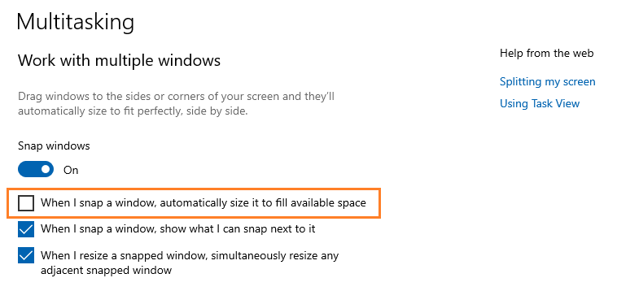

# Workspace
id:: 66519638-cf5d-409b-9b98-15acabf2268c
	- ((6651ecba-793d-43c5-8020-a9f260b032d8)) This is the ((665d1a03-4c61-4d81-ac58-a5a1a7efe568)) for Will LE.
	  id:: 66600918-2b2b-417e-910b-2a60fdba7918
	- ((6651adea-e1ed-4884-93eb-5ebd6086b62b))
	- ***Pinned***: ((66536e1b-6466-4153-90d6-583003d99a81))
	  id:: 66603d58-ff5b-4e23-8dad-5dba527981f4
	- id:: 66600918-7717-48c0-9869-1776d05035f1
	- ## Search
	  id:: 66fce880-77a2-41f7-8bdb-a86b7fc6fc77
	  collapsed:: true
		- linux
		  id:: 66fce7e0-8040-4980-b2aa-807e4a0cde1f
		  collapsed:: true
		  ^ **Name & Term** search
			- Filters
			  collapsed:: true
				- Containers
				  id:: 67710fcc-08c4-4a3e-96fd-bc4207f6ec8f
				  search-scope::
				  search-scope-page:: [[Mind Jungle]], [[Git]], [[Linux]], [[JavaScript]]
				- Block ids
				  id:: 677010ec-01b9-48d6-9a3b-ea53bd62cea3
				  filter:: 665359e4-4597-4775-b849-f9acbb98960a|665c9af1-1ce2-461c-af33-671690618c8f|6699e4db-2e75-4427-94bb-96dfe0367dd1|6699ea73-dc77-4227-a293-b501f2eb1759|6699e5f2-7788-46c7-8233-87699a65ca30|6699eb54-ce9e-4472-a784-c59ffd47f02b|66c80d5c-181f-4f06-a285-0624a65e9951|66c80dde-a097-4744-8af8-c6e26dcfdda2|66c80da7-c0e8-46d2-85e5-71318fd44eff|66c80dfd-95e2-4b5a-bd56-06e8307e81ca|66c80da9-4cfb-4de7-b83d-8b70665207bf|66c80e01-002b-42ae-9c60-49bf3fc6e159
				  child-filter:: 6651ecba-793d-43c5-8020-a9f260b032d8|665359c0-a89a-41b5-9f28-503f79107a08|669a1e5f-734c-41c1-bf1c-21813b6e81d8
				- Block refs
					- filter:: ((665359e4-4597-4775-b849-f9acbb98960a)) | ((665c9af1-1ce2-461c-af33-671690618c8f))
						- **Components**: ((6699e4db-2e75-4427-94bb-96dfe0367dd1)) | ((6699ea73-dc77-4227-a293-b501f2eb1759)) | ((6699e5f2-7788-46c7-8233-87699a65ca30)) | ((6699eb54-ce9e-4472-a784-c59ffd47f02b))
						- Word classes: ((66c80d5c-181f-4f06-a285-0624a65e9951)) | ((66c80dde-a097-4744-8af8-c6e26dcfdda2)) | ((66c80da7-c0e8-46d2-85e5-71318fd44eff)) | ((66c80dfd-95e2-4b5a-bd56-06e8307e81ca)) | ((66c80da9-4cfb-4de7-b83d-8b70665207bf)) | ((66c80e01-002b-42ae-9c60-49bf3fc6e159))
					- child-filter:: ((6651ecba-793d-43c5-8020-a9f260b032d8)) | ((665359c0-a89a-41b5-9f28-503f79107a08)) | ((669a1e5f-734c-41c1-bf1c-21813b6e81d8))
			- {{search-query [:h3 "Name & Term Search Result"], 66fce7e0-8040-4980-b2aa-807e4a0cde1f, 67710fcc-08c4-4a3e-96fd-bc4207f6ec8f, 677010ec-01b9-48d6-9a3b-ea53bd62cea3, true, false}}
			  query-table:: false
		- wiki:
		  id:: 66fce8d4-0434-4dd0-941f-4f3bd9b1b456
		  collapsed:: true
		  ^ **Element** search
			- {{search-query [:h3 "Name Search Result"], 66fce8d4-0434-4dd0-941f-4f3bd9b1b456, 66533703-505d-432d-8368-6058eefb45f6, 66fce8d4-0434-4dd0-941f-4f3bd9b1b456, true, false}}
			  query-table:: false
		- linux
		  id:: 66fd14fd-5eee-4830-b4cb-6bd6f520b9b2
		  case-sensitive:: false
		  whole-word:: false
		  filter::
		  child-filter::
		  search-scope:: Specific blocks: ;
		  search-scope-page:: Main docs: [[Mind Jungle]], [[Git]], [[Linux]], [[JavaScript]];
		  collapsed:: true
		  Extended: [[Brainstorm]], [[Workspace]], [[Stories]]
			- {{search-query [:h3 "Full-text Search Result"], 66fd14fd-5eee-4830-b4cb-6bd6f520b9b2, 66fd14fd-5eee-4830-b4cb-6bd6f520b9b2, 66fd14fd-5eee-4830-b4cb-6bd6f520b9b2, true, true}}
			  query-table:: false
		- **Instruction**: Input Regex pattern to the first line, then just open (unfold) that block to see the result, which will be automatically updated in the Right Sidebar, but not in the Main Edit Pane.
		  collapsed:: true
			- `search-scope:` Limit to specific block(s). Remember to disable `search-scope-page`!
			- `search-scope-page:` Break down unwanted pages, join back wanted pages
	-
	- ## Workstack
	  id:: 6651adea-81d4-40a5-b96d-af6739e572eb
		- ### Git Commits
		  id:: 67139355-ac72-4e4c-b882-00bb3a3ea144
			- #### To be merged
			  id:: 67164cc1-e500-4889-9b6d-12d8dd7fc029
			  collapsed:: true
				-
				-
				- ((674ff584-00e3-40d8-9b77-21e9dca899dd))
				- ((675141bb-5c74-4906-b6ee-63ac3a237ef0))
					- ((67514336-628d-4f80-b154-3b7cfde988f0))
					  id:: 6752e3f2-5d37-4c90-9deb-e4c8134a4591
				- ((6751697f-aa5b-4ade-b97c-9ea1f1406581))
				- ((6752f2ae-a019-400c-9a13-ede363f665ff))
				- ((67555f3a-e296-4ea0-bac9-c0dcffa368d1))
				- ((6756cbba-4326-499c-a1f1-296a36a14663))
				- ((675c03d8-3185-41a8-9f98-e869fabec793))
				- ((6735b189-867a-4eee-b5f5-3079bb3da458))
					- ((36499c7b-d58a-4eb5-a780-ad4afc813c64))
				- ((676539ca-ff29-4749-ab33-b00dfe8fb936)) & ((66537674-6cf9-4459-8bea-7c1858c694a3)) & ((6653769c-3334-46fa-a1d5-4ce6a7fc23e8))
				- [Langlands program, modular forms, elliptic functions](((6766ea7c-3eb8-4463-9a79-d66509daf176)))
				- [first times reset within a day](((6768bf20-deec-41bf-ac18-adc753ebb15f)))
				- ((675c399e-06a9-4c00-91a2-f2340a3a9bac))
				- ((67445223-9459-4aa9-b102-70c63943577b))
				- ((676a5f10-724c-474f-bf47-4e19c8f0c177))
				- ((676e5401-5951-445c-b109-61d61c11fc59))
				- ((67710747-2982-4134-875e-3b715313db87))
				- DONE update Search: add Wiki, noun, verb, etc.
				  :LOGBOOK:
				  CLOCK: [2024-12-29 Sun 15:48:05]--[2024-12-29 Sun 19:07:34] =>  03:19:29
				  :END:
					- DONE Add shared pages
					  :LOGBOOK:
					  CLOCK: [2024-12-29 Sun 16:06:17]--[2024-12-29 Sun 16:06:19] =>  00:00:02
					  :END:
					- ((67711d1f-39a7-42c5-83ac-641d0b838e87))
			- #### WIPs
			  id:: 67164c57-8f45-46eb-92a9-f00b02dccfc9
				- ((676e46bc-5c19-4e37-a301-e3b818d8cb1a))
				- ...
			- ------
		- TODO Relink ((66fe86b8-f17e-4b3f-b27f-213b3500146f)); Share [[Linux]]
		  :LOGBOOK:
		  CLOCK: [2024-12-27 Fri 14:14:48]
		  :END:
		-
		-
		- ((671b29b6-68f7-47e1-b79c-f4d6284690a2))
		- ((66e3c1b8-eb83-47d6-b71e-193549b47f93))
		-
		- DOING symbols for ((66c8941d-6427-4e5c-9009-3af349500d7b))
		  :LOGBOOK:
		  CLOCK: [2024-08-23 Fri 12:16:21]
		  CLOCK: [2024-08-23 Fri 12:16:24]
		  :END:
		- DOING view, projection, effect flow via wave propagation across a ((66c810a0-9861-4787-bdcf-1378219332be))
		  :LOGBOOK:
		  CLOCK: [2024-08-23 Fri 12:16:32]
		  CLOCK: [2024-08-23 Fri 12:16:43]
		  :END:
		-
		- ((669f3107-a33a-4b26-a636-6da62fa5520e))
			- ((669f243f-41b7-4274-b954-9824ec3ac33b))
		-
		-
		- ((667d202e-f401-46ba-ab32-c4fd77b49ab1))
			- WAIT Add to ((6651e92e-fb34-4d24-a386-d9698c2e93f7)) various types of [extending dimensions](((667d202e-f401-46ba-ab32-c4fd77b49ab1))).
			  :LOGBOOK:
			  CLOCK: [2024-06-28 Fri 08:11:13]
			  :END:
		-
		-
		- ...
	-
	- ## Tasks
	  id:: 6651adea-52dd-4aa8-9942-a75af9a6a23f
		-
		-
		- WAIT ((66536e1b-6466-4153-90d6-583003d99a81)): Write a script to convert headless block ref to `) "block content")` and a plugin to copy block ref in that format.
		  id:: 667d2479-487a-49ab-949f-722eb47a16ef
		  collapsed:: true
		  :LOGBOOK:
		  CLOCK: [2024-06-27 Thu 15:36:19]
		  :END:
			- Use [`` syntax](https://www.markdownguide.org/basic-syntax/#adding-titles "add a title to a link")
			  id:: 66ac8222-836c-40b1-9f26-fc94c69f9f8e
			  collapsed:: true
				- Label-less block link syntax `))` keeps rendering the block content as is (the same as `((uuid))`), like this: )).
				  collapsed:: true
					- Whereas putting block content into link label will make it not rendered properly, like this: [Use [`` syntax](https://www.markdownguide.org/basic-syntax/#adding-titles "add a title to a link")](((66ac8222-836c-40b1-9f26-fc94c69f9f8e))).
					  id:: 66ac85cb-b5ee-4b6b-8ab1-82f90200be26
					  collapsed:: true
						- The rule of "first line as title" will also not applied.
					- Note that label-less external link shows nothing, like this "", and label-less block link without double parenthesis shows `Untitled`, like this .
				- The `title` is not shown, unlike in [external link](https://www.markdownguide.org/basic-syntax/#adding-titles "add a title to a link").
			- Plugin `Copy Block Link`
			  collapsed:: true
				- Copy to clipboard: [`await navigator.clipboard.writeText(textContent)`](https://developer.mozilla.org/en-US/docs/Web/API/Clipboard/writeText).
				- Context menu `Copy block link`
					- [`logseq.Editor.registerBlockContextMenuItem()`](https://plugins-doc.logseq.com/logseq/Editor/registerBlockContextMenuItem)
					- Ref: [Block Shallow Copy (`logseq-shallow-copy`)](https://github.com/MateuszMyalski/logseq-plugin-shallow-copy)
				- ((66536710-7441-4fb8-986b-50d2eec762d7)) `Ctrl Shift C`
					- [`logseq.App.registerCommand{,Palette,Shortcut}()`](https://plugins-doc.logseq.com/logseq/App/registerCommand)
					- Ref: [Custom Workflow (`logseq-custom-workflows`)](https://github.com/sawhney17/logseq-custom-workflow-plugin)
			- Related plugins:
			  collapsed:: true
				- ((66ac509d-cc10-4b99-9a70-a27bed316a3a))
			- ((665359ff-79f1-4669-b10b-f2b0e633a7c1))
			  collapsed:: true
				- This also solves the current bug/issue that ((667d263b-658b-4560-b8cc-f6838534956d))
				- The issue of back-propagation of edit of block content to its refs:
					- Should it be automatized? It should be done manually, because the block content used in refs depends on these refs' contexts.
				- [Future-proof block references in Logseq](https://99rabbits.com/future-proof-block-references-in-logseq/) > ((66ac8222-836c-40b1-9f26-fc94c69f9f8e)) as [suggested by AlessandroLongo](https://www.reddit.com/r/logseq/comments/15x0qsv/comment/jx49poz/)
				- [Block reference to allow ((page-name#block-ref-name)) not just UUID](https://discuss.logseq.com/t/block-reference-to-allow-page-name-block-ref-name-not-just-uuid/2746)
			- ((94649b98-9711-4adf-ae25-aaf32b521c14))
		- id:: 6673f8bf-04c0-4f8f-bc36-982ce9cab87d
		  collapsed:: true
		- TODO Backup & republish my contents on Facebook
		  collapsed:: true
			- Some of the fb posts have been migrated to the blog [CreatZy Notes](https://creatzynotes.blogspot.com/).
			- ((66602f61-b849-41a9-bdb8-ec91b96adaec)) Trigger: i had a hard time finding back [my post about catenary curve](https://www.facebook.com/share/p/9LfU1A6Mmxo2KTH3/).
		- ...
		- query-table:: false
		  id:: 67110d13-b91a-4ebb-959b-9db4d2f6d61d
		  collapsed:: true
		  #+BEGIN_QUERY
		  {:title [:h3 "Other Tasks"]
		    :query [ 
		    :find (pull ?b [*])
		    :where
		      [?b :block/marker ?m]
		      (not [(contains? #{"DONE" "CANCELLED" "CANCELED"} ?m)] )
		      [?b :block/page ?p]
		      [?p :block/original-name ?pn]
		      (not [(contains? #{"Workspace"  "Theme Demo"} ?pn)] )
		    ] ; end query
		    :result-transform (fn [r] (map (fn [m] (assoc m :block/collapsed? true)) r))
		  }
		  #+END_QUERY
	-
	- ## Problems
	  id:: 6651adea-46e0-40ea-8fc4-3ef394068b0f
		-
		- [!] My expression of "arrogance"
		  collapsed:: true
			- Even i've never thought that i'm better/higher than anyone else, my expression does show some trace of arrogance which has been fed back by my (close) friends. Is shows something is hidden deep inside my unconsciousness. Here i list some causes that i can reflect on this problem.
			- 1st, the **illusion of** ((66537674-6cf9-4459-8bea-7c1858c694a3))
			  id:: 669a58b9-422a-40d9-adcf-b2aade86c170
			  The (holistic) view from above shows me the way and makes me feel that "i've known the way already, it's just a piece of cake" and forget that it's just a "map" and the actual walking the way is much much harder with much more efforts.
				- I've called it by many names: the karma of theorist (theorist karma), the sickness of talent (talent sickness).
				- My karma of theorist also corrodes others' trust on me.
				  id:: 668f4faf-db30-497a-a271-b2bbf5264413
				- My karma of theorist is deep.... [inside my trousers 😄](https://www.facebook.com/lexuandinhct/posts/pfbid02kppLiTrw7mWPdp3V8bVLq6MvQDb3FNBaseh1znLspueCQrcC1esTKbsT4PCB8663l)
				  collapsed:: true
					- 
				- This illusion contributes greatly to ((669a58b9-1a52-4ad7-932a-9e45ecb9960e)).
			- 2nd, the **implosive attitude** of my inner self toward external forms as if i'm fighting for the abolition of these forms ("đả phá"). Even though i consider "all views are equal"... they are just "equal in theory" while in practice i have a hidden tendency to consider my "inner view through content" superior to the "external view through form" of others.
		- [!] The clash between internal work and external work
		  id:: 6677b986-ada2-4c73-8a11-980cdf9cb6d4
		  collapsed:: true
			- As i dive deep inside, it's hard to surface up to do external works, hence many delays in (official) works.
				- I'm hooked to the deep works in front of my eyes. This hook is the tool that helps me to concentrate and avoid distraction from surrounding environment. 
				  id:: 669dc514-e137-43de-be7d-6b0a1ac2302d
				  :LOGBOOK:
				  CLOCK: [2024-07-22 Mon 09:34:02]
				  CLOCK: [2024-07-22 Mon 09:34:43]
				  :END:
					- Without distraction, it's easier for me to stay in the free & mindful state. But in the free state, it's also difficult for me to interact with external tools like note taking, speaking, writing, forming formula, etc.
					- This hook can be replaced with the [ujjayi breath](((66952126-bf33-40e1-a208-369df7aa9488))). Using the internal tool (breath) gives me more control than the external tool (external sink).
			- When i interrupt the internal work, my self is fragmented, heavy, lack motivation to do anything.
			- DOING **Duck dive** is a serious problem!
			  :LOGBOOK:
			  CLOCK: [2024-12-29 Sun 20:02:37]
			  :END:
				- I usually dive head-first, _without planning_, into the works and issues, which usually **branch off** into lots of new works and issues
			- **Perfectionism**
			  id:: 6678d594-9819-4624-abd6-d4ec62b3874f
			  collapsed:: true
			  The requirement that my self must be smooth, full, round, coherent, unfragmented is the sign of perfectionism.
				- First, let's [refine](((669a5162-19e1-4c52-8888-ab7cbfe275ec))) the large circle into smaller circles, thus they are still round & perfect circles but can be interleaved with other works.
				  id:: 6677bc01-44ec-4e4a-aeed-d63996bc0c46
				- The illusion of "finish soon"
				  id:: 669a58b9-1a52-4ad7-932a-9e45ecb9960e
				  collapsed:: true
					- ((6651ecba-793d-43c5-8020-a9f260b032d8)) When we feel something is finishing soon, we concentrate more on it, put all of our effort to it to get it finished... until we're out of resource and recognize that it's still far from the finish line.
					- Like the first experience of ["this is not the true peak"](https://www.facebook.com/lexuandinhct/posts/pfbid02eArjSbGz7GhpU2aFwh2qia53BcuwhstSE263jXVvf9tamUbL2K2JCF2LD97RQQ4ql) when i climbed mount Núi Lớn, Vũng Tàu, when i was a child, until now, that illusion is still haunting me.
					- In gambling/game psychology, it's called "[near-miss effect](https://www.psychologyofgames.com/2016/09/the-near-miss-effect-and-game-rewards/)".
					  collapsed:: true
						- ((66602f61-b849-41a9-bdb8-ec91b96adaec)) [chat with Gemini](https://gemini.google.com/app/bdba2d82588d8307)
					- This [cognitive bias](https://en.wikipedia.org/wiki/Cognitive_bias) is just a kind of distortion in perspective view (projective/inversive geometry): 1/∞ = 0.
					  collapsed:: true
						- Our view is always distorted so that the far end always look shorter. So, when the goal is clearly visible to us, we can't help seeing the distance to it is short even if it's at infinity, just like the Moon looks very close to us at the horizon like "just some arms away".
					- The opposite of near-miss effect is the goal-fog effect where we lose motivation to reach a very near goal due to the obscurity of that goal.
					- It stems from ((669a58b9-422a-40d9-adcf-b2aade86c170))
						- The seemingly small and easy targets, which are just ((66537674-6cf9-4459-8bea-7c1858c694a3))s, draw me into the rabbit holes.
						  id:: 6735b189-a8b7-4ff3-b42a-c59f38a8334e
						  collapsed:: true
							- An "impossible bug/error" => debug deeply
							- An "unacceptable term/issue" => research deeply
							- An "illogical design" => modify deeply
						- The effect of false contradiction (hidden monster)
							- Sometime, the whole huge problem is abstracted into a key so small that it becomes a needle lost in a haystack and i cannot find/see that key easily.
							- => It seems that the problem is "impossible!"
							- => This discrepancy triggers my anger to tackle the problem "to the end".
						- The butterfly effect from a tiny mistake to a huge error, the [one-unit error](https://www.geogebra.org/m/xhpjjxyn) at the marginal cases, and so on, are just the extension of the abstracted complex systems.
				- The illusion of “finished” & target reaching
				  id:: 6736bd1e-5835-46e4-b640-dd35b3fe7c90
				  collapsed:: true
				  :LOGBOOK:
				  CLOCK: [2024-11-15 Fri 10:41:26]
				  :END:
					- ((66725725-f76a-4328-b162-f469b87e871b))
					  collapsed:: true
						- ((6735c7ac-17c8-4fea-8d4c-b76a942bc453))
					- “Complete, finished, done, target reached, ...” are just illusions. Nothing is actually complete, any ((667d15c6-67c4-4998-a549-c8b3f9de3d60)) is just a helix or spiral which is projected onto the plane orthogonal to the direction of change/evolution.
					- Most of us are goal/target reaching machines with a built-in motivation to complete the circle.
						- The inner target of the ((667bef22-b272-4a7d-b613-3f1ed1a47329)) is the driver, operator, controller of the whole ((667c0031-0a87-44c9-9e98-6d45893b095f)).
						- The target is the hidden boss, the inner ((667c015e-6223-4f8a-ae84-a93a49f4ff94)), the underlying driving force.
						- **Revealing the hidden boss** means **detaching the self**.
							- “Detached self = selfless”
							- When a boss is brought out to the light, in front of everyone, to be examined like any one else, it loses its (absolute) privilege, and its influence is restored to the right place with the right amount. Its influence is still high thanks to its central position, but no more privilege, and the “boss” is now simply an individual equal to all other individuals in right.
							- It's different from shunting, suppressing the boss to eliminate its influence via rebellion, which is usually the counter effect of the long time overpowering by the boss.
					- The basic illustion is that “when the circle is completed, it ends, finishes, no more worry”, while actually it's just _the **beginning** of a new circle_, either at the same level or at “higher” level.
					- While the true ending, the true finish is the death, either bodily or mentally, we always try to reach the end of some “hard work” wishing to have an easier living, either on Earth or on Heaven, or at Nibbana (Nirvana). That's the basic illusion of both life & death.
						- The urge to finish is a manifestation of _the urge to die_ in the guise of life, either as an orgasm or an explosion.
							- While Freud described [death drive](https://en.wikipedia.org/wiki/Death_drive) (Thanatos) as the opposite of sex drive (Eros), i see they are just two faces of the same coin with the same nature.
						- Due to the guise of life, we fall into the contradiction of continuously reaching (small) deaths in the hope of avoiding (big) death.
						- Accepting death is no problem to me and i've spent my whole life to explore various types of death.
					- ((66602f68-e23f-4b24-921e-b1a9fc0cc731)) Instead of ~~aiming at the destination~~, let's [reset](https://www.facebook.com/share/p/vnZFSzUcr3mr2JyG/) the mind to _**start** the new journey!_
					  id:: 67445065-15b2-475e-a704-78f140d487af
						- {:width 200}
						- [The Goal is the Horizon](https://creatzynotes.blogspot.com/2024/12/the-goal-is-horizon.html)
						  id:: 67445223-9459-4aa9-b102-70c63943577b
							- After enjoying the scenic beauty of Mount Extreme Bliss for a week, the master urged the disciple to continue the journey the next morning.
							  collapsed:: true
								- Let's go, don't get too engrossed in this place.
								- But haven’t we already reached our destination?! After all the time, effort, sweat, and even blood we've spent to get here, shouldn’t we enjoy the fruits of our labor instead of moving on, master?!
								- I've allowed you to enjoy it for a whole week. If you think it's not enough, you can stay and enjoy it. I'll go alone.
								- It's not about enjoyment. I followed you to reach liberation, not to seek pleasure. If I wanted to enjoy myself, I would have stayed in the city with all its pleasures instead of tiring myself out climbing the mountain with you.
								- If you still want liberation, follow me.
								- But why do we need to move on when we've reached the destination of liberation?
								- This is not the destination.
								- Clearly, back in the city, when I asked, “Where do we go to find freedom?” you pointed to this mountain.
								- At that time, the city’s buildings blocked the view, so I had to point to a tall mountain for you to see. But I meant that “the destination lies at the horizon.”
								- So we can never reach the destination 😮‍💨?!
								- We can.
								- Have you reached the destination, master?
								- I have.
								- You're lying! Back in the city, I never saw the horizon, so you could fool me. But now, after months of travel, I've seen for myself: The horizon is endless. The more we walk towards it, the further it moves away, so we can never truly touch it.
								- I didn't deceive you. I only spoke in a way you could see and understand. Before, I didn’t say “the destination is the horizon” because you hadn't yet seen and understood what the horizon is. Today, I'm not deceiving you, either. I only speak according to what you now see. Now, look straight ahead; do you see the horizon?
								- I see the horizon as a straight line in front of me, but it’s just an illusion; there’s no actual line!
								- I only asked if you see it or not!
								- Yes, I see it.
								- Now, look behind; do you see the horizon?
								- Yes, I do.
								- Look to both the left and right; do you see the horizon?
								- Enough! On this mountaintop 🗻, wherever I look, I see the horizon. Don’t ask such redundant questions!!!
								- If you've seen it, let's go!
								- Why move on if we'll never reach it?!!!
								- I've reached it, that's why I'm leading you. If you don't want to go, you can stay here.
								- Wait, master, you can't leave! You owe me an explanation of how you can reach that endless horizon!
								- I've reached it by bringing the horizon right beneath my feet.
								- 😮 How is that possible...
								- I told you before that you wouldn't understand! It's only because you pushed me that I had to say it.
								- ...
							- [Cái đích là chân trời](http://creatzynotes.blogspot.com/2024/11/cai-ich-la-chan-troi.html)
								- Hai thầy trò sau một tuần thưởng thức phong cảnh hữu tình ở núi Cực Lạc thì sáng ra thầy lại giục trò lên đường đi tiếp.
								  collapsed:: true
									- Đi thôi con, đừng để mình chìm đắm vào chỗ này.
									- Ủa, chẳng phải chúng ta đã tới đích rồi sao?! Đi bao nhiêu lâu, mất bao sức lực, mồ hồi và cả máu mới tới được đích... không hưởng thành quả mà còn đi đâu nữa thầy?!
									- Ta đã cho con hưởng thụ cả tuần qua rồi đó thôi, nếu con thấy chưa đủ thì cứ ở lại hưởng thụ đi, thầy đi một mình.
									- Vấn đề không phải là hưởng thụ, con theo thầy là để tới chỗ giải thoát chứ không phải để hưởng thụ. Nếu thích hưởng thụ thì còn đã ở lại trong đời rồi, có bao nhiêu thú vui ở đó chứ theo thầy lên núi chi cho mệt vậy?!
									- Nếu còn muốn giải thoát thì theo ta đi tiếp.
									- Nhưng tại sao phải đi tiếp khi chúng ta đã tới được đích giải thoát?
									- Đây không phải là đích.
									- Rõ ràng hồi ở trong thành phố, khi con hỏi “đi đâu để tìm được tự do” thì thầy đã chỉ tay về phía ngọn núi này mà.
									- Lúc đó trong thành phố bị nhà cửa che khuất tầm mắt nên ta phải chỉ ngọn núi cao để cho con thấy thôi, chứ thực ra ý ta muốn nói rằng “cái đích nằm ở chân trời”.
									- Vậy là không bao giờ tới được đích sao 😮‍💨?!
									- Tới được.
									- Vậy thầy đã tới đích chưa?
									- Ta tới rồi.
									- Thầy nói dối! Ngày xưa trong thành phố con chưa thấy chân trời bao giờ thì thầy còn có thể lừa con được, chứ mấy tháng nay đi ra ngoài thì con đã chứng thực rồi: Chân trời là vô tận, mình càng đi tới bao nhiêu thì nó càng lùi về xa bấy nhiêu, nên không thể nào chạm được tới chân trời đâu.
									- Ta không lừa con, ta chỉ nói theo những gì con có thể thấy và hiểu được. Ngày trước ta không nói “đích là chân trời” vì lúc đó con chưa thấy và hiểu rõ chân trời là gì. Hôm nay ta cũng không lừa con, ta chỉ nói theo những gì con đang thấy mà thôi. Này, nhìn thẳng về trước, con có thấy chân trời không?
									- Con thấy chân trời như một đường thẳng trước mặt, nhưng đó chỉ là ảo giác, thực ra không có đường đó!
									- Ta chỉ hỏi có thấy hay không?!
									- Dạ có thấy.
									- Giờ quay về phía sau, con có thấy chân trời không?
									- Dạ thấy.
									- Con nhìn cả trái lẫn phải đi xem có thấy chân trời không?
									- Thôi khỏi! Trên đỉnh núi 🗻 này thì dòm đâu chẳng thấy chân trời, thầy đừng hỏi những câu thừa thải như vậy nữa!!!
									- Thấy rồi thì đi thôi!
									- Đi chẳng bao giờ tới thì đi làm gì cơ chứ?!!!
									- Ta đã tới rồi nên mới dẫn con đi. Con không muốn đi thì cứ ở lại đây.
									- Khoan, thầy không được đi! Thầy còn nợ con lời giải thích làm sao thầy có thể tới được cái chân trời vô tận đó!
									- Ta tới được bằng cách kéo chân trời về ngay dưới chân ta.
									- 😮 Làm sao có thể được...
									- Ta đã bảo là điều này con chưa thể hiểu được mà! Tại con ép thì ta mới phải nói thôi.
									- ...
						- Let's restart from the way/attitude of looking at everything!
							- Let's shift from the ~~**goal-oriented**~~ and target-driven way of life to the **present-oriented** and whole-driven (holistic) way.
							- The goal-oriented way is related to the [teleology](https://en.wikipedia.org/wiki/Teleology). I'm not opposing the teleology, but just add a small adjustment.
							  collapsed:: true
								- There is the ultimate purpose, but it's **not "final"**. The ultimate goal/purpos is the "[horizon](((67445223-9459-4aa9-b102-70c63943577b)))" which is always vividly there, always the guiding direction for us, but can never be "final" or "finished".
								- As long as we're walking, we're "on the horizon"; anytime one thinks "i've reached the target", that one is deluding itself and effectively withdraw itself away from the horizon.
								- It's the difference between cyclic nature and linear nature, between the circle and the arrow.
								- The ultimate goal is (the center of) the totality, the whole, while all targets are intermediate points on the (endless) way to the goal.
						- Training the non-attached looking
							- First, detach, keep distance until the mind returns to neutral attitude.
							- Next, slowly approach the object while being aware of all mental reactions.
							- Observe the reactions and connect them with the whole, reminding the whole with all aspects, all sides, all conflicting parts.
							- Frequently back off for the holistic relations to emerge.
							- Remember to breathe!
							- In the training, all actions should be done automatically without any intention.
							- Training sessions should run alternately with actual working sessions.
				- The effort justification & sunk-cost fallacy
				  collapsed:: true
					- This is the push of the momentum of the past, which adds to the pull of the future "finish soon", constraining the subject to the rabbit hole of goal reaching.
				- The ((6678282b-d710-4c6b-b584-5f65012c192d)) effect
				  collapsed:: true
					- The great momentum of the past is the internal form.
					  collapsed:: true
						- Just be mindful that we don't lose that momentum when we switch to other works, just put it down to be picked up later on.
					- The clearly visible goal of the future is the external form.
					  collapsed:: true
						- The clarity of the goal shows that it's very large, like the Sun & Moon, hence a form outside.
						- Just be mindful that although it's worth pursuing, it's still very far.
					- The ((669a5162-19e1-4c52-8888-ab7cbfe275ec)) is to divide the form, the ((668f5490-c223-4a8a-9cc4-0bd71af4c097)) is to dissolve the form and direct it to the new form.
					- Mindfulness as a hole-punching tool to escape the form.
					  collapsed:: true
						- The tantric practice shows that both the accumulation of momentum and the "finish soon" effect require ignorance in the form of attachment to the external signal (sign of the goal).
						- Unmindfulness of the internal momentum makes it push us from behind and control us.
						- Unmindfulness of the illusion of the external signal makes it feel near outside while in fact it's near inside and very far outside. That's because the signal outside is just the image/shadow of the goal inside.
						  collapsed:: true
							- This discrepancy forces all of us to chase shadows from life to life.
				- ((66b1cfa4-369c-49ec-a461-cdda61633460))
			- Brain dumping tools, like ((66536e1b-6466-4153-90d6-583003d99a81)), can help reducing mental load & momentum, so that i can switch easier.
			  id:: 66b1cfa4-369c-49ec-a461-cdda61633460
			  collapsed:: true
				- Any new block, even plain text, should be [time tracked](((66b1cfa4-0f03-4da2-b34b-d995d3c888b0))) [with `Ctrl Enter` -> `TODO`](((66b1cfa4-8842-4b3c-876b-e60d4b7fd819))) or [with `Alt Enter` -> `DOING`](((66b1cfa4-33e0-4e5a-9a68-2e8e19b207ac))).
				  :LOGBOOK:
				  CLOCK: [2024-08-15 Thu 16:29:20]
				  :END:
				- [!] Too many fragmented non-`DONE` & non-`DOING` works will cost high overhead to reload these works into the mind later on.
				  :LOGBOOK:
				  CLOCK: [2024-08-15 Thu 16:29:13]
				  :END:
					- ((66602f68-e23f-4b24-921e-b1a9fc0cc731)) Must keep balance between leaving unfinished works and [completing works](((6678d594-9819-4624-abd6-d4ec62b3874f))).
					- ((66602f68-e23f-4b24-921e-b1a9fc0cc731)) We should regularly **clean up and reorganize** works so that later accesses will be easier, clearer.
				- addition = insertion sort
				  Each addition of new items into a previous work is a step of insertion sort.
				- access = reorganize
					- Each access of an old work from a new context reveals a new ((66723642-58f1-4a74-bba3-0108f14c6bac)), new ((667d0b78-fff6-49bc-90d5-165648ed56d3)), hence the old work should be updated to reflect this new view.
					- When a later access shows any difficulty in understanding or any inconsistency, the old work should be reorganized.
					- ((66602f68-e23f-4b24-921e-b1a9fc0cc731)) the more accesses to a work, the better organized that work will be.
			- Solution to my problem of "wandering, lost in complexity": shift from depth-first to breadth-first traversal
			  :LOGBOOK:
			  CLOCK: [2024-09-19 Thu 12:24:53]
			  :END:
				- when it's too deep with analytics (differential), it's too abstract, lacking context, groundless, formless, messy, collapsed, the object is sliced into disconnected parts
				- traversal on the breadth with CIfEr provides context, condition (duyên), and form to stretch the loop out to be a full circle 🌕, to be the whole
		- [!] The issue of love, i.e. emotional attatchment
		  collapsed:: true
			- Deep inside, i feel the suffering of people as my suffering... but it seems to be my too much magnification via my own lens.
		- [!] Windows 10 (seems from Windows 7) lets its window borders be dragged off the screen!
		  id:: 66adf2e5-ddde-4ee3-8086-78ce57483837
		  collapsed:: true
		  :LOGBOOK:
		  CLOCK: [2024-08-03 Sat 15:30:44]--[2024-08-03 Sat 17:01:02] =>  01:30:18
		  :END:
			- ((665359ff-79f1-4669-b10b-f2b0e633a7c1))
				- This is a feature for seamless multi-display settings, but should be across displays next to each other only, not protruding out of visible areas like this.
				- Sometime we need to _intentionally drag windows partly off the screen_ to leave space for other windows and because we **don't want to resize** that window.
					- This can be balanced with the normal constraint of windows within screen by edge snapping.
						- But [Windows Snap](https://support.microsoft.com/en-us/windows/snap-your-windows-885a9b1e-a983-a3b1-16cd-c531795e6241) feature **always resize** the snapped window.
						- There's an option "When I snap a window, automatically resize it to fill available space", but unchecking it has no effect.
						  collapsed:: true
							- 
				- StackOverflow question with negative answer: [Prevent windows from being dragged past the edge of screen](https://stackoverflow.com/questions/44219386/prevent-windows-from-being-dragged-past-the-edge-of-screen)
				- Someone met the problem of [windows open off screen](https://answers.microsoft.com/en-us/windows/forum/all/windows-10-windows-open-off-screen/0f2432ad-c60d-4bce-808b-3f0c403ce9f2) with no effective solution, too.
		- [!] The barrier between workspaces ("graphs" in Logseq)
		  collapsed:: true
			- In Logseq, ((665fe765-2bb7-4392-9140-10e187f0f208))
			- Some independent works, like [[Theme Demo]] , can be copied (manually).
			- But interlinked works are complicated:
				- Either we must copy the whole closure of linked works
				- Or we must prune "unnecessary" links.
		- [!] Timestamp in Logseq
		  collapsed:: true
			- [Displaying block timestamps](https://discuss.logseq.com/t/displaying-block-timestamps/24594)
			- Dynamic variable `<% today %>`: {{query <% today %> }}
			  collapsed:: true
		- [!] Time is always gone too fast! :(
		  id:: 66600918-315b-4f6c-970b-3039ac8ef912
		- ...
	- ## Questions
	  id:: 6651adea-f2f6-4c9e-80b4-ece0bb5038fb
		-
		- [?] What's the relation between  [lattice group](https://en.wikipedia.org/wiki/Lattice_(group)) and  [lattice order](https://en.wikipedia.org/wiki/Lattice_(order))?
		- [?] When will I be liberated :-?
		- ...