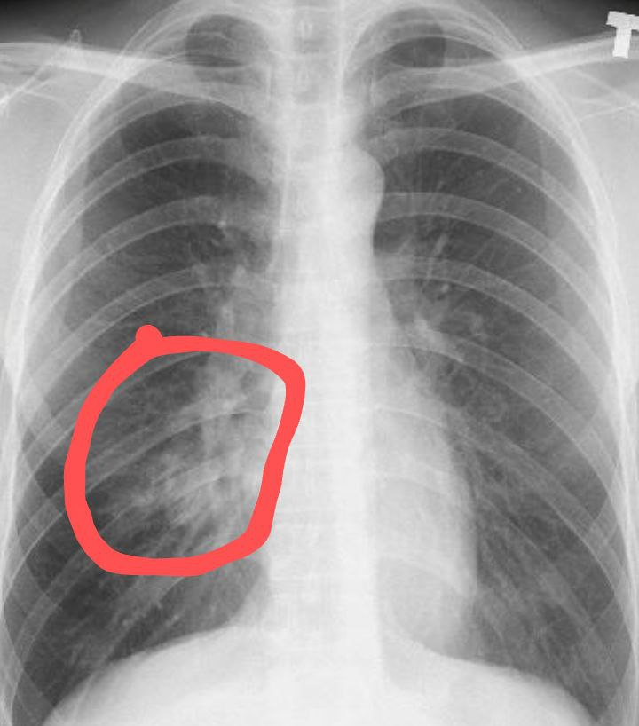

# Workspace
id:: 66519638-cf5d-409b-9b98-15acabf2268c
	- ((6651ecba-793d-43c5-8020-a9f260b032d8)) This is the ((665d1a03-4c61-4d81-ac58-a5a1a7efe568)) for Will LE.
	  id:: 66600918-2b2b-417e-910b-2a60fdba7918
	- ***Pinned***
	  id:: 66603d58-ff5b-4e23-8dad-5dba527981f4
	- id:: 66600918-7717-48c0-9869-1776d05035f1
	- ## Workstack
	  id:: 6651adea-81d4-40a5-b96d-af6739e572eb
		-
		- TODO Add `LogseqNotes` to [BeowulfBuildModDocs](https://github.com/quickom-lab/BeowulfBuildModDocs)
		  id:: 6677ea1b-479e-40b0-ab8e-64cf5c769e57
		  :LOGBOOK:
		  CLOCK: [2024-06-23 Sun 16:26:28]
		  :END:
		- WAIT Custom ((66600918-8c61-42af-b8a2-04bf05e9f782)) via ((6673f8ff-995c-455f-ae09-49bcb5311e2e))
		  id:: 6673f8bf-04c0-4f8f-bc36-982ce9cab87d
		  :LOGBOOK:
		  CLOCK: [2024-06-20 Thu 16:39:28]--[2024-06-23 Sun 16:26:56] =>  71:47:28
		  :END:
			- ((66602f61-b849-41a9-bdb8-ec91b96adaec)) ((6673fb2f-ef98-484a-b289-b50482edea47))
			- DONE Write [FoldableDemo.html](../assets/HTML/FoldableDemo.html)( , showing `
 
` & CSS-only method) and [FolderDiv.html](../assets/HTML/FolderDiv.html)( , with custom element `<folder-div>`)
			  id:: 6677b47a-fcbb-47a0-bd60-cdf5ef1a17b8
			  collapsed:: true
			  :LOGBOOK:
			  CLOCK: [2024-06-19 Wed 08:27:23]--[2024-06-20 Thu 16:31:09] =>  32:03:46
			  :END:
				- This unplanned work is [triggered by](((66600918-9f27-44c2-8188-f043c244710c))):
					- The exported SPA is loaded too slowly (dozens of seconds) from AirTrip Intl. lab server.
					  id:: 6673fb2f-ef98-484a-b289-b50482edea47
					- a doc: [Creating a collapsible markdown on one page](https://forum.squarespace.com/topic/64115-creating-a-collapsible-markdown-on-one-page/)
			- DONE Write [LogseqQuery.html](../assets/HTML/LogseqQuery.html)( , for `logseq.Editor.getBlock`)
			  id:: 6675860a-c135-4a92-b4fe-206ebde974ff
			  collapsed:: true
			  :LOGBOOK:
			  CLOCK: [2024-06-21 Fri 13:00:24]--[2024-06-21 Fri 20:56:40] =>  07:56:16
			  CLOCK: [2024-06-23 Sun 15:00:17]--[2024-06-23 Sun 15:51:18] =>  00:51:01
			  :END:
				- ((66602f61-b849-41a9-bdb8-ec91b96adaec)) I need to know what's in the hidden `:LOGBOOK:`.
				  id:: 6669a3bd-7059-4e5a-b21b-d96cb3288557
				  collapsed:: true
					- The ((66535e71-3b71-416c-98dc-5dde5e6a76ff)) files and exported JSONs are too large, while i need to view only a specific block.
					  id:: 6669a3bd-5b32-4088-982a-2c359b66610d
	- ## Tasks
	  id:: 6651adea-52dd-4aa8-9942-a75af9a6a23f
		-
		- TODO Add plaintext to ((666d71cc-c390-4d0e-9e95-950c257e387e))
		  id:: 6677e42f-06a8-4d04-b068-24d46c70cf51
		  :LOGBOOK:
		  CLOCK: [2024-06-23 Sun 16:00:48]--[2024-06-23 Sun 16:01:11] =>  00:00:23
		  :END:
		-
		- WAIT ((6667c99a-792f-4230-9fc6-c5fae874daef))
		  id:: 666d71cd-20bd-4f24-b055-940eebf44591
		  :LOGBOOK:
		  CLOCK: [2024-06-11 Tue 10:58:26]--[2024-06-11 Tue 10:58:27] =>  00:00:01
		  :END:
		-
		- TODO Auto-complete & typing assistant for **quotation marks**, symbols...
		-
	- ## Problems
	  id:: 6651adea-46e0-40ea-8fc4-3ef394068b0f
		-
		- [!] The clash between internal work and external work
		  id:: 6677b986-ada2-4c73-8a11-980cdf9cb6d4
		  collapsed:: true
			- As i dive deep inside, it's hard to surface up to do external works, hence many delays in (official) works.
			- When i interrupt the internal work, my self is fragmented, heavy, lack motivation to do anything.
			- Perfectionism: The requirement that my self must be smooth, full, round, coherent, unfragmented is the sign of perfectionism.
			  collapsed:: true
				- First, let's refine the large circle into smaller circles, thus they are still round & perfect circles but can be interleaved with other works.
				  id:: 6677bc01-44ec-4e4a-aeed-d63996bc0c46
				- Sublime & transform: a technique of refinement is using breathwork to dissolve, to sublimate the hard circle into a fluid (qi, khí, 氣), then use qigong (氣功) to transform & channel the fluid to the required target form.
				  id:: 6677bc58-68f5-4c6a-a08e-4417a9b8ac84
				  collapsed:: true
					- I discovered sublimation first (from [the start of February](https://www.facebook.com/lexuandinhct/posts/pfbid02q1oHaX9xkQQUsr1YVyAihCnCN47NFoCKYWqX5q2R2ud4UgqScbST1Z27KMBeRC1cl) via a tantric practice), but without proper transformation & channeling, i've been struck by a serious lung disease (pneumonia, from the end of Mars to April).
					  collapsed:: true
						- 
					- Throughout the weeks facing that lung inflammation (with blood coughing), i've discovered
					  collapsed:: true
						- the qigong technique to transform the qi,
						- the key point in my chest to control the cough reflex, and
						- revisit the formless meditation to deal with serious pain (my first application was at the previous serious illness of herpes zoster/zona).
				- The illusion of "finish soon"
				  collapsed:: true
					- ((6651ecba-793d-43c5-8020-a9f260b032d8)) When we feel something is finishing soon, we concentrate more on it, put all of our effort to it to get it finished... until we're out of resource and recognize that it's still far from the finish line.
					- Like the first experience of ["this is not the true peak"](https://www.facebook.com/lexuandinhct/posts/pfbid02eArjSbGz7GhpU2aFwh2qia53BcuwhstSE263jXVvf9tamUbL2K2JCF2LD97RQQ4ql) when i climbed mount Núi Lớn, Vũng Tàu, when i was a child, until now, that illusion is still haunting me.
					- In gambling/game psychology, it's called "[near-miss effect](https://www.psychologyofgames.com/2016/09/the-near-miss-effect-and-game-rewards/)".
					  collapsed:: true
						- ((66602f61-b849-41a9-bdb8-ec91b96adaec)) [chat with Gemini](https://gemini.google.com/app/bdba2d82588d8307)
					- This [cognitive bias](https://en.wikipedia.org/wiki/Cognitive_bias) is just a kind of distortion in perspective view (projective/inversive geometry): 1/∞ = 0.
					  collapsed:: true
						- Our view is always distorted so that the far end always look shorter. So, when the goal is clearly visible to us, we can't help seeing the distance to it is short even if it's at infinity, just like the Moon looks very close to us at the horizon like "just some arms away".
					- The opposite of near-miss effect is the goal-fog effect where we lose motivation to reach a very near goal due to the obscurity of that goal.
				- The effort justification & sunk-cost fallacy
				  collapsed:: true
					- This is the push of the momentum of the past, which adds to the pull of the future "finish soon", constraining the subject to the rabbit hole of goal reaching.
				- The ((6678282b-d710-4c6b-b584-5f65012c192d)) effect
				  collapsed:: true
					- The great momentum of the past is the internal form.
					  collapsed:: true
						- Just be mindful that we don't lose that momentum when we switch to other works, just put it down to be picked up later on.
					- The clearly visible goal of the future is the external form.
					  collapsed:: true
						- The clarity of the goal shows that it's very large, like the Sun & Moon, hence a form outside.
						- Just be mindful that although it's worth pursuing, it's still very far.
					- The [refinement](((6677bc01-44ec-4e4a-aeed-d63996bc0c46))) is to divide the form, the [sublime & transform](((6677bc58-68f5-4c6a-a08e-4417a9b8ac84))) is to dissolve the form and direct it to the new form.
					- Mindfulness as a hole-punching tool to escape the form.
					  collapsed:: true
						- The tantric practice shows that both the accumulation of momentum and the "finish soon" effect require ignorance in the form of attachment to the external signal (sign of the goal).
						- Unmindfulness of the internal momentum makes it push us from behind and control us.
						- Unmindfulness of the illusion of the external signal makes it feel near outside while in fact it's near inside and very far outside. That's because the signal outside is just the image/shadow of the goal inside.
						  collapsed:: true
							- This discrepancy forces all of us to chase shadows from life to life.
			- Brain dumping tools, like ((66536e1b-6466-4153-90d6-583003d99a81)), can help reducing internal load so that i can switch easier.
		- [!] The issue of love, i.e. emotional attatchment
		  collapsed:: true
			- Deep inside, i feel the suffering of people as my suffering... but it seems to be my too much magnification via my own lens.
		- [!] The barrier between workspaces ("graphs" in Logseq)
		  collapsed:: true
			- In Logseq, ((665fe765-2bb7-4392-9140-10e187f0f208))
			- Some independent works, like [[Theme Demo]] , can be copied (manually).
			- But interlinked works are complicated:
				- Either we must copy the whole closure of linked works
				- Or we must prune "unnecessary" links.
		- [!] Timestamp in Logseq
		  collapsed:: true
			- [Displaying block timestamps](https://discuss.logseq.com/t/displaying-block-timestamps/24594)
			- Dynamic variable `<% today %>`: {{query <% today %> }}
			  collapsed:: true
		- [!] Time is always gone too fast! :(
		  id:: 66600918-315b-4f6c-970b-3039ac8ef912
		-
	- ## Questions
	  id:: 6651adea-f2f6-4c9e-80b4-ece0bb5038fb
	  collapsed:: true
		-
		- [?] What's the relation between  [lattice group](https://en.wikipedia.org/wiki/Lattice_(group)) and  [lattice order](https://en.wikipedia.org/wiki/Lattice_(order))?
		- [?] When will I be liberated :-?
		-
	- ## History
	  id:: 6651adea-e1ed-4884-93eb-5ebd6086b62b
		- DONE Import [[Unïnfo Theory]] from ((66536662-052f-46a4-a624-38858bffb334)) with ((665376f4-9335-4d38-843f-a4cf6ef6cd10)) ✅ 2024-05-18
		  id:: 66600918-db5b-43cb-9ce2-c88487b817a3
		- DONE Sync PC with mobile via GitHub & ((6653743f-8847-4b24-8c21-795c87254eb2)) ✅ 2024-05-19
		  collapsed:: true
			- [Instruction on Redit](https://www.reddit.com/r/ObsidianMD/comments/17odzjb/obsidian_android_syncing_via_github_in_2023/)
		- DONE Set ((66536710-7441-4fb8-986b-50d2eec762d7))s for ((66537617-23c2-43a9-9a14-5e18fe9aa36f)) blocks and show [[Table of Hotkey Assigned Commands in this Vault]] with ((665374b0-1ed9-420b-afc4-897a942c0be0)) ✅ 2024-05-19
		- CANCELLED Obsidian: Add parameter items to [[Table of Hotkey Assigned Commands in this Vault]] for read mode.
		  :LOGBOOK:
		  CLOCK: [2024-06-03 Mon 01:18:40]--[2024-06-03 Mon 01:18:42] =>  00:00:02
		  CLOCK: [2024-06-03 Mon 01:18:44]--[2024-06-03 Mon 01:18:45] =>  00:00:01
		  :END:
		- DONE Add ((6651adea-52dd-4aa8-9942-a75af9a6a23f)) with ((665373d3-8fd7-4963-9b72-a503e21e54e7)) ✅ 2024-05-21
		  collapsed:: true
			- DONE Install theme for custom statuses ✅ 2024-05-21
		- DONE Add themes & [[Theme Demo]] ✅ 2024-05-21
		- Thanks to Obsidian's core plugin "Unique note creator", I'm introduced to the very old method of [Zettelkasten](https://en.wikipedia.org/wiki/Zettelkasten) (card file, slip box) with the software [NoteCards](https://en.wikipedia.org/wiki/NoteCards), from 1984, as the origin the modern ((66536a32-fddd-465f-a47f-fa8e0ea9c8db))].
		  id:: 66600918-0d55-4778-abea-c2786f2928fd
		- DONE Logging all activities (on Obsidian) & design workflow for dashboard
		  id:: 66600918-8052-4513-8c1d-a467b3036fea
		  collapsed:: true
			- Result: ((66533a2a-6f29-4e4c-81d5-17883be64bdb))
			- Due to ((6651ade9-4d79-4715-9c8b-33b7b65c3aff)) and Obsidian's lack of support for text block, I've switched to ((66536e1b-6466-4153-90d6-583003d99a81)) .
			- Id-based solutions
			  collapsed:: true
				- Timestamp as id: history = list of text block id-ed by timestamp `yyyy-MMdd-hhmmss`, e.g. `2024-0521-202221`
				  collapsed:: true
					- Each block is tagged with `^$id` and its address is stored in a id note `history/$id`, so all refs to that block are through refs to the id note instead. When the block is moved, only its id note is affected.
					- However the block embedding is in ((66535660-643e-471a-a332-8f2306c5494f)) is messy with broken layout.
					- ((66536d32-30ad-4c07-8585-76ae9eb7fb22))s like ((66536e1b-6466-4153-90d6-583003d99a81)), [Dynalist](https://dynalist.io/), [Checkvist](https://checkvist.com/), [Legend](https://legendapp.com/) is much better at this block-based management and [transclusion](https://en.wikipedia.org/wiki/Transclusion).
				- Hash ids:
				  collapsed:: true
					- UUID used by ((66536e1b-6466-4153-90d6-583003d99a81))
					- Concatenated hash, e.g. `a123lkj_lkjfa121_comment`, used by Legend
					- Short hash used by ((66535660-643e-471a-a332-8f2306c5494f))
			-
		- [!] The issue of "folder & path" in Obsidian
		  id:: 6651ade9-4d79-4715-9c8b-33b7b65c3aff
		  collapsed:: true
			- CANCELLED ((66537315-7d1a-409a-a89b-2e33e58fe6e6))
			- DONE Define sound (exclusive) directory/folder  [completion:: 2024-05-22]: ((6651ade9-43c6-4beb-9981-cb03d53dc23c))
			- Solution for Obsidian's problem of folder:
			  collapsed:: true
				- path via dots in filename in reverse order, e.g. `dog.concept.mind.Will`
				- move the working blocks by hand: fold & cut
				- the moving blocks can contain outbound links but no inbound links
		- [!] ((66535660-643e-471a-a332-8f2306c5494f)) does not open correct "default browser" in Ubuntu 22.04 ✅ 2024-05-20
		  collapsed:: true
			- DONE Install plugin ((66535685-4fd2-4928-8c65-198ef6f3fe71)) ✅ 2024-05-20
			- <==  The cause is due to the separate home dir inside SNAP
			- ==> [Share this knowledge to forum](https://forum.obsidian.md/t/ubuntu-22-04-links-dont-use-default-chrome-browser/79532/3?u=harusada).
		- [!] Legend: Moving item to an article (H1), using Alt-M or menu, doesn't work due to the [fake hierarchy of heading](https://forum.legendapp.com/d/519-inferred-hierarchy-from-heading-size/9).
		  collapsed:: true
			- The current workaround is to use mouse dragging!
		- [?] Logseq: what's diff between "re-index current graph" and "rebuild search index"?
		  collapsed:: true
			- Re-index the graph does
			  collapsed:: true
				- regenerate all block ids that are *not referenced* by any `((block link))`;
				- regenerate metadata like timestamps.
			- Rebuild search index just rebuild the index for search function.
		- DONE Migrate wiki pages to text blocks
		  id:: 66600918-668a-49a6-ab23-ead39fc1cc80
		- DONE Add `alias of`, `form of`, `name of`, `from`, `to`
		  id:: 665cb063-d8b5-461e-9dcd-12bb85db1ee7
		- CANCELLED Auto-convert between links: wikilink, markdown link, external link
		- CANCELLED auto-create note to internalize external link.
		- CANCELLED Publishing in Obsidian
		  collapsed:: true
			- ((6653747e-b02a-4120-861c-f2fd6d686053))
			- ((66537405-7c71-4a5e-abb4-996a146bb52c))
			- Docs can be published right [from Logseq](((66695280-1674-477a-b4ff-eb508aa679e0))).
		- DONE Back to work of company!
		  :LOGBOOK:
		  CLOCK: [2024-06-03 Mon 10:02:15]--[2024-06-03 Mon 10:02:17] =>  00:00:02
		  CLOCK: [2024-06-03 Mon 10:02:18]--[2024-06-03 Mon 10:02:20] =>  00:00:02
		  CLOCK: [2024-06-03 Mon 10:19:30]--[2024-06-03 Mon 10:19:31] =>  00:00:01
		  CLOCK: [2024-06-03 Mon 10:19:32]--[2024-06-03 Mon 10:19:33] =>  00:00:01
		  CLOCK: [2024-06-03 Mon 10:19:34]--[2024-06-03 Mon 10:19:35] =>  00:00:01
		  CLOCK: [2024-06-03 Mon 10:19:44]--[2024-06-03 Mon 10:19:45] =>  00:00:01
		  CLOCK: [2024-06-03 Mon 10:23:46]--[2024-06-03 Mon 10:23:47] =>  00:00:01
		  CLOCK: [2024-06-03 Mon 10:32:01]--[2024-06-03 Mon 10:32:02] =>  00:00:01
		  CLOCK: [2024-06-03 Mon 10:32:07]--[2024-06-03 Mon 10:32:08] =>  00:00:01
		  CLOCK: [2024-06-03 Mon 10:33:10]--[2024-06-03 Mon 10:33:11] =>  00:00:01
		  CLOCK: [2024-06-03 Mon 10:33:13]--[2024-06-03 Mon 10:33:13] =>  00:00:00
		  CLOCK: [2024-06-03 Mon 10:38:17]--[2024-06-03 Mon 10:38:19] =>  00:00:02
		  CLOCK: [2024-06-03 Mon 10:38:21]--[2024-06-03 Mon 10:38:22] =>  00:00:01
		  CLOCK: [2024-06-03 Mon 10:39:47]--[2024-06-03 Mon 10:39:48] =>  00:00:01
		  CLOCK: [2024-06-03 Mon 10:42:12]--[2024-06-03 Mon 10:42:13] =>  00:00:01
		  CLOCK: [2024-06-03 Mon 10:42:14]--[2024-06-03 Mon 10:42:14] =>  00:00:00
		  CLOCK: [2024-06-03 Mon 10:42:15]--[2024-06-03 Mon 10:42:16] =>  00:00:01
		  CLOCK: [2024-06-03 Mon 10:44:45]--[2024-06-03 Mon 10:44:47] =>  00:00:02
		  CLOCK: [2024-06-03 Mon 10:46:16]--[2024-06-03 Mon 10:46:16] =>  00:00:00
		  CLOCK: [2024-06-03 Mon 10:47:21]--[2024-06-03 Mon 10:47:22] =>  00:00:01
		  CLOCK: [2024-06-03 Mon 10:47:23]--[2024-06-03 Mon 10:47:25] =>  00:00:02
		  CLOCK: [2024-06-03 Mon 10:47:31]--[2024-06-03 Mon 10:50:39] =>  00:03:08
		  CLOCK: [2024-06-03 Mon 10:50:40]--[2024-06-11 Tue 10:32:33] =>  191:41:53
		  :END:
		- DONE Set theme for Logseq
		  collapsed:: true
		  :LOGBOOK:
		  CLOCK: [2024-06-03 Mon 19:09:09]
		  CLOCK: [2024-06-03 Mon 19:09:35]--[2024-06-03 Mon 19:26:28] =>  00:16:53
		  CLOCK: [2024-06-03 Mon 19:26:29]--[2024-06-03 Mon 19:26:30] =>  00:00:01
		  CLOCK: [2024-06-03 Mon 19:26:31]--[2024-06-03 Mon 19:26:32] =>  00:00:01
		  CLOCK: [2024-06-03 Mon 19:26:33]--[2024-06-03 Mon 19:39:04] =>  00:12:31
		  CLOCK: [2024-06-03 Mon 19:39:09]--[2024-06-03 Mon 19:39:10] =>  00:00:01
		  CLOCK: [2024-06-03 Mon 19:39:11]--[2024-06-03 Mon 19:39:12] =>  00:00:01
		  CLOCK: [2024-06-03 Mon 19:39:18]--[2024-06-03 Mon 19:39:20] =>  00:00:02
		  CLOCK: [2024-06-03 Mon 19:39:20]--[2024-06-03 Mon 19:39:22] =>  00:00:02
		  CLOCK: [2024-06-03 Mon 19:39:35]--[2024-06-03 Mon 19:49:06] =>  00:09:31
		  CLOCK: [2024-06-03 Mon 19:49:07]--[2024-06-03 Mon 19:49:08] =>  00:00:01
		  CLOCK: [2024-06-03 Mon 19:49:09]--[2024-06-03 Mon 19:49:09] =>  00:00:00
		  CLOCK: [2024-06-03 Mon 19:49:10]--[2024-06-03 Mon 19:51:00] =>  00:01:50
		  CLOCK: [2024-06-03 Mon 19:51:01]--[2024-06-03 Mon 20:01:54] =>  00:10:53
		  CLOCK: [2024-06-03 Mon 20:01:55]--[2024-06-03 Mon 20:01:56] =>  00:00:01
		  CLOCK: [2024-06-03 Mon 20:01:56]--[2024-06-04 Tue 08:35:15] =>  12:33:19
		  :END:
			- No theme satisfies my need
				- ((665dc545-151a-485a-84b7-1310fef5151c)) ((665d78a5-6470-4e60-8fd1-d958fd62756e))
				  :LOGBOOK:
				  CLOCK: [2024-06-03 Mon 20:25:47]--[2024-06-03 Mon 20:25:52] =>  00:00:05
				  CLOCK: [2024-06-03 Mon 20:25:58]--[2024-06-04 Tue 08:35:24] =>  12:09:26
				  :END:
			- And update [[Theme Demo]] with Logseq's tasks.
		- DONE Make folded blocks more hilited: ((665f0ecc-3046-4602-a0cb-d557baab53ba))
		- DONE Pin ((66536e1b-6466-4153-90d6-583003d99a81)) to Workspace's ((66603d58-ff5b-4e23-8dad-5dba527981f4)).
		  id:: 66600918-d7dd-45cd-8a6f-117321fafbd9
		  collapsed:: true
			- ((666022fc-5a51-4e87-ba7c-6f67a0cf19de)) the "pinned tab" feature of `logseq-tabs` do not support different pinned tabs in different workspaces (graphs).
		- DONE Reduce brightness of the underline of block ref, because block refs are used intensively.
		  id:: 666044a5-4f15-4010-abd0-932a659188e0
		  :LOGBOOK:
		  CLOCK: [2024-06-05 Wed 17:57:52]--[2024-06-05 Wed 17:59:56] =>  00:02:04
		  :END:
		- DONE (Re)define 2 workflows in [`logseq-custom-workflows`](((66602f1d-a572-4fe8-997f-0fae15c6a3de))).
		- DONE Adjust style of ((666136d7-d118-464d-826c-9f842b267a3a)) so that it's completely blend with the surrounding context.
		  id:: 66606c4f-bd15-48e3-b971-006aae224bb5
		  collapsed:: true
			- ((666022fc-5a51-4e87-ba7c-6f67a0cf19de)) embedded block is transparent, i.e. its content can be edited right at the embedding site.
		- DONE ((6662725e-0e8e-42ec-927f-0e53b996e20c))
		  :LOGBOOK:
		  CLOCK: [2024-06-11 Tue 10:58:20]--[2024-06-11 Tue 15:13:36] =>  04:15:16
		  :END:
		- DONE Modify Logseq theme
		  collapsed:: true
			- so that ((66694be3-a924-4da8-af4c-bbba1c3e6fcc)) and scroll bar blends in;
			- sync the light theme and the default theme with CreatZy theme: ((66698fb6-d9ac-423f-845c-0f0f5c93abf2))
		- DONE Update ((66536e1b-6466-4153-90d6-583003d99a81)) while working.
		  id:: 66600918-d4fa-4048-8a2a-8ead18e3575c
		  :LOGBOOK:
		  CLOCK: [2024-06-05 Wed 17:23:59]
		  CLOCK: [2024-06-05 Wed 17:24:00]
		  CLOCK: [2024-06-05 Wed 17:24:12]
		  :END:
		- ((6677b47a-fcbb-47a0-bd60-cdf5ef1a17b8))
		- ((6675860a-c135-4a92-b4fe-206ebde974ff))
		- DONE ((6677b986-ada2-4c73-8a11-980cdf9cb6d4))
		  :LOGBOOK:
		  CLOCK: [2024-06-23 Sun 16:32:29]
		  CLOCK: [2024-06-23 Sun 16:32:30]--[2024-06-23 Sun 21:55:36] =>  05:23:06
		  :END:
		- DONE [Khám SK 2024](https://docs.google.com/document/d/1FaA3JB636a6fx9MVFJV9Kw93s4HauqS5pJznM8x5ue4/edit#heading=h.dgw388893y39) 
		  collapsed:: true
		  SCHEDULED: <2024-06-22 Sat 7:30>
		  :LOGBOOK:
		  CLOCK: [2024-06-04 Tue 10:26:25]--[2024-06-04 Tue 10:26:28] =>  00:00:03
		  :END:
			- Date: Sat 22, 7:30 ~ 9:00 -> 10:30;  12:30 ~ 14:00 -> 15:30
			- Address: Phòng khám DYM Medical Center, Phòng B103, [mPlaza Saigon](https://maps.app.goo.gl/49oMBpgkTzcyHy5DA), 39 Lê Duẩn (giao Hai Bà Trưng)
			- Kết quả:
				- máu, nước tiểu bình thường, hơi thiếu sắt
				- tuyến giáp trái có một nang lành tính
				- hơi loãng xương, huyết áp thấp, răng sâu nhiều
				- điện tâm đồ, ổ bụng bình thường
				- mắt: trái 7/10, phải 6/10 (dưới 1 độ, tức ổn định)